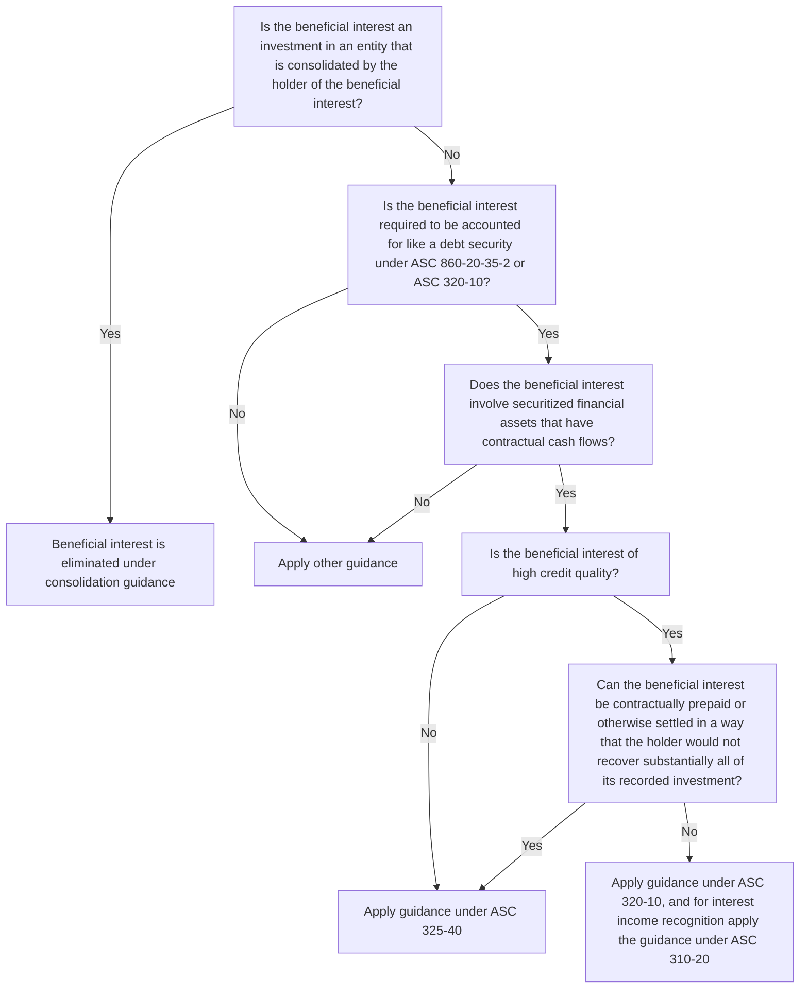
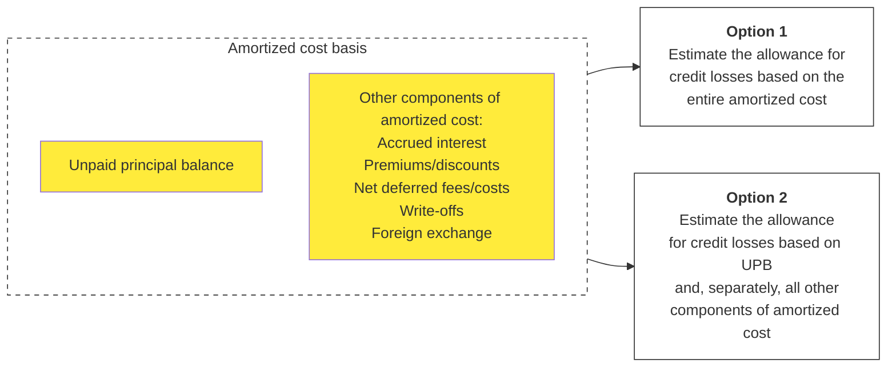
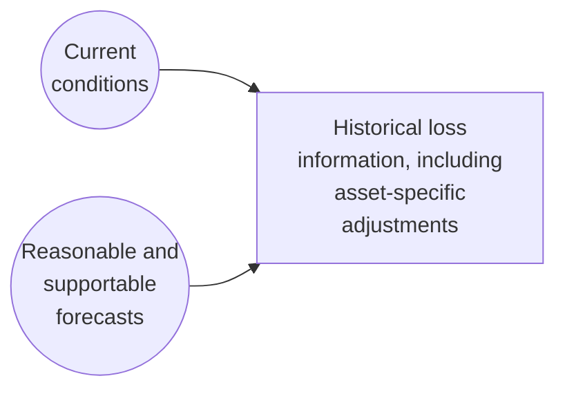
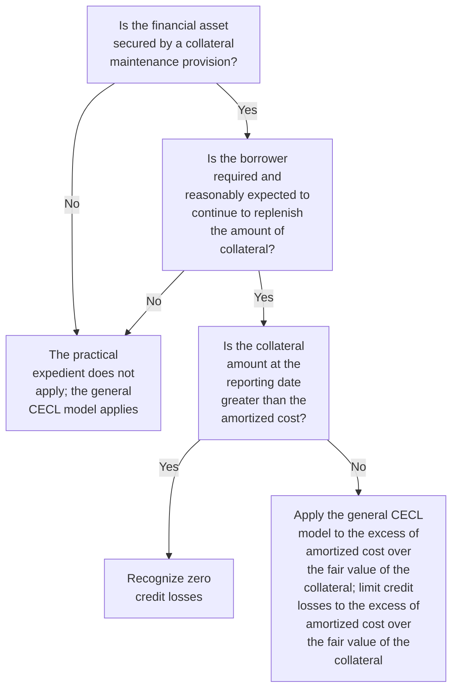
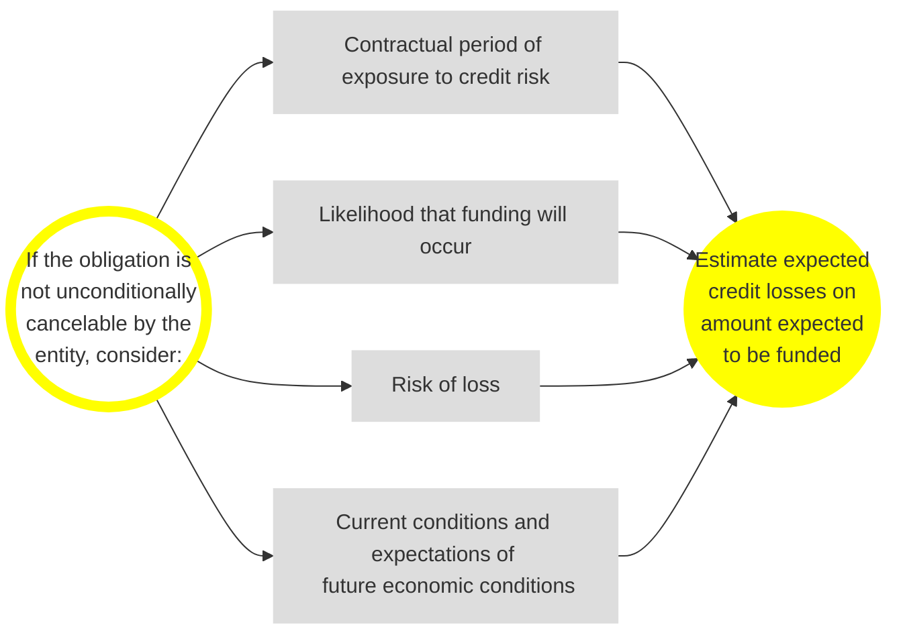
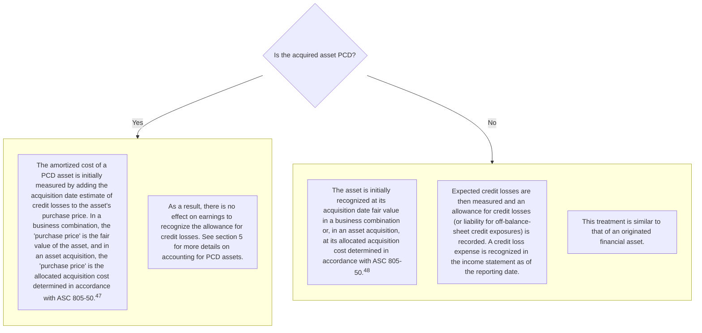
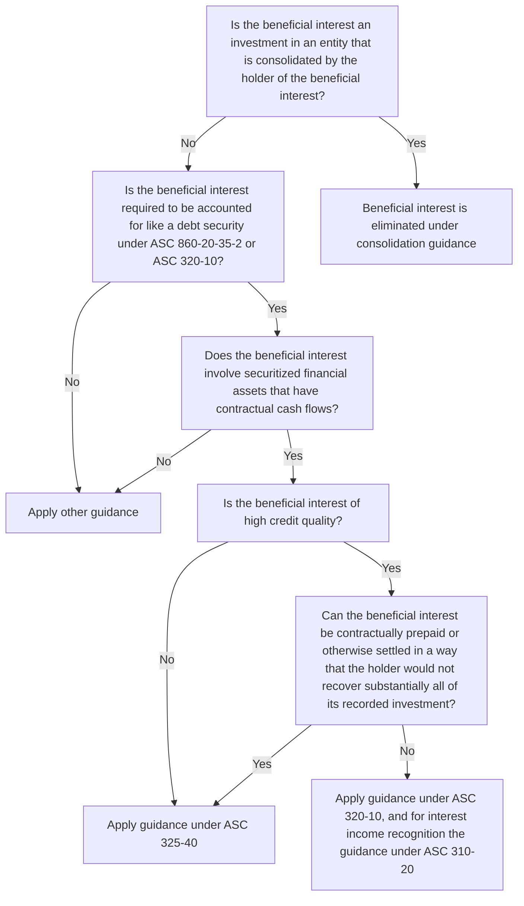
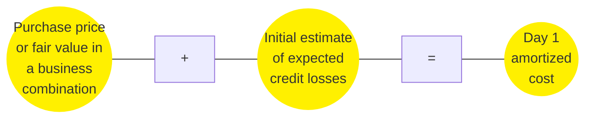
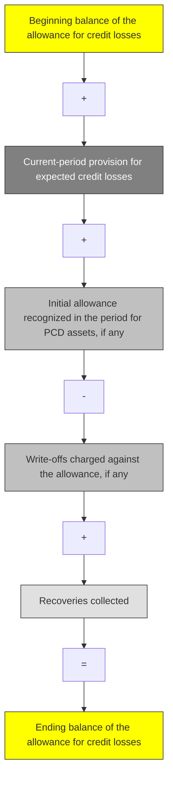

Financial reporting developments
*A comprehensive guide*

# Credit impairment under ASC 326

Recognizing credit losses on financial assets measured at amortized cost, AFS debt securities and certain beneficial interests

**September 2025**


The better the question.
The better the answer.
The better the world works.

EY
Shape the future with confidence

# To our clients and other friends

This Financial reporting developments (FRD) publication is designed to help you understand the requirements and financial reporting implications of the credit impairment guidance that is codified in Accounting Standards Codification (ASC or Codification) 326, *Financial Instruments — Credit Losses*.

This FRD addresses the guidance on the following topics:

*   The current expected credit loss (CECL) impairment model (ASC 326-20) for financial assets measured at amortized cost
*   The available-for-sale (AFS) debt security impairment model (ASC 326-30)
*   The initial recognition of purchased financial assets with credit deterioration, commonly referred to as purchased credit deteriorated (PCD) assets
*   The accounting for beneficial interests in securitized financial assets in the scope of ASC 325-40, *Investments — Other — Beneficial Interests in Securitized Financial Assets*

ASC 326-20's CECL impairment model requires an estimate of expected credit losses, measured over the contractual life of an instrument, that considers forecasts of future economic conditions in addition to information about past events and current conditions. The standard provides entities with significant flexibility in how to pool financial assets with similar risk characteristics, determine the contractual term and obtain and adjust the relevant historical loss information that serves as the starting point for developing the estimate of expected lifetime credit losses. As a result, significant judgment is required when applying the guidance.

Our FRD includes excerpts from and references to the Codification, interpretive guidance and examples. It is intended to help you understand the financial reporting issues associated with credit losses on financial instruments.

This publication reflects standard setting and discussions at FASB meetings, issues discussed by the Transition Resource Group for Credit Losses (TRG) and regulatory developments through September 2025. It has been updated to reflect the recent issuance of Accounting Standards Update (ASU) 2025-05, *Financial Instruments — Credit Losses (Topic 326), Measurement of Credit Losses for Accounts Receivable and Contract Assets*, and to clarify some of our interpretative guidance.

Refer to Appendix E for more details on significant updates to this publication.

The views that we express in this publication may continue to evolve as application issues are identified for new and emerging transactions and discussed among stakeholders.

Ernst & Young LLP

September 2025

# Contents

# 1 Overview and scope (updated September 2025) .......................................................... 1
## 1.1 The current expected credit loss impairment model (ASC 326-20) ........................................... 3
### 1.1.1 Financial assets measured at amortized cost .................................................................. 4
### 1.1.2 Net investments in leases .............................................................................................. 6
### 1.1.3 Off-balance-sheet credit exposures not accounted for as insurance ................................. 6
### 1.1.4 Items excluded from the scope of the model ................................................................... 7
## 1.2 The AFS debt security impairment model (ASC 326-30)........................................................... 9
## 1.3 The model for certain beneficial interests (ASC 325-40) .......................................................... 9
## 1.4 Purchased financial assets with credit deterioration (updated September 2025) ..................... 10
# 2 The current expected credit loss model..................................................................... 12
## 2.1 Objective............................................................................................................................. 12
### 2.1.1 Scope of the CECL model............................................................................................. 14
### 2.1.2 Methods available to estimate expected credit losses (updated July 2024)..................... 14
## 2.2 Based on an asset’s amortized cost (updated July 2024) ...................................................... 17
## 2.3 Reflect the risk of loss.......................................................................................................... 24
### 2.3.1 Level of assessment — unit of measurement ................................................................. 25
#### 2.3.1.1 Segmentation of financial assets ........................................................................ 26
#### 2.3.1.2 Relationship among estimation of expected credit losses, credit risk management and credit quality disclosures ......................................................... 29
#### 2.3.1.3 Reassessing the level of aggregation .................................................................. 30
### 2.3.2 Reflect the risk of loss, even when that risk is remote.................................................... 31
#### 2.3.2.1 Assessing the risk of loss to be zero .................................................................... 31
#### 2.3.2.2 Sovereign debt with zero expectation of nonpayment upon default...................... 32
#### 2.3.2.3 Considerations for agency securities................................................................... 33
#### 2.3.2.4 Collateralized financial assets............................................................................. 35
## 2.4 Reflect losses over an asset’s contractual life (updated July 2024)........................................ 36
### 2.4.1 Prepayments .............................................................................................................. 41
### 2.4.2 Extensions, renewals and modifications (updated July 2024) ........................................ 43
#### 2.4.2.1 Extensions and renewal terms at contract origination.......................................... 43
#### 2.4.2.2 Extensions, renewals and other modifications subsequent to contract origination ........................................................................................... 46
#### 2.4.2.3 Modifications made to borrowers experiencing financial difficulty ........................ 46
## 2.5 Consider available relevant information................................................................................ 47
### 2.5.1 Obtaining relevant historical loss information ............................................................... 49
### 2.5.2 Adjustments to historical loss information .................................................................... 51
#### 2.5.2.1 Adjustments for asset-specific factors and current economic conditions .............. 52
#### 2.5.2.2 Reasonable and supportable forecasts of future economic conditions .................. 53
##### 2.5.2.2.1 Quantifying the effect of the reasonable and supportable forecast of future economic conditions........................................................ 55
#### 2.5.2.3 Reverting to historical loss beyond the forecast period........................................ 58
##### 2.5.2.3.1 Using historical losses in the reversion period............................................. 59
##### 2.5.2.3.2 Reversion method..................................................................................... 60


Financial reporting developments Credit impairment under ASC 326 | i

Contents


2.6 Credit enhancements................................................................................................................................ 66
- 2.6.1 Freestanding credit insurance (updated July 2024) ................................................................... 69
2.7 Measurement considerations for financial assets secured by collateral (updated July 2024)................................................................................................................................ 70
- 2.7.1 Measuring expected credit losses when foreclosure is probable ........................................... 71
- 2.7.2 Practical expedients for financial assets secured by collateral................................................. 72
    - 2.7.2.1 Collateral-dependent financial assets when repayment is expected to be provided through the operation or sale of the collateral .................................... 72
    - 2.7.2.2 Financial assets with collateral maintenance provisions ................................................. 77
    - 2.7.2.3 Banking regulatory guidance on collateral-dependent financial assets (added September 2025).......................................................................................... 82
2.8 Write-offs and recoveries......................................................................................................................... 82
- 2.8.1 Write-offs ................................................................................................................................... 82
- 2.8.2 Recoveries.................................................................................................................................. 83
2.9 Interest income ....................................................................................................................................... 86
- 2.9.1 Additional interest income considerations ............................................................................... 87
    - 2.9.1.1 Interest income recognition when a discounted cash flow method is used to measure the allowance....................................................................................... 87
    - 2.9.1.2 Effect of prepayments...................................................................................................... 87
- 2.9.2 Nonaccrual policies .................................................................................................................... 88
    - 2.9.2.1 Effect of nonaccrual on write-offs ................................................................................... 88
    - 2.9.2.2 Banking regulatory guidance on interest income on nonaccrual loans (added September 2025) ................................................................................................ 89
2.10 Foreign currency considerations ............................................................................................................. 89
2.11 Other considerations ............................................................................................................................... 91
- 2.11.1 Accounts receivable and other short-term financial assets ..................................................... 91
- 2.11.2 Receivables resulting from the application of ASC 606, including contract assets (updated September 2025) ........................................................................................................ 92
    - 2.11.2.1 Examples.......................................................................................................................... 94
        - 2.11.2.1.1 Aging method ................................................................................................... 94
        - 2.11.2.1.2 Loss rate method .............................................................................................. 96
    - 2.11.2.2 Practical expedient and accounting policy election for current receivables and current contract assets (added September 2025) ................................... 97
        - 2.11.2.2.1 ASU 2025-05 examples (added September 2025).......................................... 100
        - 2.11.2.2.2 ASU 2025-05 effective date, transition and disclosures (added September 2025) .................................................................................... 105
- 2.11.3 Leases....................................................................................................................................... 106
- 2.11.4 Guarantees............................................................................................................................... 110
    - 2.11.4.1 Initial measurement ...................................................................................................... 113
    - 2.11.4.2 Subsequent measurement............................................................................................. 115
- 2.11.5 Off-balance-sheet commitments ............................................................................................ 117
    - 2.11.5.1 Application of the CECL model to unconditionally cancelable instruments ............. 119
- 2.11.6 Considerations using a DCF model.......................................................................................... 119
- 2.11.7 Considerations for variable-rate instruments ........................................................................ 122
- 2.11.8 Transfers to held to maturity and held for investment .......................................................... 123
- 2.11.9 Considerations for insurance entities...................................................................................... 125
- 2.11.10 Purchased assets (updated September 2025) ........................................................................ 130
- 2.11.11 Subsequent events................................................................................................................... 133


Financial reporting developments Credit impairment under ASC 326 | ii

Contents


# 3 AFS debt security impairment model....................................................................... 136
## 3.1 Overview ...........................................................................................................................136
## 3.2 Determining whether an AFS debt security is impaired.........................................................138
### 3.2.1 Is fair value less than amortized cost? ........................................................................138
## 3.3 Impairment when an entity intends to sell an AFS debt security or more likely than not will be required to sell an AFS debt security............................................................139
### 3.3.1 Does the entity intend to sell the security? .................................................................140
### 3.3.2 Is it more likely than not that the entity will be required to sell the security before recovery? ...................................................................................................... 141
#### 3.3.2.1 Sales after the balance sheet date ....................................................................143
#### 3.3.2.2 Third-party management of investment portfolio ..............................................143
### 3.3.3 Accounting after a write-down resulting from a decision or requirement to sell.............144
## 3.4 Determining whether a credit loss has occurred...................................................................146
### 3.4.1 Is a portion of the unrealized loss a result of a credit loss?...........................................147
### 3.4.2 Measuring the allowance for credit losses...................................................................149
#### 3.4.2.1 Developing the estimate of present value of expected cash flows.......................150
#### 3.4.2.2 Single best estimate versus probability-weighted estimate.................................153
#### 3.4.2.3 Implications of the ‘fair value floor’ ...................................................................156
### 3.4.3 Determining and measuring credit loss associated with variable-rate debt securities.....157
## 3.5 Accounting for an AFS debt security after a credit loss impairment.......................................160
### 3.5.1 Write-offs and subsequent recoveries.........................................................................163
## 3.6 Foreign currency considerations.........................................................................................164
## 3.7 Interest income..................................................................................................................167
## 3.8 Transfers from HTM to AFS................................................................................................167
## 3.9 Comparison of AFS securities and HTM securities ................................................................169

# 4 Accounting for certain beneficial interests in securitized financial assets .................. 170
## 4.1 Scope................................................................................................................................170
### 4.1.1 High credit quality .....................................................................................................173
### 4.1.2 Recoverability of investor’s recorded investment ........................................................173
### 4.1.3 Beneficial interests in equity form ..............................................................................174
### 4.1.4 Applicability of ASC 325-40 to trading securities ........................................................175
## 4.2 Initial measurement ...........................................................................................................176
### 4.2.1 Determining whether to recognize an allowance upon initial recognition ......................176
#### 4.2.1.1 Determining whether there is a significant difference between contractual and expected cash flows.................................................................177
#### 4.2.1.2 Calculating the gross-up upon initial recognition................................................179
### 4.2.2 Determining the accretable yield................................................................................180
## 4.3 Subsequent measurement (updated September 2025) ........................................................182
### 4.3.1 Accounting for changes in expected cash flows...........................................................184
#### 4.3.1.1 Subsequent measurement of the allowance for credit losses..............................186
#### 4.3.1.2 Adjusting the accretable yield rate....................................................................188
#### 4.3.1.3 Changes in cash flows solely due to variable interest rates.................................190
#### 4.3.1.4 Decision tree: Accounting for changes in expected cash flows on a beneficial interest in the scope of ASC 325-40 classified as HTM .......................191
#### 4.3.1.5 Decision tree: Accounting for changes in expected cash flows on a beneficial interest classified as AFS...................................................................192


Financial reporting developments Credit impairment under ASC 326 | iii

Contents


4.3.2 Other interest income recognition considerations ....................................................... 193
> 4.3.2.1 Nonaccrual of interest...................................................................................... 193
4.3.3 Write-offs and recoveries........................................................................................... 193
# 5 Financial assets purchased with credit deterioration (updated September 2025) ....... 194
## 5.1 Overview ........................................................................................................................... 194
## 5.2 Scope................................................................................................................................ 195
### 5.2.1 Determining whether CECL assets are PCD................................................................. 195
> 5.2.1.1 Grouping assets under the CECL model to determine whether they are PCD assets ................................................................................................. 198
> 5.2.1.2 Determining whether assets under the CECL model have experienced more-than-insignificant deterioration in credit quality (updated July 2024) ........ 199
### 5.2.2 Determining whether AFS debt securities are PCD assets ............................................ 202
## 5.3 Initial measurement for PCD assets..................................................................................... 203
### 5.3.1 Unit of measurement for estimating the allowance for assets subject to the CECL model ........................................................................................................ 203
### 5.3.2 Estimating the initial allowance for credit losses and applying the PCD gross-up ........... 205
### 5.3.3 Allocating noncredit discounts or premiums to individual assets .................................. 212
### 5.3.4 Applying the PCD approach to AFS debt securities ...................................................... 213
### 5.3.5 The interaction of ASC 325-40 and PCD accounting (added July 2024) ....................... 214
## 5.4 Subsequent measurement considerations ........................................................................... 215
### 5.4.1 Subsequent measurement of PCD assets under the CECL model.................................. 215
### 5.4.2 Subsequent measurement of PCD assets under the AFS debt security impairment model..................................................................................................... 217
### 5.4.3 Interest income recognition on PCD assets ................................................................. 217
### 5.4.4 Considerations for entities that elected to maintain existing pools of PCI assets upon adoption of ASU 2016-13 (added July 2024)........................................... 218
# 6 Presentation and disclosure ................................................................................... 220
## 6.1 Overview ........................................................................................................................... 220
## 6.2 Presentation...................................................................................................................... 220
### 6.2.1 Presentation of financial assets measured at amortized cost ....................................... 220
> 6.2.1.1 Off-balance-sheet exposures ............................................................................ 221
### 6.2.2 Presentation of AFS securities ................................................................................... 221
### 6.2.3 Presenting changes attributable to the passage of time when using a DCF approach..... 222
### 6.2.4 Presentation of subsequent changes in fair value of collateral of collateral-dependent assets ....................................................................................... 224
### 6.2.5 Presentation requirements at a glance ....................................................................... 224
## 6.3 Disclosures........................................................................................................................ 225
### 6.3.1 Disclosures for financial assets measured at amortized cost ........................................ 225
> 6.3.1.1 Accrued interest .............................................................................................. 229
> 6.3.1.2 Credit quality information (updated July 2024) ................................................. 230
>> 6.3.1.2.1 Vintage disclosures (PBEs only) ............................................................... 232
> 6.3.1.3 Allowance for credit losses and management’s estimation process .................... 235
>> 6.3.1.3.1 Rollforward of the allowance for credit losses (updated September 2025) .. 236
> 6.3.1.4 Past due and nonaccrual assets........................................................................ 237
> 6.3.1.5 Collateral-dependent financial assets ................................................................ 240
> 6.3.1.6 Off-balance-sheet credit exposures ................................................................... 240


Financial reporting developments Credit impairment under ASC 326 | iv

Contents


6.3.1.7 Receivables resulting from the application of ASC 606, including contract assets (updated September 2025) ......................................................241
6.3.2 Disclosures for AFS debt securities.............................................................................241
6.3.2.1 AFS debt securities in unrealized loss positions without an allowance for credit losses................................................................................243
6.3.2.2 Allowance for credit losses disclosures (updated September 2025) ...................246
6.3.3 Additional disclosures for PCD assets (updated September 2025) ............................... 250
6.3.4 Disclosures for modifications made to borrowers experiencing financial difficulty (updated July 2024) ...................................................................................252
# A Index of ASC references in this publication...............................................................A-1
# B Abbreviations used in this publication ...................................................................... B-1
# C Index of Q&As......................................................................................................... C-1
1. Overview and scope (updated September 2025) ..................................................................C-1
2. The current expected credit loss model ................................................................................C-1
3. AFS debt security impairment model....................................................................................C-3
4. Accounting for certain beneficial interests in securitized financial assets................................C-3
5. Financial assets purchased with credit deterioration (updated September 2025)....................C-4
6. Presentation and disclosure ................................................................................................C-4
# D TRG and FASB discussions and references in this publication ....................................D-1
# E Summary of important changes ............................................................................... E-1


Financial reporting developments Credit impairment under ASC 326 | v

Contents


> Notice to readers:
>
> This publication includes excerpts from and references to the Financial Accounting Standards Board (FASB or Board) Accounting Standards Codification (Codification or ASC). The Codification uses a hierarchy that includes Topics, Subtopics, Sections and Paragraphs. Each Topic includes an Overall Subtopic that generally includes pervasive guidance for the topic and additional Subtopics, as needed, with incremental or unique guidance. Each Subtopic includes Sections that in turn include numbered Paragraphs. Thus, a Codification reference includes the Topic (XXX), Subtopic (YY), Section (ZZ) and Paragraph (PP).
>
> Throughout this publication references to guidance in the codification are shown using these reference numbers. References are also made to certain pre-codification standards (and specific sections or paragraphs of pre-Codification standards) in situations in which the content being discussed is excluded from the Codification.
>
> This publication has been carefully prepared but it necessarily contains information in summary form and is therefore intended for general guidance only; it is not intended to be a substitute for detailed research or the exercise of professional judgment. The information presented in this publication should not be construed as legal, tax, accounting, or any other professional advice or service. Ernst & Young LLP can accept no responsibility for loss occasioned to any person acting or refraining from action as a result of any material in this publication. You should consult with Ernst & Young LLP or other professional advisors familiar with your particular factual situation for advice concerning specific audit, tax or other matters before making any decisions.

Portions of FASB publications reprinted with permission. Copyright Financial Accounting Standards Board, 801 Main Avenue, P.O. Box 5116, Norwalk, CT 06856-5116, USA. Portions of AICPA Statements of Position, Technical Practice Aids and other AICPA publications reprinted with permission. Copyright American Institute of Certified Public Accountants, 1345 Avenue of the Americas, 27th Floor, New York, NY 10105, USA. Copies of complete documents are available from the FASB and the AICPA.


Financial reporting developments Credit impairment under ASC 326 | vi

# 1 Overview and scope (updated September 2025)

ASC 326, *Financial Instruments — Credit Losses*, provides guidance on the accounting for credit losses for most financial assets and certain other instruments that are not measured at fair value through net income.

> **Excerpt from Accounting Standards Codification**
> **Financial Instruments — Credit Losses — Overall**
>
> **Overview and Background**
>
> **326-10-05-1**
> This Topic provides guidance on how an entity should measure credit losses on financial instruments.
>
> **326-10-05-2**
> Topic 326 includes the following Subtopics:
>
> a. Overall
>
> b. Financial Instruments — Credit Losses — Measured at Amortized Cost
>
> c. Financial Instruments — Credit Losses — Available-for-Sale Debt Securities
>
> **Scope and Scope Exceptions**
>
> ***Entities***
>
> **326-10-15-1**
> The guidance in this Subtopic applies to all entities.

ASC 326 applies to all entities and provides guidance on the following topics:

*   The CECL impairment model (ASC 326-20) for financial assets measured at amortized cost, net investments in leases, off-balance-sheet credit exposures not accounted for as insurance, reinsurance recoverables that result from insurance transactions within the scope of ASC 944 and contract assets arising from transactions accounted for under ASC 606.
*   The AFS debt security impairment model (ASC 326-30)
*   The initial recognition of purchased financial assets with credit deterioration, commonly referred to as PCD assets
*   The impairment of beneficial interests in securitized financial assets in the scope of ASC 325-40


Financial reporting developments Credit impairment under ASC 326 | 1

1 Overview and scope (updated September 2025)


The table below summarizes the impairment models addressed by the guidance, examples of the instruments affected by the models and the core concepts of each model:

<table>
  <thead>
    <tr>
        <th></th>
        <th>Financial assets measured at amortized cost</th>
        <th>AFS debt securities</th>
        <th>Beneficial interests in the scope of ASC 325-40</th>
    </tr>
  </thead>
  <tbody>
    <tr>
        <td>Examples of affected instruments</td>
        <td>Accounts receivable, held-to-maturity (HTM) debt securities, financing receivables and net investments in leases (i.e., for a sales-type lease, the lease receivable and the unguaranteed residual asset; for a direct finance lease, the lease receivable and the unguaranteed residual asset, less any deferred selling profit)</td>
        <td>AFS debt securities</td>
        <td>Residual interests and other subordinated tranches of securitizations</td>
    </tr>
    <tr>
        <td>Impairment model to be applied</td>
        <td>Current estimate of expected lifetime credit losses (CECL) model in ASC 326-20</td>
        <td>AFS debt security model in ASC 326-30</td>
        <td>The CECL model for HTM securities (ASC 326-20) or the model for AFS debt securities (ASC 326-30)</td>
    </tr>
    <tr>
        <td>Core concepts</td>
        <td>* Record an allowance for credit losses<br/>- For instruments that have experienced more-than-insignificant credit deterioration since origination (PCD assets), record an allowance at acquisition but not a credit loss expense. Estimate losses using pool-based assumptions to capture the risk of loss, even if remote<br/>* Reflect losses over the contractual life of the asset<br/>* Consider available relevant information relating to past events, current conditions, and reasonable and supportable forecasts of future economic conditions</td>
        <td>* Record an allowance for credit losses<br/>- Record an allowance at acquisition (but not a credit loss expense) for PCD assets<br/>* Limit credit losses to the excess of amortized cost over fair value<br/>* Reduce the allowance for improvements in expected cash flows and reverse credit loss expense in the income statement</td>
        <td>* Record an allowance for credit losses<br/>- Record an allowance at acquisition or origination (but not a credit loss expense) for PCD assets, including those for which there is a significant difference between estimated and contractual cash flows<br/>* Recognize changes in expected credit losses (both positive (up to the amount of the allowance) and negative) in the allowance for credit losses</td>
    </tr>
  </tbody>
</table>

> ### How we see it
>
> Entities need to carefully consider which model applies for each financial asset. The models listed above and described throughout this publication require entities to apply different approaches to determine the amount of expected credit losses and how to record such losses. This is particularly true for HTM (ASC 326-20) and AFS (ASC 326-30) debt securities. For example, because of differences in the impairment models applied to HTM and AFS debt securities, it is possible that the amount of credit loss recognized for a security classified as AFS will differ from the amount recognized for the same security that is classified as HTM.


Financial reporting developments Credit impairment under ASC 326 | 2

1 Overview and scope (updated September 2025)


The guidance is complex, and the TRG the FASB formed has discussed a number of implementation issues raised by stakeholders. TRG members shared their views, which are non-authoritative guidance. Refer to Appendix D for a listing of relevant meetings held by the TRG and summaries of the issues discussed.

> ### 🖉 FASB update
>
> In June 2023, the FASB issued a proposed ASU that would expand the use of the gross-up approach in ASC 326 to all financial assets acquired in a business combination and those acquired in an asset acquisition or recognized through the consolidation of a variable interest entity that is not a business, if they meet certain seasoning criteria, with limited exceptions. The approach is currently applied only to purchased financial assets with credit deterioration. The proposal would be applied on a modified retrospective basis. See our To the Point publication, ***FASB proposes expanding the gross-up approach in ASC 326 to almost all acquired financial assets***, for more information.
>
> Refer to the FASB website for the Board's tentative decisions reached during redeliberations on this project, including the removal of non-PCD credit card receivables from the scope of the proposed amendments. The FASB directed the staff to draft a final ASU, which is expected to be issued in 2025.

## 1.1 The current expected credit loss impairment model (ASC 326-20)

The graphic below lists the instruments to which the CECL model applies.

<table>
  <thead>
    <tr>
        <th colspan="3">Current expected credit loss model</th>
        <th colspan="2"></th>
    </tr>
  </thead>
  <tbody>
    <tr>
        <td rowspan="7">All entities</td>
        <td>* Financial assets measured at amortized cost:</td>
        <td rowspan="7">**The model requires an allowance gross-up in the initial recognition of PCD assets**</td>
        <td colspan="2"></td>
    </tr>
    <tr>
        <td></td>
        <td>- Financing receivables (loans)</td>
        <td></td>
    </tr>
    <tr>
        <td></td>
        <td>- HTM debt securities</td>
        <td></td>
    </tr>
    <tr>
        <td></td>
        <td>- Trade receivables</td>
        <td></td>
    </tr>
    <tr>
        <td></td>
        <td>- Receivables that relate to repurchase and securities lending agreements</td>
        <td></td>
    </tr>
    <tr>
        <td></td>
        <td>* Net investment in leases recognized by a lessor</td>
        <td></td>
    </tr>
    <tr>
        <td></td>
        <td>* Off-balance-sheet credit exposures not accounted for as insurance</td>
        <td></td>
        <td colspan="2"></td>
    </tr>
    <tr>
        <td></td>
        <td>* Reinsurance recoverables</td>
        <td colspan="3"></td>
    </tr>
  </tbody>
</table>

ASC 326-20 requires consideration of a broad range of information to estimate expected credit losses over the lifetime of the asset. While ASC 326-20 does not define the term "expected credit loss," it says the allowance for expected credit losses should represent the portion of the amortized cost basis of a financial asset that an entity does not expect to collect. It also says the allowance is intended to result in the financial asset being reflected on the balance sheet at the "net amount expected to be collected." The standard also does not define what is meant by the phrase "net amount expected to be collected."


Financial reporting developments Credit impairment under ASC 326 | 3

1 Overview and scope (updated September 2025)


The following table lists key principles of the CECL model:

<table>
  <thead>
    <tr>
        <th></th>
        <th>Description</th>
    </tr>
  </thead>
  <tbody>
    <tr>
        <td>Based on an asset’s amortized cost</td>
        <td>The components of amortized cost include unpaid principal balance (UPB), accrued interest, unamortized discounts and premiums, foreign exchange adjustments, and fair value hedge accounting adjustments.<br/>The guidance requires the estimate to be based on a financial asset’s amortized cost. An entity is not permitted to avoid recording an allowance because a discount exists (i.e., the guidance prohibits “accrete to impair” policies where an entity would not record an allowance if the allowance amount is less than the discount).</td>
    </tr>
    <tr>
        <td>Reflect the risk of loss</td>
        <td>Assets should be evaluated collectively based on similar risk characteristics. The risk of loss, even if remote, should be captured.</td>
    </tr>
    <tr>
        <td>Reflect losses over an asset’s contractual life</td>
        <td>Contractual life should consider expected prepayments but should not consider expected extensions, renewals and modifications unless the lender has no control over whether a contractual extension option will be exercised by the borrower (i.e., the option is not unconditionally cancelable by the lender).</td>
    </tr>
    <tr>
        <td>Consider available relevant information</td>
        <td>Historical loss data should provide the basis for determining the allowance for credit losses. This data should be adjusted for asset-specific considerations, current economic conditions, and reasonable and supportable forecasts.</td>
    </tr>
  </tbody>
</table>

Refer to section 2, *The current expected credit loss model*, for detailed guidance on how to apply this model.

### 1.1.1 Financial assets measured at amortized cost

> **Excerpt from Accounting Standards Codification**
> **Master Glossary**
> **Financial asset**
> Cash, evidence of an ownership interest in an entity, or a contract that conveys to one entity a right to do either of the following:
>
> a. Receive cash or another financial instrument from a second entity
>
> b. Exchange other financial instruments on potentially favorable terms with the second entity.

The CECL model applies to all financial assets measured at amortized cost, including:

<table>
  <thead>
    <tr>
        <th>Type of instrument</th>
        <th>Considerations</th>
    </tr>
  </thead>
  <tbody>
    <tr>
        <td>Financing receivables</td>
        <td>Financing receivables, including loans, are financial assets that represent a contractual right to receive money on demand or on fixed and determinable dates. Financing receivables typically bear a stated rate of interest, but that’s not always the case. They can be collateralized or uncollateralized.</td>
    </tr>
    <tr>
        <td>HTM debt securities</td>
        <td>HTM debt securities are securities that the entity has the positive intent and ability to hold to maturity.</td>
    </tr>
    <tr>
        <td>Receivables that result from revenue transactions within the scope of ASC 606</td>
        <td>These are receivables from customers, including short-term trade receivables that result from the sale of goods and services. They include all amounts due, even if a third party will make payment on the customer’s behalf.</td>
    </tr>
    <tr>
        <td>Receivables that relate to repurchase agreements and securities lending agreements</td>
        <td>Amounts owed by counterparties on repurchase or securities lending arrangements are generally collateralized and may be eligible for the practical expedient described in section 2.</td>
    </tr>
  </tbody>
</table>

The CECL model also applies to certain financial assets not measured at amortized cost, such as receivables held by investment companies that are measured at net realizable value and reinsurance recoverables. The FASB clarified that all reinsurance receivables accounted for under ASC 944 are in the scope of ASC 326, including those measured on a discounted basis.


Financial reporting developments Credit impairment under ASC 326 | 4

1 Overview and scope (updated September 2025)


In addition, contract assets arising from transactions accounted for under ASC 606 are required to be assessed for impairment in accordance with ASC 326-20.<sup>1</sup> Contract assets represent an entity’s conditional right to consideration for goods or services it has provided if that right is conditioned on something other than the passage of time. For example, an entity may have a contract to deliver Products A and B to a customer that requires it to deliver both products before payment is due. In this case, the entity recognizes a contract asset when it delivers Product A because the payment is conditioned on the entity’s delivery of Product B.

**Question 1-1: Are regulatory assets of a power and utility entity in the scope of the CECL model?**

No. A power and utility entity with regulated operations may recognize regulatory assets for costs it incurred if those costs are deemed probable of being recovered from customers through future rate increases. Although regulatory assets are not explicitly excluded from the scope of the standard, they do not meet the definition of a financial asset or any of the other items included in the scope of the model.

**Question 1-2: Are cash equivalents in the scope of the CECL model?**

Yes. Cash equivalents that are measured at amortized cost are in the scope of the CECL model. Entities need to consider the nature and terms of these instruments when determining the approach to measuring expected credit losses. In some cases (e.g., a three-month US Treasury bill), entities may conclude that losses approximate zero.

**Question 1-3: Are loans held for sale in the scope of the CECL model?**

No. Loans held for sale are accounted for at the lower of amortized cost or fair value. Entities are not required to measure expected lifetime credit losses on these instruments because the recovery of the asset is expected to result from its sale, not from holding the asset and collecting contractual cash flows.

**Question 1-4: Are loans and receivables to equity method investees in the scope of the CECL model?**

Yes. When an entity makes an equity investment that is accounted for under the equity method of accounting, the investor may provide other financial support to the investee, such as loans or an investment in debt securities of the investee. When the entity provides a loan to the investee or holds an investment in a debt security of the investee that is classified as HTM, the entity recognizes an allowance for credit losses in accordance with ASC 326-20. An entity’s share of investee losses that exceed the carrying amount of the equity method investment may need to be recorded (by reducing the cost basis of the loan or HTM debt security) after the carrying amount of the equity method investment has been reduced to zero.

**Question 1-5: Are tax receivables from taxing authorities in the scope of the CECL model?**

Generally, no. Tax receivables and other tax-related assets due from taxing authorities are generally not in the scope of the CECL model because they do not meet the definition of a financial asset (i.e., they generally do not represent a contractual obligation on the part of the taxing authority).

**Question 1-6: Are employee forgivable loans in the scope of the CECL model?**

Possibly. Employee forgivable loans are in the scope of the CECL model if they meet the definition of a financial asset (i.e., the employer has the right to receive payment for the loan from the employee, including in circumstances where employment is terminated). However, an employer would not include in its estimate for credit losses amounts it expects to forgive when employees meet the conditions for forgiveness (e.g., continued employment over a specified time period). The employer would only include amounts it does not expect to collect due to credit (e.g., uncollectible amounts from a terminated employee who defaults on the loan).

***

<sup>1</sup> As stated in ASC 606-10-45-3.


Financial reporting developments Credit impairment under ASC 326 | 5

1 Overview and scope (updated September 2025)


### 1.1.2 Net investments in leases

The CECL model also applies to a lessor’s net investment in sales-type and direct financing leases. Generally, this consists of the lease receivable (the total lease payments discounted using the rate implicit in the lease and any guaranteed residual asset) and any unguaranteed residual asset (the lessor’s right to the expected unguaranteed value of the leased asset at the end of the lease). For a direct financing lease, the lease receivable is recognized net of any deferred selling profit.

The lease receivable is generally considered a financial asset. While the unguaranteed residual asset does not meet the definition of a financial asset, the Board decided that requiring entities to separately assess the lease receivable (under the ASC 326-20 expected credit loss impairment model) and the unguaranteed residual asset (under ASC 360) would be overly complex and would provide little benefit to financial statement users. Therefore, the entire net investment in the lease is measured for credit losses under ASC 326.

### 1.1.3 Off-balance-sheet credit exposures not accounted for as insurance

ASC 326-20 requires entities to measure credit losses using the CECL model for off-balance-sheet credit exposures including credit exposures on off-balance-sheet loan commitments, standby letters of credit, financial guarantees not accounted for as insurance and other similar instruments. However, ASC 326-20 does not apply to any instruments in the scope of ASC 815. Further, an entity is precluded from estimating expected credit losses when its credit exposure is unconditionally cancelable (i.e., the lender can cancel the commitment at any time without cause).

***

**Question 1-7: Which guarantees that are in the scope of ASC 460 are also in the scope of the CECL model?**

ASC 460 establishes the accounting and disclosure requirements for guarantees. Guarantees in the scope of ASC 460 are generally recorded as a liability on the balance sheet initially at fair value. Certain guarantees in the scope of ASC 460 must be assessed for expected credit losses in accordance with ASC 326-20. ASC 326-20 includes in its scope off-balance-sheet credit exposures on guarantees not accounted for as insurance, including standby letters of credit. For a guarantee to be in the scope of ASC 326-20, the guarantee must relate to the nonpayment of a financial obligation. Examples of guarantees with credit exposures include:

*   A financial standby letter of credit, which is an irrevocable undertaking to guarantee payment of a specified financial obligation
*   A guarantee of the collection of scheduled contractual cash flows from a loan

The CECL model is intended to measure expected credit losses on credit exposures (i.e., the nonpayment of financial obligations), not exposures to other risks. Refer to section 2.11.4, *Guarantees*, for more information on how to apply the CECL model to guarantees in its scope.

***


Financial reporting developments Credit impairment under ASC 326 | 6

1 Overview and scope (updated September 2025)


## 1.1.4 Items excluded from the scope of the model

> ### Excerpt from Accounting Standards Codification
> **Financial Instruments — Credit Losses — Measured at Amortized Cost**
>
> ***Scope and Scope Exceptions***
>
> ***Instruments***
>
> **326-20-15-3**
>
> The guidance in this Subtopic does not apply to the following items:
>
> a. Financial assets measured at fair value through net income
>
> b. Available-for-sale debt securities
>
> c. Loans made to participants by defined contribution employee benefit plans
>
> d. Policy loan receivables of an insurance entity
>
> e. Promises to give (pledges receivable) of a not-for-profit entity
>
> f. Loans and receivables between entities under common control.
>
> g. Receivables arising from operating leases accounted for in accordance with Topic 842.

The following items generally carried at amortized cost are excluded from the scope of the CECL model:

<table>
  <thead>
    <tr>
        <th>Loans made to participants by defined contribution employee benefit plans</th>
        <th>These instruments are accounted for in accordance with ASC 962-310.</th>
    </tr>
    <tr>
        <th>Policy loan receivables of an insurance entity</th>
        <th>These instruments are accounted for in accordance with the guidance for insurance entities in ASC 944.</th>
    </tr>
    <tr>
        <th>Related party loans and receivables between entities under common control</th>
        <th>The Board decided to exclude related party loans and receivables between entities under common control from the scope of Subtopic 326-20. The Board noted in paragraph BC31 that this exclusion addresses concerns raised by the Private Company Council (PCC) that some related party loans may be viewed as a capital contribution rather than a loan to be repaid. At the June 2018 TRG meeting, the FASB staff said that in response to a technical inquiry it received, it concluded that the scope exception for loans and receivables between entities under common control applies to all of these assets, regardless of whether they are held by the parent or a subsidiary.</th>
    </tr>
    <tr>
        <th>Pledges receivable of a not-for-profit entity</th>
        <th>These instruments are accounted for in accordance with the guidance for not-for-profit entities in ASC 958.</th>
    </tr>
    <tr>
        <th>Operating lease receivables accounted for under ASC 842</th>
        <th>The Board decided that lessors should continue to apply the guidance in ASC 842 to determine the collectibility of operating lease receivables to reduce operational complexity.</th>
    </tr>
  </thead>
  <tbody>
    <tr>
        <td>Item excluded from scope</td>
        <td>Considerations</td>
    </tr>
  </tbody>
</table>

For items excluded from the scope of ASC 326-20, impairment is recognized and measured in accordance with other GAAP that may apply to the financial asset, or if no other GAAP applies, in accordance with ASC 450-20.


Financial reporting developments Credit impairment under ASC 326 | 7

1 Overview and scope (updated September 2025)


**Question 1-8 How should entities evaluate whether a loan or receivable is between entities under common control?**

The term common control appears in several topics in US GAAP, but it is not defined in the Master Glossary. The Emerging Issues Task Force (EITF) discussed how to determine whether separate entities are under common control in EITF Issue No. 02-5<sup>2</sup> but did not reach a consensus. Instead, the EITF summarized the criteria an SEC staff member cited in a 1997 speech.<sup>3</sup> Although EITF 02-5 was not codified, the guidance from this speech has been applied in practice by SEC registrants, and the SEC observer to the EITF noted that SEC registrants are expected to continue to apply that guidance. That is, common control exists between (or among) separate entities only in the following circumstances:

*   An individual or enterprise holds more than 50% of the voting ownership interest of each entity.
*   Immediate family members hold more than 50% of the voting ownership interest of each entity (with no evidence that those family members will vote their shares in any way other than in concert).
*   Immediate family members include a married couple and their children, but not the married couple’s grandchildren.
*   When entities are owned by various combinations of siblings and their children, careful consideration of the substance of the ownership and voting relationships is required.
*   A group of shareholders holds more than 50% of the voting ownership interest of each entity, and contemporaneous written evidence of an agreement to vote a majority of the entities’ shares in concert exists.

Additionally, when finalizing the 2015 amendments to ASC 810, the Board noted that its intent was for the term common control to include subsidiaries controlled (directly or indirectly) by a common parent, or a subsidiary and its parent.<sup>4</sup> Entities should consider these factors when determining whether a loan and/or receivable is between entities under common control and is therefore excluded from the scope of the CECL model.

**Question 1-9 Are loans with officers within the scope of the CECL model?**

Yes. Loans to officers are not loans between entities under common control and are in the scope of the CECL model. The scope exception in ASC 326 was intended to address concerns by the PCC that some related party loans may be viewed as capital contributions rather than loans to be repaid. A loan between an entity and an officer would not be viewed as a capital contribution, and the scope exception for loans between entities under common control does not apply. Loans to officers or other employees who hold significant equity interests in an entity may require additional consideration.

**Question 1-10 Are perpetual preferred securities (PPS) in the scope of ASC 326-20?**

No. Perpetual preferred securities may have either variable or fixed dividend rates, but they have no contractual maturity or redemption date. PPSs are often perceived in the marketplace as similar to debt securities because they frequently provide periodic cash flows in the form of dividends, contain call features, are rated similarly to debt securities and are priced like other long-term callable bonds. However, PPSs are classified as equity securities if they are not required to be redeemed by the issuing entity or are not redeemable at the option of the investor.

If PPSs are classified as equity securities, they are included in the scope of ASC 321<sup>5</sup> and are not in the scope of the credit impairment standard.

***

<sup>2</sup> EITF Issue 02-5, *Definition of “Common Control” in Relation to FASB Statement No. 141*.
<sup>3</sup> Comments by Donna L. Coallier, Professional Accounting Fellow, at the 1997 AICPA National Conference on SEC Developments.
<sup>4</sup> Paragraph BC69 of ASU 2015-02, *Consolidation (Topic 810), Amendments to the Consolidation Analysis*.
<sup>5</sup> ASC 321, *Investments — Equity Securities*.


Financial reporting developments Credit impairment under ASC 326 | 8

1 Overview and scope (updated September 2025)


## 1.2 The AFS debt security impairment model (ASC 326-30)

The CECL model (i.e., ASC 326-20) does not apply to AFS debt securities because they are carried at fair value. Instead, the impairment model in ASC 326-30 applies to debt securities classified as AFS. The model also applies to financial assets (except those that are in the scope of ASC 815-10) that can contractually be prepaid or otherwise settled in such a way that the holder would not recover substantially all of its recorded investment.

Entities are required to recognize an allowance for credit losses on AFS debt securities. Any improvements in estimated credit losses on AFS debt securities are recognized immediately in earnings. When the fair value of an AFS debt security is below its amortized cost basis, an impairment exists. The guidance requires entities to determine whether the impairment is a result of a credit loss or other factors. Management may not use the length of time a security has been in an unrealized loss position as a factor, either by itself or in combination with other factors, to conclude that a credit loss does not exist.

Refer to section 3, *AFS debt security impairment model*, for detailed guidance on how to apply this model.

## 1.3 The model for certain beneficial interests (ASC 325-40)

Beneficial interests are rights to receive all or portions of specified cash inflows from a trust or other entity. Beneficial interests may be created in connection with securitization transactions such as those involving collateralized debt obligations or collateralized loan obligations.

Beneficial interests subject to the guidance in ASC 325-40 can be either (1) beneficial interests retained in securitization transactions and accounted for as sales under ASC 860 or (2) purchased beneficial interests in securitized financial assets. Specifically, ASC 325-40 applies to certain beneficial interests that (1) are not of high credit quality or (2) expose the holder to the risk that they will not recover substantially all of the initial investment. It applies to beneficial interests classified as HTM, AFS and trading securities<sup>6</sup> and provides guidance on recognizing both interest income and credit losses for such investments.

<table>
  <thead>
    <tr>
        <th colspan="2">ASC 325-40 model</th>
    </tr>
  </thead>
  <tbody>
    <tr>
        <td>Initial recognition – not PCD</td>
        <td>Recognize at fair value upon transfer (if acquired in a transaction subject to ASC 860) or purchase price<br/>Recognize an allowance for credit losses through earnings determined using the ASC 326-20 (CECL) model for HTM securities or the ASC 326-30 model for AFS debt securities</td>
    </tr>
    <tr>
        <td>Initial recognition – PCD</td>
        <td>Establish an allowance for estimated credit losses at inception and add it to the purchase price or fair value (“gross up”) to arrive at the amortized cost of the instrument<br/>Recognize the difference between the new amortized cost and the par value of the instrument as the noncredit discount</td>
    </tr>
    <tr>
        <td>Subsequent recognition</td>
        <td>Amortize the noncredit discount into interest income over the contractual life of the beneficial interest<br/>Recognize all changes in expected cash flows due to credit as an adjustment to the allowance; if expectations of cash flows result in a reduction of the allowance to zero, prospectively adjust the effective interest rate for any additional improvements in expected cash flows</td>
    </tr>
  </tbody>
</table>

***

<sup>6</sup> Trading securities subject to ASC 325-40 include beneficial interests measured at fair value with changes recognized in earnings (except for certain hybrid beneficial interests measured that way because of the fair value option in ASC 815-15) held by an entity that is required to separately present as interest income the portion of the change in fair value related to interest income determined pursuant to ASC 325-40.


Financial reporting developments Credit impairment under ASC 326 | 9

1 Overview and scope (updated September 2025)


The following flowchart shows how to evaluate whether beneficial interests are in the scope of ASC 325-40:

### Illustration 1-1: Determining whether an asset is in the scope of ASC 325-40



ASC 325-40 provides that beneficial interests guaranteed by the US government, its agencies or other creditworthy guarantors and loans or securities that are sufficiently collateralized to make the possibility of credit loss remote are considered to be of high credit quality and should not be accounted for under ASC 325-40. Credit impairment for these instruments is measured under ASC 326-20 or ASC 326-30, depending on whether the instrument is classified as HTM or AFS, respectively.

Refer to section 4, *Accounting for certain beneficial interests in securitized financial assets*, for detailed guidance on how to apply this model.

## 1.4 Purchased financial assets with credit deterioration (updated September 2025)

ASC 326 provides a special Day 1 accounting model for PCD assets. Under this model, an entity is required to record as the amortized cost basis the sum of the purchase price and the entity’s estimate of credit losses as of the date of acquisition. Thereafter, PCD assets and non-PCD assets are accounted for consistently under the CECL impairment model, the AFS debt security impairment model or the model for certain beneficial interests, as applicable.


Financial reporting developments Credit impairment under ASC 326 | 10

1 Overview and scope (updated September 2025)


The table below lists key principles of this model:

<table>
  <thead>
    <tr>
        <th></th>
        <th>PCD assets</th>
    </tr>
  </thead>
  <tbody>
    <tr>
        <td>Definition and application of definition</td>
        <td>Purchased financial assets for which there has been a more-than-insignificant deterioration in credit quality since origination<br/>For AFS debt securities, determine whether there is an indicator of a credit loss<br/>For securities subject to ASC 325-40 that do not otherwise meet the definition of a PCD asset, determine whether there is a significant difference between expected and contractual cash flows and if so, apply the PCD gross-up approach</td>
    </tr>
    <tr>
        <td>Unit of assessment for scoping</td>
        <td>Individual instrument for AFS debt securities and pool level or individual instrument for assets subject to the CECL model</td>
    </tr>
    <tr>
        <td>Initial recognition</td>
        <td>Establish an allowance for credit losses at inception and add it to the purchase price to arrive at the amortized cost of the instrument<br/>Reflect the noncredit discount (the difference between the amortized cost and the par value of the instrument) in the effective interest rate (EIR)</td>
    </tr>
    <tr>
        <td>Subsequent recognition</td>
        <td>After initial recognition, treat PCD assets like all other assets and apply one of these impairment models:<br/>- ASC 326-20 (CECL model) for instruments measured at amortized cost<br/>- ASC 326-30 (AFS model) for debt securities classified as AFS<br/>- ASC 325-40 model for certain beneficial interests<br/>May elect to maintain purchased credit impaired (PCI) pools established under legacy guidance<br/>Amortize the noncredit discount into interest income over the life of the instrument</td>
    </tr>
  </tbody>
</table>

> ### How we see it
>
> We believe that the FASB intended to create a low threshold for applying the PCD asset guidance (see paragraph BC90 in the Background Information and Basis for Conclusions of ASU 2016-13 and section 5.2.1.2 for detail). This results in the Day 1 gross-up being applied to a much larger population of purchased financial assets than were accounted for under the legacy PCI guidance.
>
> The PCD guidance also applies to more loans and security types than the PCI guidance. For example, the guidance applies to purchased loans drawn under revolving credit agreements such as credit card and home equity loans that, at the date of acquisition, have experienced more-than-insignificant deterioration in credit quality since origination.

> ### FASB update
>
> In June 2023, the FASB issued a proposed ASU that would expand the use of the gross-up approach in ASC 326 to all financial assets acquired in a business combination and those acquired in an asset acquisition or recognized through the consolidation of a variable interest entity that is not a business, if they meet certain seasoning criteria, with limited exceptions. The approach is currently applied only to purchased financial assets with credit deterioration. The proposal would be applied on a modified retrospective basis. See our To the Point publication, **FASB proposes expanding the gross-up approach in ASC 326 to almost all acquired financial assets**, for more information.
>
> Refer to the **FASB website** for the Board's tentative decisions reached during redeliberations on this project, including the removal of non-PCD credit card receivables from the scope of the proposed amendments. The FASB directed the staff to draft a final ASU, which is expected to be issued in 2025.

Refer to section 5, *Financial assets purchased with credit deterioration*, for detailed guidance on how to apply this model.


Financial reporting developments Credit impairment under ASC 326 | 11

# 2 The current expected credit loss model

## 2.1 Objective

ASC 326-20 gives entities a significant amount of flexibility in how they estimate expected credit losses for all types of financial assets in its scope (e.g., short-term trade receivables, loans, HTM securities, net investments in leases). As a result, applying the standard requires a significant amount of judgment.

> ### Excerpt from Accounting Standards Codification
> **Financial Instruments — Credit Losses — Measured at Amortized Cost**
>
> **Initial Measurement**
>
> **Developing an Estimate of Expected Credit Losses**
>
> **326-20-30-1**
>
> The allowance for credit losses is a valuation account that is deducted from, or added to, the amortized cost basis of the financial asset(s) to present the net amount expected to be collected on the financial asset. Expected recoveries of amounts previously written off and expected to be written off shall be included in the valuation account and shall not exceed the aggregate of amounts previously written off and expected to be written off by an entity. At the reporting date, an entity shall record an allowance for credit losses on financial assets within the scope of this Subtopic. An entity shall report in net income (as a credit loss expense) the amount necessary to adjust the allowance for credit losses for management's current estimate of expected credit losses on financial asset(s).

The overarching principle of ASC 326-20 is that an entity will recognize an allowance for credit losses that results in the financial statements reflecting the net amount expected to be collected from the financial asset. The allowance is based on the asset's amortized cost. That is, it represents the portion of the amortized cost basis that an entity does not expect to collect due to credit over the asset's contractual life, considering past events, current conditions and reasonable and supportable forecasts of future economic conditions. Expected losses related to risks other than credit risk, such as operational risk, dispute risk or legal risk, should not be included in the allowance for credit losses.

Under the CECL model, the allowance for credit losses is measured and recorded upon the initial recognition of a financial asset, regardless of whether it is originated or purchased.

> ### How we see it
>
> Under the CECL model, the assumption is that all financial assets are exposed to credit losses that may occur over the course of their lives. There is no threshold for recognizing expected credit losses.
>
> Because an allowance is recorded at origination or purchase and a credit loss expense is recognized in net income in most cases, entities will experience income statement volatility in periods in which they originate more loans or receivables than usual or fewer loans or receivables than usual. Entities will also experience income statement volatility when they expect economic conditions to worsen or to improve significantly. It may be necessary for entities to enhance their financial statement disclosures and, for public companies, the management's discussion and analysis in Form 10-Q and/or 10-K, to help users understand why their credit loss expense is changing.


Financial reporting developments Credit impairment under ASC 326 | 12

2 The current expected credit loss model


The estimate of current expected credit losses should:

*   Be based on an asset's amortized cost
*   Reflect the risk of loss, even when that risk is remote, meaning that an estimate of zero credit loss would be appropriate only in limited circumstances
*   Reflect losses expected over the remaining contractual life of an asset, recognizing that voluntary prepayments reduce expected credit losses
*   Consider available relevant information about the collectibility of cash flows, including information about past events, current conditions, and reasonable and supportable forecasts of future economic conditions

The following illustration summarizes the objective of the CECL model and its core concepts:

<table>
  <thead>
    <tr>
        <th colspan="4">Objective</th>
    </tr>
    <tr>
        <th colspan="4">Recognize an allowance for expected credit losses that results in the financial statements reflecting the net amount expected to be collected from the financial asset</th>
    </tr>
    <tr>
        <th colspan="4">Core concepts</th>
    </tr>
  </thead>
  <tbody>
    <tr>
        <td>Based on<br/>an asset's<br/>amortized cost</td>
        <td>Reflect the risk of loss</td>
        <td>Reflect losses over an<br/>asset's contractual life</td>
        <td>Consider available<br/>relevant information</td>
    </tr>
  </tbody>
</table>

The standard requires entities to consider reasonable and supportable forecasts of future economic conditions in the estimate of expected credit losses. The standard also requires entities to revert to historical information when they can no longer reliably forecast future economic conditions. Both the reasonable and supportable forecast of future economic conditions and reversion periods are components of the overall CECL estimate and must be supported.

> **Overall CECL estimate**
>
> *   Entire CECL estimate must be reasonable and supportable, not just the period covered by the "reasonable and supportable" forecast
> *   Neither forecast length nor reversion method are accounting policy choices
>
> <table>
  <thead>
    <tr>
        <th>&gt; [thead] 'Reasonable and supportable'<br/>forecast period</th>
        <th>Reversion period</th>
    </tr>
  </thead>
  <tbody>
    <tr>
        <td>&gt; * Historical loss period<br/>* Current conditions<br/>* Forecasts of future economic<br/>conditions</td>
        <td>* Historical loss period<br/>* Limited adjustments<br/>* Reversion technique</td>
    </tr>
    <tr>
        <td>&gt;</td>
        <td></td>
    </tr>
  </tbody>
</table>

These concepts are explained further in the sections below.


Financial reporting developments Credit impairment under ASC 326 | 13

2 The current expected credit loss model


> ### How we see it
>
> While the standard requires entities to revert to historical information when they can no longer reliably forecast future economic conditions, we do not expect entities to do this for short-term receivables and contract assets. That is, we generally believe that entities will be able to forecast future economic conditions for the entire contractual life of a short-term receivable and will not need to revert to historical information.

## 2.1.1 Scope of the CECL model

The CECL model applies to financial assets measured at amortized cost. Examples include the following instruments:

<table>
  <thead>
    <tr>
        <th colspan="3">Current expected credit loss model</th>
        <th colspan="2"></th>
    </tr>
  </thead>
  <tbody>
    <tr>
        <td rowspan="8">**All entities**</td>
        <td>▶ Financial assets measured at amortized cost:</td>
        <td rowspan="8">**The model requires an allowance gross-up in the initial recognition of PCD assets**</td>
        <td colspan="2"></td>
    </tr>
    <tr>
        <td></td>
        <td>- Financing receivables (loans)</td>
        <td></td>
    </tr>
    <tr>
        <td></td>
        <td>- HTM debt securities</td>
        <td></td>
    </tr>
    <tr>
        <td></td>
        <td>- Trade receivables</td>
        <td></td>
    </tr>
    <tr>
        <td></td>
        <td>- Receivables that relate to repurchase and securities lending agreements</td>
        <td></td>
    </tr>
    <tr>
        <td>▶ Net investment in leases recognized by a lessor</td>
        <td></td>
        <td></td>
    </tr>
    <tr>
        <td>▶ Off-balance-sheet credit exposures not accounted for as insurance</td>
        <td></td>
        <td></td>
    </tr>
    <tr>
        <td>▶ Reinsurance recoverables</td>
        <td colspan="4"></td>
    </tr>
  </tbody>
</table>

## 2.1.2 Methods available to estimate expected credit losses (updated July 2024)

ASC 326-20 gives entities the flexibility to select an appropriate method to measure management’s estimate of expected credit losses. That is, entities are permitted to use estimation techniques that are practical and relevant to their circumstances, as long as they are applied consistently over time and aim to faithfully estimate expected credit losses using the concepts listed above.

However, the standard limits an entity’s flexibility in certain cases. For example, an entity is precluded from estimating expected credit losses when its credit exposure is unconditionally cancelable (i.e., can be canceled without cause by the lender, as described in more detail in section 1.1.3). In certain circumstances, entities may be required to measure credit losses using the fair value of collateral.

> **Excerpt from Accounting Standards Codification**
> **Financial Instruments — Credit Losses — Measured at Amortized Cost**
>
> **Initial Measurement**
>
> **Developing an Estimate of Expected Credit Losses**
>
> **326-20-30-3**
>
> The allowance for credit losses may be determined using various methods. For example, an entity may use discounted cash flow methods, loss-rate methods, roll-rate methods, probability-of-default methods, or methods that utilize an aging schedule. An entity is not required to utilize a discounted cash flow method to estimate expected credit losses. Similarly, an entity is not required to reconcile the estimation technique it uses with a discounted cash flow method.


Financial reporting developments Credit impairment under ASC 326 | 14

2 The current expected credit loss model


> **Implementation Guidance and Illustrations**
>
> **Implementation Guidance**
>
> **Developing an Estimate of Expected Credit Losses**
>
> **326-20-55-7**
>
> Because of the subjective nature of the estimate, this Subtopic does not require specific approaches when developing the estimate of expected credit losses. Rather, an entity should use judgment to develop estimation techniques that are applied consistently over time and should faithfully estimate the collectibility of the financial assets by applying the principles in this Subtopic. An entity should utilize estimation techniques that are practical and relevant to the circumstance. The method(s) used to estimate expected credit losses may vary on the basis of the type of financial asset, the entity’s ability to predict the timing of cash flows, and the information available to the entity.

The guidance lists, but does not define, several common credit loss methods that are acceptable (other methods may also be acceptable):

<table>
  <thead>
    <tr>
        <th>DCF methods</th>
        <th>Impairment is determined by comparing the asset's amortized cost to the present value of estimated future principal and interest cash flows. The FASB staff has clarified that if an entity intends to incorporate discounting into its credit loss estimate, it must discount all inputs to the estimate and the effect of discounting should be measured as of the reporting date.<sup>7</sup></th>
    </tr>
    <tr>
        <th>Loss-rate methods</th>
        <th>Impairment is calculated using an estimated loss rate and multiplying it by the asset's amortized cost at the balance sheet date</th>
    </tr>
    <tr>
        <th>Roll-rate methods</th>
        <th>Expected losses are projected using historical trends in credit quality indicators (e.g., delinquency, risk ratings)</th>
    </tr>
    <tr>
        <th>PD and LGD methods</th>
        <th>Impairment is calculated by multiplying the PD (probability the asset will default within a given timeframe) by the LGD (percentage of the asset not expected to be collected due to default)</th>
    </tr>
    <tr>
        <th>Methods that use an aging schedule</th>
        <th>Impairment is calculated based on how long a receivable has been outstanding (e.g., under 30 days, 30–60 days). This method is commonly used to estimate the allowance for bad debts on trade accounts receivable.</th>
    </tr>
  </thead>
  <tbody>
    <tr>
        <td>Approach</td>
        <td>Description</td>
    </tr>
  </tbody>
</table>

In assessing the appropriateness of using any of these methods or others for a specific asset or portfolio of assets, an entity should consider whether the model produces a result that faithfully reflects the net amount management expects to collect. Entities should not assume that each of the above models will be appropriate in a given situation. Entities may consider common allowance models used in the industry for similar assets. The availability of data required by the model is a key consideration.

Entities also need to have controls over model management to make sure the chosen models remain appropriate based on facts and circumstances. Management should evaluate whether the control environment, including governance and tone at the top, is adequate to support the formation and enforcement of sound judgments that will be necessary to execute control activities or determine whether methods and other judgments continue to be appropriate.

***

<sup>7</sup> 1 November 2018 TRG meeting. See meeting minutes.


Financial reporting developments Credit impairment under ASC 326 | 15

2 | The current expected credit loss model


## How we see it
While the guidance provides significant flexibility, an entity's chosen approach has to faithfully represent its estimate of expected credit losses based on its facts and circumstances.

The implementation guidance describes a number of the other judgments an entity may need to make when estimating expected credit losses.

> ### Excerpt from Accounting Standards Codification
> **Financial Instruments — Credit Losses — Measured at Amortized Cost**
>
> **Implementation Guidance and Illustrations**
>
> **Implementation Guidance**
>
> **Developing an Estimate of Expected Credit Losses**
>
> **326-20-55-6**
>
> Estimating expected credit losses is highly judgmental and generally will require an entity to make specific judgments. Those judgments may include any of the following:
>
> a. The definition of default for default-based statistics
>
> b. The approach to measuring the historical loss amount for loss-rate statistics, including whether the amount is simply based on the amortized cost amount written off and whether there should be adjustments to historical credit losses (if any) to reflect the entity's policies for recognizing accrued interest
>
> c. The approach to determine the appropriate historical period for estimating expected credit loss statistics
>
> d. The approach to adjusting historical credit loss information to reflect current conditions and reasonable and supportable forecasts that are different from conditions existing in the historical period
>
> e. The methods of utilizing historical experience
>
> f. The method of adjusting loss statistics for recoveries
>
> g. How expected prepayments affect the estimate of expected credit losses
>
> h. How the entity plans to revert to historical credit loss information for periods beyond which the entity is able to make or obtain reasonable and supportable forecasts of expected credit losses
>
> i. The assessment of whether a financial asset exhibits risk characteristics similar to other financial assets.

This list illustrates the highly subjective nature of the estimate. It is also important to remember that the list is not all inclusive, and management may need to make other key judgments based on the entity's facts and circumstances.

Entities need to consider each of the factors in ASC 326-20-55-6 individually and in conjunction with all of the estimation techniques and key assumptions that contribute to management's CECL estimate. That is, management must support its estimate of expected credit losses for each individual asset or pool of assets in its entirety.

The judgments listed above are discussed in detail in other sections of this publication.


Financial reporting developments Credit impairment under ASC 326 | 16

2 The current expected credit loss model


## 2.2 Based on an asset's amortized cost (updated July 2024)

### Core concepts

<table>
  <tbody>
    <tr>
        <td>Based on<br/>an asset's<br/>amortized cost</td>
        <td>Reflect the risk of loss</td>
        <td>Reflect losses over an<br/>asset's contractual life</td>
        <td>Consider available<br/>relevant information</td>
    </tr>
  </tbody>
</table>

The standard requires the allowance for expected credit losses to be based on the underlying financial instrument's amortized cost basis. That is, the allowance represents the portion of amortized cost that the entity does not expect to recover due to credit losses, and it is presented as an offset to the amortized cost basis (or as a separate liability in the case of off-balance-sheet credit exposures).

> **Excerpt from Accounting Standards Codification**
> **Financial Instruments — Credit Losses — Measured at Amortized Cost**
>
> **Master Glossary**
>
> **Amortized Cost Basis**
>
> The amortized cost basis is the amount at which a financing receivable or investment is originated or acquired, adjusted for applicable accrued interest, accretion, or amortization of premium, discount, and net deferred fees or costs, collection of cash, writeoffs, foreign exchange, and fair value hedge accounting adjustments.
>
> **Initial Measurement**
>
> **Developing an Estimate of Expected Credit Losses**
>
> **326-20-30-5**
>
> If an entity estimates expected credit losses using a method other than a discounted cash flow method described in paragraph 326-20-30-4, the allowance for credit losses shall reflect the entity's expected credit losses of the amortized cost basis of the financial asset(s) as of the reporting date. For example, if an entity uses a loss-rate method, the numerator would include the expected credit losses of the amortized cost basis (that is, amounts that are not expected to be collected in cash or other consideration, or recognized in income). In addition, when an entity expects to accrete a discount into interest income, the discount should not offset the entity's expectation of credit losses. An entity may develop its estimate of expected credit losses by measuring components of the amortized cost basis on a combined basis or by separately measuring the following components of the amortized cost basis, including all of the following:
>
> a. Amortized cost basis, excluding applicable accrued interest, premiums, discounts (including net deferred fees and costs), foreign exchange, and fair value hedge accounting adjustments (that is, the face amount or unpaid principal balance).
>
> b. Premiums or discounts, including net deferred fees and costs, foreign exchange, and fair value hedge accounting adjustments. See paragraph 815-25-35-10 for guidance on the treatment of a basis adjustment related to an existing portfolio layer method hedge.
>
> c. Applicable accrued interest. See paragraph 326-20-30-5A for guidance on excluding accrued interest from the calculation of the allowance for credit losses.


Financial reporting developments Credit impairment under ASC 326 | 17

2 The current expected credit loss model


> **326-20-30-5A**
>
> An entity may make an accounting policy election, at the class of financing receivable or the major security-type level, not to measure an allowance for credit losses for accrued interest receivables if the entity writes off the uncollectible accrued interest receivable balance in a timely manner. This accounting policy election should be considered separately from the accounting policy election in paragraph 326-20-35-8A. An entity may not analogize this guidance to components of amortized cost basis other than accrued interest.

The amortized cost basis of a financial asset contains various components that are described further below:

<table>
  <thead>
    <tr>
        <th>Unpaid principal balance</th>
        <th>Unpaid principal balance is the par or face amount of a financing receivable or debt security, adjusted for cash collections applied to principal.</th>
    </tr>
    <tr>
        <th>Accrued interest</th>
        <th>Accrued interest represents the interest on a financing receivable or debt security that has accumulated since the principal investment or since the previous coupon payment if there has been one already.<br/>Contractual interest expected to be earned in the future should not be considered part of the amortized cost balance.<br/>Many financial institutions report accrued interest separately from the related loan balance. As described further in section 6.2.1, this approach is acceptable under ASC 326-20.</th>
    </tr>
    <tr>
        <th>Premium or discount</th>
        <th>A premium represents the excess of the acquisition or origination price of a financing receivable or debt security over its face or par amount due at maturity. Premiums are generally amortized over time using the effective interest method.<br/>A discount represents the amount of the acquisition or origination price of a financing receivable or debt security below its face or par amount due at maturity. Discounts are generally accreted over time using the effective interest method.</th>
    </tr>
    <tr>
        <th>Deferred origination fees or costs</th>
        <th>These are fees and costs associated with originating loans.<br/>Origination fees include fees that are being charged to the borrower as prepaid interest or to reduce the loan's nominal interest rate. Origination fees may also include fees to reimburse the lender for origination activities and other fees charged to the borrower that relate directly to originating the loan.<br/>Deferred origination costs represent incremental direct costs of loan origination incurred in transactions with third parties for that loan and certain costs directly related to incremental activities performed by the lender in originating a loan. These activities include evaluating the prospective borrower's financial condition, evaluating and recording guarantees, and preparing and processing loan documents.</th>
    </tr>
    <tr>
        <th>Write-offs</th>
        <th>Write-offs represent the amount of a financial asset deemed uncollectible. Write-offs, therefore, reduce the amortized cost basis of a financial asset.</th>
    </tr>
    <tr>
        <th>Foreign exchange adjustment</th>
        <th>A foreign exchange adjustment reflects the effect on functional-currency-equivalent cash flows of changes in foreign currency exchange rates when a financial asset is denominated in a currency other than the entity's functional currency.</th>
    </tr>
    <tr>
        <th>Fair value hedge accounting adjustment</th>
        <th>A fair value hedge accounting adjustment is applied to the amortized cost of a hedged item and reflects the effect of applying fair value hedge accounting. The adjustment is driven by changes in the particular hedged risk, such as interest rate risk.</th>
    </tr>
  </thead>
  <tbody>
    <tr>
        <td>Component of amortized cost basis</td>
        <td>Definition</td>
    </tr>
  </tbody>
</table>


Financial reporting developments Credit impairment under ASC 326 | 18

2 The current expected credit loss model


The standard requires the allowance to reflect the expected credit losses inherent in an asset’s entire amortized cost basis, including each of the components described above. Entities should consider whether the components above are applicable to a specific asset (e.g., for receivables denominated in a foreign currency, foreign exchange adjustments must be considered in the allowance estimate). For short-term receivables and contract assets, the amortized cost will generally be the same as the carrying value of the asset, excluding the allowance for credit losses.

An entity may make an accounting policy election to exclude accrued interest from the measurement of the allowance for credit losses if the entity has a policy in place to reverse or write off accrued interest in a timely manner.

> ### How we see it
>
> Entities need to use judgment to determine what is considered timely. It may be appropriate to apply different thresholds for different classes of financing receivables or major security types, and entities need to consider the interaction of their write-off policies and the timing of their financial reporting.

Because entities take different approaches to tracking historical loss information, the standard permits an entity to develop an estimate of expected credit losses by measuring all components of the amortized cost separately or combined or by measuring accrued interest separately from UPB and all other components when a non-DCF approach is used, as highlighted in ASC 326-20-30-5 and illustrated below.

### Illustration 2-1: Basing the estimate of expected credit losses on an asset's amortized cost basis



Regardless of which method an entity uses to estimate expected credit losses, the entity needs to understand which of the above components of the amortized cost basis are considered in historical loss rates. An entity’s loss history could include only write-offs of the unpaid principal balance, or it could include all components of amortized cost (e.g., premiums, discounts, net deferred fees and costs). If only write-offs of the unpaid principal balance are considered in an entity’s loss history, adjustments need to be made to loss data to make sure all elements of amortized cost are considered in the allowance estimate (e.g., what amount of net deferred fees are unamortized when a credit loss is expected to occur).


Financial reporting developments Credit impairment under ASC 326 | 19

2 The current expected credit loss model


The requirement to consider all components of amortized cost may present the following challenges for certain institutions:

<table>
  <thead>
    <tr>
        <th>Accrued interest</th>
        <th>Entities that record expected credit losses on accrued interest through credit loss expense need to consider whether their historical data includes credit losses related to accrued interest. Entities may have a policy of reversing accrued interest through revenue rather than recording charge-offs of amortized cost and, as a result, may not maintain this data. In such cases, entities need to develop an approach to assess any accrued interest for expected credit losses, such that the balance sheet reflects the net amount they expect to collect for the related financial asset(s).</th>
    </tr>
    <tr>
        <th>Premium or discount</th>
        <th>When an entity assesses a financial asset for expected credit losses, it should consider whether any unamortized premium or discount would also be affected by an expectation of future defaults. However, the FASB agreed that an entity does not need to consider the timing of credit losses when determining the impact of premiums and discounts on the measurement of the allowance for credit losses.<sup>8</sup></th>
    </tr>
    <tr>
        <th>Fair value hedge accounting basis adjustments</th>
        <th>The interplay between fair value hedge accounting and the measurement of expected credit losses creates operational complexity in the case of a portfolio fair value hedge of interest rate risk. When hedging a portfolio of items (not using the portfolio layer method), an entity needs to allocate the hedge accounting adjustments to each item in the portfolio. This is necessary because a fair value hedge changes the amortized cost basis of items in the hedged portfolio, and the estimate of expected credit losses is based on an asset's amortized cost. All financial assets in the scope of the impairment model in ASC 326-20 will require the measurement of expected credit losses.<br/>For hedge accounting adjustments in a portfolio layer method hedge, the guidance in ASC 815-25-35-1(c) states that the gain or loss (that is, the change in fair value) on the hedged item attributable to the hedged risk should not adjust the carrying value of the individual beneficial interest or individual assets in or removed from the closed portfolio. Instead, the hedge accounting adjustment is maintained on a closed portfolio basis. Further, an entity is prohibited from considering this adjustment when measuring impairment or credit losses on the assets included in the closed portfolio. However, an entity may not apply this guidance by analogy to other components of the amortized cost basis. Refer to section 5.3.4A.2 of our FRD publication, *Derivatives and hedging*, for further details.</th>
    </tr>
  </thead>
  <tbody>
    <tr>
        <td>Component of amortized cost</td>
        <td>Considerations</td>
    </tr>
  </tbody>
</table>

The following illustrates one way an entity may separately assess components of the amortized cost basis if it decides to consider the timing of the loss in its estimate. The FASB agreed that entities do not need to consider the timing of a loss when estimating expected credit losses.


***
<sup>8</sup> 29 August 2018 FASB meeting. See meeting minutes.

Financial reporting developments Credit impairment under ASC 326 | 20

2 The current expected credit loss model


> **Illustration 2-2: Estimate expected credit losses by measuring components of the amortized cost separately**
>
> At 31 December 20X0, Company A originates a pool of loans with the following characteristics:
>
> * Par value (or unpaid principal balance): $5,000,000
> * Contractual interest rate: 10%
> * Net deferred fees: $100,000
> * Maturity: Five years
>
> Company A elects to develop its estimate of expected credit losses by considering the components of amortized cost separately and uses a probability of default x loss given default (PDxLGD) approach. Based on past experience with similar loans and considering current conditions and reasonable and supportable forecasts of future economic conditions, Company A determines the following:
>
> * The cumulative five-year PD is 2%.
> * The LGD is 35% of the original principal amount.
> * Write-offs due to credit events of similar loans generally occur between years two and three when 55% of the original net fees have been accreted (i.e., when 45% of the net deferred fees remain on the balance sheet).
>
> Company A does not expect the timing of expected credit losses to differ from the timing of historical losses, so it does not adjust its historical accretion rates.
>
> As of 31 December, 20X0, the estimate of expected credit losses is measured as follows:
>
> <table>
  <thead>
    <tr>
        <th>&gt;</th>
        <th>Estimate of expected credit losses</th>
    </tr>
  </thead>
  <tbody>
    <tr>
        <td>&gt; Expected losses on principal amount ($5,000,000 x 2% x 35%)</td>
        <td>$ 35,000</td>
    </tr>
    <tr>
        <td>&gt; Less: Unaccreted deferred fees included in the expected credit losses of amortized cost basis ($100,000 x 45% x 2%)</td>
        <td>(900)</td>
    </tr>
    <tr>
        <td>&gt; Credit loss expense</td>
        <td>$ 34,100</td>
    </tr>
    <tr>
        <td>&gt;</td>
        <td></td>
    </tr>
    <tr>
        <td>&gt; [thead]Balance sheet presentation</td>
        <td>31 December 20X0</td>
    </tr>
    <tr>
        <td>&gt; Amortized cost balance ($5,000,000 – $100,000)</td>
        <td>$ 4,900,000</td>
    </tr>
    <tr>
        <td>&gt; Allowance for expected credit losses</td>
        <td>(34,100)</td>
    </tr>
    <tr>
        <td>&gt; Carrying value</td>
        <td>$ 4,865,900</td>
    </tr>
    <tr>
        <td>&gt;</td>
        <td></td>
    </tr>
  </tbody>
</table>

**Question 2-1: Is it possible for a discount embedded in the purchase of a financial asset to offset the allowance for expected credit losses?**

No. Entities are not permitted to follow an "accrete to impair" policy. Although ASC 326-20 requires the estimate to be based on a financial asset's amortized cost, it also states that when an entity expects to accrete a discount into interest income, the discount should not offset the entity's expectation of credit losses. In other words, the discount embedded in the purchase price of a financial asset cannot be used to avoid recognizing an allowance. The illustration below provides an example of this concept.


Financial reporting developments Credit impairment under ASC 326 | 21

2 The current expected credit loss model


### Illustration 2-3: Estimating expected credit losses when loans are acquired at a discount

Bank A purchases a portfolio of loans that share similar risk characteristics from Bank B with the following terms:

*   Acquisition date (Day 1): 30 January 20X7
*   Face value of portfolio: $100 million
*   Purchase price of portfolio: $98 million
*   Discount: $2 million

Bank A assesses the portfolio and determines that it has not experienced more-than-insignificant credit deterioration since origination and therefore is not subject to PCD asset accounting. On Day 1, Bank A records the following journal entry:

**30 January 20X7 journal entries**

<table>
  <tbody>
    <tr>
        <td>Purchased loans</td>
        <td></td>
        <td>$ 100,000,000</td>
        <td></td>
    </tr>
    <tr>
        <td>Cash</td>
        <td></td>
        <td></td>
        <td>$ 98,000,000</td>
    </tr>
    <tr>
        <td>Discount</td>
        <td></td>
        <td></td>
        <td>2,000,000</td>
    </tr>
  </tbody>
</table>
*To recognize purchased loans acquired at a discount.*

In addition, Bank A assesses the acquired portfolio under the CECL model using a non-DCF approach applied to the total amortized cost basis of $98 million ($100 million purchase price less $2 million discount) and determines that the loss rate on the amortized cost of $98 million is 2% considering its historical loss experience, current conditions and a reasonable and supportable forecast. As such, expected credit losses over the lifetime of the portfolio are $1.96 million. Based on ASC 326-20-30-5, Bank A cannot use the $2 million purchase price discount to offset the required allowance of $1.96 million because Bank A expects to accrete the discount into interest income. Therefore, Bank A would make the following additional journal entry on acquisition:

<table>
  <tbody>
    <tr>
        <td>Credit loss expense (P&amp;L)</td>
        <td></td>
        <td>$1,960,000</td>
        <td></td>
    </tr>
    <tr>
        <td>Allowance for expected credit losses (balance sheet)</td>
        <td></td>
        <td></td>
        <td>$1,960,000</td>
    </tr>
  </tbody>
</table>
*To recognize Day 1 allowance on purchased loans.*

As a result of the entries above, Bank A would present the following on its 30 January 20X7 balance sheet:

<table>
  <tbody>
    <tr>
        <td>Par value of the loan</td>
        <td></td>
        <td>$ 100,000,000</td>
    </tr>
    <tr>
        <td>Less: Discount</td>
        <td></td>
        <td>(2,000,000)</td>
    </tr>
    <tr>
        <td>Amortized cost</td>
        <td></td>
        <td>98,000,000</td>
    </tr>
    <tr>
        <td>Less: Allowance for expected credit losses</td>
        <td></td>
        <td>(1,960,000)</td>
    </tr>
    <tr>
        <td>Carrying value of the loan</td>
        <td></td>
        <td>$ 96,040,000</td>
    </tr>
  </tbody>
</table>

In this example, the estimate of expected credit losses is assessed on the amortized cost of the financial asset. An entity should recognize an allowance at initial recognition, even when the amount of the purchase discount is greater than the calculated Day 1 allowance. In subsequent periods, the discount is accreted into interest income, and the allowance is reassessed.


Financial reporting developments Credit impairment under ASC 326 | 22

2 | The current expected credit loss model


**Question 2-2: Should payments made by a lender on behalf of a borrower, such as tax payments and insurance premiums, be included in an asset’s amortized cost and included in the estimate of expected credit losses?**

In some cases, lenders make tax and insurance payments on behalf of a borrower to avoid tax liens and to make certain that there is adequate insurance coverage in the event of damage to the assets that serve as collateral. Payments the lender has made on behalf of the borrower as of the measurement date should be included in the estimate of expected credit losses because the lender has effectively extended more credit to the borrower. However, payments the lender expects to make in the future shouldn’t be included in the estimate of expected credit losses because these payments are not legally or contractually required and are not a part of the asset’s amortized cost at the measurement date.

**Question 2-3: When estimating expected credit losses using a non-DCF method, should an entity consider unearned future interest resulting from interest deferral features (i.e., capitalized interest)?**

No. The FASB decided that the allowance for credit losses should be based on amortized cost at the measurement date, and future capitalized interest should not be considered. The FASB staff noted that capitalized interest is different from a discount because the holder of the instrument is not legally entitled to capitalized interest if the issuer defaults before interest is earned.<sup>9</sup>

As a result, an entity’s allowance for credit losses may increase (decrease) as the amortized cost of the asset increases (decreases) over time if the entity uses a non-DCF method to estimate expected credit losses. The following illustration provides an example of an asset with an interest deferral feature.

> **Illustration 2-4: Student loan with interest deferral feature**
>
> On 1 February 20X0, Bank A originates a portfolio of student loans with the following terms:
>
> *   Principal amount of portfolio — $100 million
> *   Interest rate — 10%
> *   Term — 5 years
> *   Payment deferral period — 2 years
>
> During the payment deferral period, interest accrues and is capitalized into the principal balance of the loan as follows (interest is paid currently for years after 20X1):
>
> <table>
  <thead>
    <tr>
        <th>&gt; [thead]Year</th>
        <th>Principal balance ($ in ‘000s)</th>
        <th>Capitalized interest ($ in ‘000s)</th>
    </tr>
  </thead>
  <tbody>
    <tr>
        <td>&gt; 20X0</td>
        <td>100,000</td>
        <td>10,000</td>
    </tr>
    <tr>
        <td>&gt; 20X1</td>
        <td>110,000</td>
        <td>11,000</td>
    </tr>
    <tr>
        <td>&gt; 20X2</td>
        <td>121,000</td>
        <td>-</td>
    </tr>
    <tr>
        <td>&gt; 20X3</td>
        <td>121,000</td>
        <td>-</td>
    </tr>
    <tr>
        <td>&gt; 20X4</td>
        <td>121,000</td>
        <td>-</td>
    </tr>
    <tr>
        <td>&gt; 20X5</td>
        <td>-</td>
        <td>-</td>
    </tr>
    <tr>
        <td>&gt;</td>
        <td colspan="2"></td>
    </tr>
  </tbody>
</table>
>
> At 31 December 20X0, Bank A estimates expected credit losses based on the current principal balance of $100 million, assuming there are no other applicable adjustments to the amortized cost of the portfolio. It does not need to consider the principal balance after the deferral period is over of $121 million, inclusive of future capitalized interest.

***

<sup>9</sup> 29 August 2018 FASB meeting. See meeting minutes.


Financial reporting developments Credit impairment under ASC 326 | 23

2 | The current expected credit loss model


**Question 2-4: Are entities required to record an allowance for credit losses on assets acquired in a business combination that are measured at their acquisition-date fair values<sup>10</sup>?**

Yes. ASC 805-20-30-4A generally requires an acquirer to record non-PCD acquired assets at their acquisition-date fair values and record an allowance for credit losses on acquired assets in the scope of ASC 326. For non-PCD assets, an allowance is recorded with a charge to credit loss expense. For PCD assets, ASC 805-20-30-4B requires an entity to record an allowance with a corresponding increase to the amortized cost basis of the acquired asset as of the acquisition date. Further, as described in Question 2-1, a discount embedded in the purchase price of an asset cannot offset an allowance for credit losses. See section 2.11.10 for detail.

**Question 2-5: If an entity has receivables and payables with the same counterparty and the legal right of setoff exists, is it permitted to estimate expected credit losses on the net exposure to the counterparty?**

Yes. If there is a legal right of setoff, we believe an entity may estimate the allowance for credit losses on its net exposure to the counterparty. We believe an entity should consider its ability to legally offset amounts due to the counterparty in the event of default as an expected recovery in accordance with ASC 326-20-30-1.

---

## 2.3 Reflect the risk of loss

<table>
  <thead>
    <tr>
        <th>[colspan=4] Core concepts</th>
    </tr>
  </thead>
  <tbody>
    <tr>
        <td>Based on an asset's amortized cost</td>
        <td>**Reflect the risk of loss**</td>
        <td>Reflect losses over an asset's contractual life</td>
        <td>Consider available relevant information</td>
    </tr>
  </tbody>
</table>The standard requires the allowance for expected credit losses to reflect the risk of loss, even when that risk is remote. For example, if an entity estimates that an asset has a 99% chance of full collection and a 1% chance of a total loss, the expected loss estimate should reflect the 1% chance of a total loss. The requirement to reflect even a remote risk of loss means that the allowance for expected credit losses should not solely be based on the most likely outcome if such an outcome ignores potential loss scenarios. This requirement will result in an allowance for expected credit losses greater than zero for most assets in the scope of ASC 326-20 even if management believes no loss has been incurred as of the measurement date. This will result in an entity estimating an expected credit loss for most, if not all, receivables, including:

*   Receivables from customers that are current on their payment
*   Individually significant receivables from large customers (e.g., sales to large wholesale customers) that have always paid on time
*   Very short-term receivables that are typically settled in a matter of days (e.g., credit and debit card receivables from banks)

The requirement to reflect a risk of loss does not necessarily require complex modeling techniques that consider multiple outcomes.<sup>11</sup> This concept is further discussed in section 2.3.2.

***

<sup>10</sup> The FASB is expected to issue a final ASU that would expand the use of the gross-up approach in ASC 326 to all loan receivables, excluding credit cards, acquired in a business combination and in an asset acquisition or recognized through the consolidation of a variable interest entity that is not a business, if the loan receivables meet certain seasoning criteria. Refer to the FASB website for the Board's tentative decisions on this project.
<sup>11</sup> See ASU 2016-13, paragraph BC68.


Financial reporting developments Credit impairment under ASC 326 | 24

2 The current expected credit loss model


## 2.3.1 Level of assessment — unit of measurement

To appropriately measure expected credit losses, an entity must determine the level at which to perform the assessment.

> **Excerpt from Accounting Standards Codification**
> **Financial Instruments — Credit Losses — Measured at Amortized Cost**
>
> **Initial Measurement**
>
> ***Developing an Estimate of Expected Credit Losses***
>
> **326-20-30-2**
> An entity shall measure expected credit losses of financial assets on a collective (pool) basis when similar risk characteristic(s) exist (as described in paragraph 326-20-55-5). If an entity determines that a financial asset does not share risk characteristics with its other financial assets, the entity shall evaluate the financial asset for expected credit losses on an individual basis. If a financial asset is evaluated on an individual basis, an entity also should not include it in a collective evaluation. That is, financial assets should not be included in both collective assessments and individual assessments.

The standard requires an entity to assess whether financial assets (and off-balance-sheet credit exposures) share similar risk characteristics and, if so, group such assets in a pool. If similar risk characteristics exist, an entity must measure expected credit losses on a pool basis, considering the risk associated with the designated pool. If similar risk characteristics do not exist, an entity must measure the allowance on an individual asset basis. The determination of whether a particular financial asset should be included in a pool can change over time. If a loan’s risk characteristics change, it should be evaluated to determine whether it is appropriate to continue to keep the loan in its existing pool or move it to a different pool that may be more consistent with its current risk characteristics. Entities should have processes to evaluate whether assets should continue to be grouped with other assets if risk characteristics change.

The standard requires entities to measure expected credit losses based on the risk associated with the pool of financial assets to provide a mechanism to estimate losses on assets that are not experiencing a deterioration in credit quality (i.e., higher credit quality assets). Estimating expected losses for a pool of financial assets presumes that, within the pool, there is some probability that a portion of the assets will experience credit deterioration, including a default, over the life of the instruments.

An individual assessment is more likely to be used for assets that have deteriorated in credit quality. This is because assets that have deteriorated in credit quality likely no longer share similar risk characteristics with other assets, since collection often depends on factors that are more specific to the individual borrower’s circumstances. If an asset no longer shares similar risk characteristics with other assets in that pool, an entity should remove that asset from the pool, determine the allowance for the pool without the asset included and calculate an allowance for the asset based on its individual risk characteristics (or include the asset in a different pool if that asset shares similar risk characteristics with that different pool).

Estimating expected credit losses on individual assets that have not yet experienced a deterioration in credit quality is inherently more difficult, given the challenges of identifying assumptions that reflect the risk of loss on that specific asset. Entities that are required to estimate allowances for these types of assets may find that using pool-based assumptions (e.g., past experience with similar assets) would best reflect the risk of loss.


Financial reporting developments Credit impairment under ASC 326 | 25

2 | The current expected credit loss model


### 2.3.1.1 Segmentation of financial assets

> **Excerpt from Accounting Standards Codification**
> **Financial Instruments — Credit Losses — Measured at Amortized Cost**
>
> **Implementation Guidance and Illustrations**
>
> **Implementation Guidance**
>
> **Developing an Estimate of Expected Credit Losses**
>
> **326-20-55-5**
> In evaluating financial assets on a collective (pool) basis, an entity should aggregate financial assets on the basis of similar risk characteristics, which may include any one or a combination of the following (the following list is not intended to be all inclusive):
>
> a. Internal or external (third-party) credit score or credit ratings
>
> b. Risk ratings or classification
>
> c. Financial asset type
>
> d. Collateral type
>
> e. Size
>
> f. Effective interest rate
>
> g. Term
>
> h. Geographical location
>
> i. Industry of the borrower
>
> j. Vintage
>
> k. Historical or expected credit loss patterns
>
> l. Reasonable and supportable forecast periods

The standard requires entities to pool financial assets but allows them to choose which risk characteristics to use. That is, ASC 326-20-55-5 says that an entity should aggregate based on "any one or a combination" of the characteristics listed in that paragraph.

An entity needs to assess, at each reporting period, whether assets in a pool continue to display similar risk characteristics. If particular assets no longer display risk characteristics that are similar to those of the pool, an entity may decide to revise its pools or perform an individual assessment of expected credit losses. For example, a broadcasting entity with trade receivables from advertising revenue may conclude that it is appropriate to create two pools of trade receivables, one for national customers (e.g., large public companies) and one for local customers (e.g., small businesses). This entity would need to reassess at each measurement date whether its trade receivables in each of the two pools continue to share similar risk characteristics.

Since pools are generally maintained to allow entities to track and manage credit losses, it is expected that an entity would pool assets based on the key drivers of credit risk. Entities should pool assets with the goal of enhancing the precision of their estimate of the allowance for expected credit losses, which should result in relatively homogenous assets within the pool. Defining a pool using more granular risk characteristics will generally result in a more precise estimate of expected credit losses. The following example illustrates how an entity might determine pools for three different loan types:


Financial reporting developments Credit impairment under ASC 326 | 26

2 The current expected credit loss model


<table>
  <thead>
    <tr>
        <th>Illustration 2-5: Aggregating loans into pools</th>
    </tr>
  </thead>
  <tbody>
    <tr>
        <td>Lender XYZ makes commercial loans, residential mortgages and auto loans. It aggregates these loans into pools as follows:&lt;br/&gt;&lt;br/&gt;* Commercial loans – Lender XYZ analyzes commercial loans using two risk characteristics: (1) probability of default associated to each of six risk ratings and (2) loss given default based on whether the loan is collateralized by real estate or other assets (e.g., inventory, accounts receivable). In assigning a risk rating to each commercial loan, Lender XYZ considers a range of borrower-specific factors such as the debt service coverage, leverage, business prospects and any underlying guarantees. Note that while the inputs to the risk rating assessment are unique to each borrower, this does not lead Lender XYZ to conclude those loans do not share risk characteristics. Lender XYZ then pools commercial loans into five pools as follows:&lt;br/&gt;    - Pool One – loans with risk ratings of one through three, regardless of collateral type&lt;br/&gt;    - Pool Two – loans with risk ratings of four or five that are collateralized by real estate&lt;br/&gt;    - Pool Three – loans with risk ratings of four or five that are collateralized by other assets&lt;br/&gt;    - Pool Four – loans with risk ratings of six that are collateralized by real estate&lt;br/&gt;    - Pool Five – loans with risk ratings of six that are collateralized by other assets&lt;br/&gt;&lt;br/&gt;Lender XYZ also determines that commercial loans with a risk rating higher than six do not share similar risk characteristics with other loans and therefore does not pool those loans. Lender XYZ estimates the allowance for expected credit losses on those loans at the individual asset level. These individual assessments consider pool-based loss assumptions to capture the risk of loss.&lt;br/&gt;&lt;br/&gt;* Residential mortgages are grouped initially by lien position (first or second) then by delinquency, original loan-to-value (LTV) ratio and original consumer credit score. In adverse economic environments, Lender XYZ might determine that some of the pools need to be disaggregated further by geography, updated LTVs and/or updated credit scores.&lt;br/&gt;&lt;br/&gt;* Auto loans are grouped by delinquency, consumer credit score band and vintage. Used auto collateral does not currently constitute a significant portion of the entity's portfolio, but it is projected to grow relative to the total auto loan portfolio over the next few years. At some point, Lender XYZ may need to disaggregate the pools into new auto collateral and used auto collateral.&lt;br/&gt;&lt;br/&gt;In some cases, Lender XYZ finds that the risk characteristics that certain assets share do not have relevant predictive value, so it does not group these assets together. For instance, the guidance lists term and vintage as possible risk characteristics, but Lender XYZ believes it is not appropriate to group five-year automobile loans originated in 20X1 with five-year commercial loans originated in the same year just because they share a term and vintage. The credit quality of those two groups of assets is likely going to be very different.</td>
    </tr>
  </tbody>
</table>The above illustration describes one approach to establishing pools. Given the flexibility the standard gives entities for segmenting a portfolio, there will be many acceptable approaches.


Financial reporting developments Credit impairment under ASC 326 | 27

2  The current expected credit loss model


Banking regulators have emphasized the flexibility entities have in determining how to segment the loan portfolio:

> ### Bank regulatory perspectives
>
> Banking regulators provided the following observations about portfolio segmentation in a joint statement:<sup>12</sup>
>
> “FASB ASC Topic 326 requires expected losses to be evaluated on a collective, or pool, basis when financial assets share similar risk characteristics. Financial assets may be segmented based on one characteristic, or a combination of characteristics. FASB ASC Topic 326 does not prescribe a process for segmenting financial assets for collective evaluation. Therefore, management should exercise judgment when establishing appropriate segments or pools. Management should evaluate financial asset segmentation on an ongoing basis to determine whether the financial assets in the pool continue to share similar risk characteristics.”
>
> “If a financial asset does not share similar risk characteristics with other assets, expected credit losses for that asset should be evaluated individually. Individually evaluated assets should not be included in a collective assessment of expected credit losses.”

The following illustration shows how pooling might work for an entity with trade receivables:

### Illustration 2-6: Pooling trade receivables

Manufacturer M is a producer of industrial equipment, which it sells both to wholesalers and to retailers. It requires payment within 30 days and provides no other financing.

Manufacturer M notes that its historical credit loss experience correlates with delinquency status. Manufacturer M also notes that expected credit losses related to its wholesaler segment differ from its retailers’ segment. Based on this historical experience, Manufacturer M pools the trade receivables first by customer type, then by delinquency status. Manufacturer M pools its $4 million in outstanding trade receivables as of 31 December 20X2 into the following eight pools:

<table>
  <thead>
    <tr>
        <th>Customer type</th>
        <th>Current</th>
        <th>1-30 days delinquent</th>
        <th>30-89 days delinquent</th>
        <th>90+ days delinquent</th>
    </tr>
  </thead>
  <tbody>
    <tr>
        <td>Wholesalers</td>
        <td>$2,500,000</td>
        <td>$100,000</td>
        <td>$80,000</td>
        <td>$45,000</td>
    </tr>
    <tr>
        <td>Retailers</td>
        <td>$1,200,000</td>
        <td>$40,000</td>
        <td>$30,000</td>
        <td>$5,000</td>
    </tr>
  </tbody>
</table>


<sup>12</sup> *Interagency Policy Statement on Allowances for Credit Losses*, Board of Governors of the Federal Reserve System, the Federal Deposit Insurance Corporation, the National Credit Union Administration, and the Office of the Comptroller of the Currency, 8 May 2020, revised 21 April 2023.

**Financial reporting developments** Credit impairment under ASC 326 | 28

2 The current expected credit loss model


> **Illustration 2-7: Pooling trade receivables by customer type and geography**
>
> Assume the same facts as in Illustration 2-6 except Manufacturer M operates in several locations around the world and determines that credit losses vary by geography.
>
> Based on this historical experience, Manufacturer M pools the trade receivables first by geography and customer type, then by delinquency status. Manufacturer M pools its $4 million in outstanding trade receivables as of 31 December 20X2 into the following pools:
>
> <table>
  <tbody>
    <tr>
        <td>&gt; [thead]Geography</td>
        <td>Customer type</td>
        <td>Current</td>
        <td>1-30 days delinquent</td>
        <td>31-90 days delinquent</td>
        <td>90+ days delinquent</td>
    </tr>
    <tr>
        <td>&gt; [rowspan=2]US</td>
        <td>Wholesalers</td>
        <td>$ 1,100,000</td>
        <td>$ 40,000</td>
        <td>$ 25,000</td>
        <td>$ 3,000</td>
    </tr>
    <tr>
        <td>&gt; Retailers</td>
        <td>$ 700,000</td>
        <td>$ 20,000</td>
        <td>$ 18,000</td>
        <td>$ 5,000</td>
        <td></td>
    </tr>
    <tr>
        <td>&gt; [rowspan=2]Europe</td>
        <td>Wholesalers</td>
        <td>$ 900,000</td>
        <td>$ 50,000</td>
        <td>$ 30,000</td>
        <td>$ 8,000</td>
    </tr>
    <tr>
        <td>&gt; Retailers</td>
        <td>$ 600,000</td>
        <td>$ 15,000</td>
        <td>$ 14,000</td>
        <td>$ 10,000</td>
        <td></td>
    </tr>
    <tr>
        <td>&gt; [rowspan=2]Asia</td>
        <td>Wholesalers</td>
        <td>$ 300,000</td>
        <td>$ 10,000</td>
        <td>$ 15,000</td>
        <td>$ 15,000</td>
    </tr>
    <tr>
        <td>&gt; Retailers</td>
        <td>$ 100,000</td>
        <td>$ 5,000</td>
        <td>$ 8,000</td>
        <td>$ 9,000</td>
        <td></td>
    </tr>
    <tr>
        <td>&gt;</td>
        <td colspan="5"></td>
    </tr>
  </tbody>
</table>

Given the flexibility the standard gives entities for segmenting a portfolio, there will be many acceptable approaches to establishing pools.

### 2.3.1.2 Relationship among estimation of expected credit losses, credit risk management and credit quality disclosures

Entities may find that pooling under ASC 326 is consistent with the way they manage and monitor credit risk and provide disclosures in accordance with ASC 326-20 in their financial reports.


When determining which risk characteristics to use for pooling, an entity may want to consider the credit quality indicators it uses for disclosures. For example, it may be helpful for entities to think about pools as a subset of the portfolio segments and classes of financing receivables used for disclosures. As discussed in section 6, a portfolio segment is the level at which an entity develops and documents a systematic methodology to determine its allowance for expected credit losses, and a class of financing receivable is determined on the basis of the risk characteristics of the receivable and the entity's method of monitoring and assessing credit risk.

While the guidance does not explicitly link the concepts of pooling for measurement of the allowance to the required disclosures, we generally believe that pools are subsets of classes. We also observe that classes are typically subsets of portfolio segments. Therefore, pools generally will not cut across portfolio segments or classes. We also generally believe that the credit quality indicators that an entity uses to disclose important quantitative information about credit risks by class are relevant inputs to an entity's pooling approach.


Financial reporting developments Credit impairment under ASC 326 | 29

2 The current expected credit loss model


### 2.3.1.3 Reassessing the level of aggregation

> **Excerpt from Accounting Standards Codification**
> **Financial Instruments — Credit Losses — Measured at Amortized Cost**
>
> **Subsequent Measurement**
>
> **Reporting Changes in Expected Credit Losses**
>
> **326-20-35-2**
> An entity shall evaluate whether a financial asset in a pool continues to exhibit similar risk characteristics with other financial assets in the pool. For example, there may be changes in credit risk, borrower circumstances, recognition of writeoffs, or cash collections that have been fully applied to principal on the basis of nonaccrual practices that may require a reevaluation to determine if the asset has migrated to have similar risk characteristics with assets in another pool, or if the credit loss measurement of the asset should be performed individually because the asset no longer has similar risk characteristics.

An entity needs to assess at each reporting period whether assets in a pool continue to display similar risk characteristics. If particular assets no longer display risk characteristics that are similar to those of the assets in the pool, an entity may determine that it needs to move those assets to different pools or perform individual assessments of expected credit losses for specific assets.

<table>
  <thead>
    <tr>
        <th>Illustration 2-8: Reassessing the level of aggregation</th>
    </tr>
  </thead>
  <tbody>
    <tr>
        <td>Historically, Manufacturer M pools trade receivables by customer type, then by delinquency status. However, when estimating credit losses for 31 March 20X3, it identifies a $1,000,000 current receivable from a wholesale customer that recently declared bankruptcy. Manufacturer M concludes that this receivable no longer shares risk characteristics with other assets and moves the receivable into a separate new pool. As a result, Manufacturer M has nine pools as of 31 March 20X3 as follows:</td>
    </tr>
    <tr>
        <td>```tsv [thead]Customer type	Current	1-30 days delinquent	30-90 days delinquent	90+ days delinquent	Bankruptcy Wholesalers	$1,500,000	$100,000	$80,000	$45,000	$1,000,000 Retailers	$1,200,000	$40,000	$30,000	$5,000	 ```</td>
    </tr>
  </tbody>
</table>### How we see it
We believe entities should define pools as precisely as available loss information will allow. This results in more precise allowances and will help entities determine whether the risk characteristics of an individual asset have changed enough that it should be removed from the pool.

**Question 2-6: Is an entity required to use the credit score associated with the asset (e.g., Fair Isaac Company (FICO) score) or risk rating as the basis for pooling?**

No. An entity is not required to pool based on internal or external credit scores or risk ratings. However, the risk characteristic or characteristics an entity chooses should be based on the characteristic’s ability to predict expected credit losses. Entities should, therefore, identify the key drivers of credit risk associated with the assets in their portfolios.


Financial reporting developments Credit impairment under ASC 326 | 30

2 | The current expected credit loss model


**Question 2-7: Is an entity required to use remaining term to maturity as the basis for pooling?**

No. An entity may conclude it is appropriate to use one risk characteristic or a combination of the risk characteristics in ASC 326-20-55-5 as its basis for pooling. Also note that the risk characteristics listed in the guidance are not all inclusive.

An entity that does not use remaining term to maturity (or vintage) as a risk characteristic for pooling purposes may determine that further adjustments to the estimate of expected credit losses need to be considered, since credit losses are experienced at different rates over the life of an instrument. See section 2.4 for further discussion on this topic.

**Question 2-8: If an entity aggregates financial assets into pools with relatively few assets (e.g., 10 or fewer assets), is it appropriate to group those assets into larger pools? What other factors should such an entity consider?**

It would be appropriate to group the assets in a small pool with those in a larger pool if the larger pool would still be made up of assets with similar risk characteristics. However, an entity should not group assets into larger pools merely because a pool has only a few assets, unless it believes that adjusting its pooling would enhance the precision of the entity's estimate of expected credit losses. If a pool contains relatively few assets (e.g., less than 10 assets), an entity should consider whether it is appropriate to continue to pool these assets, or whether the assets should be assessed individually.

---

### 2.3.2 Reflect the risk of loss, even when that risk is remote

> **Excerpt from Accounting Standards Codification**
> **Financial Instruments — Credit Losses — Measured at Amortized Cost**
>
> **Initial Measurement**
>
> **Developing an Estimate of Expected Credit Losses**
>
> **326-20-30-10**
> An entity's estimate of expected credit losses shall include a measure of the expected risk of credit loss even if that risk is remote, regardless of the method applied to estimate credit losses. However, an entity is not required to measure expected credit losses on a financial asset (or group of financial assets) in which historical credit loss information adjusted for current conditions and reasonable and supportable forecasts results in an expectation that nonpayment of the amortized cost basis is zero. Except for the circumstances described in paragraphs 326-20-35-4 through 35-6, an entity shall not expect nonpayment of the amortized cost basis to be zero solely on the basis of the current value of collateral securing the financial asset(s) but, instead, also shall consider the nature of the collateral, potential future changes in collateral values, and historical loss information for financial assets secured with similar collateral.

#### 2.3.2.1 Assessing the risk of loss to be zero

The standard requires an entity to consider some possibility of a default, even if that risk is remote. Therefore, an entity's assessment of the instrument's loss upon a default needs to be zero to arrive at an allowance of zero. For example, while an entity may have no history (or expectation) of loss for a particular corporate borrower, corporate bond default studies generally demonstrate that there is a risk of loss or a probability of default, even for highly rated borrowers. When a highly rated borrower defaults, a loss will generally occur. As a result, it would be challenging for an entity to establish a "zero loss" expectation for a highly rated (e.g., AAA) corporate bond it classifies as HTM or a loan to that same corporate entity, since the loss upon a default of the instrument is likely to be greater than zero.


Financial reporting developments Credit impairment under ASC 326 | 31

2 The current expected credit loss model


### 2.3.2.2 Sovereign debt with zero expectation of nonpayment upon default

The following example from the standard illustrates the zero loss expectation for US Treasury securities.

> **Excerpt from Accounting Standards Codification**
> **Financial Instruments — Credit Losses — Measured at Amortized Cost**
>
> **Implementation Guidance and Illustrations**
>
> **Illustrations**
>
> **Example 8: Estimating Expected Credit Losses When Potential Default Is Greater Than Zero, but Expected Nonpayment Is Zero**
>
> **326-20-55-48**
> This Example illustrates one way, but not the only way, an entity may estimate expected credit losses when the expectation of nonpayment is zero. This example is not intended to be only applicable to U.S. Treasury securities.
>
> **326-20-55-49**
> Entity J invests in U.S. Treasury securities with the intent to hold them to collect contractual cash flows to maturity. As a result, Entity J classifies its U.S. Treasury securities as held to maturity and measures the securities on an amortized cost basis.
>
> **326-20-55-50**
> Although U.S. Treasury securities often receive the highest credit rating by rating agencies at the end of the reporting period, Entity J’s management still believes that there is a possibility of default, even if that risk is remote. However, Entity J considers the guidance in paragraph 326-20-30-10 and concludes that the long history with no credit losses for U.S. Treasury securities (adjusted for current conditions and reasonable and supportable forecasts) indicates an expectation that nonpayment of the amortized cost basis is zero, even if the U.S. government were to technically default. Judgment is required to determine the nature, depth, and extent of the analysis required to evaluate the effect of current conditions and reasonable and supportable forecasts on the historical credit loss information, including qualitative factors. In this circumstance, Entity J notes that U.S. Treasury securities are explicitly fully guaranteed by a sovereign entity that can print its own currency and that the sovereign entity’s currency is routinely held by central banks and other major financial institutions, is used in international commerce, and commonly is viewed as a reserve currency, all of which qualitatively indicate that historical credit loss information should be minimally affected by current conditions and reasonable and supportable forecasts. Therefore, Entity J does not record expected credit losses for its U.S. Treasury securities at the end of the reporting period. The qualitative factors considered by Entity J in this Example are not an all-inclusive list of conditions that must be met in order to apply the guidance in paragraph 326-20-30-10.

As discussed in the guidance above, US Treasury securities have the following characteristics that support an expectation of zero loss in the current environment:

*   Consistent high credit rating by rating agencies
*   Long history with no credit losses
*   Explicitly guaranteed by a sovereign entity, which can print its own currency
*   Currency is routinely held by central banks, used in international commerce and commonly viewed as a reserve currency


Financial reporting developments Credit impairment under ASC 326 | 32

2 The current expected credit loss model


In addition, the market interest rate for a US Treasury security is widely recognized as a risk-free rate. While we believe the example of a zero loss expectation on a US Treasury security could also apply to other sovereign debt issuers (i.e., highly rated countries that print their own currency), it should not be applied broadly to all sovereign debt issuers.

We believe the FASB provided this example to outline a framework that an entity may use to evaluate whether an expectation of zero loss is appropriate. In fact, the introduction to the example indicates that the considerations included in the example are not intended to only apply to US Treasury securities. That is, an entity could apply this framework to assets other than US Treasury securities, as discussed below.

> **Illustration 2-9: Assessing receivables from the US government for expected credit losses**
>
> The US government enters into an agreement with Entity A to purchase military uniforms. Entity A records a receivable from the US government for the purchase.
>
> Entity A considers the following in assessing the risk of loss related to its receivable from the US government:
>
> *   The US government has a long history with no credit losses, and Entity A has never experienced a credit loss on its receivables from the US government.
> *   Government expenditures are generally subject to the federal budgeting and appropriations process. Therefore, funds have been allocated for the purchase.
> *   The US government can print its own currency.
>
> Based on these considerations, Entity A determines that the loss given default on the receivable is zero. Accordingly, Entity A does not record expected credit losses associated with this receivable. Entity A must reassess these considerations at every reporting period to continue to support its estimate of no expected credit losses.

Further, we believe entities need to continually challenge the conditions that they use to support an expectation of zero loss for all periods that the entity holds that instrument. That is, entities need to have processes and controls in place to continually evaluate these conditions.

### 2.3.2.3 Considerations for agency securities

Investors that purchase agency securities and classify them as HTM must assess the expected credit losses on these securities by considering the terms and guarantees provided by the issuer. Agency securities are not the same as US Treasury securities. In this context, agencies refer to two types of issuers or guarantors of mortgage-backed securities (MBSs): (1) US federal government agencies and (2) government-sponsored enterprises (GSEs) that were created by Congress to foster the public purpose of supporting home ownership by increasing access to home loans.

Like US Treasuries, MBSs issued or guaranteed by US federal agencies such as the Government National Mortgage Association (Ginnie Mae) are backed by the "full faith and credit of the U.S. government." The agency provides an unconditional commitment to pay interest payments and to return the principal investment in full to investors when a debt security reaches maturity.

MBSs issued by GSEs such as the Federal National Mortgage Association (Fannie Mae), the Federal Home Loan Mortgage Corporation (Freddie Mac) and the Federal Agricultural Mortgage Corporation (Farmer Mac) are not backed by the same explicit guarantee as issuances of federal government agencies. MBSs issued by GSEs carry credit risk.<sup>13</sup>

***

<sup>13</sup> https://www.finra.org/investors/learn-to-invest/types-investments/bonds/types-of-bonds/agency-securities.


Financial reporting developments Credit impairment under ASC 326 | 33

2 | The current expected credit loss model


The following illustrates how an entity might estimate credit losses on agency MBSs.

### Illustration 2-10: Assessing agency bonds for expected credit losses

Investor A purchases Ginnie Mae and Fannie Mae MBSs and classifies them as held to maturity. Company A considers the specific terms of these securities and the guarantees provided by their issuers to assess the risk of loss in the event of default.

#### Ginnie Mae securities
Investor A considers the following in assessing the expected credit losses for its investment in Ginnie Mae securities:

* These securities have over 40 years of history with no credit losses.
* Principal and interest are explicitly guaranteed by an agency of the US government.
* The underlying mortgages carry either Federal Housing Authority (FHA) insurance or a US Department of Veteran Affairs (VA) guarantee, providing an additional layer of risk protection. The FHA and VA are agencies of the US government.
* Ginnie Mae provides significant liquidity and stability to the home financing market in the US. Given the implications of allowing the relevant agencies (i.e., Ginnie Mae, FHA, VA) to default and causing investors to realize expected credit losses, it is unlikely that the ultimate guarantor, the US government, would not perform on its guarantee obligation in the event of a default.
* The rate of return on these instruments is generally above the risk-free rate, but this is due to noncredit-related risk (prepayment risk and liquidity risk). Market participants do not price this instrument with the expectation of credit losses.
* The ultimate guarantor, the US government, can print its own currency.

Based on these considerations, Investor A determines that the loss given default is zero. Accordingly, Investor A does not record expected credit losses associated with these securities. Investor A must reassess these considerations at every reporting period to continue to support its estimate of no expected credit losses.

#### Pass-through GSE securities
Investor A considers the following in assessing the expected credit losses for its investment in pass-through GSE securities, excluding GSE securities that are designed for investors to absorb some portion of the underlying credit risk:

* These securities have over 40 years of history with no credit losses.
* Principal and interest payments are guaranteed by the issuing agency.
* As part of an agreement with the US government, the GSEs can draw funds from the US government (subject to a cap). Thus, the securities carry an explicit guarantee from the US government up to this cap.
* The securities carry an implicit US government guarantee for amounts in excess of the cap.
* The rate of return is generally above the risk-free rate, but this is due to noncredit-related risk (prepayment risk and liquidity risk). Although the securities technically bear credit risk as previously noted, market participants do not price this instrument with the expectation of credit losses.


Financial reporting developments Credit impairment under ASC 326 | 34

2 | The current expected credit loss model


> * The GSEs provide significant liquidity and stability to the home financing market in the US, and GSE MBSs are used by certain large financial institutions to meet liquidity requirements. It is unlikely that the ultimate guarantor, the US government, would not perform on its implicit guarantee in the event of a default.
> * The agencies issue standardized instruments (each security from each issuer is homogenous from a credit risk perspective).
> * The US government can print its own currency.
>
> Based on these considerations, Investor A determines that the loss given default is zero. Accordingly, Investor A does not record an expected credit loss for these securities. Investor A must reassess these considerations at every reporting period to continue to support its estimate of expected credit losses. Events that may change Investor A’s conclusions include:
> * The agreement to allow the GSEs to draw funds from the US government is terminated.
> * Legislative changes to housing policy reduce or eliminate the US government’s implicit guarantee.

### 2.3.2.4 Collateralized financial assets

An entity is generally not permitted to assume a loss of zero on a financial asset that is secured by collateral (e.g., a loan secured by commercial real estate) simply because the current value of the collateral exceeds the amortized cost basis of the financial asset. (Exceptions are described in section 2.7.) An entity should consider the potential for adverse changes in the value of the collateral over the remainder of the financial asset’s expected life (e.g., changes in the value of a specific commercial property or a broader commercial real estate index) based on historical loss experience for financial assets that were secured by similar collateral.

The following example illustrates how an entity might consider adverse changes in collateral value over the life of the financial asset:

> **Illustration 2-11: Assessment of collateralized commercial loan for risk of loss**
>
> Company A originates a five-year nonrecourse commercial real estate loan of $265 million on 1 January 20X0. Because the loan does not share similar risk characteristics with other financial assets it holds, Company A evaluates the loan on an individual basis. The loan is collateralized by the real estate property, which has a fair value of $380 million on the date the loan is originated, resulting in an LTV ratio of approximately 70%.
>
> Because Company A cannot simply compare the $265 million loan balance to the fair value of $380 million and conclude that it does not need to record an estimate of expected credit losses, it considers its historical experience with similarly collateralized loans (e.g., similar LTVs) and the potential for adverse changes in the value of the real estate property.
>
> Company A also considers available relevant historical information, such as the commercial real estate index in that geographic area and, based on current conditions and reasonable and supportable forecasts of future economic conditions, develops a view that there will be future adverse changes in the value of the property. Based on this assessment, Company A determines that there is a risk of loss associated with this loan and recognizes an allowance for expected credit losses.
>
> Company A will continue to reassess available relevant information, at each measurement date, to determine the amount of the allowance for expected credit losses.


Financial reporting developments Credit impairment under ASC 326 | 35

2 The current expected credit loss model


In a different fact pattern, an entity may come to a different conclusion on the risk of loss.

> **Illustration 2-12: Assessment of collateralized mortgage loan for risk of loss**
>
> Bank A originated 30-year mortgage loans of $400 million on 1 January 2000. Because the mortgage loans share similar risk characteristics, Bank A evaluates the loans on a pool basis. The loans are collateralized by residential real estate properties, which had fair values totaling $500 million on 1 January 2000, resulting in a loan to value ratio of 80%.
>
> At 31 December 2020, with 10 years remaining until the loans mature, the loans have amortized down to $210 million. In addition, property prices have increased at an average annual rate of 3% a year, and the fair value of the real estate properties is now $900 million, resulting in an LTV of 23%.
>
> Because Bank A cannot simply compare the $210 million loan balance to the fair value of the residential real estate of $900 million and conclude that it does not need to record an estimate of expected credit losses, it considers its historical experience with similarly collateralized mortgage loans (e.g., similar LTVs), including prepayment experience, and the potential changes in the values of the underlying real estate properties. Bank A also considers available relevant information, such as the residential real estate index in that geographic area and, based on current conditions and reasonable and supportable forecasts of future economic conditions, develops a view that there will be future positive changes in the value of the real estate.
>
> Based on this assessment, Bank A determines that in the event of default, it would be able to recover its amortized cost basis. Bank A concludes that it has a zero risk of loss and does not record an allowance for expected credit losses on this pool of mortgage loans. Since Bank A separated this pool of loans from its remaining portfolio of residential mortgages, adjustments to the loss rate used to estimate expected credit losses for the remaining pool(s) of residential mortgage loans may be required. Bank A will continue to reassess available relevant information, at each measurement date, to determine whether to record an allowance for expected credit losses.

## 2.4 Reflect losses over an asset's contractual life (updated July 2024)

### Core concepts


Determining the contractual life of the asset is a key part of estimating expected credit losses because it is the time horizon over which an entity will be exposed to credit risk related to a particular financial asset. Longer time horizons generally present more uncertainty in expected cash flows. This uncertainty will affect the estimate of expected credit losses.


Financial reporting developments Credit impairment under ASC 326 | 36

2 | The current expected credit loss model


Credit losses on a financial asset can happen at any point during the financial asset’s life. For some financial assets, credit losses tend to occur early in an asset’s life while for others, credit losses tend to occur closer to maturity. The graph below, based on the typical default pattern for residential mortgages, shows that these loans generally experience higher rates of default in the earlier years of their contractual lives and lower levels of losses in the later years as the borrower pays off principal balance and/or the value of the underlying property increases.

### Probabilitity of default over life of a residential mortgage

<table>
  <thead>
    <tr>
        <th>Months outstanding</th>
        <th>Probability of default</th>
    </tr>
  </thead>
  <tbody>
    <tr>
        <td>1</td>
        <td>0.02%</td>
    </tr>
    <tr>
        <td>13</td>
        <td>0.30%</td>
    </tr>
    <tr>
        <td>25</td>
        <td>0.60%</td>
    </tr>
    <tr>
        <td>37</td>
        <td>0.60%</td>
    </tr>
    <tr>
        <td>49</td>
        <td>0.60%</td>
    </tr>
    <tr>
        <td>61</td>
        <td>0.60%</td>
    </tr>
    <tr>
        <td>73</td>
        <td>0.45%</td>
    </tr>
    <tr>
        <td>85</td>
        <td>0.30%</td>
    </tr>
    <tr>
        <td>97</td>
        <td>0.15%</td>
    </tr>
    <tr>
        <td>109</td>
        <td>0.10%</td>
    </tr>
    <tr>
        <td>121</td>
        <td>0.03%</td>
    </tr>
    <tr>
        <td>133</td>
        <td>0.03%</td>
    </tr>
    <tr>
        <td>145</td>
        <td>0.03%</td>
    </tr>
  </tbody>
</table>

Commercial mortgages generally follow a different pattern. They typically experience defaults near the end of their terms because defaults are often triggered by a lack of available funding to refinance the loan.

To accurately estimate an entity’s expected credit losses, entities must use historical data that reflects the timing and pattern of historical lifetime credit losses.

For short-term receivables and contract assets, estimating the timing of expected credit losses will be a less significant factor in the credit loss estimate, given the short-term nature of the assets.

> ### How we see it
>
> We generally believe that entities should not use a historical annual loss rate multiplied by the remaining contractual life of the financial asset to calculate expected credit losses without regard to the asset’s year of origination because the estimate won’t be sufficiently precise. That’s because losses may occur at any time over the life of a financial asset, and using a historical annual loss rate may prevent the entity from appropriately reflecting when losses are expected to occur during the life of an asset. In addition, historical annual loss rates generally do not reflect current economic conditions or forecasts of future conditions. Instead, they reflect the average loss experience over multiple economic environments.
>
> However, using a historical annual loss-rate approach may be beneficial in some situations, such as estimating credit losses for shorter-duration instruments (i.e., trade receivables). In these cases, care should be taken to adjust the loss rates for the assets being measured and the economic conditions expected to be in place over the instrument’s remaining life.


Financial reporting developments Credit impairment under ASC 326 | 37

2 | The current expected credit loss model


> ### Excerpt from Accounting Standards Codification
> **Financial Instruments — Credit Losses — Measured at Amortized Cost**
>
> ***Initial Measurement***
>
> ***Developing an Estimate of Expected Credit Losses***
>
> **326-20-30-6**
>
> An entity shall estimate expected credit losses over the contractual term of the financial asset(s) when using the methods in accordance with paragraph 326-20-30-5. An entity shall consider prepayments as a separate input in the method or prepayments may be embedded in the credit loss information in accordance with paragraph 326-20-30-5. An entity shall consider estimated prepayments in the future principal and interest cash flows when utilizing a method in accordance with paragraph 326-20-30-4. An entity shall not extend the contractual term for expected extensions, renewals, and modifications unless the following applies:
>
> a. Subparagraph superseded by Accounting Standards Update No. 2022-02.
>
> b. The extension or renewal options (excluding those that are accounted for as derivatives in accordance with Topic 815) are included in the original or modified contract at the reporting date and are not unconditionally cancellable by the entity.

If there are no explicit contractual terms that can affect the timing of repayment, determining the contractual life of a financial asset is straightforward. The entity simply uses the maturity date.

However, if there are terms that can affect the timing of repayment (e.g., prepayment options, renewal options, call options, extension options), the entity may need to consider them in determining an asset’s contractual life.

ASC 326-20 says prepayments reduce expected losses because they shorten the time period over which the lender is expected to be exposed to credit losses to a period of time less than the full contractual term. See section 2.4.1.

In some cases, payment terms are not specified or customers routinely make payments after the stated due date. In these situations, an entity will need to determine the period of time over which it will be exposed to credit risks (i.e., the expected life) in estimating credit losses. The expected life of such a receivable should be determined based on historical experience, current conditions, and reasonable and supportable forecasts of future economic conditions. For example, if an entity requests payment within 30 days but expects customers to pay within 90 days, the entity should incorporate a reasonable and supportable forecast for a period of 90 days rather than 30 days.

The guidance also says the life of an asset generally should not include extensions, renewals and modifications the entity expects to negotiate that would extend the remaining life beyond the contractual term, unless the extensions and renewal options are part of the original or modified lending arrangement at the reporting date and are not unconditionally cancellable by the entity. In these cases, the contractual maturity date alone may not be determinative of the contractual life of the lending arrangement. These extension and renewal options should be evaluated when determining the contractual life. See section 2.4.2.

***

**Question 2-9: How should an entity determine the contractual life of a receivable with no fixed maturity date?**

Some financial assets such as certain trade receivables do not have maturity dates. In these cases, entities need to determine the remaining period of time that they will be exposed to losses (i.e., the expected life). The expected life of such an asset should be determined based on historical experience, current conditions and reasonable and supportable forecasts of future economic conditions.


Financial reporting developments Credit impairment under ASC 326 | 38

2 The current expected credit loss model


**Question 2-10 How should an entity estimate the life of a credit card receivable?**

Credit card receivables generally do not have a stated life. Estimating the life of such a receivable is challenging because the balance changes to reflect payments, interest charges and fees, new purchases and balance transfers. As a result, the amount of each payment to be allocated and the allocation methodology are key inputs to the estimate of contractual life.

The TRG discussed two approaches to allocating payments for purposes of determining the estimated contractual life: (1) applying expected principal payments (i.e., amounts after finance charges and fees have been paid) only to the receivable balance at the measurement date and (2) applying expected principal payments to the measurement date balance and to future receivables expected to arise due to a customer's use of the card.<sup>14</sup> During its discussion, the TRG also acknowledged that credit modeling for credit cards can be challenging because different groups of cardholders have different usage, payment and default patterns.

Based on input received from the TRG, the FASB concluded that an entity may determine payment amounts, for the purposes of estimating the life of a credit card receivable, as either (1) all payments expected to be collected from the borrower or (2) a portion of payments expected to be collected from the borrower.<sup>15</sup> The Board said this decision is consistent with its intent to allow various approaches to be used to determine the allowance for credit losses. It is also consistent with the Board's objective that management be able to leverage its existing credit loss processes to comply with ASC 326.

The Board's decision effectively permits any combination of payment allocation methodologies and methods discussed above for determining payments.

The Board noted that the method an entity uses to determine credit card payments and the method used to allocate such payments should faithfully estimate expected credit losses and be applied consistently. The Board also noted that entities do not have to use the payment determination and allocation methodologies discussed in the 12 June 2017 TRG meeting and 4 October 2017 Board meeting if other appropriate methods of estimating the life of a credit card receivable are available.

Credit card issuers need to carefully segment their borrowers to accurately estimate the allowance for expected credit losses. Payment, usage and default patterns may vary significantly, potentially resulting in different estimates of contractual lives.

**Question 2-11 How should an entity estimate the life of a demand loan?**

Demand loans permit the lender to require the borrower to repay the loan at the lender's request. Frequently, the loan agreement permits the lender to request repayment at a specified date in the future. For instance, a lender may have the ability to demand immediate repayment of a loan or repayment with 90 days' notice.

If the lender has the unconditional ability to cancel the loan on demand or after a notice period, we believe that the contractual life of the loan should reflect that fact. For example, the contractual life of a loan that permits the lender to demand payment with 90 days' notice is 90 days. If immediate payment is required, the contractual life is one day.

Entities still need to determine the expected credit losses on these instruments using historical data, current conditions and reasonable and supportable forecasts of future economic conditions. When estimating the allowance for expected credit losses, entities need to consider the borrower's ability to repay timely if the lender unexpectedly makes an immediate or short-term demand for payment.

***

<sup>14</sup> Discussed at the 12 June 2017 Credit Losses TRG meeting; memo no. 5 and memo no. 5a.
<sup>15</sup> 4 October 2017 FASB meeting. See meeting minutes.


Financial reporting developments Credit impairment under ASC 326 | 39

2 The current expected credit loss model


**Question 2-12** **Can an entity use a proxy for contractual life, such as a weighted average life?**

Possibly. Adjustments may be necessary to properly estimate expected credit losses over the contractual life of the pool, adjusted for estimated prepayments.

An entity may use a proxy for contractual life when using a weighted average remaining maturity (WARM) method to estimate credit losses on less-complex pools of assets. This method uses an average annual charge-off rate derived from loss data for several vintages as the starting point for estimating expected credit losses for a pool of financial assets. While this approach is not prohibited by the standard, the FASB staff has said that a WARM method may be inappropriate in certain situations, such as when an entity had limited loss data.<sup>16</sup>

If an entity determines that a WARM method is an appropriate starting point to estimate expected credit losses, the entity will need to consider adjustments to meet the objective of the standard. We believe an entity needs to consider the nature and quality of its data, including the economic conditions that existed during the time periods the data includes and whether the data captures historical charge-offs for the entire life of the assets included in the data set. Data must be adjusted to reflect current conditions, a reasonable and supportable forecast of the future, as well as any asset-specific considerations to reflect the entity's best estimate of the amounts expected to be collected. Entities also need to consider whether they have grouped assets in pools based on appropriately granular risk characteristics. The complexity of developing and supporting these adjustments may offset the anticipated benefit.

An entity may also consider averaging the remaining lives of all instruments in a portfolio to arrive at a weighted average life (WAL) that could be used to simplify the process of estimating expected credit losses. We believe an entity that uses a WAL would need to consider adjustments similar to those it would make under the WARM method to reflect the difference between estimating losses over the contractual life of a pool of assets, considering prepayments, and using the WAL of the pool of assets (the typical duration for the financial asset). Additionally, a methodology using a WAL makes the estimate less precise because losses often occur at different rates over the contractual term of an instrument.

> **Illustration 2-13: Contractual life versus WAL**
>
> This illustration depicts the cumulative losses of a pool of assets with a 10-year contractual life and a seven-year WAL (i.e., the weighted average duration of this pool of assets based on the entity's past experience with similar loans). This cumulative loss curve is based on historical experience, which includes events such as prepayments. If expected credit losses are calculated only on the WAL, the credit risk in the later years is not considered.
>
> **Contractual life versus a WAL**
>
> The following chart shows a cumulative loss curve over the life of a pool of assets.
>
> *   **Y-axis:** Cumulative losses
> *   **X-axis:** Life of pool of assets
> *   **Data points:**
>     *   A curve starts at the origin and rises steadily, then begins to level off.
>     *   **Seven-year WAL:** Marked on the curve with a yellow square. A dashed horizontal line extends from this point to the right.
>     *   **10-year contractual life:** Marked at the end of the x-axis.
>     *   **Callout box:** Points to the area of the curve between the seven-year WAL and the 10-year contractual life, stating: "Cumulative losses at the seven-year WAL ignore losses expected in the remaining years of the pool's contractual life."

***

<sup>16</sup> FASB Staff Q&A, Topic 326, No. 1: *Whether the Weighted-Average Remaining Maturity Method is an Acceptable Method to Estimate Expected Credit Losses.*


Financial reporting developments Credit impairment under ASC 326 | 40

2 The current expected credit loss model


Entities may decide to pool assets based on the term to maturity if that characteristic drives losses for the portfolio. Given the requirement to estimate losses over the remaining contractual life of an asset, pooling assets by remaining term to maturity will allow entities to better track and predict losses more accurately for certain assets or portfolios.

The following illustration shows the difference between estimating expected credit losses based on the contractual life and a weighted average life.

### Illustration 2-14: Comparing the estimate of the allowance for expected credit losses using WAL as a proxy to the estimate using a full contractual life

<table>
  <tbody>
    <tr>
        <td>Description</td>
        <td>Amortized cost</td>
        <td>Remaining life<br/>(years to maturity)</td>
        <td>Rating</td>
        <td>Cumulative probability of default</td>
        <td>Loss given default</td>
        <td>Expected credit losses</td>
    </tr>
    <tr>
        <td colspan="7">Pooling based on remaining life (i.e., considering the full contractual life) – Method A</td>
    </tr>
    <tr>
        <td>Loan pool one</td>
        <td>$ 1,000,000</td>
        <td>1</td>
        <td>A</td>
        <td>0.095%</td>
        <td>20%</td>
        <td>$ 190</td>
    </tr>
    <tr>
        <td>Loan pool two</td>
        <td>$ 1,000,000</td>
        <td>3</td>
        <td>A</td>
        <td>0.584%</td>
        <td>20%</td>
        <td>1,168</td>
    </tr>
    <tr>
        <td>Loan pool three</td>
        <td>$ 1,000,000</td>
        <td>5</td>
        <td>A</td>
        <td>1.244%</td>
        <td>20%</td>
        <td>2,488</td>
    </tr>
    <tr>
        <td></td>
        <td></td>
        <td></td>
        <td></td>
        <td></td>
        <td></td>
        <td>$ 3,846</td>
    </tr>
    <tr>
        <td colspan="7">Pooling with varying terms to maturity using a WAL – Method B</td>
    </tr>
    <tr>
        <td>Loan pool average</td>
        <td>$ 3,000,000</td>
        <td>3</td>
        <td>A</td>
        <td>0.584%</td>
        <td>20%</td>
        <td>$ 3,504</td>
    </tr>
    <tr>
        <td></td>
        <td></td>
        <td></td>
        <td></td>
        <td>Difference</td>
        <td></td>
        <td>$ 342</td>
    </tr>
  </tbody>
</table>

Method A: Expected credit losses are calculated using the PD that corresponds with the remaining life of the loan. (Note that PDs vary, based on the length of time to maturity.) For example, loans in pool one have one year until maturity and a PD of 0.095% (based on historical experience adjusted for current conditions and reasonable and supportable forecasts of future economic conditions). This results in an expected loss of $190 for the pool. By adding each pool’s expected credit losses based on the contractual years to maturity, the entity would calculate its total expected loss as $3,846.

Method B: Expected credit losses are calculated using a PD that corresponds to the WAL of all assets. In this case, the pool has a three-year weighted average remaining life and a three-year PD of 0.584%. This results in total expected credit losses for the pool of $3,504. There is a difference of $342 or approximately 9% between the expected credit losses using the WAL without considering term to maturity and the expected credit losses using the remaining contractual lives of each loan in the pool.

## 2.4.1 Prepayments

Prepayments are early settlements of a borrowing that generally do not result from the borrower’s deteriorating credit condition. Prepayments can be triggered by economic conditions such as lower interest rates that create more favorable financing alternatives for the borrower. Prepayments may also result from borrower-specific factors such as the sale of a home, the early completion of a project or the availability of equity financing. The driver of prepayments for a particular type of loan may affect the entity’s ability to accurately predict the pattern of prepayments over time.


Financial reporting developments Credit impairment under ASC 326 | 41

2 | The current expected credit loss model


Prepayments generally reduce the potential loss on an individual asset by shortening the time period over which the lender or investor is expected to be exposed to credit losses. If prepayments are not estimated, total estimated losses on the portfolio could significantly exceed the actual losses experienced.<sup>17</sup>

> **Illustration 2-15: Prepayment experience in mortgage lending**
>
> Bank A issues mortgage loans to homeowners with 25- or 30-year contractual maturities. The contracts allow for prepayment of the unpaid principal balance. Based on historical experience, Bank A expects that a certain number of homeowners will prepay their mortgage loans for various reasons. Specifically, homeowners may decide to refinance their mortgages due to changes in market interest rates or may prepay a mortgage when taking out a new mortgage in conjunction with the purchase of a new home.<sup>18</sup>
>
> Bank A's estimate of expected prepayments, which is based on historical experience, adjusted for current conditions and reasonable and supportable forecasts of future economic conditions, limits the time horizon over which it is exposed to credit risk for the subset of mortgage loans expected to be prepaid. The estimate of prepayments will affect the life of the financial asset and therefore the amount of losses an entity would include in its estimate of expected credit losses.

> **Illustration 2-16: Call options in debt instruments subject to the CECL model**
>
> Entity A invests in a corporate bond that matures in seven years and contains a call option that allows the issuer to redeem the bond prior to maturity, beginning in year five. The entity classifies this bond as HTM<sup>19</sup> and as a result, the bond is accounted for in accordance with the CECL model.
>
> In determining its expected credit losses for these bonds, Entity A considers the call option. If Entity A expects interest rates to decline, the issuer will be more likely to redeem the bond at par prior to maturity. This earlier redemption would limit the time horizon over which Entity A is exposed to credit risk and therefore would reduce the estimated life of the instrument that the entity uses when measuring expected credit losses.

Significant judgment is required to determine the effect of prepayments on the allowance for credit losses. An entity needs to consider whether it can accurately estimate prepayments and support the estimate. An entity will likely have less observable experience of prepayment rates on certain types of receivables (e.g., commercial loans) than it does on others (e.g., residential mortgages). The following illustration compares how prepayments are considered under both a DCF approach (discussed in ASC 326-20-30-4) and a non-DCF approach (discussed in ASC 326-20-30-5).

***

<sup>17</sup> It is assumed that appropriate analysis has been performed to conclude that prepayment options are not embedded derivatives that require bifurcation. It is expected that this conclusion will be determined through the application of the four-step test in ASC 815-15-25-42.
<sup>18</sup> When a borrower that is not experiencing financial difficulty refinances a mortgage solely due to changes in market interest rates, it is generally considered a prepayment of the old mortgage and an origination of a new mortgage at the current market interest rate.
<sup>19</sup> ASC 320-10-25-5 states: "A security shall not be classified as held to maturity if that security can contractually be prepaid or otherwise settled in such a way that the holder of the security would not recover substantially all of its recorded investment." However, a debt security with a call feature that allows the issuer to repurchase the security at a specified price can generally be classified as held to maturity because the issuer's exercise of a call feature effectively accelerates the debt security's maturity.


Financial reporting developments Credit impairment under ASC 326 | 42

2 The current expected credit loss model


### Illustration 2-17: How to consider prepayments when estimating expected credit losses

<table>
  <thead>
    <tr>
        <th>When using an approach that discounts expected cash flows</th>
        <th>When using an approach that does not rely on discounted expected cash flows</th>
    </tr>
  </thead>
  <tbody>
    <tr>
        <td>* Prepayments can be reflected in the timing and amount of future cash flows used as inputs in the DCF calculation. An entity may adjust the EIR used for discounting those DCFs for expected prepayments (i.e., a prepayment-adjusted EIR). See section 2.11.6 for further detail.</td>
        <td>* Prepayments can be embedded in the historical credit losses statistics used to estimate expected credit losses.<br/>* Prepayments can be a separate input in the approach or method used to estimate expected credit losses.</td>
    </tr>
  </tbody>
</table>

**Question 2-13: Are entities required to use the loan modification guidance in ASC 310 to determine whether an internal refinancing meets the definition of a prepayment?**

No. The FASB decided that entities should not be required to use the loan modification guidance in ASC 310-20-35-9 through 35-11 to determine whether a refinancing is a prepayment but are not precluded from doing so.<sup>20</sup> The FASB staff noted that using market prepayment information would become significantly more complex if using the loan modification guidance was required. Entities need to use their judgment to define what constitutes a prepayment and apply this definition consistently.

### 2.4.2 Extensions, renewals and modifications (updated July 2024)

Lending agreements may contemplate extensions, renewals or changes (i.e., modifications) to terms that can occur at specified times during the life of the instrument.

ASC 326-20 states that an entity should not extend the contractual term for expected extensions, renewals and modifications negotiated after origination.

However, ASC 326 also says that a contractual extension option that is not unconditionally cancelable by the lender should be considered as part of the asset’s contractual life because those contract terms may result in the lender being obligated to provide credit to the borrower beyond the stated maturity date of the loan.<sup>21</sup>

#### 2.4.2.1 Extensions and renewal terms at contract origination

When determining the contractual life of a financial asset, a lender must consider the likelihood that a borrower will exercise a contractual extension option that is not unconditionally cancelable by the lender (i.e., that is not in the lender’s control). Entities should consider the following decision tree when determining the contractual life of a newly originated financial asset:


<sup>20</sup> 29 August 2018 FASB meeting. See meeting minutes.
<sup>21</sup> An appropriate analysis must be performed to determine whether the extension options are embedded derivatives that require bifurcation. This analysis should consider whether the embedded feature meets the definition of a derivative (for example whether it is net settleable) and whether any scope exceptions in ASC 815 may apply.

Financial reporting developments Credit impairment under ASC 326 | 43

2 The current expected credit loss model


### Illustration 2-18: Evaluating extension and renewal options

```mermaid
graph TD
    A([Is the extension option<br/>explicit in the contract?]) -- Yes --> B[Is the extension option<br/>unconditionally cancelable by the<br/>lender?]
    A -- No --> Z([Do not extend the life])
    B -- Yes --> Z
    B -- No --> C[Are there any conditions<br/>to extend?]
    C --> D[No - Unilateral right to extend<br/>(conditions are non-substantive)]
    C --> E[Yes - Borrower has to meet<br/>certain conditions]
    D --> F([Consider extending the life<br/>based on likelihood borrower<br/>will request extension])
    E --> G([Consider extending the life<br/>based on likelihood borrower<br/>will request extension and meet<br/>conditions to extend])
```

### Excerpt from Accounting Standards Codification
#### Financial Instruments — Credit Losses — Measured at Amortized Cost
**Initial Measurement**

**Developing an Estimate of Expected Credit Losses**

**326-20-30-6**

An entity shall estimate expected credit losses over the contractual term of the financial asset(s) when using the methods in accordance with paragraph 326-20-30-5. An entity shall consider prepayments as a separate input in the method or prepayments may be embedded in the credit loss information in accordance with paragraph 326-20-30-5. An entity shall consider estimated prepayments in the future principal and interest cash flows when utilizing a method in accordance with paragraph 326-20-30-4. An entity shall not extend the contractual term for expected extensions, renewals, and modifications unless the following applies:

a. Subparagraph superseded by Accounting Standards Update No. 2022-02.

b. The extension or renewal options (excluding those that are accounted for as derivatives in accordance with Topic 815) are included in the original or modified contract at the reporting date and are not unconditionally cancellable by the entity.


Financial reporting developments Credit impairment under ASC 326 | 44

2 | The current expected credit loss model


An entity must consider explicit contract terms that allow the borrower to extend payment terms because those terms may result in the lender being exposed to credit risk for a time period beyond the stated maturity date. These extension options generally fall into two categories:

*   **Borrower has the unilateral right to extend the loan** – This would be the case for options where the conditions to extend or renew the loan are non-substantive or administrative in nature (e.g., the borrower needs to provide written notice of its election to extend). The lender considers the likelihood that the borrower will request the extension in its assessment of the life of the loan.
*   **Borrower has to meet certain conditions** – This would be the case for an extension option where the borrower has to meet certain conditions, including conditions that are not in its control (e.g., an option becomes exercisable upon changes in regulations or tax law). The lender determines the contractual life of the asset considering both the probability that the conditions will be met and the likelihood that the borrower will request the extension.

> ### How we see it
>
> We believe that a lender generally should not conclude that it has an unconditional right to cancel a loan or avoid extending it at the borrower's option solely because the debt arrangement contains a material adverse change (MAC) clause. That's because these common clauses in debt arrangements, which allow a lender to accelerate payments or prevent the borrower from exercising an extension option when certain events occur, can be challenging to enforce. To measure the allowance for an arrangement with a MAC clause, the lender has to consider both the probability that the conditions will be met and the likelihood that the borrower will request the extension.

The following illustration shows how an entity would determine the contractual life of a revolving line of credit with a term loan renewal option. As a reminder, revolving lines of credit generally allow customers to borrow up to a maximum amount and repay the borrowings over the life of the agreement. Some of these agreements, like the one described in the illustration, permit the borrower to convert the revolving line of credit arrangement into a term loan (i.e., with a repayment schedule).

<table>
  <thead>
    <tr>
        <th>Illustration 2-19: Revolving line of credit with term loan renewal option</th>
    </tr>
  </thead>
  <tbody>
    <tr>
        <td>Bank A granted an unsecured revolving line of credit to Manufacturer B to fund the construction of Manufacturer B's new plant. Under the terms of the agreement, Manufacturer B may borrow up to $10 million over the next three years. Manufacturer B has a contractual option to convert the outstanding balance to a five-year term loan at the end of the revolving period rather than repay the balance.&lt;br/&gt;&lt;br/&gt;The contract provides certain conditions that Manufacturer B must meet to convert the revolving line of credit to a term loan, including that the final plans for the new plant must be approved by the local government in the second year. Bank A does not have an unconditional right to cancel the option to convert the revolving line of credit to a term loan or prevent Manufacturer B from exercising the option if the project is approved. The terms of the conversion (including the rate that will apply after the loan is converted) are specified in the agreement.&lt;br/&gt;&lt;br/&gt;When assessing the contractual life of the loan, Bank A determines that the contractual term of the borrowing is up to eight years. Accordingly, Bank A determines the contractual life of the asset, considering both the probability that the conditions will be met and the likelihood the borrower will request the extension.</td>
    </tr>
  </tbody>
</table>
Financial reporting developments Credit impairment under ASC 326 | 45

2 | The current expected credit loss model


### 2.4.2.2 Extensions, renewals and other modifications subsequent to contract origination

A lender and borrower may agree to modify the terms of a financial asset for various reasons. For example, if market interest rates decline, a creditor may choose to reduce a loan’s contractual interest rate to keep the debtor’s loan and the overall relationship. This type of modification occurs in the normal course of business and is offered to debtors that are not experiencing financial difficulty. Lenders and borrowers may also agree to extensions or renewals of existing loans to align with current business strategies and maintain positive customer relationships.

Entities should look to the guidance in ASC 310-20-35-9 through 35-11 to determine whether a refinanced or restructured loan results in a new debt instrument or the continuation of an existing loan for purposes of accounting for the fees and costs associated with the change. However, the FASB said entities are not required to use that guidance to determine what constitutes a prepayment for purposes of determining contractual life but are not precluded from doing so.<sup>22</sup>

### 2.4.2.3 Modifications made to borrowers experiencing financial difficulty

When a borrower is experiencing financial difficulty, an entity may renew, extend or modify a loan to mitigate credit risk. Modifications that provide more time to pay off a loan extend the contractual life and therefore could affect the allowance for credit losses.

ASC 310-10-50-45 lists the following common indicators of financial difficulty.

> **Excerpt from Accounting Standards Codification**
> **Financial Instruments — Credit Losses — Measured at Amortized Cost**
> **Disclosure**
> **310-10-50-45**
> In evaluating whether the debtor is experiencing financial difficulties for the purpose of the disclosure requirements in paragraphs 310-10-50-42 through 50-44, a creditor shall consider the following indicators:
>
> a. The debtor is currently in payment default on any of its debt. In addition, a creditor shall evaluate whether it is probable that the debtor would be in payment default on any of its debt in the foreseeable future without the modification. That is, a creditor may conclude that a debtor is experiencing financial difficulties, even though the debtor is not currently in payment default.
>
> b. The debtor has declared or is in the process of declaring bankruptcy.
>
> c. There is substantial doubt as to whether the debtor will continue to be a going concern.
>
> d. The debtor has securities that have been delisted, are in the process of being delisted, or are under threat of being delisted from an exchange.
>
> e. On the basis of estimates and projections that only encompass the debtor’s current capabilities, the creditor forecasts that the debtor’s entity-specific cash flows will be insufficient to service any of its debt (both interest and principal) in accordance with the contractual terms of the existing agreement for the foreseeable future.
>
> f. Without the current modification, the debtor cannot obtain funds from sources other than the existing creditors at an effective interest rate equal to the current market interest rate for similar debt for a nontroubled debtor.
>
> The above list of indicators is not intended to include all indicators of a debtor's financial difficulties.

***

<sup>22</sup> 29 August 2018 FASB meeting. See meeting minutes.


Financial reporting developments Credit impairment under ASC 326 | 46

2 The current expected credit loss model


ASU 2022-02 eliminated the recognition and measurement guidance for TDRs in ASC 310-40 given that the effect of many credit losses that occur in loans modified in TDRs is already included in the allowance for credit losses determined under ASC 326. In the Basis for Conclusions of ASU 2022-02, the FASB explained that the effect of extensions, renewals and modifications that were reasonably expected is not material to most entities, and therefore, those expected extensions, renewals and modifications should not be considered in determining the contractual terms of the loans. The Board also clarified that reversal of the effect of such modifications is not required in considering the historical data used in estimating credit losses.<sup>23</sup>

However, creditors are required to apply the loan refinancing and restructuring guidance in ASC 310-20 (consistent with the accounting for other loan modifications) to determine whether a modification results in a new loan or a continuation of an existing loan. For loans modified and accounted for as a continuation of the original asset, the guidance requires the use of the loan’s new effective interest rate when using a discounted cash flow approach for measuring the allowance for credit losses.

In addition, entities are required to disclose information about modifications in the form of interest rate reductions, principal forgiveness, other-than-insignificant payment delays, or term extensions (or combinations thereof) of loans made to borrowers experiencing financial difficulty. The objective of the disclosures is to provide information about the type and magnitude of modifications and the degree of their success in mitigating potential credit losses. Disclosures are required regardless of whether a modification of a loan to a borrower experiencing financial difficulty results in a new loan.

Refer to section 6.3.4 *Disclosures for modifications made to borrowers experiencing financial difficulty* for further information.

## 2.5 Consider available relevant information

> ### Excerpt from Accounting Standards Codification
> **Financial Instruments — Credit Losses — Measured at Amortized Cost**
>
> **Initial Measurement**
>
> **Developing an Estimate of Expected Credit Losses**
>
> **326-20-30-7**
>
> When developing an estimate of expected credit losses on financial asset(s), an entity shall consider available information relevant to assessing the collectibility of cash flows. This information may include internal information, external information, or a combination of both relating to past events, current conditions, and reasonable and supportable forecasts. An entity shall consider relevant qualitative and quantitative factors that relate to the environment in which the entity operates and are specific to the borrower(s). When financial assets are evaluated on a collective or individual basis, an entity is not required to search all possible information that is not reasonably available without undue cost and effort. Furthermore, an entity is not required to develop a hypothetical pool of financial assets. An entity may find that using its internal information is sufficient in determining collectibility.

### Core concepts

<table>
  <thead>
    <tr>
        <th>Based on<br/>an asset's<br/>amortized cost</th>
        <th>Reflect the risk of loss</th>
        <th>Reflect losses over an<br/>asset's contractual life</th>
        <th>Consider available<br/>relevant information</th>
    </tr>
  </thead>
</table>

***

<sup>23</sup> Paragraph BC24 of ASU 2022-02.


Financial reporting developments Credit impairment under ASC 326 | 47

2 | The current expected credit loss model


ASC 326 requires an entity's estimate of expected credit losses to reflect available information that is relevant to assessing the collectibility of cash flows. That information should include historical loss information adjusted for current conditions and forecasts about future economic conditions that are reasonable and supportable. The guidance requires entities to revert to historical loss information when it can no longer develop a reasonable and supportable forecast.



Significant judgment is required to determine the historical data that should be used and the adjustments that may need to be made to historical loss information. When an entity prepares the estimate, it is important to understand the interaction between the historical loss data chosen, the application of current conditions and the reasonable and supportable forecast of future economic conditions, the data used during the reversion period and the method of reversion. ASC 326-20 provides no practical expedients with respect to historical information or the adjustments to such historical information. Entities need to support each of the adjustments in connection with the estimate as a whole. Historical information may require adjustments for:

<table>
  <thead>
    <tr>
        <th>Asset-specific characteristics</th>
        <th>Asset-specific adjustments are required if the historical loss information relates to a different type of loan or borrower than the newly originated receivables. For instance, historical data would need to be adjusted if it represented loss experience on loans collateralized by new automobiles to prime-rated borrowers if newly originated loans were made to a mix of prime and near prime borrowers.</th>
    </tr>
    <tr>
        <th>Current conditions</th>
        <th>Many entities use historical information that reflects losses through an entire credit cycle. Adjustments to this data may be required if economic conditions at the measurement date reflect stronger or weaker economic performance than the historical data implies.</th>
    </tr>
    <tr>
        <th>Reasonable and supportable forecasts of economic conditions expected to exist throughout the contractual life of the financial instrument</th>
        <th>To determine the expected credit losses over the contractual life of the asset, entities consider the effect of the economic conditions that will exist through the contractual life of the financial asset. To accomplish this objective, the entity will create a reasonable and supportable forecast of future economic conditions, as described in ASC 326-20-30-7.<br/>As described further below, at the end of the reasonable and supportable forecast period, the entity cannot estimate a loss of zero. As a result, the entity will be required to revert to historical loss information from the end of the reasonable and supportable forecast period to the end of the contractual life. Reverting to historical information does not imply that the estimate of losses beyond the reasonable and supportable forecast period is also not both reasonable and supportable. Both the forecast and reversion periods are a component of the overall estimate of credit losses and must be supported by management it its entirety.<br/>For receivables with lives of less than one year, changes to economic conditions may not have a significant effect on the estimate of the allowance for expected credit losses because it is less likely that the economic conditions will change significantly enough to influence expected credit losses. However, in more volatile economic environments, it is possible that the estimate could be affected.</th>
    </tr>
  </thead>
  <tbody>
    <tr>
        <td>Adjustment</td>
        <td>Description</td>
    </tr>
  </tbody>
</table>


Financial reporting developments Credit impairment under ASC 326 | 48

2 The current expected credit loss model


## 2.5.1 Obtaining relevant historical loss information

> ### Excerpt from Accounting Standards Codification
> **Financial Instruments — Credit Losses — Measured at Amortized Cost**
>
> ***Initial Measurement***
>
> ***Developing an Estimate of Expected Credit Losses***
>
> **326-20-30-8**
> Historical credit loss experience of financial assets with similar risk characteristics generally provides a basis for an entity’s assessment of expected credit losses. Historical loss information can be internal or external historical loss information (or a combination of both). An entity shall consider adjustments to historical loss information for differences in current asset specific risk characteristics, such as differences in underwriting standards, portfolio mix, or asset term within a pool at the reporting date or when an entity’s historical loss information is not reflective of the contractual term of the financial asset or group of financial assets.
>
> ***Implementation Guidance and Illustrations***
>
> ***Implementation Guidance***
>
> ***Information Considered When Estimating Expected Credit Losses***
>
> **326-20-55-2**
> In determining its estimate of expected credit losses, an entity should evaluate information related to the borrower’s creditworthiness, changes in its lending strategies and underwriting practices, and the current and forecasted direction of the economic and business environment. This Subtopic does not specify a particular methodology to be applied by an entity for determining historical credit loss experience. That methodology may vary depending on the size of the entity, the range of the entity’s activities, the nature of the entity’s financial assets, and other factors.
>
> **326-20-55-3**
> Historical loss information generally provides a basis for an entity’s assessment of expected credit losses. An entity may use historical periods that represent management’s expectations for future credit losses. An entity also may elect to use other historical loss periods, adjusted for current conditions, and other reasonable and supportable forecasts. When determining historical loss information in estimating expected credit losses, the information about historical credit loss data, after adjustments for current conditions and reasonable and supportable forecasts, should be applied to pools that are defined in a manner that is consistent with the pools for which the historical credit loss experience was observed.

The guidance states that historical information about losses generally provides a basis or a starting point for the estimate of expected credit losses. That is, historical credit loss experience for similar assets is likely a relevant data point for estimating the expected credit losses that will emerge for assets currently held by the entity. The following categories of historical information relevant to the entity’s expected credit loss experience may be required to satisfy the requirements of the standard:

*   Asset characteristics (e.g., term, amortization period, collateral type, borrower type)
*   Loss experience, including migration statistics, charge-offs and recoveries and the components of amortized cost affected by the default event
*   The effect of modifications, prepayments and extensions on loss experience
*   Macroeconomic conditions that correlate to historical loss experience


Financial reporting developments Credit impairment under ASC 326 | 49

2 The current expected credit loss model


The standard does not specify a particular approach for determining what historical credit loss information should be used. However, the implementation guidance indicates that it is important that the historical loss information (after adjustments for asset-specific characteristics, current conditions and reasonable and supportable forecasts of future economic conditions) be applied to pools that are defined in a manner that is consistent with the pools for which the historical credit loss experience was observed. The FASB staff has noted that entities may use historical loss information from different time periods that are nonsequential in the credit loss estimate. Entities also do not have to use historical losses from the most recent periods if prior periods have information that better represents the specific risk characteristics of the entity's current portfolio.<sup>24</sup>

Entities should consider historical information from various sources (i.e., internal, entity-specific data and external data) to produce an accurate estimate of expected credit losses. Regardless of whether internal or external information is deemed more relevant, management should assess the reliability of the information and the entity's ability to support its conclusions.

Internal information may be more relevant than external information if it more closely aligns with the financial assets for which the estimate of expected credit losses is being made. For example, a privately owned manufacturer with trade receivables to a consistent customer base in a specific geography may find that its own historical loss information is more relevant than externally available loss or credit information (e.g., external ratings, reports or statistics, changes in credit spreads) because external data would not reflect the specific risk characteristics of its customers or contract terms. However, if internal information is insufficient to determine the collectibility of the assets being evaluated or the data is not complete or has not been adequately controlled in such a way that it can provide a reliable estimate, entities should consider using external information to supplement their data.

Most of the necessary historical data is relatively objective. However, since macroeconomic conditions drive adjustments to the historical data for both current conditions and reasonable and supportable forecasts of future economic conditions, judgment is required. Entities need to identify the macroeconomic variables that are most relevant to evaluating and predicting expected credit losses. These macroeconomic variables vary by product, geography and borrower type. Additionally, entities may use one or many economic variables to adjust for current conditions and reasonable and supportable forecasts of future economic conditions.

<table>
  <thead>
    <tr>
        <th>Illustration 2-20: Developing available relevant historical loss information</th>
    </tr>
  </thead>
  <tbody>
    <tr>
        <td>Company A lends $100 million to Company B to finance a transaction. Company A is not in the business of originating loans. Therefore, Company A does not possess internal historical loss information.&lt;br/&gt;&lt;br/&gt;Company A could consider external information such as market data relating to credit loss experience for similar loans. Company A would need to assess whether this external data reflects the specific characteristics of the loan and credit risk associated with Company B and consider adjustments to the data as necessary.&lt;br/&gt;&lt;br/&gt;Developing an estimate of expected credit losses involves considerable judgment, and Company A would need to continually reassess those judgments over time and refine its estimate as more information becomes available and Company A builds its experience with borrowers.</td>
    </tr>
  </tbody>
</table>
<sup>24</sup> FASB Staff Q&A, Topic 326, No. 2: Developing an Estimate of Expected Credit Losses on Financial Assets.

Financial reporting developments Credit impairment under ASC 326 | 50

2 The current expected credit loss model


## 2.5.2 Adjustments to historical loss information

> ### Excerpt from Accounting Standards Codification
> **Financial Instruments — Credit Losses — Measured at Amortized Cost**
>
> **Initial Measurement**
>
> ***Developing an Estimate of Expected Credit Losses***
>
> **326-20-30-9**
>
> An entity shall not rely solely on past events to estimate expected credit losses. When an entity uses historical loss information, it shall consider the need to adjust historical information to reflect the extent to which management expects current conditions and reasonable and supportable forecasts to differ from the conditions that existed for the period over which historical information was evaluated. The adjustments to historical loss information may be qualitative in nature and should reflect changes related to relevant data (such as changes in unemployment rates, property values, commodity values, delinquency, or other factors that are associated with credit losses on the financial asset or in the group of financial assets). Some entities may be able to develop reasonable and supportable forecasts over the contractual term of the financial asset or a group of financial assets. However, an entity is not required to develop forecasts over the contractual term of the financial asset or group of financial assets. Rather, for periods beyond which the entity is able to make or obtain reasonable and supportable forecasts of expected credit losses, an entity shall revert to historical loss information determined in accordance with paragraph 326-20-30-8 that is reflective of the contractual term of the financial asset or group of financial assets. An entity shall not adjust historical loss information for existing economic conditions or expectations of future economic conditions for periods that are beyond the reasonable and supportable period. An entity may revert to historical loss information at the input level or based on the entire estimate. An entity may revert to historical loss information immediately, on a straight-line basis, or using another rational and systematic basis.
>
> **Implementation Guidance and Illustrations**
>
> **Implementation Guidance**
>
> ***Information Considered When Estimating Expected Credit Losses***
>
> **326-20-55-4**
>
> Because historical experience may not fully reflect an entity’s expectations about the future, management should adjust historical loss information, as necessary, to reflect the current conditions and reasonable and supportable forecasts not already reflected in the historical loss information. In making this determination, management should consider characteristics of the financial assets that are relevant in the circumstances. To adjust historical credit loss information for current conditions and reasonable and supportable forecasts, an entity should consider significant factors that are relevant to determining the expected collectibility. Examples of factors an entity may consider include any of the following, depending on the nature of the asset (not all of these may be relevant to every situation, and other factors not on the list may be relevant):
>
> a. The borrower’s financial condition, credit rating, credit score, asset quality, or business prospects
>
> b. The borrower’s ability to make scheduled interest or principal payments
>
> c. The remaining payment terms of the financial asset(s)
>
> d. The remaining time to maturity and the timing and extent of prepayments on the financial asset(s)
>
> e. The nature and volume of the entity’s financial asset(s)
>
> f. The volume and severity of past due financial asset(s) and the volume and severity of adversely classified or rated financial asset(s)


Financial reporting developments Credit impairment under ASC 326 | 51

2 | The current expected credit loss model


> g. The value of underlying collateral on financial assets in which the collateral-dependent practical expedient has not been utilized
>
> h. The entity's lending policies and procedures, including changes in lending strategies, underwriting standards, collection, writeoff, and recovery practices, as well as knowledge of the borrower's operations or the borrower's standing in the community
>
> i. The quality of the entity's credit review system
>
> j. The experience, ability, and depth of the entity's management, lending staff, and other relevant staff
>
> k. The environmental factors of a borrower and the areas in which the entity's credit is concentrated, such as:
>
> 1. Regulatory, legal, or technological environment to which the entity has exposure
> 2. Changes and expected changes in the general market condition of either the geographical area or the industry to which the entity has exposure
> 3. Changes and expected changes in international, national, regional, and local economic and business conditions and developments in which the entity operates, including the condition and expected condition of various market segments.

### 2.5.2.1 Adjustments for asset-specific factors and current economic conditions

When using historical information to estimate credit losses, management needs to consider whether the information is complete and reliable, whether it is relevant to the assets in the portfolio under consideration and whether it reflects current conditions. In doing so, management should consider the factors in the graphic below:

#### Key considerations when using historical data

<table>
  <thead>
    <tr>
        <th>Complete and reliable?</th>
        <th>Relevant to the current portfolio?</th>
    </tr>
  </thead>
  <tbody>
    <tr>
        <td>* Controls over historical data<br/>* Data gaps related to acquired portfolios<br/>* Granularity of historical data relative to the requirements of the model<br/>* Sufficiency of the historical periods relative to asset life</td>
        <td>* Differences in loan terms or structure<br/>* Differences in the borrower profile or underwriting standards<br/>* Differences in the correlation of loss and economic factors<br/>* Time period covered by the historical data</td>
    </tr>
    <tr>
        <td colspan="2">* Changes to market, regulatory or technological environment affecting the borrower or the receivable<br/>* Consistency of current economic conditions with the historical period used</td>
    </tr>
    <tr>
        <td colspan="2"> Reflects current conditions?</td>
    </tr>
  </tbody>
</table>

Although the standard provides examples of factors an entity may consider, there is little implementation guidance on how an entity should adjust its historical credit loss information for asset-specific characteristics, current conditions or reasonable and supportable forecasts of future economic conditions. As noted above, adjustments may be needed to make the historical information relevant to the pool of financial assets for which an entity is estimating expected lifetime credit losses. For example, if an entity is


Financial reporting developments Credit impairment under ASC 326 | 52

2 The current expected credit loss model


estimating expected credit losses on a pool of five-year auto loans to borrowers with prime FICO scores and management’s historical loss information relates to three-year auto loans to borrowers with sub-prime FICO scores, the historical loss information would generally require adjustment to make it relevant.

With respect to adjustments for economic factors, most entities focus on the economic variables that management believes most significantly affect the collectibility of cash flows. Management can use historical loss information that reflects the current economic conditions or can start with historical loss information that represents a full credit cycle (i.e., average loss experience or loss experience through a full economic cycle) and adjust it for current conditions. Management can also use different historical data. The length of the period selected may also vary. That is, management may select a period that aligns with the expected remaining life of the portfolio, a period that includes all of the entity’s historical losses or a period that captures one or more credit cycles.

An entity needs to consider how historical loss patterns differ from current expectations (including both current conditions and reasonable and supportable forecasts of future economic conditions). This process can be very challenging and may require significant judgment. When performing this analysis, entities will likely compare the economic factors inherent in the historical loss data to current information about those factors (as well as reasonable and supportable forecasts of those factors). The standard requires an entity to then adjust its historical credit loss experience, as necessary, for its current expectations (and reasonable and supportable forecasts of future economic conditions, as discussed in section 2.5.2.2).

> ### How we see it
>
> To make adjustments to historical loss information, management needs to estimate the current point in the economic cycle and correlate it with information about previous economic cycles. If the entity does not have relevant and reliable internal data to make this estimate, management may need to use external data and/or peer benchmarking to make adjustments to the entity’s historical loss information.

### 2.5.2.2 Reasonable and supportable forecasts of future economic conditions

The standard requires an entity to incorporate reasonable and supportable forecasts of future economic conditions into the estimate of expected credit losses, considering factors that are asset- or borrower-specific and related to expected economic conditions.

Significant judgment is required to develop such a forecast. While entities have experience making forecasts for business and capital planning purposes and for developing fair value estimates, US GAAP provides no guidance on how a forecast of future economic conditions should be developed or how long the forecast period should be.

Most forecasting approaches start with near-term estimates of economic variables, and these estimates affect other variables used in the estimate. Statistical methodologies are then used to determine the path and pace of change for variables over a longer-term horizon. The path and pace of change is influenced by the forecasting party’s judgments about future economic conditions. Such statistical methodologies frequently include reversion.

> ### How we see it
>
> Some entities may rely on statistical reversion techniques to adjust historical information to forecast economic variables for long periods. In this case, these statistical techniques are used in the “reasonable and supportable forecast period” as described in ASC 326-20-30-9. Other entities may only use the reversion methodologies described in ASC 326-20-30-9 during the “reversion period.” Regardless of whether and when an entity uses reversion techniques or which reversion methodology described in ASC 326-20-30-9 it uses, the entity needs to support the estimate of expected credit losses in its entirety.


Financial reporting developments Credit impairment under ASC 326 | 53

2 The current expected credit loss model


The forecast period depends on the economic variables being forecast and the entity’s ability to forecast the variables over time. Forecasting economic variables, including determining the appropriate forecast period, will require significant judgment. There are no bright lines on the appropriate length of a forecast period. Factors to consider include:

*   Availability and reliability of information – The availability and reliability of information may limit an entity’s ability to develop a reasonable and supportable forecast of future economic conditions for the full contractual life of an asset.
*   Relevance of the economic conditions to entity’s portfolio – The forecasted economic variables must be relevant to the portfolio based on factors such as asset type, geography and whether a variable is truly correlated to losses. Entities may determine that one or more variables are relevant to their forecast of future economic conditions, and these choices may differ from entity to entity.

What is reasonable and supportable is a matter of judgment. Paragraph BC52 in ASU 2016-13 states “as the forecast horizon increases, the degree of judgment involved in estimating expected credit losses also increases.” That is, the reliability of the forecast and the evidence supporting the forecast may diminish further out in the forecast period. Registrants should keep in mind the guidance in SEC SAB 119,<sup>25</sup> which states that entities should apply their estimation process for the allowance for expected credit losses consistently and in a systematic manner and clearly document the judgments they make.

The FASB staff has noted that entities should reevaluate the reasonable and supportable forecast period at each measurement date.<sup>26</sup>

Due to the amount of judgment involved, different entities are likely to have different reasonable and supportable forecast periods.

Refer to section 2.11.2.2 for information on the practical expedient provided in ASU 2025-05 that allows all entities to assume the current economic conditions as of the balance sheet date will remain unchanged throughout the forecast period. This ASU also allows certain entities to make an accounting policy election to consider cash collection activity that occurs after the balance sheet date but before the financial statements are available to be issued for current accounts receivable and current contract assets arising from transactions accounted for under ASC 606.

> ### How we see it
>
> Entities have flexibility to determine the relevant economic indicators, length of the forecast period and sources of forecasted information. We believe less complex entities that have shorter-term assets for which the practical expedient is not applied do not need to use complex modeling techniques to incorporate a reasonable and supportable forecast in the credit loss estimate.

***

<sup>25</sup> SEC SAB 119 discusses the accounting for loan losses by registrants engaged in lending activities subject to ASC 326. SAB 119 is an update to SAB 102, which discussed the accounting for loan losses by registrants engaged in lending activities before the adoption of ASC 326. The FASB incorporated SEC SAB 119 into the Codification at ASC 326-20-S99-1.
<sup>26</sup> FASB Staff Q&A, Topic 326, No. 2: Developing an Estimate of Expected Credit Losses on Financial Assets.


Financial reporting developments Credit impairment under ASC 326 | 54

2 The current expected credit loss model


### 2.5.2.2.1 Quantifying the effect of the reasonable and supportable forecast of future economic conditions

One way an entity may quantify the effect of the reasonable and supportable forecast of future economic conditions is by observing how its historical loss experience has reacted to economic variables that affect expected collectibility, as illustrated below.

> **Illustration 2-21: Quantifying adjustments that affect collectibility in the reasonable and supportable period**
>
> Finance Co. started originating residential home loans in Town A in 20X2. Soon thereafter, management noticed that any time the unemployment rate in Town A increased, the portfolio of residential loans experienced losses.
>
> In estimating Finance Co.’s 31 December 20X8 allowance for expected credit losses, management determined that unemployment was the primary driver affecting collectibility and gathered the following data:
>
> <table>
  <thead>
    <tr>
        <th>&gt; [thead]Year</th>
        <th>Town A unemployment rate</th>
        <th>Cumulative loss experience</th>
        <th>Change in cumulative loss experience from prior year</th>
    </tr>
  </thead>
  <tbody>
    <tr>
        <td>&gt; 20X2</td>
        <td>4.0%</td>
        <td>1.0%</td>
        <td></td>
    </tr>
    <tr>
        <td>&gt; 20X3</td>
        <td>4.5%</td>
        <td>1.5%</td>
        <td>+0.5%</td>
    </tr>
    <tr>
        <td>&gt; 20X4</td>
        <td>5.0%</td>
        <td>3.0%</td>
        <td>+1.5%</td>
    </tr>
    <tr>
        <td>&gt; 20X5</td>
        <td>5.5%</td>
        <td>3.5%</td>
        <td>+0.5%</td>
    </tr>
    <tr>
        <td>&gt; 20X6</td>
        <td>6.0%</td>
        <td>4.0%</td>
        <td>+0.5%</td>
    </tr>
    <tr>
        <td>&gt; 20X7</td>
        <td>6.5%</td>
        <td>5.0%</td>
        <td>+1.0%</td>
    </tr>
    <tr>
        <td>&gt;</td>
        <td colspan="3"></td>
    </tr>
  </tbody>
</table>
>
> Since 20X2, management has not changed its underwriting standards or the terms of the loans it originates.
>
> When estimating the allowance for expected credit losses at 31 December 20X8, management concludes that it needs to make adjustments for the effect that future unemployment rates will have on the portfolio of residential loans. Management expects the unemployment rate in 20X8 to decrease to 6.0%. As a result, Finance Co. makes a downward adjustment to its cumulative loss rate of approximately 1.0% based on the data it observed showing the correlation between an unemployment rate of 6.0% and the corresponding cumulative losses of 4.0%.

Adjustments to historical loss experience may be required for qualitative or environmental factors. For example, business confidence surveys may suggest that there is a perception that the economy is weakening, or surveys of credit underwriting standards may suggest that there is a loosening of credit. This may indicate that the estimate of expected credit losses should be increased. The practical challenge for management is to support adjustments for qualitative factors like these.

An entity may use different methods to quantify adjustments. For example, an entity may use regression analysis to determine the correlation or relationship between a particular qualitative factor and the instrument’s historical loss experience. The method an entity uses is affected by the availability of relevant historical loss information and systems currently in place. An entity needs to assess its ability to measure and quantify adjustments driven by qualitative factors to incorporate them into its expected credit losses estimate.

> **How we see it**
>
> Quantifying the adjustment to historical credit loss rates is one of the more challenging aspects of applying the standard and there is diversity in practice in how entities do this. Entities need to make sure they document their methodology and judgments appropriately.


Financial reporting developments Credit impairment under ASC 326 | 55

2 | The current expected credit loss model


**Question 2-14: Is it possible for different entities to have different views of the future when establishing their allowances?**

Yes. While we believe entities may have different views of the future when estimating expected credit losses, forecasts of future economic conditions need to be reasonable and supportable in all cases. For example, if one entity's forecast predicts unemployment rates will increase over a period but another entity's economic forecast predicts that unemployment rates will decrease, both forecasts may be acceptable as long as they are reasonable and supportable.

Judgment must be used in considering conflicting forecasts about the future. The guidance permits management to use internal information to establish its allowance and acknowledges that internal information may be more relevant than external information. However, management needs to consider observable market data or external information when developing its estimate. Regardless of whether management takes a contrarian view, it must be able to support its view.

**Question 2-15: Are entities required to probability weight multiple economic scenarios when developing their reasonable and supportable forecast of future economic conditions?**

No. An entity is not required to use multiple probability-weighted economic scenarios when developing a reasonable and supportable forecast of future economic conditions. ASC 326-20 requires an entity to consider the risk of loss. This objective is met primarily through the pooling or aggregation of loans with similar risk characteristics and the application of a reasonable and supportable forecast that contemplates a risk of loss. Entities can achieve this objective by using a single economic scenario, adjusted to capture the risk of loss inherent in remote scenarios. Alternatively, an entity can use multiple probability-weighted economic scenarios. As noted in the Basis for Conclusions, the FASB chose to neither require nor preclude the use of probability-weighted economic scenarios. In any case, it is important to remember that the reasonable and supportable forecast is intended to reflect management's expectation about future economic conditions.

**Question 2-16: May an entity use different forecast periods for different types of loans?**

Yes. The macroeconomic factors that drive losses may differ depending on the type of loan, geography of the borrower, the collateral or other factors. Management must determine the factor(s) that most closely correlate with its loss experience for each loan type. This may result in the entity using different economic forecasts of future economic conditions and potentially different forecast periods for different assets.

**Question 2-17: Are entities required to use consistent forecasts of future economic conditions throughout the organization?**

It depends. Forecasts across an organization may differ depending on the factors that would affect those forecasts. For example, in its capital planning process, an entity will use macroeconomic factors relevant to the entity and the industry in which it operates. But when the same entity estimates its allowance for credit losses, it will use factors that are relevant to the portfolio for which it is estimating credit losses. Entities need to evaluate the consistency of the forecasts they use for estimating credit losses with the forecasts they use for other purposes (e.g., goodwill impairment testing, going concern analysis, deferred tax asset valuation allowance analyses, capital planning, budgeting) and make sure they can explain any differences. We believe that if the forecasts of future economic conditions are inconsistent, the entity should evaluate the differences and support and document the reasons for any differences.

**Question 2-18: Are entities required to perform backtesting on their reasonable and supportable forecasts of future economic conditions?**

The standard is silent on whether entities are required to backtest the reasonable and supportable forecast of future economic conditions, and the FASB staff has noted that estimates of expected credit losses often will not predict with precision actual future events. While we do not believe that backtesting provides evidence that is relevant to estimating an allowance in all cases, we do believe comparing actual economic results to the reasonable and supportable forecast may enhance an entity's forecasting process.


Financial reporting developments Credit impairment under ASC 326 | 56

2 The current expected credit loss model


**Question 2-19** **Is an entity required to consider reasonable and supportable forecasts of future economic conditions when estimating the expected lifetime losses on short-term receivables?**

Yes. ASC 326 requires an entity to estimate lifetime expected credit losses considering the entity's forecast of future economic conditions. For receivables with lives of less than one year, changes to economic conditions may not have a significant effect on the estimate of the allowance for expected credit losses because it is less likely that the economic conditions will change significantly enough to influence expected credit losses. However, in more volatile economic environments, it is possible that the estimate could be affected.

However, an entity that elects to apply the practical expedient in ASU 2025-05 may assume the current economic conditions as of the balance sheet date will remain unchanged throughout the forecast period in the development of a reasonable and supportable forecast for current accounts receivable and current contract assets arising from transactions accounted for under ASC 606. Refer to section 2.11.2.2 for more information.

**Question 2-20** **What should management consider in assessing whether obtaining additional information would require undue cost and effort?**

The standard states that an entity is required to use only information that is "reasonably available without undue cost and effort." ASC 326 does not define "undue cost and effort."

Management should assess how important the information is to users based on the entity's facts and circumstances. Considerations may include:

*   Sensitivity of the estimate to the data
*   Other weaknesses in the data or the modeling that may be exacerbated by the lack of certain data
*   Frequency of financial reporting
*   Significance of the allowance to the overall financial statements

Determining what constitutes undue cost and effort requires judgment of the specific facts and circumstances at each measurement date. Likewise, the point at which an entity's efforts to obtain data requires undue cost and effort will differ by entity. However, all entities should consider the benefit that the information would provide to the estimate and, ultimately, to the users of the financial statements. Since available information may change over time, what constitutes undue cost and effort may change over time. What constitutes undue cost and effort also may be different for different financial assets held by the same entity.

**Question 2-21** **Can entities consider information related to future economic and other conditions beyond the contractual life of the asset when estimating credit losses?**

Yes. TRG members generally agreed that entities may consider information about future economic conditions beyond the contractual term of an asset that would be relevant to an entity's expectation of credit losses over the contractual term. This is often relevant when estimating the allowance for credit losses on short-term loans because borrowers often refinance those loans.<sup>27</sup> For example, if a lender provides a one-year term loan to an entity working on a project that is expected to take three years to complete, the lender should consider the effect of future economic conditions throughout the life of the three-year project on the borrower's probability of default. This is because the borrower will need to refinance the loan to complete the project, and the existing (or new) lender will consider future economic conditions when determining whether to extend credit.

***

<sup>27</sup> 1 November 2018 Credit Losses TRG meeting. See meeting minutes.


Financial reporting developments Credit impairment under ASC 326 | 57

2 The current expected credit loss model


TRG members generally agreed that considering conditions beyond the contractual term of a financial asset would not be at odds with the prohibition on including expected extensions in the contractual term. In fact, TRG members generally said that allowing entities to consider conditions beyond the contractual term aligns with the requirement to consider all available relevant information when estimating credit losses.

**Question 2-22: Can entities make qualitative adjustments to the expected credit loss estimate?**

Yes, they can; however, qualitative adjustments should be appropriately supported with quantitative-based documentation. In addition, when making qualitative adjustments, entities should not double count adjustments that are made quantitatively.

### 2.5.2.3 Reverting to historical loss beyond the forecast period

The standard says that some entities may be able to develop reasonable and supportable forecasts of future economic conditions over the entire contractual term for all financial assets. However, it says that other entities may not be able to develop reasonable and supportable forecasts of economic conditions over the full remaining contractual term of a financial asset. The standard is clear that periods for which an entity is no longer able to reasonably and supportably forecast economic conditions, the entity cannot estimate zero credit losses. At the point that the reasonable and supportable forecast is no longer a better estimate of expected credit losses than using historical loss information, entities should revert to historical loss information for the remaining contractual term of the financial asset.

The requirement to revert to historical loss information reflects the Board’s view that it is not useful to assign an expected credit loss estimate of zero to certain periods merely because an entity is unable to estimate future economic conditions for those periods. Rather, the Board indicated in the Basis for Conclusions (BC45) that historical information about losses is a relevant metric upon which to base an entity’s current estimate of expected credit losses for periods beyond which the entity believes it is able to develop or obtain reasonable and supportable forecasts of future economic conditions.

In the reasonable and supportable forecast period, entities should consider both asset-specific characteristics and economic factors that affect the collectibility of cash flows. If and when an entity reverts to historical loss information, this information is adjusted only for asset-specific characteristics such as differences in underwriting standards, portfolio mix or asset term. In the reversion period, entities are not permitted to adjust for economic conditions. However, an entity can revert to historical data taken from a period that most accurately reflects its expectation of conditions expected to exist during the period of reversion. The following illustration summarizes the permitted adjustments in each period.

The following chart illustrates the permitted adjustments in each period:

The chart shows a graph with "Annual loss estimate" on the y-axis and "Contractual life" on the x-axis. A vertical dotted line separates the "Forecast period" from the "Reversion period".

*   **Forecast period:**
    *   **Adjust for:** asset-specific characteristics and economic factors.
    *   The annual loss estimate is represented by a solid yellow line that increases and then begins to decrease.
*   **Reversion period:**
    *   **Adjust for:** asset-specific characteristics.
    *   The annual loss estimate is represented by a dashed grey line that continues to decrease from the forecast period until it reaches the "Average loss rate".
*   **Average loss rate:** Represented by a horizontal black dashed line across the graph.


Financial reporting developments Credit impairment under ASC 326 | 58

2 The current expected credit loss model


### 2.5.2.3.1 Using historical losses in the reversion period

The standard allows entities to exercise judgment when selecting the historical information to be used in the reversion period. The FASB staff noted that entities should use historical loss information that is most reflective of the entity's expectations about the remaining contractual term of the financial assets in the reversion period and this may not be historical loss information from the same period used to estimate the reasonable and supportable forecast.<sup>28</sup> Entities should consider the relevance of the historical period to the estimate of expected credit losses (e.g., whether it includes a complete economic cycle, whether it includes sufficient history over the contractual life of the assets, whether it includes significant or unusual events such as the Great Recession).

The following diagram illustrates the pattern of historical losses for a hypothetical loan type. The discussion that follows explains different historical data periods that may be used in the reversion period.

The diagram shows a line graph of "Total losses" over "Time" from 2018 to 2035. The graph fluctuates in a wave-like pattern (sinusoidal). A horizontal yellow line represents "Average historical losses." Vertical dashed lines mark specific periods:
- **Through the cycle:** A bracketed period covering a full wave (peak to trough to peak).
- **Point in cycle:** A specific point in time on the downward slope of the loss curve.

**Average historical losses** – An entity may revert to the instrument's long-term average historical loss rate. For example, an entity may assess its full history of data and may choose a more recent period for its reasonable and supportable forecast of future economic conditions. It may then revert to a long-term average using its full historical data to forecast losses beyond the reasonable and supportable period.

**Point in cycle** – An entity may choose to revert to historical losses at the point in the economic cycle that management believes is representative of the economic conditions that may develop during the remaining contractual life of the instrument.

**Through the cycle** – An entity may choose information that includes all elements of an economic cycle, including the peak and trough.

An entity is not precluded from any of these approaches or other appropriate approaches, including a combination of these approaches.

***

<sup>28</sup> FASB Staff Q&A, Topic 326, No. 2: Developing an Estimate of Expected Credit Losses on Financial Assets.


Financial reporting developments Credit impairment under ASC 326 | 59

2 The current expected credit loss model


## 2.5.2.3.2 Reversion method

Entities may revert to historical loss information immediately, on a straight-line basis, or using another rational and systematic basis.

The following graphs illustrate the techniques described in the standard that can be used to revert forecasted expected credit losses to historical losses.

The graphs show three methods of reversion over time, with "Forecast" on the y-axis and "Time" on the x-axis. Each graph is divided into a "Forecast period" (solid yellow line increasing) and a "Reversion period" (dashed grey line).

*   **Immediate reversion**: The forecast increases during the forecast period, then drops vertically at the start of the reversion period to a constant horizontal level.
*   **Straight-line reversion**: The forecast increases during the forecast period, then decreases at a constant linear rate (straight diagonal line) during the reversion period.
*   **Other rational reversion**: The forecast increases during the forecast period, then decreases following a curved, non-linear path during the reversion period.

Entities can elect to revert at the input level (i.e., based on a specific assumption such as the unemployment rate) or based on the entire estimate. In practice, entities select a technique based on the nature, amount and depth of historical loss information available to an entity without undue cost and effort, and the entity’s ability to use systems or processes to efficiently and effectively adjust historical loss data to be used in the reversion period. For example, if an entity has the data and modeling capabilities to forecast a gradual change in factors, the entity may choose to revert to historical information over time using a rational and systematic approach.

The selection of a reversion method is not an accounting policy choice. It is one of the many judgments required in developing an entity's estimate of expected credit losses. The method selected should faithfully estimate the collectibility of an entity's financial assets, and the FASB staff has noted that the methodology applied when reverting to historical loss information should be reevaluated each reporting period.

The standard provides the following example to illustrate one way in which forecasts and reversion techniques might be incorporated into the estimate of expected credit losses:

> ### Excerpt from Accounting Standards Codification
> **Financial Instruments — Credit Losses — Measured at Amortized Cost**
>
> **Implementation Guidance and Illustrations**
>
> **Illustrations**
>
> **Example 1: Estimating Expected Credit Losses Using a Loss-Rate Approach (Collective Evaluation)**
>
> **326-20-55-18**
> This Example illustrates one way an entity may estimate expected credit losses on a portfolio of loans with similar risk characteristics using a loss-rate approach.
>
> **326-20-55-19**
> Community Bank A provides 10-year amortizing loans to customers. Community Bank A manages those loans on a collective basis based on similar risk characteristics. The loans within the portfolio were originated over the last 10 years, and the portfolio has an amortized cost basis of $3 million.


Financial reporting developments Credit impairment under ASC 326 | 60

2 The current expected credit loss model


> **326-20-55-20**
> After comparing historical information for similar financial assets with the current and forecasted direction of the economic environment, Community Bank A believes that its most recent 10-year period is a reasonable period on which to base its expected credit-loss-rate calculation after considering the underwriting standards and contractual terms for loans that existed over the historical period in comparison with the current portfolio. Community Bank A’s historical lifetime credit loss rate (that is, a rate based on the sum of all credit losses for a similar pool) for the most recent 10-year period is 1.5 percent. The historical credit loss rate already factors in prepayment history, which it expects to remain unchanged. Community Bank A considered whether any adjustments to historical loss information in accordance with paragraph 326-20-30-8 were needed, before considering adjustments for current conditions and reasonable and supportable forecasts, but determined none were necessary.
>
> **326-20-55-21**
> In accordance with paragraph 326-20-55-4, Community Bank A considered significant factors that could affect the expected collectibility of the amortized cost basis of the portfolio and determined that the primary factors are real estate values and unemployment rates. As part of this analysis, Community Bank A observed that real estate values in the community have decreased and the unemployment rate in the community has increased as of the current reporting period date. Based on current conditions and reasonable and supportable forecasts, Community Bank A expects that there will be an additional decrease in real estate values over the next one to two years, and unemployment rates are expected to increase further over the next one to two years. To adjust the historical loss rate to reflect the effects of those differences in current conditions and forecasted changes, Community Bank A estimates a 10-basis-point increase in credit losses incremental to the 1.5 percent historical lifetime loss rate due to the expected decrease in real estate values and a 5-basis-point increase in credit losses incremental to the historical lifetime loss rate due to expected deterioration in unemployment rates. Management estimates the incremental 15-basis-point increase based on its knowledge of historical loss information during past years in which there were similar trends in real estate values and unemployment rates. Management is unable to support its estimate of expectations for real estate values and unemployment rates beyond the reasonable and supportable forecast period. Under this loss-rate method, the incremental credit losses for the current conditions and reasonable and supportable forecast (the 15 basis points) is added to the 1.5 percent rate that serves as the basis for the expected credit loss rate. No further reversion adjustments are needed because Community Bank A has applied a 1.65 percent loss rate where it has immediately reverted into historical losses reflective of the contractual term in accordance with paragraphs 326-20-30-8 through 30-9. This approach reflects an immediate reversion technique for the loss-rate method.
>
> **326-20-55-22**
> The expected loss rate to apply to the amortized cost basis of the loan portfolio would be 1.65 percent, the sum of the historical loss rate of 1.5 percent and the adjustment for the current conditions and reasonable and supportable forecast of 15 basis points. The allowance for expected credit losses at the reporting date would be $49,500.

The example illustrates an immediate reversion to historical losses. As noted above, Bank A added 15 basis points to the historical lifetime credit loss rate for the additional lifetime credit losses it expects, based on current conditions and its reasonable and supportable forecasts of the primary factors that could affect the expected collectibility of the amortized cost basis of the loan portfolio. In this example, the reasonable and supportable forecast period is two years. Bank A makes no further adjustment to this lifetime loss rate for potential changes in these factors beyond the two years because it is unable to make a reasonable and supportable forecast of those factors beyond that point. Because no changes in the factors are assumed for years beyond the reasonable and supportable forecast period, Bank A is immediately reverting to its historical lifetime credit loss rate. In this illustration, Bank A has chosen to revert based on the entire estimate (and not at the input level).


Financial reporting developments Credit impairment under ASC 326 | 61

2 The current expected credit loss model


The following examples illustrate how an entity might revert to a historical loss experience using a loss-rate approach for estimating expected credit losses.

> ### Illustration 2-22: Estimating expected losses using different reversion techniques
>
> Each year, Finance Co. originates loans using similar underwriting standards. Because the loans have similar risk characteristics, Finance Co. manages these loans on a pool basis and tracks historical losses based on year of origination. The loans originated each year have five-year maturities, a total unpaid principal balance of $5,000,000, an interest rate of 6% and annual payments on a five-year amortization schedule.
>
> Finance Co.’s borrowers do not have a history of prepaying their obligations and Finance Co. does not expect future prepayments by the borrowers.
>
> As of 31 December 2X20, Finance Co. has originated a new pool of loans, and loans originated in 2X19, 2X18, 2X17 and 2X16 remain outstanding. The following illustrates the company’s historical loss experience (unshaded boxes) and projected loss estimates (shaded boxes):
>
> **Table 1 Loss experience in years following origination (actual and expected, before adjustments)**
>
> <table>
  <thead>
    <tr>
        <th>&gt; Year of origination</th>
        <th>Year 1</th>
        <th>Year 2</th>
        <th>Year 3</th>
        <th>Year 4</th>
        <th>Year 5</th>
        <th>Cumulative loss experience</th>
    </tr>
  </thead>
  <tbody>
    <tr>
        <td>&gt; 2X11</td>
        <td>0.10%</td>
        <td>0.70%</td>
        <td>1.0%</td>
        <td>0.40%</td>
        <td>0.10%</td>
        <td>2.30%</td>
    </tr>
    <tr>
        <td>&gt; 2X12</td>
        <td>0.20%</td>
        <td>0.80%</td>
        <td>1.10%</td>
        <td>0.50%</td>
        <td>0.20%</td>
        <td>2.80%</td>
    </tr>
    <tr>
        <td>&gt; 2X13</td>
        <td>0.30%</td>
        <td>0.90%</td>
        <td>1.30%</td>
        <td>0.60%</td>
        <td>0.30%</td>
        <td>3.40%</td>
    </tr>
    <tr>
        <td>&gt; 2X14</td>
        <td>0.15%</td>
        <td>0.75%</td>
        <td>1.15%</td>
        <td>0.45%</td>
        <td>0.15%</td>
        <td>2.65%</td>
    </tr>
    <tr>
        <td>&gt; 2X15</td>
        <td>0.10%</td>
        <td>0.70%</td>
        <td>1.00%</td>
        <td>0.40%</td>
        <td>0.10%</td>
        <td>2.30%</td>
    </tr>
    <tr>
        <td>&gt; 2X16</td>
        <td>0.10%</td>
        <td>0.70%</td>
        <td>1.00%</td>
        <td>0.40%</td>
        <td>0.17% (shaded)</td>
        <td>2.37% (shaded)</td>
    </tr>
    <tr>
        <td>&gt; 2X17</td>
        <td>0.20%</td>
        <td>0.80%</td>
        <td>1.10%</td>
        <td>0.47% (shaded)</td>
        <td>0.17% (shaded)</td>
        <td>2.74% (shaded)</td>
    </tr>
    <tr>
        <td>&gt; 2X18</td>
        <td>0.30%</td>
        <td>0.80%</td>
        <td>1.11% (shaded)</td>
        <td>0.47% (shaded)</td>
        <td>0.17% (shaded)</td>
        <td>2.85% (shaded)</td>
    </tr>
    <tr>
        <td>&gt; 2X19</td>
        <td>0.15%</td>
        <td>0.75% (shaded)</td>
        <td>1.11% (shaded)</td>
        <td>0.47% (shaded)</td>
        <td>0.17% (shaded)</td>
        <td>2.65% (shaded)</td>
    </tr>
    <tr>
        <td>&gt; 2X20</td>
        <td>0.17% (shaded)</td>
        <td>0.75% (shaded)</td>
        <td>1.11% (shaded)</td>
        <td>0.47% (shaded)</td>
        <td>0.17% (shaded)</td>
        <td>2.67% (shaded)</td>
    </tr>
    <tr>
        <td>&gt;</td>
        <td colspan="6"></td>
    </tr>
  </tbody>
</table>
>
> Management believes that the average of its actual loss experience in the previous five years is representative of the expected loss as of 31 December 2X20 for the loans originated in years 2X16 through 2X20. Management does not believe any other asset-specific adjustments are necessary because Finance Co. has not significantly changed its underwriting standards during this period.
>
> Further, Finance Co. concludes that unemployment is the primary factor affecting collectibility and expects an increase in the unemployment rate due to a general decline in the regional economy. Management’s forecast of the unemployment rate is reasonable and supportable only through year 1, and it predicts Finance Co.’s losses will increase by 0.05%.
>
> **Method 1: Immediate reversion**
>
> When management develops its estimate of expected credit losses for the remaining outstanding loans in this portfolio as of 31 December 2X20, it chooses to revert to historical loss experience immediately when the reasonable and supportable period ends.


Financial reporting developments Credit impairment under ASC 326 | 62

2 The current expected credit loss model


As a result, management applies the 0.05% adjustment to loss rates only in the reasonable and supportable forecast period. For the remaining years to maturity, Finance Co. will not make any adjustments. The table below illustrates this approach:

<table>
  <thead>
    <tr>
        <th>Table 2</th>
        <th colspan="5">Immediate reversion (as of 31 December 2X20)</th>
    </tr>
    <tr>
        <th rowspan="2">Year of origination</th>
        <th colspan="5">Year of loan's life</th>
    </tr>
    <tr>
        <th>Year 1</th>
        <th>Year 2</th>
        <th>Year 3</th>
        <th>Year 4</th>
        <th>Year 5</th>
        <th></th>
    </tr>
  </thead>
  <tbody>
    <tr>
        <td>2X16</td>
        <td></td>
        <td></td>
        <td></td>
        <td></td>
        <td>0.05%</td>
    </tr>
    <tr>
        <td>2X17</td>
        <td></td>
        <td></td>
        <td></td>
        <td>0.05%</td>
        <td>0.00%</td>
    </tr>
    <tr>
        <td>2X18</td>
        <td></td>
        <td></td>
        <td>0.05%</td>
        <td>0.00%</td>
        <td>0.00%</td>
    </tr>
    <tr>
        <td>2X19</td>
        <td></td>
        <td>0.05%</td>
        <td>0.00%</td>
        <td>0.00%</td>
        <td>0.00%</td>
    </tr>
    <tr>
        <td>2X20</td>
        <td>0.05%</td>
        <td>0.00%</td>
        <td>0.00%</td>
        <td>0.00%</td>
        <td>0.00%</td>
    </tr>
  </tbody>
</table>

Finance Co. estimates losses in the future periods (shaded in gray) in the table below:

<table>
  <thead>
    <tr>
        <th>Table 3</th>
        <th colspan="5">Expected Loss</th>
        <th colspan="3">Determining the allowance</th>
    </tr>
    <tr>
        <th>Year of origination</th>
        <th>Year 1</th>
        <th>Year 2</th>
        <th>Year 3</th>
        <th>Year 4</th>
        <th>Year 5</th>
        <th>2X20 Loss rate<sup>d</sup></th>
        <th>2X20 Amortized cost<sup>e</sup></th>
        <th>2X20 Allowance<sup>f</sup></th>
    </tr>
  </thead>
  <tbody>
    <tr>
        <td>2X16</td>
        <td></td>
        <td></td>
        <td></td>
        <td></td>
        <td>0.22%<sup>a</sup></td>
        <td>0.22%</td>
        <td>$1,119,794</td>
        <td>$2,464</td>
    </tr>
    <tr>
        <td>2X17</td>
        <td></td>
        <td></td>
        <td></td>
        <td>0.52%<sup>a</sup></td>
        <td>0.17%<sup>c</sup></td>
        <td>0.69%</td>
        <td>$2,176,204</td>
        <td>$15,016</td>
    </tr>
    <tr>
        <td>2X18</td>
        <td></td>
        <td></td>
        <td>1.16%<sup>a</sup></td>
        <td>0.47%<sup>c</sup></td>
        <td>0.17%<sup>c</sup></td>
        <td>1.80%</td>
        <td>$3,172,817</td>
        <td>$57,111</td>
    </tr>
    <tr>
        <td>2X19</td>
        <td></td>
        <td>0.80%<sup>a</sup></td>
        <td>1.11%<sup>c</sup></td>
        <td>0.47%<sup>c</sup></td>
        <td>0.17%<sup>c</sup></td>
        <td>2.55%</td>
        <td>$4,113,018</td>
        <td>$104,882</td>
    </tr>
    <tr>
        <td>2X20</td>
        <td>0.22%<sup>a,b</sup></td>
        <td>0.75%<sup>c</sup></td>
        <td>1.11%<sup>c</sup></td>
        <td>0.47%<sup>c</sup></td>
        <td>0.17%<sup>c</sup></td>
        <td>2.72%</td>
        <td>$5,000,000</td>
        <td>$136,000</td>
    </tr>
    <tr>
        <td colspan="6">Total amortized cost and related allowance</td>
        <td></td>
        <td>$15,581,833</td>
        <td>$315,473</td>
    </tr>
  </tbody>
</table>

> **Legend:**
> <sup>a</sup> Calculated as 0.05% (forecast) + average loss experience for the previous five years from table 1
> <sup>b</sup> The year 1 expected loss is calculated as the 2X20 year 1 historical expected loss estimate in table 1 (0.17%) plus the adjustment to the loss rate in year 1 for a loan originated in 2X20 in table 2 (0.05%)
> <sup>c</sup> Calculated as the average loss experience for the previous five years from table 1 (this is the reversion period)
> <sup>d</sup> Calculated as the sum of the loss rates in the remaining years to maturity
> <sup>e</sup> The amortized cost basis for the loans still outstanding in each vintage as of 2X20
> <sup>f</sup> Calculated as e x d

### Method 2: Reverting on a straight-line basis

When Finance Co. develops its estimate of expected credit losses for the remaining outstanding loans in this portfolio as of 31 December 2X20, management chooses to revert to historical loss information on a straight-line basis.


Financial reporting developments Credit impairment under ASC 326 | 63

2 | The current expected credit loss model


That is, management amortizes the 0.05% adjustment to loss rates over the remaining periods. The table below illustrates this approach (expected loss rates are rounded from three to two decimal places):

<table>
  <tbody>
    <tr>
        <td>Table 4</td>
        <td colspan="5">Straight-line reversion (as of 31 December 2X20)</td>
    </tr>
    <tr>
        <td rowspan="2">Year of origination</td>
        <td colspan="5">Year of loan's life</td>
    </tr>
    <tr>
        <td>Year 1</td>
        <td>Year 2</td>
        <td>Year 3</td>
        <td>Year 4</td>
        <td>Year 5</td>
        <td></td>
    </tr>
    <tr>
        <td>2X16<sup>e</sup></td>
        <td></td>
        <td></td>
        <td></td>
        <td></td>
        <td>0.05%</td>
    </tr>
    <tr>
        <td>2X17<sup>d</sup></td>
        <td></td>
        <td></td>
        <td></td>
        <td>0.05%</td>
        <td>0.03%</td>
    </tr>
    <tr>
        <td>2X18<sup>c</sup></td>
        <td></td>
        <td></td>
        <td>0.05%</td>
        <td>0.03%</td>
        <td>0.02%</td>
    </tr>
    <tr>
        <td>2X19<sup>b</sup></td>
        <td></td>
        <td>0.05%</td>
        <td>0.04%</td>
        <td>0.03%</td>
        <td>0.01%</td>
    </tr>
    <tr>
        <td>2X20<sup>a</sup></td>
        <td>0.05%</td>
        <td>0.04%</td>
        <td>0.03%</td>
        <td>0.02%</td>
        <td>0.01%</td>
    </tr>
  </tbody>
</table>

> **Legend:**
> <sup>a</sup> The amortization rate for the loans originated in 2X20 will be calculated as 0.05%/5 (years to maturity).
> <sup>b</sup> The amortization rate for the loans originated in 2X19 will be calculated as 0.05%/4 (years to maturity).
> <sup>c</sup> The amortization rate for the loans originated in 2X18 will be calculated as 0.05%/3 (years to maturity).
> <sup>d</sup> The amortization rate for the loans originated in 2X17 will be calculated as 0.05%/2 (years to maturity).
> <sup>e</sup> The amortization rate for the loans originated in 2X16 will be calculated as 0.05%/1 (years to maturity).

Finance Co. estimates its losses for the future periods using the straight-line table it developed above. To estimate expected losses for the reasonable and supportable period, Finance Co. starts with its historical loss experience and adds the adjustment based on its expectation that loss rates will increase by 0.05% as a result of higher unemployment. For the reversion periods, rather than immediately reverting to historical loss experience as it did in the "immediate reversion" example, Finance Co. starts with its historical loss experience for each year of origination and adds the amortized rate calculated in table 4. The table below illustrates these calculations:

<table>
  <tbody>
    <tr>
        <td>Table 5</td>
        <td colspan="5">Expected loss</td>
        <td colspan="3">Determining the allowance</td>
    </tr>
    <tr>
        <td>Year of origination</td>
        <td>Year 1</td>
        <td>Year 2</td>
        <td>Year 3</td>
        <td>Year 4</td>
        <td>Year 5</td>
        <td>2X20 Loss rate<sup>d</sup></td>
        <td>2X20 Amortized cost<sup>e</sup></td>
        <td>2X20 Allowance<sup>f</sup></td>
    </tr>
    <tr>
        <td>2X16</td>
        <td></td>
        <td></td>
        <td></td>
        <td></td>
        <td>0.22%<sup>a</sup></td>
        <td>0.22%</td>
        <td>$1,119,794</td>
        <td>$2,464</td>
    </tr>
    <tr>
        <td>2X17</td>
        <td></td>
        <td></td>
        <td></td>
        <td>0.52%<sup>a</sup></td>
        <td>0.20%<sup>b</sup></td>
        <td>0.72%</td>
        <td>$2,176,204</td>
        <td>$15,560</td>
    </tr>
    <tr>
        <td>2X18</td>
        <td></td>
        <td></td>
        <td>1.16%<sup>a</sup></td>
        <td>0.50%<sup>b</sup></td>
        <td>0.19%<sup>b</sup></td>
        <td>1.85%</td>
        <td>$3,172,817</td>
        <td>$58,697</td>
    </tr>
    <tr>
        <td>2X19</td>
        <td></td>
        <td>0.80%<sup>a</sup></td>
        <td>1.15%<sup>b</sup></td>
        <td>0.50%<sup>b</sup></td>
        <td>0.18%<sup>b</sup></td>
        <td>2.63%</td>
        <td>$4,113,018</td>
        <td>$107,967</td>
    </tr>
    <tr>
        <td>2X20</td>
        <td>0.22%<sup>a</sup></td>
        <td>0.79%<sup>b</sup></td>
        <td>1.14%<sup>b, c</sup></td>
        <td>0.49%<sup>b</sup></td>
        <td>0.18%<sup>b</sup></td>
        <td>2.82%</td>
        <td>$5,000,000</td>
        <td>$141,000</td>
    </tr>
    <tr>
        <td colspan="6">Total amortized cost and related allowance</td>
        <td>$15,581,833</td>
        <td>$325,688</td>
        <td></td>
    </tr>
  </tbody>
</table>

> **Legend:**
> <sup>a</sup> Calculated as 0.05% (forecast) + average loss experience for the most recent five years from table 1
> <sup>b</sup> Calculated as the average loss experience for the previous five years from table 1 + the straight-line adjustment corresponding to the year of origination and remaining years to maturity from table 4 (i.e., the reversion period)
> <sup>c</sup> For the 2X20 vintage, the year 2 expected loss is calculated as the 2X20 year 2 historical expected loss estimate in table 1 (0.75%) plus the adjustment to the loss rates in year 2 for a loan originated in 2X20 in table 4 (0.04%)
> <sup>d</sup> Calculated as the sum of the loss rates in the remaining years to maturity
> <sup>e</sup> The amortized cost basis for the loans still outstanding in each vintage as of 2X20
> <sup>f</sup> Calculated as e x d


Financial reporting developments Credit impairment under ASC 326 | 64

2 The current expected credit loss model


### Method 3: Reverting on a rational and systematic basis

When Finance Co. develops its estimate of expected credit losses for the remaining outstanding loans in this portfolio as of 31 December 2X20, management chooses to revert on a rational and systematic basis.

Management believes that a reversion method that makes the adjustment higher in the earlier years than in the later years better represents expected credit losses in the future.<sup>29</sup> Depending on the years to maturity, Finance Co. will amortize the adjustment at different rates over the remaining periods. The table below illustrates this approach (expected loss rates are rounded from three to two decimal places):

<table>
  <thead>
    <tr>
        <th>Table 6</th>
        <th colspan="5">Other rational and systematic reversion (as of 31 December 2X20)</th>
        <th></th>
    </tr>
    <tr>
        <th rowspan="2">Year of origination</th>
        <th colspan="5">Year of loan's life<sup>a</sup></th>
        <th></th>
    </tr>
    <tr>
        <th></th>
        <th>Year 1</th>
        <th>Year 2</th>
        <th>Year 3</th>
        <th>Year 4</th>
        <th>Year 5</th>
        <th></th>
    </tr>
  </thead>
  <tbody>
    <tr>
        <td>2X16</td>
        <td></td>
        <td></td>
        <td></td>
        <td></td>
        <td>0.05%</td>
        <td></td>
    </tr>
    <tr>
        <td>2X17</td>
        <td></td>
        <td></td>
        <td></td>
        <td>0.05%</td>
        <td>0.05%</td>
        <td></td>
    </tr>
    <tr>
        <td>2X18</td>
        <td></td>
        <td></td>
        <td>0.05%</td>
        <td>0.03%</td>
        <td>0.02%</td>
        <td></td>
    </tr>
    <tr>
        <td>2X19</td>
        <td></td>
        <td>0.05%</td>
        <td>0.03%</td>
        <td>0.02%</td>
        <td>0.01%</td>
        <td></td>
    </tr>
    <tr>
        <td>2X20</td>
        <td>0.05%</td>
        <td>0.02%<sup>b</sup></td>
        <td>0.02%</td>
        <td>0.01%</td>
        <td>0.01%</td>
        <td></td>
    </tr>
  </tbody>
</table>

> **Legend:**
> <sup>a</sup> Amounts in the table are calculated using the "sum-of-digits" amortization method. In the sum-of-digits amortization method, a fraction is computed by dividing the remaining useful life of the asset on a particular date by the sum of the year's digits.
> <sup>b</sup> The loss rate of 0.02% is calculated by multiplying the adjustment to the loss rate of 0.05% by the proportion of the years remaining (4) to the sum of the remaining years digits (4+3+2+1=10) or 0.05% x (4/10).

Finance Co. estimates the losses for the future periods using the rational and systematic reversion method it developed above. When estimating losses for the reasonable and supportable period for each of the years of origination, Finance Co. starts with its historical loss experience and adds the adjustment based on its expectation that loss rates will increase by 0.05% as a result of higher unemployment. For the reversion periods, rather than immediately reverting to historical loss experience as it did in the "immediate reversion" example, Finance Co. starts with its historical loss experience and for each year of origination it adds the amortization rate calculated in table 6. The table below illustrates these calculations:

<table>
  <thead>
    <tr>
        <th>Table 7</th>
        <th colspan="5">Expected Loss</th>
        <th colspan="3">Determining the allowance</th>
    </tr>
    <tr>
        <th>Year of origination</th>
        <th>Year 1</th>
        <th>Year 2</th>
        <th>Year 3</th>
        <th>Year 4</th>
        <th>Year 5</th>
        <th>2X20 Loss rate<sup>d</sup></th>
        <th>2X20 Amortized cost<sup>e</sup></th>
        <th>2X20 Allowance<sup>f</sup></th>
    </tr>
  </thead>
  <tbody>
    <tr>
        <td>2X16</td>
        <td></td>
        <td></td>
        <td></td>
        <td></td>
        <td>0.22%<sup>a</sup></td>
        <td>0.22%</td>
        <td>$1,119,794</td>
        <td>$2,464</td>
    </tr>
    <tr>
        <td>2X17</td>
        <td></td>
        <td></td>
        <td></td>
        <td>0.52%<sup>a</sup></td>
        <td>0.22%<sup>b</sup></td>
        <td>0.74%</td>
        <td>$2,176,204</td>
        <td>$16,104</td>
    </tr>
    <tr>
        <td>2X18</td>
        <td></td>
        <td></td>
        <td>1.16%<sup>a</sup></td>
        <td>0.50%<sup>b</sup></td>
        <td>0.19%<sup>b</sup></td>
        <td>1.85%</td>
        <td>$3,172,817</td>
        <td>$58,697</td>
    </tr>
    <tr>
        <td>2X19</td>
        <td></td>
        <td>0.80%<sup>a</sup></td>
        <td>1.14%<sup>b</sup></td>
        <td>0.49%<sup>b</sup></td>
        <td>0.18%<sup>b</sup></td>
        <td>2.61%</td>
        <td>$4,113,018</td>
        <td>$106,938</td>
    </tr>
    <tr>
        <td>2X20</td>
        <td>0.22%<sup>a</sup></td>
        <td>0.77%<sup>b, c</sup></td>
        <td>1.13%<sup>b</sup></td>
        <td>0.48%<sup>b</sup></td>
        <td>0.18%<sup>b</sup></td>
        <td>2.78%</td>
        <td>$5,000,000</td>
        <td>$138,500</td>
    </tr>
    <tr>
        <td colspan="6">Total amortized cost and related allowance</td>
        <td>$15,581,833</td>
        <td>$322,703</td>
        <td></td>
    </tr>
  </tbody>
</table>

> **Legend:**
> <sup>a</sup> Calculated as 0.05% (forecast) + average loss experience for the most recent five years from table 1
> <sup>b</sup> Calculated as the average loss experience for the previous five years from table 1 + the adjustment corresponding to the year of origination and remaining years to maturity from table 6 (this is the reversion period)
> <sup>c</sup> For the 2X20 vintage, the year 2 expected loss is calculated as the 2X20 year 2 historical expected loss estimate in table 3 (0.75%) plus the adjustment to the loss rate in year 2 for a loan originated in 2X20 in table 6 (0.02%)
> <sup>d</sup> Calculated as the sum of the loss rates in the remaining years to maturity
> <sup>e</sup> The amortized cost basis for the loans still outstanding in each vintage as of 2X20
> <sup>f</sup> Calculated as e x d

***

<sup>29</sup> In this example, management used a "sum-of-digits" amortization approach.


Financial reporting developments Credit impairment under ASC 326 | 65

2 The current expected credit loss model


> ### How we see it
>
> There is diversity in practice in how entities revert to historical information after the reasonable and supportable forecast period ends. That's because the guidance allows entities to revert immediately, on a straight-line basis or using another rational and systematic basis, and it allows them to revert at either the input level or based on the entire estimate. Entities should reassess the appropriateness of their reversion methodologies at each reporting period, considering the effect of current and future economic conditions.

**Question 2-23**
**If the local home pricing index (HPI) is a driver of credit risk in a portfolio, can an entity revert to the 30-year, long-run average of national HPI at the end of the reasonable and supportable period?**

No. If *local* HPI is the driver of credit risk, reverting to a *national* HPI would not be appropriate. In this situation, the local HPI would likely differ from the national statistics. When an entity reverts on the input level, the input must reflect the variables that have affected the entity's historical loss experience in the portfolio.

## 2.6 Credit enhancements

Entities often obtain guarantees or insurance in connection with the origination or acquisition of financial assets to mitigate risks. When estimating credit losses, an entity considers the mitigating effects of credit enhancements that are not freestanding but is prohibited from considering the credit risk mitigating effects of freestanding guarantees and insurance. If the credit enhancement is freestanding, an entity accounts for the credit enhancement as a separate asset.

> ### Excerpt from Accounting Standards Codification
> **Financial Instruments — Credit Losses — Measured at Amortized Cost**
>
> **Initial Measurement**
>
> **Developing an Estimate of Expected Credit Losses**
>
> **Credit Enhancements**
>
> **326-20-30-12**
> The estimate of expected credit losses shall reflect how credit enhancements (other than those that are **freestanding contracts**) mitigate expected credit losses on **financial assets**, including consideration of the financial condition of the guarantor, the willingness of the guarantor to pay, and/or whether any subordinated interests are expected to be capable of absorbing credit losses on any underlying financial assets. However, when estimating expected credit losses, an entity shall not combine a financial asset with a separate freestanding contract that serves to mitigate credit loss. As a result, the estimate of expected credit losses on a financial asset (or group of financial assets) shall not be offset by a freestanding contract (for example, a purchased credit-default swap) that may mitigate expected credit losses on the financial asset (or group of financial assets).
>
> **Master Glossary**
>
> **Freestanding contract**
>
> A freestanding contract is entered into either:
>
> a. Separate and apart from any of the entity's other financial instruments or equity transactions
>
> b. In conjunction with some other transaction and is legally detachable and separately exercisable


Financial reporting developments Credit impairment under ASC 326 | 66

2 The current expected credit loss model


If a contract is entered into concurrently with and in contemplation of another transaction, it is important to assess whether the two contracts are (1) legally detachable and (2) separately exercisable. If both conditions are met, these contracts are considered freestanding.

For a credit enhancement arrangement to be considered in the estimate of expected credit losses, it must be embedded in the financial asset and cannot be a separate freestanding contract. The determination of whether a contract is freestanding or embedded in another instrument or contract requires an understanding of both the form and substance of the transaction. It should generally follow the contractual terms of the arrangement, not the intent of the parties. It also requires judgment. A contract is not freestanding solely because it is documented in a separate document. Similarly, rights and obligations documented in a single agreement may be treated as separate freestanding instruments. In certain cases, legal counsel may need to be engaged to interpret the contractual terms.

If a contract is entered into separately from any other transaction, it suggests that the contract may be freestanding. For example, if a credit enhancement arrangement is entered into after the origination or acquisition of the underlying financial asset with a sufficient period of time between the two transactions, the credit enhancement would generally be considered "separate and apart" from the financial asset and therefore a freestanding contract.

<table>
  <tbody>
    <tr>
        <td>Legally detachable</td>
        <td>Separately exercisable</td>
    </tr>
    <tr>
        <td>The two contracts can be legally separated and transferred so that they may be held by different parties.<br/><br/>Transferability provisions or restrictions need to be evaluated.</td>
        <td>One contract must be capable of being exercised without terminating the other contract (i.e., through redemption, simultaneous exercise or expiration).<br/><br/>If not, the contracts would typically not be considered separately exercisable.</td>
    </tr>
  </tbody>
</table>

Purchased credit-default swaps are examples of instruments that are freestanding.

A credit enhancement is generally not freestanding if it "travels" with the related financial asset. If a holder of a financial asset with a credit enhancement transfers that financial asset to a new investor and that new investor becomes the beneficiary of the credit enhancement, the credit enhancement is not freestanding, and the investor should consider it in its estimate of expected credit losses.

For example, in the case of a residential mortgage loan, a lender may require a borrower with a low credit score to obtain a guarantee from a second individual with a higher credit score or income level (i.e., a guarantor) to co-sign the mortgage agreement. This kind of guarantee always "travels" with the loan because it is not legally detachable or separately exercisable. As a result, this type of guarantee would be considered in the assessment of expected credit losses. Certain guarantees and third-party insurance that municipalities attach to the bonds that they sell are also considered enhancements that are not freestanding and would therefore be considered in the assessment of expected credit losses.

Receivables are sometimes secured by letters of credit or accounts receivable insurance that guarantees payment in the event of a borrower default. Entities need to evaluate whether such credit enhancements are freestanding because a freestanding credit enhancement would not be considered in the assessment of expected credit losses.


Financial reporting developments Credit impairment under ASC 326 | 67

2 The current expected credit loss model


> ### Illustration 2-23: Private mortgage insurance
>
> Bank A originates mortgage loans to individual homebuyers. At loan origination, it requires the borrower to obtain insurance coverage on the mortgage if the down payment is less than 20% of the home’s purchase price (i.e., the mortgage’s LTV ratio is in excess of 80%). Under the policy, Bank A (the beneficiary) would be reimbursed for a loss caused by default of the loan. The borrower pays premiums to the insurer on a monthly basis.
>
> Should Bank A consider private mortgage insurance (PMI) in its estimate of expected credit losses for the mortgage loan?
>
> **Analysis**
>
> Yes. PMI is entered into at the origination of the mortgage loan, not in a transaction separate and apart from the loan origination. Bank A assesses whether the PMI is (1) legally detachable and (2) separately exercisable to determine whether the PMI is freestanding. The insurance covers losses incurred on the loan, regardless of who owns the loan. If Bank A transfers the loan to another party, the PMI would travel with the loan, and the new owner of the loan would become the beneficiary of the insurance. PMI is not “legally detachable” from the mortgage loan and therefore is not a freestanding contract. As a result, PMI should be considered when determining expected credit losses.

> ### Illustration 2-24: Portfolio insurance
>
> Bank A obtained mortgage insurance from Insurer B on an existing pool of loans. Bank A pays premiums to Insurer B on a monthly basis. The portfolio insurance does not meet the scope of a credit derivative under ASC 815-10-20.
>
> Should Bank A consider the portfolio insurance in its estimate of expected credit losses for the pool of mortgage loans?
>
> **Analysis**
>
> No. The mortgage insurance is acquired by Bank A through an agreement with Insurer B, separate and apart from the origination of the loans. Therefore, the portfolio insurance is a freestanding contract and should not be considered when determining expected credit losses.

> ### Illustration 2-25: Letters of credit
>
> Entity B seeks to purchase a computer processor from Entity A for $1,000,000. As part of the sale agreement for the processor, Entity A requires Entity B to obtain a letter of credit from a bank, guaranteeing the $1,000,000 receivable. Under the letter of credit, the bank will reimburse Entity A (the beneficiary) for a loss of up to $1,000,000 if Entity B defaults on the receivable. The letter of credit is structured such that if the receivable is transferred to a third party, the third party also becomes the beneficiary of the letter of credit. Entity B pays all charges related to the letter of credit.
>
> Should Entity A consider the letter of credit in its estimate of expected credit losses on the $1,000,000 receivable?
>
> **Analysis**
>
> Yes. The letter of credit does not meet either of the two criteria to be a freestanding contract.
>
> **Criterion 1 – Contract is entered into separate and apart from another transaction.**
>
> The letter of credit was obtained as a condition of the sale of the computer processor, not in a transaction separate and apart from the sale. Entity A would not have sold this product to Entity B without the letter of credit.


Financial reporting developments Credit impairment under ASC 326 | 68

2 The current expected credit loss model


> **Criterion 2 – Contract is entered into in conjunction with another transaction and is legally detachable and separately exercisable.**
>
> Because the letter of credit was entered into in conjunction with the sale transaction, Entity A assesses whether the letter of credit is legally detachable and separately exercisable.
>
> The letter of credit is not "legally detachable" from the receivable because the letter of credit specifies that the guarantee is for Entity B's purchase of the $1,000,000 computer processor, and if the receivable is transferred to a third party, the third party automatically becomes the beneficiary of the letter of credit. As such, the letter of credit cannot be legally separated from the receivable and transferred so that the receivable and letter of credit are held by two different parties. Additionally, the letter of credit expires upon the repayment of the $1,000,000 by Entity B to Entity A, and thus, it is not separately exercisable.
>
> Based on this analysis, Entity A concludes that the letter of credit does not meet either of the conditions to be a freestanding contract. As a result, Entity A should consider the letter of credit when determining expected credit losses.

### How we see it
Letters of credit that guarantee the full amount of a receivable and are not freestanding generally do not support a zero loss conclusion on the receivable. Although an entity's loss from a receivable may be reimbursed in full by the letter of credit, the entity must still consider the risk of loss related to the issuer of the letter of credit. This will generally result in a credit loss estimate greater than zero.

### 2.6.1 Freestanding credit insurance (updated July 2024)
ASC 326-20-30-12 precludes an entity that enters into a credit protection agreement that is considered a freestanding contract (i.e., freestanding credit insurance) from considering the effect of that insurance when estimating expected credit losses on the insured assets. ASC 326 does not provide guidance on the accounting for recoveries from freestanding credit insurance.

In response to a technical inquiry,<sup>30</sup> the FASB staff said that it would be appropriate for an insurance recovery asset to be recognized at the same time as an insured expected credit loss is recognized (i.e., a "mirror-image accounting" approach). This conclusion only applies to freestanding credit insurance contracts that both:

*   Meet the scope exception from applying derivative accounting for certain insurance or certain financial guarantee contracts in ASC 815-10-15-13(c) and (d)
*   Pass the risk transfer test in ASC 340-30 and ASC 944-20

Under this approach, the recovery asset is measured using consistent assumptions as the credit loss estimate on the insured assets, resulting in an amount recorded equal to the amount of credit loss allowance (provided that the insurance contract covers the full amount of the credit loss).

The FASB staff also noted that other views would be appropriate, such as recognizing the insurance recovery asset when the loss has been incurred.

***

<sup>30</sup> See FASB meeting handout, Financial Instruments – Credit Losses, 11 March 2020.


Financial reporting developments Credit impairment under ASC 326 | 69

2 | The current expected credit loss model


## 2.7 Measurement considerations for financial assets secured by collateral (updated July 2024)

If a financial asset is collateralized, the CECL model requires an entity to consider the collateral arrangement, including the nature of the collateral, potential changes in the value of the collateral and historical loss information for financial assets secured with similar collateral.

In the situations presented in the table below, entities are required to or can choose to measure the allowance for credit losses using the current fair value of the collateral (i.e., the fair value at the measurement date with no consideration of future changes in the fair value).

<table>
  <thead>
    <tr>
        <th></th>
        <th>Requirement or practical expedient</th>
        <th>Measurement of the allowance</th>
    </tr>
  </thead>
  <tbody>
    <tr>
        <td>Foreclosure is probable</td>
        <td>Requirement to measure the allowance based on collateral</td>
        <td>Entities must measure the allowance as the difference between the amortized cost of the financial asset and the fair value of the collateral, less the estimated costs to sell the collateral, if any, when the entity intends to sell, rather than operate, the collateral.</td>
    </tr>
    <tr>
        <td>Repayment is expected substantially through sale or operation of collateral and the borrower is experiencing financial difficulty</td>
        <td>Practical expedient</td>
        <td>Entities can elect to measure the allowance as the difference between the amortized cost of the financial asset and the fair value of the collateral. When repayment or satisfaction of the financial asset is expected substantially through the sale of the collateral, the fair value should be reduced by the estimated costs to sell, if any.</td>
    </tr>
    <tr>
        <td>Receivable is secured by collateral subject to a collateral maintenance provision</td>
        <td>Practical expedient</td>
        <td>Entities can elect to apply a practical expedient to measure the allowance for credit losses based on the fair value of the collateral. If the fair value of the collateral held exceeds the amortized cost and the borrower is expected to continue to replenish the collateral (as needed), no allowance is required.<br/>If the fair value of collateral is less than amortized cost and the borrower is expected to continue to replenish the collateral (as needed), the CECL model is applied only to the shortfall between the fair value of the collateral and amortized cost.</td>
    </tr>
  </tbody>
</table>

If an entity determines that foreclosure of the collateral is probable, ASC 326-20 requires that the entity measure expected credit losses based on the difference between the current fair value of the collateral (i.e., the fair value as of the measurement date) and the amortized cost basis of the financial asset.

The CECL model further provides practical expedients that an entity can use to measure expected credit losses on collateral-dependent assets and assets secured by collateral maintenance provisions. An entity that elects to apply the practical expedients would use the collateral's current fair value to estimate the asset's expected credit losses.

Regardless of whether an entity is required to use the collateral's fair value to estimate expected credit losses or chooses to do so, the entity must consider any credit enhancements that are not freestanding when it measures expected credit losses on the underlying financial assets (refer to section 2.6 for further discussions).


Financial reporting developments Credit impairment under ASC 326 | 70

2 The current expected credit loss model


## 2.7.1 Measuring expected credit losses when foreclosure is probable

> ### Excerpt from Accounting Standards Codification
> **Financial Instruments — Credit Losses — Measured at Amortized Cost**
>
> **Subsequent Measurement**
>
> **Financial Assets Secured by Collateral**
>
> **Collateral-Dependent Financial Assets**
>
> **326-20-35-4**
> Regardless of the initial measurement method, an entity shall measure expected credit losses based on the **fair value** of the collateral at the reporting date when the entity determines that foreclosure is probable. The entity shall adjust the fair value of the collateral for the estimated costs to sell if it intends to sell rather than operate the collateral. When an entity determines that foreclosure is probable, the entity shall remeasure the **financial asset** at the fair value of the collateral at the reporting date (less costs to sell, if applicable) so that the reporting of a credit loss is not delayed until actual foreclosure. An entity also shall consider any credit enhancements that meet the criteria in paragraph 326-20-30-12 that are applicable to the financial asset when recording the allowance for credit losses. An allowance for credit losses that is added to the **amortized cost basis** of the financial asset(s) shall not exceed amounts previously written off.

To prevent a delay in the reporting of expected credit losses, the standard requires an entity to measure the allowance for expected credit losses using the current fair value of the collateral when the entity determines that foreclosure is probable. To determine the fair value of the collateral, an entity should consider whether repayment will be from the sale or the operation of the collateral. When repayment will be from the operation of the collateral (by the entity, the borrower or a third party), an entity would generally calculate fair value as the present value of expected cash flows from the operation of the collateral (i.e., an income approach).

### Illustration 2-26: Foreclosure decision tree

```mermaid
graph TD
    Start{Is foreclosure<br/>probable?}
    Start -- No --> No[Evaluate potential change in<br/>collateral value when assessing<br/>expected credit losses]
    Start -- Yes --> Yes[Determine the fair value of collateral and<br/>recognize an allowance]
    Yes --> Calc[Allowance = amortized cost basis of the<br/>financial asset - fair value of the collateral<br/>(less costs to sell, if the entity intends to sell<br/>the collateral)]
```


Financial reporting developments Credit impairment under ASC 326 | 71

2 The current expected credit loss model


If the fair value of the collateral at the reporting date (less costs to sell, if the entity intends to sell the collateral) is less than the amortized cost basis of the financial asset, the difference should be recognized as an allowance for expected credit losses at the measurement date. The allowance for expected credit losses may be zero if the fair value of the collateral on the measurement date exceeds the amortized cost basis of the financial asset. In cases where the entity has previously written off portions of the amortized cost basis and the fair value of the collateral increases such that it is greater than the current amortized cost basis of the financial asset, a "negative allowance" may be recognized. The resulting negative allowance should not exceed the total amount previously written off.

## 2.7.2 Practical expedients for financial assets secured by collateral

### 2.7.2.1 Collateral-dependent financial assets when repayment is expected to be provided through the operation or sale of the collateral

> **Excerpt from Accounting Standards Codification**
> **Financial Instruments — Credit Losses — Measured at Amortized Cost**
> **Subsequent Measurement**
> **Financial Assets Secured by Collateral**
> **Collateral-Dependent Financial Assets**
> **326-20-35-5**
> An entity may use, as a practical expedient, the fair value of the collateral at the reporting date when recording the net carrying amount of the asset and determining the allowance for credit losses for a financial asset for which the repayment is expected to be provided substantially through the operation or sale of the collateral when the borrower is experiencing financial difficulty based on the entity's assessment as of the reporting date (collateral-dependent financial asset). If an entity uses the practical expedient on a collateral-dependent financial asset and repayment or satisfaction of the asset depends on the sale of the collateral, the fair value of the collateral shall be adjusted for estimated costs to sell. However, the entity shall not incorporate in the net carrying amount of the financial asset the estimated costs to sell the collateral if repayment or satisfaction of the financial asset depends only on the operation, rather than on the sale, of the collateral. When the fair value (less costs to sell, if applicable) of the collateral at the reporting date exceeds the amortized cost basis of the financial asset, an entity shall adjust the allowance for credit losses to present the net amount expected to be collected on the financial asset equal to the fair value (less costs to sell, if applicable) of the collateral as long as the allowance that is added to the amortized cost basis of the financial asset(s) does not exceed amounts previously written off. If the fair value of the collateral is less than the amortized cost basis of the financial asset for which the practical expedient has been elected, an entity shall recognize an allowance for credit losses on the collateral-dependent financial asset, which is measured as the difference between the fair value of the collateral, less costs to sell (if applicable), at the reporting date and the amortized cost basis of the financial asset. An entity also shall consider any credit enhancements that meet the criteria in paragraph 326-20-30-12 that are applicable to the financial asset when recording the allowance for credit losses.

As discussed in section 2.7.1, if an entity determines that foreclosure of the collateral is probable, the entity is required to measure expected credit losses based on the difference between the fair value of the collateral and the amortized cost basis of the asset as of the measurement date.


Financial reporting developments Credit impairment under ASC 326 | 72

2 | The current expected credit loss model


If the entity determines that foreclosure is not probable, the entity is permitted to apply a practical expedient and estimate expected credit losses on collateral-dependent financial assets using the difference between the collateral's fair value (less costs to sell the asset if repayment is expected through the sale of the collateral) and the amortized cost basis of the financial asset. An asset must meet both of the following criteria to be considered collateral dependent:

*   The entity expects repayment of the financial asset to be provided substantially through the operation or sale of the collateral.
*   The entity has determined that the borrower is experiencing financial difficulty as of the measurement date. (See section 2.4.2.3 for a discussion on indicators that the borrower is experiencing financial difficulty.)

### Illustration 2-27: Collateral-dependent financial asset decision tree

```mermaid
graph TD
    Start{Is repayment expected<br/>substantially through the<br/>operation or sale of the<br/>collateral, and is the<br/>borrower experiencing<br/>financial difficulty?}
    
    Start -- No --> NoExpedient[Financial asset does<br/>not qualify for<br/>the collateral-<br/>dependent practical<br/>expedient: Evaluate<br/>potential change in<br/>collateral value<br/>when assessing<br/>expected<br/>credit losses]
    
    Start -- Yes --> Qualifies[Financial asset qualifies for the<br/>collateral-dependent practical<br/>expedient]
    
    Qualifies --> Basis[What is the basis of repayment?]
    
    Basis --> Sale[Sale of collateral<br/>Allowance = amortized<br/>cost basis - (fair value of<br/>the collateral - estimated<br/>cost to sell)]
    
    Basis --> Operation[Operation of the collateral<br/>Allowance = amortized cost<br/>basis - fair value of the<br/>collateral calculated as the<br/>present value of expected<br/>cash flows from the operation<br/>of the collateral]
```


Financial reporting developments Credit impairment under ASC 326 | 73

2 | The current expected credit loss model


How an entity considers the fair value of the collateral when estimating expected credit losses depends on whether repayment of the financial asset is expected to be from the sale or the operation of the collateral. As noted above, when repayment will be from the operation of the collateral (by the entity, the borrower or a third party), an entity would generally use the present value of expected cash flows from the operation of the collateral as the fair value (an income approach).

When an entity expects to sell the collateral so it can be repaid, the entity should deduct the costs to sell from the fair value of the collateral measured as of the measurement date.

However, costs to sell should not be considered if the entity expects that repayment will come through the operation of the collateral. In this case, the fair value of the collateral for the purposes of measuring expected credit losses represents the present value of expected cash flows from the operation of the collateral at the measurement date. An entity may also recognize a negative allowance if the negative allowance is not greater than the total amount previously written off.

The following examples illustrate the application of the collateral-dependent financial asset practical expedient:

> ### Excerpt from Accounting Standards Codification
> **Financial Instruments — Credit Losses — Measured at Amortized Cost**
>
> ***Implementation Guidance and Illustrations***
>
> ***Illustrations***
>
> **Example 6: Estimating Expected Credit Losses—Practical Expedient for Collateral-Dependent Financial Assets**
>
> **326-20-55-41**
> This Example illustrates one way an entity may implement the guidance in paragraph 326-20-35-5 for estimating expected credit losses on a collateral-dependent financial asset for which the borrower is experiencing financial difficulty based on the entity's assessment.
>
> **326-20-55-42**
> Bank F provides commercial real estate loans to developers of luxury apartment buildings. Each loan is secured by a respective luxury apartment building. Over the past two years, comparable standalone luxury housing prices have dropped significantly, while luxury apartment communities have experienced an increase in vacancy rates.
>
> **326-20-55-43**
> At the end of 20X7, Bank F reviews its commercial real estate loan to Developer G and observes that Developer G is experiencing financial difficulty as a result of, among other things, decreasing rental rates and increasing vacancy rates in its apartment building.
>
> **326-20-55-44**
> After analyzing Developer G's financial condition and the operating statements for the apartment building, Bank F believes that it is unlikely Developer G will be able to repay the loan at maturity in 20X9. Therefore, Bank F believes that repayment of the loan is expected to be substantially through the foreclosure and sale (rather than the operation) of the collateral. As a result, in its financial statements for the period ended December 31, 20X7, Bank F utilizes the practical expedient provided in paragraph 326-20-35-5 and uses the apartment building's fair value, less costs to sell, when developing its estimate of expected credit losses.


Financial reporting developments Credit impairment under ASC 326 | 74

2 The current expected credit loss model


# Illustration 2-28: Using the collateral-dependent practical expedient

Finance Co. originates commercial and industrial (C&I) loans to borrowers in Town A. On 31 March 20X1, Finance Co. originated a five-year amortizing loan with a principal balance of $2,000,000 to Borrower X, a locally owned restaurant, to finance the remodeling of the kitchen and dining area. The interest rate to be charged on the loan is 10%. Borrower X expects to repay the loan based on the cash flows the restaurant will generate once it reopens. The terms of the loan required Borrower X to assign a first lien to Finance Co. for the restaurant, including the kitchen and dining room equipment, which had an as-is collateral value of $2,100,000 supported by an appraisal. Finance Co. did not require Borrower X to provide guarantors.

During the two years following loan origination, Town A experienced an economic downturn, and many businesses closed. Further, because many residents of Town A lost their jobs, they stopped frequenting the local restaurant. On 31 March 20X3, Finance Co. determines that Borrower X is experiencing financial difficulty because of lower sales, and as a result, Finance Co. anticipates that the cash flows from operating the restaurant will be insufficient to service the debt.

Finance Co. determined that the borrower and the loan meet the two conditions for the collateral-dependent practical expedient:

*   Repayment of the financial asset will likely result from either the operation or the sale of the collateral because Borrower X has little income from restaurant guests and will no longer be able to repay the loan using cash flows derived from the business.
*   Borrower X is experiencing financial difficulty as of the measurement date based on the declining volume of restaurant guests and the economic downturn that will prevent Borrower X from attracting new guests to meet its sales target.

In its financial statements for the period ended 31 March 20X3, Finance Co. elects to use the practical expedient to estimate expected credit losses.

As of 31 March 20X3, the loan to Borrower X had an amortized cost basis of $1,500,000 and a $360,000 allowance for expected credit losses recognized in previous reporting periods (i.e., before estimating the allowance for expected credit losses for 31 March 20X3 reporting).

### Scenario 1: Repayment depends on a sale of the collateral

Finance Co. concludes that it will substantially recover its investment through the sale of the restaurant. Finance Co.'s appraisal estimates the as-is value of the property to be $1,100,000. Further, Finance Co. estimates its cost to sell to be approximately $60,000.

Finance Co. estimates total expected credit losses for 31 March 20X3 as follows:

<table>
  <tbody>
    <tr>
        <td>Amortized cost of the loan</td>
        <td></td>
        <td>$ 1,500,000</td>
    </tr>
    <tr>
        <td>Fair value of the collateral</td>
        <td>$1,100,000</td>
        <td></td>
    </tr>
    <tr>
        <td>Estimated cost to sell</td>
        <td>(60,000)</td>
        <td></td>
    </tr>
    <tr>
        <td>Repayment through sale of collateral less costs to sell</td>
        <td></td>
        <td>1,040,000</td>
    </tr>
    <tr>
        <td>Total expected credit losses</td>
        <td></td>
        <td>460,000</td>
    </tr>
    <tr>
        <td>Allowance for expected credit losses previously recorded</td>
        <td></td>
        <td>(360,000)</td>
    </tr>
    <tr>
        <td>Additional expected credit losses recorded as of 31 March 20X3</td>
        <td></td>
        <td>$ 100,000</td>
    </tr>
  </tbody>
</table>


Financial reporting developments Credit impairment under ASC 326 | 75

2 | The current expected credit loss model


> **Scenario 2: Repayment depends on the operation of the collateral**
>
> Finance Co. concludes that it could substantially recover its investment through the operation of the collateral by engaging a management company to continue to operate the restaurant for another six years. After six years, Finance Co. expects that it will have to redevelop the property for further use, and the remaining present value of the collateral at that time will be $200,000. Finance Co. estimates that it will receive cash flows from operating the restaurant as follows:
>
> <table>
  <tbody>
    <tr>
        <td>&gt; [thead]Expected cash flows</td>
        <td></td>
    </tr>
    <tr>
        <td>&gt; 12 months ended 31 March 20X4</td>
        <td>$ 100,000</td>
    </tr>
    <tr>
        <td>&gt; 12 months ended 31 March 20X5</td>
        <td>100,000</td>
    </tr>
    <tr>
        <td>&gt; 12 months ended 31 March 20X6</td>
        <td>200,000</td>
    </tr>
    <tr>
        <td>&gt; 12 months ended 31 March 20X7</td>
        <td>300,000</td>
    </tr>
    <tr>
        <td>&gt; 12 months ended 31 March 20X8</td>
        <td>300,000</td>
    </tr>
    <tr>
        <td>&gt; 12 months ended 31 March 20X9</td>
        <td>300,000</td>
    </tr>
    <tr>
        <td>&gt; Expected cash flows</td>
        <td>1,300,000</td>
    </tr>
    <tr>
        <td>&gt; Present value of expected cash flows (discounted at 10%)</td>
        <td>$ 884,000</td>
    </tr>
    <tr>
        <td>&gt;</td>
        <td></td>
    </tr>
  </tbody>
</table>
>
> Finance Co. estimates total expected credit losses for 31 March 20X3 as follows:
>
> <table>
  <tbody>
    <tr>
        <td>&gt; Amortized cost of the loan</td>
        <td></td>
        <td>$ 1,500,000</td>
    </tr>
    <tr>
        <td>&gt; Present value of expected cash flows from remaining lease payments</td>
        <td>$ 884,000</td>
        <td></td>
    </tr>
    <tr>
        <td>&gt; Present value of the collateral at the end of the rental term</td>
        <td>200,000</td>
        <td></td>
    </tr>
    <tr>
        <td>&gt; Repayment through operation of property and residual collateral value</td>
        <td></td>
        <td>1,084,000</td>
    </tr>
    <tr>
        <td>&gt; Total expected credit losses</td>
        <td></td>
        <td>416,000</td>
    </tr>
    <tr>
        <td>&gt; Allowance for expected credit losses previously recorded</td>
        <td></td>
        <td>(360,000)</td>
    </tr>
    <tr>
        <td>&gt; Additional expected credit losses recorded as of 31 March 20X3</td>
        <td></td>
        <td>$ 56,000</td>
    </tr>
    <tr>
        <td>&gt;</td>
        <td colspan="2"></td>
    </tr>
  </tbody>
</table>

**Question 2-24** | **If an entity does not expect to operate or sell collateral to obtain repayment for a financial asset, can the entity measure the allowance solely by comparing the amortized cost to the fair value of collateral less costs to sell?**
--- | ---
| No. ASC 326-20-35-5 states that the practical expedient is only available for collateral-dependent assets. These assets are defined as "financial assets for which the repayment is expected to be provided substantially through the operation or sale of the collateral when the borrower is experiencing financial difficulty based on the entity's assessment as of the reporting date." For these assets, if foreclosure is not probable, an entity would continue to use the CECL model to determine the expected credit losses. <br/><br/> For collateralized financial assets that do not meet the definition of collateral dependent, the entity would need to consider ASC 326-20-30-10, which states that "an entity shall not expect nonpayment of the amortized cost basis to be zero solely on the basis of the current value of collateral securing the financial asset(s) but, instead, also shall consider the nature of the collateral, potential future changes in collateral values, and historical loss information for financial assets secured with similar collateral." <br/><br/> If the entity determines that foreclosure is probable, ASC 326-20-35-4 requires the entity to measure expected credit losses by comparing the amortized cost basis of the financial asset to the fair value of the collateral, less costs to sell, if the entity intends to sell the collateral.


Financial reporting developments Credit impairment under ASC 326 | 76

2 | The current expected credit loss model


**Question 2-25** | **What types of costs are considered "costs to sell" in connection with the sale of collateral?**
--- | ---
| ASC 326-20 does not address what costs should be considered selling costs in a sale of collateral. We generally believe "costs to sell" are incremental direct costs that will be incurred to sell the collateral. Our view reflects guidance in other areas of US GAAP such as ASC 360, which defines "costs to sell" as "incremental direct costs to transact a sale, that is, the costs that result directly from and are essential to a sale transaction and that would not have been incurred by the entity had the decision to sell not been made." ASC 310 defines "incremental direct costs" in a similar manner, as costs that "result directly from and are essential to the lending transaction and would not have been incurred by the lender had that lending transaction not occurred."<br/><br/>Therefore, costs to sell should include brokerage fees, legal and transfer fees and closing costs that would not have been incurred if the reporting entity had not sold the collateral. Taxes and insurance expected to be paid by the lender on behalf of the borrower would be considered carrying costs and not costs to sell.

**Question 2-26** | **Can subsequent changes in circumstances affect an entity's ability to continue applying the practical expedient?**
--- | ---
| Yes. An entity that applies the practical expedient needs to determine at each measurement date whether the collateralized financial asset still meets the two criteria to be considered collateral dependent:<br/><br/>* The entity expects repayment of the financial asset to be provided substantially through the operation or sale of the collateral.<br/>* The entity has determined that the borrower is experiencing financial difficulty as of the measurement date.<br/><br/>On subsequent measurement dates, if the borrower is no longer experiencing financial difficulty or if repayment is no longer expected to be provided substantially through the sale or operation of the collateral, the reporting entity is not permitted to continue applying the practical expedient.

### 2.7.2.2 Financial assets with collateral maintenance provisions

ASC 326-20 provides a practical expedient for assets secured by collateral if an entity reasonably expects the borrower to continue to replenish the collateral to meet the requirements of the contract. In these cases, an entity may elect to measure the allowance for expected credit losses by comparing the amortized cost basis of the financial asset with the fair value of collateral at the measurement date. In certain circumstances, this approach may result in an estimate of zero expected credit losses on the financial asset.

> **Excerpt from Accounting Standards Codification**
> **Financial Instruments — Credit Losses — Measured at Amortized Cost**
> **Subsequent Measurement**
> **Financial Assets Secured by Collateral**
> **Financial Assets Secured by Collateral Maintenance Provisions**
> **326-20-35-6**
> For certain financial assets, the borrower may be contractually required to continually adjust the amount of the collateral securing the financial asset(s) as a result of fair value changes in the collateral. In those situations, if an entity reasonably expects the borrower to continue to replenish the collateral to meet the requirements of the contract, an entity may use, as a practical expedient, a method that compares the amortized cost basis with the fair value of collateral at the reporting date to measure the estimate of expected credit losses. An entity may determine that the expectation of nonpayment of the amortized cost basis is zero if the fair value of the collateral is equal to or exceeds


Financial reporting developments Credit impairment under ASC 326 | 77

2 | The current expected credit loss model


the amortized cost basis of the financial asset and the entity reasonably expects the borrower to continue to replenish the collateral as necessary to meet the requirements of the contract. If the fair value of the collateral at the reporting date is less than the amortized cost basis of the financial asset and the entity reasonably expects the borrower to continue to replenish the collateral as necessary to meet the requirements of the contract, the entity shall estimate expected credit losses for the unsecured amount of the amortized cost basis. The allowance for credit losses on the financial asset is limited to the difference between the fair value of the collateral at the reporting date and the amortized cost basis of the financial asset.

### Implementation Guidance and Illustrations

#### Illustrations

**Example 7: Estimating Expected Credit Losses—Practical Expedient for Financial Assets with Collateral Maintenance Provisions**

**326-20-55-45**
This Example illustrates one way an entity may implement the guidance in paragraph 326-20-35-6 for estimating expected credit losses on financial assets with collateral maintenance provisions.

**326-20-55-46**
Bank H enters into a reverse repurchase agreement with Entity I that is in need of short-term financing. Under the terms of the agreement, Entity I sells securities to Bank H with the expectation that it will repurchase those securities for a certain price on an agreed-upon date. In addition, the agreement contains a provision that requires Entity I to provide security collateral that is valued daily, and the amount of the collateral is adjusted up or down to reflect changes in the fair value of the underlying securities transferred. This collateral maintenance provision is designed to ensure that at any point during the arrangement, the fair value of the collateral continually equals or is greater than the amortized cost basis of the reverse repurchase agreement.

**326-20-55-47**
At the end of the first reporting period after entering into the agreement with Entity I, Bank H evaluates the reverse repurchase agreement’s collateral maintenance provision to determine whether it can use the practical expedient in accordance with paragraph 326-20-35-6 for estimating expected credit losses. Bank H determines that although there is a risk that Entity I may default, Bank H’s expectation of nonpayment of the amortized cost basis on the reverse repurchase agreement is zero because Entity I continually adjusts the amount of collateral such that the fair value of the collateral is always equal to or greater than the amortized cost basis of the reverse repurchase agreement. In addition, Bank H continually monitors that Entity I adheres to the collateral maintenance provision. As a result, Bank H uses the practical expedient in paragraph 326-20-35-6 and does not record expected credit losses at the end of the first reporting period because the fair value of the security collateral is greater than the amortized cost basis of the reverse repurchase agreement. Bank H performs a reassessment of the fair value of collateral in relation to the amortized cost basis each reporting period.


Financial reporting developments Credit impairment under ASC 326 | 78

2 The current expected credit loss model


The following graphic illustrates how an entity may apply the practical expedient:

### Illustration 2-29: Financial assets secured by collateral maintenance provisions




Financial reporting developments Credit impairment under ASC 326 | 79

2 | The current expected credit loss model


> ### How we see it
>
> We believe the FASB provided this practical expedient for "standard" reverse repurchase (repo) agreements. We believe that certain lending arrangements with provisions that require daily adjustments of collateral would qualify for this practical expedient. The less frequently the collateral is adjusted, the more challenging it will be for an entity to assert that it reasonably expects the borrower to continue to replenish the collateral as necessary. In any case, an entity needs to consider factors such as the liquidity of the collateral and the frequency of collateral posting to determine whether it can apply this practical expedient.

To apply the practical expedient, an entity needs to consider whether the borrower can continue to replenish the collateral. ASC 326-20-35-6 states that an entity "may determine that the expectation of nonpayment of the amortized cost basis is zero if the fair value of the collateral is equal to or exceeds the amortized cost basis of the financial asset and the entity reasonably expects the borrower to continue to replenish the collateral as necessary to meet the requirements of the contract." This requirement of assessing the expectation of nonpayment introduces the concept of assessing the counterparty's ability to continue to adjust the collateral in the future. ASC 326-20-35-6 illustrates when an entity may be able to establish a "zero loss expectation" (i.e., when an entity may conclude there is a loss of zero). An entity might reach this conclusion when:

*   The fair value of the collateral securing the financial asset equals or exceeds the amortized cost basis of the financial asset.
*   Based on the entity's assessment of the counterparty's credit, the entity reasonably expects the borrower to continue to replenish the collateral under the collateral maintenance agreement.

This situation may occur in repurchase arrangements in which the "repo party" borrows funds in exchange for highly liquid securities that are valued daily. The amount of the collateral is adjusted up or down frequently for changes in the fair value of the underlying securities transferred. This collateral maintenance provision is designed so that at any point during the arrangement, the fair value of the collateral held by the lender (also referred to as the reverse repo party) equals or is greater than the amortized cost basis of the "loan" (i.e., the financial asset, which in this case is the reverse repurchase arrangement).

If the fair value of the collateral at the measurement date is less than the amortized cost basis of the financial asset, the standard requires the entity to evaluate the difference between the fair value of the collateral at the measurement date and the amortized cost basis of the financial asset for expected credit losses. The allowance for credit losses is limited to the difference between the fair value of the collateral and the amortized cost basis of the financial asset.


Financial reporting developments Credit impairment under ASC 326 | 80

2 | The current expected credit loss model


The following example illustrates one way an entity may apply the practical expedient.

> **Illustration 2-30: Applying the collateral maintenance practical expedient to a secured receivable under a reverse repurchase agreement**
>
> Dealer B (the repo party or borrower) holds a portfolio of highly liquid securities with a fair value of $1,000 that will mature on average in three years. Bank A (the reverse repo party or lender) enters into a reverse repurchase agreement with Dealer B to provide short-term financing in exchange for Dealer B’s securities, which are used as collateral.
>
> Under the agreement, Dealer B transfers the securities to Bank A, and Bank A transfers $980 in cash to Dealer B. Dealer B agrees to repurchase the identical securities from Bank A in one year for $1,020. The agreement also requires Dealer B to maintain a collateralization level of 102% of the repurchase price (i.e., the purchase price of $980 plus interest accrued at such time) throughout the life of the transaction. To maintain sufficient levels of collateralization, Bank A assesses the fair value of the collateral (i.e., the securities) on a daily basis and requests that Dealer B post additional collateral if the level falls below 102%. If Dealer B defaults on the repurchase, Bank A can liquidate the collateral to recover some or all of the cash it loaned.
>
> The transfer of the securities is accounted for as a secured borrowing because the requirements of ASC 860-10-40-24 are met. As a result, Bank A will not recognize the securities it received from Dealer B but will initially record a receivable from Dealer B for the cash it has transferred ($980). Bank A will accrete the receivable of $980 to $1,020 over one year using the effective interest method. In addition, the amount of the collateral is adjusted up or down for changes in the fair value of the underlying securities so that the fair value of the collateral equals 102% of the amortized cost of the receivable. Bank A reasonably expects Dealer B to continue to replenish the collateral as necessary.
>
> Based on these facts, Bank A elects to apply the practical expedient in ASC 326-20-35-6 and therefore compares the fair value of the collateral at the measurement date with the amortized cost basis of the receivable ($980 plus accrued interest to the measurement date) to measure expected credit losses. At the measurement date, the amortized cost of the receivable is $1,000. Bank A determines that the fair value of the collateral is currently 97% of the amortized cost of the receivable, which is below the required collateralization level of 102%. Accordingly, Bank A notifies Dealer B that it needs to post additional collateral. Based on the agreement, Dealer B is permitted to post the additional collateral on the next business day, and, therefore, at the measurement date, the fair value of the collateral of $970 is less than the amortized cost of the receivable of $1,000.
>
> Bank A reasonably expects the borrower to continue to replenish the collateral based on an assessment of the counterparty’s creditworthiness and is able to establish a “zero loss expectation” for the portion of the receivable ($970) that is fully collateralized at the measurement date. Bank A will assess the difference of $30 ($1,000 amortized cost less $970 collateral fair value) for expected credit loss under the CECL model.

# How we see it

For financial assets secured by collateral maintenance provisions, entities need to understand both the contractual terms of the agreements and how these terms are put into effect to determine whether they qualify for this practical expedient. An entity that does not intend to enforce its contractual right related to collateral maintenance should not apply this practical expedient.


Financial reporting developments Credit impairment under ASC 326 | 81

2 The current expected credit loss model


### 2.7.2.3 Banking regulatory guidance on collateral-dependent financial assets (added September 2025)

Regulated banking entities are required to follow regulatory guidance for purposes of regulatory reporting. The following guidance addresses the measurement of expected credit losses for collateral-dependent financial assets to help entities comply with regulatory reporting requirements.

> #### Bank regulatory perspectives
>
> For purposes of the Federal Financial Institutions Examination Council (FFIEC) Reports of Condition and Income and other agency regulatory reporting, banks are required to measure impaired collateral dependent loans at the fair value of the collateral even when it is not probable that the creditor will take possession of the collateral.<sup>31</sup> That is, for regulatory reporting purposes, the practical expedient in ASC 326-20-35-5 that gives creditors the option to measure impairment of collateral dependent loans based on the fair value of the collateral is instead a requirement. Any portion of the amortized cost basis in excess of the fair value of the collateral less estimated costs to sell should generally be written off against the allowance for credit losses for regulatory reporting purposes.

### 2.8 Write-offs and recoveries

At some point during the life of a financial asset, an entity may conclude that the asset is no longer collectible and should be written off. After a write-off occurs, cash may be received from the borrower as a recovery of that write-off. An entity's estimate of expected credit losses should consider its history of write-offs and recoveries because those events affect the entity's loss given default experience.

### 2.8.1 Write-offs

A write-off should be recorded when an entity concludes that all or a portion of a financial asset is no longer collectible.

> **Excerpt from Accounting Standards Codification**
> **Financial Instruments — Credit Losses — Measured at Amortized Cost**
> **Subsequent Measurement**
> **Writeoffs and Recoveries of Financial Assets**
>
> **326-20-35-8**
> Writeoffs of financial assets, which may be full or partial writeoffs, shall be deducted from the allowance. The writeoffs shall be recorded in the period in which the financial asset(s) are deemed uncollectible.
>
> **326-20-35-8A**
> An entity may make an accounting policy election, at the class of financing receivable or the major security-type level, to write off accrued interest receivables by reversing interest income or recognizing credit loss expense or a combination of both. This accounting policy election should be considered separately from the accounting policy election in paragraph 326-20-30-5A. An entity may not analogize this guidance to components of amortized cost basis other than accrued interest.

***

<sup>31</sup> Office of the Comptroller of the Currency, *Banking Accounting Advisory Series*, Section 12D, *Allowance for Credit Losses*, Question 28.


Financial reporting developments Credit impairment under ASC 326 | 82

2 The current expected credit loss model


When an entity deems all or a portion of a financial asset to be uncollectible, it should reduce the allowance for expected credit losses by the same amount as the portion that is being written off.

The standard, however, does not define what "deemed uncollectible" means. Entities need to apply judgment to determine when a financial asset is "deemed uncollectible." An asset is generally considered uncollectible no later than when all efforts at collection have been exhausted.

Examples of factors an entity may consider include the following:

**Example factors an entity would consider when assessing whether an asset is 'deemed uncollectible'**

<table>
  <thead>
    <tr>
        <th>Example factors an entity would consider when assessing whether an asset is 'deemed uncollectible'</th>
        <th></th>
    </tr>
  </thead>
  <tbody>
    <tr>
        <td colspan="2"></td>
    </tr>
    <tr>
        <td>* The entity has sufficient information to determine that the borrower (or issuer of the security) is insolvent.</td>
        <td>* Amounts have been past due for a specified period of time with no response from the borrower.</td>
    </tr>
    <tr>
        <td>* The entity has received notice that the borrower (or issuer of the security) has filed for bankruptcy, and the collectibility of the asset is expected to be adversely impacted by the bankruptcy.</td>
        <td>* A significant deterioration in the value of the collateral has occurred. This would apply only if repayment is based solely on the collateral.</td>
    </tr>
    <tr>
        <td>* The borrower (or issuer of a security) has violated multiple debt covenants.</td>
        <td>* The entity has received correspondence from the borrower (or issuer of the security) indicating that it does not intend to pay the contractual principal and interest.</td>
    </tr>
  </tbody>
</table>

Some entities may apply accounting policies that deem a financial asset to be uncollectible at some point before all collection efforts have been exhausted. For example, some regulated financial institutions may use regulatory guidance as a basis to write off or charge down certain consumer loans to the estimated collateral value, if any, once they are delinquent by a certain number of days (e.g., 120 or 180 days). We believe these policies may be acceptable under ASC 326 if they are properly supported (e.g., if they are consistent with past collection experience).

Entities may make an accounting policy election, by class of financing receivable or major security type, to reverse accrued interest deemed uncollectible through the provision for credit losses or as a reversal of interest income.

### 2.8.2 Recoveries

When measuring the allowance for credit losses, entities should incorporate an estimate of expected recoveries. An entity's estimate of recoveries needs to be supportable. When an entity receives consideration (e.g., cash) in satisfaction of some or all of the amounts it previously wrote off, the recovery may be recognized by either (1) increasing the allowance for expected credit losses or (2) increasing earnings directly. Entities in some industries record recoveries by debiting cash and crediting credit loss expense, while financial institutions typically debit cash and credit the allowance for expected credit losses. Ultimately, if an entity recognizes a recovery by immediately increasing the allowance for expected credit losses and then determines at the end of the reporting period that the increase in the allowance was not necessary, the same credit to earnings will occur (i.e., the entity would debit the allowance for expected credit losses with a corresponding credit to credit loss expense).

The entity should include historical recoveries in the historical data it uses to determine expected credit losses. Entities need to track both historical write-offs and recoveries to be able to appropriately evaluate historical loss experience.


Financial reporting developments Credit impairment under ASC 326 | 83

2 | The current expected credit loss model


The following examples from the standard illustrate how entities may evaluate and recognize write-offs and recoveries. Although the example is in the context of a banking entity and involves a loan, the example illustrates how the guidance on write-offs and recoveries should be applied for all receivables, including trade receivables.

> ### Excerpt from Accounting Standards Codification
> **Financial Instruments — Credit Losses — Measured at Amortized Cost**
>
> **Implementation Guidance and Illustrations**
>
> **Illustrations**
>
> **Example 9: Recognizing Writeoffs and Recoveries**
>
> **326-20-55-51**
> This Example illustrates how an entity may implement the guidance in paragraphs 326-20-35-8 through 35-9 relating to writeoffs and recoveries of expected credit losses on financial assets.
>
> **326-20-55-52**
> Bank K currently evaluates its loan to Entity L on an individual basis because Entity L is 90 days past due on its loan payments and the loan no longer exhibits similar risk characteristics with other loans in the portfolio. At the end of December 31, 20X3, the amortized cost basis for Entity L's loan is $500,000 with an allowance for credit losses of $375,000. During the first quarter of 20X4, Entity L issues a press release stating that it is filing for bankruptcy. Bank K determines that the $500,000 loan made to Entity L is uncollectible. Bank K considers all available information that is relevant and reasonably available, without undue cost or effort, and determines that the information does not support an expectation of a future recovery in accordance with paragraph 326-20-30-7. Bank K measures a full credit loss on the loan to Entity L and writes off its entire loan balance in accordance with paragraph 326-20-35-8, as follows:
>
> <table>
  <tbody>
    <tr>
        <td>&gt; Credit loss expense</td>
        <td>$ 125,000</td>
        <td></td>
    </tr>
    <tr>
        <td>&gt;     Allowance for credit losses</td>
        <td></td>
        <td>$ 125,000</td>
    </tr>
    <tr>
        <td>&gt; Allowance for credit losses</td>
        <td>$ 500,000</td>
        <td></td>
    </tr>
    <tr>
        <td>&gt;     Loan receivable</td>
        <td></td>
        <td>$ 500,000</td>
    </tr>
    <tr>
        <td>&gt;</td>
        <td colspan="2"></td>
    </tr>
  </tbody>
</table>
>
> During March 20X6, Bank K receives a partial payment of $50,000 from Entity L for the loan previously written off. Upon receipt of the payment, Bank K recognizes the recovery in accordance with paragraph 326-20-35-8, as follows:
>
> <table>
  <tbody>
    <tr>
        <td>&gt; Cash</td>
        <td>$ 50,000</td>
        <td></td>
    </tr>
    <tr>
        <td>&gt;     Allowance for credit losses (recovery)</td>
        <td></td>
        <td>$ 50,000</td>
    </tr>
    <tr>
        <td>&gt;</td>
        <td colspan="2"></td>
    </tr>
  </tbody>
</table>
>
> **326-20-55-53**
> For its March 31, 20X6 financial statements, Bank K estimates expected credit losses on its financial assets and determines that the current estimate is consistent with the estimate at the end of the previous reporting period. During the period, Bank K does not record any change to its allowance for credit losses account other than the recovery of the loan to Entity L. To adjust its allowance for credit losses to reflect the current estimate, Bank K reports the following on March 31, 20X6:
>
> <table>
  <tbody>
    <tr>
        <td>&gt; Allowance for credit losses</td>
        <td>$ 50,000</td>
        <td></td>
    </tr>
    <tr>
        <td>&gt;     Credit loss expense</td>
        <td></td>
        <td>$ 50,000</td>
    </tr>
    <tr>
        <td>&gt;</td>
        <td colspan="2"></td>
    </tr>
  </tbody>
</table>
>
> Alternatively, Bank K could record the recovery of $50,000 directly as a reduction to credit loss expense, rather than initially recording the cash received against the allowance.


Financial reporting developments Credit impairment under ASC 326 | 84

2 The current expected credit loss model


As noted in the example above, under the alternative treatment, Bank K would record the recovery of $50,000 directly as a reduction to credit loss expense when it receives the partial payment in March 20X6:

Cash $ 50,000
    Credit loss expense $ 50,000

No additional journal entries would be necessary under this approach.

***

**Question 2-27 How should expected recoveries be included in an entity's estimate of expected losses?**

Expected recoveries on pools of assets or individual assets that have been fully or partially charged off should be included in the measurement of the allowance for credit losses as long as the estimate of expected recoveries is reasonable and supportable, even if the recognition of such recoveries results in a negative allowance. For PCD assets,<sup>32</sup> if an entity estimates expected credit losses using a method other than a DCF method, expected recoveries should not include any amounts that result in the accelerated recognition of the noncredit discount. The estimate of losses in the event of default should capture the entity's expectation of recoveries based on the entity's historical experience. The expected recoveries cannot exceed the aggregate of amounts previously written off and expected to be written off. Depending on the method used to estimate expected credit losses, entities may track recoveries separately from write-offs or include them in the loss statistics. Regardless of the method used, management needs to consider net write-offs (i.e., write-offs minus recoveries) in its estimate of expected credit losses.

We believe recoveries can include, but are not limited to, the following sources:

* Cash flows from the borrower, including those arising from the borrower's bankruptcy estate
* Cash flows resulting from the operation or sale of the collateral securing a loan
* Proceeds from the sale of nonperforming receivables
* Payments from guarantors on a receivable, as long as the guarantee was not freestanding

The FASB has clarified that recoveries should be included in the allowance, should not be treated as an adjustment to the amortized cost and should not be presented as a separate asset.

**Question 2-28 Should an entity "write up" an asset's amortized cost for an expected recovery?**

No. Entities should not "write up" an asset's amortized cost for expected recoveries. These amounts should be recognized in the allowance for credit losses. Further, the receipt of consideration (e.g., cash) should be recorded as either an increase to the allowance, which is common practice among financial institutions, or an offset to credit loss expense. Entities should not increase the amortized cost basis of the financial instrument that was previously written off.

**Question 2-29 Can different financial assets have different write-off policies?**

Yes. The standard states that financial instruments should be written off, partially or in full, when they are "deemed uncollectible." Because the standard does not explain what "deemed uncollectible" means, entities need to apply judgment. For example, entities may establish different policies for when different financial instruments are "deemed uncollectible," due to differences in their legal rights and restrictions on pursuing collection in various jurisdictions.

***

<sup>32</sup> The FASB is expected to issue a final ASU that would expand the use of the gross-up approach in ASC 326 to all loan receivables, excluding credit cards, acquired in a business combination and in an asset acquisition or recognized through the consolidation of a variable interest entity that is not a business, if the loan receivables meet certain seasoning criteria. Refer to the FASB website for the Board's tentative decisions on this project.


Financial reporting developments Credit impairment under ASC 326 | 85

2 The current expected credit loss model


For instance, entities may have different write-off policies for securities, commercial loans and consumer loans. They may also segregate further by the type of receivable or the nature of collateral, if any. Regardless of the level at which they set policies, entities should consistently apply their policies to the product type to which they relate.

## 2.9 Interest income

> ### Excerpt from Accounting Standards Codification
> **Receivables – Overall**
>
> **Recognition**
>
> ***Recognition of Interest and Fees for Certain Types of Receivables***
>
> ***Interest Income on Receivables***
>
> **310-10-25-10**
> See Subtopic 835-30 for guidance on the imputation of interest for receivables that represent contractual rights to receive money or contractual obligations to pay money on fixed or determinable dates, whether or not there is any stated provision for interest.
>
> **Subsequent Measurement**
>
> ***Subsequent Measurement of Specific Types of Receivables***
>
> ***Interest Income***
>
> **310-10-35-53A**
> Except as noted in paragraphs 310-10-35-53B through 35-53C, this Subsection does not address how a creditor should recognize, measure, or display interest income on a financial asset with a credit loss. Some accounting methods for recognizing income may result in an amortized cost basis of a financial asset that is less than the amount expected to be collected (or, alternatively, the fair value of the collateral). Those accounting methods include recognition of interest income using a cost-recovery method, a cash-basis method, or some combination of those methods.
>
> **Master Glossary**
>
> ***Effective interest rate***
> The rate of return implicit in the financial asset, that is, the contractual interest rate adjusted for any net deferred fees or costs, premium, or discount existing at the origination or acquisition of the financial asset.

ASC 835-30 provides guidance on the application of the interest method for recognizing income (including the requirement to impute interest when there is no stated interest rate), and ASC 310-20 provides guidance on the accounting for nonrefundable fees and other costs, premiums and discounts. Interest income recognition is not directly addressed in ASC 326. Note that financial instruments and other contractual rights that are in the scope of ASC 310, ASC 320 and ASC 325 (i.e., receivables, debt securities, certain beneficial interests, respectively) are excluded from the scope of ASC 606.

Under the guidance in ASC 835-30 and ASC 310-20, interest income is recognized on a debt instrument on an accrual basis as follows:

$$ \text{Amortized cost} \times \text{Effective interest rate} = \text{Interest income} $$


Financial reporting developments Credit impairment under ASC 326 | 86

2 The current expected credit loss model


### 2.9.1 Additional interest income considerations

#### 2.9.1.1 Interest income recognition when a discounted cash flow method is used to measure the allowance

> **Excerpt from Accounting Standards Codification**
> **Financial Instruments — Credit Losses — Measured at Amortized Cost**
>
> **Other Presentation Matters**
>
> **326-20-45-3**
> When a discounted cash flow approach is used to estimate expected credit losses, the change in present value from one reporting period to the next may result not only from the passage of time but also from changes in estimates of the timing or amount of expected future cash flows. An entity that measures credit losses based on a discounted cash flow approach is permitted to report the entire change in present value as credit loss expense (or reversal of credit loss expense). Alternatively, an entity may report the change in present value attributable to the passage of time as interest income. See paragraph 326-20-50-12 for a disclosure requirement applicable to entities that choose the latter alternative and report changes in present value attributable to the passage of time as interest income.

ASC 326-20-45-3 allows an entity applying a DCF-based method to measure the allowance for expected credit losses to reflect the change in the allowance solely attributable to the passage of time as a reduction of interest income or an increase in credit loss expense. We believe that entities should apply this policy election consistently to all assets for which they use a DCF-based method.

#### 2.9.1.2 Effect of prepayments

US GAAP has the following requirements and options for considering prepayments for both interest income and the measurement of expected credit losses:

*   ASC 310-20 allows an entity to recognize interest income using a prepayment-adjusted yield on a pool of assets with similar prepayment risks and on individual beneficial interests that are AFS and HTM securities if the underlyings are assets with similar prepayment risks. The assets' amortized cost basis is adjusted cumulatively to reflect a level yield each period, considering both actual cash collections to date and the most recent expectation of future cash flows.
*   ASC 326-20-30-6 requires that the estimate of expected credit losses consider expected prepayments.
*   ASC 326-20-30-3 allows an entity to choose either a DCF method or a non-DCF method for measuring the allowance for expected credit losses. When using a DCF method, an entity is required to discount expected cash flows using the asset's EIR. US GAAP defines the EIR as the contractual interest rate adjusted for any net deferred fees or costs, or any premium or discount existing at the origination or acquisition of the financial asset.

Entities calculating the allowance for expected credit losses using a discounted cash flow method may make an accounting policy election for each class of financing receivable or major security type to adjust the discount rate for expected prepayments rather than use the financial asset's contractual EIR. This election could apply to loans and/or debt securities and would need to be applied consistently. The FASB decided to permit this election because not adjusting the rate for prepayments could result in the recognition of an allowance solely due to prepayments, especially for instruments with an unamortized premium. See section 2.11.6 for further detail.

The FASB's objective was to separate the effects of credit events from events such as prepayments that are not credit related and should affect interest income.


Financial reporting developments Credit impairment under ASC 326 | 87

2 The current expected credit loss model


## 2.9.2 Nonaccrual policies

Many entities apply nonaccrual policies and methods to mitigate the risk of overstating interest income when collection of that income is in doubt. Putting an asset on nonaccrual status simply means that interest income is not recognized on an accrual basis. If an entity elects to establish a nonaccrual policy, the standard prescribes certain disclosures (see section 6).

However, US GAAP does not provide guidance on when to apply a nonaccrual policy for many financial assets. The only guidance on this topic applies to beneficial interests in securitized financial assets and PCD assets (see sections 4 and 5, respectively).

Nonaccrual policies can also affect whether entities have to estimate expected credit losses on accrued interest. Entities may make an accounting policy election to exclude accrued interest from the calculation of expected credit losses if they have an accounting policy to write off uncollectible accrued interest timely. See section 2.2 for further detail.

### 2.9.2.1 Effect of nonaccrual on write-offs

Because US GAAP does not provide specific guidance for the application of nonaccrual methods, several approaches exist in practice. The two most common methods are:

*   Cash basis – Recognize contractual interest payments as interest income if and when received, rather than on an accrual basis
*   Cost recovery – Apply all cash collected, whether contractual principal or contractual interest, to the asset's amortized cost basis

Entities may use either method, and the method applied may vary by instrument, based on the extent of credit deterioration and the likelihood of collection (e.g., cost recovery is applied to nonaccrual assets that have the lowest credit quality).

The application of a nonaccrual policy and the method used to account for any contractual interest payments that are collected while an asset is on nonaccrual status has a direct effect not only on interest income but also on the amount of any future write-off, as illustrated in the following table:

<table>
  <thead>
    <tr>
        <th>Nonaccrual policy</th>
        <th>Some, but not all, contractual interest collected</th>
        <th>No contractual interest collected</th>
        <th></th>
    </tr>
  </thead>
  <tbody>
    <tr>
        <td>Cash basis</td>
        <td>Lower interest income and write-offs would be recognized than if the entity did not apply a nonaccrual policy, but those amounts would be more than the entity would recognize using a cost recovery method.</td>
        <td rowspan="2">Write-offs and interest income would be lower than if the entity did not apply a nonaccrual policy.</td>
        <td></td>
    </tr>
    <tr>
        <td>Cost recovery</td>
        <td>Interest collections would be applied to the asset's amortized cost basis, resulting in lower write-offs and interest income than an entity would recognize using the cash basis.</td>
        <td></td>
        <td></td>
    </tr>
    <tr>
        <td>None</td>
        <td colspan="2">Contractual interest would continue to accrue and increase the asset's amortized cost basis. As a result, write-offs would be higher than if a nonaccrual policy had been applied.</td>
        <td></td>
    </tr>
  </tbody>
</table>


Financial reporting developments Credit impairment under ASC 326 | 88

2 The current expected credit loss model


> ### How we see it
>
> The choice of a nonaccrual policy can significantly affect the amount and timing of write-offs and interest income recognized in addition to whether an entity is required to measure an allowance for credit losses on accrued interest. That is why entities are required to describe their nonaccrual policies and disclose relevant quantitative information about nonaccruals (as discussed further in section 6) to allow users of financial statements to compare interest income and expected credit loss information across different entities.

### 2.9.2.2 Banking regulatory guidance on interest income on nonaccrual loans (added September 2025)

Although US GAAP does not prescribe the required interest income recognition model for loans placed on nonaccrual status, regulated banking entities are required to follow regulatory guidance for purposes of regulatory reporting and may choose to use a similar approach for US GAAP reporting. The Office of the Comptroller of the Currency (OCC) provides the following guidance in their Banking Accounting Advisory Series (BAAS).

> #### Bank regulatory perspectives
>
> Under the banking regulatory rules on nonaccrual loans, interest income recognized on impaired loans generally is limited to the amount of cash interest received, provided that the amortized cost basis of the asset (i.e., after write-off of identified losses, if any) is deemed to be fully collectible.<sup>33</sup>

### 2.10 Foreign currency considerations

Receivables, including debt instruments, measured at amortized cost are generally considered monetary assets because their settlement amounts are fixed and do not depend on future prices. When a debt instrument is denominated in a currency other than the holder's functional currency, any change in exchange rates between the functional currency of an entity and the currency in which the asset is denominated will cause an increase or decrease in expected functional currency cash flows and, therefore, the asset's amortized cost. In accordance with ASC 830-20-35-1, these changes are considered foreign currency transaction gains or losses, which should generally be included in net income for the period in which the exchange rate changes.

Foreign currency transaction gains or losses related to debt instruments measured at amortized cost are recognized in earnings in the period in which exchange rates change. As a result, the current exchange rate is used to measure both the functional-currency-equivalent fair value and the amortized cost basis of the asset when estimating the allowance for expected credit losses.


<sup>33</sup> Office of the Comptroller of the Currency, Banking Accounting Advisory Series, Section 2B, Nonaccrual Loans, Question 26.

Financial reporting developments Credit impairment under ASC 326 | 89

2 The current expected credit loss model


### Illustration 2-31: Estimating the allowance for expected credit losses for a foreign-currency-denominated HTM debt security

Assume that Entity E purchases a five-year, €10,000 par debt security with a 5% coupon (a market rate at the time of purchase) on 1 January 20X0. Entity E classifies the debt security as an HTM debt security. As of 31 December 20X0, the amortized cost basis of the HTM debt security is €10,000 (interest accrued during the year was collected). The spot exchange rate at 1 January 20X0 is €1 to $1. The spot exchange rate at 31 December 20X0 is €1 to $.95. The entity's functional currency is the US dollar. The debt security matures on 31 December 20X4 with the contractual cash flows presented below.

Entity E estimates its allowance for expected credit losses using a DCF approach and estimates the cash flows it expects to receive based on historical experience, current conditions and reasonable and supportable forecasts of economic conditions.

Entity E's estimate of cash flows indicates that only €250 of interest will be collected in 20X3 and only €9,000 of the principal balance and no interest will be collected in 20X4. The table below shows the original and revised cash flows expected to be collected and illustrates how Entity E will estimate the allowance for expected credit losses and the amount attributable to other factors:

<table>
  <thead>
    <tr>
        <th></th>
        <th>Original cash flows expected to be collected</th>
        <th>Revised cash flows expected to be collected</th>
        <th>Decrease in cash flows expected to be collected</th>
    </tr>
  </thead>
  <tbody>
    <tr>
        <td>20X0</td>
        <td>€ 500</td>
        <td>(collected)</td>
        <td>n/a</td>
    </tr>
    <tr>
        <td>20X1</td>
        <td>500</td>
        <td>€ 500</td>
        <td>0</td>
    </tr>
    <tr>
        <td>20X2</td>
        <td>500</td>
        <td>500</td>
        <td>0</td>
    </tr>
    <tr>
        <td>20X3</td>
        <td>500</td>
        <td>250</td>
        <td>250</td>
    </tr>
    <tr>
        <td>20X4</td>
        <td>10,500</td>
        <td>9,000</td>
        <td>1,500</td>
    </tr>
    <tr>
        <td>Total gross cash flows</td>
        <td>€ 12,500</td>
        <td>€ 10,250</td>
        <td>€ 1,750</td>
    </tr>
    <tr>
        <td>Present value of expected cash flows discounted at 5% (original effective rate)</td>
        <td>€ 10,000</td>
        <td>€ 8,550</td>
        <td>€ 1,450</td>
    </tr>
    <tr>
        <td>Impairment (in functional currency)</td>
        <td></td>
        <td>$ 1,378<sup>1</sup></td>
        <td></td>
    </tr>
    <tr>
        <td>Foreign currency loss</td>
        <td></td>
        <td></td>
        <td></td>
    </tr>
    <tr>
        <td>Amortized cost on 1/1/20X0 (€10,000 x $1)</td>
        <td></td>
        <td>$ 10,000</td>
        <td></td>
    </tr>
    <tr>
        <td>Amortized cost on 12/31/20X0 (€10,000 x $.95)</td>
        <td></td>
        <td>9,500</td>
        <td></td>
    </tr>
    <tr>
        <td></td>
        <td></td>
        <td>$ 500</td>
        <td></td>
    </tr>
  </tbody>
</table>

<sup>1</sup> Impairment of €1,450 remeasured using the spot euro exchange rate at 31 December 20X0 of €1 to $.95 (€1,450 x $.95)

### Illustration 2-32: Recognizing the allowance estimated in Illustration 2-31

Entity E would make the following journal entries as of 31 December 20X0, which are simplified to exclude income taxes and interest:

<table>
  <tbody>
    <tr>
        <td>Credit loss expense</td>
        <td>$ 1,378</td>
        <td></td>
        <td></td>
    </tr>
    <tr>
        <td>Allowance for expected credit losses</td>
        <td></td>
        <td>$ 1,378</td>
        <td></td>
    </tr>
    <tr>
        <td>To recognize the expected credit losses in earnings through an allowance.</td>
        <td></td>
        <td></td>
        <td></td>
    </tr>
    <tr>
        <td>P&amp;L— Foreign currency loss</td>
        <td>$ 500</td>
        <td></td>
        <td></td>
    </tr>
    <tr>
        <td>HTM security – foreign exchange adjustment</td>
        <td></td>
        <td>$ 500</td>
        <td></td>
    </tr>
    <tr>
        <td>To recognize the foreign exchange loss in earnings.</td>
        <td colspan="3"></td>
    </tr>
  </tbody>
</table>


Financial reporting developments Credit impairment under ASC 326 | 90

2 The current expected credit loss model


> As a result, the carrying value of the HTM debt security as of 31 December 20X0 is calculated as follows:
>
> <table>
  <tbody>
    <tr>
        <td>&gt; Amortized cost basis on 1/1/20X0</td>
        <td>$</td>
        <td>10,000</td>
    </tr>
    <tr>
        <td>&gt; Less foreign currency loss</td>
        <td></td>
        <td>(500)</td>
    </tr>
    <tr>
        <td>&gt; New amortized cost basis on 12/31/20X0</td>
        <td></td>
        <td>9,500</td>
    </tr>
    <tr>
        <td>&gt; Less allowance for expected credit losses</td>
        <td></td>
        <td>(1,378)</td>
    </tr>
    <tr>
        <td>&gt; Net carrying value</td>
        <td>$</td>
        <td>8,122</td>
    </tr>
    <tr>
        <td>&gt;</td>
        <td colspan="2"></td>
    </tr>
  </tbody>
</table>
>
> At 31 December 20X0, Entity E’s balance sheet would reflect the net $8,122 carrying value of the HTM debt security. The allowance of $1,378 is presented separately as a deduction from the asset’s amortized cost of $9,500.

## 2.11 Other considerations

### 2.11.1 Accounts receivable and other short-term financial assets

Entities are required to measure expected credit losses on short-term financing receivables (e.g., trade accounts receivable). While the methods used to determine the estimate of expected credit losses may differ from the methods used for longer-term financing receivables (e.g., loans), entities still need to consider the asset’s contractual life, the risk of loss and reasonable and supportable forecasts of future economic conditions. However, given the short-term nature of these instruments, entities will likely find that adjusting historical losses to reflect their expectation of future conditions involves less measurement uncertainty than for longer-term assets.

The estimate of expected credit losses should reflect the risk of loss, even if management believes no loss has been incurred as of the measurement date. This will likely result in an entity estimating an expected credit loss for most, if not all, receivables, including those listed below, although the amount of the allowance may be insignificant to the financial statements:

*   Receivables from borrowers that are current on their payment (i.e., borrowers that are not late payers)
*   Individually significant receivables from large customers (e.g., sales to large wholesale customers)

As previously noted, entities can use various methods to measure expected credit losses, such as pooling receivables based on the levels of delinquency (e.g., current, 0-30 days past due, 31-90 days past due, more than 90 days past due) and applying historical loss rates to each pool.

The following example describes how an entity could apply the standard to its accounts receivable balance.

> **Excerpt from Accounting Standards Codification**
> **Financial Instruments — Credit Losses — Measured at Amortized Cost**
> **Implementation Guidance and Illustrations**
> **Illustrations**
> ***Example 5: Estimating Expected Credit Losses for Trade Receivables using an Aging Schedule***
> **326-20-55-37**
> This Example illustrates one way an entity may estimate expected credit losses for trade receivables using an aging schedule.


Financial reporting developments Credit impairment under ASC 326 | 91

2 | The current expected credit loss model


> **326-20-55-38**
>
> Entity E manufactures and sells products to a broad range of customers, primarily retail stores. Customers typically are provided with payment terms of 90 days with a 2 percent discount if payments are received within 60 days. Entity E has tracked historical loss information for its trade receivables and compiled the following historical credit loss percentages:
>
> a. 0.3 percent for receivables that are current
>
> b. 8 percent for receivables that are 1-30 days past due
>
> c. 26 percent for receivables that are 31-60 days past due
>
> d. 58 percent for receivables that are 61-90 days past due
>
> e. 82 percent for receivables that are more than 90 days past due.
>
> **326-20-55-39**
>
> Entity E believes that this historical loss information is a reasonable base on which to determine expected credit losses for trade receivables held at the reporting date because the composition of the trade receivables at the reporting date is consistent with that used in developing the historical credit-loss percentages (that is, the similar risk characteristics of its customers and its lending practices have not changed significantly over time). However, Entity E has determined that the current and reasonable and supportable forecasted economic conditions have improved as compared with the economic conditions included in the historical information. Specifically, Entity E has observed that unemployment has decreased as of the current reporting date, and Entity E expects there will be an additional decrease in unemployment over the next year. To adjust the historical loss rates to reflect the effects of those differences in current conditions and forecasted changes, Entity E estimates the loss rate to decrease by approximately 10 percent in each age bucket. Entity E developed this estimate based on its knowledge of past experience for which there were similar improvements in the economy.
>
> **326-20-55-40**
>
> At the reporting date, Entity E develops the following aging schedule to estimate expected credit losses.
>
> <table>
  <thead>
    <tr>
        <th>&gt;</th>
        <th>$ 5,997,794</th>
        <th></th>
        <th>$ 18,681</th>
    </tr>
  </thead>
  <tbody>
    <tr>
        <td>&gt; [thead]Past-Due Status</td>
        <td>Amortized Cost Basis</td>
        <td>Credit Loss Rate</td>
        <td>Expected Credit Loss Estimate</td>
    </tr>
    <tr>
        <td>&gt; Current</td>
        <td>$ 5,984,698</td>
        <td>0.27%</td>
        <td>$ 16,159</td>
    </tr>
    <tr>
        <td>&gt; 1-30 days past due</td>
        <td>8,272</td>
        <td>7.2%</td>
        <td>596</td>
    </tr>
    <tr>
        <td>&gt; 31-60 days past due</td>
        <td>2,882</td>
        <td>23.4%</td>
        <td>674</td>
    </tr>
    <tr>
        <td>&gt; 61-90 days past due</td>
        <td>842</td>
        <td>52.2%</td>
        <td>440</td>
    </tr>
    <tr>
        <td>&gt; More than 90 days past due</td>
        <td>1,100</td>
        <td>73.8%</td>
        <td>812</td>
    </tr>
    <tr>
        <td>&gt;</td>
        <td colspan="3"></td>
    </tr>
  </tbody>
</table>

### 2.11.2 Receivables resulting from the application of ASC 606, including contract assets (updated September 2025)

> **Excerpt from Accounting Standards Codification**
>
> **Revenue from Contracts with Customers — Overall**
>
> **Other Presentation Matters**
>
> **606-10-45-3**
>
> If an entity performs by transferring goods or services to a customer before the customer pays consideration or before payment is due, the entity shall present the contract as a **contract asset**, excluding any amounts presented as a receivable. A contract asset is an entity's right to consideration


Financial reporting developments Credit impairment under ASC 326 | 92

2 The current expected credit loss model


> in exchange for goods or services that the entity has transferred to a customer. An entity shall assess a contract asset for credit losses in accordance with Subtopic 326-20 on financial instruments measured at amortized cost. A credit loss of a contract asset shall be measured, presented, and disclosed in accordance with Subtopic 326-20 (see also paragraph 606-10-50-4(b)).
>
> **606-10-45-4**
> A receivable is an entity's right to consideration that is unconditional. A right to consideration is unconditional if only the passage of time is required before payment of that consideration is due. For example, an entity would recognize a receivable if it has a present right to payment even though that amount may be subject to refund in the future. An entity shall account for a receivable in accordance with Topic 310 and Subtopic 326-20. Upon initial recognition of a receivable from a contract with a customer, any difference between the measurement of the receivable in accordance with Subtopic 326-20 and the corresponding amount of revenue recognized shall be presented as a credit loss expense.

As part of determining that a contract with a customer under the scope of ASC 606 exists, an entity is required to determine whether it is probable that it will collect substantially all of the consideration to which it will be entitled in exchange for the goods or services that will be transferred to a customer. If an ASC 606 contract is deemed to exist, revenue and a receivable or contract asset is recorded when (or as) the entity transfers control of the good or service to the customer.

If an entity determines that a contract in the scope of ASC 606 does not exist, it does not recognize a receivable or a contract asset on the balance sheet. As illustrated in the graphic below, if an entity determines that collection is probable, that does not mean that the risk of expected lifetime credit loss is zero. Entities need to apply ASC 326-20 to estimate expected credit losses on a contract asset or receivables resulting from the application of ASC 606.

### Illustration 2-33: Applying ASC 326-20 to estimate expected credit losses on contract assets or receivables resulting from the application of ASC 606

```mermaid
graph LR
    subgraph ASC_606 [ASC 606]
    direction LR
    S1((1)) --- S2((2)) --- S3((3)) --- S4((4)) --- S5((5))
    end

    subgraph ASC_326_20 [ASC 326-20]
    direction LR
    S6(( )) --- S7(( ))
    end

    ASC_606 -.-> ASC_326_20

    %% Labels for ASC 606
    L1[Identify the<br/>contract<br/>with a<br/>customer] --- S1
    L2[Identify the<br/>performance<br/>obligations] --- S2
    L3[Determine<br/>transaction<br/>price] --- S3
    L4[Allocate the<br/>transaction<br/>price to<br/>performance<br/>obligations] --- S4
    L5[Recognize<br/>revenue<br/>when (or as)<br/>performance<br/>obligations<br/>are satisfied] --- S5

    %% Labels for ASC 326-20
    L6[Estimate<br/>expected<br/>credit losses<br/>on contract<br/>assets and<br/>receivables] --- S6
    L7[Collect or<br/>charge off<br/>receivable] --- S7

    %% Descriptions
    D1[ASC 606 applies to a contract<br/>that meets specified criteria, one<br/>of which is that it is probable that<br/>the entity will collect substantially<br/>all the consideration to which it<br/>will be entitled.] --- S1
    
    D3[The transaction price is adjusted for<br/>variable consideration, including implicit<br/>price concessions resulting from a<br/>customer's expectations of price reduction<br/>based on the entity's customary business<br/>practices, published policies or specific<br/>statements made by the entity.] --- S3

    D6[An entity estimates an allowance for credit losses to<br/>present the net amount expected to be collected on<br/>the asset, measures the allowance on a collective<br/>basis when similar risk characteristics exist and<br/>includes consideration of even a remote risk of loss.] --- S6

    style ASC_606 fill:#FFEB3B,stroke:#none
    style ASC_326_20 fill:#757575,stroke:#none
```

<table>
  <thead>
    <tr>
        <th>ASC 606</th>
        <th>ASC 326-20</th>
    </tr>
  </thead>
  <tbody>
    <tr>
        <td>**1. Identify the contract with a customer**&lt;br/&gt;ASC 606 applies to a contract that meets specified criteria, one of which is that it is probable that the entity will collect substantially all the consideration to which it will be entitled.</td>
        <td>**Estimate expected credit losses on contract assets and receivables**&lt;br/&gt;An entity estimates an allowance for credit losses to present the net amount expected to be collected on the asset, measures the allowance on a collective basis when similar risk characteristics exist and includes consideration of even a remote risk of loss.</td>
    </tr>
    <tr>
        <td>**2. Identify the performance obligations**</td>
        <td>**Collect or charge off receivable**</td>
    </tr>
    <tr>
        <td>**3. Determine transaction price**&lt;br/&gt;The transaction price is adjusted for variable consideration, including implicit price concessions resulting from a customer's expectations of price reduction based on the entity's customary business practices, published policies or specific statements made by the entity.</td>
        <td></td>
    </tr>
    <tr>
        <td>**4. Allocate the transaction price to performance obligations**</td>
        <td></td>
    </tr>
    <tr>
        <td>**5. Recognize revenue when (or as) performance obligations are satisfied**</td>
        <td></td>
    </tr>
  </tbody>
</table>
Financial reporting developments Credit impairment under ASC 326 | 93

2 The current expected credit loss model


Under ASC 606, entities record contract assets, which represent an entity's conditional right to consideration for goods or services it has provided when that right is conditioned on something other than the passage of time (e.g., the entity's future performance). Entities in various industries have long-term contracts with customers that may result in contract assets. For example, a telecom entity would recognize a contract asset for a free or discounted phone it transferred to a customer at the beginning of a two-year, noncancelable service agreement because the monthly payments for the phone are conditioned on the entity providing service under the two-year agreement.

To estimate an allowance for credit losses on contract assets, an entity will generally follow the same methodology as it does to estimate an allowance on accounts receivable. Additional areas of consideration for contract assets include the following:

<table>
  <thead>
    <tr>
        <th>Contractual life</th>
        <th>The contractual life of a contract asset includes both the period when the entity accounts for it as a contract asset and the period when the entity accounts for it as a receivable. That is, the contractual life is the period up until the receivable is collected or written off. This may result in a contractual life of over one year. If that's the case, the entity will need to develop a reasonable and supportable forecast for a longer period.</th>
    </tr>
    <tr>
        <th>Credit risk of related receivables</th>
        <th>If an entity has both contract assets and receivables with the same customer, it should consider the credit risk related to the receivables when estimating credit losses on the contract assets. For example, if a receivable is delinquent, this information should be considered in the credit loss estimate for a contract asset from the same customer.</th>
    </tr>
  </thead>
  <tbody>
    <tr>
        <td>Factor</td>
        <td>Considerations</td>
    </tr>
  </tbody>
</table>

Entities need to assess contract assets for impairment using the CECL model and incorporate reasonable and supportable forecasts of future economic conditions into their estimates of expected credit losses, particularly for those contract assets that are longer lived. As part of this assessment, entities need to distinguish between expected losses due to credit risk and losses attributable to other factors, such as the entity's non-performance.

Refer to section 2.11.2.2 for discussion of the practical expedient and accounting policy election related to the application of ASC 326-20 to current accounts receivable and current contract assets.

### 2.11.2.1 Examples

#### 2.11.2.1.1 Aging method

As previously noted, entities can use various methods to measure expected credit losses, such as pooling receivables based on the levels of delinquency (e.g., current, 0–30 days past due, 31–90 days past due, more than 90 days past due) and applying historical loss rates, adjusted for current conditions and reasonable and supportable forecasts, to each pool.


Financial reporting developments Credit impairment under ASC 326 | 94

2 The current expected credit loss model


The following example describes how an entity could apply the standard to its trade receivables balance using an aging method. We believe most entities use a similar method for receivables.

> ### Illustration 2-34: Estimating expected credit losses for trade receivables using an aging schedule
>
> Company A manufactures and sells products to a broad range of customers, primarily retail stores. Customers typically are provided with payment terms of 90 days. Company A has tracked historical loss information for its trade receivables on an amortized cost basis, using a life of 90 days resulting in the following historical credit-loss percentages:
>
> * 0.27% for receivables that are current
> * 7.20% for receivables that are 1-30 days past due
> * 23.40% for receivables that are 31-60 days past due
> * 52.20% for receivables that are 61-90 days past due
> * 73.80% for receivables that are more than 90 days past due
>
> Company A believes that this historical loss information is a reasonable basis on which to determine expected credit losses for trade receivables held at the reporting date because the composition of the trade receivables at the reporting date is consistent with that used in developing the historical credit-loss percentages (that is, the risk characteristics of its customers and its credit practices have not changed significantly over time).
>
> Company A believes that unemployment is the key economic driver of losses on its accounts receivable. Company A has determined that current economic conditions are worse than the economic conditions that existed during the historical period and that reasonable and supported forecasted economic conditions will continue to worsen. Specifically, Company A has observed that the unemployment rate is higher as of the current reporting date, and Company A expects the rate to continue to increase over the next year. Company A believes a higher unemployment rate will drive a higher loss rate over the life of the receivables.
>
> To adjust the historical loss rates to reflect the effects of the differences in current conditions and reasonable and supportable forecasts, Company A estimates the loss rate will increase by approximately 11% in each age bucket. Company A developed this estimate based on its past experience when there were similar increases in unemployment.
>
> At the reporting date, Company A develops the following aging schedule to estimate expected credit losses:
>
> <table>
  <thead>
    <tr>
        <th>&gt; [thead]Past-due status</th>
        <th>Amortized cost basis</th>
        <th>Historical credit-loss rate</th>
        <th>Expected credit-loss rate</th>
        <th>Allowance for expected credit losses</th>
    </tr>
  </thead>
  <tbody>
    <tr>
        <td>&gt; Current</td>
        <td>$ 5,984,698</td>
        <td>0.27%</td>
        <td>0.30%</td>
        <td>$ 17,954</td>
    </tr>
    <tr>
        <td>&gt; 1-30 days past due</td>
        <td>8,272</td>
        <td>7.20%</td>
        <td>8.00%</td>
        <td>662</td>
    </tr>
    <tr>
        <td>&gt; 31-60 days past due</td>
        <td>2,882</td>
        <td>23.40%</td>
        <td>26.00%</td>
        <td>749</td>
    </tr>
    <tr>
        <td>&gt; 61-90 days past due</td>
        <td>842</td>
        <td>52.20%</td>
        <td>58.00%</td>
        <td>488</td>
    </tr>
    <tr>
        <td>&gt; Over 90 days past due</td>
        <td>1,100</td>
        <td>73.80%</td>
        <td>82.00%</td>
        <td>902</td>
    </tr>
    <tr>
        <td>&gt; Total</td>
        <td>$ 5,997,794</td>
        <td></td>
        <td></td>
        <td>$ 20,755</td>
    </tr>
    <tr>
        <td>&gt;</td>
        <td colspan="4"></td>
    </tr>
  </tbody>
</table>


Financial reporting developments Credit impairment under ASC 326 | 95

2 The current expected credit loss model


## 2.11.2.1.2 Loss rate method

The following example describes how an entity could apply the standard to its trade receivables balance using a loss rate method.

> ### Illustration 2-35: Estimating expected credit losses for trade receivables using a loss rate method
>
> Company B manufactures and sells one product to wholesale customers. The customers operate in the same industry and geography. Customers typically are provided with payment terms of one year. Company B has tracked historical loss information for its trade receivables on an amortized cost basis, using the contractual life of one year, and compiled the following historical credit-loss percentages:
>
> <table>
  <thead>
    <tr>
        <th>&gt;</th>
        <th>20X1</th>
        <th>20X2</th>
        <th>20X3</th>
        <th>20X4</th>
    </tr>
  </thead>
  <tbody>
    <tr>
        <td>&gt; Annual net write-offs</td>
        <td>$ 320,000</td>
        <td>$ 350,000</td>
        <td>$ 375,000</td>
        <td>$ 380,000</td>
    </tr>
    <tr>
        <td>&gt; Annual average receivables</td>
        <td>22,000,000</td>
        <td>24,500,000</td>
        <td>26,500,000</td>
        <td>27,000,000</td>
    </tr>
    <tr>
        <td>&gt; Annual loss rate</td>
        <td>1.45%</td>
        <td>1.43%</td>
        <td>1.42%</td>
        <td>1.41%</td>
    </tr>
    <tr>
        <td>&gt; [colspan=5]Average annual loss rate 1.43%</td>
        <td colspan="4"></td>
    </tr>
    <tr>
        <td>&gt;</td>
        <td colspan="4"></td>
    </tr>
  </tbody>
</table>
>
> At 31 December 20X5, all of Company B’s receivables are current. Company B believes that its trade receivables are homogenous and concludes that they can be grouped into one pool. It determines that historical loss information is a reasonable basis on which to determine expected credit losses for trade receivables held at the reporting date because the composition of the trade receivables at the reporting date is consistent with that used in developing the historical credit-loss percentages (that is, the risk characteristics of its customers and its credit practices have not changed significantly over time).
>
> Company B believes that unemployment is the key economic driver of losses on its accounts receivable. Company B has determined that both current economic conditions are worse than the economic conditions during the historical period and that reasonable and supportable forecasted economic conditions will continue to worsen. Specifically, Company B has observed that the unemployment rate is higher as of the current reporting date, and Company B expects the rate to continue to increase over the next year. Company B believes a higher unemployment rate will drive a higher loss rate over the life of the asset.
>
> To calculate expected credit losses at 31 December 20X5, Company B first calculates the average historical loss rate from the past four years (1.43%). Next, Company B adjusts the average historical loss rate to reflect the effects of those differences in current and forecasted conditions. Company B estimates the average loss rate will increase by approximately 0.05% based on its past experience when there were similar increases in unemployment.
>
> Company B applies the average loss rate of 1.48%, which is adjusted for current conditions and reasonable and supportable forecasts, to its 31 December 20X5 receivables balance of $27,500,000 and calculates an estimated expected credit loss of $407,000.


Financial reporting developments Credit impairment under ASC 326 | 96

2 The current expected credit loss model


## 2.11.2.2 Practical expedient and accounting policy election for current receivables and current contract assets (added September 2025)

> ### Excerpt from Accounting Standards Codification
> **Financial Instruments — Credit Losses — Measured at Amortized Cost**
>
> **Initial Measurement**
>
> **Practical Expedient and Accounting Policy Election for Accounts Receivable and Contract Assets**
>
> #### Pending Content:
> **Transition Date: (P) December 16, 2025; (N) December 16, 2025 | Transition Guidance: 326-10-65-6**
>
> **326-20-30-10A**
>
> An entity may elect the practical expedient described in paragraphs 326-20-30-10C through 30-10D and an entity other than a public business entity may elect the accounting policy described in paragraphs 326-20-30-10E through 30-10H when developing an estimate of expected credit losses on current accounts receivable and current contract asset balances arising from transactions accounted for under Topic 606 on revenue from contracts with customers. This includes those asset balances acquired in a transaction accounted for under Topic 805 on business combinations or recognized through the consolidation of a variable interest entity that is not a business as described in paragraph 810-10-30-3 that arose from transactions that the acquiree or variable interest entity accounted for under Topic 606.
>
> **326-20-30-10B**
>
> When elected, the practical expedient and accounting policy election shall be applied consistently to all current accounts receivable and current contract assets described in paragraph 326-20-30-10A. When determining whether an accounts receivable or contract asset balance is a **current asset**, an entity should use a one-year period unless an entity's **operating cycle** exceeds 12 months, in which case the longer period shall be used (see paragraph 210-10-45-3).

In July 2025, the FASB issued ASU 2025-05, *Financial Instruments — Credit Losses (Topic 326), Measurement of Credit Losses for Accounts Receivable and Contract Assets*, which provides a practical expedient and an accounting policy election related to determining reasonable and supportable forecasts when estimating expected credit losses for current accounts receivable and current contract assets arising from transactions accounted for under ASC 606. The practical expedient is applicable to all entities, while the accounting policy election is available to all entities that are not PBEs as defined in the Master Glossary of the Codification.

Eligible entities may apply the respective amendments to current accounts receivable and current contract assets arising from transactions accounted for under ASC 606, including assets acquired in transactions accounted for under ASC 805. Entities are required to use a one-year period as the basis for determining whether a receivable or contract asset is a current asset, unless their operating cycle exceeds 12 months, in which case they would use the longer period.

We do not believe assets that are simply past due (i.e., not in the current aging bucket) are excluded from the scope of ASU 2025-05. However, if an asset is no longer expected to be realized during an entity's normal operating cycle, it no longer meets the Master Glossary definition of a current asset.

Entities using the practical expedient and accounting policy election are required to apply them consistently to all current accounts receivable and current contract assets arising from transactions accounted for under ASC 606.


Financial reporting developments Credit impairment under ASC 326 | 97

2 | The current expected credit loss model


### Practical expedient

> **Excerpt from Accounting Standards Codification**
> **Financial Instruments — Credit Losses — Measured at Amortized Cost**
>
> **Initial Measurement**
>
> **Practical Expedient and Accounting Policy Election for Accounts Receivable and Contract Assets**
>
> **Pending Content:**
> **Transition Date:** *(P) December 16, 2025; (N) December 16, 2025* | **Transition Guidance:** 326-10-65-6
>
> **Practical Expedient**
>
> **326-20-30-10C**
>
> For assets described in paragraph 326-20-30-10A, an entity may elect a practical expedient to assume that current conditions as of the balance sheet date do not change for the remaining life of the asset.
>
> **326-20-30-10D**
>
> When developing an estimate of expected credit losses for assets to which the practical expedient is applied, an entity shall continue to adjust historical loss information to reflect current conditions to the extent that historical loss information does not reflect current conditions. For example, an entity that has identified an individual customer that is experiencing financial distress would consider that information in its estimate of expected credit losses for that customer even if that information has not yet affected its historical loss experience (that is, even if the customer has not defaulted as of the balance sheet date). Similarly, an entity that has expanded its credit policies before the balance sheet date to offer credit to lower-credit-quality customers would consider that information in its estimate of expected credit losses even if that change has not yet affected its historical loss experience (that is, even if the new, lower-credit-quality customers have not defaulted as of the balance sheet date). As another example, if an entity determined that economic conditions as of the balance sheet date were different from the conditions that existed over the period during which historical data were collected because of the onset of a severe economic recession before the balance sheet date, the entity should consider whether an adjustment to historical loss information is necessary. See paragraph 326-20-50-12A for related disclosure requirements and paragraphs 326-20-55-40A through 55-40Q for an illustrative Example.

As discussed in section 2.5, *Consider available relevant information*, ASC 326-20 requires companies to consider available and relevant information in determining expected credit losses. This includes developing forecasts about future economic conditions that are reasonable and supportable. However, entities that elect to apply the practical expedient in ASC 326-20-30-10C may assume that the current conditions as of the balance sheet date remain unchanged for the remaining life of the asset in the development of a reasonable and supportable forecast for current accounts receivable and current contract assets arising from transactions accounted for under ASC 606.

Entities electing the practical expedient that use historical loss information in estimating expected credit losses are still required to adjust that information to reflect current conditions if different from the historical loss period. For example, they are still required to consider customer-specific factors, such as an individual customer that is experiencing financial distress, in the expected credit loss estimate, even if the customers are current as of the balance sheet date.


Financial reporting developments Credit impairment under ASC 326 | 98

2 | The current expected credit loss model


### Accounting policy election

> ### Excerpt from Accounting Standards Codification
> **Financial Instruments — Credit Losses — Measured at Amortized Cost**
>
> ***Initial Measurement***
>
> ***Practical Expedient and Accounting Policy Election for Accounts Receivable and Contract Assets***
>
> **Pending Content:**
> **Transition Date: (P) December 16, 2025; (N) December 16, 2025 | Transition Guidance: 326-10-65-6**
>
> *Accounting Policy Election*
>
> ***326-20-30-10E***
>
> An entity other than a public business entity that elects the practical expedient in paragraphs 326-20-30-10C through 30-10D may also elect an accounting policy when estimating expected credit losses to consider collection activity after the balance sheet date but before the entity's ***financial statements are available to be issued*** (or before any alternative date selected by the entity that is after the balance sheet date but before the financial statements are available to be issued). For example, under this accounting policy election, the allowance for credit losses related to those asset balances described in paragraph 326-20-30-10A that are collected before an entity's financial statements are available to be issued (or before the alternative date selected by the entity) would be zero. See paragraphs 326-20-50-12A through 50-12B for specific disclosure requirements applicable to this accounting policy election.
>
> ***326-20-30-10F***
>
> An entity other than a public business entity that applies the practical expedient and the accounting policy election shall estimate its expected credit losses on current accounts receivable and current contract asset balances in the following sequence:
>
> a. The entity shall first consider subsequent collections of those asset balances described in paragraph 326-20-30-10A that were outstanding as of the balance sheet date. No credit loss allowance shall be recorded for asset balances that have been collected before the financial statements are available to be issued (or before the alternative date selected by the entity).
>
> b. The entity shall then evaluate any remaining uncollected amounts as of the date that the financial statements are available to be issued (or as of the alternative date selected by the entity) using the practical expedient in paragraphs 326-20-30-10C through 30-10D. That evaluation shall be based on the delinquency status of those uncollected balances as of the date that the financial statements are available to be issued (or the alternative date selected by the entity). See paragraphs 326-20-55-40J through 55-40Q for an illustrative Example.
>
> ***326-20-30-10G***
>
> For entities estimating expected credit losses using an aging schedule (as illustrated in paragraphs 326-20-55-37 through 55-40Q), an entity other than a public business entity that elects to consider subsequent collection activity is permitted, but not required, to update historical loss rates for collection activity after the balance sheet date when determining the allowance for credit losses for amounts outstanding as of the balance sheet date that remain uncollected as of the date that the financial statements are available to be issued (or the alternative date selected by the entity).
>
> ***326-20-30-10H***
>
> A change in the date through which an entity considers subsequent collection activity when applying the accounting policy election is not a change in an accounting principle in accordance with Topic 250 on accounting changes and error corrections.


Financial reporting developments Credit impairment under ASC 326 | 99

2 The current expected credit loss model


Entities other than PBEs that apply the practical expedient may also make an accounting policy election to consider collection activity that occurs after the balance sheet date but before the financial statements are available to be issued in the estimate of credit losses on current accounts receivable and current contract assets.

An entity may select any date for this purpose that is after the balance sheet date but before the financial statements are available to be issued. A change to the date through which an entity considers subsequent collection activity is not a change in an accounting principle in accordance with ASC 250, *Accounting Changes and Error Corrections*.

An entity applying this accounting policy election would not record a credit loss allowance for any current accounts receivable or current contract asset balances that have been collected as of the date that the financial statements are available to be issued (or the alternative date selected by the entity). For any remaining uncollected amounts, the entity would apply the practical expedient to develop its estimate of expected credit losses based on the collection status of those assets as of the date through which collection activity has been considered.

> ### How we see it
>
> Entities using an aging schedule for estimating expected credit losses that make the accounting policy election are permitted to update historical loss rates based on collection activity after the balance sheet date. However, they are required to update the delinquency and aging status of any uncollected amounts through the date they have selected to evaluate collection activity.

### 2.11.2.2.1 ASU 2025-05 examples (added September 2025)

ASU 2025-05 includes the following example that illustrates how to apply the practical expedient and accounting policy election for estimating credit losses on current accounts receivable and current contract assets arising from transactions accounted for under ASC 606 in various scenarios.

**Practical expedient**

> **Excerpt from Accounting Standards Codification**
> **Financial Instruments — Credit Losses — Measured at Amortized Cost**
> **Implementation Guidance and Illustrations**
>
> **Illustrations**
>
> **Pending Content:**
> Transition Date: (P) December 16, 2025; (N) December 16, 2025 | Transition Guidance: 326-10-65-6
>
> ***Example 5A: Practical Expedient and Accounting Policy Election for Estimating Expected Credit Losses on Current Accounts Receivable and Current Contract Assets Arising from Transactions Accounted for under Topic 606 for Private Companies and Certain Not-for-Profit Entities***
>
> *326-20-55-40A*
>
> This Example illustrates how to apply the practical expedient and accounting policy election for estimating credit losses on current accounts receivable and current contract assets arising from transactions accounted for under Topic 606 on revenue from **contracts** with **customers** in accordance with paragraphs 326-20-30-10A through 30-10H. The accounting policy election to consider subsequent collection activity described in paragraphs 326-20-30-10E through 30-10H is applicable only to entities other than **public business entities**. Assume that Entity R is not a public business entity and does not have any contract assets.


Financial reporting developments Credit impairment under ASC 326 | 100

2 | The current expected credit loss model


**326-20-55-40B**
Entity R manufactures and sells products to a broad range of customers that are primarily retail stores. Entity R provides customers with payment terms of 30 days. Entity R recognizes revenue and corresponding accounts receivable related to the sale of products in accordance with Topic 606 (referred to as "receivable(s)" in the remainder of this Example). Entity R monitors payment activity and, for purposes of estimating expected credit losses, classifies outstanding receivables on the basis of the number of days past due (delinquency) when a receivable has not been collected in accordance with the payment terms. Delinquent receivables are assessed to determine whether they continue to share similar risk characteristics with other receivables in the portfolio. Entity R uses its historical collection information to calculate a credit loss rate for each portfolio segment of receivables.

**326-20-55-40C**
On December 31, 20X0, the outstanding balance and historical credit loss rates for each portfolio segment of Entity R’s receivables are as follows.

<table>
  <thead>
    <tr>
        <th>Past-Due Status</th>
        <th>Outstanding Receivables Balance</th>
        <th>Credit Loss Rate</th>
    </tr>
  </thead>
  <tbody>
    <tr>
        <td>Current</td>
        <td>$ 5,984,698</td>
        <td>0.3%</td>
    </tr>
    <tr>
        <td>1-30 days past due</td>
        <td>8,272</td>
        <td>8%</td>
    </tr>
    <tr>
        <td>31-60 days past due</td>
        <td>2,882</td>
        <td>26%</td>
    </tr>
    <tr>
        <td>61-90 days past due</td>
        <td>841</td>
        <td>58%</td>
    </tr>
    <tr>
        <td>91-120 days past due</td>
        <td>554</td>
        <td>82%</td>
    </tr>
    <tr>
        <td>More than 120 days past due</td>
        <td>342</td>
        <td>99%</td>
    </tr>
    <tr>
        <td>Total</td>
        <td>$ 5,997,589</td>
        <td></td>
    </tr>
  </tbody>
</table>

**326-20-55-40D**
Entity R has determined that its historical loss rates are a reasonable basis on which to estimate expected credit losses for outstanding receivables because of the similar risk characteristics of its customers (paragraph 326-20-30-8) and because its payment terms have not changed significantly over time. Management determined that current conditions as of the balance sheet date are consistent with conditions that existed during the period that historical data were collected.

**Case 1: Election of Practical Expedient**

**326-20-55-40E**
Entity R elects the practical expedient in paragraphs 326-20-30-10C through 30-10D to estimate expected credit losses related to its receivables classified as current in accordance with paragraph 210-10-45-3. The practical expedient allows Entity R to assume that current conditions as of the balance sheet date do not change for the remaining life of the assets. Entity R has determined that the current conditions as of the balance sheet date are consistent with those conditions that existed during the period that the historical data were collected. Accordingly, Entity R determines that no adjustment to its historical loss information is necessary. Entity R develops its estimate of expected credit losses as follows.

<table>
  <thead>
    <tr>
        <th>Past-Due Status</th>
        <th>Outstanding Receivables Balance</th>
        <th>Credit Loss Rate</th>
        <th>Expected Credit Loss Estimate</th>
    </tr>
  </thead>
  <tbody>
    <tr>
        <td>Current</td>
        <td>$ 5,984,698</td>
        <td>0.3%</td>
        <td>$ 17,954</td>
    </tr>
    <tr>
        <td>1-30 days past due</td>
        <td>8,272</td>
        <td>8%</td>
        <td>662</td>
    </tr>
    <tr>
        <td>31-60 days past due</td>
        <td>2,882</td>
        <td>26%</td>
        <td>749</td>
    </tr>
    <tr>
        <td>61-90 days past due</td>
        <td>841</td>
        <td>58%</td>
        <td>488</td>
    </tr>
    <tr>
        <td>91-120 days past due</td>
        <td>554</td>
        <td>82%</td>
        <td>454</td>
    </tr>
    <tr>
        <td>More than 120 days past due</td>
        <td>342</td>
        <td>99%</td>
        <td>339</td>
    </tr>
    <tr>
        <td>Total</td>
        <td>$ 5,997,589</td>
        <td></td>
        <td>$ 20,646</td>
    </tr>
  </tbody>
</table>


Financial reporting developments Credit impairment under ASC 326 | 101

2 The current expected credit loss model


> **326-20-55-40F**
>
> Entity R discloses that it has elected the practical expedient to assume that current conditions as of the balance sheet date do not change for the remaining life of the assets in accordance with the requirement in paragraph 326-20-50-12A.
>
> **Case 2: Application of Practical Expedient When Receivable Does Not Share Similar Characteristics**
>
> **326-20-55-40G**
>
> Assume the same facts and circumstances as Case 1, except that Entity R has an outstanding receivable balance of $2,000 aged 30-days past due at the balance sheet date from Customer S, who filed for bankruptcy on December 15, 20X0. The entirety of the balance is not expected to be collected. As a result, Entity R determines that the receivable due from Customer S no longer shares similar risk characteristics with receivables due from other customers. Therefore, Entity R measures expected credit losses from Customer S individually.
>
> **326-20-55-40H**
>
> Entity R has not identified other information that is expected to affect the collectibility of the remaining portfolio of receivables and estimates expected credit losses on the remaining portfolio collectively using the practical expedient. Entity R develops its estimate of expected credit losses as follows.
>
> <table>
  <tbody>
    <tr>
        <td>&gt; [thead]Past-Due Status</td>
        <td>Outstanding Receivables Balance</td>
        <td>Credit Loss Rate</td>
        <td>Expected Credit Loss Estimate</td>
    </tr>
    <tr>
        <td>&gt; Current</td>
        <td>$ 5,984,698</td>
        <td>0.3%</td>
        <td>$ 17,954</td>
    </tr>
    <tr>
        <td>&gt; 1-30 days past due</td>
        <td>6,272 <sup>(a)</sup></td>
        <td>8%</td>
        <td>502</td>
    </tr>
    <tr>
        <td>&gt; 31-60 days past due</td>
        <td>2,882</td>
        <td>26%</td>
        <td>749</td>
    </tr>
    <tr>
        <td>&gt; 61-90 days past due</td>
        <td>841</td>
        <td>58%</td>
        <td>488</td>
    </tr>
    <tr>
        <td>&gt; 91-120 days past due</td>
        <td>554</td>
        <td>82%</td>
        <td>454</td>
    </tr>
    <tr>
        <td>&gt; More than 120 days past due</td>
        <td>342</td>
        <td>99%</td>
        <td>339</td>
    </tr>
    <tr>
        <td>&gt; Collectively assessed subtotal</td>
        <td>5,995,589</td>
        <td></td>
        <td>20,486</td>
    </tr>
    <tr>
        <td>&gt; Individually assessed subtotal (Customer S)</td>
        <td>2,000</td>
        <td></td>
        <td>2,000</td>
    </tr>
    <tr>
        <td>&gt; Total</td>
        <td>$ 5,997,589</td>
        <td></td>
        <td>$ 22,486</td>
    </tr>
    <tr>
        <td>&gt;</td>
        <td colspan="3"></td>
    </tr>
  </tbody>
</table>
> <sup>(a) Outstanding receivable balance reduced by $2,000 to reflect individual assessment of Customer S.</sup>
>
> **326-20-55-40I**
>
> Entity R discloses that it has elected the practical expedient to assume that current conditions as of the balance sheet date do not change for the remaining life of the assets in accordance with the requirement in paragraph 326-20-50-12A.

The above example illustrates how an entity would apply the practical expedient to a pool of receivables in two scenarios: (1) when all receivables share similar risk characteristics and (2) when an existing outstanding receivable balance does not share similar risk characteristics with the rest of the pool.

In both cases, a historical loss rate method is used to estimate expected credit losses on the pool of receivables that share similar risk characteristics. As previously discussed in section 2.11.2.1.1, *Aging method*, any method may be used to faithfully estimate expected credit losses; however, we believe that most entities apply an aging method for current accounts receivable and current contract assets.

In Case 1, no adjustment to the historical loss information was required because Entity R determined that the current conditions as of the balance sheet date remain consistent with those conditions that existed when the historical data was collected. Therefore, the use of the practical expedient allowed Entity R to simply apply historical loss rates to the outstanding receivables to determine the allowance for credit losses.


Financial reporting developments Credit impairment under ASC 326 | 102

2 | The current expected credit loss model


In Case 2, Entity R was required to individually evaluate the outstanding receivable that no longer shared similar risk characteristics with the rest of the pool. Even though Entity R was applying the practical expedient, it was required to consider the fact that the customer filed for bankruptcy before the end of the year and, therefore, could not use historical loss information based on the aging schedule for this customer.

### Accounting policy election

> ### Excerpt from Accounting Standards Codification
> **Financial Instruments — Credit Losses — Measured at Amortized Cost**
>
> **Implementation Guidance and Illustrations**
>
> **Illustrations**
>
> #### Pending Content:
> **Transition Date: (P) December 16, 2025; (N) December 16, 2025 | Transition Guidance: 326-10-65-6**
>
> ***Example 5A: Practical Expedient and Accounting Policy Election for Estimating Expected Credit Losses on Current Accounts Receivable and Current Contract Assets Arising from Transactions Accounted for under Topic 606 for Private Companies and Certain Not-for-Profit Entities***
>
> ***Case 3: Practical Expedient Accompanied by Accounting Policy Election—Entity R Financial Statements Are Available to Be Issued on March 1***
>
> ***326-20-55-40J***
>
> Assume the same facts and circumstances as Case 1, except that Entity R also elects to consider collection activity after the balance sheet date when estimating expected credit losses (that is, it elects to apply the accounting policy election in paragraphs 326-20-30-10E through 30-10H). Entity R considers collection activity through March 1, 20X1, which is the date that the financial statements are available to be issued.
>
> ***326-20-55-40K***
>
> Entity R has not identified other information that is expected to affect the collectibility of its receivables other than the collection activity detailed in paragraph 326-20-55-40L. Entity R has not updated its historical credit loss rates for collection activity after the balance sheet date.
>
> ***326-20-55-40L***
>
> Entity R’s December 31, 20X0 financial statements are available to be issued on March 1, 20X1. Entity R has observed the following subsequent collection activity for all outstanding receivables as of the balance sheet date (December 31, 20X0).
>
> <table>
  <tbody>
    <tr>
        <td>&gt; [thead] [colspan=2] Balance Sheet Date 12/31/20X0</td>
        <td colspan="2"></td>
        <td colspan="3">Date The Entity Has Selected To Consider Subsequent Collection Activity 3/1/20X1</td>
        <td></td>
    </tr>
    <tr>
        <td>&gt; [thead] Past-Due Status</td>
        <td>Outstanding Receivables Balance</td>
        <td>Collections between Balance Sheet Date and 3/1/20X1</td>
        <td>Remaining Balance Uncollected</td>
        <td>Past-Due Status</td>
        <td>Credit Loss Rate(a)</td>
        <td>Expected Credit Loss Estimate</td>
    </tr>
    <tr>
        <td>&gt; Current</td>
        <td>$ 5,984,698</td>
        <td>$ (5,925,118)</td>
        <td>$ 59,580</td>
        <td>31–60 days past due</td>
        <td>26%</td>
        <td>$ 15,491</td>
    </tr>
    <tr>
        <td>&gt; 1-30 days past due</td>
        <td>8,272</td>
        <td>(3,676)</td>
        <td>4,596</td>
        <td>61–90 days past due</td>
        <td>58%</td>
        <td>2,666</td>
    </tr>
    <tr>
        <td>&gt; 31-60 days past due</td>
        <td>2,882</td>
        <td>(441)</td>
        <td>2,441</td>
        <td>91–120 days past due</td>
        <td>82%</td>
        <td>2,002</td>
    </tr>
    <tr>
        <td>&gt; 61-90 days past due</td>
        <td>841</td>
        <td>(300)</td>
        <td>541</td>
        <td>More than 120 days past due</td>
        <td>99%</td>
        <td>536</td>
    </tr>
    <tr>
        <td>&gt; 91-120 days past due</td>
        <td>554</td>
        <td>(149)</td>
        <td>405</td>
        <td>More than 120 days past due</td>
        <td>99%</td>
        <td>401</td>
    </tr>
    <tr>
        <td>&gt; More than 120 days past due</td>
        <td>342</td>
        <td>(43)</td>
        <td>299</td>
        <td>More than 120 days past due</td>
        <td>99%</td>
        <td>296</td>
    </tr>
    <tr>
        <td>&gt; Total</td>
        <td>$ 5,997,589</td>
        <td>$ (5,929,727)</td>
        <td>$ 67,862</td>
        <td></td>
        <td></td>
        <td>$ 21,392</td>
    </tr>
    <tr>
        <td>&gt;</td>
        <td colspan="6"></td>
    </tr>
  </tbody>
</table>
> (a) Credit loss rate based on the collection status as of the date the entity has selected to consider subsequent collection activity.
>
> Entity R develops its estimate of expected credit losses by determining which receivables have been collected between the balance sheet date and the date that the entity has selected to consider subsequent collection activity (in this Case, March 1, 20X1) and by recognizing an allowance for the amounts that are uncollected based on its historical loss rates as of the balance sheet date that correspond to the uncollected balance’s delinquency status as of the date the entity has selected to consider subsequent collection activity (in this Case, March 1, 20X1).


Financial reporting developments Credit impairment under ASC 326 | 103

2 The current expected credit loss model


### 326-20-55-40M
Entity R discloses that it has elected the practical expedient to assume that current conditions as of the balance sheet date do not change for the remaining life of the assets and the accounting policy election to consider subsequent collection activity, along with the date through which collection activity was considered (in this Case, March 1, 20X1), in accordance with the requirements in paragraphs 326-20-50-12A through 50-12B.

**Case 4: Practical Expedient Accompanied by Accounting Policy Election — Entity R Selects May 31 as Evaluation Date for Subsequent Collection Activity**

### 326-20-55-40N
Assume the same facts and circumstances as Case 1, except that Entity R also elects to consider collection activity after the balance sheet date when estimating expected credit losses (that is, it elects to apply the accounting policy election in paragraphs 326-20-30-10E through 30-10H). Entity R considers subsequent collection activity through May 31, 20X1.

### 326-20-55-40O
Entity R has not identified other information that is expected to affect the collectibility of its receivables other than the collection activity detailed in paragraph 326-20-55-40P. Entity R has not updated its historical credit loss rates for collection activity after the balance sheet date.

### 326-20-55-40P
Entity R's December 31, 20X0 financial statements are available to be issued on June 15, 20X1. As of May 31, 20X1, Entity R has observed the following collection activity for outstanding receivables as of the balance sheet date (December 31, 20X0).

<table>
  <thead>
    <tr>
        <th colspan="3">Balance Sheet Date</th>
        <th colspan="4">Date The Entity Has Selected To Consider Subsequent Collection Activity</th>
    </tr>
    <tr>
        <th colspan="3">12/31/20X0</th>
        <th colspan="4">5/31/20X1</th>
    </tr>
    <tr>
        <th>Past-Due Status</th>
        <th>Outstanding Receivables Balance</th>
        <th>Collections between Balance Sheet Date and 5/31/20X1</th>
        <th>Remaining Balance Uncollected</th>
        <th>Past-Due Status</th>
        <th>Credit Loss Rate(a)</th>
        <th>Expected Credit Loss Estimate</th>
    </tr>
  </thead>
  <tbody>
    <tr>
        <td>Current</td>
        <td>$ 5,984,698</td>
        <td>$ (5,968,449)</td>
        <td>$ 16,249</td>
        <td>More than 120 days past due</td>
        <td>99%</td>
        <td>$ 16,087</td>
    </tr>
    <tr>
        <td>1-30 days past due</td>
        <td>8,272</td>
        <td>(8,272)</td>
        <td>-</td>
        <td>More than 120 days past due</td>
        <td>99%</td>
        <td>-</td>
    </tr>
    <tr>
        <td>31-60 days past due</td>
        <td>2,882</td>
        <td>(2,279)</td>
        <td>603</td>
        <td>More than 120 days past due</td>
        <td>99%</td>
        <td>597</td>
    </tr>
    <tr>
        <td>61-90 days past due</td>
        <td>841</td>
        <td>(623)</td>
        <td>218</td>
        <td>More than 120 days past due</td>
        <td>99%</td>
        <td>216</td>
    </tr>
    <tr>
        <td>91-120 days past due</td>
        <td>554</td>
        <td>(289)</td>
        <td>265</td>
        <td>More than 120 days past due</td>
        <td>99%</td>
        <td>262</td>
    </tr>
    <tr>
        <td>More than 120 days past due</td>
        <td>342</td>
        <td>(145)</td>
        <td>197</td>
        <td>More than 120 days past due</td>
        <td>99%</td>
        <td>195</td>
    </tr>
    <tr>
        <td>Total</td>
        <td>$ 5,997,589</td>
        <td>$ (5,980,057)</td>
        <td>$ 17,532</td>
        <td>-</td>
        <td>-</td>
        <td>$ 17,357</td>
    </tr>
  </tbody>
</table>
(a) Credit loss rate based on the collection status as of the date the entity has selected to consider subsequent collection activity.

As part of the estimate of expected credit losses, Entity R applies a credit loss rate of 99 percent to the receivables that are uncollected as of the date through which it considers subsequent collection activity (in this Case, May 31, 20X1) because all remaining amounts have been outstanding for more than 120 days.

### 326-20-55-40Q
Entity R discloses that it has elected the practical expedient to assume that current conditions as of the balance sheet date do not change for the remaining life of the assets and the accounting policy election to consider subsequent collection activity, along with the date through which collection activity was considered (in this Case, May 31, 20X1), in accordance with the requirements in paragraphs 326-20-50-12A through 50-12B.


Financial reporting developments Credit impairment under ASC 326 | 104

2 The current expected credit loss model


Cases 3 and 4 illustrate how an entity would apply the practical expedient and accounting policy election when measuring credit losses on current accounts receivable and current contract assets arising from ASC 606 transactions in two situations. In Case 3, the entity applies the practical expedient and accounting policy election as of the date the financial statements are available to be issued, which is March 1, 20X1. In Case 4, the entity applies the practical expedient and accounting policy election as of May 31, 20X1 (a date it selected), even though the financial statements are not available to be issued until June 15, 20X1. In both cases, the balance sheet date is December 31, 20X0, and the entity has elected not to update its historical credit loss rates for collection activity after the balance sheet date.

In Case 3, the date the financial statements are available to be issued is 60 days after the balance sheet date. The example illustrates the progression of all remaining uncollectible balances from their delinquency status as of the balance sheet date to their delinquency status 60 days later. The historical loss rate for the corresponding revised delinquency status is applied to the remaining uncollected balances in each past due bucket.

In Case 4, because the date for which Entity R has selected to consider collection activity is more than 120 days after the balance sheet date, all remaining receivable balances are deemed to be more than 120 days past due. The historical credit loss rate for the more than 120 days past due status (determined based on historical losses for that measurement status as of the balance sheet date) is applied to all remaining uncollected receivable balances.

### 2.11.2.2.2 ASU 2025-05 effective date, transition and disclosures (added September 2025)

> **Excerpt from Accounting Standards Codification**
> **Financial Instruments — Credit Losses — Measured at Amortized Cost**
>
> **Disclosure**
>
> **Allowance for Credit Losses**
>
> **Practical Expedient and Accounting Policy Election for Accounts Receivable and Contract Assets**
>
> **Pending Content:**
> **Transition Date: (P) December 16, 2025; (N) December 16, 2025 | Transition Guidance: 326-10-65-6**
>
> **326-20-50-12A**
> An entity shall disclose that it has elected the practical expedient described in paragraphs 326-20-30-10C through 30-10D or, for an entity other than a public business entity, that it has elected both the practical expedient and the accounting policy election described in paragraphs 326-20-30-10E through 30-10H.
>
> **326-20-50-12B**
> In annual reporting periods, an entity other than a public business entity that has elected the accounting policy described in paragraphs 326-20-30-10E through 30-10H shall disclose the date through which it has considered subsequent collection activity.

The ASU is effective for all entities in fiscal years beginning after 15 December 2025, and interim reporting periods within those fiscal years. Early adoption is permitted for both interim and annual financial statements that have not yet been issued or made available for issuance. An entity that adopts the guidance in an interim reporting period is required to apply it as of the beginning of the annual reporting period that includes that interim reporting period.

Entities that elect the practical expedient and, if applicable, make the accounting policy election are required to apply the amendments prospectively.


Financial reporting developments Credit impairment under ASC 326 | 105

2 | The current expected credit loss model


Entities other than PBEs that initially elect the practical expedient and, if applicable, make the accounting policy election after the effective date are not required to perform a preferability assessment in accordance with ASC 250.

An entity that has used the practical expedient and, if applicable, made the accounting policy election is required to disclose that fact. In annual reporting periods, a non-PBE that has elected the accounting policy is required to disclose the date through which it has considered subsequent collection activity.

### 2.11.3 Leases

ASC 326-20 applies to a lessor's net investment in a sales-type or direct financing lease accounted for under the leases guidance in ASC 842. Additionally, for a sale and leaseback transaction where the transfer of the asset is not a sale and the transaction is accounted for as a financing by the lessor, amounts paid by the lessor are considered a financing receivable and would also be in the scope of ASC 326-20. Operating lease receivables are not in the scope of ASC 326. The Board decided that lessors should continue to apply the guidance in ASC 842 to determine the collectibility of operating lease receivables to reduce operational complexity.

> **Excerpt from Accounting Standards Codification**
> **Financial Instruments — Credit Losses — Measured at Amortized Cost**
>
> **Implementation Guidance and Illustrations**
>
> **Implementation Guidance**
>
> **Net Investment in Leases**
>
> **326-20-55-8**
> This Subtopic requires that an entity recognize an allowance for credit losses on net investment in **leases** recognized by a **lessor** in accordance with Topic 842 on leases. An entity should include the unguaranteed residual asset with the lease receivable, net of any deferred selling profit, if applicable (that is, the net investment in the lease). When measuring expected credit losses on net investment in leases, the **lease term** should be used as the contractual term. When measuring expected credit losses on net investment in leases using a discounted cash flow method, the discount rate used in measuring the lease receivable under Topic 842 should be used in place of the **effective interest rate**.
>
> **Initial Measurement**
>
> **Developing an Estimate of Expected Credit Losses**
>
> **326-20-30-6A**
> For net investment in **leases** recognized by a **lessor** in accordance with Topic 842, instead of applying the guidance in paragraph 326-20-30-6, an entity shall use the **lease term** as the contractual term.
>
> **Leases-Lessor**
>
> **Subsequent Measurement**
>
> **Sales-Type and Direct Financing Leases**
>
> **Loss Allowance on the Net Investment in the Lease**
>
> **842-30-35-3**
> A **lessor** shall determine the loss allowance related to the **net investment in the lease** and shall record any loss allowance in accordance with Subtopic 326-20 on financial instruments measured at amortized cost. When determining the loss allowance for a net investment in the lease, a lessor shall take into consideration the collateral relating to the net investment in the lease. The collateral relating to the net investment in the lease represents the cash flows that the lessor would expect to receive (or derive) from the **lease receivable** and the **unguaranteed residual asset** during and following the end of the remaining lease term.


Financial reporting developments Credit impairment under ASC 326 | 106

2 The current expected credit loss model


> **Master Glossary**
>
> **Lease Receivable**
>
> A **lessor's** right to receive **lease payments** arising from a **sales-type lease** or a **direct financing lease** plus any amount that a lessor expects to derive from the underlying asset following the end of the **lease term** to the extent that it is guaranteed by the **lessee** or any other third party unrelated to the lessor, measured on a discounted basis.
>
> **Net Investment in the Lease**
>
> For a **sales-type lease**, the sum of the **lease receivable** and the **unguaranteed residual asset**.
>
> For a **direct financing lease**, the sum of the lease receivable and the unguaranteed residual asset, net of any deferred selling profit.
>
> **Unguaranteed Residual Asset**
>
> The amount that a **lessor** expects to derive from the **underlying asset** following the end of the **lease term** that is not guaranteed by the **lessee** or any other third party unrelated to the lessor, measured on a discounted basis.
>
> **Lease Term**
>
> The noncancellable period for which a lessee has the right to use an underlying asset, together with all of the following:
>
> a. Periods covered by an option to extend the lease if the lessee is reasonably certain to exercise that option
> b. Periods covered by an option to terminate the lease if the lessee is reasonably certain not to exercise that option
> c. Periods covered by an option to extend (or not to terminate) the lease in which exercise of the option is controlled by the lessor.

The net investment in a lease includes the following:

*   Lease receivable: The lease receivable is (1) the lessor's right to receive lease payments and (2) any amount a lessor expects to derive from the underlying asset at the end of the lease term that is guaranteed by the lessee or any other third party unrelated to the lessor (i.e., the guaranteed residual asset), both discounted using the rate implicit in the lease.
*   Unguaranteed residual asset: The unguaranteed residual asset is any amount the lessor expects to derive from the underlying asset at the end of the lease term that is not guaranteed by the lessee or any other third party unrelated to the lessor, discounted at the rate implicit in the lease.
*   Deferred selling profit (for direct financing leases only): Any selling profit for a direct financing lease is deferred and reduces the lessor's net investment in the lease.

When determining the loss allowance for a net investment in the lease, a lessor takes into consideration the collateral relating to the net investment in the lease, including cash flows that the lessor expects to receive (or derive) from the lease receivable and the unguaranteed residual asset during both the remaining lease term and after it ends. The amount that the lessor expects to derive from the unguaranteed residual asset would be based on the expected value of the residual asset at the end of the lease term, less any amounts guaranteed by the lessee or any other third party unrelated to the lessor. The FASB staff has clarified that expected cash flows from the disposal of leased assets (including any gains and losses) should be included in the estimate of expected credit losses on net investments in leases in the scope of ASC 326-20.<sup>34</sup>

***

<sup>34</sup> 11 June 2018 Credit Losses TRG Meeting. See meeting minutes.


Financial reporting developments Credit impairment under ASC 326 | 107

2 The current expected credit loss model


The FASB indicated in the Background Information and Basis for Conclusions (BC33) of ASU 2018-10<sup>35</sup> that the net investment in the lease is a single unit of account for purposes of determining the allowance for credit losses, even though risks other than credit will be incorporated into the credit loss estimate. To determine the loss allowance for a net investment in a lease, an entity must estimate losses considering both of the following:

*   The risk of a default during the lease term, including the risk of lost rental payments, the benefits of guarantees on the residual assets and the risk of losses on unguaranteed residual assets
*   The risk of loss if a default does not occur, which relates exclusively to losses on the unguaranteed residual assets due to changes in their value or their obsolescence.

The FASB clarified in ASU 2020-03 that when determining the contractual life of a net investment in a lease, an entity should use the lease term of the asset as determined under ASC 842-10-30-1. That is, expected credit losses are measured over the non-cancelable period of the lease and periods covered by an option to:

*   Extend the lease if the lessee is reasonably certain to exercise that option
*   Terminate the lease if the lessee is reasonably certain not to exercise that option
*   Extend (or not to terminate) the lease in which exercise of the option is controlled by the lessor

The illustration below describes one approach for determining the loss on a net investment in a lease. The illustration uses a PDxLGD model. As a result, the losses are not discounted. If an entity estimates the loss allowance on a net investment in a lease by using a discounted cash flow approach, the discount rate used should be the same rate used to measure the lease receivable under ASC 842 (that is, the rate implicit in the lease).

<table>
  <thead>
    <tr>
        <th>Illustration 2-36: Estimating expected credit losses on a net investment in a lease</th>
    </tr>
  </thead>
  <tbody>
    <tr>
        <td>Assume Entity X (lessor) enters into a 10-year lease of construction equipment with Entity Y (lessee) on 31 December 20X3. Entity X sells and leases the equipment. In this lease, the construction equipment is expected to have alternative use to Entity X at the end of the 10-year lease term. The construction equipment is expected to have a useful life of 13 years.&lt;br/&gt;&lt;br/&gt;Assume the following facts were determined by Entity X at lease commencement:&lt;br/&gt;*   Annual lease payments are $12,000.&lt;br/&gt;*   Expected residual value of the equipment at the end of the lease term that is included in the net investment in the lease is $23,000.&lt;br/&gt;*   Net investment in the lease is $111,000.&lt;br/&gt;*   There is no residual value guarantee provided by Entity Y or any other third party.&lt;br/&gt;*   Entity X has determined that this is a sales-type lease and collectibility of lease payments is probable. As a result, Entity X derecognizes the construction equipment and recognizes a net investment in the lease.</td>
    </tr>
  </tbody>
</table>***

<sup>35</sup> ASU 2018-10, *Codification Improvements to Topic 842, Leases*.


Financial reporting developments Credit impairment under ASC 326 | 108

2 The current expected credit loss model


> Entity X groups this net investment in the lease with other similar 10-year equipment leases made to borrowers that have a credit rating similar to Entity Y. Losses on similar leases are correlated to new home prices because the level of new home prices drives demand for new construction equipment. To estimate losses expected during the lease term, Entity X determines the:
>
> *   **Probability of default:** Entity X's historical loss experience indicates that 3% of similar lessees default on the equipment leases when home prices are stable. As of 31 December 20X3, new home prices are stable, but Entity X believes that new home prices will decline in 20X4 and will not return to normal until 20X6, resulting in an adjusted expected loss rate of 5% over the life of the leases in this pool.
> *   **Loss given default:** Entity X is also required to consider the expected residual value included in the net investment in the lease. Since the level of new home prices drives demand for new construction, declining home prices imply that the fair value of the equipment will also decline. As a result, Entity X adjusts its historical losses upon a default for leases in this pool by 5% from 10% to 15%.
>
> Using the pool-based assumptions above, Entity X calculates the allowance associated with lease defaults on this individual lease by multiplying the net investment in the lease by the product of the probability of default and the loss given default, resulting in expected credit losses of $833 ($111,000 x 5% x 15%).
>
> As Entity X is evaluating the loss allowance for the net investment in the lease in its entirety, it also considers the likelihood of a loss on the expected residual value included in the net investment in the lease if the lessee makes all contractual payments on the lease (i.e., a default **does not** occur). To do so, Entity X multiplies the expected residual value included in the net investment in the lease ($23,000) by the product of the following pool-based assumptions: (1) the probability that a default will not occur (95%<sup>1</sup>) and (2) its estimate of an expected loss rate (based on historical losses adjusted for current conditions and reasonable and supportable forecast of future economic conditions) on the residual value at the end of the lease term. Entity X has historically experienced losses at the end of the lease term averaging 5% of the expected residual value included in the net investment in the lease. Because Entity X expects new home prices to be stable at the end of the lease term, it uses this estimate in calculating a loss of $1,093 on the unguaranteed residual value ($23,000 x 95% x 5%).
>
> Therefore, the total loss allowance on this lease is $1,926 ($833 + $1,093).
>
> \_____________________
> <sup>1</sup> Calculated as 100% – PD of 5%.

### Non-lease components

Many contracts contain a lease coupled with an agreement to purchase or sell other goods or services (non-lease components). For example, a lessor of a retail space may also provide common area maintenance services to a lessee. If the entity recognizes receivables for these non-lease components (and the receivables are financial assets measured at amortized cost), the receivables are subject to the CECL model.

---

<table>
  <tbody>
    <tr>
        <td>Question 2-30</td>
        <td>Should a freestanding third-party residual value guarantee be considered in the CECL estimate for a net investment in a lease?</td>
    </tr>
    <tr>
        <td rowspan="2"></td>
        <td>Yes. Although ASC 326-20-30-12 states that only credit enhancements that are not freestanding can be considered in the CECL estimate, we believe entities should consider all third-party residual value guarantees included in the measurement of the net investments in the lease as required by ASC 842. The FASB indicated in the Background Information and Basis for Conclusions (BC33) of ASU 2018-10<sup>36</sup> that</td>
    </tr>
  </tbody>
</table>

\_____________________
<sup>36</sup> ASU 2018-10, *Codification Improvements to Topic 842, Leases.*


Financial reporting developments Credit impairment under ASC 326 | 109

2 The current expected credit loss model


the net investment in the lease is a single unit of account for purposes of determining the allowance for credit losses. As a result, we believe entities should consider freestanding third-party residual value guarantees in their credit loss estimates. Excluding such residual value guarantees would be inconsistent with the measurement of the net investment in the lease as a single unit of account.

**Question 2-31** **Should an entity consider expected cash flows from the subsequent disposition of leased assets when measuring expected credit losses on a portfolio of net investments in leases under ASC 326-20?**

Yes. The FASB staff at a June 2018 TRG meeting stated that entities should estimate expected cash flows from the subsequent disposition of leased assets (whether those result in expected gains or losses on disposal) when calculating expected credit losses on a portfolio of net investments in leases under the guidance in Subtopic 326-20 if that estimate is reasonable and supportable, consistent with the treatment of other inputs to the calculation of expected credit losses. The staff does not view the pool-level assessment (under ASC 326-20) to preclude including cash flows from the subsequent disposition of leased assets expected to result in gains on disposal from the calculation of expected credit losses.<sup>37</sup>

### 2.11.4 Guarantees

> #### Excerpt from Accounting Standards Codification
> **Financial Instruments — Guarantees — Overall**
>
> **Scope and Scope exceptions**
>
> ***Overall Guidance***
>
> ***Transactions That Are within the Scope of This Topic***
>
> **460-10-15-4**
>
> Except as provided in paragraph 460-10-15-7, the provisions of this Topic apply to the following types of guarantee contracts:
>
> a. Contracts that contingently require a guarantor to make payments (as described in the following paragraph) to a guaranteed party based on changes in an **underlying** that is related to an asset, a liability, or an equity security of the guaranteed party. For related implementation guidance, see paragraph 460-10-55-2.
>
> **460-10-15-6**
>
> For guarantees of debt, it does not matter whether the guaranteed party is the creditor or the debtor, that is, whether the guarantor is required to pay the creditor or the debtor (who would then have the funds to pay its debt to the creditor). The underlying (that is, the debtor's failure to make scheduled payments or the occurrence of other events of default) could be related to either the creditor's receivable or the debtor's liability.
>
> **Recognition**
>
> **460-10-25-2**
>
> The issuance of a guarantee obligates the guarantor (the issuer) in two respects:
>
> a. The guarantor undertakes an obligation to stand ready to perform over the term of the guarantee in the event that the specified triggering events or conditions occur (the noncontingent aspect).
>
> b. The guarantor undertakes a contingent obligation to make future payments if those triggering events or conditions occur (the contingent aspect).

***

<sup>37</sup> 11 June 2018 Credit Losses TRG meeting: memo no. 7.


Financial reporting developments Credit impairment under ASC 326 | 110

2 | The current expected credit loss model


> For guarantees that are not within the scope of Subtopic 326-20 on financial instruments measured at amortized cost, no bifurcation and no separate accounting for the contingent and noncontingent aspects of the guarantee are required by this Topic. For guarantees that are within the scope of Subtopic 326-20, the expected credit losses (the contingent aspect) shall be measured and accounted for in addition to and separately from the fair value of the guarantee (the noncontingent aspect) in accordance with paragraph 460-10-30-5.
>
> **460-10-25-3**
> Because the issuance of a guarantee imposes a noncontingent obligation to stand ready to perform in the event that the specified triggering events or conditions occur, the provisions of Section 450-20-25 regarding a guarantor's contingent obligation under a guarantee should not be interpreted as prohibiting a guarantor from initially recognizing a liability for a guarantee even though it is not **probable** that payments will be required under that guarantee. Similarly, for guarantees within the scope of Subtopic 326-20, the requirement to measure a guarantor's expected credit loss on the guarantee should not be interpreted as prohibiting a guarantor from initially recognizing a liability for the noncontingent aspect of a guarantee.
>
> ***Implementation Guidance and Illustrations***
> ***Implementation Guidance***
> ***Scope Guidance — Guarantees Within the Scope of this Topic***
> ***Financial Guarantees***
> **460-10-55-2**
> The following are examples of contracts of the type described in paragraph 460-10-15-4(a):
>
> a. A financial standby letter of credit
>
> b. A market value guarantee on either a financial asset (such as a security) or a nonfinancial asset owned by the guaranteed party
>
> c. A guarantee of the market price of the common stock of the guaranteed party
>
> d. A guarantee of the collection of the scheduled contractual cash flows from individual financial assets held by a special-purpose entity
>
> e. A guarantee granted to a business or its owner(s) that the revenue of the business (or a specific portion of the business) for a specified period of time will be at least a specified amount.

Entities that issue guarantees in the scope of ASC 460, *Guarantees*, must evaluate whether the guarantee is also in the scope of ASC 326-20. ASC 460 provides accounting and financial reporting guidance for guarantees by the guarantor (i.e., party issuing the guarantee). The issuance of a guarantee obligates the guarantor to do both of the following:

*   To stand ready to perform over the term of the guarantee in the event that the specified triggering event or condition occurs
*   To make future payments if the triggering event or condition occurs

For guarantees that are in the scope of ASC 326-20, the noncontingent aspect of the guarantee (i.e., standing ready to perform) and the contingent aspect (i.e., making payments if a triggering event or condition occurs) are accounted for separately. In accordance with ASC 460-10-30-5, the expected credit losses (the contingent aspect) would be measured and accounted for in addition to and separately from the fair value of the guarantee (the noncontingent aspect). This section discusses the accounting by a guarantor for guarantees that are in the scope of ASC 326-20.


**Financial reporting developments** Credit impairment under ASC 326 | 111

2 The current expected credit loss model


Evaluating whether a guarantee is in the scope of ASC 460 is often the most difficult aspect of accounting for guarantees.<sup>38</sup>

### Guarantees in the scope of ASC 326-20

To determine the appropriate initial recognition and measurement of a guarantee in the scope of ASC 460, a guarantor must determine whether the guarantee is in the scope of ASC 326-20. Not all guarantees that are in the scope of ASC 460 are also in the scope of ASC 326-20. The table below illustrates the interaction between ASC 460 and ASC 326-20:

<table>
  <thead>
    <tr>
        <th>Financial guarantees</th>
        <th>Financial standby letter of credit, certain guarantees of a borrower's repayment in a lending agreement</th>
        <th>Yes</th>
    </tr>
    <tr>
        <th>Performance guarantees</th>
        <th>Performance standby letters of credit, performance bonds, bid bonds</th>
        <th>No</th>
    </tr>
    <tr>
        <th>Indemnification agreements</th>
        <th>Lessee's indemnification of a lessor for adverse tax consequences, seller's indemnification of income tax or legal liabilities in a business combination</th>
        <th>No</th>
    </tr>
    <tr>
        <th>Indirect guarantees of the indebtedness of others</th>
        <th>An agreement that requires the guarantor to transfer funds to the borrower for the borrower to repay the lender</th>
        <th>Yes, if this guarantee relates to the nonpayment of a financial obligation.</th>
    </tr>
  </thead>
  <tbody>
    <tr>
        <td>Types of guarantees in the scope of ASC 460</td>
        <td>Examples</td>
        <td>In scope of CECL (ASC 326-20)</td>
    </tr>
  </tbody>
</table>

Financial guarantees contingently require a guarantor to make payments to the guaranteed party based on changes in an underlying that is related to an asset, a liability or an equity security of the guaranteed party (ASC 460-10-15-4(a)). An arrangement must have all of the following characteristics to be a financial guarantee:

* The guarantee of payment relates to a change in an underlying.
* The underlying must be an asset, liability or equity security.
* The payment by the guarantor cannot be avoided.
* The contingent payment can only flow from the guarantor to the guaranteed party.
* The payments must be contingent on changes to the underlying.

ASC 326-20 includes in its scope off-balance-sheet credit exposures not accounted for as insurance. This includes financial standby letters of credit and certain guarantees (not accounted for as insurance), except guarantees in the scope of ASC 815. To be considered a guarantee in the scope of ASC 326-20, a guarantee must relate to the nonpayment of a financial obligation. Examples of guarantees with credit exposure include:

* A financial standby letter of credit
* A guarantee of the collection of scheduled contractual cash flows from a loan

***

<sup>38</sup> Some guarantees in the scope of ASC 460 are exempt from the measurement requirements of ASC 460 but require disclosure. Also, after determining that a guarantee arrangement has the characteristics to be included in the scope of ASC 460, the guarantee should be evaluated to determine whether it meets a scope exception.


Financial reporting developments Credit impairment under ASC 326 | 112

2 | The current expected credit loss model


It is common for banks and financial institutions to issue irrevocable financial standby letters of credit. These contracts guarantee the payment by a customer to a third party in borrowing arrangements such as the issuance of commercial paper, a bond financing or a private placement debt. While financial standby letters of credit are financial guarantees in the scope of ASC 326-20, commercial letters of credit do not meet the definition of a guarantee because the issuing bank makes the payments directly to the beneficiary on behalf of a customer as a primary payment method and does not guarantee payment in the event of a default. ASC 460-10-55-16(a) states that these "instruments do not guarantee payment of a money obligation and do not provide for payment in the event of default by the account party."

> ### How we see it
>
> Guarantors need to carefully analyze their guarantees to determine whether to apply the CECL model. The CECL model measures expected credit losses on credit exposures (i.e., the nonpayment of financial obligations), not exposures to other risks, so not all guarantees are in its scope. For example, the CECL model would not apply to a guarantee granted to a purchaser of a business that the revenue of the business for a specified period of time after purchase will be at least a specified amount. That's because this guarantee does not relate to the nonpayment of a financial obligation.

### 2.11.4.1 Initial measurement

> **Excerpt from Accounting Standards Codification**
> **Guarantees — Overall**
> **Initial Measurement**
> **Fair Value Objective**
> **460-10-30-2**
> Except as indicated in paragraphs 460-10-30-3 through 30-5, the objective of the initial measurement of a guarantee liability is the fair value of the guarantee at its inception. For example:
>
> a. If a guarantee is issued in a standalone arm's-length transaction with an unrelated party, the liability recognized at the inception of the guarantee shall be the premium received or receivable by the guarantor as a practical expedient.
>
> b. If a guarantee is issued as part of a transaction with multiple elements with an unrelated party (such as in conjunction with selling an asset), the liability recognized at the inception of the guarantee should be an estimate of the guarantee's fair value. In that circumstance, a guarantor shall consider what premium would be required by the guarantor to issue the same guarantee in a standalone arm's-length transaction with an unrelated party as a practical expedient.
>
> c. If a guarantee is issued as a contribution to an unrelated party, the liability recognized at the inception of the guarantee shall be measured at its fair value, consistent with the requirement to measure the contribution made at fair value, as prescribed in Section 720-25-30. For related implementation guidance, see paragraph 460-10-55-14.
>
> **Guarantees within the Scope of Subtopic 326-20**
> **460-10-30-5**
> At the inception of a guarantee within the scope of Subtopic 326-20 on financial instruments measured at amortized cost, the guarantor is required to recognize both of the following as liabilities:
>
> a. The amount that satisfies the fair value objective in accordance with paragraph 460-10-30-2
>
> b. The contingent liability related to the expected credit loss for the guarantee measured under Subtopic 326-20.


Financial reporting developments Credit impairment under ASC 326 | 113

2 The current expected credit loss model


ASC 460 generally requires that a guarantee in its scope, including a guarantee in the scope of ASC 326-20, be recorded at its fair value at inception with certain exceptions. This liability is recognized at inception, even if a separately identified premium was not received and even if the triggering events or conditions (that would cause payments under the contingent obligation) are not likely to occur.

For guarantees in the scope of ASC 326-20, entities must measure the expected credit losses arising from the contingent aspect under the CECL model in addition to recognizing the liability for the noncontingent aspect of the guarantee under ASC 460. The presentation of expected credit losses on guarantees in the scope of ASC 326-20 differs from the presentation of expected credit losses on financial assets measured at amortized cost. For ASC 326-20 guarantees, a guarantor recognizes a standalone liability representing the amount that it expects to pay on the guarantee related to expected credit losses. For financial assets measured at amortized cost, by contrast, an entity recognizes an allowance for expected credit losses (i.e., contra-asset) representing the portion of the amortized cost basis of a financial asset that an entity does not expect to collect.

If the guaranteed party agreed to pay a premium in exchange for the guarantee but the premium is not received at the time the guarantee became effective, the guarantor would recognize a premium receivable. This premium receivable would also need to be assessed for expected credit losses (both at initial and subsequent measurement) in accordance with ASC 326-20.

> **Illustration 2-37: Initial measurement of ASC 326-20 guarantee**
>
> ABC Bank issues a one-year loan to Borrower D on 1 January 20X0 in the amount of $1,000,000. At the same time, XYZ Co. issues a guarantee to ABC Bank that Borrower D will make each quarterly principal and interest payment due to ABC Bank in 20X0. ABC Bank agrees to a premium for the guarantee of $22,000, payable in 30 days. XYZ Co. and ABC Bank are unrelated entities, and the guarantee was issued in a standalone arm's length transaction.
>
> XYZ Co. determines that the guarantee is a financial guarantee in the scope of ASC 460 and ASC 326-20 because it is the guarantee of a credit exposure relating to the nonpayment of a financial obligation.
>
> XYZ Co. recognizes a $22,000 premium receivable from ABC Bank and a $22,000 guarantee liability in accordance with ASC 460-10-30-2(a) for the noncontingent aspect of the guarantee.
>
> XYZ Co. determines there is a high likelihood that a contingent payment will not be made on this individual guarantee. However, XYZ Co. is in the business of issuing these types of guarantees and experience shows that when the ABC Bank guarantee is pooled with other guarantees with similar risk characteristics, some portion of the guarantees in the pool will require payment.
>
> XYZ Co. includes this guarantee in a pool of similar guarantees and gives consideration to historical experience, current conditions and reasonable and supportable forecasts of future economic conditions. XYZ Co.'s average loss rate on similar guarantees is 1.5%. However, XYZ Co. observes that losses on similar guarantees are correlated to credit spreads and notes that credit spreads for borrowers similar to those in this pool are widening, indicating a higher level of losses. As a result, XYZ Co. adjusts its historical loss rate to 2% and records credit loss expense and a separate liability for the expected credit losses related to the contingent aspect of this guarantee of $20,000. XYZ Co. also evaluates the credit risk associated with the premium receivable from ABC Bank, considering historical experience, current conditions and reasonable and supportable forecasts of future economic conditions. Based on this information, XYZ Co. believes a loss rate of 1% should be applied to premiums receivable in this pool and records an allowance of $220.


Financial reporting developments Credit impairment under ASC 326 | 114

2 | The current expected credit loss model


> XYZ Co. records the following journal entries on 1 January 20X0:
>
> <table>
  <tbody>
    <tr>
        <td>&gt; Premium receivable</td>
        <td>$</td>
        <td>22,000</td>
        <td></td>
        <td></td>
    </tr>
    <tr>
        <td>&gt; Credit loss expense – guarantee</td>
        <td></td>
        <td>20,000</td>
        <td></td>
        <td></td>
    </tr>
    <tr>
        <td>&gt; Credit loss expense – premium receivable</td>
        <td></td>
        <td>220</td>
        <td></td>
        <td></td>
    </tr>
    <tr>
        <td>&gt;</td>
        <td>Guarantee liability – noncontingent aspect</td>
        <td></td>
        <td>$</td>
        <td>22,000</td>
    </tr>
    <tr>
        <td>&gt;</td>
        <td>Guarantee liability – contingent aspect</td>
        <td></td>
        <td></td>
        <td>20,000</td>
    </tr>
    <tr>
        <td>&gt;</td>
        <td>Allowance for expected credit losses – receivables</td>
        <td></td>
        <td></td>
        <td>220</td>
    </tr>
    <tr>
        <td>&gt;</td>
        <td colspan="4"></td>
    </tr>
  </tbody>
</table>

**Question 2-32** | **Because of ASC 460's requirement that a guarantor recognize separate liabilities for the noncontingent and contingent aspects of a guarantee in the scope of ASC 326-20, is the amount of expected credit losses "double counted?"**
---|---
  | Some have questioned whether recognizing a liability in accordance with ASC 326-20 (i.e., the contingent aspect) for the expected credit losses related to a guarantee contract is "double counting" those expected credit losses. That's because an expectation of credit losses is likely incorporated into the determination of the up-front premium charged by the guarantor, which is recognized as a liability for the noncontingent aspect of the guarantee, in accordance with ASC 460.
  | For example, in Illustration 2-37 above, it is likely that XYZ Co. determined the $22,000 premium, at least in part, by evaluating Borrower D's probability-weighted expected credit losses.
  | In Paragraph 97 of the Basis for Conclusions on ASU 2016-13, the FASB stated, "... for financial guarantees within the scope of Subtopic 326-20, an entity must account for expected credit losses (as determined using the guidance in Subtopic 326-20) in addition to and separately from the fair value of the guarantee (as determined using the guidance in Subtopic 460-10). This approach is necessary to appropriately present expected credit losses on guarantees in accordance with Subtopic 326-20 without affecting fee recognition, similar to unfunded loan commitments." The liability for the noncontingent aspect represents the fair value of the guarantee at inception, generally equal to the premium charged to compensate the guarantor for agreeing to accept the credit risk related to the guarantee. The initial recognition of the noncontingent liability does not affect earnings. Rather, as discussed below, that amount is recognized in earnings (and the liability is reduced) over the life of the guarantee as the guarantor is released from risk.
  | Recognition of the liability for the contingent aspects of the guarantee (pursuant to ASC 326-20) does affect earnings. This is similar to the Day 1 recognition of expected credit losses on loans and other financial assets in the scope of ASC 326-20. The FASB concluded that expected credit losses should be recognized separately from the fee income earned on the noncontingent aspect of a guarantee.

### 2.11.4.2 Subsequent measurement

> **Excerpt from Accounting Standards Codification**
> **Guarantees — Overall**
> **Subsequent Measurement**
> **460-10-35-1**
> This Subsection does not describe in detail how the guarantor's liability for its obligations under the guarantee would be measured after its initial recognition. The liability that the guarantor initially recognized under paragraph 460-10-25-4 would typically be reduced (by a credit to earnings) as the guarantor is released from risk under the guarantee.


Financial reporting developments Credit impairment under ASC 326 | 115

2 The current expected credit loss model


> **460-10-35-2**
>
> Depending on the nature of the guarantee, the guarantor's release from risk has typically been recognized over the term of the guarantee using one of the following three methods:
>
> a. Only upon either expiration or settlement of the guarantee
>
> b. By a systematic and rational amortization method
>
> c. As the fair value of the guarantee changes.
>
> Although those three methods are currently being used in practice for subsequent accounting, this Subsection does not provide comprehensive guidance regarding the circumstances in which each of those methods would be appropriate. A guarantor is not free to choose any of the three methods in deciding how the liability for its obligations under the guarantee is measured subsequent to the initial recognition of that liability. A guarantor shall not use fair value in subsequently accounting for the liability for its obligations under a previously issued guarantee unless the use of that method can be justified under generally accepted accounting principles (GAAP). For example, fair value is used to subsequently measure guarantees accounted for as derivative instruments under Topic 815.
>
> **460-10-35-4**
>
> The discussion in paragraph 460-10-35-2 about how a guarantor typically reduces the liability that it initially recognized does not encompass the recognition and subsequent adjustment of the contingent liability related to the contingent loss for the guarantee. The contingent aspect of the guarantee shall be accounted for in accordance with Subtopic 450-20 unless the guarantee is accounted for as a derivative instrument under Topic 815 or the guarantee is within the scope of Subtopic 326-20 on financial instruments measured at amortized cost. For guarantees within the scope of Subtopic 326-20, the expected credit losses (the contingent aspect) of the guarantee shall be accounted for in accordance with that Subtopic in addition to and separately from the fair value of the guarantee liability (the noncontingent aspect) accounted for in accordance with paragraph 460-10-30-5.

### Noncontingent aspect

ASC 460 does not provide detailed guidance regarding the guarantor's subsequent accounting for its obligations under a guarantee arrangement. For guarantees that are not derivatives measured at fair value under ASC 815, the initial liability recognized should typically be reduced (by crediting earnings) as the guarantor is released from risk under the guarantee.

Depending on the nature of the guarantee, there are three common methods used by guarantors to measure and recognize reductions in risk over the term of a guarantee:

*   Upon expiration or settlement of the guarantee
*   By a systematic and rational amortization method
*   As the fair value of the guarantee changes, if it can be justified under other GAAP (for example, in the case of a derivative accounted for under ASC 815)

Judgment will be required to determine which accounting method is the most appropriate to recognize reductions in the guarantor's liability. The selection of the accounting method is an accounting policy.

### Contingent aspect

For the contingent aspect, guarantors should continue to follow the guidance on expected credit losses in ASC 326-20, adjusting the liability through earnings. The contingent aspect is accounted for in addition to and separately from the noncontingent aspect.


Financial reporting developments Credit impairment under ASC 326 | 116

2 The current expected credit loss model


> ### Illustration 2-38: Subsequent measurement of an ASC 326-20 guarantee
>
> Assume the same fact pattern as in Illustration 2-37, but Borrower D has paid in full its first quarterly principal and interest payment to ABC Bank under the terms of the loan agreement on 31 March 20X0.
>
> XYZ Co. determines the subsequent measurement of the guarantee for purposes of its 31 March 20X0 financial statements as follows:
>
> For the noncontingent aspect, XYZ Co. recognizes the release from risk as payments are made by Borrower D (that is, changes in the underlying). During the first quarter of 20X0, XYZ Co. recognizes $5,500 in income and the remaining guarantee liability is $16,500 on 31 March 20X0 (for sake of simplicity, the illustration assumes that each quarterly payment includes straight-line amortization of the loan’s principal balance).<sup>1</sup>
>
> For the contingent aspect, XYZ Co. continues to evaluate expected credit losses in accordance with ASC 326-20. Based on historical experience, current conditions and reasonable and supportable forecasts of future economic conditions, XYZ Co. determines that its expected credit losses on the guarantee (after considering pool-based factors) are $17,500, down from the $20,000 recorded at inception.
>
> XYZ Co. records the following journal entries at 31 March 20X0:
>
> <table>
  <tbody>
    <tr>
        <td>&gt; Guarantee liability – noncontingent aspect</td>
        <td>$</td>
        <td>5,500</td>
        <td></td>
        <td></td>
    </tr>
    <tr>
        <td>&gt; Guarantee liability – contingent aspect</td>
        <td></td>
        <td>2,500</td>
        <td></td>
        <td></td>
    </tr>
    <tr>
        <td>&gt;     Other income</td>
        <td></td>
        <td></td>
        <td>$</td>
        <td>5,500</td>
    </tr>
    <tr>
        <td>&gt;     Credit loss expense – guarantee</td>
        <td></td>
        <td></td>
        <td></td>
        <td>2,500</td>
    </tr>
    <tr>
        <td>&gt;</td>
        <td colspan="4"></td>
    </tr>
  </tbody>
</table>
>
> Note: ABC Bank paid XYZ Co. the premium for the guarantee of $22,000 when due on 1 February 20X0. At that time, XYZ Co. reversed the allowance for credit losses that was recognized related to that premium receivable.
>
> ***
> <sup>1</sup> XYZ Co. applies the guidance in ASC 460-10-35-2 to develop a systematic and rational amortization method that reflects how its risk is released over time. XYZ calculates the amount to be amortized by determining the underlying exposure on the guarantee at the end of the first quarter, after considering principal payments made during the period and the reduction in the time to maturity of the note. The difference between the amount outstanding under the loan at the beginning of the quarter and the end of the quarter is used to determine the proportionate amount of the guarantee to amortize.

### 2.11.5 Off-balance-sheet commitments

> #### Excerpt from Accounting Standards Codification
> **Financial Instruments — Credit Losses — Measured at Amortized Cost**
>
> **Initial Measurement**
>
> **Developing an Estimate of Expected Credit Losses**
>
> **Off-Balance-Sheet Credit Exposures**
>
> **326-20-30-11**
>
> In estimating expected credit losses for off-balance-sheet credit exposures, an entity shall estimate expected credit losses on the basis of the guidance in this Subtopic over the contractual period in which the entity is exposed to credit risk via a present contractual obligation to extend credit, unless that obligation is unconditionally cancellable by the issuer. At the reporting date, an entity shall record a liability for credit losses on off-balance-sheet credit exposures within the scope of this Subtopic. An entity shall report in net income (as a credit loss expense) the amount necessary to adjust the liability for credit losses for management’s current estimate of expected credit losses on off-balance-sheet credit exposures. For that period of exposure, the estimate of expected credit losses should consider both the likelihood that funding will occur (which may be affected by, for example, a material adverse


Financial reporting developments Credit impairment under ASC 326 | 117

2 The current expected credit loss model


change clause) and an estimate of expected credit losses on commitments expected to be funded over its estimated life. If an entity uses a discounted cash flow method to estimate expected credit losses on off-balance-sheet credit exposures, the discount rate used should be consistent with the guidance in Section 310-20-35.

### Subsequent Measurement

#### Reporting Changes in Expected Credit Losses

**326-20-35-3**
An entity shall adjust at each reporting period its estimate of expected credit losses on off-balance-sheet credit exposures. An entity shall report in net income (as credit loss expense or a reversal of credit loss expense) the amount necessary to adjust the liability for credit losses for management’s current estimate of expected credit losses on off-balance-sheet credit exposures at each reporting date.

When estimating expected credit losses on off-balance-sheet commitments (e.g., loan commitments that are not accounted for as derivatives), an entity must apply the CECL model. The estimate of expected credit losses for off-balance-sheet credit commitments is recognized as a liability and is not included in the allowance for expected credit losses or another contra-asset account. When the loan is funded, an allowance for expected credit losses is estimated for that loan using the CECL model, and the liability for off-balance-sheet commitments is reduced. An entity should consider the following when estimating expected credit losses for off-balance-sheet commitments:

### Illustration 2-39: Estimating credit losses for off-balance-sheet commitments



In certain cases, a legal analysis of the commitment may be necessary to determine whether the contract is unconditionally cancelable. The following illustration describes how an entity could estimate expected credit losses for an off-balance-sheet commitment, before funding and at the time of funding:

### Illustration 2-40: Estimate of expected credit losses for off-balance-sheet commitments

On 1 January 20X1, Bank A provides a $200,000 loan commitment to Borrower B that expires in one year. Loans funded under this commitment would have a five-year life. The commitment is not unconditionally cancelable. Bank A estimates a 70% likelihood of funding and a 4% loss rate considering current and future economic conditions. The estimated credit losses for the unfunded commitment on 1 January 20X1 is $5,600 ($200,000 x 70% x 4%), which is recorded as a liability.

On 31 March 20X1, Borrower B draws $100,000 against the loan commitment. The estimated loss rate for a funded five-year loan has not changed, and there is still a 70% likelihood that the remaining amount will be funded. Bank A estimates an allowance for expected credit losses of $4,000 ($100,000 x 4%) for the funded loan and a liability for the unfunded amount of $2,800 ($100,000 x 70% x 4%). As a result, the liability decreases by $2,800, and the allowance is established for $4,000. The net increase in credit loss expense of $1,200 is recognized to reflect the portion of the commitment that has been funded.


Financial reporting developments Credit impairment under ASC 326 | 118

2 The current expected credit loss model


### 2.11.5.1 Application of the CECL model to unconditionally cancelable instruments

ASC 326-20 says that an entity should not recognize a liability for an off-balance-sheet commitment if that commitment is unconditionally cancelable by the lender. An example of such a commitment is an agreement for a bank-issued credit card that the bank can unconditionally cancel at any time. For such a card, the bank would apply the CECL model only to the credit card balance on the measurement date.

The following illustration from the standard shows how an entity will apply the standard when the commitment provides the entity with the ability to unconditionally cancel it.

> **Excerpt from Accounting Standards Codification**
> **Financial Instruments — Credit Losses — Measured at Amortized Cost**
>
> **Implementation Guidance and Illustrations**
>
> **Illustrations**
>
> **Example 10: Application of Expected Credit Losses to Unconditionally Cancellable Loan Commitments**
>
> **326-20-55-54**
> This Example illustrates the application of the guidance in paragraph 326-20-30-11 for off-balance-sheet credit exposures that are unconditionally cancellable by the issuer.
>
> **326-20-55-55**
> Bank M has a significant credit card portfolio, including funded balances on existing cards and unfunded commitments (available credit) on credit cards. Bank M’s card holder agreements stipulate that the available credit may be unconditionally cancelled at any time.
>
> **326-20-55-56**
> When determining the allowance for credit losses, Bank M estimates the expected credit losses over the remaining lives of the funded credit card loans. Bank M does not record an allowance for unfunded commitments on the unfunded credit cards because it has the ability to unconditionally cancel the available lines of credit. Even though Bank M has had a past practice of extending credit on credit cards before it has detected a borrower’s default event, it does not have a present contractual obligation to extend credit. Therefore, an allowance for unfunded commitments should not be established because credit risk on commitments that are unconditionally cancellable by the issuer are not considered to be a liability.

### 2.11.6 Considerations using a DCF model

> **Excerpt from Accounting Standards Codification**
> **Financial Instruments — Credit Losses — Measured at Amortized Cost**
>
> **Initial Measurement**
>
> **Developing an Estimate of Expected Credit Losses**
>
> **326-20-30-4**
> If an entity estimates expected credit losses using methods that project future principal and interest cash flows (that is, a discounted cash flow method), the entity shall discount expected cash flows at the financial asset's **effective interest rate**. When a discounted cash flow method is applied, the allowance for credit losses shall reflect the difference between the amortized cost basis and the present value of the expected cash flows. See paragraph 815-25-35-10 for guidance on the treatment of a basis adjustment related to an existing portfolio layer method hedge. If the financial asset's contractual interest rate varies based on subsequent changes in an independent factor, such as an index or rate, for example, the prime rate, the London Interbank Offered Rate (LIBOR), or the U.S. Treasury bill weekly average, that financial asset's effective interest rate (used to discount expected cash flows as described in this paragraph) shall


Financial reporting developments Credit impairment under ASC 326 | 119

2 | The current expected credit loss model


> be calculated based on the factor as it changes over the life of the financial asset. An entity is not required to project changes in the factor for purposes of estimating expected future cash flows. If the entity projects changes in the factor for the purposes of estimating expected future cash flows, it shall use the same projections in determining the effective interest rate used to discount those cash flows. In addition, if the entity projects changes in the factor for the purposes of estimating expected future cash flows, it shall adjust the effective interest rate used to discount expected cash flows to consider the timing (and changes in the timing) of expected cash flows resulting from expected prepayments in accordance with paragraph 326-20-30-4A. Subtopic 310-20 on receivables — nonrefundable fees and other costs provides guidance on the calculation of interest income for variable rate instruments.
>
> **326-20-30-4A**
> As an accounting policy election for each class of financing receivable or major security type, an entity may adjust the effective interest rate used to discount expected cash flows to consider the timing (and changes in timing) of expected cash flows resulting from expected prepayments.

Although the standard does not mandate the use of a DCF approach, it does say that when an entity uses a DCF approach, the cash flows should be discounted using the financial asset’s effective interest rate (i.e., the rate of return implicit in the financial asset, which is generally the rate that equates the present value of the asset’s contractual cash flows, and in some cases expected cash flows, to its amortized cost). The FASB staff has clarified that if an entity intends to incorporate discounting into its credit loss estimate, it must discount all inputs to the estimate and the effect of discounting should be measured as of the reporting date.<sup>39</sup>

Entities that use a DCF approach may make an accounting policy election for each class of financing receivable or major security type to adjust a financial asset’s EIR for prepayment expectations. This election was the result of a TRG discussion where TRG members noted that, for assets with premiums, when an entity does not adjust the EIR for prepayment expectations, the allowance would be affected solely due to an early payment of principal.<sup>40</sup> This is because the contractual EIR assumes that the asset will be held through its contractual life over which time the premium will be recovered. Using a prepayment-adjusted EIR allows entities to separate the effects of credit events from prepayments that are not credit related.

The following illustrates the estimate of the allowance for expected credit losses on an individual financial asset using the original EIR and a prepayment-adjusted EIR.

### Illustration 2-41: Estimating expected credit losses using a DCF approach

At 31 December 20X0, Company A originates a note that is in the scope of the CECL model with the following characteristics:

*   Par value (or unpaid principal balance) of $1,000,000
*   Contractual interest rate of 10%
*   Amortized cost of $1,020,000
*   Effective interest rate of 9.38%
*   Prepayment-adjusted effective interest rate of 9.21%

***

<sup>39</sup> 1 November 2018 TRG meeting. See meeting minutes.
<sup>40</sup> 12 June 2017 TRG meeting; memo no. 1.


Financial reporting developments Credit impairment under ASC 326 | 120

2 The current expected credit loss model


The note matures on 31 December 20X4 with the contractual cash flows presented below. Company A estimates the cash flows it expects to receive based on historical experience, current conditions and reasonable and supportable forecasts of future economic conditions. The estimated cash flows are shown in the table below. To isolate the effect prepayments can have on the calculation, the illustration includes a simplifying assumption of zero expected credit losses. In most cases, actual calculations would include a non-zero assumption for expected credit losses.

Approach 1: Company A estimates the allowance on the note using the guidance in ASC 326-20-30-4 and the effective interest rate of 9.38% (which is based on the contractual timing of cash flows) as follows:

<table>
  <thead>
    <tr>
        <th></th>
        <th>Contractual cash flows</th>
        <th>Prepayment</th>
        <th>Estimated expected cash flows</th>
    </tr>
  </thead>
  <tbody>
    <tr>
        <td>31 December 20X1</td>
        <td>$ 100,000</td>
        <td></td>
        <td>$ 100,000</td>
    </tr>
    <tr>
        <td>31 December 20X2</td>
        <td>100,000</td>
        <td></td>
        <td>100,000</td>
    </tr>
    <tr>
        <td>31 December 20X3</td>
        <td>100,000</td>
        <td>1,100,000</td>
        <td>1,100,000</td>
    </tr>
    <tr>
        <td>31 December 20X4</td>
        <td>1,100,000</td>
        <td></td>
        <td>0</td>
    </tr>
    <tr>
        <td>Total gross cash flows</td>
        <td>$ 1,400,000</td>
        <td></td>
        <td>$ 1,300,000</td>
    </tr>
    <tr>
        <td colspan="3">Present value of expected cash flows discounted at 9.38%</td>
        <td>$ 1,015,651</td>
    </tr>
    <tr>
        <td colspan="3">Amortized cost basis</td>
        <td>1,020,000</td>
    </tr>
    <tr>
        <td colspan="3">Difference between amortized cost and present value of cash flows</td>
        <td>$ 4,349</td>
    </tr>
  </tbody>
</table>

Based on management’s forecast of expected cash flows discounted at an effective interest rate of 9.38%, Company A would recognize an allowance for expected credit losses of $4,349 as of 31 December 20X0. Although there are no expected credit losses, this loss occurs because the contractual EIR assumed an additional year of cash flows. When the prepayment occurred, it reduced the time for the premium to be recovered.

Approach 2: Company A estimates the allowance on the note using the guidance in ASC 326-20-30-4 and the prepayment-adjusted effective interest rate of 9.21%. The effective interest rate of 9.21% is calculated using the expected cash flows based on the expected prepayment in year 20X3 and reflects the lost interest in 20X4. The prepayment-adjusted EIR would be determined by adjusting the contractual cash flows for expected prepayments and determining what rate would be required to equate the prepayment-adjusted cash flows to the purchase price. The impairment calculation is as follows:

<table>
  <thead>
    <tr>
        <th></th>
        <th>Contractual cash flows</th>
        <th>Prepayment</th>
        <th>Estimated expected cash flows</th>
    </tr>
  </thead>
  <tbody>
    <tr>
        <td>31 December 20X1</td>
        <td>$ 100,000</td>
        <td></td>
        <td>$ 100,000</td>
    </tr>
    <tr>
        <td>31 December 20X2</td>
        <td>100,000</td>
        <td></td>
        <td>100,000</td>
    </tr>
    <tr>
        <td>31 December 20X3</td>
        <td>100,000</td>
        <td>$ 1,100,000</td>
        <td>1,100,000</td>
    </tr>
    <tr>
        <td>31 December 20X4</td>
        <td>1,100,000</td>
        <td></td>
        <td>0</td>
    </tr>
    <tr>
        <td>Total gross cash flows</td>
        <td>$ 1,400,000</td>
        <td></td>
        <td>$ 1,300,000</td>
    </tr>
    <tr>
        <td colspan="3">Present value of expected cash flows discounted at 9.21%</td>
        <td>$ 1,020,000</td>
    </tr>
    <tr>
        <td colspan="3">Amortized cost basis</td>
        <td>1,020,000</td>
    </tr>
    <tr>
        <td colspan="3">Difference between amortized cost and present value of cash flows</td>
        <td>$ 0</td>
    </tr>
  </tbody>
</table>

Based on management’s forecast of expected cash flows discounted at a prepayment-adjusted effective interest rate of 9.21%, Company A would not recognize an allowance for expected credit losses as of 31 December 20X0. This result illustrates that when an asset’s contractual interest and principal payments are recovered by the lender earlier than expected, a prepayment-adjusted interest rate will result in the lender not recognizing an allowance solely as a result of a change in the timing of cash flows.


Financial reporting developments Credit impairment under ASC 326 | 121

2 The current expected credit loss model


## 2.11.7 Considerations for variable-rate instruments

When an entity uses a DCF approach to estimate expected credit losses on a variable-rate financial asset (i.e., one with a contractual interest rate that varies based on changes in an independent factor, such as an index or a rate like the prime rate, SOFR or the US Treasury bill weekly average), the EIR used to discount the expected cash flows must be updated as the independent factor changes over the life of the financial asset.

Entities may determine the EIR and expected cash flows (including expected prepayments and defaults) using their expectations (projections) of future interest rate environments when estimating credit losses on variable-rate financial assets using a DCF method. An entity may use spot rates, current forward curves or internally projected interest rates that are reasonable and supportable. ASC 326-20 does not prescribe a specific method. However, to properly isolate credit risk, entities must use the same rate they use to project future expected cash flows to discount the cash flows. Additionally, if an entity chooses to project changes in the independent factor when determining the EIR, the EIR must be adjusted for expected prepayments in accordance with ASC 326-20-30-4A.

> **Illustration 2-42: Measuring the allowance for expected credit losses of a variable-rate HTM debt security**
>
> Assume that Entity E purchased a five-year, $10,000 par debt security with a coupon of prime plus 2% (a market rate at the time of purchase) on 1 January 20X0. The prime rate on 1 January 20X0 was 3% (i.e., the total coupon is 5%). Entity E classified the debt security as HTM and determined it was not a PCD asset at acquisition. As of 31 December 20X0, the prime rate had risen to 4%, making the total coupon 6%. The amortized cost continues to be $10,000 (all accrued interest was collected).
>
> Entity E estimates its expected cash flows, considering historical experience, current conditions and reasonable and supportable forecasts of future economic conditions. It expects only $300 of interest to be collected in 20X3, no interest to be collected in 20X4 and only $8,500 of the principal balance to be collected in 20X4. The table below shows the original and revised cash flows expected to be collected and illustrates how Entity E will estimate the allowance for expected credit losses. It should be noted that the discount rate is revised to 6% to correspond to the increase in the prime rate, which was used to determine the cash flows expected to be collected:
>
> <table>
  <thead>
    <tr>
        <th>&gt; [thead]Year</th>
        <th>Original cash flows expected to be collected at original interest rate</th>
        <th>Original cash flows expected to be collected at new interest rate</th>
        <th>Revised cash flows expected to be collected at new interest rate</th>
    </tr>
  </thead>
  <tbody>
    <tr>
        <td>&gt; 20X0</td>
        <td>$ 500</td>
        <td>(collected)</td>
        <td>(collected)</td>
    </tr>
    <tr>
        <td>&gt; 20X1</td>
        <td>500</td>
        <td>$ 600</td>
        <td>$ 600</td>
    </tr>
    <tr>
        <td>&gt; 20X2</td>
        <td>500</td>
        <td>600</td>
        <td>600</td>
    </tr>
    <tr>
        <td>&gt; 20X3</td>
        <td>500</td>
        <td>600</td>
        <td>300</td>
    </tr>
    <tr>
        <td>&gt; 20X4</td>
        <td>10,500</td>
        <td>10,600</td>
        <td>8,500</td>
    </tr>
    <tr>
        <td>&gt; Total gross cash flows</td>
        <td>$ 12,500</td>
        <td>$ 12,400</td>
        <td>$ 10,000</td>
    </tr>
    <tr>
        <td>&gt; [colspan=3]Present value of revised expected cash flows discounted at 6% (revised effective rate)</td>
        <td>$ 8,085</td>
        <td colspan="2"></td>
    </tr>
    <tr>
        <td>&gt; [colspan=3]Amortized cost</td>
        <td>10,000</td>
        <td colspan="2"></td>
    </tr>
    <tr>
        <td>&gt; [colspan=3]Difference between amortized cost and present value of cash flows</td>
        <td>$ 1,915</td>
        <td colspan="2"></td>
    </tr>
    <tr>
        <td>&gt;</td>
        <td colspan="3"></td>
    </tr>
  </tbody>
</table>
>
> Based on management's forecast of expected cash flows discounted at an effective interest rate of 6%, Entity E would recognize an allowance for expected credit losses of $1,915 as of 31 December 20X0.


Financial reporting developments Credit impairment under ASC 326 | 122

2 The current expected credit loss model


## 2.11.8 Transfers to held to maturity and held for investment

> ### Excerpt from Accounting Standards Codification
> **Investments — Debt and Equity Securities — Overall**
>
> **Subsequent Measurement**
>
> **Reassessment of Classification**
>
> **Transfers of Securities between Categories**
>
> **320-10-35-10B**
>
> For a debt security that is transferred into the held-to-maturity category from the available-for-sale category, an entity shall:
>
> a. Reverse in earnings any allowance for credit losses previously recorded on the available-for-sale debt security at the transfer date
>
> b. Reclassify and transfer the debt security to the held-to-maturity category at its amortized cost basis (which is reduced by any previous writeoffs but excludes any allowance for credit losses) plus or minus the amount of any remaining unrealized holding gain or loss reported in accumulated other comprehensive income
>
> c. Evaluate the debt security for an allowance for credit losses by following the guidance in Subtopic 326-20
>
> d. Continue to report the unrealized holding gain or loss at the date of the transfer in a separate component of shareholders’ equity, such as accumulated other comprehensive income, but that gain or loss shall be amortized over the remaining life of the security as an adjustment of yield in a manner consistent with the amortization of any premium or discount. The amortization of an unrealized holding gain or loss reported in equity will offset or mitigate the effect on interest income of the amortization of the premium or discount (discussed in the following sentence) for that held-to-maturity security. For a debt security transferred into the held-to-maturity category, the transfer may create a premium or discount that, under amortized cost accounting, shall be amortized thereafter as an adjustment of yield in accordance with Subtopic 310-20 on receivables—nonrefundable fees and other costs.
>
> **Investments — Debt and Equity Securities — Overall**
>
> **Other Presentation Matters**
>
> **Income Statement Classification**
>
> **320-10-45-8B**
>
> An entity shall present the amounts reversed or established for the allowance for credit losses related to the transfer of debt securities between categories (see paragraphs 320-10-35-10A through 35-10B) on a gross basis in the income statement. An entity may present those amounts on the income statement or in the notes to financial statements, if applicable.

Before transferring securities from AFS to HTM, an entity reverses any allowance for credit losses recognized for the AFS securities. The securities are transferred at their amortized cost basis (which has been reduced for previous write-offs but not any allowance for credit losses) plus or minus any remaining unrealized gain or loss at the transfer date. The unrealized gain or loss continues to be reported in other comprehensive income and is amortized over the remaining life of the security. After the transfer, an entity establishes an allowance for credit losses for the HTM securities in accordance with ASC 326-20. The security’s new amortized cost basis is the amortized cost basis at the transfer date, plus or minus


Financial reporting developments Credit impairment under ASC 326 | 123

2 The current expected credit loss model


any remaining unrealized gains or losses reported in accumulated other comprehensive income. Additionally, any allowance amounts reversed or established as part of the transfer must be presented on a gross basis in the income statement.

> ### Excerpt from Accounting Standards Codification
> **Receivables — Overall**
>
> **Subsequent Measurement**
>
> ***Transfers of Nonmortgage Loans between Classifications***
>
> **310-10-35-48A**
>
> For a nonmortgage loan that is transferred into the held-for-sale classification from the nonmortgage loan not-held-for-sale classification, an entity shall reverse in earnings any allowance for credit losses previously recorded on the nonmortgage loan not held for sale at the transfer date. An entity shall then reclassify and transfer the nonmortgage loan into the held-for-sale classification at its amortized cost basis (which is reduced by any previous writeoffs but excludes any allowance for credit losses). An entity shall then determine if a valuation allowance is necessary by following the guidance in Subtopic 310-10.
>
> **310-10-35-48B**
>
> For a nonmortgage loan that is transferred into the not-held-for-sale classification from the nonmortgage loans held-for-sale classification, an entity shall reverse in earnings any valuation allowance previously recorded on the nonmortgage loan held for sale at the transfer date. An entity shall then reclassify and transfer the nonmortgage loan into the not-held-for-sale classification at its amortized cost basis (which is reduced by any previous writeoffs but excludes any valuation allowance). An entity shall then determine if an allowance for credit losses is necessary by following the guidance in Subtopic 326-20.
>
> **Receivables — Overall**
>
> **Other Presentation Matters**
>
> ***Nonmortgage Loans or Trade Receivables***
>
> **310-10-45-2**
>
> Nonmortgage loans or trade receivables may be presented on the balance sheet as aggregate amounts. However, such receivables held for sale shall be a separate balance sheet category. Major categories of nonmortgage loans or trade receivables shall be presented separately either in the balance sheet or in the notes to financial statements. An entity shall present the amounts reversed or established for the valuation allowance and the allowance for credit losses, as applicable, related to the transfer of nonmortgage loans (see paragraphs 310-10-35-48A through 35-48B) on a gross basis in the income statement. An entity may present those amounts on the income statement or in the notes to financial statements.
>
> **Financial Services — Mortgage Banking — Receivables**
>
> **Subsequent Measurement**
>
> ***Loans Held for Sale***
>
> **948-310-35-2A**
>
> For a mortgage loan that is transferred into the held-for-sale classification from the held-for-long-term-investment classification, an entity shall reverse in earnings any allowance for credit losses previously recorded on the mortgage loan held-for-long-term-investment at the transfer date. An entity shall then reclassify and transfer the mortgage loan into the held-for-sale classification at its amortized cost


Financial reporting developments Credit impairment under ASC 326 | 124

2 The current expected credit loss model


basis (which is reduced by any previous writeoffs but excludes any allowance for credit losses). An entity shall then determine if a valuation allowance is necessary by following the applicable guidance in this Subtopic.

**Loans Held as Long-Term Investments**

**948-310-35-5A**

For a mortgage loan that is transferred into the held-for-long-term-investment classification from the mortgage loans held-for-sale classification, an entity shall reverse in earnings any valuation allowance previously recorded on the mortgage loan held for sale at the transfer date. An entity shall then reclassify and transfer the mortgage loan into the held-for-long-term-investment classification at its amortized cost basis (which is reduced by any previous writeoffs but excludes any valuation allowance). An entity shall then determine if an allowance for credit losses is necessary by following the guidance in Subtopic 326-20.

**Financial Services — Mortgage Banking — Receivables**

**Other Presentation Matters**

**948-310-45-2**

An entity shall present the amounts reversed or established for the valuation allowance and the allowance for credit losses, as applicable, related to the transfer of a mortgage loan between classifications (see paragraphs 948-310-35-2A and 948-310-35-5A) on a gross basis in the income statement. An entity may present those amounts on the income statement or in the notes to financial statements.

> ### Illustration 2-43: Loan transferred from HFS to HFI
>
> At 31 March 20X0, Company A originates a $1,000,000 loan and classifies the loan as held for sale. At 31 December 20X0, the fair value of the loan declines to $900,000, and Company A records a valuation allowance of $100,000.
>
> The following year on 31 March 20X1, Company A decides to transfer the loan to held for investment and estimates an expected credit loss of $150,000 in accordance with ASC 326-20. The company records the following journal entries related to the transfer:
>
> <table>
  <tbody>
    <tr>
        <td>&gt; Loan – held for investment</td>
        <td>$ 1,000,000</td>
        <td></td>
        <td></td>
    </tr>
    <tr>
        <td>&gt;</td>
        <td>Loan – held for sale</td>
        <td></td>
        <td>$ 1,000,000</td>
    </tr>
    <tr>
        <td>&gt;</td>
        <td colspan="3"></td>
    </tr>
  </tbody>
</table>
> To record the transfer of the loan from HFS to HFI.
>
> <table>
  <tbody>
    <tr>
        <td>&gt; Valuation allowance</td>
        <td>$ 100,000</td>
        <td></td>
        <td></td>
    </tr>
    <tr>
        <td>&gt;</td>
        <td>Other expense</td>
        <td></td>
        <td>$ 100,000</td>
    </tr>
    <tr>
        <td>&gt;</td>
        <td colspan="3"></td>
    </tr>
  </tbody>
</table>
> To reverse the valuation allowance previously established.
>
> <table>
  <tbody>
    <tr>
        <td>&gt; Credit loss expense</td>
        <td>$ 150,000</td>
        <td></td>
        <td></td>
    </tr>
    <tr>
        <td>&gt;</td>
        <td>Allowance for credit losses</td>
        <td></td>
        <td>$ 150,000</td>
    </tr>
    <tr>
        <td>&gt;</td>
        <td colspan="3"></td>
    </tr>
  </tbody>
</table>
> To recognize the allowance for credit losses calculated under ASC 326-20.

### 2.11.9 Considerations for insurance entities

Premium receivables, funds withheld from reinsurers (funds withheld) and reinsurance recoverables are assets typically held by insurance entities that are in the scope of ASC 326-20. This section discusses considerations when measuring expected credit losses for such assets.


Financial reporting developments Credit impairment under ASC 326 | 125

2 The current expected credit loss model


### Premium receivables

Premiums for short-duration contracts (e.g., property and liability insurance contracts) are generally recognized as revenue over the term of the contract. On the effective date of a contract, an insurance entity recognizes a receivable from the policyholder for the total premium (i.e., the written premium) that will be due during the term of the contract. At the same time, the insurance entity also records a liability, generally referred to as unearned premium reserve, to reflect the amount of written premium that has not yet been earned.

Because no premium has been earned as of the effective date of the contract, the unearned premium reserve will generally equal the premium receivable at that date. As premium is earned, the unearned premium reserve is reduced and premium revenue is recognized. Because the premium receivable balance is recognized for the full amount of the written premium, it includes both earned and unearned premiums. Most short-duration insurance contracts provide that, if premiums are not paid, the insurer can unconditionally cancel the policy after a contractually specified grace period (generally 30 to 60 days).

Because entities are precluded from estimating an allowance for credit losses on unconditionally cancelable exposures, insurers should only estimate expected credit losses on an amount represented by the following: (1) the portion of the premiums receivable balance that has been earned (i.e., the net exposure, represented by the excess of the premium receivable balance over the unearned premium reserve), plus (2) an amount for the premium that would be due from the policyholder for the grace period (since the insurer is contractually obligated to provide insurance coverage during this period).

For example, assume Customer A purchases homeowner’s insurance from Insurer ABC on 31 May 20X1. The policy is for one year, and the annual premium is $1,200. The annual premium is due on 30 June 20X1 and there is a 60-day grace period for customer payment. Insurer ABC recognizes $100 of unearned premium as revenue each month over the period of the contract in proportion to the amount of insurance protection provided. At 30 June 20X1, Insurer ABC’s balance sheet includes a premium receivable of $1,200 and an unearned premium reserve of $1,100. Insurer ABC has not received payment from Customer A for the policy. As a result, Insurer ABC would evaluate credit losses on $300, which includes the premium receivable balance of $1,200 net of the unearned premium reserve of $1,100 ($100) plus the coverage for the 60-day grace period ($200) that exists at 30 June 20X1.

### Funds withheld

A funds withheld asset arises when a reinsurance contract allows the ceding company (the company that transfers its insurance risk to the reinsurer) to withhold some or all of the premium that is otherwise due to the reinsurer. The purpose of these provisions is to reduce the ceding company’s credit exposure to the reinsurer. In these circumstances, the reinsurer recognizes a funds withheld asset for the amount that is due from the ceding company and the ceding company recognizes a liability for the amount due to the reinsurer. The funds withheld asset is generally credited with interest (either fixed or the actual return tied to a segregated portfolio of assets).

Reinsurance contracts with these arrangements generally provide that, instead of the reinsurer remitting cash or other assets to the ceding company for amounts that become due and payable to the ceding company pursuant to the reinsurance contract, the funds withheld asset balance recorded by the reinsurer is reduced in satisfaction of amounts payable by the reinsurer to the ceding company for claims and other amounts due.

Because the funds withheld asset represents a receivable from the ceding company measured at amortized cost, it is in the scope of the guidance in ASC 326-20. Because the assets withheld by the ceding company are generally not segregated for the sole benefit of the reinsurer, the funds withheld receivable should be evaluated as an unsecured receivable. In other words, the reinsurer’s estimate of expected credit loss related to the funds withheld receivable is determined without consideration of any assets held by the ceding company because those assets do not represent collateral or other credit enhancement for the benefit of the reinsurer.


Financial reporting developments Credit impairment under ASC 326 | 126

2 The current expected credit loss model


In some cases, the ceding company may have an asset (i.e., a receivable) instead of a liability in the funds withheld arrangement. This situation is analogous to a reinsurance recoverable and is also within scope of ASC 326.

### Reinsurance recoverables

Reinsurance recoverables include all amounts recoverable from reinsurers for paid and unpaid claims and claim settlement expenses, including estimated amounts receivable for unsettled claims, claims incurred but not reported, or policy benefits. Amounts are generally not due from the reinsurer until the underlying claims have been paid by the ceding company. Nevertheless, the ceding company recognizes a reinsurance recoverable (for amounts that would be due from the reinsurer) related to unpaid claims and future benefits at the time it recognizes the liabilities related to the underlying reinsured contracts.

When measuring expected credit losses on reinsurance recoverables, insurance entities may need to consider the effect of credit enhancements, such as funds withheld liability balances, letters of credit that are not freestanding and trust arrangements. The table below provides considerations for each of these items.

<table>
  <tbody>
    <tr>
        <td>Funds withheld liability</td>
        <td>If a reinsurance agreement allows the ceding company to use a funds withheld liability balance to settle a receivable from the reinsurer for the reinsurer’s portion of paid claims, and no provisions in the agreement would prevent such settlement, the funds withheld liability balance mitigates credit risk and can be considered by the ceding entity in the credit loss estimate.<br/><br/>In some reinsurance arrangements, such as those that reinsure life insurance contracts, the ceding company is required to invest the withheld amounts in a portfolio of financial instruments (typically in accordance with investment guidelines agreed to by the reinsurer). The total return of that portfolio is passed along to the reinsurer, pursuant to the terms of the funds withheld reinsurance arrangement. In these cases, potential future changes in the fair value of the assets in the portfolio must be considered in the measurement of expected credit losses because the withheld amount is subject to market risk and the value of the assets supporting the funds withheld liability on the reporting date may not be available at the time of a default by the reinsurer on the reinsurance recoverable.</td>
    </tr>
    <tr>
        <td>Letters of credit</td>
        <td>Insurers domiciled in the US typically are required to prepare financial statements in accordance with statutory accounting principles set forth by the National Association of Insurance Commissioners. Those principles require the ceding company to obtain some form of collateral from certain reinsurers for the ceding company to take credit for the reinsurance recoverables from those reinsurers in its statutory-basis financial statements. To satisfy this requirement, reinsurance contracts may require a letter of credit from an authorized issuer (i.e., an issuer authorized by the National Association of Insurance Commissioners). The letter of credit is generally obtained by the reinsurer for the benefit of the ceding company in case the reinsurer defaults on its obligations to the ceding company under the reinsurance contract. If the letter of credit is freestanding (i.e., not issued in conjunction with the reinsurance agreement or, if issued in conjunction with the reinsurance agreement, is legally detachable and separately exercisable), it would not be considered in the measurement of expected credit loss. See section 2.6 and Illustration 2-44 below for further detail on determining whether a credit enhancement is freestanding.</td>
    </tr>
  </tbody>
</table>


Financial reporting developments Credit impairment under ASC 326 | 127

2 | The current expected credit loss model


<table>
  <tbody>
    <tr>
        <td>Trust arrangements</td>
        <td>For the same reasons discussed above for letters of credit, reinsurance contracts may require a reinsurer to set up a trust arrangement with a third-party trustee that holds assets equal to a specified percentage (typically at least 102%) of the reinsurance recoverable. If the ceding company is able to withdraw funds from the trust in the event the reinsurer defaults, the trust account should be considered collateral against the reinsurance recoverable. In accordance with ASC 326-20-30-10, the ceding company needs to consider potential future changes in the fair value of the underlying assets in the trust account when measuring expected credit losses, because the amount is subject to market risk, similar to a funds withheld liability.</td>
    </tr>
  </tbody>
</table>

### Illustration 2-44: Letter of credit obtained as part of a reinsurance agreement

Insurer A enters into a reinsurance agreement with Reinsurer B whereby Insurer A cedes 50% of the insurance risk related to specified insurance contracts to Reinsurer B. As part of the reinsurance agreement, Insurer A requires Reinsurer B to obtain a letter of credit from a bank, for the benefit of Insurer A, on a specified percentage of Insurer A's ceded loss reserves. Under the letter of credit, the bank will reimburse Insurer A (the beneficiary) up to the amount of the letter of credit for losses solely related to a default by Reinsurer B on amounts owed to Insurer A under the reinsurance agreement (i.e., the reinsurance recoverable). Insurer A has no ability to transfer its rights under the letter of credit to another party. Reinsurer B pays all charges related to the letter of credit.

Should Insurer A consider the letter of credit in its estimate of expected credit losses on the reinsurance recoverable from Reinsurer B?

**Analysis**

Yes. The letter of credit does not meet either of the two conditions to be a freestanding contract.

**Condition 1 – Contract is entered into separate and apart from another transaction.**

The letter of credit was required as a condition of the reinsurance agreement with Reinsurer B and was not entered into in a transaction separate and apart from the reinsurance agreement. The letter of credit is entered into in accordance with the timing defined in the reinsurance agreement (i.e., the effective date of the reinsurance agreement or when a reinsurance recoverable is recognized).

**Condition 2 – Contract is entered into in conjunction with another transaction and is legally detachable and separately exercisable.**

Because the letter of credit was entered into in conjunction with the reinsurance agreement, Insurer A assesses whether the letter of credit is legally detachable and separately exercisable.

The letter of credit is not "legally detachable" from the reinsurance agreement because the letter of credit was obtained by Reinsurer B for the benefit of the named ceding company (Insurer A) under the reinsurance agreement. Insurer A has no ability to transfer its rights under the letter of credit to another party. As such, the letter of credit cannot be legally separated from the reinsurance agreement. Additionally, the letter of credit is not separately exercisable because, if Insurer A collects under the letter of credit as a result of Reinsurer B's default, Insurer A has no further claim against Reinsurer B under the terms of the reinsurance agreement.

Based on this analysis, Insurer A concludes that the letter of credit does not meet either of the conditions to be a freestanding contract. As a result, Insurer A should consider the letter of credit when measuring expected credit losses on the reinsurance recoverable from Reinsurer B.


Financial reporting developments Credit impairment under ASC 326 | 128

2 The current expected credit loss model


**Question 2-33** **Can an insurer measure the expected credit losses on a reinsurance recoverable using the collateral maintenance provisions practical expedient when a trust arrangement exists?**

In most situations, no. Most trust accounts will not meet the requirements in ASC 326-20-35-6 (see section 2.7.2.2), to use this practical expedient, since the amount of the assets in the trust account (i.e., the collateral) is not continually adjusted as a result of changes in the fair value of the collateral. Therefore, the ceding company will need to look through the trust account to evaluate the potential changes in the fair value of the underlying assets in the trust account in accordance with ASC 326-20-35-6 when measuring the expected credit loss on its reinsurance recoverable.

**Question 2-34** **Are ceding companies eligible to use the collateral-dependent practical expedient for assets held in a trust arrangement under a reinsurance contract?**

Yes, if the criteria in ASC 326-20-35-5 to use the practical expedient are met. ASC 326-20-35-5 states that the practical expedient applies when a financial asset is considered collateral dependent, meaning when (1) repayment of the financial asset is expected to be provided substantially through the sale or operation of the collateral and (2) the borrower is experiencing financial difficulty as of the measurement date.

For example, the ceding company would be permitted to apply the practical expedient when measuring the expected credit losses on a reinsurance recoverable subject to a trust arrangement if the ceding company expects to settle its reinsurance recoverable from the reinsurer substantially through the sale of the assets in the trust because it determines that the reinsurer is experiencing financial difficulties as of the measurement date (e.g., because the reinsurer has been put under the control of its domiciliary state insurance department). In these circumstances, the ceding company could measure expected credit losses on the reinsurance recoverable based on the difference between the amortized cost of the reinsurance recoverable and the fair value of the assets held in the trust, less costs to sell. See section 2.7.2.1 for further discussion.

**Question 2-35** **Are reinsurance recoverables from pooling arrangements with affiliates under common control in the scope of ASC 326-20?**

No. Pooling arrangements involve the transfer of insurance risk by members of the pooling arrangement through reinsurance agreements between pool members and a lead entity. The pooled insurance risk is then retroceded back to the pool members from the lead entity in accordance with their stipulated shares (e.g., 15% of the insurance risk related to the insurance business ceded to the pool-by-pool members). The pool members generally recognize a reinsurance recoverable from the lead entity related to the insurance risk ceded to the lead entity. If the lead entity is an entity that is considered under common control with the ceding company, the reinsurance recoverable from the lead entity would not be in the scope of ASC 326-20. See Question 1-8 for guidance on how an entity should evaluate whether separate entities are under common control.


Financial reporting developments Credit impairment under ASC 326 | 129

2 | The current expected credit loss model


## 2.11.10 Purchased assets (updated September 2025)

> **Excerpt from Accounting Standards Codification**
> **Business Combinations — Identifiable Assets and Liabilities, and Any Noncontrolling Interest**
> **Initial Measurement**
> **Measuring the Fair Values of Particular Identifiable Assets and a Noncontrolling Interest in an Acquiree**
> **Assets with Uncertain Cash Flows (Valuation Allowances)**
>
> **805-20-30-4A**
> For acquired financial assets that are not **purchased financial assets with credit deterioration**, the acquirer shall record the purchased financial assets at the acquisition-date fair value. Additionally, for these financial assets within the scope of Topic 326, an allowance shall be recorded with a corresponding charge to credit loss expense as of the reporting date.
>
> **805-20-30-4B**
> For assets accounted for as purchased financial assets with credit deterioration (which includes beneficial interests that meet the criteria in paragraph 325-40-30-1A), an acquirer shall recognize an allowance in accordance with Topic 326 with a corresponding increase to the amortized cost basis of the financial asset(s) as of the acquisition date.

How an entity measures a financial asset in the scope of ASC 326 purchased in a business combination or an asset acquisition depends on whether the asset has experienced more-than-insignificant deterioration in credit quality since its origination (i.e., whether the asset is determined to be PCD). See section 5.2 for a discussion on determining whether an asset is considered to be PCD.<sup>41</sup>



***

<sup>41</sup> Refer to section A.4.1 of our FRD, *Business combinations*, for further guidance.


Financial reporting developments Credit impairment under ASC 326 | 130

2 The current expected credit loss model


> **Illustration 2-45: Accounting for financial assets acquired in a business combination**
>
> On 1 March 20X1, Company A (Acquirer) acquires 100% of the equity interests of Company B (Acquiree) in exchange for all cash consideration. Company B is deemed to be a business. For illustrative purposes, assume that the acquisition-date fair value of the net assets acquired equals the fair value of the consideration transferred to acquire the entity (i.e., no goodwill or bargain purchase gain exists in the business combination).
>
> The acquired set of net assets includes loans that Company A determines have a fair value of $93,000 on the acquisition date. Contractual amounts due on the loan portfolio is $100,000 as of the acquisition date. Company A determines that loans with a fair value of $73,000 are non-PCD (with a corresponding contractual amount due of $75,000) and loans with a fair value of $20,000 are PCD (with a corresponding contractual amount due of $25,000). This determination was made at the individual asset level.<sup>42</sup>
>
> Company A uses a loss-rate approach and determines that its acquisition-date estimate of expected credit losses on the PCD assets is 16% of the contractual amount due, or $4,000. The loss rate reflects past events, current conditions and reasonable and supportable forecasts.
>
> Company A determines that the PCD asset has an initial amortized cost basis on the acquisition date of $24,000 (calculated as the sum of the expected credit loss estimate of $4,000 and the PCD asset’s fair value of $20,000). A separate valuation allowance for expected credit losses is recognized on the acquisition date and no credit loss expense is recognized. Because the contractual amount due ($25,000) is more than the PCD asset’s amortized cost ($24,000), a noncredit discount of $1,000 is also recognized on the acquisition date.
>
> The following journal entry is recorded on 1 March 20X1 to account for the acquisition of the PCD assets in the business combination:
>
> <table>
  <tbody>
    <tr>
        <td>&gt; Loans</td>
        <td>$</td>
        <td>25,000</td>
        <td></td>
        <td></td>
    </tr>
    <tr>
        <td>&gt;</td>
        <td>Loans (Noncredit discount)<sup>43</sup></td>
        <td></td>
        <td>$</td>
        <td>1,000</td>
    </tr>
    <tr>
        <td>&gt;</td>
        <td>Cash (consideration transferred)</td>
        <td></td>
        <td></td>
        <td>20,000</td>
    </tr>
    <tr>
        <td>&gt;</td>
        <td>Allowance for credit losses</td>
        <td></td>
        <td></td>
        <td>4,000</td>
    </tr>
    <tr>
        <td>&gt;</td>
        <td colspan="4"></td>
    </tr>
  </tbody>
</table>
> *To account for PCD assets at acquisition.*
>
> Company A records the following journal entry on 1 March 20X1 to account for the acquisition of the non-PCD assets in the business combination:
>
> <table>
  <tbody>
    <tr>
        <td>&gt; Loans</td>
        <td>$</td>
        <td>75,000</td>
        <td></td>
        <td></td>
    </tr>
    <tr>
        <td>&gt;</td>
        <td>Loans (Noncredit discount)<sup>44</sup></td>
        <td></td>
        <td>$</td>
        <td>2,000</td>
    </tr>
    <tr>
        <td>&gt;</td>
        <td>Cash (consideration transferred)</td>
        <td></td>
        <td></td>
        <td>73,000</td>
    </tr>
    <tr>
        <td>&gt;</td>
        <td colspan="4"></td>
    </tr>
  </tbody>
</table>
> *To account for non-PCD assets at acquisition.*

***

<sup>42</sup> An entity may assess whether acquired financial assets in the scope of ASC 326-20 meet the PCD criteria, either at the level of the individual asset or on the basis of a group or pool.
<sup>43</sup> ASC 326-20-30-13 requires the PCD noncredit discount to be allocated to each unit of account in the group, thus allowing for the calculation of each asset’s EIR (e.g., each invoice). See section 5.3.3.
<sup>44</sup> This amount represents the difference between the purchase price and par. Economically, the purchase price includes the buyer’s view of credit, liquidity and other risks. The discount is subsequently accreted over time as an adjustment to interest income. The initial estimate of expected credit losses, determined in accordance with ASC 326-20, is reflected in the allowance for credit losses and any changes to that estimate are recognized as adjustments to the allowance.


Financial reporting developments Credit impairment under ASC 326 | 131

2 The current expected credit loss model


At 31 March 20X1, Company A estimates an allowance for credit losses on its financial assets. It determines there is no change in the allowance for credit losses recorded at acquisition for its PCD receivables. For its non-PCD assets, it determines that it should recognize a 2% allowance for credit losses, considering past events, current conditions and reasonable and supportable forecasts.

Credit loss expense $ 1,460
    Allowance for credit losses $ 1,460
*To recognize allowance for credit losses on non-PCD assets at reporting date.*

**31 March 20X1 Balances**

<table>
  <thead>
    <tr>
        <th></th>
        <th>PCD</th>
        <th>Non-PCD</th>
    </tr>
  </thead>
  <tbody>
    <tr>
        <td>Contractual amount due</td>
        <td>25,000</td>
        <td>75,000</td>
    </tr>
    <tr>
        <td>Noncredit discount</td>
        <td>(1,000)</td>
        <td>(2,000)</td>
    </tr>
    <tr>
        <td>Amortized cost</td>
        <td>24,000</td>
        <td>73,000</td>
    </tr>
    <tr>
        <td>Allowance for credit loss</td>
        <td>(4,000)</td>
        <td>(1,460)</td>
    </tr>
    <tr>
        <td>Amortized cost net of allowance</td>
        <td>20,000</td>
        <td>71,540</td>
    </tr>
  </tbody>
</table>

> ### How we see it
>
> Under ASC 326, an entity is required to record lifetime expected losses on assets in the scope of ASC 326-20. For PCD assets, this results in a Day 1 gross up of the assets' amortized cost, with no effect on earnings. For non-PCD assets, the recognition of the initial allowance for credit losses results in an income statement charge for the initial estimate of lifetime credit losses on the assets acquired. Additionally, a discount cannot offset an entity's estimate of expected credit losses and delay the recognition of a credit loss.

### FASB update

In June 2023, the FASB issued a proposed ASU that would expand the use of the gross-up approach in ASC 326 to all financial assets acquired in a business combination and those acquired in an asset acquisition or recognized through the consolidation of a variable interest entity that is not a business, if they meet certain seasoning criteria, with limited exceptions. The approach is currently applied only to purchased financial assets with credit deterioration. The proposal would be applied on a modified retrospective basis. See our To the Point publication, ***FASB proposes expanding the gross-up approach in ASC 326 to almost all acquired financial assets***, for more information.

Refer to the FASB website for the Board's tentative decisions reached during redeliberations on this project, including the removal of non-PCD credit card receivables from the scope of the proposed amendments. The FASB directed the staff to draft a final ASU, which is expected to be issued in 2025.


Financial reporting developments Credit impairment under ASC 326 | 132

2 | The current expected credit loss model


## 2.11.11 Subsequent events

> ### Excerpt from Accounting Standards Codification
> **Subsequent Events — Overall — Recognition — General**
>
> **Recognized Subsequent Events**
>
> ***Evidence about Conditions That Existed at the Date of the Balance Sheet***
>
> **855-10-25-1**
> An entity shall recognize in the financial statements the effects of all **subsequent events** that provide additional evidence about conditions that existed at the date of the balance sheet, including the estimates inherent in the process of preparing financial statements. See paragraph 855-10-55-1 for examples of recognized subsequent events.
>
> **Nonrecognized Subsequent Events**
>
> ***Evidence about Conditions That Did Not Exist at the Date of the Balance Sheet***
>
> **855-10-25-3**
> An entity shall not recognize subsequent events that provide evidence about conditions that did not exist at the date of the balance sheet but arose after the balance sheet date but before **financial statements are issued** or are **available to be issued**. See paragraph 855-10-55-2 for examples of nonrecognized subsequent events.
>
> ***Implementation Guidance***
>
> **Recognized Subsequent Events**
>
> **855-10-55-1**
> The following are examples of recognized **subsequent events** addressed in paragraph 855-10-25-1:
>
> a. If the events that gave rise to litigation had taken place before the balance sheet date and that litigation is settled after the balance sheet date but before the **financial statements are issued** or are **available to be issued**, for an amount different from the liability recorded in the accounts, then the settlement amount should be considered in estimating the amount of liability recognized in the financial statements at the balance sheet date.
>
> b. Subsequent events affecting the realization of assets, such as inventories, or the settlement of estimated liabilities, should be recognized in the financial statements when those events represent the culmination of conditions that existed over a relatively long period of time.
>
> **Nonrecognized Subsequent Events**
>
> **855-10-55-2**
> The following are examples of nonrecognized subsequent events addressed in paragraph 855-10-25-3:
>
> a. Sale of a bond or capital stock issued after the balance sheet date but before financial statements are issued or are available to be issued
>
> b. A business combination that occurs after the balance sheet date but before financial statements are issued or are available to be issued (Topic 805 requires specific disclosures in such cases.)
>
> c. Settlement of litigation when the event giving rise to the claim took place after the balance sheet date but before financial statements are issued or are available to be issued
>
> d. Loss of plant or inventories as a result of fire or natural disaster that occurred after the balance sheet date but before financial statements are issued or are available to be issued


Financial reporting developments Credit impairment under ASC 326 | 133

2 The current expected credit loss model


> e. Changes in estimated credit losses on receivables arising after the balance sheet date but before financial statements are issued or are available to be issued
>
> f. Changes in the fair value of assets or liabilities (financial or nonfinancial) or foreign exchange rates after the balance sheet date but before financial statements are issued or are available to be issued
>
> g. Entering into significant commitments or contingent liabilities, for example, by issuing significant guarantees after the balance sheet date but before financial statements are issued or are available to be issued.

Events or transactions that occur after the balance sheet date but before the financial statements are issued or available to be issued are treated as either recognized subsequent events or nonrecognized subsequent events.

Recognized subsequent events, frequently referred to in practice as "Type I" subsequent events, are events that provide additional evidence about conditions that existed at the balance sheet date, including the estimates inherent in the process of preparing financial statements. All information that becomes available before the financial statements are issued or available to be issued should be considered in the evaluation of the conditions on which financial statement estimates are based because these events typically represent the culmination of conditions that existed over a relatively long period and, most importantly, existed before the balance sheet date.

The allowance for credit losses should be adjusted for any changes to an asset's amortized cost basis and changes in estimates resulting from recognized subsequent events. This could include information from third-party servicers related to paydowns, interest accruals and default events. Recognized subsequent events may not create additional disclosures beyond those already required. However, judgment is necessary to determine the significance of the event and its effect on any required disclosures.

Nonrecognized subsequent events, frequently referred to in practice as "Type II" subsequent events, are events that provide evidence about conditions that arose after the balance sheet date but before the financial statements are issued or are available to be issued. Because these conditions did not exist at the balance sheet date and would not have had an effect on the estimates used in the financial statements as of the balance sheet date, they are not recognized in the financial statements. Some of these events, however, may require disclosure to prevent the financial statements from being misleading.

The allowance for credit losses should not be adjusted for any changes in estimates resulting from Type II subsequent events. For example, if after the balance sheet date but before the financial statements were issued, the fair value of collateral for an asset measured using the collateral-dependent practical expedient declines, the allowance for credit losses should not be adjusted but a disclosure may be required.

Entities frequently receive information that might affect an allowance for credit losses after the balance sheet date. This information may be provided by third-party servicers and could include paydowns, interest accruals and default events. For example, an entity may receive an appraisal that relates to the fair value of a recognized asset at the balance sheet date after the balance sheet date but before the financial statements are issued or available to be issued. In these situations, the SEC staff has stated the information in the appraisal should be considered in the allowance for credit losses because it is loan-specific information about factual conditions that existed at the balance sheet date.<sup>45</sup>

***

<sup>45</sup> Remarks by Kevin L. Vaughn, former SEC Senior Associate Chief Accountant, Office of the Chief Accountant, at the 2018 AICPA National Conference on Current SEC and PCAOB Developments.


Financial reporting developments Credit impairment under ASC 326 | 134

2 The current expected credit loss model


However, the SEC staff indicated that it would not object to a registrant either considering or not considering information that is not loan-specific (such as an unemployment report) that is obtained before the financial statements are issued or available to be issued and reflects conditions existing as of the balance sheet date.

Additionally, the SEC staff has stated that information about forecasting assumptions that is received after the balance sheet date does not need to be reflected in the credit losses estimate, unless the information indicates a weakness or a deficiency in the entity’s estimation process.

> ### How we see it
>
> Entities will need to apply judgment when evaluating information that relates to its reasonable and supportable forecast of future economic conditions. We believe entities should consider whether evidence about forecasted economic conditions received after the balance sheet date supports management’s initial estimate. In many cases, differences between the actual results and the forecasted results will simply reflect imprecision inherent in the forecast and, as a result, will not require adjustment. However, if actual results differ from forecasted results to a significant degree, entities should evaluate whether the forecasting process needs refinement and whether the estimate as of the balance sheet date should be updated.


Financial reporting developments Credit impairment under ASC 326 | 135

# 3 AFS debt security impairment model

## 3.1 Overview

The impairment model for debt securities classified as AFS differs from the CECL model because AFS debt securities are measured at fair value rather than amortized cost. In creating a separate model for AFS debt securities, the FASB noted that an entity can realize that value by either selling them or collecting the contractual cash flows. As a result, the guidance requires an estimate of expected credit losses only when the fair value of an AFS debt security is below its amortized cost basis, and credit losses are limited to the amount by which the security's amortized cost basis exceeds its fair value.

ASC 326-30 requires an investor to determine whether a decline in the fair value below the amortized cost basis (i.e., impairment) of an AFS debt security is due to credit-related factors or noncredit-related factors. Any impairment that is not credit related is recognized in OCI, net of applicable taxes. When evaluating an impairment, entities may not use the length of time a security has been in an unrealized loss position as a factor, either by itself or in combination with other factors, to conclude that a credit loss does not exist.

Credit-related impairment is recognized as an allowance on the balance sheet with a corresponding adjustment to earnings. Both the allowance and the adjustment to net income can be reversed if conditions change.

However, if an entity intends to sell an impaired AFS debt security or more likely than not will be required to sell such a security before recovering its amortized cost basis, the entire impairment amount must be recognized in earnings with a corresponding adjustment to the security's amortized cost basis. Because the security's amortized cost basis is adjusted to fair value, there is no allowance in this situation.

Below is a decision tree that illustrates the impairment model for debt securities classified as AFS.


Financial reporting developments Credit impairment under ASC 326 | 136

3 AFS debt security impairment model


### Illustration 3-1: Impairment decision tree for AFS debt securities

```mermaid
graph TD
    Q1{Is the AFS debt<br/>security's fair value<br/>less than the<br/>amortized cost?<br/>See section 3.2.1}
    
    Q1 -- No --> NI[No impairment]
    NI --> RUG[Recognize unrealized gain in OCI]
    
    Q1 -- Yes --> Q2{Does the entity<br/>intend to sell the security<br/>(i.e., has the entity<br/>decided to sell)?<br/>See section 3.3.1}
    
    Q2 -- Yes --> RLIS[Recognize the<br/>difference between<br/>the fair value and<br/>amortized cost as<br/>a loss in the<br/>income statement]
    
    Q2 -- No --> Q3{Is it more<br/>likely than not that<br/>the entity will be<br/>required to sell<br/>before recovery?<br/>See section 3.3.2}
    
    Q3 -- Yes --> RLIS
    
    RLIS --- WD[The AFS debt security's<br/>amortized cost basis is written<br/>down to its fair value at the<br/>reporting date]
    
    Q3 -- No --> Q4{Is a portion<br/>of the unrealized<br/>loss a result of a<br/>credit loss?<br/>See section 3.4.1}
    
    Q4 -- Yes --> RCL[Recognize the credit<br/>loss in the income<br/>statement and limit<br/>the amount to the<br/>difference between<br/>fair value and<br/>amortized cost]
    
    RCL --- LACL[Limit the allowance for credit<br/>losses to the difference between<br/>the fair value and the amortized<br/>cost basis]
    
    RCL --- ROCI[Recognize the portion of<br/>unrealized loss related to factors<br/>other than credit losses in OCI]
    
    Q4 -- No --> NCL[No credit loss]
    NCL --> RULOCI[Recognize unrealized loss in OCI]
```

AFS debt securities may be purchased after the instrument has experienced credit deterioration. Such securities may be determined to be PCD assets<sup>46</sup>. On the date of purchase of an AFS debt security that is determined to be a PCD asset, an allowance is established representing the expected credit loss on the security. The application of the PCD model to AFS securities on the date of purchase is addressed in

***

<sup>46</sup> The FASB is expected to issue a final ASU that would expand the use of the gross-up approach in ASC 326 to all loan receivables, excluding credit cards, acquired in a business combination and in an asset acquisition or recognized through the consolidation of a variable interest entity that is not a business, if the loan receivables meet certain seasoning criteria. Refer to the FASB website for the Board's tentative decisions on this project.


Financial reporting developments Credit impairment under ASC 326 | 137

3 AFS debt security impairment model


section 5. Subsequent changes in the allowance on AFS debt securities initially recognized as PCD assets are recognized in the same manner as changes in the allowance on AFS debt securities that were not determined to be PCD (i.e., an entity follows the accounting described in section 3.5 below).

ASC 325-40 provides supplementary guidance on accounting for certain beneficial interests in securitized financial assets. ASC 325-40 is addressed in section 4.

## 3.2 Determining whether an AFS debt security is impaired

### 3.2.1 Is fair value less than amortized cost?

> **Excerpt from Accounting Standards Codification**
> **Financial Instruments — Credit Losses — Available-for-Sale Debt Securities**
>
> **Master Glossary**
>
> **Amortized Cost Basis**
> The amortized cost basis is the amount at which a financing receivable or investment is originated or acquired, adjusted for applicable accrued interest, accretion, or amortization of premium, discount, and net deferred fees or costs, collection of cash, writeoffs, foreign exchange, and fair value hedge accounting adjustments.
>
> **Subsequent Measurement**
>
> **Impairment of Individual Available-for-Sale Securities**
>
> **Identifying and Accounting for Impairment**
>
> **326-30-35-1**
> An investment is impaired if the **fair value** of the investment is less than its **amortized cost basis**.
>
> **326-30-35-4**
> Impairment shall be assessed at the individual security level (referred to as an investment). The impairment assessment of the individual securities or individual beneficial interest in a closed portfolio hedged using the portfolio layer method shall not consider the basis adjustment related to an existing portfolio layer method hedge. Individual security level means the level and method of aggregation used by the reporting entity to measure realized and unrealized gains and losses on its debt securities. (For example, debt securities bearing the same Committee on Uniform Security Identification Procedures [CUSIP] number that were purchased in separate trade lots may be aggregated by a reporting entity on an average cost basis if that corresponds to the basis used to measure realized and unrealized gains and losses for the debt securities.) Providing a general allowance for an unidentified impairment in a portfolio of debt securities is not appropriate.
>
> **326-30-35-5**
> An entity shall not combine separate contracts (a debt security and a guarantee or other credit enhancement) for purposes of determining whether a debt security is impaired or can contractually be prepaid or otherwise settled in such a way that the entity would not recover substantially all of its cost.
>
> **Accounting for Debt Securities after a Credit Impairment**
>
> **326-30-35-13A**
> If for the purposes of identifying and measuring an impairment the applicable accrued interest is excluded from both the **fair value** and the **amortized cost basis** of the available-for-sale debt security, an entity may make an accounting policy election, at the major security-type level, to write off accrued interest receivables by reversing interest income or recognizing credit loss expense, or a combination of both. This accounting policy election shall be considered separately from the accounting policy election in paragraph 326-30-30-1B. An entity that elects this accounting policy shall meet the disclosure requirements in paragraph 326-30-50-3D. An entity may not analogize this guidance to components of amortized cost basis other than accrued interest.


Financial reporting developments Credit impairment under ASC 326 | 138

3 AFS debt security impairment model


Determining whether an AFS debt security is impaired is generally straightforward. If the amortized cost of a debt security exceeds its fair value, the security is impaired. Entities should keep the following points in mind when performing the assessment:

*   In contrast to the CECL model, the impairment model for AFS debt securities does not permit an entity to collectively evaluate pools of financial assets with similar risk characteristics. The impairment analysis for AFS debt securities is required to be performed at the security level.
*   Entities that purchase "lots" of the same security (i.e., securities with the same CUSIP number) over time are permitted to make an accounting policy election to measure realized and unrealized gains and losses including credit impairment, based on the average amortized cost of all of their lots.
*   The impairment analysis is limited to the security itself. Freestanding contracts that provide credit enhancement or market value guarantees should be excluded from the impairment analysis. See section 2.6 for further detail.
*   An entity is required to assess its AFS debt securities for impairment on every measurement date (e.g., quarterly for public companies).
*   Once an impairment is determined to exist (i.e., fair value is below cost), the accounting for the impairment depends on whether the entity intends to sell the AFS debt security or will more likely than not be required to sell it prior to recovery.

If an entity excludes accrued interest from the fair value and amortized cost basis for purposes of identifying and measuring an impairment, the entity may make an accounting policy election to exclude accrued interest from the measurement of the allowance for credit losses, if the entity has a policy in place to reverse or write off accrued interest in a timely manner.

> ### How we see it
>
> Entities need to use judgment to determine what should be considered timely. It may be appropriate to apply different thresholds for different classes or major security types, and entities need to consider the interaction of their write-off policies and the timing of their financial reporting.

## 3.3 Impairment when an entity intends to sell an AFS debt security or more likely than not will be required to sell an AFS debt security

> **Excerpt from Accounting Standards Codification**
> **Financial Instruments — Credit Losses — Available-for-Sale Debt Securities**
> **Subsequent Measurement**
> **Impairment of Individual Available-for-Sale Securities**
> **Identifying and Accounting for Impairment**
> **Impairment in Earnings and Other Comprehensive Income**
> **326-30-35-10**
> If an entity intends to sell the debt security (that is, it has decided to sell the security), or more likely than not will be required to sell the security before recovery of its amortized cost basis, any allowance for credit losses shall be written off and the amortized cost basis shall be written down to the debt security's fair value at the reporting date with any incremental impairment reported in earnings. If an entity does not intend to sell the debt security, the entity shall consider available evidence to assess whether it more likely than not will be required to sell the security before the recovery of its amortized cost basis (for


Financial reporting developments Credit impairment under ASC 326 | 139

3 AFS debt security impairment model


> example, whether its cash or working capital requirements or contractual or regulatory obligations indicate that the security will be required to be sold before the forecasted recovery occurs). In assessing whether the entity more likely than not will be required to sell the security before recovery of its amortized cost basis, the entity shall consider the factors in paragraphs 326-30-55-1 through 55-2.

Whether an entity establishes an allowance for credit losses on an AFS debt security depends on whether it expects to realize the total value of the security by collecting the contractual cash flows rather than by selling the security. Therefore, if an entity intends to sell a debt security (or believes it will more likely than not be required to sell a debt security before it recovers its amortized cost basis), using an allowance to account for credit losses is not appropriate. In these situations, any existing allowance is written off against the security's amortized cost basis, with any remaining difference between the debt security's amortized cost basis and fair value recognized as an impairment loss in earnings.

### 3.3.1 Does the entity intend to sell the security?

ASC 326-30 clarifies that "intends to sell the debt security" means that the entity has made a decision, as of the balance sheet date, to sell the debt security. An entity that is considering a future sale is not required to recognize impairment in earnings because the entity still may hold the security until a recovery occurs. That is, an investor is not required to consider situations in which it might sell the debt security (e.g., when the debt security recovers 80% or 90% of its cost basis) and assess the likelihood of a sale occurring. Unless the entity has made a decision to sell (or more likely than not will be required to sell the security before recovery of its amortized cost basis), the entity is required to recognize in earnings only the amount of impairment due to credit-related factors. In practice, an entity may find it challenging to determine whether and when it has made a decision to sell a security. For example, an entity that holds AFS debt securities that it may need to sell to satisfy future liquidity needs or changes in strategic or investment priorities may find it difficult to determine precisely when it decides to sell them. An entity also may begin planning a sale well before it reaches a decision to sell. That's because selling large blocks of securities may require significant planning on the entity's part, including working with investment bankers and brokers to assess the market for the securities.

<table>
  <thead>
    <tr>
        <th>Illustration 3-2: Evaluating whether the entity intends to sell AFS securities</th>
    </tr>
  </thead>
  <tbody>
    <tr>
        <td>Entity A holds a portfolio of AFS debt securities with an amortized cost of $525 million and a fair value of $499 million. No allowance for credit losses has been recorded on any security in the portfolio because management has determined that the decline in fair value of each security in the portfolio is not a result of credit. During September 20X4, Entity A (a calendar year-end company) is preparing its 20X5 strategic and financial plan. The plan calls for significant investment in a new product line that will require a down payment in early 20X5. Management has not made a final decision to pursue the new product line.&lt;br/&gt;&lt;br/&gt;Entity A is considering various approaches to finance its new product line, including issuing stock, issuing debt and selling $300 million of securities in the AFS debt security portfolio. Entity A's treasurer has concluded that selling some of the AFS debt securities would be the most advantageous way to fund the investment in the new product line. In evaluating its options, Entity A identifies a number of securities in the portfolio that it would sell to finance the project and engages a broker to evaluate potential buyers of the securities. Buyers and indicative bids are evaluated through early October.&lt;br/&gt;&lt;br/&gt;Entity A's Board of Directors is required to approve the decision to invest in the new product line and the method of funding the necessary investment.</td>
    </tr>
  </tbody>
</table>
Financial reporting developments Credit impairment under ASC 326 | 140

3 AFS debt security impairment model


<page_header>
3 AFS debt security impairment model
</page_header>

> As Entity A prepares its 30 September 20X4 financial statements, it considers whether any of the securities that may be sold may be impaired (i.e., whether the fair value of any of the securities is less than its amortized cost). Entity A determines that five securities that it is considering selling currently have an aggregate unrealized loss of $4 million, and all the other securities it is considering selling currently have unrealized gains.
>
> Entity A then considers whether it has reached a decision to sell the impaired securities. Entity A determines that as of 30 September 20X4, it was still evaluating whether to move forward with the new product line and was considering various ways to fund the project. While Entity A had engaged a broker to explore the market for the AFS debt securities, no decision had been made to sell. The Board also had not approved a sale or a plan to move forward with the new product line.
>
> As a result, Entity A concludes that it had not reached a decision to sell any AFS debt securities, including those that are impaired, as of 30 September 20X4.
>
> After evaluating its options, on 31 October 20X4, Entity A proposes to its Board of Directors that it should (1) proceed with investing in the new product line and (2) fund the investment by selling the identified AFS debt securities, including the impaired securities. The Board approves this plan on 1 November 20X4. The sale is expected to occur on 1 January 20X5.
>
> On 31 December 20X4, the impaired AFS debt securities that have been identified for sale have a $5 million unrealized loss recognized in OCI. Because it has made a decision to sell the securities, Entity A records the following entries in its 31 December 20X4 financial statements:
>
> <table>
  <tbody>
    <tr>
        <td>&gt; AFS debt securities – fair value adjustment</td>
        <td>$</td>
        <td>5,000,000</td>
        <td></td>
        <td></td>
    </tr>
    <tr>
        <td>&gt; Impairment loss</td>
        <td></td>
        <td>5,000,000</td>
        <td></td>
        <td></td>
    </tr>
    <tr>
        <td>&gt;</td>
        <td>AFS debt securities – other comprehensive income</td>
        <td></td>
        <td>$</td>
        <td>5,000,000</td>
    </tr>
    <tr>
        <td>&gt;</td>
        <td>AFS debt securities – amortized cost</td>
        <td></td>
        <td></td>
        <td>5,000,000</td>
    </tr>
    <tr>
        <td>&gt;</td>
        <td colspan="4"></td>
    </tr>
  </tbody>
</table>
>
> *To write down the amortized cost of all impaired securities identified for sale to their fair values and recognize the impairment loss in net income.*
>
> After this write-down, there is no remaining unrealized loss in OCI related to the securities identified for sale.

### 3.3.2 Is it more likely than not that the entity will be required to sell the security before recovery?

If no decision has been made to sell the debt security, an entity will need to make an assessment about whether it will more likely than not be required to sell the security before it recovers its amortized cost basis. In making that determination, the entity must estimate the period over which the fair value of the impaired security is expected to recover to a level above its amortized cost and whether the entity’s cash or working capital requirements and contractual or regulatory obligations indicate that the security may need to be sold before the forecasted recovery occurs. We believe this evaluation requires significant judgment by the entity.

If it is more likely than not that the entity will be required to sell the security before recovering its amortized cost basis, an impairment loss must be recognized in earnings at an amount that is equal to the difference between the debt security’s amortized cost basis, less any previously recognized allowance for credit loss, and fair value. The allowance for credit loss must also be written off against the amortized cost basis of the debt security.


Financial reporting developments Credit impairment under ASC 326 | 141

3 AFS debt security impairment model


Determining whether it is more likely than not that an entity will be required to sell a debt security before recovery of its amortized cost basis is a matter of judgment. Entities need to consider all facts and circumstances related to whether it is more likely than not that they will be required to sell impaired securities. This includes considering legal and contractual obligations and operational, regulatory and liquidity needs. Additionally, entities need to consider any instrument-specific factors related to the period over which the debt security is expected to recover, including the factors listed in ASC 326-30-55-1 through 55-2.

> **Illustration 3-3: Evaluating whether the entity will be required to sell its AFS securities**
>
> Bank X holds a portfolio of corporate debt securities with an amortized cost of $100 million and a fair value of $90 million on 30 September 20X3. The securities are classified as AFS. Certain securities in the portfolio are impaired (i.e., their fair value is lower than their amortized cost). The difference between the securities’ fair value and amortized cost is $12 million. Bank X determines that none of the impairment at 30 September 20X3 was related to credit and, as such, does not establish an allowance for credit losses on any of the impaired securities. Additionally, Bank X has not made a decision to sell any securities, including any of the impaired securities, but is evaluating the effect of enhanced liquidity requirements established by its regulator that will be effective on 1 January 20X4.
>
> Under these new liquidity requirements, Bank X is required to have a certain level of liquidity. Bank X can meet this requirement by holding debt securities that are considered highly liquid, but the corporate debt securities held by Bank X will not qualify as highly liquid. Bank X has determined that it will need to obtain additional liquid assets to comply with the enhanced requirements and is evaluating a number of options, including raising new capital that can be invested in debt securities that are considered highly liquid or selling the AFS securities and reinvesting the proceeds in debt securities that are considered highly liquid.
>
> Bank X believes that the impairment associated with the corporate debt securities is solely a function of the increases in interest rates since the securities were purchased. However, the economist at Bank X does not believe interest rates will decline again until mid-20X4.
>
> As Bank X prepares its 30 September 20X3 financial statements, it considers whether it is required to sell the impaired securities as of the measurement date.
>
> Bank X determines that the impaired securities that it is considering selling have an aggregate impairment of $12 million. All other securities that it is considering selling have unrealized gains.
>
> Bank X pursues raising additional capital to comply with the liquidity requirements, but current market conditions and analysts’ views of Bank X are not conducive to such a transaction. As such, management of Bank X informs the Board of Directors that there is only a 25% likelihood that the bank will be able to raise the required capital. As a result, management of Bank X believes it is more likely than not that it will have to sell the corporate bonds to satisfy the liquidity requirements.
>
> As a result of this determination, Bank X records the following entry at 30 September 20X3:
>
> <table>
  <tbody>
    <tr>
        <td>&gt; AFS debt securities – fair value adjustment</td>
        <td>$ 12,000,000</td>
        <td></td>
        <td></td>
    </tr>
    <tr>
        <td>&gt; Impairment loss</td>
        <td>12,000,000</td>
        <td></td>
        <td></td>
    </tr>
    <tr>
        <td>&gt;</td>
        <td>AFS debt securities – other comprehensive income</td>
        <td></td>
        <td>$ 12,000,000</td>
    </tr>
    <tr>
        <td>&gt;</td>
        <td>Amortized cost – AFS debt securities</td>
        <td></td>
        <td>12,000,000</td>
    </tr>
    <tr>
        <td>&gt;</td>
        <td colspan="3"></td>
    </tr>
  </tbody>
</table>
>
> *To write down the amortized cost of all impaired securities that more likely than not will be required to be sold to their fair values and recognize the impairment loss in net income.*
>
> After this write-down, there is no remaining unrealized loss in OCI related to these securities identified for potential sale.


Financial reporting developments Credit impairment under ASC 326 | 142

3 AFS debt security impairment model


### 3.3.2.1 Sales after the balance sheet date

If management sells a debt security at a loss after asserting that the entity did not intend to sell the security or would not be more likely than not required to sell it, that may call into question management's assertion about other debt securities that have unrealized losses that have not been recognized in earnings as a direct write-down of the AFS debt security's amortized cost basis.

In practice, an entity's intention to sell or hold a debt security may change over time as may the likelihood of whether an entity will be required to sell a debt security before recovery of its amortized cost basis. Whether a subsequent sale at a loss calls into question management's assertion will depend on the facts and circumstances of those sales.

When evaluating subsequent sales at a loss to determine whether they affect management's assertion about other securities at the balance sheet date, it is important to consider the facts and circumstances of the sales to make a judgment about (1) when the decision to sell was made or (2) whether the entity was required to sell and when it became more likely than not that the entity would be required to sell.

> ### How we see it
>
> The determination of whether management will more likely than not be required to sell a security before its value recovers requires judgment. The existence of a subsequent sale of a security in an unrealized loss position does not necessarily undermine management's assertion at the balance sheet date. We believe a subsequent sale will only call management's assertion into question when it can be demonstrated that management reached an incorrect conclusion after considering all of the circumstances and factors that resulted in the sale (and the security's failure to recover in value) in making its assertion.

For sales at a loss shortly after the balance sheet date, entities should document when the decision to sell was made and by whom. In documenting this decision, the entity should describe the factors that drove the decision and when the entity became aware of those factors. We believe that, if an entity determines that it was not required to sell, the date the decision to sell was made will determine the date that the write-down of the AFS debt security's amortized cost basis to fair value must be recognized. If the sale was required, the entity also needs to evaluate why the security was sold and when it became more likely than not that that a sale would be required (i.e., when the condition requiring a sale arose or was reasonably foreseeable). That documentation should also indicate the debt securities that are available to be sold in response to a requirement to sell. If any of the debt securities identified are impaired, the impairment should be recognized in earnings at an amount that is equal to the difference between the debt security's amortized cost basis, less any previously recognized allowance for credit loss, and its fair value.

### 3.3.2.2 Third-party management of investment portfolio

We generally believe that it is possible for an entity that engages a third party to manage its investment portfolio to properly assert that it does not intend to sell or will not be more likely than not required to sell impaired debt securities. That is, engaging a portfolio manager and surrendering control over the investment decision-making process does not, by itself, mean that an entity has made a decision to sell.

An entity that outsources management of its investment portfolio needs to have processes in place to determine whether the third-party manager has made a decision at the balance sheet date to sell any of the entity's impaired securities. This process may include obtaining a list of the securities in the portfolio and documenting a discussion with the investment manager about whether a decision to sell has been made or whether it is more likely than not that the impaired securities will be required to be sold. If the third-party manager sells an impaired debt security, the entity will also need to evaluate whether the sale was "required" at the date of the entity's previous assertion.


Financial reporting developments Credit impairment under ASC 326 | 143

3 AFS debt security impairment model


## 3.3.3 Accounting after a write-down resulting from a decision or requirement to sell

> **Excerpt from Accounting Standards Codification**
> **Financial Instruments — Credit Losses — Available-for-Sale Debt Securities**
> **Subsequent Measurement**
> **Accounting after a Write-Down Resulting from an Intent to Sell or a More-Likely-Than-Not Requirement to Sell**
>
> **326-30-35-14**
> Once an individual debt security has been written down in accordance with paragraph 326-30-35-10, the previous amortized cost basis less writeoffs, including non-credit-related impairment reported in earnings, shall become the new amortized cost basis of the investment. That new amortized cost basis shall not be adjusted for subsequent recoveries in fair value.
>
> **326-30-35-15**
> For debt securities for which impairments were reported in earnings as a writeoff because of an intent to sell or a more-likely-than-not requirement to sell, the difference between the new amortized cost basis and the cash flows expected to be collected shall be accreted in accordance with existing applicable guidance as interest income. An entity shall continue to estimate the present value of cash flows expected to be collected over the life of the debt security. For debt securities accounted for in accordance with Subtopic 325-40, an entity should look to that Subtopic to account for changes in cash flows expected to be collected. For all other debt securities, if upon subsequent evaluation, there is a significant increase in the cash flows expected to be collected or if actual cash flows are significantly greater than cash flows previously expected, those changes shall be accounted for as a prospective adjustment to the yield. Subsequent increases in the fair value of available-for-sale securities after the write-down shall be included in other comprehensive income. (This Section does not address when a holder of a debt security would place a debt security on nonaccrual status or how to subsequently report income on a nonaccrual debt security.)

After writing down an AFS debt security because of a decision to sell or a more-likely-than-not requirement to sell the debt security before recovery of its amortized cost basis, the investor records the fair value of the security as the new amortized cost basis of the debt security. As a result, any previously recognized allowance for credit losses is written off, with any additional impairment (i.e., the amount of unrealized loss in OCI) reported in earnings.

Subsequent increases in fair value are recorded in OCI, net of applicable taxes, unless the increase reflects an increase in expected cash flows. If that’s the case, the EIR will be adjusted prospectively, which will result in an increase in interest income in the future. Subsequent decreases in fair value will result in additional write-downs to the debt security’s amortized cost.

<table>
  <thead>
    <tr>
        <th>Illustration 3-4:</th>
        <th>Accounting for AFS securities after a write-down resulting from a decision to sell or a more-likely-than-not requirement to sell</th>
        <th></th>
    </tr>
  </thead>
  <tbody>
    <tr>
        <td colspan="2"></td>
        <td>Entity Y, a technology company, holds an impaired AFS debt security with an amortized cost of $50 million and a fair value of $48.5 million at 30 September 20X3. The security is not accounted for under ASC 325-40. Entity Y has determined that it is more likely than not that it will be required to sell the security to fund a legal settlement that it must pay by 1 December 20X4. Entity Y performed an evaluation to determine whether the security’s fair value will recover and determined that it will be required to sell before recovering the impaired security’s amortized cost basis. As a result, Entity Y writes down the impaired security to its fair value at 30 September 20X3 and recognizes an impairment loss of $1.5 million in the income statement. It calculates a new EIR for the security whose amortized cost has been written down by equating the new amortized cost of the security to the present value of its current estimate of cash flows expected to be collected.</td>
    </tr>
  </tbody>
</table>


Financial reporting developments Credit impairment under ASC 326 | 144

3 AFS debt security impairment model


> On 31 December 20X3, the fair value of the security declines by an additional $1 million. Entity Y still believes it is more likely than not that it will be required to sell the impaired security, and it continues to believe the fair value will not recover before the sale. As a result, Entity Y recognizes an additional impairment loss of $1 million in the income statement and writes down the amortized cost basis of the security. The following entry is recorded:
>
> <table>
  <tbody>
    <tr>
        <td>&gt; Impairment loss</td>
        <td>$ 1,000,000</td>
        <td></td>
    </tr>
    <tr>
        <td>&gt;     AFS debt security – amortized cost</td>
        <td></td>
        <td>$ 1,000,000</td>
    </tr>
    <tr>
        <td>&gt;</td>
        <td colspan="2"></td>
    </tr>
  </tbody>
</table>
> *To write down to fair value the amortized cost of the impaired security that more likely than not will be required to be sold and recognize the impairment loss in net income.*
>
> At 31 March 20X4, the fair value of the previously impaired AFS debt security increases by $1.5 million. Because ASC 326-30-35-14 prohibits adjusting the amortized cost basis to reflect this increase in fair value, Entity Y recognizes the increase in fair value in OCI at 31 March 20X4 and records the following entry:
>
> <table>
  <tbody>
    <tr>
        <td>&gt; AFS securities – fair value adjustment</td>
        <td>$ 1,500,000</td>
        <td></td>
    </tr>
    <tr>
        <td>&gt;     AFS securities – other comprehensive income</td>
        <td></td>
        <td>$ 1,500,000</td>
    </tr>
    <tr>
        <td>&gt;</td>
        <td colspan="2"></td>
    </tr>
  </tbody>
</table>
> *To recognize the increase in fair value in OCI.*
>
> At 30 June 20X4, the fair value of the previously impaired debt security is unchanged but management determines that the present value of cash flows expected to be collected (calculated using the effective interest rate of the security) has increased by $0.5 million. Because ASC 326-30-35-15 prohibits an entity from immediately reversing an impairment loss that was recognized in earnings due to an intent to sell or a more-likely-than-not requirement to sell, the increase in expected cash flows will be reflected as an adjustment to interest income (by determining a new EIR) over the remaining life of the security.

As illustrated above, if an impaired security is written down to fair value due to a decision to sell or a conclusion that it is more likely than not that a sale will be required before recovery of the amortized cost basis, the excess of expected cash flows over the new amortized cost basis of the debt security (i.e. fair value at the date of the write-down) should be accreted as interest income over the remaining life of the security. An entity should continue to estimate the present value of cash flows expected to be collected over the life of the debt security even though that life may be longer than the expected holding period. If there is a significant increase in expected cash flows, or if actual cash flows are greater than previously expected, an entity should determine a new EIR by equating the current amortized cost to the present value of the current estimate of cash flows expected to be collected. That new EIR is used to recognize interest income in future periods. In this way, the increase in expected cash flows is recognized as an adjustment to interest income over the remaining life of the security.

An impairment recognized in earnings from a write-down resulting from a decision or requirement to sell should not be reversed.


Financial reporting developments Credit impairment under ASC 326 | 145

3 AFS debt security impairment model


## 3.4 Determining whether a credit loss has occurred

> ### Excerpt from Accounting Standards Codification
> **Financial Instruments — Credit Losses — Available-for-Sale Debt Securities**
>
> **Subsequent Measurement**
>
> **Impairment of Individual Available-for-Sale Securities**
>
> **Identifying and Accounting for Impairment**
>
> **326-30-35-2**
> For individual debt securities classified as available-for-sale securities, an entity shall determine whether a decline in fair value below the amortized cost basis has resulted from a credit loss or other factors. An entity shall record impairment relating to credit losses through an allowance for credit losses. However, the allowance shall be limited by the amount that the fair value is less than the amortized cost basis. Impairment that has not been recorded through an allowance for credit losses shall be recorded through other comprehensive income, net of applicable taxes. An entity shall consider the guidance in paragraphs 326-30-35-6 and 326-30-55-1 through 55-4 when determining whether a credit loss exists.
>
> **Impairment in Earnings and Other Comprehensive Income**
>
> **326-30-35-6**
> In assessing whether a credit loss exists, an entity shall compare the present value of cash flows expected to be collected from the security with the amortized cost basis of the security. If the present value of cash flows expected to be collected is less than the amortized cost basis of the security, a credit loss exists and an allowance for credit losses shall be recorded for the credit loss, limited by the amount that the fair value is less than amortized cost basis. Credit losses on an impaired security shall continue to be measured using the present value of expected future cash flows.

When an entity does not intend to sell an impaired AFS debt security and it is not more likely than not that it will be required to sell the security prior to recovery of its amortized cost basis, the entity must determine whether any impairment is attributable to credit-related factors. If the entity determines that the decline in fair value below the amortized cost basis of the debt security is entirely or partially due to credit-related factors, it must measure the credit loss and recognize an allowance for credit losses along with the related charge to earnings. The allowance for credit losses is measured as the amount by which the debt security's amortized cost basis exceeds the entity's best estimate of the present value of cash flows expected to be collected, up to the difference between the amortized cost basis and the security's fair value. This allowance is presented as a contra-account to the amortized cost basis of the AFS debt security.

The amount of impairment related to all other factors (e.g., interest rates) is calculated by deducting the allowance for credit losses from the difference between the security's amortized cost and the security's fair value. This amount is recognized in OCI, net of applicable taxes.

**Illustration 3-5: Treatment of credit and noncredit-related impairment**

<table>
  <thead>
    <tr>
        <th>Illustration 3-5:</th>
        <th>Treatment of credit and noncredit-related impairment</th>
        <th></th>
        <th></th>
    </tr>
  </thead>
  <tbody>
    <tr>
        <td>Amortized cost</td>
        <td>$</td>
        <td>100</td>
        <td></td>
    </tr>
    <tr>
        <td>Credit loss (measured as the difference<br/>between the present value of expected cash<br/>flows and the amortized cost)</td>
        <td></td>
        <td>(15)</td>
        <td>Recorded in income statement</td>
    </tr>
    <tr>
        <td>Impairment related to other factors</td>
        <td></td>
        <td>(10)</td>
        <td>Recorded in OCI</td>
    </tr>
    <tr>
        <td>Fair value</td>
        <td>$</td>
        <td>75</td>
        <td></td>
    </tr>
  </tbody>
</table>


Financial reporting developments Credit impairment under ASC 326 | 146

3 AFS debt security impairment model


### 3.4.1 Is a portion of the unrealized loss a result of a credit loss?

ASC 326-30 provides guidance on how an entity should assess, either quantitatively or qualitatively, whether a decline in fair value below the amortized cost basis of an AFS debt security is entirely or partially due to credit-related factors at the balance sheet date.

> **Excerpt from Accounting Standards Codification**
> **Financial Instruments — Credit Losses — Available-for-Sale Debt Securities**
> **Subsequent Measurement**
> **Impairment of Individual Available-for-Sale Securities**
> **Identifying and Accounting for Impairment**
> **Impairment in Earnings and Other Comprehensive Income**
>
> **326-30-35-7**
> In determining whether a credit loss exists, an entity shall consider the factors in paragraphs 326-30-55-1 through 55-4 and use its best estimate of the present value of cash flows expected to be collected from the **debt security**. One way of estimating that amount would be to consider the methodology described in paragraphs 326-30-35-8 through 35-10. Briefly, the entity would discount the expected cash flows at the **effective interest rate** implicit in the security at the date of acquisition.
>
> **326-30-35-7A**
> As an accounting policy election for each major security type of debt securities classified as available-for-sale securities, an entity may adjust the effective interest rate used to discount expected cash flows to consider the timing (and changes in the timing) of expected cash flows resulting from expected prepayments.
>
> **Implementation Guidance and Illustrations**
> **Implementation Guidance**
> **Information Considered When Estimating Credit Losses**
>
> **326-30-55-1**
> There are numerous factors to be considered in determining whether a credit loss exists. The length of time a security has been in an unrealized loss position should not be a factor, by itself or in combination with others, that an entity would use to conclude that a credit loss does not exist. The following list is not meant to be all inclusive. All of the following factors should be considered:
>
> a. The extent to which the **fair value** is less than the **amortized cost basis**
>
> b. Adverse conditions specifically related to the security, an industry, or geographic area; for example, changes in the financial condition of the issuer of the security, or in the case of an asset-backed **debt security**, changes in the financial condition of the underlying **loan** obligors. Examples of those changes include any of the following:
>
>    1. Changes in technology
>
>    2. The discontinuance of a segment of the business that may affect the future earnings potential of the issuer or underlying loan obligors of the security
>
>    3. Changes in the quality of the credit enhancement.
>
> c. The payment structure of the debt security (for example, nontraditional loan terms as described in paragraphs 825-10-55-1 through 55-2) and the likelihood of the issuer being able to make payments that increase in the future


Financial reporting developments Credit impairment under ASC 326 | 147

3 AFS debt security impairment model


> d. Failure of the issuer of the security to make scheduled interest or principal payments
> e. Any changes to the rating of the security by a rating agency.

When determining whether a credit loss exists, an entity should consider the factors in ASC 326-30-55-1, as well as any other available information relevant to the collectibility of the cash flows of the debt security, including information about past events, current conditions and reasonable and supportable forecasts.

The fact that a security's fair value is below its amortized cost is not a determinative indicator of credit loss. In many cases, a security's fair value may decline due to factors that are unrelated to the issuer's ability to pay. Such factors may include:

*   Increases in market-based, risk-free rates
*   Increases in credit spreads that are not entity specific and do not reflect an underlying concern that industry participants are more likely to default on their obligations
*   Temporary declines in liquidity for the asset class that are not entity specific and do not reflect an underlying concern that industry participants are more likely to default on their obligations

> ### How we see it
>
> Questions have arisen about whether the guidance in ASC 326-30-35-7 stating that "an entity shall ... use its best estimate of the present value of cash flows expected to be collected from the debt security" requires an entity to prepare a DCF analysis.
>
> We generally believe that entities may not need to calculate the present value of cash flows to assess whether a credit loss exists, but they need to make this calculation to measure a credit loss. That is, in some cases, management may conclude that a qualitative analysis is sufficient to support its conclusion that the present value of expected cash flows equals or exceeds a security's amortized cost, considering the factors in ASC 326-30-55-1. However, if the qualitative assessment suggests a credit loss may exist, the entity would be required to perform a detailed cash flow analysis to confirm whether a credit loss exists and, if so, the amount of the credit loss.
>
> We generally believe that the bigger the total impairment relative to a security's amortized cost basis, the harder it will be for an entity to argue that it does not need to perform a DCF analysis to support the conclusion that no portion of the impairment is due to a credit loss. But other factors (e.g., significant adverse news, loss of a key customer) may be such strong indicators of a credit loss that a DCF analysis would be necessary, even if the total impairment is smaller in relation to the amortized cost of the security.

Below are lists of issuer-specific and other factors that may have an indirect effect on the issuer that may qualitatively indicate that a credit loss exists. The lists are not all inclusive.

<table>
  <thead>
    <tr>
        <th>Issuer-specific factors</th>
        <th>Other factors</th>
    </tr>
  </thead>
  <tbody>
    <tr>
        <td>Decrease in credit rating</td>
        <td>Adverse legal or regulatory changes affecting the issuer's industry</td>
    </tr>
    <tr>
        <td>Adverse legal or regulatory events (e.g., a regulatory limit is imposed on the issuer, the issuer fails to obtain or sustain a challenge on a significant patent)</td>
        <td>Significant deterioration in the market environment that may affect the value of collateral (e.g., decline in real estate prices)</td>
    </tr>
    <tr>
        <td>Missed interest or principal payments or an event of default</td>
        <td>Significant deterioration in economic conditions</td>
    </tr>
    <tr>
        <td>Adverse change in issuer's or analysts' expectations of the issuer's future performance</td>
        <td>Disruption in the business model resulting from changes in technology or new entrants to the industry</td>
    </tr>
    <tr>
        <td>Increase in entity-specific credit spreads</td>
        <td></td>
    </tr>
  </tbody>
</table>


Financial reporting developments Credit impairment under ASC 326 | 148

3 AFS debt security impairment model


**Question 3-1** **Can changes in prepayment speeds for AFS debt securities not accounted for under ASC 325-40 result in a credit loss?**

No. Changes in prepayment speeds that accelerate the repayment of principal and result in fewer or smaller interest payments are a function of market conditions. That is, prepayments typically occur when market interest rates decline. If the precipitating event is not a credit event (e.g., a default), recording a credit loss would not be appropriate.

As discussed in section 2, entities can make an accounting policy election for each major security type to use a discount rate adjusted for prepayments to determine the allowance for credit losses.

**Question 3-2** **Is the amount of time a security's fair value has been below its amortized cost relevant to determining whether a credit loss exists?**

No. ASC 326-30-55-1 prohibits an entity from considering the length of time a security has been in an unrealized loss position, either as a factor by itself or in combination with others, when concluding that a credit loss does not exist. Entities are not permitted to consider the possibility that an AFS debt security will recover in value when calculating the current estimate of credit losses. The objective of ASC 326 is to reflect management's best estimate of the expected credit losses at the balance sheet date. Changes to those expectations are reflected in future increases or decreases in the allowance. The allowance for credit losses should not be reduced below zero.

**Question 3-3** **If an entity determines that a credit loss exists, should it cease recognizing interest income on that security?**

Not necessarily. ASC 326-30 does not address when a security should be placed on nonaccrual status. That determination should be based on facts and circumstances associated with the issuer and the structure of the instrument being evaluated. The decision also should be independent of the determination of whether a credit loss exists. ASC 310-10-35-53C contains guidance on how to evaluate when a purchased financial asset with credit deterioration should be placed on nonaccrual status. We generally believe it is reasonable to apply this guidance by analogy.

**Question 3-4** **Should volatility of an instrument or changes in value after the balance sheet date be considered when determining whether a credit loss exists?**

No. The analysis should be limited to information available at the balance sheet date. Considering the volatility of a security or subsequent changes in its fair value might introduce information about conditions after the balance sheet date.

### 3.4.2 Measuring the allowance for credit losses

> **Excerpt from Accounting Standards Codification**
> **Financial Instruments — Credit Losses — Available-for-Sale Debt Securities**
> **Subsequent Measurement**
> **Impairment of Individual Available-for-Sale Securities**
> **Identifying and Accounting for Impairment**
> **Impairment in Earnings and Other Comprehensive Income**
> **326-30-35-6**
> In assessing whether a credit loss exists, an entity shall compare the present value of cash flows expected to be collected from the security with the amortized cost basis of the security. If the present value of cash flows expected to be collected is less than the amortized cost basis of the security, a


Financial reporting developments Credit impairment under ASC 326 | 149

3 AFS debt security impairment model


> credit loss exists and an allowance for credit losses shall be recorded for the credit loss, limited by the amount that the **fair value** is less than amortized cost basis. Credit losses on an impaired security shall continue to be measured using the present value of expected future cash flows.
>
> **326-30-35-8**
> The estimates of expected future cash flows shall be the entity's best estimate based on past events, current conditions, and on reasonable and supportable forecasts. Available evidence shall be considered in developing the estimate of expected future cash flows. The weight given to the information used in the assessment shall be commensurate with the extent to which the evidence can be verified objectively. If an entity estimates a range for either the amount or timing of possible cash flows, the likelihood of the possible outcomes shall be considered in determining the best estimate of expected future cash flows.
>
> **326-30-35-9**
> Available information would include existing environmental factors, for example, existing industry, geographical, economic, and political factors that are relevant to the collectibility of that debt security.

When an entity does not intend to sell an impaired AFS debt security and it is not more likely than not that it will be required to sell the security prior to recovery, the expected credit loss, if any, represents the difference between the debt security's amortized cost basis and the present value of expected cash flows. The allowance should not exceed the amount by which the amortized cost basis exceeds fair value.

ASC 326-30 requires an entity to determine the best estimate of the present value of cash flows expected to be collected from the AFS debt security based on past events, current conditions, and reasonable and supportable forecasts that are relevant to the individual security.

> ### How we see it
>
> Complying with the requirements in ASC 326-30 may require investments in technology to support processes to estimate and discount expected cash flows, particularly for entities with large portfolios of AFS debt securities. Making these estimates will be challenging when current conditions or reasonable and supportable forecasts indicate an adverse credit environment because a detailed analysis supporting these estimates may be required for a large portion of an entity's AFS portfolio.
>
> The assumptions used to estimate expected cash flows will depend on the asset class, structure and credit rating of the security. In complying with ASC 326-30, an entity may be able to use the process it has in place to make fair value estimates.

### 3.4.2.1 Developing the estimate of present value of expected cash flows

> #### Excerpt from Accounting Standards Codification
> **Financial Instruments — Credit Losses — Available-for-Sale Debt Securities**
>
> **Implementation Guidance and Illustrations**
>
> **Implementation Guidance**
>
> **Information Considered When Estimating Credit Losses**
>
> **326-30-55-2**
> An entity should consider available information relevant to the collectibility of the security, including information about past events, current conditions, and reasonable and supportable forecasts, when developing the estimate of cash flows expected to be collected. That information should include all of the following:
>
> a. The remaining payment terms of the security


Financial reporting developments Credit impairment under ASC 326 | 150

3 AFS debt security impairment model


> b. Prepayment speeds
>
> c. The financial condition of the issuer(s)
>
> d. Expected defaults
>
> e. The value of any underlying collateral.
>
> **326-30-55-3**
> To achieve the objective in paragraph 326-30-55-2, the entity should consider, for example, all of the following to the extent they influence the estimate of expected cash flows on a security:
>
> a. Industry analyst reports and forecasts
>
> b. Credit ratings
>
> c. Other market data that are relevant to the collectibility of the security.
>
> **326-30-55-4**
> An entity also should consider how other credit enhancements affect the expected performance of the security, including consideration of the current financial condition of the guarantor of a security (if the guarantee is not a separate contract as discussed in paragraph 326-30-35-5), the willingness of the guarantor to pay, and/or whether any subordinated interests are capable of absorbing estimated losses on the loans underlying the security. The remaining payment terms of the security could be significantly different from the payment terms in prior periods (such as for some securities backed by nontraditional loans; see paragraph 825-10-55-1). Thus, an entity should consider whether a security backed by currently performing loans will continue to perform when required payments increase in the future (including balloon payments). An entity also should consider how the value of any collateral would affect the expected performance of the security. If the fair value of the collateral has declined, an entity should assess the effect of that decline on its ability to collect the balloon payment.

To determine the present value of expected cash flows, an entity should consider all reasonably available data points, including industry analyses, credit ratings, expected defaults and the remaining payment terms of the debt security (e.g., whether a balloon payment may affect collectibility of cash flows). This analysis will require an understanding of the security, its structure, guarantors (if any) and collateral that supports repayment. An entity will also need to understand how the security is expected to perform in light of current conditions and its forecast of future economic conditions.

Credit enhancements that are in the form of freestanding contracts (i.e., those that are not part of the terms of the AFS debt security and do not transfer with the AFS debt security such as freestanding financial guarantee contracts purchased by holders) are not considered in evaluating impairment. Conversely, any credit enhancement features that are embedded in the AFS debt security (e.g., a financial guarantee contract purchased by the issuer that transfers with the AFS debt security) would be considered in evaluating impairment. See section 2.6 for further discussion of how to evaluate whether a credit enhancement is freestanding.

ASC 326-30 requires a holder of an AFS debt security who believes a credit loss exists to develop a best estimate of the amount and timing of the cash flows expected to be derived from the security and to discount those cash flows for purposes of determining whether credit loss exists and, if so, to measure the allowance for credit loss. ASC 326-30-55-2 through 55-4 provides guidance for developing the estimate of cash flows expected to be collected.


Financial reporting developments Credit impairment under ASC 326 | 151

3 AFS debt security impairment model


When developing its best estimate of expected cash flows, an entity can use either of the following:

*   The most likely outcome in a range of possible outcomes (i.e., the single best estimate)
*   A probability-weighted estimate (i.e., the sum of several potential outcomes multiplied by the expected probability of occurrence)

**Question 3-5**
**What interest rate should be used to discount expected cash flows of an AFS debt security not in the scope of ASC 325-40 for the purpose of assessing whether a credit loss exists on that security?**

Cash flows should be discounted at the security’s effective interest rate, which is determined using contractual cash flows, or the effective interest rate adjusted for the entity’s current prepayment expectations, which is determined using contractual cash flows adjusted for expected prepayments (i.e., using a prepayment-adjusted discount rate). When an entity assesses whether a credit loss exists on a debt security that is purchased at a discount or premium, using an effective interest rate adjusted for prepayments will prevent the recognition of an allowance solely due to the effect of a prepayment on an unamortized premium. That is, using an interest rate adjusted for prepayments will allow the entity to separate the effects of credit events from the effects of prepayments.

The TRG generally agreed that it was appropriate for entities to make an accounting policy election to use a prepayment-adjusted discount rate to isolate credit events from other changes in the timing of expected cash flows when determining the allowance for loan losses. This accounting policy election would need to be applied consistently. Additionally, if an entity uses a prepayment-adjusted discount rate for the purpose of measuring the allowance, it must still use the original effective interest rate for interest income recognition.

> **Illustration 3-6: Prepayment-adjusted effective interest rates**
>
> Entity A purchased a bond with a par value of $1 million for $925,000. The bond has contractual cash flows listed below, which result in an effective interest rate of 12.1%. The prepayment-adjusted effective interest rate would be determined by adjusting the contractual cash flows for expected prepayments and determining the discount rate that would be required to equate the present value of the prepayment-adjusted cash flows to the purchase price. As noted in the calculations below, the prepayment-adjusted cash flows would result in a prepayment-adjusted effective interest rate of 12.4%:
>
> <table>
  <thead>
    <tr>
        <th>&gt;</th>
        <th>Contractual cash flows</th>
        <th>Expected prepayments</th>
        <th>Prepayment-adjusted cash flows</th>
    </tr>
  </thead>
  <tbody>
    <tr>
        <td>&gt; Purchase price</td>
        <td>$ (925,000)</td>
        <td></td>
        <td>$ (925,000)</td>
    </tr>
    <tr>
        <td>&gt; 20X1</td>
        <td>100,000</td>
        <td>$ -</td>
        <td>100,000</td>
    </tr>
    <tr>
        <td>&gt; 20X2</td>
        <td>100,000</td>
        <td>100,000</td>
        <td>200,000</td>
    </tr>
    <tr>
        <td>&gt; 20X3</td>
        <td>100,000</td>
        <td>225,000</td>
        <td>315,000</td>
    </tr>
    <tr>
        <td>&gt; 20X4</td>
        <td>100,000</td>
        <td>50,000</td>
        <td>117,500</td>
    </tr>
    <tr>
        <td>&gt; 20X5</td>
        <td>1,100,000</td>
        <td>-</td>
        <td>687,500</td>
    </tr>
    <tr>
        <td>&gt; Effective interest rate</td>
        <td>12.1%</td>
        <td></td>
        <td>12.4%</td>
    </tr>
    <tr>
        <td>&gt;</td>
        <td colspan="3"></td>
    </tr>
  </tbody>
</table>

**Question 3-6**
**What interest rate should be used to discount expected cash flows of a variable-rate AFS debt security for the purpose of assessing whether a credit loss exists on that security?**

We believe an entity should use, as a discount rate, the same rate it uses to determine the cash flows expected to be collected. This approach is consistent with the concept in ASC 326-30 that credit losses are not caused by changes in interest rates.


Financial reporting developments Credit impairment under ASC 326 | 152

3 AFS debt security impairment model


ASC 326-30-35-11 allows entities to determine the EIR and expected cash flows (including expected prepayments and defaults) using their own expectations (projections) of future interest rate environments when estimating credit losses on variable-rate financial assets using a DCF method. An entity can use spot rates, current forward curves or internally projected interest rates that are reasonable and supportable. ASC 326-30 does not prescribe a specific method. However, if an entity projects changes in interest rates for purposes of estimating future cash flows, it should use the same projections in determining the effective interest rate used to discount those cash flows and should consider the timing of expected cash flows resulting from expected prepayments.

Refer to section 3.4.3, *Determining and measuring credit loss associated with variable-rate debt securities*, for more information on measuring the allowance for credit losses for variable-rate AFS debt securities.

### 3.4.2.2 Single best estimate versus probability-weighted estimate

When developing an estimate of the present value of cash flows expected to be collected, entities should consider a range of possible outcomes. An entity can select the most likely outcome (a single best estimate) or probability weight a range of potential outcomes (probability-weighted estimate). ASC 326-30 states that if an entity develops a range of estimates for the amount or timing of possible cash flows, "the likelihood of the possible outcomes shall be considered" in developing the best estimate of cash flows expected to be collected. In paragraph BC8, the FASB recognized that to apply the provisions of ASC 326, an entity must use judgment to develop estimation methods that are appropriate, practical and consistent with the principles of measuring expected credit losses. Accordingly, an entity might reach different conclusions about expected credit losses depending on whether it uses the best estimate or the probability-weighted cash flow approach, as illustrated in the example below.

> **Illustration 3-7: Effect of probability-weighted cash flows on expected credit loss**
>
> As of 31 December 20X3, an entity holds an investment in an AFS debt security with an amortized cost basis of $1.0 million and a fair value of $0.8 million, resulting in $0.2 million of impairment. The entity previously realized no credit losses related to this investment. The entity does not intend to sell the debt security, and it is not more likely than not it will be required to sell the debt security before recovery of its amortized cost basis. In developing its estimate of the present value of cash flows expected to be collected, the entity estimates a 60% probability that the present value of the future cash flows from the security will be $1.0 million and a 40% probability that the present value of the future cash flows will be $0.7 million.
>
> The probability-weighted estimate of the present value of cash flows expected to be collected would be $0.88 million ([60% x $1.0 million] + [40% x $0.7 million]). Because the amortized cost exceeds the probability-weighted estimate of the present value of expected cash flows, the entity would conclude that a credit loss exists. The entity would record an allowance for credit losses of $0.12 million ($1.0 million – $0.88 million) with a charge to credit loss expense in net income. The noncredit-related impairment of $0.08 million would be recorded in OCI, net of applicable taxes.
>
> Alternatively, if the entity's single best estimate of the present value of cash flows expected to be collected was $1.0 million (i.e., the outcome with a 60% weighting), the entity would conclude that a credit loss does not exist. The entire impairment of $0.2 million would be considered noncredit and would be recorded in OCI, net of applicable taxes, as an unrealized holding loss.

Entities should employ the method of estimating expected cash flows that results in the best overall estimate of the allowance for credit losses, and they should apply it consistently. That is, regardless of the method an entity chooses, the entity is expected to consider all available evidence relevant to the collectibility of the debt security, including environmental, geographical, economic, political and industry-specific factors.


Financial reporting developments Credit impairment under ASC 326 | 153

3 AFS debt security impairment model


If a single best estimate of cash flows is used, the effective interest rate implicit in the debt security (or the prepayment-adjusted effective interest rate if the entity elects that approach) should be used to calculate the present value of those cash flows.

We believe that credit impairment should reflect only a deterioration of credit quality, which is evidenced by a decrease in the estimate of future cash flows expected to be received. Changes in market rates of interest or other factors that would not ultimately affect the cash flows expected to be received are therefore excluded from the impairment analysis. Discounting cash flows expected to be collected using the effective interest rate (or the prepayment-adjusted effective interest rate if the entity elects that approach) effectively limits the change in "value" to changes in the amount and timing of cash flows that the entity ultimately expects to receive.

Subsequently, if a probability-weighted estimate of cash flows is used, it would not be appropriate to discount these cash flows at the same discount rate used to calculate the present value of a single best estimate of cash flows because the probability-weighted estimated cash flows incorporate potential uncertainty directly in the expected outcomes, rather than in the discount rate. The interest rate used to discount the probability-weighted cash flows at acquisition, which supports the amortized cost at acquisition, should also be used to discount the end-of-period probability-weighted cash flows in determining whether the entire amortized cost basis of the debt security will be recovered.

<table>
  <thead>
    <tr>
        <th>Illustration 3-8: Estimating the allowance for credit losses for an AFS debt security</th>
    </tr>
  </thead>
  <tbody>
    <tr>
        <td>Assume that Entity E purchases a five-year, $10,000 par bond with a 5% coupon (a market rate at the time of purchase) on 1 January 20X0 and classifies it as an AFS debt security. As of 31 December 20X0, the amortized cost basis of the AFS debt security is $10,000 (interest accrued during the year was collected) and the fair value of the security is $6,000.&lt;br/&gt;&lt;br/&gt;&lt;u&gt;*Determine whether the security is impaired*&lt;/u&gt;&lt;br/&gt;&lt;br/&gt;Total impairment is measured as follows:&lt;br/&gt;&lt;br/&gt;```tsv&lt;br/&gt;Amortized cost	$	10,000&lt;br/&gt;Less: Fair value		(6,000)&lt;br/&gt;Total impairment	$	4,000&lt;br/&gt;```&lt;br/&gt;&lt;u&gt;*Determine whether the entity intends to sell or will more likely than not be required to sell the security*&lt;/u&gt;&lt;br/&gt;&lt;br/&gt;Entity E does not intend to sell the debt security, and it is not more likely than not Entity E will be required to sell the debt security before recovery of its amortized cost basis.&lt;br/&gt;&lt;br/&gt;&lt;u&gt;*Determine whether a credit loss exists*&lt;/u&gt;&lt;br/&gt;&lt;br/&gt;Entity E notes that the issuer of the AFS debt security has recently had its credit rating downgraded due to the loss of a significant customer. As a result, Entity E believes that a credit loss may exist. As a result, Entity E must estimate the present value of expected cash flows to confirm whether a credit loss exists and, if so, determine the amount of the expected credit loss.</td>
    </tr>
  </tbody>
</table>
Financial reporting developments Credit impairment under ASC 326 | 154

3 AFS debt security impairment model


> **Measure the credit loss**
>
> At 31 December 20X0, Entity E estimates based on current conditions and reasonable and supportable forecasts cash flows for the years 20X1 through 20X4. Entity E's single best estimate of cash flows indicates that it will collect only $250 of interest in 20X4, only $9,000 of the principal balance and no interest in 20X5. The table below shows the original and revised cash flows expected to be collected and illustrates how Entity E will estimate the allowance for expected credit losses and the amount attributable to other factors:
>
> <table>
  <tbody>
    <tr>
        <td>&gt; [thead]Year</td>
        <td>Original<br/>cash flows<br/>expected to be<br/>collected</td>
        <td>Revised<br/>cash flows<br/>expected to be<br/>collected</td>
        <td>Decrease in<br/>cash flows<br/>expected to be<br/>collected</td>
    </tr>
    <tr>
        <td>&gt; 20X0</td>
        <td>$ 500</td>
        <td>(collected)</td>
        <td>n/a</td>
    </tr>
    <tr>
        <td>&gt; 20X1</td>
        <td>500</td>
        <td>$ 500</td>
        <td>$ —</td>
    </tr>
    <tr>
        <td>&gt; 20X2</td>
        <td>500</td>
        <td>500</td>
        <td>—</td>
    </tr>
    <tr>
        <td>&gt; 20X3</td>
        <td>500</td>
        <td>250</td>
        <td>250</td>
    </tr>
    <tr>
        <td>&gt; 20X4</td>
        <td>10,500</td>
        <td>9,000</td>
        <td>1,500</td>
    </tr>
    <tr>
        <td>&gt; Total gross cash flows</td>
        <td>$ 12,500</td>
        <td>$ 10,250</td>
        <td>$ 1,750</td>
    </tr>
    <tr>
        <td>&gt; Present value of expected cash flows<br/>discounted at 5% (original effective rate)</td>
        <td>$ 10,000</td>
        <td>$ 8,550</td>
        <td>$ 1,450</td>
    </tr>
    <tr>
        <td>&gt; Impairment due to credit</td>
        <td></td>
        <td>$ 1,450</td>
        <td></td>
    </tr>
    <tr>
        <td>&gt; Impairment due to other factors (noncredit)</td>
        <td></td>
        <td>$ 2,550</td>
        <td></td>
    </tr>
    <tr>
        <td>&gt;</td>
        <td colspan="3"></td>
    </tr>
  </tbody>
</table>
>
> <table>
  <tbody>
    <tr>
        <td>&gt; Initial carrying amount</td>
        <td>$ 10,000</td>
    </tr>
    <tr>
        <td>&gt; Plus: Interest recognized in 20X0</td>
        <td>500</td>
    </tr>
    <tr>
        <td>&gt; Less: Interest collected in 20X0</td>
        <td>(500)</td>
    </tr>
    <tr>
        <td>&gt; Credit loss impairment at end of 20X0</td>
        <td>(1,450)</td>
    </tr>
    <tr>
        <td>&gt; Noncredit impairment at end of 20X0</td>
        <td>(2,550)</td>
    </tr>
    <tr>
        <td>&gt; Total impairment</td>
        <td>(4,000)</td>
    </tr>
    <tr>
        <td>&gt; Fair value at end of 20X0</td>
        <td>$ 6,000</td>
    </tr>
    <tr>
        <td>&gt;</td>
        <td></td>
    </tr>
  </tbody>
</table>

As illustrated above, applying the guidance in ASC 326-30-35-6 through 35-9, the entity separates the total impairment of $4,000 (the amortized cost basis of $10,000 less the fair value of $6,000 as of 31 December 20X0) into the following two parts:

*   The amount representing the decrease in the present value of cash flows expected to be collected (i.e., the credit loss) of $1,450, which is discounted at the original effective rate of 5% (rate at the debt security's purchase)
*   The amount related to all other factors of $2,550 (i.e., the noncredit component) calculated as the difference between the amortized cost basis ($10,000), reduced for the credit-related impairment ($1,450) and fair value ($6,000)


Financial reporting developments Credit impairment under ASC 326 | 155

3 AFS debt security impairment model


The following illustrates the journal entries Entity E would make for the calculations in Illustration 3-8.

> **Illustration 3-9: Recognizing the allowance estimated in Illustration 3-8**
>
> Entity E would make the following journal entries as of 31 December 20X0, which we have simplified to exclude income taxes and interest:
>
> <table>
  <tbody>
    <tr>
        <td>&gt; Credit loss expense</td>
        <td>$</td>
        <td>1,450</td>
        <td></td>
    </tr>
    <tr>
        <td>&gt;     Allowance for credit losses</td>
        <td></td>
        <td>$</td>
        <td>1,450</td>
    </tr>
    <tr>
        <td>&gt;</td>
        <td colspan="3"></td>
    </tr>
  </tbody>
</table>
> *To recognize the credit loss in earnings through an allowance.*
>
> <table>
  <tbody>
    <tr>
        <td>&gt; AFS securities – other comprehensive income</td>
        <td>$</td>
        <td>2,550</td>
        <td></td>
    </tr>
    <tr>
        <td>&gt;     AFS securities – fair value adjustment</td>
        <td></td>
        <td>$</td>
        <td>2,550</td>
    </tr>
    <tr>
        <td>&gt;</td>
        <td colspan="3"></td>
    </tr>
  </tbody>
</table>
> *To recognize the impairment due to other factors.*
>
> As a result, the carrying value of the investment as of 31 December 20X0 is calculated as follows:
>
> <table>
  <tbody>
    <tr>
        <td>&gt; Amortized cost basis</td>
        <td>$</td>
        <td>10,000</td>
    </tr>
    <tr>
        <td>&gt; Less allowance for credit losses</td>
        <td></td>
        <td>(1,450)</td>
    </tr>
    <tr>
        <td>&gt; Less impairment due to other factors</td>
        <td></td>
        <td>(2,550)</td>
    </tr>
    <tr>
        <td>&gt; Net carrying value (i.e., fair value)</td>
        <td>$</td>
        <td>6,000</td>
    </tr>
    <tr>
        <td>&gt;</td>
        <td colspan="2"></td>
    </tr>
  </tbody>
</table>
>
> At 31 December 20X0, Entity E’s balance sheet would reflect the net $6,000 carrying value (i.e., the fair value) of the investment. The allowance of $1,450 and amortized cost of $10,000 would be presented parenthetically on the face of the balance sheet. The $1,450 credit loss would be recognized in income and the noncredit impairment of $2,550 would be recognized in OCI, net of applicable taxes.

### 3.4.2.3 Implications of the ‘fair value floor’

ASC 326-30 limits the allowance for credit losses to the difference between an AFS debt security’s fair value and its amortized cost basis. In deliberating the impairment model for AFS securities, the FASB determined that, because an entity could limit its credit loss exposure by selling a security if the fair value exceeded the present value of cash flows expected to be collected, a “fair value floor” was appropriate for the AFS debt security impairment model.

> **Illustration 3-10: Application of the fair value floor**
>
> Assume the same facts as in Illustration 3-8, except that the fair value of the security at 31 December 20X0 was $9,000 (resulting in total impairment of $1,000). Because Entity E has the ability to recover $9,000 through a sale, the application of ASC 326-30 requires that the credit loss be limited to the $1,000 impairment. The allowance would be capped at $1,000, and no amounts would be recognized in OCI as noncredit impairment.


Financial reporting developments Credit impairment under ASC 326 | 156

3 AFS debt security impairment model


## 3.4.3 Determining and measuring credit loss associated with variable-rate debt securities

> ### Excerpt from Accounting Standards Codification
> **Financial Instruments — Credit Losses — Available-for-Sale Debt Securities**
>
> **Subsequent Measurement**
>
> **Impairment of Individual Available-for-Sale Securities**
>
> **Identifying and Accounting for Impairment**
>
> **Impairment in Earnings and Other Comprehensive Income**
>
> **326-30-35-11**
>
> If the security's contractual interest rate varies based on subsequent changes in an independent factor, such as an index or rate, for example, the prime rate, the London Interbank Offered Rate (LIBOR), or the U.S. Treasury bill weekly average, that security’s effective interest rate (used to discount expected cash flows as described in paragraph 326-30-35-7) may be calculated based on the factor as it changes over the life of the security or is projected to change over the life of the security, or may be fixed at the rate in effect at the date an entity determines that the security has a credit loss as determined in accordance with paragraphs 326-30-35-1 through 35-2. The entity’s choice shall be applied consistently for all securities whose contractual interest rate varies based on subsequent changes in an independent factor. An entity is not required to project changes in the factor for purposes of estimating expected future cash flows. If the entity projects changes in the factor for the purposes of estimating expected future cash flows, it shall use the same projections in determining the effective interest rate used to discount those cash flows. In addition, if the entity projects changes in the factor for the purposes of estimating expected future cash flows, it shall adjust the effective interest rate used to discount expected cash flows to consider the timing (and changes in the timing) of expected cash flows resulting from expected prepayments in accordance with paragraph 326-30-35-7A. Subtopic 310-20 on receivables—nonrefundable fees and other costs provides guidance on the calculation of interest income for variable rate instruments.

Estimating expected cash flows for variable-rate securities can be challenging because these securities have a contractual interest rate that varies based on changes in factors unrelated to the issuer such as an index or a rate (e.g., the prime rate, LIBOR, the US Treasury bill weekly average). ASC 326-30 does not provide guidance on how to determine whether there is a decrease in cash flows expected to be collected for variable-rate securities and, if so, how to measure that credit loss. However, ASC 326-30 provides guidance on how to determine the EIR for these securities. That is, it says the EIR should be based on the factor as it changes (or is projected to change) over the life of the security before an entity identifies a credit loss. After an entity identifies a credit loss, ASC 326-30 requires an entity to make an accounting policy election to either continue to determine the EIR based on the factor that drives contractual interest payments or use the EIR in effect at the date the credit loss is identified. The accounting policy an entity chooses to use will affect its estimate of the allowance for credit losses.

If an entity elects to calculate the EIR based on the factor as it changes over the life the of security, it may determine the EIR and expected cash flows (including expected prepayments and defaults) using their own expectations (projections) of future interest rate environments when estimating credit losses on variable-rate financial assets using a DCF method. An entity is able to use spot rates, current forward curves or internally projected interest rates that are reasonable and supportable. Additionally, an entity that chooses to project changes in the independent factor to determine the EIR must adjust the EIR for expected prepayments in accordance with ASC 326-30-35-7A.


Financial reporting developments Credit impairment under ASC 326 | 157

3 AFS debt security impairment model


### Illustration 3-11: Measuring the allowance for credit losses of a variable-rate AFS debt security

Assume that Entity E purchases a five-year, $10,000 par bond with a coupon of prime plus 2% (a market rate at the time of purchase) on 1 January 20X0. The prime rate on 1 January 20X0 was 3%, meaning the total coupon is 5%. The bond is an AFS debt security and was determined to not be a PCD asset at acquisition. As of 31 December 20X0, the prime rate rose to 4%, meaning the total coupon was 6%. As of 31 December 20X0, the fair value of the debt security was $7,800. The amortized cost continued to be $10,000 (all accrued interest was collected).

<u>Determine whether the security is impaired</u>

Total impairment is measured as follows:

<table>
  <tbody>
    <tr>
        <td>Amortized cost</td>
        <td></td>
        <td>$</td>
        <td>10,000</td>
    </tr>
    <tr>
        <td>Less: Fair value</td>
        <td></td>
        <td></td>
        <td>7,800</td>
    </tr>
    <tr>
        <td>Total impairment</td>
        <td></td>
        <td>$</td>
        <td>2,200</td>
    </tr>
  </tbody>
</table>

<u>Determine whether the entity intends to sell or will more likely than not be required to sell the security</u>

Entity E does not intend to sell the debt security and it is not more likely than not that Entity E will be required to sell the debt security before recovery of its amortized cost basis.

<u>Determine whether a credit loss exists</u>

Entity E notes that the issuer of the AFS debt security has recently had its credit rating downgraded as a result of the loss of a significant customer. As a result, Entity E believes that a credit loss may exist. As a result, Entity E must estimate the present value of expected cash flows to determine whether a credit loss exists and, if so, determine the amount of expected credit loss.

<u>Measure the credit loss</u>

Based on current conditions and reasonable and supportable forecasts, Entity E changes its expectation of cash flows for the years 20X3 and 20X4. It now expects to collect only $300 of interest in 20X3, no interest in 20X4 and only $8,500 of the principal balance in 20X4. The table below shows the change in Entity E's expectations and illustrates how Entity E will estimate the allowance for expected credit losses and the amount attributable to other factors. Note that the interest rate used to determine the cash flows expected to be collected is revised to 6% to reflect the increase in the prime rate:

<table>
  <thead>
    <tr>
        <th></th>
        <th>Original cash flows expected to be collected at original interest rate</th>
        <th>Original cash flows expected to be collected at new interest rate</th>
        <th>Revised cash flows expected to be collected at new interest rate</th>
        <th>Decrease in cash flows expected to be collected</th>
        <th></th>
    </tr>
  </thead>
  <tbody>
    <tr>
        <td>20X0</td>
        <td>$ 500</td>
        <td>(collected)</td>
        <td>(collected)</td>
        <td>n/a</td>
        <td></td>
    </tr>
    <tr>
        <td>20X1</td>
        <td>500</td>
        <td>$ 600</td>
        <td>$ 600</td>
        <td>$ —</td>
        <td></td>
    </tr>
    <tr>
        <td>20X2</td>
        <td>500</td>
        <td>600</td>
        <td>600</td>
        <td>—</td>
        <td></td>
    </tr>
    <tr>
        <td>20X3</td>
        <td>500</td>
        <td>600</td>
        <td>300</td>
        <td>300</td>
        <td></td>
    </tr>
    <tr>
        <td>20X4</td>
        <td>10,500</td>
        <td>10,600</td>
        <td>8,500</td>
        <td>2,100</td>
        <td></td>
    </tr>
    <tr>
        <td>Total gross cash flows</td>
        <td>$ 12,500</td>
        <td>$ 12,400</td>
        <td>$ 10,000</td>
        <td>$ 2,400</td>
        <td></td>
    </tr>
    <tr>
        <td rowspan="2">Present value of expected cash flows discounted at 6% (revised effective rate)</td>
        <td></td>
        <td>$ 10,000</td>
        <td>$ 8,085</td>
        <td>$ 1,915</td>
        <td></td>
    </tr>
    <tr>
        <td>Impairment due to credit</td>
        <td></td>
        <td></td>
        <td>$ 1,915</td>
        <td></td>
        <td></td>
    </tr>
    <tr>
        <td>Impairment due to other factors (noncredit)</td>
        <td></td>
        <td></td>
        <td>$ 285</td>
        <td colspan="2"></td>
    </tr>
  </tbody>
</table>


Financial reporting developments Credit impairment under ASC 326 | 158

3 AFS debt security impairment model


<table>
  <tbody>
    <tr>
        <td>Initial carrying amount</td>
        <td></td>
        <td>$ 10,000</td>
    </tr>
    <tr>
        <td>Plus: Interest recognized in 20X0</td>
        <td></td>
        <td>500</td>
    </tr>
    <tr>
        <td>Less: Interest collected in 20X0</td>
        <td></td>
        <td>(500)</td>
    </tr>
    <tr>
        <td>Credit loss impairment at end of 20X0</td>
        <td>(1,915)</td>
        <td></td>
    </tr>
    <tr>
        <td>Noncredit impairment at end of 20X0</td>
        <td>(285)</td>
        <td></td>
    </tr>
    <tr>
        <td>Total impairment</td>
        <td></td>
        <td>(2,200)</td>
    </tr>
    <tr>
        <td>Fair value at end of 20X0</td>
        <td></td>
        <td>$ 7,800</td>
    </tr>
  </tbody>
</table>

As illustrated above, applying the guidance in ASC 326-30-35-6 through 35-11, the entity separates the total impairment of $2,200 (the amortized cost basis of $10,000 less the fair value of $7,800 as of 31 December 20X0) into the following parts:

*   The amount representing the decrease in the present value of cash flows expected to be collected (i.e., the credit loss) of $1,915, which is discounted at the revised effective rate of 6%
*   The amount related to all other factors of $285 (i.e., the noncredit component) calculated as the difference between the amortized cost basis ($10,000), reduced for the credit-related impairment ($1,915) and fair value ($7,800)

### Illustration 3-12: Recognizing the allowance estimated in Illustration 3-11

Entity E would make the following journal entries as of 31 December 20X0 (excluding income taxes):

<table>
  <tbody>
    <tr>
        <td>Credit loss expense</td>
        <td>$ 1,915</td>
        <td></td>
        <td></td>
    </tr>
    <tr>
        <td></td>
        <td>Allowance for credit losses</td>
        <td></td>
        <td>$ 1,915</td>
    </tr>
  </tbody>
</table>
*To recognize the credit loss in earnings through an allowance.*

<table>
  <tbody>
    <tr>
        <td>AFS securities – other comprehensive income</td>
        <td>$ 285</td>
        <td></td>
        <td></td>
    </tr>
    <tr>
        <td></td>
        <td>AFS securities – fair value adjustment</td>
        <td></td>
        <td>$ 285</td>
    </tr>
  </tbody>
</table>
*To recognize the impairment due to other factors.*

As a result, the carrying value of the investment as of 31 December 20X0 is calculated as follows:

<table>
  <tbody>
    <tr>
        <td>Amortized cost basis</td>
        <td>$ 10,000</td>
    </tr>
    <tr>
        <td>Less allowance for credit losses</td>
        <td>(1,915)</td>
    </tr>
    <tr>
        <td>Less impairment due to other factors</td>
        <td>(285)</td>
    </tr>
    <tr>
        <td>Net carrying value (i.e., fair value)</td>
        <td>$ 7,800</td>
    </tr>
  </tbody>
</table>

At 31 December 20X0, Entity E’s balance sheet would reflect the net $7,800 carrying value (i.e., the fair value) of the investment. The allowance of $1,915 and amortized cost of $10,000 would be presented parenthetically on the face of the balance sheet. The $1,915 credit loss would be recognized in income, and the noncredit impairment of $285 would be recognized in OCI, net of applicable taxes.

For subsequent measurement dates, Entity E would make an accounting policy election to either measure credit losses using an EIR that represents the variable rate at each measurement date or use 6% for all subsequent measurements.


Financial reporting developments Credit impairment under ASC 326 | 159

3 AFS debt security impairment model


## 3.5 Accounting for an AFS debt security after a credit loss impairment

> ### Excerpt from Accounting Standards Codification
> **Financial Instruments — Credit Losses — Available-for-Sale Debt Securities**
>
> **Subsequent Measurement**
>
> **Impairment of Individual Available-for-Sale Securities**
>
> **Identifying and Accounting for Impairment**
>
> **326-30-35-3**
> At each reporting date, an entity shall record an allowance for credit losses that reflects the amount of the impairment related to credit losses, limited by the amount that fair value is less than the amortized cost basis. Changes in the allowance shall be recorded in the period of the change as credit loss expense (or reversal of credit loss expense).
>
> **Accounting for Debt Securities after a Credit Impairment**
>
> **326-30-35-12**
> An entity shall reassess the credit losses each reporting period when there is an allowance for credit losses. An entity shall record subsequent changes in the allowance for credit losses on available-for-sale debt securities with a corresponding adjustment recorded in the credit loss expense on **available-for-sale debt securities**. An entity shall not reverse a previously recorded allowance for credit losses to an amount below zero.

After recognizing a credit loss through an allowance, an entity should continue to reassess the cash flows it expects to collect at each subsequent measurement date, as necessary. If the measurement of credit losses increases or decreases, the entity needs to adjust the allowance, with corresponding gains or losses recorded in net income. However, the allowance should never be reversed to a negative amount and should be limited by the amount that amortized cost exceeds fair value.

Consider the following examples:

<table>
  <thead>
    <tr>
        <th>Illustration 3-13: Changes in expected cash flows after recording an allowance for credit losses</th>
    </tr>
  </thead>
  <tbody>
    <tr>
        <td>Assume the same facts as in illustrations 3-8 and 3-9 above. Entity E has not decided to sell the debt securities and has not concluded that it is more likely than not that it will be required to sell the impaired debt securities. The carrying value at 31 December 20X0 can be summarized as follows:</td>
    </tr>
  </tbody>
</table>| <table>
  <tbody>
    <tr>
        <td></td>
        <td>**Scenario 1 — Expected cash flows increase and the fair value increases**</td>
        <td></td>
    </tr>
    <tr>
        <td></td>
        <td>If Entity E concludes that, on 31 December 20X1, the present value of expected cash flows determined using the original effective interest rate of 5% **increases** to $9,000 and the fair value **increases** to $7,000 (reducing the impairment from $4,000 to $3,000), the following entries would be recorded:</td>
        <td></td>
    </tr>
    <tr>
        <td></td>
        <td></td>
        <td></td>
    </tr>
  </tbody>
</table>tsv<br/>Allowance for credit losses	$	450	<br/>	Credit loss expense		$	450<br/>``` |
| *To reduce the allowance for credit losses in earnings.* |
| ```tsv<br/>AFS security – fair value adjustment	$	550	<br/>	AFS security – other comprehensive income		$	550<br/>``` |
| *To adjust the carrying value to fair value, after considering the amount of the allowance for credit losses, as an adjustment to the amount of impairment due to other factors.* |


Financial reporting developments Credit impairment under ASC 326 | 160

3 AFS debt security impairment model


These entries would result in the following amounts at 31 December 20X1:

<table>
  <tbody>
    <tr>
        <td>Amortized cost basis</td>
        <td>$</td>
        <td>10,000</td>
    </tr>
    <tr>
        <td>Less allowance for credit losses</td>
        <td></td>
        <td>(1,000)</td>
    </tr>
    <tr>
        <td>Less impairment due to other factors</td>
        <td></td>
        <td>(2,000)</td>
    </tr>
    <tr>
        <td>Net carrying value (i.e., fair value)</td>
        <td>$</td>
        <td>7,000</td>
    </tr>
  </tbody>
</table>

**Scenario 2 – Expected cash flows increase and the fair value decreases**

If Entity E concludes that, on 31 December 20X1, the expected present value of cash flows **increases** to $9,000 and the fair value **decreases** to $5,000 (increasing the impairment from $4,000 to $5,000), the following entries would be recorded:

<table>
  <tbody>
    <tr>
        <td>Allowance for credit losses</td>
        <td>$</td>
        <td>450</td>
        <td></td>
    </tr>
    <tr>
        <td>Credit loss expense</td>
        <td></td>
        <td>$</td>
        <td>450</td>
    </tr>
  </tbody>
</table>
*To reduce the allowance for credit losses in earnings.*

<table>
  <tbody>
    <tr>
        <td>AFS security – other comprehensive loss</td>
        <td>$</td>
        <td>1,450</td>
        <td></td>
    </tr>
    <tr>
        <td>AFS security – fair value adjustment</td>
        <td></td>
        <td>$</td>
        <td>1,450</td>
    </tr>
  </tbody>
</table>
*To adjust the carrying value to fair value, after considering the amount of the allowance for credit losses, as an adjustment to the amount of impairment due to other factors.*

These entries would result in the following amounts at 31 December 20X1:

<table>
  <tbody>
    <tr>
        <td>Amortized cost basis</td>
        <td>$</td>
        <td>10,000</td>
    </tr>
    <tr>
        <td>Less allowance for credit losses</td>
        <td></td>
        <td>(1,000)</td>
    </tr>
    <tr>
        <td>Less impairment due to other factors</td>
        <td></td>
        <td>(4,000)</td>
    </tr>
    <tr>
        <td>Net carrying value (i.e., fair value)</td>
        <td>$</td>
        <td>5,000</td>
    </tr>
  </tbody>
</table>

**Scenario 3 – Expected cash flows decrease and the fair value increases**

If Entity E concludes that, on 31 December 20X1, the expected present value of cash flows **decreases** to $6,000 and the fair value **increases** to $7,000 (reducing the impairment from $4,000 to $3,000), the following entries would need to be recorded:

<table>
  <tbody>
    <tr>
        <td>Credit loss expense</td>
        <td>$</td>
        <td>1,550</td>
        <td></td>
    </tr>
    <tr>
        <td>Allowance for credit losses</td>
        <td></td>
        <td>$</td>
        <td>1,550</td>
    </tr>
  </tbody>
</table>
*To recognize the additional credit loss in earnings as an adjustment to the allowance.*

Note, in this case, the allowance is limited by the fair value floor.

<table>
  <tbody>
    <tr>
        <td>AFS security – fair value adjustment</td>
        <td>$</td>
        <td>2,550</td>
        <td></td>
    </tr>
    <tr>
        <td>AFS security – other comprehensive income</td>
        <td></td>
        <td>$</td>
        <td>2,550</td>
    </tr>
  </tbody>
</table>
*To adjust the carrying value to fair value, after considering the amount of the allowance for credit losses, as an adjustment to the amount of impairment due to other factors.*

These entries would result in the following amounts at 31 December 20X1:

<table>
  <tbody>
    <tr>
        <td>Amortized cost basis</td>
        <td>$</td>
        <td>10,000</td>
    </tr>
    <tr>
        <td>Less allowance for credit losses</td>
        <td></td>
        <td>(3,000)</td>
    </tr>
    <tr>
        <td>Less impairment due to other factors</td>
        <td></td>
        <td>-</td>
    </tr>
    <tr>
        <td>Net carrying value (i.e., fair value)</td>
        <td>$</td>
        <td>7,000</td>
    </tr>
  </tbody>
</table>


Financial reporting developments Credit impairment under ASC 326 | 161

3 AFS debt security impairment model


**Scenario 4 — Expected cash flows decrease and the fair value decreases**

If Entity E concludes that, on 31 December 20X1, the expected present value of cash flows **decreases** to $6,000 and the fair value **decreases** to $5,000 (increasing the impairment from $4,000 to $5,000), the following entries would need to be recorded:

<table>
  <tbody>
    <tr>
        <td>Credit loss expense</td>
        <td>$</td>
        <td>2,550</td>
        <td></td>
        <td></td>
    </tr>
    <tr>
        <td></td>
        <td>Allowance for credit losses</td>
        <td></td>
        <td>$</td>
        <td>2,550</td>
    </tr>
  </tbody>
</table>
*To recognize the additional credit loss in earnings as an adjustment to the allowance.*

<table>
  <tbody>
    <tr>
        <td>AFS security – fair value adjustment</td>
        <td>$</td>
        <td>1,550</td>
        <td></td>
        <td></td>
    </tr>
    <tr>
        <td></td>
        <td>AFS security – other comprehensive loss</td>
        <td></td>
        <td>$</td>
        <td>1,550</td>
    </tr>
  </tbody>
</table>
*To adjust the carrying value to fair value, after considering the amount of the allowance for credit losses, as an adjustment to the amount of impairment due to other factors.*

These entries would result in the following in the balance sheet on 31 December 20X1:

<table>
  <tbody>
    <tr>
        <td>Amortized cost basis</td>
        <td>$</td>
        <td>10,000</td>
    </tr>
    <tr>
        <td>Less allowance for credit losses</td>
        <td></td>
        <td>(4,000)</td>
    </tr>
    <tr>
        <td>Less impairment due to other factors</td>
        <td></td>
        <td>(1,000)</td>
    </tr>
    <tr>
        <td>Net carrying value (i.e., fair value)</td>
        <td>$</td>
        <td>5,000</td>
    </tr>
  </tbody>
</table>

**Scenario 5 — At a later date, the entity makes a decision to sell the debt security before recovery (continuation of Scenario 4)**

On 30 June 20X2, Entity E decides that it will sell the debt security sometime in July 20X2. As a result, any allowance for credit losses and any non-credit impairment recognized in OCI attributable to this security are reversed, the amortized cost basis is written down to the security's fair value at the reporting date, and any incremental impairment reported in earnings. The fair value of the securities at 30 June 20X2 is $4,900.

<table>
  <tbody>
    <tr>
        <td>Allowance for credit losses</td>
        <td>$</td>
        <td>4,000</td>
        <td></td>
        <td></td>
    </tr>
    <tr>
        <td></td>
        <td>AFS debt security – Amortized cost basis</td>
        <td></td>
        <td>$</td>
        <td>4,000</td>
    </tr>
  </tbody>
</table>
*To reverse the allowance for credit losses against the security's amortized cost*

<table>
  <tbody>
    <tr>
        <td>Impairment loss</td>
        <td>$</td>
        <td>1,100</td>
        <td></td>
        <td></td>
    </tr>
    <tr>
        <td>AFS security – FV adjustment</td>
        <td></td>
        <td>1,000</td>
        <td></td>
        <td></td>
    </tr>
    <tr>
        <td></td>
        <td>AFS security – other comprehensive income</td>
        <td></td>
        <td>$</td>
        <td>1,000</td>
    </tr>
    <tr>
        <td></td>
        <td>AFS debt security – Amortized cost basis</td>
        <td></td>
        <td></td>
        <td>1,100</td>
    </tr>
  </tbody>
</table>
*To write down the amortized cost basis to fair value, and to reverse AOCI related to AFS debt securities.*

At 15 July 20X2, Entity E sells the security for $4,890. Entity E will recognize a loss on sale of $10.

<table>
  <tbody>
    <tr>
        <td>Cash</td>
        <td>$</td>
        <td>4,890</td>
        <td></td>
        <td></td>
    </tr>
    <tr>
        <td>Loss on sale of security</td>
        <td></td>
        <td>10</td>
        <td></td>
        <td></td>
    </tr>
    <tr>
        <td></td>
        <td>AFS debt security – Amortized cost basis</td>
        <td></td>
        <td>$</td>
        <td>4,900</td>
    </tr>
  </tbody>
</table>
*To recognize the sale of the security.*

Note: For simplicity purposes, this example does not illustrate the tax effects of the transaction.


Financial reporting developments Credit impairment under ASC 326 | 162

3 AFS debt security impairment model


## 3.5.1 Write-offs and subsequent recoveries

> **Excerpt from Accounting Standards Codification**
> **Financial Instruments — Credit Losses — Available-for-Sale Debt Securities**
> **Subsequent Measurement**
> **Accounting for Debt Securities after a Credit Impairment**
> **326-30-35-13**
> An entity shall recognize writeoffs of available-for-sale debt securities in accordance with paragraph 326-20-35-8.
> **326-30-35-13A**
> If for the purposes of identifying and measuring an impairment the applicable accrued interest is excluded from both the **fair value** and the **amortized cost basis** of the available-for-sale debt security, an entity may make an accounting policy election, at the major security-type level, to write off accrued interest receivables by reversing interest income or recognizing credit loss expense, or a combination of both. This accounting policy election shall be considered separately from the accounting policy election in paragraph 326-30-30-1B. An entity that elects this accounting policy shall meet the disclosure requirements in paragraph 326-30-50-3D. An entity may not analogize this guidance to components of amortized cost basis other than accrued interest.

> **Excerpt from Accounting Standards Codification**
> **Financial Instruments — Credit Losses — Measured at Amortized Cost**
> **Subsequent Measurement**
> **Writeoffs and Recoveries of Financial Assets**
> **326-20-35-8**
> Writeoffs of financial assets, which may be full or partial writeoffs, shall be deducted from the allowance. The writeoffs shall be recorded in the period in which the financial asset(s) are deemed uncollectible.
> **326-20-35-8A**
> An entity may make an accounting policy election, at the class of financing receivable or the major security-type level, to write off accrued interest receivables by reversing interest income or recognizing credit loss expense or a combination of both. This accounting policy election should be considered separately from the accounting policy election in paragraph 326-20-30-5A. An entity may not analogize this guidance to components of amortized cost basis other than accrued interest.
> **326-20-35-9**
> Paragraph superseded by Accounting Standards Update No. 2019-04.

An entity should consider whether amounts for an AFS debt security have become uncollectible, as it would under the CECL model for financial assets measured at amortized cost. When all or a portion of an AFS debt security is deemed uncollectible, an entity writes off the uncollectible amortized cost amount with a corresponding reduction to the allowance for credit losses. Entities that do not include accrued interest in the fair value and amortized cost basis of the AFS debt security may make an accounting policy election by class of financing receivable or major security type to reverse accrued interest deemed uncollectible through the provision for credit losses or as a reversal of interest income.<sup>47</sup>

***

<sup>47</sup> Paragraph BC23 of ASU 2019-04


Financial reporting developments Credit impairment under ASC 326 | 163

3 AFS debt security impairment model


If the entity collects cash flows that it previously wrote off, the recovery may be recognized by either (1) increasing the allowance for expected credit losses and crediting earnings when it reviews the appropriateness of the allowance or (2) increasing earnings directly.

> ### Illustration 3-14: Write-offs and subsequent recoveries
>
> Telephone Corp. holds an AFS security with an amortized cost of $1,000, a fair value of $750 and an allowance of $200 at 30 September 20X3. On 15 November 20X3, Telephone Corp. learns that the issuer of the security has filed for bankruptcy. Telephone Corp. does not believe the bankruptcy court will award any proceeds from the liquidation of the issuer to holders of the securities and therefore concludes that all amounts due under the security are uncollectible. As a result, Telephone Corp. records the following entries to write off its investment in the securities:
>
> <table>
  <tbody>
    <tr>
        <td>&gt; Allowance for credit losses</td>
        <td>$</td>
        <td>200</td>
        <td></td>
        <td></td>
    </tr>
    <tr>
        <td>&gt; Credit loss expense</td>
        <td></td>
        <td>800</td>
        <td></td>
        <td></td>
    </tr>
    <tr>
        <td>&gt; Unrealized loss – balance sheet</td>
        <td></td>
        <td>50</td>
        <td></td>
        <td></td>
    </tr>
    <tr>
        <td>&gt;</td>
        <td>Unrealized loss – other comprehensive income</td>
        <td></td>
        <td>$</td>
        <td>50</td>
    </tr>
    <tr>
        <td>&gt;</td>
        <td>Amortized cost – AFS debt security</td>
        <td></td>
        <td></td>
        <td>1,000</td>
    </tr>
    <tr>
        <td>&gt;</td>
        <td colspan="4"></td>
    </tr>
  </tbody>
</table>
>
> On 1 March 20X4, the bankruptcy court awards Telephone Corp. $100 for its investment in the bankrupt issuer’s debt securities. As a result, Telephone Corp. records the following entries:
>
> <table>
  <tbody>
    <tr>
        <td>&gt; Cash received</td>
        <td>$</td>
        <td>100</td>
        <td></td>
        <td></td>
    </tr>
    <tr>
        <td>&gt;</td>
        <td>Credit loss expense or allowance for credit losses</td>
        <td></td>
        <td>$</td>
        <td>100</td>
    </tr>
    <tr>
        <td>&gt;</td>
        <td colspan="4"></td>
    </tr>
  </tbody>
</table>

**Question 3-7** | **Can entities recognize a negative allowance on AFS debt securities?**
--- | ---
| No. Entities may only recognize a negative allowance on assets in the scope of ASC 326-20. However, the FASB has directed its staff to perform additional outreach and research on this topic to understand the effects that a negative allowance may have on current accounting practice for AFS debt securities and the operational implications.<sup>48</sup> Entities should monitor developments on this topic.

## 3.6 Foreign currency considerations

Under ASC 326-30, AFS debt securities are considered impaired when their fair value is below their amortized cost basis. For securities denominated in a foreign currency, a company should compare the fair value measured in the entity’s functional currency at the current exchange rate to the cost basis measured at the historical exchange rate (i.e., the rate on the day the security was acquired) to determine impairment.

When an AFS debt security is impaired, an entity should consider whether it intends to sell the impaired security or whether it is more likely than not that it will be required to sell the impaired security before recovery. If the answer to either question is yes, the impairment recognized in net income is equal to the difference between the impaired debt security’s amortized cost basis and its functional-currency-equivalent fair value measured using the current exchange rate.

If the entity has not decided to sell the impaired AFS debt security and will not more likely than not be required to sell the impaired AFS debt security before recovery of its amortized cost basis, a DCF analysis should be performed to determine what portion of the impairment, if any, is due to a credit loss and what portion of the impairment, if any, is related to all other factors such as a decline in fair value attributed to changes in exchange rates.

***

<sup>48</sup> 27 February 2019 FASB meeting. See meeting minutes.


Financial reporting developments Credit impairment under ASC 326 | 164

3 AFS debt security impairment model


Credit impairment is determined by measuring the expected cash flows at the historical exchange rate and comparing the present value of those cash flows (discounted at the security’s EIR) to the cost basis, also at the historical exchange rate. This calculation will isolate the amount of impairment that is due to a credit loss from the amount of impairment that is due to other factors such as changes in interest rates and foreign currency exchange rates. Impairment due to a credit loss is recognized as a credit loss expense. Impairment due to other factors (including changes in foreign currency exchange rates) are recognized in OCI, net of applicable taxes.

> ### Illustration 3-15: Estimating the allowance for credit losses for a foreign-currency-denominated AFS debt security
>
> Assume that Entity E purchases a five-year, €10,000 par bond with a 5% coupon (a market rate at the time of purchase) on 1 January 20X0. The bond is classified as an AFS debt security. The spot euro exchange rate at 1 January 20X0 is €1 to $1. As of 31 December 20X0, the amortized cost basis of the AFS debt security is €10,000 (interest accrued during the year was collected) and the fair value of the security is €6,000. The spot euro exchange rate at 31 December 20X0 is €1 to $.95. The entity’s functional currency is the US dollar.
>
> *Determine whether the security is impaired*
>
> Entity E compares the fair value in the functional currency (US dollar) measured at the current exchange rate to the amortized cost basis measured at the historical exchange rate (i.e., the rate on the day the security was acquired) to determine impairment.
>
> Total impairment is measured as follows:
>
> <table>
  <tbody>
    <tr>
        <td>&gt; Amortized cost (measured at historical exchange rate)</td>
        <td>$</td>
        <td>10,000¹</td>
    </tr>
    <tr>
        <td>&gt; Less: Fair value (measured at current exchange rate)</td>
        <td></td>
        <td>5,700²</td>
    </tr>
    <tr>
        <td>&gt; Total impairment</td>
        <td>$</td>
        <td>4,300</td>
    </tr>
    <tr>
        <td>&gt;</td>
        <td colspan="2"></td>
    </tr>
  </tbody>
</table>
>
> *Determine whether the entity intends to sell or will more likely than not be required to sell the security*
>
> Entity E does not intend to sell the debt security and it is not more likely than not that Entity E will be required to sell the debt security before recovery of its amortized cost basis, including the change due to foreign exchange.
>
> *Determine whether a credit loss exists*
>
> Entity E notes that the issuer of the AFS debt security has recently had its credit rating downgraded due to its loss of a significant customer and therefore believes a credit loss may exist. As a result, Entity E must estimate the present value of expected cash flows to determine whether a credit loss exists and, if so, determine the amount of the expected credit loss.
>
> *Measure the credit loss*
>
> At 31 December 20X0, Entity E estimates euro cash flows expected to be collected for the years 20X1 through 20X4 based on current conditions and reasonable and supportable forecasts. Entity E remeasures these expected euro cash flows using the historical euro exchange rate of €1 to $1. As a result, Entity E’s single best estimate of cash flows, translated at historical exchange rates, indicates that only $250 of interest will be collected in 20X4 and only $9,000 of the principal balance and no interest will be collected in 20X5.
>
> The table below shows the original and revised cash flows expected to be collected in Entity E’s functional currency (translated at historical exchange rates) and illustrates how Entity E will estimate the allowance for expected credit losses and the amount attributable to other factors:


Financial reporting developments Credit impairment under ASC 326 | 165

3 AFS debt security impairment model


<table>
  <thead>
    <tr>
        <th></th>
        <th>Original<br/>cash flows<br/>expected to be<br/>collected (at<br/>historical<br/>exchange<br/>rates)</th>
        <th>Revised<br/>cash flows<br/>expected to be<br/>collected (at<br/>historical<br/>exchange<br/>rates)</th>
        <th>Decrease in<br/>cash flows<br/>expected to be<br/>collected (at<br/>historical<br/>exchange<br/>rates)</th>
    </tr>
  </thead>
  <tbody>
    <tr>
        <td>20X0</td>
        <td>$ 500</td>
        <td>(collected)</td>
        <td>n/a</td>
    </tr>
    <tr>
        <td>20X1</td>
        <td>500</td>
        <td>$ 500</td>
        <td>$ —</td>
    </tr>
    <tr>
        <td>20X2</td>
        <td>500</td>
        <td>500</td>
        <td>—</td>
    </tr>
    <tr>
        <td>20X3</td>
        <td>500</td>
        <td>250</td>
        <td>250</td>
    </tr>
    <tr>
        <td>20X4</td>
        <td>10,500</td>
        <td>9,000</td>
        <td>1,500</td>
    </tr>
    <tr>
        <td>Total gross cash flows</td>
        <td>$ 12,500</td>
        <td>$ 10,250</td>
        <td>$ 1,750</td>
    </tr>
    <tr>
        <td>Present value of expected cash flows<br/>discounted at 5% (original effective rate)<br/>measured using the historical exchange rates</td>
        <td>$ 10,000</td>
        <td>$ 8,550</td>
        <td>$ 1,450</td>
    </tr>
    <tr>
        <td>Impairment due to credit</td>
        <td></td>
        <td>$ 1,450</td>
        <td></td>
    </tr>
  </tbody>
</table>

Entity E recognizes an allowance for credit losses for the impairment due to credit through a charge to earnings.

Entity E then calculates the impairment due to other factors, which is the difference between the total impairment of $4,300 and the impairment due to credit.

<table>
  <tbody>
    <tr>
        <td>Impairment due to other factors (noncredit) (in<br/>functional currency, including changes in foreign<br/>exchange rates)</td>
        <td></td>
        <td>$ 2,850 <sup>3</sup></td>
    </tr>
    <tr>
        <td>Initial carrying amount</td>
        <td></td>
        <td>$ 10,000</td>
    </tr>
    <tr>
        <td>Plus: Interest recognized in 20X0</td>
        <td></td>
        <td>500</td>
    </tr>
    <tr>
        <td>Less: Interest collected in 20X0</td>
        <td></td>
        <td>(500)</td>
    </tr>
    <tr>
        <td>Credit loss impairment at end of 20X0</td>
        <td></td>
        <td>(1,450)</td>
    </tr>
    <tr>
        <td>Noncredit impairment at end of 20X0</td>
        <td></td>
        <td>(2,850)</td>
    </tr>
    <tr>
        <td>Total impairment</td>
        <td></td>
        <td>(4,300)</td>
    </tr>
    <tr>
        <td>Fair value at end of 20X0</td>
        <td></td>
        <td>$ 5,700</td>
    </tr>
  </tbody>
</table>

<sup>1</sup> Amortized cost basis of €10,000 remeasured using the historical euro exchange rate (i.e., the spot euro exchange rate at 1 January 20X0) of €1 to $1 (€10,000 x $1).
<sup>2</sup> Fair value of €6,000 remeasured using the 31 December 20X0 spot euro exchange rate of €1 to $.95 (€6,000 x $.95).
<sup>3</sup> Total impairment at 31 December 20X0 of $4,300 less impairment due to credit of $1,450.


Financial reporting developments Credit impairment under ASC 326 | 166

3 AFS debt security impairment model


> **Illustration 3-16: Recognizing the allowance estimated in Illustration 3-15**
>
> Entity E would make the following journal entries as of 31 December 20X0:
>
> <table>
  <tbody>
    <tr>
        <td>&gt; Credit loss expense</td>
        <td>$</td>
        <td>1,450</td>
        <td></td>
        <td></td>
    </tr>
    <tr>
        <td>&gt;</td>
        <td>Allowance for credit losses</td>
        <td></td>
        <td>$</td>
        <td>1,450</td>
    </tr>
    <tr>
        <td>&gt;</td>
        <td colspan="4"></td>
    </tr>
  </tbody>
</table>
> *To recognize the credit loss in earnings through an allowance.*
>
> <table>
  <tbody>
    <tr>
        <td>&gt; AFS securities – other comprehensive income</td>
        <td>$</td>
        <td>2,850</td>
        <td></td>
        <td></td>
    </tr>
    <tr>
        <td>&gt;</td>
        <td>AFS securities – fair value adjustment</td>
        <td></td>
        <td>$</td>
        <td>2,850</td>
    </tr>
    <tr>
        <td>&gt;</td>
        <td colspan="4"></td>
    </tr>
  </tbody>
</table>
> *To recognize the impairment due to other factors.*
>
> As a result, the carrying value of the investment as of 31 December 20X0 is calculated as follows:
>
> <table>
  <tbody>
    <tr>
        <td>&gt; Amortized cost basis</td>
        <td>$</td>
        <td>10,000</td>
    </tr>
    <tr>
        <td>&gt; Less allowance for credit losses</td>
        <td></td>
        <td>(1,450)</td>
    </tr>
    <tr>
        <td>&gt; Less impairment due to other factors</td>
        <td></td>
        <td>(2,850)</td>
    </tr>
    <tr>
        <td>&gt; Net carrying value (i.e., fair value)</td>
        <td>$</td>
        <td>5,700</td>
    </tr>
    <tr>
        <td>&gt;</td>
        <td colspan="2"></td>
    </tr>
  </tbody>
</table>
>
> At 31 December 20X0, Entity E’s balance sheet would reflect the net $5,700 carrying value (i.e., the fair value) of the investment. The allowance of $1,450 and amortized cost of $10,000 would be presented parenthetically on the face of the balance sheet. The $1,450 credit loss would be recognized in income, and the noncredit impairment of $2,850 would be recorded to OCI, net of applicable taxes.

## 3.7 Interest income

Entities are required to apply the interest method described in ASC 835-30 (including the requirement to impute interest when there is no stated interest rate) and the guidance in ASC 310-20 for nonrefundable fees and other costs, premiums and discounts.

Significant increases in expected cash flows or actual cash flows for AFS debt securities an entity has written down because it intended to sell them or it was more likely than not the entity would be required to sell them must be accounted for as a prospective adjustment to the yield. An entity should determine a new EIR by equating the current amortized cost to the present value of the current estimate of cash flows expected to be collected.

The AFS debt security impairment model does not provide nonaccrual guidance, but it does not preclude the application of a nonaccrual policy.

## 3.8 Transfers from HTM to AFS

Before transferring securities from HTM to AFS, an entity reverses any allowance for credit losses recognized for the HTM securities. The securities are transferred at their amortized cost basis. After the transfer, an entity establishes an allowance for credit losses for the AFS securities in accordance with ASC 326-30, and any unrealized gain or loss (excluding the allowance for credit losses, if any) is reported in other comprehensive income.

Entities are required to present the amounts reversed or established for the allowance for credit losses on a gross basis in the income statement, and the guidance in ASC 320 and ASC 321 is applicable to all transfers of financial assets between the HTM and AFS categories.

Transfers of securities from HTM to AFS may call into question an entity’s intent and ability to hold other securities classified as HTM to maturity. Refer to section 4.1.3 of our FRD publication, *Certain investments in debt and equity securities (after the adoption of ASU 2016-01)*, for further detail.


Financial reporting developments Credit impairment under ASC 326 | 167

3 AFS debt security impairment model


# Excerpt from Accounting Standards Codification
**Investment — Debt and Equity Securities — Overall**

**Subsequent Measurement**

**Reassessment of Classification**

**Transfers of Securities between Categories**

**320-10-35-10A**
For a debt security that is transferred into the available-for-sale category from the held-to-maturity category, an entity shall:

a. Reverse in earnings any allowance for credit losses previously recorded on the held-to-maturity debt security at the transfer date

b. Reclassify and transfer the debt security to the available-for-sale category at its **amortized cost basis** (which is reduced by any previous writeoffs but excludes any allowance for credit losses)

c. Determine if an allowance for credit losses is necessary by following the guidance in Subtopic 326-30

d. Report in other comprehensive income any unrealized gain or loss on the available-for-sale debt security at the date of transfer, excluding the amount recorded in the allowance for credit losses in accordance with paragraph (c)

e. Consider whether the transfer of a debt security from the held-to-maturity category to the available-for-sale category calls into question the entity's intent and ability to hold securities that remain in the held-to-maturity category to maturity in accordance with paragraphs 320-10-35-8 through 35-9.

### Illustration 3-17: Security transferred from HTM to AFS

On 31 March 20X0, Company A purchases a security with a par of $10,000 and classifies the security as held to maturity. It records an allowance for credit losses of $1,000 in accordance with ASC 326-20.

The following year on 31 December 20X1, Company A decides to transfer the security to AFS. As of 31 December 20X1, the amortized cost basis of the security is $10,000 (interest accrued during the year was collected), and the fair value of the security is $9,500. In accordance with ASC 326-30, the company determines that $400 of the unrealized loss is due to credit and $100 is due to other factors. The company records the following journal entries related to the transfer:

<table>
  <tbody>
    <tr>
        <td>AFS debt security</td>
        <td>$</td>
        <td>10,000</td>
        <td></td>
        <td colspan="2"></td>
    </tr>
    <tr>
        <td></td>
        <td>HTM debt security</td>
        <td></td>
        <td></td>
        <td>$</td>
        <td>10,000</td>
    </tr>
    <tr>
        <td>To record transfer of security from HTM to AFS.</td>
        <td></td>
        <td></td>
        <td></td>
        <td colspan="2"></td>
    </tr>
    <tr>
        <td>Allowance for credit losses</td>
        <td>$</td>
        <td>1,000</td>
        <td></td>
        <td colspan="2"></td>
    </tr>
    <tr>
        <td></td>
        <td>Credit loss expense</td>
        <td></td>
        <td></td>
        <td>$</td>
        <td>1,000</td>
    </tr>
    <tr>
        <td>To reverse the allowance for credit losses previously established.</td>
        <td></td>
        <td></td>
        <td></td>
        <td colspan="2"></td>
    </tr>
    <tr>
        <td>Credit loss expense</td>
        <td>$</td>
        <td>400</td>
        <td></td>
        <td colspan="2"></td>
    </tr>
    <tr>
        <td></td>
        <td>Allowance for credit losses</td>
        <td></td>
        <td></td>
        <td>$</td>
        <td>400</td>
    </tr>
    <tr>
        <td>To recognize the credit loss under ASC 326-30 in earnings through an allowance.</td>
        <td></td>
        <td></td>
        <td></td>
        <td colspan="2"></td>
    </tr>
    <tr>
        <td>AFS securities – other comprehensive income</td>
        <td>$</td>
        <td>100</td>
        <td></td>
        <td colspan="2"></td>
    </tr>
    <tr>
        <td></td>
        <td>AFS securities – fair value adjustment</td>
        <td></td>
        <td></td>
        <td>$</td>
        <td>100</td>
    </tr>
    <tr>
        <td>To recognize the impairment due to other factors.</td>
        <td colspan="5"></td>
    </tr>
  </tbody>
</table>


Financial reporting developments Credit impairment under ASC 326 | 168

3 AFS debt security impairment model


# 3.9 Comparison of AFS securities and HTM securities

The following table summarizes key differences between the impairment models for AFS and HTM debt securities.

<table>
  <thead>
    <tr>
        <th>Unit of measurement</th>
        <th>Individual AFS debt security</th>
        <th>Pool when similar risk characteristics exist; otherwise, individual</th>
    </tr>
    <tr>
        <th>Allowance recognition threshold</th>
        <th>When a decline in fair value below the amortized cost basis has resulted from a credit loss</th>
        <th>When lifetime credit losses are expected (i.e., in virtually all cases)</th>
    </tr>
    <tr>
        <th>Measurement of credit losses</th>
        <th>Excess of the amortized cost basis over the best estimate (either single best or probability-weighted) of the present value of cash flows expected to be collected, limited to the difference between the security's fair value and amortized cost</th>
        <th>The amount that reflects the risk of loss, even if that risk is remote</th>
    </tr>
    <tr>
        <th>Acceptable methods for measuring credit losses</th>
        <th>DCF</th>
        <th>Various methods, including DCF, loss rate, PD and others that faithfully estimate collectibility by applying the principles in ASC 326-20</th>
    </tr>
  </thead>
  <tbody>
    <tr>
        <td>Topic</td>
        <td>AFS debt security impairment model*</td>
        <td>HTM current expected credit loss model</td>
    </tr>
    <tr>
        <td colspan="3">* When the entity has decided to sell the debt security or it's more likely than not that the entity will be required to sell the security before recovery of the security's amortized cost basis, the security's amortized cost basis should be written down to fair value through earnings at the measurement date.</td>
    </tr>
  </tbody>
</table>

> ### How we see it
>
> Because the models for AFS and HTM debt securities are different, an entity may record different amounts for credit losses on the same debt security in its AFS and HTM portfolios.
>
> For example, a security held in an entity's HTM portfolio may have a credit loss recorded even if the fair value is greater than the security's amortized cost basis. However, credit losses will be recognized for AFS debt securities only when the security's fair value is less than its amortized cost basis.


Financial reporting developments Credit impairment under ASC 326 | 169

# 4 Accounting for certain beneficial interests in securitized financial assets

Beneficial interests are rights to receive all or portions of specified cash flows received by a trust or other entity. They include senior and subordinated shares of interest, principal or other cash flows to be passed through or paid through as well as residual interests. Beneficial interests may be created in connection with securitization transactions such as those involving collateralized debt obligations or collateralized loan obligations.

For beneficial interests in the scope of ASC 325-40, expected credit losses upon initial recognition are accounted for in one of the following ways:

*   For a beneficial interest that is purchased with evidence of credit deterioration (PCD) (discussed further in section 5) or that has a significant difference between contractual and expected cash flows, expected credit losses are recognized as an allowance for credit losses that is added to the asset’s purchase price to establish its initial amortized cost basis, and the asset’s EIR is based on contractual cash flows adjusted for prepayments.

*   For all other beneficial interests in the scope of ASC 325-40 (i.e., those not accounted for as PCD assets), the asset’s EIR is based on expected cash flows, which takes into account both expected credit losses and prepayments. An allowance for credit losses is not established upon initial recognition of the asset.

After initial recognition, differences between actual and expected cash flows and changes in expected cash flows are recognized as adjustments to the allowance for credit losses, if any. Changes that cannot be reflected as adjustments to the allowance are accounted for as prospective adjustments to yield.

## 4.1 Scope

> **Excerpt from Accounting Standards Codification**
> **Investments — Other — Beneficial Interests in Securitized Financial Assets**
>
> **Master Glossary**
>
> **Beneficial Interests**
>
> Rights to receive all or portions of specified cash inflows received by a trust or other entity, including, but not limited to, all of the following:
>
> a. Senior and subordinated shares of interest, principal, or other cash inflows to be passed-through or paid-through
>
> b. Premiums due to guarantors
>
> c. Commercial paper obligations
>
> d. Residual interests, whether in the form of debt or equity.


Financial reporting developments Credit impairment under ASC 326 | 170

4 Accounting for certain beneficial interests in securitized financial assets


> ### Scope and Scope Exceptions
>
> #### Instruments
>
> **325-40-15-2**
>
> The guidance in this Subtopic applies to a transferor's interests in securitization transactions that are accounted for as sales under Topic 860 and purchased **beneficial interests** in securitized financial assets.
>
> **325-40-15-3**
>
> The guidance in this Subtopic applies to beneficial interests that have all of the following characteristics:
>
> a. Are either debt securities under Subtopic 320-10 or required to be accounted for like debt securities under that Subtopic pursuant to paragraph 860-20-35-2.
>
> b. Involve securitized financial assets that have contractual cash flows (for example, loans, receivables, debt securities, and guaranteed lease residuals, among other items). Thus, the guidance in this Subtopic does not apply to securitized financial assets that do not involve contractual cash flows (for example, common stock equity securities, among other items). See paragraph 320-10-35-38 for guidance on beneficial interests involving securitized financial assets that do not involve contractual cash flows.
>
> c. Do not result in consolidation of the entity issuing the beneficial interest by the holder of the beneficial interests.
>
> d. Subparagraph superseded by Accounting Standards Update No. 2016-13.
>
> e. Are not beneficial interests in securitized financial assets that have both of the following characteristics:
>
>    1. Are of high credit quality (for example, guaranteed by the U.S. government, its agencies, or other creditworthy guarantors, and loans or securities sufficiently collateralized to ensure that the possibility of credit loss is remote)
>
>    2. Cannot contractually be prepaid or otherwise settled in such a way that the holder would not recover substantially all of its recorded investment.

Beneficial interests in the scope of ASC 325-40 can be either (1) beneficial interests retained in securitization transactions that result from transactions accounted for as sales under ASC 860 or (2) purchased beneficial interests in securitized financial assets.


**Financial reporting developments** Credit impairment under ASC 326 | 171

4 Accounting for certain beneficial interests in securitized financial assets


The following flowchart provides a framework for determining whether an asset is in the scope of ASC 325-40:

### Illustration 4-1: Determining whether an asset is in the scope of ASC 325-40



As noted in the flowchart, ASC 325-40 does not apply to beneficial interests that (1) are of high credit quality and (2) cannot be contractually prepaid or otherwise settled in a way that would result in the entity not recovering substantially all of its recorded investment. A beneficial interest that has only one of those characteristics or neither of them is in the scope of ASC 325-40. The following table shows how the criteria to be in the scope of ASC 325-40 might be applied for common beneficial interests.

<table>
  <thead>
    <tr>
        <th></th>
        <th>AAA-rated senior security</th>
        <th>Agency<sup>1</sup> interest-only strip</th>
        <th>BBB-rated subordinated interest</th>
        <th>Residual interest</th>
    </tr>
  </thead>
  <tbody>
    <tr>
        <td>High credit quality</td>
        <td>Yes</td>
        <td>Yes</td>
        <td>No</td>
        <td>No</td>
    </tr>
    <tr>
        <td>Cannot be contractually prepaid or otherwise settled in a way that the holder would not recover substantially all of its recorded investment</td>
        <td>Yes</td>
        <td>No</td>
        <td>Yes</td>
        <td>No</td>
    </tr>
    <tr>
        <td>In scope of ASC 325-40</td>
        <td>No</td>
        <td>Yes</td>
        <td>Yes</td>
        <td>Yes</td>
    </tr>
    <tr>
        <td colspan="5"><sup>1</sup> Agency refers to US government agencies and government-sponsored enterprises such as Ginnie Mae, Fannie Mae and Freddie Mac.</td>
    </tr>
  </tbody>
</table>


Financial reporting developments Credit impairment under ASC 326 | 172

4 Accounting for certain beneficial interests in securitized financial assets


### 4.1.1 High credit quality

ASC 325-40 states that beneficial interests guaranteed by the US government, its agencies or other creditworthy guarantors, and loans or securities that are sufficiently collateralized (i.e., the possibility of credit loss is remote) are considered to be of high credit quality.

Although ASC 325-40 does not specify a minimum credit rating, the SEC staff has said that only beneficial interests rated AA or higher should be considered of "high credit quality."<sup>49</sup>

**Question 4-1: Does US GAAP require a reevaluation of whether a beneficial interest is in the scope of ASC 325-40, including a reassessment of whether a beneficial interest is of high credit quality, after the acquisition date?**

ASC 325-40 does not address whether an entity should reevaluate whether an instrument is in scope after the acquisition date of the beneficial interest, and ASC 326 does not provide additional guidance. Some entities only assess whether an instrument is in scope at acquisition. Other entities perform a continual reassessment that considers the cumulative increase in the allowance for credit losses on the asset.

For beneficial interests classified as AFS, some entities evaluate ASC 325-40's scope criteria at acquisition and again upon the initial recognition of a credit loss. However, because an allowance for credit losses is generally recognized when an HTM security is initially acquired, this method is not appropriate for beneficial interests classified that way.

Entities should consistently apply whatever approach they choose.

**Question 4-2: How should split ratings be considered when determining whether a beneficial instrument is of high credit quality?**

Frequently, more than one credit rating agency provides coverage on a security. While the ratings of different agencies are often consistent, it is possible that the ratings may differ. These differences are called "split ratings." In these situations, we understand that the SEC staff would expect a registrant to consider the lower rating to determine whether the beneficial instrument is of high credit quality. That's because the existence of a lower rating demonstrates that there are concerns that the possibility of a credit loss is more than remote.

### 4.1.2 Recoverability of investor's recorded investment

When evaluating whether a beneficial interest is in the scope of ASC 325-40, entities are required by ASC 325-40-15-3(e) to consider whether the beneficial interest can be contractually prepaid or settled in a manner that could result in the investor not recovering all of its recorded investment.

To evaluate whether an investor might not recover substantially all its recorded investment due to a prepayment or other settlement, an entity considers the contractual terms of the beneficial interest, rather than the likelihood of prepayments or other settlements occurring. If the underlying borrowers (i.e., the debtors in the securitized debt instruments) could exercise contractual rights permitting them to prepay or otherwise settle their debt instruments in a way that would cause the holder of a beneficial interest in those underlying debt instruments to not recover substantially all of its recorded investment, this criterion is met. The likelihood of the event occurring that could cause the investor in the beneficial interest to not recover substantially all of its recorded investment is not considered.

***

<sup>49</sup> Remarks by John M. James, SEC staff, before the Thirty-First AICPA National Conference on Current SEC Developments, 11 December 2003.


Financial reporting developments Credit impairment under ASC 326 | 173

4 Accounting for certain beneficial interests in securitized financial assets


For example, an interest-only strip could meet the definition of "high credit quality" if the structure is supported by a guarantee from a creditworthy guarantor (e.g., a government-sponsored enterprise). However, because the holder of the strip only receives cash flows when underlying loans are outstanding, loan prepayments could result in the holder of the security not recovering substantially all of its recorded investment.

## 4.1.3 Beneficial interests in equity form

> ### Excerpt from Accounting Standards Codification
> **Investments — Other — Beneficial Interests in Securitized Financial Assets**
>
> **Scope and Scope Exceptions**
>
> **Instruments**
>
> ***Securitized Financial Assets in Equity Form***
>
> **325-40-15-5**
> A beneficial interest in securitized financial assets that is in equity form may meet the definition of a **debt security**. For example, some beneficial interests issued in the form of equity represent solely a right to receive a stream of future cash flows to be collected under preset terms and conditions (that is, a creditor relationship), while others, according to the terms of the special-purpose entity, must be redeemed by the issuing entity or must be redeemable at the option of the investor. Consequently, those beneficial interests would be within the scope of both this Subtopic and Topic 320 because they are required to be accounted for as debt securities under that Topic.
>
> ***Master Glossary***
>
> ***Debt Security***
>
> Any security representing a creditor relationship with an entity. The term debt security also includes all of the following:
>
> a. Preferred stock that by its terms either must be redeemed by the issuing entity or is redeemable at the option of the investor
>
> b. A collateralized mortgage obligation (or other instrument) that is issued in equity form but is required to be accounted for as a nonequity instrument regardless of how that instrument is classified (that is, whether equity or debt) in the issuer's statement of financial position
>
> c. U.S. Treasury securities
>
> d. U.S. government agency securities
>
> e. Municipal securities
>
> f. Corporate bonds
>
> g. Convertible debt
>
> h. Commercial paper
>
> i. All securitized debt instruments, such as collateralized mortgage obligations and real estate mortgage investment conduits
>
> j. Interest-only and principal-only strips.


Financial reporting developments Credit impairment under ASC 326 | 174

4 Accounting for certain beneficial interests in securitized financial assets


> The term debt security excludes all of the following:
>
> a. Option contracts
> b. Financial futures contracts
> c. Forward contracts
> d. Lease contracts
> e. Receivables that do not meet the definition of security and, so, are not debt securities, for example:
>    1. Trade accounts receivable arising from sales on credit by industrial or commercial entities
>    2. Loans receivable arising from consumer, commercial, and real estate lending activities of financial institutions.

Beneficial interests issued in the legal form of equity could be subject to ASC 325-40 if they meet the US GAAP definition of a debt security. A residual interest in securitized assets is a common example of an asset that is legally an equity interest. However, such an interest would meet the US GAAP definition of a debt security if the underlying securitized assets are a closed pool of debt instruments.

### 4.1.4 Applicability of ASC 325-40 to trading securities

> **Excerpt from Accounting Standards Codification**
> **Investments — Other — Beneficial Interests in Securitized Financial Assets**
>
> **Scope and Scope Exceptions**
>
> **Instruments**
>
> ***Beneficial Interests Classified as Trading***
>
> **325-40-15-7**
> For income recognition purposes, beneficial interests classified as trading are included in the scope of this Subtopic because it is practice for certain industries (such as banks and investment companies) to report interest income as a separate item in their income statements, even though the investments are accounted for at fair value.
>
> ***Host Contract Portion of a Hybrid Beneficial Interest***
>
> **325-40-15-8**
> Included in the scope of this Subtopic are the host contract portion of a hybrid beneficial interest that requires separate accounting for an embedded derivative under paragraphs 815-15-25-1; 815-15-25-11 through 25-14; and 815-15-25-26 through 25-29 when the host contract otherwise meets the scope of this Subtopic. The issue of when and how a hybrid contract is to be separated into its component parts is an implementation issue of Topic 815 and, therefore, not within the scope of this Subtopic.
>
> **325-40-15-9**
> The guidance in this Subtopic does not apply to hybrid beneficial interests measured at fair value pursuant to paragraphs 815-15-25-4 through 25-6 for which the transferor does not report interest income as a separate item in its income statements.

ASC 325-40 applies to beneficial interests that are classified as trading or that have been designated to be measured at fair value with changes in fair value recognized in earnings under the fair value option in ASC 825-10 (not the fair value option in ASC 815-15, which is discussed below) or that are accounted for that way under industry-specific guidance. For example, investment companies are generally required


Financial reporting developments Credit impairment under ASC 326 | 175

4 Accounting for certain beneficial interests in securitized financial assets


by ASC 946 to report their investments at fair value with changes in fair value reported in earnings. Some of those entities elect to report interest income separately from other changes in fair value in a separate line item in their income statements.

The FASB staff has clarified that entities do not need to measure an allowance for credit losses on beneficial interests in the scope of ASC 325-40 that are classified as trading because financial assets measured at fair value through net income are not in the scope of ASC 326. The staff acknowledged that the standard does not provide specific guidance on the subsequent measurement of accretable yield for trading securities and that entities need to apply judgment when determining the yield.

The host contract portion of a hybrid beneficial interest that requires separate accounting for the embedded derivative under ASC 815 may be in the scope of ASC 325-40. However, this guidance does not apply to a hybrid beneficial interest if the entire instrument is measured at fair value with changes in fair value recognized in earnings under the fair value option in ASC 815-15 and the entity does not separately report interest income. An entity that presents interest income separately for these hybrid beneficial interests applies ASC 325-40, consistent with assets measured at fair value with changes in fair value recognized in earnings, as discussed in the preceding paragraph.

## 4.2 Initial measurement

The initial measurement of a beneficial interest in the scope of ASC 325-40 depends on whether the beneficial interest is in the scope of the guidance for purchased financial assets with credit deterioration, called purchased credit deteriorated or PCD assets.<sup>50</sup> For a beneficial interest that is considered PCD, the initial measurement of amortized cost is the asset's purchase price plus the allowance for credit losses at the date of acquisition. That is, the purchase price is grossed up on Day 1 to reflect the allowance for credit losses determined upon initial recognition of the financial asset in the amortized cost basis. This gross-up approach prevents the amount not expected to be collected at acquisition from being accreted into interest income.

For assets that are not subject to the PCD gross-up accounting, initial measurement is as follows:

*   Beneficial interests retained by the transferor are initially measured based on their fair value as of the date of transfer, as required by ASC 860.
*   Purchased beneficial interests are initially measured at their purchase price.

### 4.2.1 Determining whether to recognize an allowance upon initial recognition

> **Excerpt from Accounting Standards Codification**
> **Investments — Other — Beneficial Interests in Securitized Financial Assets**
>
> **Master Glossary**
>
> **Purchased Financial Assets with Credit Deterioration**
>
> Acquired individual **financial assets** (or acquired groups of financial assets with similar risk characteristics) that as of the date of acquisition have experienced a more-than-insignificant deterioration in credit quality since origination, as determined by an acquirer's assessment. See paragraph 326-20-55-5 for more information on the meaning of similar risk characteristics for assets measured on an amortized cost basis.

***

<sup>50</sup> The FASB is expected to issue a final ASU that would expand the use of the gross-up approach in ASC 326 to all loan receivables, excluding credit cards, acquired in a business combination and in an asset acquisition or recognized through the consolidation of a variable interest entity that is not a business, if the loan receivables meet certain seasoning criteria. Refer to the FASB website for the Board's tentative decisions on this project.


Financial reporting developments Credit impairment under ASC 326 | 176

4 Accounting for certain beneficial interests in securitized financial assets


> ### Initial Measurement
> #### Initial Investment
> **325-40-30-1**
> If the holder of the **beneficial interest** is the transferor, the initial investment would be the fair value of the beneficial interest as of the date of transfer, as required by paragraph 860-20-30-1.
>
> **325-40-30-1A**
> An entity shall apply the initial measurement guidance for **purchased financial assets with credit deterioration** in Subtopic 326-20 to a beneficial interest classified as held-to-maturity and in Subtopic 326-30 to a beneficial interest classified as available for sale, if it meets either of the following conditions:
>
> a. There is a significant difference between contractual cash flows and expected cash flows at the date of recognition.
>
> b. The beneficial interests meet the definition of purchased financial assets with credit deterioration.

As discussed further in section 5, a beneficial interest is considered PCD if it has experienced a more-than-insignificant deterioration in credit quality since origination. The PCD gross-up will also be applied to beneficial interests in the scope of ASC 325-40 that have a significant difference between contractual and expected cash flows, regardless of whether they were acquired through a purchase or retained by the transferor of the underlying financial assets. The table below summarizes why beneficial interests might require the PCD gross-up:

<table>
  <thead>
    <tr>
        <th>Purchased</th>
        <th>Meets the definition of a PCD asset</th>
    </tr>
    <tr>
        <th>Purchased</th>
        <th>Significant difference between contractual and expected cash flows at date of recognition</th>
    </tr>
    <tr>
        <th>Retained by transferor in a transfer transaction accounted for as a sale under ASC 860</th>
        <th>Significant difference between contractual and expected cash flows at date of recognition</th>
    </tr>
  </thead>
  <tbody>
    <tr>
        <td>Method of acquisition</td>
        <td>Reason for PCD gross-up</td>
    </tr>
  </tbody>
</table>

The PCD gross-up approach is not applied to trading securities or to securities subject to the fair value option.

### 4.2.1.1 Determining whether there is a significant difference between contractual and expected cash flows

The most common reasons for a difference between contractual and expected cash flows are credit losses and prepayments, but there could be other reasons. ASC 325-40 does not provide guidance on what constitutes a significant difference between contractual and expected cash flows.

When evaluating whether there is a "significant difference between contractual and expected cash flows," an entity first needs to consider whether the beneficial interest itself has contractual payments of principal and interest. Certain beneficial interests do not have contractual cash flows because they only participate in residual cash flows from the underlying securitized financial assets. For these beneficial interests, the notion of "contractual cash flows" needs to be adjusted to account for this. That is, an entity needs to "look through" to the contractual terms of the underlying securitized assets to determine "contractual cash flows" for a beneficial interest.<sup>51</sup>

***

<sup>51</sup> 12 June 2017 TRG meeting, memo no. 2.


Financial reporting developments Credit impairment under ASC 326 | 177

4 Accounting for certain beneficial interests in securitized financial assets


Once the level of analysis is determined (i.e., the beneficial interest itself or a "look-through" to the underlying securitized assets), the entity can evaluate whether there is a "significant difference between contractual and expected cash flows." Contractual cash flows are the cash flows the entity would receive if the underlying assets do not experience any credit losses but are prepaid in accordance with the entity's expectations at acquisition. That is, contractual cash flows are adjusted for expected prepayments. The graphic below illustrates the difference between contractual and expected cash flows. In determining whether there is a "significant" difference," only expected credit losses should be considered.

### Illustration 4-2: Comparing contractual and expected cash flows

The following diagram illustrates the components of contractual cash flows versus expected cash flows:

*   **Contractual cash flows** (represented by the total height of the bar) consists of:
    *   **Lost interest from expected prepayments** (top grey section)
    *   **Expected credit losses** (middle white section with dotted border)
    *   **Expected cash flows** (bottom yellow section)
*   **Expected shortfalls due to credit losses and lost interest from prepayments** is the combination of the top two sections (Lost interest from expected prepayments and Expected credit losses).
*   **Key Concept Box:** An entity evaluates whether there is a significant difference between contractual cash flows, adjusted for prepayments, and expected cash flows (i.e., whether expected credit losses are significant). If so, an allowance for those expected credit losses is recorded at initial recognition with a corresponding adjustment to the asset's amortized cost basis.

As previously noted, the standard does not provide guidance on how to determine what constitutes a "significant difference" between expected and contractual cash flows. While we believe there may be several ways to measure the amount of expected credit losses and to evaluate the significance of the difference between contractual and expected cash flows, the measurements should be consistent with regard to whether expected and contractual cash flows are discounted.

The following illustration shows how this assessment might be done in practice:

<table>
  <tbody>
    <tr>
        <td>Illustration 4-3: [colspan=2] Determining whether there is a significant difference between contractual and expected cash flows</td>
        <td colspan="5"></td>
    </tr>
    <tr>
        <td>On 31 December 20X2</td>
        <td>Entity ABC purchases the residual interest in a pool of newly securitized consumer installment loans for $804</td>
        <td>676 and classifies the beneficial interest as AFS. Because the beneficial interest relates to a new securitization</td>
        <td>Entity ABC concludes that it does not meet the definition of a PCD asset. However</td>
        <td colspan="2">Entity ABC must determine whether there is a significant difference between contractual and expected cash flows to determine whether the PCD gross-up approach should be applied. Entity ABC's accounting policy indicates that there is a significant difference between contractual and expected cash flows when credit losses equal or exceed 10% of the asset's remaining contractual cash flows.<sup>1</sup></td>
    </tr>
  </tbody>
</table>


Financial reporting developments Credit impairment under ASC 326 | 178

4 Accounting for certain beneficial interests in securitized financial assets


> The residual interest receives excess interest (interest collected from the underlying loans that exceeds the interest paid to holders of outstanding senior beneficial interests) and any remaining principal payments after more senior beneficial interests are paid. The cash flows that would accrue to the residual interest if all the payments on the underlying loans are received as contractually scheduled (i.e., there are no prepayments and no credit losses) would be as follows:
>
> <table>
  <tbody>
    <tr>
        <td>&gt; Year</td>
        <td>Amount</td>
    </tr>
    <tr>
        <td>&gt; 20X3</td>
        <td>$ 100,000</td>
    </tr>
    <tr>
        <td>&gt; 20X4</td>
        <td>100,000</td>
    </tr>
    <tr>
        <td>&gt; 20X5</td>
        <td>100,000</td>
    </tr>
    <tr>
        <td>&gt; 20X6</td>
        <td>200,000</td>
    </tr>
    <tr>
        <td>&gt; 20X7</td>
        <td>1,200,000</td>
    </tr>
    <tr>
        <td>&gt; Total contractual cash flows</td>
        <td>$ 1,700,000</td>
    </tr>
    <tr>
        <td>&gt;</td>
        <td></td>
    </tr>
  </tbody>
</table>
>
> Entity ABC expects to collect the following cash flows, after expected shortfalls due to lost interest from prepayments and expected credit losses:
>
> <table>
  <tbody>
    <tr>
        <td>&gt; Year</td>
        <td>Gross contractual cash flows</td>
        <td>Expected shortfalls due to lost interest from prepayments</td>
        <td>Expected credit losses</td>
        <td>Expected cash flows</td>
    </tr>
    <tr>
        <td>&gt; 20X3</td>
        <td>$ 100,000</td>
        <td>$ (10,000)</td>
        <td>$ (5,000)</td>
        <td>$ 85,000</td>
    </tr>
    <tr>
        <td>&gt; 20X4</td>
        <td>100,000</td>
        <td>(10,000)</td>
        <td>(5,000)</td>
        <td>85,000</td>
    </tr>
    <tr>
        <td>&gt; 20X5</td>
        <td>100,000</td>
        <td>(10,000)</td>
        <td>(10,000)</td>
        <td>80,000</td>
    </tr>
    <tr>
        <td>&gt; 20X6</td>
        <td>200,000</td>
        <td>(15,000)</td>
        <td>(20,000)</td>
        <td>165,000</td>
    </tr>
    <tr>
        <td>&gt; 20X7</td>
        <td>1,200,000</td>
        <td>(15,000)</td>
        <td>(140,000)</td>
        <td>1,045,000</td>
    </tr>
    <tr>
        <td>&gt; Total</td>
        <td>$ 1,700,000</td>
        <td>$ (60,000)</td>
        <td>$ (180,000)</td>
        <td>$ 1,460,000</td>
    </tr>
    <tr>
        <td>&gt;</td>
        <td colspan="4"></td>
    </tr>
  </tbody>
</table>
>
> Entity ABC expects $180,000 of undiscounted credit losses, representing 11% of the "contractual cash flows" ($1,640,000, calculated by deducting $60,000 in lost interest due to expected prepayments from $1,700,000 in gross contractual cash flows).
>
> In accordance with its accounting policy, Entity ABC determines that the expected credit losses cause a significant difference between contractual and expected cash flows and applies the PCD gross-up approach to the residual interest.
>
> <sup>1</sup> The policy described is used for illustrative purposes.

### 4.2.1.2 Calculating the gross-up upon initial recognition

As discussed further in section 4.3.1, the allowance for credit losses on an asset in the scope of ASC 325-40 must be calculated using a DCF approach, regardless of whether the asset is classified as HTM or AFS. Under a DCF approach, the present value of expected credit losses is added to the purchase price of the beneficial interest to arrive at the beneficial interest's amortized cost basis at initial recognition.


Financial reporting developments Credit impairment under ASC 326 | 179

4 Accounting for certain beneficial interests in securitized financial assets


The following illustration shows how the gross-up is calculated upon initial recognition:

### Illustration 4-4: Calculating the gross-up upon initial recognition

Assume the same facts as in Illustration 4-3. Entity ABC adds the expected credit losses, discounted at the rate implied in the residual interest’s purchase price (15%), to the purchase price of the residual interest to arrive at the amortized cost basis.

<table>
  <tbody>
    <tr>
        <td>Purchase price</td>
        <td></td>
        <td>$ 804,676</td>
    </tr>
    <tr>
        <td>Present value of expected credit losses</td>
        <td></td>
        <td>95,744</td>
    </tr>
    <tr>
        <td>Amortized cost</td>
        <td></td>
        <td>$ 900,420</td>
    </tr>
    <tr>
        <td>Amortized cost</td>
        <td></td>
        <td>$ 900,420</td>
    </tr>
    <tr>
        <td>Allowance for credit losses</td>
        <td></td>
        <td>(95,744)</td>
    </tr>
    <tr>
        <td>Net carrying amount</td>
        <td></td>
        <td>$ 804,676</td>
    </tr>
  </tbody>
</table>

The journal entry to recognize the purchase of the asset would be as follows:

<table>
  <tbody>
    <tr>
        <td>Amortized cost of beneficial interest</td>
        <td>$ 900,420</td>
        <td></td>
    </tr>
    <tr>
        <td>Allowance</td>
        <td></td>
        <td>$ 95,744</td>
    </tr>
    <tr>
        <td>Cash</td>
        <td></td>
        <td>804,676</td>
    </tr>
  </tbody>
</table>

## 4.2.2 Determining the accretable yield

> ### Excerpt from Accounting Standards Codification
> **Investments — Other — Beneficial Interests in Securitized Financial Assets**
>
> **Initial Measurement**
>
> **Accretable Yield**
>
> **325-40-30-2**
> For beneficial interests that do not apply the accounting for purchased financial assets with credit deterioration, the holder shall measure accretable yield initially as the excess of *all cash flows expected to be collected* attributable to the beneficial interest estimated at the acquisition-transaction date (the transaction date) over the initial investment. For beneficial interests that apply the accounting for purchased financial assets with credit deterioration, the holder shall measure accretable yield initially as the excess of all contractual cash flows attributable to the beneficial interest at the acquisition-transaction date (the transaction date) over the amortized cost basis (the purchase price plus the initial allowance for credit losses).
>
> **325-40-30-3**
> At the transaction date, *all cash flows expected to be collected* means the holder's estimate of the amount and timing of estimated future principal and interest cash flows used in determining the purchase price or the holder's fair value determination for purposes of determining a gain or loss under Topic 860.


Financial reporting developments Credit impairment under ASC 326 | 180

4 Accounting for certain beneficial interests in securitized financial assets


Accretable yield represents the portion of gross expected cash flows that will be recognized as interest income under the effective interest method. It is used to determine the EIR of the beneficial interest. At acquisition, the accretable yield is measured as the excess of expected cash flows over the initial investment. However, different "cash flows" are used in the calculation for beneficial interests subject to the PCD gross-up (see section 4.2.1) and those that are not, as discussed in the following table.

<table>
  <thead>
    <tr>
        <th>Beneficial interests not grossed up for credit losses at initial recognition</th>
        <th>The accretable yield is based on expected cash flows rather than contractual cash flows. Expected cash flows should consider both the amount and timing of estimated future cash flows implicit in the asset's purchase price or the entity's fair value determination for purposes of determining a gain or loss under ASC 860 when the beneficial interest represents a transferor's retained interest in a securitization transaction accounted for as a sale.</th>
    </tr>
    <tr>
        <th>Beneficial interests grossed up for credit losses at initial recognition</th>
        <th>The accretable yield is based on contractual cash flows. These cash flows should consider both the amount and timing of contractual future cash flows, adjusted for prepayments. Differences between contractual and expected cash flows (i.e., expected credit losses) are accounted for in the allowance in the PCD gross-up approach.</th>
    </tr>
  </thead>
  <tbody>
    <tr>
        <td>PCD gross-up at initial recognition?</td>
        <td>Accretable yield</td>
    </tr>
  </tbody>
</table>

For beneficial interests that are subject to the PCD gross-up upon acquisition, contractual cash flows adjusted for prepayments are used to measure accretable yield because any other differences between contractual and expected cash flows are already measured as part of the allowance for credit losses recorded upon initial recognition. That allowance is measured as the present value of contractual cash flows not expected to be collected.

The following illustration shows how the EIR is determined for a beneficial interest subject to a PCD gross-up:

> **Illustration 4-5: Calculation of EIR using the accretable yield**
>
> <table>
  <tbody>
    <tr>
        <td>&gt; Year</td>
        <td>Contractual cash<br/>flows, adjusted<br/>for prepayments</td>
    </tr>
    <tr>
        <td>&gt; [thead]20X2 amortized cost</td>
        <td>$ (900,420)</td>
    </tr>
    <tr>
        <td>&gt; 20X3</td>
        <td>90,000</td>
    </tr>
    <tr>
        <td>&gt; 20X4</td>
        <td>90,000</td>
    </tr>
    <tr>
        <td>&gt; 20X5</td>
        <td>90,000</td>
    </tr>
    <tr>
        <td>&gt; 20X6</td>
        <td>185,000</td>
    </tr>
    <tr>
        <td>&gt; 20X7</td>
        <td>1,185,000</td>
    </tr>
    <tr>
        <td>&gt; [thead]Rate of return</td>
        <td>15%</td>
    </tr>
    <tr>
        <td>&gt;</td>
        <td></td>
    </tr>
  </tbody>
</table>
>
> Assume the same facts as in Illustration 4-3. Entity ABC calculates the EIR as the excess of the expected cash flows over the initial amortized cost. Generally, the initial amortized cost is represented by the purchase price of the beneficial interest. However, because the beneficial interest in this illustration is subject to PCD accounting, the purchase price is grossed up by the amount of the initial allowance for credit losses to arrive at the beneficial interest's amortized cost of $900,420. That amount is equated to the future contractual cash flows, including the effect of prepayments to calculate the EIR.


Financial reporting developments Credit impairment under ASC 326 | 181

4 Accounting for certain beneficial interests in securitized financial assets


## 4.3 Subsequent measurement (updated September 2025)

> ### Excerpt from Accounting Standards Codification
> **Investments — Other — Beneficial Interests in Securitized Financial Assets**
>
> **Subsequent Measurement**
>
> **Accretable Yield**
>
> **325-40-35-1**
> The holder shall recognize accretable yield as interest income over the life of the **beneficial interest** using the effective yield method. The holder of a beneficial interest shall continue to update, over the life of the beneficial interest, the expectation of cash flows to be collected.
>
> **325-40-35-3**
> After the transaction date, cash flows expected to be collected are defined as the holder's estimate of the amount and timing of estimated principal and interest cash flows based on the holder's best estimate of current conditions and reasonable and supportable forecasts.
>
> **325-40-35-4B**
> The reference amount in paragraphs 325-40-35-4 through 35-4A is equal to the initial investment (or initial amortized cost basis for beneficial interests that apply the accounting for purchased financial assets with credit deterioration) minus cash received to date minus writeoff of amortized cost basis plus the yield accreted to date.

Accretable yield is recognized as interest income each period using the effective yield method. The recognition of interest, the collection of cash and write-offs of amortized cost result in an updated reference amount each period.

The reference amount is used to determine the accretable yield based on changes in expected cash flows. Over time, interest income is recognized, cash is collected and realized credit losses are written off. The allowance, because it is based on a DCF approach, must also be adjusted due to the passage of time.

> 🖉 **FASB update**
>
> In January 2025, the FASB proposed amendments as part of its Codification Improvements project, including clarifying the description of the calculation of the reference amount for beneficial interests in ASC 325-40-35-4B to state that the reference amount is reduced by the amount of the allowance for credit losses. The reference amount affects the calculation of the accretable yield and, therefore, the recognition of interest income over the life of the beneficial interest.
>
> The FASB is expected to issue a final ASU in 2025. Readers should monitor developments.

The following illustration shows how the amortized cost, allowance for credit losses and provision for credit losses are determined over the life of the investment if cash flows are received as expected at initial recognition:

### Illustration 4-6: Accounting for the investment over time, if expectations do not change

Assume the same fact pattern as in Illustrations 4-3 and 4-4. If Entity ABC receives all cash flows as expected, the accounting for the asset would reflect the following amortized cost basis and allowance for credit losses. Assume that the security's fair value does not limit the measurement of the allowance (refer to Illustration 4-9 for an example where a security's fair value limits the allowance to the difference between amortized cost and fair value).


Financial reporting developments Credit impairment under ASC 326 | 182

4 Accounting for certain beneficial interests in securitized financial assets


Because this beneficial interest is subject to the PCD gross-up, the EIR reflects the collection of all contractual cash flows, adjusted for expected prepayments; that is, the EIR assumes the collection of expected credit losses. The EIR is used to discount the expected credit losses and measure the allowance at initial recognition:

<table>
  <thead>
    <tr>
        <th>Year</th>
        <th>Beginning amortized cost (a)</th>
        <th>Interest income (b)</th>
        <th>Actual cash flows (c)</th>
        <th>Write-offs (d)</th>
        <th>Ending amortized cost (e=a+b-c-d)</th>
    </tr>
  </thead>
  <tbody>
    <tr>
        <td>20X2</td>
        <td></td>
        <td></td>
        <td></td>
        <td></td>
        <td>$ 900,420</td>
    </tr>
    <tr>
        <td>20X3</td>
        <td>$ 900,420</td>
        <td>$ 135,063</td>
        <td>$ 85,000</td>
        <td>$ 5,000</td>
        <td>945,483</td>
    </tr>
    <tr>
        <td>20X4</td>
        <td>945,483</td>
        <td>141,822</td>
        <td>85,000</td>
        <td>5,000</td>
        <td>997,305</td>
    </tr>
    <tr>
        <td>20X5</td>
        <td>997,305</td>
        <td>149,596</td>
        <td>80,000</td>
        <td>10,000</td>
        <td>1,056,901</td>
    </tr>
    <tr>
        <td>20X6</td>
        <td>1,056,901</td>
        <td>158,535</td>
        <td>165,000</td>
        <td>20,000</td>
        <td>1,030,436</td>
    </tr>
    <tr>
        <td>20X7</td>
        <td>1,030,436</td>
        <td>154,564</td>
        <td>1,045,000</td>
        <td>140,000</td>
        <td>-</td>
    </tr>
    <tr>
        <td>Total</td>
        <td></td>
        <td>$ 739,580</td>
        <td>$ 1,460,000</td>
        <td>$ 180,000</td>
        <td></td>
    </tr>
  </tbody>
</table>
<table>
  <thead>
    <tr>
        <th>Year</th>
        <th>Beginning allowance for credit losses (f)</th>
        <th>Write-offs (d)</th>
        <th>Provision for credit losses (g)</th>
        <th>Ending allowance for credit losses (h=f-d+g)</th>
        <th>Net carrying value (i=e-h)</th>
    </tr>
  </thead>
  <tbody>
    <tr>
        <td>20X2</td>
        <td></td>
        <td></td>
        <td></td>
        <td>$ 95,744</td>
        <td>$ 804,676</td>
    </tr>
    <tr>
        <td>20X3</td>
        <td>$ 95,744</td>
        <td>$ 5,000</td>
        <td>$ 14,362</td>
        <td>105,106</td>
        <td>840,377</td>
    </tr>
    <tr>
        <td>20X4</td>
        <td>105,106</td>
        <td>5,000</td>
        <td>15,766</td>
        <td>115,872</td>
        <td>881,433</td>
    </tr>
    <tr>
        <td>20X5</td>
        <td>115,872</td>
        <td>10,000</td>
        <td>17,381</td>
        <td>123,253</td>
        <td>933,648</td>
    </tr>
    <tr>
        <td>20X6</td>
        <td>123,253</td>
        <td>20,000</td>
        <td>18,488</td>
        <td>121,741</td>
        <td>908,695</td>
    </tr>
    <tr>
        <td>20X7</td>
        <td>121,741</td>
        <td>140,000</td>
        <td>18,259</td>
        <td>-</td>
        <td>-</td>
    </tr>
    <tr>
        <td>Total</td>
        <td></td>
        <td>$ 180,000</td>
        <td>$ 84,256</td>
        <td colspan="2"></td>
    </tr>
  </tbody>
</table>

Entity ABC would recognize the following in the income statement:

<table>
  <thead>
    <tr>
        <th>Year</th>
        <th>Interest income (b)</th>
        <th>Provision for credit losses (g)</th>
        <th>Net (b-g)</th>
    </tr>
  </thead>
  <tbody>
    <tr>
        <td>20X3</td>
        <td>$ 135,063</td>
        <td>$ 14,362</td>
        <td>$ 120,701</td>
    </tr>
    <tr>
        <td>20X4</td>
        <td>141,822</td>
        <td>15,766</td>
        <td>126,056</td>
    </tr>
    <tr>
        <td>20X5</td>
        <td>149,596</td>
        <td>17,381</td>
        <td>132,215</td>
    </tr>
    <tr>
        <td>20X6</td>
        <td>158,535</td>
        <td>18,488</td>
        <td>140,047</td>
    </tr>
    <tr>
        <td>20X7</td>
        <td>154,564</td>
        <td>18,259</td>
        <td>136,305</td>
    </tr>
    <tr>
        <td>Total</td>
        <td>$ 739,580</td>
        <td>$ 84,256</td>
        <td>$ 655,324</td>
    </tr>
  </tbody>
</table>

**Calculation notes:**

Interest income (b) is calculated as the beginning amortized cost (a) multiplied by the asset's accretable yield rate of 15%.

Provision for credit losses (g) represents the accretion due to the time value of money and is calculated as the beginning allowance for credit losses (f) multiplied by the accretable yield rate of 15%. Some entities present the change in allowance due to the passage of time as part of interest income per ASC 326-20-45-3 (HTM securities) or ASC 326-30-45-3 (AFS securities).

Write-offs (d) could be taken for amounts deemed uncollectible. Refer to section 4.3.3 for a discussion of write-offs. If these amounts are not written off, they remain part of the allowance for credit losses until they are determined to be collectible (and the allowance for credit losses is reduced) or they are deemed uncollectible.


Financial reporting developments Credit impairment under ASC 326 | 183

4 Accounting for certain beneficial interests in securitized financial assets


## 4.3.1 Accounting for changes in expected cash flows

> ### Excerpt from Accounting Standards Codification
> **Investments — Other — Beneficial Interests in Securitized Financial Assets**
>
> ***Overview and Background***
>
> **325-40-05-2**
> Changes in cash flows expected to be collected might arise from prepayments, from credit concerns, from changes in interest rates, or for other reasons.
>
> ***Subsequent Measurement***
>
> ***Accretable Yield***
>
> **325-40-35-4**
> If upon evaluation of a held-to-maturity classified beneficial interest there is a favorable (or an adverse) change in cash flows expected to be collected from the cash flows previously projected, the investor shall first apply the guidance in Subtopic 326-20 on financial instruments measured at amortized cost to account for that favorable (or adverse) change. After application of the guidance in Subtopic 326-20, if the amount of the favorable (or adverse) change in cash flows expected to be collected from the cash flows previously projected is not reflected (either as an increase or as a decrease) in the allowance for credit losses in accordance with Subtopic 326-20, the investor shall recalculate the amount of accretable yield for the beneficial interest on the date of evaluation as the excess of cash flows expected to be collected over the beneficial interest’s reference amount.
>
> **325-40-35-4A**
> If upon evaluation of an available-for-sale classified beneficial interest there is a favorable (or an adverse) change in cash flows expected to be collected from the cash flows previously projected, the investor shall apply the guidance in Subtopic 326-30 on measuring credit losses on available-for-sale debt securities to account for that favorable (or adverse) change. After application of the guidance in Subtopic 326-30, if the amount of the favorable (or adverse) change in cash flows expected to be collected from the cash flows previously projected is not reflected (either as an increase or as a decrease) in the allowance for credit losses in accordance with Subtopic 326-30, the investor shall recalculate the amount of accretable yield for the beneficial interest on the date of evaluation as the excess of cash flows expected to be collected over the beneficial interest’s reference amount.
>
> **325-40-35-4B**
> The reference amount in paragraphs 325-40-35-4 through 35-4A is equal to the initial investment (or initial amortized cost basis for beneficial interests that apply the accounting for purchased financial assets with credit deterioration) minus cash received to date minus writeoff of amortized cost basis plus the yield accreted to date.
>
> **325-40-35-4C**
> In this Subtopic, a favorable (or an adverse) change in cash flows expected to be collected is considered in the context of both timing and amount of the cash flows expected to be collected. Based on cash flows expected to be collected, interest income may be recognized on a beneficial interest even if the net investment in the beneficial interest is accreted to an amount greater than the amount at which the beneficial interest could be settled if prepaid immediately in its entirety. The adjustment shall be accounted for prospectively as a change in estimate in conformity with Topic 250, with the amount of periodic accretion adjusted over the remaining life of the beneficial interest.


Financial reporting developments Credit impairment under ASC 326 | 184

4 Accounting for certain beneficial interests in securitized financial assets


> **325-40-35-5**
>
> Determining whether there has been a favorable (or an adverse) change in cash flows expected to be collected from the cash flows previously projected (taking into consideration both the timing and amount of the cash flows expected to be collected) involves comparing the present value of the remaining cash flows expected to be collected at the initial transaction date (or at the last date previously revised) against the present value of the cash flows expected to be collected at the current financial reporting date.
>
> **325-40-35-6**
>
> The cash flows, including the assessment of expected credit losses, shall be discounted at a rate equal to the current yield used to accrete the beneficial interest.
>
> ***Credit Losses***
>
> **325-40-35-6A**
>
> An entity shall account for credit losses on beneficial interests classified as held to maturity and available for sale in accordance with Topic 326.
>
> **325-40-35-7**
>
> An entity shall use the present value of expected future cash flows technique to measure credit losses on beneficial interests. If the present value of the original estimate at the initial transaction date (or the last date previously revised) of cash flows expected to be collected is less than the present value of the current estimate of cash flows expected to be collected, the change is considered favorable. If the present value of the original estimate at the initial transaction date (or the last date previously revised) of cash flows expected to be collected is greater than the present value of the current estimate of cash flows expected to be collected, the change is considered adverse.
>
> **325-40-35-10A**
>
> It is inappropriate to automatically conclude that no credit loss in a security exists because all of the scheduled payments to date have been received. However, it also is inappropriate to automatically conclude that every decline in fair value represents a credit loss. Further analysis and judgment are required to assess whether a decline in fair value is an indicator that the holder will not collect all of the contractual cash flows or cash flows expected to be collected from the security. The more severe the decline in fair value, the more persuasive the evidence that is needed to overcome the premise that the holder will not collect all of the contractual cash flows or cash flows expected to be collected from the issuer of the security.

Expected cash flows are updated each reporting period. They represent an entity's best estimate of the amount and the timing of principal, interest and other cash flows. Changes in expected cash flows can arise due to prepayments, credit concerns, changes in interest rates or other reasons.


Financial reporting developments Credit impairment under ASC 326 | 185

4 Accounting for certain beneficial interests in securitized financial assets


Using the updated expectation of cash flows, the entity determines whether there has been a favorable or adverse change in cash flows from those previously projected. To do this, the entity calculates and compares expected cash flows, discounted at the yield currently used to accrete interest income on the asset (calculated as described in section 4.2.2):

**Illustration 4-7: Determining whether there has been a favorable or adverse change in cash flows**

<table>
  <thead>
    <tr>
        <th>Present value of the cash flows expected to be collected at the last date previously projected</th>
        <th>Comparison</th>
        <th>Present value of the cash flows expected to be collected at the current measurement date</th>
        <th>Result</th>
        <th>Outcome</th>
    </tr>
  </thead>
  <tbody>
    <tr>
        <td>Present value of the cash flows expected to be collected at the last date previously projected</td>
        <td>&gt;</td>
        <td>Present value of the cash flows expected to be collected at the current measurement date</td>
        <td>=</td>
        <td>Adverse</td>
    </tr>
    <tr>
        <td>Present value of the cash flows expected to be collected at the last date previously projected</td>
        <td>&lt;</td>
        <td>Present value of the cash flows expected to be collected at the current measurement date</td>
        <td>=</td>
        <td>Favorable</td>
    </tr>
  </tbody>
</table>

Once an entity determines there has been a favorable or adverse change in cash flows, the accounting for that change is generally as follows:

*   Adverse changes are reflected as an increase to the allowance for credit losses, except for adverse changes on plain-vanilla, variable-rate beneficial interests that are solely attributable to a change in interest rates and are reflected as a prospective adjustment to accretable yield. For AFS securities, the allowance is limited to the difference between the asset's fair value and its amortized cost (any remaining adverse changes in these circumstances are reflected as a prospective adjustment to accretable yield).
*   Favorable changes are reflected as a decrease to the allowance for credit losses. If the allowance has been reduced to zero, the remaining favorable changes are reflected as a prospective adjustment to accretable yield.
*   The accounting for a favorable or adverse change in cash flows is discussed further in the following sections.

### 4.3.1.1 Subsequent measurement of the allowance for credit losses

If an allowance for credit losses is recognized, it is measured as the difference between the beneficial interest's amortized cost and the estimate of cash flows expected to be collected discounted at the yield used to accrete the beneficial interest.

ASC 326-20 generally allows entities to choose between DCF and non-DCF methods to measure the allowance for credit losses on HTM securities. However, the DCF method is always required for beneficial interests in the scope of ASC 325-40.

> ### How we see it
>
> The DCF approach for measuring the allowance for credit losses on ASC 325-40 beneficial interests does not distinguish between the credit and the noncredit factors that result in changes in cash flow expectations determined after initial recognition. As a result, any declines in expected cash flows on an ASC 325-40 beneficial interest are characterized as a credit loss, even if the changes are caused by noncredit factors. For instance, if a beneficial interest participates in interest cash flows and expected prepayments increase, the credit loss allowance on the beneficial interest increases even if credit loss expectations do not change.


Financial reporting developments Credit impairment under ASC 326 | 186

4 Accounting for certain beneficial interests in securitized financial assets


There are two key differences between the subsequent measurement of HTM and AFS securities.

*   **Recognition** — For an HTM beneficial interest, an allowance is recognized in subsequent periods when the DCF method results in an amount that is less than the asset’s amortized cost. In contrast, when the fair value of an AFS beneficial interest declines below its reference amount, the entity must determine whether the beneficial interest has a credit loss. In making this determination, the entity applies the guidance for AFS credit losses, as discussed in section 3.
*   **Measurement** — For an HTM beneficial interest, the entire difference between the DCF amount and amortized cost is recognized as an allowance for credit losses. However, for AFS debt securities, the credit loss allowance on an AFS beneficial interest is limited to the difference between amortized cost and fair value. Further, when an entity has made the decision to sell (or will be more likely than not required to sell before recovery of its amortized cost basis) a specific beneficial interest classified as AFS for which fair value is less than the amortized cost basis, the entire difference between amortized cost and fair value is recognized in earnings as a write-off of the beneficial interest’s amortized cost basis.

The following example illustrates the accounting for a credit loss allowance that is not limited by the difference between an AFS security’s amortized cost and fair value.

> **Illustration 4-8: Measuring the credit loss of a beneficial interest in the scope of ASC 325-40**
>
> Assume the same facts as in Illustrations 4-3 and 4-4. Entity ABC collects the 20X3 expected cash flows of $85,000. Applying the 15% effective rate to the beginning amortized cost basis of $900,420, Entity ABC recognizes interest income of $135,063 for the year ending 31 December 20X3. The expected credit loss of $5,000 in 20X3 is deemed uncollectible and therefore is written off.
>
> Because Entity ABC classifies the beneficial interest as AFS, it compares the $802,507 fair value of the beneficial interest at 31 December 20X3 to its amortized cost of $945,483 to arrive at an impairment of $142,976. Assume that the entity does not intend to sell the debt security, and it is not more likely than not that the entity will be required to sell the debt security before recovery of its amortized cost basis.
>
> Entity ABC updates its estimates of expected cash flows as of 31 December 20X3. The only difference from its previous expectations is that the expected cash flows for 20X7 have decreased by $40,000. Using the EIR of 15%, which was used to recognize interest income on the beneficial interest for 20X3, the entity determines that there has been a $22,870 adverse change in the net present value of the estimated cash flows.
>
> At 31 December 20X3, Entity ABC will recognize a credit loss expense in earnings of $22,870 for the adverse change in cash flows, which increases the allowance for credit losses to $127,976. The remaining impairment loss of $15,000 (total impairment of $142,976 less $127,976 recognized as an allowance for credit losses) remains in OCI as an unrealized loss.
>
> <table>
  <thead>
    <tr>
        <th>&gt; [thead]Year</th>
        <th>Original cash flows expected to be collected</th>
        <th>Revised cash flows expected to be collected</th>
    </tr>
  </thead>
  <tbody>
    <tr>
        <td>&gt; 20X3</td>
        <td>$ 85,000</td>
        <td>(collected)</td>
    </tr>
    <tr>
        <td>&gt; 20X4</td>
        <td>85,000</td>
        <td>$ 85,000</td>
    </tr>
    <tr>
        <td>&gt; 20X5</td>
        <td>80,000</td>
        <td>80,000</td>
    </tr>
    <tr>
        <td>&gt; 20X6</td>
        <td>165,000</td>
        <td>165,000</td>
    </tr>
    <tr>
        <td>&gt; 20X7</td>
        <td>1,045,000</td>
        <td>1,005,000</td>
    </tr>
    <tr>
        <td>&gt; Total remaining gross cash flows</td>
        <td>$ 1,460,000</td>
        <td>$ 1,335,000</td>
    </tr>
    <tr>
        <td>&gt;</td>
        <td colspan="2"></td>
    </tr>
  </tbody>
</table>


Financial reporting developments Credit impairment under ASC 326 | 187

4 Accounting for certain beneficial interests in securitized financial assets


<table>
  <tbody>
    <tr>
        <td>Amortized cost – 1 January 20X3 (present value of gross cash flows discounted at 15%)</td>
        <td>$</td>
        <td>900,420</td>
    </tr>
    <tr>
        <td>Interest income ($900,420 x 15% EIR)</td>
        <td></td>
        <td>135,063</td>
    </tr>
    <tr>
        <td>Cash collected</td>
        <td></td>
        <td>(85,000)</td>
    </tr>
    <tr>
        <td>Write-off</td>
        <td></td>
        <td>(5,000)</td>
    </tr>
    <tr>
        <td>Amortized cost – 31 December 20X3</td>
        <td>$</td>
        <td>945,483</td>
    </tr>
    <tr>
        <td>Allowance for credit losses (see rollforward below)</td>
        <td></td>
        <td>(127,976)</td>
    </tr>
    <tr>
        <td>Amortized cost less allowance – 31 December 20X3</td>
        <td>$</td>
        <td>817,507</td>
    </tr>
    <tr>
        <td>**Rollforward of allowance for credit losses for 20X3:**</td>
        <td></td>
        <td></td>
    </tr>
    <tr>
        <td>Allowance for credit losses – 1 January 20X3</td>
        <td>$</td>
        <td>95,744</td>
    </tr>
    <tr>
        <td>Write-offs</td>
        <td></td>
        <td>(5,000)</td>
    </tr>
    <tr>
        <td>Change in allowance due to passage of time ($95,744 x 15% EIR)</td>
        <td></td>
        <td>14,362</td>
    </tr>
    <tr>
        <td>Additional provision due to adverse change in cash flows*</td>
        <td></td>
        <td>22,870</td>
    </tr>
    <tr>
        <td>Allowance for credit losses – 31 December 20X3</td>
        <td>$</td>
        <td>127,976</td>
    </tr>
    <tr>
        <td>* Calculated as the adverse change of $40,000 in 20X7 cash flows discounted at 15%.</td>
        <td></td>
        <td></td>
    </tr>
    <tr>
        <td>**Balance sheet at 31 December 20X3:**</td>
        <td></td>
        <td></td>
    </tr>
    <tr>
        <td>Amortized cost basis</td>
        <td>$</td>
        <td>945,483</td>
    </tr>
    <tr>
        <td>Allowance for credit losses</td>
        <td></td>
        <td>(127,976)</td>
    </tr>
    <tr>
        <td>Amount recorded in other accumulated comprehensive income</td>
        <td></td>
        <td>(15,000)</td>
    </tr>
    <tr>
        <td>Balance sheet carrying amount (fair value)</td>
        <td>$</td>
        <td>802,507</td>
    </tr>
  </tbody>
</table>

As illustrated above, the entity separates the total impairment of $142,976 (the amortized cost of $945,483 less the fair value of $802,507 as of 31 December 20X3) into:

* The amount representing the cash flows not expected to be collected (i.e., the allowance for credit losses) of $127,976
* The amount related to all other factors of $15,000

Because the adverse change in cash flows is recognized as an increase in the allowance for credit losses, the beneficial interest’s amortized cost basis is not affected.

### 4.3.1.2 Adjusting the accretable yield rate

For any changes in the present value of expected cash flows that are not reflected through a change in the allowance for credit losses, the accretable yield should be recalculated. The change in the accretable yield is accounted for prospectively over the beneficial interest’s remaining life as a change in estimate. This results in a change in the EIR that is applied in periods subsequent to the change in cash flows. Entities should consider the following differences between HTM and AFS securities:

* An HTM security cannot have a downward adjustment to accretable yield unless a variable interest rate causes the change in cash flows (see section 4.3.1.3) because adverse changes in expected cash flows result in an allowance in all other cases. This is the case even when adverse changes are solely driven by changes in prepayment expectations.
* For an AFS security, adverse changes may not be fully recognized in the allowance because the allowance cannot reduce the carrying value of the security below its fair value. Any adverse change in expected cash flows not recognized in the allowance would need to be recognized through a prospective adjustment to the accretable yield. This will result in interest income in the immediately subsequent period being recognized at the yield implied by the fair value of the beneficial interest at the most recent


Financial reporting developments Credit impairment under ASC 326 | 188

4 Accounting for certain beneficial interests in securitized financial assets


measurement date. This is because the revised estimate of expected cash flows at that date is equated to the fair value (which in this case is equal to the amortized cost of the beneficial interest less the allowance for credit losses) to determine the EIR (the yield used to accrete the beneficial interest).

*   An AFS security is written down to fair value when an entity intends to sell or concludes that it is more likely than not that it will be required to sell before recovery of its amortized cost basis. In these instances, any subsequent favorable changes in expected cash flows must be recognized as a prospective adjustment to yield because these securities would not have an allowance for credit losses to reverse.

The following example demonstrates how the accretable yield would change on an AFS security that experiences an adverse change in expected cash flows, but the asset's fair value limits the extent to which the allowance can reflect the adverse change:

### Illustration 4-9: Adjusting the EIR on a debt security in the scope of ASC 325-40

Assume the same facts as in Illustration 4-8 except that, as of 31 December 2013, the fair value of the investment is $830,000. That amount is compared with the investment's calculated amortized cost of $945,483 to arrive at an impairment of $115,483. Assume that the entity does not intend to sell the debt security, and it is not more likely than not that the entity will be required to sell the debt security before recovery of its amortized cost basis.

Entity ABC updates its estimates of expected cash flows as of 31 December 20X3; the only difference from its previous expectations is that the expected cash flows for 20X7 have decreased by $40,000. Using the effective rate of 15%, which was used to recognize interest income on the beneficial interest for 20X3, the entity determines that there has been a $22,870 adverse change in the net present value of the estimated cash flows.

However, because the allowance can be no greater than the difference between the amortized cost of the asset and its fair value ($115,483), only $10,377 of the adverse change is reflected as an increase in the allowance for credit losses. There is no remaining amount of impairment that needs to be recognized in OCI, because the amortized cost less allowance ($925,482 less $115,483) equals the asset's fair value ($830,000).

<table>
  <thead>
    <tr>
        <th>Year</th>
        <th>Original cash flows expected to be collected</th>
        <th>Revised cash flows expected to be collected</th>
    </tr>
  </thead>
  <tbody>
    <tr>
        <td>20X3</td>
        <td>$ 85,000</td>
        <td>(collected)</td>
    </tr>
    <tr>
        <td>20X4</td>
        <td>85,000</td>
        <td>$ 85,000</td>
    </tr>
    <tr>
        <td>20X5</td>
        <td>80,000</td>
        <td>80,000</td>
    </tr>
    <tr>
        <td>20X6</td>
        <td>165,000</td>
        <td>165,000</td>
    </tr>
    <tr>
        <td>20X7</td>
        <td>1,045,000</td>
        <td>1,005,000</td>
    </tr>
    <tr>
        <td>Total remaining gross cash flows</td>
        <td>$ 1,460,000</td>
        <td>$ 1,335,000</td>
    </tr>
  </tbody>
</table>
<table>
  <tbody>
    <tr>
        <td>Amortized cost – 1 January 20X3 (present value of gross cash flows discounted at 15%)</td>
        <td>$ 900,420</td>
    </tr>
    <tr>
        <td>Interest income ($900,420 x 15% effective rate)</td>
        <td>135,063</td>
    </tr>
    <tr>
        <td>Cash collected</td>
        <td>(85,000)</td>
    </tr>
    <tr>
        <td>Write-off</td>
        <td>(5,000)</td>
    </tr>
    <tr>
        <td>Amortized cost – 31 December 20X3</td>
        <td>$ 945,483</td>
    </tr>
    <tr>
        <td>Allowance for credit losses (see rollforward below)</td>
        <td>(115,483)</td>
    </tr>
    <tr>
        <td>Amortized cost less allowance – 31 December 20X3</td>
        <td>$ 830,000</td>
    </tr>
  </tbody>
</table>


Financial reporting developments Credit impairment under ASC 326 | 189

4 Accounting for certain beneficial interests in securitized financial assets


> **Rollforward of allowance for credit losses for 20X3:**
> <table>
  <tbody>
    <tr>
        <td>&gt; Allowance for credit losses – 1 January 20X3</td>
        <td></td>
        <td>$</td>
        <td>95,744</td>
    </tr>
    <tr>
        <td>&gt; Write-offs</td>
        <td></td>
        <td>(5,000)</td>
        <td></td>
    </tr>
    <tr>
        <td>&gt; Change in allowance due to passage of time ($95,744 x 15% effective rate)</td>
        <td></td>
        <td>14,362</td>
        <td></td>
    </tr>
    <tr>
        <td>&gt; Additional allowance due to adverse change in cash flows*</td>
        <td></td>
        <td>10,377</td>
        <td></td>
    </tr>
    <tr>
        <td>&gt; Allowance for credit losses – 31 December 20X3*</td>
        <td></td>
        <td>$</td>
        <td>115,483</td>
    </tr>
    <tr>
        <td>&gt;</td>
        <td colspan="3"></td>
    </tr>
  </tbody>
</table>
> \* *The total allowance cannot be higher than the total impairment of $115,483 (the difference between amortized cost and fair value), so the additional allowance is limited to $10,377.*
>
> **Balance sheet at 31 December 20X3:**
> <table>
  <tbody>
    <tr>
        <td>&gt; Amortized cost basis</td>
        <td></td>
        <td>$</td>
        <td>945,483</td>
    </tr>
    <tr>
        <td>&gt; Allowance for credit losses</td>
        <td></td>
        <td>(115,483)</td>
        <td></td>
    </tr>
    <tr>
        <td>&gt; Amount recorded in other accumulated comprehensive income</td>
        <td></td>
        <td>–</td>
        <td></td>
    </tr>
    <tr>
        <td>&gt; Balance sheet carrying amount, fair value</td>
        <td></td>
        <td>$</td>
        <td>830,000</td>
    </tr>
    <tr>
        <td>&gt;</td>
        <td colspan="3"></td>
    </tr>
  </tbody>
</table>
> The adverse change in cash flows not reflected as an increase to the allowance is $12,493 (total adverse change of $22,870 less $10,377 recognized as an increase in the allowance). This amount is recognized as an adjustment to the accretable yield and is recognized prospectively. The adjusted prospective yield is approximately 14.5%.

### 4.3.1.3 Changes in cash flows solely due to variable interest rates

> **Excerpt from Accounting Standards Codification**
> **Investments — Other — Beneficial Interests in Securitized Financial Assets**
>
> **Subsequent Measurement**
>
> **Credit Losses**
>
> **325-40-35-9**
> However, unless the guidance in Topic 326 indicates that a credit loss has occurred, changes in the interest rate of a plain-vanilla, variable-rate beneficial interest generally should not result in the recognition and measurement of a credit loss (a plain-vanilla, variable-rate beneficial interest does not include those variable-rate beneficial interests with interest rate reset formulas that involve either leverage or an inverse floater).

Absent any other factors that indicate there has been a credit loss on a beneficial interest, changes in the interest rate of a plain-vanilla, variable-rate beneficial interest generally do not result in the recognition of a credit loss.

While there are several ways that a beneficial interest could be exposed to the risk of a change in variable rates, we believe "plain-vanilla" means that the beneficial interest itself must have a rate that is variable. The following table shows how credit loss recognition is affected by changes in interest rates:

<table>
  <thead>
    <tr>
        <th>The beneficial interest has a rate that is variable (e.g., a rate of one-month SOFR + 3.50% on a B-rated subordinated bond).</th>
        <th>An adverse change in cash flows caused by a reduction in the beneficial interest's variable interest rate, by itself, does not cause the recognition of a credit loss. As long as there is no credit loss to be recognized, the change results in a prospective adjustment of accretable yield.</th>
    </tr>
    <tr>
        <th>The beneficial interest itself does not have a stated rate (e.g., a residual interest that participates in excess interest each period), but the underlying securitized assets have variable rates.</th>
        <th>Adverse changes in expected interest rate collections could, by themselves, result in the recognition of a credit loss.</th>
    </tr>
  </thead>
  <tbody>
    <tr>
        <td>Terms of beneficial interest</td>
        <td>Effect on credit loss recognition</td>
    </tr>
  </tbody>
</table>


Financial reporting developments Credit impairment under ASC 326 | 190

4 Accounting for certain beneficial interests in securitized financial assets


### 4.3.1.4 Decision tree: Accounting for changes in expected cash flows on a beneficial interest in the scope of ASC 325-40 classified as HTM

The following decision tree shows how to account for changes in expected cash flows on a beneficial interest in the scope of ASC 325-40 classified as HTM:

#### Illustration 4-10: Accounting for changes in expected cash flows on a beneficial interest classified as HTM

```mermaid
graph TD
    Start["Is there a change in actual<br/>and expected cash flows since<br/>cash flows were last projected?<br/>Note that actual collections<br/>reduce the reference amount.<br/>[ASC 325-40-35-4 and<br/>ASC 325-40-35-4B]"]
    
    NoChange["Recognize interest income at the<br/>effective interest rate and recalculate<br/>the allowance to account for the<br/>passage of time and receipt of cash<br/>flows as previously expected.<br/>[ASC 325-40-35-1]"]
    
    FavAdv["Is the change favorable or adverse?<br/>[ASC 325-40-35-4C through 35-7]"]
    
    FavExist["Is there an existing allowance<br/>on the beneficial interest?<br/>[ASC 325-40-35-4]"]
    
    AdvExist["Is there an existing allowance<br/>on the beneficial interest?<br/>[ASC 325-40-35-9]"]
    
    AdvSolely["Is the adverse change solely<br/>attributable to a change in<br/>the rate of a plain-vanilla,<br/>variable-rate beneficial interest?<br/>[ASC 325-40-35-9]"]
    
    ReduceAllow["Reduce the allowance for credit<br/>losses to be the difference between<br/>amortized cost and the present value<br/>of expected cash flows, discounted at<br/>the asset's EIR in the prior reporting<br/>period. However, the allowance<br/>cannot be lower than zero.<br/>[ASC 326-20-30-4]"]
    
    RemFav["If the allowance is reduced to zero, is<br/>there a remaining favorable change?<br/>[ASC 325-40-35-4]"]
    
    AdjEIRFav["Adjust effective interest rate<br/>prospectively for the remaining<br/>change. [ASC 325-40-35-4]"]
    
    MeasureAllow["Measure an allowance for credit losses<br/>as the difference between amortized<br/>cost and the present value of<br/>expected cash flows, discounted<br/>at the asset's EIR in the prior<br/>reporting period.<br/>ASC 326-20-30-4]"]
    
    AdjEIRAdv["Adjust the EIR prospectively for<br/>the change in interest rates.<br/>[ASC 325-40-35-9]"]

    Start -- No --> NoChange
    Start -- Yes --> FavAdv
    FavAdv -- Favorable --> FavExist
    FavAdv -- Adverse --> AdvExist
    
    FavExist -- No --> AdjEIRFav
    FavExist -- Yes --> ReduceAllow
    ReduceAllow -- Yes --> RemFav
    RemFav -- Yes --> AdjEIRFav
    
    AdvExist -- No --> AdvSolely
    AdvExist -- Yes --> MeasureAllow
    
    AdvSolely -- No --> MeasureAllow
    AdvSolely -- Yes --> AdjEIRAdv
    
    RemFav -- No --> EndNode(( ))
    style EndNode fill:#000,stroke:#333,stroke-width:1px,width:1px,height:1px
```




Financial reporting developments Credit impairment under ASC 326 | 191

4 Accounting for certain beneficial interests in securitized financial assets


### 4.3.1.5 Decision tree: Accounting for changes in expected cash flows on a beneficial interest classified as AFS

The following decision tree shows how to account for changes in expected cash flows on a beneficial interest classified as AFS:

#### Illustration 4-11: Accounting for changes in expected cash flows on a beneficial interest classified as AFS

```mermaid
graph TD
    Start[Does the entity intend to<br/>sell the security?<br/>OR<br/>Is it more likely than not that the entity<br/>will be required to sell before recovery?]
    
    Start -- Yes --> Sell[Recognize impairment loss in earnings<br/>through a direct write-down of the AFS<br/>debt security's amortized cost basis.<br/>The AFS debt security's amortized cost<br/>basis is written down to its fair value<br/>at the reporting date.<br/>Thereafter, the EIR is prospectively updated<br/>for changes in expected cash flows.]
    
    Start -- No --> Change[Is there a change in actual and expected<br/>cash flows since cash flows were last<br/>projected? Note that actual collections<br/>reduce the reference amount.<br/>[ASC 325-40-35-4A and<br/>ASC 325-40-35-4B]]
    
    Change -- No --> NoChange[Recognize interest income at the effective<br/>interest rate and recalculate the allowance to<br/>account for the passage of time and receipt<br/>of cash flows as previously expected.<br/>[ASC 325-40-35-1]]
    
    Change -- Yes --> FavAdv{Is the change favorable or adverse?<br/>[ASC 325-40-35-4C through 35-7]}
    
    FavAdv -- Favorable --> ExistAllowFav[Is there an existing allowance on the<br/>beneficial interest?<br/>[ASC 325-40-35-4A]]
    
    ExistAllowFav -- Yes --> ReduceAllow[Reduce the allowance for credit losses<br/>to be the difference between amortized<br/>cost and the present value of expected<br/>cash flows, discounted at the asset's<br/>EIR in the prior reporting period.<br/>However, the allowance cannot be lower<br/>than zero.<br/>[ASC 326-30-35-6]]
    
    ReduceAllow --> ZeroAllow[If the allowance is reduced to zero, is<br/>there a remaining favorable change?<br/>[ASC 325-40-35-4A]]
    
    ExistAllowFav -- No --> AdjustEIR[Adjust effective interest rate prospectively<br/>for the remaining change.<br/>[ASC 325-40-35-4A]]
    
    ZeroAllow -- Yes --> AdjustEIR
    
    FavAdv -- Adverse --> ExistAllowAdv[Is there an existing<br/>allowance on the<br/>beneficial interest?<br/>[ASC 325-40-35-4A]]
    
    ExistAllowAdv -- No --> CreditLoss{Is there a credit loss?<br/>(Refer to flowchart<br/>in section 3.1)<br/>[ASC 326-30-55-1]}
    
    ExistAllowAdv -- Yes --> RecogImp[Recognize impairment resulting from credit loss<br/>in current earnings by recording an allowance<br/>for credit losses.<br/><br/>Limit the allowance for credit losses to the amount by<br/>which fair value is less than the amortized cost basis.<br/>Recognize the portion of unrealized loss related to<br/>other factors in OCI.<br/><br/>Any remaining adverse change should be reflected<br/>as an adjustment to the asset's EIR prospectively.<br/>[ASC 326-30-35-6 and 325-40-35-4A]]
    
    CreditLoss -- Yes --> RecogImp
    
    CreditLoss -- No --> NoAllow[Do not record an allowance. The adverse change<br/>should be reflected as an adjustment to the<br/>asset's EIR prospectively.<br/>[ASC 325-40-35-9]]
```


Financial reporting developments Credit impairment under ASC 326 | 192

4 Accounting for certain beneficial interests in securitized financial assets


## 4.3.2 Other interest income recognition considerations

### 4.3.2.1 Nonaccrual of interest

> **Excerpt from Accounting Standards Codification**
> **Investments — Other — Beneficial Interests in Securitized Financial Assets**
> **Subsequent Measurement**
> ***Nonaccrual Status — Cash Flows Not Reliably Estimable***
> **325-40-35-16**
> This Subtopic does not address when a holder of a beneficial interest would place that interest on nonaccrual status or when a holder cannot reliably estimate cash flows. However, for beneficial interests placed on nonaccrual status or when a holder cannot reliably estimate cash flows, the cost recovery method shall be used.

ASC 325-40 requires that an entity use the cost recovery method when it cannot reliably estimate cash flows. The guidance does not specify other cases when a holder of a beneficial interest should stop accruing interest. However, once the decision is made to put a beneficial interest in the scope of ASC 325-40 on nonaccrual status, the cost recovery method should be applied (i.e., all cash receipts are applied to the asset’s amortized cost basis). Other methods of nonaccrual (e.g., recognize interest income on a cash basis) are not appropriate.

## 4.3.3 Write-offs and recoveries

As discussed in section 2.8 (HTM securities) and section 3.5.1 (AFS securities), an asset (or a portion of an asset) is required to be written off when it is deemed uncollectible.

Because beneficial interests are pass-through securities, actual defaults and prepayments in the underlying pool of loans will lower the maximum amount that an entity can expect to collect on the beneficial interests. Therefore, it is appropriate to write off cash flows that are deemed uncollectible. Note that in Illustration 4-6, credit losses result in the write-off of the asset’s amortized cost each period as the credit losses are realized.


Financial reporting developments Credit impairment under ASC 326 | 193

# 5 Financial assets purchased with credit deterioration (updated September 2025)

ASC 326 requires entities that purchase certain financial assets (or portfolios of financial assets) with the intention of holding them for investment to determine whether the assets have experienced more-than-insignificant deterioration in credit quality since origination. Assets that have experienced this level of deterioration in credit quality are subject to special accounting at initial recognition that is meant to make their subsequent measurement consistent with other purchased assets and with assets the entity originates. The standard refers to these assets as "purchased credit deteriorated" assets or PCD assets. Debt securities classified as AFS and certain beneficial interests in securitized assets are also subject to PCD accounting, but it is applied differently from the way it is applied for assets measured at amortized cost, as discussed later in this section.

> ### 🖉 FASB update
>
> In June 2023, the FASB issued a proposed ASU that would expand the use of the gross-up approach in ASC 326 to all financial assets acquired in a business combination and those acquired in an asset acquisition or recognized through the consolidation of a variable interest entity that is not a business, if they meet certain seasoning criteria, with limited exceptions. The approach is currently applied only to purchased financial assets with credit deterioration. The proposal would be applied on a modified retrospective basis. See our To the Point publication, **FASB proposes expanding the gross-up approach in ASC 326 to almost all acquired financial assets**, for more information.
>
> Refer to the FASB website for the tentative decisions reached by the Board during redeliberations on this project, which included removing non-PCD credit card receivables from the scope of the proposed amendments. The FASB directed the staff to draft a final ASU, which is expected to be issued in 2025.

## 5.1 Overview

ASC 326 provides special initial recognition and measurement (Day 1) accounting for PCD assets. An allowance is recognized for a PCD asset by adding it to the purchase price or fair value in a business combination to arrive at the Day 1 amortized cost basis. After initial recognition, the accounting for a PCD asset will generally follow the credit loss model that applies to that type of asset. That is, an entity will use one of the following models for subsequent measurement:

*   ASC 326-20 for financing receivables, held-to-maturity securities and certain other instruments
*   ASC 326-30 for AFS debt securities
*   ASC 325-40 for certain beneficial interests (see section 4, Accounting for certain beneficial interests in securitized financial assets)


Financial reporting developments Credit impairment under ASC 326 | 194

5 Financial assets purchased with credit deterioration (updated September 2025)


An entity initially measures the amortized cost of a PCD asset by adding the acquisition date estimate of expected credit losses under the applicable impairment model to the asset's purchase price.



Because the initial estimate for expected credit losses is added to the purchase price to establish the Day 1 amortized cost, PCD accounting is commonly referred to as a "gross-up" approach. There is no credit loss expense recognized upon acquisition of a PCD asset because the initial allowance is established through the gross-up.

```mermaid
graph LR
    A((Unpaid<br/>principal<br/>balance)) --- B[-]
    B --- C((Initial<br/>estimate<br/>of expected<br/>credit losses))
    C --- D[-]
    D --- E((Noncredit<br/>discount<br/>(interest)))
    E --- F[=]
    F --- G((Consideration<br/>paid<sup>1</sup>))

    style A fill:#fff000,stroke:#fff000
    style C fill:#fff000,stroke:#fff000
    style E fill:#fff000,stroke:#fff000
    style G fill:#fff000,stroke:#fff000
```

<sup>1</sup> Purchase price, relative fair value of a retained beneficial interest or allocated fair value in a business combination, as applicable.

> ### How we see it
>
> Distinguishing between PCD and non-PCD assets is important because an entity recognizes a credit loss expense on the income statement when it records the initial allowance for non-PCD assets but does not record such an expense when it recognizes the initial allowance for PCD assets. See section 2 for guidance related to non-PCD assets measured at amortized cost and section 3 for non-PCD AFS securities.

## 5.2 Scope

### 5.2.1 Determining whether CECL assets are PCD

> **Excerpt from Accounting Standards Codification**
> **Financial Instruments — Credit Losses**
>
> **Master Glossary**
>
> ***Purchased Financial Assets with Credit Deterioration***
>
> Acquired individual financial assets (or acquired groups of financial assets with similar risk characteristics) that as of the date of acquisition have experienced a more-than-insignificant deterioration in credit quality since origination, as determined by an acquirer's assessment. See paragraph 326-20-55-5 for more information on the meaning of similar risk characteristics for assets measured on an amortized cost basis.


Financial reporting developments Credit impairment under ASC 326 | 195

5 Financial assets purchased with credit deterioration (updated September 2025)


### Financial Instruments — Credit Losses — Measured at Amortized Cost

#### *Initial Measurement*

**326-20-30-15**
An entity shall account for purchased financial assets that do not have a more-than-insignificant deterioration in credit quality since origination in a manner consistent with originated financial assets in accordance with paragraphs 326-20-30-1 through 30-10 and 326-20-30-12. An entity shall not apply the guidance in paragraphs 326-20-30-13 through 30-14 for purchased financial assets that do not have a more-than-insignificant deterioration in credit quality since origination.

#### *Implementation Guidance and Illustrations*

#### *Illustrations*

**Example 11: Identifying Purchased Financial Assets with Credit Deterioration**

**326-20-55-57**
This Example illustrates factors that may be considered when assessing whether the purchased financial assets have more than an insignificant deterioration in credit quality since origination.

**326-20-55-58**
Entity N purchases a portfolio of financial assets subsequently measured at amortized cost basis with varying levels of credit quality. When determining which assets should be considered to be in the scope of the guidance for purchased financial assets with credit deterioration, Entity N considers the factors in paragraph 326-20-55-4 that are relevant for determining collectibility.

**326-20-55-59**
Entity N assesses what is more-than-insignificant credit deterioration since origination and considers the purchased assets with the following characteristics to be consistent with the factors that affect collectibility in paragraph 326-20-55-4. Entity N records the allowance for credit losses in accordance with paragraph 326-20-30-13 for the following assets:

a. Financial assets that are delinquent as of the acquisition date
b. Financial assets that have been downgraded since origination
c. Financial assets that have been placed on nonaccrual status
d. Financial assets for which, after origination, credit spreads have widened beyond the threshold specified in its policy.

**326-20-55-60**
Judgment is required when determining whether purchased financial assets should be recorded as purchased financial assets with credit deterioration. Entity N’s considerations represent only a few of the possible considerations. There may be other acceptable considerations and policies applied by an entity to identify purchased financial assets with credit deterioration.


Financial reporting developments Credit impairment under ASC 326 | 196

5 Financial assets purchased with credit deterioration (updated September 2025)


> **Business Combinations — Identifiable Assets and Liabilities, and Any Noncontrolling Interest**
>
> **Initial Measurement**
>
> **Measuring the Fair Values of Particular Identifiable Assets and a Noncontrolling Interest in an Acquiree**
>
> **Assets with Uncertain Cash Flows (Valuation Allowances)**
>
> **805-20-30-4**
>
> The acquirer shall not recognize a separate valuation allowance as of the acquisition date for assets acquired in a business combination that are measured at their acquisition-date fair values because the effects of uncertainty about future cash flows are included in the fair value measure, unless the assets acquired are financial assets for which the acquirer shall refer to the guidance in paragraphs 805-20-30-4A through 30-4B.
>
> **805-20-30-4A**
>
> For acquired financial assets that are not **purchased financial assets with credit deterioration**, the acquirer shall record the purchased financial assets at the acquisition-date fair value. Additionally, for these financial assets within the scope of Topic 326, an allowance shall be recorded with a corresponding charge to credit loss expense as of the reporting date.
>
> **805-20-30-4B**
>
> For assets accounted for as purchased financial assets with credit deterioration (which includes beneficial interests that meet the criteria in paragraph 325-40-30-1A), an acquirer shall recognize an allowance in accordance with Topic 326 with a corresponding increase to the amortized cost basis of the financial asset(s) as of the acquisition date.
>
> **Exceptions to the Measurement Principle**
>
> **Purchased Financial Assets with Credit Deterioration**
>
> **805-20-30-26**
>
> An acquirer shall recognize **purchased financial assets with credit deterioration** (including beneficial interests meeting the conditions in paragraph 325-40-30-1A) in accordance with Section 326-20-30 for financial instruments measured at amortized cost or Section 326-30-30 for available-for-sale debt securities. Paragraphs 326-20-55-57 through 55-78 illustrate how the guidance is applied for purchased financial assets with credit deterioration measured at amortized cost. Paragraphs 326-30-55-5 through 55-7 illustrate how the guidance is applied to available-for-sale debt securities. An acquirer shall not accrete into interest income the credit losses embedded in the purchase price for purchased financial assets with credit deterioration.

PCD accounting is applied upon initial recognition to a purchased financial asset within the scope of ASC 326-20 if the asset has experienced more-than-insignificant credit deterioration since its origination. As the term implies, PCD accounting applies to assets that are both:

*   **Purchased** — PCD assets can be purchased in an asset acquisition or as part of a business combination. PCD accounting does not apply to originated assets.
*   **Credit deteriorated** — PCD assets have experienced more-than-insignificant credit deterioration since origination. While virtually all purchased assets have inherent credit risks, only assets that have experienced more-than-insignificant credit deterioration since origination are considered PCD assets.

Purchased assets that have not experienced more-than-insignificant credit deterioration since origination are initially recognized at the purchase price. Expected credit losses are measured under the credit impairment model that applies to that type of financial asset, and credit loss expense is recognized in the income statement. This treatment is similar to that of an originated financial asset.


Financial reporting developments Credit impairment under ASC 326 | 197

5 Financial assets purchased with credit deterioration (updated September 2025)


### 5.2.1.1 Grouping assets under the CECL model to determine whether they are PCD assets

An entity may assess whether acquired financial assets in the scope of ASC 326-20 meet the PCD criteria, either at the level of the individual asset or on the basis of a group or pool. Entities are allowed to perform the assessment on a pool basis because it may be impractical to evaluate each financial asset purchased in an asset acquisition or business combination individually to determine whether it qualifies as a PCD asset, particularly when an acquisition closes near the end of a reporting period.

To evaluate a group of acquired financial assets, an entity needs to group the assets based on similar risk characteristics. Refer to section 2.3.1.1 for a discussion of grouping assets with similar risk characteristics. Assets that do not share similar risk characteristics cannot be grouped for purposes of this analysis. To determine whether a group of assets qualifies as PCD assets, an entity could group assets based on a credit risk characteristic that helps the entity distinguish between assets that have experienced more-than-insignificant deterioration and assets that have not.

The following illustration shows how grouping acquired financial assets to determine whether they are PCD assets might work in practice.

> **Illustration 5-1: Entity determines PCD scope at the group level**
>
> As part of its periodic process for estimating the allowance for credit losses, Bank ABC groups assets by product type, credit score and vintage (e.g., quarter of origination).
>
> Bank ABC recently completed a business combination that included the purchase of a portfolio of loans, including:
>
> * 30-year residential mortgage loans, generally of high credit quality with low LTV ratios
> * Auto loans issued primarily within a county that has experienced a sharp increase in unemployment since the loans were originated
> * Term loans to generally high-quality commercial borrowers
>
> Bank ABC believes it is inefficient to evaluate whether each individual acquired asset meets the definition of PCD. Therefore, it decides to perform the PCD scope assessment using groups of assets that share similar risk characteristics. To avoid including loans that have not experienced a more-than-insignificant deterioration in credit quality since origination in groups of assets that will be accounted for as PCD, Bank ABC carefully analyzes the loans to create groupings that will help it isolate assets that meet the PCD definition:
>
> * Bank ABC groups the residential mortgage loans using two risk characteristics: delinquency and LTV ratios. The loans are first segregated into two groups: borrowers that are current on payments and those that are delinquent. The group of delinquent loans is considered to have experienced a more-than-insignificant deterioration in credit quality since origination and, therefore, is determined to be PCD. In addition, loans that are current but have LTV ratios that have increased to levels that exceed the selling bank's underwriting standards (e.g., due to home price declines) are also considered to be PCD. The remaining loans (i.e., those that are not delinquent and have LTV ratios within the selling bank's underwriting standards) are considered non-PCD.
> * Bank ABC decides to group auto loans as one pool because the loans were all issued to borrowers in a county where unemployment has increased. Bank ABC determines that the pool has experienced a more-than-insignificant deterioration in credit quality since origination and should be considered PCD, noting that retail credit spreads have widened for all borrowers in the county, including borrowers with higher credit quality, due to the economic environment.


Financial reporting developments Credit impairment under ASC 326 | 198

5 Financial assets purchased with credit deterioration (updated September 2025)


> The commercial loans are generally of very high credit quality, and Bank ABC has access to the selling bank’s credit rating history for this portfolio and assessed the appropriateness, completeness and accuracy of that data. Using that information, Bank ABC segregates the loans into three pools: loans with no downgrade since origination, loans affected by a one-notch downgrade since origination, and loans affected by downgrades of two or more notches since origination. Bank ABC concludes that the third group of loans, those that have experienced a downgrade of two or more notches, meets the definition of PCD.
>
> Note: Determining whether purchased assets are PCD requires significant judgment, based on the facts and circumstances. The example above reflects an approach to making this determination but is not intended to be prescriptive or necessarily apply in all circumstances.

### How we see it

We believe that an entity’s decision to group certain acquired financial assets to determine whether they meet the PCD definition does not constitute a policy election that must be applied every time an entity purchases a group of financial assets. That is, an entity can choose to analyze some acquired assets at the group level and other acquired assets individually. An entity may base its decision on whether to analyze assets as a group or individually on a number of factors, including the risk characteristics of the individual loans, current economic conditions and the entity’s past credit experience with similar assets.

**5.2.1.2 Determining whether assets under the CECL model have experienced more-than-insignificant deterioration in credit quality (updated July 2024)**

ASC 326-20 provides limited guidance on whether a purchased financial asset has experienced a more-than-insignificant deterioration in credit quality since origination. The example in ASC 326-20-55-58 through 55-59 refers to the guidance in ASC 326-20-55-4, which lists the following factors that are relevant for determining collectibility:

*   The customer’s or borrower’s financial condition, credit rating, credit score, asset quality or business prospects
*   The customer’s or borrower’s ability to make scheduled interest or principal payments
*   The volume and severity of past due financial assets and the volume and severity of adversely classified or rated financial assets
*   The value of any underlying collateral
*   The environmental factors of a customer or borrower and the areas in which the entity’s credit is concentrated, such as:
    - Regulatory, legal or technological environment to which the entity has exposure
    - Changes and expected changes in the general market condition of either the geographical area or the industry to which the entity has exposure
    - Changes and expected changes in the international, national, regional and local economic and business environment, including the condition and expected condition of various market segments


Financial reporting developments Credit impairment under ASC 326 | 199

5 Financial assets purchased with credit deterioration (updated September 2025)


We believe the FASB referred to these broad factors to stress that the "more-than-insignificant" credit deterioration threshold should not be limited to assets with more objective indicators of credit deterioration (e.g., delinquency, downgrade). For instance, in paragraph BC90, the FASB notes that the PCD approach should not be limited to assets that are placed on nonaccrual status. The notion of a relatively low PCD threshold is further reinforced by the inclusion of the widening of credit spreads as a relevant characteristic for the PCD analysis. Credit spreads typically widen because market participants believe there have been adverse changes in risk, and this sometimes occurs before there are more objective indicators of a change in risk.

When analyzing whether an asset or group of assets meets the definition of PCD, entities need to keep in mind the following:

*   What matters is whether there have been adverse changes in a factor since origination, not the factor's absolute effect on credit risk.
*   The list of factors in ASC 326-20-55-4 is not meant to be all inclusive, and other factors may be relevant.

***

<table>
  <tbody>
    <tr>
        <td>Question 5-1</td>
        <td>Is it appropriate for an entity to consider all purchased financial assets that are within the scope of ASC 326 to be PCD if the assets were purchased at a discount?</td>
        <td colspan="2"></td>
    </tr>
    <tr>
        <td rowspan="3"></td>
        <td>No. It is not appropriate for an entity to adopt an accounting policy that considers all financial assets purchased at a discount to par or those with an acquisition price that includes an expectation of credit losses greater than zero to be PCD. These factors are not determinative in the analysis of whether there is more-than-insignificant deterioration in credit quality since origination.</td>
        <td colspan="2"></td>
    </tr>
    <tr>
        <td rowspan="3"></td>
        <td>Lenders expect most loans to have a risk of loss due to credit that is greater than zero, and they use their expectation of losses to determine the coupon rate. A discount on acquisition could also reflect changes in market interest rates since origination or the selling entity's desire for a quick and efficient sale process rather than a change in credit risk.</td>
        <td></td>
    </tr>
    <tr>
        <td rowspan="3"></td>
        <td>As discussed above, because the FASB used the words more than insignificant, we believe the FASB did not intend for the PCD threshold to be limited to assets that have objective indicators of impairment. Therefore, it is possible for a loan that is current as of the acquisition date to meet the PCD definition. For instance, an entity may conclude that there has been more-than-insignificant deterioration in credit quality in an acquired loan since origination, even if the loan is current, in any of the following situations:<br/>* The loan was delinquent at least once during the last year or a certain number of times since origination.<br/>* The value of the loan's collateral has decreased.<br/>* The loan was modified to a borrower experiencing financial difficulty before the acquisition date.</td>
        <td></td>
    </tr>
    <tr>
        <td>Question 5-2</td>
        <td>Can PCD accounting be applied to loans held for sale, trading securities or assets subject to the fair value option?</td>
        <td></td>
    </tr>
    <tr>
        <td></td>
        <td>No. Entities should not apply PCD accounting to loans held for sale, trading securities and assets subject to the fair value option, even if those assets are purchased with more-than-insignificant credit deterioration since origination, because they are not in the scope of ASC 326.</td>
        <td colspan="2"></td>
    </tr>
  </tbody>
</table>


Financial reporting developments Credit impairment under ASC 326 | 200

5 Financial assets purchased with credit deterioration (updated September 2025)


**Question 5-3 Does the primary beneficiary of a consolidated variable interest entity (VIE) apply PCD accounting to the VIE’s financial assets (assuming the assets are within the scope of ASC 326)?**

It depends. If an entity transfers financial assets into a VIE but simultaneously determines that it should consolidate the VIE, the financial assets are not derecognized by the entity in the consolidated financial statements. Although the VIE is considered to have “purchased” the assets, that is not the case at the consolidated level.

However, if an entity consolidates a VIE that it did not consolidate in previous periods due to changes in circumstances that cause the entity to become the primary beneficiary of the VIE, the financial assets of the VIE are considered purchased upon the consolidation of the VIE and are subject to the PCD accounting analysis at that time.

If an additional transfer of assets in the current period triggers the consolidation of the VIE, those additional assets transferred are not derecognized by the entity. Therefore, those additional assets should not be included in the assets evaluated for PCD accounting. Only the assets in the VIE that are being recognized (or re-recognized) as part of the initial consolidation should be evaluated.

**Question 5-4 Does PCD accounting apply to financial assets that an entity previously transferred in a transaction that was accounted for as a sale under ASC 860 but are now being recognized by the entity because it has regained effective control over them (assuming the assets are within the scope of ASC 326)?**

Yes. Under ASC 860-20-25-9, when an entity recognizes previously derecognized financial assets because it has regained effective control, those assets should be accounted for in the same manner as a purchase of the financial assets regained from the former transferee, unless they arise solely from either consolidation of an entity involved in the transfer at a subsequent date or a change in market price (for example, concluding that an increase in price that moves a freestanding call option on a non-readily obtainable, transferred financial asset originally sufficiently out of the money into the money did not constrain the transferee). This means that the entity would need to evaluate whether the financial assets meet the PCD definition (assuming it does not elect to account for them under the fair value option, as loans held for sale or as trading securities). Effective control can be regained without an actual purchase occurring (e.g., the entity can regain control over the financial assets if a contingent call right over financial assets that are not readily obtainable and held by a transferor becomes exercisable at a later date when the contingency is resolved and provides the transferor the unilateral right to reclaim the underlying asset).

ASC 860-20-25-13 provides that, for PCD assets, an entity recognizes an allowance for credit losses in accordance with ASC 326 with a corresponding increase to the amortized cost basis of the financial asset as of the recognition date.

**Question 5-5 Does PCD accounting apply to financial assets previously written off by the seller?**

PCD accounting should be applied if, at the acquisition date, the entity acquiring financial assets has the contractual right to the cash flows of financial assets previously written off by the seller. This means that the entity acquiring financial assets should recognize an allowance for credit losses and make a corresponding adjustment to the assets’ amortized cost basis. A write-off policy should be applied to write off the individual PCD assets that are deemed uncollectible. In addition, an estimate of expected recoveries of previously written off amounts should be incorporated in the measurement of the allowance for credit losses, since as ASC 326-20-30-13A requires entities to include in the allowance for credit losses expected recoveries of amounts they previously wrote off and expect to write off, even if the inclusion of these recoveries in the measurement of the allowance for credit losses results in a negative allowance (see question 5-8 for more information).

In contrast, PCD accounting would not apply if the borrower had been previously discharged (e.g., by a court or by the lender) of its obligation to repay the loan acquired.


Financial reporting developments Credit impairment under ASC 326 | 201

5 Financial assets purchased with credit deterioration (updated September 2025)


## 5.2.2 Determining whether AFS debt securities are PCD assets

> ### Excerpt from Accounting Standards Codification
> **Financial Instruments — Credit Losses — Available-for-Sale Debt Instruments**
>
> **Initial Measurement**
>
> **Purchased Financial Assets with Credit Deterioration**
>
> **326-30-30-2**
> A purchased **debt security** classified as available-for-sale shall be considered to be a **purchased financial asset with credit deterioration** when the indicators of a credit loss in paragraph 326-30-55-1 have been met. The allowance for credit losses for purchased **financial assets with credit deterioration** shall be measured at the individual security level in accordance with paragraphs 326-30-35-3 through 35-10. The **amortized cost basis** for purchased financial assets with credit deterioration shall be considered to be the purchase price plus any allowance for credit losses. See paragraphs 326-30-55-1 through 55-7 for implementation guidance.

The determination of whether an AFS security should be considered PCD is made at the individual security level. A group-level assessment is not allowed for AFS securities.

The guidance on AFS debt securities points to the same definition of a "purchased financial asset with credit deterioration" as the guidance in the CECL model. That is, it says a PCD asset is one that has experienced "more-than-insignificant" deterioration in credit quality since origination. However, the guidance states that an AFS debt security is considered a PCD asset when the indicators of a credit loss in paragraph 326-30-55-1 are present at the acquisition date. These are the same indicators used to determine whether a credit loss should be recognized on an AFS security (refer to section 3 for further discussion).

We believe an entity needs to adjust its analysis of some of the indicators for determining whether an AFS security meets the PCD definition, as shown in the following table:

<table>
  <tbody>
    <tr>
        <td>Indicator in ASC 326-30-55-1</td>
        <td>PCD analysis</td>
    </tr>
    <tr>
        <td>The extent to which the fair value of the AFS debt security is less than the amortized cost basis</td>
        <td>The asset's amortized cost cannot be determined until an entity determines whether the AFS security is a PCD asset. Therefore, an entity would need to compare the fair value of the AFS debt security to its par amount after considering differences due to factors other than credit deterioration.</td>
    </tr>
    <tr>
        <td>Adverse conditions specifically related to the security, an industry or geographic area; for example, changes in the financial condition of the issuer of the security, or in the case of an asset-backed debt security, changes in the financial condition of the underlying loan obligors</td>
        <td>Adverse conditions could be present at the issuance of a security (e.g., the issuance of distressed debt). An entity should assess whether these conditions worsened after issuance.</td>
    </tr>
    <tr>
        <td>Any changes to the rating of the security by a rating agency</td>
        <td>An entity should consider changes that occurred since issuance rather than just changes in the reporting period.</td>
    </tr>
  </tbody>
</table>

We do not believe an entity would need to adjust its analysis (i.e., the analysis would be the same as financial assets subject to the CECL model) of the following indicators listed in ASC 326-30-55-1:

*   The payment structure of the debt security and the likelihood of the issuer being able to make payments that increase in the future
*   Failure of the issuer of the security to make scheduled interest or principal payments


Financial reporting developments Credit impairment under ASC 326 | 202

5 Financial assets purchased with credit deterioration (updated September 2025)


> ### How we see it
>
> Because of differences between the CECL and AFS impairment models, it is possible for an entity to conclude that an asset measured at amortized cost meets the definition of a PCD asset before the indicators for an AFS debt security would trigger PCD accounting. As a result, an entity that purchases two identical debt securities on the same date and classifies one as HTM and the other as AFS could conclude that the HTM security meets the definition of PCD, but the AFS security does not.

## 5.3 Initial measurement for PCD assets

### 5.3.1 Unit of measurement for estimating the allowance for assets subject to the CECL model

> **Excerpt from Accounting Standards Codification**
> **Financial Instruments — Credit Losses — Measured at Amortized Cost**
>
> **Initial Measurement**
>
> ***Purchased Financial Assets with Credit Deterioration***
>
> **326-20-30-13**
> An entity shall record the allowance for credit losses for purchased financial assets with credit deterioration in accordance with paragraphs 326-20-30-2 through 30-10, 326-20-30-12, and 326-20-30-13A. An entity shall add the allowance for credit losses at the date of acquisition to the purchase price to determine the initial amortized cost basis for purchased financial assets with credit deterioration. Any noncredit discount or premium resulting from acquiring a pool of purchased financial assets with credit deterioration shall be allocated to each individual asset. At the acquisition date, the initial allowance for credit losses determined on a collective basis shall be allocated to individual assets to appropriately allocate any noncredit discount or premium.
>
> **Business Combinations — Identifiable Assets and Liabilities, and Any Noncontrolling Interest**
>
> **Initial Measurement**
>
> **Measuring the Fair Values of Particular Identifiable Assets and a Noncontrolling Interest in an Acquiree**
>
> ***Assets with Uncertain Cash Flows (Valuation Allowances)***
>
> **805-20-30-4A**
> For acquired financial assets that are not **purchased financial assets with credit deterioration**, the acquirer shall record the purchased financial assets at the acquisition-date fair value. Additionally, for these financial assets within the scope of Topic 326, an allowance shall be recorded with a corresponding charge to credit loss expense as of the reporting date.
>
> **805-20-30-4B**
> For assets accounted for as purchased financial assets with credit deterioration (which includes beneficial interests that meet the criteria in paragraph 325-40-30-1A), an acquirer shall recognize an allowance in accordance with Topic 326 with a corresponding increase to the amortized cost basis of the financial asset(s) as of the acquisition date.


Financial reporting developments Credit impairment under ASC 326 | 203

5 Financial assets purchased with credit deterioration (updated September 2025)


> ### Exceptions to the Measurement Principle
> #### Purchased Financial Assets with Credit Deterioration
> **805-20-30-26**
> An acquirer shall recognize **purchased financial assets with credit deterioration** (including beneficial interests meeting the conditions in paragraph 325-40-30-1A) in accordance with Section 326-20-30 for financial instruments measured at amortized cost or Section 326-30-30 for available-for-sale debt securities. Paragraphs 326-20-55-57 through 55-78 illustrate how the guidance is applied for purchased financial assets with credit deterioration measured at amortized cost. Paragraphs 326-30-55-5 through 55-7 illustrate how the guidance is applied to available-for-sale debt securities. An acquirer shall not accrete into interest income the credit losses embedded in the purchase price for purchased financial assets with credit deterioration.

The initial measurement of the allowance on PCD assets under the CECL model is determined using the same guidance that applies to all other assets subject to CECL. One of the key requirements of the CECL model is that the allowance should be estimated for groups of assets when similar risk characteristics exist. If an asset does not share risk characteristics with other assets, the allowance estimate is performed on the individual asset.

As noted in section 5.2.1, an entity may assess whether acquired financial assets meet the PCD scope criteria either at the level of the individual asset or on a group basis when similar risk characteristics exist.

We believe it is acceptable to use different groupings to (1) determine whether a group of purchased financial assets is PCD and (2) estimate the initial allowance. As illustrated below, an entity can perform these assessments at the group level, at the individual level or using a combination of those approaches:

<table>
  <thead>
    <tr>
        <th>Level at which asset is determined to have met the PCD definition</th>
        <th>Level at which the initial allowance is estimated (unit of measurement)</th>
    </tr>
  </thead>
  <tbody>
    <tr>
        <td>Group of assets with similar risk characteristics</td>
        <td>Group of assets, because similar risk characteristics exist</td>
    </tr>
    <tr>
        <td>Individual assets, even though the assets have similar risk characteristics</td>
        <td>Group of assets, because similar risk characteristics exist</td>
    </tr>
    <tr>
        <td>Individual asset, because similar risk characteristics do not exist</td>
        <td>Individual asset, because similar risk characteristics do not exist</td>
    </tr>
  </tbody>
</table>

### How we see it
Because the guidance permits the determination of whether an asset is PCD to be done at the level of the individual assets but requires that the allowance be determined on a pool basis when similar risk characteristics exist, in practice entities determine PCD scope at the group level whenever similar risk characteristics exist.


Financial reporting developments Credit impairment under ASC 326 | 204

5 Financial assets purchased with credit deterioration (updated September 2025)


## 5.3.2 Estimating the initial allowance for credit losses and applying the PCD gross-up

> ### Excerpt from Accounting Standards Codification
> **Financial Instruments — Credit Losses — Measured at Amortized Cost**
>
> **Initial Measurement**
>
> **Purchased Financial Assets with Credit Deterioration**
>
> **326-20-30-14**
>
> If an entity estimates expected credit losses using a discounted cash flow method, the entity shall discount expected credit losses at the rate that equates the present value of the purchaser’s estimate of the asset’s future cash flows with the purchase price of the asset. If an entity estimates expected credit losses using a method other than a discounted cash flow method, the entity shall estimate expected credit losses on the basis of the unpaid principal balance (face value) of the financial asset(s). See paragraphs 326-20-55-66 through 55-78 for implementation guidance and examples.

Like the general guidance for estimating the allowance for credit losses in ASC 326-20, the PCD guidance does not require a specific method to be used to determine the initial estimate of expected credit losses at the date of acquisition of a PCD asset. Instead, the standard states that when an entity estimates credit losses using a method that does not project the timing and amount of future interest and principal cash flows (e.g., an entity uses a loss-rate approach), that estimate must be based on the UPB of the asset (i.e., the allowance for credit losses represents the amount of the UPB that is not expected to be collected). When an entity estimates credit losses using a DCF approach, the initial allowance for expected credit losses is calculated as the expected contractual cash shortfalls, discounted at the rate that equates the present value of estimated future cash flows (i.e., the amount of contractual cash flows expected to be collected) with the purchase price of the financial asset (i.e., the implied yield as of the purchase date).

The following example illustrates the journal entries for the Day 1 PCD gross-up approach for a financial asset in the scope of CECL.

### Illustration 5-2: PCD asset gross-up to arrive at amortized cost at initial recognition

Assume that Company A purchases a note receivable with the following characteristics:
*   UPB of $100,000
*   Purchase price of $80,000, with part of the discount due to the note experiencing a more-than-insignificant deterioration in credit quality since origination

Company A uses a loss-rate approach to determine that expected credit losses are $15,000. The loss rate of 15% reflects past events, current conditions and reasonable and supportable forecasts.

Company A establishes an initial allowance for credit losses of $15,000 by adding it to the asset’s purchase price to arrive at the amortized cost and does not recognize a credit loss expense. This results in the asset having an amortized cost basis of $95,000 at initial recognition. The $5,000 difference between the UPB and the amortized cost is considered a noncredit discount and is included in the determination of the asset’s EIR.

The following journal entry is recorded at acquisition:

<table>
  <tbody>
    <tr>
        <td>Debt instrument</td>
        <td>$</td>
        <td>100,000</td>
        <td></td>
        <td></td>
    </tr>
    <tr>
        <td></td>
        <td>Debt instrument (noncredit discount)</td>
        <td></td>
        <td>$</td>
        <td>5,000</td>
    </tr>
    <tr>
        <td></td>
        <td>Allowance for credit losses</td>
        <td></td>
        <td></td>
        <td>15,000</td>
    </tr>
    <tr>
        <td></td>
        <td>Cash</td>
        <td></td>
        <td></td>
        <td>80,000</td>
    </tr>
    <tr>
        <td>To account for a PCD asset on acquisition.</td>
        <td colspan="4"></td>
    </tr>
  </tbody>
</table>


Financial reporting developments Credit impairment under ASC 326 | 205

5 Financial assets purchased with credit deterioration (updated September 2025)


In this example, the $15,000 allowance at initial recognition was calculated using a loss-rate method (a non-DCF method). If a different method had been used (e.g., a DCF method), the amount of the initial allowance for credit losses could be different. The table below summarizes the steps an entity typically takes to estimate the initial allowance and to measure the amortized cost and the EIR for PCD assets under the CECL model when using a non-DCF method and a DCF method.

<table>
  <thead>
    <tr>
        <th>Non-DCF method</th>
        <th>DCF method</th>
    </tr>
  </thead>
  <tbody>
    <tr>
        <td>Step 1: Estimate the initial allowance for credit losses as the amount of UPB not expected to be collected.</td>
        <td>Step 1: Determine the estimated timing and amount of cash flows the entity expects to collect over the remaining life of the purchased asset.</td>
    </tr>
    <tr>
        <td>Step 2: Establish the amortized cost, calculated as purchase price plus the allowance for credit losses estimated in Step 1.</td>
        <td>Step 2: Determine the EIR, calculated as the discount rate that equates expected cash flows determined in Step 1 to the purchase price. This rate will be used to discount the cash flows the entity does not expect to collect and to recognize interest income, including accreting (or amortizing) the noncredit discount (or premium) determined in Step 5.</td>
    </tr>
    <tr>
        <td>Step 3: Determine the noncredit discount (or premium), calculated as UPB less the amortized cost established in Step 2.</td>
        <td>Step 3: Calculate the initial allowance for credit losses as the present value of contractual principal and interest cash flows the entity does not expect to collect, discounted at the EIR determined in Step 2.</td>
    </tr>
    <tr>
        <td>Step 4: Determine the EIR, calculated as the rate that equates the amortized cost established in Step 2 to the present value of the remaining contractual cash flows. This is the rate the entity will use to recognize interest income, including accreting (or amortizing) the noncredit discount (or premium) determined in Step 3.</td>
        <td>Step 4: Establish the amortized cost, calculated as the purchase price plus the initial allowance for credit losses calculated in Step 3.</td>
    </tr>
    <tr>
        <td></td>
        <td>Step 5: Determine the noncredit discount (or premium), calculated as the UPB at acquisition less the amortized cost calculated in Step 4.</td>
    </tr>
  </tbody>
</table>

ASC 326 provides the following example of how the initial allowance for credit losses is calculated and reflected in the initial amortized cost basis under a non-DCF approach.

> ### Excerpt from Accounting Standards Codification
> **Financial Instruments — Credit Losses — Measured at Amortized Cost**
>
> **Implementation Guidance and Illustrations**
>
> **Illustrations**
>
> **Example 13: Using a Loss-Rate Approach for Determining Expected Credit Losses and the Discount Rate on a Purchased Financial Asset with Credit Deterioration**
>
> **326-20-55-66**
>
> This Example illustrates the application of the guidance to determine the expected credit loss using a loss rate for an individual purchased financial asset with credit deterioration. The method applied to initially measure expected credit losses for purchased financial assets with credit deterioration generally would be applied consistently over time and should faithfully estimate expected credit losses for financial assets by applying this Subtopic. This does not mean that the application of a loss-rate approach is an irrevocable election.
>
> **326-20-55-67**
>
> Bank P purchases a $5 million amortizing nonprepayable loan with a 6 percent coupon rate and original contract term of 5 years. All contractual principal and interest payments due of $1,186,982 for each of the first 3 years of the loan’s life have been received, and the loan has an unpaid balance of $2,176,204 at the purchase date at the beginning of Year 4 of the loan’s life. The original contractual amortization schedule of the loan is as follows.


Financial reporting developments Credit impairment under ASC 326 | 206

5 Financial assets purchased with credit deterioration (updated September 2025)


<table>
  <thead>
    <tr>
        <th>Period</th>
        <th>Beginning Balance</th>
        <th>Total Payment</th>
        <th>Interest</th>
        <th>Principal</th>
        <th>Ending Balance</th>
    </tr>
  </thead>
  <tbody>
    <tr>
        <td>1</td>
        <td>$ 5,000,000</td>
        <td>$ 1,186,982</td>
        <td>$ 300,000</td>
        <td>$ 886,982</td>
        <td>$ 4,113,018</td>
    </tr>
    <tr>
        <td>2</td>
        <td>4,113,018</td>
        <td>1,186,982</td>
        <td>246,781</td>
        <td>940,201</td>
        <td>3,172,817</td>
    </tr>
    <tr>
        <td>3</td>
        <td>3,172,817</td>
        <td>1,186,982</td>
        <td>190,369</td>
        <td>996,613</td>
        <td>2,176,204</td>
    </tr>
    <tr>
        <td>4</td>
        <td>2,176,204</td>
        <td>1,186,982</td>
        <td>130,572</td>
        <td>1,056,410</td>
        <td>1,119,794</td>
    </tr>
    <tr>
        <td>5</td>
        <td>1,119,794</td>
        <td>1,186,982</td>
        <td>67,188</td>
        <td>1,119,794</td>
        <td>-</td>
    </tr>
    <tr>
        <td>Totals</td>
        <td></td>
        <td>$ 5,934,910</td>
        <td>$ 934,910</td>
        <td>$ 5,000,000</td>
        <td></td>
    </tr>
  </tbody>
</table>

### 326-20-55-68
At the purchase date, the loan is purchased for $1,918,559 because significant credit events have been discovered. The purchaser expects a 10 percent loss rate, based on historical loss information over the contractual term of the loan, adjusted for current conditions and reasonable and supportable forecasts, for groups of similar loans. In accordance with paragraph 326-20-30-14, as a result of the expected credit losses, the allowance is estimated as $217,620 by multiplying the 10 percent loss rate by the unpaid principal balance, or par amount, of the loan (see beginning balance in Year 4 in the table above). The following journal entry is recorded at the acquisition of the loan:

<table>
  <tbody>
    <tr>
        <td>Loan</td>
        <td></td>
        <td>$ 2,176,204</td>
        <td></td>
        <td></td>
    </tr>
    <tr>
        <td></td>
        <td>Loan—noncredit discount</td>
        <td></td>
        <td></td>
        <td>$ 40,025</td>
    </tr>
    <tr>
        <td></td>
        <td>Allowance for credit losses</td>
        <td></td>
        <td></td>
        <td>217,620</td>
    </tr>
    <tr>
        <td></td>
        <td>Cash</td>
        <td></td>
        <td></td>
        <td>1,918,559</td>
    </tr>
  </tbody>
</table>

### 326-20-55-69
The contractual interest rate is adjusted for the noncredit discount of $40,025 to determine the discount rate (consistent with paragraph 326-20-30-14) of 7.33 percent, which excludes the purchaser’s assessment of expected credit losses at the acquisition date. The 7.33 percent (rounded from 7.3344 percent) is computed as the rate that equates the amortized cost of $2,136,179 (computed by adding the purchase price of $1,918,559 to the gross-up adjustment of $217,620) with the net present value of the remaining contractual cash flows on the purchased asset ($1,186,982 in each of Years 4 and 5).

### 326-20-55-70
A default occurs in the last year of the loan’s life. The amortization of the purchased loan would be recorded as follows for the periods after the purchase date in Years 4 and 5 of the loan’s life.

**Book Amortization**

<table>
  <thead>
    <tr>
        <th>Period</th>
        <th>Beginning Balance (a)</th>
        <th>Total Payment (b)</th>
        <th>Writeoff (c)</th>
        <th>Accrued Interest (d)</th>
        <th>Reduction (e)</th>
        <th>Ending Balance (f)</th>
    </tr>
  </thead>
  <tbody>
    <tr>
        <td>4</td>
        <td>$ 2,136,179</td>
        <td>$ 1,186,982</td>
        <td></td>
        <td>$ 156,676</td>
        <td>$ 1,030,306</td>
        <td>$ 1,105,873</td>
    </tr>
    <tr>
        <td>5</td>
        <td>1,105,873</td>
        <td>969,362</td>
        <td>$ 217,620</td>
        <td>81,109</td>
        <td>1,105,873</td>
        <td>-</td>
    </tr>
    <tr>
        <td>Totals</td>
        <td></td>
        <td>$ 2,156,344</td>
        <td>$ 217,620</td>
        <td>$ 237,785</td>
        <td>$ 2,136,179</td>
        <td></td>
    </tr>
  </tbody>
</table>

(a) The amortized cost at the purchase date is determined as the sum of the purchase price of $1,918,559 and the allowance for credit losses of $217,620.
(b) The cash received is consistent with the expectations at the purchase date.
(c) The writeoff represents the default in the final year of the loan that is written off.
(d) The interest income recognized is determined by multiplying the beginning amortized cost by the discount rate of 7.33 percent (as determined in accordance with paragraph 326-20-55-69).
(e) The reduction of amortized cost is determined as the sum of the cash received (b) and writeoffs recognized (c) (if any), less the interest income recognized (d). The writeoff in Year 5 represents the difference between the contractual cash flows of $1,186,982 and the actual cash flows of $969,362.
(f) The ending amortized cost is equal to the beginning amortized cost (a), less the amortized cost reduction (e).


Financial reporting developments Credit impairment under ASC 326 | 207

5 Financial assets purchased with credit deterioration (updated September 2025)


> **326-20-55-71**
>
> The rollforward of the allowance would be as follows.
>
> <table>
  <tbody>
    <tr>
        <td>&gt; Beginning allowance for credit losses</td>
        <td>$</td>
        <td>217,620</td>
    </tr>
    <tr>
        <td>&gt; Plus, credit loss expense</td>
        <td></td>
        <td>-</td>
    </tr>
    <tr>
        <td>&gt; Less, writeoffs</td>
        <td></td>
        <td>(217,620)</td>
    </tr>
    <tr>
        <td>&gt; Ending allowance for credit losses</td>
        <td>$</td>
        <td>-</td>
    </tr>
    <tr>
        <td>&gt;</td>
        <td colspan="2"></td>
    </tr>
  </tbody>
</table>

In this non-DCF example, the Day 1 accounting is as follows:

<table>
  <tbody>
    <tr>
        <td>Step 1: Estimate the initial allowance for credit losses as the amount of UPB not expected to be collected.</td>
        <td>The purchaser expects a 10% loss rate on $2,176,204 (UPB at the acquisition date). The allowance is $217,620.</td>
    </tr>
    <tr>
        <td>Step 2: Establish the amortized cost, calculated as the purchase price plus the allowance for credit losses estimated in Step 1.</td>
        <td>The amortized cost basis at initial recognition is $2,136,179, which is the sum of the purchase price of $1,918,559 and the initial allowance for credit losses of $217,620. This results in the allowance being recognized as a “gross-up” of the purchase price rather than as a credit loss expense.</td>
    </tr>
    <tr>
        <td>Step 3: Determine the noncredit discount (or premium), calculated as UPB less the amortized cost established in Step 2.</td>
        <td>The noncredit discount is calculated to be $40,025, which is the UPB of $2,176,204 less the amortized cost basis of $2,136,179.</td>
    </tr>
    <tr>
        <td>Step 4: Determine the EIR, calculated as the rate that equates the amortized cost established in Step 2 to the present value of the remaining contractual cash flows. This is the rate the entity will use to recognize interest income, including accreting (or amortizing) the noncredit discount (or premium) determined in Step 3.</td>
        <td>The EIR is the rate that equates the amortized cost basis of $2,136,179 to the two remaining contractual payments of $1,186,982 and $969,362. This results in an EIR of 7.33%.</td>
    </tr>
  </tbody>
</table>

To summarize the Day 1 accounting under the non-DCF method:

<table>
  <tbody>
    <tr>
        <td>Purchase price</td>
        <td>$ 1,918,559</td>
    </tr>
    <tr>
        <td>Add: Day 1 allowance</td>
        <td>217,620</td>
    </tr>
    <tr>
        <td>Amortized cost</td>
        <td>$ 2,136,179</td>
    </tr>
    <tr>
        <td><br/></td>
        <td></td>
    </tr>
    <tr>
        <td>Unpaid principal balance</td>
        <td>$ 2,176,204</td>
    </tr>
    <tr>
        <td>Loan premium (discount)</td>
        <td>(40,025)</td>
    </tr>
    <tr>
        <td>Amortized cost</td>
        <td>2,136,179</td>
    </tr>
    <tr>
        <td>Less: Day 1 allowance</td>
        <td>(217,620)</td>
    </tr>
    <tr>
        <td>Carrying value</td>
        <td>$ 1,918,559</td>
    </tr>
  </tbody>
</table>


Financial reporting developments Credit impairment under ASC 326 | 208

5 Financial assets purchased with credit deterioration (updated September 2025)


ASC 326 also provides the following example of how the PCD asset approach works under a DCF method:

> ### Excerpt from Accounting Standards Codification
> **Financial Instruments — Credit Losses — Measured at Amortized Cost**
>
> **Implementation Guidance and Illustrations**
>
> **Illustrations**
>
> **Example 14: Using a Discounted Cash Flow Approach for Determining Expected Credit Losses and the Discount Rate on a Purchased Financial Asset with Credit Deterioration**
>
> **326-20-55-72**
> This Example illustrates the application of the guidance to determine the expected credit loss using a discounted cash flow approach for an individual purchased financial asset with credit deterioration. The method applied to initially measure expected credit losses for purchased financial assets with credit deterioration generally would be applied consistently over time and should faithfully estimate expected credit losses for financial assets by applying this Subtopic. This does not mean that the application of a discounted cash flow approach is an irrevocable election.
>
> **326-20-55-73**
> This Example uses the same assumptions as in Example 13, as described in paragraphs 326-20-55-66 through 55-71.
>
> **326-20-55-74**
> To determine the discount rate in accordance with paragraph 326-20-30-14, the expected cash flows would be estimated and discounted at a rate that equates the purchase price with the present value of expected cash flows. The expected cash flows, including the considerations for current conditions and reasonable and supportable forecasts, are expected to be $1,186,982 in Year 4 and $969,362 in Year 5. The discount rate that equates the purchase price with the cash flows expected to be collected is 8.46 percent (rounded from 8.455 percent). This also is the same rate that equates the amortized cost basis (purchase price plus the acquisition date allowance for credit losses) with the net present value of the future contractual cash flows.
>
> **326-20-55-75**
> To determine the allowance for credit losses at the purchase date, the expected credit loss (that is, the contractual cash that an entity does not expect to collect) is discounted using the discount rate of 8.46 percent. The expected credit loss is $217,620 in Year 5, as determined by finding the difference between the contractual cash flows of $1,186,982 and the expected cash flows of $969,362. The present value of the expected loss at the purchase date is $185,012. The journal entry to record the purchase of this loan is as follows:
>
> <table>
  <tbody>
    <tr>
        <td>&gt; Loan</td>
        <td>$</td>
        <td>2,176,204</td>
        <td></td>
    </tr>
    <tr>
        <td>&gt; Loan—noncredit discount</td>
        <td></td>
        <td>$</td>
        <td>72,633</td>
    </tr>
    <tr>
        <td>&gt; Allowance for credit losses</td>
        <td></td>
        <td></td>
        <td>185,012</td>
    </tr>
    <tr>
        <td>&gt; Cash</td>
        <td></td>
        <td></td>
        <td>1,918,559</td>
    </tr>
    <tr>
        <td>&gt;</td>
        <td colspan="3"></td>
    </tr>
  </tbody>
</table>


Financial reporting developments Credit impairment under ASC 326 | 209

5 Financial assets purchased with credit deterioration (updated September 2025)


### 326-20-55-76
The amortization of the loan in the years following the purchase date is as follows.

<table>
  <thead>
    <tr>
        <th>Period</th>
        <th>Beginning Balance (a)</th>
        <th>Total Payment (b)</th>
        <th>Writeoff (c)</th>
        <th>Accrued Interest (d)</th>
        <th>Reduction (e)</th>
        <th>Ending Balance (f)</th>
    </tr>
  </thead>
  <tbody>
    <tr>
        <td>4</td>
        <td>$ 2,103,571</td>
        <td>$ 1,186,982</td>
        <td></td>
        <td>$ 177,857</td>
        <td>$ 1,009,125</td>
        <td>$ 1,094,446</td>
    </tr>
    <tr>
        <td>5</td>
        <td>1,094,446</td>
        <td>969,362</td>
        <td>$ 217,620</td>
        <td>92,536</td>
        <td>1,094,446</td>
        <td>-</td>
    </tr>
    <tr>
        <td>Totals</td>
        <td></td>
        <td>$ 2,156,344</td>
        <td>$ 217,620</td>
        <td>$ 270,393</td>
        <td>$ 2,103,571</td>
        <td></td>
    </tr>
  </tbody>
</table>

(a) The amortized cost at the purchase date is determined as the sum of the purchase price of $1,918,559 and the allowance for credit losses of $185,012.
(b) The cash received is consistent with the expectations at the purchase date.
(c) The writeoff represents the default in the final year of the loan that is written off.
(d) The interest income recognized is determined by multiplying the beginning amortized cost by the discount rate of 8.46 percent (as determined in accordance with paragraph 326-20-55-74).
(e) The reduction of amortized cost is determined as the sum of the cash received (b) and writeoffs recognized (c) (if any), less the interest income recognized (d). The writeoff in Year 5 represents the difference between the contractual cash flows of $1,186,982 and the actual cash flows of $969,362.
(f) The ending amortized cost is equal to the beginning amortized cost (a), less the amortized cost reduction (e).

### 326-20-55-77
The Day 1 allowance established at the purchase date was $185,012. The allowance for credit losses was estimated on a discounted cash flow approach and, therefore, the allowance for credit losses needs to be adjusted for the time value of money. The rollforward of the allowance for credit losses is shown below.

<table>
  <tbody>
    <tr>
        <td>Beginning allowance for credit losses</td>
        <td>$ 185,012</td>
    </tr>
    <tr>
        <td>Plus, credit loss expense</td>
        <td>15,643 <sup>(a)</sup></td>
    </tr>
    <tr>
        <td>Less, writeoffs</td>
        <td>-</td>
    </tr>
    <tr>
        <td>Ending allowance for credit losses (Year 4)</td>
        <td>$ 200,665</td>
    </tr>
    <tr>
        <td>Plus, credit loss expense</td>
        <td>16,965 <sup>(a)</sup></td>
    </tr>
    <tr>
        <td>Less, writeoffs</td>
        <td>(217,620) <sup>(b)</sup></td>
    </tr>
    <tr>
        <td>Ending allowance for credit losses (Year 5)</td>
        <td>$ -</td>
    </tr>
  </tbody>
</table>

(a) The provision for credit losses in Years 4 and 5 is determined by multiplying the beginning allowance for credit losses by the discount rate of 8.46 percent to adjust for the time value of money
(b) The writeoff represents the default in year 5. The default is the difference between the Year 5 contractual cash flows of $1,186,982 and the actual cash flows received of $969,362

### 326-20-55-78
The net income effect of a loss-rate approach illustrated in Example 13 and of a discounted cash flow approach illustrated in this Example is the same ($237,785 net income). The difference between the two approaches is that the Day 1 allowance for credit losses under a discounted cash flow approach explicitly reflects the time value of money. Therefore, it needs to be accreted to the future value of the loss that ultimately will occur. The change in the allowance for credit losses associated with the time value of money can be presented either as credit loss expense or as an adjustment to interest income in accordance with paragraph 326-20-45-3. Therefore, the discounted cash flow approach, over the life of the asset, presents interest income as $270,393 but will require $32,608 ($15,643 in Year 4 plus $16,965 in Year 5) of credit loss expense to be recorded for the time value of money, resulting in net interest income after credit loss expense of $237,785. Under a loss-rate approach as illustrated in Example 13, interest income over the life of the asset is $237,785 but does not require credit loss expense to be recognized.


Financial reporting developments Credit impairment under ASC 326 | 210

5 Financial assets purchased with credit deterioration (updated September 2025)


In this DCF example, the Day 1 accounting is as follows:

<table>
  <tbody>
    <tr>
        <td>Step 1: Determine the estimated timing and amount of cash flows the entity expects to collect over the remaining life of the purchased asset.</td>
        <td>The entity expects to collect $1,186,982 one year after the acquisition date and $969,362 two years after the acquisition date.</td>
    </tr>
    <tr>
        <td>Step 2: Determine the EIR, calculated as the discount rate that equates expected cash flows determined in Step 1 to the purchase price. This rate will be used to discount the cash flows the entity does not expect to collect and to recognize interest income, including accreting (or amortizing) the noncredit discount (or premium) determined in Step 5.</td>
        <td>The EIR that equates the expected cash flows of $1,186,982 one year after the acquisition date and $969,362 two years after the acquisition date to the purchase price of $1,918,559 is 8.46%.</td>
    </tr>
    <tr>
        <td>Step 3: Calculate the initial allowance for credit losses as the present value of contractual principal and interest cash flows the entity does not expect to collect, discounted at the EIR determined in Step 2.</td>
        <td>The expected cash shortfall of $217,620 two years from the acquisition date, discounted at 8.46%, results in an initial allowance for credit losses of $185,012.</td>
    </tr>
    <tr>
        <td>Step 4: Establish the amortized cost, calculated as the purchase price plus the initial allowance for credit losses calculated in Step 3.</td>
        <td>The amortized cost basis at initial recognition is $2,103,571, which is the sum of the purchase price of $1,918,559 and the initial allowance for credit losses of $185,012. This results in the allowance being recognized as a “gross-up” of the purchase price rather than as a credit loss expense.</td>
    </tr>
    <tr>
        <td>Step 5: Determine the noncredit discount (or premium), calculated as the UPB at acquisition less the amortized cost calculated in Step 4.</td>
        <td>The noncredit discount is $72,633, which is the difference between the UPB of $2,176,204 and the amortized cost basis of $2,103,571.</td>
    </tr>
  </tbody>
</table>

To summarize the Day 1 accounting under the DCF method:

<table>
  <tbody>
    <tr>
        <td>Purchase price</td>
        <td>$1,918,559</td>
    </tr>
    <tr>
        <td>Add: Day 1 allowance</td>
        <td>185,012</td>
    </tr>
    <tr>
        <td>Amortized cost</td>
        <td>$2,103,571</td>
    </tr>
    <tr>
        <td>Unpaid principal balance</td>
        <td>$2,176,204</td>
    </tr>
    <tr>
        <td>Loan premium (discount)</td>
        <td>(72,633)</td>
    </tr>
    <tr>
        <td>Amortized cost</td>
        <td>2,103,571</td>
    </tr>
    <tr>
        <td>Less: Day 1 allowance</td>
        <td>(185,012)</td>
    </tr>
    <tr>
        <td>Carrying value</td>
        <td>$1,918,559</td>
    </tr>
  </tbody>
</table>

As these two examples illustrate, the EIR that results from the DCF method (8.46%) will often not be the same as the EIR that results from a non-DCF approach (7.33%), due to the differences in the initial allowance for credit loss amounts and the initial amortized cost amounts. As a result, interest income and credit loss expense recognized in future periods will also depend on which method an entity uses. This is the case, even though the timing and amount of expected cash flows is the same in both examples.


Financial reporting developments Credit impairment under ASC 326 | 211

5 Financial assets purchased with credit deterioration (updated September 2025)


**Question 5-6** **How is the PCD gross-up calculated for a purchased loan that has an unfunded commitment at the date of purchase (assuming that the commitment is not unconditionally cancelable)?**

For a loan that is partially funded (e.g., a construction loan with a remaining unfunded commitment), the initial allowance for credit losses for the PCD gross-up only reflects the expected credit losses associated with the funded portion.

Expected credit losses associated with the unfunded commitment are included in the initial measurement of the commitment (e.g., fair value of the commitment assigned as part of business combination accounting, the allocation of the purchase price on a relative fair value basis in an asset acquisition). An entity would account for any expected credit losses for the commitment in addition to and separately from its fair value (i.e., similar to non-PCD loans).

### 5.3.3 Allocating noncredit discounts or premiums to individual assets

> **Excerpt from Accounting Standards Codification**
> **Financial Instruments — Credit Losses — Measured at Amortized Cost**
> **Initial Measurement**
> **Purchased Financial Assets with Credit Deterioration**
> **326-20-30-13**
> [...] Any noncredit discount or premium resulting from acquiring a pool of purchased financial assets with credit deterioration shall be allocated to each individual asset. At the acquisition date, the initial allowance for credit losses determined on a collective basis shall be allocated to individual assets to appropriately allocate any noncredit discount or premium.

When similar risk characteristics exist for PCD assets under the CECL model, an entity determines the amount of the initial allowance for credit losses at the group level. This amount represents the portion of the total discount at acquisition that relates to credit and is recognized as a "gross-up" of the purchase price to arrive at the group's amortized cost. Any difference between the UPB and the amortized cost is considered to relate to noncredit factors and results in a discount or premium.

The unit of account for recording the initial allowance for credit losses is the individual asset, regardless of whether an entity makes the determination that the PCD definition was met at the group level or at the individual level. That is, when the initial allowance for a group of PCD assets is determined, the initial allowance must be allocated to each PCD asset in the group for purposes of determining each individual asset's initial amortized cost. The allocation of the allowance for credit losses allows for the allocation of any noncredit discount or premium to each individual asset in the group, thus allowing for the calculation of each asset's EIR.

To allocate the noncredit discount or premium when the allowance for credit losses is determined on a collective (pool) basis, an entity performs the following steps:

*   Step 1: Allocate the purchase price to the individual assets based on their fair values in a business combination or their relative fair values when the sum of individual fair values differs from the purchase price in an asset acquisition
*   Step 2: Measure expected credit losses for the group of PCD assets
*   Step 3: Allocate allowance for credit losses to each asset


Financial reporting developments Credit impairment under ASC 326 | 212

5 Financial assets purchased with credit deterioration (updated September 2025)


*   Step 4: Add the allocated allowance from Step 3 to the allocated purchase price of each individual asset from Step 1 to arrive at each asset's amortized cost basis
*   Step 5: The noncredit discount or premium is the difference between the asset's amortized cost basis from Step 4 and its UPB

The guidance does not describe methods for allocating the allowance (Step 3 above). Examples of rational approaches we believe may be used include:

*   Pro rata based on relative fair values — This allocation method is appropriate in most cases.
*   Pro rata based on UPBs — This method is appropriate if the individual assets in the group have relatively homogenous risks.
*   Discounted cash flows — This method is appropriate if the entity estimates expected credit losses using a DCF method. An entity that uses this method would have to calculate a DCF for each asset in the group.

### 5.3.4 Applying the PCD approach to AFS debt securities

> **Excerpt from Accounting Standards Codification**
> **Financial Instruments, Available-for-Sale Debt Instruments — Credit Losses**
>
> **Initial Measurement**
>
> **Purchased Financial Assets with Credit Deterioration**
>
> **326-30-30-3**
> Estimated credit losses shall be discounted at the rate that equates the present value of the purchaser's estimate of the security's future cash flows with the purchase price of the asset.
>
> **326-30-30-4**
> An entity shall record the holding gain or loss through other comprehensive income, net of applicable taxes.

The standard requires that the initial allowance for credit losses for PCD AFS debt securities be measured at the individual security level in accordance with the provisions of the AFS debt security impairment model in ASC 326-30. That is, the gross-up that is added to the purchase price to determine the initial amortized cost is determined using the DCF method based on the entity's best estimate of the present value of cash flows expected to be collected.

The EIR for a PCD asset that is an AFS security, like the EIR for a PCD asset that is subject to the CECL model, does not reflect the discount that is attributable to expected credit losses that is embedded in the purchase price.


Financial reporting developments Credit impairment under ASC 326 | 213

5 Financial assets purchased with credit deterioration (updated September 2025)


The following illustrates the Day 1 gross-up approach for AFS PCD assets:

> **Illustration 5-3: AFS PCD asset gross-up**
>
> Assume that Company A purchases a 5% coupon municipal bond on 1 July 2X20 with the following characteristics:
>
> * UPB of $1,000,000
> * Purchase price of $600,000, with part of the discount the result of credit deterioration
> * No accrued interest in arrears at the time of purchase
>
> Company A uses a DCF method to determine that $350,000 of the $400,000 discount to UPB is attributable to expected credit losses.
>
> Company A recognizes the $350,000 initial allowance for credit losses by "grossing up" the asset's purchase price to arrive at the amortized cost basis. The remaining $50,000 discount (i.e., the difference between the $400,000 discount from UPB and the initial allowance for credit losses of $350,000) relates to other factors and is recognized as a noncredit-related discount in the carrying value of the investment and is accreted as interest income over the life of the instrument.
>
> The following journal entries would be recorded at acquisition:
>
> <table>
  <tbody>
    <tr>
        <td>&gt; Municipal bond (AFS)</td>
        <td>$ 1,000,000</td>
        <td></td>
    </tr>
    <tr>
        <td>&gt;     Allowance for credit losses</td>
        <td></td>
        <td>$ 350,000</td>
    </tr>
    <tr>
        <td>&gt;     Municipal bond noncredit discount</td>
        <td></td>
        <td>50,000</td>
    </tr>
    <tr>
        <td>&gt;     Cash</td>
        <td></td>
        <td>600,000</td>
    </tr>
    <tr>
        <td>&gt;</td>
        <td colspan="2"></td>
    </tr>
  </tbody>
</table>
> *To record for the AFS PCD municipal bond at acquisition.*

## 5.3.5 The interaction of ASC 325-40 and PCD accounting (added July 2024)

Many beneficial interests that are in the scope of ASC 325-40, including residual interests and interest-only strips, are likely to be classified as PCD<sup>52</sup> assets. That's because a significant difference between contractual cash flows and expected cash flows at the date of recognition of an asset in the scope of ASC 325-40 requires PCD accounting.

TRG members generally agreed that if contractual cash flows of a security are not specified, an entity should look through to the contractual cash flows of the underlying assets and include an estimate of prepayments to determine whether PCD accounting should be applied to the security.<sup>53</sup> The TRG members said this approach would appropriately isolate credit risk and make sure that credit risk alone drives the determination of whether beneficial interests in the scope of ASC 325-40 should apply PCD accounting.

***

<sup>52</sup> The FASB is expected to issue a final ASU that would expand the use of the gross-up approach in ASC 326 to all loan receivables, excluding credit cards, acquired in a business combination and in an asset acquisition or recognized through the consolidation of a variable interest entity that is not a business, if the loan receivables meet certain seasoning criteria. Refer to the FASB website for the Board's tentative decisions on this project.
<sup>53</sup> 12 June 2017 Credit Losses TRG meeting, memos no. 2 and no. 6.


Financial reporting developments Credit impairment under ASC 326 | 214

5 Financial assets purchased with credit deterioration (updated September 2025)


The TRG also discussed how prepayments should be considered in determining the initial allowance for purposes of the Day 1 gross-up of the amortized cost basis of the beneficial interest. TRG members generally agreed that the initial allowance should reflect only credit-related factors and not estimated prepayments.

While TRG members acknowledged that reflecting only credit-related factors would result in a smaller Day 1 allowance for assets accounted for under the PCD accounting, all changes in cash flows (resulting from either prepayment or credit) will be reflected in the subsequent measurement of the allowance. As discussed in section 4.3.1, when cash flows improve, changes should be reflected in the allowance until the allowance is exhausted. After that, any changes would be reflected as a yield adjustment.

## 5.4 Subsequent measurement considerations

### 5.4.1 Subsequent measurement of PCD assets under the CECL model

> **Excerpt from Accounting Standards Codification**
> **Financial Instruments — Credit Losses — Measured at Amortized Cost**
> **Subsequent Measurement**
> **Reporting Changes in Expected Credit Losses**
> **326-20-35-1**
> At each reporting date, an entity shall record an allowance for credit losses on **financial assets** (including **purchased financial assets with credit deterioration**) within the scope of this Subtopic. An entity shall compare its current estimate of expected credit losses with the estimate of expected credit losses previously recorded. An entity shall report in net income (as a credit loss expense or a reversal of credit loss expense) the amount necessary to adjust the allowance for credit losses for management’s current estimate of expected credit losses on financial asset(s). The method applied to initially measure expected credit losses for the assets included in paragraph 326-20-30-14 generally would be applied consistently over time and shall faithfully estimate expected credit losses for financial asset(s).

The subsequent measurement of expected credit losses for PCD assets subject to the CECL model is the same as the subsequent measurement of originated assets and non-PCD acquired assets that are subject to CECL. In fact, because entities are required to pool assets with similar risk characteristics to estimate the allowance for PCD assets subject to the CECL model, an entity could include both PCD assets and non-PCD assets in the same group if the credit risk characteristics of the PCD assets change after the acquisition date.

The guidance also states that an entity should generally apply the method it uses to initially measure expected credit losses for PCD assets (i.e., a DCF or non-DCF method) consistently in periods after acquisition. However, we believe it may be appropriate to change methods due to a change in circumstances. For instance, if an entity uses a non-DCF method for higher-quality assets and a DCF method for lower-quality PCD assets, the entity might need to switch to a DCF method if the credit quality of the higher-quality assets deteriorates. In this case, making the change would enhance consistency across the entity’s portfolio of assets because it would result in the same measurement method being applied to assets of similar credit risk. The following example illustrates this concept:


Financial reporting developments Credit impairment under ASC 326 | 215

5 Financial assets purchased with credit deterioration (updated September 2025)


> **Illustration 5-4: Changing the method of estimate from non-DCF to DCF on a PCD asset**
>
> Bank XYZ purchases commercial loans on 1 January 20X1. Its policy for commercial loans is to consider all loans that are classified as "watch," "special mention," "substandard," "doubtful" or "loss"<sup>1</sup> to be PCD. Bank XYZ performs further analysis on loans it classifies as "pass"<sup>1</sup> to make sure that any that have had a more-than-insignificant deterioration in credit quality since origination are also identified as PCD.
>
> Upon initial measurement, Bank XYZ uses a non-DCF method to measure loans classified as pass, watch and special mention and a DCF method to measure loans classified as substandard, doubtful and loss. These methods are consistent with the methods Bank XYZ applies to originated and non-PCD assets at the end of each reporting period. At 31 December 20X1, the credit quality of some loans that were classified as special mention at acquisition has deteriorated, and they are now classified as substandard. After the change in classification, Bank XYZ measures the allowance for credit losses on those PCD assets using a DCF method, thus promoting comparability with originated and non-PCD assets that are also classified as substandard.
>
> <sup>1</sup> Pass, watch, special mention, substandard, doubtful and loss are risk rating categories commonly used by depository institutions in the US.

***

**Question 5-7: Should the "Day 2" CECL allowance for PCD loans that is calculated using a non-DCF approach be based on UPB or amortized cost?**

Under ASC 326-20-30-14, on Day 1, a non-DCF allowance calculation for a PCD asset is based on UPB. For Day 2, ASC 326-20-35-1 says, "The method applied to initially measure expected credit losses for the assets included in paragraph 326-20-30-14 generally would be applied consistently over time and shall faithfully estimate expected credit losses for financial asset(s)."

It is unclear whether the reference in ASC 326-20-35-1 to the "method" that should be consistently applied refers only to the choice between a DCF method and a non-DCF method or whether it also refers to the specific calculation (e.g., when using a non-DCF approach, whether the approach should consistently be based on UPB rather than amortized cost). We believe that when a non-DCF method is used to measure an allowance for PCD assets, the allowance should always be based on UPB rather than amortized cost.

**Question 5-8: Can an entity recognize a negative allowance on PCD assets?**

Yes. ASC 326-20-30-13A requires entities to include in the allowance for credit losses expected recoveries of amounts they previously wrote off and expect to write off even if the recognition of these recoveries results in a negative allowance. However, if an entity estimates expected credit losses using a method other than a DCF method, expected recoveries should not include any amounts that result in the accelerated recognition of the noncredit discount. The entity may include increases in expected cash flows after acquisition of the asset in the credit loss estimate. To give entities flexibility, the FASB did not provide guidance on how an entity should determine its estimate of expected recoveries. This may result in diversity in approaches.


Financial reporting developments Credit impairment under ASC 326 | 216

5 Financial assets purchased with credit deterioration (updated September 2025)


### 5.4.2 Subsequent measurement of PCD assets under the AFS debt security impairment model

> **Excerpt from Accounting Standards Codification**
> **Financial Instruments — Credit Losses — Available-for-Sale Debt Securities**
> **Subsequent Measurement**
> **Purchased Financial Assets with Credit Deterioration**
> **326-30-35-16**
> An entity shall measure changes in the allowance for credit losses on a **purchased financial asset with credit deterioration** in accordance with paragraph 326-30-35-6. The entity shall report changes in the allowance for credit losses in net income as credit loss expense (or reversal of credit loss expense) in each reporting period.

The subsequent measurement of the allowance for credit losses for PCD assets that are AFS debt securities uses the same "best estimate" model that is used for other AFS debt securities. Post-acquisition changes in the allowance for credit losses for PCD assets that are AFS debt securities are recorded as a credit loss expense (or a reversal in credit loss expense) rather than as an increase in the amortized cost basis of the asset.

### 5.4.3 Interest income recognition on PCD assets

> **Excerpt from Accounting Standards Codification**
> **Financial Instruments — Credit Losses — Measured at Amortized Cost**
> **Subsequent Measurement**
> **Interest Income on Purchased Financial Assets with Credit Deterioration**
> **326-20-35-10**
> This Subtopic does not address how a creditor shall recognize interest income. See paragraphs 310-10-35-53A through 35-53C for guidance on recognition of interest income on **purchased financial assets with credit deterioration**. See paragraph 326-20-45-3 for presentation guidance.
>
> **Receivables — Overall**
> **Subsequent Measurement**
> **Subsequent Measurement of Specific Types of Receivables**
> **Interest Income**
> **310-10-35-53B**
> When recognizing interest income on **purchased financial assets with credit deterioration** within the scope of Topic 326, an entity shall not recognize as interest income the discount embedded in the purchase price that is attributable to the acquirer's assessment of expected credit losses at the date of acquisition. The entity shall accrete or amortize as interest income the non-credit-related discount or premium of a purchased financial asset with credit deterioration in accordance with existing applicable guidance in Section 310-20-35 or 325-40-35.
>
> **310-10-35-53C**
> Recognition of income on purchased financial assets with credit deterioration is dependent on having a reasonable expectation about the amount expected to be collected. Subsequent to purchase, this Subtopic does not prohibit placing financial assets on nonaccrual status, including use of the cost recovery method or cash basis method of income recognition, when appropriate. For example, if the timing of either a sale of the financial asset into the secondary market or a sale of collateral in essentially the same condition as received upon foreclosure is indeterminate, the creditor likely does not have the


Financial reporting developments Credit impairment under ASC 326 | 217

5 Financial assets purchased with credit deterioration (updated September 2025)


> information necessary to reasonably estimate cash flows expected and shall cease recognizing income on the financial asset. However, the ability to place a financial asset on nonaccrual shall not be used to circumvent recognition of a credit loss. If the financial asset is acquired primarily for the rewards of ownership of the underlying collateral, accrual of income is inappropriate. Such rewards of ownership would include use of the collateral in operations of the entity or improving the collateral for resale. Consistent with paragraph 310-20-35-18, interest income shall not be recognized to the extent that the net investment in the financial asset would increase to an amount greater than the payoff amount.

Interest income for a PCD asset is recognized using the EIR calculated at initial measurement. This EIR is determined by equating the amortized cost basis of the instrument to its contractual cash flows, consistent with ASC 310-20.

The PCD gross-up means that the purchase discount related to estimated credit losses on acquisition is not accreted into interest income. Only the noncredit-related discount or premium is accreted or amortized, using the EIR that was calculated at the time the asset was acquired.

ASC 310-10-35-53C states that, to recognize interest income on PCD assets, an entity must have a reasonable expectation about the amount it expects to collect. If an entity does not have a reasonable expectation of the amount expected to be collected, the recognition of interest income is not appropriate.

***

### Question 5-9: How should entities consider PCD assets in their nonaccrual policies?

Certain entities are subject to banking regulations that require debt instruments to be placed on nonaccrual status when certain criteria are met. Those regulations do not address the recognition of interest income for PCD assets.

We believe entities that have a nonaccrual policy for debt instruments should apply that policy consistently to PCD and non-PCD assets in periods after acquisition.

***

## 5.4.4 Considerations for entities that elected to maintain existing pools of PCI assets upon adoption of ASU 2016-13 (added July 2024)

The definition of "PCD asset" under ASC 326 differs from that of a PCI asset under ASC 310-30. The transition guidance in ASU 2016-13 required that assets historically accounted for as PCI should be considered PCD at transition. That is, at adoption, entities were required to apply the PCD asset gross-up approach to all assets, including beneficial interests, that were accounted for as PCI under ASC 310-30 (including assets for which that guidance was applied by analogy) prior to adoption. In addition, the transition guidance provided an election to allow entities to maintain existing pools of PCI assets at adoption for the purposes of applying the PCD gross-up approach.

This raised certain questions about subsequent accounting that were presented to the TRG. Specifically, entities asked what effect the election to maintain an existing PCI pool at adoption has on subsequent accounting, including:

*   Measurement of the allowance for credit losses
*   Recognition of interest income
*   Write-offs
*   Evaluation of whether modifications constitute TDRs


Financial reporting developments Credit impairment under ASC 326 | 218

5 Financial assets purchased with credit deterioration (updated September 2025)


At a June 2017 meeting, TRG members reached general agreement that, under the transition provisions for PCI assets, an entity could make an accounting policy election to either maintain a pool of PCI assets created under the legacy guidance in ASC 310-30 for its ongoing reporting or to use the pool only for transition accounting.<sup>54</sup> This election could be made on a pool-by-pool basis. The guidance requires entities to group financial instruments with similar risk characteristics in a pool for the purpose of determining the allowance for credit losses, but PCI assets that an entity previously accounted for in a pool may not meet the requirements for pooling because of changes in risk characteristics in the underlying individual loans since their acquisition.

If an entity elected to maintain PCI pools only for transition accounting, loans from those pools are grouped with other loans with similar risk characteristics for purposes of estimating expected credit losses after adoption.

TRG members reached general agreement that an entity that elected to maintain its PCI pools on an ongoing basis would only remove assets from the pool when they are paid off, written off or sold. However, the entity would still be required to follow the guidance in the standard for recognizing interest income (i.e., using an EIR that reflects contractual cash flows of the pool) and measuring the allowance for credit losses. Because an entity that elects to maintain its PCI pools on an ongoing basis does not remove assets until they are paid off, written off or sold, the entity would ignore the requirement to group assets based on similar risk characteristics for these pools.

> ### How we see it
>
> Accounting for either of these approaches for PCI pools after transition is complex. For instance, under either approach, the PCI interest income recognition approach based on expected cash flows is replaced by a contractual yield approach. However, if an entity elects to maintain these pools after adoption, the contractual yield must still be applied at the pool level rather than the individual asset level, which causes the same operational challenges often cited under legacy PCI accounting.

***

<sup>54</sup> 12 June 2017 Credit Losses TRG meeting; memo no. 3.


Financial reporting developments Credit impairment under ASC 326 | 219

# 6 Presentation and disclosure

## 6.1 Overview

The presentation and disclosures required by ASC 326 are intended to provide information that helps users analyze an entity's exposure to credit risk and understand how management estimates the allowance for credit losses. Entities are required to provide disclosures by portfolio segment or class of financial asset. Entities should use judgment in determining the appropriate level of detail to provide financial statement users with sufficient information to understand the credit risk related to the portfolio without providing unnecessary detail.

The following sections provide guidance on the presentation and disclosure requirements for financial assets within the scope of ASC 326.

## 6.2 Presentation

The sections below describe the presentation requirements in ASC 326.

### 6.2.1 Presentation of financial assets measured at amortized cost

> **Excerpt from Accounting Standards Codification**
> **Financial Instruments — Credit Losses — Measured at Amortized Cost**
>
> **Other Presentation Matters**
>
> **326-20-45-1**
> For **financial assets** measured at amortized cost within the scope of this Subtopic, an entity shall separately present on the statement of financial position, the allowance for credit losses that is deducted from the asset's amortized cost basis.
>
> **326-20-45-5**
> An entity may make an accounting policy election, at the class of financing receivable or major security-type level, to present separately on the statement of financial position or within another statement of financial position line item the accrued interest receivable balance, net of the allowance for credit losses (if any). An entity that presents the accrued interest receivable balance, net of the allowance for credit losses (if any), within another statement of financial position line item shall apply the disclosure requirements in paragraph 326-20-50-3A.

The allowance for credit losses for financial assets measured at amortized cost including receivables, HTM debt securities and net investments in leases is presented separately on the balance sheet and the allowance for credit losses is deducted from the asset's amortized cost.

Entities may make an accounting policy election to present accrued interest and the related allowance for credit losses for that accrued interest together with or separately from the associated financial asset or net investment in a lease on the balance sheet (e.g., in other assets). If an entity chooses not to present accrued interest as a separate line item on the balance sheet, it must disclose the amount of accrued interest, net of the allowance for credit losses and the line item on the balance sheet where that amount is presented.


Financial reporting developments Credit impairment under ASC 326 | 220

6 Presentation and disclosure


### 6.2.1.1 Off-balance-sheet exposures

> **Excerpt from Accounting Standards Codification**
> **Financial Instruments — Credit Losses — Measured at Amortized Cost**
>
> **Other Presentation Matters**
>
> **326-20-45-2**
> For off-balance-sheet credit exposures within the scope of this Subtopic, an entity shall present the estimate of expected credit losses on the statement of financial position as a liability. The liability for credit losses for off-balance-sheet financial instruments shall be reduced in the period in which the off-balance-sheet financial instruments expire, result in the recognition of a financial asset, or are otherwise settled. An estimate of expected credit losses on a financial instrument with off-balance-sheet risk shall be recorded separate from the allowance for credit losses related to a recognized financial instrument.

The balance sheet presentation of the estimate of expected credit losses for off-balance-sheet credit exposures (e.g., loan commitments, standby letters of credit, financial guarantees) differs from the presentation of the estimate of expected credit losses for recognized assets. Estimates of expected credit losses for off-balance-sheet credit exposures are presented as a liability rather than an allowance. In some cases, such as when a line of credit is partially drawn, an entity may record a liability for expected credit losses on the unfunded commitment as well as an allowance for expected credit losses on any drawn portion that is recognized as an asset.

### 6.2.2 Presentation of AFS securities

> **Excerpt from Accounting Standards Codification**
> **Investments — Debt Securities — Overall**
>
> **Other Presentation Matters**
>
> **Other Comprehensive Income**
>
> **320-10-45-9**
> Subsequent increases or decreases in the fair value of available-for-sale securities that do not result in recognition or reversal of an allowance for credit loss or write-down in accordance with Subtopic 326-30 on measuring credit losses on available-for-sale debt securities shall be included in other comprehensive income pursuant to paragraphs 320-10-35-1(b) and 320-10-45-8.
>
> **Financial Instruments — Credit Losses — Available-for-Sale Debt Securities**
>
> **Other Presentation Matters**
>
> **326-30-45-1**
> An entity shall present **available-for-sale debt securities** on the statement of financial position at **fair value**. In addition, an entity shall present parenthetically the **amortized cost basis** and the allowance for credit losses. If for the purposes of identifying and measuring an impairment the applicable accrued interest is excluded from both the fair value and the amortized cost basis of the available-for-sale debt security, an entity may present separately on the statement of financial position or within another statement of financial position line item the accrued interest receivable balance, net of the allowance for credit losses (if any). An entity that presents the accrued interest receivable balance, net of the allowance for credit losses (if any), within another statement of financial position line item shall apply the disclosure requirements in paragraph 326-30-50-3A.
>
> **326-30-45-2**
> An entity shall separately present, in the financial statement in which the components of accumulated other comprehensive income are reported, amounts reported therein related to **available-for-sale debt securities** for which an allowance for credit losses has been recorded.


Financial reporting developments Credit impairment under ASC 326 | 221

6 Presentation and disclosure


Entities are required to present AFS debt securities at fair value on the balance sheet and parenthetically present the amortized cost basis and the allowance for credit losses. Any subsequent changes in the fair value of AFS debt securities that do not result in the recognition or reversal of an allowance for credit loss or write-down of the security are included in other comprehensive income. Entities must separately present the component of accumulated other comprehensive income related to AFS debt securities that have an allowance for credit losses recorded.

If an entity excluded accrued interest from the fair value and amortized cost basis of an AFS debt security when identifying and measuring credit impairment, it may present accrued interest, net of the allowance for credit losses (if any) separately on the balance sheet or within another line item (e.g., in other assets). If an entity chooses not to present accrued interest as a separate line item on the balance sheet, it must disclose the amount of accrued interest, net of the allowance for credit losses (if any) and the line item on the balance sheet where that amount is presented.

### 6.2.3 Presenting changes attributable to the passage of time when using a DCF approach

> #### Excerpt from Accounting Standards Codification
> **Financial Instruments — Credit Losses — Measured at Amortized Cost**
>
> **Other Presentation Matters**
>
> **326-20-45-3**
> When a discounted cash flow approach is used to estimate expected credit losses, the change in present value from one reporting period to the next may result not only from the passage of time but also from changes in estimates of the timing or amount of expected future cash flows. An entity that measures credit losses based on a discounted cash flow approach is permitted to report the entire change in present value as credit loss expense (or reversal of credit loss expense). Alternatively, an entity may report the change in present value attributable to the passage of time as interest income. See paragraph 326-20-50-12 for a disclosure requirement applicable to entities that choose the latter alternative and report changes in present value attributable to the passage of time as interest income.
>
> **Financial Instruments — Credit Losses — Available-for-Sale Debt Securities**
>
> **Other Presentation Matters**
>
> **326-30-45-3**
> When an entity applies the guidance in paragraph 326-30-35-7, the change in present value of cash flows expected to be collected from one reporting period to the next may result not only from the passage of time but also from changes in estimates of the timing or amount of expected future cash flows. An entity is permitted to report the entire change in present value as a credit loss expense (or a reversal of credit loss expense). Alternatively, an entity may report the change in present value attributable to the passage of time as interest income. See paragraph 326-30-50-8 for a disclosure requirement applicable to creditors that choose the latter alternative and report changes in present value attributable to the passage of time as interest income.

When a DCF approach is used to measure the allowance for credit losses for both AFS debt securities and financial assets measured at amortized cost, entities may present the entire change in the present value of cash flows (including the change attributable to the passage of time) as credit loss expense (or a reversal of credit loss expense). Alternatively, entities can choose to present the portion of the total change in present value that is attributable to the passage of time as interest income. The remaining portion of the total change in present value would be presented in credit loss expense (or reversal of credit loss expense). If an entity elects to present this amount as interest income, it is required to separately disclose the


Financial reporting developments Credit impairment under ASC 326 | 222

6 Presentation and disclosure


amount recorded to interest income that represents the change in present value attributable to the passage of time. Changes attributable to the passage of time are those solely due to changes in the present value of the expected cash flows as the instrument approaches maturity rather than expectations of cash flow timing or amounts. The following example illustrates this concept:

> **Illustration 6-1: Change in allowance due to the passage of time when using a DCF approach**
>
> At 1 January 20X0, Company A originates a note receivable with the following characteristics:
>
> * Par value (or UPB) of $1,000,000
> * Contractual interest rate of 10%
> * Amortized cost of $1,020,000
> * Effective interest rate of 9.38%
>
> The note matures on 31 December 20X4 with the contractual cash flows presented below in the first column. The note receivable is subject to the current expected credit loss model.
>
> At 31 December 20X0, Company A estimates the cash flows it expects to receive based on historical experience, current conditions and reasonable and supportable forecasts of economic conditions. The entity expects to collect only $900,000 in the end of the fourth year. The estimated cash flows are also presented in the table below.
>
> Company A estimates the allowance on the note using the guidance in ASC 326-20-30-4 and the effective interest rate of 9.38% as follows:
>
> <table>
  <thead>
    <tr>
        <th>&gt;</th>
        <th>Contractual cash flows</th>
        <th>Estimated expected cash flows</th>
    </tr>
  </thead>
  <tbody>
    <tr>
        <td>&gt; 31 December 20X1</td>
        <td>$ 100,000</td>
        <td>$ 100,000</td>
    </tr>
    <tr>
        <td>&gt; 31 December 20X2</td>
        <td>100,000</td>
        <td>100,000</td>
    </tr>
    <tr>
        <td>&gt; 31 December 20X3</td>
        <td>100,000</td>
        <td>100,000</td>
    </tr>
    <tr>
        <td>&gt; 31 December 20X4</td>
        <td>1,100,000</td>
        <td>900,000</td>
    </tr>
    <tr>
        <td>&gt; Total gross cash flows</td>
        <td>$ 1,400,000</td>
        <td>$ 1,200,000</td>
    </tr>
    <tr>
        <td>&gt;</td>
        <td></td>
        <td></td>
    </tr>
    <tr>
        <td>&gt; Amortized cost basis</td>
        <td></td>
        <td>$ 1,020,000</td>
    </tr>
    <tr>
        <td>&gt; Present value of expected cash flows discounted at 9.38%</td>
        <td></td>
        <td>880,194</td>
    </tr>
    <tr>
        <td>&gt; Difference between amortized cost basis and present value of cash flows</td>
        <td></td>
        <td>$ 139,806</td>
    </tr>
    <tr>
        <td>&gt;</td>
        <td colspan="2"></td>
    </tr>
  </tbody>
</table>
>
> Based on the expected cash flows forecasted by management and an effective interest rate of 9.38%, Company A would recognize an allowance for credit losses of $139,806 as of 31 December 20X0.
>
> The following year at 31 December 20X1, Company A expects no changes to the timing or amounts of the expected future cash flows. All interest payments have been received, and there is no change in the amortized cost.
>
> <table>
  <thead>
    <tr>
        <th>&gt;</th>
        <th>Contractual cash flows</th>
        <th>Estimated expected cash flows</th>
    </tr>
  </thead>
  <tbody>
    <tr>
        <td>&gt; 31 December 20X2</td>
        <td>$ 100,000</td>
        <td>$ 100,000</td>
    </tr>
    <tr>
        <td>&gt; 31 December 20X3</td>
        <td>100,000</td>
        <td>100,000</td>
    </tr>
    <tr>
        <td>&gt; 31 December 20X4</td>
        <td>1,100,000</td>
        <td>900,000</td>
    </tr>
    <tr>
        <td>&gt; Total gross cash flows</td>
        <td>$ 1,300,000</td>
        <td>$ 1,100,000</td>
    </tr>
    <tr>
        <td>&gt;</td>
        <td colspan="2"></td>
    </tr>
  </tbody>
</table>


Financial reporting developments Credit impairment under ASC 326 | 223

6 Presentation and disclosure


<table>
  <tbody>
    <tr>
        <td>Amortized cost basis</td>
        <td>$ 1,020,000</td>
    </tr>
    <tr>
        <td>Present value of expected cash flows discounted at 9.38%</td>
        <td>862,756</td>
    </tr>
    <tr>
        <td>Difference between amortized cost basis and present value of cash flows</td>
        <td>157,244</td>
    </tr>
    <tr>
        <td>Prior-year impairment</td>
        <td>139,806</td>
    </tr>
    <tr>
        <td>Change in expected credit losses from prior year</td>
        <td>$ 17,438</td>
    </tr>
  </tbody>
</table>Although there is no change in timing or amount of future expected future cash flows, there is an increase in expected credit losses on the note in 20X1 due to the passage of time.

Company A may record the change in expected credit losses of $17,438 as either credit loss expense or a reversal of interest income, as illustrated below.

**31 December 20X1 journal entries**

Interest income $ 17,438  
    Allowance for credit losses $ 17,438  
*To recognize the change in the allowance for credit losses that are attributable to the passage of time.*

Or

Credit loss expense $ 17,438  
    Allowance for credit losses $ 17,438  
*To recognize the change in the allowance for credit losses that are attributable to the passage of time.*

### 6.2.4 Presentation of subsequent changes in fair value of collateral of collateral-dependent assets

> **Excerpt from Accounting Standards Codification**
> **Financial Instruments — Credit Losses — Measured at Amortized Cost**
> **Other Presentation Matters**
> **326-20-45-4**
> The **fair value** of the collateral of a collateral-dependent financial asset may change from one reporting period to the next. Changes in the fair value of the collateral shall be reported as credit loss expense or a reversal of credit loss expense when the guidance in paragraphs 326-20-35-4 through 35-6 is applied.

An entity that uses the guidance for collateral-dependent financial assets should present subsequent changes in the fair value of the collateral as credit loss expense or a reversal of credit loss expense.

### 6.2.5 Presentation requirements at a glance

The table below summarizes the presentation requirements in ASC 326.

<table>
  <thead>
    <tr>
        <th></th>
        <th>Financial assets measured at amortized cost</th>
        <th>AFS debt securities</th>
        <th>Off-balance-sheet credit exposures</th>
    </tr>
    <tr>
        <th>Balance sheet presentation</th>
        <th>Amortized cost</th>
        <th>Securities are presented at fair value with amortized cost presented parenthetically</th>
        <th>None; disclosure only</th>
    </tr>
    <tr>
        <th>Allowance for credit loss presentation</th>
        <th>Presented separately as a contra-asset deducted from asset's amortized cost</th>
        <th>Presented parenthetically</th>
        <th>Presented as a liability</th>
    </tr>
    <tr>
        <th>Income statement presentation</th>
        <th>Credit loss expense</th>
        <th>Credit loss expense</th>
        <th>Credit loss expense</th>
    </tr>
  </thead>
</table>


Financial reporting developments Credit impairment under ASC 326 | 224

6 Presentation and disclosure


The illustration below is an example statement of financial position incorporating the presentation requirements in ASC 326.

### Illustration 6-2: Example statement of financial position

<table>
  <thead>
    <tr>
        <th colspan="2">Company XYZ<br/>Statement of Financial Position</th>
    </tr>
    <tr>
        <th></th>
        <th>At December 31, 20X1</th>
    </tr>
  </thead>
  <tbody>
    <tr>
        <td>Assets</td>
        <td></td>
    </tr>
    <tr>
        <td>Cash and due from banks</td>
        <td>$ 40</td>
    </tr>
    <tr>
        <td>Debt securities – trading</td>
        <td>20</td>
    </tr>
    <tr>
        <td>Debt securities – held to maturity</td>
        <td>82</td>
    </tr>
    <tr>
        <td>Less: Allowance for credit losses</td>
        <td>(2)</td>
    </tr>
    <tr>
        <td>[indent]Debt securities held to maturity, net</td>
        <td>80</td>
    </tr>
    <tr>
        <td>Debt securities – available-for-sale (amortized cost $100; allowance for credit losses $8)</td>
        <td>80</td>
    </tr>
    <tr>
        <td>Loans, net of unamortized discount of $10</td>
        <td>500</td>
    </tr>
    <tr>
        <td>Less: Allowance for loan losses</td>
        <td>(2)</td>
    </tr>
    <tr>
        <td>[indent]Loans, net</td>
        <td>498</td>
    </tr>
    <tr>
        <td>Other assets</td>
        <td>378</td>
    </tr>
    <tr>
        <td>[indent]Total assets</td>
        <td>$ 1,096</td>
    </tr>
    <tr>
        <td>Liabilities</td>
        <td></td>
    </tr>
    <tr>
        <td>Noninterest-bearing deposits</td>
        <td>$ 150</td>
    </tr>
    <tr>
        <td>Interest-bearing deposits</td>
        <td>400</td>
    </tr>
    <tr>
        <td>Accounts payable</td>
        <td>140</td>
    </tr>
    <tr>
        <td>Long-term debt</td>
        <td>210</td>
    </tr>
    <tr>
        <td>Other liabilities<sup>1</sup></td>
        <td>100</td>
    </tr>
    <tr>
        <td>[indent]Total liabilities</td>
        <td>1,000</td>
    </tr>
    <tr>
        <td>Shareholder’s equity</td>
        <td></td>
    </tr>
    <tr>
        <td>Common stock (authorized 9,000, issued 2,000)</td>
        <td>3</td>
    </tr>
    <tr>
        <td>Additional paid-in capital</td>
        <td>66</td>
    </tr>
    <tr>
        <td>Retained earnings</td>
        <td>30</td>
    </tr>
    <tr>
        <td>Accumulated other comprehensive income (loss)</td>
        <td>(3)</td>
    </tr>
    <tr>
        <td>[indent]Total shareholder’s equity</td>
        <td>96</td>
    </tr>
    <tr>
        <td>[indent]Total liabilities and shareholder’s equity</td>
        <td>$ 1,096</td>
    </tr>
    <tr>
        <td><sup>1</sup> Includes reserve for unfunded commitments</td>
        <td></td>
    </tr>
  </tbody>
</table>

## 6.3 Disclosures

### 6.3.1 Disclosures for financial assets measured at amortized cost

> ### Excerpt from Accounting Standards Codification
> **Financial Instruments — Credit Losses — Measured at Amortized Cost**
>
> **Disclosure**
>
> **326-20-50-1**
>
> For instruments within the scope of this Subtopic, this Section provides the following disclosure guidance on credit risk and the measurement of expected credit losses:
>
> a. Credit quality information
>
> b. Allowance for credit losses
>
> c. Past-due status


Financial reporting developments Credit impairment under ASC 326 | 225

6 Presentation and disclosure


d. Nonaccrual status
e. **Purchased financial assets with credit deterioration**
f. Collateral-dependent **financial assets**
g. Off-balance-sheet credit exposures.

### 326-20-50-2
The disclosure guidance in this Section should enable a user of the financial statements to understand the following:
a. The credit risk inherent in a portfolio and how management monitors the credit quality of the portfolio
b. Management’s estimate of expected credit losses
c. Changes in the estimate of expected credit losses that have taken place during the period.

### 326-20-50-3
For **financing receivables**, the disclosure guidance in this Subtopic requires an entity to provide information by either **portfolio segment** or **class of financing receivable**. Net investment in leases are within the scope of this Subtopic, and the disclosure requirements for financing receivables shall be applied to net investment in leases (including the unguaranteed residual asset). For held-to-maturity **debt securities**, the disclosure guidance in this Subtopic requires an entity to provide information by major security type. Paragraphs 326-20-55-10 through 55-14 provide implementation guidance about the terms portfolio segment and class of financing receivable. When disclosing information, an entity shall determine, in light of the facts and circumstances, how much detail it must provide to satisfy the disclosure requirements in this Section. An entity must strike a balance between not obscuring important information as a result of too much aggregation and not overburdening financial statements with excessive detail that may not assist a financial statement user in understanding the entity's financial assets and allowance for credit losses. For example, an entity should not obscure important information by including it with a large amount of insignificant detail. Similarly, an entity should not disclose information that is so aggregated that it obscures important differences between the different types of financial assets and associated risks.

#### *Master Glossary*
***Class of Financing Receivable***
A group of financing receivables determined on the basis of both of the following:
a. Risk characteristics of the financing receivable
b. An entity’s method for monitoring and assessing credit risk.

See paragraphs 326-20-55-11 through 55-14 and 326-20-50-3.

***Financing Receivable***
A financing arrangement that has both of the following characteristics:
a. It represents a contractual right to receive money in either of the following ways:
   1. On demand
   2. On fixed or determinable dates.


Financial reporting developments Credit impairment under ASC 326 | 226

6 Presentation and disclosure


> b. It is recognized as an asset in the entity's statement of financial position.
>
> See paragraphs 310-10-55-13 through 55-15 for more information on the definition of financing receivable, including a list of items that are excluded from the definition (for example, debt securities).
>
> **Portfolio Segment**
>
> The level at which an entity develops and documents a systematic methodology to determine its allowance for credit losses. See paragraphs 326-20-50-3 and 326-20-55-10.

The disclosure requirements for financial assets measured using the CECL model are designed to enable a user of the financial statements to understand:

*   The credit risk inherent in a portfolio and how management monitors the related credit quality
*   Management's estimate of expected credit losses
*   Information about the changes in the estimate of expected credit losses that have taken place during the period

For financing receivables and net investments in leases (including the unguaranteed residual asset), the disclosures are required by either portfolio segment or class of financing receivable as defined in ASC 326. For HTM debt securities, information is provided by major security type. The following chart describes these categories.

<table>
  <thead>
    <tr>
        <th colspan="2">Loans and receivables</th>
        <th>HTM securities</th>
    </tr>
    <tr>
        <th>Portfolio segment</th>
        <th>Class of financing receivables</th>
        <th>Major security type</th>
    </tr>
  </thead>
  <tbody>
    <tr>
        <td>* This category is the level at which an entity develops and documents a systematic methodology to determine its allowance for credit losses. Examples include:<br/>- Type of financing receivable<br/>- Industry sector of the borrower or customer<br/>- Risk rating</td>
        <td>* This category is generally a level of disaggregation beyond a portfolio segment that an entity uses when assessing and monitoring the risk and performance of the portfolio, though an entity may assess and monitor risks at the level of a portfolio segment. This category is determined on the basis of both of the following:<br/>- Risk characteristics of the financing receivable<br/>- An entity's method for monitoring and assessing credit risk<br/>* In determining classes of financing receivables, the entity should consider characteristics such as:<br/>- Type of borrower<br/>- Type of financing receivable<br/>- Industry<br/>- Type of collateral<br/>- Geography</td>
        <td>* This category is based on the nature and risks of the security. In determining whether to make disclosures for a particular security type or whether to further disaggregate the security type, an entity considers the following:<br/>- Shared activity or business sector<br/>- Vintage<br/>- Geographic concentration<br/>- Credit quality<br/>- Economic characteristic</td>
    </tr>
  </tbody>
</table>


Financial reporting developments Credit impairment under ASC 326 | 227

6 Presentation and disclosure


Entities should exercise judgment to determine the appropriate level of disclosure for portfolio segments, classes of financing receivables and major security types. The objective is to present information at a level that provides sufficient detail for a user to understand the credit risk associated with the portfolio without being overwhelmed by insignificant data.

Classes of financing receivables are generally a disaggregation of a portfolio segment, and the portfolio segment is generally used as the starting point in determining whether further disaggregation is necessary. For example, a portfolio segment may be commercial loans, and classes of financing receivables included in that portfolio segment may include commercial and industrial loans, commercial mortgage loans and construction loans. Section 2.3.1.2 provides more information about portfolio segments, classes of financing receivables and asset pools.

There are numerous factors entities may consider when determining what level of disclosure is appropriate. ASC 326 provides the following examples:

> **Excerpt from Accounting Standards Codification**
> **Financial Instruments — Credit Losses — Measured at Amortized Cost**
> ***Implementation Guidance and Illustrations***
> **Implementation Guidance**
> ***Disclosure — Application of the Term Class of Financing Receivable***
> **326-20-55-12**
> In determining the appropriate level of its internal reporting to use as a basis for disclosure, an entity should consider the level of detail needed by a user to understand the risks inherent in the entity’s financing receivables. An entity could further disaggregate its financing receivables portfolio by considering numerous factors. Examples of factors that the entity should consider include any of the following:
>
> a. Categorization of borrowers, such as any of the following:
>
>     1. Commercial loan borrowers
>
>     2. Consumer loan borrowers
>
>     3. **Related party** borrowers.
>
> b. Type of financing receivable, such as any of the following:
>
>     1. Mortgage loans
>
>     2. Credit card loans
>
>     3. Interest-only loans
>
>     4. Finance leases.
>
> c. Industry sector, such as either of the following:
>
>     1. Real estate
>
>     2. Mining.
>
> d. Type of collateral, such as any of the following:
>
>     1. Residential property
>
>     2. Commercial property


Financial reporting developments Credit impairment under ASC 326 | 228

6 Presentation and disclosure


> 3. Government-guaranteed collateral
> 4. Uncollateralized (unsecured) financing receivables.
>
> e. Geographic distribution, including both of the following:
> 1. Domestic
> 2. International.
>
> **326-20-55-13**
> An entity also may consider factors related to concentrations of credit risk as discussed in Section 825-10-55.

The CECL disclosure requirements are described in the sections that follow.

### 6.3.1.1 Accrued interest

> #### Excerpt from Accounting Standards Codification
> **Financial Instruments — Credit Losses — Measured at Amortized Cost**
>
> **Disclosure**
>
> **326-20-50-3A**
> An entity that makes an accounting policy election to present the accrued interest receivable balance within another statement of financial position line item as described in paragraph 326-20-45-5 shall disclose the amount of accrued interest, net of the allowance for credit losses (if any), and shall disclose in which line item on the statement of financial position that amount is presented.
>
> **326-20-50-3B**
> As a practical expedient, an entity may exclude the accrued interest receivable balance that is included in the amortized cost basis of financing receivables and held-to-maturity securities for the purposes of the disclosure requirements in paragraphs 326-20-50-4 through 50-22. If an entity applies this practical expedient, it shall disclose the total amount of accrued interest excluded from the disclosed amortized cost basis.
>
> **326-20-50-3C**
> An entity that makes the accounting policy election in paragraph 326-20-30-5A shall disclose its accounting policy not to measure an allowance for credit losses for accrued interest receivables. The accounting policy shall include information about what time period or periods, at the class of financing receivable or major security-type level, are considered timely.
>
> **326-20-50-3D**
> An entity that makes the accounting policy election in paragraph 326-20-35-8A shall disclose its accounting policy to write off accrued interest receivables by reversing interest income or recognizing credit loss expense or a combination of both. The entity also shall disclose the amount of accrued interest receivables written off by reversing interest income by portfolio segment or major security type.

Entities must make the following disclosures about their accounting policy elections related to accrued interest:

* If an entity elects to not measure an allowance on accrued interest, it must disclose what time periods it considers to be timely by class of financing receivable or major security type.
* If an entity elects to write off accrued interest by reversing interest income, it must disclose the amount of accrued interest reversed through interest income by portfolio segment or major security type.


Financial reporting developments Credit impairment under ASC 326 | 229

6 Presentation and disclosure


*   If an entity elects to present accrued interest within another line item on the balance sheet, it must disclose the line item on the balance sheet where the amount of accrued interest is presented.

Additionally, if an entity elects the practical expedient in ASC 326-20-50-3B to exclude the accrued interest component of amortized cost for the purpose of various disclosure requirements, it must disclose the total amount of accrued interest excluded from the disclosed amortized cost basis. Electing this practical expedient may reduce operational complexity for entities that do not track accrued interest as part of an individual asset's amortized cost basis, which would be required to prepare certain disclosures, such as the disclosures of credit quality information, past due status and nonaccrual status.

### 6.3.1.2 Credit quality information (updated July 2024)

> **Excerpt from Accounting Standards Codification**
> **Financial Instruments — Credit Losses — Measured at Amortized Cost**
>
> **Credit Quality Information**
>
> **Disclosure**
>
> **326-20-50-4**
> An entity shall provide information that enables a financial statement user to do both of the following:
>
> a. Understand how management monitors the credit quality of its **financial assets**
>
> b. Assess the quantitative and qualitative risks arising from the credit quality of its financial assets.
>
> **326-20-50-5**
> To meet the objectives in paragraph 326-20-50-4, an entity shall provide quantitative and qualitative information by **class of financing receivable** and major security type about the credit quality of financial assets within the scope of this Subtopic (excluding off-balance-sheet credit exposures and repurchase agreements and securities lending agreements within the scope of Topic 860), including all of the following:
>
> a. A description of the **credit quality indicator(s)**
>
> b. The **amortized cost basis**, by credit quality indicator
>
> c. For each credit quality indicator, the date or range of dates in which the information was last updated for that credit quality indicator.
>
> **326-20-50-8**
> If an entity discloses internal risk ratings, then the entity shall provide qualitative information on how those internal risk ratings relate to the likelihood of loss.
>
> **326-20-50-9**
> The requirements to disclose credit quality indicators in paragraphs 326-20-50-4 through 50-5 do not apply to receivables measured at the lower of amortized cost basis or fair value, or trade receivables due in one year or less, except for credit card receivables, that result from revenue transactions within the scope of Topic 605 on revenue recognition or Topic 606 on revenue from contracts with customers.
>
> **Master Glossary**
>
> **Credit Quality Indicator**
> A statistic about the credit quality of a **financial asset**.


Financial reporting developments Credit impairment under ASC 326 | 230

6 Presentation and disclosure


Some of the credit quality disclosures require information by credit quality indicator, including a description of each credit quality indicator and when the information was last updated for that credit quality indicator (i.e., a date or range of dates). ASC 326-20-55-15 provides the following examples of credit quality indicators:

*   Consumer credit risk scores
*   Credit rating agency ratings
*   An entity's internal credit risk grades
*   Debt-to-value ratios
*   Collateral
*   Collection experience
*   Other internal metrics

Other credit quality indicators, such as aging categories, may also be acceptable. The disclosure of credit quality indicators is intended to provide a user with insight into which loan characteristics are most significant to the entity's estimate of credit risk. The information presented should provide the user with an understanding of the credit risk inherent in a portfolio and how that risk changed over time. The disclosure requirements permit an entity to provide credit risk indicators that come from an external source and do not require any judgment by the entity (e.g., consumer credit risk scores) or indicators that are developed internally and require judgment (e.g., internal risk ratings). An entity should use judgment in determining the appropriate credit quality indicators for each class of financing receivable and major security type. If an entity discloses internal risk ratings, it must provide qualitative information on how those risk ratings relate to the likelihood of loss. As of the balance sheet date, an entity should use the most current information it has obtained for each credit quality indicator. The following is an example of a disclosure of credit quality information that presents delinquency as a credit quality indicator.

> **Illustration 6-3: Example disclosure of credit quality information**
>
> We manage our receivable portfolios using delinquency as a key credit quality indicator. The following table presents delinquencies by class of financing receivables on December 31, 20X1. The information is updated as of December 31, 20X1.
>
> <table>
  <thead>
    <tr>
        <th>&gt;</th>
        <th>Lease receivables</th>
        <th>Loan receivables</th>
        <th>Equipment financing receivables</th>
        <th>Total</th>
    </tr>
  </thead>
  <tbody>
    <tr>
        <td>&gt; Delinquency:</td>
        <td></td>
        <td></td>
        <td></td>
        <td></td>
    </tr>
    <tr>
        <td>&gt; Current</td>
        <td>$ -</td>
        <td>$ -</td>
        <td>$ -</td>
        <td>$ -</td>
    </tr>
    <tr>
        <td>&gt; 30-59 days past due</td>
        <td>-</td>
        <td>-</td>
        <td>-</td>
        <td>-</td>
    </tr>
    <tr>
        <td>&gt; 60-89 days past due</td>
        <td>-</td>
        <td>-</td>
        <td>-</td>
        <td>-</td>
    </tr>
    <tr>
        <td>&gt; 90-119 days past due</td>
        <td>-</td>
        <td>-</td>
        <td>-</td>
        <td>-</td>
    </tr>
    <tr>
        <td>&gt; 120+ days past due</td>
        <td>-</td>
        <td>-</td>
        <td>-</td>
        <td>-</td>
    </tr>
    <tr>
        <td>&gt; Total</td>
        <td>$ -</td>
        <td>$ -</td>
        <td>$ -</td>
        <td>$ -</td>
    </tr>
    <tr>
        <td>&gt;</td>
        <td colspan="4"></td>
    </tr>
  </tbody>
</table>

Receivables measured at the lower of amortized cost or fair value and trade receivables due within one year or less (except for credit card receivables) are not required to be included in this disclosure.


Financial reporting developments Credit impairment under ASC 326 | 231

6 Presentation and disclosure


### 6.3.1.2.1 Vintage disclosures (PBEs only)

> #### Excerpt from Accounting Standards Codification
> **Financial Instruments — Credit Losses — Measured at Amortized Cost**
>
> **Disclosure**
>
> **Credit Quality Information**
>
> **326-20-50-6**
> When disclosing credit quality indicators of **financing receivables** and net investment in leases (except for **reinsurance recoverables** and funded or unfunded amounts of **line-of-credit arrangements**, such as credit cards), a **public business entity** shall present the **amortized cost basis** within each credit quality indicator by year of origination (that is, vintage year). For purchased financing receivables and net investment in leases, an entity shall use the initial date of issuance to determine the year of origination, not the date of acquisition. For origination years before the fifth annual period, a public business entity may present the amortized cost basis of financing receivables and net investments in leases in the aggregate. For interim-period disclosures, the current year-to-date originations in the current reporting period are considered to be the current-period originations. A public business entity shall present the gross writeoffs recorded in the current period, on a current year-to-date basis, for financing receivables and net investments in leases by origination year. For origination years before the fifth annual period, a public business entity may present the gross writeoffs in the current period for financing receivables and net investments in leases in the aggregate. The requirement to present the amortized cost basis within each credit quality indicator by year of origination is not required for an entity that is not a public business entity.
>
> **326-20-50-6A**
> For the purpose of the disclosure requirement in paragraph 326-20-50-6, a public business entity shall present the amortized cost basis of line-of-credit arrangements that are converted to term loans in a separate column (see Example 15 in paragraph 326-20-55-79). A public business entity shall disclose in each reporting period, by class of financing receivable, the amount of line-of-credit arrangements that are converted to term loans in each reporting period and the total of these financing receivables that were written off in the current reporting period in accordance with paragraph 326-20-50-6.
>
> **326-20-50-7**
> Except as provided in paragraph 326-20-50-6A, a public business entity shall use the guidance in paragraphs 310-20-35-9 through 35-11 when determining whether a modification, extension, or renewal of a financing receivable should be presented as a current-period origination. A public business entity shall use the guidance in paragraphs 842-10-25-8 through 25-9 when determining whether a lease modification should be presented as a current-period origination.

PBEs are required to further disaggregate their credit quality indicator disclosures by the year of the financial asset’s origination for up to the past five annual periods for financing receivables (except reinsurance receivables and funded or unfunded amounts of line-of-credit arrangements, such as credit cards) and net investments in leases. As stated in paragraph BC114 of ASU 2016-13, these disclosures are intended to help users of the financial statements understand the credit quality trends within the portfolio from period to period and develop estimates of (1) originations by period for each class of financing receivable, (2) the initial expected credit losses and subsequent changes to the estimate and (3) the current-period provision that is attributable to originations and changes in expected credit losses on originated loans.

PBEs are also required to present in the vintage disclosures current-period gross write-offs (on a current year-to-date basis for interim-period disclosures) by year of origination for financing receivables and net investments in leases. Entities are not required to disclose gross recoveries in the vintage disclosures.


Financial reporting developments Credit impairment under ASC 326 | 232

6 Presentation and disclosure


The following illustration shows one way a PBE might meet the standard’s requirement to provide tabular credit quality information by year of origination. This illustration is based on Example 15 in ASC 326-20-55-79. Depending on the size and complexity of an entity’s portfolio of financing receivables, the entity may present disclosures that are more or less detailed than the following example. An entity may choose other methods of determining the class of financing receivable and may determine different credit quality indicators that reflect how credit risk is monitored. Some entities may have more than one credit quality indicator for certain classes of financing receivables.

### Illustration 6-4: Example tabular disclosure of amortized cost basis by year of origination and credit quality indicator

Amortized cost basis by year of origination and credit quality indicator

<table>
  <thead>
    <tr>
        <th></th>
        <th>20X5</th>
        <th>20X4</th>
        <th>20X3</th>
        <th>20X2</th>
        <th>20X1</th>
        <th>Prior</th>
        <th>Revolving loans</th>
        <th>Revolving loans converted to term loans</th>
        <th>Total</th>
    </tr>
  </thead>
  <tbody>
    <tr>
        <td>Residential mortgage:</td>
        <td></td>
        <td></td>
        <td></td>
        <td></td>
        <td></td>
        <td></td>
        <td></td>
        <td></td>
        <td></td>
    </tr>
    <tr>
        <td>FICO:</td>
        <td></td>
        <td></td>
        <td></td>
        <td></td>
        <td></td>
        <td></td>
        <td></td>
        <td></td>
        <td></td>
    </tr>
    <tr>
        <td>780 and greater</td>
        <td>$ -</td>
        <td>$ -</td>
        <td>$ -</td>
        <td>$ -</td>
        <td>$ -</td>
        <td>$ -</td>
        <td>$ -</td>
        <td>$ -</td>
        <td>$ -</td>
    </tr>
    <tr>
        <td>720-779</td>
        <td>-</td>
        <td>-</td>
        <td>-</td>
        <td>-</td>
        <td>-</td>
        <td>-</td>
        <td>-</td>
        <td>-</td>
        <td>-</td>
    </tr>
    <tr>
        <td>660-719</td>
        <td>-</td>
        <td>-</td>
        <td>-</td>
        <td>-</td>
        <td>-</td>
        <td>-</td>
        <td>-</td>
        <td>-</td>
        <td>-</td>
    </tr>
    <tr>
        <td>600-659</td>
        <td>-</td>
        <td>-</td>
        <td>-</td>
        <td>-</td>
        <td>-</td>
        <td>-</td>
        <td>-</td>
        <td>-</td>
        <td>-</td>
    </tr>
    <tr>
        <td>Less than 600</td>
        <td>-</td>
        <td>-</td>
        <td>-</td>
        <td>-</td>
        <td>-</td>
        <td>-</td>
        <td>-</td>
        <td>-</td>
        <td>-</td>
    </tr>
    <tr>
        <td>Total residential mortgage</td>
        <td>$ -</td>
        <td>$ -</td>
        <td>$ -</td>
        <td>$ -</td>
        <td>$ -</td>
        <td>$ -</td>
        <td>$ -</td>
        <td>$ -</td>
        <td>$ -</td>
    </tr>
    <tr>
        <td>Residential mortgage loans:</td>
        <td></td>
        <td></td>
        <td></td>
        <td></td>
        <td></td>
        <td></td>
        <td></td>
        <td></td>
        <td></td>
    </tr>
    <tr>
        <td>Current-period gross write-offs</td>
        <td>$ -</td>
        <td>$ -</td>
        <td>$ -</td>
        <td>$ -</td>
        <td>$ -</td>
        <td>$ -</td>
        <td>$ -</td>
        <td>$ -</td>
        <td>$ -</td>
    </tr>
    <tr>
        <td>Other consumer:</td>
        <td></td>
        <td></td>
        <td></td>
        <td></td>
        <td></td>
        <td></td>
        <td></td>
        <td></td>
        <td></td>
    </tr>
    <tr>
        <td>Loan delinquency:</td>
        <td></td>
        <td></td>
        <td></td>
        <td></td>
        <td></td>
        <td></td>
        <td></td>
        <td></td>
        <td></td>
    </tr>
    <tr>
        <td>Current</td>
        <td>$ -</td>
        <td>$ -</td>
        <td>$ -</td>
        <td>$ -</td>
        <td>$ -</td>
        <td>$ -</td>
        <td>$ -</td>
        <td>$ -</td>
        <td>$ -</td>
    </tr>
    <tr>
        <td>30-59 days past due</td>
        <td>-</td>
        <td>-</td>
        <td>-</td>
        <td>-</td>
        <td>-</td>
        <td>-</td>
        <td>-</td>
        <td>-</td>
        <td>-</td>
    </tr>
    <tr>
        <td>60-89 days past due</td>
        <td>-</td>
        <td>-</td>
        <td>-</td>
        <td>-</td>
        <td>-</td>
        <td>-</td>
        <td>-</td>
        <td>-</td>
        <td>-</td>
    </tr>
    <tr>
        <td>90-119 days past due</td>
        <td>-</td>
        <td>-</td>
        <td>-</td>
        <td>-</td>
        <td>-</td>
        <td>-</td>
        <td>-</td>
        <td>-</td>
        <td>-</td>
    </tr>
    <tr>
        <td>120+ days past due</td>
        <td>-</td>
        <td>-</td>
        <td>-</td>
        <td>-</td>
        <td>-</td>
        <td>-</td>
        <td>-</td>
        <td>-</td>
        <td>-</td>
    </tr>
    <tr>
        <td>Total other consumer</td>
        <td>$ -</td>
        <td>$ -</td>
        <td>$ -</td>
        <td>$ -</td>
        <td>$ -</td>
        <td>$ -</td>
        <td>$ -</td>
        <td>$ -</td>
        <td>$ -</td>
    </tr>
    <tr>
        <td>Other consumer loans:</td>
        <td></td>
        <td></td>
        <td></td>
        <td></td>
        <td></td>
        <td></td>
        <td></td>
        <td></td>
        <td></td>
    </tr>
    <tr>
        <td>Current-period gross write-offs</td>
        <td>$ -</td>
        <td>$ -</td>
        <td>$ -</td>
        <td>$ -</td>
        <td>$ -</td>
        <td>$ -</td>
        <td>$ -</td>
        <td>$ -</td>
        <td>$ -</td>
    </tr>
    <tr>
        <td>Commercial business:</td>
        <td></td>
        <td></td>
        <td></td>
        <td></td>
        <td></td>
        <td></td>
        <td></td>
        <td></td>
        <td></td>
    </tr>
    <tr>
        <td>Risk rating:</td>
        <td></td>
        <td></td>
        <td></td>
        <td></td>
        <td></td>
        <td></td>
        <td></td>
        <td></td>
        <td></td>
    </tr>
    <tr>
        <td>1-2 internal grade</td>
        <td>$ -</td>
        <td>$ -</td>
        <td>$ -</td>
        <td>$ -</td>
        <td>$ -</td>
        <td>$ -</td>
        <td>$ -</td>
        <td>$ -</td>
        <td>$ -</td>
    </tr>
    <tr>
        <td>3-4 internal grade</td>
        <td>-</td>
        <td>-</td>
        <td>-</td>
        <td>-</td>
        <td>-</td>
        <td>-</td>
        <td>-</td>
        <td>-</td>
        <td>-</td>
    </tr>
    <tr>
        <td>5 internal grade</td>
        <td>-</td>
        <td>-</td>
        <td>-</td>
        <td>-</td>
        <td>-</td>
        <td>-</td>
        <td>-</td>
        <td>-</td>
        <td>-</td>
    </tr>
    <tr>
        <td>6 internal grade</td>
        <td>-</td>
        <td>-</td>
        <td>-</td>
        <td>-</td>
        <td>-</td>
        <td>-</td>
        <td>-</td>
        <td>-</td>
        <td>-</td>
    </tr>
    <tr>
        <td>7 internal grade</td>
        <td>-</td>
        <td>-</td>
        <td>-</td>
        <td>-</td>
        <td>-</td>
        <td>-</td>
        <td>-</td>
        <td>-</td>
        <td>-</td>
    </tr>
    <tr>
        <td>Total commercial business</td>
        <td>$ -</td>
        <td>$ -</td>
        <td>$ -</td>
        <td>$ -</td>
        <td>$ -</td>
        <td>$ -</td>
        <td>$ -</td>
        <td>$ -</td>
        <td>$ -</td>
    </tr>
    <tr>
        <td>Commercial business loans:</td>
        <td></td>
        <td></td>
        <td></td>
        <td></td>
        <td></td>
        <td></td>
        <td></td>
        <td></td>
        <td></td>
    </tr>
    <tr>
        <td>Current-period gross write-offs</td>
        <td>$ -</td>
        <td>$ -</td>
        <td>$ -</td>
        <td>$ -</td>
        <td>$ -</td>
        <td>$ -</td>
        <td>$ -</td>
        <td>$ -</td>
        <td>$ -</td>
    </tr>
  </tbody>
</table>


Financial reporting developments Credit impairment under ASC 326 | 233

6 Presentation and disclosure


<table>
  <thead>
    <tr>
        <th>Commercial mortgage:</th>
        <th colspan="9"></th>
    </tr>
    <tr>
        <th>Risk rating:</th>
        <th colspan="9"></th>
    </tr>
  </thead>
  <tbody>
    <tr>
        <td>1–2 internal grade</td>
        <td>$ -</td>
        <td>$ -</td>
        <td>$ -</td>
        <td>$ -</td>
        <td>$ -</td>
        <td>$ -</td>
        <td>$ -</td>
        <td>$ -</td>
        <td>$ -</td>
    </tr>
    <tr>
        <td>3–4 internal grade</td>
        <td>-</td>
        <td>-</td>
        <td>-</td>
        <td>-</td>
        <td>-</td>
        <td>-</td>
        <td>-</td>
        <td>-</td>
        <td>-</td>
    </tr>
    <tr>
        <td>5 internal grade</td>
        <td>-</td>
        <td>-</td>
        <td>-</td>
        <td>-</td>
        <td>-</td>
        <td>-</td>
        <td>-</td>
        <td>-</td>
        <td>-</td>
    </tr>
    <tr>
        <td>6 internal grade</td>
        <td>-</td>
        <td>-</td>
        <td>-</td>
        <td>-</td>
        <td>-</td>
        <td>-</td>
        <td>-</td>
        <td>-</td>
        <td>-</td>
    </tr>
    <tr>
        <td>7 internal grade</td>
        <td>-</td>
        <td>-</td>
        <td>-</td>
        <td>-</td>
        <td>-</td>
        <td>-</td>
        <td>-</td>
        <td>-</td>
        <td>-</td>
    </tr>
    <tr>
        <td>Total commercial mortgage</td>
        <td>$ -</td>
        <td>$ -</td>
        <td>$ -</td>
        <td>$ -</td>
        <td>$ -</td>
        <td>$ -</td>
        <td>$ -</td>
        <td>$ -</td>
        <td>$ -</td>
    </tr>
    <tr>
        <td>Commercial mortgage loans:</td>
        <td colspan="9"></td>
    </tr>
    <tr>
        <td>Current-period gross write-offs</td>
        <td>$ -</td>
        <td>$ -</td>
        <td>$ -</td>
        <td>$ -</td>
        <td>$ -</td>
        <td>$ -</td>
        <td>$ -</td>
        <td>$ -</td>
        <td>$ -</td>
    </tr>
  </tbody>
</table>

As illustrated above, the amortized cost basis of financing receivables with revolving features, like credit cards, is shown in total and is not disaggregated by year of origination. When a line of credit arrangement such as a home equity line of credit converts to a term loan, it is presented in a separate column. In each reporting period, entities must disclose by class of financing receivable the amount of line of credit arrangements that have converted to term loans.

For purchased financing receivables and purchased net investments in leases, the date of issuance or the commencement date of the lease is used to determine the year of origination, not the date of acquisition. For origination years before the fifth annual period, an entity may present the aggregate amortized cost basis of financing receivables and the aggregate net investments in leases. For interim-period disclosures, the year-to-date originations are considered to be the current-period originations.

To determine the year of origination for a modified, extended or renewed lending arrangement, an entity should use the guidance in ASC 310-20-35-9 through 35-11 for evaluating whether a loan refinancing or restructuring results in a new loan. Under that guidance, a refinancing or restructuring will result in a new loan if the new terms are at least as favorable to the lender as the terms for comparable loans to other customers with similar collection risks. See section 2.4.2, Extensions, renewals and modifications, for a discussion of this guidance. An entity follows the guidance in ASC 842-10-25-8 through 25-9 to determine whether a lease modification should be presented as a current-period origination.

**Question 6-1: Are entities required to disclose gross write-offs and gross recoveries in the vintage disclosure?**

ASC 326-20-50-6 requires PBEs to present in vintage disclosures current-period gross write-offs (on a current year-to-date basis for interim-period disclosures) by year of origination for financing receivables and net investments in leases. PBEs are not required to disclose gross recoveries in the vintage disclosures. See section 6.3.1.2.1 of this FRD for details on these disclosure requirements.

**Question 6-2: Should contract assets be included in the vintage disclosure?**

No. Because contract assets do not meet the definition of a financing receivable, we generally believe they should not be included in the vintage disclosure. However, once a contract asset becomes a receivable, it may need to be included in the vintage disclosure if the receivable will be outstanding longer than one year.

**Question 6-3: Are PBEs required to present current-period gross write-offs in their vintage disclosures for trade receivables due in one year or less?**

Yes. ASC 326-20-50-9 provides that the disclosures required for credit quality indicators in ASC 326-20-50-4 through 50-5 do not apply to trade receivables due in one year or less (except for credit card receivables) that result from revenue transactions with customers within the scope of ASC 606. However, it does not exclude such receivables from the requirements in paragraph ASC 326-20-50-6 to disclose current-period gross write-offs by year of origination in the vintage disclosures by PBEs.


Financial reporting developments Credit impairment under ASC 326 | 234

6 Presentation and disclosure


### 6.3.1.3 Allowance for credit losses and management's estimation process

> **Excerpt from Accounting Standards Codification**
> **Financial Instruments — Credit Losses — Measured at Amortized Cost**
>
> **Disclosure**
>
> **Allowance for Credit Losses**
>
> **326-20-50-10**
> An entity shall provide information that enables a financial statement user to do the following:
>
> a. Understand management's method for developing its allowance for credit losses
>
> b. Understand the information that management used in developing its current estimate of expected credit losses
>
> c. Understand the circumstances that caused changes to the allowance for credit losses, thereby affecting the related credit loss expense (or reversal) reported for the period.
>
> **326-20-50-11**
> To meet the objectives in paragraph 326-20-50-10, an entity shall disclose all of the following by **portfolio segment** and major security type:
>
> a. A description of how expected loss estimates are developed
>
> b. A description of the entity's accounting policies and methodology to estimate the allowance for credit losses, as well as a discussion of the factors that influenced management's current estimate of expected credit losses, including:
>
> 1. Past events
> 2. Current conditions
> 3. Reasonable and supportable forecasts about the future.
>
> c. A discussion of risk characteristics relevant to each portfolio segment
>
> d. A discussion of the changes in the factors that influenced management's current estimate of expected credit losses and the reasons for those changes (for example, changes in portfolio composition, underwriting practices, and significant events or conditions that affect the current estimate but were not contemplated or relevant during a previous period)
>
> e. Identification of changes to the entity's accounting policies, changes to the methodology from the prior period, its rationale for those changes, and the quantitative effect of those changes
>
> f. Reasons for significant changes in the amount of writeoffs, if applicable
>
> g. A discussion of the reversion method applied for periods beyond the reasonable and supportable forecast period
>
> h. The amount of any significant purchases of financial assets during each reporting period
>
> i. The amount of any significant sales of financial assets or reclassifications of loans held for sale during each reporting period.


Financial reporting developments Credit impairment under ASC 326 | 235

6 Presentation and disclosure


> **326-20-50-12**
>
> Paragraph 326-20-45-3 explains that a creditor that measures expected credit losses based on a discounted cash flow method is permitted to report the entire change in present value as credit loss expense (or reversal of credit loss expense) but also may report the change in present value attributable to the passage of time as interest income. Creditors that choose the latter alternative shall disclose the amount recorded to interest income that represents the change in present value attributable to the passage of time.

ASC 326 requires an entity to provide information that allows users to understand the methods and key assumptions it used to develop its allowance for credit losses and the circumstances that caused any changes in those estimates within the period. The disclosures should allow a user to understand the key drivers for credit loss expense recognized in the current period. ASC 326 indicates that a user should also be able to compare multiple institutions with similar portfolios of financial assets and understand why they reported or should report different estimates of credit loss expense. A key disclosure will be the assumptions the entity used to forecast future conditions and how such assumptions affected management's estimate of expected credit losses.

> ### How we see it
>
> When entities disclose the assumptions they use in their forecast of future economic conditions, they will provide information about management's expectations that is not presented elsewhere in the financial statements. Members of the board of directors and individuals responsible for investor relations, business line management and other functions beyond accounting and risk management may want to review these disclosures.

### 6.3.1.3.1 Rollforward of the allowance for credit losses (updated September 2025)

> **Excerpt from Accounting Standards Codification**
>
> **Financial Instruments — Credit Losses — Measured at Amortized Cost**
>
> **Disclosure**
>
> **Allowance for Credit Losses**
>
> **Rollforward of the Allowance for Credit Losses**
>
> **326-20-50-13**
>
> Furthermore, to enable a financial statement user to understand the activity in the allowance for credit losses for each period, an entity shall separately provide by **portfolio segment** and major security type the quantitative disclosures of the activity in the allowance for credit losses for **financial assets** within the scope of this Subtopic, including all of the following:
>
> a. The beginning balance in the allowance for credit losses
>
> b. Current-period provision for expected credit losses
>
> c. The initial allowance for credit losses recognized on financial assets accounted for as **purchased financial assets with credit deterioration** (including beneficial interests that meet the criteria in paragraph 325-40-30-1A), if applicable
>
> d. Writeoffs charged against the allowance
>
> e. Recoveries collected
>
> f. The ending balance in the allowance for credit losses.


Financial reporting developments Credit impairment under ASC 326 | 236

6 Presentation and disclosure


> **Pending Content:**
> **Transition Date:** *(P) December 16, 2026; (N) December 16, 2026* | **Transition Guidance:** 220-40-65-1
>
> **326-20-50-13**
> Furthermore, to enable a financial statement user to understand the activity in the allowance for credit losses for each period, an entity shall separately provide by **portfolio segment** and major security type the quantitative disclosures of the activity in the allowance for credit losses for financial assets within the scope of this Subtopic, including all of the following:
>
> a. The beginning balance in the allowance for credit losses
>
> b. Current-period provision for expected credit losses
>
> c. The initial allowance for credit losses recognized on financial assets accounted for as **purchased financial assets with credit deterioration** (including beneficial interests that meet the criteria in paragraph 325-40-30-1A), if applicable
>
> d. Writeoffs charged against the allowance
>
> e. Recoveries collected
>
> f. The ending balance in the allowance for credit losses.
>
> See paragraphs 220-40-50-21 through 50-25 for additional disclosure requirements.

To enable users to understand changes in the allowance for expected credit losses in each period, ASC 326 requires an entity to disclose, for each portfolio segment (for loans and financing receivables) or major security type (for HTM and AFS debt securities), all of the amounts depicted in the following graphic:



### 6.3.1.4 Past due and nonaccrual assets

ASC 326 requires disclosures of past due and nonaccrual status for assets measured at amortized cost. These disclosures provide a lagging indicator of the performance of the entity's financial assets. They may provide information that users may find helpful in evaluating historical estimates of credit losses.


Financial reporting developments Credit impairment under ASC 326 | 237

6 Presentation and disclosure


ASC 326-20 includes the following disclosure requirements for past due and nonaccrual assets.

> ### Excerpt from Accounting Standards Codification
> **Financial Instruments — Credit Losses — Measured at Amortized Cost**
>
> **Disclosure**
>
> ***Past Due Status***
>
> **326-20-50-14**
> To enable a financial statement user to understand the extent of financial assets that are past due, an entity shall provide an aging analysis of the **amortized cost basis** for financial assets that are past due as of the reporting date, disaggregated by **class of financing receivable** and major security type. An entity also shall disclose when it considers a financial asset to be past due.
>
> **326-20-50-15**
> The requirements to disclose past-due status in paragraph 326-20-50-14 do not apply to receivables measured at the lower of amortized cost basis or **fair value**, or trade receivables due in one year or less, except for credit card receivables, that result from revenue transactions within the scope of Topic 605 on revenue recognition or Topic 606 on revenue from contracts with customers.
>
> ***Nonaccrual Status***
>
> **326-20-50-16**
> To enable a financial statement user to understand the credit risk and interest income recognized on **financial assets** on nonaccrual status, an entity shall disclose all of the following, disaggregated by class of **financing receivable** and major security type:
>
> a. The **amortized cost basis** of financial assets on nonaccrual status as of the beginning of the reporting period and the end of the reporting period
>
> b. The amount of interest income recognized during the period on nonaccrual financial assets
>
> c. The amortized cost basis of financial assets that are 90 days or more past due, but are not on nonaccrual status as of the reporting date
>
> d. The amortized cost basis of financial assets on nonaccrual status for which there is no related allowance for credit losses as of the reporting date.
>
> **326-20-50-17**
> An entity’s summary of significant accounting policies for financial assets within the scope of this Subtopic shall include all of the following:
>
> a. Nonaccrual policies, including the policies for discontinuing accrual of interest, recording payments received on nonaccrual assets (including the cost recovery method, cash basis method, or some combination of those methods), and resuming accrual of interest, if applicable
>
> b. The policy for determining past-due or delinquency status
>
> c. The policy for recognizing writeoffs within the allowance for credit losses.
>
> **326-20-50-18**
> The requirements to disclose nonaccrual status in paragraphs 326-20-50-16 through 50-17 do not apply to receivables measured at lower of amortized cost basis or fair value, or trade receivables due in one year or less, except for credit card receivables, that result from revenue transactions within the scope of Topic 605 on revenue recognition or Topic 606 on revenue from contracts with customers.


Financial reporting developments Credit impairment under ASC 326 | 238

6 Presentation and disclosure


### Implementation Guidance and Illustrations

#### Illustrations

#### Example 16: Disclosing Past-Due Status

**326-20-55-80**

The following table illustrates certain of the disclosures in paragraph 326-20-50-14 by class of financing receivable.

**Age Analysis of Past-Due Financial Assets**
**As of December 31, 20X5, and 20X4**

<table>
  <thead>
    <tr>
        <th rowspan="2"></th>
        <th colspan="4">Past Due</th>
        <th rowspan="2">Current</th>
        <th rowspan="2">Total</th>
        <th rowspan="2">Amortized Cost &gt; 90 Days and Accruing</th>
        <th></th>
    </tr>
    <tr>
        <th></th>
        <th>30-59 Days</th>
        <th>60-89 Days</th>
        <th>Greater than 90 Days</th>
        <th>Total</th>
        <th colspan="4"></th>
    </tr>
  </thead>
  <tbody>
    <tr>
        <td>20X5</td>
        <td></td>
        <td></td>
        <td></td>
        <td></td>
        <td></td>
        <td></td>
        <td></td>
        <td></td>
    </tr>
    <tr>
        <td>Commercial</td>
        <td>$XX,XXX</td>
        <td>$XX,XXX</td>
        <td>$XX,XXX</td>
        <td>$XX,XXX</td>
        <td>$XX,XXX</td>
        <td>$XX,XXX</td>
        <td>$XX,XXX</td>
        <td></td>
    </tr>
    <tr>
        <td>Commercial real estate:</td>
        <td></td>
        <td></td>
        <td></td>
        <td></td>
        <td></td>
        <td></td>
        <td></td>
        <td></td>
    </tr>
    <tr>
        <td>Commercial real estate–construction</td>
        <td>XX,XXX</td>
        <td>XX,XXX</td>
        <td>XX,XXX</td>
        <td>XX,XXX</td>
        <td>XX,XXX</td>
        <td>XX,XXX</td>
        <td>XX,XXX</td>
        <td></td>
    </tr>
    <tr>
        <td>Commercial real estate–other</td>
        <td>XX,XXX</td>
        <td>XX,XXX</td>
        <td>XX,XXX</td>
        <td>XX,XXX</td>
        <td>XX,XXX</td>
        <td>XX,XXX</td>
        <td>XX,XXX</td>
        <td></td>
    </tr>
    <tr>
        <td>Consumer:</td>
        <td></td>
        <td></td>
        <td></td>
        <td></td>
        <td></td>
        <td></td>
        <td></td>
        <td></td>
    </tr>
    <tr>
        <td>Consumer–credit card</td>
        <td>XX,XXX</td>
        <td>XX,XXX</td>
        <td>XX,XXX</td>
        <td>XX,XXX</td>
        <td>XX,XXX</td>
        <td>XX,XXX</td>
        <td>XX,XXX</td>
        <td></td>
    </tr>
    <tr>
        <td>Consumer–other</td>
        <td>XX,XXX</td>
        <td>XX,XXX</td>
        <td>XX,XXX</td>
        <td>XX,XXX</td>
        <td>XX,XXX</td>
        <td>XX,XXX</td>
        <td>XX,XXX</td>
        <td></td>
    </tr>
    <tr>
        <td>Consumer–auto</td>
        <td>XX,XXX</td>
        <td>XX,XXX</td>
        <td>XX,XXX</td>
        <td>XX,XXX</td>
        <td>XX,XXX</td>
        <td>XX,XXX</td>
        <td>XX,XXX</td>
        <td></td>
    </tr>
    <tr>
        <td>Residential:</td>
        <td>XX,XXX</td>
        <td>XX,XXX</td>
        <td>XX,XXX</td>
        <td>XX,XXX</td>
        <td>XX,XXX</td>
        <td>XX,XXX</td>
        <td>XX,XXX</td>
        <td></td>
    </tr>
    <tr>
        <td>Residential–prime</td>
        <td>XX,XXX</td>
        <td>XX,XXX</td>
        <td>XX,XXX</td>
        <td>XX,XXX</td>
        <td>XX,XXX</td>
        <td>XX,XXX</td>
        <td>XX,XXX</td>
        <td></td>
    </tr>
    <tr>
        <td>Residential–subprime</td>
        <td>XX,XXX</td>
        <td>XX,XXX</td>
        <td>XX,XXX</td>
        <td>XX,XXX</td>
        <td>XX,XXX</td>
        <td>XX,XXX</td>
        <td>XX,XXX</td>
        <td></td>
    </tr>
    <tr>
        <td>Finance leases</td>
        <td>XX,XXX</td>
        <td>XX,XXX</td>
        <td>XX,XXX</td>
        <td>XX,XXX</td>
        <td>XX,XXX</td>
        <td>XX,XXX</td>
        <td>XX,XXX</td>
        <td></td>
    </tr>
    <tr>
        <td>Total</td>
        <td>$XX,XXX</td>
        <td>$XX,XXX</td>
        <td>$XX,XXX</td>
        <td>$XX,XXX</td>
        <td>$XX,XXX</td>
        <td>$XX,XXX</td>
        <td>$XX,XXX</td>
        <td></td>
    </tr>
    <tr>
        <td>20X4</td>
        <td></td>
        <td></td>
        <td></td>
        <td></td>
        <td></td>
        <td></td>
        <td></td>
        <td></td>
    </tr>
    <tr>
        <td>Commercial</td>
        <td>$XX,XXX</td>
        <td>$XX,XXX</td>
        <td>$XX,XXX</td>
        <td>$XX,XXX</td>
        <td>$XX,XXX</td>
        <td>$XX,XXX</td>
        <td>$XX,XXX</td>
        <td></td>
    </tr>
    <tr>
        <td>Commercial real estate:</td>
        <td></td>
        <td></td>
        <td></td>
        <td></td>
        <td></td>
        <td></td>
        <td></td>
        <td></td>
    </tr>
    <tr>
        <td>Commercial real estate–construction</td>
        <td>XX,XXX</td>
        <td>XX,XXX</td>
        <td>XX,XXX</td>
        <td>XX,XXX</td>
        <td>XX,XXX</td>
        <td>XX,XXX</td>
        <td>XX,XXX</td>
        <td></td>
    </tr>
    <tr>
        <td>Commercial real estate–other</td>
        <td>XX,XXX</td>
        <td>XX,XXX</td>
        <td>XX,XXX</td>
        <td>XX,XXX</td>
        <td>XX,XXX</td>
        <td>XX,XXX</td>
        <td>XX,XXX</td>
        <td></td>
    </tr>
    <tr>
        <td>Consumer:</td>
        <td></td>
        <td></td>
        <td></td>
        <td></td>
        <td></td>
        <td></td>
        <td></td>
        <td></td>
    </tr>
    <tr>
        <td>Consumer–credit card</td>
        <td>XX,XXX</td>
        <td>XX,XXX</td>
        <td>XX,XXX</td>
        <td>XX,XXX</td>
        <td>XX,XXX</td>
        <td>XX,XXX</td>
        <td>XX,XXX</td>
        <td></td>
    </tr>
    <tr>
        <td>Consumer–other</td>
        <td>XX,XXX</td>
        <td>XX,XXX</td>
        <td>XX,XXX</td>
        <td>XX,XXX</td>
        <td>XX,XXX</td>
        <td>XX,XXX</td>
        <td>XX,XXX</td>
        <td></td>
    </tr>
    <tr>
        <td>Consumer–auto</td>
        <td></td>
        <td></td>
        <td></td>
        <td></td>
        <td></td>
        <td></td>
        <td></td>
        <td></td>
    </tr>
    <tr>
        <td>Residential:</td>
        <td>XX,XXX</td>
        <td>XX,XXX</td>
        <td>XX,XXX</td>
        <td>XX,XXX</td>
        <td>XX,XXX</td>
        <td>XX,XXX</td>
        <td>XX,XXX</td>
        <td></td>
    </tr>
    <tr>
        <td>Residential–prime</td>
        <td>XX,XXX</td>
        <td>XX,XXX</td>
        <td>XX,XXX</td>
        <td>XX,XXX</td>
        <td>XX,XXX</td>
        <td>XX,XXX</td>
        <td>XX,XXX</td>
        <td></td>
    </tr>
    <tr>
        <td>Residential–subprime</td>
        <td>XX,XXX</td>
        <td>XX,XXX</td>
        <td>XX,XXX</td>
        <td>XX,XXX</td>
        <td>XX,XXX</td>
        <td>XX,XXX</td>
        <td>XX,XXX</td>
        <td></td>
    </tr>
    <tr>
        <td>Finance leases</td>
        <td>XX,XXX</td>
        <td>XX,XXX</td>
        <td>XX,XXX</td>
        <td>XX,XXX</td>
        <td>XX,XXX</td>
        <td>XX,XXX</td>
        <td>XX,XXX</td>
        <td></td>
    </tr>
    <tr>
        <td>Total</td>
        <td>$XX,XXX</td>
        <td>$XX,XXX</td>
        <td>$XX,XXX</td>
        <td>$XX,XXX</td>
        <td>$XX,XXX</td>
        <td>$XX,XXX</td>
        <td>$XX,XXX</td>
        <td></td>
    </tr>
  </tbody>
</table>


Financial reporting developments Credit impairment under ASC 326 | 239

6 Presentation and disclosure


### 6.3.1.5 Collateral-dependent financial assets

Collateral-dependent financial assets accounted for under ASC 326-20-35-4 and 35-5 are financial assets for which repayment is expected to be derived substantially through the operation or sale of the collateral and where the borrower is experiencing financial difficulty. ASC 326-20 requires the following disclosures for these assets.

> **Excerpt from Accounting Standards Codification**
> **Financial Instruments — Credit Losses — Measured at Amortized Cost**
>
> **Disclosure**
>
> **Collateral-Dependent Financial Assets**
>
> **326-20-50-20**
> For a **financial asset** for which the repayment (on the basis of an entity’s assessment as of the reporting date) is expected to be provided substantially through the operation or sale of the collateral and the borrower is experiencing financial difficulty, an entity shall describe the type of collateral by **class of financing receivable** and major security type. The entity also shall qualitatively describe, by class of financing receivable and major security type, the extent to which collateral secures its collateral-dependent financial assets, and significant changes in the extent to which collateral secures its collateral-dependent financial assets, whether because of a general deterioration or some other reason.

### 6.3.1.6 Off-balance-sheet credit exposures

ASC 326-20 requires the following disclosures for off-balance-sheet credit exposures. We believe these disclosures generally include information and a level of detail consistent with the entity’s disclosures about financial assets recorded on the balance sheet.

> **Excerpt from Accounting Standards Codification**
> **Financial Instruments — Credit Losses — Measured at Amortized Cost**
>
> **Disclosure**
>
> **Off-Balance-Sheet Credit Exposures**
>
> **326-20-50-21**
> In addition to disclosures required by other Topics, an entity shall disclose a description of the accounting policies and methodology the entity used to estimate its liability for off-balance-sheet credit exposures and related charges for those credit exposures. Such a description shall identify the factors that influenced management’s judgment (for example, historical losses, existing economic conditions, and reasonable and supportable forecasts) and a discussion of risk elements relevant to particular categories of financial instruments.
>
> **326-20-50-22**
> Off-balance-sheet credit exposures refers to credit exposures on off-balance-sheet **loan commitments, standby letters of credit**, financial guarantees not accounted for as insurance, and other similar instruments, except for instruments within the scope of Topic 815.


Financial reporting developments Credit impairment under ASC 326 | 240

6 Presentation and disclosure


### 6.3.1.7 Receivables resulting from the application of ASC 606, including contract assets (updated September 2025)

> #### Excerpt from Accounting Standards Codification
> **Revenue from Contracts with Customers — Overall**
>
> **Disclosure**
>
> ***Contracts with Customers***
>
> **606-10-50-4**
>
> An entity shall disclose all of the following amounts for the reporting period unless those amounts are presented separately in the statement of comprehensive income (statement of activities) in accordance with other Topics:
>
> a. Revenue recognized from **contracts** with **customers**, which the entity shall disclose separately from its other sources of revenue
>
> b. Credit losses recorded (in accordance with Subtopic 326-20 on financial instruments measured at amortized cost) on any receivables or **contract assets** arising from an entity's contracts with customers, which the entity shall disclose separately from credit losses from other contracts.
>
> **Pending Content:**
> **Transition Date:** *(P) December 16, 2025; (N) December 16, 2025* | **Transition Guidance:** 326-10-65-6
>
> **Financial Instruments — Credit Losses — Measured at Amortized Cost**
>
> **Disclosure**
>
> ***Practical Expedient and Accounting Policy Election for Accounts Receivable and Contract Assets***
>
> ***326-20-50-12A***
>
> An entity shall disclose that it has elected the practical expedient described in paragraphs 326-20-30-10C through 30-10D or, for an entity other than a public business entity, that it has elected both the practical expedient and accounting policy election, described in paragraphs 326-20-30-10E through 30-10H.
>
> ***326-20-50-12B***
>
> In annual reporting periods, an entity other than a public business entity that has elected the accounting policy described in paragraphs 326-20-30-10E through 30-10H shall disclose the date through which it has considered subsequent collection activity.

### 6.3.2 Disclosures for AFS debt securities

> #### Excerpt from Accounting Standards Codification
> **Financial Instruments — Credit Losses — Available-for-Sale Debt Securities**
>
> **Disclosure**
>
> **326-30-50-1**
>
> For instruments within the scope of this Subtopic, this Section provides the following disclosure guidance related to credit risk and the measurement of credit losses:
>
> a. **Available-for-sale debt securities** in unrealized loss positions without an allowance for credit losses
>
> b. Allowance for credit losses
>
> c. **Purchased financial assets with credit deterioration.**


Financial reporting developments Credit impairment under ASC 326 | 241

6 Presentation and disclosure


> **326-30-50-2**
>
> The disclosure guidance in this Section should enable a user of the financial statements to understand the following:
>
> a. The credit risk inherent in available-for-sale debt securities
>
> b. Management’s estimate of credit losses
>
> c. Changes in the estimate of credit losses that have taken place during the period.
>
> **326-30-50-3**
>
> An entity shall determine, in light of the facts and circumstances, how much detail it must provide to satisfy the disclosure requirements in this Section and how it disaggregates information into major security types. An entity must strike a balance between obscuring important information as a result of too much aggregation and overburdening financial statements with excessive detail that may not assist a financial statement user to understand an entity’s securities and allowance for credit losses. For example, an entity should not obscure important information by including it with a large amount of insignificant detail. Similarly, an entity should not disclose information that is so aggregated that it obscures important differences between the different types of financial assets and associated risks.
>
> **326-30-50-3A**
>
> An entity that makes the accounting policy election to present separately the accrued interest receivable balance within another statement of financial position line item as described in paragraph 326-30-45-1 shall disclose the amount of applicable accrued interest, net of the allowance for credit losses (if any), and shall disclose in which line item on the statement of financial position that amount is presented.
>
> **326-30-50-3B**
>
> If for the purposes of identifying and measuring an impairment the applicable accrued interest is excluded from both the fair value and the amortized cost basis of the available-for-sale debt security, an entity may, as a practical expedient, exclude the applicable accrued interest that is included in the amortized cost basis for the purposes of the disclosure requirements in paragraphs 326-30-50-4 through 50-10. If an entity elects this practical expedient, it shall disclose the total amount of accrued interest, net of the allowance for credit losses (if any), excluded from the disclosed amortized cost basis.
>
> **326-30-50-3C**
>
> An entity that makes the accounting policy election in paragraph 326-30-30-1B shall disclose its accounting policy not to measure an allowance for credit losses for accrued interest receivables. The accounting policy shall include information about what time period or periods, at the major security-type level, are considered timely.
>
> **326-30-50-3D**
>
> An entity that makes the accounting policy election in paragraph 326-30-35-13A shall disclose its accounting policy to write off accrued interest receivables by reversing interest income or recognizing credit loss expense or a combination of both. The entity also shall disclose the amount of accrued interest receivables written off by reversing interest income by major security type.

The purpose of the disclosures for impaired AFS debt securities is to help financial statement users understand the credit risk inherent in an entity’s AFS debt securities, management’s estimate of credit losses and changes in the estimate of credit losses that have taken place during the period. The disclosure requirements in ASC 326-30 are in addition to the disclosures required by ASC 320.


Financial reporting developments Credit impairment under ASC 326 | 242

6 Presentation and disclosure


Entities are required to provide information by major security type because risks may differ significantly. Major security types are based on the nature and risks of the security. In determining whether disclosure for a particular security type is necessary and whether it is necessary to further disaggregate a particular security type, an entity should consider the shared activity or business sector, vintage, geographic concentration, credit quality and economic characteristics. For example, an entity may determine that information related to the geography and sector of its AFS debt securities is useful to financial statement users and may choose to disaggregate its government bonds and corporate bonds by domestic and foreign bonds.

Entities must make the following disclosures about their accounting policy elections related to accrued interest on AFS debt securities that are similar to those they make for assets in the scope of ASC 326-20:

*   If an entity elects to not measure an allowance on accrued interest, it must disclose what time periods it considers to be timely by major security type.
*   If an entity elects to write off accrued interest by reversing interest income, it must disclose the amount of accrued interest reversed through interest income by major security type.
*   If an entity elects to present accrued interest within another line item on the balance sheet, it must disclose the line item on the balance sheet where the accrued interest and related allowance (if any) are presented.

Additionally, if an entity elects the practical expedient in ASC 326-30-50-3B to exclude the accrued interest component of amortized cost for the purpose of various disclosure requirements, it must disclose the total amount of accrued interest, net of the allowance for credit losses (if any), excluded from the amortized cost basis. Electing this practical expedient may reduce operational complexity for entities that do not track accrued interest as part of an individual security's amortized cost basis, which would be required to prepare certain disclosures, such as the disclosure of securities in an unrealized loss position without an allowance for credit losses.

### 6.3.2.1 AFS debt securities in unrealized loss positions without an allowance for credit losses

ASC 326-30 requires the following disclosures for AFS debt securities in an unrealized loss position without an allowance for credit losses:

> **Excerpt from Accounting Standards Codification**
> **Financial Instruments — Credit Losses — Available-for-Sale Debt Securities**
>
> **Disclosure**
>
> **Available-for-Sale Debt Securities in Unrealized Loss Positions without an Allowance for Credit Losses**
>
> **326-30-50-4**
>
> For **available-for-sale debt securities**, including those that fall within the scope of Subtopic 325-40 on beneficial interests in securitized financial assets, in an unrealized loss position for which an allowance for credit losses has not been recorded, an entity shall disclose all of the following in its interim and annual financial statements:
>
> a. As of each date for which a statement of financial position is presented, quantitative information, aggregated by category of investment—each major security type that the entity discloses in accordance with this Subtopic—in tabular form:
>
> 1. The aggregate related **fair value** of investments with unrealized losses
> 2. The aggregate amount of unrealized losses (that is, the amount by which **amortized cost basis** exceeds fair value).


Financial reporting developments Credit impairment under ASC 326 | 243

6 Presentation and disclosure


b. As of the date of the most recent statement of financial position, additional information (in narrative form) that provides sufficient information to allow a financial statement user to understand the quantitative disclosures and the information that the entity considered (both positive and negative) in reaching the conclusion that an allowance for credit losses is unnecessary. The disclosures required may be aggregated by investment categories, but individually significant unrealized losses generally shall not be aggregated. This disclosure could include all of the following:

1. The nature of the investment(s)
2. The cause(s) of the impairment(s)
3. The number of investment positions that are in an unrealized loss position
4. The severity of the impairment(s)
5. Other evidence considered by the investor in reaching its conclusion that an allowance for credit losses is not necessary, including, for example, any of the following:
    i. Performance indicators of the underlying assets in the security, including any of the following:
        01. Default rates
        02. Delinquency rates
        03. Percentage of nonperforming assets.
    ii. Debt-to-collateral-value ratios
    iii. Third-party guarantees
    iv. Current levels of subordination
    v. Vintage
    vi. Geographic concentration
    vii. Industry analyst reports
    viii. Credit ratings
    ix. Volatility of the security's fair value
    x. Interest rate changes since purchase
    xi. Any other information that the investor considers relevant.

**326-30-50-5**
The disclosures in (a)(1) through (a)(2) in paragraph 326-30-50-4 shall be disaggregated by those investments that have been in a continuous unrealized loss position for less than 12 months and those that have been in a continuous unrealized loss position for 12 months or longer.


Financial reporting developments Credit impairment under ASC 326 | 244

6 Presentation and disclosure


### 326-30-50-6
The reference point for determining how long an investment has been in a continuous unrealized loss position is the balance sheet date of the reporting period in which the impairment is identified. For entities that do not prepare interim financial information, the reference point is the annual balance sheet date of the period during which the impairment was identified. The continuous unrealized loss position ceases upon the investor becoming aware of a recovery of fair value up to (or beyond) the amortized cost basis of the investment during the period.

#### Implementation Guidance and Illustrations
#### Illustrations
**Example 2: Disclosures about Investments in Available-for-Sale Debt Securities in an Unrealized Loss Position with No Credit Losses Reported**

### 326-30-55-8
This Example illustrates the guidance in Section 326-30-50 with a table followed by illustrative narrative disclosures. The table shows the gross unrealized losses and fair value of Entity B's investments with unrealized losses that are not deemed to have credit losses (in millions), aggregated by investment category and length of time that individual securities have been in a continuous unrealized loss position at December 31, 20X3. This Example illustrates the application of paragraphs 326-30-50-4 through 50-6 and, in doing so, describes Entity B’s rationale for not reporting all or a portion of unrealized losses presented in the table as credit losses. In the application of paragraph 326-30-50-4(b), Entity B should provide meaningful disclosure about individually significant unrealized losses. To facilitate the narrative disclosures and for simplicity, this Example presents only the quantitative information as of the date of the latest statement of financial position. However, in accordance with paragraphs 326-30-50-4 through 50-6, that information is required as of each date for which a statement of financial position is presented.

<table>
  <thead>
    <tr>
        <th></th>
        <th colspan="2">Less than 12 months</th>
        <th colspan="2">12 months or greater</th>
        <th colspan="2">Total</th>
    </tr>
    <tr>
        <th></th>
        <th>Fair value</th>
        <th>Unrealized losses</th>
        <th>Fair value</th>
        <th>Unrealized losses</th>
        <th>Fair value</th>
        <th>Unrealized losses</th>
    </tr>
  </thead>
  <tbody>
    <tr>
        <td>U.S. Treasury obligations and direct obligations of U.S. government agencies</td>
        <td>$ 172</td>
        <td>$ 2</td>
        <td>$ 58</td>
        <td>$ 1</td>
        <td>$ 230</td>
        <td>$ 3</td>
    </tr>
    <tr>
        <td>Federal agency mortgage backed securities</td>
        <td>367</td>
        <td>5</td>
        <td>18</td>
        <td>1</td>
        <td>385</td>
        <td>6</td>
    </tr>
    <tr>
        <td>Corporate bonds</td>
        <td>150</td>
        <td>7</td>
        <td>-</td>
        <td>-</td>
        <td>150</td>
        <td>7</td>
    </tr>
    <tr>
        <td>Total</td>
        <td>$ 689</td>
        <td>$ 14</td>
        <td>$ 76</td>
        <td>$ 2</td>
        <td>$ 765</td>
        <td>$ 16</td>
    </tr>
  </tbody>
</table>

### 326-30-55-9
Following are illustrative narrative disclosures that would follow the illustrative table.

U.S. Treasury obligations. The unrealized losses on Entity B's investments in U.S. Treasury obligations and direct obligations of U.S. government agencies were caused by interest rate increases. The contractual terms of those investments do not permit the issuer to settle the securities at a price less than the amortized cost bases of the investments. Entity B does not intend to sell the investments and it is not more likely than not that Entity B will be required to sell the investments before recovery of their amortized cost bases.


Financial reporting developments Credit impairment under ASC 326 | 245

6 Presentation and disclosure


> Federal agency mortgage-backed securities. The unrealized losses on Entity B's investment in federal agency mortgage-backed securities were caused by interest rate increases. Entity B purchased those investments at a discount relative to their face amount, and the contractual cash flows of those investments are guaranteed by an agency of the U.S. government. Accordingly, it is expected that the securities would not be settled at a price less than the amortized cost bases of Entity B's investments. Entity B does not intend to sell the investments and it is not more likely than not that Entity B will be required to sell the investments before recovery of their amortized cost bases.
>
> Corporate bonds. Entity B's unrealized loss on investments in corporate bonds relates to a $150 investment in Entity C's Series C Debentures. Entity C is a manufacturer. The unrealized loss was primarily caused by a recent decrease in profitability and near-term profit forecasts by industry analysts resulting from intense competitive pricing pressure in the manufacturing industry and a recent sector downgrade by several industry analysts. The contractual terms of those investments do not permit Entity C to settle the security at a price less than the amortized cost basis of the investment. While Entity C's credit rating has decreased from A to BBB (Standard & Poor's), Entity B currently does not expect Entity C to settle the debentures at a price less than the amortized cost basis of the investment (that is, Entity B expects to recover the entire amortized cost basis of the security).
>
> Entity B does not intend to sell the investment and it is not more likely than not that Entity B will be required to sell the investment before recovery of its amortized cost basis.

### 6.3.2.2 Allowance for credit losses disclosures (updated September 2025)

ASC 326-30 requires the following disclosures for the allowance for credit losses on AFS debt securities. These disclosures should allow the users of the financial statement to understand the judgments made by management and the key assumptions management used in the estimate of the allowance for credit losses.

> #### 🖉 FASB update
>
> The FASB issued ASU 2024-03, *Income Statement — Reporting Comprehensive Income — Expense Disaggregation Disclosures*, requiring a public business entity to disclose, on an annual and interim basis, disaggregated information about certain income statement line items in a tabular format in the notes to the financial statements. A public business entity may be required to include, among other information, income statement amounts related to a variety of accounting topics (e.g., provision for expected credit losses) in this new tabular disclosure. Refer to our FRD, ***Disaggregation of income statement expenses***, for further discussion.
>
> **Effective date:** This guidance is effective for fiscal years beginning after 15 December 2026, and interim periods within fiscal years beginning after 15 December 2027. Early adoption is permitted. Entities may apply the guidance prospectively or retrospectively.


Financial reporting developments Credit impairment under ASC 326 | 246

6 Presentation and disclosure


# Excerpt from Accounting Standards Codification
## Financial Instruments — Credit Losses — Available-for-Sale Debt Securities
### Disclosure
#### Allowance for Credit Losses
**326-30-50-7**
For interim and annual periods in which an allowance for credit losses of an **available-for-sale debt security** is recorded, an entity shall disclose by major security type, the methodology and significant inputs used to measure the amount related to credit loss, including its accounting policy for recognizing writeoffs of uncollectible available-for-sale debt securities. Examples of significant inputs include, but are not limited to, all of the following:

a. Performance indicators of the underlying assets in the security, including all of the following:
   1. Default rates
   2. Delinquency rates
   3. Percentage of nonperforming assets
b. Debt-to-collateral-value ratios
c. Third-party guarantees
d. Current levels of subordination
e. Vintage
f. Geographic concentration
g. Industry analyst reports and forecasts
h. Credit ratings
i. Other market data that are relevant to the collectibility of the security.

**326-30-50-8**
Paragraph 326-30-45-3 explains that an entity may report the change in the allowance for credit losses due to changes in time value as credit loss expense (or reversal of credit loss expense) but also may report the change as interest income. An entity that chooses the latter alternative shall disclose the amount recorded to interest income that represents the change in present value attributable to the passage of time.

#### Rollforward of the Allowance for Credit Losses
**326-30-50-9**
For each interim and annual reporting period presented, an entity shall disclose by major security type, a tabular rollforward of the allowance for credit losses, which shall include, at a minimum, all of the following:

a. The beginning balance of the allowance for credit losses on **available-for-sale debt securities** held by the entity at the beginning of the period
b. Additions to the allowance for credit losses on securities for which credit losses were not previously recorded


Financial reporting developments Credit impairment under ASC 326 | 247

6 Presentation and disclosure


c. Additions to the allowance for credit losses arising from purchases of available-for-sale debt securities accounted for as purchased financial assets with credit deterioration (including beneficial interests that meet the criteria in paragraph 325-40-30-1A)

d. Reductions for securities sold during the period (realized)

e. Reductions in the allowance for credit losses because the entity intends to sell the security or more likely than not will be required to sell the security before recovery of its **amortized cost basis**

f. If the entity does not intend to sell the security and it is not more likely than not that the entity will be required to sell the security before recovery of its amortized cost basis, additional increases or decreases to the allowance for credit losses on securities that had an allowance recorded in a previous period

g. Writeoffs charged against the allowance

h. Recoveries of amounts previously written off

i. The ending balance of the allowance for credit losses related to debt securities held by the entity at the end of the period.

> **Pending Content:**
> **Transition Date:** *(P) December 16, 2026; (N) December 16, 2026* | **Transition Guidance:** 220-40-65-1
>
> **326-30-50-9**
>
> For each interim and annual reporting period presented, an entity shall disclose by major security type, a tabular rollforward of the allowance for credit losses, which shall include, at a minimum, all of the following:
>
> a. The beginning balance of the allowance for credit losses on **available-for-sale debt securities** held by the entity at the beginning of the period
>
> b. Additions to the allowance for credit losses on securities for which credit losses were not previously recorded
>
> c. Additions to the allowance for credit losses arising from purchases of available-for-sale debt securities accounted for as purchased financial assets with credit deterioration (including beneficial interests that meet the criteria in paragraph 325-40-30-1A)
>
> d. Reductions for securities sold during the period (realized)
>
> e. Reductions in the allowance for credit losses because the entity intends to sell the security or more likely than not will be required to sell the security before recovery of its **amortized cost basis**
>
> f. If the entity does not intend to sell the security and it is not more likely than not that the entity will be required to sell the security before recovery of its amortized cost basis, additional increases or decreases to the allowance for credit losses on securities that had an allowance recorded in a previous period
>
> g. Writeoffs charged against the allowance
>
> h. Recoveries of amounts previously written off
>
> i. The ending balance of the allowance for credit losses related to debt securities held by the entity at the end of the period.
>
> See paragraphs 220-40-50-21 through 50-25 for additional disclosure requirements.


Financial reporting developments Credit impairment under ASC 326 | 248

6 Presentation and disclosure


ASC 326-30-50-7 requires entities to disclose a tabular rollforward of the allowance for credit losses for AFS debt securities at each balance sheet date. The rollforward must be disclosed by major security type and must include the following information:

**Beginning balance of the allowance for credit losses**

**+**

**Additions to the allowance for credit losses on securities for which credit losses were not previously recorded**

**+**

**Additions to the allowance for credit losses arising from purchases of AFS debt securities accounted for as PCD assets**

**-**

**Reductions for securities sold during the period**

**-**

**Reductions in the allowance for credit losses because the entity intends to sell the security or, more likely than not, will be required to sell the security before recovery of its amortized cost basis**

**+/-**

**Additional increases or decreases to the allowance for credit losses on securities that had an allowance recorded in a previous period, if the entity does not intend to sell the security and it is not more likely than not that the entity will be required to sell the security before recovery of its amortized cost basis**

**-**

**Write-offs charged against the allowance, if any**

**+**

**Recoveries of amounts previously written off, if any**

**=**

**Ending balance of the allowance for credit losses**


Financial reporting developments Credit impairment under ASC 326 | 249

6 Presentation and disclosure


## 6.3.3 Additional disclosures for PCD assets (updated September 2025)

> ### Excerpt from Accounting Standards Codification
> **Financial Instruments — Credit Losses — Measured at Amortized Cost**
>
> **Disclosure**
>
> **Purchased Financial Assets with Credit Deterioration**
>
> **326-20-50-19**
>
> To the extent an entity acquired **purchased financial assets with credit deterioration** during the current reporting period, an entity shall provide a reconciliation of the difference between the purchase price of the **financial assets** and the par value of the assets, including:
>
> a. The purchase price
>
> b. The allowance for credit losses at the acquisition date based on the acquirer's assessment
>
> c. The discount (or premium) attributable to other factors
>
> d. The par value.
>
> **Financial Instruments — Credit Losses — Available for Sale Debt Securities**
>
> **Disclosure**
>
> **Purchased Financial Assets with Credit Deterioration**
>
> **326-30-50-10**
>
> To the extent an entity acquired **purchased financial assets with credit deterioration** during the current reporting period, an entity shall provide a reconciliation of the difference between the purchase price of the assets and the par value of the **available-for-sale debt securities**, including:
>
> a. The purchase price
>
> b. The allowance for credit losses at the acquisition date based on the acquirer's assessment
>
> c. The discount (or premium) attributable to other factors
>
> d. The par value.

Disclosures are required about PCD assets in the period in which they are acquired, and the requirements for PCD assets apply to all PCD assets acquired in the period, regardless of whether they are subsequently measured at amortized cost in accordance with ASC 326-20 or are subsequently accounted for as AFS debt securities in accordance with ASC 326-30. A reconciliation of the difference between the purchase price and the par amount must be provided. This requirement is intended to provide transparency about the discount inherent in the asset's purchase price due to expected credit losses. Separate disclosure of the purchase price, the allowance for credit losses at acquisition, the discount (or premium) attributable to other factors and par value must be included in that reconciliation.


Financial reporting developments Credit impairment under ASC 326 | 250

6 Presentation and disclosure


# Excerpt from Accounting Standards Codification

**Financial Instruments — Credit Losses — Measured at Amortized Cost**

**Disclosure**

**Allowance for Credit Losses**

**Rollforward of the Allowance for Credit Losses**

**326-20-50-13**

Furthermore, to enable a financial statement user to understand the activity in the allowance for credit losses for each period, an entity shall separately provide by **portfolio segment** and major security type the quantitative disclosures of the activity in the allowance for credit losses for **financial assets** within the scope of this Subtopic, including all of the following:

[...]

c. The initial allowance for credit losses recognized on financial assets accounted for as **purchased financial assets with credit deterioration** (including beneficial interests that meet the criteria in paragraph 325-40-30-1A), if applicable

[...]

## Pending Content:
**Transition Date:** *(P) December 16, 2026; (N) December 16, 2026* | **Transition Guidance:** 220-40-65-1

**326-20-50-13**

Furthermore, to enable a financial statement user to understand the activity in the allowance for credit losses for each period, an entity shall separately provide by **portfolio segment** and major security type the quantitative disclosures of the activity in the allowance for credit losses for **financial assets** within the scope of this Subtopic, including all of the following:

[...]

c. The initial allowance for credit losses recognized on financial assets accounted for as **purchased financial assets with credit deterioration** (including beneficial interests that meet the criteria in paragraph 325-40-30-1A), if applicable

[...]

See paragraphs 220-40-50-21 through 50-25 for additional disclosure requirements.

**Financial Instruments — Credit Losses — Available-for-Sale Debt Securities**

**Disclosure**

**Allowance for Credit Losses**

**Rollforward of the Allowance for Credit Losses**

**326-30-50-9**

For each interim and annual reporting period presented, an entity shall disclose by major security type, a tabular rollforward of the allowance for credit losses, which shall include, at a minimum, all of the following:

[...]

a. Additions to the allowance for credit losses arising from purchases of available-for-sale debt securities accounted for as purchased financial assets with credit deterioration (including beneficial interests that meet the criteria in paragraph 325-40-30-1A)

[...]


Financial reporting developments Credit impairment under ASC 326 | 251

6 Presentation and disclosure


> **Pending Content:**
> **Transition Date:** *(P) December 16, 2026; (N) December 16, 2026* | **Transition Guidance:** 220-40-65-1
>
> **326-30-50-9**
> For each interim and annual reporting period presented, an entity shall disclose by major security type, a tabular rollforward of the allowance for credit losses, which shall include, at a minimum, all of the following:
>
> [...]
>
> c. Additions to the allowance for credit losses arising from purchases of available-for-sale debt securities accounted for as purchased financial assets with credit deterioration (including beneficial interests that meet the criteria in paragraph 325-40-30-1A)
>
> [...]
>
> See paragraphs 220-40-50-21 through 50-25 for additional disclosure requirements.

The amount disclosed as the allowance for credit losses at acquisition in the PCD disclosures required by ASC 326-20-50-19 and 326-30-50-10 should also appear in the allowance rollforwards required by ASC 326-20-50-13 for assets under the CECL model and ASC 326-30-50-9 for AFS securities.

Note that entities are required to provide the allowance rollforward disclosures at the portfolio segment level for assets under the CECL model and by major security type of AFS securities.

> ### How we see it
>
> Disclosures are required for PCD assets only in the period in which they are acquired. No cumulative or period-end disclosures are required for other assets that were considered PCD at the time of their acquisition. This is because PCD accounting is a Day 1 exercise that promotes consistency between the accounting for PCD and non-PCD assets on Day 2 and beyond.

### 6.3.4 Disclosures for modifications made to borrowers experiencing financial difficulty (updated July 2024)

> **Excerpt from Accounting Standards Codification**
> **Receivables — Overall**
>
> **Disclosure**
>
> **310-10-50-41**
> The disclosures required in paragraphs 310-10-50-42 through 50-44 are applicable regardless of whether a modification of a receivable to a debtor experiencing financial difficulty results in a new loan in accordance with paragraphs 310-20-35-9 through 35-11. As a practical expedient, an entity may exclude the accrued interest receivable balance that is included in the amortized cost basis of financing receivables for the purposes of the disclosure requirements in Subtopic 326-20. If an entity has applied that practical expedient, an entity may do the same for the disclosures in paragraphs 310-10-50-42 through 50-44 and shall disclose the total amount of accrued interest excluded from the disclosed amortized cost basis.


Financial reporting developments Credit impairment under ASC 326 | 252

6 Presentation and disclosure


### 310-10-50-42
For each period for which a statement of income is presented, an entity shall disclose the following information related to modifications of receivables that are in the form of principal forgiveness, an interest rate reduction, an other-than-insignificant payment delay, or a term extension (or a combination thereof) made to debtors experiencing financial difficulty during the reporting period:

a. By class of financing receivable, qualitative and quantitative information about:
   1. The types of modifications utilized by an entity, including the total period-end amortized cost basis of the modified receivables and the percentage of modifications of receivables made to debtors experiencing financial difficulty relative to the total period-end amortized cost basis of receivables in the class of financing receivable.
   2. The financial effect of the modification by type of modification, which shall provide information about the changes to the contractual terms as a result of the modification and shall include the incremental effect of principal forgiveness on the amortized cost basis of the modified receivables, as applicable, or the reduction in weighted-average interest rates (versus a range) for interest rate reductions.
   3. Receivable performance in the 12 months after a modification of a receivable made to a debtor experiencing financial difficulty.

b. By portfolio segment, qualitative information about how those modifications and the debtors' subsequent performance are factored into determining the allowance for credit losses.

### 310-10-50-43
Receivables may be modified in more than one manner. An entity that modifies the same receivable in more than one manner shall provide disclosures sufficient for users to understand the different types of combinations of modifications provided to borrowers. For example, a receivable may be modified to provide both principal forgiveness and an interest rate reduction. In that case, an entity shall disclose the period-end amortized cost basis of that receivable in a separate category that reflects that a combination of modification types has been granted. If another receivable was modified to provide both an interest rate reduction and a term extension, the period-end amortized cost basis of that receivable shall be presented in a different category. Multiple separate combination categories may be necessary if significant. The same receivable's period-end amortized cost basis shall not be presented in multiple categories.

### 310-10-50-44
For each period for which a statement of income is presented, an entity shall disclose the following information about financing receivables that had a payment default during the period and had been modified in the form of principal forgiveness, an interest rate reduction, an other-than-insignificant payment delay, or a term extension (or a combination thereof) within the previous 12 months preceding the payment default when the debtor was experiencing financial difficulty at the time of the modification:

a. By class of financing receivable, qualitative and quantitative information about those defaulted financing receivables, including the following:
   1. The type of contractual change that the modification provided
   2. The amount of financing receivables that defaulted, including the period-end amortized cost basis for financing receivables that defaulted.

b. By portfolio segment, qualitative information about how those defaults are factored into determining the allowance for credit losses.


Financial reporting developments Credit impairment under ASC 326 | 253

6 Presentation and disclosure


Below is a loan modification disclosures decision tree:

```mermaid
graph TD
    A[Is the borrower experiencing<br/>financial difficulty in accordance<br/>with ASC 310-10-50-45?] -- No --> B[Loan modification disclosures<br/>are not required]
    A -- Yes --> C[Is the modification in the form of<br/>principal forgiveness, an interest rate<br/>reduction, an other-than-insignificant<br/>payment delay, a term extension or a<br/>combination of these modifications<br/>[FN1] [ASC 310-10-50-39]?]
    C -- No --> D[Loan modification disclosures<br/>are not required]
    C -- Yes --> E[Is the receivable modified in more than<br/>one manner [ASC 310-10-50-43]?]
    E -- Yes --> F[Provide disclosures in a separate<br/>category reflecting different type<br/>of modification combinations in<br/>accordance with ASC 310-10-50-42(a)<br/>and ASC 310-10-50-42(b)]
    E -- No --> G[Provide disclosures in one of the<br/>following categories: principal<br/>forgiveness, an interest rate reduction,<br/>an other-than-insignificant payment<br/>delay, or a term extension and in<br/>accordance with ASC 310-10-50-42(a)<br/>and ASC 310-10-50-42(b)]
    E --> H[Within the 12 months following the<br/>modification, has there been a payment<br/>default [ASC 310-10-50-44]?]
    H -- Yes --> I[Provide disclosures in accordance<br/>with ASC 310-10-50-44(a) and<br/>ASC 310-10-50-44(b)]
    H -- No --> J[Disclosures under ASC 310-10-50-44a)<br/>and ASC 310-10-50-44(b)<br/>are not required]
```

<sup>[FN1]</sup> Covenant waivers and modifications of contingent acceleration clauses are not considered term extensions for purposes of the disclosure requirements in the ASU.

The guidance requires enhanced disclosures for modifications in the form of interest rate reductions, principal forgiveness, other-than-insignificant payment delays, or term extensions (or combinations thereof) of loans made to borrowers experiencing financial difficulty. The disclosures are required, regardless of whether a modification of a loan to a borrower experiencing financial difficulty results in a new loan. The objective of these disclosures is to provide information about the type and magnitude of modifications and the degree of their success in mitigating potential credit losses. Covenant waivers and modifications of contingent acceleration clauses are not considered term extensions for purposes of this disclosure.

Entities are not required to include in their disclosures modifications that result in only a delay in payment that is insignificant. If a loan had previously been modified, an entity is required to consider only the cumulative effect of modifications made over the previous 12 months when determining whether a delay in payment is insignificant. This is a change from current guidance, which requires entities to consider the cumulative effect of all past modifications.

> ### How we see it
>
> The guidance requires entities to make disclosures about the performance of modified loans to borrowers experiencing financial difficulty in the 12 months following the modification. Entities need to have appropriate processes and controls in place to support these disclosure requirements.

Following is an example from ASC 310-10-55 that illustrates the disclosures required by ASC 310-10-50-42 through 50-44.


Financial reporting developments Credit impairment under ASC 326 | 254

6 Presentation and disclosure


# Excerpt from Accounting Standards Codification
## Receivables — Overall
### Implementation Guidance and Illustrations
#### Example 3 — Disclosures for Debtors Experiencing Financial Difficulty
**310-10-55-12A**
The following Example illustrates the disclosures required by paragraphs 310-10-50-42 through 50-44. For ease of illustration, comparative periods are excluded.

**Entity B**
The allowance for credit losses incorporates an estimate of lifetime expected credit losses and is recorded on each asset upon asset origination or acquisition. The starting point for the estimate of the allowance for credit losses is historical loss information, which includes losses from modifications of receivables to borrowers experiencing financial difficulty. Entity B uses a probability of default/loss given default model to determine the allowance for credit losses. An assessment of whether a borrower is experiencing financial difficulty is made on the date of a modification.

Because the effect of most modifications made to borrowers experiencing financial difficulty is already included in the allowance for credit losses because of the measurement methodologies used to estimate the allowance, a change to the allowance for credit losses is generally not recorded upon modification. Occasionally, Entity B modifies loans by providing principal forgiveness on certain of its real estate loans. When principal forgiveness is provided, the amortized cost basis of the asset is written off against the allowance for credit losses. The amount of the principal forgiveness is deemed to be uncollectible; therefore, that portion of the loan is written off, resulting in a reduction of the amortized cost basis and a corresponding adjustment to the allowance for credit losses.

In some cases, Entity B will modify a certain loan by providing multiple types of concessions. Typically, one type of concession, such as a term extension, is granted initially. If the borrower continues to experience financial difficulty, another concession, such as principal forgiveness, may be granted. For the real estate loans included in the "combination" columns below, multiple types of modifications have been made on the same loan within the current reporting period. The combination is at least two of the following: a term extension, principal forgiveness, and interest rate reduction.

The following table shows the amortized cost basis at the end of the reporting period of the loans modified to borrowers experiencing financial difficulty, disaggregated by class of financing receivable and type of concession granted (numbers in thousands):

**Loan Modifications Made to Borrowers Experiencing Financial Difficulty**

<table>
  <thead>
    <tr>
        <th colspan="3">Interest Rate Reduction</th>
    </tr>
    <tr>
        <th>Loan Type</th>
        <th>Amortized Cost Basis<br/>at 12/31/20X1</th>
        <th>% of Total Class of<br/>Financing Receivable</th>
    </tr>
  </thead>
  <tbody>
    <tr>
        <td>Real Estate — Commercial</td>
        <td>$ 40,000</td>
        <td>2.0%</td>
    </tr>
    <tr>
        <td>Real Estate — Residential</td>
        <td>-</td>
        <td>0.0</td>
    </tr>
    <tr>
        <td>Consumer</td>
        <td>10,000</td>
        <td>0.2</td>
    </tr>
    <tr>
        <td>Total</td>
        <td>$ 50,000</td>
        <td></td>
    </tr>
  </tbody>
</table>


Financial reporting developments Credit impairment under ASC 326 | 255

6 Presentation and disclosure


<table>
  <thead>
    <tr>
        <th colspan="3">Term Extension</th>
    </tr>
    <tr>
        <th>Loan Type</th>
        <th>Amortized Cost Basis<br/>at 12/31/20X1</th>
        <th>% of Total Class of<br/>Financing Receivable</th>
    </tr>
  </thead>
  <tbody>
    <tr>
        <td>Real Estate — Commercial</td>
        <td>$ -</td>
        <td>0.0%</td>
    </tr>
    <tr>
        <td>Real Estate — Residential</td>
        <td>-</td>
        <td>0.0</td>
    </tr>
    <tr>
        <td>Consumer</td>
        <td>22,000</td>
        <td>0.4</td>
    </tr>
    <tr>
        <td>Total</td>
        <td>$ 20,000</td>
        <td></td>
    </tr>
  </tbody>
</table>
<table>
  <thead>
    <tr>
        <th colspan="3">Principal Forgiveness</th>
    </tr>
    <tr>
        <th>Loan Type</th>
        <th>Amortized Cost Basis<br/>at 12/31/20X1</th>
        <th>% of Total Class of<br/>Financing Receivable</th>
    </tr>
  </thead>
  <tbody>
    <tr>
        <td>Real Estate — Commercial</td>
        <td>$ 20,000</td>
        <td>1.0%</td>
    </tr>
    <tr>
        <td>Real Estate — Residential</td>
        <td>-</td>
        <td>0.0</td>
    </tr>
    <tr>
        <td>Consumer</td>
        <td>-</td>
        <td>0.0</td>
    </tr>
    <tr>
        <td>Total</td>
        <td>$ 20,000</td>
        <td></td>
    </tr>
  </tbody>
</table>
<table>
  <thead>
    <tr>
        <th colspan="3">Combination — Term Extension and<br/>Principal Forgiveness</th>
    </tr>
    <tr>
        <th>Loan Type</th>
        <th>Amortized Cost Basis<br/>at 12/31/20X1</th>
        <th>% of Total Class of<br/>Financing Receivable</th>
    </tr>
  </thead>
  <tbody>
    <tr>
        <td>Real Estate — Commercial</td>
        <td>$ -</td>
        <td>0.0%</td>
    </tr>
    <tr>
        <td>Real Estate — Residential</td>
        <td>5,000</td>
        <td>0.8</td>
    </tr>
    <tr>
        <td>Consumer</td>
        <td>-</td>
        <td>0.0</td>
    </tr>
    <tr>
        <td>Total</td>
        <td>$ 5,000</td>
        <td></td>
    </tr>
  </tbody>
</table>
<table>
  <thead>
    <tr>
        <th colspan="3">Combination — Term Extension and Interest<br/>Rate Reduction</th>
    </tr>
    <tr>
        <th>Loan Type</th>
        <th>Amortized Cost Basis<br/>at 12/31/20X1</th>
        <th>% of Total Class of<br/>Financing Receivable</th>
    </tr>
  </thead>
  <tbody>
    <tr>
        <td>Real Estate — Commercial</td>
        <td>$ -</td>
        <td>0.0%</td>
    </tr>
    <tr>
        <td>Real Estate — Residential</td>
        <td>5,000</td>
        <td>0.8</td>
    </tr>
    <tr>
        <td>Consumer</td>
        <td>-</td>
        <td>0.0</td>
    </tr>
    <tr>
        <td>Total</td>
        <td>$ 5,000</td>
        <td></td>
    </tr>
  </tbody>
</table>


Financial reporting developments Credit impairment under ASC 326 | 256

6 Presentation and disclosure


The following table describes the financial effect of the modifications made to borrowers experiencing financial difficulty:

**Interest Rate Reduction**
<table>
  <thead>
    <tr>
        <th>Loan Type</th>
        <th>Financial Effect</th>
    </tr>
  </thead>
  <tbody>
    <tr>
        <td>Real Estate – Commercial</td>
        <td>Reduced weighted-average contractual interest rate from 6% to 3%.</td>
    </tr>
    <tr>
        <td>Real Estate – Residential</td>
        <td>Reduced weighted-average contractual interest rate from 8% to 5%.</td>
    </tr>
    <tr>
        <td>Consumer</td>
        <td>Reduced weighted-average contractual interest rate from 4% to 1.5%.</td>
    </tr>
  </tbody>
</table>

**Term Extension**
<table>
  <thead>
    <tr>
        <th>Loan Type</th>
        <th>Financial Effect</th>
    </tr>
  </thead>
  <tbody>
    <tr>
        <td>Real Estate – Residential</td>
        <td>Added a weighted-average 2.4 years to the life of loans, which reduced monthly payment amounts for the borrowers.</td>
    </tr>
    <tr>
        <td>Consumer</td>
        <td>Provided six-month payment deferrals to borrowers through our standard deferral program. The six monthly payments were added to the end of the original loan terms of these borrowers.</td>
    </tr>
  </tbody>
</table>

**Principal Forgiveness**
<table>
  <thead>
    <tr>
        <th>Loan Type</th>
        <th>Financial Effect</th>
    </tr>
  </thead>
  <tbody>
    <tr>
        <td>Real Estate – Commercial</td>
        <td>Reduced the amortized cost basis of the loans by $20 million.</td>
    </tr>
    <tr>
        <td>Real Estate – Residential</td>
        <td>Reduced the amortized cost basis of the loans by $5 million.</td>
    </tr>
  </tbody>
</table>

Upon Entity B’s determination that a modified loan (or portion of a loan) has subsequently been deemed uncollectible, the loan (or a portion of the loan) is written off. Therefore, the amortized cost basis of the loan is reduced by the uncollectible amount and the allowance for credit losses is adjusted by the same amount.

The following table provides the amortized cost basis of financing receivables that had a payment default during the period and were modified in the 12 months before default to borrowers experiencing financial difficulty (numbers in thousands):

**Amortized Cost Basis of Modified Financing Receivables That Subsequently Defaulted**
<table>
  <thead>
    <tr>
        <th rowspan="2">Loan Type</th>
        <th>Interest Rate Reduction</th>
        <th>Term Extension</th>
        <th>Principal Forgiveness</th>
        <th>Combination – Term Extension and Principal Forgiveness</th>
        <th>Combination – Term Extension and Interest Rate Reduction</th>
        <th></th>
    </tr>
  </thead>
  <tbody>
    <tr>
        <td>Real Estate – Commercial</td>
        <td>$ 1,500</td>
        <td>-</td>
        <td>-</td>
        <td>-</td>
        <td>-</td>
        <td></td>
    </tr>
    <tr>
        <td>Real Estate – Residential</td>
        <td>-</td>
        <td>-</td>
        <td>-</td>
        <td>-</td>
        <td>-</td>
        <td></td>
    </tr>
    <tr>
        <td>Consumer</td>
        <td>500</td>
        <td>1,000</td>
        <td>-</td>
        <td>-</td>
        <td>-</td>
        <td></td>
    </tr>
    <tr>
        <td>Total</td>
        <td>$ 2,000</td>
        <td>$ 1,000</td>
        <td>-</td>
        <td>-</td>
        <td>-</td>
        <td></td>
    </tr>
  </tbody>
</table>


Financial reporting developments Credit impairment under ASC 326 | 257

6 Presentation and disclosure


Entity B closely monitors the performance of the loans that are modified to borrowers experiencing financial difficulty to understand the effectiveness of its modification efforts. The following table depicts the performance of loans that have been modified in the last 12 months (numbers in thousands):

<table>
  <thead>
    <tr>
        <th colspan="4">Payment Status (Amortized Cost Basis)</th>
    </tr>
    <tr>
        <th>Loan Type</th>
        <th>Current</th>
        <th>30-89 Days<br/>Past Due</th>
        <th>90+ Days<br/>Past Due</th>
    </tr>
  </thead>
  <tbody>
    <tr>
        <td>Real Estate – Commercial</td>
        <td>$ 55,000</td>
        <td>$ 3,500</td>
        <td>$ 1,500</td>
    </tr>
    <tr>
        <td>Real Estate – Residential</td>
        <td>6,000</td>
        <td>4,000</td>
        <td>-</td>
    </tr>
    <tr>
        <td>Consumer</td>
        <td>29,000</td>
        <td>1,500</td>
        <td>1,500</td>
    </tr>
    <tr>
        <td>Total</td>
        <td>$ 90,000</td>
        <td>$ 9,000</td>
        <td>$ 3,000</td>
    </tr>
  </tbody>
</table>

Depending on the size and complexity of an entity's portfolio of financing receivables and the types of modifications offered to borrowers experiencing financial difficulty, the entity may present disclosures that are more or less detailed than the above example.

If an entity modifies receivables in more than one manner (i.e., both an interest rate reduction and principal forgiveness), it would be required to disclose the amortized cost basis of that receivable in a category that reflects the combination of modifications that have been granted. The same receivable should not be presented in multiple categories.

***

**Question 6-4** | **Do the disclosure requirements on loan modifications apply to modifications of leases?**
--- | ---
| Lessors that modify leases follow the guidance in ASC 842-10-25-8 to 25-10 and ASC 842-10-25-15 to 25-18. The disclosure requirements about loan modifications for borrowers experiencing financial difficulty are not required for lease modifications.

**Question 6-5** | **If a borrower experiencing financial difficulty is granted a forbearance that pauses principal, interest or both payments for a defined period of time, is the creditor required to disclose the payment forbearance?**
--- | ---
| The creditor will need to evaluate whether the payment forbearance results in an other-than-insignificant delay in payment by a borrower experiencing financial difficulty, in which case the payment forbearance would be subject to the disclosure requirements. However, the interest payment deferral that might result from the forbearance would not be considered an interest rate reduction for the purpose of applying the disclosure requirements.

**Question 6-6** | **Are covenant waivers considered to be modifications that require disclosure?**
--- | ---
| ASC 310-10-50-39 says covenant waivers and modifications of contingent acceleration clauses would not be considered term extensions. Further, the FASB indicated in paragraph BC28 of the Background Information and Basis for Conclusions of ASU 2022-02 that "... other modifications, such as covenant waivers, collateral substitutions, or the addition of a guarantor, will not be captured in the disclosure enhancements." Therefore, covenant waivers do not require disclosure.


Financial reporting developments Credit impairment under ASC 326 | 258

6 Presentation and disclosure


**Question 6-7 Is a creditor required to evaluate whether it has granted a concession to determine whether a loan modification is subject to the disclosure requirements for loan modifications?**

A creditor is not required to determine whether it is granting a concession to a borrower to determine whether the loan modification disclosures are required.

Creditors are required to make disclosures about certain loan modifications if borrowers are experiencing financial difficulty. They will need to evaluate (1) whether a modification has been granted to a borrower experiencing financial difficulty and (2) whether the modification provides a principal forgiveness, an interest rate reduction, an other-than-insignificant payment delay, a term extension or a combination of these modifications.

**Question 6-8 Is a creditor required to disclose a modification that increases the interest rate for a borrower experiencing financial difficulty?**

Disclosure is required for the following types of loan modifications for borrowers experiencing financial difficulty: a principal forgiveness, an interest rate reduction, an other-than-insignificant payment delay, a term extension or a combination of these types of modifications. A modification that just increases the interest rate alone would not have to be disclosed. However, a creditor in this situation should evaluate whether it has made other modifications that would trigger the loan modification disclosure requirements.

**Question 6-9 Does a loan renewal that extends the original maturity of a loan for a borrower experiencing financial difficulty need to be disclosed?**

The loan renewal would need to be disclosed because it represents a modification in the form of a term extension. While a loan renewal may be viewed as a new loan pursuant to ASC 310-20-35-9 through 35-11, ASC 310-10-50-41 provides that the enhanced disclosures about certain loan modifications for borrowers experiencing financial difficulty are applicable regardless of whether a modification results in a new loan.

**Question 6-10 Would a stay<sup>55</sup> on a loan for a borrower seeking bankruptcy protection be considered a loan modification that requires disclosure?**

A stay, by itself, would not trigger the disclosure requirement if the borrower's obligations are not modified and interest payments continue to be accrued and age under the original contractual terms. However, creditors in this situation will need to continually evaluate whether the stay changes the contractual terms of the loan in a way that would represent a principal forgiveness, an interest rate reduction, an other-than-insignificant payment delay or a term extension that would be required to be disclosed. For example, if the stay prevents the creditor from claiming title to the collateral when payments are delinquent, it would be considered a payment delay in which case the creditor will need to evaluate whether it is an other-than-insignificant delay that would need to be disclosed.

**Question 6-11 Is a bankruptcy court's discharge of a borrower's obligation to make interest and/or principal payments under a loan considered a modification that requires disclosure?**

A bankruptcy court's discharge of a borrower's obligation to make interest and/or principal payments is effectively a modification of the loan. Creditors need to evaluate whether that modification represents a principal forgiveness, an interest rate reduction, an other-than-insignificant payment delay or a term extension that would require disclosure.

***

<sup>55</sup> Immediately after a bankruptcy case is filed, an automatic stay or a court-ordered stay may be imposed against certain creditors who want to start or continue taking action against a debtor's property. While a stay is in effect, the creditors are prohibited from pursuing debtors for money owed.


Financial reporting developments Credit impairment under ASC 326 | 259

6 Presentation and disclosure


An entity should be aware that, in some cases, a borrower that is discharged by the court from its obligation to repay the principal and interest may continue to make payments pursuant to the original contractual terms or creditors continue to have rights to foreclose on collateral. If that’s the case, the discharge by the court may not trigger the disclosure requirement.

**Question 6-12** **Does a temporary “trial modification” offer that may or may not become permanent need to be disclosed?**

If the creditor determines that a borrower receiving the trial modification offer is experiencing financial difficulty, the creditor will need to evaluate whether the trial modification offer represents one of the modifications listed in ASC 310-10-50-39 (i.e., a principal forgiveness, an interest rate reduction, an other-than-insignificant payment delay, a term extension or a combination of these types of modifications).

**Question 6-13** **If a creditor reduces the interest rate for a borrower experiencing financial difficulty on 1 March 20X1 and does not make any other modifications to the loan, how long should the modified loan be included in the creditor’s loan modification disclosures?**

In accordance with ASC 310-10-50-42(a)(3), the receivable performance of a loan modified by principal forgiveness, an interest rate reduction, an other-than-insignificant payment delay, a term extension or a combination of these modifications should be disclosed for 12 months following the modification. In other words, at the end of a reporting period, the creditor should disclose the performance of loans that have been modified in the past 12 months.

In the example above, the loan would be included in the creditor’s disclosures for the periods ended 31 March 20X1, 30 June 20X1, 30 September 20X1 and 31 December 20X1. Disclosures about the loan will not be required in the 31 March 20X2 disclosures because one year will have elapsed since the modification. Disclosures should continue for the full year, regardless of whether the borrower continues to experience financial difficulty.

**Question 6-14** **If a loan to a borrower experiencing financial difficulty is modified and split into Note A and Note B, and Note B subsequently defaults within 12 months following the modification, how should Note A and Note B be considered in the disclosure required under paragraph ASC 310-10-50-39?**

ASC 310-10-50-37 states that “when a loan is restructured into two (or more) loan agreements, the restructured loans shall be considered separately when assessing the applicability of the disclosures in Section 326-20-50 in years after the restructuring because they are legally distinct from the original loan.” While that guidance does not explicitly refer to the disclosures required for loan modifications under ASC 310-10-50-42 through 50-44, we believe it is reasonable to apply the guidance in ASC 310-10-50-37 for the purpose of applying these disclosure requirements.

Note A and Note B would initially be evaluated in combination to determine whether the modification to their terms require disclosures. That is, the creditor will first need to evaluate whether the modification represents one of the modifications listed in ASC 310-10-50-39, given that the terms of the loans (i.e., Note A and/or Note B) are modified and the borrower is experiencing financial difficulty.

If the modifications are in the form of (or a combination of) principal forgiveness, an interest rate reduction, an other-than-insignificant payment delay or a term extension, Note A and Note B in combination (with modified terms) would be subject to the disclosures required by ASC 310-10-50-42 through 50-44. Subsequent to the initial determination, each loan would be tracked separately. Therefore, only Note B is required to be included in the subsequent default disclosure pursuant to ASC 310-10-50-44.


Financial reporting developments Credit impairment under ASC 326 | 260

6 Presentation and disclosure


**Question 6-15** **What disclosures should a creditor make if it modifies a loan to provide an interest rate reduction in the first quarter and it subsequently modifies the same loan to provide principal forgiveness in the fourth quarter?**

ASC 310-10-50-43 states that "Receivables may be modified in more than one manner. An entity that modifies the same receivable in more than one manner shall provide disclosures sufficient for users to understand the different types of combinations of modifications provided to borrowers. For example, a receivable may be modified to provide both principal forgiveness and an interest rate reduction. In that case, an entity shall disclose the period-end amortized cost basis of that receivable in a separate category that reflects that a combination of modification types has been granted. If another receivable was modified to provide both an interest rate reduction and a term extension, the period-end amortized cost basis of that receivable shall be presented in a different category. Multiple separate combination categories may be necessary if significant. The same receivable's period-end amortized cost basis shall not be presented in multiple categories."

To apply this guidance, the creditor should disclose the period-end amortized cost of the modified loan in the category of interest rate reduction at the end of the first quarter. But at the end of the fourth quarter, the amortized cost of the modified loan that has now been modified twice should be disclosed in a separate category that reflects the combination of the modifications to provide an interest rate reduction and principal forgiveness.

The performance of the modified loan should also be disclosed at the end of each quarter and continue to be disclosed for the 12 months following the modification made in the fourth quarter (refer to Question 6-13 above).

**Question 6-16** **How should creditors calculate the reduction in weighted average interest rates for the disclosures required under ASC 310-10-50-42(a)(2)?**

ASC 310-10-50-42(a)(2) requires a creditor to disclose information related to loan modifications (a principal forgiveness, an interest rate reduction, an other-than-insignificant payment delay, a term extension or a combination of these types of modifications) to a borrower experiencing financial difficulty — specifically, the qualitative and quantitative information about "the financial effect of the modification by type of modification, which shall provide information about the changes to the contractual terms as a result of the modification and shall include the incremental effect of principal forgiveness on the amortized cost basis of the modified receivables, as applicable, or the reduction in weighted-average interest rates (versus a range) for interest rate reductions."

The table below illustrates how the reduction in weighted average interest rates is calculated:

<table>
  <thead>
    <tr>
        <th></th>
        <th colspan="2"></th>
        <th>Before modification</th>
        <th>After modification</th>
    </tr>
    <tr>
        <th></th>
        <th>Balance</th>
        <th colspan="2">Contractual interest rate</th>
        <th></th>
    </tr>
  </thead>
  <tbody>
    <tr>
        <td>Loan 1</td>
        <td>$ 100,000</td>
        <td>5.50%</td>
        <td>5.00%</td>
        <td></td>
    </tr>
    <tr>
        <td>Loan 2</td>
        <td>$ 50,000</td>
        <td>5.00%</td>
        <td>4.50%</td>
        <td></td>
    </tr>
    <tr>
        <td colspan="2">Weighted average interest rate</td>
        <td>5.33%*</td>
        <td>4.83%**</td>
        <td></td>
    </tr>
    <tr>
        <td colspan="4">Weighted average interest rate reduction = 0.50%</td>
        <td></td>
    </tr>
    <tr>
        <td colspan="4">* ($100,000*5.5%+$50,000*5%)/($100,000+$50,000)=5.33%</td>
        <td></td>
    </tr>
    <tr>
        <td colspan="4">** ($100,000*5%+$50,000*4.5%)/($100,000+$50,000)=4.83%</td>
        <td></td>
    </tr>
  </tbody>
</table>


Financial reporting developments Credit impairment under ASC 326 | 261

# A Index of ASC references in this publication


<table>
  <tbody>
    <tr>
        <td>ASC Paragraph</td>
        <td>Section</td>
        <td>Section Title</td>
    </tr>
    <tr>
        <td>310-10-25-10</td>
        <td>2.9</td>
        <td>Interest income</td>
    </tr>
    <tr>
        <td>310-10-35-48B</td>
        <td>2.11.8</td>
        <td>Transfers to held to maturity and held for investment</td>
    </tr>
    <tr>
        <td>310-10-35-53A</td>
        <td>2.9</td>
        <td>Interest income</td>
    </tr>
    <tr>
        <td>310-10-35-53A<br/>through 35-53C</td>
        <td>5.4.3</td>
        <td>Interest income recognition on PCD assets</td>
    </tr>
    <tr>
        <td>310-10-35-53B</td>
        <td>5.4.3</td>
        <td>Interest income recognition on PCD assets</td>
    </tr>
    <tr>
        <td>310-10-35-53C</td>
        <td>3.4.1</td>
        <td>Is a portion of the unrealized loss a result of a credit loss?</td>
    </tr>
    <tr>
        <td>310-10-35-53C</td>
        <td>5.4.3</td>
        <td>Interest income recognition on PCD assets</td>
    </tr>
    <tr>
        <td>310-10-45-2</td>
        <td>2.11.8</td>
        <td>Transfers to held to maturity and held for investment</td>
    </tr>
    <tr>
        <td>310-10-50-37</td>
        <td>6.3.4</td>
        <td>Disclosures for modifications made to borrowers experiencing financial difficulty (updated July 2024)</td>
    </tr>
    <tr>
        <td>310-10-50-39</td>
        <td>6.3.4</td>
        <td>Disclosures for modifications made to borrowers experiencing financial difficulty (updated July 2024)</td>
    </tr>
    <tr>
        <td>310-10-50-41</td>
        <td>6.3.4</td>
        <td>Disclosures for modifications made to borrowers experiencing financial difficulty (updated July 2024)</td>
    </tr>
    <tr>
        <td>310-10-50-42</td>
        <td>6.3.4</td>
        <td>Disclosures for modifications made to borrowers experiencing financial difficulty (updated July 2024)</td>
    </tr>
    <tr>
        <td>310-10-50-43</td>
        <td>6.3.4</td>
        <td>Disclosures for modifications made to borrowers experiencing financial difficulty (updated July 2024)</td>
    </tr>
    <tr>
        <td>310-10-50-44</td>
        <td>6.3.4</td>
        <td>Disclosures for modifications made to borrowers experiencing financial difficulty (updated July 2024)</td>
    </tr>
    <tr>
        <td>310-10-50-45</td>
        <td>6.3.4</td>
        <td>Disclosures for modifications made to borrowers experiencing financial difficulty (updated July 2024)</td>
    </tr>
    <tr>
        <td>310-20-35-9<br/>through 35-11</td>
        <td>2.4.1</td>
        <td>Prepayments</td>
    </tr>
    <tr>
        <td>310-20-35-9<br/>through 35-11</td>
        <td>2.4.2.2</td>
        <td>Extensions, renewals and other modifications subsequent to contract origination</td>
    </tr>
    <tr>
        <td>310-20-35-9<br/>through 35-11</td>
        <td>6.3.1.2.1</td>
        <td>Vintage disclosures (PBEs only)</td>
    </tr>
    <tr>
        <td>310-20-35-9<br/>through 35-11</td>
        <td>6.3.1.2.1</td>
        <td>Vintage disclosures (PBEs only)</td>
    </tr>
    <tr>
        <td>310-20-35-9<br/>through 35-11</td>
        <td>6.3.4</td>
        <td>Disclosures for modifications made to borrowers experiencing financial difficulty (updated July 2024)</td>
    </tr>
    <tr>
        <td>320-10-25-5</td>
        <td>2.4.1</td>
        <td>Prepayments</td>
    </tr>
    <tr>
        <td>320-10-35-10A</td>
        <td>3.8</td>
        <td>Transfers from HTM to AFS</td>
    </tr>
    <tr>
        <td>320-10-35-10B</td>
        <td>2.11.8</td>
        <td>Transfers to held to maturity and held for investment</td>
    </tr>
  </tbody>
</table>


Financial reporting developments Credit impairment under ASC 326 | A-1

A Index of ASC references in this publication


<table>
  <thead>
    <tr>
        <th>320-10-45-8B</th>
        <th>2.11.8</th>
        <th>Transfers to held to maturity and held for investment</th>
    </tr>
    <tr>
        <th>320-10-45-9</th>
        <th>6.2.2</th>
        <th>Presentation of AFS securities</th>
    </tr>
    <tr>
        <th>325-40-05-2</th>
        <th>4.3.1</th>
        <th>Accounting for changes in expected cash flows</th>
    </tr>
    <tr>
        <th>325-40-15-2</th>
        <th>4.1</th>
        <th>Scope</th>
    </tr>
    <tr>
        <th>325-40-15-3</th>
        <th>4.1</th>
        <th>Scope</th>
    </tr>
    <tr>
        <th>325-40-15-3(e)</th>
        <th>4.1.2</th>
        <th>Recoverability of investor's recorded investment</th>
    </tr>
    <tr>
        <th>325-40-15-5</th>
        <th>4.1.3</th>
        <th>Beneficial interests in equity form</th>
    </tr>
    <tr>
        <th>325-40-15-7</th>
        <th>4.1.4</th>
        <th>Applicability of ASC 325-40 to trading securities</th>
    </tr>
    <tr>
        <th>325-40-15-8</th>
        <th>4.1.4</th>
        <th>Applicability of ASC 325-40 to trading securities</th>
    </tr>
    <tr>
        <th>325-40-15-9</th>
        <th>4.1.4</th>
        <th>Applicability of ASC 325-40 to trading securities</th>
    </tr>
    <tr>
        <th>325-40-30-1</th>
        <th>4.2.1</th>
        <th>Determining whether to recognize an allowance upon initial<br/>recognition</th>
    </tr>
    <tr>
        <th>325-40-30-1A</th>
        <th>4.2.1</th>
        <th>Determining whether to recognize an allowance upon initial<br/>recognition</th>
    </tr>
    <tr>
        <th>325-40-30-2</th>
        <th>4.2.2</th>
        <th>Determining the accretable yield</th>
    </tr>
    <tr>
        <th>325-40-30-3</th>
        <th>4.2.2</th>
        <th>Determining the accretable yield</th>
    </tr>
    <tr>
        <th>325-40-35-1</th>
        <th>4.3</th>
        <th>Subsequent measurement</th>
    </tr>
    <tr>
        <th>325-40-35-1</th>
        <th>4.3.1.4</th>
        <th>Decision tree: Accounting for changes in expected cash flows on a<br/>beneficial interest in the scope of ASC 325-40 classified as HTM</th>
    </tr>
    <tr>
        <th>325-40-35-3</th>
        <th>4.3</th>
        <th>Subsequent measurement</th>
    </tr>
    <tr>
        <th>325-40-35-4</th>
        <th>4.3.1</th>
        <th>Accounting for changes in expected cash flows</th>
    </tr>
    <tr>
        <th>325-40-35-4</th>
        <th>4.3.1.4</th>
        <th>Decision tree: Accounting for changes in expected cash flows on a<br/>beneficial interest in the scope of ASC 325-40 classified as HTM</th>
    </tr>
    <tr>
        <th>325-40-35-4</th>
        <th>4.3.1.5</th>
        <th>Decision tree: Accounting for changes in expected cash flows on a<br/>beneficial interest classified as AFS</th>
    </tr>
    <tr>
        <th>325-40-35-4A</th>
        <th>4.3.1</th>
        <th>Accounting for changes in expected cash flows</th>
    </tr>
    <tr>
        <th>325-40-35-4A</th>
        <th>4.3.1.5</th>
        <th>Decision tree: Accounting for changes in expected cash flows on a<br/>beneficial interest classified as AFS</th>
    </tr>
    <tr>
        <th>325-40-35-4B</th>
        <th>4.3</th>
        <th>Subsequent measurement</th>
    </tr>
    <tr>
        <th>325-40-35-4B</th>
        <th>4.3.1</th>
        <th>Accounting for changes in expected cash flows</th>
    </tr>
    <tr>
        <th>325-40-35-4B</th>
        <th>4.3.1.4</th>
        <th>Decision tree: Accounting for changes in expected cash flows on a<br/>beneficial interest in the scope of ASC 325-40 classified as HTM</th>
    </tr>
    <tr>
        <th>325-40-35-4B</th>
        <th>4.3.1.5</th>
        <th>Decision tree: Accounting for changes in expected cash flows on a<br/>beneficial interest classified as AFS</th>
    </tr>
    <tr>
        <th>325-40-35-4C</th>
        <th>4.3.1</th>
        <th>Accounting for changes in expected cash flows</th>
    </tr>
    <tr>
        <th>325-40-35-4C<br/>through 35-7</th>
        <th>4.3.1.4</th>
        <th>Decision tree: Accounting for changes in expected cash flows on a<br/>beneficial interest in the scope of ASC 325-40 classified as HTM</th>
    </tr>
    <tr>
        <th>325-40-35-4C<br/>through 35-7</th>
        <th>4.3.1.5</th>
        <th>Decision tree: Accounting for changes in expected cash flows on a<br/>beneficial interest classified as AFS</th>
    </tr>
    <tr>
        <th>325-40-35-5</th>
        <th>4.3.1</th>
        <th>Accounting for changes in expected cash flows</th>
    </tr>
    <tr>
        <th>325-40-35-6</th>
        <th>4.3.1</th>
        <th>Accounting for changes in expected cash flows</th>
    </tr>
    <tr>
        <th>325-40-35-6A</th>
        <th>4.3.1</th>
        <th>Accounting for changes in expected cash flows</th>
    </tr>
  </thead>
  <tbody>
    <tr>
        <td>ASC Paragraph</td>
        <td>Section</td>
        <td>Section Title</td>
    </tr>
  </tbody>
</table>


Financial reporting developments Credit impairment under ASC 326 | A-2

A Index of ASC references in this publication


<table>
  <thead>
    <tr>
        <th>325-40-35-7</th>
        <th>4.3.1</th>
        <th>Accounting for changes in expected cash flows</th>
    </tr>
  </thead>
  <tbody>
    <tr>
        <td>ASC Paragraph</td>
        <td>Section</td>
        <td>Section Title</td>
    </tr>
    <tr>
        <td>325-40-35-9</td>
        <td>4.3.1.3</td>
        <td>Changes in cash flows solely due to variable interest rates</td>
    </tr>
    <tr>
        <td>325-40-35-9</td>
        <td>4.3.1.4</td>
        <td>Decision tree: Accounting for changes in expected cash flows on a<br/>beneficial interest in the scope of ASC 325-40 classified as HTM</td>
    </tr>
    <tr>
        <td>325-40-35-9</td>
        <td>4.3.1.5</td>
        <td>Decision tree: Accounting for changes in expected cash flows on a<br/>beneficial interest classified as AFS</td>
    </tr>
    <tr>
        <td>325-40-35-10A</td>
        <td>4.3.1</td>
        <td>Accounting for changes in expected cash flows</td>
    </tr>
    <tr>
        <td>325-40-35-16</td>
        <td>4.3.2.1</td>
        <td>Nonaccrual of interest</td>
    </tr>
    <tr>
        <td>326-10-05-1</td>
        <td>1</td>
        <td>Overview and scope (updated September 2025)</td>
    </tr>
    <tr>
        <td>326-10-05-2</td>
        <td>1</td>
        <td>Overview and scope (updated September 2025)</td>
    </tr>
    <tr>
        <td>326-10-15-1</td>
        <td>1</td>
        <td>Overview and scope (updated September 2025)</td>
    </tr>
    <tr>
        <td>326-20-15-3</td>
        <td>1.1.4</td>
        <td>Items excluded from the scope of the model</td>
    </tr>
    <tr>
        <td>326-20-30-1</td>
        <td>2.1</td>
        <td>Objective</td>
    </tr>
    <tr>
        <td>326-20-30-1</td>
        <td>2.2</td>
        <td>Based on an asset's amortized cost (updated July 2024)</td>
    </tr>
    <tr>
        <td>326-20-30-2</td>
        <td>2.3.1</td>
        <td>Level of assessment – unit of measurement</td>
    </tr>
    <tr>
        <td>326-20-30-3</td>
        <td>2.1.2</td>
        <td>Methods available to estimate expected credit losses (updated<br/>July 2024)</td>
    </tr>
    <tr>
        <td>326-20-30-3</td>
        <td>2.9.1.2</td>
        <td>Effect of prepayments</td>
    </tr>
    <tr>
        <td>326-20-30-4</td>
        <td>2.4.1</td>
        <td>Prepayments</td>
    </tr>
    <tr>
        <td>326-20-30-4</td>
        <td>2.11.6</td>
        <td>Considerations using a DCF model</td>
    </tr>
    <tr>
        <td>326-20-30-4</td>
        <td>4.3.1.4</td>
        <td>Decision tree: Accounting for changes in expected cash flows on a<br/>beneficial interest in the scope of ASC 325-40 classified as HTM</td>
    </tr>
    <tr>
        <td>326-20-30-4</td>
        <td>6.2.3</td>
        <td>Presenting changes attributable to the passage of time when using<br/>a DCF approach</td>
    </tr>
    <tr>
        <td>326-20-30-4A</td>
        <td>2.11.6</td>
        <td>Considerations using a DCF model</td>
    </tr>
    <tr>
        <td>326-20-30-4A</td>
        <td>2.11.7</td>
        <td>Considerations for variable-rate instruments</td>
    </tr>
    <tr>
        <td>326-20-30-5</td>
        <td>2.2</td>
        <td>Based on an asset's amortized cost (updated July 2024)</td>
    </tr>
    <tr>
        <td>326-20-30-5</td>
        <td>2.4.1</td>
        <td>Prepayments</td>
    </tr>
    <tr>
        <td>326-20-30-5A</td>
        <td>2.2</td>
        <td>Based on an asset's amortized cost (updated July 2024)</td>
    </tr>
    <tr>
        <td>326-20-30-6</td>
        <td>2.4</td>
        <td>Reflect losses over an asset's contractual life</td>
    </tr>
    <tr>
        <td>326-20-30-6</td>
        <td>2.4.2.1</td>
        <td>Extensions and renewal terms at contract origination</td>
    </tr>
    <tr>
        <td>326-20-30-6</td>
        <td>2.9.1.2</td>
        <td>Effect of prepayments</td>
    </tr>
    <tr>
        <td>326-20-30-6A</td>
        <td>2.11.3</td>
        <td>Leases</td>
    </tr>
    <tr>
        <td>326-20-30-7</td>
        <td>2.5</td>
        <td>Consider available relevant information</td>
    </tr>
    <tr>
        <td>326-20-30-8</td>
        <td>2.5.1</td>
        <td>Obtaining relevant historical loss information</td>
    </tr>
    <tr>
        <td>326-20-30-9</td>
        <td>2.5.2</td>
        <td>Adjustments to historical loss information</td>
    </tr>
    <tr>
        <td>326-20-30-9</td>
        <td>2.5.2.2</td>
        <td>Reasonable and supportable forecasts of future economic<br/>conditions</td>
    </tr>
    <tr>
        <td>326-20-30-10</td>
        <td>2.3.2</td>
        <td>Reflect the risk of loss, even when that risk is remote</td>
    </tr>
    <tr>
        <td>326-20-30-10</td>
        <td>2.7.2.1</td>
        <td>Collateral-dependent financial assets when repayment is expected<br/>to be provided through the operation or sale of the collateral</td>
    </tr>
  </tbody>
</table>


Financial reporting developments Credit impairment under ASC 326 | A-3

A Index of ASC references in this publication


<table>
  <thead>
    <tr>
        <th>ASC Paragraph</th>
        <th>Section</th>
        <th>Section Title</th>
    </tr>
  </thead>
  <tbody>
    <tr>
        <td>326-30-30-10A<br/>through 30-10H</td>
        <td>2.11.2.2</td>
        <td>Practical expedient and accounting policy election for current receivables and current contract assets (added September 2025)</td>
    </tr>
    <tr>
        <td>326-20-30-11</td>
        <td>2.11.5</td>
        <td>Off-balance-sheet commitments</td>
    </tr>
    <tr>
        <td>326-20-30-12</td>
        <td>2.6</td>
        <td>Credit enhancements</td>
    </tr>
    <tr>
        <td>326-20-30-12</td>
        <td>2.6.1</td>
        <td>Freestanding credit insurance (updated July 2024)</td>
    </tr>
    <tr>
        <td>326-20-30-12</td>
        <td>2.11.3</td>
        <td>Leases</td>
    </tr>
    <tr>
        <td>326-20-30-13</td>
        <td>2.11.10</td>
        <td>Purchased assets (updated September 2025)</td>
    </tr>
    <tr>
        <td>326-20-30-13</td>
        <td>5.3.1</td>
        <td>Unit of measurement for estimating the allowance for assets subject to the CECL model</td>
    </tr>
    <tr>
        <td>326-20-30-13</td>
        <td>5.3.3</td>
        <td>Allocating noncredit discounts or premiums to individual assets</td>
    </tr>
    <tr>
        <td>326-20-30-13A</td>
        <td>5.2.1.2</td>
        <td>Determining whether assets under the CECL model have experienced more-than-insignificant deterioration in credit quality (updated July 2024)</td>
    </tr>
    <tr>
        <td>326-20-30-13A</td>
        <td>5.3.1</td>
        <td>Unit of measurement for estimating the allowance for assets subject to the CECL model</td>
    </tr>
    <tr>
        <td>326-20-30-13A</td>
        <td>5.4.1</td>
        <td>Subsequent measurement of PCD assets under the CECL model</td>
    </tr>
    <tr>
        <td>326-20-30-14</td>
        <td>5.3.2</td>
        <td>Estimating the initial allowance for credit losses and applying the PCD gross-up</td>
    </tr>
    <tr>
        <td>326-20-30-14</td>
        <td>5.4.1</td>
        <td>Subsequent measurement of PCD assets under the CECL model</td>
    </tr>
    <tr>
        <td>326-20-30-15</td>
        <td>5.2.1</td>
        <td>Determining whether CECL assets are PCD</td>
    </tr>
    <tr>
        <td>326-20-35-1</td>
        <td>5.4.1</td>
        <td>Subsequent measurement of PCD assets under the CECL model</td>
    </tr>
    <tr>
        <td>326-20-35-2</td>
        <td>2.3.1.3</td>
        <td>Reassessing the level of aggregation</td>
    </tr>
    <tr>
        <td>326-20-35-3</td>
        <td>2.11.5</td>
        <td>Off-balance-sheet commitments</td>
    </tr>
    <tr>
        <td>326-20-35-4</td>
        <td>2.7.1</td>
        <td>Measuring expected credit losses when foreclosure is probable</td>
    </tr>
    <tr>
        <td>326-20-35-4</td>
        <td>2.7.2.1</td>
        <td>Collateral-dependent financial assets when repayment is expected to be provided through the operation or sale of the collateral</td>
    </tr>
    <tr>
        <td>326-20-35-4</td>
        <td>6.3.1.5</td>
        <td>Collateral-dependent financial assets</td>
    </tr>
    <tr>
        <td>326-20-35-5</td>
        <td>6.3.1.5</td>
        <td>Collateral-dependent financial assets</td>
    </tr>
    <tr>
        <td>326-20-35-5</td>
        <td>2.7.2.1</td>
        <td>Collateral-dependent financial assets when repayment is expected to be provided through the operation or sale of the collateral</td>
    </tr>
    <tr>
        <td>326-20-35-5</td>
        <td>2.11.9</td>
        <td>Considerations for insurance entities</td>
    </tr>
    <tr>
        <td>326-20-35-6</td>
        <td>2.7.2.2</td>
        <td>Financial assets with collateral maintenance provisions</td>
    </tr>
    <tr>
        <td>326-20-35-6</td>
        <td>2.11.9</td>
        <td>Considerations for insurance entities</td>
    </tr>
    <tr>
        <td>326-20-35-8</td>
        <td>2.8.1</td>
        <td>Write-offs</td>
    </tr>
    <tr>
        <td>326-20-35-8</td>
        <td>2.8.2</td>
        <td>Recoveries</td>
    </tr>
    <tr>
        <td>326-20-35-8</td>
        <td>3.5.1</td>
        <td>Write-offs and subsequent recoveries</td>
    </tr>
    <tr>
        <td>326-20-35-8A</td>
        <td>2.8.1</td>
        <td>Write-offs</td>
    </tr>
    <tr>
        <td>326-20-35-8A</td>
        <td>3.5.1</td>
        <td>Write-offs and subsequent recoveries</td>
    </tr>
    <tr>
        <td>326-20-35-9</td>
        <td>3.5.1</td>
        <td>Write-offs and subsequent recoveries</td>
    </tr>
    <tr>
        <td>326-20-35-10</td>
        <td>5.4.3</td>
        <td>Interest income recognition on PCD assets</td>
    </tr>
    <tr>
        <td>326-20-45-1</td>
        <td>6.2.1</td>
        <td>Presentation of financial assets measured at amortized cost</td>
    </tr>
  </tbody>
</table>


Financial reporting developments Credit impairment under ASC 326 | A-4

A Index of ASC references in this publication


<table>
  <thead>
    <tr>
        <th>326-20-45-2</th>
        <th>6.2.1.1</th>
        <th>Off-balance-sheet exposures</th>
    </tr>
    <tr>
        <th>326-20-45-3</th>
        <th>2.9.1.1</th>
        <th>Interest income recognition when a discounted cash flow method<br/>is used to measure the allowance</th>
    </tr>
    <tr>
        <th>326-20-45-3</th>
        <th>4.3</th>
        <th>Subsequent measurement</th>
    </tr>
    <tr>
        <th>326-20-45-3</th>
        <th>6.2.3</th>
        <th>Presenting changes attributable to the passage of time when using<br/>a DCF approach</th>
    </tr>
    <tr>
        <th>326-20-45-4</th>
        <th>6.2.4</th>
        <th>Presentation of subsequent changes in fair value of collateral of<br/>collateral-dependent assets</th>
    </tr>
    <tr>
        <th>326-20-45-5</th>
        <th>6.2.1</th>
        <th>Presentation of financial assets measured at amortized cost</th>
    </tr>
    <tr>
        <th>326-20-50-1</th>
        <th>6.3.1</th>
        <th>Disclosures for financial assets measured at amortized cost</th>
    </tr>
    <tr>
        <th>326-20-50-2</th>
        <th>6.3.1</th>
        <th>Disclosures for financial assets measured at amortized cost</th>
    </tr>
    <tr>
        <th>326-20-50-3</th>
        <th>6.3.1</th>
        <th>Disclosures for financial assets measured at amortized cost</th>
    </tr>
    <tr>
        <th>326-20-50-3A<br/>through 3D</th>
        <th>6.3.1.1</th>
        <th>Accrued Interest</th>
    </tr>
    <tr>
        <th>326-20-50-4</th>
        <th>6.3.1.2</th>
        <th>Credit quality information (updated July 2024)</th>
    </tr>
    <tr>
        <th>326-20-50-5</th>
        <th>6.3.1.2</th>
        <th>Credit quality information (updated July 2024)</th>
    </tr>
    <tr>
        <th>326-20-50-6</th>
        <th>6.3.1.2.1</th>
        <th>Vintage disclosures (PBEs only)</th>
    </tr>
    <tr>
        <th>326-20-50-6A</th>
        <th>6.3.1.2.1</th>
        <th>Vintage disclosures (PBEs only)</th>
    </tr>
    <tr>
        <th>326-20-50-7</th>
        <th>6.3.1.2.1</th>
        <th>Vintage disclosures (PBEs only)</th>
    </tr>
    <tr>
        <th>326-20-50-8</th>
        <th>6.3.1.2</th>
        <th>Credit quality information (updated July 2024)</th>
    </tr>
    <tr>
        <th>326-20-50-9</th>
        <th>6.3.1.2</th>
        <th>Credit quality information (updated July 2024)</th>
    </tr>
    <tr>
        <th>326-20-50-10</th>
        <th>6.3.1.3</th>
        <th>Allowance for credit losses and management’s estimation process</th>
    </tr>
    <tr>
        <th>326-20-50-11</th>
        <th>6.3.1.3</th>
        <th>Allowance for credit losses and management’s estimation process</th>
    </tr>
    <tr>
        <th>326-20-50-12</th>
        <th>6.3.1.3</th>
        <th>Allowance for credit losses and management’s estimation process</th>
    </tr>
    <tr>
        <th>326-20-50-12A</th>
        <th>2.11.2.2.2</th>
        <th>ASU 2025-05 effective date, transition and disclosures (added<br/>September 2025)</th>
    </tr>
    <tr>
        <th>326-20-50-12A</th>
        <th>6.3.1.7</th>
        <th>Receivables resulting from the application of ASC 606, including<br/>contract assets (updated September 2025)</th>
    </tr>
    <tr>
        <th>326-20-50-12B</th>
        <th>2.11.2.2.2</th>
        <th>ASU 2025-05 effective date, transition and disclosures (added<br/>September 2025)</th>
    </tr>
    <tr>
        <th>326-20-50-12 B</th>
        <th>6.3.1.7</th>
        <th>Receivables resulting from the application of ASC 606, including<br/>contract assets (updated September 2025)</th>
    </tr>
    <tr>
        <th>326-20-50-13</th>
        <th>6.3.1.3.1</th>
        <th>Rollforward of the allowance for credit losses<br/>(updated September 2025)</th>
    </tr>
    <tr>
        <th>326-20-50-13</th>
        <th>6.3.3</th>
        <th>Additional disclosures for PCD assets (updated September 2025)</th>
    </tr>
    <tr>
        <th>326-20-50-14</th>
        <th>6.3.1.4</th>
        <th>Past due and nonaccrual assets</th>
    </tr>
    <tr>
        <th>326-20-50-15</th>
        <th>6.3.1.4</th>
        <th>Past due and nonaccrual assets</th>
    </tr>
    <tr>
        <th>326-20-50-16</th>
        <th>6.3.1.4</th>
        <th>Past due and nonaccrual assets</th>
    </tr>
    <tr>
        <th>326-20-50-17</th>
        <th>6.3.1.4</th>
        <th>Past due and nonaccrual assets</th>
    </tr>
    <tr>
        <th>326-20-50-18</th>
        <th>6.3.1.4</th>
        <th>Past due and nonaccrual assets</th>
    </tr>
    <tr>
        <th>326-20-50-19</th>
        <th>6.3.3</th>
        <th>Additional disclosures for PCD assets (updated September 2025)</th>
    </tr>
  </thead>
  <tbody>
    <tr>
        <td>ASC Paragraph</td>
        <td>Section</td>
        <td>Section Title</td>
    </tr>
  </tbody>
</table>


Financial reporting developments Credit impairment under ASC 326 | A-5

A Index of ASC references in this publication


<table>
  <thead>
    <tr>
        <th>326-20-50-20</th>
        <th>6.3.1.5</th>
        <th>Collateral-dependent financial assets</th>
    </tr>
  </thead>
  <tbody>
    <tr>
        <td>ASC Paragraph</td>
        <td>Section</td>
        <td>Section Title</td>
    </tr>
    <tr>
        <td>326-20-50-21</td>
        <td>6.3.1.6</td>
        <td>Off-balance-sheet credit exposures</td>
    </tr>
    <tr>
        <td>326-20-50-22</td>
        <td>6.3.1.6</td>
        <td>Off-balance-sheet credit exposures</td>
    </tr>
    <tr>
        <td>326-20-55-2</td>
        <td>2.5.1</td>
        <td>Obtaining relevant historical loss information</td>
    </tr>
    <tr>
        <td>326-20-55-3</td>
        <td>2.5.1</td>
        <td>Obtaining relevant historical loss information</td>
    </tr>
    <tr>
        <td>326-20-55-4</td>
        <td>2.5.2</td>
        <td>Adjustments to historical loss information</td>
    </tr>
    <tr>
        <td>326-20-55-4</td>
        <td>5.2.1.2</td>
        <td>Determining whether assets under the CECL model have<br/>experienced more-than-insignificant deterioration in credit quality<br/>(updated July 2024)</td>
    </tr>
    <tr>
        <td>326-20-55-5</td>
        <td>2.3.1.1</td>
        <td>Segmentation of financial assets</td>
    </tr>
    <tr>
        <td>326-20-55-6</td>
        <td>2.1.2</td>
        <td>Methods available to estimate expected credit losses<br/>(updated July 2024)</td>
    </tr>
    <tr>
        <td>326-20-55-7</td>
        <td>2.1.2</td>
        <td>Methods available to estimate expected credit losses<br/>(updated July 2024)</td>
    </tr>
    <tr>
        <td>326-20-55-8</td>
        <td>2.11.3</td>
        <td>Leases</td>
    </tr>
    <tr>
        <td>326-20-55-12</td>
        <td>6.3.1</td>
        <td>Disclosures for financial assets measured at amortized cost</td>
    </tr>
    <tr>
        <td>326-20-55-13</td>
        <td>6.3.1</td>
        <td>Disclosures for financial assets measured at amortized cost</td>
    </tr>
    <tr>
        <td>326-20-55-15</td>
        <td>6.3.1.2</td>
        <td>Credit quality information (updated July 2024)</td>
    </tr>
    <tr>
        <td>326-20-55-18</td>
        <td>2.5.2.3.2</td>
        <td>Reversion method</td>
    </tr>
    <tr>
        <td>326-20-55-19</td>
        <td>2.5.2.3.2</td>
        <td>Reversion method</td>
    </tr>
    <tr>
        <td>326-20-55-20</td>
        <td>2.5.2.3.2</td>
        <td>Reversion method</td>
    </tr>
    <tr>
        <td>326-20-55-21</td>
        <td>2.5.2.3.2</td>
        <td>Reversion method</td>
    </tr>
    <tr>
        <td>326-20-55-22</td>
        <td>2.5.2.3.2</td>
        <td>Reversion method</td>
    </tr>
    <tr>
        <td>326-20-55-37</td>
        <td>2.11.1</td>
        <td>Accounts receivable and other short-term financial assets</td>
    </tr>
    <tr>
        <td>326-20-55-38</td>
        <td>2.11.1</td>
        <td>Accounts receivable and other short-term financial assets</td>
    </tr>
    <tr>
        <td>326-20-55-39</td>
        <td>2.11.1</td>
        <td>Accounts receivable and other short-term financial assets</td>
    </tr>
    <tr>
        <td>326-20-55-40</td>
        <td>2.11.1</td>
        <td>Accounts receivable and other short-term financial assets</td>
    </tr>
    <tr>
        <td>326-20-55-40A through 55-40Q</td>
        <td>2.11.2.2.1</td>
        <td>ASU 2025-05 examples (added September 2025)</td>
    </tr>
    <tr>
        <td>326-20-55-41</td>
        <td>2.7.2.1</td>
        <td>Collateral-dependent financial assets when repayment is expected<br/>to be provided through the operation or sale of the collateral</td>
    </tr>
    <tr>
        <td>326-20-55-42</td>
        <td>2.7.2.1</td>
        <td>Collateral-dependent financial assets when repayment is expected<br/>to be provided through the operation or sale of the collateral</td>
    </tr>
    <tr>
        <td>326-20-55-43</td>
        <td>2.7.2.1</td>
        <td>Collateral-dependent financial assets when repayment is expected<br/>to be provided through the operation or sale of the collateral</td>
    </tr>
    <tr>
        <td>326-20-55-44</td>
        <td>2.7.2.1</td>
        <td>Collateral-dependent financial assets when repayment is expected<br/>to be provided through the operation or sale of the collateral</td>
    </tr>
    <tr>
        <td>326-20-55-45</td>
        <td>2.7.2.2</td>
        <td>Financial assets with collateral maintenance provisions</td>
    </tr>
    <tr>
        <td>326-20-55-46</td>
        <td>2.7.2.2</td>
        <td>Financial assets with collateral maintenance provisions</td>
    </tr>
    <tr>
        <td>326-20-55-47</td>
        <td>2.7.2.2</td>
        <td>Financial assets with collateral maintenance provisions</td>
    </tr>
    <tr>
        <td>326-20-55-48</td>
        <td>2.3.2.2</td>
        <td>Sovereign debt with zero expectation of nonpayment upon default</td>
    </tr>
    <tr>
        <td>326-20-55-49</td>
        <td>2.3.2.2</td>
        <td>Sovereign debt with zero expectation of nonpayment upon default</td>
    </tr>
  </tbody>
</table>


Financial reporting developments Credit impairment under ASC 326 | A-6

A Index of ASC references in this publication


# A Index of ASC references in this publication

<table>
  <thead>
    <tr>
        <th>326-20-55-50</th>
        <th>2.3.2.2</th>
        <th>Sovereign debt with zero expectation of nonpayment upon default</th>
    </tr>
  </thead>
  <tbody>
    <tr>
        <td>ASC Paragraph</td>
        <td>Section</td>
        <td>Section Title</td>
    </tr>
    <tr>
        <td>326-20-55-51</td>
        <td>2.8.2</td>
        <td>Recoveries</td>
    </tr>
    <tr>
        <td>326-20-55-52</td>
        <td>2.8.2</td>
        <td>Recoveries</td>
    </tr>
    <tr>
        <td>326-20-55-53</td>
        <td>2.8.2</td>
        <td>Recoveries</td>
    </tr>
    <tr>
        <td>326-20-55-54</td>
        <td>2.11.5.1</td>
        <td>Application of the CECL model to unconditionally cancelable instruments</td>
    </tr>
    <tr>
        <td>326-20-55-55</td>
        <td>2.11.5.1</td>
        <td>Application of the CECL model to unconditionally cancelable instruments</td>
    </tr>
    <tr>
        <td>326-20-55-56</td>
        <td>2.11.5.1</td>
        <td>Application of the CECL model to unconditionally cancelable instruments</td>
    </tr>
    <tr>
        <td>326-20-55-57</td>
        <td>5.2.1</td>
        <td>Determining whether CECL assets are PCD</td>
    </tr>
    <tr>
        <td>326-20-55-58</td>
        <td>5.2.1</td>
        <td>Determining whether CECL assets are PCD</td>
    </tr>
    <tr>
        <td>326-20-55-58</td>
        <td>5.2.1.2</td>
        <td>Determining whether assets under the CECL model have experienced more-than-insignificant deterioration in credit quality (updated July 2024)</td>
    </tr>
    <tr>
        <td>326-20-55-58<br/>through 55-59</td>
        <td>5.2.1.2</td>
        <td>Determining whether assets under the CECL model have experienced more-than-insignificant deterioration in credit quality (updated July 2024)</td>
    </tr>
    <tr>
        <td>326-20-55-59</td>
        <td>5.2.1</td>
        <td>Determining whether CECL assets are PCD</td>
    </tr>
    <tr>
        <td>326-20-55-60</td>
        <td>5.2.1</td>
        <td>Determining whether CECL assets are PCD</td>
    </tr>
    <tr>
        <td>326-20-55-66</td>
        <td>5.3.2</td>
        <td>Estimating the initial allowance for credit losses and applying the PCD gross-up</td>
    </tr>
    <tr>
        <td>326-20-55-67</td>
        <td>5.3.2</td>
        <td>Estimating the initial allowance for credit losses and applying the PCD gross-up</td>
    </tr>
    <tr>
        <td>326-20-55-68</td>
        <td>5.3.2</td>
        <td>Estimating the initial allowance for credit losses and applying the PCD gross-up</td>
    </tr>
    <tr>
        <td>326-20-55-69</td>
        <td>5.3.2</td>
        <td>Estimating the initial allowance for credit losses and applying the PCD gross-up</td>
    </tr>
    <tr>
        <td>326-20-55-70</td>
        <td>5.3.2</td>
        <td>Estimating the initial allowance for credit losses and applying the PCD gross-up</td>
    </tr>
    <tr>
        <td>326-20-55-71</td>
        <td>5.3.2</td>
        <td>Estimating the initial allowance for credit losses and applying the PCD gross-up</td>
    </tr>
    <tr>
        <td>326-20-55-72</td>
        <td>5.3.2</td>
        <td>Estimating the initial allowance for credit losses and applying the PCD gross-up</td>
    </tr>
    <tr>
        <td>326-20-55-73</td>
        <td>5.3.2</td>
        <td>Estimating the initial allowance for credit losses and applying the PCD gross-up</td>
    </tr>
    <tr>
        <td>326-20-55-74</td>
        <td>5.3.2</td>
        <td>Estimating the initial allowance for credit losses and applying the PCD gross-up</td>
    </tr>
    <tr>
        <td>326-20-55-75</td>
        <td>5.3.2</td>
        <td>Estimating the initial allowance for credit losses and applying the PCD gross-up</td>
    </tr>
    <tr>
        <td>326-20-55-76</td>
        <td>5.3.2</td>
        <td>Estimating the initial allowance for credit losses and applying the PCD gross-up</td>
    </tr>
    <tr>
        <td>326-20-55-77</td>
        <td>5.3.2</td>
        <td>Estimating the initial allowance for credit losses and applying the PCD gross-up</td>
    </tr>
  </tbody>
</table>


Financial reporting developments Credit impairment under ASC 326 | A-7

A Index of ASC references in this publication


<table>
<thead>
<tr>
<th>326-20-55-78</th>
<th>5.3.2</th>
<th>Estimating the initial allowance for credit losses and applying the PCD gross-up</th>
</tr>
</thead>
<tbody>
<tr>
<td>ASC Paragraph</td>
<td>Section</td>
<td>Section Title</td>
</tr>
<tr>
<td>326-20-55-80</td>
<td>6.3.1.4</td>
<td>Past due and nonaccrual assets</td>
</tr>
<tr>
<td>326-20-S99-1</td>
<td>2.5.2.2</td>
<td>Reasonable and supportable forecasts of future economic conditions</td>
</tr>
<tr>
<td>326-30-30-2</td>
<td>5.2.2</td>
<td>Determining whether AFS securities are PCD assets</td>
</tr>
<tr>
<td>326-30-30-3</td>
<td>5.3.4</td>
<td>Applying the PCD approach to AFS debt securities</td>
</tr>
<tr>
<td>326-30-30-4</td>
<td>5.3.4</td>
<td>Applying the PCD approach to AFS debt securities</td>
</tr><tr>
<td></td>
</tr><tr>
<td></td>
</tr><tr>
<td></td>
</tr><tr>
<td></td>
</tr><tr>
<td></td>
</tr>
<tr>
<td>326-30-35-6</td>
<td>3.4</td>
<td>Determining whether a credit loss has occurred</td>
</tr>
<tr>
<td>326-30-35-6</td>
<td>3.4.2</td>
<td>Measuring the allowance for credit losses</td>
</tr>
<tr>
<td>326-30-35-6</td>
<td>4.3.1.5</td>
<td>Decision tree: Accounting for changes in expected cash flows on a beneficial interest classified as AFS</td>
</tr>
<tr>
<td>326-30-35-6<br/>through 35-9</td>
<td>3.4.2.2</td>
<td>Single best estimate versus probability-weighted estimate</td>
</tr>
<tr>
<td>326-30-35-6<br/>through 35-11</td>
<td>3.4.3</td>
<td>Determining and measuring credit loss associated with variable-rate debt securities</td>
</tr>
<tr>
<td>326-30-35-7</td>
<td>3.4.1</td>
<td>Is a portion of the unrealized loss a result of a credit loss?</td>
</tr>
<tr>
<td>326-30-35-7A</td>
<td>3.4.1</td>
<td>Is a portion of the unrealized loss a result of a credit loss?</td>
</tr>
<tr>
<td>326-30-35-7A</td>
<td>3.4.3</td>
<td>Determining and measuring credit loss associated with variable-rate debt securities</td>
</tr>
<tr>
<td>326-30-35-8</td>
<td>3.4.2</td>
<td>Measuring the allowance for credit losses</td>
</tr>
<tr>
<td>326-30-35-9</td>
<td>3.4.2</td>
<td>Measuring the allowance for credit losses</td>
</tr>
<tr>
<td>326-30-35-10</td>
<td>3.3</td>
<td>Impairment when an entity intends to sell an AFS debt security or more likely than not will be required to sell an AFS debt security</td>
</tr>
<tr>
<td>326-30-35-11</td>
<td>3.4.2.1</td>
<td>Developing the estimate of present value of expected cash flows</td>
</tr>
<tr>
<td>326-30-35-11</td>
<td>3.4.3</td>
<td>Determining and measuring credit loss associated with variable-rate debt securities</td>
</tr>
<tr>
<td>326-30-35-7A</td>
<td>3.4.3</td>
<td>Determining and measuring credit loss associated with variable-rate debt securities</td>
</tr>
<tr>
<td>326-30-35-12</td>
<td>3.5</td>
<td>Accounting for an AFS debt security after a credit loss impairment</td>
</tr>
<tr>
<td>326-30-35-13</td>
<td>3.5.1</td>
<td>Write-offs and subsequent recoveries</td>
</tr>
<tr>
<td>326-30-35-13A</td>
<td>3.2.1</td>
<td>Is fair value less than amortized cost?</td>
</tr>
<tr>
<td>326-30-35-13A</td>
<td>3.5.1</td>
<td>Write-offs and subsequent recoveries</td>
</tr>
<tr>
<td>326-30-35-14</td>
<td>3.3.3</td>
<td>Accounting after a write-down resulting from a decision or requirement to sell</td>
</tr>
<tr>
<td>326-30-35-15</td>
<td>3.3.3</td>
<td>Accounting after a write-down resulting from a decision or requirement to sell</td>
</tr>
</tbody>
</table>


Financial reporting developments Credit impairment under ASC 326 | A-8

A Index of ASC references in this publication


<table>
  <thead>
    <tr>
        <th>326-30-35-16</th>
        <th>5.4.2</th>
        <th>Subsequent measurement of PCD assets under the AFS debt<br/>security impairment model</th>
    </tr>
  </thead>
  <tbody>
    <tr>
        <td>ASC Paragraph</td>
        <td>Section</td>
        <td>Section Title</td>
    </tr>
    <tr>
        <td>326-30-45-1</td>
        <td>6.2.2</td>
        <td>Presentation of AFS securities</td>
    </tr>
    <tr>
        <td>326-30-45-2</td>
        <td>6.2.2</td>
        <td>Presentation of AFS securities</td>
    </tr>
    <tr>
        <td>326-30-45-3</td>
        <td>4.3</td>
        <td>Subsequent measurement</td>
    </tr>
    <tr>
        <td>326-30-45-3</td>
        <td>6.2.3</td>
        <td>Presenting changes attributable to the passage of time when using<br/>a DCF approach</td>
    </tr>
    <tr>
        <td>326-30-50-1</td>
        <td>6.3.2</td>
        <td>Disclosures for AFS debt securities</td>
    </tr>
    <tr>
        <td>326-30-50-2</td>
        <td>6.3.2</td>
        <td>Disclosures for AFS debt securities</td>
    </tr>
    <tr>
        <td>326-30-50-3</td>
        <td>6.3.2</td>
        <td>Disclosures for AFS debt securities</td>
    </tr>
    <tr>
        <td>326-30-50-3A<br/>through 50-3D</td>
        <td>6.3.2</td>
        <td>Disclosures for AFS debt securities</td>
    </tr>
    <tr>
        <td>326-30-50-4</td>
        <td>6.3.2.1</td>
        <td>AFS debt securities in unrealized loss positions without an<br/>allowance for credit losses</td>
    </tr>
    <tr>
        <td>326-30-50-5</td>
        <td>6.3.2.1</td>
        <td>AFS debt securities in unrealized loss positions without an<br/>allowance for credit losses</td>
    </tr>
    <tr>
        <td>326-30-50-6</td>
        <td>6.3.2.1</td>
        <td>AFS debt securities in unrealized loss positions without an<br/>allowance for credit losses</td>
    </tr>
    <tr>
        <td>326-30-50-7</td>
        <td>6.3.2.2</td>
        <td>Allowance for credit losses disclosures (updated September 2025)</td>
    </tr>
    <tr>
        <td>326-30-50-8</td>
        <td>6.3.2.2</td>
        <td>Allowance for credit losses disclosures (updated September 2025)</td>
    </tr>
    <tr>
        <td>326-30-50-9</td>
        <td>6.3.2.2</td>
        <td>Allowance for credit losses disclosures (updated September 2025)</td>
    </tr>
    <tr>
        <td>326-30-50-9</td>
        <td>6.3.3</td>
        <td>Additional disclosures for PCD assets (updated September 2025)</td>
    </tr>
    <tr>
        <td>326-30-50-10</td>
        <td>6.3.3</td>
        <td>Additional disclosures for PCD assets (updated September 2025)</td>
    </tr>
    <tr>
        <td>326-30-55-1</td>
        <td>3.4.1</td>
        <td>Is a portion of the unrealized loss a result of a credit loss?</td>
    </tr>
    <tr>
        <td>326-30-55-1</td>
        <td>4.3.1.5</td>
        <td>Decision tree: Accounting for changes in expected cash flows on a<br/>beneficial interest classified as AFS</td>
    </tr>
    <tr>
        <td>326-30-55-1</td>
        <td>5.2.2</td>
        <td>Determining whether AFS securities are PCD assets</td>
    </tr>
    <tr>
        <td>326-30-55-1<br/>through 55-2</td>
        <td>3.3.2</td>
        <td>Is it more likely than not that the entity will be required to sell the<br/>security before recovery?</td>
    </tr>
    <tr>
        <td>326-30-55-2</td>
        <td>3.4.2.1</td>
        <td>Developing the estimate of present value of expected cash flows</td>
    </tr>
    <tr>
        <td>326-30-35-11</td>
        <td>3.4.2.1</td>
        <td>Developing the estimate of present value of expected cash flows</td>
    </tr>
    <tr>
        <td>326-30-55-2<br/>through 55-4</td>
        <td>3.4.2.1</td>
        <td>Developing the estimate of present value of expected cash flows</td>
    </tr>
    <tr>
        <td>326-30-55-8</td>
        <td>6.3.2.1</td>
        <td>AFS debt securities in unrealized loss positions without an<br/>allowance for credit losses</td>
    </tr>
    <tr>
        <td>326-30-55-9</td>
        <td>6.3.2.1</td>
        <td>AFS debt securities in unrealized loss positions without an<br/>allowance for credit losses</td>
    </tr>
    <tr>
        <td>460-10-15-4(a)</td>
        <td>2.11.4</td>
        <td>Guarantees</td>
    </tr>
    <tr>
        <td>460-10-15-6</td>
        <td>2.11.4</td>
        <td>Guarantees</td>
    </tr>
    <tr>
        <td>460-10-25-2</td>
        <td>2.11.4</td>
        <td>Guarantees</td>
    </tr>
    <tr>
        <td>460-10-25-3</td>
        <td>2.11.4</td>
        <td>Guarantees</td>
    </tr>
    <tr>
        <td>460-10-30-2</td>
        <td>2.11.4.1</td>
        <td>Initial measurement</td>
    </tr>
  </tbody>
</table>


Financial reporting developments Credit impairment under ASC 326 | A-9

A Index of ASC references in this publication


<table>
  <thead>
    <tr>
        <th>460-10-30-5</th>
        <th>2.11.4</th>
        <th>Guarantees</th>
    </tr>
  </thead>
  <tbody>
    <tr>
        <td>ASC Paragraph</td>
        <td>Section</td>
        <td>Section Title</td>
    </tr>
    <tr>
        <td>460-10-30-5</td>
        <td>2.11.4.1</td>
        <td>Initial measurement</td>
    </tr>
    <tr>
        <td>460-10-35-1</td>
        <td>2.11.4.2</td>
        <td>Subsequent measurement</td>
    </tr>
    <tr>
        <td>460-10-35-2</td>
        <td>2.11.4.2</td>
        <td>Subsequent measurement</td>
    </tr>
    <tr>
        <td>460-10-35-4</td>
        <td>2.11.4.2</td>
        <td>Subsequent measurement</td>
    </tr>
    <tr>
        <td>460-10-55-2</td>
        <td>2.11.4</td>
        <td>Guarantees</td>
    </tr>
    <tr>
        <td>460-10-55-16(a)</td>
        <td>2.11.4</td>
        <td>Guarantees</td>
    </tr>
    <tr>
        <td>606-10-45-3</td>
        <td>1.1.1</td>
        <td>Financial assets measured at amortized cost</td>
    </tr>
    <tr>
        <td>606-10-45-3</td>
        <td>2.11.2</td>
        <td>Receivables resulting from the application of ASC 606, including<br/>contract assets (updated September 2025)</td>
    </tr>
    <tr>
        <td>606-10-45-4</td>
        <td>2.11.2</td>
        <td>Receivables resulting from the application of ASC 606, including<br/>contract assets (updated September 2025)</td>
    </tr>
    <tr>
        <td>606-10-50-4</td>
        <td>6.3.1.7</td>
        <td>Receivables resulting from the application of ASC 606, including<br/>contract assets (updated September 2025)</td>
    </tr>
    <tr>
        <td>805-20-30-4</td>
        <td>5.2.1</td>
        <td>Determining whether CECL assets are PCD</td>
    </tr>
    <tr>
        <td>805-20-30-4A</td>
        <td>2.2</td>
        <td>Based on an asset's amortized cost (updated July 2024)</td>
    </tr>
    <tr>
        <td>805-20-30-4A</td>
        <td>2.11.10</td>
        <td>Purchased assets (updated September 2025)</td>
    </tr>
    <tr>
        <td>805-20-30-4A</td>
        <td>5.2.1</td>
        <td>Determining whether CECL assets are PCD</td>
    </tr>
    <tr>
        <td>805-20-30-4A</td>
        <td>5.3.1</td>
        <td>Unit of measurement for estimating the allowance for assets<br/>subject to the CECL model</td>
    </tr>
    <tr>
        <td>805-20-30-4B</td>
        <td>2.2</td>
        <td>Based on an asset's amortized cost (updated July 2024)</td>
    </tr>
    <tr>
        <td>805-20-30-4B</td>
        <td>2.11.10</td>
        <td>Purchased assets (updated September 2025)</td>
    </tr>
    <tr>
        <td>805-20-30-4B</td>
        <td>5.2.1</td>
        <td>Determining whether CECL assets are PCD</td>
    </tr>
    <tr>
        <td>805-20-30-4B</td>
        <td>5.3.1</td>
        <td>Unit of measurement for estimating the allowance for assets<br/>subject to the CECL model</td>
    </tr>
    <tr>
        <td>805-20-30-26</td>
        <td>5.2.1</td>
        <td>Determining whether CECL assets are PCD</td>
    </tr>
    <tr>
        <td>805-20-30-26</td>
        <td>5.3.1</td>
        <td>Unit of measurement for estimating the allowance for assets<br/>subject to the CECL model</td>
    </tr>
    <tr>
        <td>815-10-15-13(c)<br/>and (d)</td>
        <td>2.6.1</td>
        <td>Freestanding credit insurance (updated July 2024)</td>
    </tr>
    <tr>
        <td>815-10-15-13(i)</td>
        <td>2.4.2</td>
        <td>Extensions, renewals and modifications</td>
    </tr>
    <tr>
        <td>815-10-15-69</td>
        <td>2.4.2</td>
        <td>Extensions, renewals and modifications</td>
    </tr>
    <tr>
        <td>815-10-15-71</td>
        <td>2.4.2</td>
        <td>Extensions, renewals and modifications</td>
    </tr>
    <tr>
        <td>815-15-25-42</td>
        <td>2.4.1</td>
        <td>Prepayments</td>
    </tr>
    <tr>
        <td>815-20-25-12A</td>
        <td>2.2</td>
        <td>Based on an asset's amortized cost (updated July 2024)</td>
    </tr>
    <tr>
        <td>830-20-35-1</td>
        <td>2.10</td>
        <td>Foreign currency considerations</td>
    </tr>
    <tr>
        <td>842-10-25-8<br/>through 25-9</td>
        <td>6.3.1.2.1</td>
        <td>Vintage disclosures (PBEs only)</td>
    </tr>
    <tr>
        <td>842-10-30-1</td>
        <td>2.11.3</td>
        <td>Leases</td>
    </tr>
    <tr>
        <td>842-30-35-3</td>
        <td>2.11.3</td>
        <td>Leases</td>
    </tr>
    <tr>
        <td>855-10-25-1</td>
        <td>2.11.11</td>
        <td>Subsequent events</td>
    </tr>
  </tbody>
</table>


Financial reporting developments Credit impairment under ASC 326 | A-10

A Index of ASC references in this publication


<table>
  <thead>
    <tr>
        <th>855-10-25-3</th>
        <th>2.11.11</th>
        <th>Subsequent events</th>
    </tr>
  </thead>
  <tbody>
    <tr>
        <td>ASC Paragraph</td>
        <td>Section</td>
        <td>Section Title</td>
    </tr>
    <tr>
        <td>855-10-55-1</td>
        <td>2.11.11</td>
        <td>Subsequent events</td>
    </tr>
    <tr>
        <td>855-10-55-2</td>
        <td>2.11.11</td>
        <td>Subsequent events</td>
    </tr>
    <tr>
        <td>860-10-40-24</td>
        <td>2.7.2.2</td>
        <td>Financial assets with collateral maintenance provisions</td>
    </tr>
    <tr>
        <td>860-20-25-9</td>
        <td>5.2.1.2</td>
        <td>Determining whether assets under the CECL model have<br/>experienced more-than-insignificant deterioration in credit quality<br/>(updated July 2024)</td>
    </tr>
    <tr>
        <td>860-20-25-13</td>
        <td>5.2.1.2</td>
        <td>Determining whether assets under the CECL model have<br/>experienced more-than-insignificant deterioration in credit quality<br/>(updated July 2024)</td>
    </tr>
    <tr>
        <td>860-20-35-2</td>
        <td>1.2</td>
        <td>The AFS debt security impairment model (ASC 326-30)</td>
    </tr>
    <tr>
        <td>860-20-35-2</td>
        <td>1.3</td>
        <td>The model for certain beneficial interests (ASC 325-40)</td>
    </tr>
    <tr>
        <td>860-20-35-2</td>
        <td>4.1</td>
        <td>Scope</td>
    </tr>
    <tr>
        <td>860-20-35-3</td>
        <td>1.2</td>
        <td>The AFS debt security impairment model (ASC 326-30)</td>
    </tr>
    <tr>
        <td>948-310-35-5A</td>
        <td>2.11.8</td>
        <td>Transfers to held to maturity and held for investment</td>
    </tr>
    <tr>
        <td>948-310-45-2</td>
        <td>2.11.8</td>
        <td>Transfers to held to maturity and held for investment</td>
    </tr>
  </tbody>
</table>


Financial reporting developments Credit impairment under ASC 326 | A-11

# B Abbreviations used in this publication

<table>
  <thead>
    <tr>
        <th>Abbreviation</th>
        <th>Full title of guidance reference</th>
    </tr>
  </thead>
  <tbody>
    <tr>
        <td>ASC 250</td>
        <td>FASB ASC Topic 250, Accounting Changes and Error Corrections</td>
    </tr>
    <tr>
        <td>ASC 310</td>
        <td>FASB ASC Topic 310, Receivables</td>
    </tr>
    <tr>
        <td>ASC 320</td>
        <td>FASB ASC Topic 320, Investments – Debt Securities</td>
    </tr>
    <tr>
        <td>ASC 321</td>
        <td>FASB ASC Topic 321, Investments – Equity Securities</td>
    </tr>
    <tr>
        <td>ASC 325</td>
        <td>FASB ASC Topic 325, Investments – Other</td>
    </tr>
    <tr>
        <td>ASC 326</td>
        <td>FASB ASC Topic 326, Financial Instruments – Credit losses</td>
    </tr>
    <tr>
        <td>ASC 340</td>
        <td>FASB ASC Topic 340, Other Assets and Deferred Costs</td>
    </tr>
    <tr>
        <td>ASC 360</td>
        <td>FASB ASC Topic 360, Property, Plant, and Equipment</td>
    </tr>
    <tr>
        <td>ASC 450</td>
        <td>FASB ASC Topic 450, Contingencies</td>
    </tr>
    <tr>
        <td>ASC 460</td>
        <td>FASB ASC Topic 460, Guarantees</td>
    </tr>
    <tr>
        <td>ASC 606</td>
        <td>FASB ASC Topic 606, Revenue from Contracts with Customers</td>
    </tr>
    <tr>
        <td>ASC 805</td>
        <td>FASB ASC Topic 805, Business Combinations</td>
    </tr>
    <tr>
        <td>ASC 810</td>
        <td>FASB ASC Topic 810, Consolidation</td>
    </tr>
    <tr>
        <td>ASC 815</td>
        <td>FASB ASC Topic 815, Derivatives and Hedging</td>
    </tr>
    <tr>
        <td>ASC 825</td>
        <td>FASB ASC Topic 825, Financial Instruments</td>
    </tr>
    <tr>
        <td>ASC 830</td>
        <td>FASB ASC Topic 830, Foreign Currency Matters</td>
    </tr>
    <tr>
        <td>ASC 835</td>
        <td>FASB ASC Topic 835, Interest</td>
    </tr>
    <tr>
        <td>ASC 842</td>
        <td>FASB ASC Topic 842, Leases</td>
    </tr>
    <tr>
        <td>ASC 855</td>
        <td>FASB ASC Topic 855, Subsequent events</td>
    </tr>
    <tr>
        <td>ASC 860</td>
        <td>FASB ASC Topic 860, Transfers and Servicing</td>
    </tr>
    <tr>
        <td>ASC 944</td>
        <td>FASB ASC Topic 944, Financial Services – Insurance</td>
    </tr>
    <tr>
        <td>ASC 946</td>
        <td>FASB ASC Topic 946, Financial Services – Investment Companies</td>
    </tr>
    <tr>
        <td>ASC 948</td>
        <td>FASB ASC Topic 948, Financial Services – Mortgage Banking</td>
    </tr>
    <tr>
        <td>ASC 958</td>
        <td>FASB ASC Topic 958, Not-for-Profit Entities</td>
    </tr>
    <tr>
        <td>ASC 962</td>
        <td>FASB ASC Topic 962, Plan Accounting – Defined Contribution Pension Plans</td>
    </tr>
    <tr>
        <td>ASU 2015-02</td>
        <td>FASB ASU 2015-02, Consolidation (Topic 810): Amendments to the<br/>Consolidation Analysis</td>
    </tr>
    <tr>
        <td>ASU 2016-01</td>
        <td>FASB ASU 2016-01, Financial Instruments – Overall (Subtopic 825-10):<br/>Recognition and Measurement of Financial Assets and Financial Liabilities</td>
    </tr>
    <tr>
        <td>ASU 2016-13</td>
        <td>FASB ASU 2016-13, Financial Instruments – Credit Losses (Topic 326):<br/>Measurement of Credit Losses on Financial Instruments</td>
    </tr>
    <tr>
        <td>ASU 2018-10</td>
        <td>FASB ASU 2018-10, Codification Improvements to Topic 842, Leases</td>
    </tr>
  </tbody>
</table>


Financial reporting developments Credit impairment under ASC 326 | B-1

B Abbreviations used in this publication


<table>
  <thead>
    <tr>
        <th>Abbreviation</th>
        <th>Full title of guidance reference</th>
    </tr>
  </thead>
  <tbody>
    <tr>
        <td>ASU 2019-04</td>
        <td>FASB ASU 2019-04, Codification Improvements to Topic 326, Financial Instruments — Credit Losses, Topic 815, Derivatives and Hedging, and Topic 825, Financial Instruments</td>
    </tr>
    <tr>
        <td>ASU 2019-05</td>
        <td>FASB ASU 2019-05, Financial Instruments — Credit Losses (Topic 326): Targeted Transition Relief</td>
    </tr>
    <tr>
        <td>ASU 2019-10</td>
        <td>FASB ASU 2019-10, Financial Instruments — Credit Losses (Topic 326), Derivatives and Hedging (Topic 815), and Leases (Topic 842): Effective Dates</td>
    </tr>
    <tr>
        <td>ASU 2019-11</td>
        <td>FASB ASU 2019-11, Codification Improvements to Topic 326, Financial Instruments — Credit Losses</td>
    </tr>
    <tr>
        <td>ASU 2020-02</td>
        <td>FASB ASU 2020-02, Financial Instruments — Credit Losses (Topic 326) and Leases (Topic 842) — Amendments to SEC Paragraphs Pursuant to SEC Staff Accounting Bulletin No. 119 and Update to SEC Section on Effective Date Related to Accounting Standards Update No. 2016-02, Leases (Topic 842) (SEC Update)</td>
    </tr>
    <tr>
        <td>ASU 2020-03</td>
        <td>FASB ASU 2020-03, Codification Improvements to Financial Instruments</td>
    </tr>
    <tr>
        <td>ASU 2022-02</td>
        <td>FASB ASU 2022-02, Financial Instruments — Credit Losses (Topic 326): Troubled Debt Restructurings and Vintage Disclosures</td>
    </tr>
    <tr>
        <td>ASU 2025-05</td>
        <td>FASB ASU 2025-05, Financial Instruments — Credit Losses (Topic 326), Measurement of Credit Losses for Accounts Receivable and Contract Assets</td>
    </tr>
    <tr>
        <td>EITF 02-5</td>
        <td>EITF Issue No. 02-5, Definition of “Common Control” in Relation to FASB Statement No. 141</td>
    </tr>
    <tr>
        <td>SAB 102</td>
        <td>SEC Staff Accounting Bulletin No. 102, Selected Loan Loss Allowance Methodology and Documentation Issues</td>
    </tr>
    <tr>
        <td>SAB 119</td>
        <td>SEC Staff Accounting Bulletin No. 119, Accounting for Loan Losses by Registrants Engaged in Lending Activities Subject to FASB ASC Topic 326</td>
    </tr>
    <tr>
        <td>Statement No. 141</td>
        <td>FASB Statement No. 141, Business Combinations</td>
    </tr>
  </tbody>
</table>
<table>
  <thead>
    <tr>
        <th>Abbreviation</th>
        <th>Miscellaneous</th>
    </tr>
  </thead>
  <tbody>
    <tr>
        <td>AICPA</td>
        <td>American Institute of Certified Public Accountants</td>
    </tr>
    <tr>
        <td>AFS</td>
        <td>Available-for-sale</td>
    </tr>
    <tr>
        <td>ASC</td>
        <td>Accounting Standards Codification</td>
    </tr>
    <tr>
        <td>ASU</td>
        <td>Accounting Standards Update</td>
    </tr>
    <tr>
        <td>BC</td>
        <td>Background Information and Basis for Conclusions</td>
    </tr>
    <tr>
        <td>C&amp;I</td>
        <td>Commercial and industrial</td>
    </tr>
    <tr>
        <td>CECL</td>
        <td>Current expected credit losses</td>
    </tr>
    <tr>
        <td>CUSIP</td>
        <td>Committee on Uniform Security Identification Procedures</td>
    </tr>
    <tr>
        <td>DCF</td>
        <td>Discounted cash flow</td>
    </tr>
    <tr>
        <td>EIR</td>
        <td>Effective interest rate</td>
    </tr>
    <tr>
        <td>EITF</td>
        <td>Emerging Issues Task Force</td>
    </tr>
    <tr>
        <td>Fannie Mae</td>
        <td>Federal National Mortgage Association</td>
    </tr>
    <tr>
        <td>Farmer Mac</td>
        <td>Federal Agricultural Mortgage Corporation</td>
    </tr>
    <tr>
        <td>FASB</td>
        <td>Financial Accounting Standards Board</td>
    </tr>
    <tr>
        <td>FHA</td>
        <td>Federal Housing Authority</td>
    </tr>
  </tbody>
</table>


Financial reporting developments Credit impairment under ASC 326 | B-2

B Abbreviations used in this publication


# B Abbreviations used in this publication

<table>
  <thead>
    <tr>
        <th>FICO</th>
        <th>Fair Isaac Company</th>
    </tr>
    <tr>
        <th>Freddie Mac</th>
        <th>Federal National Mortgage Association</th>
    </tr>
    <tr>
        <th>FRD</th>
        <th>Financial reporting developments</th>
    </tr>
    <tr>
        <th>GAAP</th>
        <th>Generally Accepted Accounting Principles</th>
    </tr>
    <tr>
        <th>Ginnie Mae</th>
        <th>Government National Mortgage Association</th>
    </tr>
    <tr>
        <th>GSEs</th>
        <th>Government-sponsored enterprises</th>
    </tr>
    <tr>
        <th>HFI</th>
        <th>Held for investment</th>
    </tr>
    <tr>
        <th>HFS</th>
        <th>Held for sale</th>
    </tr>
    <tr>
        <th>HPI</th>
        <th>Home pricing index</th>
    </tr>
    <tr>
        <th>HTM</th>
        <th>Held to maturity</th>
    </tr>
    <tr>
        <th>IT</th>
        <th>Information technology</th>
    </tr>
    <tr>
        <th>LGD</th>
        <th>Loss given default</th>
    </tr>
    <tr>
        <th>LIBOR</th>
        <th>London Interbank Offered Rate</th>
    </tr>
    <tr>
        <th>LTV</th>
        <th>Loan-to-value ratio</th>
    </tr>
    <tr>
        <th>MAC</th>
        <th>Material adverse change</th>
    </tr>
    <tr>
        <th>MBS</th>
        <th>Mortgage-backed securities</th>
    </tr>
    <tr>
        <th>OCC</th>
        <th>Office of the Comptroller of the Currency</th>
    </tr>
    <tr>
        <th>OCI</th>
        <th>Other comprehensive income</th>
    </tr>
    <tr>
        <th>OTTI</th>
        <th>Other-than-temporary impairment</th>
    </tr>
    <tr>
        <th>PBE</th>
        <th>Public business entity</th>
    </tr>
    <tr>
        <th>PCC</th>
        <th>Private Company Council</th>
    </tr>
    <tr>
        <th>PCD</th>
        <th>Purchased financial asset with credit deterioration</th>
    </tr>
    <tr>
        <th>PCI</th>
        <th>Purchased credit impaired</th>
    </tr>
    <tr>
        <th>PD</th>
        <th>Probability of default</th>
    </tr>
    <tr>
        <th>PMI</th>
        <th>Private mortgage insurance</th>
    </tr>
    <tr>
        <th>PPS</th>
        <th>Perpetual preferred securities</th>
    </tr>
    <tr>
        <th>P&amp;L</th>
        <th>Profit and loss</th>
    </tr>
    <tr>
        <th>SAB</th>
        <th>Staff Accounting Bulletin</th>
    </tr>
    <tr>
        <th>SEC</th>
        <th>Securities and Exchange Commission</th>
    </tr>
    <tr>
        <th>TDR</th>
        <th>Troubled debt restructuring</th>
    </tr>
    <tr>
        <th>TRG</th>
        <th>Transition Resource Group for Credit Losses</th>
    </tr>
    <tr>
        <th>UPB</th>
        <th>Unpaid principal balance</th>
    </tr>
    <tr>
        <th>VA</th>
        <th>US Department of Veteran Affairs</th>
    </tr>
    <tr>
        <th>VIE</th>
        <th>Variable-interest entity</th>
    </tr>
    <tr>
        <th>WAL</th>
        <th>Weighted average life</th>
    </tr>
  </thead>
  <tbody>
    <tr>
        <td>Abbreviation</td>
        <td>Miscellaneous</td>
    </tr>
  </tbody>
</table>


Financial reporting developments Credit impairment under ASC 326 | B-3

# C Index of Q&As

## 1. Overview and scope (updated September 2025)

<table>
  <tbody>
    <tr>
        <td>Question 1-1</td>
        <td>Are regulatory assets of a power and utility entity in the scope of the CECL model?</td>
    </tr>
    <tr>
        <td>Question 1-2</td>
        <td>Are cash equivalents in the scope of the CECL model?</td>
    </tr>
    <tr>
        <td>Question 1-3</td>
        <td>Are loans held for sale in the scope of the CECL model?</td>
    </tr>
    <tr>
        <td>Question 1-4</td>
        <td>Are loans and receivables to equity method investees in the scope of the CECL model?</td>
    </tr>
    <tr>
        <td>Question 1-5</td>
        <td>Are tax receivables in the scope of the CECL model?</td>
    </tr>
    <tr>
        <td>Question 1-6</td>
        <td>Are employee forgivable loans in the scope of the CECL model?</td>
    </tr>
    <tr>
        <td>Question 1-7</td>
        <td>Which guarantees that are in the scope of ASC 460 are also in the scope of the CECL model?</td>
    </tr>
    <tr>
        <td>Question 1-8</td>
        <td>How should entities evaluate whether a loan or receivable is between entities under common control?</td>
    </tr>
    <tr>
        <td>Question 1-9</td>
        <td>Are loans with officers within the scope of the CECL model?</td>
    </tr>
    <tr>
        <td>Question 1-10</td>
        <td>Are perpetual preferred securities (PPS) in the scope of ASC 326-20?</td>
    </tr>
  </tbody>
</table>

## 2. The current expected credit loss model

<table>
  <tbody>
    <tr>
        <td>Question 2-1</td>
        <td>Is it possible for a discount embedded in the purchase of a financial asset to offset the allowance for expected credit losses?</td>
    </tr>
    <tr>
        <td>Question 2-2</td>
        <td>Should payments made by a lender on behalf of a borrower, such as tax payments and insurance premiums, be included in an asset’s amortized cost and included in the estimate of expected credit losses?</td>
    </tr>
    <tr>
        <td>Question 2-3</td>
        <td>When estimating expected credit losses using a non-DCF method, should an entity consider unearned future interest resulting from interest deferral features (i.e., capitalized interest)?</td>
    </tr>
    <tr>
        <td>Question 2-4</td>
        <td>Are entities required to record an allowance for credit losses on assets acquired in a business combination that are measured at their acquisition-date fair values?</td>
    </tr>
    <tr>
        <td>Question 2-5</td>
        <td>If an entity has receivables and payables with the same counterparty and the legal right of setoff exists, is it permitted to estimate expected credit losses on the net exposure to the counterparty?</td>
    </tr>
    <tr>
        <td>Question 2-6</td>
        <td>Is an entity required to use the credit score associated with the asset (e.g., Fair Isaac Company (FICO) score) risk rating as the basis for pooling?</td>
    </tr>
    <tr>
        <td>Question 2-7</td>
        <td>Is an entity required to use remaining term to maturity as the basis for pooling?</td>
    </tr>
    <tr>
        <td>Question 2-8</td>
        <td>If an entity aggregates financial assets into pools with relatively few assets (e.g., 10 or fewer assets), is it appropriate to group those assets into larger pools? What other factors should such an entity consider?</td>
    </tr>
  </tbody>
</table>


Financial reporting developments Credit impairment under ASC 326 | C-1

C Index of Q&As


<table>
  <tbody>
    <tr>
        <td>Question 2-9</td>
        <td>How should an entity determine the contractual life of a receivable with no fixed maturity date?</td>
    </tr>
    <tr>
        <td>Question 2-10</td>
        <td>How should an entity estimate the life of a credit card receivable?</td>
    </tr>
    <tr>
        <td>Question 2-11</td>
        <td>How should an entity estimate the life of a demand loan?</td>
    </tr>
    <tr>
        <td>Question 2-12</td>
        <td>Can an entity use a proxy for contractual life, such as a weighted average life?</td>
    </tr>
    <tr>
        <td>Question 2-13</td>
        <td>Are entities required to use the loan modification guidance in ASC 310 to determine whether an internal refinancing meets the definition of a prepayment?</td>
    </tr>
    <tr>
        <td>Question 2-14</td>
        <td>Is it possible for different entities to have different views of the future when establishing their allowances?</td>
    </tr>
    <tr>
        <td>Question 2-15</td>
        <td>Are entities required to probability weight multiple economic scenarios when developing their reasonable and supportable forecast of future economic conditions?</td>
    </tr>
    <tr>
        <td>Question 2-16</td>
        <td>May an entity use different forecast periods for different types of loans?</td>
    </tr>
    <tr>
        <td>Question 2-17</td>
        <td>Are entities required to use consistent forecasts of future economic conditions throughout the organization?</td>
    </tr>
    <tr>
        <td>Question 2-18</td>
        <td>Are entities required to perform backtesting on their reasonable and supportable forecasts of future economic conditions?</td>
    </tr>
    <tr>
        <td>Question 2-19</td>
        <td>Is an entity required to consider reasonable and supportable forecasts of future economic conditions when estimating the expected lifetime losses on short-term receivables?</td>
    </tr>
    <tr>
        <td>Question 2-20</td>
        <td>What should management consider in assessing whether obtaining additional information would require undue cost and effort?</td>
    </tr>
    <tr>
        <td>Question 2-21</td>
        <td>Can entities consider information related to future economic and other conditions beyond the contractual life of the asset when estimating credit losses?</td>
    </tr>
    <tr>
        <td>Question 2-22</td>
        <td>Can entities make qualitative adjustments to the expected credit loss estimate?</td>
    </tr>
    <tr>
        <td>Question 2-23</td>
        <td>If the local home pricing index (HPI) is a driver of credit risk in a portfolio, can an entity revert to the 30-year, long-run average of national HPI at the end of the reasonable and supportable period?</td>
    </tr>
    <tr>
        <td>Question 2-24</td>
        <td>If an entity does not expect to operate or sell collateral to obtain repayment for a financial asset, can the entity measure the allowance solely by comparing the amortized cost to the fair value of collateral less costs to sell?</td>
    </tr>
    <tr>
        <td>Question 2-25</td>
        <td>What types of costs are considered "costs to sell" in connection with the sale of collateral?</td>
    </tr>
    <tr>
        <td>Question 2-26</td>
        <td>Can subsequent changes in circumstances affect an entity's ability to continue applying the practical expedient?</td>
    </tr>
    <tr>
        <td>Question 2-27</td>
        <td>How should expected recoveries be included in an entity's estimate of expected losses?</td>
    </tr>
    <tr>
        <td>Question 2-28</td>
        <td>Should an entity "write up" an asset's amortized cost for an expected recovery?</td>
    </tr>
    <tr>
        <td>Question 2-29</td>
        <td>Can different financial assets have different write-off policies?</td>
    </tr>
  </tbody>
</table>
Financial reporting developments Credit impairment under ASC 326 | C-2

C Index of Q&As


<table>
  <tbody>
    <tr>
        <td>Question 2-30</td>
        <td>Should a freestanding third-party residual values guarantee be considered in the CECL estimate for a net investment in a lease?</td>
    </tr>
    <tr>
        <td>Question 2-31</td>
        <td>Should an entity consider expected cash flows from the subsequent disposition of leased assets when measuring expected credit losses on a portfolio of net investments in leases under ASC 326-20?</td>
    </tr>
    <tr>
        <td>Question 2-32</td>
        <td>Because of ASC 460’s requirement that a guarantor recognize separate liabilities for the noncontingent and contingent aspects of a guarantee in the scope of ASC 326-20, is the amount of expected credit losses “double counted?”</td>
    </tr>
    <tr>
        <td>Question 2-33</td>
        <td>Can an insurer measure the allowance on a reinsurance recoverable using the collateral maintenance provisions practical expedient when a trust arrangement exists?</td>
    </tr>
    <tr>
        <td>Question 2-34</td>
        <td>Are ceding companies eligible to use the collateral-dependent practical expedient for assets held in a trust arrangement under a reinsurance contract?</td>
    </tr>
    <tr>
        <td>Question 2-35</td>
        <td>Are reinsurance recoverables from pooling arrangements with affiliates under common control in the scope of ASC 326-20?</td>
    </tr>
  </tbody>
</table>

# 3. AFS debt security impairment model

<table>
  <tbody>
    <tr>
        <td>Question 3-1</td>
        <td>Can changes in pre-payment speeds for AFS debt securities not accounted for under ASC 325-40 result in a credit loss?</td>
    </tr>
    <tr>
        <td>Question 3-2</td>
        <td>Is the amount of time a security’s fair value has been below its amortized cost relevant to determining whether a credit loss exists?</td>
    </tr>
    <tr>
        <td>Question 3-3</td>
        <td>If an entity determines that a credit loss exists, should it cease recognizing interest income on that security?</td>
    </tr>
    <tr>
        <td>Question 3-4</td>
        <td>Should volatility of an instrument or changes in value after the balance sheet date be considered when determining whether a credit loss exists?</td>
    </tr>
    <tr>
        <td>Question 3-5</td>
        <td>What interest rate should be used to discount expected cash flows of an AFS debt security not in the scope of ASC 325-40 for the purpose of assessing whether a credit loss exists on that security?</td>
    </tr>
    <tr>
        <td>Question 3-6</td>
        <td>What interest rate should be used to discount expected cash flows of a variable-rate AFS debt security for the purpose of assessing whether a credit loss exists on that security?</td>
    </tr>
    <tr>
        <td>Question 3-7</td>
        <td>Can entities recognize a negative allowance on AFS debt securities?</td>
    </tr>
  </tbody>
</table>

# 4. Accounting for certain beneficial interests in securitized financial assets

<table>
  <tbody>
    <tr>
        <td>Question 4-1</td>
        <td>Does US GAAP require a reevaluation of whether a beneficial interest is in the scope of ASC 325-40, including a reassessment of whether a beneficial interest is of high credit quality, after the acquisition date?</td>
    </tr>
    <tr>
        <td>Question 4-2</td>
        <td>How should split ratings be considered when determining whether a beneficial instrument is of high credit quality?</td>
    </tr>
  </tbody>
</table>


Financial reporting developments Credit impairment under ASC 326 | C-3

C Index of Q&As


## 5. Financial assets purchased with credit deterioration (updated September 2025)

<table>
  <tbody>
    <tr>
        <td>Question 5-1</td>
        <td>Is it appropriate for an entity to consider all purchased financial assets that are within the scope of ASC 326 to be PCD if the assets were purchased at a discount?</td>
    </tr>
    <tr>
        <td>Question 5-2</td>
        <td>Can PCD accounting be applied to loans held for sale, trading securities or assets subject to the fair value option?</td>
    </tr>
    <tr>
        <td>Question 5-3</td>
        <td>Does the primary beneficiary of a consolidated variable interest entity (VIE) apply PCD accounting to the VIE's financial assets (assuming the assets are within the scope of ASC 326)?</td>
    </tr>
    <tr>
        <td>Question 5-4</td>
        <td>Does PCD accounting apply to financial assets that an entity previously transferred in a transaction that was accounted for as a sale under ASC 860 but are now being recognized by the entity because it has regained effective control over them (assuming the assets are within the scope of ASC 326)?</td>
    </tr>
    <tr>
        <td>Question 5-5</td>
        <td>Does PCD accounting apply to financial assets previously written off by the seller?</td>
    </tr>
    <tr>
        <td>Question 5-6</td>
        <td>How is the PCD gross-up calculated for a purchased loan that has an unfunded commitment at the date of purchase (assuming that the commitment is not unconditionally cancelable)?</td>
    </tr>
    <tr>
        <td>Question 5-7</td>
        <td>Should the Day 2 CECL allowance for PCD loans that is calculated using a non-DCF approach be based on UPB or amortized cost?</td>
    </tr>
    <tr>
        <td>Question 5-8</td>
        <td>Can an entity recognize a negative allowance on PCD assets?</td>
    </tr>
    <tr>
        <td>Question 5-9</td>
        <td>How should entities consider PCD assets in their nonaccrual policies?</td>
    </tr>
  </tbody>
</table>

## 6. Presentation and disclosure

<table>
  <tbody>
    <tr>
        <td>Question 6-1</td>
        <td>Are entities required to disclose gross write-offs and gross recoveries in the vintage disclosure?</td>
    </tr>
    <tr>
        <td>Question 6-2</td>
        <td>Should contract assets be included in the vintage disclosure?</td>
    </tr>
    <tr>
        <td>Question 6-3</td>
        <td>Are PBEs required to present current-period gross write-offs in their vintage disclosures for trade receivables due in one year or less?</td>
    </tr>
    <tr>
        <td>Question 6-4</td>
        <td>Do the disclosure requirements on loan modifications apply to modifications of leases?</td>
    </tr>
    <tr>
        <td>Question 6-5</td>
        <td>If a borrower experiencing financial difficulty is granted a forbearance that pauses principal, interest or both payments for a defined period of time, is the creditor required to disclose the payment forbearance?</td>
    </tr>
    <tr>
        <td>Question 6-6</td>
        <td>Are covenant waivers considered to be modifications that require disclosure?</td>
    </tr>
    <tr>
        <td>Question 6-7</td>
        <td>Is a creditor required to evaluate whether it has granted a concession to determine whether a loan modification is subject to the disclosure requirements for loan modifications?</td>
    </tr>
    <tr>
        <td>Question 6-8</td>
        <td>Is a creditor required to disclose a modification that increases the interest rate for a borrower experiencing financial difficulty?</td>
    </tr>
    <tr>
        <td>Question 6-9</td>
        <td>Does a loan renewal that extends the original maturity of a loan for a borrower experiencing financial difficulty need to be disclosed?</td>
    </tr>
    <tr>
        <td>Question 6-10</td>
        <td>Would a stay on a loan for a borrower seeking bankruptcy protection be considered a loan modification that would require disclosure?</td>
    </tr>
  </tbody>
</table>


Financial reporting developments Credit impairment under ASC 326 | C-4

C Index of Q&As


<table>
  <tbody>
    <tr>
        <td>**Question 6-11**</td>
        <td>Is a bankruptcy court's discharge of a borrower's obligation to make interest and/or principal payments under a loan considered a modification that requires disclosure?</td>
    </tr>
    <tr>
        <td>**Question 6-12**</td>
        <td>Does a temporary "trial modification" offer that may or may not become permanent need to be disclosed?</td>
    </tr>
    <tr>
        <td>**Question 6-13**</td>
        <td>If a creditor reduces the interest rate for a borrower experiencing financial difficulty on 1 March 20X1 and does not make any other modifications to the loan, how long should the modified loan be included in the creditor's disclosures?</td>
    </tr>
    <tr>
        <td>**Question 6-14**</td>
        <td>If a loan to a borrower experiencing financial difficulty is modified and split into Note A and Note B, and Note B subsequently defaults within 12 months following the modification, how should Note A and Note B be considered in the disclosure required under paragraph ASC 310-10-50-39?</td>
    </tr>
    <tr>
        <td>**Question 6-15**</td>
        <td>What disclosures should a creditor make if it modifies a loan to provide an interest rate reduction in the first quarter and it subsequently modifies the same loan to provide principal forgiveness in the fourth quarter?</td>
    </tr>
    <tr>
        <td>**Question 6-16**</td>
        <td>How should creditors calculate the reduction in weighted average interest rates for the disclosures required under ASC 310-10-50-42(a)(2)?</td>
    </tr>
  </tbody>
</table>
Financial reporting developments Credit impairment under ASC 326 | C-5

# D TRG and FASB discussions and references in this publication

<table>
  <thead>
    <tr>
        <th>12 June 2017</th>
        <th>TRG</th>
        <th>* Can an entity update the effective interest rate used in a discounted cash flow method to include the expectation of prepayments?<br/>* What is meant by contractual cash flows in paragraph 325-40-30-1A(a), and can prepayment expectations be included in those contractual cash flows?</th>
        <th>* Section 2.11.6, Considerations using a DCF model<br/>* Section 4.2.1.1, Determining whether there is a significant difference between contractual and expected cash flows</th>
        <th colspan="2"></th>
    </tr>
    <tr>
        <th></th>
        <th rowspan="3"></th>
        <th>* What level of relief did the Board intend to provide entities in transition with the following guidance, An entity may elect to maintain pools of loans accounted for under Subtopic 310-30 at adoption? Does the unit of account continue to be at the pool level, or is it now at the individual asset level?</th>
        <th>* Section 5.4.4, Considerations for entities that elected to maintain existing pools of PCI assets upon adoption of ASU 2016-13 (added July 2024)</th>
        <th colspan="2"></th>
    </tr>
    <tr>
        <th></th>
        <th rowspan="3"></th>
        <th>* Should entities forecast reasonably expected TDRs on a portfolio basis or an individual asset basis?</th>
        <th>* N/A</th>
        <th></th>
    </tr>
    <tr>
        <th></th>
        <th rowspan="3"></th>
        <th>* Acceptable methods for estimating the life of a credit card receivable</th>
        <th>* Section 2.4, Reflect losses over an asset's contractual life</th>
        <th></th>
    </tr>
    <tr>
        <th>4 October 2017</th>
        <th>FASB</th>
        <th>* Determining the estimated life of a credit card receivable</th>
        <th>* Section 2.4, Reflect losses over an asset's contractual life</th>
        <th></th>
    </tr>
  </thead>
  <tbody>
    <tr>
        <td>Date of meeting</td>
        <td>Meeting of</td>
        <td>Topic(s) discussed</td>
        <td>FRD section</td>
        <td colspan="2"></td>
    </tr>
  </tbody>
</table>


Financial reporting developments Credit impairment under ASC 326 | D-1

D TRG and FASB discussions and references in this publication


<table>
  <thead>
    <tr>
        <th>13 December 2017</th>
        <th>FASB</th>
        <th>* Transition for entities that elect to use a prepayment-adjusted EIR in a DCF method to measure credit losses on TDRs<br/>* Projections of changes in the independent factor or factors that determine the contractual interest rate on a variable-rate financial asset for the purposes of determining the EIR and estimating expected future cash flows<br/>* Consequential amendments made by ASC 325 to ASC 855, Subsequent Events</th>
        <th>* Section 2.11.6, Considerations using a DCF model<br/>* Section 2.11.7 Considerations for variable-rate instruments, and section 3.4.3, Determining and measuring credit loss associated with variable-rate debt securities<br/>* Section 2.11.11, Subsequent events</th>
    </tr>
    <tr>
        <th>11 June 2018</th>
        <th>TRG</th>
        <th>* Should future cash receipts from a charged-off asset (recoveries) be included in the allowance for credit losses?<br/>* On what line in the income statement should a bank record accrued interest deemed uncollectible?<br/>* Should capitalized interest be treated similar to a discount and anticipated when estimating expected credit losses using a non-DCF method?<br/>* Should loans refinanced with a lender be considered a “prepayment” of the loan?<br/>* Should an entity consider expected cash flows from the subsequent disposition of leased assets when measuring expected credit losses on a portfolio of net investments in leases under ASC 326-20?<br/>* How should the guidance in the impairment standard be applied upon a transfer of a loan from HFS to HFI or a transfer of a credit impaired debt security from AFS to HTM?</th>
        <th>* Section 2.8.2, Recoveries<br/>* Section 2.2, Based on an asset’s amortized cost (updated July 2024)<br/>* Section 2.2, Based on an asset’s amortized cost (updated July 2024)<br/>* Section 2.4.1, Prepayments<br/>* Section 2.11.3 Leases (Question 2-31)<br/>* Section 2.11.8, Transfers to held to maturity and held for investment</th>
    </tr>
    <tr>
        <th>25 July 2018</th>
        <th>FASB</th>
        <th>* Operating lease receivables</th>
        <th>* Section 1.1.2, Net investment in leases, and section 2.11.3, Leases</th>
    </tr>
    <tr>
        <th>29 August 2018</th>
        <th>FASB</th>
        <th>* Issues from the 11 June 2018 TRG meeting (see above for detail)</th>
        <th>* Section 2.8.2, Recoveries<br/>* Section 2.2, Based on an asset’s amortized cost (updated July 2024)<br/>* Section 2.4.1, Prepayments<br/>* Section 2.11.8, Transfers to held to maturity and held for investment</th>
    </tr>
  </thead>
  <tbody>
    <tr>
        <td>Date of meeting</td>
        <td>Meeting of</td>
        <td>Topic(s) discussed</td>
        <td>FRD section</td>
    </tr>
  </tbody>
</table>


Financial reporting developments Credit impairment under ASC 326 | D-2

D TRG and FASB discussions and references in this publication


<table>
  <thead>
    <tr>
        <th>5 September 2018</th>
        <th>FASB</th>
        <th>* EIR for variable-rate instruments</th>
        <th>* Section 2.11.7, Considerations for variable-rate instruments, and section 3.4.3, Determining and measuring credit loss associated with variable-rate debt securities</th>
        <th colspan="4"></th>
    </tr>
    <tr>
        <th></th>
        <th rowspan="5"></th>
        <th>* Adjusting the EIR for prepayment expectations</th>
        <th>* Section 2.11.6, Considerations using a DCF model</th>
        <th colspan="4"></th>
    </tr>
    <tr>
        <th></th>
        <th rowspan="5"></th>
        <th>* Consideration of costs to sell when foreclosure becomes probable</th>
        <th>* Section 2.7.1, Measuring expected credit losses when foreclosure is probable</th>
        <th colspan="3"></th>
    </tr>
    <tr>
        <th></th>
        <th rowspan="5"></th>
        <th>* Clarification that reinsurance receivables are within the scope of ASC 326-20</th>
        <th>* Section 1.1.1, Financial assets measured at amortized cost</th>
        <th colspan="2"></th>
    </tr>
    <tr>
        <th></th>
        <th rowspan="5"></th>
        <th>* Reference error in paragraph ASC 310-40-55-14<br/>* Cross-references in the guidance for equity method losses</th>
        <th>* N/A<br/>* N/A</th>
        <th></th>
    </tr>
  </thead>
  <tbody>
    <tr>
        <td>Date of meeting</td>
        <td>Meeting of</td>
        <td>Topic(s) discussed</td>
        <td>FRD section</td>
        <td colspan="4"></td>
    </tr>
    <tr>
        <td>24 October 2018</td>
        <td>FASB</td>
        <td>* Operating lease receivables</td>
        <td>* Section 1.1.2, Net investment in leases, and section 2.11.3, Leases</td>
        <td></td>
    </tr>
    <tr>
        <td>1 November 2018</td>
        <td>TRG</td>
        <td>* Discounting inputs when using a method other than a DCF</td>
        <td>* 2.1.2 Methods available to estimate expected credit losses (updated July 2024)</td>
        <td colspan="2"></td>
    </tr>
    <tr>
        <td></td>
        <td rowspan="5"></td>
        <td>* Accounting for changes in foreign exchange rates for foreign-currency-denominated available-for-sale debt securities</td>
        <td>* N/A</td>
        <td colspan="3"></td>
    </tr>
    <tr>
        <td></td>
        <td rowspan="5"></td>
        <td>* Beneficial interests classified as trading</td>
        <td>* 4.1.4 Applicability of ASC 325-40 to trading securities</td>
        <td colspan="3"></td>
    </tr>
    <tr>
        <td></td>
        <td rowspan="5"></td>
        <td>* Contractual term: extensions and measurement inputs</td>
        <td>* Section 2.4.2.1 Extensions and renewal terms at contract origination</td>
        <td colspan="2"></td>
    </tr>
    <tr>
        <td></td>
        <td rowspan="5"></td>
        <td>* Vintage disclosures for revolving loans</td>
        <td>* Section 6.3.1.2.1 Vintage disclosures (PBEs only)</td>
        <td></td>
    </tr>
    <tr>
        <td></td>
        <td rowspan="5"></td>
        <td>* Recoveries</td>
        <td>* Section 2.8.2, Recoveries</td>
        <td></td>
    </tr>
  </tbody>
</table>


Financial reporting developments Credit impairment under ASC 326 | D-3

D TRG and FASB discussions and references in this publication


<table>
  <thead>
    <tr>
        <th>7 November 2018</th>
        <th>FASB</th>
        <th>* Issues from the 1 November 2018 TRG meeting (see above for detail)</th>
        <th>* 2.1.2 Methods available to estimate expected credit losses (updated July 2024)<br/>* 4.1.4 Applicability of ASC 325-40 to trading securities<br/>* Section 2.4.2.1 Extensions and renewal terms at contract origination<br/>* Section 6.3.1.2.1 Vintage disclosures (PBEs only)<br/>* Section 2.8.2, Recoveries</th>
    </tr>
    <tr>
        <th>19 December 2018</th>
        <th>FASB</th>
        <th>* Inclusion of gross write-offs and gross recoveries in the vintage disclosure<br/>* Public roundtable on accounting alternative</th>
        <th>* Section 6.3.1.2.1 Vintage disclosures (PBEs only)<br/>* N/A</th>
    </tr>
    <tr>
        <th>27 February 2019</th>
        <th>FASB</th>
        <th>Codification improvements related to:<br/>* Accrued interest<br/>* Transfers between classifications or categories for loans and debt securities<br/>* Recoveries<br/>* Conforming amendments to Subtopic 310-40, Receivables — Troubled Debt Restructurings by Creditors<br/>* Conforming amendments to Subtopic 323-10, Investments — Equity Method and Joint Ventures — Overall<br/>* Clarification that reinsurance recoverables are within the scope of Subtopic 326-20, Financial Instruments — Credit Losses — Measured at Amortized Cost</th>
        <th>* Section 2.2, Based on an asset’s amortized cost (updated July 2024), Section 2.8.1 Write-offs, Section 6.2 Presentation and Section 6.3.1.1 Accrued interest<br/>* Section 2.11.8, Transfers to held to maturity and held for investment and Section 3.8 Transfers from HTM to AFS<br/>* Section 2.8.2, Recoveries<br/>* N/A<br/>* N/A<br/>* Section 1.1.1, Financial assets measured at amortized cost</th>
    </tr>
  </thead>
  <tbody>
    <tr>
        <td>Date of meeting</td>
        <td>Meeting of</td>
        <td>Topic(s) discussed</td>
        <td>FRD section</td>
    </tr>
  </tbody>
</table>


Financial reporting developments Credit impairment under ASC 326 | D-4

D TRG and FASB discussions and references in this publication


<table>
  <thead>
    <tr>
        <th></th>
        <th></th>
        <th></th>
        <th></th>
        <th colspan="2"></th>
    </tr>
  </thead>
  <tbody>
    <tr>
        <td>Date of meeting</td>
        <td>Meeting of</td>
        <td>Topic(s) discussed</td>
        <td>FRD section</td>
        <td colspan="2"></td>
    </tr>
    <tr>
        <td rowspan="5"></td>
        <td rowspan="5"></td>
        <td>* Projections of interest rate environments for variable-rate financial instruments</td>
        <td>* Section 2.11.7, Considerations for variable-rate instruments and section 3.4.3, Determining and measuring credit loss associated with variable-rate debt securities</td>
        <td colspan="2"></td>
    </tr>
    <tr>
        <td></td>
        <td></td>
        <td>* Consideration of prepayments in determining the effective interest rate</td>
        <td>* Section 2.11.6, Considerations using a DCF model</td>
    </tr>
    <tr>
        <td></td>
        <td></td>
        <td>* Consideration of estimated costs to sell when foreclosure is probable</td>
        <td>* Section 2.7.1, Measuring expected credit losses when foreclosure is probable</td>
    </tr>
    <tr>
        <td></td>
        <td></td>
        <td>* Contractual extensions and renewals</td>
        <td>* Section 2.4.2.1 Extensions and renewal terms at contract origination</td>
    </tr>
    <tr>
        <td></td>
        <td></td>
        <td>* Vintage disclosures — line-of-credit arrangements converted to term loans</td>
        <td>* Section 6.3.1.2.1 Vintage disclosures (PBEs only)</td>
        <td colspan="2"></td>
    </tr>
    <tr>
        <td>3 April 2019</td>
        <td>FASB</td>
        <td>* Inclusion of gross write-offs and gross recoveries in the vintage disclosure</td>
        <td>* Section 6.3.1.2.1 Vintage disclosures (PBEs only)</td>
        <td colspan="2"></td>
    </tr>
    <tr>
        <td></td>
        <td></td>
        <td>* Public roundtable on accounting alternative</td>
        <td>* N/A</td>
        <td colspan="2"></td>
    </tr>
    <tr>
        <td>5 June 2019</td>
        <td>FASB</td>
        <td>* Negative allowances on PCD assets</td>
        <td>* Section 5.4.1 Subsequent measurement of PCD assets under the CECL model (Question 5-8)</td>
        <td colspan="2"></td>
    </tr>
    <tr>
        <td></td>
        <td></td>
        <td>* Negative allowances on available-for-sale (AFS) debt securities</td>
        <td>* Section 3.5.1 Write-offs and subsequent recoveries (Question 3-7)</td>
        <td colspan="2"></td>
    </tr>
    <tr>
        <td></td>
        <td></td>
        <td>* Accrued interest receivable disclosure relief</td>
        <td>* Section 6.3.1.1 Accrued interest Disclosure</td>
        <td colspan="2"></td>
    </tr>
    <tr>
        <td></td>
        <td></td>
        <td>* Collateral maintenance practical expedient</td>
        <td>* Section 2.7.2.2 Financial assets with collateral maintenance provisions</td>
        <td colspan="2"></td>
    </tr>
    <tr>
        <td>18 September 2019</td>
        <td>FASB</td>
        <td>* Accounting for acquired financial assets in a business combination that do not meet the definition of purchased financial assets with credit deterioration</td>
        <td>* Section 2.11.10 Purchased assets (updated September 2025)</td>
        <td colspan="2"></td>
    </tr>
  </tbody>
</table>


Financial reporting developments Credit impairment under ASC 326 | D-5

D TRG and FASB discussions and references in this publication


<table>
  <thead>
    <tr>
        <th>2 February 2022</th>
        <th>FASB</th>
        <th>* Inclusion of gross write-offs but not gross recoveries in the vintage disclosure<br/>* Targeted improvements to the accounting for troubled debt restructuring for creditors<br/>* Acquired asset accounting – PCD accounting model</th>
        <th>* Section 6.3.1.2.1 Vintage disclosures (PBEs only)<br/>* Section 2.4.2.3 Modifications made to borrowers experiencing financial difficulty<br/>* Section 2.11.10 Purchased assets (updated September 2025) and Section 5 Financial assets purchased with credit deterioration (updated September 2025)</th>
    </tr>
    <tr>
        <th>16 March 2022</th>
        <th>FASB</th>
        <th>* EIR to measure CECL allowance for modified loans accounted for as continuation of the original asset when using a DCF model</th>
        <th>* Section 2.11.6 Considerations using a DCF model</th>
    </tr>
  </thead>
  <tbody>
    <tr>
        <td>Date of meeting</td>
        <td>Meeting of</td>
        <td>Topic(s) discussed</td>
        <td>FRD section</td>
    </tr>
  </tbody>
</table>


Financial reporting developments Credit impairment under ASC 326 | D-6

# E Summary of important changes


### September 2025 edition
The list below summarizes the significant changes we made in our September 2025 edition.

<table>
  <thead>
    <tr>
        <th>Section 1:</th>
        <th>Overview and scope</th>
    </tr>
    <tr>
        <th>Section 2:</th>
        <th>The current expected credit loss model</th>
    </tr>
    <tr>
        <th>Section 3:</th>
        <th>AFS debt security impairment model</th>
    </tr>
    <tr>
        <th>Section 4:</th>
        <th>Accounting for certain beneficial interests in securitized financial assets</th>
    </tr>
    <tr>
        <th>Section 5:</th>
        <th>Financial assets purchased with credit deterioration (updated September 2025)</th>
    </tr>
    <tr>
        <th>Section 6:</th>
        <th>Presentation and disclosure</th>
    </tr>
  </thead>
  <tbody>
    <tr>
        <td></td>
        <td>* Sections 1 and 1.4 were updated to reflect the current status of the FASB's project on purchased financial assets.</td>
    </tr>
    <tr>
        <td></td>
        <td>* Sections 2.7.2.3, 2.9.2.2 and 2.11.12 were added to incorporate certain existing banking regulatory guidance considerations related to ASC 326-20.</td>
    </tr>
    <tr>
        <td></td>
        <td>* Section 2.11.2 was updated to clarify our existing interpretive guidance on determining whether an ASC 606 contract with a customer exists.</td>
    </tr>
    <tr>
        <td></td>
        <td>* Section 2.11.2.2 was added to reflect the FASB's issuance of ASU 2025-05, *Financial Instruments — Credit Losses (Topic 326), Measurement of Credit Losses for Accounts Receivable and Contract Assets*.</td>
    </tr>
    <tr>
        <td></td>
        <td>* Section 2.11.10 was updated to reflect the current status of the FASB's project on purchased financial assets.</td>
    </tr>
    <tr>
        <td></td>
        <td>* Section 3.10 was deleted to remove the transition guidance for AFS debt securities that had recorded an OTTI prior to the adoption of ASU 2016-13 as all entities have adopted the related guidance.</td>
    </tr>
    <tr>
        <td></td>
        <td>* Section 4.3 was updated to discuss the FASB's proposed ASU on Codification improvements.</td>
    </tr>
    <tr>
        <td></td>
        <td>* Section 5 was updated to reflect the current status of the FASB's project on purchased financial assets.</td>
    </tr>
    <tr>
        <td></td>
        <td>* Section 6.3.1.7 was updated to reflect the FASB's issuance of ASU 2025-05, *Financial Instruments — Credit Losses (Topic 326), Measurement of Credit Losses for Accounts Receivable and Contract Assets*.</td>
    </tr>
    <tr>
        <td></td>
        <td>* Sections 6.3.1.3.1, 6.3.2.2 and 6.3.3 were updated to reflect the FASB's issuance of ASU 2024-03, *Income Statement — Reporting Comprehensive Income — Expense Disaggregation Disclosures (Subtopic 220-40)*.</td>
    </tr>
    <tr>
        <td></td>
        <td>* Questions 6-17 and 6-18 were removed as the guidance in ASU 2022-02, *Financial Instruments — Credit Losses (Topic 326), Troubled Debt Restructurings and Vintage Disclosures*, is now effective for all entities.</td>
    </tr>
  </tbody>
</table>


Financial reporting developments Credit impairment under ASC 326 | E-1

# EY | Building a better working world

EY is building a better working world by creating new value for clients, people, society and the planet, while building trust in capital markets.

Enabled by data, AI and advanced technology, EY teams help clients shape the future with confidence and develop answers for the most pressing issues of today and tomorrow.

EY teams work across a full spectrum of services in assurance, consulting, tax, strategy and transactions. Fueled by sector insights, a globally connected, multi-disciplinary network and diverse ecosystem partners, EY teams can provide services in more than 150 countries and territories.

**All in to shape the future with confidence.**

EY refers to the global organization, and may refer to one or more, of the member firms of Ernst & Young Global Limited, each of which is a separate legal entity. Ernst & Young Global Limited, a UK company limited by guarantee, does not provide services to clients. Information about how EY collects and uses personal data and a description of the rights individuals have under data protection legislation are available via ey.com/privacy. EY member firms do not practice law where prohibited by local laws. For more information about our organization, please visit ey.com.

Ernst & Young LLP is a client-serving member firm of Ernst & Young Global Limited operating in the US.

© 2025 Ernst & Young LLP.
All Rights Reserved.

SCORE no. 04488-181US
(Revised September 2025)

This and many of the publications produced by our US Professional Practice Group, are available free on AccountingLink at ey.com/en_us/technical/accountinglink.

This material has been prepared for general informational purposes only and is not intended to be relied upon as accounting, tax or other professional advice. Please refer to your advisors for specific advice.