# Financial reporting developments
*A comprehensive guide*

# Lease accounting
Accounting Standards Codification 842, *Leases*

**August 2025**


The better the question.
The better the answer.
The better the world works.

EY
Shape the future with confidence

# To our clients and other friends

Accounting Standards Codification (ASC) 842, *Leases*, requires most leases to be recognized on the balance sheet and requires certain disclosures. The Financial Accounting Standards Board (FASB or Board) believes this results in a faithful representation of lessees' assets and liabilities and provides transparency about the lessee's obligations and leasing activities.

The FASB held joint deliberations with the International Accounting Standards Board (IASB), which issued a similar standard (IFRS 16, *Leases*). However, there are significant differences between the FASB and IASB standards (e.g., lessees do not classify leases under IFRS Accounting Standards). Appendix D of this publication summarizes differences between US GAAP and IFRS Accounting Standards. Under ASC 842, leases are accounted for based on what the FASB refers to as a "right-of-use model." The model reflects that, at the commencement date, a lessee has a financial obligation to make lease payments to the lessor for its right to use the underlying asset during the lease term. The lessor conveys that right to use the underlying asset at lease commencement, which is the point in time when it makes the underlying asset available for use by the lessee.

The views we express in this publication represent our perspectives as of August 2025. We have updated this edition to provide questions and answers to clarify certain aspects of the guidance. We may identify additional issues as we analyze the standard and entities continue to interpret it, and our views may evolve during that process. We expect to periodically update our guidance to provide the latest implementation insights. Appendix E of this publication summarizes significant changes since the previous edition.

Ernst & Young LLP

August 2025

# Contents

# 1 Scope and scope exceptions ....................................................................................... 1
1A Amendments to ASC 842 (updated July 2024) ....................................................................... 1
1.1 Scope and scope exceptions (updated July 2024) ................................................................... 4
* 1.1.1 Service concession arrangements .................................................................................. 6
* 1.1.2 Applicability to federal, state and local governmental units (updated July 2024) ............... 6
* 1.1.3 Land easements ............................................................................................................ 6
* 1.1.4 Sales with repurchase options ........................................................................................ 7
1.2 Determining whether an arrangement contains a lease ............................................................ 8
* 1.2.1 Identified asset ........................................................................................................... 10
    - 1.2.1.1 Substantive substitution rights ............................................................................ 12
* 1.2.2 Right to control the use of the identified asset .............................................................. 15
    - 1.2.2.1 Right to obtain substantially all of the economic benefits from the use of the identified asset .................................................................................... 16
    - 1.2.2.2 Right to direct the use of the identified asset ....................................................... 18
    - 1.2.2.3 Effect of protective rights on the right to direct the use of the identified asset ....... 23
* 1.2.3 Leases involving joint arrangements ............................................................................ 24
1.3 Reassessment of the contract .............................................................................................. 27
1.4 Identifying and separating lease and non-lease components of a contract and allocating contract consideration .......................................................................................... 27
* 1.4.1 Identifying and separating lease components of a contract ............................................ 27
* 1.4.2 Identifying and separating lease from non-lease components of a contract .................... 30
    - 1.4.2.1 Executory costs .................................................................................................. 31
    - 1.4.2.2 Guarantees of performance of underlying asset ................................................... 33
    - 1.4.2.3 Practical expedient to not separate lease and non-lease components — lessees (updated July 2024) ............................................................................... 34
    - 1.4.2.4 Practical expedient to not separate lease and non-lease components — lessors ...... 35
* 1.4.3 Determining, allocating and reassessing the consideration in the contract — lessees ............... 39
    - 1.4.3.1 Determining the consideration in the contract — lessees ....................................... 39
    - 1.4.3.2 Allocating the consideration in the contract — lessees ........................................... 40
    - 1.4.3.3 Reassessment: determining and allocating the consideration in the contract — lessees .............................................................................................. 43
* 1.4.4 Determining, allocating and reassessing the consideration in the contract — lessors ........ 44
    - 1.4.4.1 Determining the consideration in the contract — lessors ........................................ 46
    - 1.4.4.2 Allocating the consideration in the contract — lessors ........................................... 47
    - 1.4.4.3 Allocating variable payments — lessors (updated August 2025) ............................. 49
    - 1.4.4.4 Initial direct costs or contract costs — lessors ....................................................... 52
    - 1.4.4.5 Reassessment: determining and allocating the consideration in the contract — lessors ............................................................................................... 52
* 1.4.5 Examples — identifying and separating components of a contract and determining and allocating the consideration in the contract ......................................... 54
1.5 Contract combinations (updated August 2025) ..................................................................... 59
1.6 Lease broker transactions .................................................................................................... 60


Financial reporting developments Lease accounting | i

Contents


1.7 Acquisition of lease residual values ................................................................................................. 61
1.8 Service concession arrangements.................................................................................................. 62
    1.8.1 Service concession arrangements in regulated operations.................................................. 66
# 2 Key concepts................................................................................................................................ 67
2.1 Inception of a contract ................................................................................................................... 67
2.2 Commencement date of the lease.................................................................................................. 67
    2.2.1 Lease commencement date for master lease agreements .................................................. 69
2.3 Lease term and purchase options .................................................................................................. 69
    2.3.1 Lease term .......................................................................................................................... 69
        2.3.1.1 Nonconsecutive periods of time ................................................................................. 71
    2.3.2 Purchase options ................................................................................................................. 71
    2.3.3 Cancelable leases................................................................................................................. 72
    2.3.4 Penalty................................................................................................................................. 73
    2.3.5 Evaluating lease term and purchase options ........................................................................ 74
        2.3.5.1 Renewal penalty......................................................................................................... 76
        2.3.5.2 The effect of a sublease on the lease term ................................................................. 76
        2.3.5.3 Guarantee of residual value at a point in time prior to expiration ............................. 77
        2.3.5.4 Fiscal funding clause.................................................................................................. 77
    2.3.6 Reassessment of the lease term and purchase options ........................................................ 78
        2.3.6.1 Reassessment of the lease term and purchase options – lessees (updated July 2024)........................................................................................................ 78
        2.3.6.2 Reassessment of the lease term and purchase options – lessors ............................... 81
2.4 Lease payments (updated August 2025).......................................................................................... 81
    2.4.1 Fixed (including in-substance fixed) lease payments and lease incentives .......................... 84
        2.4.1.1 In-substance fixed lease payments (updated July 2024)............................................ 84
        2.4.1.2 Lease incentives (updated August 2025)................................................................... 86
        2.4.1.3 Deposits paid before the lease commencement date ................................................. 95
    2.4.2 Variable lease payments that depend on an index or rate ................................................... 95
    2.4.3 The exercise price of a purchase option................................................................................ 97
    2.4.4 Payments for penalties for terminating a lease .................................................................... 97
    2.4.5 Fees paid by the lessee to the owners of a special-purpose entity for structuring the transaction ........................................................................................................ 98
    2.4.6 Amounts it is probable that a lessee will owe under residual value guarantees – lessees only......................................................................................................... 98
        2.4.6.1 Third-party insurance that guarantees the asset’s residual value............................... 98
        2.4.6.2 Requirement for lessee to purchase the underlying asset ......................................... 99
    2.4.7 Payments made by a lessee prior to the beginning of the lease term ................................. 99
    2.4.8 Lessee’s obligations for asset retirement obligations (AROs) (updated July 2024) ................................................................................................................ 99
    2.4.9 Tax indemnifications in lease agreements.......................................................................... 106
    2.4.10 Amounts not included in lease payments (updated August 2025) ..................................... 108
    2.4.11 Subsequent remeasurement of lease payments ................................................................. 109
        2.4.11.1 Subsequent remeasurement of lease payments – lessees....................................... 109
        2.4.11.2 Subsequent remeasurement of lease payments – lessors ....................................... 111
2.5 Discount rates ............................................................................................................................... 111
    2.5.1 Discount rate – lessors ....................................................................................................... 113


Financial reporting developments Lease accounting | ii

Contents


2.5.2 Discount rate – lessees ................................................................................................................. 114
* 2.5.2.1 Incremental borrowing rate when the lessee is unable to obtain financing ............ 116
* 2.5.2.2 Subsidiaries' incremental borrowing rate ................................................................... 116
2.5.3 Reassessment of the discount rate ............................................................................................ 116
* 2.5.3.1 Reassessment of the discount rate – lessors .............................................................. 116
* 2.5.3.2 Reassessment of the discount rate – lessees .............................................................. 116
2.6 Initial direct costs ................................................................................................................................. 117
* 2.6.1 Initial direct costs in a lease modification .......................................................................... 119
2.7 Economic life ........................................................................................................................................ 120
2.8 Fair value .............................................................................................................................................. 120
2.9 Variable lease payments ...................................................................................................................... 122
* 2.9.1 Lessee accounting for variable lease payments ................................................................. 122
* 2.9.2 Lessor accounting for variable lease payments (updated August 2025) .......................... 124
* 2.9.3 Embedded derivatives in variable lease payments ............................................................. 126
* 2.9.4 Embedded foreign currency derivatives ............................................................................... 126
2.10 Other matters related to residual value guarantees ....................................................................... 128
* 2.10.1 Residual value guarantees as derivatives .......................................................................... 128
* 2.10.2 Residual value guarantee of deficiency that is attributable to damage, extraordinary wear and tear or excessive usage ................................................................. 129
* 2.10.3 Residual value guarantee of a group of assets – lessees (updated August 2025) .......................................................................................................... 130
* 2.10.4 Residual value guarantee of a group of assets – lessors ................................................... 130
* 2.10.5 Lessee guarantee of lessor's return ................................................................................... 131
* 2.10.6 Third-party guarantee of lease payments or residual value ............................................. 131
2.11 Improvements to the underlying asset ............................................................................................. 132
* 2.11.1 Leasehold improvements ..................................................................................................... 133

# 3 Lease classification ................................................................................................................. 134
3.1 Criteria for lease classification – lessees ........................................................................................ 135
3.2 Criteria for lease classification – lessors ........................................................................................ 136
* 3.2.1 Evaluating collectibility ........................................................................................................ 137
* 3.2.2 Lease classification for certain sales that include a residual value guarantee in the form of a repurchase option (lessors only) ............................................... 138
3.3 Discount rates used to determine lease classification ................................................................... 139
* 3.3.1 Discount rates used to determine lease classification – lessees ....................................... 139
* 3.3.2 Discount rates used to determine lease classification – lessors ....................................... 139
3.4 Lease classification considerations ................................................................................................. 140
* 3.4.1 Transfer of ownership .......................................................................................................... 140
* 3.4.2 Evaluating purchase options ................................................................................................ 140
* 3.4.3 Evaluating 'major part,' 'substantially all' and 'at or near the end' ................................... 141
* 3.4.4 Lease component that contains the right to use more than one underlying asset ........... 141
* 3.4.5 Residual value guarantees included in the lease classification test ................................. 142
* 3.4.6 Fair value of the underlying asset ....................................................................................... 142
    * 3.4.6.1 Effect of investment tax credits on lease classification .......................................... 143
* 3.4.7 Alternative use criterion ...................................................................................................... 143
* 3.4.8 Lessee indemnifications for environmental contamination ............................................... 144
* 3.4.9 Leases of government-owned facilities ............................................................................... 144
* 3.4.10 Classification of subleases ................................................................................................... 145


Financial reporting developments Lease accounting | iii

Contents


3.4.11 Example – lessee classification (added July 2024) ...................................................................... 146
3.5 Reassessment of lease classification ................................................................................................... 146
3.5.1 Summary of lease reassessment and remeasurement requirements ............................................ 148
# 4 Lessee accounting ................................................................................................. 151
4.1 Initial recognition ............................................................................................................................... 151
4.1.1 Short-term leases (updated July 2024) ...................................................................................... 152
4.2 Operating leases ................................................................................................................................ 155
4.2.1 Initial measurement – operating leases ...................................................................................... 155
4.2.1.1 Initial measurement of lease liabilities – operating leases.................................................... 155
4.2.1.2 Initial measurement of right-of-use assets – operating leases.............................................. 156
4.2.2 Subsequent measurement – operating leases (updated July 2024) ............................................. 156
4.2.2.1 Subsequent measurement of lease liabilities – operating leases .......................................... 157
4.2.2.2 Subsequent measurement of right-of-use assets – operating leases .................................... 158
4.2.3 Expense recognition – operating leases ...................................................................................... 158
4.2.4 Example – lessee accounting for an operating lease .................................................................... 160
4.2.5 Impairment of right-of-use assets in operating leases .................................................................... 162
4.2.5.1 Test for recoverability (Step 2).......................................................................................... 164
4.2.5.2 Measure an impairment (Step 3) ....................................................................................... 167
4.2.5.3 Abandonment of ROU assets (updated August 2025)......................................................... 170
4.2.5.4 Accounting for an operating lease after an impairment of a right-of-use asset (single lease cost) .............................................................................................. 174
4.3 Finance leases ................................................................................................................................... 176
4.3.1 Initial measurement – finance leases .......................................................................................... 176
4.3.1.1 Initial measurement of lease liabilities – finance leases ....................................................... 176
4.3.1.2 Initial measurement of right-of-use assets – finance leases ................................................. 176
4.3.2 Subsequent measurement – finance leases ................................................................................ 177
4.3.2.1 Subsequent measurement of lease liabilities – finance leases.............................................. 178
4.3.2.2 Subsequent measurement of right-of-use assets – finance leases ....................................... 178
4.3.3 Expense recognition – finance leases (updated July 2024).......................................................... 179
4.3.4 Impairment of right-of-use assets in finance leases ..................................................................... 180
4.3.4.1 Test for recoverability (Step 2).......................................................................................... 182
4.3.4.2 Measure an impairment (Step 3) ....................................................................................... 183
4.3.4.3 Abandonment of ROU assets (updated August 2025)......................................................... 185
4.3.4.4 Accounting for a finance lease after an impairment of an ROU asset ................................... 188
4.3.5 Example – lessee accounting for a finance lease ......................................................................... 188
4.4 Master lease agreements ................................................................................................................... 190
4.5 Remeasurement of lease liabilities and right-of-use assets – operating and finance leases (updated August 2025) ................................................................................................ 191
4.6 Lease modifications ........................................................................................................................... 194
4.6.1 Summary of the accounting for lease modifications – lessees ...................................................... 195
4.6.2 Determining whether a lease modification is accounted for as a separate contract...................... 196
4.6.3 Lessee accounting for a modification that is not accounted for as a separate contract (updated July 2024) ...................................................................................... 197
4.6.4 Lease modifications in connection with the refunding of tax-exempt debt..................................... 203
4.6.5 Examples – lessees’ accounting for lease modifications ............................................................... 204
4.6.5.1 Modification is accounted for as a separate contract .......................................................... 204
4.6.5.2 Modification increases or decreases the lease term ............................................................ 204


Financial reporting developments Lease accounting | iv

Contents


4.6.5.3 Modification grants an additional right of use – not a separate contract..................206
4.6.5.4 Modification partially terminates a lease ........................................................................208
4.6.5.5 Modification only changes lease payments....................................................................209
4.6.6 Relocating from one leased space to another leased space with the same landlord (updated August 2025) ........................................................................................210
4.7 Lease incentives and improvements .................................................................................................213
4.7.1 Whether improvements are lessee or lessor assets ..........................................................214
4.7.2 Lessee involvement in asset construction (‘build-to-suit’ lease transactions).................214
4.7.3 Amortization of leasehold improvements ..........................................................................214
4.7.3.1 Leasehold improvements placed in service subsequent to lease commencement ..........................................................................................................215
4.7.3.2 Leasehold improvements acquired in business combinations ...............................215
4.7.3.2.1 Leasehold improvements acquired in asset acquisitions...........................216
4.7.3.2.2 Fresh start accounting for leasehold improvements..................................216
4.7.3.3 Salvage values .............................................................................................................216
4.7.3.4 Lessee amortization of leasehold improvements associated with a lease between entities under common control ........................................................217
4.8 Other lessee matters...........................................................................................................................218
4.8.1 Lease termination .................................................................................................................218
4.8.2 Purchase of an underlying asset during the lease term....................................................219
4.8.3 Leases denominated in a foreign currency.........................................................................220
4.8.4 Portfolio approach ................................................................................................................221
4.8.5 Effects of lease-related assets and liabilities on income tax accounting.........................222
4.8.6 Lease cost capitalization.......................................................................................................223
4.8.7 Lessee accounting for maintenance deposits ...................................................................224
4.8.8 Lessee accounting for costs to prepare an asset for its intended use or to deliver the asset to the location of its intended use ........................................................226
4.8.9 Capitalization thresholds .....................................................................................................226
4.8.10 Exit or disposal cost obligations under ASC 420 (‘cease-use’ liabilities)........................227
4.8.11 R&D activities .......................................................................................................................227
4.8.12 Lessee accounting for entities in bankruptcy ...................................................................228
4.8.13 Lessee accounting for contract manufacturing arrangements .........................................228
4.9 Presentation........................................................................................................................................228
4.9.1 Presentation of ROU assets and lease liabilities in classified balance sheets ................233
4.9.2 Other presentation matters .................................................................................................234
4.10 Disclosure (updated August 2025)....................................................................................................234
4.10.1 Supplemental noncash information ...................................................................................239
4.10.2 Disaggregation of income statement expenses (added August 2025)...........................239
4.11 Lessee illustrations .............................................................................................................................240
# 5 Lessor accounting......................................................................................................................... 245
5.1 Lessor accounting concepts ............................................................................................................246
5.1.1 Net investment in the lease.................................................................................................246
5.1.2 Leases with significant variable lease payments ...............................................................247
5.1.3 Selling profit or selling loss .................................................................................................247
5.1.4 Collectibility ..........................................................................................................................249
5.1.5 Master lease agreements.....................................................................................................250
5.1.6 Fulfillment costs incurred by a lessor.................................................................................251


Financial reporting developments Lease accounting | v

Contents


5.2 Sales-type leases .............................................................................................................. 252
* 5.2.1 Initial recognition and measurement — sales-type leases.............................................. 252
    - 5.2.1.1 Initial recognition and measurement when collectibility is probable at lease commencement — sales-type leases ...................................................... 254
    - 5.2.1.2 Initial recognition and measurement when collectibility is not probable at lease commencement — sales-type leases ........................................ 254
* 5.2.2 Subsequent measurement — sales-type leases ............................................................ 255
* 5.2.3 Credit losses on the net investment in the lease — sales-type leases ............................. 256
* 5.2.4 Remeasurement of the net investment in the lease — sales-type leases ........................ 257
* 5.2.5 Example — lessor accounting for a sales-type lease...................................................... 258
5.3 Direct financing leases ....................................................................................................... 261
* 5.3.1 Initial recognition and measurement — direct financing leases...................................... 261
* 5.3.2 Subsequent measurement — direct financing leases .................................................... 262
* 5.3.3 Credit losses on the net investment in the lease — direct financing leases ..................... 264
* 5.3.4 Remeasurement of the net investment in the lease — direct financing leases ................ 264
* 5.3.5 Example — lessor accounting for a direct financing lease.............................................. 265
5.4 Operating leases................................................................................................................ 267
* 5.4.1 Time pattern of use of property in an operating lease.................................................. 273
    - 5.4.1.1 Revenue recognition — operating leases (updated July 2024) ............................. 274
    - 5.4.1.2 Impact of lessee vs. lessor asset on revenue recognition — operating leases .......... 274
* 5.4.2 Lease incentives in an operating lease........................................................................ 275
    - 5.4.2.1 Lease incentives and tenant improvements — operating leases ........................... 275
* 5.4.3 Asset impairment — operating leases.......................................................................... 276
5.5 Examples — lessor accounting ............................................................................................. 276
5.6 Lease modifications ........................................................................................................... 281
* 5.6.1 Summary of the accounting for lease modifications — lessors ...................................... 282
* 5.6.2 Determining whether a lease modification is accounted for as a separate contract .................................................................................................................... 284
* 5.6.3 Lessor accounting for a modification that is not accounted for as a separate contract...................................................................................................... 285
    - 5.6.3.1 Modification to an operating lease that is not accounted for as a separate contract............................................................................................. 286
    - 5.6.3.2 Modification to a direct financing lease that is not accounted for as a separate contract............................................................................................. 290
    - 5.6.3.3 Modification to a sales-type lease that is not accounted for as a separate contract............................................................................................. 293
5.7 Other lessor matters .......................................................................................................... 293
* 5.7.1 Sale of lease receivables............................................................................................ 293
    - 5.7.1.1 Sales or securitizations of lease receivables associated with sales-type and direct financing leases ........................................................................ 294
    - 5.7.1.2 Accounting for a guaranteed residual value ....................................................... 296
    - 5.7.1.3 Sale of unguaranteed residual value in sales-type or direct financing leases......... 296
    - 5.7.1.4 Sale or assignment of operating lease payments by a lessor ............................... 297
* 5.7.2 Accounting for the underlying asset at the end of a lease ............................................ 297
* 5.7.3 Lease termination ..................................................................................................... 298
* 5.7.4 Lessor accounting for a group of assets ..................................................................... 298
    - 5.7.4.1 Portfolio approach............................................................................................ 299
* 5.7.5 Leveraged leases ...................................................................................................... 299


Financial reporting developments Lease accounting | vi

Contents


5.7.6 Income tax accounting ................................................................................................................... 300
5.7.7 Sales of equipment with guaranteed minimum resale amount (updated August 2025) ................................................................................................................... 301
5.8 Presentation................................................................................................................................................ 305
5.8.1 Income statement presentation of lessee reimbursements ................................................... 307
5.8.2 Statement of cash flows presentation of certain principal payments for lessors in the scope of ASC 942 ................................................................................................. 307
5.9 Disclosure ................................................................................................................................................... 307
# 6 Subleases ................................................................................................................................................. 311
6.1 Definition of a sublease ............................................................................................................................. 311
6.1.1 The original lessee is relieved of the primary obligation – not a sublease .......................... 311
6.2 Original lessor accounting for a sublease ................................................................................................ 312
6.3 Sublessor accounting ................................................................................................................................. 312
6.4 Sublessee accounting (updated August 2025) ........................................................................................ 316
6.5 Disclosure ................................................................................................................................................... 316
# 7 Sale and leaseback transactions .......................................................................................................... 317
7.1 Overview – sale and leaseback transactions ........................................................................................... 317
7.1.1 Seller leases back less than 100% of asset sold ...................................................................... 318
7.1.2 Partial sale and leaseback .......................................................................................................... 318
7.1.3 Asset sold is different from the asset leased back ................................................................. 319
7.1.4 Lease-leaseback transactions ................................................................................................... 319
7.1.5 Sale subject to a preexisting lease ............................................................................................ 319
7.1.6 Sale-leaseback-sublease transactions ...................................................................................... 320
7.1.7 Sale of construction-in-progress that is leased back after construction of the asset is completed (updated August 2025) ........................................................................ 320
7.2 Determining whether the transfer of an asset is a sale (updated August 2025) ................................. 321
7.2.1 Lease renewals – effect on sale accounting ............................................................................. 325
7.2.2 Right of first refusal and first offer – effect on sale accounting ............................................. 325
7.2.3 Seller-lessee guarantee of the residual value – effect on sale accounting ............................ 326
7.2.4 Contingent repurchase options – effect on sale accounting .................................................. 326
7.3 Transactions in which the transfer of an asset is a sale ........................................................................ 327
7.3.1 Accounting for the leaseback .................................................................................................... 328
7.3.2 Adjustment for off-market terms – sale and leaseback transactions (updated July 2024) ................................................................................................................... 328
7.3.2.1 Variable lease payments – assessment of off-market terms in sale and leaseback transactions ................................................................................................. 329
7.3.2.2 Related-party sale and leaseback transactions .......................................................... 329
7.3.3 Examples – sale and leaseback transaction ............................................................................. 329
7.4 Transactions in which the transfer of an asset is not a sale ................................................................. 333
7.4.1 Impairment of assets subject to a sale-leaseback ................................................................... 334
7.4.2 Examples – failed sale and leaseback transaction ................................................................... 335
7.5 Other transactions subject to sale and leaseback accounting .............................................................. 338
7.6 Sale and leasebacks by entities with regulated operations ................................................................... 340
7.7 Lessee involvement in asset construction (‘build-to-suit’ transactions) ............................................. 341
7.7.1 Lessee indemnification of environmental contamination ....................................................... 343
7.7.2 Determining whether the lessee controls the underlying asset being constructed (updated August 2025) ............................................................................................................ 343


Financial reporting developments Lease accounting | vii

Contents


7.7.3 Accounting when the lessee does not control the underlying asset being constructed .................... 346
7.7.4 Accounting when the lessee controls the underlying asset being constructed ................................. 346
7.8 Disclosure ................................................................................................................................................................. 347
7.9 Transfer of tax benefits .......................................................................................................................................... 347
7.9.1 Disclosure of a transfer of tax benefits through tax leases ................................................................. 350
# 8 Business combinations ................................................................................................................................. 351
# 9 Other considerations ..................................................................................................................................... 352
9.1 Related party leasing transactions ................................................................................................................... 352
9.1.1 Practical expedient to use the written terms and conditions of common control arrangements ................................................................................................................................... 353
9.2 Leases involving variable interest entities ....................................................................................................... 355
9.3 Short payments (added July 2024) ................................................................................................................... 356
# 10 Leveraged leases ........................................................................................................................................... 357
10.1 Introduction and grandfathering ....................................................................................................................... 357
10.1.1 Leveraged lease acquired in a business combination or an acquisition by a not-for-profit entity ................................................................................................................................... 358
10.2 Definition of a leveraged lease .......................................................................................................................... 358
10.2.1 Leveraged lease involving an existing asset of a regulated entity ................................................... 359
10.3 Accounting for leveraged leases ....................................................................................................................... 360
10.3.1 Determining the leveraged lease investment ....................................................................................... 361
10.3.2 Recording income on a leveraged lease ................................................................................................. 362
10.3.3 Accounting for income taxes related to leveraged leases ................................................................... 362
10.3.4 Change in leveraged lease assumptions ................................................................................................. 365
10.3.4.1 Impact of change in effective tax rate ................................................................................... 367
10.3.4.2 Effect of AMT on leveraged lease accounting ..................................................................... 368
10.3.4.3 Impact of change or projected change in the timing of cash flows relating to income taxes generated by a leveraged lease transaction ............................. 369
10.3.4.4 Impact of a change in estimated residual value ................................................................... 370
10.3.4.5 Refinancing of non-recourse debt .......................................................................................... 371
10.3.4.6 Changes in terms and conditions of a leveraged lease ..................................................... 371
10.3.5 Impact of delayed equity investment on leveraged lease accounting ............................................. 371
10.3.6 Leveraged lease – comprehensive illustration ...................................................................................... 372
10.4 Disclosures ............................................................................................................................................................. 373
# A Abbreviations used in this publication ..................................................................................................... A-1
# B Index of ASC references in this publication ............................................................................................. B-1
# C Illustrations from ASC 842 on the application of the definition of a lease ........................................ C-1
C1 Example 1 – Rail cars ........................................................................................................................................ C-1
C2 Example 2 – Concession space ..................................................................................................................... C-3
C3 Example 3 – Fiber-optic cable ....................................................................................................................... C-3
C4 Example 4 – Retail unit .................................................................................................................................... C-4
C5 Example 5 – Truck rental ................................................................................................................................. C-6
C6 Example 6 – Ship ............................................................................................................................................... C-7
C7 Example 7 – Aircraft ......................................................................................................................................... C-8
C8 Example 8 – Contract for shirts ..................................................................................................................... C-9
C9 Example 9 – Contract for network services ............................................................................................... C-10


Financial reporting developments Lease accounting | viii

Contents


<table>
  <tbody>
    <tr>
        <td>**D**</td>
        <td>**Summary of key differences from IFRS Accounting Standards (updated August 2025)**</td>
        <td>**D-1**</td>
    </tr>
    <tr>
        <td>**E**</td>
        <td>**Summary of important changes**</td>
        <td>**E-1**</td>
    </tr>
    <tr>
        <td>**F**</td>
        <td>**Variable payments — lessor**</td>
        <td>**F-1**</td>
    </tr>
    <tr>
        <td>**G**</td>
        <td>**Glossary**</td>
        <td>**G-1**</td>
    </tr>
    <tr>
        <td>**H**</td>
        <td>**Examples of capacity arrangements (added July 2024)**</td>
        <td>**H-1**</td>
    </tr>
  </tbody>
</table>
Financial reporting developments Lease accounting | ix

Contents


> Notice to readers:
>
> This publication includes excerpts from and references to the Financial Accounting Standards Board (FASB or Board) Accounting Standards Codification (Codification or ASC). The Codification uses a hierarchy that includes Topics, Subtopics, Sections and Paragraphs. Each Topic includes an Overall Subtopic that generally includes pervasive guidance for the Topic and additional Subtopics, as needed, with incremental or unique guidance. Each Subtopic includes Sections that in turn include numbered Paragraphs. Thus, a Codification reference includes the Topic (XXX), Subtopic (YY), Section (ZZ) and Paragraph (PP).
>
> Throughout this publication references to guidance in the Codification are shown using these reference numbers. References are also made to certain pre-Codification standards (and specific sections or paragraphs of pre-Codification standards) in situations in which the content being discussed is excluded from the Codification.
>
> This publication has been carefully prepared, but it necessarily contains information in summary form and is therefore intended for general guidance only; it is not intended to be a substitute for detailed research or the exercise of professional judgment. The information presented in this publication should not be construed as legal, tax, accounting, or any other professional advice or service. Ernst & Young LLP can accept no responsibility for loss occasioned to any person acting or refraining from action as a result of any material in this publication. You should consult with Ernst & Young LLP or other professional advisors familiar with your particular factual situation for advice concerning specific audit, tax or other matters before making any decisions.

Portions of FASB publications reprinted with permission. Copyright Financial Accounting Standards Board, 801 Main Avenue, P.O. Box 5116, Norwalk, CT 06856-5116, USA. Portions of AICPA Statements of Position, Technical Practice Aids and other AICPA publications reprinted with permission. Copyright American Institute of Certified Public Accountants, 1345 Avenue of the Americas, 27th Floor, New York, NY 10105, USA. Copies of complete documents are available from the FASB and the AICPA.


Financial reporting developments Lease accounting | x

# 1 Scope and scope exceptions

A lease is a contract, or part of a contract, that conveys the right to control the use of identified property, plant or equipment for a period of time in exchange for consideration. Under a lease, the party obtaining the right to use the underlying asset is referred to as a lessee, and the party conveying the right to use the property is referred to as a lessor. Accounting guidance discussed in this publication for lease arrangements for both lessees and lessors under US GAAP is primarily contained in ASC 842 and is applicable to all entities.

## 1A Amendments to ASC 842 (updated July 2024)

### Common Control Arrangements (ASU 2023-01)

The FASB issued Accounting Standards Update (ASU) 2023-01, *Leases (Topic 842): Common Control Arrangements*, which amended ASC 842 to allow entities other than public business entities, not-for-profit conduit bond obligors or employee benefit plans that file or furnish financial statements with the Securities and Exchange Commission (i.e., private companies and certain not-for-profit entities) to elect a practical expedient to use the written terms and conditions (rather than the legally enforceable terms) of a common control arrangement to determine whether a lease exists and to classify and account for the lease. The practical expedient may be elected on an arrangement-by-arrangement basis.

ASU 2023-01 also requires all lessees, including public business entities, to amortize leasehold improvements associated with common control leases over their useful life to the common control group, as long as the lessee controls the use of the underlying asset through a lease. Lessees are also required to account for the leasehold improvements as a transfer of assets between entities under common control through an adjustment to equity (or net assets for not-for-profit entities) when the lessee no longer controls the use of the underlying asset.

This guidance is effective for fiscal years beginning after 15 December 2023, including interim periods within those fiscal years. Early adoption is permitted for financial statements that have not been made available for issuance in any annual or interim period as of the beginning of the related fiscal year.

**Transition: Practical expedient to use the written terms and conditions of an arrangement of a lease (ASU 2023-01)**

> **Excerpt from Accounting Standards Codification**
> **Leases - Overall**
>
> ***Transition and Open Effective Date Information***
>
> **842-10-65-7**
>
> The following represents the transition and effective date information related to the practical expedient in Accounting Standards Update No. 2023-01, *Leases (Topic 842): Common Control Arrangements*:
>
> a. The pending content that links to this paragraph shall be effective for fiscal years, including interim periods within those fiscal years, beginning after December 15, 2023. Early adoption is permitted in any annual or interim period for which financial statements have not yet been made available for issuance. If an entity adopts the pending content that links to this paragraph in an interim period, it shall adopt that pending content as of the beginning of the fiscal year that includes that interim period.


Financial reporting developments Lease accounting | 1

1 Scope and scope exceptions


> b. An entity that adopts the pending content that links to this paragraph concurrently with adopting the pending content that links to paragraph 842-10-65-1 shall apply the pending content that links to this paragraph using the same transition method elected for the pending content that links to paragraph 842-10-65-1.
>
> c. An entity that adopted the pending content that links to paragraph 842-10-65-1 before adopting the pending content that links to this paragraph shall apply the pending content that links to this paragraph using either of the following two methods:
>
> 1. Prospectively to arrangements that commence or are modified on or after the date that the entity first applies the pending content that links to this paragraph.
>
> 2. Retrospectively to the beginning of the period in which the pending content that links to paragraph 842-10-65-1 was first applied. The pending content that links to this paragraph shall not be applicable for arrangements no longer in place at the date of adoption. Under this transition method:
>
> i. If an arrangement previously considered to be a lease continues to be a lease after applying the pending content that links to this paragraph, an entity shall apply the requirements in paragraphs 842-10-25-9 through 25-17 to any changes in the lease resulting from application of the practical expedient in the pending content that links to this paragraph. Any amounts that otherwise would have been recognized in earnings shall be recognized as a cumulative-effect adjustment to opening retained earnings (or net assets of a not-for-profit entity) at the beginning of the earliest period presented in accordance with the pending content that links to paragraph 842-10-65-1.
>
> ii. If an arrangement previously not considered a lease becomes a lease after applying the pending content that links to this paragraph, an entity shall account for the arrangement as a new lease.
>
> d. An entity may document any existing unwritten terms and conditions of an arrangement between entities under common control before the date on which the entity's first interim (if applicable) or annual financial statements are available to be issued in accordance with the pending content that links to this paragraph.
>
> e. An entity within the scope of (c) shall provide the applicable transition disclosures required by Topic 250 on accounting changes and error corrections, except for the requirements in paragraphs 250-10-50-1(b)(2) and 250-10-50-3. An entity that elects the transition method in (c)(2) shall provide the transition disclosures in paragraph 250-10-50-1(b)(3) as of the beginning of the earliest period presented but not before the date on which the pending content that links to paragraph 842-10-65-1 was adopted.
>
> f. An entity that elects the practical expedient(s) in paragraph 842-10-65-1(f) or (g) is not required to apply either of those practical expedients to common control arrangements for which the pending content that links to this paragraph is being applied.

Entities that adopt ASU 2023-01 after they have adopted ASC 842 can apply this portion of the ASU either (1) prospectively to arrangements that commence or are modified on or after the date that the entity applies the new guidance or (2) retrospectively to the beginning of the period ASC 842 was first applied for arrangements that exist at the date of adoption of this ASU.

When electing this practical expedient, entities are permitted to document existing unwritten terms and conditions of common control arrangements before the date on which the entity's first interim (if applicable) or annual financial statements are available to be issued.


Financial reporting developments Lease accounting | 2

1 Scope and scope exceptions


In the year of adoption, entities are required to provide certain transition disclosures under ASC 250 based on the transition method elected.

ASC 842-10-65-7 does not provide guidance for a transition scenario when the reporting entity (1) has already adopted ASC 842, (2) elects to retrospectively apply the practical expedient to the beginning of the period when ASC 842 was applied and (3) has an arrangement that was previously a lease but is no longer a lease after applying the practical expedient. In this scenario, we believe that the derecognition guidance discussed in section 9.1.1 should be applied.

**Transition: Lessee amortization of leasehold improvements associated with a lease between entities under common control (ASU 2023-01)**

> ### Excerpt from Accounting Standards Codification
> **Leases – Overall**
>
> ***Transition and Open Effective Date Information***
>
> **842-10-65-8**
>
> The following represents the transition and effective date information related to the accounting for leasehold improvements associated with leases between entities under common control in Accounting Standards Update No. 2023-01, *Leases (Topic 842): Common Control Arrangements*:
>
> a. The pending content that links to this paragraph shall be effective for fiscal years, including interim periods within those fiscal years, beginning after December 15, 2023. Early adoption is permitted in any annual or interim period for which financial statements have not yet been made available for issuance. If an entity adopts the pending content that links to this paragraph in an interim period, it shall adopt that pending content as of the beginning of the fiscal year that includes that interim period.
>
> b. An entity that adopts the pending content that links to this paragraph concurrently with adopting the pending content that links to paragraph 842-10-65-1 may apply the pending content that links to this paragraph using the same transition method elected for the pending content that links to paragraph 842-10-65-1 or may apply the pending content that links to this paragraph using either of the prospective methods specified in (c)(1) and (c)(2) below.
>
> c. An entity that adopted the pending content that links to paragraph 842-10-65-1 before adopting the pending content that links to this paragraph shall apply the pending content that links to this paragraph using one of the following methods:
>
>     1. Prospectively to all new leasehold improvements recognized on or after the date that the entity first applies the pending content that links to this paragraph.
>
>     2. Prospectively to all new and existing leasehold improvements recognized on or after the date that the entity first applies the pending content that links to this paragraph. An entity that elects this transition approach shall amortize the remaining balance of leasehold improvements existing at the date of adoption of the pending content that links to this paragraph over the remaining useful life of those improvements to the common control group determined at that date.
>
>     3. Retrospectively to the beginning of the period in which the pending content that links to paragraph 842-10-65-1 was first applied. Any leasehold improvements previously amortized or impaired that otherwise would not have been amortized or impaired had the pending content that links to this paragraph been applicable shall be recognized through a cumulative-effect adjustment to the opening balance of retained earnings (or net assets of a not-for-profit entity) at the beginning of the earliest period presented in accordance with the pending content that links to paragraph 842-10-65-1.


Financial reporting developments Lease accounting | 3

1 Scope and scope exceptions


> d. An entity within the scope of (c) shall provide the applicable transition disclosures required by Topic 250 on accounting changes and error corrections, except for the requirements in paragraphs 250-10-50-1(b)(2) and 250-10-50-3. An entity that elects the transition method in (c)(3) shall provide the transition disclosures in paragraph 250-10-50-1(b)(3) as of the beginning of the earliest period presented but not before the date on which the pending content that links to paragraph 842-10-65-1 was adopted.

Entities that adopt ASU 2023-01 after adopting ASC 842 may apply this portion of the ASU using one of the following methods:

* Prospectively to all new leasehold improvements recognized on or after the date an entity first applies the new guidance
* Prospectively to all new and existing leasehold improvements recognized on or after the date an entity first applies new guidance, with the remaining balance of existing leasehold improvements amortized over their remaining useful life to the common control group (i.e., in a manner similar to a change in accounting estimate)
* Retrospectively to the beginning of the period in which ASC 842 was first applied, with any leasehold improvement amortization or impairment that would not have been required by this ASU recognized through a cumulative-effect adjustment to opening retained earnings (or net assets of a not-for-profit entity) at the beginning of the earliest period presented

In the year of adoption, lessees are required to provide certain transition disclosures under ASC 250 based on the transition method elected.

## 1.1 Scope and scope exceptions (updated July 2024)

> ### Excerpt from Accounting Standards Codification
> **Leases — Overall**
>
> ***Scope and Scope Exceptions***
>
> ***842-10-15-1***
>
> An entity shall apply this Topic to all **leases**, including **subleases**. Because a lease is defined as a contract, or part of a contract, that conveys the right to control the use of identified property, plant, or equipment (an identified asset) for a period of time in exchange for consideration, this Topic does not apply to any of the following:
>
> a. Leases of intangible assets (see Topic 350, Intangibles — Goodwill and Other).
>
> b. Leases to explore for or use minerals, oil, natural gas, and similar nonregenerative resources (see Topics 930, Extractive Activities — Mining, and 932, Extractive Activities — Oil and Gas). This includes the intangible right to explore for those natural resources and rights to use the land in which those natural resources are contained (that is, unless those rights of use include more than the right to explore for natural resources), but not equipment used to explore for the natural resources.
>
> c. Leases of biological assets, including timber (see Topic 905, Agriculture).
>
> d. Leases of **inventory** (see Topic 330, Inventory).
>
> e. Leases of assets under construction (see Topic 360, Property, Plant, and Equipment).


Financial reporting developments Lease accounting | 4

1 Scope and scope exceptions


> **Master Glossary**
>
> **Inventory**
>
> The aggregate of those items of tangible personal property that have any of the following characteristics:
>
> a. Held for sale in the ordinary course of business
>
> b. In process of production for such sale
>
> c. To be currently consumed in the production of goods or services to be available for sale.
>
> The term inventory embraces goods awaiting sale (the merchandise of a trading concern and the finished goods of a manufacturer), goods in the course of production (work in process), and goods to be consumed directly or indirectly in production (raw materials and supplies). This definition of inventories excludes long-term assets subject to depreciation accounting, or goods which, when put into use, will be so classified. The fact that a depreciable asset is retired from regular use and held for sale does not indicate that the item should be classified as part of the inventory. Raw materials and supplies purchased for production may be used or consumed for the construction of long-term assets or other purposes not related to production, but the fact that inventory items representing a small portion of the total may not be absorbed ultimately in the production process does not require separate classification. By trade practice, operating materials and supplies of certain types of entities such as oil producers are usually treated as inventory.

The scope of ASC 842 is limited to leases of property, plant and equipment (i.e., land and depreciable assets), including subleases of those assets. ASC 842 does not apply to any of the following:

*   Leases of intangible assets
*   Leases to explore for or use minerals, oil, natural gas and similar non-regenerative resources, including the intangible rights to explore for those natural resources and rights to use the land in which those natural resources are contained (unless those rights of use include more than the right to explore for natural resources), but not equipment used to explore for the natural resources
*   Leases of biological assets, including timber
*   Leases of inventory (i.e., assets held for sale in the ordinary course of business, assets in the process of production for sale, and assets to be currently consumed in the production of goods or services to be available for sale)
*   Leases of assets under construction (refer to section 7.7, *Lessee involvement in asset construction (‘build-to-suit’ transactions)*)

***

**Question 1-1: Should media and entertainment (M&E) companies apply ASC 842 when using equipment and/or facilities owned by another party to produce a film or television series in the scope of ASC 926? (added July 2024)**

M&E entities often use equipment and/or facilities owned by another party to produce a film or television series and generally account for the costs of doing so under ASC 926, *Entertainment — Films*. However, ASC 926 states that this guidance is incremental to other topics of US GAAP. Therefore, we believe that arrangements involving the use of equipment and/or facilities to produce a film or television series must first be evaluated to determine whether they are or contain a lease in accordance with ASC 842.

***


Financial reporting developments Lease accounting | 5

1 Scope and scope exceptions


### 1.1.1 Service concession arrangements

A service concession arrangement between a grantor and an operating entity lays out the terms (including the time period) under which the operating entity will operate the grantor's infrastructure (e.g., an airport, road, bridge, tunnel). Arrangements within the scope of ASC 853, *Service Concession Arrangements*, are excluded from the scope of ASC 842. Entities should evaluate whether ASC 853 applies to an arrangement before evaluating whether an arrangement contains a lease. Refer to section 1.8, *Service concession arrangements*, for further information.

### 1.1.2 Applicability to federal, state and local governmental units (updated July 2024)

GASB Statement No. 87, which is applicable to state and local governments, provides a single approach for state and local governments to account for and report leases based on the principle that leases are financings of the right to use an underlying asset. The guidance applies to lease contracts for nonfinancial assets, including vehicles, heavy equipment and buildings, but does not apply to nonexchange transactions, such as donated assets, and leases of intangible assets, such as patents and software licenses.

For federal government entities, Statement of Federal Financial Accounting Standards (SFFAS) 54: *Leases* provides guidance on accounting for leases by lessors and lessees. See our Technical Line, *Navigating the requirements of the leases guidance for federal lessors and lessees*, for further discussion.

### 1.1.3 Land easements

Land easements are rights to use, access or cross another entity's land for a specified purpose. For example, a land easement might be acquired for the right to construct and operate a pipeline or other asset (e.g., telecommunication cables) over, under or through an existing area of land or body of water while allowing the landowner continued use of the land for other purposes (e.g., farming), as long as the landowner does not interfere with the rights conveyed in the land easement. A land easement may be perpetual or term based, provide for exclusive or nonexclusive use of the land, and may be prepaid or paid over a defined term.

Perpetual easements are outside the scope of ASC 842, as the definition of a lease requires the contract to be for a period of time. Therefore, entities must carefully evaluate easement contracts to determine whether the contract is perpetual or for a period of time. Examples of contracts that may appear perpetual but are term based include:

*   Very long-term contracts (e.g., the FASB indicated in the Background Information and Basis for Conclusions (BC 113) of ASU 2016-02 that very long-term leases of land (e.g., 999 years) are in the scope of ASC 842)
*   Contracts with a stated, noncancelable lease term that "automatically renews" if the lessee pays a periodic renewal fee are in-substance fixed term contracts with optional renewal periods

When determining whether a contract for a land easement is a lease, entities will need to assess whether there is an identified asset (i.e., a distinct portion of land) and whether the customer has the right to direct the use of, and obtain substantially all of the economic benefits of, the identified asset throughout the period of use.


Financial reporting developments Lease accounting | 6

1 Scope and scope exceptions


<table>
  <thead>
    <tr>
        <th>**Illustration 1-1: Subsurface pipeline land easement**</th>
    </tr>
  </thead>
  <tbody>
    <tr>
        <td>**Scenario A**&lt;br/&gt;Midstream Co. enters into a 20-year contract with Land Owner for the right to bury a 10-inch diameter pipe three feet below the surface of the land. The contract specifies the exact location of the pipe and states that the property subject to the easement is a 10-foot-strip of land, extending five feet on either side of the center line of the pipe. Additionally, the contract provides access rights to Midstream Co. to install and maintain the pipeline for the duration of the contract (20 years). The terms of the contract permit Midstream Co. to use the property for a pipeline. However, Midstream Co. does not have the right to restrict access to the land. Land Owner has the substantive right to access the property above the pipeline and use it for farming, livestock or other purposes as long as that usage does not interfere with Midstream Co.’s use of the subsurface property.&lt;br/&gt;&lt;br/&gt;*Analysis:* Midstream Co. determines that the contract includes a single unit of account (i.e., the identified asset is the property through which the pipeline passes). Midstream Co. determines that while it has access rights to the property, it does not have the right to obtain substantially all of the economic benefit of the identified asset, because Land Owner retains rights to economic benefits subject to the identified asset. Therefore, this contract does not contain a lease.&lt;br/&gt;&lt;br/&gt;If Land Owner contracts with another third party to use the surface area above the pipeline, Land Owner and the third party would need to evaluate the contract under ASC 842.&lt;br/&gt;&lt;br/&gt;**Scenario B**&lt;br/&gt;Assume the same facts as Scenario A, except that the contract also grants Midstream Co. the right to restrict access to the land easement that includes the surface area immediately above the pipeline. This right allows Midstream Co. to restrict access to the surface area above Midstream Co.’s pipeline through any methods Midstream Co. deems appropriate, including the use of signage or fencing.&lt;br/&gt;&lt;br/&gt;*Analysis:* Midstream Co. determines that the contract includes a single unit of account (i.e., the identified asset is the property through which the pipeline passes). Midstream Co. determines that it has the right to obtain substantially all of the economic benefit of the identified asset. Additionally, Midstream Co. determines that it has the right to direct how and for what purpose the identified asset will be used throughout the period of use. Therefore, this contract contains a lease.</td>
    </tr>
  </tbody>
</table>### 1.1.4 Sales with repurchase options

Some arrangements include repurchase provisions, either as a component of a sales contract or as a separate contract that relates to the goods in the original agreement or similar goods. These provisions affect how an entity applies ASC 606’s guidance on control to affected transactions. If the nature of a repurchase provision results in control of a good not transferring to the customer (e.g., a forward or call option that could require or provide the right to the seller to repurchase an asset), the arrangement may be accounted for as a lease under ASC 842. Refer to section 7.3, *Repurchase agreements*, of our Financial reporting developments (FRD) publication, *Revenue from contracts with customers (ASC 606)*, for further discussion of repurchase options that may result in an arrangement being accounted for as a lease rather than a sale to a customer.


Financial reporting developments Lease accounting | 7

1 Scope and scope exceptions


## 1.2 Determining whether an arrangement contains a lease

> ### Excerpt from Accounting Standards Codification
> **Master Glossary**
>
> **Lease**
>
> A **contract**, or part of a contract, that conveys the right to control the use of identified property, plant, or equipment (an identified asset) for a period of time in exchange for consideration.
>
> **Contract**
>
> An agreement between two or more parties that creates enforceable rights and obligations.
>
> **Period of Use**
>
> The total period of time that an asset is used to fulfill a **contract** with a customer (including the sum of any nonconsecutive periods of time).
>
> **Leases — Overall**
>
> **Scope and Scope Exceptions**
>
> **842-10-15-2**
>
> At inception of a **contract**, an entity shall determine whether that contract is or contains a **lease**.
>
> **842-10-15-3**
>
> A contract is or contains a lease if the contract conveys the right to control the use of identified property, plant, or equipment (an identified asset) for a period of time in exchange for consideration. A period of time may be described in terms of the amount of use of an identified asset (for example, the number of production units that an item of equipment will be used to produce).
>
> **842-10-15-4**
>
> To determine whether a contract conveys the right to control the use of an identified asset (see paragraphs 842-10-15-17 through 15-26) for a period of time, an entity shall assess whether, throughout the **period of use**, the customer has both of the following:
>
> a. The right to obtain substantially all of the economic benefits from use of the identified asset (see paragraphs 842-10-15-17 through 15-19)
>
> b. The right to direct the use of the identified asset (see paragraphs 842-10-15-20 through 15-26).
>
> If the customer in the contract is a joint operation or a joint arrangement, an entity shall consider whether the joint operation or joint arrangement has the right to control the use of an identified asset throughout the period of use.
>
> **842-10-15-5**
>
> If the customer has the right to control the use of an identified asset for only a portion of the term of the contract, the contract contains a lease for that portion of the term.
>
> **842-10-15-7**
>
> In making the determination about whether a contract is or contains a lease, an entity shall consider all relevant facts and circumstances.


Financial reporting developments Lease accounting | 8

1 Scope and scope exceptions


A lease is a contract (i.e., an agreement between two or more parties that creates enforceable rights and obligations), or part of a contract, that conveys the right to control the use of identified property, plant or equipment (i.e., an identified asset) for a period of time in exchange for consideration.

ASC 842 requires an entity to determine whether a contract is a lease or contains a lease at the inception of the contract, considering all relevant facts and circumstances. For example, the fact that a contract is labeled a "transportation contract" or a "lease" does not necessarily mean the arrangement is or is not a lease. Therefore, the parties to the contract must carefully analyze the terms to determine whether the arrangement conveys the right to control the use of an asset. Executory contracts for services that involve the use of equipment but do not convey the right to control the use of the equipment to the customer are not leases and should be accounted for as service agreements.

Refer to section 9.1, *Related-party leasing transactions*, and section 9.1.1, *Practical expedient to use the written terms and conditions of common control arrangement*, for further discussion of considerations associated with related-party leases and or common control leases, respectively.

The following flowchart is included in ASC 842's implementation guidance (ASC 842-10-55-1) and depicts the decision-making process for determining whether an arrangement is or contains a lease.

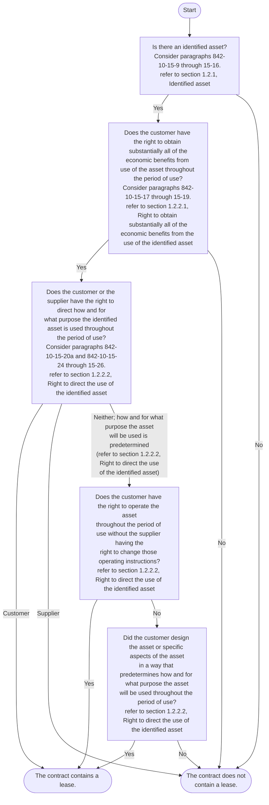


Financial reporting developments Lease accounting | 9

1 Scope and scope exceptions


ASC 842’s lease model is described in the following sections, using excerpts from ASC 842. Also, refer to Appendix C, *Illustrations from ASC 842 on the application of the definition of a lease*, for comprehensive illustrations from ASC 842 of the application of the definition of a lease.

## 1.2.1 Identified asset

> **Excerpt from Accounting Standards Codification**
> **Leases — Overall**
>
> **Scope and Scope Exceptions**
>
> **842-10-15-9**
> An asset typically is identified by being explicitly specified in a **contract**. However, an asset also can be identified by being implicitly specified at the time that the asset is made available for use by the customer.
>
> **842-10-15-16**
> A capacity portion of an asset is an identified asset if it is physically distinct (for example, a floor of a building or a segment of a pipeline that connects a single customer to the larger pipeline). A capacity or other portion of an asset that is not physically distinct (for example, a capacity portion of a fiber optic cable) is not an identified asset, unless it represents substantially all of the capacity of the asset and thereby provides the customer with the right to obtain substantially all of the economic benefits from use of the asset.

The requirement that there be an identified asset is fundamental to the definition of a lease. An identified asset can be either implicitly or explicitly specified in a contract.

> **Illustration 1-2: Implicitly specified asset**
>
> Customer X enters into a five-year contract with Supplier Y for the use of a railcar specifically designed for Customer X. The railcar is designed to transport materials used in Customer X’s production process and is not suitable for use by other customers. The railcar is not explicitly specified in the contract, but Supplier Y owns only one railcar that is suitable for Customer X’s use. If the railcar does not operate properly, the contract requires Supplier Y to repair or replace the railcar. Assume that Supplier Y does not have a substantive substitution right (refer to section 1.2.1.1, *Substantive substitution rights*).
>
> *Analysis:* The railcar is an identified asset. While the railcar is not explicitly specified in the contract (e.g., by serial number), it is implicitly specified because Supplier Y must use it to fulfill the contract.

In another example, a power plant is an implicitly identified asset in a power purchase contract if the seller of the power is a special-purpose entity (SPE) that owns a single power plant. In this instance, the power plant is implicitly specified in the contract because it is unlikely that the SPE could obtain replacement power to fulfill its obligations under the contract because an SPE generally has limited capital resources.

In the case of a transportation contract, the supplier may have only a single pipeline, and it might not be economically feasible for the supplier to obtain access to a second pipeline. In that case, the seller’s pipeline is implicitly identified in the contract.

An identified asset also can be a physically distinct portion of a larger asset. Examples include the following:

*   A floor of a building
*   The “last mile” of a telecommunications network that connects a single customer to a larger network
*   A segment of a pipeline that connects a single customer to a larger pipeline (i.e., the segment is used solely by one customer)
*   A dedicated production line within a contract manufacturing facility


Financial reporting developments Lease accounting | 10

1 Scope and scope exceptions


However, a capacity portion or other portion of an asset that is not physically distinct (e.g., a capacity portion of a fiber optic cable) is not an identified asset unless it represents substantially all of the capacity of the asset and therefore provides the customer with the right to obtain substantially all of the economic benefits from use of the asset.

> **Illustration 1-3: Identified asset — physically distinct portion of a larger asset**
>
> Customer X enters into a 12-year contract with Supplier Y for the right to use three fibers in a fiber optic cable between New York and London. The contract identifies three of the cable's 20 fibers for use by Customer X. The three fibers are dedicated solely to Customer X's data for the duration of the contract term. Assume that Supplier Y does not have a substantive substitution right (refer to section 1.2.1.1, *Substantive substitution rights*).
>
> *Analysis:* The three fibers are identified assets because they are physically distinct and explicitly specified in the contract.

> **Illustration 1-4: Identified asset — capacity portion of an asset**
>
> **Scenario A**
> Customer X enters into a five-year contract with Supplier Y for the right to transport oil from Country A to Country B through Supplier Y's pipeline. The contract provides that Customer X will have the right to 95% of the pipeline's capacity throughout the term of the arrangement. Supplier Y has no right (substantively or contractually) to connect additional branch lines from the identified pipeline for the benefit of other customers.
>
> *Analysis:* The capacity portion of the pipeline is an identified asset. While 95% of the pipeline's capacity is not physically distinct from the remaining capacity of the pipeline, it represents substantially all of the capacity of the pipeline and thereby provides Customer X with the right to obtain substantially all of the economic benefits from use of the pipeline.
>
> **Scenario B**
> Assume the same facts as in Scenario A, except that Customer X has the right to use 60% of the pipeline's capacity throughout the term of the arrangement.
>
> *Analysis:* The capacity portion of the pipeline is not an identified asset because 60% of the pipeline's capacity is less than substantially all of the capacity of the pipeline. Customer X does not have the right to obtain substantially all of the economic benefits from use of the pipeline.

### Substantially all
The term "substantially all" is not defined in ASC 842. However, entities might refer to the description in ASC 842-10-55-2 of how "substantially all the fair value of the underlying asset" could be evaluated in the context of lease classification. In that paragraph, the FASB states that "one reasonable approach" would be to conclude that "[n]inety percent or more of the fair value of the underlying asset amounts to substantially all the fair value of the underlying asset." Refer to section 2.8, *Fair value*.


Financial reporting developments Lease accounting | 11

1 Scope and scope exceptions


### 1.2.1.1 Substantive substitution rights

> #### Excerpt from Accounting Standards Codification
> **Leases — Overall**
>
> ***Scope and Scope Exceptions***
>
> **842-10-15-10**
> Even if an asset is specified, a customer does not have the right to use an identified asset if the supplier has the substantive right to substitute the asset throughout the period of use. A supplier's right to substitute an asset is substantive only if both of the following conditions exist:
>
> a. The supplier has the practical ability to substitute alternative assets throughout the period of use (for example, the customer cannot prevent the supplier from substituting an asset, and alternative assets are readily available to the supplier or could be sourced by the supplier within a reasonable period of time).
> b. The supplier would benefit economically from the exercise of its right to substitute the asset (that is, the economic benefits associated with substituting the asset are expected to exceed the costs associated with substituting the asset).
>
> **842-10-15-11**
> An entity's evaluation of whether a supplier's substitution right is substantive is based on facts and circumstances at inception of the contract and shall exclude consideration of future events that, at inception, are not considered likely to occur. Examples of future events that, at inception of the contract, would not be considered likely to occur and, thus, should be excluded from the evaluation include, but are not limited to, the following:
>
> a. An agreement by a future customer to pay an above-market rate for use of the asset
> b. The introduction of new technology that is not substantially developed at inception of the contract
> c. A substantial difference between the customer's use of the asset, or the performance of the asset and the use or performance considered likely at inception of the contract
> d. A substantial difference between the market price of the asset during the period of use and the market price considered likely at inception of the contract.
>
> **842-10-15-12**
> If the asset is located at the customer's premises or elsewhere, the costs associated with substitution are generally higher than when located at the supplier's premises and, therefore, are more likely to exceed the benefits associated with substituting the asset.
>
> **842-10-15-13**
> If the supplier has a right or an obligation to substitute the asset only on or after either a particular date or the occurrence of a specified event, the supplier does not have the practical ability to substitute alternative assets throughout the period of use.
>
> **842-10-15-14**
> The supplier's right or obligation to substitute an asset for repairs or maintenance, if the asset is not operating properly, or if a technical upgrade becomes available, does not preclude the customer from having the right to use an identified asset.
>
> **842-10-15-15**
> If the customer cannot readily determine whether the supplier has a substantive substitution right, the customer shall presume that any substitution right is not substantive.


Financial reporting developments Lease accounting | 12

1 Scope and scope exceptions


Even if an asset is specified, a customer does not have the right to use an identified asset if, at inception of the contract, a supplier has the substantive right to substitute the asset throughout the period of use (i.e., the total period of time that an asset is used to fulfill a contract with a customer, including the sum of any nonconsecutive periods of time). A substitution right is substantive when both of the following conditions are met:

*   The supplier has the practical ability to substitute alternative assets throughout the period of use (e.g., the customer cannot prevent the supplier from substituting an asset, and alternative assets are readily available to the supplier or could be sourced by the supplier within a reasonable period of time).
*   The supplier would benefit economically from the exercise of its right to substitute the asset (i.e., the economic benefits associated with substituting the asset are expected to exceed the costs associated with substituting the asset).

The FASB indicated in the Basis for Conclusions (BC 129) of ASU 2016-02 that the conditions above are intended to differentiate between substitution rights that result in a supplier controlling the use of an asset, rather than the customer, and rights that do not change the substance or character of the contract.

An entity’s evaluation of whether a supplier’s substitution right is substantive is based on facts and circumstances at inception of the contract. At inception of the contract, an entity should not consider future events that are not likely to occur. ASC 842 provides the following examples of circumstances that at inception of the contract are not likely to occur and thus are excluded from the evaluation of whether a supplier’s substitution right is substantive throughout the period of use:

*   An agreement by a future customer to pay an above-market rate for use of the asset
*   The introduction of new technology that is not substantially developed at inception of the contract
*   A substantial difference between the customer’s use of the asset, or the performance of the asset, and the use or performance considered likely at inception of the contract
*   A substantial difference between the market price of the asset during the period of use and the market price considered likely at inception of the contract

The requirement that a substitution right must benefit the supplier economically in order to be substantive is a new concept. The FASB indicated in the Basis for Conclusions (BC 130) of ASU 2016-02 that, in many cases, it will be clear that the supplier will not benefit from the exercise of a substitution right because of the costs associated with substituting an asset. The physical location of the asset may affect the costs associated with substituting the asset. For example, if an asset is located at the customer’s premises, the cost associated with substituting it is generally higher than the cost of substituting a similar asset located at the supplier’s premises. However, simply because the cost of substitution is not significant doesn’t mean that the supplier would benefit economically from the right of substitution.

ASC 842-10-15-15 further clarifies that a customer should presume that a supplier’s substitution right is not substantive if the customer cannot readily determine whether the supplier has a substantive substitution right. That is, the customer would conclude a substitution right is not substantive absent appropriate evidence to the contrary. This requirement is intended to clarify that a customer is not expected to exert undue effort to provide evidence that a substitution right is not substantive and that effectively there is a presumption it is not substantive. We believe that the FASB did not include a similar provision for suppliers because they should have sufficient information to make a determination of whether a substitution right is substantive.

Contract terms that allow or require a supplier to substitute alternative assets only when the underlying asset is not operating properly (e.g., a normal warranty provision) or when a technical upgrade becomes available do not create a substantive substitution right.


Financial reporting developments Lease accounting | 13

1 Scope and scope exceptions


A supplier’s right or obligation to substitute alternative assets only on or after a particular date or the occurrence of a specified event also does not create a substantive substitution right because the supplier does not have the practical ability to substitute alternative assets throughout the period of use.

> **Illustration 1-5: Substitution rights**
>
> **Scenario A**
>
> Assume that an electronic data storage provider (supplier) provides services, through a centralized data center, that involve the use of a specified server (Server No. 9). The supplier maintains many identical servers in a single, accessible location and determines, at inception of the contract, that it is permitted to and can easily substitute another server without the customer’s consent throughout the period of use. Further, the supplier would benefit economically from substituting an alternative asset, because doing this would allow the supplier to optimize the performance of its network at only a nominal cost. In addition, the supplier has made clear that it has negotiated this right of substitution as an important right in the arrangement, and the substitution right affected the pricing of the arrangement.
>
> *Analysis:* The customer does not have the right to use an identified asset because, at the inception of the contract, the supplier has the practical ability to substitute the server and would benefit economically from such a substitution. However, if the customer could not readily determine whether the supplier had a substantive substitution right (e.g., there is insufficient transparency into the supplier’s operations), the customer would presume the substitution right is not substantive and conclude that there is an identified asset.
>
> **Scenario B**
>
> Assume the same facts as in Scenario A except that Server No. 9 is customized, and the supplier does not have the practical ability to substitute the customized asset throughout the period of use. Additionally, it is unclear to the customer whether the supplier has the practical ability to substitute or whether it would benefit economically from sourcing a similar alternative asset.
>
> *Analysis:* Because the supplier does not have the practical ability to substitute the asset, and there is no evidence of economic benefit to the supplier for substituting the asset, the substitution right is non-substantive from the perspective of both the lessee and the lessor. Therefore, Server No. 9 would be an identified asset. In this case, neither of the conditions of a substantive substitution right is met. As a reminder, both conditions must be met for the supplier to have a substantive substitution right.

**Question 1-2**
**Does a contract contain a lease when the supplier has substitution rights that are not substantive throughout the entire period of use?**

Substitution rights may exist in a contract but may not be substantive through the entire period of the use. Consider a fact pattern in which a customer enters into a 10-year contract with a supplier for 100 similar batteries used in electric buses. The supplier has the practical ability to substitute alternative assets throughout the contract term and would be required to compensate the customer for any revenue lost or costs incurred while the substitution takes place. At inception of the contract, it is expected that the supplier would benefit economically from substituting the battery once it has been used for three years or more but not before.

This fact pattern was submitted to the IFRS Interpretations Committee (IFRS IC) in March 2023. Although this question was submitted to the IFRS IC under IFRS 16, *Leases*, the definition of a lease is the same under IFRS 16 and ASC 842. We should expect a similar answer under ASC 842 in this fact pattern. The IFRS IC noted that the customer is able to benefit from the use of each battery together with a bus that is readily available to it, and each battery is neither highly dependent on, nor highly interrelated with the


Financial reporting developments Lease accounting | 14

1 Scope and scope exceptions


other batteries in the contract. The supplier has the practical ability to substitute alternative batteries throughout the period of use. However, because the supplier is not expected to benefit economically from substituting a battery for at least the first three years of the contract, the supplier does not have a substantive substitution right throughout the period of use.

Therefore, in the fact pattern, the IFRS IC concluded that each battery is an identified asset. It follows then, in evaluating whether the contract contains lease, the requirements in ASC 842 need to be applied to assess whether, throughout the period of use, the customer has the right to obtain substantially all the economic benefits from use, and direct the use, of each battery (and therefore has the right to control the use of the underlying asset).

## 1.2.2 Right to control the use of the identified asset

A contract conveys the right to control the use of an identified asset for a period of time if, throughout the period of use, the customer has both of the following:

*   The right to obtain substantially all of the economic benefits from the use of the identified asset (refer to section 1.2.2.1, *Right to obtain substantially all of the economic benefits from the use of the identified asset*)
*   The right to direct the use of the identified asset (refer to section 1.2.2.2, *Right to direct the use of the identified asset*)

If the customer has the right to control the use of an identified asset for only a portion of the term of the contract, the contract contains a lease for that portion of the term in accordance with ASC 842-10-15-5.

> ### Illustration 1-6: Right to control the use of the identified asset
>
> **Scenario A**
>
> Contractor X enters into a contract with Crane Co. for the exclusive right to use a specific tower crane throughout a three-year period. Crane Co. also provides a crew to operate the crane. The contract does not provide for any substitution rights. Crane Co. prohibits certain uses of the crane (e.g., moving it, using it unsafely) and modifications to the crane.
>
> *Analysis:* Contractor X concludes that it has the right to substantially all of the economic benefits that result from the use of the crane throughout the period of use.
>
> Although Crane Co. provides a crew to operate the crane, Contractor X concludes that it has the right to direct how and for what purpose the crane will be used throughout the period of use (e.g., it directs when the crane operates and what it will lift and can change such decisions). While Crane Co. has the right to prohibit certain uses of the crane and modifications to the crane, those rights are solely to protect its interest in the crane and do not, by themselves, prevent Contractor X from having the right to direct the use of the identified asset.
>
> Because Contractor X has the right to substantially all of the economic benefits from the crane and has the right to direct the use of the crane, Contractor X concludes that it has the right to control the use of the crane.
>
> **Scenario B**
>
> Consumer products entity (CP) enters into a contract with Vendor for a dedicated production line to manufacture one of its store-brand household products for a two-year period. The contract states that CP has the exclusive use of the production line (i.e., Vendor cannot use the production line for other customer orders).


Financial reporting developments Lease accounting | 15

1 Scope and scope exceptions


> The type of household product is specified in the contract. CP issues instructions to Vendor about the quantity and timing of products to be delivered. If the production line is not producing the household product for CP, it does not operate.
>
> Vendor operates and maintains the production line on a daily basis.
>
> *Analysis:* This contract contains a lease. CP has the right to use the dedicated production line for two years.
>
> There is an identified asset. The dedicated production line is an implicitly identified asset because Vendor has only one line that can fulfill the contract, and Vendor does not have the right to substitute the specified production line.
>
> CP has the right to control the use of the dedicated production line (i.e., the identified asset) throughout the two-year period of use because:
>
> *   CP has the right to substantially all of the economic benefits from use of the dedicated production line over the two-year period of use. CP has exclusive use of the dedicated production line; it has rights to all the household product produced throughout the two-year period of use.
> *   CP has the right to direct the use of the dedicated production line. CP makes the relevant decisions about how and for what purpose the production line is used because it has the right to determine whether, when, and how much the production line will produce (i.e., the timing and quantity, if any, of household products produced) throughout the period of use. Because Vendor is prevented from using the production line for another purpose, CP’s decision-making rights about the timing and quantity of household products produced, in effect, determine when and whether the production line produces product.
>
> Although the operation and maintenance of the production line are essential to its efficient use, Vendor’s decisions in this regard do not give it the right to direct how and for what purpose the production line is used. Consequently, Vendor does not control the use of the production line during the period of use. Instead, Vendor’s decisions are dependent on CP’s decisions about how and for what purpose the production line is used.
>
> Determining whether a customer has the right to direct the use of an asset throughout the period of use may require significant judgment. Changes in facts and circumstances may result in a different conclusion.

### 1.2.2.1 Right to obtain substantially all of the economic benefits from the use of the identified asset

<table>
  <thead>
    <tr>
        <th>Excerpt from Accounting Standards Codification</th>
    </tr>
  </thead>
  <tbody>
    <tr>
        <td>**Leases — Overall**</td>
    </tr>
    <tr>
        <td>***Scope and Scope Exceptions***</td>
    </tr>
    <tr>
        <td>***842-10-15-17***</td>
    </tr>
    <tr>
        <td>To control the use of an identified asset, a customer is required to have the right to obtain substantially all of the economic benefits from use of the asset throughout the period of use (for example, by having exclusive use of the asset throughout that period). A customer can obtain economic benefits from use of an asset directly or indirectly in many ways, such as by using, holding, or subleasing the asset. The economic benefits from use of an asset include its primary output and by-products (including potential cash flows derived from these items) and other economic benefits from using the asset that could be realized from a commercial transaction with a third party.</td>
    </tr>
  </tbody>
</table>
Financial reporting developments Lease accounting | 16

1 Scope and scope exceptions


> **842-10-15-18**
>
> When assessing the right to obtain substantially all of the economic benefits from use of an asset, an entity shall consider the economic benefits that result from use of the asset within the defined scope of a customer's right to use the asset in the contract (see paragraph 842-10-15-23). For example:
>
> a. If a contract limits the use of a motor vehicle to only one particular territory during the period of use, an entity shall consider only the economic benefits from use of the motor vehicle within that territory and not beyond.
>
> b. If a contract specifies that a customer can drive a motor vehicle only up to a particular number of miles during the period of use, an entity shall consider only the economic benefits from use of the motor vehicle for the permitted mileage and not beyond.
>
> **842-10-15-19**
>
> If a contract requires a customer to pay the supplier or another party a portion of the cash flows derived from use of an asset as consideration, those cash flows paid as consideration shall be considered to be part of the economic benefits that the customer obtains from use of the asset. For example, if a customer is required to pay the supplier a percentage of sales from use of retail space as consideration for that use, that requirement does not prevent the customer from having the right to obtain substantially all of the economic benefits from use of the retail space. That is because the cash flows arising from those sales are considered to be economic benefits that the customer obtains from use of the retail space, a portion of which it then pays to the supplier as consideration for the right to use that space.

A customer's right to control the use of an identified asset depends on its right to obtain substantially all of the economic benefits from the use of the identified asset throughout the period of use. The term "substantially all" is not defined in ASC 842. Refer to section 1.2.1, *Identified asset*, for a discussion about how an entity might evaluate this term.

A customer can obtain economic benefits either directly or indirectly (e.g., by using, holding or subleasing the asset). Economic benefits include the asset's primary outputs (i.e., goods or services) and any by-products (e.g., renewable energy credits that are generated through the use of the asset), including potential cash flows derived from these items. Economic benefits also include benefits from using the asset that could be realized from a commercial transaction with a third party. However, economic benefits arising from ownership of the identified asset (e.g., tax benefits related to excess tax depreciation and investment tax credits) are not considered economic benefits derived from the use of the asset and therefore are not considered when assessing whether a customer has the right to obtain substantially all the economic benefits.

When assessing whether the customer has the right to obtain substantially all the economic benefits from the use of an asset, an entity must consider the economic benefits that result from the use of the asset within the defined scope of the customer's right to use the asset. A right that solely protects the supplier's interest in the underlying asset (e.g., limits on the number of miles a customer can drive a supplier's vehicle, limits on where the asset may be used) does not, in and of itself, prevent the customer from obtaining substantially all of the economic benefits from the use of the asset (refer to section 1.2.2.3, *Effect of protective rights on the right to direct the use of the identified asset*). Instead, it simply limits the economic benefits that are to be evaluated.

If a contract requires a customer to pay the supplier or another party a portion of the cash flows derived from the use of an asset as consideration (e.g., a percentage of sales from the use of retail space), those cash flows are considered to be economic benefits that the customer derives from the use of the asset.


Financial reporting developments Lease accounting | 17

1 Scope and scope exceptions


### 1.2.2.2 Right to direct the use of the identified asset

> **Excerpt from Accounting Standards Codification**
> **Master Glossary**
>
> **Period of Use**
>
> The total period of time that an asset is used to fulfill a **contract** with a customer (including the sum of any nonconsecutive periods of time).
>
> **Leases — Overall**
>
> **Scope and Scope Exceptions**
>
> **842-10-15-20**
>
> A customer has the right to direct the use of an identified asset throughout the period of use in either of the following situations:
>
> a. The customer has the right to direct how and for what purpose the asset is used throughout the period of use (as described in paragraphs 842-10-15-24 through 15-26).
>
> b. The relevant decisions about how and for what purpose the asset is used are predetermined (see paragraph 842-10-15-21) and at least one of the following conditions exists:
>
> 1. The customer has the right to operate the asset (or to direct others to operate the asset in a manner that it determines) throughout the period of use without the supplier having the right to change those operating instructions.
>
> 2. The customer designed the asset (or specific aspects of the asset) in a way that predetermines how and for what purpose the asset will be used throughout the period of use.
>
> **842-10-15-21**
>
> The relevant decisions about how and for what purpose an asset is used can be predetermined in a number of ways. For example, the relevant decisions can be predetermined by the design of the asset or by contractual restrictions on the use of the asset.

A customer has the right to direct the use of an identified asset throughout the period of use when either:

* The customer has the right to direct how and for what purpose the asset is used throughout the period of use.
* The relevant decisions about how and for what purpose the asset is used are predetermined and the customer either (1) has the right to operate the asset, or direct others to operate the asset in a manner it determines, throughout the period of use without the supplier having the right to change the operating instructions or (2) designed the asset, or specific aspects of the asset, in a way that predetermines how and for what purpose the asset will be used throughout the period of use.

#### The right to direct how and for what purpose an asset is used throughout the period of use

> **Excerpt from Accounting Standards Codification**
> **Leases — Overall**
>
> **Scope and Scope Exceptions**
>
> **842-10-15-24**
>
> A customer has the right to direct how and for what purpose an asset is used throughout the period of use if, within the scope of its right of use defined in the contract, it can change how and for what purpose the asset is used throughout that period. In making this assessment, an entity considers the decision-making rights that are most relevant to changing how and for what purpose an asset is used throughout


Financial reporting developments Lease accounting | 18

1 Scope and scope exceptions


> the period of use. Decision-making rights are relevant when they affect the economic benefits to be derived from use. The decision-making rights that are most relevant are likely to be different for different contracts, depending on the nature of the asset and the terms and conditions of the contract.
>
> **842-10-15-25**
> Examples of decision-making rights that, depending on the circumstances, grant the right to direct how and for what purpose an asset is used, within the defined scope of the customer's right of use, include the following:
>
> a. The right to change the type of output that is produced by the asset (for example, deciding whether to use a shipping container to transport goods or for storage, or deciding on the mix of products sold from a retail unit)
>
> b. The right to change when the output is produced (for example, deciding when an item of machinery or a power plant will be used)
>
> c. The right to change where the output is produced (for example, deciding on the destination of a truck or a ship or deciding where a piece of equipment is used or deployed)
>
> d. The right to change whether the output is produced and the quantity of that output (for example, deciding whether to produce energy from a power plant and how much energy to produce from that power plant).
>
> **842-10-15-26**
> Examples of decision-making rights that do not grant the right to direct how and for what purpose an asset is used include rights that are limited to operating or maintaining the asset. Although rights such as those to operate or maintain an asset often are essential to the efficient use of an asset, they are not rights to direct how and for what purpose the asset is used and often are dependent on the decisions about how and for what purpose the asset is used. Such rights (that is, to operate or maintain the asset) can be held by the customer or the supplier. The supplier often holds those rights to protect its investment in the asset. However, rights to operate an asset may grant the customer the right to direct the use of the asset if the relevant decisions about how and for what purpose the asset is used are predetermined (see paragraph 842-10-15-20(b)(1)).

A customer has the right to direct the use of an identified asset whenever it has the right to direct how and for what purpose the asset is used throughout the period of use (i.e., it can change how and for what purpose the asset is used throughout the period of use). How and for what purpose an asset is used is a single concept (i.e., "how" an asset is used is not assessed separately from "for what purpose" an asset is used).

When evaluating whether a customer has the right to direct how and for what purpose the asset is used throughout the period of use, the focus should be on whether the customer has the decision-making rights that will most affect the economic benefits that will be derived from the use of the asset. The decision-making rights that are most relevant are likely to depend on the nature of the asset and the terms and conditions of the contract.

The FASB indicated in the Basis for Conclusions (BC 137) of ASU 2016-02 that decisions about how and for what purpose an asset is used can be viewed as similar to the decisions made by a board of directors. Decisions made by a board of directors about the operating and financing activities of an entity are generally the most relevant decisions rather than the actions of individuals in implementing those decisions.

ASC 842 provides the following examples of decision-making rights that grant the right to change how and for what purpose an asset is used:

*   The right to change **what** type of output is produced by the asset (e.g., deciding whether to use a shipping container to transport goods or for storage, deciding on the mix of products sold from a retail unit)


Financial reporting developments Lease accounting | 19

1 Scope and scope exceptions


*   The right to change **when** the output is produced (e.g., deciding when an item of machinery or a power plant will be used)
*   The right to change **where** the output is produced (e.g., deciding on the destination of a truck or a ship, deciding where a piece of equipment is used or deployed)
*   The right to change **whether** the output is produced and the quantity of that output (e.g., deciding whether to produce energy from a power plant and how much energy to produce from that power plant)

ASC 842 also provides the following examples of decision-making rights that do not grant the right to change how and for what purpose an asset is used:

*   Maintaining the asset
*   Operating the asset

Although the decisions about maintaining and operating the asset are often essential to the efficient use of that asset, the right to make those decisions, in and of itself, does not result in the right to change how and for what purpose the asset is used throughout the period of use.

The customer does not need the right to operate the underlying asset to have the right to direct its use. That is, the customer may direct the use of an asset that is operated by the supplier's personnel. However, as discussed below, the right to operate an asset will often provide the customer the right to direct the use of the asset if the relevant decisions about how and for what purpose the asset is used are predetermined.

We believe that the assessment of whether a contract is or contains a lease will be straightforward in most arrangements. However, judgment may be required in applying the definition of a lease to certain arrangements. For example, in contracts that include significant services, we believe that determining whether the contract conveys the right to direct the use of an identified asset may be more complex. Examples of such contracts may include third-party manufacturing, warehousing, transportation, advertising or information technology arrangements. Evaluating whether these arrangements contain a lease may require judgment.

### The relevant decisions about how and for what purpose an asset is used are predetermined

In some cases, it will not be clear whether the customer has the right to direct the use of the identified asset. This could be the case when the most relevant decisions about how and for what purpose an asset is used are predetermined by contractual restrictions on the use of the asset (e.g., the decisions about the use of the asset are agreed to by the customer and the supplier in negotiating the contract, and those decisions cannot be changed). This could also be the case when the most relevant decisions about how and for what purpose an asset is used are, in effect, predetermined by the design of the asset. The FASB indicated in the Basis for Conclusions (BC 138) of ASU 2016-02 that it would expect decisions about how and for what purpose an asset is used to be predetermined in few cases. When decisions about how and for what purpose an asset is to be used are predetermined, a customer has the right to direct the use of an identified asset throughout the period of use when the customer either:

*   Has the right to operate the asset, or direct others to operate the asset in a manner it determines, throughout the period of use without the supplier having the right to change those operating instructions
*   Designed the asset (or specific aspects of the asset) in a way that predetermines how and for what purpose the asset will be used throughout the period of use

Significant judgment may be required to assess whether a customer designed the asset (or specific aspects of the asset) in a way that predetermines how and for what purpose the asset will be used throughout the period of use. The following provides an example of the evaluation of whether a customer designed the asset in a way that predetermines how and for what purpose the asset will be used throughout the period of use.


Financial reporting developments Lease accounting | 20

1 Scope and scope exceptions


# Excerpt from Accounting Standards Codification
## Example 9 — Contract for Energy/Power

### Case A — Contract Contains a Lease

**842-10-55-108**
A utility company (Customer) enters into a contract with a power company (Supplier) to purchase all of the electricity produced by a new solar farm for 20 years. The solar farm is explicitly specified in the contract, and Supplier has no substitution rights. The solar farm is owned by Supplier, and the energy cannot be provided to Customer from another asset. Customer designed the solar farm before it was constructed — Customer hired experts in solar energy to assist in determining the location of the farm and the engineering of the equipment to be used. Supplier is responsible for building the solar farm to Customer's specifications and then operating and maintaining it. There are no decisions to be made about whether, when, or how much electricity will be produced because the design of the asset has predetermined these decisions. Supplier will receive tax credits relating to the construction and ownership of the solar farm, while Customer receives renewable energy credits that accrue from use of the solar farm.

**842-10-55-109**
The contract contains a lease. Customer has the right to use the solar farm for 20 years.

**842-10-55-110**
There is an identified asset because the solar farm is explicitly specified in the contract, and Supplier does not have the right to substitute the specified solar farm.

**842-10-55-111**
Customer has the right to control the use of the solar farm throughout the 20-year period of use because:

a. Customer has the right to obtain substantially all of the economic benefits from use of the solar farm over the 20-year period of use. Customer has exclusive use of the solar farm; it takes all of the electricity produced by the farm over the 20-year period of use as well as the renewable energy credits that are a by-product from use of the solar farm. Although Supplier will be receiving economic benefits from the solar farm in the form of tax credits, those economic benefits relate to the ownership of the solar farm rather than the use of the solar farm and, thus, are not considered in this assessment.

b. Customer has the right to direct the use of the solar farm. Neither Customer nor Supplier decides how and for what purpose the solar farm is used during the period of use because those decisions are predetermined by the design of the asset (that is, the design of the solar farm has, in effect, programmed into the asset any relevant decision-making rights about how and for what purpose the solar farm is used throughout the period of use). Customer does not operate the solar farm; Supplier makes the decisions about the operation of the solar farm. However, Customer's design of the solar farm has given it the right to direct the use of the farm (as described in paragraph 842-10-15-20(b)(2)). Because the design of the solar farm has predetermined how and for what purpose the asset will be used throughout the period of use, Customer's control over that design is substantively no different from Customer controlling those decisions.

### Case B — Contract Does Not Contain a Lease

**842-10-55-112**
Customer enters into a contract with Supplier to purchase all of the power produced by an explicitly specified power plant for three years. The power plant is owned and operated by Supplier. Supplier is unable to provide power to Customer from another plant. The contract sets out the quantity and timing of power that the power plant will produce throughout the period of use, which cannot be changed in the absence of extraordinary circumstances (for example, emergency situations). Supplier


Financial reporting developments Lease accounting | 21

1 Scope and scope exceptions


operates and maintains the plant on a daily basis in accordance with industry-approved operating practices. Supplier designed the power plant when it was constructed some years before entering into the contract with Customer; Customer had no involvement in that design.

**842-10-55-113**
The contract does not contain a lease.

**842-10-55-114**
There is an identified asset because the power plant is explicitly specified in the contract, and Supplier does not have the right to substitute the specified plant.

**842-10-55-115**
Customer has the right to obtain substantially all of the economic benefits from use of the identified power plant over the three-year period of use. Customer will take all of the power produced by the power plant over the three-year term of the contract.

**842-10-55-116**
However, Customer does not have the right to control the use of the power plant because it does not have the right to direct its use. Customer does not have the right to direct how and for what purpose the plant is used. How and for what purpose the plant is used (that is, whether, when, and how much power the plant will produce) are predetermined in the contract. Customer has no right to change how and for what purpose the plant is used during the period of use, nor does it have any other decision-making rights about the use of the power plant during the period of use (for example, it does not operate the power plant) and did not design the plant. Supplier is the only party that can make decisions about the plant during the period of use by making the decisions about how the plant is operated and maintained. Customer has the same rights regarding the use of the plant as if it were one of many customers obtaining power from the plant.

**Case C — Contract Contains a Lease**

**842-10-55-117**
Customer enters into a contract with Supplier to purchase all of the power produced by an explicitly specified power plant for 10 years. The contract states that Customer has rights to all of the power produced by the plant (that is, Supplier cannot use the plant to fulfill other contracts).

**842-10-55-118**
Customer issues instructions to Supplier about the quantity and timing of the delivery of power. If the plant is not producing power for Customer, it does not operate.

**842-10-55-119**
Supplier operates and maintains the plant on a daily basis in accordance with industry-approved operating practices.

**842-10-55-120**
The contract contains a lease. Customer has the right to use the power plant for 10 years.

**842-10-55-121**
There is an identified asset. The power plant is explicitly specified in the contract, and Supplier does not have the right to substitute the specified plant.

**842-10-55-122**
Customer has the right to control the use of the power plant throughout the 10-year period of use because:

a. Customer has the right to obtain substantially all of the economic benefits from use of the power plant over the 10-year period of use. Customer has exclusive use of the power plant; it has rights to all of the power produced by the power plant throughout the 10-year period of use.


Financial reporting developments Lease accounting | 22

1 Scope and scope exceptions


> b. Customer has the right to direct the use of the power plant. Customer makes the relevant decisions about how and for what purpose the power plant is used because it has the right to determine whether, when, and how much power the plant will produce (that is, the timing and quantity, if any, of power produced) throughout the period of use. Because Supplier is prevented from using the power plant for another purpose, Customer’s decision making about the timing and quantity of power produced, in effect, determines when and whether the plant produces output.
>
> **842-10-55-123**
> Although the operation and maintenance of the power plant are essential to its efficient use, Supplier’s decisions in this regard do not give it the right to direct how and for what purpose the power plant is used. Consequently, Supplier does not control the use of the power plant during the period of use. Instead, Supplier’s decisions are dependent on Customer’s decisions about how and for what purpose the power plant is used.

### Specifying the output of an asset before the period of use

> **Excerpt from Accounting Standards Codification**
> **Leases — Overall**
> **Scope and Scope Exceptions**
>
> **842-10-15-22**
> In assessing whether a customer has the right to direct the use of an asset, an entity shall consider only rights to make decisions about the use of the asset during the period of use unless the customer designed the asset (or specific aspects of the asset) in accordance with paragraph 842-10-15-20(b)(2). Consequently, unless that condition exists, an entity shall not consider decisions that are predetermined before the period of use. For example, if a customer is able only to specify the output of an asset before the period of use, the customer does not have the right to direct the use of that asset. The ability to specify the output in a contract before the period of use, without any other decision-making rights relating to the use of the asset, gives a customer the same rights as any customer that purchases goods or services.

If a customer can only specify the output from an asset before the beginning of the period of use and cannot change that output throughout the period of use, the customer does not have the right to direct the use of that asset unless it designed the asset, or specific aspects of the asset, as contemplated in ASC 842-10-15-20(b)(2). If the customer did not design the asset or aspects of it, the customer’s ability to specify the output in a contract that does not give it any other relevant decision-making rights relating to the use of the asset (e.g., the ability to change when, whether and what output is produced) gives the customer the same rights as any customer that purchases goods or services in a service arrangement (i.e., a contract that does not contain a lease).

### 1.2.2.3 Effect of protective rights on the right to direct the use of the identified asset

> **Excerpt from Accounting Standards Codification**
> **Leases — Overall**
> **Scope and Scope Exceptions**
>
> **842-10-15-23**
> A contract may include terms and conditions designed to protect the supplier’s interest in the asset or other assets, to protect its personnel, or to ensure the supplier’s compliance with laws or regulations. These are examples of protective rights. For example, a contract may specify the maximum amount of use of an asset or limit where or when the customer can use the asset, may require a customer to follow particular operating practices, or may require a customer to inform the supplier of changes in how an asset will be used. Protective rights typically define the scope of the customer’s right of use but do not, in isolation, prevent the customer from having the right to direct the use of an asset.


Financial reporting developments Lease accounting | 23

1 Scope and scope exceptions


A right that solely protects the supplier’s interest in the underlying asset, in and of itself, does not prevent the customer from having the right to direct the use of an identified asset. Protective rights typically define the scope of the customer’s right to use the asset without removing the customer’s right to direct the use of the asset. Protective rights are intended to protect a supplier’s interests (e.g., interests in the asset, its personnel, compliance with laws and regulations) and might take the form of a specified maximum amount of asset use (e.g., limits on the number of miles a customer can drive a supplier’s vehicle), a restriction on where an asset may be used or a requirement to follow specific operating instructions.

<table>
  <thead>
    <tr>
        <th>Illustration 1-7: Right to direct the use of an asset</th>
    </tr>
  </thead>
  <tbody>
    <tr>
        <td>Customer X enters into a contract with Supplier Y to use a vehicle for a three-year period. The vehicle is identified in the contract. Supplier Y cannot substitute another vehicle unless the specified vehicle is not operational (e.g., it breaks down).&lt;br/&gt;&lt;br/&gt;Under the contract:&lt;br/&gt;* Customer X operates the vehicle (i.e., drives the vehicle) or directs others to operate the vehicle (e.g., hires a driver).&lt;br/&gt;* Customer X decides how to use the vehicle (within contractual limitations, as discussed below). For example, throughout the period of use, Customer X decides where the vehicle goes as well as when or whether it is used and what it is used for. Customer X can also change these decisions throughout the period of use.&lt;br/&gt;* Supplier Y prohibits certain uses of the vehicle (e.g., moving it overseas) and modifications of the vehicle to protect its interest in the asset.&lt;br/&gt;&lt;br/&gt;*Analysis:* Customer X has the right to direct the use of the identified vehicle throughout the period of use. Customer X has the right to direct the use of the vehicle because it has the right to change how the vehicle is used, when or whether the vehicle is used, where the vehicle goes and what the vehicle is used for.&lt;br/&gt;&lt;br/&gt;Supplier Y’s limits on certain uses for the vehicle and modifications to it are considered protective rights that define the scope of Customer X’s use of the asset but do not affect the assessment of whether Customer X directs the use of the asset.</td>
    </tr>
  </tbody>
</table>## 1.2.3 Leases involving joint arrangements

A customer, including a customer that is a joint operation or joint arrangement (collectively referred to as a “joint arrangement” in this section), and a supplier are required to consider whether the customer has the right to control the use of an identified asset to determine whether an arrangement is or contains a lease. Joint arrangements, which are generally not legal entities and are not defined by US GAAP, are common in extractive industries and may be present in other industries.

In a joint arrangement, an operator (e.g., an operator of an oil and gas property) may agree with other parties (i.e., nonoperators in the joint arrangement to which the operator is a party) to perform certain activities necessary to develop or operate the property. The contractual rights and obligations of each party to the arrangements are typically documented through the use of a joint operating agreement. To fulfill its responsibilities, the operator often enters into contracts with third-party suppliers to obtain the use of an asset (e.g., a drilling rig) to perform the activities. Less frequently, the joint arrangement (as a group) may enter into agreements directly with a supplier to use an asset.


Financial reporting developments Lease accounting | 24

1 Scope and scope exceptions


Consequently, the customer (i.e., either the operator individually or the joint arrangement as if it were a single customer) and the supplier to each contract will have to carefully evaluate these agreements to determine whether the customer controls the use of an identified asset throughout the period of use. This assessment will often require two steps when a supplier enters into a contract directly with the operator to use an identified asset, for example:

*   Step 1: The supplier and the operator would evaluate whether the operator controls the use of the identified asset, and if so, a right-of-use (ROU) asset and lease liability would generally be recognized by the operator (refer to section 4, *Lessee accounting*).
*   Step 2: Next, the operator and the joint arrangement should evaluate whether a sublease exists from the operator to the joint arrangement (as if the joint arrangement were a single customer). If the joint arrangement controls the use of the identified asset under the term of an arrangement between the operator and the joint arrangement, the operator would recognize a sublease to the joint arrangement to the extent of the nonoperators' interest. The nonoperators to the joint arrangement consider other applicable GAAP to individually account for their interest in the joint arrangement.

**Summary of assessment when a supplier enters into a contract directly with the operator to use an identified asset**

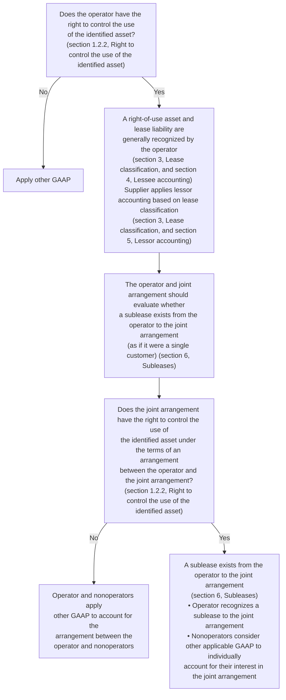


Financial reporting developments Lease accounting | 25

1 Scope and scope exceptions


### Summary of assessment when a supplier enters into a contract directly with the joint arrangement to use an identified asset

```mermaid
graph TD
    A[Does the joint arrangement (as if it were a single customer)<br/>have the right to control the use of the identified asset?<br/>(section 1.2.2, Right to control the use of the identified asset)] -- No --> B[Apply other GAAP]
    A -- Yes --> C["A lease exists from the supplier to the joint arrangement<br/>• Supplier applies lessor accounting based on lease<br/>  classification (section 3, Lease classification, and section 5,<br/>  Lessor accounting)<br/>• Operator and nonoperators consider other applicable<br/>  GAAP to individually account for their interest in the<br/>  joint arrangement"]
```

<table>
  <thead>
    <tr>
        <th>Illustration 1-8: Joint operations</th>
    </tr>
  </thead>
  <tbody>
    <tr>
        <td>Upstream Co. is designated as the operator for a series of oil and gas properties in the Gulf of Mexico (GOM properties), for which there are three nonoperators. Under the joint arrangement, the nonoperators are limited in their involvement to only making choices about participation in the exploration and development of the property.&lt;br/&gt;&lt;br/&gt;To fulfill its responsibilities as operator, Upstream Co. contracts with Rig Co. to lease a fixed platform drilling rig (Rig A) for five years. Upstream Co. enters into the contract with the intention of using Rig A to develop the GOM properties; however, Upstream Co. does not enter into a contract with the joint arrangement (or parties to that operation) for the right to use the asset (i.e., the nonoperators do not have any legally enforceable rights or obligations with respect to Rig A).&lt;br/&gt;&lt;br/&gt;*Analysis*&lt;br/&gt;&lt;br/&gt;Upstream Co. concludes that it has legally enforceable rights and obligations with Rig Co., and that the contract represents a lease of Rig A. Therefore, Upstream Co. will record 100% of the right-of-use asset and lease liability relating to Rig A.&lt;br/&gt;&lt;br/&gt;Upstream Co. and the nonoperators further evaluate the arrangement, noting the following:&lt;br/&gt;- Upstream Co. is contractually permitted to use Rig A for projects unrelated to the joint arrangement, provided Upstream Co. supplies another drilling rig to fulfill its obligation as operator on the GOM properties.&lt;br/&gt;- Because the nonoperators are limited in their involvement to making choices about participation in the exploration and development of the property rather than the use of the leased rig, the joint arrangement cannot direct the use of Rig A.&lt;br/&gt;&lt;br/&gt;Upstream Co. determines that the agreement with the joint arrangement does not include a sublease of Rig A. Likewise, the nonoperators determine that they are not lessees with respect to Rig A and, therefore, do not recognize any right-of-use asset or lease liability with respect to Rig A.</td>
    </tr>
  </tbody>
</table>
Financial reporting developments Lease accounting | 26

1 Scope and scope exceptions


## 1.3 Reassessment of the contract

> ### Excerpt from Accounting Standards Codification
> **Leases — Overall**
>
> **Scope and Scope Exceptions**
>
> **842-10-15-6**
>
> An entity shall reassess whether a contract is or contains a lease only if the terms and conditions of the contract are changed.

Under ASC 842, an entity reassesses whether a contract is or contains a lease only if the terms and conditions of the contract are changed (e.g., a change in the scope or consideration of a contract, addition of a right to use an underlying asset). This reassessment requirement also applies to modifications of contracts that were not previously determined to be or contain a lease.

A change that provides the supplier with a substitution right or that changes the extent of the supplier's or customer's decision-making authority related to the underlying asset are examples of changes in the terms and conditions of a contract that would require an entity to reassess whether the contract is or contains a lease.

Refer to sections 4.6, *Lease modifications*, and 5.6, *Lease modifications*, for discussion of accounting by lessees and lessors, respectively, for a modified contract that continues to be a lease.

## 1.4 Identifying and separating lease and non-lease components of a contract and allocating contract consideration

### 1.4.1 Identifying and separating lease components of a contract

> ### Excerpt from Accounting Standards Codification
> **Leases — Overall**
>
> **Scope and Scope Exceptions**
>
> **842-10-15-28**
>
> After determining that a **contract** contains a **lease** in accordance with paragraphs 842-10-15-2 through 15-27, an entity shall identify the separate lease components within the contract. An entity shall consider the right to use an **underlying asset** to be a separate lease component (that is, separate from any other lease components of the contract) if both of the following criteria are met:
>
> a. The **lessee** can benefit from the right of use either on its own or together with other resources that are readily available to the lessee. Readily available resources are goods or services that are sold or leased separately (by the **lessor** or other suppliers) or resources that the lessee already has obtained (from the lessor or from other transactions or events).
> b. The right of use is neither highly dependent on nor highly interrelated with the other right(s) to use underlying assets in the contract. A lessee's right to use an underlying asset is highly dependent on or highly interrelated with another right to use an underlying asset if each right of use significantly affects the other.
>
> **842-10-15-29**
>
> The guidance in paragraph 842-10-15-28 notwithstanding, to classify and account for a lease of land and other assets, an entity shall account for the right to use land as a separate lease component unless the accounting effect of doing so would be insignificant (for example, separating the land element would have no effect on lease classification of any lease component or the amount recognized for the land lease component would be insignificant).


Financial reporting developments Lease accounting | 27

1 Scope and scope exceptions


For contracts that contain the rights to use multiple assets but not land (e.g., a lease of a building and equipment, multiple pieces of equipment), the right to use each asset is considered a separate lease component if both of the following criteria are met:

*   The lessee can benefit from the right of use either on its own or together with other resources that are readily available to the lessee (i.e., goods or services that are sold or leased separately, by the lessor or other suppliers, or that the lessee has already obtained from the lessor or in other transactions or events).
*   The right of use is neither highly dependent on, nor highly interrelated with, the other right(s) to use underlying assets in the contract.

If one or both of these criteria are not met, the right to use multiple assets is considered a single lease component. The FASB indicated in the Basis for Conclusions (BC 146) of ASU 2016-02 that the guidance on identifying and separating lease components is similar to the guidance on identifying and separating performance obligations in a revenue contract under ASC 606. Refer to section 4, *Identify the performance obligations in the contract*, of our FRD, Revenue from contracts with customers (ASC 606), for additional details.

For contracts that involve the right to use land and other assets (e.g., land and a building), ASC 842 requires an entity to classify (refer to section 3, *Lease classification*) and account for the right to use land as a separate lease component, even if the criteria for separating lease components are not met, unless the accounting effect of not separately accounting for the land is insignificant. In assessing whether the effect of not separately accounting for the land would be insignificant, entities should consider the potential differences in accounting, including:

*   Lease classification
*   The balance sheet presentation of right-of-use assets and lease liabilities
*   The timing and classification of expense or income recognition
*   The classification of lease payments in the statement of cash flows
*   Disclosures in the notes to the financial statements (e.g., disclosure of lease costs, noncash information on lease liabilities, the weighted-average lease term, the discount rate)

The FASB indicated in the Basis for Conclusions (BC 147) of ASU 2016-02 that since land, by virtue of its indefinite economic life, is substantively different from other assets, it should be assessed separately regardless of whether the separate lease component criteria are met.

An entity that leases an entire building (i.e., 100% of the building) is inherently leasing the land underneath the building and would potentially account for the land and the building as separate lease components. However, we believe this would not necessarily be the case when an entity only leases part of the building (e.g., one floor of a multistory building).

An entity may account for separate lease components (e.g., a group of identical data servers) as a single lease component using a portfolio approach if the leases commence at the same date, the leases are co-terminus and the accounting for the separate lease components as a single lease component does not materially differ from accounting for the separate lease components as multiple lease components. For more information on the portfolio approach, refer to section 4.8.4, *Portfolio approach*, for lessee accounting and section 5.7.4.1, *Portfolio approach*, for lessor accounting.


Financial reporting developments Lease accounting | 28

1 Scope and scope exceptions


However, in some circumstances, an entity may need to account for the separate lease components as multiple lease components when:

*   Accounting for certain lease modifications (refer to section 4.6, *Lease modifications*, for lessee accounting and section 5.6, *Lease modifications*, for lessor accounting)
*   Accounting for asset abandonments (refer to section 4.2.5.3, *Abandonment of ROU assets*, for abandonment of operating lease right-of-use assets and section 4.3.4.3, *Abandonment of ROU assets*, for abandonment of finance lease right-of-use assets)

ASC 842 includes the following example for separating lease components of a contract (refer to section 1.4.5, *Examples — identifying and separating components of a contract and determining and allocating the consideration in the contract*, for additional examples).

> ### Excerpt from Accounting Standards Codification
> **Leases — Overall**
>
> **Implementation Guidance and Illustrations**
>
> ***Example 13 — Lease of a Turbine Plant***
>
> **842-10-55-146**
> Lessor leases a gas-fired turbine plant to Lessee for eight years so that Lessee can produce electricity for its customers. The plant consists of the turbine housed within a building together with the land on which the building sits. The building was designed specifically to house the turbine, has a similar economic life as the turbine of approximately 15 years, and has no alternative use. The lease does not transfer ownership of any of the underlying assets to Lessee or grant Lessee an option to purchase any of the underlying assets. Lessor does not obtain a residual value guarantee from Lessee or any other unrelated third party. The present value of the lease payments is not substantially all of the aggregate fair value of the three underlying assets.
>
> **842-10-55-147**
> While the lease of the plant includes the lease of multiple underlying assets, the leases of those underlying assets do not meet the second criterion necessary to be separate lease components, which is that the right to use the underlying asset is neither dependent on nor highly interrelated with the other rights of use in the contract. Therefore, the contract contains only one lease component. The rights to use the turbine, the building, and the land are highly interrelated because each is an input to the customized combined item for which Lessee has contracted (that is, the right to use a gas-fired turbine plant that can produce electricity for distribution to Lessee’s customers).
>
> **842-10-55-148**
> However, because the contract contains the lease of land, Lessee and Lessor also must consider the guidance in paragraph 842-10-15-29. Lessee and Lessor each conclude that the effect of accounting for the right to use the land as a separate lease component would be insignificant because Lessee’s right to use the turbine, the building, and the land is coterminous and separating the right to use the land from the right to use the turbine and the building would not affect the lease classification of the turbine/building lease component. Lessee and Lessor each conclude that a single lease component comprising the turbine, the building, and the land would be classified as an operating lease, as would two separate lease components comprising the land and the turbine/building, respectively.
>
> **842-10-55-149**
> The predominant asset in the single lease component is the turbine. Lessee entered into the lease primarily to obtain the power-generation capabilities of the turbine. The building and land enable Lessee to obtain the benefits from use of the turbine. The land and building would have little, if any, use or value to Lessee in this contract without the turbine. Therefore, the remaining economic life of the turbine is considered in evaluating the classification of the single lease component.


Financial reporting developments Lease accounting | 29

1 Scope and scope exceptions


## 1.4.2 Identifying and separating lease from non-lease components of a contract

> ### Excerpt from Accounting Standards Codification
> **Leases — Overall**
>
> **Scope and Scope Exceptions**
>
> **842-10-15-30**
> The **consideration in the contract** shall be allocated to each separate lease component and nonlease component of the contract (see paragraphs 842-10-15-33 through 15-37 for lessee allocation guidance and paragraphs 842-10-15-38 through 15-42C for lessor allocation guidance). Components of a contract include only those items or activities that transfer a good or service to the lessee. Consequently, the following are not components of a contract and do not receive an allocation of the consideration in the contract:
>
> a. Administrative tasks to set up a contract or initiate the lease that do not transfer a good or service to the lessee
>
> b. Reimbursement or payment of the lessor's costs. For example, a lessor may incur various costs in its role as a lessor or as owner of the underlying asset. A requirement for the lessee to pay those costs, whether directly to a third party or as a reimbursement to the lessor, does not transfer a good or service to the lessee separate from the right to use the underlying asset.
>
> **842-10-15-31**
> An entity shall account for each separate lease component separately from the nonlease components of the contract (that is, unless a lessee makes the accounting policy election described in paragraph 842-10-15-37 or unless a lessor makes the accounting policy election in accordance with paragraph 842-10-15-42A). Nonlease components are not within the scope of this Topic and shall be accounted for in accordance with other Topics.

Many contracts contain a lease coupled with an agreement to purchase or sell other goods or services (non-lease components). The non-lease components are identified and accounted for separately from the lease component in accordance with other US GAAP (except when a lessee or lessor applies the practical expedient to not separate lease and non-lease components as discussed in sections 1.4.2.3, *Practical expedient to not separate lease and non-lease components — lessees*, and 1.4.2.4, *Practical expedient to not separate lease and non-lease components — lessors*, respectively). For example, the non-lease components may be accounted for as executory arrangements by lessees (customers) or as contracts subject to ASC 606, *Revenue from Contracts with Customers*, by lessors (suppliers). When the respective practical expedient is not applied, non-lease components are accounted for separately from the lease components under ASC 842 even if they would not be treated separately from other promised goods and services in a revenue contract with a customer.

Some contracts contain items that do not relate to the transfer of goods or services by the lessor to the lessee (e.g., fees or other administrative costs that a lessor charges a lessee). These items should not be considered separate lease or non-lease components, and lessees and lessors do not allocate consideration in the contract to these items. Refer to sections 1.4.3.2, *Allocating the consideration in the contract — lessees*, on lessee allocation of consideration in the contract and 1.4.4.2, *Allocating the consideration in the contract — lessors*, on lessor allocation of consideration in the contract.

However, if the lessor provides services (e.g., maintenance, including common area maintenance, supply of utilities) or operates the underlying asset (e.g., vessel charter, aircraft wet lease), the contract would generally contain non-lease components.


Financial reporting developments Lease accounting | 30

1 Scope and scope exceptions


### 1.4.2.1 Executory costs

"Executory costs" is not a defined term in GAAP, and in practice the term generally refers to costs related to insurance, taxes and maintenance (and any profit thereon) that will be paid to the lessor. ASC 842 clarifies the accounting for these costs by requiring entities to evaluate whether the costs represent payments for a component of the contract. That is, entities must evaluate whether the payments are for a good or service transferred to the lessee that is separate from the right to use the underlying asset.

Under ASC 842, maintenance activities, including common area maintenance (e.g., cleaning a lobby of a building, removing snow from a parking lot), provided by the lessor are considered non-lease components because they represent goods or services transferred to the lessee separately from the right to use the underlying asset.

Insurance that protects the lessor's interest in the underlying asset and taxes related to the underlying asset (e.g., real estate taxes on the underlying asset) are not separate components of the contract because they do not transfer a good or service to the lessee that is separate from the right to use the underlying asset. As a result, a lessee will allocate payments for these items to lease and non-lease components, assuming it doesn't make the accounting policy election to combine the lease and associated non-lease components (refer to section 1.4.2.3, *Practical expedient to not separate lease and non-lease components — lessees*). Lessees also should evaluate whether lease payments made for insurance that protects the lessor's interest in the underlying asset and taxes relating to such asset are fixed (or in-substance fixed) lease payments or variable lease payments (refer to section 2.4, *Lease payments*).

For lessees, if an arrangement does not contain a non-lease component, fixed and variable payments for insuring the lessor's asset and real estate taxes associated with such asset are attributable to the lease component. Refer to Example 12 — Activities or Costs That Are Not Components of a Contract, Case A — Payments for Taxes and Insurances are Variable, included below. If the same arrangement contains a lease and a non-lease component (e.g., maintenance), fixed payments are included in the consideration in the contract and allocated between the lease and non-lease components on a relative standalone price basis, assuming the lessee does not make the accounting policy election to combine the lease and associated non-lease components. Variable payments for insuring the lessor's asset and real estate taxes are excluded from consideration in the contract and, when recognized, are allocated to the lease and non-lease components on the same basis as the allocation of consideration in the contract determined at lease commencement. Refer to Example 14 — Determining the Consideration in the Contract — Variable Payments, Case A — Variable Payments That Relate to the Lease Component and the Nonlease Component, in section 1.4.5, *Examples — identifying and separating components of a contract and determining and allocating the consideration in the contract*. Also refer to section 1.4.3.2, *Allocating the consideration in the contract — lessees*.

How a lessor accounts for payments for insurance that protects its interest in the underlying asset and real estate taxes related to such asset depends on whether those payments are fixed or variable and whether they are made by the lessee to the lessor as a reimbursement or made directly to a third party on behalf of the lessor (refer to sections 2.4, *Lease payments*, and 1.4.4, *Determining, allocating and reassessing the consideration in the contract — lessors*).

Whether the payments are allocated by a lessor to lease and non-lease components also depends on whether it qualifies for and elects the practical expedient to not separate lease and non-lease components (refer to section 1.4.2.4, *Practical expedient to not separate lease and non-lease components — lessors*, for further guidance on the accounting policy election to combine the lease and associated non-lease components for lessors). If a lessor does not qualify for or elect to apply the practical expedient to not separate lease and non-lease components, it would follow the guidance in ASC 842-10-15-38 through 15-40, which incorporates ASC 606's allocation guidance. Refer to section 1.4.4.2, *Allocating the consideration in the contract — lessors*.

ASC 842 allows lessors to make an accounting policy election not to evaluate whether sales taxes and similar taxes imposed by a governmental authority on a specific lease revenue-producing transaction and collected by the lessor from the lessee are the primary obligation of the lessor as owner of the underlying


Financial reporting developments Lease accounting | 31

1 Scope and scope exceptions


leased asset. A lessor that makes this election must exclude from the consideration in the contract and from variable payments not included in the consideration in the contract all taxes within the scope of the election and make additional disclosures.

A lessor is required to exclude lessor costs paid directly by a lessee to third parties on the lessor's behalf from variable payments, but lessor costs that are paid by the lessor and reimbursed by the lessee are required to be included in variable payments. Refer to paragraphs 842-10-55-141 and 55-142 below, which illustrate this concept in a net lease (e.g., the property tax and insurance amounts are not included in the fixed lease payments specified in the contract). Additionally, refer to section 1.4.4, *Determining, allocating and reassessing the consideration in the contract – lessors*, for further discussion.

When lessors allocate variable payments to lease and non-lease components, they are required to follow the recognition guidance in ASC 842 for the lease component and other applicable guidance, such as ASC 606, for the non-lease component. Refer to section 1.4.4.3, *Allocating variable payments – lessors*.

ASC 842 provides the following examples of accounting for lease-related executory costs.

> ### Excerpt from Accounting Standards Codification
> **Leases — Overall**
>
> **Implementation Guidance and Illustrations**
>
> ***Example 12 — Activities or Costs That Are Not Components of a Contract***
>
> ***Case A — Payments for Taxes and Insurance Are Variable***
>
> **842-10-55-141**
> Lessor and Lessee enter into a five-year lease of a building. The contract designates that Lessee is required to pay for the costs relating to the asset, including the real estate taxes and the insurance on the building. The real estate taxes would be owed by Lessor regardless of whether it leased the building and who the lessee is. Lessor is the named insured on the building insurance policy (that is, the insurance protects Lessor's investment in the building, and Lessor will receive the proceeds from any claim). The annual lease payments are fixed at $10,000 per year, while the annual real estate taxes and insurance premium will vary and be billed by Lessor to Lessee each year.
>
> **842-10-55-142**
> The real estate taxes and the building insurance are not components of the contract. The contract includes a single lease component — the right to use the building. Lessee's payments of those amounts solely represent a reimbursement of Lessor's costs and do not represent payments for goods or services in addition to the right to use the building. However, because the real estate taxes and insurance premiums during the lease term are variable, those payments are variable lease payments that do not depend on an index or a rate and are excluded from the measurement of the lease liability and recognized by Lessee in profit or loss in accordance with paragraph 842-20-25-5 or 842-20-25-6. Lessor also recognizes those payments as variable lease payments in accordance with paragraph 842-10-15-40A because the real estate taxes and insurance premiums are paid by Lessor to the taxing jurisdiction and insurance company and reimbursed by Lessee to Lessor. However, if Lessee paid the costs directly to the third parties, those lessor costs would not be recognized by Lessor as variable payments because of the requirement in paragraph 842-10-15-40A.
>
> ***Case B — Payment for Taxes and Insurance are Fixed***
>
> **842-10-55-143**
> Assume the same facts and circumstances as in Case A (paragraphs 842-10-55-141 through 55-142), except that the fixed annual lease payment is $13,000. There are no additional payments for real estate taxes or building insurance; however, the fixed payment is itemized in the contract (that is, $10,000 for rent, $2,000 for real estate taxes, and $1,000 for building insurance). Consistent with


Financial reporting developments Lease accounting | 32

1 Scope and scope exceptions


> Case A, the taxes and insurance are not components of the contract. The contract includes a single lease component, the right to use the building. The $65,000 in payments Lessee will make over the 5-year lease term are all lease payments for the single component of the contract and, therefore, are included in the measurement of the lease liability.
>
> **Case C — Common Area Maintenance**
>
> **842-10-55-144**
>
> Assume the same facts and circumstances as in Case B (paragraph 842-10-55-143), except that the lease is of space within the building, rather than for the entire building, and the fixed annual lease payment of $13,000 also covers Lessor’s performance of common area maintenance activities (for example, cleaning of common areas, parking lot maintenance, and providing utilities to the building). Consistent with Case B, the taxes and insurance are not components of the contract. However, the common area maintenance is a component because Lessor’s activities transfer services to Lessee. That is, Lessee receives a service from Lessor in the form of the common area maintenance activities it would otherwise have to undertake itself or pay another party to provide (for example, cleaning the lobby for its customers, removing snow from the parking lot for its employees and customers, and providing utilities). The common area maintenance is a single component in this contract rather than multiple components, because Lessor performs the activities as needed (for example, plows snow or undertakes minor repairs when and as necessary) over the same period of time.
>
> **842-10-55-145**
>
> Therefore, the contract in Case C includes two components — a lease component (that is, the right to use the building) and a nonlease component. The consideration in the contract of $65,000 is allocated between those 2 components (unless Lessee elects the practical expedient in paragraph 842-10-15-37 or Lessor elects the practical expedient in paragraph 842-10-15-42A when the conditions in that paragraph are met). The amount allocated to the lease component is the lease payments in accounting for the lease.

### 1.4.2.2 Guarantees of performance of underlying asset

> #### Excerpt from Accounting Standards Codification
> **Leases — Overall**
>
> **Implementation Guidance and Illustrations**
>
> **842-10-55-32**
>
> Paragraph 460-10-15-4(c) states that, except as provided in paragraph 460-10-15-7, the provisions of Subtopic 460-10 on guarantees apply to indemnification agreements (**contracts**) that contingently require an indemnifying party (guarantor) to make payments to an indemnified party (guaranteed party) based on changes in an underlying that is related to an asset, a liability, or an equity security of the indemnified party. Paragraph 460-10-55-23A provides related implementation guidance for a tax indemnification provided to a **lessor**.
>
> **842-10-55-33**
>
> A lessor should evaluate a commitment to guarantee performance of the **underlying asset** or to effectively protect the **lessee** from obsolescence of the underlying asset in accordance with paragraphs 606-10-55-30 through 55-35 on **warranties**. If the lessor’s commitment is more extensive than a typical product warranty, it might indicate that the commitment is providing a service to the lessee that should be accounted for as a nonlease component of the contract.

Entities should carefully evaluate the terms of any performance guarantees provided by the lessor and the provisions of ASC 606-10-55-30 through 55-35 to determine whether the guarantee is a non-lease component of the contract that should be separated (e.g., if the lessor’s commitment is more extensive than a typical product warranty).


Financial reporting developments Lease accounting | 33

1 Scope and scope exceptions


### 1.4.2.3 Practical expedient to not separate lease and non-lease components — lessees (updated July 2024)

> **Excerpt from Accounting Standards Codification**
> **Leases — Overall**
> **Scope and Scope Exceptions**
> **842-10-15-37**
> As a practical expedient, a lessee may, as an accounting policy election by class of underlying asset, choose not to separate nonlease components from lease components and instead to account for each separate lease component and the nonlease components associated with that lease component as a single lease component.

ASC 842 provides a practical expedient that permits lessees to make an accounting policy election (by class of underlying asset) to account for each separate lease component of a contract and its associated non-lease components as a single lease component. ASC 842 provides this expedient to alleviate concerns that the costs and administrative burden of allocating consideration to separate lease and non-lease components may not be justified by the benefit of more precisely reflecting the right-of-use asset and the lease liability. Furthermore, as indicated in BC 150 of ASU 2016-02, the FASB expects the practical expedient to most often be used when the non-lease components of a contract are not significant when compared to the lease components of a contract. The practical expedient does not allow lessees to account for multiple lease components of a contract (refer to section 1.4.1, *Identifying and separating lease components of a contract*) as a single lease component. Refer to section 4, *Lessee accounting*, for a discussion of measurement of right-of-use assets and lease liabilities.

Lessees that make the accounting policy election to account for a lease component of a contract and its associated non-lease components as a single lease component must assess classification of the lease based on the consideration in the contract for the combined component. A lessee that makes this election would assess whether the present value of the sum of the lease payments for the combined component and any residual value guaranteed by the lessee that is not already reflected in the lease payments equals or exceeds substantially all of the fair value of the underlying asset (refer to section 3.1, *Criteria for lease classification — lessees*).

When a lease includes a non-lease component related to the purchase of inventory, we believe an entity should separate the purchase of inventory from other lease and non-lease components, even if it has elected to apply the practical expedient to the class of underlying asset to which the lease relates. For example, if a contract contains a lease as well as non-lease components related to a service and the purchase of sheet metal to be used in the construction of inventory, we believe the purchase of the sheet metal should be accounted for as a component of inventory rather than together with the lease component as the purchase of a physical good is not a "non-lease component associated with that lease component." For another example, consider a hospital that enters into a contract with a supplier for both the right to use medical equipment (i.e., a lease component) and to purchase the medical supplies (i.e., non-lease components) necessary to use the equipment. We believe the hospital would allocate consideration in the contract to both the lease of equipment and the purchase of medical supplies. As a result, the hospital would recognize and account for the components separately (e.g., as a lease and purchased inventory), even if the lessee has elected to apply the practical expedient to the class of underlying asset to which the equipment relates.

Questions have arisen about whether this interpretation on purchases of inventory should apply to a contract manufacturing arrangement that contains a lease. It does not apply because in a contract manufacturing arrangement that contains a lease, the lessee generally is not purchasing inventory. Instead, the lessee is producing inventory with the leased assets (e.g., manufacturing facility, identified equipment) and the manufacturing service provided by the contract manufacturer (lessor).


Financial reporting developments Lease accounting | 34

1 Scope and scope exceptions


Therefore, when a contract manufacturing arrangement contains a lease, the lessee can make an accounting policy election for that class of underlying asset to not separate the lease component of the contract (e.g., lease of a manufacturing facility, identified equipment) and its associated non-lease components (e.g., manufacturing services). See section 1.4.2.4 for considerations for applying the lessor practical expedient to a contract manufacturing arrangement.

Lessees that make the policy election to account for a lease component of a contract and its associated non-lease components as a single lease component allocate all of the contract consideration to the lease component. Therefore, the initial and subsequent measurement of the lease liability and right-of-use asset is greater than if the policy election was not applied, which could have an effect on a lessee’s impairment analysis (refer to section 4.2.5, *Impairment of right-of-use assets in operating leases*).

### 1.4.2.4 Practical expedient to not separate lease and non-lease components — lessors

> **Excerpt from Accounting Standards Codification**
> **Leases — Overall**
> ***Scope and Scope Exceptions***
>
> **842-10-15-38**
> A lessor shall allocate (unless the lessor makes the accounting policy election in accordance with paragraph 842-10-15-42A) the consideration in the contract to the separate lease components and the nonlease components using the requirements in paragraphs 606-10-32-28 through 32-41. A lessor also shall allocate (unless the lessor makes the accounting policy election in accordance with paragraph 842-10-15-42A) any capitalized costs (for example, initial direct costs or contract costs capitalized in accordance with Subtopic 340-40 on other assets and deferred costs — contracts with customers) to the separate lease components or nonlease components to which those costs relate.
>
> **842-10-15-42A**
> As a practical expedient, a lessor may, as an accounting policy election, by class of underlying asset, choose to not separate nonlease components from lease components and, instead, to account for each separate lease component and the nonlease components associated with that lease component as a single component if the nonlease components otherwise would be accounted for under Topic 606 on revenue from contracts with customers and both of the following are met:
>
> a. The timing and pattern of transfer for the lease component and nonlease components associated with that lease component are the same.
>
> b. The lease component, if accounted for separately, would be classified as an operating lease in accordance with paragraphs 842-10-25-2 through 25-3A.
>
> **842-10-15-42B**
> A lessor that elects the practical expedient in paragraph 842-10-15-42A shall account for the combined component:
>
> a. As a single performance obligation entirely in accordance with Topic 606 if the nonlease component or components are the predominant component(s) of the combined component. In applying Topic 606, the entity shall do both of the following:
>
> 1. Use the same measure of progress as used for applying paragraph 842-10-15-42A(a)
>
> 2. Account for all variable payments related to any good or service, including the lease, that is part of the combined component in accordance with the guidance on variable consideration in Topic 606.


Financial reporting developments Lease accounting | 35

1 Scope and scope exceptions


> b. Otherwise, as an operating lease entirely in accordance with this Topic. In applying this Topic, the entity shall account for all variable payments related to any good or service that is part of the combined component as variable lease payments.
>
> In determining whether a nonlease component or components are the predominant component(s) of a combined component, a lessor shall consider whether the lessee would be reasonably expected to ascribe more value to the nonlease component(s) than to the lease component.
>
> **842-10-15-42C**
> A lessor that elects the practical expedient in paragraph 842-10-15-42A shall combine all nonlease components that qualify for the practical expedient with the associated lease component and shall account for the combined component in accordance with paragraph 842-10-15-42B. A lessor shall separately account for nonlease components that do not qualify for the practical expedient. Accordingly, a lessor shall apply paragraphs 842-10-15-38 through 15-42 to account for nonlease components that do not qualify for the practical expedient.

ASC 842 includes an optional practical expedient that allows lessors to elect, by class of underlying asset, to not separate lease and related non-lease components if the non-lease components otherwise would be accounted for in accordance with the revenue standard and both of the following criteria are met:

*   The timing and pattern of transfer of the lease component and the associated non-lease component(s) are the same.
*   The lease component would be classified as an operating lease if it were accounted for separately.<sup>1</sup>

Leases with variable lease payments that are not based on an index or rate (e.g., long-term leases of machinery where the consideration in the contracts is determined based on hours used by the lessee) are classified as operating leases if they would have otherwise been classified as sales-type or direct financing leases and the lessor would have recognized a selling loss at lease commencement. As a result, these leases may qualify for the practical expedient. Refer to section 3.2, *Criteria for lease classification — lessors*, for further discussion on the classification of such leases.

If both of the criteria are met and a lessor elects to use the practical expedient, the lessor is required to account for the combined component as a single performance obligation in accordance with ASC 606 if the non-lease component is the predominant component. If the non-lease component is not the predominant component, a lessor applying this practical expedient is required to account for the combined component as an operating lease in accordance with ASC 842.


<sup>1</sup> The Basis for Conclusions (BC 30) of ASU 2018-11, *Targeted Improvements*, says, “the Board emphasized that determining whether the lease component (if accounted for separately) would be classified as an operating lease generally should not require a detailed quantitative analysis but, rather, can often be determined using a reasonable qualitative assessment.”

Financial reporting developments Lease accounting | 36

1 Scope and scope exceptions


The decision tree below summarizes the evaluation of whether a lessor can apply the practical expedient not to separate lease and non-lease components:

```mermaid
graph TD
    Q1[Would the non-lease component\(s\) otherwise<br/>be accounted for under ASC 606?]
    Q2[Is the timing and pattern of transfer of the<br/>lease component\(s\) and the associated<br/>non-lease component\(s\) the same?]
    Q3[Would the lease component\(s\) be classified<br/>as an operating lease, in accordance with<br/>ASC 842-10-25-2 through 25-3A, if it were<br/>accounted for separately?]
    Q4[Is the non-lease component\(s\) the predominant<br/>component\(s\) in the combined component?]
    
    End1[The lessor may not combine the<br/>lease and non-lease component\(s\)<br/>as a single component.]
    End2[Account for the combined component as<br/>a single performance obligation in<br/>accordance with ASC 606.]
    End3[Account for the combined component as an<br/>operating lease in accordance with ASC 842.]

    Q1 -- Yes --> Q2
    Q1 -- No --> End1
    Q2 -- Yes --> Q3
    Q2 -- No --> End1
    Q3 -- Yes --> Q4
    Q3 -- No --> End1
    Q4 -- Yes --> End2
    Q4 -- No --> End3
```

ASC 842 does not provide detailed guidance on how to evaluate whether the predominant component is the lease or non-lease component. Likewise, the Basis for Conclusions (BC 35) of ASU 2018-11, *Leases (Topic 842): Targeted Improvements*, says, "The Board concluded that an entity should be able to reasonably determine which Topic to apply (based on predominance) without having to perform a detailed quantitative analysis or theoretical allocation to each component."

We agree that, in some cases, a reasonable qualitative analysis may provide an adequate basis for conclusions. However, if it is not clear which component (the lease component or related non-lease component(s)) is predominant, we believe some quantitative analysis may be necessary. The extent of the quantitative evaluation would depend on facts and circumstances of each contract.

The practical expedient is elected by class of underlying assets (as an accounting policy election) and is applied to all arrangements in that class of underlying asset that qualify for the expedient. That is, a lessor cannot pick and choose which arrangements to account for under the expedient.

For example, a lessor may have a portfolio of similar lease arrangements (e.g., units in independent living facilities) across multiple geographic areas. If the lessor elects the expedient for a class of underlying assets, it would analyze (qualitatively and/or quantitatively, as applicable) all contracts in that class of underlying assets. This may result in the lease component being the predominant component in some contracts while other contracts involving the same class of underlying assets have the revenue component as the predominant component.

If a contract includes a lease and multiple associated non-lease components, a lessor must combine all components that qualify for the practical expedient and separately account for the components that do not qualify (i.e., those for which the timing and pattern of transfer of the lease and associated non-lease components are not the same). In doing so, the lessor is required to apply the separation and allocation guidance described in section 1.4.4.2, *Allocating the consideration in the contract – lessors*, to the separate components.


Financial reporting developments Lease accounting | 37

1 Scope and scope exceptions


The practical expedient does not allow lessors to account for multiple lease components of a contract (refer to section 1.4.1, *Identifying and separating lease components of a contract*) as a single lease component.

> **Illustration 1-9: Lessor elects practical expedient to not separate non-lease and associated lease components in a gross lease**
>
> Lessor owns and operates a multifamily residential building with 12 units. On 1 January 20X8, Lessor and Tenant enter into a 15-month operating lease of a single residential unit in the building. As part of the contract, Lessor is responsible for maintaining the common areas in the building.
>
> The terms of the lease require Tenant to make a fixed monthly payment of $3,000 for use of the residential unit. There are no additional payments for real estate taxes, building insurance or maintenance of the common areas.
>
> *Analysis:* Lessor determines that the contract contains two components: a lease component (i.e., the right to use the residential unit) and a non-lease component (i.e., CAM). Real estate taxes and insurance are not separate components of the contract.
>
> Lessor evaluates whether it can apply the optional practical expedient to not separate the lease and non-lease component in the contract. It first determines that the non-lease component (i.e., CAM) otherwise would be accounted for under the revenue standard and then assesses the criteria for use of the practical expedient:
>
> *   Lessor concludes that the timing and pattern of transfer of the right to use the residential space and the transfer of CAM are the same (i.e., the right to use the residential space and CAM transfer to the tenant on a monthly basis over the term of the contract).
> *   Lessor concludes that the right to use the residential space would be classified as an operating lease if it were accounted for separately.
>
> Lessor concludes that it meets the criteria to use the practical expedient. Lessor then evaluates whether CAM is the predominant component in the arrangement. Lessor concludes that CAM is not the predominant component because Tenant is reasonably expected to ascribe more value to the right to use the residential space. Accordingly, Lessor accounts for the combined component as an operating lease in accordance with ASC 842 and provides the required disclosures by class of underlying assets. Lessor applies the expedient to all eligible arrangements in the same class of underlying asset (i.e., all multifamily residential units that it leases).

### Contracts that include the sale of consumables

Lessors may enter into arrangements to provide a lease of equipment along with non-lease components (e.g., training services, maintenance services, supply of consumable products to be used with the leased equipment).

When the lessor recognizes revenue from sales of the consumable products at a point in time (in accordance with ASC 606), the lease component and the non-lease components (i.e., sale of consumable products) do not have the same timing and pattern of transfer. Therefore, if the entity has made an accounting policy election to not separate the lease and non-lease components, the non-lease component relating to the sale of the consumable products is not eligible to be combined with the lease component.


Financial reporting developments Lease accounting | 38

1 Scope and scope exceptions


#### Non-lease component in a contract manufacturing arrangement

In a contract manufacturing arrangement that contains a lease, the contract manufacturer (lessor) is not selling inventory. Instead, it is providing a service of manufacturing goods for the customer (lessee) over a period of time using the leased assets. As such, the associated non-lease component in the arrangement is providing a manufacturing service, not selling inventory, which may affect whether and how the practical expedient for lessors can be applied. See section 1.4.2.3 for considerations for applying the lessee practical expedient to a contract manufacturing arrangement.

### 1.4.3 Determining, allocating and reassessing the consideration in the contract — lessees

#### 1.4.3.1 Determining the consideration in the contract — lessees

> **Excerpt from Accounting Standards Codification**
> **Master Glossary**
>
> **Consideration in the Contract**
>
> See paragraph 842-10-15-35 for what constitutes the consideration in the contract for **lessees** and paragraph 842-10-15-39 for what constitutes consideration in the contract for **lessors**.
>
> **Leases — Overall**
>
> **Scope and Scope Exceptions**
>
> **842-10-15-35**
>
> The consideration in the contract for a lessee includes all of the payments described in paragraph 842-10-30-5, as well as all of the following payments that will be made during the **lease term**:
>
> a. Any fixed payments (for example, monthly service charges) or in substance fixed payments, less any incentives paid or payable to the lessee, other than those included in paragraph 842-10-30-5
>
> b. Any other variable payments that depend on an index or a rate, initially measured using the index or rate at the **commencement date**.

The consideration in the contract for a lessee includes all of the payments described as lease payments in section 2.4, *Lease payments*, as well as any of the following payments made during the lease term:

*   Any fixed payments (e.g., monthly service charges) or in-substance fixed payments, less any incentives paid or payable to the lessee (refer to section 2.4.1, *Fixed (including in-substance fixed) lease payments and lease incentives*), other than those included in lease payments
*   Any variable payments that depend on an index or a rate (refer to section 2.4.2, *Variable lease payments that depend on an index or rate*), initially measured using the index or rate at the commencement date (refer to section 2.2, *Commencement date of the lease*)

<table>
  <tbody>
    <tr>
        <td>The payments described as lease payments in section 2.4, Lease payments</td>
        <td rowspan="5">Consideration<br/>in the contract<br/>for a lessee<br/><br/>(ASC 842-10-<br/>15-35)</td>
        <td></td>
    </tr>
    <tr>
        <td>+</td>
        <td></td>
    </tr>
    <tr>
        <td>Any other fixed payments (e.g., monthly service charges) or in-substance fixed payments made during the lease term, less any incentives paid or payable to the lessee</td>
        <td></td>
    </tr>
    <tr>
        <td>+</td>
        <td></td>
    </tr>
    <tr>
        <td>Any other variable payments that depend on an index or a rate made during the lease term and initially measured using the index or rate at the commencement date</td>
        <td colspan="2"></td>
    </tr>
  </tbody>
</table>


Financial reporting developments Lease accounting | 39

1 Scope and scope exceptions


### 1.4.3.2 Allocating the consideration in the contract — lessees

> ### Excerpt from Accounting Standards Codification
> **Master Glossary**
>
> **Standalone Price**
>
> The price at which a customer would purchase a component of a **contract** separately.
>
> **Leases — Overall**
>
> **Scope and Scope Exceptions**
>
> **842-10-15-33**
>
> A **lessee** shall allocate (that is, unless the lessee makes the accounting policy election described in paragraph 842-10-15-37) the **consideration in the contract** to the separate **lease** components determined in accordance with paragraphs 842-10-15-28 through 15-31 and the nonlease components as follows:
>
> a. The lessee shall determine the relative **standalone price** of the separate lease components and the nonlease components on the basis of their observable standalone prices. If observable standalone prices are not readily available, the lessee shall estimate the standalone prices, maximizing the use of observable information. A residual estimation approach may be appropriate if the standalone price for a component is highly variable or uncertain.
>
> b. The lessee shall allocate the consideration in the contract on a relative standalone price basis to the separate lease components and the nonlease components of the **contract**.
>
> **Initial direct costs** should be allocated to the separate lease components on the same basis as the lease payments.
>
> **842-10-15-34**
>
> A price is observable if it is the price that either the **lessor** or similar suppliers sell similar lease or nonlease components on a standalone basis.

Lessees that do not make an accounting policy election (by class of underlying asset) to use the practical expedient (refer to section 1.4.2.3, *Practical expedient to not separate lease and non-lease components — lessees*) to account for each separate lease component of a contract and its associated non-lease components as a single lease component are required to allocate the consideration in the contract to the lease and non-lease components on a relative standalone price basis. The practical expedient does not allow lessees to account for multiple lease components of a contract as a single lease component.

Lessees are required to use observable standalone prices (i.e., prices at which a customer would purchase a component of a contract separately) when readily available. If observable standalone prices are not readily available, lessees estimate standalone prices, maximizing the use of observable information. A residual estimation approach may be appropriate when the standalone price for a component is highly variable or uncertain.

When variable payments not included in consideration in the contract are recognized, lessees also allocate these amounts between lease and non-lease components on the same basis as the allocation of consideration in the contract. These payments include variable payments not based on an index or rate or the changes in variable payments based on an index or rate after the commencement date of the lease. Refer to sections 4.2.3, *Expense recognition — operating leases*, and 4.3.3, *Expense recognition — finance leases*, for discussion of the timing of recognition of variable lease payments.


Financial reporting developments Lease accounting | 40

1 Scope and scope exceptions


Refer to section 1.4.5, *Examples — identifying and separating components of a contract and determining and allocating the consideration in the contract*, for illustrations of how a lessee determines and allocates consideration in a contract, including for arrangements that include variable payments.

For contracts that contain multiple lease components (refer to section 1.4.1, *Identifying and separating lease components of a contract*), lessees also allocate initial direct costs (refer to section 2.6, *Initial direct costs*) to the separate lease components on the same basis as the lease payments.

> **Illustration 1-10: Allocating contract consideration if a lessee does not elect the practical expedient to combine the lease and non-lease components**
>
> On 1 January 20X0, Lessee enters into a three-year lease for office space with Lessor. Under the terms of the agreement, Lessee agrees to pay the following for the right to use the office space:
>
> *   A fixed payment payable on 31 December of each year starting at $300,000 and increasing 10% each year
> *   A variable payment per year based on the actual costs Lessor incurs for Lessor's property taxes and insurance related to the underlying asset and common area maintenance (CAM). Amounts incurred are payable on 31 December of each year.
>
> In this example, the right to use the office space for three years is a lease component, with a standalone price of $800,000. The lease is classified as an operating lease. The CAM services are a non-lease component, with a standalone price of $123,000. Lessee's payments for Lessor's real estate taxes and insurance related to the underlying asset are not components of the contract because they do not represent payment for goods or services, in addition to the right to use the space, transferred to the lessee.
>
> Assume that Lessee incurs no initial direct costs, and its incremental borrowing rate at lease commencement is 4%.
>
> Also, Lessee does not elect the practical expedient to combine the lease and non-lease components.
>
> In this example, Lessee allocates the fixed consideration in the contract as follows:
>
> <table>
  <thead>
    <tr>
        <th>&gt;</th>
        <th></th>
        <th>Year 1</th>
        <th>Year 2</th>
        <th>Year 3</th>
        <th>Total</th>
    </tr>
  </thead>
  <tbody>
    <tr>
        <td>&gt; Component</td>
        <td>Relative %</td>
        <td colspan="4">Allocation of fixed consideration</td>
    </tr>
    <tr>
        <td>&gt; Lease</td>
        <td>86.7% <sup>(a)</sup></td>
        <td>$ 260,000</td>
        <td>$ 286,000</td>
        <td>$ 315,000</td>
        <td>$861,000</td>
    </tr>
    <tr>
        <td>&gt; CAM</td>
        <td>13.3% <sup>(b)</sup></td>
        <td>40,000</td>
        <td>44,000</td>
        <td>48,000</td>
        <td>132,000</td>
    </tr>
    <tr>
        <td>&gt;</td>
        <td>100%</td>
        <td>$ 300,000</td>
        <td>$ 330,000</td>
        <td>$ 363,000</td>
        <td>$993,000</td>
    </tr>
    <tr>
        <td>&gt;</td>
        <td colspan="5"></td>
    </tr>
  </tbody>
</table>
> <sup>(a)</sup> 800,000 / (800,000 + 123,000) = 86.7%
> <sup>(b)</sup> 123,000 / (800,000 + 123,000) = 13.3%
>
> The initial measurement of the right-of-use asset and lease liability is $794,000 using the allocated consideration in the contract of $861,000 discounted using Lessee's incremental borrowing rate at lease commencement of 4%. Refer to section 4.2, *Operating leases*, for lessee accounting guidance on the initial measurement of operating leases.


Financial reporting developments Lease accounting | 41

1 Scope and scope exceptions


At the end of year one, Lessee pays the annual rental payment of $300,000, of which $260,000 is allocated to the lease component and $40,000 is allocated to CAM services.

Lessee prepares financial statements on an annual basis at the end of the year. At the end of year one, Lessee records the following for the fixed consideration (refer to section 4.2.2, *Subsequent measurement – Operating leases*, for further guidance):

<table>
  <tbody>
    <tr>
        <td>Lease liability</td>
        <td></td>
        <td>$</td>
        <td>228,000 <sup>(a)</sup></td>
        <td></td>
        <td></td>
    </tr>
    <tr>
        <td>Lease expense</td>
        <td></td>
        <td></td>
        <td>287,000 <sup>(b)</sup></td>
        <td></td>
        <td></td>
    </tr>
    <tr>
        <td>Maintenance expense</td>
        <td></td>
        <td></td>
        <td>44,000 <sup>(c)</sup></td>
        <td></td>
        <td></td>
    </tr>
    <tr>
        <td></td>
        <td>Right-of-use asset</td>
        <td></td>
        <td></td>
        <td>$</td>
        <td>255,000 <sup>(d)</sup></td>
    </tr>
    <tr>
        <td></td>
        <td>Cash</td>
        <td></td>
        <td></td>
        <td></td>
        <td>300,000 <sup>(e)</sup></td>
    </tr>
    <tr>
        <td></td>
        <td>CAM accrual</td>
        <td></td>
        <td></td>
        <td></td>
        <td>4,000 <sup>(f)</sup></td>
    </tr>
  </tbody>
</table>

(a) Difference between the initial measurement of the lease liability (and right-of-use asset) at lease commencement ($794,000) and the present value of remaining lease payments at the end of year one ($566,000)
(b) Payments allocated to the lease component recognized on a straight-line basis (total consideration in the contract of $861,000 over three years)
(c) Expense attributable to the non-lease component (total CAM expense of $132,000 over three years)
(d) Adjustment in (a) of $228,000 plus accrued rent of $27,000, which is the difference between the cash paid for the lease component of $260,000 and straight-line lease rent expense of $287,000
(e) Cash payment
(f) CAM accrual for the difference between the straight-line expense allocated to the CAM component ($44,000) and the CAM payment ($40,000)

Lessee makes a variable payment of $50,000 at the end of year one based on Lessor’s costs incurred for property taxes, property insurance and CAM services. Lessee allocates variable payments to the lease and non-lease components (i.e., CAM) on the same basis as the initial allocation of the consideration in the contract.

In this example, Lessee allocates the variable payment in the contract as follows:

<table>
  <thead>
    <tr>
        <th>Component</th>
        <th>Relative %</th>
        <th>Allocation of variable payment</th>
        <th></th>
    </tr>
  </thead>
  <tbody>
    <tr>
        <td>Lease</td>
        <td>86.7%</td>
        <td>$</td>
        <td>43,350</td>
    </tr>
    <tr>
        <td>CAM</td>
        <td>13.3%</td>
        <td></td>
        <td>6,650</td>
    </tr>
    <tr>
        <td>Total</td>
        <td>100%</td>
        <td>$</td>
        <td>50,000</td>
    </tr>
  </tbody>
</table>

At the end of year one, Lessee records the following for the variable payment:

<table>
  <tbody>
    <tr>
        <td>Lease expense</td>
        <td></td>
        <td>$</td>
        <td>43,350</td>
        <td></td>
        <td></td>
    </tr>
    <tr>
        <td>Maintenance expense</td>
        <td></td>
        <td></td>
        <td>6,650</td>
        <td></td>
        <td></td>
    </tr>
    <tr>
        <td></td>
        <td>Cash</td>
        <td></td>
        <td></td>
        <td>$</td>
        <td>50,000</td>
    </tr>
  </tbody>
</table>

Immaterial differences may arise in the recomputation of amounts in the example above due to rounding.


Financial reporting developments Lease accounting | 42

1 Scope and scope exceptions


> **Illustration 1-11: Allocating contract consideration if a lessee elects the practical expedient to combine lease and non-lease components**
>
> Assume the same facts as in Illustration 1-10 except Lessee elects the practical expedient to combine lease and non-lease components. Lessee has concluded that the lease is an operating lease.
>
> In this example, Lessee allocates all of the consideration to the lease component. Therefore, it recognizes all of the fixed consideration in the contract ($993,000) as lease payments.
>
> The initial measurement of the right-of-use asset and lease liability is $916,000 using Lessee’s incremental borrowing rate at lease commencement of 4%. Refer to section 4.2, *Operating leases*, for lessee accounting guidance on the initial measurement of operating leases.
>
> At the end of year one, Lessee pays the annual rental payment of $300,000 and makes a variable payment of $50,000 based on Lessor’s actual costs incurred for property taxes, property insurance and CAM.
>
> Lessee prepares financial statements on an annual basis at the end of the year. At the end of year one, Lessee records the following for the fixed and variable consideration (refer to section 4.2.2, *Subsequent measurement — Operating leases*, for further guidance):
>
> <table>
  <tbody>
    <tr>
        <td>&gt; Lease liability</td>
        <td></td>
        <td>$</td>
        <td>263,000 <sup>(a)</sup></td>
        <td></td>
        <td colspan="2"></td>
    </tr>
    <tr>
        <td>&gt; Lease expense</td>
        <td></td>
        <td></td>
        <td>381,000 <sup>(b)</sup></td>
        <td></td>
        <td colspan="2"></td>
    </tr>
    <tr>
        <td>&gt;</td>
        <td>Right-of-use asset</td>
        <td></td>
        <td></td>
        <td></td>
        <td>$</td>
        <td>294,000 <sup>(c)</sup></td>
    </tr>
    <tr>
        <td>&gt;</td>
        <td>Cash</td>
        <td></td>
        <td></td>
        <td></td>
        <td></td>
        <td>350,000 <sup>(d)</sup></td>
    </tr>
    <tr>
        <td>&gt;</td>
        <td colspan="6"></td>
    </tr>
  </tbody>
</table>
>
> <sup>(a) Difference between the initial measurement of the lease liability (and the right-of-use asset) at lease commencement ($916,000) and the present value of remaining lease payments at the end of year one ($653,000)</sup>
> <sup>(b) Fixed and variable payments allocated to the lease component; fixed payments recognized on a straight-line basis (total consideration in the contract of $993,000 over three years) plus the variable payment of $50,000 in year one</sup>
> <sup>(c) Adjustment in (a) of $263,000 plus accrued rent of $31,000, which is the difference between the cash paid of $350,000 and straight-line lease rent expense of $381,000</sup>
> <sup>(d) Cash payment</sup>
>
> Immaterial differences may arise in the recomputation of amounts in the example above due to rounding.

### 1.4.3.3 Reassessment: determining and allocating the consideration in the contract — lessees

> **Excerpt from Accounting Standards Codification**
> **Leases — Overall**
> **Scope and Scope Exceptions**
> **842-10-15-36**
> A lessee shall remeasure and reallocate the consideration in the contract upon either of the following:
>
> a. A remeasurement of the lease liability (for example, a remeasurement resulting from a change in the lease term or a change in the assessment of whether a lessee is or is not reasonably certain to exercise an option to purchase the **underlying asset**) (see paragraph 842-20-35-4)
>
> b. The effective date of a contract modification that is not accounted for as a separate contract (see paragraph 842-10-25-8).

Lessees are required to remeasure and reallocate the consideration in a contract when they remeasure the lease liability, which occurs as a result of any of the following:

*   A change to the lease term (e.g., a change resulting from a lessee’s determination that it is reasonably certain to exercise an existing option to extend a lease that it had previously determined it was not reasonably certain to exercise)


Financial reporting developments Lease accounting | 43

1 Scope and scope exceptions


* A change in the assessment of whether a lessee is reasonably certain to exercise an option to purchase the underlying asset
* A change in the amount that it is probable the lessee will owe under a residual value guarantee
* A resolution of a contingency that results in some or all of the payments allocated to the lease component that were previously determined to be variable meeting the definition of lease payments (e.g., an event occurs that results in variable lease payments that were linked to the performance or use of the underlying asset becoming fixed payments for the remainder of the lease term)

Refer to section 4.5, *Remeasurement of lease liabilities and right-of-use assets — operating and finance leases*, for further discussion. Lessees are also required to remeasure and reallocate the consideration in the contract on the effective date of a contract modification (i.e., the date the lessor and lessee approve a change to the terms and conditions of the lease that results in a change in the scope of or the consideration for the lease) if the modified contract is not accounted for as a separate contract. Refer to section 4.6, *Lease modifications*.

When remeasuring and reallocating the consideration in a contract, we believe a lessee should update the standalone prices upon any of the following:

* A lease modification that is not accounted for as a separate contract
* A change to the lease term
* A change in the assessment of whether a lessee is reasonably certain to exercise an option to purchase the underlying asset

We believe a lessee is not required to update to the standalone prices when there is (1) a change in the amount that it is probable the lessee will owe under a residual value guarantee or (2) a resolution of a contingency that results in some or all of the payments allocated to the lease component that were previously determined to be variable meeting the definition of lease payments, unless these events are combined with one of the other remeasurement and reallocation events listed above. Refer to section 3.5.1, *Summary of lease reassessment and remeasurement requirements*.

### 1.4.4 Determining, allocating and reassessing the consideration in the contract — lessors

> **Excerpt from Accounting Standards Codification**
> **Master Glossary**
>
> **Consideration in the Contract**
>
> See paragraph 842-10-15-35 for what constitutes the consideration in the **contract** for **lessees** and paragraph 842-10-15-39 for what constitutes consideration in the contract for **lessors**.
>
> **Leases — Overall**
>
> **Scope and Scope Exceptions**
>
> **842-10-15-38**
>
> A **lessor** shall allocate (unless the lessor makes the accounting policy election in accordance with paragraph 842-10-15-42A) the **consideration in the contract** to the separate **lease components** and the nonlease components using the requirements in paragraphs 606-10-32-28 through 32-41. A lessor also shall allocate (unless the lessor makes the accounting policy election in accordance with paragraph 842-10-15-42A) any capitalized costs (for example, **initial direct costs** or **contract costs** capitalized in accordance with Subtopic 340-40 on other assets and deferred costs—contracts with customers) to the separate lease components or nonlease components to which those costs relate.


Financial reporting developments Lease accounting | 44

1 Scope and scope exceptions


> **842-10-15-39**
>
> The consideration in the contract for a lessor includes all of the amounts described in paragraph 842-10-15-35 and any other variable payment amounts that would be included in the transaction price in accordance with the guidance on variable consideration in Topic 606 on revenue from contracts with customers that specifically relates to either of the following:
>
> a. The lessor's efforts to transfer one or more goods or services that are not leases
>
> b. An outcome from transferring one or more goods or services that are not leases.
>
> Any variable payment amounts accounted for as consideration in the contract shall be allocated entirely to the nonlease component(s) to which the variable payment specifically relates if doing so would be consistent with the transaction price allocation objective in paragraph 606-10-32-28.
>
> **842-10-15-39A**
>
> A lessor may make an accounting policy election to exclude from the consideration in the contract and from variable payments not included in the consideration in the contract all taxes assessed by a governmental authority that are both imposed on and concurrent with a specific lease revenue-producing transaction and collected by the lessor from a lessee (for example, sales, use, value added, and some excise taxes). Taxes assessed on a lessor's total gross receipts or on the lessor as owner of the underlying asset shall be excluded from the scope of this election. A lessor that makes this election shall exclude from the consideration in the contract and from variable payments not included in the consideration in the contract all taxes within the scope of the election and shall comply with the disclosure requirements in paragraph 842-30-50-14.
>
> **842-10-15-40**
>
> If the terms of a variable payment amount other than those in paragraph 842-10-15-35 relate to a lease component, even partially, the lessor shall not recognize those payments before the changes in facts and circumstances on which the variable payment is based occur (for example, when the **lessee's sales** on which the amount of the variable payment depends occur). When the changes in facts and circumstances on which the variable payment is based occur, the lessor shall allocate those payments to the lease and nonlease components of the contract. The allocation shall be on the same basis as the initial allocation of the consideration in the contract or the most recent modification not accounted for as a separate contract unless the variable payment meets the criteria in paragraph 606-10-32-40 to be allocated only to the lease component(s). Variable payment amounts allocated to the lease component(s) shall be recognized as income in profit or loss in accordance with this Topic, while variable payment amounts allocated to nonlease component(s) shall be recognized in accordance with other Topics (for example, Topic 606 on revenue from contracts with customers).
>
> **842-10-15-40A**
>
> The guidance in paragraph 842-10-15-40 notwithstanding, a lessor shall exclude from variable payments lessor costs paid by a lessee directly to a third party. However, costs excluded from the consideration in the contract that are paid by a lessor directly to a third party and are reimbursed by a lessee are considered lessor costs that shall be accounted for by the lessor as variable payments (this requirement does not preclude a lessor from making the accounting policy election in paragraph 842-10-15-39A).

### Sales taxes and other similar taxes collected from lessees

ASC 842 allows lessors to make an accounting policy election not to evaluate whether sales taxes and other similar taxes imposed by a governmental authority on a specific lease revenue-producing transaction that are collected by the lessor from the lessee are the primary obligation of the lessor as owner of the underlying leased asset. A lessor that makes this election will exclude these taxes from the measurement of lease revenue and the associated expense. Taxes assessed on a lessor's total gross receipts or on the lessor as owner of the underlying asset (e.g., property taxes) are excluded from the scope of the policy election. A lessor must


Financial reporting developments Lease accounting | 45

1 Scope and scope exceptions


apply the election to all taxes in the scope of the policy election and would provide certain disclosures. This policy election is similar to one that exists in the revenue standard for sales contracts that include sales taxes and other similar taxes collected from customers (refer to section 5.1, *Presentation of sales (and other similar) taxes*, in our FRD, Revenue from contracts with customers (ASC 606)).

A lessor that does not make the accounting policy election is required to analyze sales taxes and other similar taxes on a jurisdiction-by-jurisdiction basis to determine whether these taxes are the primary obligation of the lessor as owner of the underlying asset being leased or whether these taxes are costs of the lessee. If these taxes are a lessor cost, the lessor includes the amount in the measurement of lease revenue and the associated expense. If these taxes are a lessee cost, the lessor excludes these taxes from the measurement of lease revenue and the associated expense.

**Certain lessor costs**
Lessors are required to exclude lessor costs paid directly by lessees to third parties on the lessor's behalf from variable payments and therefore variable lease revenue. ASC 842 also requires lessors to include lessor costs that are paid by the lessor and reimbursed by the lessee in the measurement of variable lease revenue and the associated expense.

**Variable payments allocated to lease and non-lease components**
Lessors are required to allocate (rather than recognize) certain variable payments to the lease and non-lease components when changes in facts and circumstances on which the variable payment is based occur. After the allocation, the amount of variable payments allocated to the lease component is recognized as income in profit or loss in accordance with ASC 842, and the amount allocated to the non-lease component is recognized in accordance with other guidance, such as ASC 606.

### 1.4.4.1 Determining the consideration in the contract — lessors
This illustration shows the types of payments that a lessor includes as consideration in the contract. Although similar, consideration in a contract for lessees and lessors may differ because lessors include certain other variable payments that do not relate to a lease component.

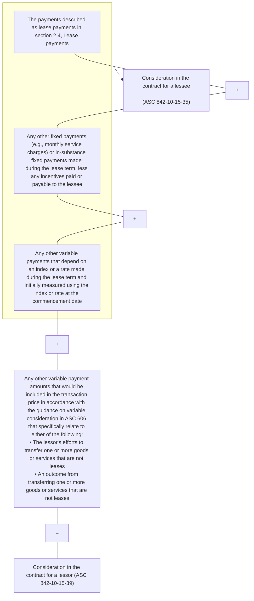


Financial reporting developments Lease accounting | 46

1 Scope and scope exceptions


### 1.4.4.2 Allocating the consideration in the contract — lessors

Lessors are required to apply the guidance in ASC 606-10-32-28 through 32-41 to allocate the consideration in the contract to lease and separate non-lease components if they (1) do not make an accounting policy election (by class of underlying asset) to use the optional practical expedient to not separate lease and associated non-lease components or (2) make the accounting policy election but have at least one non-lease component that does not qualify for the expedient. Refer to section 1.4.2.4, *Practical expedient to not separate lease and non-lease components — lessors*. The guidance in this section and section 1.4.4.3, *Allocating variable payments — lessors*, assumes the entity has separate lease and non-lease components to which consideration must be allocated.

Lessors are required to allocate consideration in the contract on a relative standalone selling price basis, except when allocating certain discounts (ASC 606-10-32-36 through 32-38) and certain variable consideration (ASC 606-10-32-39 through 32-41). Using the guidance in ASC 606, lessors may ultimately attribute all or portions of the consideration in the contract to specific lease and non-lease components.

The standalone selling price is the price at which an entity would sell a promised good or service separately to a customer. The best evidence of standalone selling price is the observable price of a good or service when the entity sells that good or service separately in similar circumstances and to similar customers.

When the standalone selling price is not directly observable, the lessor must estimate it. ASC 606-10-32-33 through 32-35 provides guidance for estimating the standalone selling price. Refer to section 6.1, *Determining standalone selling prices*, of our FRD, *Revenue from contracts with customers (ASC 606)*, for a discussion of determining the standalone selling price and estimation methods.

> **Illustration 1-12: Allocating the consideration in the contract (minimum purchase commitment of consumables)**
>
> MedCo enters into a three-year contract with Hospital Co to lease equipment (e.g., an MRI machine) at no stated cost and to sell consumables that will be used specifically with the equipment for $3.50 per unit. Under the contract, Hospital Co has a minimum purchase commitment of 5,000 consumable products for each year of the three-year lease term. At lease commencement, Hospital Co estimates that the total purchases of consumable products during the lease term are equal to the minimum purchase commitment.
>
> Under the terms of the contract, Hospital Co cannot use the equipment without the consumable products purchased exclusively from MedCo. Additionally, MedCo expects Hospital Co to purchase and use different amounts of consumable products each month.
>
> At the lease commencement date, MedCo determines the following standalone selling prices for the lease and non-lease components in the contract based upon observable transactions in which Medco leases the equipment and sells consumable products separately in similar circumstances to similar customers: $25,000 for the equipment for the three-year lease term and $2.50 per unit for the sale of consumables.
>
> *Analysis:* MedCo determines that there is one lease component (for the medical equipment) and one non-lease component (sales of consumable products) in the agreement. The lessor practical expedient does not apply in this example because the timing and pattern of transfer of the lease and non-lease components are not the same.


Financial reporting developments Lease accounting | 47

1 Scope and scope exceptions


At lease commencement, MedCo calculates the consideration in the contract to be $52,500 ($3.50 per unit x three-year lease term x 5,000 minimum required purchase of consumable units per year). MedCo applies the principles of ASC 606 to determine the standalone selling price of each component and the amount to allocate to each lease and non-lease component, as follows:

<table>
  <thead>
    <tr>
        <th>Equipment</th>
        <th>$ 25,000</th>
        <th>40%</th>
        <th>$ 21,000</th>
    </tr>
    <tr>
        <th>Consumable products</th>
        <th>37,500<sup>(a)</sup></th>
        <th>60%</th>
        <th>31,500</th>
    </tr>
    <tr>
        <th></th>
        <th>$ 62,500</th>
        <th>100%</th>
        <th>$ 52,500</th>
    </tr>
  </thead>
  <tbody>
    <tr>
        <td>Component</td>
        <td>SSP</td>
        <td>Relative percentage</td>
        <td>Allocation of contract consideration</td>
    </tr>
  </tbody>
</table>

(a) $2.50/unit x 3 years x 5,000 units per year = $37,500

Refer to Illustration 1-13 for a scenario in which the total purchases during the lease term are estimated to be greater than the minimum purchase commitment.

Refer to our FRD, *Revenue from contracts with customers (ASC 606)*, for additional details regarding recognition and measurement of the non-lease components.

### Illustration 1-13: Allocating the consideration in the contract (fixed payments and an option to purchase additional goods)

Lessee and Lessor enter into a two-year lease of medical equipment. Lessee agrees to pay a fixed payment of $50,000 per year. There are no variable lease payments that do not depend on an index or rate, and the lease would not result in selling losses if it was classified as a sales-type or direct financing lease. Legal title of the equipment passes to Lessee at the end of the lease term. Accordingly, Lessor classifies the lease as a sales-type lease. At lease commencement, the standalone price of a two-year lease of the equipment is $125,000.

Lessee also has the right, but not the obligation, to purchase disposables that are used with the medical equipment for $10 per disposable. At lease commencement, Lessor estimates that Lessee will purchase 20,000 disposables during the lease term. The price that Lessor charges Lessee for the disposables is consistent with the price that it charges other customers with a similar volume of purchases. Lessor concludes that the purchases of disposables are optional purchases and are not a form of variable consideration.

Lessor determines that the arrangement does not qualify for use of the lessor practical expedient in ASC 842-10-15-42A. That is, the lease of the medical equipment (i.e., the lease component) is not classified as an operating lease and the timing and pattern of transfer of the medical equipment and disposables (i.e., the non-lease components) are not the same (refer to section 1.4.2.4, *Practical expedient to not separate lease and non-lease components – lessors*). Therefore, under ASC 842, Lessor allocates the payments in the arrangement between the medical equipment and the disposables in a manner that is consistent with the transaction price allocation objective in ASC 606-10-32-28.

Lessor concludes that allocating the fixed payments of $100,000 ($50,000 per year x two years) entirely to the medical equipment would meet the allocation objective in ASC 606 because at lease commencement there are no existing non-lease components to which the fixed payments could be allocated. Lessor's allocation methodology also would not result in an overallocation of the fixed payments to the lease component (i.e., $100,000 is less than the standalone price of $125,000) and, therefore, is not inconsistent with the allocation objective in ASC 606.


Financial reporting developments Lease accounting | 48

1 Scope and scope exceptions


> Lessor will then allocate payments, if any, for optional future purchases of disposables between the medical equipment and the disposables on a relative standalone price basis determined at lease commencement. This allocation methodology considers that the fixed payments were allocated entirely to the equipment.
>
> Assume at lease commencement that Lessor determines that the standalone price of the disposables is $200,000 based on the estimated purchases of disposables during the lease term. Lessor allocates the fixed payments and the payments for the optional purchases as follows:
>
> <table>
  <thead>
    <tr>
        <th>&gt;</th>
        <th>$ 325,000</th>
        <th>$ 300,000</th>
        <th>$ 100,000</th>
        <th>$ 200,000</th>
        <th>100%</th>
    </tr>
  </thead>
  <tbody>
    <tr>
        <td>&gt; [thead]Component</td>
        <td>SSP</td>
        <td>Allocation of estimated payments<sup>(a)</sup></td>
        <td>Allocation of fixed payment</td>
        <td>Allocation of payments for optional purchases</td>
        <td>Allocation of payments for optional purchases - %</td>
    </tr>
    <tr>
        <td>&gt; Equipment</td>
        <td>$ 125,000</td>
        <td>$ 115,385<sup>(b)</sup></td>
        <td>$ 100,000</td>
        <td>$ 15,385</td>
        <td>8% <sup>(d)</sup></td>
    </tr>
    <tr>
        <td>&gt; Disposables</td>
        <td>200,000</td>
        <td>184,615<sup>(c)</sup></td>
        <td>-</td>
        <td>184,615</td>
        <td>92% <sup>(e)</sup></td>
    </tr>
    <tr>
        <td>&gt;</td>
        <td colspan="5"></td>
    </tr>
  </tbody>
</table>
>
> (a) $100,000 of fixed payments + $200,000 of estimated payments for disposables ($10 per disposable X 20,000 estimated disposables to be purchased)
> (b) (125,000/325,000) x 300,000
> (c) (200,000/325,000) x 300,000
> (d) 15,385/200,000
> (e) 184,615/200,000
>
> During the first year of the lease, Lessee purchases disposables totaling $100,000. Lessor allocates the payments to the lease and non-lease components as follows:
>
> Lease component: (($100,000 fixed payments/two years) + ($100,000 x 8%)) = $58,000
>
> Non-lease components (disposables): ($100,000 x 92%) = $92,000
>
> **Note:** This allocation methodology would not be appropriate for Lessee. Further, while Lessor's allocation methodology is consistent with the transaction price allocation objective in ASC 606, the use of other allocation methodologies may also be appropriate if those methodologies are consistent with the allocation objective in ASC 606.

### 1.4.4.3 Allocating variable payments — lessors (updated August 2025)

If an arrangement includes variable payments, a lessor should carefully analyze the nature of the variable payments and the components to which they relate to determine how to allocate those amounts. Refer to Appendix F, *Variable payments – lessor*, for a flowchart illustrating how a lessor accounts for variable payments.

**Variable payments included as consideration in the contract**

Under ASC 842, a lessor includes certain variable payments in consideration in the contract that are not included by lessees (i.e., variable payments that relate to the transfer of or the outcome from transferring one or more goods or services that are not leases). Those variable payments included in the consideration in the contract are estimated and constrained in accordance with the guidance on variable consideration in ASC 606 (refer to section 5.3, *Variable consideration*, in our FRD, *Revenue from contracts with customers (ASC 606)*). Refer to section 1.4.4.1, *Determining the consideration in the contract — lessors*.

Variable payments included as consideration in the contract are allocated entirely to the non-lease component(s) to which they specifically relate if doing so would be consistent with the transaction price allocation objective in ASC 606-10-32-28 (i.e., the variable payment would be allocated entirely to the non-lease component if doing so depicts the amount of consideration to which the lessor expects to be entitled in exchange for transferring the non-lease component).


Financial reporting developments Lease accounting | 49

1 Scope and scope exceptions


> **Excerpt from Accounting Standards Codification**
> **Revenue from Contracts with Customers — Overall**
>
> **Measurement**
>
> **606-10-32-28**
> The objective when allocating the **transaction price** is for an entity to allocate the transaction price to each **performance obligation** (or distinct good or service) in an amount that depicts the amount of consideration to which the entity expects to be entitled in exchange for transferring the promised goods or services to the **customer**.

If variable payments are not specifically related to the non-lease component(s) or if allocating the variable payments entirely to the non-lease component(s) is not consistent with the transaction price allocation objective in ASC 606-10-32-28, the consideration in the contract is generally allocated between lease and non-lease components on a relative standalone selling price basis. The variable payments that are included in the consideration in the contract and allocated to the lease component(s) are lease payments (not variable lease payments) for purposes of applying the guidance in ASC 842 (e.g., for purposes of lease classification — including application of the lease classification guidance for sales-type and direct financing leases with a selling loss — recognition and measurement). This is consistent with the outcome in Example 14, *Determining the Consideration in the Contract — Variable Payments, Case B — Variable Payments That Relate Specifically to a Nonlease Component*, in ASC 842 (refer to section 1.4.5, *Examples — identifying and separating components of a contract and determining and allocating the consideration in the contract*).

The following illustration on allocating variable payments included in the consideration in the contract is based on Example 14, *Determining the Consideration in the Contract — Variable Payments, Case B — Variable Payments That Relate Specifically to a Nonlease Component, and Case C — Allocating Variable Payments Entirely to a Nonlease Component*, in ASC 842 (refer to section 1.4.5, *Examples — identifying and separating components of a contract and determining and allocating the consideration in the contract*).

<table>
  <thead>
    <tr>
        <th>Illustration 1-14:</th>
        <th>Allocating the consideration in the contract: variable payments that specifically relate to the non-lease component</th>
    </tr>
  </thead>
  <tbody>
    <tr>
        <td>[colspan=2] Lessee and Lessor enter into a five-year lease of highly specialized equipment that includes specialized maintenance services on the equipment throughout the lease term. Lessee agrees to pay:&lt;br/&gt;&lt;br/&gt;* A fixed payment of $200,000 per year; and&lt;br/&gt;* A variable payment each year that is based on the number of hours that the equipment is operating at specified performance metrics (i.e., the equipment is not malfunctioning or inoperable)&lt;br/&gt;&lt;br/&gt;Assume Lessor properly concludes that the variable payments relate specifically to the outcome of its performance of the maintenance services (i.e., the non-lease component). Lessor evaluates the variable payments in accordance with the guidance on variable consideration in ASC 606 and estimates, using the expected value method, that it will be entitled to receive $50,000 in variable payments (subject to the constraint on variable consideration). Lessor measures the consideration in the contract at $1,050,000 ($200,000 x 5 years + $50,000 of estimated variable payments that specifically relate to the non-lease component). The standalone selling prices for the equipment and maintenance services are $1,350,000 and $200,000, respectively.</td>
    </tr>
  </tbody>
</table>
Financial reporting developments Lease accounting | 50

1 Scope and scope exceptions


> **Scenario 1**
>
> Lessor concludes that allocating the variable payment of $50,000 entirely to the maintenance services would reasonably depict the amount of consideration to which it expects to be entitled in exchange for providing the equipment and maintenance services (i.e., this would result in an allocation that is consistent with the transaction price allocation objective in ASC 606-10-32-28). In this case, Lessor allocates the consideration in the contract as follows:
>
> <table>
  <thead>
    <tr>
        <th>&gt;</th>
        <th>$ 1,550,000</th>
        <th>$ 1,000,000</th>
        <th>$ 50,000</th>
        <th>$ 1,050,000</th>
    </tr>
  </thead>
  <tbody>
    <tr>
        <td>&gt; Component</td>
        <td>Standalone Price</td>
        <td>Allocation of Fixed Payment</td>
        <td>Allocation of Variable Payment</td>
        <td>Total Allocation</td>
    </tr>
    <tr>
        <td>&gt; Equipment lease</td>
        <td>$ 1,350,000</td>
        <td>$ 870,968<sup>(a)</sup></td>
        <td>-</td>
        <td>$ 870,968</td>
    </tr>
    <tr>
        <td>&gt; Maintenance</td>
        <td>200,000</td>
        <td>129,032<sup>(b)</sup></td>
        <td>50,000</td>
        <td>179,032</td>
    </tr>
    <tr>
        <td>&gt;</td>
        <td colspan="4"></td>
    </tr>
  </tbody>
</table>
> <sup>(a)</sup> (1,350,000/1,550,000) x 1,000,000  
> <sup>(b)</sup> (200,000/1,550,000) x 1,000,000
>
> **Note:** If the consideration allocated to the maintenance services is significantly higher than the standalone selling price, this may indicate that the allocation is not consistent with the allocation objective in ASC 606-10-32-28 (i.e., allocating the variable payment entirely to the non-lease component may not depict the amount of consideration to which the lessor expects to be entitled in exchange for transferring the non-lease component).
>
> **Scenario 2**
>
> Lessor concludes that allocating the variable payments entirely to the maintenance services would not result in an allocation that is consistent with the allocation objective in ASC 606-10-32-28. In this case, Lessor allocates the entire consideration in the contract of $1,050,000 between the equipment lease (i.e., lease component) and maintenance services (i.e., non-lease component) on a relative standalone selling price basis as follows:
>
> <table>
  <thead>
    <tr>
        <th>&gt;</th>
        <th>$ 1,550,000</th>
        <th>$ 1,000,000</th>
        <th>$ 50,000</th>
        <th>$ 1,050,000</th>
    </tr>
  </thead>
  <tbody>
    <tr>
        <td>&gt; Component</td>
        <td>Standalone Price</td>
        <td>Allocation of Fixed Payment</td>
        <td>Allocation of Variable Payment</td>
        <td>Total Allocation</td>
    </tr>
    <tr>
        <td>&gt; Equipment lease</td>
        <td>$ 1,350,000</td>
        <td>$ 870,968<sup>(a)</sup></td>
        <td>$ 43,548<sup>(c)</sup></td>
        <td>$ 914,516</td>
    </tr>
    <tr>
        <td>&gt; Maintenance</td>
        <td>200,000</td>
        <td>129,032<sup>(b)</sup></td>
        <td>6,452<sup>(d)</sup></td>
        <td>135,484</td>
    </tr>
    <tr>
        <td>&gt;</td>
        <td colspan="4"></td>
    </tr>
  </tbody>
</table>
> <sup>(a)</sup> (1,350,000/1,550,000) x 1,000,000  
> <sup>(b)</sup> (200,000/1,550,000) x 1,000,000  
> <sup>(c)</sup> (1,350,000/1,550,000) x 50,000  
> <sup>(d)</sup> (200,000/1,550,000) x 50,000

### Variable payments not included as consideration in the contract

Variable payments that do not depend on an index or rate (e.g., performance- or usage-based payments) that relate to the lease component, even partially, are excluded from the consideration in the contract. For example, ASC 842-10-55-152 states that if the quality and condition of the underlying leased asset substantively affects whether a lessor receives potential variable payments, such variable payments are not solely related to the non-lease component (i.e., the potential variable payments are related to the lease component, even partially) and are excluded from the consideration in the contract. However, determining whether variable payments relate to the lease component, even partially, may require significant judgment in many cases.


Financial reporting developments Lease accounting | 51

1 Scope and scope exceptions


If the terms of a variable payment amount other than those in ASC 842-10-15-35 (refer to section 1.4.3.1, *Determining the consideration in the contract – lessees*) relate to the lease component, even partially, lessors do not recognize those payments before the changes in facts and circumstances on which the variable payment is based occur (e.g., when the lessee’s sales on which the amount of the variable payment depends occur). When the changes in facts and circumstances on which the variable payments are based occur, lessors allocate those payments to the lease and non-lease components. The allocation is on the same basis as the initial allocation of the consideration in the contract or on the same basis as the most recent reallocation if the contract was previously modified (ASC 842-10-15-40 and ASC 842-10-55-152) unless the variable payment meets the criteria in ASC 606-10-32-40 to be allocated only to the lease component(s).

After allocating, the amount of variable payments allocated to the lease component is recognized as income in profit or loss in accordance with ASC 842, and the amount allocated to the non-lease component is recognized in accordance with other guidance, such as ASC 606.

> **Illustration 1-15: Allocating the consideration in the contract: variable payments that relate to the lease component even partially**
>
> Entity A (lessee) and Entity B (lessor) enter into a three-year lease of retail space in a mall that includes common area maintenance throughout the lease term. Entity A agrees to pay a fixed payment of $100,000 per year and variable payments based on a percentage of sales. Entity B concludes that variable payments relate, at least partially, to the lease component and, therefore, Entity B measures the consideration in the contract at $300,000, which excludes the variable payments. Entity B allocates the consideration in the contract between the lease and maintenance services on the basis of relative standalone selling prices of each component, which, for purposes of this example, are $350,000 and $50,000.
>
> <table>
  <thead>
    <tr>
        <th>&gt;</th>
        <th>$ 400,000</th>
        <th>$ 300,000</th>
        <th></th>
    </tr>
  </thead>
  <tbody>
    <tr>
        <td>&gt; Component</td>
        <td>Standalone Price</td>
        <td>Allocation</td>
        <td>Calculation</td>
    </tr>
    <tr>
        <td>&gt; Retail lease</td>
        <td>$ 350,000</td>
        <td>$ 262,500</td>
        <td>($350,000/400,000) x 300,000</td>
    </tr>
    <tr>
        <td>&gt; Maintenance</td>
        <td>50,000</td>
        <td>37,500</td>
        <td>($50,000/400,000) x 300,000</td>
    </tr>
    <tr>
        <td>&gt;</td>
        <td colspan="3"></td>
    </tr>
  </tbody>
</table>
>
> Entity B subsequently allocates the income related to the variable payments between the lease and maintenance services on the same basis as the initial allocation of consideration in the contract or on the same basis as the most recent reallocation if the contract was previously modified.

### 1.4.4.4 Initial direct costs or contract costs – lessors
A lessor allocates any capitalized costs (e.g., initial direct costs or contract costs capitalized in accordance with ASC 340-40, *Other Assets and Deferred Costs – Contracts with Customers*) to the separate lease components or non-lease components to which those costs relate, unless the lessor applies the practical expedient to not separate lease and non-lease components as discussed in section 1.4.2.4, *Practical expedient to not separate lease and non-lease components – lessors*.

### 1.4.4.5 Reassessment: determining and allocating the consideration in the contract – lessors
> **Excerpt from Accounting Standards Codification**
> **Leases – Overall**
> **Scope and Scope Exceptions**
> **842-10-15-41**
> A lessor shall remeasure and reallocate the remaining consideration in the contract when there is a contract modification that is not accounted for as a separate contract in accordance with paragraph 842-10-25-8.


Financial reporting developments Lease accounting | 52

1 Scope and scope exceptions


> **842-10-15-42**
>
> If the consideration in the contract changes, a lessor shall allocate those changes in accordance with the requirements in paragraphs 606-10-32-42 through 32-45.
>
> **842-10-15-42A**
>
> As a practical expedient, a lessor may, as an accounting policy election, by class of underlying asset, choose to not separate nonlease components from lease components and, instead, to account for each separate lease component and the nonlease components associated with that lease component as a single component if the nonlease components otherwise would be accounted for under Topic 606 on revenue from contracts with customers and both of the following are met:
>
> a. The timing and pattern of transfer for the lease component and nonlease components associated with that lease component are the same.
> b. The lease component, if accounted for separately, would be classified as an operating lease in accordance with paragraphs 842-10-25-2 through 25-3A.
>
> **842-10-15-42B**
>
> A lessor that elects the practical expedient in paragraph 842-10-15-42A shall account for the combined component:
>
> a. As a single performance obligation entirely in accordance with Topic 606 if the nonlease component or components are the predominant component(s) of the combined component. In applying Topic 606, the entity shall do both of the following:
>    1. Use the same measure of progress as used for applying paragraph 842-10-15-42A(a)
>    2. Account for all variable payments related to any good or service, including the lease, that is part of the combined component in accordance with the guidance on variable consideration in Topic 606.
> b. Otherwise, as an operating lease entirely in accordance with this Topic. In applying this Topic, the entity shall account for all variable payments related to any good or service that is part of the combined component as variable lease payments.
>
> In determining whether a nonlease component or components are the predominant component(s) of a combined component, a lessor shall consider whether the lessee would be reasonably expected to ascribe more value to the nonlease component(s) than to the lease component.
>
> **842-10-15-42C**
>
> A lessor that elects the practical expedient in paragraph 842-10-15-42A shall combine all nonlease components that qualify for the practical expedient with the associated lease component and shall account for the combined component in accordance with paragraph 842-10-15-42B. A lessor shall separately account for nonlease components that do not qualify for the practical expedient. Accordingly, a lessor shall apply paragraphs 842-10-15-38 through 15-42 to account for nonlease components that do not qualify for the practical expedient.

Lessors will remeasure and reallocate the remaining consideration in the contract upon a contract modification (i.e., a change to the terms and conditions of the contract that results in a change in the scope of or the consideration for the lease) that is not accounted for as a separate contract. Refer to section 5.6, *Lease modifications*. We believe a lessor should update the standalone selling prices used to reallocate the consideration in the contract when there is a contract modification that is not accounted for as a separate contract.


Financial reporting developments Lease accounting | 53

1 Scope and scope exceptions


Lessors will apply the guidance in ASC 606-10-32-42 through 32-45 to allocate changes in the consideration in the contract that are not the result of a modification (e.g., the consideration in the contract changes if a lessor concludes in applying ASC 606 that there is a change in the amount it will receive for variable payments related to services that are not leases). That guidance generally requires lessors to allocate the subsequent changes between lease and non-lease components on the same basis as the initial allocation of the consideration in the contract (or on the same basis as the most recent reallocation if the contract was previously modified). Refer to section 6.5, *Changes in transaction price after contract inception*, of our FRD, *Revenue from contracts with customers (ASC 606)*, for a discussion of changes in transaction prices after contract inception. Although not considered a change in the consideration in the contract, lessors recognize changes to index- and rate-based variable payments in profit or loss in the period of the change and allocate those changes between lease and non-lease components on the same basis as the initial allocation (or most recent re-allocation) of consideration in the contract.

Refer to section 3.5.1, *Summary of lease reassessment and remeasurement requirements*. Refer to section 1.4.2.4, *Practical expedient to not separate lease and non-lease components — lessors*, for a discussion of the lessor practical expedient to combine lease and associated non-lease components.

### 1.4.5 Examples — identifying and separating components of a contract and determining and allocating the consideration in the contract

ASC 842 provides the following examples to illustrate how lessees and lessors identify and separate lease and non-lease components of a contract and determine and allocate the consideration in the contract.

> **Excerpt from Accounting Standards Codification**
> **Leases — Overall**
>
> **Implementations Guidance and Illustrations**
>
> ***Example 11 — Allocation of Consideration to Lease and Nonlease Components of a Contract***
>
> ***Case A — Allocation of Consideration in the Contract***
>
> **842-10-55-132**
> Lessor leases a bulldozer, a truck, and a crane to Lessee to be used in Lessee’s construction operations for three years. Lessor also agrees to maintain each piece of equipment throughout the lease term. The total consideration in the contract is $600,000, payable in $200,000 annual installments.
>
> **842-10-55-133**
> Lessee and Lessor both conclude that the leases of the bulldozer, the truck, and the crane are each separate lease components because both of the criteria in paragraph 842-10-15-28 are met. That is:
>
> a. The criterion in paragraph 842-10-15-28(a) is met because Lessee can benefit from each of the three pieces of equipment on its own or together with other readily available resources (for example, Lessee could readily lease or purchase an alternative truck or crane to use with the bulldozer).
>
> b. The criterion in paragraph 842-10-15-28(b) is met because, despite the fact that Lessee is leasing all three machines for one purpose (that is, to engage in construction operations), the machines are not highly dependent on or highly interrelated with each other. The machines are not, in effect, inputs to a combined single item for which Lessee is contracting. Lessor can fulfill each of its obligations to lease one of the underlying assets independently of its fulfillment of the other lease obligations, and Lessee’s ability to derive benefit from the lease of each piece of equipment is not significantly affected by its decision to lease or not lease the other equipment from Lessor.


Financial reporting developments Lease accounting | 54

1 Scope and scope exceptions


**842-10-55-134**
In accordance with paragraph 842-10-15-31, Lessee and Lessor will account for the nonlease maintenance services components separate from the three separate lease components (unless Lessee elects the practical expedient in paragraph 842-10-15-37 or Lessor elects the practical expedient in paragraph 842-10-15-42A when the conditions in that paragraph are met – see Case B [paragraphs 842-10-55-138 through 55-140] for an example in which Lessee elects the practical expedient). In accordance with the identifying performance obligations guidance in paragraphs 606-10-25-19 through 25-22, Lessor further concludes that its maintenance services for each piece of leased equipment are distinct and therefore separate performance obligations, resulting in the conclusion that there are three separate lease components and three separate nonlease components (that is, three maintenance service performance obligations).

**842-10-55-135**
Lessor allocates the consideration in the contract to the separate lease components and nonlease components by applying the guidance in paragraphs 606-10-32-28 through 32-41. The consideration allocated to each separate lease component constitutes the lease payments for purposes of Lessor’s accounting for those components.

**842-10-55-136**
Lessee allocates the consideration in the contract to the separate lease and nonlease components. Several suppliers provide maintenance services that relate to similar equipment such that there are observable standalone prices for the maintenance services for each piece of leased equipment. In addition, even though Lessor, who is the manufacturer of the equipment, requires that all leases of its equipment include maintenance services, Lessee is able to establish observable standalone prices for the three lease components on the basis of the price other lessors lease similar equipment on a standalone basis. The standalone prices for the separate lease and nonlease components are as follows.

<table>
  <thead>
    <tr>
        <th></th>
        <th>Lease</th>
        <th>Maintenance</th>
    </tr>
  </thead>
  <tbody>
    <tr>
        <td>Bulldozer</td>
        <td>$ 200,000</td>
        <td>$ 50,000</td>
    </tr>
    <tr>
        <td>Truck</td>
        <td>120,000</td>
        <td>20,000</td>
    </tr>
    <tr>
        <td>Crane</td>
        <td>240,000</td>
        <td>70,000</td>
    </tr>
    <tr>
        <td></td>
        <td>$ 560,000</td>
        <td>$ 140,000</td>
    </tr>
  </tbody>
</table>

**842-10-55-137**
Lessee first allocates the consideration in the contract ($600,000) to the lease and nonlease components on a relative basis, utilizing the observable standalone prices determined in paragraph 842-10-55-136. Lessee then accounts for each separate lease component in accordance with Subtopic 842-20, treating the allocated consideration as the lease payments for each lease component. The nonlease components are accounted for by Lessee in accordance with other Topics. The allocation of the consideration to the lease and nonlease components is as follows.

<table>
  <thead>
    <tr>
        <th></th>
        <th>Lease</th>
        <th>Maintenance</th>
    </tr>
  </thead>
  <tbody>
    <tr>
        <td>Bulldozer</td>
        <td>$ 171,429</td>
        <td>$ 42,857</td>
    </tr>
    <tr>
        <td>Truck</td>
        <td>102,857</td>
        <td>17,143</td>
    </tr>
    <tr>
        <td>Crane</td>
        <td>205,714</td>
        <td>60,000</td>
    </tr>
    <tr>
        <td></td>
        <td>$ 480,000</td>
        <td>$ 120,000</td>
    </tr>
  </tbody>
</table>


Financial reporting developments Lease accounting | 55

1 Scope and scope exceptions


The following example from ASC 842 assumes the same facts as Case A above except that the lessee has made an accounting policy election to use the practical expedient to not separate non-lease components from their associated lease components.

> ### Excerpt from Accounting Standards Codification
> **Leases — Overall**
>
> **Implementations Guidance and Illustrations**
>
> ***Example 11 — Allocation of Consideration to Lease and Nonlease Components of a Contract***
>
> ***Case B — Lessee Elects Practical Expedient to Not Separate Lease from Nonlease Components***
>
> **842-10-55-138**
> Assume the same facts and circumstances as in Case A (paragraphs 842-10-55-132 through 55-137), except that Lessee has made an accounting policy election to use the practical expedient to not separate nonlease from lease components for its leased construction equipment. Consequently, Lessee does not separate the maintenance services from the related lease components but, instead, accounts for the contract as containing only three lease components.
>
> **842-10-55-139**
> Because Lessor regularly leases each piece of equipment bundled together with maintenance services on a standalone basis, there are observable standalone prices for each of the three combined components, each of which includes the lease and the maintenance services. Because each of the three separate lease components includes the lease of the equipment and the related maintenance services, the observable standalone price for each component in this scenario is greater than the observable standalone price for each separate lease component that does not include the maintenance services in Case A.
>
> **842-10-55-140**
> Lessee allocates the consideration in the contract ($600,000) to the three separate lease components on a relative basis utilizing the observable standalone selling price of each separate lease component (inclusive of maintenance services) and then accounts for each separate lease component in accordance with the guidance in Subtopic 842-20, treating the allocated consideration as the lease payments for each separate lease component. The standalone prices for each of the three combined lease components is as follows.
>
> <table>
  <thead>
    <tr>
        <th>&gt;</th>
        <th>Standalone Price</th>
        <th>Relative Standalone Price</th>
    </tr>
    <tr>
        <th>&gt;</th>
        <th>$ 640,000</th>
        <th>$ 600,000</th>
    </tr>
  </thead>
  <tbody>
    <tr>
        <td>&gt; Bulldozer</td>
        <td>$ 230,000</td>
        <td>$ 215,625</td>
    </tr>
    <tr>
        <td>&gt; Truck</td>
        <td>130,000</td>
        <td>121,875</td>
    </tr>
    <tr>
        <td>&gt; Crane</td>
        <td>280,000</td>
        <td>262,500</td>
    </tr>
    <tr>
        <td>&gt;</td>
        <td colspan="2"></td>
    </tr>
  </tbody>
</table>


Financial reporting developments Lease accounting | 56

1 Scope and scope exceptions


ASC 842 provides the following examples to illustrate how lessees and lessors identify and separate lease and non-lease components of a contract and determine and allocate the consideration in the contract when there are variable payments that relate to the lease component and the non-lease component.

> ### Excerpt from Accounting Standards Codification
> **Leases — Overall**
>
> **Implementations Guidance and Illustrations**
>
> ***Example 14 — Determining the Consideration in the Contract — Variable Payments***
>
> ***Case A — Variable Payments That Relate to the Lease Component and the Nonlease Component***
>
> **842-10-55-150**
> Lessee and Lessor enter into a three-year lease of equipment that includes maintenance services on the equipment throughout the three-year lease term. Lessee will pay Lessor $100,000 per year plus an additional $7,000 each year that the equipment is operating a minimum number of hours at a specified level of productivity (that is, the equipment is not malfunctioning or inoperable). The potential $7,000 payment each year is variable because the payment depends on the equipment operating a minimum number of hours at a specified level of productivity. The lease is an operating lease.
>
> **842-10-55-151**
> In accordance with paragraph 842-10-15-35, variable payments other than those that depend on an index or a rate are not accounted for as consideration in the contract by Lessee. Therefore, the consideration in the contract to be allocated by Lessee to the equipment lease and the maintenance services at lease commencement includes only the fixed payments of $100,000 each year (or $300,000 in total). Lessee allocates the consideration in the contract to the equipment lease and the maintenance services on the basis of the standalone prices of each, which, for purposes of this example, are $285,000 and $45,000, respectively.
>
> <table>
  <thead>
    <tr>
        <th>&gt;</th>
        <th>Standalone Price</th>
        <th>Relative Standalone Price</th>
    </tr>
  </thead>
  <tbody>
    <tr>
        <td>&gt; Lease</td>
        <td>$ 285,000</td>
        <td>$ 259,091</td>
    </tr>
    <tr>
        <td>&gt; Maintenance</td>
        <td>45,000</td>
        <td>40,909</td>
    </tr>
    <tr>
        <td>&gt;</td>
        <td>$ 330,000</td>
        <td>$ 300,000</td>
    </tr>
    <tr>
        <td>&gt;</td>
        <td colspan="2"></td>
    </tr>
  </tbody>
</table>
>
> Each $100,000 annual fixed payment and each variable payment are allocated to the equipment lease and the maintenance services on the same basis as the initial allocation of the consideration in the contract (that is, 86.4 percent to the equipment lease and 13.6 percent to the maintenance services). Therefore, annual lease expense, excluding variable expense, is $86,364. Lessee recognizes the expense related to the variable payments in accordance with paragraphs 842-20-25-6 and 842-20-55-1 through 55-2.
>
> **842-10-55-152**
> In accordance with paragraphs 842-10-15-39 through 15-40, Lessor also concludes that the potential variable payments should not be accounted for as consideration in the contract. That is because the potential variable payment each year is not solely related to performance of the nonlease maintenance services; the quality and condition of the underlying asset also substantively affect whether Lessor will earn those amounts. Therefore, Lessor’s allocation of the consideration in the contract ($300,000) in this Example is the same as Lessee. Lessor will allocate, in accordance with paragraph 842-10-15-40, the variable payments between the lease and nonlease maintenance services (on the same basis as the initial allocation of the consideration in the contract), when and if the productivity targets are met. Lessor will recognize the portion allocated to the lease at that time and will recognize the portion allocated to the nonlease maintenance services in accordance with the guidance on satisfaction of performance obligations in Topic 606 on revenue from contracts with customers.


Financial reporting developments Lease accounting | 57

1 Scope and scope exceptions


The following example assumes the same facts as Case A above except that the variable payments relate specifically to a non-lease component.

> ### Excerpt from Accounting Standards Codification
> **Leases — Overall**
>
> **Implementations Guidance and Illustrations**
>
> **Example 14 — Determining the Consideration in the Contract — Variable Payments**
>
> **Case B — Variable Payments That Relate Specifically to a Nonlease Component**
>
> **842-10-55-153**
> Assume the same facts and circumstances as in Case A (paragraphs 842-10-55-150 through 55-152), except in this scenario the maintenance services are highly specialized and no entity would expect the equipment to meet the performance metrics without the specialized maintenance services.
>
> **842-10-55-154**
> Lessee would account for the potential variable payments consistent with Case A. The rationale for this accounting also is consistent with that in Case A.
>
> **842-10-55-155**
> In contrast to Case A, Lessor concludes that the variable payments relate specifically to an outcome from Lessor’s performance of its maintenance services. Therefore, Lessor evaluates the variable payments in accordance with the variable consideration guidance in paragraphs 606-10-32-5 through 32-13. If Lessor estimates, using the most likely amount method, that it will be entitled to receive the $21,000 in variable payments and that it is probable that including that amount in the transaction price for the maintenance services would not result in a significant revenue reversal when the uncertainty of the performance bonus is resolved, the $21,000 would be included in the consideration in the contract. Because allocating the $21,000 entirely to the maintenance services would not result in an allocation that is consistent with the allocation objective in paragraph 606-10-32-28 (that is, it would result in allocating $61,909 to the maintenance services and the remainder to the equipment lease, which would not reasonably depict the consideration to which Lessor expects to be entitled for each component), the entire consideration in the contract of $321,000 is allocated on a relative standalone price basis as follows.
>
> <table>
  <thead>
    <tr>
        <th>&gt;</th>
        <th>Standalone Price</th>
        <th>Relative Standalone Price</th>
    </tr>
  </thead>
  <tbody>
    <tr>
        <td>&gt; Lease</td>
        <td>$ 285,000</td>
        <td>$ 277,227</td>
    </tr>
    <tr>
        <td>&gt; Maintenance</td>
        <td>45,000</td>
        <td>43,773</td>
    </tr>
    <tr>
        <td>&gt;</td>
        <td>$ 330,000</td>
        <td>$ 321,000</td>
    </tr>
    <tr>
        <td>&gt;</td>
        <td colspan="2"></td>
    </tr>
  </tbody>
</table>
>
> **842-10-55-156**
> The $277,227 allocated to the equipment lease is the lease payment in accounting for the lease in accordance with Subtopic 842-30. Lessor will recognize the consideration in the contract allocated to the maintenance services in accordance with the guidance on the satisfaction of performance obligations in paragraphs 606-10-25-23 through 25-37. If the consideration in the contract changes (for example, because Lessor no longer estimates that it will receive the full $21,000 in potential variable payments), Lessor will allocate the change in the transaction price on the same basis as was initially done.


Financial reporting developments Lease accounting | 58

1 Scope and scope exceptions


The following example assumes the same facts as Case B above except that the variable payments relate specifically to a non-lease component.

> ### Excerpt from Accounting Standards Codification
> **Leases — Overall**
>
> **Implementations Guidance and Illustrations**
>
> **Example 14 — Determining the Consideration in the Contract — Variable Payments**
>
> **Case C — Allocating Variable Payments Entirely to a Nonlease Component**
>
> **842-10-55-157**
>
> Assume the same facts and circumstances as in Case B (paragraphs 842-10-55-153 through 55-156), except that in this scenario all of the following apply:
>
> a. The potential variable payments are $14,000 per year ($42,000 in total), and the annual fixed payments are $93,000 per year ($279,000 in total).
>
> b. While Lessor’s estimate of the variable payments to which it will be entitled is $42,000, Lessor concludes that it is not probable that including the full $42,000 in potential variable payments in the consideration in the contract will not result in a significant revenue reversal (that is, the entity applies the constraint on variable consideration in paragraph 606-10-32-11). Lessor concludes that only $28,000 is probable of not resulting in a significant revenue reversal. Therefore, the consideration in the contract is initially $307,000 ($279,000 + $28,000).
>
> **842-10-55-158**
>
> In contrast to Case B, Lessor concludes that allocating the variable payments entirely to the maintenance services and the fixed payments entirely to the equipment lease is consistent with the allocation objective in paragraph 606-10-32-28. This is because $42,000 (Lessor considers its estimate of the variable payments to which it expects to be entitled exclusive of the constraint on variable consideration in Topic 606 on revenue recognition) and $279,000 approximate the standalone price of the maintenance services ($45,000) and the equipment lease ($285,000), respectively. Because the variable payments are allocated entirely to the maintenance services, if the consideration in the contract changes (for example, because Lessor concludes it is now probable that it will earn the full $42,000 in variable payments), that change is allocated entirely to the maintenance services component in the contract.

## 1.5 Contract combinations (updated August 2025)

> ### Excerpt from Accounting Standards Codification
> **Leases — Overall**
>
> **Recognition**
>
> **842-10-25-19**
>
> An entity shall combine two or more **contracts**, at least one of which is or contains a **lease**, entered into at or near the same time with the same counterparty (or related parties) and consider the contracts as a single transaction if any of the following criteria are met:
>
> a. The contracts are negotiated as a package with the same commercial objective(s).
>
> b. The amount of consideration to be paid in one contract depends on the price or performance of the other contract.
>
> c. The rights to use **underlying assets** conveyed in the contracts (or some of the rights of use conveyed in the contracts) are a single lease component in accordance with paragraph 842-10-15-28.


Financial reporting developments Lease accounting | 59

1 Scope and scope exceptions


ASC 842 requires that two or more contracts entered into at or near the same time with the same counterparty (or related party) be considered a single contract if at least one of the contracts is or contains a lease and any one of the following criteria is met:

*   The contracts are negotiated as a package with the same commercial objective(s).
*   The amount of consideration to be paid in one contract depends on the price or performance of the other contract.
*   The rights to use the underlying assets conveyed in the contracts (or some of the rights of use conveyed in the contracts) are a single lease component (refer to section 1.4.1, *Identifying and separating lease components of a contract*).

The FASB indicated in the Basis for Conclusions (BC 165) of ASU 2016-02 that it developed these criteria to address concerns that separately accounting for multiple contracts may not result in a faithful representation of the combined transaction.

Under the contract combinations guidance, only contracts entered into with the same counterparty (or related parties) are potentially combined. That is, the application of the contract combinations guidance does not result in two contracts with unrelated parties being combined.

For example, consider a scenario in which a sublessee has a lease of real estate space with a sublessor. The sublessee's lease term ends at the same time as the sublessor's head lease ends with the head lessor. The head lessor and sublessor are not related parties. The sublessee wants to continue to use the real estate space after its sublease term ends, so during the sublease term, the sublessee negotiates a lease directly with the head lessor that will commence when the sublease ends.

Since the head lessor and sublessor are different and unrelated parties, the lease contract with the sublessor and the lease contract with the head lessor are accounted for as two separate leases. That is, these contracts cannot be combined even though each lease agreement is for the same real estate space. Therefore, the sublessee would continue its accounting for its existing sublease and later recognize a new lease at the commencement date of the lease with the head lessor. The sublessee would disclose it has a forward starting lease, if material, in the period before the new lease with the head lessor commences (see ASC 842-20-50-3(b) in section 4.10, *Disclosure*).

## 1.6 Lease broker transactions

The difficulty in accounting for lease broker transactions is often determining whether the broker transaction is in substance a lease. In certain leasing transactions, a lease broker acts as an intermediary between the lessor and the lessee. The lease broker fee arrangement can be a relatively simple one where a lump-sum cash payment is paid to the broker at closing (when all or substantially all of the services were rendered, and the broker has no future service commitments or obligations associated with the lease). In certain more complex leasing transactions, lease brokers often assume additional risks, offer additional services and sometimes receive additional benefits and compensation in various forms. Lease broker participation in the terms of the lease may be so extensive that the broker appears to be a lessor or a lessee and not merely an intermediary. As a result, what is intended to be a lease broker transaction may in certain cases be considered a lease. Alternatively, a lease broker may merely serve as an intermediary in substance.


Financial reporting developments Lease accounting | 60

1 Scope and scope exceptions


## 1.7 Acquisition of lease residual values

The following issues related to accounting for the purchase of lease interests or residual values are discussed in ASC 360, *Property, Plant, and Equipment*.

> ### Excerpt from Accounting Standards Codification
> **Leases — Lessor**
>
> **Derecognition**
>
> **842-30-40-4**
> For guidance on the acquisition of the residual value of an **underlying asset** by a third party, see paragraph 360-10-25-2.
>
> **Property, Plant, and Equipment — Overall**
>
> **Recognition**
>
> **360-10-25-2**
> This Section provides guidance on how a third-party entity shall account for the following:
>
> a. The acquisition from a lessor of the unconditional right to own and possess, at the end of the lease term, an asset subject to a lease
>
> b. The acquisition of the right to receive all, or a portion, of the proceeds from the sale of a leased asset at the end of the lease term.
>
> **360-10-25-3**
> At the date the rights in the preceding paragraph are acquired, both transactions involve a right to receive, at the end of the lease term, all, or a portion, of any future benefit to be derived from the leased asset and shall be accounted for as the acquisition of an asset. Both transactions are referred to as the acquisition of an interest in the residual value of a leased asset.
>
> **360-10-25-4**
> An interest in the residual value of a leased asset shall be recorded as an asset at the date the right is acquired.
>
> **Initial Measurement**
>
> **360-10-30-3**
> An interest in the residual value of a leased asset recognized under paragraph 360-10-25-4 shall be measured initially at the amount of cash disbursed, the fair value of other consideration given, and the present value of liabilities assumed.
>
> **360-10-30-4**
> The fair value of the interest in the residual value of the leased asset at the date of the agreement shall be used to measure its cost if that fair value is more clearly evident than the fair value of assets surrendered, services rendered, or liabilities assumed.
>
> **Subsequent Measurement**
>
> **360-10-35-13**
> The following paragraph provides guidance on how an entity acquiring an interest in the residual value of a leased asset shall account for that asset during the lease term.


Financial reporting developments Lease accounting | 61

1 Scope and scope exceptions


> **360-10-35-14**
>
> An entity acquiring an interest in the residual value of any leased asset, irrespective of the classification of the related lease by the lessor, shall not recognize increases to the asset's estimated value over the remaining term of the related lease, and the asset shall be reported at no more than its acquisition cost until sale or disposition. If it is subsequently determined that the fair value of the residual value of a leased asset has declined below the carrying amount of the acquired interest and that decline is other than temporary, the asset shall be written down to fair value, and the amount of the write-down shall be recognized as a loss. That fair value becomes the asset's new carrying amount, and the asset shall not be increased for any subsequent increase in its fair value before its sale or disposition.

The acquisition of the unconditional right to own and possess, at the end of the lease term, an asset subject to a lease or the right to receive all, or a portion, of the proceeds from the sale of a leased asset at the end of the lease are both transactions involving a right to receive all, or a portion, of any future benefit to be derived from the leased asset and should be accounted for as the acquisition of an asset. For the remainder of this section, both transactions are referred to as the acquisition of an interest in the residual value of a leased asset.

An interest in the residual value of a leased asset should be recorded as an asset at the amount of cash disbursed, the fair value of other consideration given and the present value of liabilities assumed at the date the right is acquired. The fair value of the interest in the residual value of the leased asset at the date of the agreement should be used to measure its cost if that fair value is more clearly evident than the fair value of assets surrendered, services rendered or liabilities assumed.

An enterprise acquiring an interest in the residual value of any leased asset, irrespective of the classification of the related lease by the lessor, should not recognize increases to the asset's estimated value over the remaining term of the related lease, and the asset should be reported at no more than its acquisition cost until sale or disposition. If it is subsequently determined that the fair value of the residual value of a leased asset has declined below the carrying amount of the acquired interest and that decline is other than temporary, the asset should be written down to fair value, and the amount of the write-down should be recognized as a loss. That fair value becomes the asset's new carrying amount, and the asset should not be increased for any subsequent increase in its fair value prior to its sale or disposition.

An interest in the residual value of a leased asset acquired by a lease broker for cash, liabilities assumed and the fair value of other consideration given, including services rendered, should be accounted for under this guidance.

## 1.8 Service concession arrangements

> ### Excerpt from Accounting Standards Codification
> **Service Concession Arrangements – Overall**
>
> **Overview and Background**
>
> **General**
>
> **853-10-05-1**
>
> A service concession arrangement is an arrangement between a grantor and an operating entity for which the terms provide that the operating entity will operate the grantor's infrastructure (for example, airports, roads, bridges, tunnels, prisons, and hospitals) for a specified period of time. The operating entity may also maintain the infrastructure. The infrastructure already may exist or may be constructed by the operating entity during the period of the service concession arrangement. If the infrastructure already exists, the operating entity may be required to provide significant upgrades as part of the arrangement. Service concession arrangements can take many different forms.


Financial reporting developments Lease accounting | 62

1 Scope and scope exceptions


> **853-10-05-2**
>
> In a typical service concession arrangement, an operating entity operates and maintains for a period of time the infrastructure of the grantor that will be used to provide a public service. In exchange, the operating entity may receive payments from the grantor to perform those services. Those payments may be paid as the services are performed or over an extended period of time. Additionally, the operating entity may be given a right to charge the public (the third-party users) to use the infrastructure. The arrangement also may contain an unconditional guarantee from the grantor under which the grantor provides a guaranteed minimum payment if the fees collected from the third-party users do not reach a specified minimum threshold. This Topic provides guidance for reporting entities when they enter into a service concession arrangement with a public sector grantor who controls or has the ability to modify or approve the services that the operating entity must provide with the infrastructure, to whom it must provide them, and at what price (which could be set within a specified range). The grantor also controls, through ownership, beneficial entitlement, or otherwise, any residual interest in the infrastructure at the end of the term of the arrangement.

A service concession arrangement is an arrangement between a grantor and an operating entity that operates the grantor's infrastructure for a specified period of time. Such arrangements may take various forms. A service concession arrangement within the scope of ASC 853 involves a public-sector entity grantor contracting with an operating entity to provide a public service, and the arrangement meets two additional criteria described in ASC 853-10-15-3 as discussed below. A public-sector entity grantor may be a governmental body (e.g., a municipal government, a state government) or another entity to which a governmental body has delegated responsibility for providing a public service (e.g., a regional airport authority, a municipal transportation authority). Under such arrangements, the operating entity generally operates and maintains the public-sector entity's infrastructure (e.g., a highway, bridge, parking facility, power plant, hospital) that fulfills a public service for a period of time, in exchange for consideration (e.g., payments from the grantor, the right to charge third-party users of the assets). The operating entity may also construct the public-sector entity's infrastructure or upgrade the existing infrastructure.

Although service concession arrangements historically have not been widely entered into either in the US or generally by US reporting entities, these arrangements are becoming more prevalent in certain industries, particularly in the energy and construction sectors (e.g., entities involved with assets such as power plants or bridges). However, all entities should evaluate each arrangement with a public-sector entity to determine whether the arrangement is in the scope of this guidance. Additionally, entities with equity method investees should also consider the accounting effects of their investees' service concession arrangements, if any.

### Excerpt from Accounting Standards Codification
**Service Concession Arrangements — Overall**

**Scope and Scope Exceptions**

***General***

**853-10-15-2**

The guidance in this Topic applies to the accounting by operating entities of a service concession arrangement under which a public-sector entity grantor enters into a contract with an operating entity to operate the grantor's infrastructure. The operating entity also may provide the construction, upgrading, or maintenance services of the grantor's infrastructure.


Financial reporting developments Lease accounting | 63

1 Scope and scope exceptions


ASC 853 applies only to an operating entity in a service concession arrangement that has the responsibility to provide a public service and involves a public-sector entity grantor (grantor) that meets the following two conditions:

*   The grantor controls or has the ability to modify or approve the services that the operating entity must provide with the infrastructure, to whom it must provide them and at what price.
*   The grantor controls, through ownership, beneficial entitlement or otherwise, any residual interest in the infrastructure at the end of the term of the arrangement.

### Public service

A feature of a service concession arrangement is that an operating entity provides a public service on behalf of a governmental entity. However, ASC 853 does not provide a framework for determining whether an arrangement between a grantor and an operating entity provides a public service or is a normal supplier-customer arrangement between two unrelated parties.

In some circumstances, it may be clear that the operating entity is providing a public service on behalf of a governmental entity (e.g., operating a highway used by the general public). However, judgment may be required when determining the substance of the arrangement.

ASC 853 also does not provide a framework for evaluating whether the grantor controls or has the ability to modify or approve the public services that must be provided, to whom they must be provided and at what price. To be in the scope of ASC 853, we believe the grantor should have the substantive ability to control, modify or approve:

*   The public services that the operator must provide,
*   To whom those public services must be provided, and
*   At what price those public services must be provided.

All three conditions must be met. Therefore, the terms and conditions of each arrangement, including the rights of the operating entity and grantor, should be evaluated carefully. For example, even though the operating entity may have certain managerial or day-to-day decision-making abilities in providing the required services (e.g., constructing, operating and maintaining a toll road), the grantor may retain the unilateral ability to control, modify or approve the services that the operating entity must provide with the infrastructure, to whom it must provide them, and at what price.

Importantly, a grantor need only have the ability to control, modify **or** (*emphasis added*) approve each of the conditions above. For example, a grantor may not control each condition in a contract where such conditions are agreed to up front (i.e., agreed to by both parties to the contract). However, the grantor may have to approve any changes, indicating the approval criteria would be met.

When assessing whether the grantor controls or has the ability to set, modify or approve the price of the service provided, the arrangement need not establish a specific price. As described in ASC 853-10-05-2, the price in a service concession arrangement "could be set within a specified range." Such arrangements should be evaluated to determine if the grantor set or approved the initially established price range and if it can also modify or must approve any subsequent price changes outside that range.

### Control of the residual interest

The contractual terms of the arrangement will generally specify whether the grantor or the operating entity controls through ownership (or other means) any residual interest in the infrastructure at the end of the term of the arrangement. We believe control of the residual interest is generally evidenced within the contractual arrangements (e.g., an automatic transfer; a substantive option allowing the government to purchase the asset; circumstances when the governmental entity can determine how the asset will be disposed of or transferred at the end of the arrangement).


Financial reporting developments Lease accounting | 64

1 Scope and scope exceptions


### Accounting for a service concession arrangement

For service concession arrangements that are in the scope of ASC 853, the operating entity should not account for the arrangement as a lease (i.e., in accordance with ASC 842) and should not recognize the infrastructure as property, plant and equipment (i.e., in accordance with ASC 360). Instead, the operating entity in the scope of ASC 853 should account for revenue from service concession arrangements in accordance with ASC 606. The accounting under ASC 606 may be similar to other non-lease service and management contracts where a party manages property or equipment on behalf of the owner.

The operating entity should refer to other US GAAP to account for the various other aspects of a service concession arrangement. The FASB did not specify which other aspects of US GAAP should be applied to service concession arrangements within the scope of ASC 853, except to say that service concession arrangements in the scope of both ASC 853 and ASC 980, *Regulated Operations*, should be accounted for using ASC 980 instead of ASC 853. Refer to section 1.8.1, *Service concession arrangements in regulated operations*, for additional information about service concession arrangements that may also be within the scope of ASC 980.

Arrangements not in the scope of ASC 853 should first be evaluated by the operating entity using the criteria in ASC 842 to determine whether lease accounting is appropriate.

The following example is provided to assist with the application of the service concession arrangements scope guidance in ASC 853-10-15-1 through 15-3:

> **Illustration 1-16: Accounting for a service concession arrangement**
>
> Company Q (Company Q or operating entity) enters into an arrangement with the State X Department of Transportation (referred to as the DOT), State X's governmental entity responsible for its public highways.
>
> Under the terms of the arrangement, Company Q will be required to perform the following services: construct, operate and maintain the DOT's toll highway for a period of 20 years. The arrangement does not contain any renewal periods.
>
> The DOT will control any residual interest in the highway at the end of the 20-year contractual period.
>
> The arrangement requires Company Q to operate the toll highway by allowing the public to access and travel upon the constructed highway (i.e., a public service) in exchange for a toll that will be collected from each vehicle. The arrangement does not provide Company Q with any rights to unilaterally change the services that it must provide with the highway (e.g., roadway maintenance, emergency access and services, rest area concessions) or to whom it must provide the services.
>
> The arrangement initially sets the toll within a specified range, determined by the DOT, of $0.50 to $1.00 per vehicle. Future changes to the toll amount (i.e., price changes outside the specified range) require the DOT's approval.
>
> *Analysis:* The arrangement is a service concession arrangement. The arrangement involves an operating entity (Company Q) contracting with a public-sector entity grantor (the DOT) to provide a public service, and the following two conditions are met:
>
> 1. The DOT controls or has the ability to modify or approve the services that the operating entity must provide with the toll highway, to whom it must provide them and at what price.
> 2. The DOT controls, through ownership, beneficial entitlement or otherwise, any residual interest in the toll highway at the end of the term of the arrangement.


Financial reporting developments Lease accounting | 65

1 Scope and scope exceptions


> Because the arrangement meets both criteria above, it is in the scope of ASC 853. Therefore, Company Q should not account for the service concession arrangement as a lease in accordance with ASC 842. Additionally, Company Q should not recognize the highway as its property, plant and equipment in accordance with ASC 360. Instead, Company Q should refer to other US GAAP to account for the aspects of the arrangement (e.g., revenue recognition guidance to account for tolls collected).

## 1.8.1 Service concession arrangements in regulated operations

> ### Excerpt from Accounting Standards Codification
> **Service Concession Arrangements — Overall**
>
> **Scope and Scope Exceptions**
>
> **General**
>
> **853-10-15-4**
> A service concession arrangement that meets the scope criteria in Topic 980 on regulated operations shall apply the guidance in that Topic and not follow the guidance in this Topic.

A common characteristic between regulated operations and service concession arrangements is that the grantor (i.e., the regulator in the case of regulated operations) determines the price that can be charged for the service. However, in regulated operations, the operating entity often controls the residual interest in the infrastructure (i.e., the infrastructure is often owned by the operating entity). Therefore, such arrangements in regulated operations generally would not be in the scope of ASC 853. In circumstances when the arrangement would otherwise be in the scope of both ASC 853 and ASC 980 (e.g., an arrangement with an operating entity where the grantor is a state-owned utility that retains control over any residual interest in the infrastructure), the FASB specified that the service concession arrangement should be accounted for using the guidance in ASC 980 (i.e., the guidance in ASC 853 should not be applied to such arrangements). Refer to ASC 980 for additional information about determining whether an arrangement is in the scope of that standard and for guidance about the recognition and measurement of such arrangements.


Financial reporting developments Lease accounting | 66

# 2 Key concepts

Lessees and lessors generally apply the same key concepts for purposes of identifying, classifying, recognizing and measuring lease contracts.

## 2.1 Inception of a contract

> **Excerpt from Accounting Standards Codification**
> **Leases — Overall**
>
> ***Scope and Scope Exceptions***
>
> ***842-10-15-2***
> At inception of a **contract**, an entity shall determine whether that contract is or contains a **lease**.

ASC 842-10-15-2 requires customers and suppliers to determine, at contract inception, whether a contract is a lease or contains a lease. Entities should consider other US GAAP to determine how to account for and disclose the existence of rights or obligations created between the inception of a contract that is or contains a lease and the commencement date of the lease (e.g., disclosures required by ASC 440, *Commitments*, or ASC 460, *Guarantees*).

## 2.2 Commencement date of the lease

> **Excerpt from Accounting Standards Codification**
> **Master Glossary**
>
> ***Commencement Date of the Lease (Commencement Date)***
>
> The date on which a **lessor** makes an **underlying asset** available for use by a **lessee**. See paragraphs 842-10-55-19 through 55-21 for implementation guidance on the commencement date.
>
> ***Underlying Asset***
>
> An asset that is the subject of a **lease** for which a right to use that asset has been conveyed to a **lessee**. The underlying asset could be a physically distinct portion of a single asset.
>
> **Leases — Overall**
>
> ***Implementation Guidance and Illustrations***
>
> ***842-10-55-19***
> In some **lease** arrangements, the **lessor** may make the **underlying asset** available for use by the **lessee** (for example, the lessee may take possession of or be given control over the use of the underlying asset) before it begins operations or makes **lease payments** under the terms of the lease. During this period, the lessee has the right to use the underlying asset and does so for the purpose of constructing a lessee asset (for example, leasehold improvements).
>
> ***842-10-55-20***
> The **contract** may require the lessee to make lease payments only after construction is completed and the lessee begins operations. Alternatively, some contracts require the lessee to make lease payments when it takes possession of or is given control over the use of the underlying asset. The timing of when lease payments begin under the contract does not affect the **commencement date** of the lease.


Financial reporting developments Lease accounting | 67

2 Key concepts


The commencement date is the date on which the lessor makes an underlying asset (i.e., the property, plant or equipment that is subject to the lease) available for use by the lessee. In some cases, the commencement date of the lease may be before the date stipulated in the lease agreement (e.g., the date rent becomes due and payable). This often occurs when the underlying asset is modified by the lessee prior to commencing operations with the underlying asset (e.g., during the period a lessee uses leased space to construct its own leasehold improvements). In making the assessment of lease commencement, it will often be necessary to distinguish between lessee and lessor assets (refer to section 2.11, *Improvements to the underlying asset*).

If a lessee takes possession of, or is given control over, the use of the underlying asset before it begins operations or before it begins making lease payments under the terms of the lease, the lease term has commenced even if the lessee is not required to pay rent or the lease arrangement states the lease commencement date is a later date. As a result, the straight-line rent computation for operating leases must include the deemed rent holiday period (refer to section 4.2.2, *Subsequent measurement — operating leases*, for a discussion of the subsequent measurement of an operating lease by a lessee and section 5.4.1, *Time pattern of use of property in an operating lease*, for a discussion of recognition of revenue for an operating lease by a lessor). The timing of when lease payments begin under the contract does not affect the commencement date of the lease. For example, a lessee (except lessees applying the short-term lease election discussed in section 4.1.1, *Short-term leases*) initially recognizes a lease liability and related right-of-use asset on the commencement date, and a lessor (for direct financing and most sales-type leases) initially recognizes its net investment in the lease on the commencement date.

<table>
  <thead>
    <tr>
        <th>Illustration 2-1: Determining the lease commencement date</th>
    </tr>
  </thead>
  <tbody>
    <tr>
        <td>**Scenario A**&lt;br/&gt;Assume that Entity A (the lessee) leases existing office space from Entity B (the lessor), and both parties execute the lease on 1 December 20X6. Entity B provides Entity A with access to the space on 1 February 20X7 so that Entity A can begin to construct its own leasehold improvements (i.e., the improvements are lessee assets). On 1 June 20X7, following substantial completion of construction of the leasehold improvements, the office space is in a condition for Entity A to begin using it for its operations and makes its first rental payment to Entity B.&lt;br/&gt;&lt;br/&gt;*Analysis:* The lease commencement date is 1 February 20X7, the date on which Entity B made the underlying asset available for use by Entity A. On the commencement date (i.e., 1 February 20X7), the lessee would generally recognize a right-of-use asset and a lease liability (refer to section 4, *Lessee accounting*) and the lessor (for direct financing and most sales-type leases) recognizes its net investment in the lease. Additionally, the lease commencement date would be 1 February 20X7 regardless of who is constructing the lessee owned leasehold improvements (i.e., the lessee, the lessor or a third party) and whether the lessor is finishing minor construction activities on the underlying asset after the lessee is granted access.&lt;br/&gt;&lt;br/&gt;**Scenario B**&lt;br/&gt;Assume the same facts as in Scenario A, except that the improvements being constructed by Entity A are lessor assets (i.e., they are not leasehold improvements of Entity A).&lt;br/&gt;&lt;br/&gt;*Analysis:* The lease commencement date is 1 June 20X7, the date on which Entity B made the underlying asset available for use by Entity A. On the commencement date (i.e., 1 June 20X7), the lessee would generally recognize a right-of-use asset and a lease liability (refer to section 4, *Lessee accounting*) and the lessor (for direct financing and most sales-type leases) recognizes its net investment in the lease.</td>
    </tr>
  </tbody>
</table>
Financial reporting developments Lease accounting | 68

2 Key concepts


## 2.2.1 Lease commencement date for master lease agreements

> ### Excerpt from Accounting Standards Codification
> **Leases — Overall**
>
> **Implementation Guidance and Illustrations**
>
> **842-10-55-17**
> Under a master **lease** agreement, the **lessee** may gain control over the use of additional **underlying assets** during the term of the agreement. If the agreement specifies a minimum number of units or dollar value of equipment, the lessee obtaining control over the use of those additional underlying assets is not a **lease modification**. Rather, the entity (whether a lessee or a **lessor**) applies the guidance in paragraphs 842-10-15-28 through 15-42 when identifying the separate lease components and allocating the **consideration in the contract** to those components. Paragraph 842-10-55-22 explains that a master lease agreement may, therefore, result in multiple **commencement dates**.
>
> **842-10-55-22**
> There may be multiple **commencement dates** resulting from a master **lease** agreement. That is because a master lease agreement may cover a significant number of **underlying assets**, each of which are made available for use by the **lessee** on different dates. Although a master lease agreement may specify that the lessee must take a minimum number of units or dollar value of equipment, there will be multiple commencement dates unless all of the underlying assets subject to that minimum are made available for use by the lessee on the same date.

A master lease agreement is a lease under which a lessee may gain control over the use of additional underlying assets during the term of the agreement. In certain cases, a master lease agreement specifies minimum and maximum equipment dollars or quantities that can be required to be leased. If the agreement specifies a minimum number of units or dollar value of equipment, the lessee obtaining control over the use of those additional underlying assets is not a lease modification.

There will be multiple commencement dates resulting from a master lease agreement unless all of the underlying assets are made available for use by the lessee on the same date (refer to section 1.4.1, *Identifying and separating lease components of a contract*, for discussion of when multiple assets may be accounted for as a single lease component). Entities would determine the commencement date for each underlying asset subject to a master lease agreement based on the date each underlying asset is made available for use by a lessee (refer to section 2.2, *Commencement date of the lease*).

## 2.3 Lease term and purchase options

## 2.3.1 Lease term

> ### Excerpt from Accounting Standards Codification
> **Master Glossary**
>
> **Lease Term**
>
> The noncancellable period for which a **lessee** has the right to use an **underlying asset**, together with all of the following:
>
> a. Periods covered by an option to extend the **lease** if the lessee is reasonably certain to exercise that option
>
> b. Periods covered by an option to terminate the lease if the lessee is reasonably certain not to exercise that option
>
> c. Periods covered by an option to extend (or not to terminate) the lease in which exercise of the option is controlled by the **lessor**.


Financial reporting developments Lease accounting | 69

2 Key concepts


### Leases — Overall
#### Initial Measurement
**842-10-30-1**
An entity shall determine the **lease term** as the noncancellable period of the **lease**, together with all of the following:
a. Periods covered by an option to extend the lease if the **lessee** is reasonably certain to exercise that option
b. Periods covered by an option to terminate the lease if the lessee is reasonably certain not to exercise that option
c. Periods covered by an option to extend (or not to terminate) the lease in which exercise of the option is controlled by the **lessor**.

**842-10-30-2**
At the **commencement date**, an entity shall include the periods described in paragraph 842-10-30-1 in the lease term having considered all relevant factors that create an economic incentive for the lessee (that is, **contract-based**, asset-based, entity-based, and market-based factors). Those factors shall be considered together, and the existence of any one factor does not necessarily signify that a lessee is reasonably certain to exercise or not to exercise an option.

#### Implementation Guidance and Illustrations
**842-10-55-25**
The lease term begins at the **commencement date** and includes any rent-free periods provided to the lessee by the lessor.

**842-10-55-26**
At the **commencement date**, an entity assesses whether the **lessee** is reasonably certain to exercise or not to exercise an option by considering all economic factors relevant to that assessment—contract-based, asset-based, market-based, and entity-based factors. An entity's assessment often will require the consideration of a combination of those factors because they are interrelated. Examples of economic factors to consider include, but are not limited to, any of the following:
a. Contractual terms and conditions for the optional periods compared with current market rates, such as:
   1. The amount of **lease payments** in any optional period
   2. The amount of any **variable lease payments** or other contingent payments, such as payments under termination penalties and **residual value guarantees**
   3. The terms and conditions of any options that are exercisable after initial optional periods (for example, the terms and conditions of a purchase option that is exercisable at the end of an extension period at a rate that is currently below market rates).
b. Significant leasehold improvements that are expected to have significant economic value for the lessee when the option to extend or terminate the **lease** or to purchase the **underlying asset** becomes exercisable.
c. Costs relating to the termination of the lease and the signing of a new lease, such as negotiation costs, relocation costs, costs of identifying another underlying asset suitable for the lessee's operations, or costs associated with returning the underlying asset in a contractually specified condition or to a contractually specified location.
d. The importance of that underlying asset to the lessee's operations, considering, for example, whether the underlying asset is a specialized asset and the location of the underlying asset.


Financial reporting developments Lease accounting | 70

2 Key concepts


<table>
  <thead>
    <tr>
        <th>Lease term</th>
        <th>Any noncancelable periods</th>
    </tr>
  </thead>
  <tbody>
    <tr>
        <td>[rowspan=3]</td>
        <td>Periods covered by an option to extend the lease if the lessee is reasonably certain to exercise that option</td>
    </tr>
    <tr>
        <td></td>
        <td>Periods covered by an option to terminate the lease if the lessee is reasonably certain **not** to exercise that option</td>
    </tr>
    <tr>
        <td></td>
        <td>Periods covered by an option to extend (or not terminate) the lease in which the exercise of the option is controlled by the lessor</td>
    </tr>
  </tbody>
</table>The lease term begins at the lease commencement date and is determined on that date based on the noncancelable term of the lease, together with all of the following:

*   Periods covered by an option to extend the lease if the lessee is reasonably certain to exercise that option
*   Periods covered by an option to terminate the lease if the lessee is reasonably certain **not** to exercise that option (that is, the lease term includes the period after the date of the termination option if the lessee is reasonably certain it will not exercise the option to terminate the lease)
*   Periods covered by an option to extend (or not terminate) the lease in which the exercise of the option is controlled by the lessor

The FASB indicated in the Basis for Conclusions (BC 195) of ASU 2016-02 that the phrase "reasonably certain" is generally interpreted as a high threshold. Refer to section 2.3.5, *Evaluating lease term and purchase options*, for further discussion on evaluating whether a lessee is reasonably certain to exercise an option to renew the lease, not terminate the lease or purchase the underlying asset.

### 2.3.1.1 Nonconsecutive periods of time
Lessees may enter into lease contracts for nonconsecutive periods of time. These arrangements meet the definition of a lease if the customer controls the right to use an identified asset throughout the agreed period of use in exchange for consideration. In these cases, the lease term is the sum of the nonconsecutive periods of time. For example, a retailer may enter into a noncancelable lease to use the same retail space for the months of October, November and December of each year for a period of five years. In this example, the lease term at the commencement date of the lease is 15 months (three months per year for the five annual periods specified in the contract).

### 2.3.2 Purchase options
> **Excerpt from Accounting Standards Codification**
> **Leases – Overall**
>
> **Initial Measurement**
>
> **842-10-30-3**
> At the commencement date, an entity shall assess an option to purchase the **underlying asset** on the same basis as an option to extend or not to terminate a lease, as described in paragraph 842-10-30-2.

Purchase options should be assessed in the same way as options to extend the lease term or terminate the lease. The FASB indicated in the Basis for Conclusions (BC 218) of ASU 2016-02 that an option to purchase an underlying asset is economically similar to an option to extend the lease term for the remaining economic life of the underlying asset. When a lease contains a purchase option and the lessee is reasonably certain to exercise that option, the lease is classified as a finance lease by a lessee and a sales-type lease by a lessor. Refer to section 3.1, *Criteria for lease classification – lessees*, or section 3.2, *Criteria for lease classification – lessors*.


Financial reporting developments Lease accounting | 71

2 Key concepts


## 2.3.3 Cancelable leases

> ### Excerpt from Accounting Standards Codification
> **Leases — Overall**
>
> **Implementation Guidance and Illustrations**
>
> **842-10-55-23**
> An entity should determine the noncancellable period of a **lease** when determining the **lease term**. When assessing the length of the noncancellable period of a lease, an entity should apply the definition of a **contract** and determine the period for which the contract is enforceable. A lease is no longer enforceable when both the **lessee** and the **lessor** each have the right to terminate the lease without permission from the other party with no more than an insignificant **penalty**.
>
> **842-10-55-24**
> If only a lessee has the right to terminate a lease, that right is considered to be an option to terminate the lease available to the lessee that an entity considers when determining the lease term, as described in paragraph 842-10-30-1(b). If only a lessor has the right to terminate a lease, the lease term includes the period covered by the option to terminate the lease, as described in paragraph 842-10-30-1(c).

ASC 842 applies to contracts that are referred to as "cancellable," "month-to-month," "at-will," "evergreen," "perpetual" or "rolling" if they create enforceable rights and obligations. An arrangement is not enforceable if both the lessee and the lessor each have the right to terminate the lease without permission from the other party and with no more than an insignificant penalty.

Any noncancelable periods (by the lessee and the lessor) in contracts that meet the definition of a lease are considered part of the lease term. If only a lessor has the right to terminate a lease, the period covered by the option to terminate the lease is included in the noncancelable period of the lease. The likelihood of the lessor exercising the termination option is not considered in evaluating the potential impact on the lease term. If only a lessee has the right to terminate a lease, that right is a termination option that is considered when determining the lease term.

### Illustration 2-2: Cancelable leases

**Scenario A**
A lease has an initial noncancelable period of one year and will be extended for an additional year under terms specified in the contract if both the lessee and the lessor agree. There is no penalty<sup>1</sup> if the lessee and the lessor do not agree to extend the term.

*Analysis:* The initial one-year noncancelable period meets the definition of a contract because it creates enforceable rights and obligations. However, the one-year extension period does not meet the definition of a contract because both the lessee and the lessor could unilaterally elect not to extend the arrangement without a more than insignificant penalty.<sup>1</sup>

**Scenario B**
A lease has an initial period of five years but can be terminated at the end of the third year at the option of the lessor. The lessee's consent is not required for the termination option to be exercised.

*Analysis:* The lease term consists of the initial five-year period because it creates enforceable rights and obligations that can only be terminated by the lessor.

**Scenario C**
A lease has an initial noncancelable period of two years. Neither the lessee nor the lessor can cancel the contract before the end of the second year. At the end of the second year, the contract automatically extends on a month-to-month basis for up to three years, unless either the lessor or the lessee exercises its unilateral right to terminate the contract. That is, after the second year, both the lessee and lessor have a right to terminate the lease without permission from the other party.


Financial reporting developments Lease accounting | 72

2 Key concepts


Further, assume the following as of the lease commencement date:

*   The terms and conditions for the lease (e.g., lease payments) for the monthly periods in years three through five are included in the contract.
*   The lessor would not suffer a more than insignificant penalty<sup>1</sup> if it terminated the contract at any time after the initial two years.
*   Due to the unique purpose and location of the underlying asset and the significance of the lessee’s leasehold improvements, the lessee would suffer a more than insignificant penalty<sup>1</sup> if it were to exercise its termination rights before the end of the third year. The lessee also concludes it is reasonably certain not to terminate the lease before the end of the third year.

*Analysis:* The initial two-year noncancelable period meets the definition of a contract. The first 12 monthly periods in year three are also included in the contract’s enforceable period because the lessee would suffer a more than insignificant penalty<sup>1</sup> if it were to terminate the lease before the end of the third year. Additionally, because both the lessee and the lessor have the right to terminate the contract without permission from the other party without a more than an insignificant penalty after the third year, the agreement does not create enforceable rights and obligations beyond the three-year period and therefore would no longer meet the definition of a contract. Consistent with ASC 842-10-55-24, the likelihood of the lessor exercising the termination option during year three is not considered in the evaluation of the lease term.

In this scenario, the lease term is three years because the lessee concludes it is reasonably certain not to terminate the lease during the third year.

The evaluation of whether a lessee is reasonably certain not to terminate a contract considers all facts and circumstances, including any more than insignificant penalty the lessee would incur at each termination date. The more significant the penalty the lessee would incur, the greater the likelihood that the lessee would be reasonably certain not to terminate the contract.

***

<sup>1</sup> Refer to section 2.3.4, *Penalty*, for a discussion of the definition of a penalty.

## 2.3.4 Penalty

> ### Excerpt from Accounting Standards Codification
> **Master Glossary**
>
> **Penalty**
>
> Any requirement that is imposed or can be imposed on the **lessee** by the **lease** agreement or by factors outside the lease agreement to do any of the following:
>
> a. Disburse cash
>
> b. Incur or assume a liability
>
> c. Perform services
>
> d. Surrender or transfer an asset or rights to an asset or otherwise forego an economic benefit, or suffer an economic detriment. Factors to consider in determining whether an economic detriment may be incurred include, but are not limited to, all of the following:
>
> 1. The uniqueness of purpose or location of the **underlying asset**
>
> 2. The availability of a comparable replacement asset
>
> 3. The relative importance or significance of the underlying asset to the continuation of the lessee's line of business or service to its customers


Financial reporting developments Lease accounting | 73

2 Key concepts


> 4. The existence of leasehold improvements or other assets whose value would be impaired by the lessee vacating or discontinuing use of the underlying asset
> 5. Adverse tax consequences
> 6. The ability or willingness of the lessee to bear the cost associated with relocation or replacement of the underlying asset at market rental rates or to tolerate other parties using the underlying asset.

A penalty is any requirement that is imposed or can be imposed on the lessee by the lease agreement or factors outside the lease agreement to distribute cash, incur or assume a liability, perform services, surrender or transfer an asset (or rights to an asset), to forgo an economic benefit or suffer an economic detriment.

A penalty may affect the assessment of lease term (refer to section 2.3.1, *Lease term*), purchase options and lease payments. As described in section 2.3.5.1, *Renewal penalty*, a penalty may be sufficiently large to make the exercise of a renewal option reasonably certain at lease commencement. Similarly, the existence of a penalty can cause the exercise of a purchase option to be reasonably certain. In instances where a penalty is not sufficiently large, in and of itself, to make a renewal or purchase option reasonably certain of exercise at lease commencement, the penalty (if payable to or on behalf of the lessor) is included in lease payments. For example, if a lease includes a penalty payable to the lessor for failure to renew, and the lessee determines that the penalty and other factors indicate that the renewal of the lease is not reasonably certain at commencement of the lease, the penalty should be included as a lease payment.

It is important to note that a penalty is not solely a payment to a lessor but may be a payment to a third party or a loss of future earnings by the lessee. For example, if a lessee leases equipment that is used to generate operating income and alternative equipment is not available, the loss of the ability to generate operating income might represent a penalty associated with terminating the lease. In addition, if a lessee can generate operating income by subleasing an underlying asset, the loss of the ability to generate sublease income might also represent a penalty associated with terminating the lease (refer to section 2.3.5.2, *The effect of a sublease on the lease term*). However, only penalties payable to or on behalf of the lessor are potentially lease payments (refer to section 2.4, *Lease payments*, for a discussion of items included in lease payments).

## 2.3.5 Evaluating lease term and purchase options

When evaluating whether a lessee is reasonably certain to exercise an option to renew the lease, not terminate the lease or to purchase the underlying asset, lessees and lessors are required to assess all relevant factors that create an economic incentive for the lessee to exercise lease renewal, termination or purchase options (i.e., contract-based, asset-based, entity-based and market-based factors), including:

*   The pricing of a purchase option or lease renewal option (e.g., fixed rates, discounted rates, "bargain" rates)
*   The amount of payments for termination or nonrenewal and the pricing of the continuing lease
*   Contingent amounts due under residual value guarantees and other variable lease payments
*   Costs of returning the asset in a contractually specified condition or to a contractually specified location
*   Significant customization (e.g., leasehold improvements), installation costs or relocation costs
*   The importance of the underlying asset to the lessee's operations, considering the potential business disruptions from not having the underlying asset and the availability of a replacement asset
*   A sublease term that extends beyond the noncancelable period of the head lease (e.g., a head lease that has a noncancelable term of five years with a two-year renewal option, and the sublease term is for seven years)
*   A guarantee by the lessee of the lessor's debt directly or indirectly related to the underlying asset


Financial reporting developments Lease accounting | 74

2 Key concepts


The term "reasonably certain" is generally considered to be a high threshold (refer to section 2.3.1, *Lease term*).

The longer the period from commencement of the lease (refer to section 2.2, *Commencement date of the lease*) to the exercise date of an option, the more difficult it will be, in certain cases, to determine whether the exercise of the option is reasonably certain. The difficulty arises from several factors. For example, a lessee's estimates of its future needs for the underlying asset become less precise the further into the future the forecast goes. Also, the future fair value of certain assets, such as those involving technology, is more difficult to predict than the future fair value of a relatively stable asset, such as a fully leased commercial office building located in a prime area.

The further into the future the option date is, the lower the option price must be in relation to the estimated future fair value to conclude that the lessee is reasonably certain to exercise the option simply based on option pricing. The difference between the option price and the estimated future fair value of an asset that is subject to significant changes in value also should be greater than would be the case for an asset with a relatively stable value.

An artificially short lease term (e.g., a lease of a corporate headquarters, distribution facility, manufacturing plant or other key property with a four-year lease term) may effectively create a significant economic incentive for the lessee to exercise a purchase or renewal option. This may be evidenced by the significance of the underlying asset to the lessee's continuing operations and whether, absent the option, the lessee would have entered into such a lease.

Similarly, the significance of the underlying asset to the lessee's operations may create a significant economic disincentive that affects a lessee's decisions about whether it is reasonably certain to exercise a purchase or renewal option. For example, a company that leases a specialized facility (e.g., manufacturing plant, distribution facility, corporate headquarters) and does not exercise a purchase or renewal option would face a significant economic penalty if an alternative facility is not readily available. This would potentially have an adverse effect on the company while it searched for a replacement asset.

Consistent with paragraph B40 of IFRS 16, we believe that a lessee's past practice regarding the period over which it typically has used particular types of assets (whether leased or owned), and its economic incentives for doing so, may provide information that is helpful in assessing whether the lessee is reasonably certain to exercise, or not to exercise, an option. For example, if a lessee has typically used particular types of assets for a particular period of time or if the lessee has a practice of frequently exercising options on leases of particular types of underlying assets, we believe the lessee should consider the economic incentives for that past practice in assessing whether it is reasonably certain to exercise an option on leases of those assets.

> **Illustration 2-3: Determining the lease term**
>
> **Scenario A**
>
> Assume that Entity P enters into a lease for equipment that includes a noncancelable term of four years and a two-year fixed-price renewal option with future lease payments that are intended to approximate market rates at lease inception. There are no termination penalties or other factors indicating that Entity P is reasonably certain to exercise the renewal option.
>
> *Analysis:* At the lease commencement date, the lease term is four years.
>
> **Scenario B**
>
> Assume that Entity Q enters into a lease for a building that includes a noncancelable term of four years and a two-year, fixed-price renewal option with future lease payments that are intended to approximate market rates at lease inception. Before it takes possession of the building, Entity Q pays for leasehold improvements. The leasehold improvements are expected to have significant value at the end of four years, and that value can only be realized through continued occupancy of the underlying asset.


Financial reporting developments Lease accounting | 75

2 Key concepts


> *Analysis:* At lease commencement, Entity Q determines that it is reasonably certain to exercise the renewal option because it would suffer a significant economic penalty if it abandoned the leasehold improvements at the end of the initial noncancelable period. At lease commencement, Entity Q concludes that the lease term is six years.

### 2.3.5.1 Renewal penalty

When a penalty for failure to renew a lease at the end of a lease term (prior to renewal term) is so significant that it is reasonably certain at the commencement date (refer to section 2.2, *Commencement date of the lease*) that the lease will be renewed, the renewal period is included in the lease term for purposes of determining a lease's classification.

The cancellation penalty must be sufficiently large to represent a significant economic deterrent to cancellation. Determining whether this is the case requires judgment about the particular circumstances. Other factors also should be considered, such as the expected availability of other assets to serve the lessee's needs, the practicality of surrendering the underlying asset and the attractiveness of the ongoing rental price.

### 2.3.5.2 The effect of a sublease on the lease term

In situations where a lessee grants (or intends to grant) a sublessee an initial lease term or renewal rights extending beyond the initial term of the lessee's head lease arrangement, the head lessee would consider any penalty (refer to section 2.3.4, *Penalty*) created by failure to renew the head lease as well as all other contract, asset and market-based factors that could potentially impact the head lease in evaluating whether it is reasonably certain to exercise options to extend or terminate the lease or purchase the underlying asset, which includes entering into a sublease (refer to section 2.3.5, *Evaluating lease term and purchase options*, and section 2.3.6, *Reassessment of the lease term and purchase options*).

When the lease term (including a renewal provision that the sublessee is reasonably certain to exercise) on the sublease extends longer than the lease term on the head lease, the lessee would revise its head lease term by assuming it is reasonably certain to exercise the renewal option on the head lease to be at least as long as the term on the sublease. If the lease term (including a renewal provision that the lessee is reasonably certain to exercise) on the sublease is shorter than the lease term on the head lease, the lessee may, after considering any penalties and all other contract, asset and market-based factors, conclude that the renewal provision on the head lease is not reasonably certain of exercise. That is, the existence of the renewal provision in the sublease, in and of itself, does not automatically result in the lessee assuming the exercise of the renewal options in the head lease are reasonably certain of exercise. The FASB staff, through a FASB technical inquiry, agreed with this view.

> **Illustration 2-4: Evaluating a lessee's head lease term when a sublease exists**
>
> Assume Entity A leases land (the head lease) for an initial five-year term followed by four successive five-year renewal options. Entity A immediately constructs a radio tower on the land and enters into a lease (as sublessor) with Radio Station B for an initial term of 10 years followed by three successive five-year renewals at Radio Station B's option. Entity A concludes Radio Station B is reasonably certain to exercise the first of its five-year renewal options based on consideration of all contract, asset and market-based factors, resulting in a total lease term on the sublease of 15 years.
>
> *Analysis:* The lease term used by Entity A in its accounting for the head lease would be at least 15 years (i.e., the noncancelable term of the sublease plus the five-year renewal period that Entity A has concluded Radio Station B is reasonably certain to exercise). If Radio Station B exercises its extension options beyond the 15-year lease term, Entity A would reassess the lease term on the head lease consistent with the guidance in ASC 842-10-55-28.


Financial reporting developments Lease accounting | 76

2 Key concepts


### 2.3.5.3 Guarantee of residual value at a point in time prior to expiration

Certain lease agreements enable a lessee to terminate the lease early, but such a termination results in the lessee guaranteeing the residual value of the underlying asset at the date of early termination. However, if the lease runs through its full term, the lessee does not guarantee the underlying asset's residual value. In such lease agreements, an assessment of the guaranteed residual value is required to determine whether it provides a significant incentive for the lessee to continue the lease for the full term. In certain cases, the guarantee of a residual value at a point in time prior to the end of the lease term may be considered an option to terminate the lease for purposes of determining lease term and lease payments (refer to section 2.4, *Lease payments*).

> **Illustration 2-5: Guarantee of residual value upon early termination**
>
> Assume a lessee guarantees to a lessor that if the lessee terminates a five-year lease at the end of three years, the residual value of the underlying asset at the end of three years will not be less than $3,000.
>
> *Analysis:* The lessee and lessor would evaluate the $3,000 residual value guarantee, in light of other factors, to determine whether it serves as a penalty such that the lessee is reasonably certain to not exercise its termination option due to the existence of the guarantee. If the lessee is reasonably certain to not exercise its termination option, the lease term would be five years.

Refer to section 2.4.6, *Amounts it is probable that a lessee will owe under residual value guarantees — lessees only*, for further discussion of evaluating residual value guarantees.

### 2.3.5.4 Fiscal funding clause

> **Excerpt from Accounting Standards Codification**
> **Master Glossary**
> **Fiscal Funding Clause**
> A provision by which the lease is cancelable if the legislature or other funding authority does not appropriate the funds necessary for the governmental unit to fulfill its obligations under the lease agreement.
>
> **Leases — Overall**
> **Implementation Guidance and Illustrations**
> **Fiscal Funding Clauses**
> **842-10-55-27**
> The existence of a **fiscal funding clause** in a **lease** agreement requires an assessment of the likelihood of lease cancellation through exercise of the fiscal funding clause. If it is more than **remote** that the fiscal funding clause will be exercised, the **lease term** should include only those periods for which funding is reasonably certain.

A fiscal funding clause is commonly found in a lease agreement in which the lessee is a governmental unit. A fiscal funding clause generally provides that the lease is cancelable if the legislature or other funding authority does not appropriate the funds necessary for the governmental unit to fulfill its obligations under the lease agreement.

The existence of a fiscal funding clause in a lease agreement would necessitate an assessment of the likelihood of lease cancellation through exercise of the fiscal funding clause. If the likelihood of exercise of the fiscal funding clause is assessed as being remote (i.e., the chance of occurring is slight), a lease agreement containing such a clause would be considered a noncancelable lease. If the chance of exercise is assessed as being more than remote, the lease term should include only those periods for which the funding is reasonably certain. Refer to section 2.3.3, *Cancelable leases*.


Financial reporting developments Lease accounting | 77

2 Key concepts


## 2.3.6 Reassessment of the lease term and purchase options

### 2.3.6.1 Reassessment of the lease term and purchase options – lessees (updated July 2024)

> **Excerpt from Accounting Standards Codification**
>
> **Leases – Overall**
>
> ***Subsequent Measurement***
>
> **842-10-35-1**
>
> A **lessee** shall reassess the **lease term** or a lessee option to purchase the **underlying asset** only if and at the point in time that any of the following occurs:
>
> a. There is a significant event or a significant change in circumstances that is within the control of the lessee that directly affects whether the lessee is reasonably certain to exercise or not to exercise an option to extend or terminate the **lease** or to purchase the underlying asset.
>
> b. There is an event that is written into the **contract** that obliges the lessee to exercise (or not to exercise) an option to extend or terminate the lease.
>
> c. The lessee elects to exercise an option even though the entity had previously determined that the lessee was not reasonably certain to do so.
>
> d. The lessee elects not to exercise an option even though the entity had previously determined that the lessee was reasonably certain to do so.
>
> ***Implementation Guidance and Illustrations***
>
> **842-10-55-28**
>
> Examples of significant events or significant changes in circumstances that a **lessee** should consider in accordance with paragraph 842-10-35-1 include, but are not limited to, the following:
>
> a. Constructing significant leasehold improvements that are expected to have significant economic value for the lessee when the option becomes exercisable
>
> b. Making significant modifications or customizations to the **underlying asset**
>
> c. Making a business decision that is directly relevant to the lessee's ability to exercise or not to exercise an option (for example, extending the **lease** of a complementary asset or disposing of an alternative asset)
>
> d. Subleasing the underlying asset for a period beyond the exercise date of the option.
>
> **842-10-55-29**
>
> A change in market-based factors (such as market rates to lease or purchase a comparable asset) should not, in isolation, trigger reassessment of the **lease term** or a lessee option to purchase the underlying asset.


Financial reporting developments Lease accounting | 78

2 Key concepts


After lease commencement (refer to section 2.2, *Commencement date of the lease*), ASC 842 requires lessees to monitor leases for significant changes that could trigger a change in the lease term. Lessees are required to reassess the lease term (i.e., the likelihood of exercising a renewal or termination option) or whether it is reasonably certain that they will exercise an option to purchase the underlying asset at the point in time when any of the following occurs:

<table>
  <thead>
    <tr>
        <th>Significant event or change in circumstance</th>
        <th>There is a significant event or significant change in circumstances **within the lessee's control** that directly affects whether the lessee is reasonably certain to (1) extend the lease, (2) not terminate the lease or (3) purchase the underlying asset.</th>
    </tr>
    <tr>
        <th>Contractual event</th>
        <th>There is an event that is written into the contract that obliges the lessee to exercise or not to exercise an option to extend or terminate the lease.</th>
    </tr>
    <tr>
        <th>Option exercised</th>
        <th>The lessee elects to exercise an option even though it had previously determined that it was not reasonably certain to do so.</th>
    </tr>
    <tr>
        <th>Option not exercised</th>
        <th>The lessee elects not to exercise an option even though it had previously determined that it was reasonably certain to do so.</th>
    </tr>
  </thead>
  <tbody>
    <tr>
        <td>Event</td>
        <td>Description</td>
    </tr>
  </tbody>
</table>

Examples of significant events or significant changes in circumstances **within the lessee's control** include:

*   Constructing significant leasehold improvements that are expected to have significant economic value for the lessee when the option becomes exercisable
*   Making significant modifications or customizations to the underlying asset
*   Making a business decision that is directly relevant to the lessee's ability to exercise or not exercise an option (e.g., extending the lease of a complementary asset or disposing of an alternative asset)
*   Subleasing the underlying asset for a period beyond the exercise date of the option

Changes in market-based factors (e.g., a change in market rates to lease or purchase a comparable asset) are not within the lessee's control, and they therefore do not trigger a reassessment by themselves. Further, events or changes in circumstances that indicate the carrying amount of an ROU asset may not be recoverable in accordance with ASC 360-10 that do not occur or arise as a result of an action that is within the control of the lessee do not, in isolation, trigger a reassessment of the lease term or a lessee option to purchase the underlying asset. Refer to section 4.2.5, *Impairment of right-of-use assets in operating leases*, and section 4.3.4, *Impairment of right-of-use assets in finance leases*.

The following examples illustrate changes in market-based factors that are not in the lessee's control and, therefore, would not, by themselves, trigger a reassessment.

<table>
  <tbody>
    <tr>
        <td>Illustration 2-6:</td>
        <td>Changes in market-based factors that are indicators of impairment in accordance with ASC 360-10</td>
    </tr>
    <tr>
        <td rowspan="2">Lessee experiences a decline in sales and negative cash flows at one of its leased stores due to the effects of inflation and rising interest rates. Lessee identified these factors as indicators of impairment under ASC 360-10 and tested the related asset group for recoverability under ASC 360-10.<br/><br/>**Analysis**<br/>The decline in sales and negative cash flows are market-based factors that are not within the lessee's control. While these indicators might trigger the requirement for Lessee to perform the recoverability test in accordance with ASC 360-10, an impairment evaluation and any related impairment loss recognized would not, by themselves, trigger a reassessment of the lease term in accordance with ASC 842-10-35-1(a).</td>
        <td></td>
    </tr>
  </tbody>
</table>


Financial reporting developments Lease accounting | 79

2 Key concepts


> **Illustration 2-7: Changes in market-based factors that change a lessee's assessment of whether it is reasonably certain to terminate a lease early**
>
> Lessee enters into a 10-year lease of a retail store with an option to terminate the lease after seven years. At lease commencement, Lessee is reasonably certain that it will not terminate the lease after seven years and concludes that the lease term is 10 years.
>
> After experiencing declining market conditions during the first five years of the lease, Lessee believes that it is no longer reasonably certain it will not terminate the lease after seven years. However, Lessee decides to wait until it is contractually required to notify the landlord about whether it is electing to terminate the lease.
>
> **Analysis**
>
> Although Lessee now believes it is no longer reasonably certain to not terminate the lease after seven years, Lessee would not reassess the lease term. That is, until there are significant events or significant changes in circumstances within Lessee's control that directly affect whether it is reasonably certain to not terminate the lease early (e.g., communicating to employees they will be terminated, altering significant supply contracts, announcing that the store will permanently close), then there is no reassessment event in accordance with ASC 842.

ASC 842-10-25-1 requires a lessee to reassess lease classification when there is a change in its assessment of either the lease term or whether it is reasonably certain to exercise an option to purchase the underlying asset. Refer to section 3.5, *Reassessment of lease classification*.

Additionally, if there is a change in a lessee's assessment of either the lease term or whether it is reasonably certain to exercise an option to purchase the underlying asset, a lessee should remeasure the lease liability, using revised inputs (e.g., discount rate and its allocation of contract consideration, discussed in section 2.5, *Discount rates*, and section 1.4.3.2, *Allocating the consideration in the contract — lessees*, respectively) at the reassessment date, and adjust the right-of-use asset. However, if the right-of-use asset is reduced to zero, a lessee would generally recognize any remaining amount in profit or loss. Refer to section 4.5, *Remeasurement of lease liabilities and right-of-use assets — operating and finance leases*.

Refer to section 3.5.1, *Summary of lease reassessment and remeasurement requirements*.

***

**Question 2-1** | **How should airlines assess the lease term of terminal leases that cover periods as short as 30 days and do not have contractual renewal options but for which the airline's right to renew the same or substantially similar space is guaranteed under US law? (added July 2024)**
--- | ---
| An airline's legal right to renew a terminal lease should be considered when determining the lease term. An airline will need to assess, for each lease, whether it is reasonably certain to exercise its right to renew and, if so, for what period.
| Determining whether the reasonably certain threshold has been met requires significant judgment. An airline might consider the following factors in its assessment:
| * How significant the airport is to the airline's operations (e.g., a hub airport)
| * Whether the airline has made significant leasehold improvements at the airport
| * Whether the airline has guaranteed the airport's debt
| * Whether the airline has other significant long-term assets related to the terminal lease (e.g., intangible assets related to rights to fly between two countries or to take off or land at an airport)


Financial reporting developments Lease accounting | 80

2 Key concepts


### 2.3.6.2 Reassessment of the lease term and purchase options – lessors

> **Excerpt from Accounting Standards Codification**
> **Leases – Overall**
> **Subsequent Measurement**
> **842-10-35-3**
> A **lessor** shall not reassess the lease term or a lessee option to purchase the underlying asset unless the lease is modified and that modification is not accounted for as a separate contract in accordance with paragraph 842-10-25-8. When a lessee exercises an option to extend the lease or purchase the underlying asset that the lessor previously determined the lessee was not reasonably certain to exercise or exercises an option to terminate the lease that the lessor previously determined the lessee was reasonably certain not to exercise, the lessor shall account for the exercise of that option in the same manner as a **lease modification**.

A lessor does not reassess the lease term or a lessee’s option to purchase the underlying asset unless the lease is modified (i.e., the terms and conditions of the contract are changed in a way that results in a change in the scope of the lease or the consideration) and the modified lease is not accounted for as a separate contract. Additionally, ASC 842-10-35-3 requires a lessor to account for a lessee’s exercise of an option to extend or terminate the lease or purchase the underlying asset in the same manner as a lease modification when the exercise is inconsistent with the lessor’s previous assumption about whether the lessee would exercise the option. Refer to section 5.6, *Lease modifications*. For example, if a lessor excluded an optional period to extend the lease from the lease term because it concluded that the lessee was not reasonably certain to exercise that option, the exercise of the option by the lessee should be accounted for as a lease modification.

Refer to section 3.5.1, *Summary of lease reassessment and remeasurement requirements*.

### 2.4 Lease payments (updated August 2025)

> **Excerpt from Accounting Standards Codification**
> **Master Glossary**
> **Lease Payments**
> See paragraph 842-10-30-5 for what constitutes lease payments from the perspective of a **lessee** and a **lessor**.
>
> **Variable Lease Payments**
> Payments made by a **lessee** to a **lessor** for the right to use an **underlying asset** that vary because of changes in facts or circumstances occurring after the **commencement date**, other than the passage of time.
>
> **Probable**
> The future event or events are likely to occur.
>
> **Residual Value Guarantee**
> A guarantee made to a **lessor** that the value of an **underlying asset** returned to the lessor at the end of a **lease** will be at least a specified amount.


Financial reporting developments Lease accounting | 81

2 Key concepts


### Leases – Overall
#### Initial Measurement
**842-10-30-5**
At the **commencement date**, the **lease payments** shall consist of the following payments relating to the use of the **underlying asset** during the **lease term**:

a. Fixed payments, including in substance fixed payments, less any lease incentives paid or payable to the **lessee** (see paragraphs 842-10-55-30 through 55-31).

b. **Variable lease payments** that depend on an index or a rate (such as the Consumer Price Index or a market interest rate), initially measured using the index or rate at the commencement date.

c. The exercise price of an option to purchase the underlying asset if the lessee is reasonably certain to exercise that option (assessed considering the factors in paragraph 842-10-55-26).

d. Payments for **penalties** for terminating the **lease** if the lease term (as determined in accordance with paragraph 842-10-30-1) reflects the lessee exercising an option to terminate the lease.

e. Fees paid by the lessee to the owners of a special-purpose entity for structuring the transaction. However, such fees shall not be included in the **fair value** of the underlying asset for purposes of applying paragraph 842-10-25-2(d).

f. For a lessee only, amounts **probable** of being owed by the lessee under **residual value guarantees** (see paragraphs 842-10-55-34 through 55-36).

**842-10-30-6**
Lease payments do not include any of the following:

a. Variable lease payments other than those in paragraph 842-10-30-5(b)

b. Any guarantee by the lessee of the **lessor's** debt

c. Amounts allocated to nonlease components in accordance with paragraphs 842-10-15-33 through 15-42.

> **Pending Content:**
> **Transition Date: (P) December 16, 2023; (N) December 16, 2023 | Transition Guidance: 842-10-65-8**
>
> Lease payments do not include any of the following:
>
> a. Variable lease payments other than those in paragraph 842-10-30-5(b)
>
> b. Any guarantee by the lessee of the **lessor's** debt
>
> c. Amounts allocated to nonlease components in accordance with paragraphs 842-10-15-33 through 15-42
>
> d. Leasehold improvements recognized by a lessee and accounted for in accordance with paragraph 842-20-35-12A.


Financial reporting developments Lease accounting | 82

2 Key concepts


Lease payments are payments, made by a lessee to a lessor (or a third party on behalf of the lessor), relating to the right to use an underlying asset during the lease term and include the following amounts:

### Lease payments<sup>7, 8</sup>

<table>
  <tbody>
    <tr>
        <td>Fixed (including in-substance fixed) payments, less any lease incentives paid or payable to the lessee¹</td>
        <td>Variable payments based on an index or rate²</td>
        <td>Exercise price of a purchase option³</td>
        <td>Payments for penalties for terminating the lease⁴</td>
        <td>Fees paid by the lessee to the owners of a special-purpose entity for structuring the transaction⁵</td>
        <td>Amounts it is probable that the lessee will owe under residual value guarantees (lessees only)⁶</td>
    </tr>
  </tbody>
</table>

> ¹ Refer to section 2.4.1, *Fixed (including in-substance fixed) lease payments and lease incentives*.
> ² Refer to section 2.4.2, *Variable lease payments that depend on an index or rate*.
> ³ Refer to section 2.4.3, *The exercise price of a purchase option*. Include only if reasonably certain of exercise.
> ⁴ Refer to section 2.4.4, *Payments for penalties for terminating a lease*. Include only if the lease term reflects the lessee exercising an option to terminate the lease.
> ⁵ Refer to section 2.4.5, *Fees paid by the lessee to the owners of a special-purpose entity for structuring the transaction*.
> ⁶ Refer to section 2.4.6, *Amounts it is probable that a lessee will owe under residual value guarantees – lessees only*.
> ⁷ Refer to section 2.4.7, *Payments made by a lessee prior to the beginning of the lease term*.
> ⁸ In some cases, a lessee may incur costs or make payments (e.g., to the lessor or a third party) for lessor assets (e.g., improvements to the underlying asset). These payments are treated in the same manner as making a cash payment to the lessor and are accounted for as either fixed or variable payments. Determining whether the payments are fixed or variable depends on the terms and conditions of the contract. Refer to section 2.4.1, *Fixed (including in-substance fixed) lease payments and lease incentives*, and section 2.4.2, *Variable lease payments that depend on an index or rate*.

Lease payments do not include consideration in the contract allocated to the non-lease components of a contract. However, lease payments include amounts that would otherwise be allocable to the non-lease components of a contract when the entity makes an accounting policy election to not separate lease and associated non-lease components and accounts for the combined component as a single lease component. Refer to section 1.4, *Identifying and separating lease and non-lease components of a contract and allocating contract consideration*.

Additionally, for lessors only, variable payments that are included in the consideration in the contract and allocated to the lease component(s) are lease payments (not variable lease payments) in applying the guidance in ASC 842 (e.g., for purposes of lease classification – including application of the lease classification guidance for sales-type and direct financing leases with a selling loss – recognition and measurement). Refer to section 1.4.4.3, *Allocating variable payments – lessors*.

ASC 842 does not specifically address noncash lease payments (e.g., equity shares or stock options of the lessee provided to the lessor, estimated costs to dismantle and remove an underlying asset at the end of the lease term imposed by the lease agreement as opposed to an asset retirement obligation (refer to section 2.4.8, *Lessee’s obligations for asset retirement obligations (AROs)*)). We believe that unless a form of consideration is specifically excluded, noncash lease payments should be included in lease payments at their fair value.

ASC 842-10-30-6 does explicitly note that lessee’s guarantees of lessor’s debt are excluded from lease payments (refer to section 2.4.10, *Amounts not included in lease payments*).

Similarly, a provision that requires lessee indemnifications for preexisting environmental contamination or environmental contamination caused by the lessee during its use of the underlying asset over the term of the lease does not affect classification of the lease. Therefore, noncash payments in the form of such indemnities are excluded from lease payments but only for purposes of lease classification (refer to section 3.4.8, *Lessee indemnifications for environmental contamination*).


Financial reporting developments Lease accounting | 83

2 Key concepts


## 2.4.1 Fixed (including in-substance fixed) lease payments and lease incentives

### 2.4.1.1 In-substance fixed lease payments (updated July 2024)

> **Excerpt from Accounting Standards Codification**
> **Leases — Overall**
>
> **Implementation Guidance and Illustrations**
>
> **842-10-55-31**
> **Lease payments** include in substance fixed lease payments. In substance fixed payments are payments that may, in form, appear to contain variability but are, in effect, unavoidable. In substance fixed payments for a **lessee** or a **lessor** may include, for example, any of the following:
>
> a. Payments that do not create genuine variability (such as those that result from clauses that do not have economic substance)
>
> b. The lower of the payments to be made when a lessee has a choice about which set of payments it makes, although it must make at least one set of payments.

Some lease agreements include payments that are described as variable or may appear to contain variability but are in-substance fixed payments because the contract terms require the payment of a fixed amount that is unavoidable (e.g., a lease that requires a lessee to pay percentage rent equal to 1% of its sales, subject to a minimum sales figure to be used). Such payments are included in the lease payments at lease commencement and thus used to measure entities’ lease assets and lease liabilities.

Certain lease agreements include lease payments that increase based on a multiple of a change in an index (e.g., the Consumer Price Index) with a cap. Questions arise as to whether this feature should be viewed as variable lease payments, a derivative or included as in-substance fixed lease payments at the capped amount. An example would be a lease of a retirement community where lease payments increase each year by the lesser of 3% or three times the annual increase in the Consumer Price Index. As discussed in ASC 842-10-30-5 (refer to section 2.4.2, *Variable lease payments that depend on an index or rate*), lease payments that depend on an existing index, such as the Consumer Price Index (CPI), should be included in lease payments based on the index at lease commencement, and any increases or decreases in lease payments that result from subsequent changes in the index should be reflected as they occur. However, the function of an index multiplier and a cap serves to significantly modify the arrangement from one in which the lease payments simply vary based on an index rate. Often, the combination of the multiplier and cap is specifically designed to make sure the cap is always reached.

We believe that lessees and lessors should evaluate provisions in lease arrangements that require an adjustment to lease payments based on a multiple of an index and a cap and determine whether these provisions represent genuine variability or whether these provisions are in-substance fixed lease payments. If the contingent rent feature does not create genuine variability (i.e., the increase in the index coupled with the multiplier and cap are designed such that the cap will be reached each year), the capped payments should be considered lease payments. This accounting, which applies to both lessors and lessees, affects lease payments not only for purposes of the lease classification test but also the lessee measurement of the right-of-use asset and lessor and lessee accounting for straight-line rent (subject to collectibility) under an operating lease. If the lessee or lessor determines that the index multiplier and cap do not represent in-substance fixed lease payments, the lessee or lessor would apply the embedded derivative guidance of ASC 815-15 and would likely conclude that inflation-indexed rentals that are subject to a leverage factor (e.g., three times the change in CPI) do not qualify for the clearly and closely related exception and, as a result, the portion of the rent attributed to the inflation index would be separated from the host contract (the lease) and accounted for as a derivative. The initial fair value of such a derivative would be treated as a day-one lease payment with subsequent changes in fair value accounted for under the applicable guidance in ASC 815, *Derivatives and Hedging*. Subsequent changes in the fair value of the derivative would be recognized in income at each reporting period.


Financial reporting developments Lease accounting | 84

2 Key concepts


The following example illustrates the accounting for in-substance fixed lease payments:

> **Illustration 2-8: In-substance fixed lease payments**
>
> Company A leases a building for five years with a fair value of $100 from Lessor B. The lease agreement provides that the lease payments start at $10 annually. The annual adjustment is based on three times the annual increase in the CPI, but the aggregate annual adjustment is limited to 3%.
>
> *Analysis:* Company A concludes that in substance, it has agreed, at the commencement date of the lease, to pay Lessor B additional lease payments in the amount of 3% per year. As a result, the 3% increase represents an in-substance fixed lease payment that would be included in the measurement of the right-of-use asset.
>
> The following would be the straight-line rent calculation for both the lessee and lessor:
>
> <table>
  <tbody>
    <tr>
        <td>&gt; Year</td>
        <td>Lease payments</td>
        <td>Straight-line rental revenue/expense¹</td>
    </tr>
    <tr>
        <td>&gt; 1</td>
        <td>$10.00</td>
        <td>$ 10.62</td>
    </tr>
    <tr>
        <td>&gt; 2</td>
        <td>$10.30 ($10.00 x 1.03)</td>
        <td>$ 10.62</td>
    </tr>
    <tr>
        <td>&gt; 3</td>
        <td>$10.61 ($10.30 x 1.03)</td>
        <td>$ 10.62</td>
    </tr>
    <tr>
        <td>&gt; 4</td>
        <td>$10.93 ($10.61 x 1.03)</td>
        <td>$ 10.62</td>
    </tr>
    <tr>
        <td>&gt; 5</td>
        <td>$11.26 ($10.93 x 1.03)</td>
        <td>$ 10.62</td>
    </tr>
    <tr>
        <td>&gt;</td>
        <td colspan="2"></td>
    </tr>
  </tbody>
</table>
> <sup>1</sup> If the multiplier of the CPI were considered a derivative instead of an in-substance lease payment (at the capped amount), the day-one fair value of the derivative would be included as a lease payment for purposes of determining straight-line rent (as well as assessing lease classification). Subsequent changes in the fair value of the derivative would be recognized in income at each reporting period.

**Question 2-2** **Contracts to use drilling rigs, often pricing terms that may appear to be fully variable. In such contracts and for purposes of measuring the lease liability and right-of-use asset, how does the lessee determine whether payments are in-substance fixed payments or variable payments? (added July 2024)**

Consideration paid for the use of drilling rigs is typically expressed as a rate paid for each operating day, hour or fraction of an hour. Examples of the types of rates a lessee may be charged include:

*   Full operating rate – a periodic rate charged when the rig is operating at full capacity with a full crew
*   Standby rate or cold-stack rate – a periodic rate charged when the lessee unilaterally puts the rig on standby
*   Major maintenance rate – a minimal periodic rate, which may in some cases be a "zero rate," charged when the lessor determines that maintenance needs to be performed and the rig is not available for use by the lessee
*   Inclement weather rate – a minimal periodic rate, which may in some cases be a "zero rate," charged when weather makes it dangerous to operate the rig and, therefore, to protect the lessor's asset, the underlying drilling rig is not available for use by the lessee

We believe, informed by discussions with the FASB staff, that there typically is a minimum rate in drilling contracts (i.e., fixed lease payments). When present, this amount is commonly the lowest rate that the lessee would pay while the asset is available for use by the lessee. Depending on the contract, this rate may be referred to using terms such as a standby or cold-stack rate. When identifying the lease payment (i.e., the in-substance fixed payment) in a drilling contract, an entity should only consider rates that apply when the asset is available for use by the lessee. Additional rates incurred would be considered variable lease payments. Further, rates that apply only when the asset is unavailable for use by the lessee (e.g., an inclement weather rate) are excluded for purposes of measuring the lease liability.


Financial reporting developments Lease accounting | 85

2 Key concepts


### 2.4.1.2 Lease incentives (updated August 2025)

> **Excerpt from Accounting Standards Codification**
> **Leases — Overall**
> **Implementation Guidance and Illustrations**
> **842-10-55-30**
> Lease incentives include both of the following:
>
> a. Payments made to or on behalf of the **lessee**
>
> b. Losses incurred by the **lessor** as a result of assuming a lessee's preexisting lease with a third party. In that circumstance, the lessor and the lessee should independently estimate any loss attributable to that assumption. For example, the lessee's estimate of the lease incentive could be based on a comparison of the new lease with the market rental rate available for similar **underlying assets** or the market rental rate from the same lessor without the lease assumption. The lessor should estimate any loss on the basis of the total remaining costs reduced by the expected benefits from the **sublease** for use of the assumed underlying asset.

A lease agreement with a lessor might include incentives for the lessee to sign the lease, such as an up-front cash payment to the lessee, payment of costs for the lessee (such as moving expenses) or the assumption by the lessor of the lessee's preexisting lease with a third party. Refer to section 4.7, *Lease incentives and improvements*, for further discussion of lease incentives.

#### Lessee
For lessees, lease incentives that are paid or payable to the lessee at lease commencement (or on the effective date of a lease modification) are deducted from lease payments, which affects the lease classification test and reduces the initial measurement of a lessee's right-of-use asset. Lease incentives that are payable to the lessee at lease commencement (or on the effective date of a lease modification) also reduce a lessee's lease liability.

**Illustration 2-9: Lessee accounting for lease incentives paid or payable at commencement**

On 1 January 20X1 (the commencement date of the lease), a lessee (Retailer) leases retail space in a shopping center for 10 years. Retailer agrees to pay a fixed payment per year of $100,000, due on 31 December of each year. The present value of the lease payments is $772,000 using a discount rate of 5%. Retailer incurs no initial direct costs. The lease is classified as an operating lease.

**Scenario A**
To incentivize Retailer to enter into the lease, the lessor pays Retailer $100,000 on the commencement date of the lease.

*Analysis:* Retailer records the right-of-use asset, lease liability and lease incentive on the commencement date as follows:

<table>
  <tbody>
    <tr>
        <td>Right-of-use asset</td>
        <td></td>
        <td>$ 672,000</td>
        <td></td>
        <td></td>
    </tr>
    <tr>
        <td>Cash</td>
        <td></td>
        <td>100,000</td>
        <td></td>
        <td></td>
    </tr>
    <tr>
        <td></td>
        <td>Lease liability</td>
        <td></td>
        <td></td>
        <td>$ 772,000</td>
    </tr>
  </tbody>
</table>

The following journal entries would be recorded in Year 1:

<table>
  <tbody>
    <tr>
        <td>Lease expense</td>
        <td></td>
        <td>$ 100,000</td>
        <td></td>
        <td></td>
    </tr>
    <tr>
        <td></td>
        <td>Cash</td>
        <td></td>
        <td></td>
        <td>$ 100,000</td>
    </tr>
  </tbody>
</table>

*To record lease expense and cash paid.*


Financial reporting developments Lease accounting | 86

2 Key concepts


<table>
  <tbody>
    <tr>
        <td>Right-of-use asset (amortization of lease incentive)</td>
        <td>$</td>
        <td>10,000</td>
        <td></td>
        <td></td>
    </tr>
    <tr>
        <td></td>
        <td>Lease expense (amortization of lease incentive)</td>
        <td></td>
        <td>$</td>
        <td>10,000</td>
    </tr>
  </tbody>
</table>

*To record amortization of the lease incentive ($100,000 ÷ 10 years = $10,000).*

<table>
  <tbody>
    <tr>
        <td>Lease liability</td>
        <td>$</td>
        <td>61,000</td>
        <td></td>
        <td></td>
    </tr>
    <tr>
        <td></td>
        <td>Right-of-use asset</td>
        <td></td>
        <td>$</td>
        <td>61,000</td>
    </tr>
  </tbody>
</table>

*To adjust the lease liability to the present value of the remaining lease payments with an offset to the right-of-use asset. The adjustment of $61,000 is calculated as the initially recognized lease liability ($772,000) less the present value of the remaining lease payments ($711,000) at the end of Year 1.*

### Scenario B

Assume the same facts as Scenario A. However, to incentivize Retailer to enter into the lease, the lessor agrees to pay Retailer $100,000 at the end of the first year of the lease (i.e., 31 December 20X1). There is no contingency associated with Retailer's right to receive the payment.

*Analysis:* In this scenario, the lease incentive receivable reduces Retailer's lease payments by the $100,000 when initially measuring the right-of-use asset and lease liability at lease commencement:

<table>
  <tbody>
    <tr>
        <td>Right-of-use asset</td>
        <td>$</td>
        <td>677,000</td>
        <td></td>
        <td></td>
    </tr>
    <tr>
        <td></td>
        <td>Lease liability</td>
        <td></td>
        <td>$</td>
        <td>677,000</td>
    </tr>
  </tbody>
</table>

*To record the right-of-use asset and lease liability at commencement. The lease liability of $677,000 is calculated as the 10 $100,000 payments less the $100,000 receivable from the lessor due in one year, discounted at 5%.*

The following journal entries would be recorded in Year 1:

<table>
  <tbody>
    <tr>
        <td>Lease expense</td>
        <td>$</td>
        <td>100,000</td>
        <td></td>
        <td></td>
    </tr>
    <tr>
        <td></td>
        <td>Cash</td>
        <td></td>
        <td>$</td>
        <td>100,000</td>
    </tr>
  </tbody>
</table>

*To record lease expense and cash paid.*

<table>
  <tbody>
    <tr>
        <td>Cash</td>
        <td>$</td>
        <td>100,000</td>
        <td></td>
        <td></td>
    </tr>
    <tr>
        <td></td>
        <td>Lease liability</td>
        <td></td>
        <td>$</td>
        <td>100,000</td>
    </tr>
  </tbody>
</table>

*To record the cash incentive received.*

<table>
  <tbody>
    <tr>
        <td>Right-of-use asset (amortization of lease incentive)</td>
        <td>$</td>
        <td>10,000</td>
        <td></td>
        <td></td>
    </tr>
    <tr>
        <td></td>
        <td>Lease expense (amortization of lease incentive)</td>
        <td></td>
        <td>$</td>
        <td>10,000</td>
    </tr>
  </tbody>
</table>

*To record amortization of the lease incentive ($100,000 ÷ 10 years = $10,000).*

<table>
  <tbody>
    <tr>
        <td>Lease liability</td>
        <td>$</td>
        <td>66,000</td>
        <td></td>
        <td></td>
    </tr>
    <tr>
        <td></td>
        <td>Right-of-use asset</td>
        <td></td>
        <td>$</td>
        <td>66,000</td>
    </tr>
  </tbody>
</table>

*To adjust the lease liability to the present value of the remaining lease payments with an offset to the right-of-use asset. The adjustment of $66,000 is calculated as the initially recognized lease liability ($677,000) plus the adjustment to the lease liability resulting from the cash receipt of the lease incentive ($100,000) less the present value of the remaining lease payments ($711,000) at the end of Year 1.*


Financial reporting developments Lease accounting | 87

2 Key concepts


ASC 842 does not provide guidance on how to recognize lease incentives that are neither paid nor payable at lease commencement or on the effective date of a lease modification. A lease incentive is neither paid nor payable at lease commencement or on the effective date of a lease modification if the timing and amount of payment from the landlord depend on future events (e.g., the timing and amount of the qualified costs a retailer incurs to construct leasehold improvements). We believe the following approaches would be acceptable:

*   Approach 1: If a lease specifies a maximum level of reimbursement (e.g., for constructing leasehold improvements) and the lessee is reasonably certain to incur reimbursable costs equal to or exceeding this level, the amount would be deemed payable by the lessor at the commencement date and it would be included in the measurement of the consideration in the contract at commencement. Therefore, the amount would be recognized as a reduction in the right-of-use asset and lease liability.
*   Approach 2: Once a lessee has incurred costs and the amounts qualify for reimbursement by the lessor, the lessee would reduce the right-of-use asset and lease liability by the costs incurred. The reduction to the right-of-use asset would be recognized prospectively over the remainder of the lease term.
*   Approach 3: Once a lessee has incurred costs and the amounts qualify for reimbursement by the lessor, the lessee would reduce the right-of-use asset and lease liability by the costs incurred, as in Approach 2. But in this approach, the reduction to the right-of-use asset would be recognized as a cumulative catch-up adjustment to expense, as if the incentive were paid or payable at the lease commencement date.

> **Illustration 2-10: Lessee accounting for lease incentives not paid or payable at commencement using Approach 1**
>
> On 1 January 20X1 (the commencement date of the lease), Lessee leases retail space in a shopping center from Lessor for 10 years. Lessee agrees to pay a fixed payment per year of $850,000, due on 31 December of each year. The present value of the lease payments is $6,563,000 using a discount rate of 5%. Lessee incurs no initial direct costs. The lease is classified as an operating lease.
>
> Lessor provides an incentive allowance to reimburse Lessee for the cost of leasehold improvements up to $100,000. Lessee is required to provide proof of payment of qualified expenditures to receive the incentive from Lessor. Lessor will pay the incentive at the end of the year in which the Lessee submits proof of payment (i.e., this may not be the year in which the costs are incurred).
>
> Assume the following at lease commencement:
>
> *   Lessee has incurred $10,000 of reimbursable costs associated with design of the leasehold improvements and has submitted a request for payment to Lessor (i.e., the incentive will be paid at the end of year 1).
> *   Lessee has contracted for and is reasonably certain it will incur costs in excess of the maximum allowance of $100,000 to construct the remaining leasehold improvements by the end of the first year of the lease term.
>
> Assume the following at the end of year 1:
>
> *   Lessee receives the cash incentive of $10,000 for reimbursable costs incurred prior to lease commencement and submitted to Lessor at lease commencement.
> *   Lessee incurs the remaining reimbursable costs of $90,000 at a single point in time (at the end of the first year of the lease term) and plans to submit the request for payment to Lessor in year 2.


Financial reporting developments Lease accounting | 88

2 Key concepts


Assume the following at the end of year 2:

*   Lessee receives the cash incentive of $90,000 for reimbursable costs incurred in year 1 that the Lessee submitted to Lessor in year 2.

### Journal entries

The full lease incentive of $100,000 is deemed payable by the lessor at the commencement date because the lease specifies a maximum level of reimbursement and the lessee is reasonably certain to incur costs equal to or exceeding this level. For simplicity, amounts separately capitalized by the lessee as leasehold improvements (in accordance with ASC 360-10) are not included in this illustration.

At lease commencement, the lease incentive reduces Lessee’s lease payments by the full amount of the lease incentive when initially measuring the right-of-use asset and lease liability:

<table>
  <tbody>
    <tr>
        <td>Right-of-use asset</td>
        <td>$ 6,472,000</td>
        <td></td>
    </tr>
    <tr>
        <td>Lease liability</td>
        <td></td>
        <td>$ 6,472,000</td>
    </tr>
  </tbody>
</table>
*To record the right-of-use asset and lease liability at lease commencement. The ROU asset and lease liability of $6,472,000 are calculated as the present value of (1) the 10 annual $850,000 payments less (2) the $10,000 lease incentive receivable from Lessor at the end of year 1 and less (3) the $90,000 lease incentive expected to be received from Lessor at the end of year 2.*

The following journal entries would be recorded in year 1:

<table>
  <tbody>
    <tr>
        <td>Lease expense</td>
        <td>$ 850,000</td>
        <td></td>
    </tr>
    <tr>
        <td>Cash</td>
        <td></td>
        <td>$ 850,000</td>
    </tr>
  </tbody>
</table>
*To record lease expense and cash paid.*

<table>
  <tbody>
    <tr>
        <td>Cash</td>
        <td>$ 10,000</td>
        <td></td>
    </tr>
    <tr>
        <td>Lease liability</td>
        <td></td>
        <td>$ 10,000</td>
    </tr>
  </tbody>
</table>
*To record the cash incentive of $10,000 received for reimbursable costs submitted to Lessor at lease commencement.*

<table>
  <tbody>
    <tr>
        <td>Right-of-use asset (amortization of lease incentive)</td>
        <td>$ 10,000</td>
        <td></td>
    </tr>
    <tr>
        <td>Lease expense (amortization of lease incentive)</td>
        <td></td>
        <td>$ 10,000</td>
    </tr>
  </tbody>
</table>
*To record amortization of the lease incentive ($100,000 ÷ 10 years = $10,000).*

<table>
  <tbody>
    <tr>
        <td>Lease liability</td>
        <td>$ 526,000</td>
        <td></td>
    </tr>
    <tr>
        <td>Right-of-use asset</td>
        <td></td>
        <td>$ 526,000</td>
    </tr>
  </tbody>
</table>
*To adjust the lease liability to the present value of the remaining lease payments with an offset to the right-of-use asset. The adjustment of $526,000 is calculated as the accretion of the lease liability ($6,472,000 x 5% = $324,000) less the annual cash lease payment ($850,000).*

The following journal entries would be recorded in year 2:

<table>
  <tbody>
    <tr>
        <td>Lease expense</td>
        <td>$ 850,000</td>
        <td></td>
    </tr>
    <tr>
        <td>Cash</td>
        <td></td>
        <td>$ 850,000</td>
    </tr>
  </tbody>
</table>
*To record lease expense and cash paid.*

<table>
  <tbody>
    <tr>
        <td>Cash</td>
        <td>$ 90,000</td>
        <td></td>
    </tr>
    <tr>
        <td>Lease liability</td>
        <td></td>
        <td>$ 90,000</td>
    </tr>
  </tbody>
</table>
*To record the cash incentive of $90,000 received for reimbursable costs submitted to Lessor at the end of year 1.*


Financial reporting developments Lease accounting | 89

2 Key concepts


<table>
  <tbody>
    <tr>
        <td>Right-of-use asset (amortization of lease incentive)</td>
        <td>$ 10,000</td>
        <td></td>
    </tr>
    <tr>
        <td>Lease expense (amortization of lease incentive)</td>
        <td></td>
        <td>$ 10,000</td>
    </tr>
    <tr>
        <td colspan="3">To record amortization of the lease incentive ($100,000 ÷ 10 years = $10,000).</td>
    </tr>
    <tr>
        <td>Lease liability</td>
        <td>$ 552,000</td>
        <td></td>
    </tr>
    <tr>
        <td>Right-of-use asset</td>
        <td></td>
        <td>$ 552,000</td>
    </tr>
    <tr>
        <td colspan="3">To adjust the lease liability to the present value of the remaining lease payments with an offset to the right-of-use asset. The adjustment of $552,000 is calculated as the accretion of the lease liability ($5,956,000 x 5% = $298,000) less the annual cash lease payment ($850,000).</td>
    </tr>
  </tbody>
</table>

The following journal entries would be recorded in year 3:

<table>
  <tbody>
    <tr>
        <td>Lease expense</td>
        <td>$ 850,000</td>
        <td></td>
    </tr>
    <tr>
        <td>Cash</td>
        <td></td>
        <td>$ 850,000</td>
    </tr>
    <tr>
        <td colspan="3">To record lease expense and cash paid.</td>
    </tr>
    <tr>
        <td>Right-of-use asset (amortization of lease incentive)</td>
        <td>$ 10,000</td>
        <td></td>
    </tr>
    <tr>
        <td>Lease expense (amortization of lease incentive)</td>
        <td></td>
        <td>$ 10,000</td>
    </tr>
    <tr>
        <td colspan="3">To record amortization of the lease incentive ($100,000 ÷ 10 years = $10,000).</td>
    </tr>
    <tr>
        <td>Lease liability</td>
        <td>$ 575,000</td>
        <td></td>
    </tr>
    <tr>
        <td>Right-of-use asset</td>
        <td></td>
        <td>$ 575,000</td>
    </tr>
    <tr>
        <td colspan="3">To adjust the lease liability to the present value of the remaining lease payments with an offset to the right-of-use asset. The adjustment of $575,000 is calculated as the accretion of the lease liability ($5,494,000 x 5% = $275,000) less the annual cash lease payment ($850,000).</td>
    </tr>
  </tbody>
</table>

Lessee would record similar entries in years 4 through 10.

Refer to Illustration 2-12 for a summary of the lease expense, ROU asset and lease liability amounts at lease commencement, the end of year 1, the end of year 2 and the end of year 3 under Approach 1 as well as a comparison to Approaches 2 and 3.

### Illustration 2-11: Lessee accounting for lease incentives not paid or payable at commencement using Approaches 2 and 3

Assume the same facts as in Illustration 2-10 above. For simplicity, amounts capitalized by the lessee as leasehold improvements (in accordance with ASC 360-10) are not included in this illustration.

**Journal entries under Approach 2**

The lease incentive does not reduce the right-of-use asset or lease liability until Lessee has incurred costs and the amounts qualify for reimbursement by Lessor. In this example, only the $10,000 in costs incurred by the lessee that are receivable by the lessee reduce the right-of-use asset and lease liability at the lease commencement date.

The following journal entry is recorded when Lessee measures its right-of-use asset and lease liability at lease commencement.

<table>
  <tbody>
    <tr>
        <td>Right-of-use asset</td>
        <td>$ 6,554,000</td>
        <td></td>
    </tr>
    <tr>
        <td>Lease liability</td>
        <td></td>
        <td>$ 6,554,000</td>
    </tr>
    <tr>
        <td colspan="3">To record the right-of-use asset and lease liability at lease commencement. The ROU asset and lease liability of $6,554,000 are calculated as the present value of (1) the 10 annual $850,000 payments less (2) the $10,000 lease incentive receivable from Lessor at the end of year 1.</td>
    </tr>
  </tbody>
</table>


Financial reporting developments Lease accounting | 90

2 Key concepts


The following journal entries would be recorded in year 1:

<table>
  <tbody>
    <tr>
        <td>Lease expense</td>
        <td>$</td>
        <td>850,000</td>
        <td></td>
        <td></td>
    </tr>
    <tr>
        <td></td>
        <td>Cash</td>
        <td></td>
        <td>$</td>
        <td>850,000</td>
    </tr>
  </tbody>
</table>
*To record lease expense and cash paid.*

<table>
  <tbody>
    <tr>
        <td>Cash</td>
        <td>$</td>
        <td>10,000</td>
        <td></td>
        <td></td>
    </tr>
    <tr>
        <td></td>
        <td>Lease liability</td>
        <td></td>
        <td>$</td>
        <td>10,000</td>
    </tr>
  </tbody>
</table>
*To record the cash incentive of $10,000 received at the end of year 1 for reimbursable costs submitted to Lessor at lease commencement.*

<table>
  <tbody>
    <tr>
        <td>Right-of-use asset (amortization of lease incentive)</td>
        <td>$</td>
        <td>1,000</td>
        <td></td>
        <td></td>
    </tr>
    <tr>
        <td></td>
        <td>Lease expense (amortization of lease incentive)</td>
        <td></td>
        <td>$</td>
        <td>1,000</td>
    </tr>
  </tbody>
</table>
*To record amortization of the lease incentive ($10,000 ÷ 10 years = $1,000).*

<table>
  <tbody>
    <tr>
        <td>Lease liability</td>
        <td>$</td>
        <td>86,000</td>
        <td></td>
        <td></td>
    </tr>
    <tr>
        <td></td>
        <td>Right-of-use asset</td>
        <td></td>
        <td>$</td>
        <td>86,000</td>
    </tr>
  </tbody>
</table>
*To reduce the lease liability when Lessee incurs the remaining reimbursable costs at the end of year 1 for the present value of the $90,000 lease incentive receivable from Lessor at the end of year 2.*

<table>
  <tbody>
    <tr>
        <td>Lease liability</td>
        <td>$</td>
        <td>522,000</td>
        <td></td>
        <td></td>
    </tr>
    <tr>
        <td></td>
        <td>Right-of-use asset</td>
        <td></td>
        <td>$</td>
        <td>522,000</td>
    </tr>
  </tbody>
</table>
*To adjust the lease liability to the present value of the remaining lease payments with an offset to the right-of-use asset. The adjustment of $522,000 is calculated as the accretion of the lease liability ($6,554,000 x 5% = $328,000) less the annual cash lease payment ($850,000).*

The following journal entries would be recorded in year 2:

<table>
  <tbody>
    <tr>
        <td>Lease expense</td>
        <td>$</td>
        <td>850,000</td>
        <td></td>
        <td></td>
    </tr>
    <tr>
        <td></td>
        <td>Cash</td>
        <td></td>
        <td>$</td>
        <td>850,000</td>
    </tr>
  </tbody>
</table>
*To record lease expense and cash paid.*

<table>
  <tbody>
    <tr>
        <td>Cash</td>
        <td>$</td>
        <td>90,000</td>
        <td></td>
        <td></td>
    </tr>
    <tr>
        <td></td>
        <td>Lease liability</td>
        <td></td>
        <td>$</td>
        <td>90,000</td>
    </tr>
  </tbody>
</table>
*To record the cash incentive of $90,000 received in year 2 for reimbursable costs submitted to Lessor at the end of year 1.*

<table>
  <tbody>
    <tr>
        <td>Right-of-use asset (amortization of lease incentive)</td>
        <td>$</td>
        <td>11,000</td>
        <td></td>
        <td></td>
    </tr>
    <tr>
        <td></td>
        <td>Lease expense (amortization of lease incentive)</td>
        <td></td>
        <td>$</td>
        <td>11,000</td>
    </tr>
  </tbody>
</table>
*To record amortization of the lease incentive. The remaining lease incentive of $99,000 ($90,000 plus $9,000 unamortized from year 1) is amortized over the remaining lease term ($99,000 ÷ 9 years = $11,000).*

<table>
  <tbody>
    <tr>
        <td>Lease liability</td>
        <td>$</td>
        <td>552,000</td>
        <td></td>
        <td></td>
    </tr>
    <tr>
        <td></td>
        <td>Right-of-use asset</td>
        <td></td>
        <td>$</td>
        <td>552,000</td>
    </tr>
  </tbody>
</table>
*To adjust the lease liability to the present value of the remaining lease payments with an offset to the right-of-use asset. The adjustment of $552,000 is calculated as the accretion of the lease liability ($5,956,000 x 5% = $298,000) less the annual cash lease payment ($850,000).*


Financial reporting developments Lease accounting | 91

2 Key concepts


The following journal entries would be recorded in year 3:

The journal entries under Approach 2 would be the same as under Approach 1 for year 3, except for the incentive amortization, which would be recorded as follows under Approach 2:

Right-of-use asset (amortization of lease incentive) | $ 11,000 | 
--- | --- | ---
Lease expense (amortization of lease incentive) | | $ 11,000

*To record amortization of the lease incentive. The remaining lease incentive of $88,000 is amortized over the remaining lease term ($88,000 ÷ 8 years = $11,000).*

Lessee would record similar entries in years 4 through 10.

**Journal entries under Approach 3**

The journal entries under Approach 3 in years 1 and 2 would be the same as under Approach 2, except for the entry for incentive amortization in year 2, which would be recorded as follows under Approach 3:

Right-of-use asset (amortization of lease incentive) | $ 19,000 | 
--- | --- | ---
Lease expense (amortization of lease incentive) | | $ 19,000

*To record amortization of the lease incentive. Lessee would recognize annual amortization expense as if the incentive were paid or payable at the lease commencement date (i.e., $100,000 ÷ 10 years = $10,000). This would require Lessee to recognize an additional $9,000 in amortization expense in year 2 as a cumulative adjustment as though the full amount of the incentive was recognized at lease commencement (i.e., $10,000, minus the $1,000 already expensed in year 1).*

The journal entries under Approach 3 would be the same as under Approach 1 in years 3 through 10.

Refer to Illustration 2-12 for a summary of the lease expense, ROU asset and lease liability amounts at lease commencement, the end of year 1, the end of year 2 and the end of year 3 under Approaches 2 and 3 as well as a comparison to Approach 1.

### Illustration 2-12: Summary of lessee accounting for lease incentives not paid or payable at commencement under the three approaches

Based on the journal entries depicted above in Illustrations 2-8 and 2-9, Lessee would have the following lease expense, ROU asset and lease liability amounts at lease commencement, the end of year 1, the end of year 2 and the end of year 3 under the three approaches. Immaterial differences may arise in the recomputation of amounts due to rounding.

<table>
  <thead>
    <tr>
        <th></th>
        <th>Accounts</th>
        <th>Approach 1</th>
        <th>Approach 2</th>
        <th>Approach 3</th>
    </tr>
    <tr>
        <th>Lease commencement</th>
        <th>Lease liability</th>
        <th>$ 6,472,000</th>
        <th colspan="2">$ 6,554,000</th>
    </tr>
    <tr>
        <th></th>
        <th>ROU asset</th>
        <th>$ 6,472,000</th>
        <th colspan="2">$ 6,554,000</th>
    </tr>
  </thead>
  <tbody>
    <tr>
        <td>Year 1</td>
        <td>Lease expense</td>
        <td>$ 840,000</td>
        <td colspan="2">$ 849,000</td>
    </tr>
    <tr>
        <td></td>
        <td>Ending lease liability</td>
        <td>$ 5,956,000</td>
        <td colspan="2">$ 5,956,000</td>
    </tr>
    <tr>
        <td></td>
        <td>Ending ROU asset</td>
        <td>$ 5,956,000</td>
        <td colspan="2">$ 5,947,000</td>
    </tr>
    <tr>
        <td>Year 2</td>
        <td>Lease expense</td>
        <td>$ 840,000</td>
        <td>$ 839,000</td>
        <td>$ 831,000</td>
    </tr>
    <tr>
        <td></td>
        <td>Ending lease liability</td>
        <td>$ 5,494,000</td>
        <td>$ 5,494,000</td>
        <td>$ 5,494,000</td>
    </tr>
    <tr>
        <td></td>
        <td>Ending ROU asset</td>
        <td>$ 5,414,000</td>
        <td>$ 5,406,000</td>
        <td>$ 5,414,000</td>
    </tr>
    <tr>
        <td>Year 3</td>
        <td>Lease expense</td>
        <td>$ 840,000</td>
        <td>$ 839,000</td>
        <td>$ 840,000</td>
    </tr>
    <tr>
        <td></td>
        <td>Ending lease liability</td>
        <td>$ 4,919,000</td>
        <td>$ 4,919,000</td>
        <td>$ 4,919,000</td>
    </tr>
    <tr>
        <td></td>
        <td>Ending ROU asset</td>
        <td>$ 4,849,000</td>
        <td>$ 4,842,000</td>
        <td>$ 4,849,000</td>
    </tr>
  </tbody>
</table>

Refer to section 4.2.1.2, *Initial measurement of right-of-use assets – operating leases*, or section 4.3.1.2, *Initial measurement of right-of-use assets – finance leases*, for further discussion of initial measurement by lessees.


Financial reporting developments Lease accounting | 92

2 Key concepts


### Lessor

For lessors, lease incentives that are paid or payable to the lessee also are deducted from lease payments and affect the lease classification test. Lease incentives that are payable to the lessee at commencement reduce the initial measurement of the lessor's net investment in the lease for sales-type and direct financing leases.

However, if lease incentives have been paid to the lessee prior to the commencement date, we believe that they affect the calculation of selling profit or loss for sales-type and direct financing leases (refer to section 5.1.3, *Selling profit or selling loss*). For operating leases, lessors should defer the cost of any lease incentives paid or payable to the lessee and recognize that cost as a reduction to lease income over the lease term (refer to section 5.4.2, *Lease incentives in an operating lease*).

ASC 842 does not specifically address the recognition of lease incentives by lessors that are neither paid nor payable at lease commencement. We believe a lessor should initially recognize its contingent obligation at lease commencement, if probable (similar to the threshold used to recognize variable lease payments for lessees), and amortize the incentive as a reduction to lease income over the lease term for an operating lease.

If the lessor later determines that the incentive will not be paid, the lessor would derecognize the liability and associated unamortized incentive and either recognize a cumulative catch-up adjustment to lease income to reverse the previously recognized amortization or recognize the adjustment prospectively over the remaining lease term.

We believe a lessor should initially recognize its contingent obligation at lease commencement, if probable, through a reduction to the net investment in the lease for a sales-type lease or a direct-financing lease.

> **Illustration 2-13: Lessor accounting for a sales-type lease with a lease incentive paid at lease commencement**
>
> On 1 January 20X1 (the commencement date of the lease), Lessor leases equipment for 10 years. Lessee agrees to a fixed payment of $15,000 per year, due 31 December of each year. Lessee guarantees the residual value for $30,000. The unguaranteed residual value is $20,000. To incentivize Lessee to enter into the lease, Lessor pays Lessee $5,000 on the lease commencement date.
>
> At lease commencement, the equipment has a carrying amount of $100,000 and a fair value of $106,000. The present value of the lease payments, including the lease incentive, is $98,344, using a rate implicit in the lease of 10.078%. Lessor incurs no initial direct costs. The lease is classified as a sales-type lease because the present value of the lease payments, including the residual value guaranteed by Lessee, exceeds substantially all of the fair value of the underlying asset. At lease commencement, Lessor concludes it is probable it will collect the lease payments and any amount owed under the residual value guarantee provided by Lessee.
>
> *Analysis:* Lessor records the net investment in the sales-type lease and lease incentive paid and derecognizes the underlying asset on the lease commencement date as follows:
>
> <table>
  <tbody>
    <tr>
        <td>&gt; Net investment in the lease</td>
        <td></td>
        <td>$</td>
        <td>111,000<sup>(a)</sup></td>
        <td></td>
        <td></td>
    </tr>
    <tr>
        <td>&gt; Cost of goods sold</td>
        <td></td>
        <td>92,344<sup>(b)</sup></td>
        <td></td>
        <td colspan="2"></td>
    </tr>
    <tr>
        <td>&gt;</td>
        <td>Revenue</td>
        <td></td>
        <td></td>
        <td>$</td>
        <td>98,344<sup>(d)</sup></td>
    </tr>
    <tr>
        <td>&gt;</td>
        <td>Property held for lease</td>
        <td></td>
        <td></td>
        <td></td>
        <td>100,000<sup>(e)</sup></td>
    </tr>
    <tr>
        <td>&gt;</td>
        <td>Cash</td>
        <td></td>
        <td></td>
        <td></td>
        <td>5,000<sup>(c)</sup></td>
    </tr>
    <tr>
        <td>&gt;</td>
        <td colspan="5"></td>
    </tr>
  </tbody>
</table>
> <sup>(a)</sup> The net investment in the lease consists of (1) the present value of the 10 annual lease payments of $15,000 plus the present value of the guaranteed residual value of $30,000, both discounted at the rate implicit in the lease, which equals $103,344 (i.e., the lease receivable) and (2) the present value of the unguaranteed residual value of the asset of $20,000, which equals $7,656. Note that the net investment in the lease is subject to the same considerations as other assets when classifying its components as current or noncurrent assets in a classified balance sheet.
>
> <sup>(b)</sup> Cost of goods sold is the carrying amount of the equipment of $100,000 less the present value of the unguaranteed residual asset of $7,656.
>
> <sup>(c)</sup> Lease incentive payment made to lessee in cash on the lease commencement date.


Financial reporting developments Lease accounting | 93

2 Key concepts


*   <sup>(d)</sup> Revenue equals the lease receivable, which consists of (1) the present value of the 10 annual lease payments of $15,000 plus (2) the present value of the guaranteed residual value of $30,000, both discounted at the rate implicit in the lease, which equals $103,344, less (3) the $5,000 lease incentive payment.
*   <sup>(e)</sup> $100,000 is the carrying amount of the underlying asset.

At lease commencement, Lessor recognizes selling profit of $6,000, which is calculated as (1) revenue of $98,344 less (2) cost of goods sold of $92,344.

The following journal entries would be recorded in Year 1:

<table>
  <tbody>
    <tr>
        <td>Cash</td>
        <td></td>
        <td>$ 15,000<sup>(f)</sup></td>
        <td></td>
        <td></td>
    </tr>
    <tr>
        <td></td>
        <td>Net investment in the lease</td>
        <td></td>
        <td></td>
        <td>$ 3,313<sup>(g)</sup></td>
    </tr>
    <tr>
        <td></td>
        <td>Interest income</td>
        <td></td>
        <td></td>
        <td>11,187<sup>(h)</sup></td>
    </tr>
  </tbody>
</table>

*Year 1 journal entries for the sales-type lease.*

*   <sup>(f)</sup> Receipt of annual lease payment at the end of the year.
*   <sup>(g)</sup> Reduction of the net investment in the lease for lease payment received of $15,000 less interest income of $11,187.
*   <sup>(h)</sup> Interest income equals 10.078% multiplied by the net investment in the lease at the beginning of Year 1, $111,000.

Immaterial differences may arise in the recomputation of amounts in the example above due to rounding.

### Illustration 2-14: Lessor accounting for a sales-type lease with a contingent lease incentive payment

Assume the same facts as in Illustration 2-13, only in this illustration Lessor will only pay Lessee the $5,000 lease incentive payment contingent upon certain events occurring after lease commencement (e.g., Lessee incurring $5,000 of costs to construct leasehold improvements). Lessor determines the payment of this lease incentive is probable at the lease commencement date and is expected to be made at the end of Year 3. Therefore, the present value of the lease payments, including the lease incentive payable, is $98,500, using a rate implicit in the lease of 10.305%.

Lessor incurs no initial direct costs. The lease is classified as a sales-type lease because the present value of the lease payments, including the residual value guaranteed by Lessee, exceeds substantially all of the fair value of the underlying asset. At lease commencement, Lessor concludes that it is probable it will collect the lease payments and any amount owed under the residual value guarantee provided by Lessee.

*Analysis:* Because payment of the lease incentive is probable at lease commencement, the lease incentive reduces the net investment in the lease. Lessor records the net investment in the sales-type lease and derecognizes the underlying asset on the commencement date as follows:

<table>
  <tbody>
    <tr>
        <td>Net investment in the lease</td>
        <td></td>
        <td>$ 106,000<sup>(a)</sup></td>
        <td></td>
        <td></td>
    </tr>
    <tr>
        <td>Cost of goods sold</td>
        <td></td>
        <td>92,500<sup>(b)</sup></td>
        <td></td>
        <td></td>
    </tr>
    <tr>
        <td></td>
        <td>Revenue</td>
        <td></td>
        <td></td>
        <td>$ 98,500<sup>(c)</sup></td>
    </tr>
    <tr>
        <td></td>
        <td>Property held for lease</td>
        <td></td>
        <td></td>
        <td>100,000<sup>(d)</sup></td>
    </tr>
  </tbody>
</table>

*To record the net investment in the sales-type lease and derecognize the underlying asset.*

*   <sup>(a)</sup> The net investment in the lease consists of (1) the present value of the 10 annual lease payments of $15,000, plus the present value of the guaranteed residual value of $30,000, less the present value of the lease incentive expected to be paid at the end of Year 3, all discounted at the rate implicit in the lease, which equals $98,500 (i.e., the lease receivable) and (2) the present value of the unguaranteed residual value of the asset of $20,000, which equals $7,500. Note that the net investment in the lease is subject to the same considerations as other assets when classifying its components as current or noncurrent assets in a classified balance sheet.
*   <sup>(b)</sup> Cost of goods sold is the carrying amount of the equipment of $100,000 less the present value of the unguaranteed residual asset of $7,500.
*   <sup>(c)</sup> Revenue equals the lease receivable, which consists of (1) the present value of the 10 annual lease payments of $15,000 plus (2) the present value of the guaranteed residual value of $30,000 less (3) the present value of the lease incentive expected to be paid at the end of Year 3, all discounted at the rate implicit in the lease, which equals $98,500.
*   <sup>(d)</sup> $100,000 is the carrying amount of the underlying asset.


Financial reporting developments Lease accounting | 94

2 Key concepts


> At the end of Year 1, Lessor determines the payment of the contingent incentive payment remains probable and records the following entry:
>
> <table>
  <tbody>
    <tr>
        <td>&gt; Cash</td>
        <td></td>
        <td>$ 15,000<sup>(e)</sup></td>
        <td></td>
        <td></td>
    </tr>
    <tr>
        <td>&gt;</td>
        <td>Net investment in the lease</td>
        <td></td>
        <td></td>
        <td>$ 4,077<sup>(f)</sup></td>
    </tr>
    <tr>
        <td>&gt;</td>
        <td>Interest income</td>
        <td></td>
        <td></td>
        <td>10,923<sup>(g)</sup></td>
    </tr>
    <tr>
        <td>&gt;</td>
        <td colspan="4"></td>
    </tr>
  </tbody>
</table>
> *Year 1 journal entries for the sales-type lease.*
> <sup>(e)</sup> Receipt of annual lease payment at the end of the year.
> <sup>(f)</sup> Reduction of the net investment in the lease for lease payment received of $15,000 less interest income of $10,923.
> <sup>(g)</sup> Interest income equals 10.305% multiplied by the net investment in the lease at the beginning of Year 1, $106,000.

### 2.4.1.3 Deposits paid before the lease commencement date

Lease contracts may require the lessee to pay the lessor a deposit before the lease commencement date. If the deposit is fully refundable, it represents collateral to the lessor. We believe that the fully refundable deposit payment and any market-rate-based interest earned by the lessee on the refundable deposit are not included as consideration in the contract. We also believe that if the deposit bears interest at a rate other than a market-based rate, the off-market portion of the interest is additional consideration in the contract as a lease incentive for the lessee (if above market) or as a lease payment for the lessee (if below market). If the deposit payment is nonrefundable, it is in substance a fixed lease payment made by the lessee and is included as consideration in the contract.

### 2.4.2 Variable lease payments that depend on an index or rate

Variable lease payments that depend on an index or a rate are included in the lease payments and are measured using the prevailing index or rate at the measurement date (e.g., lease commencement date for initial measurement). The FASB indicated in the Basis for Conclusions (BC 211) of ASU 2016-02 that despite the measurement uncertainty associated with changes to index or rate-based payments, the payments meet the definition of an asset (lessor) and a liability (lessee) because they are unavoidable. Lessees and lessors recognize changes to index and rate-based variable lease payments in profit or loss in the period of the change (i.e., similar to other variable lease payments). Common examples of indexes and rates are:

* CPI
* Secured Overnight Financing Rate (SOFR)
* Prime interest rate
* Treasury rates (with or without a spread)
* Payments that depend on market rental rates

ASC 842-10-35-4(b) requires a lessee to remeasure lease payments when a contingency upon which some or all of the lease payments that will be paid over the remainder of the lease term is resolved (refer to section 2.4.11.1, *Subsequent remeasurement of lease payments – lessees*). However, that guidance is applicable only to variable lease payments not based on an index or rate. That is, it does not apply to variable payments based on an index or rate. For example, assume that a lessee enters into a five-year lease agreement with a fixed lease payment in year one that is then adjusted at the beginning of years two through five based on the increase in CPI. In this case, the entity would not remeasure its lease payments at the beginning of each year and instead would recognize the effect of future increases in CPI as part of lease-related cost in each year.

In some instances, a lease agreement will include a renewal option in which the payments during the renewal period are based on the market rental rates determined at or near the beginning of the renewal period. At lease commencement, if a lessee is reasonably certain to exercise the renewal option (refer to section 2.3.5, *Evaluating lease term and purchase options*), the lessee should include the payments during


Financial reporting developments Lease accounting | 95

2 Key concepts


the renewal period in lease payments similar to other variable lease payments that depend on an index or rate. Those payments should be measured using the market rental rates at the date of measurement (e.g., lease commencement date for initial measurement or remeasurement date upon reassessment of whether the lessee is reasonably certain to exercise the renewal option) for a lease with a term similar to the renewal period (e.g., a lessee should measure the payments during a three-year renewal period using the market rental rates for a three-year lease). That is, entities should not anticipate future rent increases (or decreases) when measuring lease payments for the future renewal periods included in the lease term.

Therefore, and similar to the discussion above on payments based on CPI, the lessee would not remeasure its lease payments when the lease payments are reset to market; instead, the lessee would recognize the effect of the changes in market rental rates as part of lease-related cost in the appropriate period (and disclosed as a variable lease cost). As a reminder, if the lease liability is reassessed for other reasons, the fixed lease payments are adjusted to the current index or rate. Refer to sections 2.4.11, *Subsequent remeasurement of lease payments*, and 4.10, *Disclosure*. Likewise, lessors should recognize the changes as income in the period they are earned.

ASC 842 includes the following example of accounting for variable lease payments that depend on an index or rate:

> ### Excerpt from Accounting Standards Codification
> **Implementation Guidance and Illustrations**
>
> ***Example 25 — Variable Lease Payments That Depend on an Index or a Rate and Variable Lease Payments Linked to Performance***
>
> ***Case A—Variable Lease Payments That Depend on an Index or a Rate***
>
> **842-10-55-226**
> Lessee enters into a 10-year lease of a building with annual lease payments of $100,000, payable at the beginning of each year. The contract specifies that lease payments for each year will increase on the basis of the increase in the Consumer Price Index for the preceding 12 months. The Consumer Price Index at the commencement date is 125. This Example ignores any initial direct costs. The lease is classified as an operating lease.
>
> **842-10-55-227**
> The rate implicit in the lease is not readily determinable. Lessee's incremental borrowing rate is 8 percent, which reflects the rate at which Lessee could borrow an amount equal to the lease payment in the same currency, over a similar term, and with similar collateral as in the lease.
>
> **842-10-55-228**
> At the commencement date, Lessee makes the lease payment for the first year and measures the lease liability at $624,689 (the present value of 9 payments of $100,000 discounted at the rate of 8 percent). The right-of-use asset is equal to the lease liability plus the prepaid rent ($724,689).
>
> **842-10-55-229**
> Lessee prepares financial statements on an annual basis. Lessee determines the cost of the lease to be $1 million (the total lease payments for the lease term). The annual lease expense to be recognized is $100,000 ($1 million ÷ 10 years).
>
> **842-10-55-230**
> At the end of the first year of the lease, the Consumer Price Index is 128. Lessee calculates the payment for the second year, adjusted to the Consumer Price Index, to be $102,400 ($100,000 × 128 ÷ 125).


Financial reporting developments Lease accounting | 96

2 Key concepts


> **842-10-55-231**
>
> Because Lessee has not remeasured the lease liability for another reason, Lessee does not make an adjustment to the lease liability to reflect the Consumer Price Index at the end of the reporting period; that is, the lease liability continues to reflect annual lease payments of $100,000 (8 remaining annual payments of $100,000, discounted at the rate of 8 percent is $574,664). However, the Year 2 payment amount of $102,400 (the $100,000 annual fixed payment + $2,400 variable lease payment) will be recognized in profit or loss for Year 2 of the lease and classified as cash flow from operations in Lessee’s statement of cash flows. In its quantitative disclosures, Lessee will include $100,000 of the $102,400 in its disclosure of operating lease cost and $2,400 in its disclosure of variable lease cost.

In contrast, ASC 842 includes the following example of accounting for variable lease payments that do not depend on an index or rate. Refer to section 2.9, *Variable lease payments*:

> # Excerpt from Accounting Standards Codification
> ## Implementation Guidance and Illustrations
>
> ### Case B—Variable Lease Payments Linked to Performance
>
> **842-10-55-232**
>
> Lessee enters into a 10-year lease of a building with annual lease payments of $100,000, payable at the beginning of each year. The contract specifies that Lessee also is required to make variable lease payments each year of the lease, which are determined as 2 percent of Lessee’s sales generated from the building.
>
> **842-10-55-233**
>
> At the commencement date, Lessee measures the lease liability and right-of-use asset at the same amounts as in Case A (paragraphs 842-10-55-226 through 55-231) because the 2 percent royalty that will be paid each year to Lessor under the lease is a variable lease payment, which means that payment is not included in the measurement of the lease liability (or the right-of-use asset) at any point during the lease.
>
> **842-10-55-234**
>
> During the first year of the lease, Lessee generates sales of $1.2 million from the building and, therefore, recognizes total lease cost of $124,000 ($100,000 + [2% × $1.2 million]). In its quantitative disclosures, Lessee will include $100,000 of the $124,000 in its disclosure of operating lease cost and $24,000 in its disclosure of variable lease cost.

### 2.4.3 The exercise price of a purchase option

If the lessee is reasonably certain to exercise a purchase option, the exercise price is included as a lease payment. That is, entities consider the exercise price of asset purchase options included in lease contracts consistently with the evaluation of lease renewal and termination options (refer to section 2.3.5, *Evaluating lease term and purchase options*).

### 2.4.4 Payments for penalties for terminating a lease

If it is reasonably certain that the lessee will not terminate a lease, the lease term is determined assuming that the termination option would not be exercised, and any termination penalty is excluded from the lease payments. Otherwise, the lease termination penalty is included as a lease payment, and the lease term is determined accordingly. The determination of whether to include lease termination penalties as lease payments is similar to the evaluation of lease renewal options.


Financial reporting developments Lease accounting | 97

2 Key concepts


### 2.4.5 Fees paid by the lessee to the owners of a special-purpose entity for structuring the transaction

Fees paid by a lessee to the owners of a special-purpose entity for structuring a transaction are included as lease payments. However, such fees are excluded from the fair value of the underlying asset for purposes of the lease classification test. Refer to section 3.4.6, *Fair value of the underlying asset*.

### 2.4.6 Amounts it is probable that a lessee will owe under residual value guarantees — lessees only

ASC 842 requires a lessee to include the amount it is probable it will owe to a lessor under a residual value guarantee as lease payments.

A lessee may provide a guarantee to the lessor that the value of the underlying asset it returns to the lessor at the end of the lease will be at least a specified amount. Such guarantees are enforceable obligations that the lessee has assumed by entering into the lease. Uncertainty related to the amount that a lessee will pay under a guarantee of a lessor's residual value affects the measurement of the obligation rather than the existence of an obligation.

A lessee is required to remeasure and reallocate the remaining consideration in the contract and remeasure finance and operating lease liabilities when it changes its assessment of the amount it is probable that it will owe under a residual value guarantee. Refer to section 4.5, *Remeasurement of lease liabilities and right-of-use assets — operating and finance leases*.

> **Illustration 2-15: Residual value guarantee included in lease payments**
>
> Lessee R enters into a lease and guarantees that Lessor S will realize $15,000 from selling the asset to another party at the end of the lease. At lease commencement, based on Lessee R's estimate of the residual value of the underlying asset, Lessee R determines that it is probable that it will owe $6,000 at the end of the lease.
>
> *Analysis:* In accordance with ASC 842-10-25-2, Lessee R and Lessor S will include the full guaranteed residual value of $15,000 for purposes of evaluating lease classification (refer to section 3.1, *Criteria for lease classification — lessees*, and section 3.2, *Criteria for lease classification — lessors*).
>
> Because it is probable that Entity R will owe the lessor $6,000 under the residual value guarantee, Entity R includes that amount as a lease payment.
>
> Refer to section 5.1.1, *Net investment in the lease*, for discussion of accounting for residual value guarantees by lessors in sales-type or direct financing leases.

### 2.4.6.1 Third-party insurance that guarantees the asset's residual value

> **Excerpt from Accounting Standards Codification**
> **Leases — Overall**
> **Implementation Guidance and Illustrations**
> **842-10-55-36**
> A residual value guarantee obtained by the lessee from an unrelated third party for the benefit of the lessor should not be used to reduce the amount of the lessee's lease payments under paragraph 842-10-30-5(f) except to the extent that the lessor explicitly releases the lessee from obligation, including the secondary obligation, which is if the guarantor defaults, a residual value deficiency must be made up. Amounts paid in consideration for a guarantee by an unrelated third party are executory costs and are not included in the lessee's lease payments.


Financial reporting developments Lease accounting | 98

2 Key concepts


Lessees may guarantee the residual value to the lessor and obtain an offsetting guarantee from an unrelated third party (e.g., an insurance company). A third-party guarantee can be used as a basis to reduce the lessee's lease payments (refer to section 2.4, *Lease payments*) only when (and to the extent) the lessor explicitly releases the lessee from the residual value guarantee (including any secondary obligation if the guarantor defaults). Amounts paid to the unrelated third party as consideration for the guarantee are executory costs and are not included in the lessee's lease payments.

### 2.4.6.2 Requirement for lessee to purchase the underlying asset

> **Excerpt from Accounting Standards Codification**
> **Leases — Overall**
>
> **Implementation Guidance and Illustrations**
>
> **842-10-55-35**
> If the lessor has the right to require the lessee to purchase the underlying asset by the end of the lease term, the stated purchase price is included in lease payments. That amount is, in effect, a guaranteed residual value that the lessee is obligated to pay on the basis of circumstances outside its control.

A lease may contain a provision granting the lessor the right to require the lessee to purchase the underlying asset by the end of the lease term. In these cases, the amount of the stated put option would be included in lease payments as it is, in effect, a residual value guarantee that the lessee is required to pay.

### 2.4.7 Payments made by a lessee prior to the beginning of the lease term

Payments made prior to lease commencement (refer to section 2.2, *Commencement date of the lease*) are considered lease payments (refer to section 2.4, *Lease payments*) and included in the lease classification test (refer to section 3.1, *Criteria for lease classification — lessees*, and section 3.2, *Criteria for lease classification — lessors*) and are included in the initial measurement of the right-of-use asset (refer to section 4.2.1.2, *Initial measurement of right-of-use assets — operating leases*, or section 4.3.1.2, *Initial measurement of right-of-use assets — finance leases*).

### 2.4.8 Lessee's obligations for asset retirement obligations (AROs) (updated July 2024)

> **Excerpt from Accounting Standards Codification**
> **Leases — Overall**
>
> **Initial Measurement**
>
> **842-10-30-7**
> Paragraph 410-20-15-3(e) addresses the scope application of Subtopic 410-20 on asset retirement obligations to obligations of a lessee in connection with a lease (see paragraph 842-10-55-37).
>
> **Implementation Guidance and Illustrations**
>
> **842-10-55-37**
> Obligations imposed by a lease agreement to return an underlying asset to its original condition if it has been modified by the lessee (for example, a requirement to remove a lessee-installed leasehold improvement) generally would not meet the definition of lease payments or variable lease payments and would be accounted for in accordance with Subtopic 410-20 on asset retirement and environmental obligations. In contrast, costs to dismantle and remove an underlying asset at the end of the lease term that are imposed by the lease agreement generally would be considered lease payments or variable lease payments.


Financial reporting developments Lease accounting | 99

2 Key concepts


> **Asset Retirement and Environmental Obligations — Asset Retirement Obligations**
>
> **Scope and Scope Exceptions**
>
> **410-20-15-3**
>
> The guidance in this Subtopic does not apply to the following transactions and activities:
>
> e. Obligations of a **lessee** in connection with an **underlying asset**, whether imposed by a **lease** or by a party other than the lessor, that meet the definition of either **lease payments** or **variable lease payments** in Subtopic 842-10. Those obligations shall be accounted for by the lessee in accordance with the requirements of Subtopic 842-10. However, if obligations of a lessee in connection with an underlying asset, whether imposed by a lease or by a party other than the lessor, meet the provisions in paragraph 410-20-15-2 but do not meet the definition of either lease payments or variable lease payments in Subtopic 842-10, those obligations shall be accounted for by the lessee in accordance with the requirements of this Subtopic.

It is important to remember that the requirements of ASC 410-20, *Asset Retirement Obligations*, may apply not only to long-lived assets owned by the entity but also to improvements made to underlying assets. The following is a discussion of the lessee’s obligations for asset retirement obligations.

### Distinguishing an asset retirement obligation (ARO) from lease payments and variable lease payments

The provisions of ASC 410-20 do not apply to obligations of a lessee in connection with the underlying asset, whether imposed by a lease agreement or by a party other than the lessor, that meet the definition of either lease payments or variable lease payments. Instead, obligations that are considered either lease payments or variable lease payments should be accounted for in accordance with ASC 842. However, obligations imposed by a lease agreement that meet the definition of an ARO and do not meet the definition of lease payments or variable lease payments are accounted for by the lessee in accordance with the requirements of ASC 410-20. It should be noted that ASC 842 does not apply to leases to explore or exploit natural resources; thus, any retirement obligations imposed by these types of agreements always are within the scope of ASC 410-20.

The estimated costs imposed by a lease that requires a lessee to dismantle and remove a lessor’s asset at the end of the lease term are recognized as a component of lease payments. Because the estimated removal costs are included in lease payments (refer to section 2.4, *Lease payments*), these removal costs will be included in the measurement of the lease liability and right-of-use asset, and the related expense will be recognized over the lease term.

Variable lease payments are defined as payments made by a lessee to a lessor for the right to use an underlying asset that vary because of changes in facts or circumstances occurring after the commencement date, other than the passage of time (refer to section 2.4.10, *Amounts not included in lease payments*). Lease payments that depend on a factor directly related to the future use of the underlying asset, such as machine hours or sales volume during the lease term, are variable lease payments and, accordingly, are excluded from lease payments in their entirety. Increases or decreases in payments that result from variable lease payments are included in income as accruable.

Obligations imposed by a lease agreement to return the underlying asset to its original condition (if it has been modified by the lessee by the installation of leasehold improvements, such as a building constructed on leased land) generally do not meet the definition of a lease payment or a variable lease payment and, therefore, should be accounted for by the lessee as an ARO. Said another way, if an improvement to the underlying asset has been recognized as an asset on the lessee’s balance sheet (i.e., leasehold improvements), any obligation to remove that lessee improvement on expiration of the lease should generally be accounted for as an ARO. For example, assume a lessee that leases retail space and installs its own improvements (e.g., customized build-out) has an obligation under the lease to remove the improvements at the expiration of the lease. The obligation to remove the leasehold improvements does


Financial reporting developments Lease accounting | 100

2 Key concepts


not arise solely because of the lease but instead is a direct result of the lessee’s decision to modify the leased space. Such costs would be excluded from lease payments and variable lease payments. We believe the lessee’s estimate of its ARO at lease commencement would be included in the measurement of the leasehold improvement to which it relates and not as a component of a right-of-use asset. Refer to our FRD, *Asset retirement obligations*, for further discussion of the accounting for an ARO.

In certain circumstances, it may be difficult to determine whether improvements are assets of the lessee or the lessor. In many cases, the conclusion, which can affect the determination as to whether removal costs should be accounted for under the provisions for accounting for leases (ASC 842) or the provisions for AROs (ASC 410-20), will be based on facts and circumstances. Guidance to assist in determining whether improvements should be considered assets of the lessee or the lessor can be found in ASC 842-40-55-5. Sections 2.11, *Improvements to the underlying asset*, and 7.7, *Lessee involvement in asset construction (“build-to-suit” transactions)*, also discuss factors to consider in making this determination.

The following illustrations demonstrate the concepts discussed above.

> ### Illustration 2-16: Obligation as a result of lease contract
>
> **Land with cellular tower**
>
> Entity A (lessee) leases vacant land from Entity B (lessor). Entity A has the right but not the obligation to construct a cellular tower on the property. If Entity A constructs the cellular tower on the property, it is obligated to return the land to its original condition at the end of the lease term. In this case, it is the construction of the cellular tower that imposes the liability on Entity A, not the lease of the land. If Entity A does not construct the cellular tower, it has no obligation under the lease. If it does construct the cellular tower, the tower would be recognized as a leasehold improvement, and the obligation to remove the tower would be an ARO.
>
> Alternatively, if Entity A leases land and an existing cellular tower from Entity B and is required to demolish and remove the cellular tower at the end of the lease term, Entity A has assumed a direct obligation related to the underlying asset that arises upon entering into the lease rather than an obligation created by a future action. As a result, the estimated demolition and removal costs should be included in lease payments. By including the dismantling obligation in lease payments, the obligation will be included in the measurement of the lease liability and right-of-use asset, and the related expense will be recognized over the lease term. At the end of the lease term, a liability exists that would be reduced by the payments made to demolish and remove the cellular tower.
>
> **Lease of office space**
>
> A lessee leases office space with preexisting improvements (e.g., interior walls, carpeting) and is contractually obligated to remove these preexisting improvements upon expiration of the lease. Because the original condition of the underlying asset included the improvements and the lessee is leasing the space and improvements, the estimated removal obligation should be included in lease payments.
>
> Alternatively, if the lessee pays to build out the space to configure it to its needs (e.g., interior walls and carpeting accounted for by the lessee as leasehold improvements) and is required to remove the improvements on expiration of the lease, it should account for the removal obligation as an ARO. The lessee is obligated to remove an asset that it constructed and recorded as an asset (i.e., a leasehold improvement).
>
> If the lessee leases office space with both preexisting improvements (i.e., lessor assets) and additional lessee leasehold improvements, estimated costs to remove the improvements should be split between the preexisting improvements and the lessee improvements. Estimated costs to remove the preexisting improvements should be included in lease payments. The contractual obligation associated with the removal of the leasehold improvements constructed and accounted for by the lessee should be accounted for as an ARO.


Financial reporting developments Lease accounting | 101

2 Key concepts


> **Illustration 2-17: Obligation as a result of a legal obligation**
>
> Entity A (lessor) owns a gas station that it leases to Entity B (lessee). The property includes preexisting underground fuel storage tanks.
>
> **Scenario 1**
>
> At lease commencement, there is a legal requirement to remove the preexisting underground fuel storage tanks in 10 years. Even though Entity A leases the gas station to another party, it remains legally obligated for removal of the underground storage tanks and must recognize an ARO.
>
> If the lease agreement requires Entity B to remove the underground storage tanks at the end of the lease term, the estimated cost of removal would be included in the lease payments by Entity B and would have no effect on the requirement for Entity A to recognize an ARO under ASC 410-20 for its legal obligation to remove the storage tanks.
>
> **Scenario 2**
>
> At lease commencement, there is no legal requirement for removal of the underground storage tanks. However, the lease requires that if such a legal requirement is enacted during the lease term, Entity B is required to remove the underground storage tanks at the end of the lease.
>
> Entity B would have to consider the facts and circumstances to determine whether to account for the estimated costs of removal of the underground storage tanks as a lease payment or variable lease payment. We believe that if the enactment of a law requiring removal of the underground storage tanks during the lease term is judged to be probable at lease commencement, the removal costs would be included in the lease payments and accounted for under the general provisions for accounting for leases under ASC 842. However, if the enactment of such a law is not judged to be probable at lease commencement, the estimated removal costs would be accounted for as a variable lease payment. If a legal requirement to remove the underground storage tanks is enacted during the lease term or it is determined that the enactment of such law is probable after lease commencement, Entity B would accrue the estimated costs of removal.

As noted above, an obligation to return an underlying asset (i.e., the leased asset) to its original condition (if it has been modified by the lessee by the installation of leasehold improvements) is an ARO that should be accounted for under ASC 410-20. In certain cases, settlement of the obligation may be planned prior to the end of the lease term. However, a plan to voluntarily settle an ARO obligation prior to the end of the lease term does not affect the requirement to record an ARO liability when leasehold improvements are made.

> **Illustration 2-18: Settlement of ARO prior to the end of the lease term**
>
> A retailer signs a 10-year lease for space in a shopping mall. The lease terms include a requirement for the lessee to return the space to its original condition at the end of the lease. At commencement of the lease, the retailer modifies the space by constructing various leasehold improvements (e.g., merchandise displays, shelving to stock merchandise, flooring, checkout counters). The retailer estimates that the useful life of the improvements is five years, at which time they will all be replaced.
>
> The obligating event to remove these leasehold improvements occurs when they are made, regardless of whether settlement is planned at the end of the lease term or at an earlier point in time. The asset retirement cost should be amortized over the five-year estimated useful life of the improvements, and the obligation should be accreted using the credit-adjusted risk-free rate over the same five-year term. If the retailer replaces the original leasehold improvements after five years, a settlement of the original ARO obligation should be recognized, and a new ARO obligation should be recorded related to any newly constructed leasehold improvements.


Financial reporting developments Lease accounting | 102

2 Key concepts


### Accounting for an ARO

Entities often plan to use leased equipment to perform asset retirement activities. If this is the case, the estimate of the gross cash flows to satisfy the ARO liability includes anticipated lease costs for equipment the entity plans to lease to perform asset retirement activities in the future. Therefore, the cost assumptions used to measure the fair value of the ARO asset and liability will include all anticipated lease costs and costs relating to the non-lease components of contracts the entity expects to enter into to perform the asset retirement activities. Lease costs include lease payments as defined by ASC 842 and other payments associated with the lease component of the contract such as variable payments that are not dependent on an index or a rate.

Under ASC 842, a lessee is generally required to recognize a lease liability and a right-of-use asset for underlying assets, including underlying assets that are used in asset retirement activities, on the lease commencement date (i.e., the date the underlying asset is available for use by the lessee and not the date on which the ARO is recognized). This lease liability is recognized separately from any ARO liability even though the entity may have included an estimate of the lease costs in its measurement of the ARO (consistent with accounting for other obligations also included in the estimate of the ARO, such as employee payroll costs). That is, the entity recognizes one obligation to retire a long-lived asset or assets in accordance with ASC 410-20<sup>2</sup> and at the lease commencement date, a separate obligation to the lessor of the leased equipment in accordance with ASC 842. This is not a "double counting" of the lease obligation but instead reflects two separate obligations to different parties (i.e., an obligation associated with the retirement of a long-lived asset and a separate lease obligation).

AROs are generally settled in the periods the asset retirement activities are performed. As noted above, recognition of an ARO liability and the lease obligation are separately recognized obligations. Therefore, the recording of the lease liability doesn't change the existence of the ARO. However, an entity should revise its estimates of lease costs used in measuring the ARO whenever indicators suggest that the assumptions regarding the future lease costs have changed, including at the commencement date of a lease contract for equipment that will be used to perform the asset retirement activities (i.e., when the terms of the lease arrangement are known).<sup>3</sup>

In the periods that a lessee uses an underlying asset for asset retirement activities, lease costs (i.e., operating lease cost or amortization associated with the lease of a finance lease) recognized in accordance with ASC 842 are recorded as a reduction to the ARO liability, rather than as lease expense. Refer to section 4, *Lessee accounting*, for a further discussion of lease accounting.

The ASC 842 lessee disclosure requirements also apply once the lease has been entered into, even though the lessee will recognize lease costs as a reduction of the ARO. Therefore, entities will need to track total lease costs, including amounts that relate to asset retirement activities.

The graphic below illustrates both the accounting at key points in time and the periodic accounting journal entries an entity would make when using an underlying asset to perform asset retirement activities and assumes the lease commencement date occurs after the end of the useful life of the asset being retired.

***

<sup>2</sup> ASC 410-20 does not apply to obligations of a lessee associated with the underlying asset as defined by ASC 842 (e.g., owned land, buildings, equipment, leasehold improvements).
<sup>3</sup> Refer to section 5.2, *Changes in estimates*, and Example 2 in Appendix A, *Comprehensive examples*, of our FRD, *Asset retirement obligations*, for a discussion of the settlement of an ARO obligation involving a change in estimated cash flows and example journal entries.


Financial reporting developments Lease accounting | 103

2 Key concepts


### Key points in time

<table>
  <tbody>
    <tr>
        <td>ARO incurred</td>
        <td>Decommissioning work begins; lease commences</td>
    </tr>
    <tr>
        <td>* Recognize ARO asset and liability</td>
        <td>* ARO asset has been fully depreciated<br/>* ARO liability recognized based on accretion to date and any changes in estimated cash flows<br/>* Separately recognize ROU asset and lease liability at lease commencement date</td>
    </tr>
  </tbody>
</table>

### Periodic journal entries

<table>
  <tbody>
    <tr>
        <td>Accounting before the decommissioning period</td>
        <td>Accounting during the decommissioning period</td>
    </tr>
    <tr>
        <td>* Recognize accretion expense associated with the ARO liability<br/>* Record ARO asset depreciation expense over the asset's useful life<br/>* Reevaluate and remeasure ARO in accordance with ARO guidance, whenever assumptions change significantly</td>
        <td>* Subsequently measure lease liability and ROU asset in accordance with ASC 842 following lease commencement date<br/>* Reduce ARO liability by lease costs (i.e., operating lease expense or amortization expense associated with a finance lease) recognized in each period<br/>* Recognize accretion expense associated with the ARO liability<br/>* Reduce ARO liability for other amounts used to settle the obligation<br/>* Recognize any gain or loss on settlement, as required by ASC 410-20</td>
    </tr>
  </tbody>
</table>

The requirements of ASC 410-20 do not apply to obligations of a lessee that meet the definition of either lease payments or variable lease payments in connection with the underlying asset, whether imposed by a lease agreement or by a party other than the lessor.

The following illustration shows the accounting considerations for an entity that leases equipment used in asset retirement activities. While the illustration shows the considerations for an operating lease, the principles of this example would also apply to finance leases.

> **Illustration 2-19: Using leased equipment for decommissioning activities**
>
> Assume that an upstream oil and gas entity (Upstream Co.) begins production on an oil field with an expected producing life of 10 years, followed by a three-year period of rehabilitation and decommissioning of the field that Upstream Co. is legally obligated to perform. Also, assume the following:
>
> * The production activities involve the use of land not in the scope of ASC 842 (i.e., ASC 842 does not apply to leases to explore for or use non-regenerative resources).
> * On the date production begins, Upstream Co. estimates and records an ARO liability.<sup>1</sup>
> * At the end of the 10-year field life, the reserves are fully depleted.<sup>2</sup>
> * The ARO liability estimate includes expected payments of $21 million to a third-party lessor that Upstream Co. expects to make to lease a specialized drilling rig it plans to use in the asset retirement activities.
> * At the end of year 10, Upstream Co. enters into a three-year lease, classified as an operating lease, with the third-party supplier for the right to use the specialized drilling rig exclusively in the decommissioning process. For simplicity:
>     - The terms of the lease are consistent with the assumptions used to measure the ARO liability.
>     - The lease requires Upstream Co. to make a single lease payment of $21 million at the end of the three-year term, and there are no variable lease payments, meaning annual lease cost is $7 million.


Financial reporting developments Lease accounting | 104

2 Key concepts


> * Upstream Co. incurred no initial direct costs in connection with the lease and concludes the lease is an operating lease.
> * Annual accretion of the lease liability will be $1 million per year.
> * Upstream Co. recognizes a lease liability at the lease commencement date of $18 million.<sup>3</sup>
>
> *Analysis:* The journal entries below illustrate select accounting implications of this fact pattern. Refer to Example 1 in Appendix A, *Comprehensive examples*, of our FRD, *Asset retirement obligations*, for an example of the applicable ARO journal entries and section 4, *Lease accounting*, for a discussion of lessee accounting.
>
> At the lease commencement date, Upstream Co. recognizes the right-of-use asset and lease liability:
>
> <table>
  <tbody>
    <tr>
        <td>&gt; Right-of-use asset</td>
        <td>$ 18,000,000</td>
        <td></td>
    </tr>
    <tr>
        <td>&gt;     Lease liability</td>
        <td></td>
        <td>$ 18,000,000</td>
    </tr>
    <tr>
        <td>&gt;</td>
        <td colspan="2"></td>
    </tr>
  </tbody>
</table>
> *To initially recognize the right-of-use asset and lease liability.*
>
> The following journal entries, among others, would be recorded in the first year of decommissioning:
>
> <table>
  <tbody>
    <tr>
        <td>&gt; Lease expense</td>
        <td>$ 7,000,000</td>
        <td></td>
    </tr>
    <tr>
        <td>&gt;     Right-of-use asset</td>
        <td></td>
        <td>$ 6,000,000</td>
    </tr>
    <tr>
        <td>&gt;     Lease liability</td>
        <td></td>
        <td>1,000,000</td>
    </tr>
    <tr>
        <td>&gt;</td>
        <td colspan="2"></td>
    </tr>
  </tbody>
</table>
> *To recognize the lease cost of $7 million ($21 million over the three-year operating lease term, on a straight-line basis) for the use of the underlying asset and to adjust the lease liability to the present value of the remaining lease payments.*
>
> <table>
  <tbody>
    <tr>
        <td>&gt; ARO liability</td>
        <td>$ 7,000,000</td>
        <td></td>
    </tr>
    <tr>
        <td>&gt;     Lease expense</td>
        <td></td>
        <td>$ 7,000,000</td>
    </tr>
    <tr>
        <td>&gt;</td>
        <td colspan="2"></td>
    </tr>
  </tbody>
</table>
> *To reclassify lease expense to the ARO liability due to the use of the underlying asset for retirement activities.*
>
> ***
> <sup>1</sup> Refer to Example 1 in Appendix A, *Comprehensive examples*, of our FRD, *Asset retirement obligations*, for an example of the initial measurement of an ARO using the expected cash flow approach and subsequent measurements assuming there are no changes in the expected cash flows.
> <sup>2</sup> This liability will be accreted until settlement of the obligation (these subsequent accretion entries are not included for purposes of this illustration).
> <sup>3</sup> Refer to section 4.2.4, *Example — lessee accounting for an operating lease*, for an example of lease accounting journal entries for an operating lease.

Refer to our FRD, *Asset retirement obligations*, for further discussion on the accounting for asset retirement obligations, including further discussion regarding the effect of applying the provisions of ASC 820, *Fair Value Measurement*, to the measurement of asset retirement obligations.

**Question 2-3: How should an airline assess the provisions in a contract that require the return of a leased aircraft’s airframe and engines to the lessor in a certain condition or for the airline to pay an amount to the lessor based on the airframe and/or engine’s actual condition when returned? (added July 2024)**

Often, a leased aircraft is expected to be returned to the lessor with a certain amount of eligible flight time left on both engines and airframes before the aircraft’s next maintenance event as defined in the lease agreement. There can also be other return conditions in lease arrangements (e.g., a requirement to remove leasehold improvements). Airlines need to carefully consider whether these lease return conditions are accounted for under ASC 410-20, *Asset Retirement and Environmental Obligations — Asset Retirement Obligations*, or under ASC 842.


Financial reporting developments Lease accounting | 105

2 Key concepts


Lease return conditions resulting from a modification the lessee makes to the leased asset (e.g., a requirement to remove leasehold improvements) generally would not meet the definition of lease payments or variable lease payments and would be accounted for under ASC 410-20. In contrast, the costs to perform maintenance on an airframe or engine or to reimburse the lessor for having to incur those costs (because the airframe and engine would have less than the eligible flight time at the time of return) generally would be considered lease payments or variable lease payments (not based on an index or rate) and accounted for under ASC 842.

### 2.4.9 Tax indemnifications in lease agreements

> #### Excerpt from Accounting Standards Codification
> **Leases — Overall**
>
> **Implementation Guidance and Illustrations**
>
> **842-10-55-38**
> Some leases contain indemnification clauses that indemnify lessors on an after-tax basis for certain tax benefits that the lessor may lose if a change in the tax law precludes realization of those tax benefits. Although the indemnification payments may appear to meet the definition of variable lease payments, those payments are not of the nature normally expected to arise under variable lease payment provisions.
>
> **842-10-55-39**
> Because of the close association of the indemnification payments to specific aspects of the tax law, any payments should be accounted for in a manner that recognizes the tax law association. The lease classification should not be changed.
>
> **842-10-55-40**
> Paragraph 842-30-55-16 discusses a lessor’s accounting for guarantee payments received.
>
> **Leases — Lessor**
>
> **Implementation Guidance and Illustrations**
>
> **Guarantee Payments Received**
>
> **842-30-55-16**
> Indemnification payments related to tax effects other than the investment tax credit should be reflected by the **lessor** in income consistent with the classification of the **lease**. That is, the payments should be accounted for as an adjustment of the lessor’s **net investment in the lease** if the lease is a **sales-type lease** or a **direct financing lease** or recognized ratably over the **lease term** if the lease is an **operating lease**.

**Indemnities for changes in tax laws**

Some leases contain indemnification clauses that indemnify lessors, on an after-tax basis, for certain tax benefits a lessor may lose because of a change in tax law. Although the indemnification payments may appear to meet the definition of variable lease payments, such payments are not of the nature normally expected to arise under variable lease payment provisions. Further, due to the close association of the payments to specific aspects of the tax law, the payments should be accounted for in a manner that recognizes the tax law association. The lease classification should not be changed.


Financial reporting developments Lease accounting | 106

2 Key concepts


### Lessors
Indemnification payments received by lessors should be reflected in income consistent with the classification of the lease. That is, the payments should be accounted for as an adjustment to the lessor's net investment in the lease if a direct financing or sales-type lease or recognized ratably over the lease term if an operating lease. The lease classification is not affected by indemnification clauses or indemnification payments received by the lessor.

### Lessees
A lessee's indemnification of the lessor for any adverse tax consequences that may arise from a change in the tax laws is generally subject to the provisions for guarantees under ASC 460. These types of indemnifications are not considered to be guarantees of the lessee's own future performance because only a legislative body can change the tax laws, and the lessee therefore has no control over whether payments will be required under that indemnification. In addition, while ASC 460-10-15-7(c) provides a scope exception for contracts that have the characteristics of a guarantee or indemnification, but are accounted for as variable lease payments, because ASC 842-10-55-38 indicates that indemnification payments should not be accounted for as variable lease payments, the scope exception does not apply. Therefore, to the extent a general indemnity requires additional payments to the lessor due to adverse changes in the tax law, regulations or ruling, the indemnification would generally be subject to ASC 460.

> **Illustration 2-20: Accounting for indemnity for changes in tax laws**
>
> Assume a lessor in an operating lease is a foreign entity that is not subject to tax withholding requirements and the lessor requires the lessee to indemnify the lessor for any future change in the tax law, which would require the lessee to withhold income taxes from payments to the lessor. This may occur if the lessor's taxing authority enters into or modifies its tax treaty with the US. The effect of this indemnification would be to increase the lessee's payments for the underlying asset for the required withholding tax (which would be remitted directly to the IRS).
>
> *Analysis:* This arrangement meets the criteria of ASC 460-10-15-4(c), and therefore, the indemnity is subject to the recognition and measurement provisions of ASC 460. Therefore, the lessee should record a liability for the guarantee based on its fair value, and the related expense should be recognized over the operating lease term.

As noted above, tax indemnities do not affect the lease classification. That is, the fair value of the guarantee and the related expense should not be included in the lease classification test per ASC 842-10-25-3(b)(1) (refer to section 3.2, *Criteria for lease classification — lessors*).

#### General indemnity for increase in taxes
Many leases include a general indemnification that the lessee will directly pay (or reimburse the lessor) either the entire amount due or a pro rata share of any increases in all sales, use or property taxes. As noted in section 1.4.2.1, *Executory costs*, the payment of taxes by a lessee is not considered a separate (i.e., non-lease) component of a contract. Entities should evaluate whether lease payments made for taxes are fixed (or in-substance fixed) lease payments or variable lease payments (refer to section 2.4, *Lease payments*). These types of arrangements are generally not viewed as indemnifications under ASC 460.

#### Indemnities for adverse tax consequences that result from actions of the lessee
Many leases require the lessee to indemnify the lessor for any adverse tax consequences that may arise from acts, omissions and misrepresentations of the lessee. These types of indemnifications are generally related to the anticipated use of the underlying asset and level of taxation (or deductibility) related to that intended use. We believe these indemnities would be outside the scope of ASC 460 as they represent a guarantee of an entity's own performance.


Financial reporting developments Lease accounting | 107

2 Key concepts


## 2.4.10 Amounts not included in lease payments (updated August 2025)

> **Excerpt from Accounting Standards Codification**
> **Leases — Overall**
> ***Initial Measurement***
> **842-10-30-6**
> Lease payments do not include any of the following:
> a. Variable lease payments other than those in paragraph 842-10-30-5(b)
> b. Any guarantee by the lessee of the lessor's debt
> c. Amounts allocated to nonlease components in accordance with paragraphs 842-10-15-33 through 15-42.
>
> **Pending Content:**
> **Transition Date: (P) December 16, 2023; (N) December 16, 2023 | Transition Guidance: 842-10-65-8**
> Lease payments do not include any of the following:
> a. Variable lease payments other than those in paragraph 842-10-30-5(b)
> b. Any guarantee by the lessee of the lessor's debt
> c. Amounts allocated to nonlease components in accordance with paragraphs 842-10-15-33 through 15-42
> d. Leasehold improvements recognized by a lessee and accounted for in accordance with paragraph 842-20-35-12A.

**Variable lease payments that do not depend on an index or rate**

Variable lease payments that do not depend on an index or rate, such as those based on performance (e.g., a percentage of sales) or usage of the underlying asset (e.g., the number of hours flown, the number of units produced), are not included as lease payments. Entities should carefully evaluate the provisions of variable lease payments so that the payments are not in-substance fixed payments (refer to section 2.4.1.1, *In-substance fixed lease payments*). Lessees are required to remeasure lease payments when a contingency is resolved that results in some or all of the lease payments that were previously determined to be variable meeting the definition of lease payments (refer to section 2.4.11, *Subsequent remeasurement of lease payments*).

For lessors only, variable payments that are included in the consideration in the contract and allocated to the lease component(s) are lease payments (not variable lease payments) in applying the guidance in ASC 842 (e.g., for purposes of lease classification — including application of the lease classification guidance for sales-type and direct financing leases with a selling loss — recognition and measurement). Refer to section 1.4.4.3, *Allocating variable payments — lessors*.

**A lessee's guarantee of a lessor's debt**

Lease payments do not include any guarantee by the lessee of the lessor's debt (which is generally accounted for under ASC 460). However, we believe if the lessor's debt is recourse only to the underlying asset either because the debt is non-recourse or the lessor has no significant assets other than the property under lease, a guarantee by the lessee of the lessor's debt is tantamount to guaranteeing the underlying asset's residual value. The same would be true for a non-recourse loan made by the lessee to the lessor. Accordingly, the probable shortfall between the outstanding debt balance and the value of the residual asset at the end of the lease term should be included in lease payments.


Financial reporting developments Lease accounting | 108

2 Key concepts


Also, a lessee is required to include the full amount of a residual value guarantee it provides to a lessor in its evaluation of the "substantially all" criterion of the lease classification test. Refer to Section 3.4.5, *Residual value guarantees included in the lease classification test*. In addition, the presence of a lessee's guarantee of the lessor's debt may affect the evaluation of both lease term and lease payments (e.g., the evaluation of whether a purchase option is reasonably certain to be exercised).

While "any guarantee by the lessee of the lessor's debt" is excluded from lease payments, a guarantee of a lessor's debt would still need to be accounted for under ASC 460.

**Amounts allocated to non-lease components**

Lease payments do not include payments allocated to the non-lease components of a contract. However, lease payments include amounts that would otherwise be allocable to the non-lease components of a contract when the lessee makes an accounting policy election to account for the lease and non-lease components as a single lease component. Refer to sections 1.4.3.2, *Allocating the consideration in the contract — lessees*, and 1.4.4.2, *Allocating the consideration in the contract — lessors*, for lessees and lessors, respectively.

**Leasehold improvements recognized in a lease between entities under common control**

Lease payments do not include leasehold improvements that are expected to be transferred from the lessee to a lessor that is under common control when the lessee no longer controls the use of the underlying asset (i.e., at the end of the lease). Refer to section 4.7.3.4, *Lessee amortization of leasehold improvements associated with a lease between entities under common control*, for further discussion.

### 2.4.11 Subsequent remeasurement of lease payments
#### 2.4.11.1 Subsequent remeasurement of lease payments — lessees

> **Excerpt from Accounting Standards Codification**
> **Leases — Overall**
>
> **Subsequent Measurement**
>
> **842-10-35-4**
> A **lessee** shall remeasure the **lease payments** if any of the following occur:
>
> a. The **lease** is modified, and that modification is not accounted for as a separate **contract** in accordance with paragraph 842-10-25-8.
>
> b. A contingency upon which some or all of the **variable lease payments** that will be paid over the remainder of the **lease term** are based is resolved such that those payments now meet the definition of lease payments. For example, an event occurs that results in variable lease payments that were linked to the performance or use of the **underlying asset** becoming fixed payments for the remainder of the lease term. However, a change in a reference index or a rate upon which some or all of the variable lease payments in the contract are based does not constitute the resolution of a contingency subject to (b) (see paragraph 842-10-35-5 for guidance on the remeasurement of variable lease payments that depend on an index or a rate).
>
> c. There is a change in any of the following:
>
> 1. The lease term, as described in paragraph 842-10-35-1. A lessee shall determine the revised lease payments on the basis of the revised lease term.
>
> 2. The assessment of whether the lessee is reasonably certain to exercise or not to exercise an option to purchase the underlying asset, as described in paragraph 842-10-35-1. A lessee shall determine the revised lease payments to reflect the change in the assessment of the purchase option.


Financial reporting developments Lease accounting | 109

2 Key concepts


> 3. **Amounts probable of being owed by the lessee under residual value guarantees.** A lessee shall determine the revised lease payments to reflect the change in amounts probable of being owed by the lessee under residual value guarantees.
>
> **842-10-35-5**
>
> When one or more of the events described in paragraph 842-10-35-4(a) or (c) occur or when a contingency unrelated to a change in a reference index or rate under paragraph 842-10-35-4(b) is resolved, variable lease payments that depend on an index or a rate shall be remeasured using the index or rate as of the date the remeasurement is required.

ASC 842 requires lessees to remeasure lease payments when there is a lease modification (i.e., a change to the terms and conditions of the contract that results in a change in the scope of or the consideration for the lease) that is not accounted for as a separate contract. Refer to the section 4.6, *Lease modifications*.

Lessees are also required to remeasure lease payments if any of the following occur:

<table>
  <thead>
    <tr>
        <th>Resolution of contingency fixing previously variable lease payments</th>
        <th>A resolution of a contingency that results in some or all of the lease payments that were previously determined to be variable meeting the definition of lease payments (e.g., an event occurs that results in variable lease payments that were linked to the performance or use of the underlying asset becoming fixed payments for the remainder of the lease term)<br/>This provision does not apply to variable payments based on an index or rate</th>
        <th>2.4.1, Fixed (including in-substance fixed) lease payments and lease incentives<br/><br/>2.4.2, Variable payments that depend on an index or rate</th>
    </tr>
    <tr>
        <th>Lease term</th>
        <th>A change in the lease term</th>
        <th>2.3.1, Lease term</th>
    </tr>
    <tr>
        <th>Exercise of options</th>
        <th>A change in the assessment of whether the lessee is reasonably certain to exercise an option to purchase the underlying asset</th>
        <th>2.3.2, Purchase options</th>
    </tr>
    <tr>
        <th>Residual value guarantee</th>
        <th>A change in the amounts it is probable that the lessee will owe under residual value guarantees</th>
        <th>2.4.6, Amounts it is probable that a lessee will owe under residual value guarantees – lessees only</th>
    </tr>
  </thead>
  <tbody>
    <tr>
        <td>Title</td>
        <td>Description of remeasurement event</td>
        <td>Section reference</td>
    </tr>
  </tbody>
</table>

When lease payments are remeasured for any of the reasons discussed above, lessees will also remeasure variable lease payments that depend on an index or rate using the index or rate at the remeasurement date and remeasure and reallocate the remaining consideration in the contract (refer to section 1.4.3.2, *Allocating the consideration in the contract – lessees*).

Lessees remeasure the lease liability upon a remeasurement event, with a corresponding adjustment to the right-of-use asset. However, if the right-of-use asset is reduced to zero, a lessee would generally recognize any remaining amount in profit or loss. Refer to section 4.5, *Remeasurement of lease liabilities and right-of-use assets – operating and finance leases*.

Refer to section 3.5.1, *Summary of lease reassessment and remeasurement requirements*.


Financial reporting developments Lease accounting | 110

2 Key concepts


### Co-tenancy clause

A co-tenancy clause is a clause in a lease contract that could result in changes in a tenant's lease payments if certain events involving other tenants occur (e.g., if key tenants or a certain number of tenants leave a retail shopping center). A co-tenancy clause, if triggered, may temporarily reduce a lessee's lease payments or contractually change the lease payments from fixed lease payments to variable lease payments (e.g., payments that were previously fixed are changed to a percentage of sales). Generally, when the co-tenancy clause is resolved (e.g., the anchor tenant is replaced or occupancy levels return to a stated percentage), the lease payments will revert back to the previous amounts.

If after lease commencement a co-tenancy clause is triggered, we believe a lessee generally would not remeasure the lease payments. ASC 842 requires a lessee to remeasure lease payments when a contingency upon which some or all of the variable lease payments that will be paid over the remainder of the lease term are based is resolved and those payments now meet the definition of lease payments. A co-tenancy clause would typically result in the inverse scenario because it would temporarily lower the lease payment or temporarily cause fixed payments to become variable. Therefore, we believe any temporary change in lease payments that results from a co-tenancy clause being triggered should be recognized as period lease cost similar to variable lease payments.

However, in certain circumstances, when it is likely the co-tenancy clause will not be resolved (e.g., the lease space is an aging strip mall with a low likelihood of locating replacement tenants that comply with the clause), we believe a lessee may reasonably conclude it should remeasure the lease payments. In this example, the lease payments would be remeasured, resulting in a reduction to the existing lease liability. The effect of a co-tenancy clause when reassessing lease payments will depend on facts and circumstances.

#### 2.4.11.2 Subsequent remeasurement of lease payments — lessors

> **Excerpt from Accounting Standards Codification**
> **Leases — Overall**
> **Subsequent Measurement**
> **842-10-35-6**
> A lessor shall not remeasure the lease payments unless the lease is modified and that modification is not accounted for as a separate contract in accordance with paragraph 842-10-25-8.

Lessors remeasure the lease payments only upon a modification (i.e., a change to the terms and conditions of the contract that results in a change in the scope of or the consideration for the lease) that is not accounted for as a separate contract. Refer to section 5.6, *Lease modifications*.

Refer to section 3.5.1, *Summary of lease reassessment and remeasurement requirements*.

#### 2.5 Discount rates

> **Excerpt from Accounting Standards Codification**
> **Master Glossary**
> **Discount Rate for the Lease**
> For a lessee, the discount rate for the lease is the rate implicit in the lease unless that rate cannot be readily determined. In that case, the lessee is required to use its **incremental borrowing rate**.
>
> For a lessor, the discount rate for the lease is the rate implicit in the lease.


Financial reporting developments Lease accounting | 111

2 Key concepts


> **Rate Implicit in the Lease**
>
> The rate of interest that, at a given date, causes the aggregate present value of (a) the **lease payments** and (b) the amount that a **lessor** expects to derive from the **underlying asset** following the end of the **lease term** to equal the sum of (1) the **fair value** of the underlying asset minus any related investment tax credit retained and expected to be realized by the lessor and (2) any deferred **initial direct costs** of the lessor. However, if the rate determined in accordance with the preceding sentence is less than zero, a rate implicit in the lease of zero shall be used.
>
> **Incremental Borrowing Rate**
>
> The rate of interest that a **lessee** would have to pay to borrow on a collateralized basis over a similar term an amount equal to the **lease payments** in a similar economic environment.
>
> **Leases — Lessee**
>
> **Initial Measurement**
>
> **842-20-30-2**
>
> The **discount rate for the lease** initially used to determine the present value of the **lease payments** for a **lessee** is calculated on the basis of information available at the **commencement date**.
>
> **842-20-30-3**
>
> A lessee should use the **rate implicit in the lease** whenever that rate is readily determinable. If the rate implicit in the lease is not readily determinable, a lessee uses its **incremental borrowing rate**. A lessee that is not a public business entity is permitted to use a risk-free discount rate for the lease instead of its incremental borrowing rate, determined using a period comparable with that of the **lease term**, as an accounting policy election made by class of underlying asset.
>
> **Leases — Overall**
>
> **Recognition**
>
> **842-10-25-4**
>
> A lessor shall assess the criteria in paragraphs 842-10-25-2(d) and 842-10-25-3(b)(1) using the **rate implicit in the lease**. For purposes of assessing the criterion in paragraph 842-10-25-2(d), a lessor shall assume that no **initial direct costs** will be deferred if, at the commencement date, the fair value of the underlying asset is different from its carrying amount.

Discount rates are used to determine the present value of the lease payments, determine lease classification (refer to section 3.3, *Discount rates used to determine lease classification*) and to measure a lessor’s net investment in the lease for sales-type and direct financing leases and a lessee’s lease liability.

For a lessee, the discount rate for the lease is the “rate implicit in the lease” and, if that rate cannot be readily determined, its incremental borrowing rate (or for a lessee that is not a PBE, the risk-free rate if the lessee has made the risk-free rate election for that class of underlying asset). For a lessor, the discount rate for the lease is the rate implicit in the lease. The rate implicit in the lease reflects the nature and specific terms of the lease. The rate implicit in the lease should not be less than zero, and we believe the incremental borrowing rate also should not be less than zero.


Financial reporting developments Lease accounting | 112

2 Key concepts


### 2.5.1 Discount rate — lessors

Lessors use the rate implicit in the lease that causes the following:

<table>
  <tbody>
    <tr>
        <td>The present value of lease payments made by the lessee for the right to use the underlying asset (refer to section 2.4, Lease payments)</td>
        <td>+</td>
        <td>The present value of the amount the lessor expects to derive from the underlying asset following the end of the lease term (see below)</td>
        <td>=</td>
        <td>The fair value of the underlying asset minus any related investment tax credit retained and expected to be realized by the lessor (refer to section 2.8, Fair value)</td>
        <td>+</td>
        <td>Any deferred initial direct costs of the lessor (see below and section 2.6, Initial direct costs)</td>
    </tr>
  </tbody>
</table>

**The amount the lessor expects to derive from the underlying asset**

For purposes of determining the present value of the amount the lessor expects to derive from the underlying asset at the end of the lease, inflation generally is not considered. The estimated fair value of the underlying asset at the end of the lease is based on prices and market conditions that exist at the commencement of the lease. Therefore, we believe the amount used to determine the rate implicit in the lease would not exceed the fair value at lease commencement.

**Initial direct costs — classification**

The following table summarizes the discount rates used to determine lease classification by lessors.

<table>
  <thead>
    <tr>
        <th></th>
        <th>At lease commencement, the fair value of the underlying asset does not equal its carrying value</th>
        <th>At lease commencement, the fair value of the underlying asset is equal to its carrying value</th>
    </tr>
  </thead>
  <tbody>
    <tr>
        <td>Sales-type lease classification test (as described in ASC 842-10-25-2(d))</td>
        <td>Rate implicit in the lease, assuming that no initial direct costs of the lessor will be deferred (i.e., exclude initial direct costs from the calculation of the rate implicit in the lease)</td>
        <td>Rate implicit in the lease (including initial direct costs of the lessor in the calculation of the rate)</td>
    </tr>
    <tr>
        <td>Direct financing lease classification test (as described in ASC 842-10-25-3(b)(1))</td>
        <td>Rate implicit in the lease (including initial direct costs of the lessor in the calculation of the rate)</td>
        <td>Rate implicit in the lease (including initial direct costs of the lessor in the calculation of the rate)</td>
    </tr>
  </tbody>
</table>

When a lessor is performing the sales-type lease classification test, ASC 842-10-25-4 clarifies that the lessor should assume that no initial direct costs will be deferred when determining the rate implicit in the lease if, at lease commencement, the fair value of the asset does not equal its carrying value. That is, a lessor would exclude initial direct costs from the calculation of the rate implicit in the lease if the underlying asset's fair value differs from its carrying value. The direct financing lease classification test described in ASC 842-10-25-3(b)(1) does not include a similar exception. As a result, the calculation of the rate implicit in the lease for purposes of applying the direct financing lease classification test will always include the lessor's initial direct costs.


Financial reporting developments Lease accounting | 113

2 Key concepts


#### Initial direct costs — initial recognition and measurement

For purposes of the initial recognition and measurement of a direct financing lease or a sales-type lease, if the fair value of the underlying asset equals its carrying amount at lease commencement, any initial direct costs are deferred and included in the computation of the rate implicit in the lease and, therefore, the net investment in the lease (refer to sections 5.2.1, *Initial recognition and measurement — sales-type leases*, or 5.3.1, *Initial recognition and measurement — direct financing leases*). The rate that was used in the sales-type lease classification test can differ from the rate used in the direct financing lease classification test and to initially measure the net investment in the lease because of the lease classification guidance above.

#### Selling profit — initial recognition and measurement (direct financing leases)

For purposes of the initial recognition and measurement of a direct financing lease, any selling profit is deferred and reduces the lessor's net investment in the lease (refer to section 5.3.1, *Initial recognition and measurement — direct financing leases*). Therefore, a lessor of a direct financing lease would exclude selling profit from the calculation of the rate implicit in the lease. That is, when calculating the rate implicit in the lease, the sum of (1) the present value of lease payments made by the lessee for the right to use the underlying asset and (2) the present value of the amount the lessor expects to derive from the underlying asset following the end of the lease term would be reduced by the selling profit.

### 2.5.2 Discount rate — lessees

> [thead] **Excerpt from Accounting Standards Codification**
> **Leases — Lessee**
>
> ***Initial Measurement***
>
> **842-20-30-3**
> A lessee should use the **rate implicit in the lease** whenever that rate is readily determinable. If the rate implicit in the lease is not readily determinable, a lessee uses its **incremental borrowing rate**. A lessee that is not a public business entity is permitted to use a risk-free discount rate for the lease instead of its incremental borrowing rate, determined using a period comparable with that of the **lease term**, as an accounting policy election made by class of underlying asset.

Lessees are required to use the rate implicit in the lease as described above if that rate can be readily determined. The rate implicit in the lease would be considered readily determinable when all of the inputs used to calculate the rate are readily determinable. We believe that lessees often will not know the amount of the lessor's initial direct costs or the amount the lessor expects to derive from the underlying asset following the end of the lease term and, therefore, will be unable to determine the rate implicit in the lease. When the lessee cannot readily determine that rate, the lessee uses its incremental borrowing rate. The lessee's incremental borrowing rate is the rate of interest that the lessee would have to pay to borrow on a collateralized basis over a similar term an amount equal to the lease payments in a similar economic environment.

For purposes of determining a lessee's incremental borrowing rate, a collateralized borrowing should also assume the lender can seek recourse through other assets of the lessee borrower. A lessee should start with the general credit of the company and then adjust the rate to reflect the effect of collateral on the incremental borrowing rate. However, the borrowing generally should not be over collateralized. The incremental borrowing rate cannot be a risk-free rate, unless the entity is a non-PBE that elects to apply a risk-free rate (refer to further discussion below).


Financial reporting developments Lease accounting | 114

2 Key concepts


When an entity identifies a borrowing with a "similar term," we believe the entity can either:

* Evaluate the term relative to the lease term determined at the lease commencement date (i.e., any options not deemed reasonably certain of exercise at lease commencement, such as termination or extension options, would not be considered in the term of the debt). Under this approach, the incremental borrowing rate is not adjusted to consider purchase, renewal or termination options not included in the lease term.
* Use the same approach as above; however, the incremental borrowing rate is adjusted to reflect the lessee's option to extend or terminate the lease or to purchase the underlying asset not otherwise included in the lease term. This view is consistent with the guidance in ASC 842-20-35-5 on remeasuring the lease liability (refer to section 4.5, *Remeasurement of lease liabilities and right-of-use assets — operating and finance leases*).

### Non-PBE accounting policy election

A lessee that is not a public business entity (PBE) is permitted to make an accounting policy election to use the risk-free rate (e.g., in the US, the rate of a zero-coupon US Treasury instrument) by class of underlying asset for the initial and subsequent measurement of lease liabilities. The risk-free rate is determined using a period comparable with the lease term. A lessee is still required to use the rate implicit in the lease for any individual lease for which it is readily determinable, as described above, even if it has made the risk-free rate election for the associated class of underlying asset. If a lessee makes this election, it is required to disclose the class or classes of underlying assets to which it applied the risk-free rate in the notes to the financial statements.

While using a risk-free rate might reduce complexity for eligible lessees, it would increase the likelihood that the present value of the lease payments and any residual value guaranteed by the lessee would equal or exceed substantially all of the fair value of the underlying asset, potentially resulting in the lease being classified as a finance lease. Additionally, the use of a lower rate would increase the initial measurement of a lessee's lease liability and right-of-use asset. This might dissuade some lessees that are not PBEs from making a policy election to use a risk-free rate.

At an October 2020 Center for Audit Quality (CAQ) SEC Regulations Committee joint meeting with the SEC staff, the SEC staff stated that it would not object to a registrant calculating the significance of an acquisition of a non-PBE lessee that previously elected to use a risk-free rate as its discount rate using the lessee's pre-acquisition financial statements if the only difference between those financial statements and a set of PBE financial statements is the use of the risk-free rate. The SEC staff observed that the risk-free rate may result in higher calculated significance.

The SEC staff also shared its view that the financial statements of a lessee that previously elected to use the risk-free rate and is only considered to be a PBE now because its financial statements are included in another entity's SEC filing (e.g., S-X Rule 3-05 financial statements) must use the rate implicit in the lease, if readily determinable, or its IBR in the financial statements included in the filing. That is because entities considered PBEs for this reason are required to provide financial statements that reflect the recognition and measurement principles applicable to PBEs.

A lessee should consider its future plans, such as its potential to become a PBE, when deciding whether to elect to use the risk-free rate. Electing to use the risk-free rate could increase complexity for a lessee that becomes a PBE because this election cannot be applied by a public company and would require the lessee to make a retrospective change in accounting policy in accordance with ASC 250.


Financial reporting developments Lease accounting | 115

2 Key concepts


### 2.5.2.1 Incremental borrowing rate when the lessee is unable to obtain financing
If the lessee’s financial condition is such that third parties generally would be unwilling to provide debt financing, the incremental borrowing rate of the lessee might not be readily determinable. In these rare cases, the lessee should use the interest rate for the lowest grade of debt currently available in the marketplace as its incremental borrowing rate.

### 2.5.2.2 Subsidiaries’ incremental borrowing rate
The FASB indicated in the Basis for Conclusions (BC 201) of ASU 2016-02 that it might be appropriate in some cases for a subsidiary to use its parent’s incremental borrowing rate as the discount rate. Determining whether it is appropriate to do so for a subsidiary’s lease will depend on the facts and circumstances. For instance, if a subsidiary does not have a separate treasury function and the group’s funding is managed centrally at the group level, the lease negotiation may result in the parent entity providing a guarantee of the lease. In this situation, it might be appropriate to use the parent’s incremental borrowing rate. In all cases the subsidiary would need to carefully evaluate its relationship with its parent, including any guarantees, to support the use of the parent’s incremental borrowing rate. Refer to Example 2 in ASC 842-20-55-18 through 55-20 in section 4.8.4, *Portfolio approach*, which illustrates the use of a parent’s IBR for a portfolio of leases.

## 2.5.3 Reassessment of the discount rate
### 2.5.3.1 Reassessment of the discount rate – lessors
Lessors reassess the discount rate, for purposes of lease classification, upon a modification (i.e., a change to the terms and conditions of the contract that results in a change in the scope of or consideration for the lease) that is not accounted for as a separate contract. The discount rate that is used to account for the modified lease depends on the classification of the lease before and after the lease modification.

Lessors use a revised discount rate to account for the modified lease upon any of the following:

*   A modification (as described above) to an operating lease that is not accounted for as a separate contract, if the modified lease is classified as either a direct financing or a sales-type lease
*   A modification (as described above) to a direct financing lease that is not accounted for as a separate contract, if the modified lease is classified as either a direct financing or a sales-type lease
*   A modification (as described above) to a sales-type lease that is not accounted for as a separate contract, if the modified lease is classified as either a direct financing or a sales-type lease

Refer to section 5.6, *Lease modifications*. Also refer to section 3.5.1, *Summary of lease reassessment and remeasurement requirements*.

### 2.5.3.2 Reassessment of the discount rate – lessees
Lessees reassess the discount rate upon a change to the lease term or a change in the assessment of whether the lessee is reasonably certain to exercise an option to purchase the underlying asset if the discount rate for the lease liability (e.g., the lessee’s incremental borrowing rate) does not already reflect the lessee’s option in the lease to extend or terminate the lease or to purchase the underlying asset. That is, in such cases, a change in the discount rate is only required if the lessee had not accounted for the optionality in the contract when determining the discount rate previously. The reassessment is based on the remaining lease term and lease payments.

Lessees are also required to reassess the discount rate upon a modification (i.e., a change to the terms and conditions of the contract that results in a change in the scope of or the consideration for the lease) that is not accounted for as a separate contract. Refer to section 4.6, *Lease modifications*.


Financial reporting developments Lease accounting | 116

2 Key concepts


If a reassessment of the discount rate results in a change to the discount rate, lessees should remeasure the lease liability using the revised discount rate at the reassessment date and adjust the right-of-use asset. However, if the right-of-use asset is reduced to zero, a lessee should generally recognize any remaining amount in profit or loss.

Refer to section 3.5.1, *Summary of lease reassessment and remeasurement requirements*.

## 2.6 Initial direct costs

> ### Excerpt from Accounting Standards Codification
> **Master Glossary**
>
> **Initial Direct Costs**
>
> Incremental costs of a **lease** that would not have been incurred if the lease had not been obtained.
>
> **Leases — Overall**
>
> **Initial Measurement**
>
> **842-10-30-9**
>
> **Initial direct costs** for a **lessee** or a **lessor** may include, for example, either of the following:
>
> a. Commissions
>
> b. Payments made to an existing tenant to incentivize that tenant to terminate its **lease**.
>
> **842-10-30-10**
>
> Costs to negotiate or arrange a lease that would have been incurred regardless of whether the lease was obtained, such as fixed employee salaries, are not initial direct costs. The following items are examples of costs that are not initial direct costs:
>
> a. General overheads, including, for example, depreciation, occupancy and equipment costs, unsuccessful origination efforts, and idle time
>
> b. Costs related to activities performed by the lessor for advertising, soliciting potential lessees, servicing existing leases, or other ancillary activities
>
> c. Costs related to activities that occur before the lease is obtained, such as costs of obtaining tax or legal advice, negotiating lease terms and conditions, or evaluating a prospective lessee’s financial condition.

Under ASC 842, initial direct costs are incremental costs that would not have been incurred if the lease had not been obtained (e.g., commissions, payments made to an existing tenant to incentivize that tenant to terminate its lease). Lessees and lessors apply the same definition of initial direct costs. ASC 842’s guidance on initial direct costs is consistent with the concept of incremental costs of obtaining a contract in the revenue recognition standard.

The following illustrates costs that may qualify as initial direct costs and costs that may not qualify as initial direct costs:

<table>
  <tbody>
    <tr>
        <td>Costs that may qualify as IDCs</td>
        <td>Costs that may not qualify as IDCs</td>
    </tr>
    <tr>
        <td>* Commissions paid to a salesperson when a lease agreement is obtained<br/>* Payments made to existing tenants to incentivize them to terminate the lease</td>
        <td>* Fees for general legal and tax advice<br/>* Costs of evaluating a prospective lessee’s financial condition<br/>* Commissions paid to a salesperson for entering into lease negotiations that is paid even if the lease is not obtained<br/>* General overheads</td>
    </tr>
  </tbody>
</table>


Financial reporting developments Lease accounting | 117

2 Key concepts


In some cases, a lessee may receive a payment from a third party in connection with the execution of a lease agreement. Such payments should be evaluated carefully to determine whether other GAAP applies to the arrangement (e.g., whether the payments received are in exchange for fulfillment of a performance obligation under ASC 606; consideration received from a government grant). If other GAAP does not apply, we believe, in some circumstances, a lessee would recognize a payment received in connection with the execution of a lease agreement as a negative initial direct cost. For example, we believe this may be appropriate when a lessee's arrangement with its real estate broker requires the broker to share a portion of its fee from the lessor for executing the lease with the lessee.

ASC 842-10-15-33 requires lessees to allocate initial direct costs to the separate lease components of a contract on the same basis as the lease payments (i.e., on a relative standalone price basis). Refer to section 1.4.3.2, *Allocating the consideration in the contract — lessees*.

ASC 842-10-15-38 also requires lessors to allocate any capitalized costs (e.g., initial direct costs, contract costs that are capitalizable in accordance with ASC 340-40, *Other Assets and Deferred Costs — Contracts with Customers*) to the separate lease and non-lease components to which the costs relate. Refer to section 1.4.4.2, *Allocating the consideration in the contract — lessors*.

The following table summarizes how lessees and lessors account for initial direct costs (i.e., incremental costs of a lease that would not have been incurred if the lease had not been obtained) that are capitalized at the date the lease is obtained (which may be before lease commencement) and allocate them to the lease components of the contract.

<table>
  <thead>
    <tr>
        <th></th>
        <th>Lease classification</th>
        <th>Accounting for capitalized initial direct costs (IDCs)</th>
        <th colspan="2"></th>
    </tr>
  </thead>
  <tbody>
    <tr>
        <td rowspan="2">Lessees</td>
        <td>Operating lease</td>
        <td>Include IDCs in the initial and subsequent measurement of the right-of-use asset (refer to sections 4.2.1.2, Initial measurement of right-of-use assets – operating leases, or 4.3.1.2, Initial measurement of right-of-use assets – finance leases, and sections 4.2.2.2, Subsequent measurement of right-of-use assets – operating leases, or 4.3.2.2, Subsequent measurement of right-of-use assets – finance leases).</td>
        <td colspan="2"></td>
    </tr>
    <tr>
        <td></td>
        <td>Finance lease</td>
        <td></td>
        <td colspan="2"></td>
    </tr>
    <tr>
        <td rowspan="4">Lessors*</td>
        <td>Sales-type lease if the fair value of the underlying asset is different from its carrying amount at lease commencement**</td>
        <td>Expense IDCs at lease commencement. Refer to section 5.2.1, Initial recognition and measurement – sales-type leases.</td>
        <td colspan="2"></td>
    </tr>
    <tr>
        <td></td>
        <td>Sales-type lease if the fair value equals the carrying value of the underlying asset at lease commencement**</td>
        <td rowspan="2">Include IDCs in the initial and subsequent measurement of the net investment in the lease (refer to sections 5.2.1, Initial recognition and measurement – sales-type leases, and 5.3.1, Initial recognition and measurement – direct financing leases).</td>
        <td></td>
    </tr>
    <tr>
        <td></td>
        <td>Direct financing lease**</td>
        <td></td>
        <td></td>
    </tr>
    <tr>
        <td></td>
        <td>Operating lease</td>
        <td>Recognize IDCs as an expense over the lease term on the same basis as lease income. Refer to section 5.4, Operating leases.</td>
        <td colspan="2"></td>
    </tr>
  </tbody>
</table>

\* As discussed in section 2.5.1, *Discount rate — lessors*, for purposes of performing the sales-type lease classification test only, a lessor assumes that no initial direct costs will be deferred (i.e., initial direct costs are excluded from the calculation of the rate implicit in the lease) if, at the commencement date, the fair value of the underlying asset is different from its carrying amount. Refer to section 3.3, *Discount rates used to determine lease classification*, for further discussion. In certain circumstances, for lessors that are not manufacturers or dealers, the fair value of the underlying asset is their cost, less any volume or trade discounts. Refer to section 2.8, *Fair value*, for further discussion.

\*\* The FASB indicated in the Basis for Conclusions (BC 306) of ASU 2016-02 that its decisions on defining, allocating and accounting for initial direct costs were intended to align the accounting for initial direct costs by a lessor with the accounting for costs to obtain a contract by a seller of similar goods under ASC 340-40. Under ASC 340-40, an entity recognizes the contract cost asset into income when (or as) the related goods or services are transferred to the customer. When a lessor enters into a direct financing lease or a sales-type lease in which the fair value of the underlying asset is equal to its carrying amount, the good or service to which the asset (initial direct costs) relates is the lessor's service of providing financing to the lessee. In contrast, in a sales-type lease in which the fair value of the underlying asset is different from its carrying amount, the lessor is generally a manufacturer or a dealer and leasing represents another means for the lessor to sell its products. The good or service to which the initial direct costs relate in those transactions is the underlying asset; control of which is effectively transferred to the lessee at lease commencement.


Financial reporting developments Lease accounting | 118

2 Key concepts


ASC 842 includes the following example of the accounting for initial direct costs.

> ### Excerpt from Accounting Standards Codification
> **Leases — Overall**
>
> **Implementation Guidance and Illustrations**
>
> **842-10-55-240**
>
> Lessee and Lessor enter into an operating lease. The following costs are incurred in connection with the lease:
>
> <table>
  <tbody>
    <tr>
        <td>&gt; Travel costs related to lease proposal</td>
        <td>$ 7,000</td>
    </tr>
    <tr>
        <td>&gt; External legal fees</td>
        <td>22,000</td>
    </tr>
    <tr>
        <td>&gt; Allocation of employee costs for time negotiating lease terms and conditions</td>
        <td>6,000</td>
    </tr>
    <tr>
        <td>&gt; Commissions to brokers</td>
        <td>10,000</td>
    </tr>
    <tr>
        <td>&gt; Total costs incurred by Lessor</td>
        <td>$ 45,000</td>
    </tr>
    <tr>
        <td>&gt;</td>
        <td></td>
    </tr>
    <tr>
        <td>&gt; External legal fees</td>
        <td>$ 15,000</td>
    </tr>
    <tr>
        <td>&gt; Allocation of employee costs for time negotiating leases terms and conditions</td>
        <td>7,000</td>
    </tr>
    <tr>
        <td>&gt; Payments made to existing tenant to obtain the lease</td>
        <td>20,000</td>
    </tr>
    <tr>
        <td>&gt; Total costs incurred by Lessee</td>
        <td>$ 42,000</td>
    </tr>
    <tr>
        <td>&gt;</td>
        <td></td>
    </tr>
  </tbody>
</table>
>
> **842-10-55-241**
>
> Lessor capitalizes initial direct costs of $10,000, which it recognizes ratably over the lease term, consistent with its recognition of lease income. The $10,000 in broker commissions is an initial direct cost because that cost was incurred only as a direct result of obtaining the lease (that is, only as a direct result of the lease being executed). None of the other costs incurred by Lessor meet the definition of initial direct costs because they would have been incurred even if the lease had not been executed. For example, the employee salaries are paid regardless of whether the lease is obtained, and Lessor would be required to pay its attorneys for negotiating and drafting the lease even if Lessee did not execute the lease.
>
> **842-10-55-242**
>
> Lessee includes $20,000 of initial direct costs in the initial measurement of the right-of-use asset. Lessee amortizes those costs ratably over the lease term as part of its total lease cost. Throughout the lease term, any unamortized amounts from the original $20,000 are included in the measurement of the right-of-use asset. The $20,000 payment to the existing tenant is an initial direct cost because that cost is only incurred upon obtaining the lease; it would not have been owed if the lease had not been executed. None of the other costs incurred by Lessee meet the definition of initial direct costs because they would have been incurred even if the lease had not been executed (for example, the employee salaries are paid regardless of whether the lease is obtained, and Lessee would be required to pay its attorneys for negotiating and drafting the lease even if the lease was not executed).

### 2.6.1 Initial direct costs in a lease modification

> ### Excerpt from Accounting Standards Codification
> **Leases — Overall**
>
> **Recognition**
>
> **842-10-25-10**
>
> An entity shall account for **initial direct costs**, lease incentives, and any other payments made to or by the entity in connection with a modification to a lease in the same manner as those items would be accounted for in connection with a new lease.


Financial reporting developments Lease accounting | 119

2 Key concepts


Lessees and lessors account for costs incurred in a lease modification (i.e., a change to the terms and conditions of the contract that results in a change in the scope of or the consideration for the lease) that meet the definition of initial direct costs in the same manner as those items are accounted for in connection with a new lease.

A lessee’s initial direct costs in a lease modification are included in the measurement of the new right-of-use asset (i.e., for a modification that is accounted for as a separate contract) or the adjustment to the right-of-use asset (i.e., for a modification that is not accounted for as a separate contract).

A lessor accounts for initial direct costs in a lease modification based on the classification of the new lease as follows:

*   For sales-type leases if, at the commencement date, the fair value of the underlying asset is different from its carrying amount, expense initial direct costs allocated to the lease component on the effective date of the modification
*   For sales-type leases if, at the commencement date, the fair value of the underlying asset equals its carrying amount, and direct financing leases, initial direct costs allocated to the lease component are included in the measurement of the new net investment in the lease (i.e., for a modification that is accounted for as a separate contract) or the adjustment to the net investment in the lease (i.e., for a modification that is not accounted for as a separate contract)
*   For operating leases, capitalize and expense initial direct costs allocated to the lease component over the lease term on the same basis as lease income for those costs allocated to the lease component

Refer to sections 2.6, *Initial direct costs*; 2.8, *Fair value*; 4.6, *Lease modifications*; and 5.6, *Lease modifications*.

## 2.7 Economic life

> **Excerpt from Accounting Standards Codification**
> **Master Glossary**
>
> **Economic Life**
>
> Either the period over which an asset is expected to be economically usable by one or more users or the number of production or similar units expected to be obtained from an asset by one or more users.

ASC 842 defines the economic life of an asset as either:

*   The period over which an asset is expected to be economically usable by one or more users
*   The number of production or similar units expected to be obtained from the asset by one or more users

We believe that “economically usable” means that the asset is or is expected to be viable from an economic perspective. In addition, we believe that “one or more users” means the existing lessee plus any successor lessees or owners.

## 2.8 Fair value

> **Excerpt from Accounting Standards Codification**
> **Master Glossary**
>
> **Fair Value (second definition)**
>
> The price that would be received to sell an asset or paid to transfer a liability in an orderly transaction between market participants at the measurement date.


Financial reporting developments Lease accounting | 120

2 Key concepts


> ***Orderly Transaction***
>
> A transaction that assumes exposure to the market for a period before the measurement date to allow for marketing activities that are usual and customary for transactions involving such assets or liabilities; it is not a forced transaction (for example, a forced liquidation or distress sale).
>
> ***Market Participants***
>
> Buyers and sellers in the principal (or most advantageous) market for the asset or liability that have all of the following characteristics:
>
> a. They are independent of each other, that is, they are not **related parties**, although the price in a related-party transaction may be used as an input to a fair value measurement if the reporting entity has evidence that the transaction was entered into at market terms
>
> b. They are knowledgeable, having a reasonable understanding about the asset or liability and the transaction using all available information, including information that might be obtained through due diligence efforts that are usual and customary
>
> c. They are able to enter into a transaction for the asset or liability
>
> d. They are willing to enter into a transaction for the asset or liability, that is, they are motivated but not forced or otherwise compelled to do so.
>
> **Leases — Lessor**
>
> ***Implementation Guidance and Illustrations***
>
> ***842-30-55-17A***
>
> Notwithstanding the definition of **fair value**, if a lessor is not a manufacturer or a dealer, the fair value of the **underlying asset** at lease commencement is its cost, reflecting any volume or trade discounts that may apply. However, if there has been a significant lapse of time between the acquisition of the underlying asset and lease commencement, the definition of fair value shall be applied.

Lessees and lessors determine the fair value of the underlying asset in a lease arrangement for purposes of lease classification and measurement under ASC 842 using the definition of fair value in ASC 820. That is, the fair value of the underlying asset in a lease arrangement is the price that would be received to sell the asset in an orderly transaction between market participants at the measurement date. ASC 820 provides a framework for measuring fair value and requires certain disclosures.

While ASC 842 does not specifically prohibit lessees from recognizing a right-of-use asset that exceeds the fair value of the underlying asset, we believe that lessees should challenge the inputs and assumptions used to measure the right-of-use asset if the carrying amount of the right-of-use asset would exceed the fair value of the underlying asset. Inputs and assumptions that could be challenged include the identification of lease and non-lease components, the allocation of consideration in the contract to those components and the discount rate used.

### Fair value exception for lessors that are not manufacturers or dealers

Lessors that are not manufacturers or dealers (e.g., financial institutions and captive finance companies) calculate the fair value of the underlying asset at lease commencement at their cost, less any volume or trade discounts that may apply, for the purposes of lease classification and measurement. However, if there is a significant amount of time between the acquisition of the underlying asset and lease commencement, a lessor would have to measure the fair value using the guidance in ASC 820.


Financial reporting developments Lease accounting | 121

2 Key concepts


## 2.9 Variable lease payments

> **Excerpt from Accounting Standards Codification**
> **Master Glossary**
>
> **Variable Lease Payments**
>
> Payments made by a **lessee** to a **lessor** for the right to use an **underlying asset** that vary because of changes in facts or circumstances occurring after the **commencement date**, other than the passage of time.

Common examples of variable lease payments include:
* Payments that depend on a percentage of sales of a lessee
* Payments that increase based upon an index such as CPI (including payments that depend on market rental rates)

### 2.9.1 Lessee accounting for variable lease payments

> **Excerpt from Accounting Standards Codification**
> **Leases — Lessee**
>
> **Implementation Guidance and Illustrations**
>
> **842-20-55-1**
> A **lessee** should recognize costs from **variable lease payments** (in annual periods as well as in interim periods) before the achievement of the specified target that triggers the variable lease payments, provided the achievement of that target is considered **probable**.
>
> **842-20-55-2**
> Variable lease costs recognized in accordance with paragraph 842-20-55-1 should be reversed at such time that it is **probable** that the specified target will not be met.
>
> **Master Glossary**
>
> **Probable**
>
> The future event or events are likely to occur.

Some rental agreements provide for fixed lease payments plus variable lease payments based on the lessee’s operations. Often, the specified targets are not achieved until later periods. This may occur despite the fact that achievement of the targets is considered probable at some earlier point. A lessee should recognize costs for variable lease payments in the period (annual as well as interim) in which the achievement of the specified target that triggers the variable lease payments becomes probable.

Previously recognized variable lease costs should be reversed in the period it becomes probable that the specified target will not be met. How these costs are reversed will depend on how they were previously recognized (i.e., in profit or loss or capitalized as part of the cost of another asset, such as inventory).

Probable in this context means the future event or events that will trigger the payment are likely to occur. This is the same threshold of probability that is used in ASC 450, *Contingencies*, with respect to the recognition of liabilities.

> **Illustration 2-21: Lessee accounting for variable lease payments**
>
> A rental agreement requires an additional payment of $1,000 if machine hours exceed 10,000 hours.
>
> *Analysis:* The $1,000 annual payment should be accrued before the achievement of the specified target that triggers the variable lease payments if the achievement of that target, annual machine hours in excess of 10,000 hours, is considered probable.


Financial reporting developments Lease accounting | 122

2 Key concepts


Refer to section 2.4.2, *Variable lease payments that depend on an index or rate*, for an additional example of lessee accounting for variable lease payments.

Refer to sections 4.2.3, *Expense recognition — operating leases*, and 4.3.3, *Expense recognition — finance leases*, for further discussion of recognition of variable lease payments by lessees.

In some instances, a lease contract includes fixed payments, including in-substance fixed payments, with no variable lease payments for a portion of the lease term and variable payments, with no fixed payments, for the remainder of the lease term. For example, a five-year lease may include fixed annual payments in years 1 and 2 and variable payments (not based on an index or rate) only in years 3 through 5.

The following example illustrates a lessee’s accounting for such a lease arrangement.

> ### Illustration 2-22: Lessee accounting: Fixed lease payments in the first year and variable lease payments thereafter
>
> Entity A (lessee) enters into a three-year lease of a retail space. Entity A agrees to make a payment of $15,000 (i.e., a fixed payment) in Year 1. For Year 2 and Year 3, the payments will equal 5% of the lessee’s current year retail sales (i.e., variable payments not based on an index or rate). The table below illustrates the fixed and variable payments based on actual annual sales over the lease term. For simplicity, assume there are no non-lease components and the lease is classified as an operating lease by Entity A.
>
> <table>
  <thead>
    <tr>
        <th>&gt;</th>
        <th>Payment under lease agreement</th>
        <th>Actual annual sales</th>
        <th>Calculated lease payment</th>
    </tr>
  </thead>
  <tbody>
    <tr>
        <td>&gt; Year 1</td>
        <td>$15,000</td>
        <td>$ 200,000</td>
        <td></td>
    </tr>
    <tr>
        <td>&gt; Year 2</td>
        <td>5% of current year sales</td>
        <td>$ 250,000</td>
        <td>$12,500 = $250,000 x 5%</td>
    </tr>
    <tr>
        <td>&gt; Year 3</td>
        <td>5% of current year sales</td>
        <td>$ 300,000</td>
        <td>$15,000 = $300,000 x 5%</td>
    </tr>
    <tr>
        <td>&gt;</td>
        <td colspan="3"></td>
    </tr>
  </tbody>
</table>
>
> As noted above, Entity A concludes the lease is an operating lease. Therefore, the fixed lease payments are recognized as lease cost on a straight-line basis over the lease term, even though the payment may have been economically designed to compensate the lessor for the rent in Year 1. In addition, the variable lease payments are recognized in the period in which the achievement of the specified target that triggers the variable lease payments becomes probable (i.e., in the year of the retail sales in this example).
>
> A summary of total amounts recognized as lease cost each year is as follows:
>
> <table>
  <thead>
    <tr>
        <th>&gt;</th>
        <th>Recognition of Year 1 payment</th>
        <th>Recognition of Year 2 payment</th>
        <th>Recognition of Year 3 payment</th>
        <th>Total lease cost recognized</th>
    </tr>
  </thead>
  <tbody>
    <tr>
        <td>&gt; Year 1</td>
        <td>$5,000 ($15,000/3)</td>
        <td></td>
        <td></td>
        <td>$ 5,000</td>
    </tr>
    <tr>
        <td>&gt; Year 2</td>
        <td>$5,000 ($15,000/3)</td>
        <td>$ 12,500</td>
        <td></td>
        <td>$ 17,500</td>
    </tr>
    <tr>
        <td>&gt; Year 3</td>
        <td>$5,000 ($15,000/3)</td>
        <td></td>
        <td>$ 15,000</td>
        <td>$ 20,000</td>
    </tr>
    <tr>
        <td>&gt;</td>
        <td></td>
        <td></td>
        <td></td>
        <td>$ 42,500</td>
    </tr>
    <tr>
        <td>&gt;</td>
        <td colspan="4"></td>
    </tr>
  </tbody>
</table>
>
> Lease cost is higher in the later years of the lease because the fixed payment is recognized on a straight-line basis over the lease term, and the variable lease payments cannot be estimated at lease commencement (i.e., they are recognized in the period in which the achievement of the specified target that triggers the variable lease payments becomes probable).


Financial reporting developments Lease accounting | 123

2 Key concepts


## 2.9.2 Lessor accounting for variable lease payments (updated August 2025)

> ### Excerpt from Accounting Standards Codification
> **Leases — Lessor**
>
> **Recognition**
>
> ***Sales-Type Leases***
>
> **842-30-25-2**
> After the commencement date, a lessor shall recognize all of the following:
>
> a. Interest income on the net investment in the lease, measured in accordance with paragraph 842-30-35-1(a)
>
> b. **Variable lease payments** that are not included in the net investment in the lease as income in profit or loss in the period when the changes in facts and circumstances on which the variable lease payments are based occur
>
> c. Credit losses on the net investment in the lease (as described in paragraph 842-30-35-3).
>
> ***Direct Financing Leases***
>
> **842-30-25-9**
> After the commencement date, a lessor shall recognize all of the following:
>
> a. Interest income on the net investment in the lease, measured in accordance with paragraph 842-30-35-1(a)
>
> b. **Variable lease payments** that are not included in the net investment in the lease as income in profit or loss in the period when the changes in facts and circumstances on which the variable lease payments are based occur
>
> c. Credit losses on the net investment in the lease (as described in paragraph 842-30-35-3).
>
> ***Operating Leases***
>
> **842-30-25-11**
> After the commencement date, a lessor shall recognize all of the following:
>
> a. The **lease payments** as income in profit or loss over the **lease term** on a straight-line basis unless another systematic and rational basis is more representative of the pattern in which benefit is expected to be derived from the use of the **underlying asset**, subject to paragraph 842-30-25-12.
>
> b. **Variable lease payments** as income in profit or loss in the period in which the changes in facts and circumstances on which the variable lease payments are based occur
>
> c. Initial direct costs as an expense over the lease term on the same basis as lease income (as described in (a)).

A lessor should recognize income for variable lease payments in the period when changes in facts and circumstances on which the variable lease payments are based occur. This applies to both interim and annual periods and applies regardless of lease classification (i.e., applies to sales-type, direct financing and operating leases). For example, if a lessor receives contingent rent if the lessee's sales exceed $2,000,000 during the year, the lessor cannot recognize the variable lease payments until sales exceed this amount, regardless of probability. Consequently, it would be inappropriate to anticipate changes in the factors on which variable lease payments are based and recognize rental income prior to the occurrence of the change in factors on which variable lease payments are based. Refer to sections 5.2.2,


Financial reporting developments Lease accounting | 124

2 Key concepts


Subsequent measurement — sales-type leases, 5.3.2, Subsequent measurement — direct financing leases, and 5.4, Operating leases, for further discussion of accounting for variable lease payments by a lessor, and refer to Appendix F, *Variable payments – lessor*, for a flowchart illustrating how a lessor accounts for variable payments.

Additionally, for lessors only, variable payments that are included in the consideration in the contract and allocated to the lease component(s) are lease payments (not variable lease payments) in applying the guidance in ASC 842 (e.g., for purposes of lease classification — including application of the lease classification guidance for sales-type and direct financing leases with a selling loss — recognition and measurement). Refer to section 1.4.4.3, *Allocating variable payments — lessors*.

In some instances, a lease agreement will include fixed payments, including in substance fixed payments, with no variable lease payments for a portion of the lease term and variable lease payments, with no fixed lease payments, for the remainder of the lease term.

The following example illustrates a lessor’s accounting for such a lease arrangement.

> **Illustration 2-23: Lessor accounting: Fixed lease payments in the first year and variable lease payments thereafter**
>
> Entity B (lessor) enters into a three-year lease of a retail space. Entity A (lessee) agrees to make a payment of $15,000 (i.e., a fixed payment) in Year 1. For Year 2 and Year 3, the payments will equal 5% of the lessee’s current year retail sales (i.e., variable payments not based on an index or rate). The table below illustrates the fixed and variable payments based on actual annual sales over the lease term. For simplicity, assume there are no non-lease components, and the lease is classified as an operating lease by Entity B.
>
> <table>
  <thead>
    <tr>
        <th>&gt;</th>
        <th>Payment under lease agreement</th>
        <th>Actual annual sales</th>
        <th>Calculated lease payment</th>
    </tr>
  </thead>
  <tbody>
    <tr>
        <td>&gt; Year 1</td>
        <td>$15,000</td>
        <td>$ 200,000</td>
        <td></td>
    </tr>
    <tr>
        <td>&gt; Year 2</td>
        <td>5% of current year sales</td>
        <td>$ 250,000</td>
        <td>$12,500 = $250,000 x 5%</td>
    </tr>
    <tr>
        <td>&gt; Year 3</td>
        <td>5% of current year sales</td>
        <td>$ 300,000</td>
        <td>$15,000 = $300,000 x 5%</td>
    </tr>
    <tr>
        <td>&gt;</td>
        <td colspan="3"></td>
    </tr>
  </tbody>
</table>
>
> As noted above, Entity B concludes the lease is an operating lease. Therefore, the fixed lease payments are recognized as lease income on a straight-line basis over the lease term, even though the payment may have been economically designed to compensate the lessor for the rent in Year 1. In addition, the variable lease payments are recognized in the period when changes in facts and circumstances on which the variable lease payments are based occur (i.e., in the year of the retail sales in this example).
>
> A summary of total amounts recognized as lease income each year is as follows:
>
> <table>
  <thead>
    <tr>
        <th>&gt;</th>
        <th>Recognition of Year 1 payment</th>
        <th>Recognition of Year 2 payment</th>
        <th>Recognition of Year 3 payment</th>
        <th>Total lease income recognized</th>
    </tr>
    <tr>
        <th>&gt;</th>
        <th></th>
        <th></th>
        <th></th>
        <th>$ 42,500</th>
    </tr>
  </thead>
  <tbody>
    <tr>
        <td>&gt; Year 1</td>
        <td>$5,000<br/>($15,000/3)</td>
        <td></td>
        <td></td>
        <td>$ 5,000</td>
    </tr>
    <tr>
        <td>&gt; Year 2</td>
        <td>$5,000<br/>($15,000/3)</td>
        <td>$ 12,500</td>
        <td></td>
        <td>$ 17,500</td>
    </tr>
    <tr>
        <td>&gt; Year 3</td>
        <td>$5,000<br/>($15,000/3)</td>
        <td></td>
        <td>$ 15,000</td>
        <td>$ 20,000</td>
    </tr>
    <tr>
        <td>&gt;</td>
        <td colspan="4"></td>
    </tr>
  </tbody>
</table>
>
> Lease income is higher in the later years of the lease because the fixed payment is recognized on a straight-line basis over the lease term, and the variable payments, because they relate even partially to the lease, cannot be estimated at lease commencement (i.e., they are recognized in the period when changes in facts and circumstances on which the variable lease payments are based occur).


Financial reporting developments Lease accounting | 125

2 Key concepts


### 2.9.3 Embedded derivatives in variable lease payments

**Derivative versus variable lease payments**

Arrangements with variable lease payments may also contain embedded derivatives (i.e., features within the lease contract that would meet the definition of a derivative under ASC 815 on a standalone basis) that must be evaluated either pursuant to the "clearly and closely related" criteria of ASC 815-15 or to determine whether the embedded feature meets a specific scope exception from derivative accounting. If the embedded derivative is not considered to be "clearly and closely related" to the host contract (i.e., the lease agreement) and there is not a specific scope exception that applies, ASC 815-15 requires that the embedded derivative(s) be bifurcated and accounted for separately from the host contract. The following examples illustrate the application of the "clearly and closely related" analysis or whether a specific scope exception applies to variable lease payments:

*   Variable lease payments that are based on an inflation index (e.g., rentals that vary based on increases in the CPI) are generally considered to be clearly and closely related to the host contract. As such, the inflation-related embedded derivative would not be separated from the host contract unless a significant leverage factor is involved (e.g., rent payments escalate at twice the rate of an increase in the CPI).
*   Variable lease payments based on sales volume of the lessee would not result in separation of the variable lease payment-related embedded derivative from the host contract. ASC 815-10-15-59(d) provides an exception from the application of ASC 815 to non-exchange-traded contracts with an underlying that is a specified volume of sales by one of the parties to the contract.
*   Variable lease payments based on a variable interest rate are generally considered to be clearly and closely related to the host contract. Consequently, lease contracts that include variable lease payments based on changes in, for example, the prime rate or the SOFR rate would not typically result in a separation of the variable lease payment-related embedded derivative from the host contract, unless, for example, the rental formula permits a significant leverage factor.

Refer to section 2.4.1.1, *In-substance fixed lease payments*, for a discussion of whether certain payments are lease payments, variable lease payments or derivatives and section 2.9.4, *Embedded foreign currency derivatives*, for a discussion of embedded foreign currency derivatives in lease arrangements. Our FRD, *Derivatives and hedging*, provides additional information and guidance about the subsequent accounting for embedded derivatives in lease arrangements that are accounted for separately pursuant to ASC 815-15.

### 2.9.4 Embedded foreign currency derivatives

> **Excerpt from Accounting Standards Codification**
> **Derivatives and Hedging — Embedded Derivatives**
> **Scope and Scope Exceptions**
> **815-15-15-5**
> Unsettled foreign currency transactions, including **financial instruments**, shall not be considered to contain embedded foreign currency derivatives under this Subtopic if the transactions meet all of the following criteria:
>
> a. They are monetary items.
>
> b. They have their principal payments, interest payments, or both denominated in a foreign currency.
>
> c. They are subject to the requirement in Subtopic 830-20 to recognize any foreign currency transaction gain or loss in earnings.


Financial reporting developments Lease accounting | 126

2 Key concepts


> **815-15-15-10**
>
> An embedded foreign currency derivative shall not be separated from the host contract and considered a derivative instrument under paragraph 815-15-25-1 if all of the following criteria are met:
>
> a. The host contract is not a financial instrument.
>
> b. The host contract requires payment(s) denominated in any of the following currencies:
>
> 1. The functional currency of any substantial party to that contract
> 2. The currency in which the price of the related good or service that is acquired or delivered is routinely denominated in international commerce (for example, the U.S. dollar for crude oil transactions)
> 3. The local currency of any substantial party to the contract
> 4. The currency used by a substantial party to the contract as if it were the functional currency because the primary economic environment in which the party operates is highly inflationary (as discussed in paragraph 830-10-45-11).
>
> c. Other aspects of the embedded foreign currency derivative are clearly and closely related to the host contract.
>
> The evaluation of whether a contract qualifies for the scope exception in this paragraph shall be performed only at inception of the contract.

### Lessees

For a finance lease denominated in a nonfunctional currency, the lessee’s lease liability is deemed to be a monetary item governed by the provisions of ASC 830, *Foreign Currency Matters*, and therefore would not be considered to contain an embedded foreign currency derivative, as the finance lease liability meets all of the criteria in ASC 815-15-15-5. While the lessee’s lease liability for operating leases denominated in a nonfunctional foreign currency meets the criteria in ASC 815-15-15-5(a) and (c), it is unclear whether payments on an operating lease could be viewed as principal and interest payments (ASC 815-15-15-5(b)). However, we believe that, consistent with other monetary items that are remeasured under ASC 830, bifurcation of the foreign currency embedded derivative in an operating lease denominated in a nonfunctional currency would not be required.

### Lessors

For sales-type leases and direct financing leases denominated in a nonfunctional currency, the lessor’s net investment in the lease is deemed a monetary item governed by the provisions of ASC 830 and therefore would not be considered to contain an embedded foreign currency derivative, as the net investment in the lease meets all of the criteria in ASC 815-15-15-5.

Operating leases denominated in a nonfunctional currency need to be evaluated under the embedded derivatives guidance in ASC 815-15. Specifically, a lessor in an operating lease agreement that includes lease payments denominated in a foreign currency needs to evaluate the guidance in ASC 815-15-15-10 in determining whether the embedded foreign currency derivative should be separated from the host contract and considered a derivative instrument under ASC 815.


Financial reporting developments Lease accounting | 127

2 Key concepts


When the host contract is not a financial instrument, ASC 815-15-15-10 provides that the bifurcation requirements do not apply (i.e., there is no requirement to separately account for an embedded foreign currency derivative) if the lease payments are denominated in any of the following currencies:

*   The functional currency of any substantial party to the lease
*   The local currency of any substantial party to the lease
*   The currency used by a substantial party to the lease as if it were the functional currency because the primary economic environment in which that party operates is highly inflationary
*   The currency in which the price of the underlying asset is routinely stated in international commerce (e.g., if it is current international practice for commercial jet leases to be denominated in US dollars)

The application of the phrase "routinely denominated in international commerce" should be based on how similar transactions are routinely structured around the world, not just in one local area. Therefore, if similar leases for a certain asset are routinely denominated in international commerce in various different currencies, the exception provided by ASC 815-15-15-10 does not apply to any of those similar transactions.

For purposes of evaluating whether an operating lease contains an embedded foreign currency derivative, a guarantor is not a substantial party to a two-party lease, even when it is a related party of the lessee or the lessor (e.g., a parent company guarantee provided to its subsidiary, even if the parent company consolidates the subsidiary). The substantial parties to a lease contract are the lessor and the lessee (ASC 815-15-55-84 through 55-86).

Generally, if lease payments are denominated in a currency other than the currency of the primary economic environment in which any substantial party to the operating lease contract operates (i.e., in most lease arrangements, the functional or the local currency of the lessee or the lessor), the operating lease would be considered to include an embedded foreign currency swap arrangement that should be separated from the host contract (i.e., the operating lease agreement) and considered a derivative instrument under ASC 815 (provided that a separate instrument with the same terms would meet the definition of a derivative instrument).

The evaluation of whether an operating lease qualifies for the exception is performed only at the inception of the contract.

For more guidance about the subsequent accounting for embedded derivatives in lease arrangements that are accounted for separately pursuant to ASC 815-15, refer to our FRD, *Derivatives and hedging*.

## 2.10 Other matters related to residual value guarantees

### 2.10.1 Residual value guarantees as derivatives

ASC 842-10-15-43 addresses the interaction between ASC 842 and ASC 815, *Derivatives and Hedging*.

> **Excerpt from Accounting Standards Codification**
> **Leases — Overall**
> **Scope and Scope Exceptions**
> **842-10-15-43**
> Paragraph 815-10-15-79 explains that leases that are within the scope of this Topic are not derivative instruments subject to Subtopic 815-10 on derivatives and hedging although a derivative instrument embedded in a lease may be subject to the requirements of Section 815-15-25. Paragraph 815-10-15-80 explains that residual value guarantees that are subject to the guidance in this Topic are not subject to the guidance in Subtopic 815-10. Paragraph 815-10-15-81 requires that a third-party residual


Financial reporting developments Lease accounting | 128

2 Key concepts


> value guarantor consider the guidance in Subtopic 815-10 for all residual value guarantees that it provides to determine whether they are derivative instruments and whether they qualify for any of the scope exceptions in that Subtopic.
>
> **Derivatives and Hedging — Overall**
> **Scope and Scope Exceptions**
> **815-10-15-80**
> Residual value guarantees that are subject to the requirements of Topic 842 on leases are not subject to the requirements of this Subtopic.
>
> **815-10-15-81**
> A third-party residual value guarantor shall consider the guidance in this Subtopic for all residual value guarantees that it provides to determine whether they are derivative instruments and whether they qualify for any of the scope exceptions in this Subtopic. The guarantees described in paragraph 842-10-15-43 for which the exceptions of paragraphs 460-10-15-7(b) and 460-10-25-1(a) do not apply are subject to the initial recognition, initial measurement, and disclosure requirements of Topic 460.

Leases are not considered derivatives and are not subject to the accounting for derivative instruments under ASC 815-10. However, a lease may contain an embedded derivative, which could be subject to the requirements of ASC 815-15-25.

Residual value guarantees that are subject to the guidance in ASC 842 are not subject to the requirements for derivative instruments under ASC 815. This "exception" only applies to residual value guarantees within the scope of ASC 842 (ASC 815-10-15-80). For example, a residual value guarantee obtained by a lessor from a third party after lease commencement (refer to section 2.2, *Commencement date of the lease*) would not be subject to ASC 842 and thus would potentially be subject to derivative accounting under ASC 815 if it meets the definition of a derivative (and does not qualify for any of the scope exceptions therein).

Additionally, a third-party residual value guarantor should evaluate the guidance in ASC 815-10 for all residual value guarantees that it provides to determine whether they are derivative instruments and whether they qualify for any of the scope exceptions in ASC 815-10. If such a guarantee is not in the scope of ASC 815, then the recognition and measurement guidance in ASC 460 would apply.

### 2.10.2 Residual value guarantee of deficiency that is attributable to damage, extraordinary wear and tear or excessive usage

> **Excerpt from Accounting Standards Codification**
> **Leases — Overall**
> **Implementation Guidance and Illustrations**
> **842-10-55-34**
> A lease provision requiring the lessee to make up a residual value deficiency that is attributable to damage, extraordinary wear and tear, or excessive usage is similar to variable lease payments in that the amount is not determinable at the commencement date. Such a provision does not constitute a lessee guarantee of the residual value.

Lease provisions often require the lessee to make up a residual value deficiency attributed to damage, extraordinary wear and tear, or excessive usage (e.g., excessive mileage on a leased vehicle). These lease provisions do not constitute a guarantee of residual value by the lessee but are similar to variable lease payments in that the amount is not determinable at the commencement date of the lease. Thus, they are not included in lease payments (refer to section 2.4, *Lease payments*) but instead would be accounted for like variable lease payments (refer to section 2.9.1, *Lessee accounting for variable lease payments*, and section 2.9.2, *Lessor accounting for variable lease payments*).


Financial reporting developments Lease accounting | 129

2 Key concepts


### 2.10.3 Residual value guarantee of a group of assets — lessees (updated August 2025)

In certain master lease agreements covering a group of assets, the lessee guarantees the residual value of the group of assets being leased as opposed to the residual value of each individual asset in the group.

When evaluating the "substantially all" criterion of the lease classification test, we believe it would be acceptable in all cases for a lessee to include the full amount of the residual value guarantee for the group of underlying assets for each individual asset within the group (i.e., the "all-in" approach). We also believe it would be acceptable in some arrangements to allocate the full amount of the residual value guarantee to the individual underlying assets on a pro rata basis in relation to the expected residual value at the end of the lease term of each asset (i.e., the pro rata approach) when evaluating the "substantially all" criterion of the lease classification test.

For example, if the residual value guarantee for a group of 100 assets in a master lease is collectively $1,000, and the expected residual value at the end of the lease term of each asset is $100, the lessee would allocate $10 to each asset for purposes of the lease classification test.

Similarly, we believe it would be acceptable in some arrangements to allocate the amount it is probable a lessee will owe under the residual value guarantee among all of the underlying assets on a pro rata basis in relation to the expected residual value at the end of the lease term of each asset (i.e., the pro rata approach). For example, if the amount probable of being owed under a group residual value guarantee is $180 and the total expected residual value of all of the underlying assets as of the end of the master lease term is $300, the residual value guarantee would be allocated to each asset based on 60% of each underlying asset's expected residual value.

We also believe the pro rata approach is acceptable only if the leases in the group are substantially the same. For example, use of the pro rata approach may be appropriate when the individual leases in the group are coterminous, the underlying assets are physically similar, and the variability associated with the expected residual values is expected to be highly correlated (i.e., one asset's residual value is expected to be similar to that of the other assets' residual values).

We do not believe that leases of land and building are substantially the same. Therefore, we do not expect the pro rata approach to be applied to a contract in which the lessee guarantees the residual value of land and building(s) as a group, as may be observed in arrangements referred to as "synthetic leases."

As discussed in section 1.4.1, *Identifying and separating lease components of a contract*, the FASB indicated that land, by virtue of its indefinite economic life, is substantively different from other assets. Therefore, we would expect the "all-in" approach to be applied in these cases.

### 2.10.4 Residual value guarantee of a group of assets — lessors

> **Excerpt from Accounting Standards Codification**
> **Leases — Overall**
> **Implementation Guidance and Illustrations**
> **842-10-55-9**
> Lessors may obtain residual value guarantees for a portfolio of underlying assets for which settlement is not solely based on the residual value of the individual underlying assets. In such cases, the lessor is economically assured of receiving a minimum residual value for a portfolio of assets that are subject to separate leases but not for each individual asset. Accordingly, when an asset has a residual value in excess of the "guaranteed" amount, that excess is offset against shortfalls in residual value that exist in other assets in the portfolio.


Financial reporting developments Lease accounting | 130

2 Key concepts


> **842-10-55-10**
> Residual value guarantees of a portfolio of underlying assets preclude a lessor from determining the amount of the guaranteed residual value of any individual underlying asset within the portfolio. Consequently, no such amounts should be considered when evaluating the lease classification criteria in paragraphs 842-10-25-2(d) and 842-10-25-3(b)(1).

In some cases, the residual value insurance may be for a portfolio of assets rather than individual assets within the lease portfolio. Accordingly, when an asset has a residual value below the guaranteed amount, such a deficiency could be offset by assets that have residual values in excess of their guaranteed value. ASC 842-10-55-9 through 55-10 address a lessor's accounting for residual value guarantees for a portfolio of underlying assets and state that residual value guarantees of a portfolio of underlying assets preclude a lessor from determining the amount of the guaranteed residual value of any individual underlying asset within the portfolio at lease inception, due to the netting of the residual value gains and losses. Therefore, ASC 842-10-55-10 states no amounts should be considered when evaluating the lease classification criteria. However, we believe if the assets in the portfolio are physically identical and have the same lease term, and the variability related to the expected residual values is expected to be highly correlated, it would be acceptable for a lessor to include an allocated portion of the residual value guarantee for the portfolio of underlying assets to determine the lease classification of the individual underlying assets. Refer to section 3.2, *Criteria for lease classification — lessors*, for further discussion of consideration of residual value guarantees in evaluating lease classification.

### 2.10.5 Lessee guarantee of lessor's return

Certain lease agreements include a provision that on early termination of a lease by a lessee, the lessee is required to make payments to the lessor, or a lender to the lessor, to guarantee a stated return on the underlying asset. Any termination payments that could be required to be made would be considered a termination penalty that would be used to determine the lease term (refer to section 2.3, *Lease term and purchase options*) and might have to be included in lease payments. An obligation to only make up any shortfall on the lessor's return in the event of early termination also would be an early termination penalty that would be used to determine the lease term and might be included in lease payments (under the assumption that the lessee would be responsible for the full shortfall, regardless of the likelihood of that assumption).

### 2.10.6 Third-party guarantee of lease payments or residual value

> **Excerpt from Accounting Standards Codification**
> **Guarantees — Overall**
>
> **Recognition**
>
> **460-10-25-1**
> The following types of guarantees are not subject to the recognition provisions of this Subsection:
>
> e. A guarantee by an original lessee that has become secondarily liable under a new lease that relieved the original lessee from being the primary obligor (that is, principal debtor) under the original lease, as discussed in paragraph 842-20-40-3. This exception shall not be applied by analogy to other secondary obligations.

For lessors, in addition to lessee guarantees of residual value (primary or secondary), the amount of any guarantee of the residual value or rental payments beyond the lease term (refer to section 2.3, *Lease term and purchase options*) by a third party unrelated to the lessee or lessor is considered when determining the classification of a direct financing lease (i.e., when determining whether the lease is a direct financing lease but not a sales-type lease). As noted in section 2.4.6.1, *Third-party insurance that*


Financial reporting developments Lease accounting | 131

2 Key concepts


guarantees the asset's residual value, a lessee excludes third-party residual value guarantees from lease payments for purposes of determining lease classification, only if the lessor has released the lessee from primary and secondary liability. As a result, the purchase of a third-party guarantee often results in lessors obtaining direct financing lease treatment when the lease would otherwise be classified as an operating lease (refer to section 3.2, *Criteria for lease classification — lessors*).

In considering residual value guarantees, it is important to understand the contract's terms prior to including the amount of the guaranteed residual value for purposes of determining the lessor's lease classification. In many cases, the guarantee will contain provisions that result in the exclusion of the guarantee for purposes of the lessor's lease classification. Some of these provisions are described below.

### Exclusion provisions
In some cases, third-party residual value insurance contracts contain exclusion provisions that the contract does not represent a guarantee of the lessor's residual value (that is, the residual value guarantee is only effective in limited circumstances). Many of the customary exclusion provisions, such as excess wear and tear or damages (which are typically the lessee's responsibility), would be acceptable and not preclude consideration of the guaranteed residual value for lease classification purposes (i.e., whether the lease is a direct financing lease). However, exclusion provisions that substantially curtail the lessor's ability to receive a payment from the guarantor on disposition of the underlying asset at the end of the lease term (refer to section 2.3, *Lease term and purchase options*) would prevent the lessor from considering the guaranteed residual value. For example, a requirement that the lessee return the underlying asset to "like-new" condition at the end of the lease would not represent an effective guarantee of the asset's residual value. Likewise, a requirement that the underlying asset be returned to a location that is economically unfeasible based on the anticipated location of the underlying asset and transportation costs to the specified location at the end of the lease term, or other requirements that severely restrict the lessor's ability to dispose of the asset at or near market value at the end of the lease term, should be carefully evaluated.

### Self-insurance and premiums based on loss experience — lessors
The residual value guarantee must be from a third party unrelated to the lessor. If the guarantee is from a related party, the residual value is not guaranteed and should be excluded from the evaluation of lease classification. In addition, if the lessor participates in the loss experience, whether directly or indirectly, as would be the case with many retrospective policies (that is, the lessor's premium is adjusted at the end of the coverage period based on actual loss experience, or subsequent premiums are adjusted based on prior policy period losses), the residual values are not guaranteed and should be excluded from the lessor's evaluation of lease classification.

As further discussed in section 2.10.1, *Residual value guarantees as derivatives*, residual value guarantees that are subject to ASC 842 are excluded from the scope of ASC 815, *Derivatives and Hedging*.

## 2.11 Improvements to the underlying asset
Entities should evaluate whether improvements made to the underlying asset are lessee or lessor assets because this conclusion may affect:

*   Which entity recognizes the asset. For example, lessee improvements are capitalized by the lessee as leasehold improvements, and lessor improvements are capitalized by the lessor.
*   Whether a lessor payment to the lessee for the improvements is a lease incentive or a reimbursement of the costs incurred by the lessee to build the improvements on the lessor's behalf. For example, if a retailer leases general purpose retail space and has its own contractor build specific lessee improvements to make the store look like the others it operates around the Country (i.e., the improvements are lessee assets), any amounts the lessor provides to pay a portion of the cost will generally be viewed as an incentive. Lease incentives that are paid or payable to the lessee are deducted from lease payments,


Financial reporting developments Lease accounting | 132

2 Key concepts


affect the lease classification test and may affect the initial measurement and subsequent accounting for the lease (e.g., for lessees, lease incentives that are paid or payable reduce the lessee's ROU asset, and lease incentives that are payable to the lessee at lease commencement reduce a lessee's lease liability). Refer to section 2.4.1.2, *Lease incentives*, for more information. In contrast, if the lessee leases fully built-out space and incurs costs to construct the space on the lessors' behalf (e.g., a floor in an office building with interior walls and lighting), a lessor's payment to the lessee for lessor improvements may be a reimbursement of the costs incurred by the lessee. If a lessee is not reimbursed for payments it makes or costs it incurs on a lessor's behalf, those amounts are considered noncash lease payments (refer to section 2.4, *Lease payments*, for more information on noncash lease payments).

*   The lease commencement date. For example, if the lessor provides the lessee with access to the leased space so that the lessee can begin to construct its own leasehold improvements (i.e., the improvements are lessee assets), the commencement date is the date the lessor made the underlying asset available for use by the lessee (refer to section 2.2, *Commencement date of the lease*).

In many instances, judgment will be required to determine whether the lessee is constructing lessee improvements (i.e., leasehold improvements) or lessor improvements (i.e., leasing built-out space). Examples of factors that would be considered in making the determination of whether improvements are lessee or lessor assets include:

*   What happens to the improvements at the end of the lease term (i.e., whether they are removed or preserved for the landlord)
*   How the economic life of the improvements compares to the lease term (i.e., whether the lease term is for substantially all of the economic life of the improvements)
*   Whether the improvements are unique (e.g., they include the décor and logo of a national retail chain rather than general purpose improvements)
*   Which party is supervising construction (i.e., whether the lessee is acting as an agent during the construction period or is actively involved in the design of the improvements)
*   Which party bears all costs of the improvements (including the risk of cost overruns)
*   Which party owns the improvements

We note that it would be inconsistent with the unit of accounting concept for a lessee to recognize a partial asset in its financial statements (e.g., lessor funds 60% of an asset and the lessee recognizes 40% as an asset in the lessee's financial statements).

In addition, an entity's determination about whether the improvements are lessee or lessor assets should be consistent across the various aspects of the guidance affected (e.g., which entity recognizes the asset, the accounting for lease incentives or reimbursement of costs, the determination of the commencement date of the lease).

## 2.11.1 Leasehold improvements

Leasehold improvements are lessee assets that are capitalizable changes made to an underlying asset to customize it for a particular use or need of a lessee (e.g., a lessee that is leasing a commercial office space may construct its own interior walls or install its own carpeting). Amounts capitalized as attributable to leasehold improvements should be presented separately from the related ROU asset. Refer to section 4.7.3, *Amortization of leasehold improvements*, for more information on amortization of these assets.


Financial reporting developments Lease accounting | 133

# 3 Lease classification

> **Excerpt from Accounting Standards Codification**
> **Leases — Overall**
>
> **Recognition**
>
> **842-10-25-2**
> A lessee shall classify a lease as a **finance lease** and a **lessor** shall classify a lease as a **sales-type lease** when the lease meets any of the following criteria at lease commencement:
>
> a. The lease transfers ownership of the underlying asset to the lessee by the end of the lease term.
>
> b. The lease grants the lessee an option to purchase the underlying asset that the lessee is reasonably certain to exercise.
>
> c. The lease term is for the major part of the remaining economic life of the underlying asset. However, if the commencement date falls at or near the end of the economic life of the underlying asset, this criterion shall not be used for purposes of classifying the lease.
>
> d. The present value of the sum of the lease payments and any residual value guaranteed by the lessee that is not already reflected in the lease payments in accordance with paragraph 842-10-30-5(f) equals or exceeds substantially all of the fair value of the underlying asset.
>
> e. The underlying asset is of such a specialized nature that it is expected to have no alternative use to the lessor at the end of the lease term.
>
> **842-10-25-3**
> When none of the criteria in paragraph 842-10-25-2 are met:
>
> a. A lessee shall classify the lease as an **operating lease**.
>
> b. A lessor shall classify the lease as either a **direct financing lease** or an operating lease. A lessor shall classify the lease as an operating lease unless both of the following criteria are met, in which case the lessor shall classify the lease as a direct financing lease:
>
>    1. The present value of the sum of the lease payments and any residual value guaranteed by the lessee that is not already reflected in the lease payments in accordance with paragraph 842-10-30-5(f) and/or any other third party unrelated to the lessor equals or exceeds substantially all of the fair value of the underlying asset.
>
>    2. It is **probable** that the lessor will collect the lease payments plus any amount necessary to satisfy a **residual value guarantee**.
>
> **842-10-25-3A**
> Notwithstanding the requirements in paragraphs 842-10-25-2 through 25-3, a lessor shall classify a lease with **variable lease payments** that do not depend on an index or a rate as an operating lease at lease commencement if classifying the lease as a sales-type lease or a direct financing lease would result in the recognition of a **selling loss**.


Financial reporting developments Lease accounting | 134

3 Lease classification


> **842-10-25-4**
>
> A lessor shall assess the criteria in paragraphs 842-10-25-2(d) and 842-10-25-3(b)(1) using the **rate implicit in the lease**. For purposes of assessing the criterion in paragraph 842-10-25-2(d), a lessor shall assume that no **initial direct costs** will be deferred if, at the commencement date, the fair value of the underlying asset is different from its carrying amount.

Lessees and lessors classify leases at the lease commencement date (except when the lessee elects the short-term lease election discussed in section 4.1.1, *Short-term leases*). Lessees classify leases as either finance leases or operating leases. Lessors classify leases as sales-type leases, direct financing leases or operating leases. Lease classification determines how and when a lessee and a lessor recognize lease expense and income, respectively, and what assets and liabilities they record. The criteria used for lease classification are discussed in detail below. The lease classification criteria are applied to all leases other than short-term leases, including those with related parties (refer to section 9.1, *Related-party leasing transactions*, for further discussion of considerations associated with related-party leases).

## 3.1 Criteria for lease classification — lessees

At lease commencement, a lessee classifies a lease as a finance lease if the lease meets **any one** of the following criteria:

*   The lease transfers ownership of the underlying asset to the lessee by the end of the lease term (refer to section 3.4.1, *Transfer of ownership*).
*   The lease grants the lessee an option to purchase the underlying asset that the lessee is reasonably certain to exercise (refer to section 2.3.5, *Evaluating lease term and purchase options*).
*   The lease term (refer to section 2.3.1, *Lease term*) is for a major part of the remaining economic life (refer to section 2.7, *Economic life*) of the underlying asset. This criterion is not applicable for leases that commence at or near the end of the underlying asset's economic life (refer to section 3.4.3, *Evaluating 'major part,' 'substantially all' and 'at or near the end'*).
*   The present value of the sum of the lease payments (refer to section 2.4, *Lease payments*) and any residual value guaranteed by the lessee<sup>4</sup> (refer to section 3.4.5, *Residual value guarantees included in the lease classification test*) that is not already included in the lease payments equals or exceeds substantially all of the fair value (refer to section 2.8, *Fair value*) of the underlying asset (refer to section 3.4.3, *Evaluating 'major part,' 'substantially all' and 'at or near the end'*).
*   The underlying asset is of such a specialized nature that it is expected to have no alternative use to the lessor at the end of the lease term (refer to section 3.4.7, *Alternative use criterion*).

Neither of the following forms of consideration affect lease classification: (1) indemnifications for environmental contamination (refer to section 3.4.8, *Lessee indemnifications for environmental contamination*) nor (2) a lessee's guarantee of a lessor's debt (refer to section 2.4.10, *Amounts not included in lease payments*).

A lessee classifies a lease as an operating lease when it does not meet any one of these criteria.


***

<sup>4</sup> As discussed in section 2.10.3, *Residual value guarantee of a group of assets — lessees*, for classification purposes, a lessee should carefully evaluate a residual value guarantee on a portfolio of underlying assets when determining the guarantee to include as a lease payment.

Financial reporting developments Lease accounting | 135

3 Lease classification


The decision tree below summarizes the evaluation of lease classification for lessees under ASC 842:

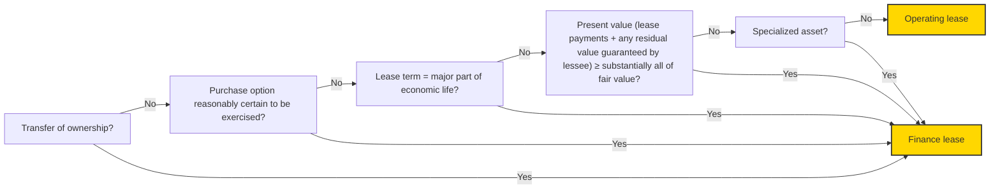

## 3.2 Criteria for lease classification — lessors

At lease commencement, a lessor classifies a lease as a sales-type lease if the lease meets **any one** of the criteria in section 3.1, *Criteria for lease classification — lessees*, and does not have a selling loss and has variable lease payments that are not based on an index or rate.

If none of the criteria in section 3.1, *Criteria for lease classification — lessees*, are met, a lessor classifies a lease as a direct financing lease when the lease meets **both** of the following criteria (and does not have a selling loss and has variable lease payments that are not based on an index or rate):

*   The present value of the sum of lease payments and any **other third party unrelated to the lessor** equals or exceeds substantially all the fair value of the underlying asset. As discussed in section 2.8, *Fair value*, in certain circumstances, for lessors that are not manufacturers or dealers, the fair value of the underlying asset is their cost, less any volume or trade discounts.
*   It is probable that the lessor will collect the lease payments plus any amount necessary to satisfy a residual value guarantee.

Neither of the following forms of consideration affect lease classification: (1) indemnifications for environmental contamination (refer to section 3.4.8, *Lessee indemnifications for environmental contamination*) nor (2) a lessee's guarantee of a lessor's debt (refer to section 2.4.10, *Amounts not included in lease payments*).

For lessors, all leases not classified as sales-type leases or direct financing leases are classified as operating leases. Additionally, leases with variable lease payments that are not based on an index or rate (e.g., long-term leases of machinery where the consideration in the contracts is determined based on hours used by the lessee) are classified as operating leases if they would have otherwise been classified as sales-type or direct financing leases and the lessor would have recognized a selling loss at lease commencement. A lessor in this situation should keep in mind that it must also determine whether the underlying asset is impaired prior to lease commencement (e.g., by applying the impairment guidance in ASC 360-10). For example, if the selling loss that would be avoided by applying ASC 842-10-25-3A results from reasons other than just the variable lease payments (e.g., total expected lease payments, including the expected variable lease payments, are less than the carrying amount of the underlying asset), that would be an indicator under ASC 360-10 that the underlying asset is impaired before the lease commences. A key difference between the sales-type lease and direct financing lease classification tests is the treatment of residual value guarantees provided by unrelated third parties other than the lessee. Those third-party guarantees are excluded from the evaluation of the "substantially all" criterion in the sales-type lease test. However, they are included in the evaluation in the direct financing lease test. In addition, the evaluation of the collectibility of lease payments and residual value guarantees affects direct financing lease classification, whereas it does not affect sales-type lease classification. However, the evaluation of collectibility does affect sales-type lease recognition and measurement.


Financial reporting developments Lease accounting | 136

3 Lease classification


The lease classification test is designed so that a direct financing lease involves a residual value guarantee from an unrelated third party other than the lessee that is sufficient to satisfy the "substantially all" criterion. Although such a residual value guarantee from an unrelated third party other than the lessee can exist in a sales-type or an operating lease, a lease without a residual value guarantee from an unrelated third party other than the lessee must be classified as either a sales-type or an operating lease.

The decision tree below summarizes the evaluation of lease classification for lessors under ASC 842.

```mermaid
graph TD
    A[Does the lease meet <u>any one</u> of the criteria in section 3.1, <br/><i>Criteria for lease classification — lessees</i> (ASC 842-10-25-2)?]
    B[Does the lease meet <u>both</u> of the following criteria in section 3.2, <br/><i>Criteria for lease classification — lessors</i> (ASC 842-10-25-3)? <br/><ul><li>The present value of the sum of the lease payments and any residual value guaranteed by the lessee and any other third party unrelated to the lessor equals or exceeds substantially all the fair value** of the underlying asset.</li><li>It is probable that the lessor will collect the lease payments plus any amounts necessary to satisfy a residual value guarantee.</li></ul>]
    C(Sales-type lease*^)
    D(Direct financing lease^)
    E(Operating lease)

    A -- Yes --> C
    A -- No --> B
    B -- Yes --> D
    B -- No --> E
```

\* Lessors do not assess the collectibility of lease payments and any residual value guarantee provided by the lessee in the sales-type lease classification test. However, lessors are required to assess the collectibility of lease payments and any residual value guarantee provided by the lessee to determine the recognition and initial measurement of sales-type leases. Refer to section 5.2, *Sales-type leases*, on the accounting for sales-type leases.

\*\* As discussed in section 2.8, *Fair value*, in certain circumstances, for lessors that are not manufacturers or dealers, the fair value of the underlying asset is their cost, less any volume or trade discounts.

^ Lessors are required to classify leases as operating leases if they have variable lease payments that do not depend on an index or rate and would result in selling losses if they were classified as sales-type or direct financing leases.

## 3.2.1 Evaluating collectibility

Collectibility refers to the lessee's ability and intent to pay the lease payments and any guaranteed residual value. A lessor should assess a lessee's ability to pay based on the lessee's financial capacity and its intention to pay, considering all relevant facts and circumstances, including past experiences with that lessee or similar lessees. Collectibility determinations must be made on a lease-by-lease basis or using a portfolio approach when "the entity reasonably expects that the application of the leases model to the portfolio would not differ materially from the application of the leases model to the individual leases in that portfolio." These collectibility determinations can affect the classification of a lease between a direct financing or operating lease (refer to section 3.2, *Criteria for lease classification — lessors*) and the recognition and measurement of income on a sales-type and operating lease. Refer to section 5.2.1.2, *Initial recognition and measurement when collectibility is not probable at lease commencement – sales-type leases*, for a discussion of the accounting for sales-type leases when collectibility is not probable and section 5.4, *Operating leases*, for considerations related to operating leases when collectibility is not probable. Additionally, refer to section 5.7.4.1, *Portfolio approach*, for considerations relating to the use of a portfolio approach.


Financial reporting developments Lease accounting | 137

3 Lease classification


## 3.2.2 Lease classification for certain sales that include a residual value guarantee in the form of a repurchase option (lessors only)

> ### Excerpt from Accounting Standards Codification
> **Leases — Lessor**
>
> **Implementation Guidance and Illustrations**
>
> **842-30-55-5**
>
> The **lease payments** used as part of the determination of whether the transaction should be classified as an **operating lease**, a **direct financing lease**, or a **sales-type lease** generally will be the difference between the proceeds upon the equipment's initial transfer and the amount of the **residual value guarantee** to the purchaser as of the first exercise date of the guarantee.

An entity that sells equipment may guarantee that the customer will receive a minimum resale amount when the customer resells the equipment (i.e., a residual value guarantee). If the residual value guarantee is in the form of a repurchase provision (e.g., the customer has a contractual put option to require the entity to repurchase equipment two years after its initial purchase at 85% of the price the customer paid), the seller would first evaluate the guidance in ASC 606 on repurchase arrangements and determine whether the existence of the repurchase provision precludes the customer from obtaining control of the acquired item. Refer to section 7.3.2, *Put option held by the customer*, of our FRD, *<u>Revenue from contracts with customers (ASC 606)</u>*, which discusses the guidance requiring an arrangement to be accounted for as a lease if the seller is obligated to repurchase the item under a put option held by the customer for an amount less than the original selling price and the holder of the put option has a significant economic incentive to exercise the put.

If the arrangement is accounted for as a lease, the lease payments used to determine whether the transaction should be classified as an operating lease, a direct financing lease or a sales-type lease generally will be the difference between the proceeds upon the equipment's initial transfer and the amount of the residual value guarantee the entity provides to the purchaser as of the first exercise date of the guarantee.

We believe that entities should view a guaranteed resale amount (residual value) on a net present value basis when they determine the classification of the transaction.

For example, Company X sells a computer for $100 (i.e., fair value) and agrees to reacquire the computer in five years for $10 through a put option held by the customer. In accordance with ASC 606-10-55-72, the arrangement is accounted for as a lease because Company X is obligated to repurchase the computer for an amount that is less than the original selling price and the entity determines that the holder of the put option has a significant economic incentive to exercise the put. The present value of the $10 repurchase obligation is $6. As a result, the transaction is classified as a sales-type lease because the proceeds of the sale ($100) less the present value of the repurchase obligation ($6) equals or exceeds substantially all of the equipment's fair value. That is because the FASB said in ASC 842-10-55-2 that "one reasonable approach" would be to conclude that "[n]inety percent or more of the fair value of the underlying asset amounts to substantially all the fair value of the underlying asset." Refer to section 3.2, *Criteria for lease classification — lessors*.

Refer to section 5.7.7, *Sales of equipment with guaranteed minimum resale amount*, for further discussion on these types of transactions.


Financial reporting developments Lease accounting | 138

3 Lease classification


## 3.3 Discount rates used to determine lease classification

Discount rates are used to determine the present value of the lease payments an entity will use to evaluate the "substantially all" criterion in the finance lease classification test for lessees and the sales-type and direct financing lease classification tests for lessors.

### 3.3.1 Discount rates used to determine lease classification — lessees

For lessees, the discount rate used to evaluate the "substantially all" criterion is the "rate implicit in the lease" or the lessee's incremental borrowing rate (or for a lessee that is not a PBE, the risk-free rate if the lessee has made the risk-free rate election for that class of underlying asset), if the rate implicit in the lease cannot be readily determined. Refer to section 2.5, *Discount rates*.

### 3.3.2 Discount rates used to determine lease classification — lessors

**Sales-type lease classification test**

The discount rate used to evaluate the "substantially all" criterion in the sales-type lease classification test (as described in ASC 842-10-25-2(d)) is the rate implicit in the lease (refer to section 2.5, *Discount rates*). However, a lessor assumes that none of its initial direct costs (refer to section 2.6, *Initial direct costs*) will be deferred (i.e., initial direct costs are excluded from the calculation of the rate implicit in the lease) if, at the commencement date, the fair value (refer to section 2.8, *Fair value*) of the underlying asset is different from its carrying amount. If the fair value of the underlying asset is the same as its carrying amount at lease commencement, a lessor includes initial direct costs in the calculation of the rate implicit in the lease.

**Direct financing lease classification test**

The discount rate used to evaluate the "substantially all" criterion in the direct financing lease classification test (as described in ASC 842-10-25-3(b)(1)) is the rate implicit in the lease (refer to section 2.5, *Discount rates*).

The following table summarizes the discount rates used to determine lease classification by lessors.

<table>
  <thead>
    <tr>
        <th></th>
        <th>At lease commencement, the fair value of the underlying asset does not equal its carrying value</th>
        <th>At lease commencement, the fair value of the underlying asset is equal to its carrying value</th>
    </tr>
  </thead>
  <tbody>
    <tr>
        <td>Sales-type lease classification test (as described in ASC 842-10-25-2(d))</td>
        <td>Rate implicit in the lease, assuming that no initial direct costs of the lessor will be deferred (i.e., exclude initial direct costs from the calculation of the rate implicit in the lease)</td>
        <td>Rate implicit in the lease (including initial direct costs of the lessor in the calculation of the rate)</td>
    </tr>
    <tr>
        <td>Direct financing lease classification test (as described in ASC 842-10-25-3(b)(1))</td>
        <td>Rate implicit in the lease (including initial direct costs of the lessor in the calculation of the rate)</td>
        <td>Rate implicit in the lease (including initial direct costs of the lessor in the calculation of the rate)</td>
    </tr>
  </tbody>
</table>


Financial reporting developments Lease accounting | 139

3 Lease classification


## 3.4 Lease classification considerations

### 3.4.1 Transfer of ownership

> **Excerpt from Accounting Standards Codification**
> **Leases — Overall**
> **Implementation Guidance and Illustrations**
>
> **842-10-55-4**
> The criterion in paragraph 842-10-25-2(a) is met in **leases** that provide, upon the **lessee's** performance in accordance with the terms of the lease, that the **lessor** should execute and deliver to the lessee such documents (including, if applicable, a bill of sale) as may be required to release the **underlying asset** from the lease and to transfer ownership to the lessee.
>
> **842-10-55-5**
> The criterion in paragraph 842-10-25-2(a) also is met in situations in which the lease requires the payment by the lessee of a nominal amount (for example, the minimum fee required by the statutory regulation to transfer ownership) in connection with the transfer of ownership.
>
> **842-10-55-6**
> A provision in a lease that ownership of the underlying asset is not transferred to the lessee if the lessee elects not to pay the specified fee (whether nominal or otherwise) to complete the transfer is an option to purchase the underlying asset. Such a provision does not satisfy the transfer-of-ownership criterion in paragraph 842-10-25-2(a).

A lease is classified as a finance lease by a lessee and a sales-type lease by a lessor if the lease transfers ownership of the underlying asset to the lessee by the end of the lease term (e.g., through the transfer of title). This includes the transfer of ownership of the underlying asset to the lessee at or shortly after the end of the lease term in exchange for no additional consideration or the payment of a nominal amount (e.g., the minimum fee required by statutory regulation to transfer ownership). A provision in a lease agreement that ownership of the underlying asset does not transfer if the lessee elects not to pay a specified fee (nominal or otherwise) to complete the transfer is a purchase option and not an automatic transfer of ownership (refer to section 2.3.2, *Purchase options*).

### 3.4.2 Evaluating purchase options

A lease is classified as a finance lease by a lessee and a sales-type lease by a lessor if the lease grants the lessee an option to purchase the underlying asset that the lessee is reasonably certain to exercise. The term "reasonably certain" is generally considered to be a high threshold (refer to section 2.3.1, *Lease term*). Purchase options should be assessed in the same way as options to extend the lease term or terminate the lease. Factors that could create an economic incentive for the lessee to exercise the purchase option might include a bargain purchase option (e.g., a fixed-price purchase option priced significantly below the expected fair value of the underlying asset) or contractual or economic penalties. Refer to section 2.3.5, *Evaluating lease term and purchase options*.


Financial reporting developments Lease accounting | 140

3 Lease classification


### 3.4.3 Evaluating ‘major part,’ ‘substantially all’ and ‘at or near the end’

> **Excerpt from Accounting Standards Codification**
> **Leases — Overall**
>
> **Implementation Guidance and Illustrations**
>
> **842-10-55-2**
> When determining **lease** classification, one reasonable approach to assessing the criteria in paragraphs 842-10-25-2(c) through (d) and 842-10-25-3(b)(1) would be to conclude:
>
> a. Seventy-five percent or more of the remaining **economic life** of the **underlying asset** is a major part of the remaining economic life of that underlying asset.
>
> b. A commencement date that falls at or near the end of the economic life of the underlying asset refers to a commencement date that falls within the last 25 percent of the total economic life of the underlying asset.
>
> c. Ninety percent or more of the **fair value** of the underlying asset amounts to substantially all the fair value of the underlying asset.

The terms “major part,” “substantially all” and “at or near the end” are not defined in ASC 842. However, ASC 842 includes implementation guidance that states that one reasonable approach to lease classification is to conclude that 75% or greater is a “major part” of the remaining economic life (refer to section 2.7, *Economic life*) of an underlying asset (refer to section 2.2, *Commencement date of the lease*), 90% or greater is “substantially all” the fair value (as defined in ASC 820, or in ASC 842 for certain lessors that are not manufacturers or dealers, as applicable, refer to section 2.8, *Fair value*) of the underlying asset and a commencement date that falls within the last 25% of the total economic life of the underlying asset is “at or near the end” of the total economic life of the underlying asset (refer to section 2.7, *Economic life*). We believe an entity should establish accounting policies for the thresholds it uses to determine lease classification, have a reasonable basis for those policies if they differ from the “reasonable approach” articulated in the standard and apply those policies consistently. Policies that differ from the “reasonable approach” discussed in ASC 842 may be challenged.

### 3.4.4 Lease component that contains the right to use more than one underlying asset

> **Excerpt from Accounting Standards Codification**
> **Leases — Overall**
>
> **Recognition**
>
> **842-10-25-5**
> If a single lease component contains the right to use more than one underlying asset (see paragraphs 842-10-15-28 through 15-29), an entity shall consider the remaining economic life of the predominant asset in the lease component for purposes of applying the criterion in paragraph 842-10-25-2(c).

If a single lease component contains the right to use more than one underlying asset, the remaining economic life of the predominant asset is used to determine lease classification. Refer to section 1.4.1, *Identifying and separating lease components of a contract*, for further discussion of assessing whether a lease contains multiple lease components.


Financial reporting developments Lease accounting | 141

3 Lease classification


### 3.4.5 Residual value guarantees included in the lease classification test

A lessee is required to include the full amount of a residual value guarantee (or an allocated portion of a portfolio-based residual value guarantee in certain circumstances – refer to section 2.10.3, *Residual value guarantees of a group of assets – lessees*) it provides to a lessor (i.e., its maximum obligation) in its evaluation of the “substantially all” criterion of the lease classification test (i.e., in its evaluation of ASC 842-10-25-2(d)). A lessor is also required to include the full amount of such a residual value guarantee provided by a lessee in its evaluation of whether a lease is a sales-type lease (excluding certain portfolio-based residual value guarantees – refer to section 2.10.4, *Residual value guarantees of a group of assets – lessors*). However, if a lease does not qualify as a sales-type lease, a lessor includes the full amounts of such residual value guarantees provided by both lessees and any other third party unrelated to the lessor in its evaluation of the “substantially all” criterion of the lease classification test to determine whether a lease is a direct financing lease (i.e., in its evaluation of ASC 842-10-25-3(b)(1)).

Residual value guarantees are treated differently when determining lease payments (i.e., for purposes of recognizing the lease rather than classifying it). A lessee includes the amount that it is probable it will owe to the lessor under a residual value guarantee as a lease payment when recognizing a lease. A lessee is required to remeasure and reallocate the remaining consideration in the contract and remeasure finance and operating lease liabilities when it changes its assessment of the amount it is probable that it will owe under such a residual value guarantee. Refer to section 4.5, *Remeasurement of lease liabilities and right-of-use assets – operating and finance leases*. Lessors exclude residual guarantees from lease payments. Refer to section 2.4, *Lease payments*. Lessors would account for receipt of payment under a residual value guarantee in income when it is earned.

Note that ASC 842-10-55-9 through 55-10 excludes, for lease classification purposes only, portfolio-based residual value guarantees from lease payments for lessors (refer to section 2.10.4, *Residual value guarantee of a group of assets – lessors*).

### 3.4.6 Fair value of the underlying asset

> **Excerpt from Accounting Standards Codification**
> **Leases – Overall**
>
> **Implementation Guidance and Illustrations**
>
> **842-10-55-3**
> In some cases, it may not be practicable for an entity to determine the fair value of an underlying asset. In the context of this Topic, practicable means that a reasonable estimate of fair value can be made without undue cost or effort. It is a dynamic concept; what is practicable for one entity may not be practicable for another, what is practicable in one period may not be practicable in another, and what is practicable for one underlying asset (or class of underlying asset) may not be practicable for another. In those cases in which it is not practicable for an entity to determine the fair value of an underlying asset, lease classification should be determined without consideration of the criteria in paragraphs 842-10-25-2(d) and 842-10-25-3(b)(1).

In some cases, it may not be practicable for an entity to determine the fair value (refer to section 2.8, *Fair value*) of an underlying asset without undue cost or effort. For example, this may be the case when the underlying asset is part of a larger asset. If a reasonable estimate of fair value cannot be made without undue cost or effort, lessees and lessors will not evaluate the “substantially all” classification criterion described in sections 3.1, *Criteria for lease classification – lessees*, and 3.2, *Criteria for lease classification – lessors*. Instead, lease classification will be based on the remaining classification criteria described in section 3.1, *Criteria for lease classification – lessees*.


Financial reporting developments Lease accounting | 142

3 Lease classification


If a lessor classifies the lease as a sales-type lease for other reasons such as the length of the lease term compared with the remaining economic life of the asset (e.g., if a lessee leases a floor in a multi-floor building for a term of 35 years and the building has a remaining useful life of 40 years), the lessor will still be required to estimate fair value for purposes of initial recognition and measurement of the sales-type lease (e.g., to determine the residual value as well as the amount of the underlying asset to derecognize).

Fees paid by a lessee to the owners of a special-purpose entity for structuring a transaction are included as lease payments (refer to section 2.4, *Lease payments*). However, such fees are excluded from the fair value of the underlying asset for purposes of the lease classification test.

### 3.4.6.1 Effect of investment tax credits on lease classification

> **Excerpt from Accounting Standards Codification**
> **Leases — Overall**
> **Implementation Guidance and Illustrations**
> **842-10-55-8**
> When evaluating the lease classification criteria in paragraphs 842-10-25-2(d) and 842-10-25-3(b)(1), the **fair value** of the **underlying asset** should be reduced by any related investment tax credit retained by the **lessor** and expected to be realized by the lessor.

When an entity calculates the fair value of an underlying asset to evaluate the "substantially all" classification criterion in the lease classification tests discussed in sections 3.1, *Criteria for lease classification — lessees*, and 3.2, *Criteria for lease classification — lessors*, the fair value of the underlying asset is reduced by any related investment tax credits retained by the lessor and expected to be realized by the lessor.

### 3.4.7 Alternative use criterion

> **Excerpt from Accounting Standards Codification**
> **Leases — Overall**
> **Implementation Guidance and Illustrations**
> **842-10-55-7**
> In assessing whether an **underlying asset** has an alternative use to the **lessor** at the end of the **lease term** in accordance with paragraph 842-10-25-2(e), an entity should consider the effects of contractual restrictions and practical limitations on the lessor's ability to readily direct that asset for another use (for example, selling it or leasing it to an entity other than the **lessee**). A contractual restriction on a lessor's ability to direct an underlying asset for another use must be substantive for the asset not to have an alternative use to the lessor. A contractual restriction is substantive if it is enforceable. A practical limitation on a lessor's ability to direct an underlying asset for another use exists if the lessor would incur significant economic losses to direct the underlying asset for another use. A significant economic loss could arise because the lessor either would incur significant costs to rework the asset or would only be able to sell or re-lease the asset at a significant loss. For example, a lessor may be practically limited from redirecting assets that either have design specifications that are unique to the lessee or that are located in remote areas. The possibility of the **contract** with the customer being terminated is not a relevant consideration in assessing whether the lessor would be able to readily direct the underlying asset for another use.

A lease is classified as a finance lease by a lessee and a sales-type lease by a lessor if the underlying asset is of such a specialized nature that it is expected to have no alternative use to the lessor at the end of the lease term. The FASB indicated in the Basis for Conclusions (BC 71(e)) of ASU 2016-02 that lessors generally would lease specialized assets that have no alternative use to them at the end of the lease term


Financial reporting developments Lease accounting | 143

3 Lease classification


under terms that would transfer substantially all the benefits (and risks) of the asset to the lessee. That is, when this criterion is met, it is likely that one of the other criteria described in section 3.1, *Criteria for lease classification — lessees*, will also be met. An exception could be when a significant amount of anticipated lease payments is in the form of variable lease payments that do not depend on an index or rate.

When assessing whether an underlying asset has an alternative use to the lessor at the end of the lease term, lessees and lessors should consider the effects of substantive contractual restrictions and practical limitations on the lessor’s ability to readily direct that asset for another use (e.g., sell it, re-lease it). A practical limitation exists if the lessor would incur significant economic losses to repurpose the underlying asset for another use (e.g., if the lessor either would incur significant costs to rework the asset or would only be able to sell or re-lease the asset at a significant loss).

### 3.4.8 Lessee indemnifications for environmental contamination

> **Excerpt from Accounting Standards Codification**
> **Leases — Overall**
> **Implementation Guidance and Illustrations**
> **842-10-55-15**
> A provision that requires **lessee** indemnification for environmental contamination, whether for environmental contamination caused by the lessee during its use of the **underlying asset** over the **lease term** or for preexisting environmental contamination, should not affect the classification of the **lease**.

A provision that requires lessee indemnifications for preexisting environmental contamination or environmental contamination caused by the lessee during its use of the underlying asset over the term of the lease does not affect classification of the lease. Indemnities for preexisting environmental contamination are accounted for under ASC 460, whereas indemnities for contamination caused by the lessee during the lease term are excluded from the requirements of ASC 460 as they represent a guarantee of the lessee’s own performance. Contamination caused by the lessee during the lease term and related obligations are accounted for under ASC 410-30, *Environmental obligations*.

### 3.4.9 Leases of government-owned facilities

> **Excerpt from Accounting Standards Codification**
> **Leases — Overall**
> **Implementation Guidance and Illustrations**
> **842-10-55-13**
> Because of special provisions normally present in **leases** involving terminal space and other airport facilities owned by a governmental unit or authority, the **economic life** of such facilities for purposes of classifying a lease is essentially indeterminate. Likewise, it may not be practicable to determine the **fair value** of the **underlying asset**. If it is impracticable to determine the fair value of the underlying asset and such leases also do not provide for a transfer of ownership or a purchase option that the **lessee** is reasonably certain to exercise, they should be classified as **operating leases**. This guidance also applies to leases of other facilities owned by a governmental unit or authority in which the rights of the parties are essentially the same as in a lease of airport facilities. Examples of such leases may be those involving facilities at ports and bus terminals. The guidance in this paragraph is intended to apply to leases only if all of the following conditions are met:
>
> a. The underlying asset is owned by a governmental unit or authority.
>
> b. The underlying asset is part of a larger facility, such as an airport, operated by or on behalf of the **lessor**.


Financial reporting developments Lease accounting | 144

3 Lease classification


> c. The underlying asset is a permanent structure or a part of a permanent structure, such as a building, that normally could not be moved to a new location.
>
> d. The lessor, or in some circumstances a higher governmental authority, has the explicit right under the lease agreement or existing statutes or regulations applicable to the underlying asset to terminate the lease at any time during the **lease term**, such as by closing the facility containing the underlying asset or by taking possession of the facility.
>
> e. The lease neither transfers ownership of the underlying asset to the lessee nor allows the lessee to purchase or otherwise acquire ownership of the underlying asset.
>
> f. The underlying asset or equivalent asset in the same service area cannot be purchased or leased from a nongovernmental unit or authority. An equivalent asset in the same service area is an asset that would allow continuation of essentially the same service or activity as afforded by the underlying asset without any appreciable difference in economic results to the lessee.
>
> **842-10-55-14**
> Leases of underlying assets not meeting all of the conditions in paragraph 842-10-55-13 are subject to the same criteria for classifying leases under this Subtopic that are applicable to leases not involving government-owned property.

Arrangements for the use of property owned by a governmental unit may meet the definition of a service concession arrangement that is within the scope of ASC 853, *Service Concession Arrangements* (refer to section 1.8, *Service concession arrangements*). If the arrangement is not within the scope of ASC 853 and is a lease (or contains a lease), the lease is classified as an operating lease when it meets all of the criteria in ASC 842-10-55-13.

### 3.4.10 Classification of subleases

> #### Excerpt from Accounting Standards Codification
> **Leases — Overall**
>
> **Recognition**
>
> **842-10-25-6**
> When classifying a **sublease**, an entity shall classify the sublease with reference to the underlying asset (for example, the item of property, plant, or equipment that is the subject of the lease) rather than with reference to the **right-of-use asset**.

Lessees often enter into arrangements to sublease an underlying asset to a third party while the original lease contract is in effect. In these arrangements, one party acts as both the lessee and lessor of the same underlying asset. The original lease is often referred to as a head lease, the original lessee is often referred to as a sublessor and the ultimate lessee is often referred to as the sublessee.

Under ASC 842, a sublessor assesses sublease classification independently of the classification assessment that it makes as the lessee of the same asset. A sublessor considers the lease classification criteria for lessors, discussed in section 3.2, *Criteria for lease classification — lessors*, with reference to the underlying asset (i.e., the item of property, plant or equipment that is the subject of the lease) when classifying a sublease. A sublessee assesses classification of the sublease in the same manner as any other lease using the criteria discussed in section 3.1, *Criteria for lease classification — lessees*. Refer to section 6, *Subleases*, for further discussion of the accounting for subleases by sublessors and sublessees.


Financial reporting developments Lease accounting | 145

3 Lease classification


### 3.4.11 Example — lessee classification (added July 2024)

> **Illustration 3-1: Ground lease classification**
>
> A real estate entity (Lessee) enters into a ground lease of land in New York City with a term of 99 years. Lessee will construct and operate an office building on the land and will lease office space to tenants.
>
> There is no transfer of ownership or option to purchase the land at the end of the lease term. There is no residual value guaranteed by Lessee at the end of the lease term. The present value of the lease payments is $95 million. The fair market value (FMV) of the land is $100 million.
>
> *Analysis*
>
> The arrangement meets the definition of a lease. Lessee then assesses the classification criteria in ASC 842-10-25-2:
>
> *   The lease does not transfer ownership of the land to Lessee at the end of the lease term.
> *   The lease does not grant Lessee an option to purchase the land.
> *   The lease term (99 years) is not for the major part of the remaining economic life of the land because land has an indefinite life.
> *   The present value of the sum of the lease payments ($95 million) exceeds substantially all of the FMV of the land ($100 million).
> *   The land is not of such a specialized nature that it is expected to have no alternative use at the end of the lease term.
>
> However, because the present value of the sum of the lease payments equals or exceeds substantially all of the fair value of the underlying asset, Lessee concludes that the lease is a finance lease.

### 3.5 Reassessment of lease classification

> **Excerpt from Accounting Standards Codification**
> **Leases — Overall**
>
> ***Recognition***
>
> ***842-10-25-1***
>
> An entity shall classify each separate **lease** component at the **commencement date**. An entity shall not reassess the lease classification after the commencement date unless the **contract** is modified and the modification is not accounted for as a separate contract in accordance with paragraph 842-10-25-8. In addition, a **lessee** also shall reassess the lease classification after the commencement date if there is a change in the **lease term** or the assessment of whether the lessee is reasonably certain to exercise an option to purchase the **underlying asset**. When an entity (that is, a lessee or lessor) is required to reassess lease classification, the entity shall reassess classification of the lease on the basis of the facts and circumstances (and the modified terms and conditions, if applicable) as of the date the reassessment is required (for example, on the basis of the **fair value** and the remaining economic life of the underlying asset as of the date there is a change in the lease term or in the assessment of a lessee option to purchase the underlying asset or as of the effective date of a modification not accounted for as a separate contract in accordance with paragraph 842-10-25-8).


Financial reporting developments Lease accounting | 146

3 Lease classification


> **Subsequent measurement**
>
> **842-10-35-3**
>
> A **lessor** shall not reassess the lease term or a lessee option to purchase the underlying asset unless the lease is modified and that modification is not accounted for as a separate contract in accordance with paragraph 842-10-25-8. When a lessee exercises an option to extend the lease or purchase the underlying asset that the lessor previously determined the lessee was not reasonably certain to exercise or exercises an option to terminate the lease that the lessor previously determined the lessee was reasonably certain not to exercise, the lessor shall account for the exercise of that option in the same manner as a **lease modification**.

Lessees and lessors are required to reassess lease classification as noted in the following table:

<table>
  <thead>
    <tr>
        <th rowspan="2">Event</th>
        <th colspan="2">Reassess lease classification?</th>
        <th></th>
    </tr>
    <tr>
        <th></th>
        <th>Lessee</th>
        <th>Lessor</th>
        <th></th>
    </tr>
  </thead>
  <tbody>
    <tr>
        <td>Lease modification (i.e., a change to the terms and conditions of the contract that results in a change in the scope of or the consideration for the lease) that is not accounted for as a separate contract</td>
        <td>Yes<sup>1</sup></td>
        <td>Yes<sup>1</sup></td>
        <td></td>
    </tr>
    <tr>
        <td>Change in assessment of lease term</td>
        <td>Yes</td>
        <td>N/A<sup>2</sup></td>
        <td></td>
    </tr>
    <tr>
        <td>Change in assessment of whether lessee is reasonably certain to exercise an option to purchase the underlying asset (refer to section 2.3.6, *Reassessment of the lease term and purchase options*)</td>
        <td>Yes</td>
        <td>N/A<sup>2</sup></td>
        <td></td>
    </tr>
  </tbody>
</table>

<sup>1</sup> Refer to section 4.6, *Lease modifications*, and section 5.6, *Lease modifications*, for a discussion of which modifications are accounted for as separate contracts for lessees and lessors, respectively.
<sup>2</sup> When a lessee exercises an option to extend or terminate the lease or purchase the underlying asset and the exercise of the option is inconsistent with the existing lease term determination, the lessor accounts for the exercise in the same manner as a lease modification (refer to section 5.6, *Lease modifications*, and section 5.6.1, *Summary of the accounting for lease modifications — lessors*, for further discussion).

Lessees and lessors reassess lease classification as of the effective date of a modification to a contract (i.e., an agreement between two or more parties that creates enforceable rights and obligations) that is not accounted for as a separate contract, using the modified terms and conditions and the facts and circumstances as of that date, including:

*   The remaining economic life of the underlying asset on that date
*   The fair value of the underlying asset on that date
*   The discount rate for the lease on that date
*   The remeasurement and reallocation of the remaining consideration in the contract on that date

When there is a change in the lease term or the assessment of whether a lessee is reasonably certain to exercise an option to purchase the underlying asset, the lessee would reassess lease classification based on the facts and circumstances as of the date that the reassessment is required.

If a modification to a contract is accounted for as a separate contract that contains a lease, that separate lease is classified in the same manner as any new lease. Refer to sections 3.1, *Criteria for lease classification — lessees*, and 3.2, *Criteria for lease classification — lessors*.


Financial reporting developments Lease accounting | 147

3 Lease classification


## 3.5.1 Summary of lease reassessment and remeasurement requirements

This table summarizes lessee and lessor reassessment and remeasurement requirements under ASC 842.

<table>
  <thead>
    <tr>
        <th></th>
        <th>Lessees</th>
        <th>Lessors</th>
    </tr>
  </thead>
  <tbody>
    <tr>
        <td>Assessment of whether an arrangement contains a lease</td>
        <td>Reassess whether a contract is or contains a lease only if the terms and conditions of the contract are changed.<br/>(ASC 842-10-15-6 and section 1.3, Reassessment of the contract)</td>
        <td>Reassess whether a contract is or contains a lease only if the terms and conditions of the contract are changed.<br/>(ASC 842-10-15-6 and section 1.3, Reassessment of the contract)</td>
    </tr>
    <tr>
        <td>Allocation of consideration in the contract between lease and non-lease components</td>
        <td>Remeasure and reallocate<sup>1</sup> the consideration in the contract upon either of the following:<br/>* A remeasurement of the lease liability (section 4.5, Remeasurement of lease liabilities and right-of-use assets – operating and finance leases)<br/>* The effective date of a contract modification that is not accounted for as a separate contract (section 4.6.2, Determining whether a lease modification is accounted for as a separate contract)<br/>(ASC 842-10-15-36 and section 1.4.3.3, Reassessment: determining and allocating the consideration in the contract – lessees)</td>
        <td>Remeasure and reallocate<sup>2</sup> the remaining consideration in the contract upon a contract modification that is not accounted for as a separate contract (section 5.6.2, Determining whether a lease modification is accounted for as a separate contract).<br/>If the consideration in the contract changes, allocate those changes in accordance with the requirements in ASC 606-10-32-42 through 32-45.<br/>(ASC 842-10-15-41 through 15-42 and section 1.4.4.5, Reassessment: determining and allocating the consideration in the contract – lessors)</td>
    </tr>
    <tr>
        <td>Assessment of lease term and purchase options</td>
        <td>Reassess upon any of the following:<br/>* There is a significant event or change in circumstances within the lessee’s control that directly affects whether the lessee is reasonably certain to (1) extend the lease term, (2) not terminate the lease or (3) purchase the underlying asset. A change in market-based factors should not, in isolation, trigger a reassessment.<br/>* There is an event that is written into the contract that obliges the lessee to exercise or not to exercise an option to extend or terminate the lease.<br/>* The lessee elects to exercise an option in the lease (i.e., extension, termination or purchase) even though it had previously determined that it was not reasonably certain to do so.<br/>* The lessee elects not to exercise an option in the lease (i.e., extension, termination or purchase) even though it had previously determined that it was reasonably certain to do so.<br/>(ASC 842-10-35-1 and section 2.3.6.1, Reassessment of the lease term and purchase options – lessees)</td>
        <td>Reassess when the lease is modified, and the modified lease is not accounted for as a separate contract (section 5.6.2, Determining whether a lease modification is accounted for as a separate contract).<br/>When a lessee exercises an option to extend or terminate the lease or purchase the underlying asset and the exercise of the option is inconsistent with the existing lease term determination, the lessor accounts for the exercise of that option in the same manner as a lease modification (refer to section 5.6, Lease modifications, and section 5.6.1, Summary of the accounting for lease modifications – lessors).<br/>(ASC 842-10-35-3 and section 2.3.6.2, Reassessment of the lease term and purchase options – lessors)</td>
    </tr>
  </tbody>
</table>


Financial reporting developments Lease accounting | 148

3 Lease classification


<table>
  <thead>
    <tr>
        <th></th>
        <th>Lessees</th>
        <th>Lessors</th>
    </tr>
  </thead>
  <tbody>
    <tr>
        <td>Measurement of lease payments (including variable lease payments that depend on an index or rate, the exercise price of a purchase option and, for lessees only, amounts it is probable they will owe under residual value guarantees)<br/>Also, refer to sections 2.10.3, *Residual value guarantee of a group of assets – lessees*, and 2.10.4, *Residual value guarantee of a group of assets – lessors*</td>
        <td>Remeasure upon any of the following:<br/>* A lease modification that is not accounted for as a separate contract (section 4.6.2, *Determining whether a lease modification is accounted for as a separate contract*)<br/>* A resolution of a contingency that results in some or all of the lease payments that were previously determined to be variable meeting the definition of lease payments<br/>* A change in the lease term (section 2.3.6.1, *Reassessment of the lease term and purchase options – lessees*)<br/>* A change in the assessment of whether a lessee is reasonably certain to exercise an option in the lease to purchase the underlying asset (section 2.3.6.1, *Reassessment of the lease term and purchase options – lessees*)<br/>* A change in amounts it is probable that a lessee will owe under residual value guarantees<br/>(ASC 842-10-35-4 through 35-5 and section 2.4.11.1, *Subsequent remeasurement of lease payments – lessees*)</td>
        <td>Remeasure upon a modification that is not accounted for as a separate contract (section 5.6.2, *Determining whether a lease modification is accounted for as a separate contract*).<br/>(ASC 842-10-35-6 and section 2.4.11.2, *Subsequent remeasurement of lease payments – lessors*)</td>
    </tr>
    <tr>
        <td>Assessment of lease classification<sup>3</sup></td>
        <td>Reassess upon any of the following:<br/>* A modification that is not accounted for as a separate contract (section 4.6.2, *Determining whether a lease modification is accounted for as a separate contract*)<br/>* A change to the lease term or assessment of whether a lessee is reasonably certain to exercise an option in the lease to purchase the underlying asset (section 2.3.6.1, *Reassessment of the lease term and purchase options – lessees*)<br/>(ASC 842-10-25-1 and section 3.5, *Reassessment of lease classification*)</td>
        <td>Reassess upon a modification that is not accounted for as a separate contract (section 5.6.2, *Determining whether a lease modification is accounted for as a separate contract*).<br/>(ASC 842-10-25-1 and section 3.5, *Reassessment of lease classification*)</td>
    </tr>
    <tr>
        <td>Assessment of the discount rate</td>
        <td>Reassess upon any of the following:<br/>* A change in the lease term or the assessment of whether a lessee is reasonably certain to exercise an option to purchase the underlying asset if the discount rate for the lease liability does not already reflect the lessee's option in the lease to extend or terminate the lease or to purchase the underlying asset<br/>* A modification that is not accounted for as a separate contract (section 4.6.2, *Determining whether a lease modification is accounted for as a separate contract*)<br/>(ASC 842-20-35-5, section 2.5.3.2, *Reassessment of the discount rate – lessees*, and section 4.5, *Remeasurement of lease liabilities and right-of-use assets – operating and finance leases*)</td>
        <td>Reassess, for purposes of lease classification, upon a modification that is not accounted for as a separate contract.<br/>(ASC 842-10-25-9 and section 3.5, *Reassessment of lease classification*)<br/>The discount rate used to account for the modified lease depends on the classification of the lease before and after the lease modification.<br/>(ASC 842-10-25-15 through 25-17, section 2.5.3.1, *Reassessment of the discount rate – lessors*, and section 5.6.3, *Lessor accounting for a modification that is not accounted for as a separate contract*)</td>
    </tr>
  </tbody>
</table>


Financial reporting developments Lease accounting | 149

3 Lease classification


<table>
  <thead>
    <tr>
        <th></th>
        <th>Lessees</th>
        <th>Lessors</th>
    </tr>
  </thead>
  <tbody>
    <tr>
        <td>Assessment of collectibility</td>
        <td>Not applicable</td>
        <td>If collectibility is probable at the commencement date for a sales-type or a direct financing lease, a lessor does not reassess collectibility for purposes of lease classification. Changes in collectibility are accounted for in accordance with the impairment guidance applicable to the net investment in the lease.<br/><br/>(ASC 842-30-25-6, section 5.2.1.1, *Initial recognition and measurement when collectibility is probable at lease commencement – sales-type leases*, for sales-type leases, and section 5.3.1, *Initial recognition and measurement – direct financing leases*, for direct financing leases)<br/><br/>If collectibility is not probable at the commencement date for a sales-type lease, a lessor continually reassesses collectibility until it becomes probable.<br/><br/>(ASC 842-30-25-3 and section 5.2.1.2, *Initial recognition and measurement when collectibility is not probable at lease commencement – sales-type leases*)<br/><br/>If collectibility is not probable at the commencement date, a lease that would otherwise be classified as a direct financing lease is instead classified and accounted for as an operating lease. The classification of such a lease is not changed based upon a subsequent evaluation of collectibility.<br/><br/>For an operating lease, a lessor continually reassesses collectibility.<br/><br/>(ASC 842-30-25-13 and section 5.4, *Operating leases*)</td>
    </tr>
  </tbody>
</table>

**Note:** Refer to section 4.6, *Lease modifications*, and section 5.6, *Lease modifications*, for further details on accounting for lease modifications by lessees and lessors, respectively.

<sup>1</sup> ASC 842 provides a practical expedient that permits lessees to make an accounting policy election (by class of underlying asset) to account for each separate lease component of a contract and its associated non-lease components as a single lease component. Lessees that elect this practical expedient do not reallocate the remaining consideration in the contract to non-lease components upon the events discussed above. Refer to section 1.4.2.3, *Practical expedient to not separate lease and non-lease components – lessees*.

<sup>2</sup> ASC 842 provides a practical expedient that permits lessors to make an accounting policy election (by class of underlying asset) to account for each separate lease component of a contract and its associated non-lease components as a single component if certain criteria are met. Refer to section 1.4.2.4, *Practical expedient to not separate lease and non-lease components – lessors*.

<sup>3</sup> For leases that were classified as leveraged leases in accordance with ASC 840, and for which the commencement date is before the effective date of ASU 2016-02, a lessor applies the requirements in ASC 842-50 (i.e., the leveraged lease accounting guidance). If a leveraged lease is modified on or after the effective date, it is accounted for as a new lease as of the effective date of the modification in accordance with ASC 842-10 and 842-30 (i.e., it will no longer be accounted for as a leveraged lease) (ASC 842-10-65-1(z)).


Financial reporting developments Lease accounting | 150

# 4 Lessee accounting

Under ASC 842, lessees are required to recognize an ROU asset and lease liability on the balance sheet for most leases. The initial measurement of the lease liability and ROU asset on the commencement date is the same for both operating and finance leases. The difference in accounting for an operating lease and finance lease is in the subsequent measurement. The income statement presentation and expense recognition pattern for finance leases results in separate interest and amortization expense with higher periodic expense in the earlier periods of a lease. For operating leases, the income statement presentation and expense recognition pattern results in a single lease cost generally recognized on a straight-line basis.

The following chart provides an overview of the accounting for operating and finance leases by lessees, which is discussed in further detail in this section:

<table>
  <thead>
    <tr>
        <th></th>
        <th>Operating leases</th>
        <th>Finance leases</th>
    </tr>
  </thead>
  <tbody>
    <tr>
        <td>Initial recognition and measurement</td>
        <td colspan="2">Initially measure the ROU asset<sup>1</sup> and lease liability at the present value of the lease payments to be made over the lease term</td>
    </tr>
    <tr>
        <td>Subsequent measurement – lease liability<sup>3</sup></td>
        <td>Measure the lease liability at the present value of remaining lease payments using the discount rate determined at lease commencement<sup>2</sup></td>
        <td>Accrete the lease liability based on the interest method using the discount rate determined at lease commencement<sup>2</sup> and reduce the lease liability by the payments made</td>
    </tr>
    <tr>
        <td>Subsequent measurement – ROU asset</td>
        <td>Measure the ROU asset at the amount of the remeasured lease liability, adjusted for the remaining balance of any lease incentives received, any cumulative prepaid or accrued rents (i.e., uneven rent payments), any unamortized IDCs and any impairment of the ROU asset</td>
        <td>Amortize the ROU asset, generally on a straight-line basis, over the shorter of the lease term or the useful life of the ROU asset, and record any impairment of the ROU asset</td>
    </tr>
    <tr>
        <td>Income statement effect</td>
        <td>Generally, straight-line expense</td>
        <td>Generally, front-loaded expense</td>
    </tr>
  </tbody>
</table>

***

<sup>1</sup> Initial measurement of the ROU asset also includes the lessee's IDCs and prepayments made to the lessor at or before the commencement date, less lease incentives received from the lessor.
<sup>2</sup> As long as the discount rate has not been updated as a result of a reassessment event.
<sup>3</sup> Although the subsequent measurement of operating lease liabilities and finance lease liabilities is described differently, the calculation results in the same amount each period.

## 4.1 Initial recognition

> ### Excerpt from Accounting Standards Codification
> **Leases — Lessee**
>
> **Recognition**
>
> ***842-20-25-1***
>
> At the **commencement date**, a **lessee** shall recognize a **right-of-use asset** and a **lease liability**.
>
> **Master Glossary**
>
> ***Short-Term Lease***
>
> A **lease** that, at the **commencement date**, has a **lease term** of 12 months or less and does not include an option to purchase the **underlying asset** that the **lessee** is **reasonably certain** to exercise.


Financial reporting developments Lease accounting | 151

4 Lessee accounting


> **Right-of-Use Asset**
>
> An asset that represents a **lessee's** right to use an **underlying asset** for the **lease term**.
>
> **Lease Liability**
>
> A **lessee's** obligation to make the **lease payments** arising from a **lease**, measured on a discounted basis.
>
> **Leases — Lessee**
>
> **Recognition**
>
> ***842-20-25-2***
>
> As an accounting policy, a **lessee** may elect not to apply the recognition requirements in this Subtopic to **short-term leases**. Instead, a lessee may recognize the lease **payments** in profit or loss on a straight-line basis over the **lease term** and **variable lease payments** in the period in which the obligation for those payments is incurred (consistent with paragraphs 842-20-55-1 through 55-2). The accounting policy election for short-term leases shall be made by class of **underlying asset** to which the right of use relates.
>
> ***842-20-25-3***
>
> If the lease term or the assessment of a lessee option to purchase the underlying asset changes such that, after the change, the remaining lease term extends more than 12 months from the end of the previously determined lease term or the lessee is reasonably certain to exercise its option to purchase the underlying asset, the lease no longer meets the definition of a short-term lease and the lessee shall apply the remainder of the guidance in this Topic as if the date of the change in circumstances is the **commencement date**.

At the commencement date of a lease, a lessee recognizes a liability to make lease payments (i.e., the lease liability) and an asset representing the right to use the underlying asset during the lease term (i.e., the right-of-use asset).

The initial recognition of the right-of-use asset and the lease liability is the same for operating leases and finance leases, as is the subsequent measurement of the lease liability. However, the subsequent measurement of the right-of-use asset for operating leases and finance leases differs under ASC 842 (refer to section 4.2.2.2, *Subsequent measurement of right-of-use assets — operating leases*, and 4.3.2.2, *Subsequent measurement of right-of-use assets — finance leases*).

### 4.1.1 Short-term leases (updated July 2024)

Lessees can make an accounting policy election (by class of underlying asset to which the right of use relates) to not record leases on the balance sheet that meet ASC 842’s definition of a short-term lease (i.e., the short-term lease election). This accounting policy election does not apply to lessors. A short-term lease is defined as a lease that, at the commencement date, has a lease term of 12 months or less and does not include an option to purchase the underlying asset that the lessee is reasonably certain to exercise. The short-term lease election can only be made at the commencement date (refer to section 2.2, *Commencement date of the lease*, for discussion of the commencement date).

ASC 842 does not address how an entity should identify a class of underlying asset. Entities may want to consider the following:

*   ASC 360-10-50 also requires disclosures of "balances of major classes of depreciable assets, by nature or function."
*   The ASC Master Glossary defines an intangible asset class as "a group of intangible assets that are similar, either by their nature or by their use in the operations of an entity."


Financial reporting developments Lease accounting | 152

4 Lessee accounting


A lessee that makes this accounting policy election does not recognize a lease liability or right-of-use asset on its balance sheet. Instead, the lessee recognizes lease payments on a straight-line basis over the lease term and variable lease payments that do not depend on an index or rate in the period in which the achievement of the specified target that triggers the variable lease payments becomes probable. Any previously recognized variable lease cost is reversed if it becomes probable that the specified target will no longer be met. Refer to sections 2.4.10, *Amounts not included in lease payments*, and 2.9.1, *Lessee accounting for variable lease payments*, for further discussion of variable lease payments that do not depend on an index or rate and the accounting for their reversal.

When determining whether a lease qualifies as a short-term lease, a lessee evaluates the lease term and the purchase option in the same manner as all other leases. Refer to section 2.3, *Lease term and purchase options*. That is, the lease term includes the noncancelable term of the lease and all of the following:

*   Periods covered by an option to extend the lease if the lessee is reasonably certain to exercise that option
*   Periods covered by an option to terminate the lease if the lessee is reasonably certain **not** to exercise that option
*   Periods covered by an option to extend (or not terminate) the lease in which the exercise of the option is controlled by the lessor

A lease that qualifies as a short-term lease at the commencement date no longer meets the definition of a short-term lease when there is a change in a lessee's assessment of either:

*   The lease term so that, after the change, the remaining lease term extends more than 12 months from the end of the previously determined lease term
*   Whether it is reasonably certain to exercise an option to purchase the underlying asset

When the lease no longer meets the definition of a short-term lease, a lessee that is applying the short-term lease election must apply the recognition and measurement guidance for all other leases as if the date of the change in circumstances is the commencement date. Additionally, if at lease commencement a lessee determines that the lease term is longer than 12 months, it cannot elect the short-term lease election if the lease is subsequently reassessed (refer to section 2.3.6, *Reassessment of the lease term and purchase options*) and has a lease term less than 12 months. Likewise, a lessee cannot elect the short-term lease election if, as a result of a lease modification that is not accounted for as a separate contract (refer to section 4.6.2, *Determining whether a lease modification is accounted for as a separate contract*), the lease term is modified to be less than 12 months.

The short-term lease election is intended to reduce the cost and complexity of applying ASC 842. However, a lessee that makes the election must make certain quantitative and qualitative disclosures about short-term leases. Refer to section 4.10, *Disclosure*.

Once a lessee establishes a policy for a class of underlying assets, all future short-term leases for that class are required to be accounted for in accordance with the lessee's policy. A lessee evaluates any potential change in its accounting policy in accordance with the guidance in ASC 250, *Accounting Changes and Error Corrections*.


Financial reporting developments Lease accounting | 153

4 Lessee accounting


### Illustration 4-1: Short-term lease

**Scenario A**

A lessee enters into a lease with a nine-month noncancelable term with an option to extend the lease for four months. The lease does not include a purchase option. At the lease commencement date, the lessee concludes that it is reasonably certain to exercise the extension option because the monthly lease payments during the extension period are significantly below market rates. The lessee has an established accounting policy to use the short-term lease election for the class of underlying asset subject to this lease.

*Analysis:* The lease term is greater than 12 months (i.e., 13 months). Therefore, the lessee may not account for the lease as a short-term lease.

**Scenario B**

Assume the same facts as in Scenario A except, at the lease commencement date, the lessee concludes that it is not reasonably certain to exercise the extension option because the monthly lease payments during the optional extension period are what the lessee expects to be market rates, and there are no other factors that would make exercise of the renewal option reasonably certain.

*Analysis:* The lease term is 12 months or less (i.e., nine months). Therefore, the lessee accounts for the lease under the short-term lease election (i.e., it recognizes lease payments on a straight-line basis over the lease term and does not recognize a lease liability or right-of-use asset on its balance sheet).

### Illustration 4-2: Noncancelable lease term of nine months with a four-month renewal option (assume no purchase option)

Scenario A: Exercise of option is reasonably certain = **not** short-term lease

<table>
  <thead>
    <tr>
        <th>Nine months</th>
        <th>Four months</th>
    </tr>
  </thead>
  <tbody>
    <tr>
        <td>[Noncancelable lease term]</td>
        <td>[Optional renewal period]</td>
    </tr>
  </tbody>
</table>Scenario B: Exercise of option is **not** reasonably certain = short-term lease

<table>
  <thead>
    <tr>
        <th>Nine months</th>
        <th>Four months</th>
    </tr>
  </thead>
  <tbody>
    <tr>
        <td>[Noncancelable lease term]</td>
        <td>[Optional renewal period]</td>
    </tr>
  </tbody>
</table>Legend:
*   [ ] Noncancelable lease term (Light gray)
*   [ ] Optional renewal period (Dark gray)

***

**Question 4-1**
**Do leases that give an airline the right to use a gate at an airport for longer than a year, but only at specified times of the day, qualify for the short-term lease election? (added July 2024)**

Airport gate leases may qualify for the short-term lease election because the lease term is determined based on the nonconsecutive periods of use. For example, assume an airline leases a terminal gate for two years with no renewal options but can only use the gate between 6:00 p.m. and midnight (i.e., for six hours, or 25% of the time, each day). During the remaining hours of each day, another party (e.g., the airport) controls the right to use the terminal gate. In this example, the lease term is approximately 183 days (i.e., 25% of each day X 365 days per year X 2 years). Because the lease term is 12 months or less, the lease could qualify for the short-term lease election.


Financial reporting developments Lease accounting | 154

4 Lessee accounting


## 4.2 Operating leases

### 4.2.1 Initial measurement — operating leases

> **Excerpt from Accounting Standards Codification**
> **Leases — Lessee**
>
> *Initial Measurement*
>
> **842-20-30-1**
> At the **commencement date**, a **lessee** shall measure both of the following:
>
> a. The **lease liability** at the present value of the **lease payments** not yet paid, discounted using the **discount rate for the lease** at lease commencement (as described in paragraphs 842-20-30-2 through 30-4)
>
> b. The **right-of-use asset** as described in paragraph 842-20-30-5.
>
> **842-20-30-5**
> At the **commencement date**, the cost of the **right-of-use asset** shall consist of all of the following:
>
> a. The amount of the initial measurement of the **lease liability**
>
> b. Any **lease payments** made to the **lessor** at or before the commencement date, minus any **lease incentives** received
>
> c. Any **initial direct costs** incurred by the **lessee** (as described in paragraphs 842-10-30-9 through 30-10).

#### 4.2.1.1 Initial measurement of lease liabilities — operating leases

At the commencement date (refer to section 2.2, *Commencement date of the lease*), a lessee initially measures the lease liability at the present value of the lease payments to be made over the lease term. Lessees apply the concepts previously described in section 1, *Scope and scope exceptions*, and section 2, *Key concepts*, to identify the lease components and to determine the lease term, lease payments and discount rate as of the commencement date of the lease.

The diagram below illustrates the inputs needed to initially calculate the lease liability:

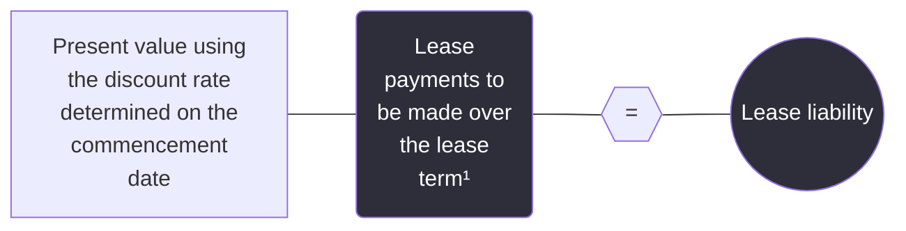

***

<sup>1</sup> Lease incentives that are payable to the lessee on the commencement date are deducted from lease payments (i.e., they reduce the lease liability). Refer to section 2.4.1.2, *Lease incentives*.


Financial reporting developments Lease accounting | 155

4 Lessee accounting


### 4.2.1.2 Initial measurement of right-of-use assets – operating leases

A lessee initially measures the right-of-use asset at cost, which consists of all of the following:

*   The amount of the initial measurement of the lease liability
*   Any lease payments made to the lessor at or before the commencement date, less any lease incentives received (refer to section 2.4.1.2, *Lease incentives*)
*   Any initial direct costs incurred by the lessee (refer to section 2.6, *Initial direct costs*)

The diagram below illustrates the inputs needed to initially calculate the ROU asset:

```mermaid
graph LR
    A((Lease<br/>liability)) --- B(+)
    B --- C((Lease<br/>prepayments))
    C --- D(+)
    D --- E((Initial direct<br/>costs))
    E --- F(-)
    F --- G((Lease<br/>incentives<br/>received))
    G --- H(=)
    H --- I((ROU asset))

    style A fill:#FFFF00,stroke:#333,stroke-width:1px
    style C fill:#FFFF00,stroke:#333,stroke-width:1px
    style E fill:#FFFF00,stroke:#333,stroke-width:1px
    style G fill:#FFFF00,stroke:#333,stroke-width:1px
    style I fill:#FFFF00,stroke:#333,stroke-width:1px
    style B fill:none,stroke:none
    style D fill:none,stroke:none
    style F fill:none,stroke:none
    style H fill:none,stroke:none
```

While ASC 842 does not specifically prohibit lessees from recognizing a right-of-use asset that exceeds the fair value of the underlying asset, we believe that lessees should challenge the inputs and assumptions used to measure the right-of-use asset if the carrying amount of the right-of-use asset would exceed the fair value of the underlying asset. Inputs and assumptions that could be challenged include the identification of lease and non-lease components, the allocation of consideration in the contract to those components and the discount rate used.

### 4.2.2 Subsequent measurement – operating leases (updated July 2024)

> **Excerpt from Accounting Standards Codification**
> **Leases – Lessee**
>
> **Subsequent Measurement**
>
> **842-20-35-3**
> After the commencement date, for an **operating lease**, a lessee shall measure both of the following:
>
> a. The lease liability at the present value of the lease payments not yet paid discounted using the **discount rate for the lease** established at the commencement date (unless the rate has been updated after the commencement date in accordance with paragraph 842-20-35-5, in which case that updated rate shall be used)
>
> b. The right-of-use asset at the amount of the lease liability, adjusted for the following, unless the right-of-use asset has been previously impaired, in which case the right-of-use asset is measured in accordance with paragraph 842-20-35-10 after the impairment:
>
> 1. Prepaid or accrued lease payments
> 2. The remaining balance of any lease incentives received, which is the amount of the gross lease incentives received net of amounts recognized previously as part of the single lease cost described in paragraph 842-20-25-6(a)
> 3. Unamortized **initial direct costs**
> 4. Impairment of the right-of-use asset.


Financial reporting developments Lease accounting | 156

4 Lessee accounting


> **842-20-35-4**
>
> After the **commencement date**, a **lessee** shall remeasure the **lease liability** to reflect changes to the **lease payments** as described in paragraphs 842-10-35-4 through 35-5. A lessee shall recognize the amount of the remeasurement of the lease liability as an adjustment to the **right-of-use asset**. However, if the carrying amount of the right-of-use asset is reduced to zero, a lessee shall recognize any remaining amount of the remeasurement in profit or loss.
>
> **Recognition**
>
> **842-20-25-6**
>
> After the **commencement date**, a **lessee** shall recognize all of the following in profit or loss, unless the costs are included in the carrying amount of another asset in accordance with other Topics:
>
> a. A single lease cost, calculated so that the remaining cost of the **lease** (as described in paragraph 842-20-25-8) is allocated over the remaining **lease term** on a straight-line basis unless another systematic and rational basis is more representative of the pattern in which benefit is expected to be derived from the right to use the **underlying asset** (see paragraph 842-20-55-3), unless the **right-of-use asset** has been impaired in accordance with paragraph 842-20-35-9, in which case the single lease cost is calculated in accordance with paragraph 842-20-25-7
>
> b. Variable **lease payments** not included in the **lease liability** in the period in which the obligation for those payments is incurred (see paragraphs 842-20-55-1 through 55-2)
>
> c. Any impairment of the right-of-use asset determined in accordance with paragraph 842-20-35-9.
>
> **842-20-25-8**
>
> Throughout the lease term, the remaining cost of an **operating lease** for which the right-of-use asset has not been impaired consists of the following:
>
> a. The total **lease payments** (including those paid and those not yet paid), reflecting any adjustment to that total amount resulting from either a remeasurement in accordance with paragraphs 842-10-35-4 through 35-5 or a **lease modification**; plus
>
> b. The total **initial direct costs** attributable to the lease; minus
>
> c. The periodic lease cost recognized in prior periods.

The following graphic summarizes the subsequent measurement of operating leases by lessees.

```mermaid
graph LR
    A((Step 1:<br/>Record lease<br/>expense and<br/>adjust the ROU<br/>asset (see sections<br/>4.2.3 and 4.2.2.2))) --> B((Step 2:<br/>Amortize IDCs<br/>(see section<br/>4.2.2.2)))
    B --> C((Step 3:<br/>Adjust the lease<br/>liability<br/>(see section<br/>4.2.2.1)))
    style A fill:#ffff00,stroke:#333,stroke-width:1px
    style B fill:#ffff00,stroke:#333,stroke-width:1px
    style C fill:#ffff00,stroke:#333,stroke-width:1px
```

### 4.2.2.1 Subsequent measurement of lease liabilities – operating leases

After lease commencement, a lessee measures the lease liability for an operating lease at the present value of the remaining lease payments using the discount rate determined at lease commencement, as long as the discount rate has not been updated as a result of a reassessment event (refer to section 2.5.3, *Reassessment of the discount rate*).


Financial reporting developments Lease accounting | 157

4 Lessee accounting


### 4.2.2.2 Subsequent measurement of right-of-use assets – operating leases

A lessee subsequently measures the right-of-use asset for an operating lease at the amount of the remeasured lease liability (i.e., the present value of the remaining lease payments), adjusted for the remaining balance of any lease incentives received, any cumulative prepaid or accrued rent if the lease payments are uneven throughout the lease term and any unamortized initial direct costs. If the right-of-use asset becomes impaired, refer to section 4.2.3, *Expense recognition – operating leases*.

The FASB indicated in the Basis for Conclusions (BC 253) of ASU 2016-02 that the carrying amount of the right-of-use asset for an operating lease is intended to approximate the present value of the remaining benefits to the lessee at each measurement date. Therefore, the subsequent measurement of the right-of-use asset reflects the subsequent measurement of the lease liability (i.e., the present value of the remaining lease payments), adjusted for the effect of uneven lease payments.

ASC 842 requires the right-of-use asset for an operating lease to be subsequently measured using the lease liability balance, adjusted for the effect of uneven lease payments, assuming there is no impairment. Therefore, the right-of-use asset is effectively a "plug" necessary to achieve straight-line expense recognition for operating leases.

ASC 842 does not address the accounting for lease incentives that are contingently receivable by the lessee at the lease commencement date (i.e., lease incentives that are not received or receivable until the occurrence of an event subsequent to lease commencement). Examples include reimbursements for moving costs or leasehold improvements that become receivable by the lessee when the lessee incurs these costs. Refer to section 2.4.1.2, *Lease incentives*, for a discussion of lease incentives, including the timing of recognition of contingently receivable incentives.

### 4.2.3 Expense recognition – operating leases

When subsequently accounting for an operating lease, lessees recognize the following:

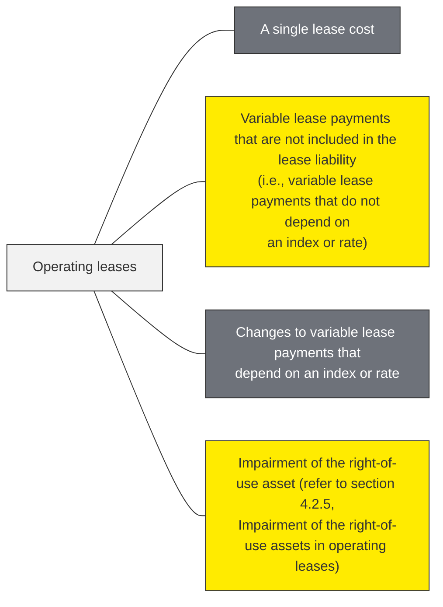

To clarify, a lessee's lease cost includes both amounts recognized in profit or loss during the period and any amounts capitalized as part of the cost of another asset in accordance with other applicable guidance, such as ASC 330.

#### Single lease cost

After lease commencement, a lessee recognizes a single lease cost for an operating lease on a straight-line basis. This is consistent with the concept of the lessee paying to use the asset during the lease term rather than paying to finance the acquisition of the underlying asset in a finance lease. The single lease cost for an operating lease differs from the cost for a finance lease (i.e., a lessee separately recognizes interest on the finance lease liability and amortization on the finance lease right-of-use asset).


Financial reporting developments Lease accounting | 158

4 Lessee accounting


Absent an impairment of the right-of-use asset (see section 4.2.5.4, *Accounting for an operating lease after an impairment of a right-of-use asset (single lease cost)*), the single lease cost is calculated so that the remaining cost of the lease is allocated over the remaining lease term on straight-line basis unless another systematic and rational basis is more representative of the pattern in which benefit is expected to be derived from the right to use the underlying asset.

The remaining cost of the lease is calculated as:

*   Total lease payments (including those previously paid and not yet paid)
*   Plus total lessee initial direct costs (attributable to the lease)
*   Minus the periodic lease cost recognized in prior periods

Total lease payments are adjusted to reflect changes that arise from a lease modification (i.e., a change to the terms and conditions of the contract that results in a change in the scope of or consideration for the lease) or the remeasurement of the lease liability not recognized in profit or loss at the date of remeasurement (e.g., a change in lease term). Refer to section 4.5, *Remeasurement of lease liabilities and right-of-use assets — operating and finance leases*.

**Pattern of benefit from use of the underlying asset**

> **Excerpt from Accounting Standards Codification**
> **Leases — Lessee**
>
> **Implementation Guidance and Illustrations**
>
> **842-20-55-3**
> This Subtopic considers the right to control the use of the underlying **asset** as the equivalent of physical use. If the **lessee** controls the use of the underlying asset, recognition of **lease** cost in accordance with paragraph 842-20-25-6(a) or amortization of the **right-of-use asset** in accordance with paragraph 842-20-35-7 should not be affected by the extent to which the lessee uses the underlying asset.

Operating lease agreements may specify scheduled rent increases over the lease term (refer to section 2.3, *Lease term and purchase options*) or periods during the lease term for which rent payments are not required (i.e., rent holidays). Uneven rental payments (increases, decreases or holidays) are often designed to provide an inducement for the lessee, to reflect the anticipated effects of inflation, to ease the lessee’s near-term cash flow requirements or to acknowledge the time value of money. For operating leases that include uneven rental payments, rental expense should be recognized by a lessee on a straight-line basis over the lease term unless another systematic and rational allocation basis is more representative of the time pattern in which a benefit is expected to be derived from the right to use the underlying asset, unless the right-of-use asset becomes impaired (refer to section 4.2.5, *Impairment of right-of-use assets in operating leases*). Using factors such as the time value of money or anticipated inflation is inappropriate because these factors do not relate to the physical usage of the underlying asset.

Lease agreements may include scheduled rent increases designed to accommodate the lessee’s projected physical use of the underlying asset. For example, rents may escalate in contemplation of the lessee’s physical use of the underlying asset even though the lessee takes possession of or controls the physical use of the underlying asset at commencement.

It is important to note the standard emphasizes the benefit from the “right to use” as opposed to how the lessee is expected to use the underlying asset. If rents escalate in contemplation of the lessee’s physical use of the underlying asset but the lessee takes possession of or controls the physical use of the underlying asset at the beginning of the lease term, all rental payments, including the escalated rents, should be recognized as rental expense on a straight-line basis starting with the beginning of the lease term (i.e., rent expense is not affected by the extent to which the lessee uses the asset).


Financial reporting developments Lease accounting | 159

4 Lessee accounting


The application of the guidance above to an operating lease with uneven rental payments that are not representative of the pattern in which benefit is expected to be derived from the right to use the underlying asset results in prepaid or accrued rentals. If the lessee purchases the underlying asset prior to the expiration of the lease term, any prepaid or accrued rentals should be included in the determination of the purchase price of the asset (refer to section 4.8.2, *Purchase of an underlying asset during the lease term*, for further discussion). If the lease agreement is extended, lessees should apply the guidance in section 4.6, *Lease modifications*.

### Variable lease payments

> **Excerpt from Accounting Standards Codification**
> **Leases — Lessee**
> **Implementation Guidance and Illustrations**
>
> **842-20-55-1**
> A lessee should recognize costs from **variable lease payments** (in annual periods as well as in interim periods) before the achievement of the specified target that triggers the variable lease payments, provided the achievement of that target is considered **probable**.
>
> **842-20-55-2**
> Variable lease costs recognized in accordance with paragraph 842-20-55-1 should be reversed at such time that it is probable that the specified target will not be met.

After the commencement date, lessees also recognize as part of lease-related cost any variable lease payments not included in the operating lease liability in the period in which the achievement of the specified target that triggers the variable lease payments becomes probable. Any previously recognized variable lease costs are reversed if it becomes probable that the specified target will no longer be met. Refer to section 2.4.10, *Amounts not included in lease payments*, for a discussion of variable leases payments that do not depend on an index or rate.

### Impairment of the right-of-use asset

If a lessee determines that a right-of-use asset is impaired, it recognizes an impairment loss and measures the right-of-use asset at its carrying amount immediately after the impairment. Following an impairment, the single lease cost is calculated in the manner described in section 4.2.5, *Impairment of right-of-use assets in operating leases*.

## 4.2.4 Example — lessee accounting for an operating lease

<table>
  <thead>
    <tr>
        <th>Illustration 4-3: Lessee accounting for an operating lease</th>
    </tr>
  </thead>
  <tbody>
    <tr>
        <td>Entity L (lessee) makes a payment of $5,000 to an existing tenant to obtain a lease and enters into a three-year lease of the same office space that it concludes is an operating lease. The lease commences at the beginning of Year 1. Entity L agrees to make the following annual payments at the end of each year: $10,000 in Year 1, $12,000 in Year 2 and $14,000 in Year 3. Entity L concludes that the $5,000 payment to the former tenant qualifies as an initial direct cost (IDC). For simplicity, there are no purchase options, payments to the lessor before the lease commencement date, variable payments based on an index or rate, or lease incentives from the lessor. The initial measurement of the right-of-use asset and lease liability is $33,000 using a discount rate of 4.235%. Entity L uses its incremental borrowing rate because the rate implicit in the lease cannot be readily determined. Entity L calculates that the annual straight-line lease expense is $12,000 per year [($10,000 + $12,000 + $14,000) ÷ 3].</td>
    </tr>
  </tbody>
</table>
Financial reporting developments Lease accounting | 160

4 Lessee accounting


> *Analysis:* At lease commencement, Entity L would recognize the right-of-use asset and lease liability:
>
> | | | |
> | :--- | :--- | :--- |
> | Right-of-use asset | $ 38,000 | |
> |     Lease liability | | $ 33,000 |
> |     Cash | | 5,000 |
>
> *To initially recognize the right-of-use asset, lease liability and the payment that qualifies as an IDC.*
>
> The following journal entries would be recorded in Year 1:
>
> | | | |
> | :--- | :--- | :--- |
> | Lease expense | $ 12,000 | |
> |     Right-of-use asset (accrued rent) | | $ 2,000 |
> |     Cash | | 10,000 |
>
> *To record lease expense and adjust the right-of-use asset for the difference between cash paid and straight-line lease expense (i.e., accrued rent).*
>
> | | | |
> | :--- | :--- | :--- |
> | Lease expense (amortization of IDC) | $ 1,667 | |
> |     Right-of-use asset (amortization of IDC) | | $ 1,667 |
>
> *To record amortization of the IDC ($5,000 ÷ 3 years = $1,667).*
>
> | | | |
> | :--- | :--- | :--- |
> | Lease liability | $ 8,602 | |
> |     Right-of-use asset | | $ 8,602 |
>
> *To adjust the lease liability to the present value of the remaining lease payments with an offset to the right-of-use asset. The adjustment of $8,602 is calculated as the initially recognized lease liability ($33,000) less the present value of remaining lease payments ($24,398) at the end of Year 1.*
>
> A summary of the lease contract's accounting (assuming no changes due to reassessment, lease modification or impairment) is as follows:
>
> <table>
  <thead>
    <tr>
        <th>&gt;</th>
        <th>Initial</th>
        <th>Year 1</th>
        <th>Year 2</th>
        <th>Year 3</th>
    </tr>
  </thead>
  <tbody>
    <tr>
        <td>&gt; Cash lease payments:</td>
        <td></td>
        <td>$ 10,000</td>
        <td>$ 12,000</td>
        <td>$ 14,000</td>
    </tr>
    <tr>
        <td>&gt; Income statement:</td>
        <td></td>
        <td></td>
        <td></td>
        <td></td>
    </tr>
    <tr>
        <td>&gt; Periodic lease expense (straight-line)</td>
        <td></td>
        <td>(12,000)</td>
        <td>(12,000)</td>
        <td>(12,000)</td>
    </tr>
    <tr>
        <td>&gt; Amortization of IDC</td>
        <td></td>
        <td>(1,667)</td>
        <td>(1,667)</td>
        <td>(1,666)</td>
    </tr>
    <tr>
        <td>&gt; Total lease expense</td>
        <td></td>
        <td>$ (13,667)</td>
        <td>$ (13,667)</td>
        <td>$ (13,666)</td>
    </tr>
    <tr>
        <td>&gt; (Accrued)/prepaid rent for period</td>
        <td></td>
        <td>$ (2,000)</td>
        <td>$ —</td>
        <td>$ 2,000</td>
    </tr>
    <tr>
        <td>&gt; Balance sheet:</td>
        <td></td>
        <td></td>
        <td></td>
        <td></td>
    </tr>
    <tr>
        <td>&gt; Lease liability</td>
        <td>$ (33,000)</td>
        <td>$ (24,398)</td>
        <td>$ (13,431)</td>
        <td>$ —</td>
    </tr>
    <tr>
        <td>&gt; Right-of-use asset</td>
        <td></td>
        <td></td>
        <td></td>
        <td></td>
    </tr>
    <tr>
        <td>&gt; Lease liability</td>
        <td>$ 33,000</td>
        <td>$ 24,398</td>
        <td>$ 13,431</td>
        <td>$ —</td>
    </tr>
    <tr>
        <td>&gt; Unamortized IDC</td>
        <td>5,000</td>
        <td>3,333</td>
        <td>1,666</td>
        <td>—</td>
    </tr>
    <tr>
        <td>&gt; (Accrued)/prepaid rent (cumulative)</td>
        <td>—</td>
        <td>(2,000)</td>
        <td>(2,000)</td>
        <td>—</td>
    </tr>
    <tr>
        <td>&gt;</td>
        <td>$ 38,000</td>
        <td>$ 25,731</td>
        <td>$ 13,097</td>
        <td>$ —</td>
    </tr>
    <tr>
        <td>&gt;</td>
        <td colspan="4"></td>
    </tr>
  </tbody>
</table>
>
> Immaterial differences may arise in the recomputation of amounts in the example above due to rounding.
>
> Refer to section 4.3.5, *Example — lessee accounting for a finance lease*, for a table that illustrates the similarities and differences in the accounting for an operating lease and a finance lease.


Financial reporting developments Lease accounting | 161

4 Lessee accounting


## 4.2.5 Impairment of right-of-use assets in operating leases

> ### Excerpt from Accounting Standards Codification
> **Leases — Lessee**
>
> **Subsequent Measurement**
>
> **842-20-35-9**
> A **lessee** shall determine whether a **right-of-use asset** is impaired and shall recognize any impairment loss in accordance with Section 360-10-35 on impairment or disposal of long-lived assets.

A lessee's right-of-use asset in an operating or finance lease is subject to the impairment guidance in ASC 360-10 (for guidance on impairment of right-of-use assets in finance leases refer to section 4.3.4, *Impairment of right-of-use assets in finance leases*). Lessees must also apply the guidance in ASC 360-10 when there are significant changes to the current or expected use of a right-of-use asset because it could affect the asset groupings used to evaluate the right-of-use asset for impairment and the estimated useful life of both a right-of-use asset and any leasehold improvements associated with the underlying asset.

Further, lessees that separately account for non-lease components (i.e., entities that have not made the policy election under ASC 842 to combine lease and associated non-lease components) must consider the guidance in ASC 420 to determine whether any exit or disposal costs associated with non-lease components should be accrued (e.g., when a lessee has concluded that it has permanently ceased using an asset, whether for its own use or through subleasing, and costs allocated to the non-lease component that will continue to be incurred for its remaining term will not provide economic benefit to the entity).

The following flowchart illustrates the interaction of the guidance in ASC 842, ASC 360-10 and ASC 420:

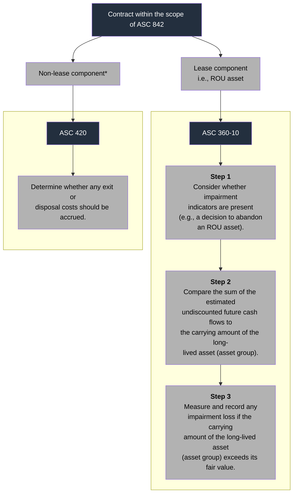

\* Generally, applies only to lessees that do not make the policy election to combine the lease and associated non-lease components of a contract.


Financial reporting developments Lease accounting | 162

4 Lessee accounting


The FASB indicated in the Basis for Conclusions (BC 255) of ASU 2016-02 that the impairment model in ASC 360-10 is appropriate to apply to a lessee's right-of-use assets because these assets are long-lived nonfinancial assets and should be accounted for the same way as an entity's other long-lived nonfinancial assets. This treatment is intended to give users of the financial statements comparable information about all of an entity's long-lived nonfinancial assets.

The guidance in ASC 360-10 requires three steps to identify, recognize and measure the impairment of a long-lived asset (asset group) to be held and used:

*   **Indicators of impairment (Step 1)** – Consider whether impairment indicators are present (i.e., whether there are any events or changes in circumstances that indicate that the carrying amount of the long-lived asset (asset group) might not be recoverable).
*   **Test for recoverability (Step 2)** – If indicators of impairment are present, perform a recoverability test by comparing the sum of the estimated undiscounted future cash flows attributable to the long-lived asset (asset group) in question to its carrying amount (as a reminder, entities cannot record an impairment for a held and used asset unless the asset first fails this recoverability test).
*   **Measure an impairment (Step 3)** – If the undiscounted cash flows used in the test for recoverability are less than the carrying amount of the long-lived asset (asset group), determine the fair value of the long-lived asset (asset group) and recognize an impairment loss if the carrying amount of the long-lived asset (asset group) exceeds its fair value.

### Grouping long-lived assets

ASC 360-10 defines an asset group as "the unit of accounting for a long-lived asset or assets to be held and used, which represents the lowest level for which identifiable cash flows are largely independent of the cash flows of other groups of assets and liabilities." Assets generally should be grouped when they are used together (i.e., when they are part of the same group of assets and are used together to generate joint cash flows).

Grouping long-lived assets requires judgment and will require consideration of the facts and circumstances as well as an understanding of the entity's business. We believe the impairment assessment for ROU assets often will be performed at an asset-group level with any impairment allocated among the long-lived assets of the group in accordance with ASC 360-10.

Each time a lessee performs a recoverability test, it should reassess whether its grouping of long-lived assets continues to be appropriate. Significant changes to the current or expected use of the individual assets of the group might indicate that the related asset grouping may have changed. This might be the case even when the ROU asset is not the primary asset in the asset group.

When evaluating whether the inclusion of an ROU asset in an asset group continues to be appropriate, a lessee needs to determine whether there has been a fundamental change in the use of the leased asset. For example, a functionally independent asset that is abandoned (e.g., a building) may no longer be part of an existing asset group. Refer to section 4.2.5.3, *Abandonment of ROU assets*, for discussion on when an ROU asset is abandoned. However, it may be challenging to determine whether an ROU asset that is not (or will not be) abandoned has changed asset groups or is a separate asset group. Examples of situations that could indicate the asset group has changed for an ROU asset that is not (or will not be) abandoned include:

*   The lessee has ceased using the leased asset and does not plan to reoccupy or use the leased asset in the future.


Financial reporting developments Lease accounting | 163

4 Lessee accounting


* The lessee has incurred significant costs (e.g., readying the space for sublease by removing signage) to cease using the leased asset in the near future.
* The lessee has executed a sublease for the leased asset for substantially all of the remaining lease term.
* The lessee is actively marketing the leased asset for sublease (e.g., hired a broker).
* The lessee has changed how the leased asset is used in its operations, including moving the leased asset to a different line of business in a different asset group.

These situations are not all inclusive, and no one situation is determinative. A lessee will need to evaluate its facts and circumstances to determine whether there is a change in how it uses the leased asset and whether the asset group has changed. A plan to change how the leased asset will be used by the business or to sublease the leased asset, by itself, generally does not indicate that the ROU asset's group has changed, since the lowest level of identifiable cash flows has not yet changed. For example, a lessee may decide that in one year it will sublease a leased asset that is part of an enterprise-wide asset group but it will continue to use the leased asset until then. The ROU asset would still be part of the enterprise-wide asset group because the lessee continues to use the leased asset.

Refer to section 6.3, *Sublessor accounting*, for discussion on evaluating the grouping of long-lived assets when a lessee has executed a sublease for a leased asset in the asset group.

### 4.2.5.1 Test for recoverability (Step 2)

ASC 360-10 provides principles for evaluating long-lived assets for impairment, but it does not specifically address how lease liabilities should be considered in the recoverability test. Under ASC 360-10, financial liabilities (e.g., long-term debt) generally are excluded from an asset group and operating liabilities (e.g., accounts payable) generally are included. Financial liabilities generally are excluded because when the FASB was deliberating Statement 144 (later codified in ASC 360-10), it indicated that how an entity capitalizes or finances its operations should not influence the recognition of an impairment loss (see B34 of Statement 144). ASC 360-10 requires an entity to exclude asset retirement obligation (ARO) liabilities from an asset group and to exclude estimated future cash outflows associated with ARO liabilities from both the recoverability test (Step 2) and measurement of an impairment (Step 3).

ASC 842 characterizes operating lease liabilities as operating liabilities. In the Basis for Conclusions (BC 264) of ASU 2016-02, the FASB noted that while both operating and finance lease liabilities are financial liabilities, finance lease liabilities are the equivalent of debt, and operating lease liabilities are operating in nature and not "debt like."

Because operating lease liabilities may be viewed as having attributes of finance liabilities as well as operating liabilities, we believe it is acceptable for a lessee to either include or exclude operating lease liabilities from an asset group when testing whether the carrying amount of an asset group is recoverable. A lessee should apply its approach (i.e., include or exclude operating lease liabilities) consistently for all operating leases and when performing Steps 2 and 3 of the impairment model in ASC 360-10 (refer to section 4.2.5.2, *Measure an impairment (Step 3)*, for guidance on measuring an impairment loss).

In some cases, including operating lease liabilities in an asset group may result in the long-lived asset (asset group) having a zero or negative carrying amount. For example, this may occur if a lessee receives lease incentives or has back-loaded lease payments, both of which would result in reductions to the lessee's right-of-use assets. In these cases, a lessee is still required to test whether the carrying amount of the asset group is recoverable and, if not recoverable, measure the asset group for impairment.


Financial reporting developments Lease accounting | 164

4 Lessee accounting


### Determining which future cash outflows for operating lease payments should be included in the Step 2 recoverability test

A lessee that excludes operating lease liabilities from its asset group should exclude future cash lease payments (i.e., fixed, in-substance fixed and variable payments based on an index or rate) in the undiscounted future cash flows.

ASC 360-10 does not specifically address how future cash outflows for operating lease payments should be considered in the recoverability test. The FASB staff said in response to a technical inquiry that if a lessee includes an operating lease liability as part of the carrying amount of the asset group, only the principal component of future lease payments would be included as an outflow in the undiscounted future cash flows used to test recoverability of the asset group. That is, the lessee would include the future cash lease payments for the lease, excluding the component that effectively represents the accretion of the lease liability (even though interest expense is not recognized separately for an operating lease). As a result, we believe a lessee’s decision to include or exclude operating lease liabilities from an asset group generally should not affect the outcome of its recoverability test (refer to Illustration 4-4).

In summary, if a lessee includes operating lease liabilities in its asset group, it should include only the principal component of future cash lease payments in the undiscounted future cash flows. If it excludes operating lease liabilities from its asset group, it should exclude future cash lease payments (i.e., fixed, in-substance fixed and variable payments based on an index or rate) for the lease.

ASC 842 requires lessees to exclude certain variable lease payments from lease payments and, therefore, from the measurement of a lessee’s lease liabilities. Because these payments do not reduce a lessee’s lease liability, we believe the variable payments a lessee expects to make should be included in a lessee’s estimate of undiscounted cash flows in the recoverability test (Step 2), regardless of whether the lessee includes or excludes operating lease liabilities from the asset group. How these payments are included in the lessee’s estimate of future cash flows will depend on the cash flow estimation approach (e.g., probability-weighted, best estimate) it uses. We also believe these variable payments should be included when determining the fair value in Step 3 if the lessee uses a discounted cash flow approach.

As a reminder, a lessee uses its own assumptions to develop estimates of future cash flows in Step 2. This differs from the approach in Step 3, where the lessee measures fair value of the asset group based on market participant assumptions.

Refer to our FRD, *Impairment or disposal of long-lived assets*, for further discussion of evaluating assets for impairment in accordance with ASC 360-10.

<table>
  <thead>
    <tr>
        <th>Illustration 4-4: Recoverability test for an asset group that is held and used</th>
        <th colspan="14"></th>
    </tr>
  </thead>
  <tbody>
    <tr>
        <td>On 1 January 20X1</td>
        <td>a retailer (Lessee) leases space from the owner of a shopping center (Lessor) for<br/>10 years. Under the terms of the agreement</td>
        <td>Lessee agrees to pay fixed payments payable on<br/>31 December of each year starting at $10</td>
        <td>000 and increasing 2% each year.<br/><br/>Assume the lease is classified as an operating lease</td>
        <td>and Lessee’s incremental borrowing rate is 4%.<br/>Lessee determines that the appropriate level at which to group assets to test for and measure<br/>impairment of long-lived assets is at the store level.<br/><br/>On 1 January 20X4</td>
        <td>Lessee identifies a change in circumstances that indicates the carrying amount of<br/>the asset group may not be recoverable and performs a recoverability test. On this date</td>
        <td>assume that<br/>the carrying amount of the asset group</td>
        <td>excluding the operating lease liability</td>
        <td>is $500</td>
        <td>000 and the<br/>carrying amount of the operating lease liability is $67</td>
        <td>436 (calculation not shown). Also</td>
        <td>assume that<br/>the cash flow estimation period is seven years and that the undiscounted future expected cash flows<br/>per year</td>
        <td>excluding lease payments</td>
        <td>are $75</td>
        <td>000 per year.</td>
    </tr>
  </tbody>
</table>


Financial reporting developments Lease accounting | 165

4 Lessee accounting


### Scenario 1

Lessee excludes the operating lease liability from the asset group when determining the carrying amount of the asset group and, therefore, excludes the cash outflows for lease payments in determining the undiscounted future expected cash flows of the asset group.

<table>
  <thead>
    <tr>
        <th>Year</th>
        <th>Undiscounted future<br/>expected cash flows<br/>(before lease payments)</th>
        <th>Total</th>
    </tr>
  </thead>
  <tbody>
    <tr>
        <td>1</td>
        <td>$ 75,000</td>
        <td>$ 75,000</td>
    </tr>
    <tr>
        <td>2</td>
        <td>$ 75,000</td>
        <td>$ 75,000</td>
    </tr>
    <tr>
        <td>3</td>
        <td>$ 75,000</td>
        <td>$ 75,000</td>
    </tr>
    <tr>
        <td>4</td>
        <td>$ 75,000</td>
        <td>$ 75,000</td>
    </tr>
    <tr>
        <td>5</td>
        <td>$ 75,000</td>
        <td>$ 75,000</td>
    </tr>
    <tr>
        <td>6</td>
        <td>$ 75,000</td>
        <td>$ 75,000</td>
    </tr>
    <tr>
        <td>7</td>
        <td>$ 75,000</td>
        <td>$ 75,000</td>
    </tr>
    <tr>
        <td></td>
        <td>$ 525,000</td>
        <td>$ 525,000</td>
    </tr>
  </tbody>
</table>
<table>
  <tbody>
    <tr>
        <td>Carrying amount of asset group<br/>(excluding operating lease liability)</td>
        <td>$ 500,000</td>
    </tr>
    <tr>
        <td>Total undiscounted future expected cash flows</td>
        <td>$ 525,000</td>
    </tr>
    <tr>
        <td>Excess</td>
        <td>$ 25,000</td>
    </tr>
    <tr>
        <td>Recoverable? (Yes or No)</td>
        <td>Yes</td>
    </tr>
  </tbody>
</table>

### Scenario 2

Lessee includes the operating lease liability in the asset group when determining the carrying amount of the asset group and, therefore, includes the cash outflows for the principal portion of the lease payments in determining the undiscounted future expected cash flows of the asset group.

<table>
  <thead>
    <tr>
        <th>Year</th>
        <th>Undiscounted future<br/>expected cash flows<br/>(before lease payments)</th>
        <th>Lease payments</th>
        <th>Add back portion<br/>related to accreted<br/>interest</th>
        <th>Total undiscounted<br/>future expected<br/>cash flows</th>
    </tr>
  </thead>
  <tbody>
    <tr>
        <td>1</td>
        <td>$ 75,000</td>
        <td>(10,612)</td>
        <td>2,697</td>
        <td>$ 67,085</td>
    </tr>
    <tr>
        <td>2</td>
        <td>$ 75,000</td>
        <td>(10,824)</td>
        <td>2,381</td>
        <td>$ 66,557</td>
    </tr>
    <tr>
        <td>3</td>
        <td>$ 75,000</td>
        <td>(11,041)</td>
        <td>2,043</td>
        <td>$ 66,002</td>
    </tr>
    <tr>
        <td>4</td>
        <td>$ 75,000</td>
        <td>(11,262)</td>
        <td>1,683</td>
        <td>$ 65,421</td>
    </tr>
    <tr>
        <td>5</td>
        <td>$ 75,000</td>
        <td>(11,487)</td>
        <td>1,300</td>
        <td>$ 64,813</td>
    </tr>
    <tr>
        <td>6</td>
        <td>$ 75,000</td>
        <td>(11,717)</td>
        <td>893</td>
        <td>$ 64,176</td>
    </tr>
    <tr>
        <td>7</td>
        <td>$ 75,000</td>
        <td>(11,950)</td>
        <td>460</td>
        <td>$ 63,510</td>
    </tr>
    <tr>
        <td></td>
        <td>$ 525,000</td>
        <td>(78,893)</td>
        <td>11,457</td>
        <td>$ 457,564</td>
    </tr>
  </tbody>
</table>
<table>
  <tbody>
    <tr>
        <td>Carrying amount of asset group<br/>(excluding operating lease liability)</td>
        <td>$ 500,000</td>
    </tr>
    <tr>
        <td>Carrying amount of operating lease liability</td>
        <td>(67,436)</td>
    </tr>
    <tr>
        <td>Carrying amount of asset group (including<br/>operating lease liability)</td>
        <td>$ 432,564</td>
    </tr>
    <tr>
        <td><br/></td>
        <td><br/></td>
    </tr>
    <tr>
        <td>Total undiscounted future expected cash flows</td>
        <td>$ 457,564</td>
    </tr>
    <tr>
        <td>Excess</td>
        <td>$ 25,000</td>
    </tr>
    <tr>
        <td>Recoverable? (Yes or No)</td>
        <td>Yes</td>
    </tr>
  </tbody>
</table>

As shown in Scenario 2, including the operating lease liability in the asset group results in the same outcome as the recoverability test in Scenario 1. This is because by excluding accreted interest from the undiscounted future cash flows both the carrying amount of the asset group and the undiscounted future cash flows are reduced by the existing discounted lease obligation (i.e., $67,436).


Financial reporting developments Lease accounting | 166

4 Lessee accounting


### 4.2.5.2 Measure an impairment (Step 3)

If the undiscounted cash flows used in the recoverability test are less than the carrying amount of the long-lived asset (asset group), an entity is required to determine the fair value of the long-lived asset (asset group) and recognize an impairment loss when the carrying amount of the long-lived asset (asset group) exceeds its fair value.

We believe that if a lessee excludes operating lease liabilities from the asset group when performing the recoverability test, it also should exclude operating lease liabilities from the asset group when measuring the group's fair value. Alternatively, if a lessee includes operating lease liabilities in the asset group when performing the recoverability test, it also should include operating lease liabilities in the asset group when determining the group's fair value.

Regardless of which approach a lessee chooses, we generally do not expect significant differences in the measurement of an impairment loss because we would expect a lessee's estimate of the fair value of the asset group to appropriately reflect whether the asset group includes or excludes operating lease liabilities. For example, consistent with the guidance in ASC 360-10 for AROs, if a lessee excludes operating lease liabilities from the carrying amount of an asset group but the fair value of the asset group is based on a quoted market price that considers the lessee's obligation to make lease payments, the quoted market price should be increased by the fair value of the operating lease liabilities. Alternatively, if a lessee includes operating lease liabilities in the carrying amount of an asset group but the fair value of the asset group is based on a quoted market price that does not consider the lessee's obligation to make lease payments, the quoted market price should be decreased by the fair value of the operating lease liabilities.

If the fair value of the asset group is determined based on discounted cash flows, the market participant cash flows should be adjusted to align with an entity's decision to include or exclude operating lease liabilities in the carrying amount of the asset group. If the carrying amount of the asset group includes operating lease liabilities, the market participant discounted cash flows used to estimate fair value should include both principal and interest payments, unlike the cash flows used in the recoverability test, which, as discussed above, exclude the component of the operating lease payments that effectively represents the accretion of the lease liability.

While we may not expect including or excluding the lease liability to cause significant differences in the measurement of impairments, measurement differences could exist in some circumstances (e.g., due to decreases in the fair value of the lease liability relative to its carrying amount).

As a reminder, in accordance with ASC 360-10, an impairment loss for an asset group reduces only the carrying amounts of long-lived assets of the group (including lease-related right-of-use assets). The loss must be allocated to the long-lived assets of the group on a pro rata basis using the relative carrying amounts of those assets, except that the loss allocated to an individual long-lived asset of the group must not reduce the carrying amount of that asset below its fair value whenever the fair value is determinable without undue cost and effort.

ASC 360-10 prohibits the subsequent reversal of an impairment loss for an asset held and used.


Financial reporting developments Lease accounting | 167

4 Lessee accounting


### Illustration 4-5: Measurement of impairment for an asset group that is held and used

On 1 January 20X2, Lessee enters into a five-year lease of an asset. Lease payments are fixed at $10,000 per year due on 31 December of each year. The lease is classified as an operating lease, and Lessee’s incremental borrowing rate is 5%. Assume that Lessee has no other assets or liabilities that should be grouped with the operating lease right-of-use asset and liability for purpose of testing for impairment.

On 1 January 20X4, Lessee identifies a change in circumstances that indicates the carrying amount of the right-of-use asset ($27,232) may not be recoverable and performs a recoverability test. Lessee determines that the right-of-use asset is not recoverable (i.e., the carrying amount of the right-of-use asset is greater than the related entity-specific undiscounted cash flows) and, therefore, needs to determine whether the carrying amount of the asset exceeds its fair value and, if so, measure and recognize an impairment loss. Lessee determines that the fair value of the right-of-use asset is $20,000, based on its estimate of the amount a market participant would be willing to pay up front in one payment for the right to use the asset for three years in its highest and best use assuming no additional lease payments would be due.

#### Scenario 1

Lessee’s approach for determining and measuring impairment in long-lived asset groups is to exclude operating lease liabilities from the asset group.

<table>
  <thead>
    <tr>
        <th></th>
        <th>Carrying amount</th>
        <th>Fair value</th>
        <th>Measured impairment loss</th>
    </tr>
  </thead>
  <tbody>
    <tr>
        <td>ROU asset</td>
        <td>$ 27,232</td>
        <td>$ 20,000</td>
        <td></td>
    </tr>
    <tr>
        <td>Lease liability</td>
        <td>$ 0</td>
        <td>$ 0</td>
        <td></td>
    </tr>
    <tr>
        <td></td>
        <td>$ 27,232</td>
        <td>$ 20,000</td>
        <td>$ (7,232)</td>
    </tr>
  </tbody>
</table>

In Scenario 1, Lessee would recognize an impairment loss of $7,232, reducing the carrying amount of the right-of-use asset by that amount.

#### Scenario 2

Assume the same facts as in Scenario 1 except that Lessee’s approach for determining and measuring impairment in long-lived asset groups is to include operating lease liabilities in the asset group, which results in the asset group having a carrying amount of zero. Lessee determines that the right-of-use asset is not recoverable because the entity-specific undiscounted cash flows are negative. Also, assume there has not been a significant change in the lessee’s credit quality or interest rates since 1 January 20X2 such that the fair value of the lease liability is determined to be the same as its carrying amount (i.e., $27,232).

<table>
  <thead>
    <tr>
        <th></th>
        <th>Carrying amount</th>
        <th>Fair value</th>
        <th>Measured impairment loss</th>
    </tr>
  </thead>
  <tbody>
    <tr>
        <td>ROU asset</td>
        <td>$ 27,232</td>
        <td>$ 20,000</td>
        <td></td>
    </tr>
    <tr>
        <td>Lease liability</td>
        <td>$ (27,232)</td>
        <td>$ (27,232)</td>
        <td></td>
    </tr>
    <tr>
        <td></td>
        <td>$ 0</td>
        <td>$ (7,232)</td>
        <td>$ (7,232)</td>
    </tr>
  </tbody>
</table>

In Scenario 2, Lessee would recognize an impairment loss of $7,232, reducing the carrying amount of the right-of-use asset by that amount.


Financial reporting developments Lease accounting | 168

4 Lessee accounting


> **Scenario 3**
>
> Assume the same facts as Scenario 1 except that Lessee’s approach for determining and measuring impairment in long-lived asset groups is to include operating lease liabilities in the asset group, which results in the asset group having a carrying amount of zero. Lessee determines that the right-of-use asset is not recoverable because the entity-specific undiscounted cash flows are negative. However, further assume that Lessee determines that the fair value of the lease liability is $30,000 due to a significant improvement in its credit quality since 1 January 20X2.
>
> <table>
  <thead>
    <tr>
        <th>&gt;</th>
        <th>Carrying amount</th>
        <th>Fair value</th>
        <th>Measured impairment loss</th>
    </tr>
  </thead>
  <tbody>
    <tr>
        <td>&gt; ROU asset</td>
        <td>$ 27,232</td>
        <td>$ 20,000</td>
        <td></td>
    </tr>
    <tr>
        <td>&gt; Lease liability</td>
        <td>$ (27,232)</td>
        <td>$ (30,000)</td>
        <td></td>
    </tr>
    <tr>
        <td>&gt;</td>
        <td>$ 0</td>
        <td>$ (10,000)</td>
        <td>$ (10,000)</td>
    </tr>
    <tr>
        <td>&gt;</td>
        <td colspan="3"></td>
    </tr>
  </tbody>
</table>
>
> In Scenario 3, Lessee would recognize an impairment loss of $7,232, reducing the carrying amount of the right-of-use asset by that amount. Although the measured impairment loss for the asset group is $10,000, Lessee can reduce only the carrying amount of the long-lived assets in the group (i.e., the right-of-use asset) and cannot reduce the carrying amount of that asset below its fair value whenever the fair value is determinable without undue cost and effort.
>
> **Scenario 4**
>
> Assume the same facts as Scenario 1 except that Lessee’s approach for determining and measuring impairment in long-lived asset groups is to include operating lease liabilities in the asset group, which results in the asset group having a carrying amount of zero. Lessee determines that the right-of-use asset is not recoverable because the entity-specific undiscounted cash flows are negative. However, further assume Lessee determines that the fair value of the lease liability is $15,000 due to a significant deterioration in its credit quality since 1 January 20X2.
>
> <table>
  <thead>
    <tr>
        <th>&gt;</th>
        <th>Carrying amount</th>
        <th>Fair value</th>
        <th>Measured impairment loss</th>
    </tr>
  </thead>
  <tbody>
    <tr>
        <td>&gt; ROU asset</td>
        <td>$ 27,232</td>
        <td>$ 20,000</td>
        <td></td>
    </tr>
    <tr>
        <td>&gt; Lease liability</td>
        <td>$ (27,232)</td>
        <td>$ (15,000)</td>
        <td></td>
    </tr>
    <tr>
        <td>&gt;</td>
        <td>$ 0</td>
        <td>$ 5,000</td>
        <td>$ 0</td>
    </tr>
    <tr>
        <td>&gt;</td>
        <td colspan="3"></td>
    </tr>
  </tbody>
</table>
>
> In Scenario 4, Lessee would not recognize an impairment loss even though the carrying amount of the right-of-use asset exceeds its fair value by $7,232.

### Fair value considerations

ASC 820 provides a principles-based framework for measuring fair value when US GAAP requires or permits a fair value measurement and requires disclosures about the use of fair value measurements. ASC 820 defines fair value as "the price that would be received to sell an asset or paid to transfer a liability in an orderly transaction between market participants at the measurement date."

Under ASC 820, a fair value measurement of a nonfinancial asset takes into account a market participant's ability to generate economic benefits by using the asset in its highest and best use or by selling it to another market participant that would use the asset in its highest and best use. Therefore, fair value is a market-based measurement and not an entity-specific measurement. It is determined based on assumptions that market participants would use in pricing the asset or liability. The exit price objective of a fair value measurement applies regardless of the reporting entity's intent and/or ability to sell the asset or transfer the liability at the measurement date.


Financial reporting developments Lease accounting | 169

4 Lessee accounting


When determining the fair value of a right-of-use asset, a lessee should consider what market participants would pay to lease the asset (i.e., what a market participant would pay for the right-of-use asset) for its highest and best use, even if that use differs from the current or intended use by the reporting entity. For example, a lessee that currently leases space for use as a grocery store may conclude that the highest and best use of the space by market participants would be to use it as a fitness center.

While the concept of highest and best use of an asset may consider its use in a different condition, the objective of a fair value measurement is to determine the price of the asset in its current form. Therefore, if no market exists for an asset in its current form, but there is a market for the transformed asset, the reporting entity should back out the costs to transform the asset (as well as any associated profit margin) to determine the fair value of the asset in its current condition. That is, a fair value measurement should consider the costs market participants would incur to recondition the asset (after acquiring the asset in its current condition) and the compensation they would expect for this effort.

A contract restriction, which does not allow the lessee to sublease the asset, does not result in a fair value of zero. Instead, a lessee must consider how a market participant would value the right to use the asset with a sublease restriction in a hypothetical sale. Refer to section 5.2.1, *Restrictions on assets (before the adoption of ASU 2022-03)* or section 5.2.1A, *Restrictions on assets (after the adoption of ASU 2022-03)*, of our FRD, *Fair value measurement*, for further discussion on the effect on fair value of a restriction on the use of an asset.

Refer to our FRD, *Impairment or disposal of long-lived assets*, for further discussion of evaluating assets for impairment in accordance with ASC 360-10 and our FRD, *Fair value measurement*, for further discussion on measuring fair value.

Refer to section 6.3, *Sublessor accounting*, for discussion of evaluating right-of-use assets for impairment when a lessee enters into a sublease.

### 4.2.5.3 Abandonment of ROU assets (updated August 2025)

A lessee that decides to cease using an underlying asset, either immediately or at a future date (e.g., in 12 months), needs to assess whether the corresponding ROU asset is or will be abandoned. A plan to abandon an ROU asset is considered an indicator of impairment under ASC 360-10 that results in the lessee evaluating the ROU asset (asset group) for recoverability and may also result in the lessee reassessing the lease term and classification under ASC 842. Evaluating a lessee's intent and ability to sublease an underlying asset is an important factor in determining whether the underlying asset has been or will be abandoned.

If the lessee does not have a contractual right to sublease the underlying asset and the lessee's cease use of the asset is not temporary, the ROU asset is abandoned at the date the lessee ceases using the underlying asset.

A lessee that has a contractual right to sublease the asset will need to consider the facts and circumstances of the lease and its planned remaining use of the underlying asset. If the lessee may or will sublease the underlying asset, it is not abandoning the ROU asset. As noted in ASC 842-10-15-17, economic benefits from using an asset include subleasing the asset. An entity that may or will sublease an asset (it will not otherwise use) can obtain those economic benefits and, therefore, has not abandoned (or will not abandon) the ROU asset. However, a decision to sublease the underlying asset still may be an indicator of impairment or indicate a change in the asset grouping.


Financial reporting developments Lease accounting | 170

4 Lessee accounting


A lessee that has ceased use of the underlying asset and will not sublease it or use it for other purposes (e.g., storage) generally has abandoned the asset. However, if the lessee does not currently plan to sublease or otherwise use the asset but may sublease it in the future (e.g., a lessee may wait to make final decisions until existing economic conditions change or use its right to not sublease as a negotiating tactic when attempting to terminate a lease early), the ROU asset is not or will not be abandoned because the lessee has not yet decided that it will not sublease or otherwise use the underlying asset.

Careful consideration should be given when evaluating whether an entity has committed to a plan to abandon a long-lived asset (including an ROU asset). For example, a longer remaining lease term may provide the lessee with the ability to obtain economic benefits from the asset, such as through a sublease. That is, if the remaining lease term is significant, an entity would likely remain open to future opportunities rather than committing to cease using the ROU asset permanently and not subleasing the asset. Alternatively, a shorter remaining lease term may limit those future opportunities.

The following flowchart summarizes considerations for determining whether an ROU asset is (or will be) abandoned:

```mermaid
graph TD
    Q1[Does the lessee have a contractual right to sublease the asset?]
    Q2[Has the lessee determined it will not sublease the asset?]
    Q3[Has the lessee ceased using the asset permanently (or will it)?]
    A1[The ROU asset is (or will be) abandoned.]
    A2[The ROU asset is not (or will not be) abandoned.]

    Q1 -- No --> Q3
    Q1 -- Yes --> Q2
    Q2 -- Yes --> Q3
    Q2 -- No --> A2
    Q3 -- Yes --> A1
    Q3 -- No --> A2
```

### Accounting for an abandonment

If a lessee determines that it has abandoned an ROU asset or will abandon it at a future date (e.g., in 12 months), it reassesses its lease term if any of the following conditions in ASC 842-10-35-1 exists:

*   There is a significant event or a significant change in circumstances that is within the control of the lessee that directly affects whether the lessee is reasonably certain to exercise or not to exercise an option to extend or terminate the lease or to purchase the underlying asset.
*   There is an event that is written into the contract that obliges the lessee to exercise (or not to exercise) an option to extend or terminate the lease.
*   The lessee elects to exercise an option even though the entity had previously determined that the lessee was not reasonably certain to do so.
*   The lessee elects not to exercise an option even though the entity had previously determined that the lessee was reasonably certain to do so.

If the lease term changes, the lessee also reassesses the lease classification. The existence of an impairment indicator alone does not result in reassessment of the lease term and classification. Refer to section 2.3.6, *Reassessment of the lease term and purchase options*, for further guidance.


Financial reporting developments Lease accounting | 171

4 Lessee accounting


Under ASC 360-10, a long-lived asset to be disposed of in a manner other than a sale (e.g., abandonment) is considered held and used until the long-lived asset ceases to be used. Because a decision to abandon a long-lived asset before the end of the lease term is akin to a decision to dispose of a long-lived asset before the initially intended date, a decision to abandon the asset is viewed as an indicator of impairment for a held and used long-lived asset. Therefore, if a lessee decides to abandon an ROU asset, the lessee should test whether the carrying amount of the ROU asset (asset group) is recoverable before abandoning it and, if it is not recoverable, measure it for impairment consistent with the discussion in sections 4.2.5.1, *Test for recoverability (Step 2)*, and 4.2.5.2, *Measure an impairment (Step 3)*.

Prior to assessing impairment, a lessee that abandons or decides to abandon at a future date (e.g., in 12 months) an ROU asset that is part of a larger asset group should first reassess whether its grouping of long-lived assets continues to be appropriate. For example, a functionally independent asset that is abandoned (e.g., a building) may no longer be part of an existing asset group. Refer to section 2.3.1, *Grouping long-lived assets to be held and used*, and section 3.1, *Long-lived assets to be abandoned*, of our FRD, ***Impairment or disposal of long-lived assets***, for further discussion of grouping of long-lived assets and abandonment of assets, respectively.

Regardless of whether an ROU asset is impaired, a lessee that commits to a plan to abandon an ROU asset in the future (e.g., in 12 months) but before the end of the lease term should update its estimate of the useful life of the ROU asset. This is consistent with the views expressed by the Securities and Exchange Commission (SEC) staff at the 2020 AICPA Conference on Current SEC and PCAOB Developments.<sup>5</sup> The SEC staff discussed a consultation involving a registrant that identified leases for abandonment but expected there to be an extended period of time between the identification of the leases and the abandonment date. After identifying the specific leases that would be abandoned, the registrant did not change the asset group for which it assessed impairment, and it did not recognize an impairment. In this case, the SEC staff did not object to the registrant's conclusion to re-evaluate the economic life of the ROU assets subject to abandonment and amortize those assets ratably over the period between its identification of leases for abandonment and the actual abandonment date.

The evaluation of whether a lessee has committed to a plan to abandon an ROU asset in the future is based on the facts and circumstances. If the lessee is ceasing to use an asset temporarily (e.g., a lessee plans to vacate a leased office building for one year as part of a restructuring but intends to reoccupy that facility), the temporary abandonment would not result in a reassessment of the useful life of the related ROU asset.

If no impairment is recorded but the useful life is shortened, we believe a lessee would follow the guidance in section 4.2.5.4, *Accounting for an operating lease after an impairment of a right-of-use asset (single lease cost)*, to subsequently account for the ROU asset and lease liability and to determine its single lease cost after estimating the useful life of the right-of-use asset. If an impairment is recorded, the lessee measures the ROU asset at its carrying amount immediately after the impairment and follows the guidance in section 4.2.5.4, *Accounting for an operating lease after an impairment of a right-of-use asset (single lease cost)*, to subsequently account for the ROU asset and lease liability and to determine its single lease cost.

An ROU asset that has been abandoned should be reduced to its salvage value (or zero, if there is no salvage value) as of its cease-use date. The salvage value of an ROU asset will often be de minimis.

***

<sup>5</sup> Speech by Geoff Griffin, 7 December 2020. Refer to the SEC website at https://www.sec.gov/news/speech/griffin-remarks-aicpa-2020.


Financial reporting developments Lease accounting | 172

4 Lessee accounting


The following flowchart summarizes the accounting considerations for a lessee that abandons an ROU asset or decides to abandon it at a future date (e.g., in 12 months). The flowchart assumes that the lessee has appropriately considered ASC 360-10 up to the date the decision is made to abandon the asset.

```mermaid
graph TD
    Start[The ROU asset is abandoned, or a decision has been reached to abandon the ROU asset in the future.] --> Q1{Do any of the conditions in ASC 842-10-35-1 exist?}
    
    Q1 -- Yes --> Reassess[Reassess the lease term.<br/>If the lease term changes, also reassess lease classification.]
    Q1 -- No --> Q2
    Reassess --> Q2{Does the grouping of long-lived assets for purposes of assessing<br/>impairment continue to be appropriate (i.e., if the abandoned (or to be<br/>abandoned) ROU asset is part of a larger asset group)?}
    
    Q2 -- No --> NewGroups[Determine new asset groups.]
    Q2 -- Yes --> Q3
    NewGroups --> Q3{Is the carrying amount of the ROU asset (asset group) recoverable?}
    
    Q3 -- No --> Impairment[Measure and recognize any impairment loss if the carrying amount of<br/>the long-lived asset group exceeds its fair value.]
    Q3 -- Yes --> Q4
    Impairment --> Q4{Will the lessee cease using the ROU asset immediately<br/>(i.e., not on a date in the future)?}
    
    Q4 -- No --> UpdateLife[Update estimate of the useful life of the ROU asset.]
    Q4 -- Yes --> ReduceAsset[Reduce the ROU asset to its salvage value (or<br/>zero, if there is no salvage value).]
    
    UpdateLife --> FollowASC[Follow ASC 842-20-35-10 and ASC 842-20-25-7<br/>to subsequently account for the ROU asset and<br/>lease liability and to determine its single lease<br/>cost using the updated useful life of the ROU<br/>asset.]
```


Financial reporting developments Lease accounting | 173

4 Lessee accounting


### Accounting when there is no abandonment

If a lessee determines that it has not abandoned an ROU asset or will not abandon it at a future date, it should reassess its lease term only if any of the conditions in ASC 842-10-35-1 exists.

Lessees that determine an ROU asset is not abandoned (e.g., because it may be subleased) should consider whether the temporary cease use (or future plan to temporarily cease use) of the asset is an indicator of impairment in accordance with ASC 360-10. Lessees that determine that an indicator of impairment is present should perform the recoverability test for the asset (or asset group) and measure and record any impairment. In doing so, the lessee should first reassess whether its grouping of long-lived assets continues to be appropriate. If an impairment is recorded, the lessee measures the ROU asset at its carrying amount immediately after the impairment and follows the guidance in ASC 842-20-25-7 and ASC 842-20-35-10 to subsequently account for the ROU asset and lease liability and to determine its single lease cost.

#### 4.2.5.4 Accounting for an operating lease after an impairment of a right-of-use asset (single lease cost)

> **Excerpt from Accounting Standards Codification**
> **Leases — Lessee**
>
> **Subsequent Measurement**
>
> **842-20-35-10**
> If a right-of-use asset is impaired in accordance with paragraph 842-20-35-9, after the impairment, it shall be measured at its carrying amount immediately after the impairment less any accumulated amortization. A lessee shall amortize, in accordance with paragraph 842-20-25-7 (for an **operating lease**) or paragraph 842-20-35-7 (for a **finance lease**), the right-of-use asset from the date of the impairment to the earlier of the end of the useful life of the right-of-use asset or the end of the **lease term**.
>
> **Recognition**
>
> **842-20-25-7**
> After a right-of-use asset has been impaired in accordance with paragraph 842-20-35-9, the single lease cost described in paragraph 842-20-25-6(a) shall be calculated as the sum of the following:
>
> a. Amortization of the remaining balance of the right-of-use asset after the impairment on a straight-line basis, unless another systematic basis is more representative of the pattern in which the lessee expects to consume the remaining economic benefits from its right to use the underlying asset
>
> b. Accretion of the lease liability, determined for each remaining period during the lease term as the amount that produces a constant periodic discount rate on the remaining balance of the liability.

If a lessee determines that an operating lease right-of-use asset is impaired, it recognizes an impairment loss and measures the ROU asset at its carrying amount immediately after the impairment. A lessee subsequently amortizes the held-for-use ROU asset, generally on a straight-line basis, from the date of the impairment to the earlier of the end of the useful life of the ROU asset or the end of the lease term. Events or changes in circumstances that indicate the carrying amount of an ROU asset may not be recoverable in accordance with ASC 360-10 that do not occur or arise as a result of an action that is within the control of the lessee do not, in isolation, trigger a reassessment of the lease term or a lessee option to purchase the underlying asset. Refer to section 2.3.6.1, *Reassessment of the lease term and purchase options — lessees*.

If the lease is remeasured after the impairment (e.g., as a result of a modification or a subsequent reassessment event), we believe that a lessee would continue to amortize a held-for-use ROU asset, generally on a straight-line basis, from the date of remeasurement to the earlier of the end of the useful life of the ROU asset or the end of the lease term.

ASC 842 includes the following example of the subsequent accounting for an operating lease following an impairment of the right-of-use asset.


Financial reporting developments Lease accounting | 174

4 Lessee accounting


# Excerpt from Accounting Standards Codification
## Leases — Lessee
### Implementation Guidance and Illustrations
#### Example 5 — Impairment of a Right-of-Use Asset in an Operating Lease

**842-20-55-48**
Lessee enters into a 10-year lease of a nonspecialized asset. Lease payments are $10,000 per year, payable in arrears. The lease does not transfer ownership of the underlying asset or grant Lessee an option to purchase the underlying asset. At lease commencement, the remaining economic life of the underlying asset is 50 years, and the fair value of the underlying asset is $600,000. Lessee does not incur any initial direct costs as a result of the lease. Lessee’s incremental borrowing rate is 7 percent, which reflects the fixed rate at which Lessee could borrow the amount of the lease payments in the same currency, for the same term, and with similar collateral as in the lease at commencement. The lease is classified as an operating lease.

**842-20-55-49**
At the commencement date, Lessee recognizes the lease liability of $70,236 (the present value of the 10 lease payments of $10,000, discounted at the rate of 7 percent). Lessee also recognizes a right-of-use asset of $70,236 (the initial measurement of the lease liability). Lessee determines the cost of the lease to be $100,000 (the total lease payments for the lease term). The annual lease expense to be recognized is therefore $10,000 ($100,000 ÷ 10 years).

**842-20-55-50**
At the end of Year 3, when the carrying amount of the lease liability and the right-of-use asset are both $53,893, Lessee determines that the right-of-use asset is impaired in accordance with Section 360-10-35 and recognizes an impairment loss of $35,000. The right-of-use asset is part of an asset group that Lessee tested for recoverability because of a significant adverse change in the business climate that affects Lessee’s ability to derive benefit from the assets within the asset group. The portion of the total impairment loss for the asset group allocated to the right-of-use asset in accordance with paragraph 360-10-35-28 is $35,000. After the impairment charge, the carrying amount of the right-of-use asset at the end of Year 3 is $18,893 ($53,893 – $35,000). Because of the impairment, the total expense recognized in Year 3 is $45,000 ($10,000 in lease expense + the $35,000 impairment charge). Beginning in Year 4, and for the remainder of the lease term, the single lease cost recognized by Lessee in accordance with paragraphs 842-20-25-6(a) and 842-20-25-7 will equal the sum of the following:

a. Amortization of the right-of-use asset remaining after the impairment ($18,893 ÷ 7 years = $2,699 per year)

b. Accretion of the lease liability. For example, in Year 4, the accretion is $3,773 ($53,893 × 7%) and, in Year 5, the accretion is $3,337 ($47,665 × 7%).

**842-20-55-51**
Consequently, at the end of Year 4, the carrying amount of the lease liability is $47,665 (that is, calculated as either the present value of the remaining lease payments, discounted at 7 percent, or the previous balance of $53,893 – $10,000 Year 4 lease payment + the $3,773 accretion of the lease liability). The carrying amount of the right-of-use asset is $16,194 (the previous balance of $18,893 – $2,699 amortization). Lessee measures the lease liability and the right-of-use asset in this manner throughout the remainder of the lease term.


Financial reporting developments Lease accounting | 175

4 Lessee accounting


## 4.3 Finance leases

### 4.3.1 Initial measurement — finance leases

The initial measurement of the lease liabilities and right-of-use assets for finance leases is the same as for operating leases.

#### 4.3.1.1 Initial measurement of lease liabilities — finance leases

At the commencement date (refer to section 2.2, *Commencement date of the lease*), a lessee initially measures the lease liability at the present value of the lease payments to be made over the lease term. Lessees apply the concepts previously described in section 1, *Scope and scope exceptions*, and section 2, *Key concepts*, to identify the lease components and to determine the lease term, lease payments and discount rate as of the commencement date of the lease.

The diagram below illustrates the inputs needed to initially calculate the lease liability:

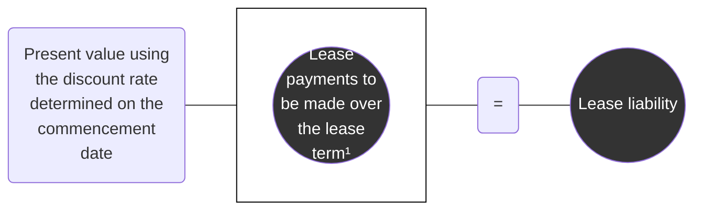

<sup>1</sup> Lease incentives that are payable to the lessee on the commencement date are deducted from lease payments (i.e., they reduce the lease liability). Refer to section 2.4.1.2, *Lease incentives*.

#### 4.3.1.2 Initial measurement of right-of-use assets — finance leases

A lessee initially measures the right-of-use asset at cost, which consists of all of the following:

*   The amount of the initial measurement of the lease liability
*   Any lease payments made to the lessor at or before the commencement date, less any lease incentives received (refer to section 2.4.1.2, *Lease incentives*)
*   Any initial direct costs incurred by the lessee (refer to section 2.6, *Initial direct costs*)

The diagram below illustrates the inputs needed to initially calculate the ROU asset:

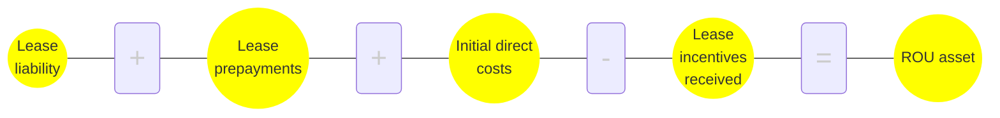

While ASC 842 does not specifically prohibit lessees from recognizing an ROU asset that exceeds the fair value of the underlying asset, we believe that lessees should challenge the inputs and assumptions used to measure the ROU asset if the carrying amount of the ROU asset would exceed the fair value of the underlying asset. Inputs and assumptions that could be challenged include the identification of lease and non-lease components, the allocation of consideration in the contract to those components and the discount rate used.


Financial reporting developments Lease accounting | 176

4 Lessee accounting


## 4.3.2 Subsequent measurement – finance leases

> ### Excerpt from Accounting Standards Codification
> **Leases – Lessee**
>
> ***Subsequent Measurement***
>
> **842-20-35-1**
> After the **commencement date**, for a **finance lease**, a **lessee** shall measure both of the following:
>
> a. The **lease liability** by increasing the carrying amount to reflect interest on the lease liability and reducing the carrying amount to reflect the **lease payments** made during the period. The lessee shall determine the interest on the lease liability in each period during the lease term as the amount that produces a constant periodic discount rate on the remaining balance of the liability, taking into consideration the reassessment requirements in paragraphs 842-10-35-1 through 35-5.
>
> b. The **right-of-use asset** at cost less any accumulated amortization and any accumulated impairment losses, taking into consideration the reassessment requirements in paragraphs 842-10-35-1 through 35-5.
>
> **842-20-35-2**
> A lessee shall recognize amortization of the right-of-use asset and interest on the lease liability for a finance lease in accordance with paragraph 842-20-25-5.
>
> **842-20-35-7**
> A **lessee** shall amortize the **right-of-use asset** on a straight-line basis, unless another systematic basis is more representative of the pattern in which the lessee expects to consume the right-of-use asset’s future economic benefits. When the **lease liability** is remeasured and the right-of-use asset is adjusted in accordance with paragraph 842-20-35-4, amortization of the right-of-use asset shall be adjusted prospectively from the date of remeasurement.
>
> **842-20-35-8**
> A lessee shall amortize the right-of-use asset from the **commencement date** to the earlier of the end of the **useful life** of the right-of-use asset or the end of the **lease term**. However, if the **lease** transfers ownership of the **underlying asset** to the lessee or the lessee is reasonably certain to exercise an option to purchase the underlying asset, the lessee shall amortize the right-of-use asset to the end of the useful life of the underlying asset.
>
> ***Recognition***
>
> **842-20-25-5**
> After the **commencement date**, a **lessee** shall recognize in profit or loss, unless the costs are included in the carrying amount of another asset in accordance with other Topics:
>
> a. Amortization of the **right-of-use asset** and interest on the **lease liability**
>
> b. **Variable lease payments** not included in the lease liability in the period in which the obligation for those payments is incurred (see paragraphs 842-20-55-1 through 55-2)
>
> c. Any impairment of the right-of-use asset determined in accordance with paragraph 842-20-35-9.


Financial reporting developments Lease accounting | 177

4 Lessee accounting


> **Implementation Guidance and Illustrations**
>
> **842-20-55-1**
> A lessee should recognize costs from **variable lease payments** (in annual periods as well as in interim periods) before the achievement of the specified target that triggers the variable lease payments, provided the achievement of that target is considered **probable**.
>
> **842-20-55-2**
> Variable lease costs recognized in accordance with paragraph 842-20-55-1 should be reversed at such time that it is probable that the specified target will not be met.

### 4.3.2.1 Subsequent measurement of lease liabilities — finance leases
The FASB indicated in the Basis for Conclusions (BC 223) of ASU 2016-02 that a lease liability for finance leases should be accounted for in a manner similar to other financial liabilities (i.e., on an amortized cost basis). Consequently, the lease liability for finance leases is accreted using an amount that produces a constant periodic discount rate on the remaining balance of the liability (i.e., the discount rate determined at commencement, as long as a reassessment requiring a change in the discount rate has not been triggered) (refer to section 2.5.3, *Reassessment of the discount rate*). Lease payments reduce the lease liability as they are paid.

Periodic lease payments on finance leases are allocated between a reduction of the lease liability and interest expense to produce a constant periodic interest rate on the remaining balance of the lease liability. This will result in a remaining balance of the lease liability at the end of the lease term equal to the amount of any of the following that were included in lease payments used to measure the lease liability (refer to section 2.4, *Lease payments*):

*   The exercise price of a purchase option (refer to section 2.4.3, *The exercise price of a purchase option*)
*   Amounts that it is probable a lessee will owe under a residual value guarantee (refer to section 2.4.6, *Amount it is probable that a lessee will owe under residual value guarantees — lessees only*)
*   A termination penalty (refer to section 2.4.4, *Payments for penalties for terminating a lease*)

While ASC 842 describes the subsequent measurement of a finance lease liability differently from that of an operating lease liability, from a practical perspective, we expect the lease liability balance to be the same. The difference in the expense recognition pattern of an operating lease (i.e., generally straight-line expense) and a finance lease (i.e., generally front-loaded expense) is driven by the subsequent accounting for the right-of-use asset.

### 4.3.2.2 Subsequent measurement of right-of-use assets — finance leases
Amortization of the right-of-use asset is recognized in a manner consistent with existing guidance for nonfinancial assets that are measured at cost. Lessees amortize the right-of-use asset on a straight-line basis, unless another systematic basis better represents the pattern in which the lessee expects to consume the right-of-use asset's future economic benefits. The right-of-use asset is amortized from the lease commencement date to the earlier of the end of the useful life of the right-of-use asset or the end of the lease term. However, the amortization period is the remaining useful life of the underlying asset if the lessee is reasonably certain to exercise an option to purchase the underlying asset or if the lease transfers ownership of the underlying asset to the lessee by the end of the lease term.

Refer to section 4.3.5, *Example — lessee accounting for a finance lease*, for a comprehensive example.


Financial reporting developments Lease accounting | 178

4 Lessee accounting


## 4.3.3 Expense recognition — finance leases (updated July 2024)

When subsequently accounting for a finance lease, lessees recognize the following:

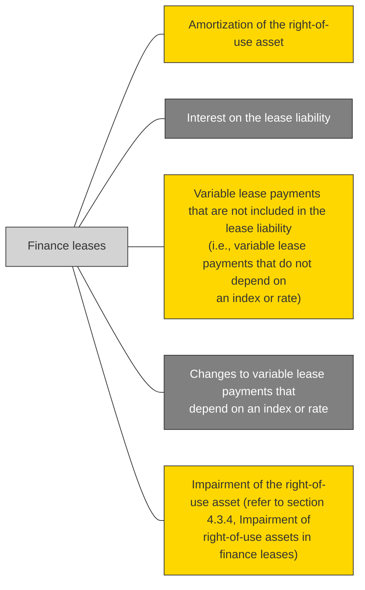

To clarify, a lessee’s lease cost includes both amounts recognized in profit or loss during the period and any amounts capitalized as part of the cost of another asset in accordance with other applicable guidance, such as ASC 330.

### Amortization of the right-of-use asset and interest on the lease liability
After the commencement date, a lessee recognizes amortization of the right-of-use asset and separately recognizes interest on the lease liability for a finance lease. The recognition of interest and amortization for finance leases is consistent with a view that such leases are effectively installment purchases. That is, the lessee is paying to finance the acquisition of the underlying asset that will be consumed during the lease term.

The total periodic cost (i.e., the sum of interest and amortization) of a finance lease is typically higher in the early periods and lower in the later periods. Because a constant interest rate is applied to the lease liability, interest decreases as cash payments are made during the lease term and the lease liability decreases. Therefore, more interest is incurred in the early periods and less in the later periods. This trend in interest, combined with the straight-line amortization of the right-of-use asset, results in a front-loaded cost recognition pattern.

### Variable lease payments
After the commencement date, lessees also recognize as part of lease-related cost any variable lease payments not included in the finance lease liability in the period in which the achievement of the specified target that triggers the variable lease payments becomes probable. Any previously recognized variable lease costs are reversed if it becomes probable that the specified target will no longer be met. ASC 842 does not specify the income statement presentation of variable lease costs once they become probable. We believe variable lease costs are generally presented as interest expense but could also be appropriately presented as lease expense (i.e., operating expense) when not otherwise capitalized in the cost of another asset, such as inventory under ASC 330. An entity should consider the presentation of the variable lease payments based on its specific circumstances. Refer to section 2.4.10, *Amounts not included in lease payments*, for a discussion of variable lease payments that do not depend on an index or rate.

### Impairment of the right-of-use asset
If a lessee determines that a finance lease right-of-use asset is impaired, it recognizes an impairment loss and measures the right-of-use asset at its carrying amount immediately after the impairment. A lessee subsequently amortizes, generally on a straight-line basis, the right-of-use asset from the date of the


Financial reporting developments Lease accounting | 179

4 Lessee accounting


impairment to the earlier of the end of the useful life of the right-of-use asset or the end of the lease term. However, the amortization period is the remaining useful life of the underlying asset if the lessee is reasonably certain to exercise an option to purchase the underlying asset or if the lease transfers ownership of the underlying asset to the lessee by the end of the lease term. Refer to section 4.3.4, *Impairment of right-of-use assets in finance leases*, for additional discussion of impairment of right-of-use assets.

## 4.3.4 Impairment of right-of-use assets in finance leases

A lessee's right-of-use asset in an operating or finance lease is subject to the impairment guidance in ASC 360-10 (for guidance on impairment of right-of-use assets in operating leases refer to section 4.2.5, *Impairment of right-of-use assets in operating leases*). Lessees must also apply the guidance in ASC 360-10 when there are significant changes to the current or expected use of a right-of-use asset because it could affect the asset groupings used to evaluate the right-of-use asset for impairment and the estimated useful life of both an right-of-use asset and any leasehold improvements associated with the underlying asset.

Further, lessees that separately account for non-lease components (i.e., entities that have not made the policy election under ASC 842 to combine lease and associated non-lease components) must consider the guidance in ASC 420 to determine whether any exit or disposal costs associated with non-lease components should be accrued (e.g., when a lessee has concluded that it has permanently ceased using an asset, whether for its own use or through subleasing, and costs allocated to the non-lease component that will continue to be incurred for its remaining term will not provide economic benefit to the entity).

The following flowchart illustrates the interaction of the guidance in ASC 842, ASC 360-10 and ASC 420:

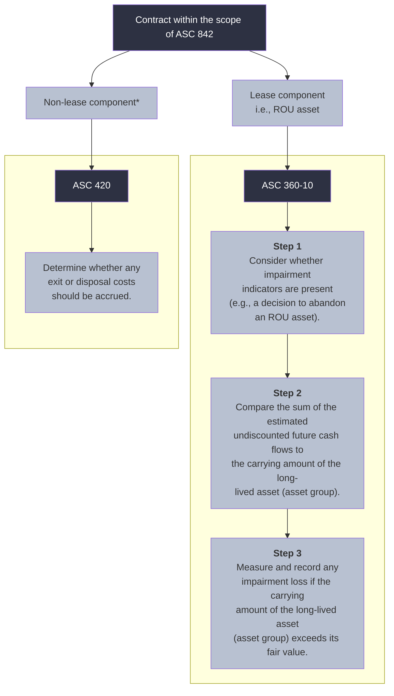

\* Generally, applies only to lessees that do not make the policy election to combine the lease and associated non-lease components of a contract.

The FASB indicated in the Basis for Conclusions (BC 255) of ASU 2016-02 that the impairment model in ASC 360-10 is appropriate to apply to a lessee's right-of-use assets because these assets are long-lived nonfinancial assets and should be accounted for the same way as an entity's other long-lived nonfinancial assets. This treatment is intended to give users of the financial statements comparable information about all of an entity's long-lived nonfinancial assets.


Financial reporting developments Lease accounting | 180

4 Lessee accounting


The guidance in ASC 360-10 requires three steps to identify, recognize and measure the impairment of a long-lived asset (asset group) to be held and used:

*   **Indicators of impairment (Step 1)** – Consider whether impairment indicators are present (i.e., whether there are any events or changes in circumstances that indicate that the carrying amount of the long-lived asset (asset group) might not be recoverable).
*   **Test for recoverability (Step 2)** – If indicators of impairment are present, perform a recoverability test by comparing the sum of the estimated undiscounted future cash flows attributable to the long-lived asset (asset group) in question to its carrying amount (as a reminder, entities cannot record an impairment for a held and used asset unless the asset first fails this recoverability test).
*   **Measure an impairment (Step 3)** – If the undiscounted cash flows used in the test for recoverability are less than the carrying amount of the long-lived asset (asset group), determine the fair value of the long-lived asset (asset group) and recognize an impairment loss if the carrying amount of the long-lived asset (asset group) exceeds its fair value.

### Grouping long-lived assets

ASC 360-10 defines an asset group as "the unit of accounting for a long-lived asset or assets to be held and used, which represents the lowest level for which identifiable cash flows are largely independent of the cash flows of other groups of assets and liabilities." Assets generally should be grouped when they are used together (i.e., when they are part of the same group of assets and are used together to generate joint cash flows).

Grouping long-lived assets requires judgment and will require consideration of the facts and circumstances as well as an understanding of the entity's business. We believe the impairment assessment for ROU assets often will be performed at an asset-group level with any impairment allocated among the long-lived assets of the group in accordance with ASC 360-10.

Each time a lessee performs a recoverability test, it should reassess whether its grouping of long-lived assets continues to be appropriate. Significant changes to the current or expected use of the individual assets of the group might indicate that the related asset grouping may have changed. This might be the case even when the ROU asset is not the primary asset in the asset group.

When evaluating whether the inclusion of an ROU asset in an asset group continues to be appropriate, a lessee needs to determine whether there has been a fundamental change in the use of the leased asset. For example, a functionally independent asset that is abandoned (e.g., a building) may no longer be part of an existing asset group. Refer to section 4.2.5.3, *Abandonment of ROU assets*, for discussion on when an ROU asset is abandoned. However, it may be challenging to determine whether an ROU asset that is not (or will not be) abandoned has changed asset groups or is a separate asset group. Examples of situations that could indicate the asset group has changed for an ROU asset that is not (or will not be) abandoned include:

*   The lessee has ceased using the leased asset and does not plan to reoccupy or use the leased asset in the future.
*   The lessee has incurred significant costs (e.g., readying the space for sublease by removing signage) to cease using the leased asset in the near future.
*   The lessee has executed a sublease for the leased asset for substantially all of the remaining lease term.
*   The lessee is actively marketing the leased asset for sublease (e.g., hired a broker).
*   The lessee has changed how the leased asset is used in its operations, including moving the leased asset to a different line of business in a different asset group.


Financial reporting developments Lease accounting | 181

4 Lessee accounting


These situations are not all inclusive, and no one situation is determinative. A lessee will need to evaluate its facts and circumstances to determine whether there is a change in how it uses the leased asset and whether the asset group has changed. A *plan* to change how the leased asset will be used by the business or to sublease the leased asset, by itself, generally does not indicate that the ROU asset's group has changed, since the lowest level of identifiable cash flows has not yet changed. For example, a lessee may decide that in one year it will sublease a leased asset that is part of an enterprise-wide asset group but it will continue to use the leased asset until then. The ROU asset would still be part of the enterprise-wide asset group because the lessee continues to use the leased asset.

Refer to section 6.3, *Sublessor accounting*, for discussion on evaluating the grouping of long-lived assets when a lessee has executed a sublease for a leased asset in the asset group.

### 4.3.4.1 Test for recoverability (Step 2)

ASC 360-10 provides principles for evaluating long-lived assets for impairment, but it does not specifically address how lease liabilities should be considered in the recoverability test. Under ASC 360-10, financial liabilities (e.g., long-term debt) generally are excluded from an asset group and operating liabilities (e.g., accounts payable) generally are included. Financial liabilities generally are excluded because when the FASB was deliberating Statement 144 (later codified in ASC 360-10), it indicated that how an entity capitalizes or finances its operations should not influence the recognition of an impairment loss (see B34 of Statement 144). ASC 360-10 requires an entity to exclude asset retirement obligation (ARO) liabilities from an asset group and to exclude estimated future cash outflows associated with ARO liabilities from both the recoverability test (Step 2) and measurement of an impairment (Step 3).

In the Basis for Conclusions (BC 264) of ASU 2016-02, the FASB noted that while both operating and finance lease liabilities are financial liabilities, finance lease liabilities are the equivalent of debt, and operating lease liabilities are operating in nature and not "debt like." Therefore, we generally believe it would be most appropriate to exclude finance lease liabilities from an asset group when testing whether the asset group is recoverable and determining the fair value of the asset group.

A lessee should apply its approach (i.e., include or exclude finance lease liabilities) consistently for all finance leases and when performing Steps 2 and 3 of the impairment model in ASC 360-10 (refer to section 4.3.4.2, *Measure an impairment (Step 3)*, for guidance on measuring an impairment loss).

In some cases, including finance lease liabilities in an asset group may result in the long-lived asset (asset group) having a zero or negative carrying amount. For example, this may occur with the passage of time or if a lessee receives lease incentives or has back-loaded lease payments, all of which would result in reductions to the lessee's right-of-use assets. In these cases, a lessee is still required to test whether the carrying amount of the asset group is recoverable and, if not recoverable, measure the asset group for impairment.

**Determining which future cash outflows for lease payments should be included in the Step 2 recoverability test**

A lessee that excludes finance lease liabilities from its asset group should exclude future cash lease payments (i.e., fixed, in-substance fixed and variable payments based on an index or rate) in the undiscounted future cash flows. If a lessee includes finance lease liabilities in its asset group, only the principal component of future lease payments would be included as an outflow in the undiscounted future cash flows used to test recoverability of the asset group. That is, the lessee would include the future cash lease payments for the lease, excluding the component that represents the accretion of the lease liability.


Financial reporting developments Lease accounting | 182

4 Lessee accounting


ASC 842 requires lessees to exclude certain variable lease payments from lease payments and, therefore, from the measurement of a lessee's lease liabilities. Because these payments do not reduce a lessee's lease liability, we believe the variable payments a lessee expects to make should be included in a lessee's estimate of undiscounted cash flows in the recoverability test (Step 2), regardless of whether the lessee includes or excludes finance lease liabilities from the asset group. How these payments are included in the lessee's estimate of future cash flows will depend on the cash flow estimation approach (e.g., probability-weighted, best estimate) it uses. We also believe these variable payments should be included when determining the fair value in Step 3 if the lessee uses a discounted cash flow approach.

As a reminder, a lessee uses its own assumptions to develop estimates of future cash flows in Step 2. This differs from the approach in Step 3, where the lessee measures fair value of the asset group based on market participant assumptions.

Refer to our FRD, *Impairment or disposal of long-lived assets*, for further discussion of evaluating assets for impairment in accordance with ASC 360-10.

### 4.3.4.2 Measure an impairment (Step 3)

If the undiscounted cash flows used in the recoverability test are less than the carrying amount of the long-lived asset (asset group), an entity is required to determine the fair value of the long-lived asset (asset group) and recognize an impairment loss when the carrying amount of the long-lived asset (asset group) exceeds its fair value.

We believe that if a lessee excludes finance lease liabilities from the asset group when performing the recoverability test, it also should exclude finance lease liabilities from the asset group when measuring the group's fair value. Alternatively, if a lessee includes finance lease liabilities in the asset group when performing the recoverability test, it also should include finance lease liabilities in the asset group when determining the group's fair value.

Regardless of which approach a lessee chooses, we generally do not expect significant differences in the measurement of an impairment loss because we would expect a lessee's estimate of the fair value of the asset group to appropriately reflect whether the asset group includes or excludes finance lease liabilities. For example, consistent with the guidance in ASC 360-10 for AROs, if a lessee excludes finance lease liabilities from the carrying amount of an asset group but the fair value of the asset group is based on a quoted market price that considers the lessee's obligation to make lease payments, the quoted market price should be increased by the fair value of the finance lease liabilities. Alternatively, if a lessee includes finance lease liabilities in the carrying amount of an asset group but the fair value of the asset group is based on a quoted market price that does not consider the lessee's obligation to make lease payments, the quoted market price should be decreased by the fair value of the finance lease liabilities.

If the fair value of the asset group is determined based on discounted cash flows, the market participant cash flows should be adjusted to align with an entity's decision to include or exclude finance lease liabilities in the carrying amount of the asset group. If the carrying amount of the asset group includes finance lease liabilities, the market participant discounted cash flows used to estimate fair value should include both principal and interest payments, unlike the cash flows used in the recoverability test, which, as discussed above, exclude the component of the finance lease payments that represents the accretion of the lease liability.

While we may not expect including or excluding the lease liability to cause significant differences in the measurement of impairments, measurement differences could exist in some circumstances (e.g., due to decreases in the fair value of the lease liability relative to its carrying amount).


Financial reporting developments Lease accounting | 183

4 Lessee accounting


As a reminder, in accordance with ASC 360-10, an impairment loss for an asset group reduces only the carrying amounts of long-lived assets of the group (including lease-related right-of-use assets). The loss must be allocated to the long-lived assets of the group on a pro rata basis using the relative carrying amounts of those assets, except that the loss allocated to an individual long-lived asset of the group must not reduce the carrying amount of that asset below its fair value whenever the fair value is determinable without undue cost and effort. ASC 360-10 prohibits the subsequent reversal of an impairment loss for an asset held and used.

### Fair value considerations

ASC 820 provides a principles-based framework for measuring fair value when US GAAP requires or permits a fair value measurement and requires disclosures about the use of fair value measurements. ASC 820 defines fair value as "the price that would be received to sell an asset or paid to transfer a liability in an orderly transaction between market participants at the measurement date."

Under ASC 820, a fair value measurement of a nonfinancial asset takes into account a market participant's ability to generate economic benefits by using the asset in its highest and best use or by selling it to another market participant that would use the asset in its highest and best use. Therefore, fair value is a market-based measurement and not an entity-specific measurement. It is determined based on assumptions that market participants would use in pricing the asset or liability. The exit price objective of a fair value measurement applies, regardless of the reporting entity's intent and/or ability to sell the asset or transfer the liability at the measurement date.

When determining the fair value of a right-of-use asset, a lessee should consider what market participants would pay to lease the asset (i.e., what a market participant would pay for the right-of-use asset) for its highest and best use, even if that use differs from the current or intended use by the reporting entity. For example, a lessee that currently leases space for use as a grocery store may conclude that the highest and best use of the space by market participants would be to use it as a fitness center.

While the concept of highest and best use of an asset may consider its use in a different condition, the objective of a fair value measurement is to determine the price of the asset in its current form. Therefore, if no market exists for an asset in its current form, but there is a market for the transformed asset, the reporting entity should back out the costs to transform the asset (as well as any associated profit margin) to determine the fair value of the asset in its current condition. That is, a fair value measurement should consider the costs market participants would incur to recondition the asset (after acquiring the asset in its current condition) and the compensation they would expect for this effort.

A contract restriction, which does not allow the lessee to sublease the asset, does not result in a fair value of zero. Instead, a lessee must consider how a market participant would value the right to use the asset with a sublease restriction in a hypothetical sale. Refer to section 5.2.1, *Restrictions on assets (before the adoption of ASU 2022-03)*, or section 5.2.1A, *Restrictions on assets (after the adoption of ASU 2022-03)*, of our FRD, *<u>Fair value measurement</u>*, for further discussion on the effect on fair value of a restriction on the use of an asset.

Refer to our FRD, *<u>Impairment or disposal of long-lived assets</u>*, for further discussion of evaluating assets for impairment in accordance with ASC 360-10 and our FRD, *<u>Fair value measurement</u>*, for further discussion on measuring fair value.

Refer to section 6.3, *Sublessor accounting*, for discussion of evaluating right-of-use assets for impairment when a lessee enters into a sublease.


Financial reporting developments Lease accounting | 184

4 Lessee accounting


### 4.3.4.3 Abandonment of ROU assets (updated August 2025)

A lessee that decides to cease using an underlying asset, either immediately or at a future date (e.g., in 12 months), needs to assess whether the corresponding ROU asset is or will be abandoned. A plan to abandon an ROU asset is considered an indicator of impairment under ASC 360-10 that results in the lessee evaluating the ROU asset (asset group) for recoverability and may also result in the lessee reassessing the lease term and classification under ASC 842. Evaluating a lessee's intent and ability to sublease an underlying asset is an important factor in determining whether the underlying asset has been or will be abandoned.

If the lessee does not have a contractual right to sublease the underlying asset and the lessee's cease use of the asset is not temporary, the ROU asset is abandoned at the date the lessee ceases using the underlying asset.

A lessee that has a contractual right to sublease the asset will need to consider the facts and circumstances of the lease and its planned remaining use of the underlying asset. If the lessee may or will sublease the underlying asset, it is not abandoning the ROU asset. As noted in ASC 842-10-15-17, economic benefits from using an asset include subleasing the asset. An entity that may or will sublease an asset (it will not otherwise use) can obtain those economic benefits and, therefore, has not abandoned (or will not abandon) the ROU asset. However, a decision to sublease the underlying asset still may be an indicator of impairment or indicate a change in the asset grouping.

A lessee that has ceased use of the underlying asset and will not sublease it or use it for other purposes (e.g., storage) generally has abandoned the asset. However, if the lessee does not currently plan to sublease or otherwise use the asset but may sublease it in the future (e.g., a lessee may wait to make final decisions until existing economic conditions change or use its right to not sublease as a negotiating tactic when attempting to terminate a lease early), the ROU asset is not or will not be abandoned because the lessee has not yet decided that it will not sublease or otherwise use the underlying asset.

Careful consideration should be given when evaluating whether an entity has committed to a plan to abandon a long-lived asset (including an ROU asset). For example, a longer remaining lease term may provide the lessee with the ability to obtain economic benefits from the asset, such as through a sublease. That is, if the remaining lease term is significant, an entity would likely remain open to future opportunities rather than committing to cease using the ROU asset permanently and not subleasing the asset. Alternatively, a shorter remaining lease term may limit those future opportunities.

The following flowchart summarizes considerations for determining whether an ROU asset is (or will be) abandoned:

```mermaid
graph TD
    Q1[Does the lessee have a contractual right to sublease the asset?]
    Q2[Has the lessee determined it will not sublease the asset?]
    Q3[Has the lessee ceased using the asset permanently (or will it)?]
    A1[The ROU asset is (or will be) abandoned.]
    A2[The ROU asset is not (or will not be) abandoned.]

    Q1 -- No --> Q3
    Q1 -- Yes --> Q2
    Q2 -- Yes --> Q3
    Q2 -- No --> A2
    Q3 -- Yes --> A1
    Q3 -- No --> A2
```


Financial reporting developments Lease accounting | 185

4 Lessee accounting


### Accounting for an abandonment

If a lessee determines that it has abandoned an ROU asset or will abandon it at a future date, it reassesses its lease term if any of the following conditions in ASC 842-10-35-1 exists:

*   There is a significant event or a significant change in circumstances that is within the control of the lessee that directly affects whether the lessee is reasonably certain to exercise or not to exercise an option to extend or terminate the lease or to purchase the underlying asset.
*   There is an event that is written into the contract that obliges the lessee to exercise (or not to exercise) an option to extend or terminate the lease.
*   The lessee elects to exercise an option even though the entity had previously determined that the lessee was not reasonably certain to do so.
*   The lessee elects not to exercise an option even though the entity had previously determined that the lessee was reasonably certain to do so.

If the lease term changes, the lessee also reassesses the lease classification. The existence of an impairment indicator alone does not result in reassessment of the lease term and classification. Refer to section 2.3.6, *Reassessment of the lease term and purchase options*, for further guidance.

Under ASC 360-10, a long-lived asset to be disposed of in a manner other than a sale (e.g., abandonment) is considered held and used until the long-lived asset ceases to be used. Because a decision to abandon a long-lived asset before the end of the lease term is akin to a decision to dispose of a long-lived asset before the initially intended date, a decision to abandon the asset is viewed as an indicator of impairment for a held and used long-lived asset. Therefore, if a lessee decides to abandon an ROU asset, the lessee should test whether the carrying amount of the ROU asset (asset group) is recoverable before abandoning it and, if it is not recoverable, measure it for impairment consistent with the discussion in sections 4.3.4.1, *Test for recoverability (Step 2)*, and 4.3.4.2, *Measure an impairment (Step 3)*.

Prior to assessing impairment, a lessee that abandons or decides to abandon at a future date (e.g., in 12 months) an ROU asset that is part of a larger asset group should first reassess whether its grouping of long-lived assets continues to be appropriate. For example, a functionally independent asset that is abandoned (e.g., a building) may no longer be part of an existing asset group. Refer to section 2.3.1, *Grouping long-lived assets to be held and used*, and section 3.1, *Long-lived assets to be abandoned*, of our FRD, *Impairment or disposal of long-lived assets*, for further discussion of grouping of long-lived assets and abandonment of assets, respectively.

Regardless of whether an ROU asset is impaired, a lessee that commits to a plan to abandon an ROU asset in the future (e.g., in 12 months) but before the end of the lease term should update its estimate of the useful life of the ROU asset. This is consistent with the views expressed by the SEC staff at the 2020 AICPA Conference on Current SEC and PCAOB Developments. Refer to section 4.2.5.3, *Abandonment of ROU assets*, for a summary of the SEC staff's views.

The evaluation of whether a lessee has committed to a plan to abandon an ROU asset in the future is based on the facts and circumstances. If the lessee is ceasing to use an asset temporarily (e.g., a lessee plans to vacate a leased office building for one year as part of a restructuring but intends to reoccupy that facility), the temporary abandonment would not result in a reassessment of the useful life of the related ROU asset.

If no impairment is recorded but the useful life is shortened, we believe a lessee would follow the guidance in section 4.3.4.4, *Accounting for a finance lease after an impairment of an ROU asset*, to subsequently account for the ROU asset after updating its estimate of the useful life of the ROU asset. If an impairment is recorded, the lessee measures the ROU asset at its carrying amount immediately after the impairment and follows the guidance in section 4.3.4.4, *Accounting for a finance lease after an impairment of an ROU asset*, to subsequently account for the ROU asset. Absent a modification, there is no change in how the lessee accounts for the lease liability throughout the remaining lease term.


Financial reporting developments Lease accounting | 186

4 Lessee accounting


An ROU asset that has been abandoned should be reduced to its salvage value (or zero, if there is no salvage value) as of its cease-use date. The salvage value of an ROU asset will often be de minimis.

The following flowchart summarizes the accounting considerations for a lessee that abandons an ROU asset or decides to abandon it at a future date (e.g., in 12 months). The flowchart assumes that the lessee has appropriately considered ASC 360-10 up to the date the decision is made to abandon the asset.

```mermaid
flowchart TD
    Start[The ROU asset is abandoned, or a decision has been reached to abandon the ROU asset in the future.] --> Q1{Do any of the conditions in ASC 842-10-35-1 exist?}
    
    Q1 -- Yes --> Reassess[Reassess the lease term. <br/> If the lease term changes, also reassess lease classification.]
    Q1 -- No --> Q2{Does the grouping of long-lived assets for purposes of assessing impairment <br/> continue to be appropriate (i.e., if the abandoned (or to be abandoned) ROU <br/> asset is part of a larger asset group)?}
    
    Reassess --> Q2
    
    Q2 -- No --> NewGroups[Determine new asset groups.]
    Q2 -- Yes --> Q3{Is the carrying amount of the ROU asset (asset group) recoverable?}
    
    NewGroups --> Q3
    
    Q3 -- No --> Impairment[Measure and recognize any impairment loss if the carrying amount of <br/> the long-lived asset group exceeds its fair value.]
    Q3 -- Yes --> Q4{Will the lessee cease using the ROU asset immediately <br/> (i.e., not on a date in the future)?}
    
    Impairment --> Q4
    
    Q4 -- No --> UpdateLife[Update estimate of the useful life of the ROU asset.]
    Q4 -- Yes --> ReduceAsset[Reduce the ROU asset to its salvage value (or <br/> zero, if there is no salvage value).]
    
    UpdateLife --> FollowASC[Follow ASC 842-20-35-10 and ASC 842-20-35-7 <br/> to subsequently account for the ROU asset and <br/> lease liability.]
```


Financial reporting developments Lease accounting | 187

4 Lessee accounting


### Accounting when there is no abandonment

If a lessee determines that it has not abandoned an ROU asset or will not abandon it at a future date, it should reassess its lease term only if any of the conditions in ASC 842-10-35-1 exist.

Lessees that determine an ROU asset is not abandoned (e.g., because it may be subleased) should consider whether the temporary cease use (or future plan to temporarily cease use) of the asset is an indicator of impairment in accordance with ASC 360-10. Lessees that determine that an indicator of impairment is present should perform the recoverability test for the asset (or asset group) and measure and record any impairment. In doing so, the lessee should first reassess whether its grouping of long-lived assets continues to be appropriate. If an impairment is recorded, the lessee measures the ROU asset at its carrying amount immediately after the impairment and follows the guidance in ASC 842-20-35-7 and ASC 842-20-35-10 to subsequently account for the ROU asset and lease liability.

#### 4.3.4.4 Accounting for a finance lease after an impairment of an ROU asset

> **Excerpt from Accounting Standards Codification**
> **Leases — Lessee**
> ***Subsequent Measurement***
> **842-20-35-10**
> If a right-of-use asset is impaired in accordance with paragraph 842-20-35-9, after the impairment, it shall be measured at its carrying amount immediately after the impairment less any accumulated amortization. A lessee shall amortize, in accordance with paragraph 842-20-25-7 (for an **operating lease**) or paragraph 842-20-35-7 (for a **finance lease**), the right-of-use asset from the date of the impairment to the earlier of the end of the useful life of the right-of-use asset or the end of the lease term.

If a lessee determines that a finance lease right-of-use asset is impaired, it recognizes an impairment loss and measures the right-of-use asset at its carrying amount immediately after the impairment. A lessee subsequently amortizes, generally on a straight-line basis, the right-of-use asset from the date of the impairment to the earlier of the end of the useful life of the right-of-use asset or the end of the lease term. However, the amortization period is the remaining useful life of the underlying asset if the lessee is reasonably certain to exercise an option to purchase the underlying asset or if the lease transfers ownership of the underlying asset to the lessee by the end of the lease term. Refer to section 4.3.4, *Impairment of right-of-use assets in finance leases*, for additional discussion of impairment of right-of-use assets. Events or changes in circumstances that indicate the carrying amount of an ROU asset may not be recoverable in accordance with ASC 360-10 that do not occur or arise as a result of an action that is within the control of the lessee do not, in isolation, trigger a reassessment of the lease term or a lessee option to purchase the underlying asset. Refer to section 2.3.6.1, *Reassessment of the lease term and purchase options — lessees*.

#### 4.3.5 Example — lessee accounting for a finance lease

<table>
  <thead>
    <tr>
        <th>Illustration 4-6:</th>
        <th>Lessee accounting for a finance lease</th>
    </tr>
  </thead>
  <tbody>
    <tr>
        <td>[colspan=2] Entity H (lessee) makes a payment of $5,000 to an existing tenant to obtain a lease and enters into a three-year lease of the same equipment that it concludes is a finance lease because the lease term is for a major part of the remaining economic life of the underlying asset (also three years). The lease commences at the beginning of Year 1. Entity H agrees to make the following annual payments at the end of each year: $10,000 in Year 1, $12,000 in Year 2 and $14,000 in Year 3. Entity H concludes that the $5,000 payment to the former tenant qualifies as an IDC. For simplicity, there are no purchase options, payments to the lessor before the lease commencement date, variable payments based on an index or rate, or lease incentives from the lessor. The initial measurement of the right-of-use asset and lease liability is $33,000 (present value of lease payments using a discount rate of 4.235%). Entity H uses its incremental borrowing rate because the rate implicit in the lease cannot be readily determined. Entity H amortizes the right-of-use asset on a straight-line basis over the lease term.</td>
    </tr>
  </tbody>
</table>
Financial reporting developments Lease accounting | 188

4 Lessee accounting


> *Analysis:* At lease commencement, Entity H would recognize the right-of-use asset and lease liability:
>
> Right-of-use asset $ 38,000
>     Lease liability $ 33,000
>     Cash 5,000
> *To initially recognize the right-of-use asset, lease liability and payment that qualifies as an IDC.*
>
> The following journal entries would be recorded in Year 1:
>
> Interest expense $ 1,398
>     Lease liability $ 1,398
> *To record interest expense and accrete the lease liability using the interest method ($33,000 x 4.235%)*
>
> Amortization expense $ 11,000
>     Right-of-use asset $ 11,000
> *To record amortization expense on the right-of-use asset ($33,000 ÷ 3 years)*
>
> Amortization expense for IDC $ 1,667
>     Right-of-use asset $ 1,667
> *To record the amortization of the IDC ($5,000 ÷ 3 years)*
>
> Lease liability $ 10,000
>     Cash $ 10,000
> *To record lease payment*
>
> A summary of the lease contract’s accounting (assuming no changes due to reassessment, lease modification or impairment) is as follows:
>
> <table>
  <thead>
    <tr>
        <th>&gt;</th>
        <th>Initial</th>
        <th>Year 1</th>
        <th>Year 2</th>
        <th>Year 3</th>
    </tr>
  </thead>
  <tbody>
    <tr>
        <td>&gt; Cash lease payments</td>
        <td></td>
        <td>$ 10,000</td>
        <td>$ 12,000</td>
        <td>$ 14,000</td>
    </tr>
    <tr>
        <td>&gt; Lease expense recognized</td>
        <td></td>
        <td></td>
        <td></td>
        <td></td>
    </tr>
    <tr>
        <td>&gt; Interest expense</td>
        <td></td>
        <td>$ (1,398)</td>
        <td>$ (1,033)</td>
        <td>$ (569)</td>
    </tr>
    <tr>
        <td>&gt; Amortization expense</td>
        <td></td>
        <td>(12,667)</td>
        <td>(12,667)</td>
        <td>(12,666)</td>
    </tr>
    <tr>
        <td>&gt; Total periodic expense</td>
        <td></td>
        <td>$ (14,065)</td>
        <td>$ (13,700)</td>
        <td>$ (13,235)</td>
    </tr>
    <tr>
        <td>&gt; Balance sheet</td>
        <td></td>
        <td></td>
        <td></td>
        <td></td>
    </tr>
    <tr>
        <td>&gt; Lease liability</td>
        <td>$ (33,000)</td>
        <td>$ (24,398)</td>
        <td>$ (13,431)</td>
        <td>$ -</td>
    </tr>
    <tr>
        <td>&gt; Right-of-use asset</td>
        <td>$ 38,000</td>
        <td>$ 25,333</td>
        <td>$ 12,666</td>
        <td>$ -</td>
    </tr>
    <tr>
        <td>&gt;</td>
        <td colspan="4"></td>
    </tr>
  </tbody>
</table>
> Immaterial differences may arise in the recomputation of amounts in the example above due to rounding.

### Illustration 4-7: Comparing a lessee's accounting for finance leases and operating leases

This table illustrates the similarities and differences in accounting for finance (see Illustration 4-6) and operating (see Illustration 4-3) leases:

Finance lease:

<table>
  <thead>
    <tr>
        <th>Time</th>
        <th>Lease liability</th>
        <th>Right-of-use asset</th>
        <th>Interest expense</th>
        <th>Amortization expense</th>
        <th>Total expense</th>
    </tr>
  </thead>
  <tbody>
    <tr>
        <td>Initial</td>
        <td>$ 33,000</td>
        <td>$ 38,000</td>
        <td></td>
        <td></td>
        <td></td>
    </tr>
    <tr>
        <td>Year 1</td>
        <td>$ 24,398</td>
        <td>$ 25,333</td>
        <td>$ 1,398</td>
        <td>$ 12,667</td>
        <td>$ 14,065</td>
    </tr>
    <tr>
        <td>Year 2</td>
        <td>$ 13,431</td>
        <td>$ 12,666</td>
        <td>1,033</td>
        <td>12,667</td>
        <td>13,700</td>
    </tr>
    <tr>
        <td>Year 3</td>
        <td>$ -</td>
        <td>$ -</td>
        <td>569</td>
        <td>12,666</td>
        <td>13,235</td>
    </tr>
    <tr>
        <td></td>
        <td></td>
        <td>$ 3,000</td>
        <td>$ 38,000</td>
        <td>$ 41,000</td>
        <td></td>
    </tr>
  </tbody>
</table>


Financial reporting developments Lease accounting | 189

4 Lessee accounting


Operating lease:

<table>
  <tbody>
    <tr>
        <td>Time</td>
        <td>Lease liability</td>
        <td>Right-of use<br/>asset</td>
        <td>Lease expense</td>
    </tr>
    <tr>
        <td>Initial</td>
        <td>$ 33,000</td>
        <td>$ 38,000</td>
        <td></td>
    </tr>
    <tr>
        <td>Year 1</td>
        <td>$ 24,398</td>
        <td>$ 25,731</td>
        <td>$ 13,667</td>
    </tr>
    <tr>
        <td>Year 2</td>
        <td>$ 13,431</td>
        <td>$ 13,097</td>
        <td>13,667</td>
    </tr>
    <tr>
        <td>Year 3</td>
        <td>$ -</td>
        <td>$ -</td>
        <td>13,666</td>
    </tr>
    <tr>
        <td></td>
        <td></td>
        <td></td>
        <td>$ 41,000</td>
    </tr>
  </tbody>
</table>

The initial measurement of the right-of-use asset and the lease liability is the same for finance and operating leases. Also, the same total lease expense is recognized over the life of the arrangement, but it is classified differently in the income statement and recognized at different times. A lessee generally recognizes higher periodic lease expense in the earlier periods of a finance lease than it does for an operating lease.

## 4.4 Master lease agreements

> ### Excerpt from Accounting Standards Codification
> **Leases — Overall**
>
> **Implementation Guidance and Illustrations**
>
> **842-10-55-17**
> Under a master **lease** agreement, the **lessee** may gain control over the use of additional **underlying assets** during the term of the agreement. If the agreement specifies a minimum number of units or dollar value of equipment, the lessee obtaining control over the use of those additional underlying assets is not a **lease modification**. Rather, the entity (whether a lessee or a **lessor**) applies the guidance in paragraphs 842-10-15-28 through 15-42 when identifying the separate lease components and allocating the **consideration in the contract** to those components. Paragraph 842-10-55-22 explains that a master lease agreement may, therefore, result in multiple **commencement dates**.
>
> **842-10-55-18**
> If the master lease agreement permits the lessee to gain control over the use of additional underlying assets during the term of the agreement but does not commit the lessee to doing so, the lessee's taking control over the use of an additional underlying asset should be accounted for as a lease modification in accordance with paragraphs 842-10-25-8 through 25-18.

Under a master lease agreement, a lessee may gain control over the use of additional underlying assets during the term of the agreement. In certain cases, a master lease agreement may specify a minimum number or value of underlying assets the lessee is required to obtain. For example, a lessee enters into an agreement to obtain the right to lease three floors of a building with an option to lease an additional floor (i.e., the fourth floor).

To the extent that a lessee is required to take a specified minimum quantity or value of the underlying assets, the lessee obtaining control over the use of those additional underlying assets is not a lease modification (i.e., a change to the terms and conditions of a contract that results in a change in the scope of or the consideration for a lease). To identify the separate lease components and allocate the amount of consideration in the master lease agreement attributed to the additional underlying assets, the lessor applies the guidance in ASC 842-10-15-28 through 15-42 (refer to section 1.4, *Identifying and separating lease and non-lease components of a contract and allocating contract consideration*).

To the extent that additional underlying assets beyond the specified minimum are leased under the master lease agreement, the lessee obtaining control over the use of those additional underlying assets is considered a lease modification. Refer to section 4.6, *Lease modifications*, for the accounting of a lease modification.


Financial reporting developments Lease accounting | 190

4 Lessee accounting


If a master lease agreement does not include a specified minimum quantity or dollar value, the lessee obtaining control over the use any additional underlying asset is also considered a lease modification. Refer to section 4.6, *Lease modifications*, for the accounting of a lease modification.

## 4.5 Remeasurement of lease liabilities and right-of-use assets — operating and finance leases (updated August 2025)

> ### Excerpt from Accounting Standards Codification
> **Leases — Lessee**
>
> **Subsequent Measurement**
>
> **842-20-35-4**
> After the **commencement date**, a **lessee** shall remeasure the **lease liability** to reflect changes to the **lease payments** as described in paragraphs 842-10-35-4 through 35-5. A lessee shall recognize the amount of the remeasurement of the lease liability as an adjustment to the **right-of-use asset**. However, if the carrying amount of the right-of-use asset is reduced to zero, a lessee shall recognize any remaining amount of the remeasurement in profit or loss.
>
> **842-20-35-5**
> If there is a remeasurement of the lease liability in accordance with paragraph 842-20-35-4, the lessee shall update the **discount rate for the lease** at the date of remeasurement on the basis of the remaining **lease term** and the remaining lease payments unless the remeasurement of the lease liability is the result of one of the following:
>
> a. A change in the lease term or the assessment of whether the lessee will exercise an option to purchase the **underlying asset** and the discount rate for the lease already reflects that the lessee has an option to extend or terminate the **lease** or to purchase the underlying asset.
>
> b. A change in amounts **probable** of being owed by the lessee under a **residual value guarantee** (see paragraph 842-10-35-4(c)(3)).
>
> c. A change in the lease payments resulting from the resolution of a contingency upon which some or all of the **variable lease payments** that will be paid over the remainder of the lease term are based (see paragraph 842-10-35-4(b)).
>
> **Leases — Overall**
>
> **Subsequent Measurement**
>
> **842-10-35-4**
> A **lessee** shall remeasure the **lease payments** if any of the following occur:
>
> a. The **lease** is modified, and that modification is not accounted for as a separate **contract** in accordance with paragraph 842-10-25-8.
>
> b. A contingency upon which some or all of the **variable lease payments** that will be paid over the remainder of the **lease term** are based is resolved such that those payments now meet the definition of lease payments. For example, an event occurs that results in variable lease payments that were linked to the performance or use of the **underlying asset** becoming fixed payments for the remainder of the lease term. However, a change in a reference index or a rate upon which some or all of the variable lease payments in the contract are based does not constitute the resolution of a contingency subject to (b) (see paragraph 842-10-35-5 for guidance on the remeasurement of variable lease payments that depend on an index or a rate).


Financial reporting developments Lease accounting | 191

4 Lessee accounting


> c. There is a change in any of the following:
>
> 1. The lease term, as described in paragraph 842-10-35-1. A lessee shall determine the revised lease payments on the basis of the revised lease term.
>
> 2. The assessment of whether the lessee is reasonably certain to exercise or not to exercise an option to purchase the underlying asset, as described in paragraph 842-10-35-1. A lessee shall determine the revised lease payments to reflect the change in the assessment of the purchase option.
>
> 3. Amounts **probable** of being owed by the lessee under **residual value guarantees**. A lessee shall determine the revised lease payments to reflect the change in amounts probable of being owed by the lessee under residual value guarantees.
>
> **842-10-35-5**
>
> When one or more of the events described in paragraph 842-10-35-4(a) or (c) occur or when a contingency unrelated to a change in a reference index or rate under paragraph 842-10-35-4(b) is resolved, variable lease payments that depend on an index or a rate shall be remeasured using the index or rate as of the date the remeasurement is required.

Lessees are required to remeasure finance and operating lease liabilities when there is a lease modification (i.e., a change to the terms and conditions of the contract that results in a change in the scope of or the consideration for the lease) that is not accounted for as a separate contract. Refer to section 4.6, *Lease modifications*.

Lessees are also required to remeasure finance and operating lease liabilities when any of the following occurs:

*   A resolution of a contingency that is unrelated to a change in a reference index or rate and results in some or all of the payments allocated to the lease component that were previously determined to be variable meeting the definition of a lease payment (e.g., an event occurs that results in variable payments that were linked to the performance or use of the underlying asset becoming fixed payments for the remainder of the lease term)
*   A change in any of the following:
    *   The lease term (refer to section 2.3.1, *Lease term*)
    *   The assessment of whether a lessee is reasonably certain to exercise an option to purchase the underlying asset (refer to section 2.3.2, *Purchase options*)
    *   The amount it is probable the lessee will owe under a residual value guarantee (refer to section 2.4.6, *Amounts it is probable that a lessee will owe under residual value guarantees – lessees only*)

In these cases, a lessee remeasures the lease liability at the reassessment date and adjusts the ROU asset by the change in the lease liability. However, if the ROU asset is reduced to zero, a lessee generally recognizes any remaining amount in profit or loss.


Financial reporting developments Lease accounting | 192

4 Lessee accounting


If a contract contains multiple lease components (e.g., a master lease), we generally believe that any remaining amount (i.e., the amount that reduces the ROU asset to below zero) for one or more lease components should be allocated to the ROU assets for the other lease components in the contract (e.g., allocated like a lease incentive) until all ROU assets are reduced to zero before recognizing an amount in profit or loss.

However, if the amount that reduces the ROU asset to below zero is entirely, or in part, the result of prior ROU asset impairment(s), we generally believe that the portion related to the impairment(s) should be recognized in profit or loss.<sup>6</sup> This is because the portion related to the previously recognized impairment(s) is not an element of the arrangement with the lessor, and therefore, is not akin to a lease incentive.

We are also aware of diversity in practice. Some entities currently apply an approach where lessees recognize any remaining amount (i.e., the amount that reduces an ROU asset below zero) for each individual lease component in profit or loss. We believe an entity should apply the same approach consistently to similar facts and circumstances.

The FASB indicated in the Basis for Conclusions (BC 225) of ASU 2016-02 that an ROU asset that was previously reduced to zero could be remeasured to an amount greater than zero if a reassessment of the lease term or a lessee's purchase option increases the lease liability. However, the FASB observed that an ROU asset would generally be measured at zero before the end of the lease term if it has been fully impaired (refer to section 4.2.5, *Impairment of right-of-use assets in operating leases*), and it would be unlikely that a lessee would reassess the lease term upward or conclude that it is reasonably certain to exercise an option to purchase the underlying asset when it has previously concluded the fair value of the ROU asset was fully impaired.

The discount rate is also revised at the remeasurement date based on the remaining lease term and lease payments unless the remeasurement of the lease liability is the result of one of the following:

*   A change in the lease term or the assessment of whether the lessee will exercise an option to purchase the underlying asset and the discount rate for the lease already reflects that the lessee has an option to extend or terminate the lease or to purchase the underlying asset
*   A change in the amount it is probable the lessee will owe under a residual value guarantee
*   A resolution of a contingency that results in some or all of the lease payments that were previously determined to be variable meeting the definition of lease payments

***

<sup>6</sup> We believe the portion related to the prior impairment(s) can be calculated by determining the amount, if any, that would have reduced the ROU asset to below zero had there not been prior impairment(s). The difference between this determined amount and the actual amount that reduces the ROU asset to below zero should be recognized in profit or loss.


Financial reporting developments Lease accounting | 193

4 Lessee accounting


The following chart provides an overview of the reassessment and remeasurement requirements applicable to lessees.

<table>
  <thead>
    <tr>
        <th rowspan="2">Remeasurement of the lease liability and the ROU asset occurs when:</th>
        <th colspan="3">In remeasuring the ROU asset/lease liability, reassess the following:</th>
        <th></th>
    </tr>
    <tr>
        <th></th>
        <th>Measurement/ allocation of consideration, lease payments<sup>1</sup></th>
        <th>Discount rate</th>
        <th>Lease term and classification</th>
        <th></th>
    </tr>
  </thead>
  <tbody>
    <tr>
        <td>A modification occurs that is not accounted for as a separate contract, and the modified contract is or contains a lease</td>
        <td>✓</td>
        <td>✓</td>
        <td>✓</td>
        <td></td>
    </tr>
    <tr>
        <td>A change in lease term results from a triggering event (e.g., a significant event or a significant change in circumstances within the lessee's control, contractual event, option exercised, option not exercised)</td>
        <td>✓</td>
        <td>✓<sup>2</sup></td>
        <td>✓</td>
        <td></td>
    </tr>
    <tr>
        <td>The lessee changes its assessment of whether it is reasonably certain to exercise an option to purchase the underlying asset resulting from a triggering event</td>
        <td>✓</td>
        <td>✓<sup>2</sup></td>
        <td>✓</td>
        <td></td>
    </tr>
    <tr>
        <td>A contingency is resolved that results in variable lease payments meeting the definition of lease payments</td>
        <td>✓</td>
        <td></td>
        <td></td>
        <td></td>
    </tr>
    <tr>
        <td>The lessee changes its assessment of amount owed under a residual value guarantee</td>
        <td>✓</td>
        <td colspan="3"></td>
    </tr>
  </tbody>
</table>

<sup>1</sup> Includes updating variable lease payments that depend on an index or rate as of the remeasurement date using the remeasurement date index or rate. Also, refer to section 1.4.3.3, *Reassessment: determining and allocating the consideration in the contract — lessees*.
<sup>2</sup> If the discount rate for the lease liability does not already reflect the lessee's option in the lease to extend or terminate the lease or to purchase the underlying asset.

Refer to section 3.5.1, *Summary of lease reassessment and remeasurement requirements*, and section 4.6, *Lease modifications*, for additional details.

## 4.6 Lease modifications

> ### Excerpt from Accounting Standards Codification
> **Master Glossary**
>
> **Lease Modification**
>
> A change to the terms and conditions of a contract that results in a change in the scope of or the consideration for a lease (for example, a change to the terms and conditions of the contract that adds or terminates the right to use one or more underlying assets or extends or shortens the contractual lease term).

If a lease is modified (i.e., a change to the terms and conditions of a contract that results in a change in the scope of or consideration for the lease), the modified contract is evaluated to determine whether it is or contains a lease (refer to section 1.3, *Reassessment of the contract*). If a lease continues to exist, a lease modification can result in:

*   A separate contract (refer to section 4.6.2, *Determining whether a lease modification is accounted for as a separate contract*)
*   A change in the accounting for the existing lease and not a separate contract (refer to section 4.6.3, *Lessee accounting for a modification that is not accounted for as a separate contract*)

Refer to section 4.6.1, *Summary of the accounting for lease modifications — lessees*.

Examples of lease modification include a change to the terms and conditions of the contract that adds or terminates the right to use one or more underlying assets or extends or shortens the contractual lease term. Additionally, a change to lease payments (regardless of whether they are fixed or variable) or a change in the timing of lease payments is a lease modification.


Financial reporting developments Lease accounting | 194

4 Lessee accounting


The exercise of an existing purchase or renewal option or a change in the assessment of whether such options are reasonably certain to be exercised is not a lease modification but can result in the remeasurement of lease liabilities and right-of-use assets. Refer to section 4.5, *Remeasurement of lease liabilities and right-of-use assets — operating and finance leases*.

### 4.6.1 Summary of the accounting for lease modifications — lessees

```mermaid
graph TD
    Start["Is the modified contract a lease, or does it contain a lease?<br/>(ASC 842-10-15-6; section 1.2, Determining whether an<br/>arrangement contains a lease; and section 1.3,<br/>Reassessment of the contract)"]
    
    LeaseTerm["Lease termination (ASC 842-20-40-1 and<br/>section 4.8.1, Lease termination)"]
    
    SeparateContract["Does the modification result in a separate contract?<br/>(ASC 842-10-25-8 and section 4.6.2,<br/>Determining whether a lease modification is<br/>accounted for as a separate contract)"]
    
    TwoContracts["Account for two separate contracts:<br/>• The unmodified original contract<br/>• A separate contract, which is accounted for in the<br/>same manner as any other new lease<br/>(ASC 842-10-25-8 and section 4.6.2, Determining whether a<br/>lease modification is accounted for as a separate contract)"]
    
    NotSeparate["• Remeasure and reallocate the remaining consideration in the contract<br/>• Reassess the classification of the lease at the effective date of the modification<br/>• Account for any initial direct costs, lease incentives and other payments made to or by the lessee<br/>(ASC 842-10-25-9 through 25-12 and section 4.6.3, Lessee accounting for a modification that is not accounted for as a separate contract)"]
    
    TermCheck["Does the modification fully or partially terminate<br/>an existing lease? (ASC 842-10-25-11(c) and<br/>section 4.6.3, Lessee accounting for a modification that<br/>is not accounted for as a separate contract)"]
    
    RemeasureNoTerm["Remeasure the lease liability and adjust the carrying<br/>amount of the right-of-use asset by the amount<br/>of the remeasurement of the lease liability<br/>(ASC 842-10-25-12 and section 4.6.3, Lessee accounting for a<br/>modification that is not accounted for as a separate contract)"]
    
    RemeasureTerm["Remeasure the lease liability and decrease the carrying amount<br/>of the right-of-use asset in proportion to the full or partial<br/>termination of the existing lease<br/>and<br/>Recognize in profit or loss any difference between the reduction<br/>in the lease liability and the reduction in the right-of-use asset<br/>(ASC 842-10-25-13 and section 4.6.3, Lessee accounting for a<br/>modification that is not accounted for as a separate contract)"]
    
    FinanceToOp["Was a finance lease modified and the modified lease classified as an operating lease? (ASC 842-10-25-14 and<br/>section 4.6.3, Lessee accounting for a modification that is not accounted for as a separate contract)"]
    
    AccountDiff["Account for any difference between (1) the carrying<br/>amount of the right-of-use asset after recording<br/>the adjustment required by<br/>ASC 842-10-25-12 or ASC 842-10-25-13 and (2) the<br/>carrying amount of the right-of-use asset that would result if<br/>the initial operating right-of-use asset measurement guidance<br/>in ASC 842-20-30-5 had been applied in the same manner as a<br/>rent prepayment or a lease incentive (ASC 842-10-25-14<br/>and section 4.6.3, Lessee accounting for a modification<br/>that is not accounted for as a separate contract)"]
    
    Subsequent["Apply the subsequent measurement guidance<br/>for the applicable classification"]

    Start -- No --> LeaseTerm
    Start -- Yes --> SeparateContract
    SeparateContract -- Yes --> TwoContracts
    SeparateContract -- No --> NotSeparate
    NotSeparate --> TermCheck
    TermCheck -- No --> RemeasureNoTerm
    TermCheck -- Yes --> RemeasureTerm
    RemeasureNoTerm --> FinanceToOp
    RemeasureTerm --> FinanceToOp
    FinanceToOp -- Yes --> AccountDiff
    FinanceToOp -- No --> Subsequent
    AccountDiff --> Subsequent
```


Financial reporting developments Lease accounting | 195

4 Lessee accounting


## 4.6.2 Determining whether a lease modification is accounted for as a separate contract

> ### Excerpt from Accounting Standards Codification
> **Leases — Overall**
>
> **Recognition**
>
> **842-10-25-8**
>
> An entity shall account for a modification to a **contract** as a separate contract (that is, separate from the original contract) when both of the following conditions are present:
>
> a. The modification grants the **lessee** an additional right of use not included in the original **lease** (for example, the right to use an additional asset).
>
> b. The **lease payments** increase commensurate with the **standalone price** for the additional right of use, adjusted for the circumstances of the particular contract. For example, the standalone price for the lease of one floor of an office building in which the lessee already leases other floors in that building may be different from the standalone price of a similar floor in a different office building, because it was not necessary for a **lessor** to incur costs that it would have incurred for a new lessee.

A lessee accounts for a lease modification (i.e., a change to the terms and conditions of a contract that results in a change in the scope of or consideration for the lease) as a separate contract (i.e., separate from the original contract) when both of the following conditions are met:

*   The modification grants the lessee an additional right of use that is not included in the original lease (e.g., a right to use an additional underlying asset).
*   The lease payments increase commensurate with the standalone price for the additional right of use, adjusted for the circumstances of the particular contract.

If both of these conditions are met, the lease modification results in two separate contracts, the unmodified original contract and a separate new contract. Lessees account for the separate contract that contains a lease in the same manner as other new leases. Refer to Example 15 in ASC 842 that illustrates this concept in section 4.6.5, *Examples — lessees’ accounting for lease modifications*.

If both of the conditions are not met, the modified lease is not accounted for as a separate contract. Refer to section 4.6.3, *Lessee accounting for a modification that is not accounted for as a separate contract*.

The FASB indicated in the Basis for Conclusions (BC 176(a)) of ASU 2016-02 that the right to use an additional underlying asset (e.g., an additional floor of a building) will generally be a separate lease component, even if the modification granting that additional right of use does not create a separate contract (i.e., separate from the original contract). To illustrate, if an existing lease for a floor of a building is modified to include a second floor, the right to use the second floor will often be a separate lease component from the right to use the first floor, even if the second floor is not accounted for under a separate contract (e.g., because the increase in lease payments is not commensurate with the standalone price for the additional floor). Refer to section 1.4.1, *Identifying and separating lease components of a contract*, and Example 17 in ASC 842 that illustrates this concept in section 4.6.5, *Examples — lessees’ accounting for lease modifications*.


Financial reporting developments Lease accounting | 196

4 Lessee accounting


If the lease modification grants the lessee the right to use the existing underlying asset for an additional period of time (i.e., a period of time not included in the original lease agreement), the modified lease is not accounted for as a separate contract. In such cases, as indicated in the Basis for Conclusions (BC 176(b)) of ASU 2016-02, the modification only changes an attribute of the lessee’s existing right to use the underlying asset that it already controls. This is the case even if the extended term is priced at market. Refer to Example 16 in ASC 842 that illustrates this concept in section 4.6.5.2, *Modification increases or decreases the lease term*.

***

**Question 4-2** | **When a modification both grants an additional right of use and includes other changes to existing rights and obligations, should the additional right of use be accounted for as a separate contract?**
--- | ---
| A modification is accounted for as a separate contract if the only change to the contract is granting an additional right of use with increased lease payments that are commensurate with the standalone price for the additional right of use. If there are other changes to existing rights and obligations, the modification does not meet the criteria to be accounted for as a separate contract in accordance with ASC 842-10-25-8.

***

### 4.6.3 Lessee accounting for a modification that is not accounted for as a separate contract (updated July 2024)

> **Excerpt from Accounting Standards Codification**
>
> **Master Glossary**
>
> ***Effective Date of the Modification***
>
> The date that a **lease modification** is approved by both the **lessee** and the **lessor**.
>
> **Leases — Overall**
>
> ***Scope and Scope Exceptions***
>
> ***842-10-15-6***
>
> An entity shall reassess whether a contract is or contains a lease only if the terms and conditions of the contract are changed.
>
> ***Recognition***
>
> ***842-10-25-1***
>
> An entity shall classify each separate **lease** component at the **commencement date**. An entity shall not reassess the lease classification after the commencement date unless the **contract** is modified and the modification is not accounted for as a separate contract in accordance with paragraph 842-10-25-8. In addition, a **lessee** also shall reassess the lease classification after the commencement date if there is a change in the **lease term** or the assessment of whether the lessee is reasonably certain to exercise an option to purchase the **underlying asset**. When an entity (that is, a lessee or lessor) is required to reassess lease classification, the entity shall reassess classification of the lease on the basis of the facts and circumstances (and the modified terms and conditions, if applicable) as of the date the reassessment is required (for example, on the basis of the **fair value** and the remaining economic life of the underlying asset as of the date there is a change in the lease term or in the assessment of a lessee option to purchase the underlying asset or as of the effective date of a modification not accounted for as a separate contract in accordance with paragraph 842-10-25-8).


Financial reporting developments Lease accounting | 197

4 Lessee accounting


> **842-10-25-9**
> If a lease is modified and that modification is not accounted for as a separate contract in accordance with paragraph 842-10-25-8, the entity shall reassess the classification of the lease in accordance with paragraph 842-10-25-1 as of the **effective date of the modification.**
>
> **842-10-25-10**
> An entity shall account for **initial direct costs**, lease incentives, and any other payments made to or by the entity in connection with a modification to a lease in the same manner as those items would be accounted for in connection with a new lease.
>
> **842-10-25-11**
> A **lessee** shall reallocate the remaining **consideration in the contract** and remeasure the **lease liability** using a **discount rate for the lease** determined at the **effective date of the modification** if a contract modification does any of the following:
>
> a. Grants the lessee an additional right of use not included in the original contract (and that modification is not accounted for as a separate contract in accordance with paragraph 842-10-25-8)
>
> b. Extends or reduces the term of an existing **lease** (for example, changes the **lease term** from five to eight years or vice versa), other than through the exercise of a contractual option to extend or terminate the lease (as described in paragraph 842-20-35-5)
>
> c. Fully or partially terminates an existing lease (for example, reduces the assets subject to the lease)
>
> d. Changes the consideration in the contract only.
>
> **842-10-25-12**
> In the case of (a), (b), or (d) in paragraph 842-10-25-11, the lessee shall recognize the amount of the remeasurement of the lease liability for the modified lease as an adjustment to the corresponding **right-of-use asset.**
>
> **842-10-25-13**
> In the case of (c) in paragraph 842-10-25-11, the lessee shall decrease the carrying amount of the right-of-use asset on a basis proportionate to the full or partial termination of the existing lease. Any difference between the reduction in the lease liability and the proportionate reduction in the right-of-use asset shall be recognized as a gain or a loss at the effective date of the modification.
>
> **842-10-25-14**
> If a **finance lease** is modified and the modified lease is classified as an **operating lease**, any difference between the carrying amount of the right-of-use asset after recording the adjustment required by paragraph 842-10-25-12 or 842-10-25-13 and the carrying amount of the right-of-use asset that would result from applying the initial operating right-of-use asset measurement guidance in paragraph 842-20-30-5 to the modified lease shall be accounted for in the same manner as a rent prepayment or a lease incentive.

ASC 842 requires lessees to reassess whether a contract is or contains a lease when the terms and condition of a contract are changed. If the contract continues to be or contain a lease, the lessee will reassess lease classification at the effective date of a lease modification (i.e., the date that the lease modification is approved by both the lessee and the lessor) that is not accounted for as a separate contract. Lease classification is reassessed using the modified terms and conditions and the facts and circumstances as of that date, including:

* The remaining economic life of the underlying asset on that date
* The fair value of the underlying asset on that date
* The discount rate for the lease on that date


Financial reporting developments Lease accounting | 198

4 Lessee accounting


*   The remeasured and reallocated remaining consideration in the contract on that date, which includes the remaining balance of any unamortized lease prepayments (refer to section 1.4.3.3, *Reassessment: determining and allocating the consideration in the contract – lessees*)
*   The remeasured lease term and assessment of any lessee options to purchase the underlying asset as of that date

The following provides an overview of the reassessment and remeasurement requirements applicable to lessees when a modified lease is not accounted for as a separate contract:

> **Lessees reassess the following upon a lease modification that is not accounted for as a separate contract:**
> 
> *   Lease term and purchase options
> *   Measurement/allocation of consideration in the contract<sup>1</sup>
> *   Discount rate
> *   Lease classification

<sup>1</sup> Includes updating variable lease payments that depend on an index or rate as of the remeasurement date using the remeasurement date index or rate.

Lessees remeasure and reallocate the remaining consideration in the contract and remeasure the lease liability (using the discount rate determined at the effective date of the modification) for the following types of modifications:

<table>
  <thead>
    <tr>
        <th>Grants the lessee an additional right of use that was not included in the original contract and the modification is not accounted for as a separate contract (refer to section 4.6.2, Determining whether a lease modification is accounted for as a separate contract)</th>
        <th>ASC 842-10-25-12 requires the lessee to recognize the amount of the remeasurement of the lease liability as an adjustment to the corresponding right-of-use asset without affecting profit or loss. <br/> The modified contract contains an additional separate lease component, to which the lessee allocates the lease payments based on the relative standalone price basis.</th>
        <th>Refer to Example 17 in section 4.6.5.3, Modification grants an additional right of use – not a separate contract.</th>
    </tr>
    <tr>
        <th>Extends or reduces the term of an existing lease (e.g., changes the lease term from five to eight years), other than through the exercise of a contractual option to extend or terminate the lease already included in the lease term</th>
        <th>ASC 842-10-25-12 requires the lessee to recognize the amount of the remeasurement of the lease liability as an adjustment to the corresponding right-of-use asset without affecting profit or loss. However, if the right-of-use asset is reduced to zero, a lessee would generally recognize any remaining amount in profit or loss. Refer to section 4.5, Remeasurement of lease liabilities and right-of-use assets – operating and finance leases.</th>
        <th>Refer to Example 16 in section 4.6.5.2, Modification increases or decreases the lease term.</th>
    </tr>
  </thead>
  <tbody>
    <tr>
        <td>Type of modification</td>
        <td>Remeasurement and reallocation requirement</td>
        <td>Implementation guidance</td>
    </tr>
  </tbody>
</table>


Financial reporting developments Lease accounting | 199

4 Lessee accounting


<table>
  <thead>
    <tr>
        <th>Fully or partially terminates an existing lease immediately (e.g., reduces the assets subject to the lease)</th>
        <th>For a modification that fully or partially terminates the existing lease (e.g., reduces the square footage of leased space), ASC 842-10-25-13 requires a lessee to decrease the carrying amount of the right-of-use asset in proportion to the full or partial termination of the lease. Any difference between those adjustments is recognized in profit or loss at the effective date of the modification. Refer to Example 18 in section 4.6.5.4, Modification partially terminates a lease, and Illustration 4-8 below for an example of the accounting for a partial termination of a lease.</th>
        <th>Refer to Example 18 in section 4.6.5.4, Modification partially terminates a lease.</th>
    </tr>
    <tr>
        <th>Changes the consideration in the contract only</th>
        <th>ASC 842-10-25-12 requires the lessee to recognize the amount of the remeasurement of the lease liability as an adjustment to the corresponding right-of-use asset without affecting profit or loss. However, if the right-of-use asset is reduced to zero, a lessee would recognize any remaining amount in profit or loss. Refer to section 4.5, Remeasurement of lease liabilities and right-of-use assets – operating and finance leases.</th>
        <th>Refer to Example 19 in section 4.6.5.5, Modification only changes lease payments.</th>
    </tr>
  </thead>
  <tbody>
    <tr>
        <td>Type of modification</td>
        <td>Remeasurement and reallocation requirement</td>
        <td>Implementation guidance</td>
    </tr>
  </tbody>
</table>

### Modified lease – lease classification changes

If a finance lease is modified and the modified lease is classified as an operating lease, any difference between the carrying amount of the right-of-use asset after recording the adjustment required by ASC 842-10-25-12 or ASC 842-10-25-13 (discussed above) and the carrying amount of the right-of-use asset that would result from applying the initial operating right-of-use asset measurement guidance in ASC 842-20-30-5 (i.e., the amount of the lease liability, any lease prepayments less any lease incentives received and any initial direct costs incurred by the lessee) to the modified lease is accounted for in the same manner as a rent prepayment or a lease incentive.

Refer to Example 16, Case B in section 4.6.5.2, *Modification increases or decreases the lease term*, for an example of an operating lease that is modified and becomes a finance lease.


Financial reporting developments Lease accounting | 200

4 Lessee accounting


### Modified lease – termination at a future date

In some cases, a lease may be modified to fully or partially terminate the lease at a future date (i.e., the termination does not take effect contemporaneously with the effective date of the modification). Questions have arisen about whether the guidance on full or partial terminations in ASC 842-10-25-11(c) and ASC 842-10-25-13 applies to these modifications. We believe lease terminations that do not take effect contemporaneously with the effective date of the lease modification are effectively reductions in the lease term and a lessee should apply the guidance in ASC 842-10-25-11(b) and ASC 842-10-25-12. As discussed above, when a lease is modified to extend or reduce the term of an existing lease, a lessee recognizes the amount of the remeasurement of the lease liability for the modified lease as an adjustment to the corresponding ROU asset.

### Initial direct costs

Lessees account for initial direct costs, lease incentives and any other payments made to or by the lessee in connection with the lease modification in the same manner as those items are accounted for in connection with a new lease. Refer to section 2, *Key concepts*.

> **Illustration 4-8: Lessee partially terminates an existing lease**
>
> On 1 January 20X0 Lessee entered into a 10-year lease with Landlord for retail space in an enclosed shopping mall. The retail store is 5,000 square feet.
>
> On 1 April 20X2, Lessee and Landlord modified the contract to reduce the square footage of the leased space to 4,000 square feet from 5,000 square feet and to reduce the lease payments. No other terms of the lease were modified. Lessee appropriately accounted for the lease modification as a modification that is not accounted for as a separate contract.
>
> On 1 April 20X2, immediately before the parties signed the modified lease agreement, Lessee had a remaining ROU asset of $100,000 for the lease and a lease liability of $120,000. Based on the terms of the modified lease agreement, the lease liability is $90,000, which reflects the early termination of the right to use 1,000 square feet of space, the remaining consideration in the contract (based on the decreased lease payments) and a discount rate for the lease determined at the effective date of the modification. The classification of the lease did not change as a result of the modification.
>
> Lessee may decide to remeasure the ROU asset based on the change in lease liability or remaining right of use.
>
> **Scenario A — remeasuring the ROU asset based on change in lease liability**
>
> The pre-modification ROU asset was $100,000. Lessee decreased the carrying amount of the ROU asset to reflect the partial termination of the lease based on the adjustment to the carrying amount of the lease liability, with any difference recognized in profit or loss.
>
> The difference between the pre-modification liability and the modified lease liability was $30,000 ($120,000 – $90,000). That difference is 25% ($30,000 ÷ $120,000) of the pre-modification lease liability.
>
> Therefore, at the effective date of the modification, Lessee reduced the carrying amount of the ROU asset by $25,000 (25% × $100,000). Lessee recognized the difference between the adjustment to the lease liability and the adjustment to the ROU asset ($30,000 – $25,000 = $5,000) as a gain.
>
> <table>
  <tbody>
    <tr>
        <td>&gt; Lease liability</td>
        <td>$</td>
        <td>30,000 (a)</td>
        <td></td>
        <td></td>
    </tr>
    <tr>
        <td>&gt;</td>
        <td>ROU asset</td>
        <td></td>
        <td>$</td>
        <td>25,000 (b)</td>
    </tr>
    <tr>
        <td>&gt;</td>
        <td>Gain from modification</td>
        <td></td>
        <td>$</td>
        <td>5,000 (c)</td>
    </tr>
    <tr>
        <td>&gt;</td>
        <td colspan="4"></td>
    </tr>
  </tbody>
</table>
> <sup>(a)</sup> Difference between the pre-modification liability ($120,000) and the modified lease liability ($90,000).<br/>
> <sup>(b)</sup> Reduction of ROU asset based on the percentage change in lease liability (remaining ROU asset of $100,000 x 25% change in lease liability).<br/>
> <sup>(c)</sup> Difference between the reduction in the lease liability ($30,000) and the proportionate reduction in the ROU asset ($25,000).


Financial reporting developments Lease accounting | 201

4 Lessee accounting


The following table illustrates the adjusted carrying values for the ROU asset and lease liability:

<table>
  <thead>
    <tr>
        <th></th>
        <th>ROU asset</th>
        <th>Lease liability</th>
        <th>Gain</th>
    </tr>
  </thead>
  <tbody>
    <tr>
        <td>Remaining carrying value prior to lease modification</td>
        <td>$ 100,000</td>
        <td>$ 120,000</td>
        <td></td>
    </tr>
    <tr>
        <td>Reduction in carrying value based on change in lease liability</td>
        <td>(25,000)</td>
        <td>(30,000)</td>
        <td>$ 5,000</td>
    </tr>
    <tr>
        <td>Adjusted carrying value</td>
        <td>$ 75,000</td>
        <td>$ 90,000</td>
        <td></td>
    </tr>
  </tbody>
</table>

### Scenario B — remeasuring the ROU asset based on the remaining right of use

Retailer decreased the carrying amount of the ROU asset by the same proportion as the decrease in square footage.

The difference in square feet leased between the pre-modification lease and the modified lease was 1,000 square feet (5,000 square feet – 4,000 square feet). That difference is 20% (1,000 square feet ÷ 5,000 square feet) of the pre-modification lease.

Therefore, at the effective date of the modification, Lessee reduced the carrying amount of the ROU asset by $20,000 (20% × $100,000) and reduced the carrying amount of the lease liability by $24,000 (20% × $120,000). Lessee recognized the difference between the reduction in the lease liability and the reduction in the ROU asset ($24,000 – $20,000 = $4,000) as a gain.

<table>
  <tbody>
    <tr>
        <td>Lease liability</td>
        <td>$ 24,000 (a)</td>
        <td></td>
    </tr>
    <tr>
        <td>ROU asset</td>
        <td></td>
        <td>$ 20,000 (b)</td>
    </tr>
    <tr>
        <td>Gain from modification</td>
        <td></td>
        <td>$ 4,000 (c)</td>
    </tr>
  </tbody>
</table>

<sup>(a)</sup> Reduction of lease liability in proportion to the reduction of leased space (remaining lease liability of $120,000 x 20% reduction in space).
<sup>(b)</sup> Reduction of ROU asset in proportion to the reduction of leased space (remaining ROU asset of $100,000 x 20% reduction in space).
<sup>(c)</sup> Difference between the reduction in the lease liability ($24,000) and the reduction in the ROU asset ($20,000).

Lessee then recognized the $6,000 difference between the remaining lease liability of $96,000 ($120,000 lease liability immediately before the modification less the reduction of $24,000) and the modified lease liability of $90,000 as an adjustment to the ROU asset reflecting the change in the consideration paid for the lease and the revised discount rate. Retailer records the following entry:

<table>
  <tbody>
    <tr>
        <td>Lease liability</td>
        <td>$ 6,000</td>
        <td></td>
    </tr>
    <tr>
        <td>ROU asset</td>
        <td></td>
        <td>$ 6,000</td>
    </tr>
  </tbody>
</table>

The following table illustrates the adjusted carrying values for the ROU asset and lease liability:

<table>
  <thead>
    <tr>
        <th></th>
        <th>ROU asset</th>
        <th>Lease liability</th>
        <th>Gain</th>
    </tr>
  </thead>
  <tbody>
    <tr>
        <td>Remaining carrying value prior to lease modification</td>
        <td>$ 100,000</td>
        <td>$ 120,000</td>
        <td></td>
    </tr>
    <tr>
        <td>Reduction in carrying value in proportion to reduction in space</td>
        <td>(20,000)</td>
        <td>(24,000)</td>
        <td>$ 4,000</td>
    </tr>
    <tr>
        <td>Adjusted carrying value (prior to remeasurement of lease liability)</td>
        <td>$ 80,000</td>
        <td>$ 96,000</td>
        <td></td>
    </tr>
    <tr>
        <td>Change in consideration paid for the lease (and revised discount rate)</td>
        <td>(6,000)</td>
        <td>(6,000)</td>
        <td></td>
    </tr>
    <tr>
        <td>Adjusted carrying value</td>
        <td>$ 74,000</td>
        <td>$ 90,000</td>
        <td></td>
    </tr>
  </tbody>
</table>


Financial reporting developments Lease accounting | 202

4 Lessee accounting


## 4.6.4 Lease modifications in connection with the refunding of tax-exempt debt

> ### Excerpt from Accounting Standards Codification
> **Leases — Overall**
>
> **Implementation Guidance and Illustrations**
>
> **Lease Modifications in Connection with the Refunding of Tax-Exempt Debt**
>
> **842-10-55-16**
> In some situations, tax-exempt debt is issued to finance construction of a facility, such as a plant or hospital, that is transferred to a user of the facility by **lease**. A lease may serve as collateral for the guarantee of payments equivalent to those required to service the tax-exempt debt. Payments required by the terms of the lease are essentially the same, as to both amount and timing, as those required by the tax-exempt debt. A **lease modification** resulting from a refunding by the **lessor** of tax-exempt debt (including an **advance refunding**) should be accounted for in the same manner (that is, in accordance with paragraphs 842-10-25-8 through 25-18) as any other lease modification. For example, if the perceived economic advantages of the refunding are passed through to the **lessee** in the form of reduced **lease payments**, the lessee should account for the modification in accordance with paragraph 842-10-25-12, while the lessor should account for the modification in accordance with the applicable guidance in paragraphs 842-10-25-15 through 25-17.

Tax-exempt debt is often issued by a governmental or quasi-governmental authority to finance the construction of a facility such as a plant or a hospital. The user of the facility either buys the facility or leases it from the authority. The mortgage note or the lease serves as collateral for the tax-exempt debt, and the amount and timing of payments on the note or lease are the same as the debt service requirements of the tax-exempt debt. Often, in the case of a lease, title passes at the end of the lease term, thereby meeting one of the criteria for classification as a finance lease.

Many tax-exempt organizations have entered into a refunding by replacing the old debt with new debt to obtain an economic advantage (e.g., lower interest costs) for the lessee or mortgagor. As a result of the refunding, the terms of the related mortgage note or lease are changed to conform with the terms of the new debt issued.

Refundings of tax-exempt debt transactions when the property is leased to the user are accounted for by the user in the same manner as any other lease modification. Refer to section 4.6.2, *Determining whether a lease modification is accounted for as a separate contract*, and section 4.6.3, *Lessee accounting for a modification that is not accounted for as a separate contract*, for further discussion of the accounting for lease modifications by lessees.


Financial reporting developments Lease accounting | 203

4 Lessee accounting


### 4.6.5 Examples — lessees' accounting for lease modifications

#### 4.6.5.1 Modification is accounted for as a separate contract

ASC 842 includes the following example of a lessee's accounting for a modified lease that is accounted for as a separate contract.

> **Excerpt from Accounting Standards Codification**
> **Leases — Overall**
> **Implementation Guidance and Illustrations**
> **Example 15 — Modification Accounted for as a Separate Contract**
>
> **842-10-55-160**
> Lessee enters into a 10-year lease for 10,000 square feet of office space. At the beginning of Year 6, Lessee and Lessor agree to modify the lease for the remaining 5 years to include an additional 10,000 square feet of office space in the same building. The increase in the lease payments is commensurate with the market rate at the date the modification is agreed for the additional 10,000 square feet of office space.
>
> **842-10-55-161**
> Lessee accounts for the modification as a new contract, separate from the original contract. This is because the modification grants Lessee an additional right of use as compared with the original contract, and the increase in the lease payments is commensurate with the standalone price of the additional right of use. Accordingly, from the effective date of the modification, Lessee would have 2 separate contracts, each of which contain a single lease component — the original, unmodified contract for 10,000 square feet of office space and the new contract for 10,000 additional square feet of office space, respectively. Lessee would not make any adjustments to the accounting for the original lease as a result of this modification.

#### 4.6.5.2 Modification increases or decreases the lease term

ASC 842 includes the following example of a lessee's accounting for a modified lease that increases the term of the lease.

> **Excerpt from Accounting Standards Codification**
> **Leases — Overall**
> **Implementation Guidance and Illustrations**
> **Example 16 — Modification That Increases the Lease Term**
> **Case A — No Change in Lease Classification**
>
> **842-10-55-162**
> Lessee and Lessor enter into a 10-year lease for 10,000 square feet of office space in a building with a remaining economic life of 50 years. Annual payments are $100,000, paid in arrears. Lessee's incremental borrowing rate at the commencement date is 6 percent. The lease is classified as an operating lease. At the beginning of Year 6, Lessee and Lessor agree to modify the lease such that the total lease term increases from 10 years to 15 years. The annual lease payments increase to $110,000 per year for the remaining 10 years after the modification. Lessee's incremental borrowing rate is 7 percent at the date the modification is agreed to by the parties.
>
> **842-10-55-163**
> At the beginning of Year 6, Lessee's lease liability and its right-of-use asset both equal $421,236 (that is, because the lease payments are made annually in arrears and because the lease payments are even throughout the lease term, the lease liability and right-of-use asset will be equal).


Financial reporting developments Lease accounting | 204

4 Lessee accounting


> **842-10-55-164**
>
> The modification does not grant an additional right of use to the lessee; rather, it changes (modifies) an attribute of the right to use the 10,000 square feet of office space Lessee already controls. That is, after the modification, Lessee still controls only a single right of use transferred to Lessee at the original lease commencement date.
>
> **842-10-55-165**
>
> Because the modification does not grant Lessee an additional right of use, the modification cannot be a separate contract. Therefore, at the effective date of the modification, Lessee reassesses classification of the lease (which does not change in this Example — see Case B [paragraphs 842-10-55-166 through 55-167] for a change in lease classification) and remeasures the lease liability on the basis of the 10-year remaining lease term, 10 remaining payments of $110,000, and its incremental borrowing rate at the effective date of the modification of 7 percent. Consequently, the modified lease liability equals $772,594. The increase to the lease liability of $351,358 is recorded as an adjustment to the right-of-use asset (that is, there is no income or loss effect from the modification).

The example below assumes the same facts as Case A above except that the underlying asset is a piece of equipment with a 12-year remaining economic life at the effective date of the modification. Therefore, when the lessee reassesses classification as of the effective date of the modification, the modified lease is classified as a finance lease (i.e., lease classification changes).

### Excerpt from Accounting Standards Codification
**Leases — Overall**

**Implementation Guidance and Illustrations**

***Example 16 — Modification That Increases the Lease Term***

***Case B — Change in Lease Classification***

> **842-10-55-166**
>
> Assume the same facts as in Case A (paragraphs 842-10-55-162 through 55-165), except that the underlying asset is a piece of equipment with a 12-year remaining economic life at the effective date of the modification. Consequently, when the lessee reassesses classification of the lease in accordance with paragraph 842-10-25-1 as of the effective date of the modification based on the modified rights and obligations of the parties, the lessee classifies the modified lease as a finance lease (that is, because the remaining lease term of 10 years is for a major part of the 12-year remaining economic life of the equipment).
>
> **842-10-55-167**
>
> Consistent with Case A, at the effective date of the modification, the lessee remeasures its lease liability based on the 10-year remaining lease term, 10 remaining payments of $110,000, and its incremental borrowing rate of 7 percent. Consequently, the modified lease liability equals $772,594. The increase to the lease liability of $351,358 is recorded as an adjustment to the right-of-use asset (that is, there is no income or loss effect from the modification). However, different from Case A, beginning on the effective date of the modification, Lessee accounts for the 10-year modified lease as a finance lease.


Financial reporting developments Lease accounting | 205

4 Lessee accounting


The following example illustrates a lessee’s accounting for a modified lease that decreases the term of the lease.

> **Illustration 4-9: Modification that decreases lease term and change in lease classification**
>
> Lessee and Lessor enter into a 15-year lease for a piece of equipment with a remaining economic life of 17 years. Annual payments are $100,000, paid in arrears. Lessee’s incremental borrowing rate at the commencement date is 6 percent. The lease is classified as a finance lease. At the beginning of Year 6, Lessee and Lessor agree to modify the lease such that the total lease term decreases from 15 years to 8 years. The annual lease payments increase to $110,000 per year for the remaining 3 years after the modification. Lessee’s incremental borrowing rate is 7 percent at the date the modification is agreed to by the parties.
>
> On the modification date, the Lessee classifies the lease as an operating lease as the remaining lease term of 3 years is not a major part of the 12-year remaining economic life of the equipment and no other lease classification criteria are met. The Lessee remeasures its lease liability based on the three-year remaining lease term, three remaining payments of $110,000, and its incremental borrowing rate of 7 percent. The modified lease liability equals $288,675. The decrease to the lease liability of $447,334 is recorded as an adjustment to the right-of-use asset (i.e., there is no income or loss effect from the modification because, in this example, the right-of-use asset is not reduced below zero).

### 4.6.5.3 Modification grants an additional right of use — not a separate contract

ASC 842 includes the following example of a lessee’s accounting for a modified lease that grants an additional right of use but is not accounted for as a separate contract.

> **Excerpt from Accounting Standards Codification**
> **Leases — Overall**
> **Implementation Guidance and Illustrations**
>
> **Example 17 — Modification That Grants an Additional Right of Use**
>
> **842-10-55-168**
> Lessee enters into a 10-year lease for 10,000 square feet of office space. The lease payments are $100,000 per year, paid in arrears. Lessee’s incremental borrowing rate at lease commencement is 6 percent. At the beginning of Year 6, Lessee and Lessor agree to modify the contract to include an additional 10,000 square feet of office space on a different floor of the building for the final 4 years of the original 10-year lease term for a total annual fixed payment of $150,000 for the 20,000 square feet.
>
> **842-10-55-169**
> The increase in the lease payments (of $50,000 per year) is at a substantial discount to the market rate at the date the modification is agreed to for leases substantially similar to that for the new 10,000 square feet of office space that cannot be attributed solely to the circumstances of the contract. Consequently, Lessee does not account for the modification as a separate contract.
>
> **842-10-55-170**
> Instead, Lessee accounts for the modified contract, which contains 2 separate lease components — first, the original 10,000 square feet of office space and, second, the right to use the additional 10,000 square feet of office space for 4 years that commences 1 year after the effective date of the modification. There are no nonlease components of the modified contract. The total lease payments, after the modification, are $700,000 (1 payment of $100,000 + 4 payments of $150,000).


Financial reporting developments Lease accounting | 206

4 Lessee accounting


**842-10-55-171**
Lessee allocates the lease payments in the modified contract to the 2 separate lease components on a relative standalone price basis, which, in this Example, results in the allocation of $388,889 to the original space lease and $311,111 to the additional space lease. The allocation is based on the remaining lease terms of each separate lease component (that is, 5 years for the original 10,000-square-foot lease and 4 years for the additional 10,000-square-foot lease). The remaining lease cost for each separate lease component is equal to the total payments, as allocated, which will be recognized on a straight-line basis over their respective lease terms. Lessee remeasures the lease liability for the original space lease as of the effective date of the modification — the lease classification of which does not change as a result of the modification — on the basis of all of the following:

a. A remaining lease term of 5 years
b. Annual allocated lease payments of $77,778 in Years 6 through 10 (see paragraph 842-10-55-173)
c. Lessee’s incremental borrowing rate at the effective date of the modification of 7 percent.

**842-10-55-172**
The remeasured lease liability for the original space lease equals $318,904. Lessee recognizes the difference between the carrying amount of the modified lease liability and the carrying amount of the lease liability immediately before the modification of $102,332 ($421,236 – $318,904) as an adjustment to the right-of-use asset.

**842-10-55-173**
During Year 6, Lessee recognizes lease cost of $77,778. At the end of Year 6, Lessee makes its lease payment of $100,000, of which $77,778 is allocated to the lease of the original office space and $22,222 is allocated to the lease of the additional office space as a prepayment of rent. Lessee allocates the lease payment in this manner to reflect even payments for the even use of the separate lease components over their respective lease terms.

**842-10-55-174**
At the commencement date of the separate lease component for the additional office space, which is 1 year after the effective date of the modification, Lessee measures and recognizes the lease liability at $241,896 on the basis of all of the following:

a. A lease term of 4 years
b. Four allocated annual payments of $72,222 ([allocated lease payments of $311,111 – $22,222 rent prepayment] ÷ 4 years)
c. Lessee’s incremental borrowing rate at the commencement date of the separate lease component for the additional office space of 7.5 percent.

**842-10-55-175**
At the commencement date, the right-of-use asset for the additional office space lease component is recognized and measured at $264,118 (the sum of the lease liability of $241,896 and the prepaid rent asset of $22,222).

**842-10-55-176**
During Years 7-10, Lessee recognizes lease cost of $77,778 each year for each separate lease component and allocates each $150,000 annual lease payment of $77,778 to the original office space lease and $72,222 to the additional office space lease.


Financial reporting developments Lease accounting | 207

4 Lessee accounting


### 4.6.5.4 Modification partially terminates a lease

ASC 842 includes the following example of a lessee’s accounting for a modified lease that partially terminates a lease.

> **Excerpt from Accounting Standards Codification**
> **Leases — Overall**
> **Implementation Guidance and Illustrations**
> **Example 18 — Modification That Decreases the Scope of a Lease**
>
> **842-10-55-177**
> Lessee enters into a 10-year lease for 10,000 square feet of office space. The annual lease payment is initially $100,000, paid in arrears, and increases 5 percent each year during the lease term. Lessee’s incremental borrowing rate at lease commencement is 6 percent. Lessee does not provide a residual value guarantee. The lease does not transfer ownership of the office space to Lessee or grant Lessee an option to purchase the space. The lease is an operating lease for all of the following reasons:
>
> a. The lease term is 10 years, while the office building has a remaining economic life of 40 years.
> b. The fair value of the office space is estimated to be significantly in excess of the present value of the lease payments.
> c. The office space is expected to have an alternative use to Lessor at the end of the lease term.
>
> **842-10-55-178**
> At the beginning of Year 6, Lessee and Lessor agree to modify the original lease for the remaining 5 years to reduce the lease to only 5,000 square feet of the original space and to reduce the annual lease payment to $68,000. That amount will increase 5 percent each year thereafter of the remaining lease term.
>
> **842-10-55-179**
> The classification of the lease does not change as a result of the modification. It is clear based on the terms of the modified lease that it is not a finance lease because the modification reduces both the lease term and the lease payments. Lessee remeasures the lease liability for the modified lease at the effective date of the modification on the basis of all of the following:
>
> a. A remaining lease term of 5 years
> b. Lease payments of $68,000 in the year of modification (Year 6), increasing by 5 percent each year thereafter
> c. Lessee’s incremental borrowing rate at the effective date of the modification of 7 percent.
>
> **842-10-55-180**
> The remeasured lease liability equals $306,098.
>
> **Case A — Remeasuring the Right-of-Use Asset Based on Change in Lease Liability**
>
> **842-10-55-181**
> The difference between the premodification liability and the modified lease liability is $284,669 ($590,767 – $306,098). That difference is 48.2 percent ($284,669 ÷ $590,767) of the premodification lease liability. The decrease in the lease liability reflects the early termination of the right to use 5,000 square feet of space (50 percent of the original leased space), the change in the lease payments, and the change in the discount rate.


Financial reporting developments Lease accounting | 208

4 Lessee accounting


> **842-10-55-182**
> Lessee decreases the carrying amount of the right-of-use asset to reflect the partial termination of the lease based on the adjustment to the carrying amount of the lease liability, with any difference recognized in profit or loss. The premodification right-of-use asset is $514,436. Therefore, at the effective date of the modification, Lessee reduces the carrying amount of the right-of-use asset by $247,888 (48.2% × $514,436). Lessee recognizes the difference between the adjustment to the lease liability and the adjustment to the right-of-use asset ($284,669 – $247,888 = $36,781) as a gain.
>
> **Case B — Remeasuring the Right-of-Use Asset Based on the Remaining Right of Use**
>
> **842-10-55-183**
> Lessee determines the proportionate decrease in the carrying amount of the right-of-use asset based on the remaining right-of-use asset (that is, 5,000 square feet corresponding to 50 percent of the original right-of-use asset).
>
> **842-10-55-184**
> Fifty percent of the premodification right-of-use asset is $257,218 (50% x $514,436). Fifty percent of the premodification lease liability is $295,384 (50% x $590,767). Consequently, Lessee decreases the carrying amount of the right-of-use asset by $257,218 and the carrying amount of the lease liability by $295,384. At the effective date of the modification, Lessee recognizes the difference between the decrease in the lease liability and the decrease in the right-of-use asset of $38,166 ($295,384 – $257,218) as a gain.
>
> **842-10-55-185**
> Lessee recognizes the difference between the remaining lease liability of $295,384 and the modified lease liability of $306,098 (which equals $10,714) as an adjustment to the right-of-use asset reflecting the change in the consideration paid for the lease and the revised discount rate.

### 4.6.5.5 Modification only changes lease payments

ASC 842 includes the following example of a lessee’s accounting for a modified lease that only changes the lease payments.

> **Excerpt from Accounting Standards Codification**
> **Leases — Overall**
> **Implementation Guidance and Illustrations**
> **Example 19 — Modification That Changes the Lease Payments Only**
>
> **842-10-55-186**
> Lessee enters into a 10-year lease for 10,000 square feet of office space. The lease payments are $95,000 in Year 1, paid in arrears, and increase by $1,000 every year thereafter. The original discount rate for the lease is 6 percent. The lease is an operating lease. At the beginning of Year 6, Lessee and Lessor agree to modify the original lease for the remaining 5 years to reduce the lease payments by $7,000 each year (that is, the lease payments will be $93,000 in Year 6 and will continue to increase by $1,000 every year thereafter). The modification only changes the lease payments and, therefore, cannot be accounted for as a separate contract. The classification of the lease does not change as a result of the modification.
>
> **842-10-55-187**
> Lessee remeasures the lease liability for the modified lease on the basis of all of the following:
>
> a. Remaining lease term of 5 years
> b. Payments of $93,000 in Year 6, increasing by $1,000 each year for the remainder of the lease term
> c. Lessee’s incremental borrowing rate at the effective date of the modification of 7 percent.


Financial reporting developments Lease accounting | 209

4 Lessee accounting


> **842-10-55-188**
> The remeasured lease liability equals $388,965. Lessee recognizes the difference between the carrying amount of the modified lease liability and the lease liability immediately before the effective date of the modification of $40,206 ($429,171 premodification lease liability – $388,965 modified lease liability) as a corresponding reduction to the right-of-use asset. Therefore, the adjusted right-of-use asset equals $376,465 as of the effective date of the modification. Lessee calculates its remaining lease cost as $462,500 (the sum of the total lease payments, as adjusted for the effects of the lease modification, of $960,000 reduced by the total lease cost recognized in prior periods of $497,500), which it will recognize on a straight-line basis over the remaining lease term.
>
> **842-10-55-189**
> During Year 6, Lessee recognizes lease cost of $92,500 ($462,500 remaining lease cost ÷ 5 years). As of the end of Year 6, Lessee’s lease liability equals $323,193 (present value of the remaining lease payments, discounted at 7 percent), and its right-of-use asset equals $311,193 (the balance of the lease liability – the remaining accrued rent balance of $12,000). Lessee recognizes additional lease cost of $92,500 each year of the remaining lease term and measures its lease liability and right-of-use asset in the same manner as at the end of Year 6 each remaining year of the lease term. The following are the balances of the lease liability and the right-of-use asset at the end of Years 7 through 10 of the lease.
>
> <table>
  <thead>
    <tr>
        <th>&gt;</th>
        <th>Lease Liability</th>
        <th>Right-of-Use Asset</th>
    </tr>
  </thead>
  <tbody>
    <tr>
        <td>&gt; Year 7</td>
        <td>$ 251,816</td>
        <td>$ 241,316</td>
    </tr>
    <tr>
        <td>&gt; Year 8</td>
        <td>$ 174,443</td>
        <td>$ 166,443</td>
    </tr>
    <tr>
        <td>&gt; Year 9</td>
        <td>$ 90,654</td>
        <td>$ 86,154</td>
    </tr>
    <tr>
        <td>&gt; Year 10</td>
        <td>$ —</td>
        <td>$ —</td>
    </tr>
    <tr>
        <td>&gt;</td>
        <td colspan="2"></td>
    </tr>
  </tbody>
</table>

### 4.6.6 Relocating from one leased space to another leased space with the same landlord (updated August 2025)

**Original lease is immediately terminated**

A lessee that immediately terminates an existing contract and enters into a new lease arrangement for a different underlying asset with a different unrelated landlord generally should account for the change as a termination of the existing lease in accordance with ASC 842-20-40-1 (i.e., by removing the ROU asset and the lease liability from the balance sheet and recognizing the difference between the ROU asset and the lease liability in profit or loss) and the execution of a new lease. Refer to section 4.8.1, *Lease termination*, for further discussion of lease terminations.

A lessee that immediately terminates an existing lease and contemporaneously enters into a new lease arrangement (i.e., the new lease would not be executed and the existing lease would not be terminated without the other) for a substantively different underlying asset with the same landlord (or a related party of the landlord) generally should account for the change as a termination of the existing lease by removing the ROU asset and the lease liability from the balance sheet.

We believe any difference between the ROU asset and the lease liability is included as part of the ROU asset of the new lease upon initial recognition, similar to a lease incentive or as a lease prepayment for the new lease. That is because ASC 842-10-25-19 states that an entity should combine two or more contracts, at least one of which is or contains a lease, entered into at or near the same time with the same counterparty (or related parties) and consider the contracts as a single transaction if the contracts are negotiated as a package with the same commercial objective(s).<sup>7</sup>

***

<sup>7</sup> In this fact pattern, the two contracts being combined are the immediately terminated lease and the new lease, which are entered into at the same time.


Financial reporting developments Lease accounting | 210

4 Lessee accounting


However, if the ROU asset was previously impaired, we generally believe that the difference between the ROU asset and the lease liability that is included as part of the ROU asset of the new lease upon initial recognition should be adjusted to remove the effects of the prior impairment(s). This is because an impairment is not an element of the arrangement with the lessor, and therefore, is not akin to a lease incentive or lease prepayment. The adjustment to remove the effects of the prior impairment(s) would result in an amount recognized in profit or loss.<sup>8</sup>

We are also aware of diversity in practice. Some entities currently apply an approach where lessees use the price of the new lease to measure any gain/loss on the immediately terminated lease. Under that approach, an entity recognizes the difference upon derecognition of the immediately terminated ROU asset and lease liability within profit and loss if the new lease arrangement is at-market.

However, if the new lease is priced at a below market rate, the off-market portion increases the gain/reduces the loss for the terminated lease with an offset recognized as a lease prepayment. If the new lease is priced at an above market rate, the off-market portion decreases the gain/increases the loss for the terminated lease with the offset recognized as a lease incentive. We believe an entity should apply the same approach consistently to similar facts and circumstances.

A retailer that relocates from one leased space to another leased space should also consider the accounting effects of that change on any long-lived assets (e.g., leasehold improvements) at the old space. That is, a retailer that intends to abandon long-lived assets when it relocates to another space should determine whether its depreciation estimates must be revised (in accordance with the change in estimate guidance in ASC 250) and whether the corresponding asset group is impaired (in accordance with ASC 360-10). A decision to abandon long-lived assets is generally an indicator of impairment.

The following example illustrates the lessee’s accounting for relocating from one leased space to a smaller leased space with the same landlord, and the new lease would not be executed and the existing lease would not be terminated without the other (i.e., the two contracts with the same counterparty are combined in accordance with ASC 842). The accounting treatment would be similar if the lessee relocated from one leased space to a larger leased space with the same landlord, and the new lease would not be executed and the existing lease would not be terminated without the other.

<table>
  <thead>
    <tr>
        <th>Illustration 4-10: Relocating from one leased space to another leased space with the same landlord</th>
    </tr>
  </thead>
  <tbody>
    <tr>
        <td>On 1 January 20X0, Retailer (lessee) entered into a 10-year operating lease with Landlord for retail store A in an enclosed shopping mall. Retail store A is 10,000 square feet. The lease requires Retailer to make fixed monthly payments at the beginning of each month, but the amount increases each year. There are no initial direct costs or incentives associated with the lease, and there are no non-lease components in the contract. &lt;br/&gt;&lt;br/&gt; On 1 January 20X2, Retailer and Landlord negotiate a new contract to immediately terminate the lease for retail store A and contemporaneously enter into a new lease for retail store B (i.e., the termination of the retail store A lease is dependent on the execution of the new retail store B lease). Retail store B is 5,000 square feet and is located in a more desirable location in the same shopping mall that Retailer believes will help increase foot traffic. The term of the new lease is eight years, consistent with the remaining term of the retail store A lease. There are no lease termination payments for retail store A, and no lease prepayments, initial direct costs or lease incentives associated with the retail store B lease. Also, there are no non-lease components in the contract. &lt;br/&gt;&lt;br/&gt; On 1 January 20X2, immediately before the parties signed the new lease agreement, Retailer has a remaining ROU asset of $115,000 and a lease liability of $120,000. For simplicity, also assume the asset group that includes the ROU asset and leasehold improvements for retail store A are not impaired.</td>
    </tr>
  </tbody>
</table>***

<sup>8</sup> We believe the effects of the prior impairment(s) can be calculated by determining the difference, if any, between the ROU asset and lease liability that would have existed had there not been prior impairment(s). The difference between this determined amount and the actual difference between the ROU asset and lease liability should be recognized in profit or loss.


Financial reporting developments Lease accounting | 211

4 Lessee accounting


> Based on the terms of the retail store B lease agreement, the initial measurement of the lease liability is $70,000, which represents the lease payments in the new lease, discounted using Retailer's incremental borrowing rate at the commencement date of the new lease.
>
> **Analysis**
>
> Retailer first needs to consider whether any leasehold improvements at retail store A will be abandoned and, if so, revise their useful lives and depreciation estimates.
>
> Retailer then accounts for the change as a termination of the existing lease of retail store A by removing the ROU asset and the lease liability from the balance sheet and including any difference between the ROU asset and the lease liability as part of the ROU asset it recognizes related to the new lease of retail store B (which in this case is similar to a lease incentive received to enter into the retail store B lease). Retailer records the following entry:
>
> <table>
  <tbody>
    <tr>
        <td>&gt; Lease liability (existing lease)</td>
        <td>$ 120,000 (a)</td>
        <td></td>
    </tr>
    <tr>
        <td>&gt;      ROU asset (existing lease)</td>
        <td></td>
        <td>$ 115,000 (a)</td>
    </tr>
    <tr>
        <td>&gt; ROU asset (new lease)</td>
        <td>65,000 (b)</td>
        <td></td>
    </tr>
    <tr>
        <td>&gt;      Lease liability (new lease)</td>
        <td></td>
        <td>70,000 (c)</td>
    </tr>
    <tr>
        <td>&gt;</td>
        <td colspan="2"></td>
    </tr>
  </tbody>
</table>
> (a) Removal of remaining lease liability ($120,000) and ROU asset ($115,000) associated with existing lease of retail store A.
> (b) Recognition of ROU asset associated with the new lease of retail store B ($70,000) less the difference between the lease liability and ROU asset from retail store A lease ($5,000) (which in this case is similar to a lease incentive received to enter into the retail store B lease). As discussed above, we have also observed another approach applied in practice where the $5,000 is included in profit and loss if the new lease of retail store B is at market.
> (c) Recognition of lease liability associated with the new lease for retail store B.

### Original lease is terminated at a future date (i.e., the lease term is reduced)

A lessee that reduces the lease term of an existing lease and contemporaneously enters into a new lease arrangement (i.e., the new lease would not be executed, and the existing lease would not be shortened without the other) for a substantively different underlying asset with the same landlord (or a related party of the landlord) generally should account for two arrangements as a single contract under the contract combination guidance (see ASC 842-10-25-19 in section 1.5, *Contract combinations*).<sup>9</sup>

As of the effective date of the modification, the arrangements are combined into a single contract that contains two lease components — one for the existing lease (albeit with a reduced term) and one for the new lease. Consistent with the guidance in section 4.6.3, *Lessee accounting for a modification that is not accounted for as a separate contract*, the lessee would, among other things, remeasure and reallocate the remaining consideration in the contract to the lease and non-lease components of the contract (e.g., the existing and new lease components) at the effective date of the modification.

The lease payments allocated to the existing lease component would result in the remeasurement of the lease liability for the existing lease, with a corresponding adjustment to the ROU asset for the existing lease by the amount of the remeasurement of the lease liability. The lease payments allocated to the new lease component would result in the initial measurement of that lease component at its lease commencement date consistent with other new leases.

***

<sup>9</sup> In this fact pattern, the two contracts being combined are the modified lease and the new lease, which are entered into at the same time.


Financial reporting developments Lease accounting | 212

4 Lessee accounting


If the remeasurement of the lease liability for the existing lease component results in the remeasurement of the related ROU asset to zero, we generally believe the lessee recognizes any remaining amount (i.e., the amount that reduces the ROU asset to below zero) as a lease incentive on the new lease, consistent with our view when the original lease is immediately terminated (see above).

However, we generally believe that if any amount that reduces the ROU asset to below zero is the result of prior ROU asset impairment(s) that the portion related to the impairment(s) should be recognized in profit or loss.<sup>10</sup> This is because the portion related to the previously recognized impairment(s) is not an element of the arrangement with the lessor, and therefore, it is not akin to a lease incentive.

We are also aware of diversity in practice. Some entities currently apply an approach where lessees recognize any remaining amount of the ROU asset remeasurement (i.e., the amount that reduces the ROU asset to below zero) in profit and loss consistent with the guidance in ASC 842-20-35-4 (see section 4.5, *Remeasurement of lease liabilities and right-of-use assets — operating leases and finance leases*). We believe an entity should apply the same approach consistently to similar facts and circumstances.

## 4.7 Lease incentives and improvements

> **Excerpt from Accounting Standards Codification**
> **Leases — Overall**
> **Implementation Guidance and Illustrations**
> **842-10-55-30**
> Lease incentives include both of the following:
> a. Payments made to or on behalf of the **lessee**
> b. Losses incurred by the **lessor** as a result of assuming a lessee's preexisting lease with a third party. In that circumstance, the lessor and the lessee should independently estimate any loss attributable to that assumption. For example, the lessee's estimate of the lease incentive could be based on a comparison of the new lease with the market rental rate available for similar **underlying assets** or the market rental rate from the same lessor without the lease assumption. The lessor should estimate any loss on the basis of the total remaining costs reduced by the expected benefits from the **sublease** for use of the assumed underlying asset.

A lease agreement might include incentives for the lessee to sign the lease, such as an up-front cash payment to the lessee, payment of costs for the lessee (such as moving expenses) or the assumption by the lessor of the lessee's preexisting lease with a third party.

Payments made to or on behalf of the lessee represent incentives that the lessee should consider reductions of the right-of-use asset and rental expense over the term of the lease (refer to section 4.2.3, *Expense recognition — operating leases*, and section 4.3.3, *Expense recognition — finance leases*, for further discussion). Similarly, losses incurred by the lessor as a result of assuming a lessee's preexisting lease with a third party should be considered an incentive by the lessee. Incentives should be recognized on a straight-line basis over the term of the lease. The lessee should independently estimate any loss attributable to the assumption of a preexisting lease with a third party. For example, the lessee's estimate of the incentive could be based on a comparison of the lease with the market rental rate available for similar lease property or the market rental rate from the same lessor without the lease assumption. Refer to section 2.4.1.2, *Lease incentives*, for further discussion of lease incentives.

***

<sup>10</sup> We believe the portion related to the prior impairment(s) can be calculated by determining the amount, if any, that would have reduced the ROU asset to below zero had there not been prior impairment(s). The difference between this determined amount and the actual amount that reduces the ROU asset to below zero should be recognized in profit or loss.


Financial reporting developments Lease accounting | 213

4 Lessee accounting


### 4.7.1 Whether improvements are lessee or lessor assets

Entities should evaluate whether improvements made to the underlying asset are lessee or lessor assets because the determination affects whether a lessor payment to the lessee for the improvements is a lease incentive or a reimbursement of the costs incurred by the lessee (refer to section 2.11, *Improvements to the underlying asset*, for factors to consider). For example, if a retailer leases general purpose retail space and has its own contractor build specific improvements to make the store look like the others it operates around the Country (i.e., the improvements are lessee assets), any amounts the lessor provides to pay a portion of the cost will generally be viewed as an incentive.

### 4.7.2 Lessee involvement in asset construction (‘build-to-suit’ lease transactions)

Build-to-suit lease transactions involve various forms of lessee involvement in the construction of an asset for the lessee’s own use. The guidance in ASC 842 focuses on whether the lessee controls the asset being constructed rather than whether the lessee takes on risks during the construction period. Under ASC 842, if the lessee controls the asset during construction, the asset is capitalized as construction-in-progress and is subject to the sale and leaseback guidance at the end of construction.

Refer to section 7.7.2, *Determining whether the lessee controls the underlying asset being constructed*, and section 7.2, *Determining whether the transfer of an asset is a sale*, on the accounting for sale and leaseback transactions.

### 4.7.3 Amortization of leasehold improvements

> **Excerpt from Accounting Standards Codification**
> **Leases — Lessee**
>
> **Subsequent Measurement**
>
> **842-20-35-12**
> Leasehold improvements shall be amortized over the shorter of the **useful life** of those leasehold improvements and the remaining **lease term**, unless the **lease** transfers ownership of the **underlying asset** to the **lessee** or the lessee is reasonably certain to exercise an option to purchase the underlying asset, in which case the lessee shall amortize the leasehold improvements to the end of their useful life.
>
> **Pending Content:**
> **Transition Date: (P) December 16, 2023; (N) December 16, 2023 | Transition Guidance: 842-10-65-8**
>
> Leasehold improvements, other than those accounted for in accordance with paragraph 842-20-35-12A, shall be amortized over the shorter of the **useful life** of those leasehold improvements and the remaining **lease term**, unless the **lease** transfers ownership of the **underlying asset** to the **lessee** or the lessee is reasonably certain to exercise an option to purchase the underlying asset, in which case the lessee shall amortize the leasehold improvements to the end of their useful life.

ASC 842 requires lessees to amortize leasehold improvements over the shorter of the following:

*   The useful life of those leasehold improvements
*   The remaining lease term

However, if the lease transfers ownership of the underlying asset to the lessee or the lessee is reasonably certain to exercise an option to purchase the underlying asset, leasehold improvements are amortized over their useful life.

The accounting for the amortization of leasehold improvements should be consistent with the lease term.


Financial reporting developments Lease accounting | 214

4 Lessee accounting


### 4.7.3.1 Leasehold improvements placed in service subsequent to lease commencement

As discussed in ASC 842-10-35-1 (refer to section 2.3.6, *Reassessment of the lease term and purchase options*), a lessee is required to monitor events that could trigger a change in the lease term. One example would be a lessee's construction of significant leasehold improvements (e.g., in the eighth year of a 10-year lease) that are expected to have significant economic value for the lessee when a renewal option becomes exercisable. Regardless of when they are constructed, leasehold improvements should be amortized over the lesser of the remaining useful life of the asset(s) or the remaining lease term after reassessment in accordance with ASC 842-10-35-1. However, if the lease transfers ownership of the underlying asset to the lessee, or the lessee is reasonably certain to exercise an option to purchase the underlying asset, the lessee should amortize the leasehold improvements to the end of their useful life. This treatment is consistent with the guidance for leasehold improvements acquired in a business combination (refer to section 4.7.3.2, *Leasehold improvements acquired in business combinations*).

For example, Retailer A enters into a 10-year lease with a five-year renewal option. At the commencement date of the lease, Retailer A determined that the lease term was 10 years (i.e., it determined that it was not reasonably certain to exercise the five-year renewal option). Leasehold improvements placed in service at or near the commencement date of the lease are amortized over the shorter of their useful life or 10 years. In year eight, the retailer remodels the store and adds extensive leasehold improvements. Retailer A reassesses the lease term and determines that it is now reasonably certain that it will exercise the five-year renewal option, and the remaining lease term is now seven years. Retailer A would amortize the leasehold improvements added in year eight over the shorter of their useful life or seven years (i.e., the revised remaining lease term consists of two remaining years of the original lease term plus five additional years related to the renewal option). The lessee would also reassess the amortization period for those leasehold improvements placed into service at or near commencement of the lease, which in the example above was the original 10-year term.

Judgment is required to analyze the facts, including the nature of the expenditures, to determine whether reassessment of the lease term is required and what the appropriate amortization period is. Refer to section 4.5, *Remeasurement of lease liabilities and right-of-use assets — operating and finance leases*, for further discussion of a lessee's accounting for a lease when it reassesses the lease term.

### 4.7.3.2 Leasehold improvements acquired in business combinations

> **Excerpt from Accounting Standards Codification**
> **Leases — Lessee**
> **Subsequent Measurement**
> **842-20-35-13**
> Leasehold improvements acquired in a **business combination** or an **acquisition by a not-for-profit entity** shall be amortized over the shorter of the useful life of the assets and the remaining lease term at the date of acquisition.
>
> **Pending Content:**
> **Transition Date: (P) January 1, 2025; (N) January 1, 2025 | Transition Guidance: 805-60-65-1**
> Leasehold improvements acquired in a **business combination**, acquired in an **acquisition by a not-for-profit entity**, or recognized by a **joint venture** upon formation shall be amortized over the shorter of the useful life of the assets and the remaining lease term at the date of acquisition.


Financial reporting developments Lease accounting | 215

4 Lessee accounting


> **Business Combinations — Identifiable Assets and Liabilities, and Any Noncontrolling Interest**
>
> **Subsequent Measurement**
>
> **805-20-35-6**
>
> Leasehold improvements acquired in a business combination shall be amortized over the shorter of the useful life of the assets and the remaining **lease term** at the date of acquisition. However, if the lease transfers ownership of the underlying asset to the lessee, or the lessee is reasonably certain to exercise an option to purchase the underlying asset, the lessee shall amortize the leasehold improvements to the end of their useful life.

A leasehold improvement acquired in a business combination is similar to a leasehold improvement placed in service after the commencement date of a lease (as described in section 4.7.3.1, *Leasehold improvements placed in service subsequent to lease commencement*) and, as such, the asset should be amortized over the shorter of the useful life or the lease term (determined at the date the business combination is recorded) that includes renewals that are reasonably certain to be exercised. However, if the lease transfers ownership of the underlying asset to the lessee, or the lessee is reasonably certain to exercise an option to purchase the underlying asset, the lessee will amortize the leasehold improvements to the end of their useful life. Refer to section 4.4.4.4.4, *Acquired leasehold improvements*, of our FRD, *<u>Business combinations</u>*.

### 4.7.3.2.1 Leasehold improvements acquired in asset acquisitions

In a circumstance where an entity acquires a land lease (as a lessee) and related existing leasehold improvements (e.g., a commercial building on leased land, which is commonly called a leasehold interest by real estate entities) in an asset acquisition rather than a business combination, we believe it is appropriate to treat the asset acquired as a leasehold improvement placed in service at or near lease commencement (the accounting described in section 4.7.3.1, *Leasehold improvements placed into service subsequent to lease commencement*). Also, refer to Appendix A, *Accounting for asset acquisitions*, of our FRD, *<u>Business combinations</u>*, for additional discussion on the accounting for asset acquisitions.

### 4.7.3.2.2 Fresh start accounting for leasehold improvements

In general, the accounting for leasehold improvements that have been revalued in fresh start accounting should follow the guidance for business combinations noted in section 4.7.3.2, *Leasehold improvements acquired in business combinations*. This is because when an entity emerges from a Chapter 11 bankruptcy and applies fresh-start accounting, ASC 852, *Reorganizations*, requires the emerging entity to apply the business combination guidance in ASC 805, *Business Combinations*, and generally measure assets and liabilities at fair value. Refer to section 4.2, *Method for applying fresh-start accounting*, of our FRD, *<u>Bankruptcies, liquidations and quasi-reorganizations</u>*, for more guidance on fresh-start accounting.

### 4.7.3.3 Salvage values

The amortization of leasehold improvements should take into account any net salvage value that would accrue to the lessee.


Financial reporting developments Lease accounting | 216

4 Lessee accounting


### 4.7.3.4 Lessee amortization of leasehold improvements associated with a lease between entities under common control

> **Excerpt from Accounting Standards Codification**
> **Pending Content:**
> **Transition Date: (P) December 16, 2023; (N) December 16, 2023 | Transition Guidance: 842-10-65-8**
>
> **Leases — Lessee**
>
> **Subsequent Measurement**
>
> ***842-20-35-12A***
> Leasehold improvements associated with a lease between entities under common control shall be:
>
> a. Amortized over the useful life of those improvements to the common control group as long as the lessee controls the use of the underlying asset through a lease. If the **lessor** obtained the right to control the use of the underlying asset through a lease with another entity not within the same common control group, the amortization period shall not exceed the amortization period of the common control group determined in accordance with paragraph 842-20-35-12.
>
> b. Accounted for as a transfer between entities under common control through an adjustment to equity (net assets for a **not-for-profit entity**) when the lessee no longer controls the use of the underlying asset.
>
> ***842-20-35-12B***
> An entity with leasehold improvements accounted for in accordance with paragraph 842-20-35-12A shall apply the impairment requirements in paragraph 360-10-40-4, considering the useful life to the common control group.
>
> ***842-20-35-12C***
> If after the **commencement date** the lessee and lessor become within the same common control group or are no longer within the same common control group, any change in the required amortization period for leasehold improvements shall be accounted for prospectively as a **change in accounting estimate** in accordance with paragraph 250-10-45-17.

All lessees, including public business entities, in a lease with a lessor under common control are required to:

* Amortize leasehold improvements over their useful life to the common control group, as long as the lessee controls the use of the underlying asset through a lease
* Account for the leasehold improvements as a transfer of assets between entities under common control through an adjustment to equity (or net assets for not-for-profit entities) when the lessee no longer controls the use of the underlying asset

If after the commencement date the lessee and lessor become part of the same common control group or stop being part of the same common control group, the lessee would account for any change in the required amortization period for leasehold improvements prospectively as a change in accounting estimate under ASC 250, *Accounting Changes and Error Corrections*.

Lessees are also required to apply the impairment guidance in ASC 360-10-40-4 to leasehold improvements associated with common control leases so that leasehold improvements are not immediately impaired after they are transferred to the entity under common control at the end of the lease term. Refer to section 4.10, *Disclosure*, for the related disclosure requirements.


Financial reporting developments Lease accounting | 217

4 Lessee accounting


## 4.8 Other lessee matters

### 4.8.1 Lease termination

> **Excerpt from Accounting Standards Codification**
> **Leases — Lessee**
>
> **Derecognition**
>
> **842-20-40-1**
> A termination of a **lease** before the expiration of the **lease term** shall be accounted for by the **lessee** by removing the **right-of-use asset** and the **lease liability**, with profit or loss recognized for the difference.

An immediate termination of a lease (operating or finance) before the expiration of the lease term is accounted for by derecognizing the ROU asset and lease liability. Any consideration paid or received upon termination that was not already included in the lease payments (e.g., a termination penalty that was not included in lease payments based on the lease term) is included in the gain or loss on termination of the lease.

When the parties agree that a lease will be terminated before the expiration of the lease term but the termination will be effective at a future date (i.e., a lessee does not immediately cease using the underlying asset), the change to the lease is generally accounted for as a lease modification that shortens the lease term rather than a lease termination. This type of modification can occur if a termination is agreed to but the lessee is given a month to move out, for example. See section 4.6.3, *Lessee accounting for a modification that is not accounted for as a separate contract*, for guidance on modifications that shorten the lease term.

If there is an ongoing arrangement between the lessee and the lessor that will arise in conjunction with the termination of a lease (e.g., a lease is reevaluated based on a change in the contractual terms and is determined to be a service contract), we believe the lessee would consider the net asset or liability associated with the lease in the measurement of the remaining arrangement.

ASC 405-20-40-1 provides guidance for determining when a liability (including a lease liability) has been extinguished and therefore can be removed from the obligor's (lessee's) balance sheet. A lease liability is considered extinguished (and a gain or loss is recognized) if either of the following two conditions is met:

*   The lessee pays the lessor and is relieved of its obligation for the liability. Paying the lessor includes delivery of cash or other consideration.
*   The lessee is legally released from being the primary obligor under the liability, either by a judicial body or by the lessor.

Some sale and assumption agreements may have other components that need to be accounted for. For example, a lessor might release a lessee as primary obligor on the condition that a third party assumes the obligation and that the original lessee becomes secondarily liable. While the release extinguishes the original lessee's liability as the primary obligor, the lessee becomes a guarantor, regardless of whether consideration was paid for the guarantee. As a guarantor, the original lessee will recognize a guarantee obligation at fair value (under ASC 460) in the same manner as a guarantor that had never been primarily liable to that lessor. Refer to section 6, *Subleases*, for further discussion of accounting for subleases.


Financial reporting developments Lease accounting | 218

4 Lessee accounting


Under ASC 460, recognition of the guarantee would take into consideration the likelihood that the new primary obligor will fulfill its obligation. For example, if the new primary obligor had little substance and, therefore, would be unable to honor its obligation, the guarantor of that obligation would have to recognize a fair value liability that would likely not differ significantly from the obligation that would be recorded if it were still the primary obligor because of the inability of the new primary obligor to fulfill its obligation. Additionally, the guarantee obligation, initially measured at fair value, reduces the gain or increases the loss recognized from the extinguishment.

Under ASC 405-20-55-3 through 55-4, an "in-substance defeasance" transaction (e.g., when the underlying assets and the related obligations are transferred to a trust) does not meet the derecognition criteria for either the asset or the liability because of the following:

*   The lessee is not released from the obligation by putting assets in a trust. For example, if the assets in a trust prove insufficient because a default by the lessee accelerates its obligation, the lessee is obligated to make the lessor whole.
*   The lessor is not limited to the cash flows from the assets in trust.
*   The lessor does not have the ability to dispose of the assets at will or to terminate the trust.
*   If the assets in the trust exceed what is necessary to meet scheduled lease payments, the lessee can remove the excess.
*   The lessee does not surrender control of the benefits of the assets because those assets are still being used for the lessee's benefit to extinguish its liability. Because no asset can be an asset of more than one entity, those benefits must still be the lessee's assets.

### 4.8.2 Purchase of an underlying asset during the lease term

> **Excerpt from Accounting Standards Codification**
> **Leases — Lessee**
> **Derecognition**
> **842-20-40-2**
> The termination of a lease that results from the purchase of an **underlying asset** by the **lessee** is not the type of termination of a lease contemplated by paragraph 842-20-40-1 but, rather, is an integral part of the purchase of the underlying asset. If the lessee purchases the underlying asset, any difference between the purchase price and the carrying amount of the lease liability immediately before the purchase shall be recorded by the lessee as an adjustment of the carrying amount of the asset. However, this paragraph does not apply to underlying assets acquired in a **business combination**, which are initially measured at **fair value** in accordance with paragraph 805-20-30-1.

A lease termination does not include the lessee purchasing the underlying asset. Instead, the difference between the purchase price and the carrying amount of the lease liability is recorded as an adjustment to the carrying amount of the purchased asset. This guidance does not apply to underlying assets acquired in a business combination, which are initially measured at fair value. Refer to section 8, *Business combinations*.


Financial reporting developments Lease accounting | 219

4 Lessee accounting


> **Illustration 4-11: Accounting for the purchase of an underlying asset during the term of a lease**
>
> Entity X (lessee) has just completed the third year of a five-year finance lease agreement. The right-of-use asset has a net book value of $3,000, and the lease liability is $2,000. If the lease were terminated at the end of year three because the lessee purchased the underlying asset for $1,500, Entity X would record the following entry:
>
> <table>
  <tbody>
    <tr>
        <td>&gt; Lease liability</td>
        <td></td>
        <td>$</td>
        <td>2,000</td>
        <td></td>
        <td></td>
    </tr>
    <tr>
        <td>&gt; Fixed assets</td>
        <td></td>
        <td></td>
        <td>2,500</td>
        <td></td>
        <td></td>
    </tr>
    <tr>
        <td>&gt;</td>
        <td>Right-of-use asset</td>
        <td></td>
        <td></td>
        <td>$</td>
        <td>3,000</td>
    </tr>
    <tr>
        <td>&gt;</td>
        <td>Cash</td>
        <td></td>
        <td></td>
        <td></td>
        <td>1,500</td>
    </tr>
    <tr>
        <td>&gt;</td>
        <td colspan="5"></td>
    </tr>
  </tbody>
</table>
>
> The right-of-use asset is reclassified as an owned asset, and the carrying amount of the owned asset ($3,000) is adjusted by the difference between the carrying value of the lease liability ($2,000) and the consideration paid ($1,500).

### 4.8.3 Leases denominated in a foreign currency

> **Excerpt from Accounting Standards Codification**
> **Leases — Lessee**
>
> **Implementation Guidance and Illustrations**
>
> **842-20-55-10**
> The **right-of-use asset** is a nonmonetary asset while the **lease liability** is a **monetary liability**. Therefore, in accordance with Subtopic 830-10 on foreign currency matters, when accounting for a **lease** that is denominated in a foreign currency, if remeasurement into the **lessee's** functional currency is required, the lease liability is remeasured using the current exchange rate, while the right-of-use asset is remeasured using the exchange rate as of the **commencement date**.

Lessees apply ASC 830, *Foreign Currency Matters*, to leases denominated in a foreign currency. As they do for other monetary liabilities, lessees remeasure a foreign currency-denominated lease liability using the exchange rate at each reporting date. Any changes to the lease liability due to exchange rate changes are recognized in profit or loss. Because the right-of-use asset is a nonmonetary asset measured at historical cost, it is remeasured using the exchange rate as of the lease commencement date and is not affected by subsequent changes in the exchange rate. Therefore, the subsequent measurement of the right-of-use asset will not equal the lease liability for operating leases denominated in a foreign currency.

The FASB acknowledged in the Basis for Conclusions (BC 247) of ASU 2016-02 that this approach could result in volatility in profit or loss from the recognition of foreign currency exchange gains or losses but believed it would be clear to users of financial statements that the gains or losses result solely from changes in exchange rates.

Questions have arisen regarding what foreign exchange rate a lessee should use to remeasure a right-of-use asset into the lessee's functional currency upon a reassessment event or a modification that is not accounted for as a separate contract. As described in section 4.5, *Remeasurement of lease liabilities and right-of-use assets — operating and finance leases*, a lessee is required to remeasure a right-of-use asset (and lease liability) when there is a lease modification that is not accounted for as a separate contract. Lessees are also required to remeasure a right-of-use asset (and lease liability) when any of the following occur:

1. There is a change in lease term
2. There is a change in the assessment of whether a lessee is reasonably certain to exercise an option to purchase the underlying asset


Financial reporting developments Lease accounting | 220

4 Lessee accounting


3. There is a change in the amount it is probable the lessee will owe under a residual value guarantee

4. A resolution of a contingency that is unrelated to a change in a reference index or rate and results in some or all of the payments allocated to the lease component that were previously determined to be variable meeting the definition of a lease payment

In response to a technical inquiry, the SEC staff said it would not object to a lessee making an accounting policy election to either:

* Remeasure the *entire* right-of-use asset using the exchange rate on the date of modification (that is not accounted for as a separate new lease) or, if the lease is remeasured for a reassessment event listed in (1) or (2) above, using the exchange rate on the date of reassessment. If the lease is remeasured for a reassessment event listed in (3) or (4) above, a lessee should remeasure the entire right-of-use asset using the historical exchange rate (i.e., it does not update the exchange rate for any portion of the right-of-use asset).

* Remeasure only the portion of the right-of-use asset that was added as a result of the modification (that is not accounted for as a separate lease) or reassessment event using the exchange rate on the date of modification or reassessment.

The SEC staff said a lessee should apply its accounting policy election consistently to all leases and should disclose its accounting policy, if material. This view should not be applied by analogy to other nonmonetary assets or nonmonetary liabilities.

## 4.8.4 Portfolio approach

ASC 842 applies to individual leases. However, entities that have a large number of leases of similar assets (e.g., leases of a fleet of similar railcars) may face practical challenges in applying the leases model on a lease-by-lease basis. The FASB acknowledged these concerns and said in the Basis for Conclusions (BC 120) of ASU 2016-02 that an entity can use a portfolio approach when "the entity reasonably expects that the application of the leases model to the portfolio would not differ materially from the application of the leases model to the individual leases in that portfolio." For example, applying a portfolio approach to four-year leases of new automobiles of the same make and model, entered into in the same month with the same terms and conditions, may not differ materially from applying ASC 842 to the individual leases in the portfolio.

ASC 842 does not define "reasonably expects" and "materially." The FASB also said in the Basis for Conclusions (BC 120) of ASU 2016-02 that "an entity would need to apply judgment in selecting the size and composition of the portfolio" and "it did not intend for an entity to quantitatively evaluate each outcome but, instead, that the entity should be able to take a reasonable approach to determine the portfolios that would be appropriate for its types of leases."

The FASB also said in the Basis for Conclusions (BC 121) of ASU 2016-02 that "the cost relief offered by applying the leases guidance at a portfolio level need not be limited to simply grouping contracts together." The portfolio approach could also be applied to other aspects of the leases guidance for which lessees need to make judgments and estimates, such as determining the discount rate and determining and reassessing the lease term.


Financial reporting developments Lease accounting | 221

4 Lessee accounting


ASC 842 provides the following implementation guidance for applying the portfolio approach to establish the discount rate for the lease.

> ### Excerpt from Accounting Standards Codification
> **Leases — Lessee**
>
> ***Implementation Guidance and Illustrations***
>
> ***Example 2 — Portfolio Approach to Establishing the Discount Rate for the Lease***
>
> ***842-20-55-18***
> Lessee, a public entity, is the parent of several consolidated subsidiaries. During the current period, 2 subsidiaries entered into a total of 400 individual leases of large computer servers, each with terms ranging between 4 and 5 years and annual payments ranging between $60,000 and $100,000, depending on the hardware capacity of the servers. In aggregate, total lease payments for these leases amount to $30 million.
>
> ***842-20-55-19***
> The individual lease contracts do not provide information about the rate implicit in the lease. Lessee is BBB credit rated and actively raises debt in the corporate bond market. Both subsidiaries are unrated and do not actively engage in treasury operations in their respective markets. On the basis of its credit rating and the collateral represented by the leased servers, Lessee’s incremental borrowing rate on $60,000 through $100,000 (the range of lease payments on each of the 400 leases) would be approximately 4 percent. Lessee notes that 5-year zero-coupon U.S. Treasury instruments are currently yielding 1.7 percent (a risk-free rate). Because Lessee conducts its treasury operations centrally (that is, at the consolidated group level), it is reasonably assumed that consideration of the group credit standing factored into how each lease was priced.
>
> ***842-20-55-20***
> Lessee may determine the discount rate for the lease for the 400 individual leases entered into on different dates throughout the current period by using a portfolio approach. That is, Lessee can apply a single discount rate to the portfolio of new leases. This is because during the period, the new leases are all of similar terms (four to five years), and Lessee’s credit rating and the interest rate environment are stable. Because the pricing of the lease is influenced by the credit standing and profile of Lessee rather than the subsidiaries (that is, because Lessee conducts treasury operations for the consolidated group), Lessee concludes that its incremental borrowing rate of 4 percent is an appropriate discount rate for each of the 400 leases entered into by Lessee’s 2 subsidiaries during the period. Because Lessee is a public entity, it is not permitted to use a risk-free discount rate.

### 4.8.5 Effects of lease-related assets and liabilities on income tax accounting

ASC 842 also affects lessees’ accounting for income taxes. For lessees, ASC 842 requires recognition of additional lease-related assets and liabilities that will likely result in additional book-tax basis differences such as the following:

*   Recognition and measurement of deferred tax assets and liabilities associated with book-tax basis differences
*   Assessment of the realizability of deferred tax assets (i.e., the need for a valuation allowance)

Refer to our FRD, *Income taxes*.


Financial reporting developments Lease accounting | 222

4 Lessee accounting


## 4.8.6 Lease cost capitalization

> ### Excerpt from Accounting Standards Codification
> **Leases — Overall**
>
> **Implementation Guidance and Illustrations**
>
> **842-10-55-19**
> In some **lease** arrangements, the **lessor** may make the **underlying asset** available for use by the **lessee** (for example, the lessee may take possession of or be given control over the use of the underlying asset) before it begins operations or makes **lease payments** under the terms of the lease. During this period, the lessee has the right to use the underlying asset and does so for the purpose of constructing a lessee asset (for example, leasehold improvements).
>
> **842-10-55-20**
> The **contract** may require the lessee to make lease payments only after construction is completed and the lessee begins operations. Alternatively, some contracts require the lessee to make lease payments when it takes possession of or is given control over the use of the underlying asset. The timing of when lease payments begin under the contract does not affect the **commencement date** of the lease.
>
> **842-10-55-21**
> Lease costs (or income) associated with building and ground leases incurred (earned) during and after a construction period are for the right to use the underlying asset during and after construction of a lessee asset. There is no distinction between the right to use an underlying asset during a construction period and the right to use that asset after the construction period. Therefore, lease costs (or income) associated with ground or building leases that are incurred (earned) during a construction period should be recognized by the lessee (or lessor) in accordance with the guidance in Subtopics 842-20 and 842-30, respectively. That guidance does not address whether a lessee that accounts for the sale or rental of real estate projects under Topic 970 should capitalize rental costs associated with ground and building leases.

A lessee is prohibited from capitalizing operating lease cost and amortization expense for a finance lease ROU asset as part of the cost of a constructed asset. These costs incurred during and after a construction period are for the right to direct the use of an underlying asset during and after construction of a lessee asset. There is no distinction between the right to use an underlying asset during the construction period and the right to use that asset after the construction period. Therefore, the costs associated with ground or building leases that are incurred during a construction period are recognized in accordance with the guidance in ASC 842 for lessee accounting. Interest related to a finance lease should be included in the interest cost used to determine capitalized interest in accordance with ASC 835-20.

The guidance in ASC 842-10-55-21 does not address whether a lessee of real estate under development within the scope of ASC 970-360 should capitalize costs associated with ground and building leases during development. Refer to section 2.2.2, *Rental costs incurred during a construction period*, of our FRD, *Real estate project costs*, for further discussion on accounting for such costs.

It should be noted that it is not appropriate to defer occupancy costs as a component of startup activities (ASC 720-15).


Financial reporting developments Lease accounting | 223

4 Lessee accounting


## 4.8.7 Lessee accounting for maintenance deposits

> ### Excerpt from Accounting Standards Codification
> **Leases — Lessee**
>
> ***Implementation Guidance and Illustrations***
>
> **842-20-55-4**
> Under certain **leases** (for example, certain equipment leases), a **lessee** is legally or contractually responsible for repair and maintenance of the **underlying asset** throughout the **lease term**. Additionally, certain lease agreements include provisions requiring the lessee to make deposits to the **lessor** to financially protect the lessor in the event the lessee does not properly maintain the underlying asset. Lease agreements often refer to these deposits as maintenance reserves or supplemental rent. However, the lessor is required to reimburse the deposits to the lessee on the completion of maintenance activities that the lessee is contractually required to perform under the lease agreement.
>
> **842-20-55-5**
> Under a typical arrangement, maintenance deposits are calculated on the basis of a performance measure, such as hours of use of the underlying asset, and are contractually required under the terms of the lease agreement to be used to reimburse the lessee for required maintenance of the underlying asset on the completion of that maintenance. The lessor is contractually required to reimburse the lessee for the maintenance costs paid by the lessee, to the extent of the amounts on deposit.
>
> **842-20-55-6**
> In some cases, the total cost of cumulative maintenance events over the term of the lease is less than the cumulative deposits, which results in excess amounts on deposit at the expiration of the lease. In those cases, some lease agreements provide that the lessor is entitled to retain such excess amounts, whereas other agreements specifically provide that, at the expiration of the lease agreement, such excess amounts are returned to the lessee (refundable maintenance deposit).
>
> **842-20-55-7**
> The guidance in paragraphs 842-20-55-8 through 55-9 does not apply to payments to a lessor that are not substantively and contractually related to maintenance of the leased asset. If at the **commencement date** a lessee determines that it is less than **probable** that the total amount of payments will be returned to the lessee as a reimbursement for maintenance activities, the lessee should consider that when determining the portion of each payment that is not addressed by the guidance in paragraphs 842-20-55-8 through 55-9.
>
> **842-20-55-8**
> Maintenance deposits paid by a lessee under an arrangement accounted for as a lease that are refunded only if the lessee performs specified maintenance activities should be accounted for as a deposit asset.
>
> **842-20-55-9**
> A lessee should evaluate whether it is probable that an amount on deposit recognized under paragraph 842-20-55-8 will be returned to reimburse the costs of the maintenance activities incurred by the lessee. When an amount on deposit is less than probable of being returned, it should be recognized in the same manner as variable lease expense. When the underlying maintenance is performed, the maintenance costs should be expensed or capitalized in accordance with the lessee's maintenance accounting policy.


Financial reporting developments Lease accounting | 224

4 Lessee accounting


Under certain lease arrangements, a lessee may be contractually or legally responsible for repair and maintenance of the leased asset during the term of the lease arrangement. In addition, the lease arrangement may require the lessee to make deposits (also commonly referred to as maintenance reserves or supplemental rent) with the lessor to protect the lessor if the lessee does not properly maintain the leased asset (i.e., the lessor would use the funds to restore the leased asset to proper working order).

Under a typical lease arrangement, the lessor is contractually required to reimburse the lessee a portion of the deposit as qualifying maintenance activities are performed and paid for by the lessee. If the deposits paid to the lessor exceed costs incurred for maintenance activities, the lease arrangement may allow the lessor to retain the excess amounts when the lease expires or may require the lessor to refund such excess amounts to the lessee. While refundable maintenance deposits are accounted for by lessees as a deposit, some had questioned the accounting for lessee maintenance deposits that are not automatically refundable in all instances, including those that are not refunded if the lessee does not perform the maintenance activities specified by the lease arrangement.

Maintenance deposits paid by the lessee under an arrangement accounted for as a lease that are refunded only if the lessee performs specified maintenance activities should be considered deposit assets by the lessee if it is probable that the deposits will be refunded. The cost of maintenance activities should be expensed or capitalized by the lessee, as appropriate, when the underlying maintenance is performed. If a lessee determines that it isn't probable that its maintenance deposit will be refunded, the deposit is recognized as variable rent expense. If it is probable at inception of the lease that a portion of the deposits will not be refunded, the lessee should recognize as an expense a pro rata portion of the deposits as they are paid as variable lease payments (refer to section 2.9.1, *Lessee accounting for variable lease payments*).

Some lease agreements call for maintenance deposits and refunds to be made throughout the term of the lease. For instance, an airplane lease may require the lessee to make a deposit with the lessor based on usage of the airplane (e.g., pay a defined amount for every hour or cycle flown) and the lessor to refund those deposits upon the performance of required maintenance activities. In such leases, deposits can be made and refunded multiple times over the lease. The following illustration depicts the accounting treatment for multiple cycle maintenance deposits.

> **Illustration 4-12: Deposits in leases with multiple maintenance cycles**
>
> Airline A leases an airplane from Lessor B for 10 years and agrees to provide Lessor B with maintenance deposits of $50 for every flight hour flown. Airline A is responsible for maintaining the airplane, and Lessor B must reimburse Airline A for engine overhaul maintenance costs incurred up to the amounts on deposit when the engine overhaul maintenance occurs. Any excess amounts on deposit are retained by Lessor B.
>
> Assume that the airplane being leased requires engine overhaul maintenance after every 20,000 flight hours, and the expected cost of the engine overall maintenance exceeds the amounts to be placed on deposit (i.e., expected cost of engine overhaul is greater than $\$1,000,000 = \$50/\text{hour} \times 20,000 \text{ hours}$). Airline A expects to fly the leased airplane between 4,000 and 5,000 hours each year.
>
> In the early periods of the lease, deposits made by Airline A are probable of being returned because Airline A expects to incur reimbursable maintenance costs by performing engine overhaul maintenance. As such, maintenance deposits made should be accounted for as deposit assets.
>
> Toward the end of the lease, Airline A may be required to make maintenance deposits that are not probable of being returned if Airline A does not expect to perform another engine overall. For instance, assume that Airline A flies the airplane for a total of 40,000 hours over the first nine years of the lease, performs the second engine overhaul at the end of the ninth year and receives reimbursement from Lessor B for the funds on deposit. Airline A would still be required to make payments of $50 for every flight hour flown in the 10th year of the lease. However, because Airline A will not perform another engine overhaul, those payments will not be returned (i.e., not probable of being returned). As such, the maintenance deposit payments made by Airline A after the second engine overhaul would not be considered deposit assets (as they are less than probable of being returned to Airline A) and should be accounted for as variable lease payments.


Financial reporting developments Lease accounting | 225

4 Lessee accounting


To determine whether it is probable that the deposit will be refunded, entities should use the definition of probable in the ASC Master Glossary, which states that "the future event or events are likely to occur." This is the same threshold of probability that is used in ASC 450 with respect to loss contingencies.

### 4.8.8 Lessee accounting for costs to prepare an asset for its intended use or to deliver the asset to the location of its intended use

A lessee may incur certain costs to prepare an asset for its intended use or to deliver the asset to the location of its intended use. Questions have arisen about how a lessee accounts for such costs when paid to a third party (other than the lessor) or when the lessee performs the work itself.

In response to a technical inquiry, the FASB staff said that such costs are not initial direct costs because they do not represent costs incurred prior to lease inception that are directly attributable to negotiating and arranging a lease (refer to section 2.6, *Initial direct costs*). However, the FASB staff believes if no other GAAP applies to such costs, it would be permissible for a lessee to make an accounting policy election to analogize to the guidance in ASC 360-10 on accounting for costs to bring an asset to the condition and location necessary for its intended use or to expense the costs as incurred. A lessee should apply its accounting policy election consistently to all leases and should disclose its accounting policy, if material. A lessee that analogizes to the guidance in ASC 360-10 capitalizes such costs if the activities are consistent with the ASC 360-10 glossary definition of activities necessary to bring an asset to the condition and location necessary for its intended use. In a speech,<sup>11</sup> a member of the SEC staff reiterated the views expressed by the FASB staff.

Note that the FASB technical inquiry did not address costs paid to the lessor. Those costs are accounted for as consideration in the contract (refer to section 1.4.3.1, *Determining the consideration in the contract – lessees*) or as part of a variable payment not based on an index or rate (refer to section 2.9.1, *Lessee accounting for variable lease payments*).

### 4.8.9 Capitalization thresholds

Consistent with the discussion in the Basis for Conclusions (BC 122) of ASU 2016-02, we expect that entities may adopt a reasonable capitalization threshold below which ROU assets and lease liabilities will not be recognized on the balance sheet. We believe it also may be acceptable for an entity to adopt a policy to recognize lease liabilities, but not recognize the related ROU asset on the balance sheet (i.e., a lessee would expense the amount that otherwise would be recognized as the ROU asset at lease commencement).

Although the Board acknowledged in BC 122 that an entity's practice of adopting a capitalization threshold for leases may be consistent with its accounting policies in other areas of GAAP such as purchases of property, plant and equipment (PP&E), we believe it would be inappropriate for entities to default to using an existing threshold for PP&E because the established threshold does not consider the effect of not recognizing liabilities. Because previously established capitalization thresholds did not contemplate the non-recognition of the additional asset class introduced by ASC 842 (i.e., the ROU asset), entities may need to consider whether their previously established capitalization thresholds in other areas of GAAP remain appropriate. Entities also should consider implications on internal control over financial reporting when establishing or re-evaluating a capitalization threshold.


***

<sup>11</sup> Speech by Andrew W. Pidgeon, 10 December 2018. Refer to the SEC website at https://www.sec.gov/news/speech/speech-pidgeon-121018.

Financial reporting developments Lease accounting | 226

4 Lessee accounting


### 4.8.10 Exit or disposal cost obligations under ASC 420 ('cease-use' liabilities)

> **Excerpt from Accounting Standards Codification**
> **Exit or Disposal Cost Obligations — Overall**
> **Scope and Scope Exceptions**
> **Transactions**
> **420-10-15-3**
> The guidance in the Exit or Disposal Cost Obligations Topic applies to the following transactions and activities:
>
> a. Termination benefits provided to current employees that are involuntarily terminated under the terms of a benefit arrangement that, in substance, is not an ongoing benefit arrangement or an individual deferred compensation contract (referred to as **one-time employee termination benefits**)
>
> b. Costs to terminate a contract that is not a **lease** (see paragraphs 420-10-25-11 through 25-13 for further description of contract termination costs and paragraph 842-20-40-1 for terminations of a lease)
>
> c. Costs to consolidate facilities or relocate employees
>
> d. Costs associated with a disposal activity covered by Subtopic 205-20
>
> e. Costs associated with an exit activity, including exit activities associated with an entity newly acquired in a business combination or an **acquisition by a not-for-profit entity.**

The scope of ASC 420 excludes costs to terminate a contract that is a lease. However, ASC 420 does not specify whether the non-lease component in a contract that contains both a lease and non-lease component continues to be subject to ASC 420.

A lessee that makes the policy election to account for a lease component of a contract and its associated non-lease components as a single lease component allocates all of the contract consideration to the lease component (refer to section 1.4.2.3, *Practical expedient to not separate lease and non-lease components — lessees*), and the lease and associated non-lease components are accounted for as a single lease component under ASC 842. In this case, a lessee does not apply ASC 420 to that contract because leases are excluded from the scope of ASC 420.

A lessee that does not make the policy election to combine the lease and associated non-lease components follows the guidance in ASC 842 to account for the lease component and other applicable guidance to account for the non-lease component. As such, we believe lessees should consider the guidance in ASC 420 for exit or disposal costs associated with the non-lease component.

### 4.8.11 R&D activities

A lessee may use an underlying asset in performing research and development (R&D) activities. Under ASC 730, *Research and Development*, materials, equipment and facilities that are acquired or constructed and intangible assets purchased from others for R&D activities are capitalized and depreciated/amortized if they have alternative future use. If an entity cannot identify alternative future use, the costs of those items have no separate economic value and are considered R&D costs that are expensed when incurred. Questions have arisen about whether the guidance in ASC 730 should be applied to ROU assets recognized under ASC 842.


Financial reporting developments Lease accounting | 227

4 Lessee accounting


We believe there are two acceptable approaches to the accounting for an operating lease ROU asset related to PP&E used in R&D activities:

*   Approach A: A lessee applies the guidance in ASC 730 to the operating lease ROU asset. As a result, an operating lease ROU asset with no alternative future use would be expensed immediately.
*   Approach B: A lessee does not apply the guidance in ASC 730 to an operating lease ROU asset. Instead, the lessee applies the subsequent measurement and expense recognition guidance in ASC 842. In accordance with ASC 842, a lessee also determines whether its ROU asset is impaired under ASC 360-10. Refer to section 4.2.5, *Impairment of right-of-use assets in operating leases*, for further discussion.

A lessee should apply its accounting policy election consistently to all operating lease ROU assets and should disclose its accounting policy, if material.

We believe finance lease ROU assets related to PP&E used in R&D activities should be accounted for in a manner similar to purchased PP&E. That is, we believe a lessee should apply the guidance in ASC 730 to finance lease ROU assets.

### 4.8.12 Lessee accounting for entities in bankruptcy

Lessees that file for Chapter 11 bankruptcy protection continue to apply ASC 842 when accounting for leases during and upon emergence from bankruptcy. Additional consideration should be given to the guidance in ASC 852 and ASC 805 upon emergence, due to the special requirements of ASC 852 related to emerging from bankruptcy and applying fresh-start accounting.

Refer to sections 2.16, *Leases*; 3.9.9, *Leases*; and 4.4.1, *Leases*, of our FRD, ***Bankruptcies, liquidations and quasi-reorganizations***, for further discussion on accounting considerations for lessees before, during and upon emergence from bankruptcy, respectively.

### 4.8.13 Lessee accounting for contract manufacturing arrangements

As discussed in section 1.4.2.3, *Practical expedient to not separate lease and non-lease components — lessees*, when a contract manufacturing arrangement contains a lease, the lessee generally is not purchasing inventory. Instead, the lessee is producing inventory with the leased asset (e.g., a manufacturing facility, identified equipment) and the associated manufacturing service provided by the lessor/contract manufacturer. As such, certain costs associated with the lease and non-lease components in a contract manufacturing arrangement may be capitalizable as inventory under ASC 330.

## 4.9 Presentation

> ### Excerpt from Accounting Standards Codification
> **Leases — Lessee**
> **Other Presentation Matters**
> **Statement of Financial Position**
> **842-20-45-1**
> A lessee shall either present in the statement of financial position or disclose in the notes all of the following:
>
> a. Finance lease right-of-use assets and operating lease right-of-use assets separately from each other and from other assets
>
> b. Finance lease liabilities and operating lease liabilities separately from each other and from other liabilities.


Financial reporting developments Lease accounting | 228

4 Lessee accounting


Right-of-use assets and lease liabilities shall be subject to the same considerations as other nonfinancial assets and financial liabilities in classifying them as current and noncurrent in classified statements of financial position.

**842-20-45-2**
If a lessee does not present finance lease and operating lease right-of-use assets and lease liabilities separately in the statement of financial position, the lessee shall disclose which line items in the statement of financial position include those right-of-use assets and lease liabilities.

**842-20-45-3**
In the statement of financial position, a lessee is prohibited from presenting both of the following:

a. Finance lease right-of-use assets in the same line item as operating lease right-of-use assets

b. Finance lease liabilities in the same line item as operating lease liabilities.

***Statement of Comprehensive Income***

**842-20-45-4**
In the statement of comprehensive income, a **lessee** shall present both of the following:

a. For **finance leases**, the interest expense on the **lease liability** and amortization of the **right-of-use asset** are not required to be presented as separate line items and shall be presented in a manner consistent with how the entity presents other interest expense and depreciation or amortization of similar assets, respectively

b. For **operating leases**, **lease** expense shall be included in the lessee's income from continuing operations.

***Statement of Cash Flows***

**842-20-45-5**
In the statement of cash flows, a **lessee** shall classify all of the following:

a. Repayments of the principal portion of the **lease liability** arising from **finance leases** within financing activities

b. Interest on the lease liability arising from finance leases in accordance with the requirements relating to interest paid in Topic 230 on cash flows

c. Payments arising from **operating leases** within operating activities, except to the extent that those payments represent costs to bring another asset to the condition and location necessary for its intended use, which should be classified within investing activities

d. **Variable lease payments** and **short-term lease** payments not included in the lease liability within operating activities.


Financial reporting developments Lease accounting | 229

4 Lessee accounting


The following table summarizes how lease-related amounts and activities are presented in lessees' financial statements.

<table>
  <tbody>
    <tr>
        <td>Financial statement</td>
        <td>Lessee presentation</td>
    </tr>
    <tr>
        <td>Balance sheet</td>
        <td>*   **Finance leases:**<br/>    *   ROU assets presented either:<br/>        -   Separately from other assets (e.g., owned assets) and separately from operating lease ROU assets<br/>        -   Together with other assets and separate from operating lease ROU assets, with disclosures of the balance sheet line items that include finance lease ROU assets<br/>    *   Lease liabilities presented either:<br/>        -   Separately from other liabilities and separately from operating lease liabilities<br/>        -   Together with other liabilities and separate from operating lease liabilities, with disclosure of the balance sheet line items that include finance lease liabilities and their amounts<br/>*   **Operating leases:**<br/>    *   ROU assets presented either:<br/>        -   Separately from other assets (e.g., owned assets) and separately from finance lease ROU assets<br/>        -   Together with other assets and separate from finance lease ROU assets, with disclosures of the balance sheet line items that include operating lease ROU assets<br/>    *   Lease liabilities presented either:<br/>        -   Separately from other liabilities and separately from finance lease liabilities<br/>        -   Together with other liabilities and separate from finance lease liabilities, with disclosure of the balance sheet line items that include operating lease liabilities and their amounts</td>
    </tr>
    <tr>
        <td>Income statement</td>
        <td>*   **Finance leases:**<br/>    *   Lease-related amortization and lease-related interest expense are not required to be presented as separate line items and should be presented in a manner consistent with how the entity presents depreciation and amortization of similar assets and other interest expense. However, lease-related amortization and lease-related interest expense cannot be combined in the same line item.<br/>    *   ASC 842 does not specify income statement presentation of variable lease costs. We believe those costs are generally presented as interest expense but could also be presented as lease expense (i.e., operating expense). See section 4.3.3, *Expense recognition — finance leases* for further discussion.<br/>*   **Operating leases:**<br/>    *   Lease expense is included in income from continuing operations.</td>
    </tr>
  </tbody>
</table>


Financial reporting developments Lease accounting | 230

4 Lessee accounting


<table>
  <thead>
    <tr>
        <th>Financial statement</th>
        <th>Lessee presentation</th>
    </tr>
  </thead>
  <tbody>
    <tr>
        <td>Statement of cash flows</td>
        <td>* Finance leases:<br/>- Cash payments for the principal portion of the lease liability are presented within financing activities.<br/>- Cash payments for the interest portion are presented in accordance with ASC 230, Statement of Cash Flows.<br/>* Operating leases:<br/>- Cash payments for lease payments are presented within operating activities, except for payments that represent costs to bring another asset to the condition and location necessary for its intended use, which are presented within investing activities.<br/>- We believe changes in the lease liability and changes in the ROU asset should be separately presented as adjustments to net income within operating activities. For example, a decrease in the ROU asset would be a noncash increase to net income. A lessee should present such amounts gross in the statement of cash flows or provide proper disclosure, if presented net. A lessee should appropriately label such adjustments in the statement of cash flows (e.g., changes in the ROU asset could be described as noncash lease expense, but should not be labeled as amortization expense).<br/>* Both types of leases:<br/>- Lease payments for short-term leases not recognized on the balance sheet and variable lease payments (not included in the lease liability) are presented within operating activities.<br/>- Noncash activity (e.g., the initial recognition of the lease at commencement) is disclosed as a supplemental noncash item (refer to section 4.10.1, Supplemental noncash information).</td>
    </tr>
  </tbody>
</table>

The following example illustrates the cash flow presentation for a lessee.

### Illustration 4-13: Cash flow presentation for a lessee

Entity L (lessee) enters into a three-year lease of office space that it concludes is an operating lease. The lease commences at the beginning of Year 1. Entity L agrees to make the following annual payments at the end of each year: $10,000 in Year 1, $12,000 in Year 2 and $14,000 in Year 3. For simplicity, there are no purchase options, initial direct costs, payments to the lessor before the lease commencement date, variable payments based on an index or rate, or lease incentives from the lessor. The initial measurement of the right-of-use asset and lease liability is $33,000 using a discount rate of 4.235%. Entity L uses its incremental borrowing rate because the rate implicit in the lease cannot be readily determined. Entity L calculates that the annual straight-line lease expense is $12,000 per year [($10,000 + $12,000 + $14,000) ÷ 3].

A summary of Entity L’s accounting for the operating lease (assuming no changes due to reassessment, lease modification or impairment) is as follows:

<table>
  <thead>
    <tr>
        <th></th>
        <th>Initial</th>
        <th>Year 1</th>
        <th>Year 2</th>
        <th>Year 3</th>
    </tr>
  </thead>
  <tbody>
    <tr>
        <td>Cash lease payments:</td>
        <td></td>
        <td>$ 10,000 (9)</td>
        <td>$ 12,000</td>
        <td>$ 14,000</td>
    </tr>
    <tr>
        <td>Income statement:</td>
        <td></td>
        <td></td>
        <td></td>
        <td></td>
    </tr>
    <tr>
        <td>Periodic lease expense (straight-line)</td>
        <td></td>
        <td>(12,000) (1)</td>
        <td>(12,000)</td>
        <td>(12,000)</td>
    </tr>
    <tr>
        <td>(Accrued) prepaid rent for period</td>
        <td></td>
        <td>$ (2,000)</td>
        <td>$ —</td>
        <td>$ 2,000</td>
    </tr>
    <tr>
        <td>Balance sheet:</td>
        <td></td>
        <td></td>
        <td></td>
        <td></td>
    </tr>
    <tr>
        <td>Lease liability</td>
        <td>$ (33,000) (6)</td>
        <td>$ (24,398) (7)</td>
        <td>$ (13,431)</td>
        <td>$ —</td>
    </tr>
    <tr>
        <td>Right-of-use asset</td>
        <td></td>
        <td></td>
        <td></td>
        <td></td>
    </tr>
    <tr>
        <td>Lease liability</td>
        <td>$ 33,000 (13)</td>
        <td>$ 24,398</td>
        <td>$ 13,431</td>
        <td>$ —</td>
    </tr>
    <tr>
        <td>(Accrued) prepaid rent (cumulative)</td>
        <td>—</td>
        <td>(2,000)</td>
        <td>(2,000)</td>
        <td>—</td>
    </tr>
    <tr>
        <td></td>
        <td>$ 33,000 (3)</td>
        <td>$ 22,398 (4)</td>
        <td>$ 11,431</td>
        <td>$ —</td>
    </tr>
  </tbody>
</table>


Financial reporting developments Lease accounting | 231

4 Lessee accounting


Immaterial differences may arise in the recomputation of amounts in the example above due to rounding.

At the same time it enters into the operating lease, Entity L (lessee) enters into a three-year lease of equipment that it concludes is a finance lease because the lease term is for a major part of the remaining economic life of the underlying asset (also three years). Otherwise, the terms of this lease are the same as those of the operating lease.

That is, the finance lease commences at the beginning of Year 1. Entity L agrees to make the following annual payments at the end of each year: $10,000 in Year 1, $12,000 in Year 2 and $14,000 in Year 3. For simplicity, there are no purchase options, initial direct costs, payments to the lessor before the lease commencement date, variable payments based on an index or rate, or lease incentives from the lessor. The initial measurement of the right-of-use asset and lease liability is $33,000 (present value of lease payments using a discount rate of 4.235%). Entity L uses its incremental borrowing rate because the rate implicit in the lease cannot be readily determined. Entity L amortizes the right-of-use asset on a straight-line basis over the lease term.

A summary of Entity L’s accounting for the finance lease (assuming no changes due to reassessment, lease modification or impairment) is as follows:

<table>
  <thead>
    <tr>
        <th></th>
        <th>Initial</th>
        <th>Year 1</th>
        <th></th>
        <th>Year 2</th>
        <th>Year 3</th>
        <th></th>
    </tr>
  </thead>
  <tbody>
    <tr>
        <td>Cash lease payments</td>
        <td></td>
        <td>$ 10,000</td>
        <td>(10)</td>
        <td>$ 12,000</td>
        <td>$ 14,000</td>
        <td></td>
    </tr>
    <tr>
        <td>Cash payments of principal</td>
        <td></td>
        <td>8,602</td>
        <td>(8)</td>
        <td>10,967</td>
        <td>13,431</td>
        <td></td>
    </tr>
    <tr>
        <td>Cash payments of interest</td>
        <td></td>
        <td>1,398</td>
        <td>(11)</td>
        <td>1,033</td>
        <td>569</td>
        <td></td>
    </tr>
    <tr>
        <td>Income statement</td>
        <td></td>
        <td></td>
        <td></td>
        <td></td>
        <td></td>
        <td></td>
    </tr>
    <tr>
        <td>Interest expense</td>
        <td></td>
        <td>$ (1,398)</td>
        <td></td>
        <td>$ (1,033)</td>
        <td>$ (569)</td>
        <td></td>
    </tr>
    <tr>
        <td>Amortization expense</td>
        <td></td>
        <td>(11,000)</td>
        <td>(5)</td>
        <td>(11,000)</td>
        <td>(11,000)</td>
        <td></td>
    </tr>
    <tr>
        <td>Total periodic expense</td>
        <td></td>
        <td>$ (12,398)</td>
        <td>(2)</td>
        <td>$ (12,033)</td>
        <td>$ (11,569)</td>
        <td></td>
    </tr>
    <tr>
        <td>Balance sheet</td>
        <td></td>
        <td></td>
        <td></td>
        <td></td>
        <td></td>
        <td></td>
    </tr>
    <tr>
        <td>Lease liability</td>
        <td>$ (33,000)</td>
        <td>$ (24,398)</td>
        <td></td>
        <td>$ (13,431)</td>
        <td>$ -</td>
        <td></td>
    </tr>
    <tr>
        <td>Right-of-use asset</td>
        <td>$ 33,000</td>
        <td>(12)</td>
        <td>$ 22,000</td>
        <td></td>
        <td>$ 11,000</td>
        <td>$ -</td>
    </tr>
  </tbody>
</table>

Immaterial differences may arise in the recomputation of amounts in the example above due to rounding.

Entity L prepares the following rollforward of the ROU assets and lease liabilities for Year 1 in order to make sure cash and non-cash activities are properly identified and presented in the statement of cash flows:

<table>
  <thead>
    <tr>
        <th rowspan="2"></th>
        <th colspan="2">Operating lease</th>
        <th colspan="2">Finance lease</th>
        <th></th>
    </tr>
    <tr>
        <th></th>
        <th>ROU asset</th>
        <th>Lease liability</th>
        <th>ROU asset</th>
        <th>Lease liability</th>
        <th></th>
    </tr>
  </thead>
  <tbody>
    <tr>
        <td>Beginning balance Year 1</td>
        <td>$ -</td>
        <td>$ -</td>
        <td>$ -</td>
        <td>$ -</td>
        <td></td>
    </tr>
    <tr>
        <td>New lease</td>
        <td>33,000</td>
        <td>(33,000)</td>
        <td>33,000</td>
        <td>(33,000)</td>
        <td></td>
    </tr>
    <tr>
        <td>Change in operating lease liability*</td>
        <td>(8,602)</td>
        <td>8,602</td>
        <td></td>
        <td></td>
        <td></td>
    </tr>
    <tr>
        <td>Accrued rent</td>
        <td>(2,000)</td>
        <td></td>
        <td></td>
        <td></td>
        <td></td>
    </tr>
    <tr>
        <td>ROU asset amortization</td>
        <td></td>
        <td></td>
        <td>(11,000)</td>
        <td></td>
        <td></td>
    </tr>
    <tr>
        <td>Interest accretion</td>
        <td></td>
        <td></td>
        <td></td>
        <td>(1,398)</td>
        <td></td>
    </tr>
    <tr>
        <td>Cash lease payments</td>
        <td></td>
        <td></td>
        <td></td>
        <td>10,000</td>
        <td></td>
    </tr>
    <tr>
        <td>Ending balance Year 1</td>
        <td>$ 22,398</td>
        <td>$ (24,398)</td>
        <td>$ 22,000</td>
        <td>$ (24,398)</td>
        <td></td>
    </tr>
  </tbody>
</table>
\* This amount is to adjust the lease liability to the present value of the remaining lease payments with an offset to the right-of-use asset ($10,000 – ($33,000 x 4.235%)).


Financial reporting developments Lease accounting | 232

4 Lessee accounting


For simplicity, assume that Entity L does not have any other activity other than the operating and finance lease. Cash flow presentation for Year 1 is as follows:

<table>
  <tbody>
    <tr>
        <td>Year 1</td>
        <td colspan="2"></td>
    </tr>
    <tr>
        <td>Operating activities</td>
        <td colspan="2"></td>
    </tr>
    <tr>
        <td>Net income</td>
        <td>$ (24,398)</td>
        <td>(1) + (2)</td>
    </tr>
    <tr>
        <td>Adjustments to reconcile net income to net cash used in operating activities:</td>
        <td colspan="2"></td>
    </tr>
    <tr>
        <td>Noncash operating lease expense</td>
        <td>10,602</td>
        <td>(3) - (4)</td>
    </tr>
    <tr>
        <td>ROU asset amortization for finance lease</td>
        <td>11,000</td>
        <td>(5)</td>
    </tr>
    <tr>
        <td>Changes in operating assets and liabilities</td>
        <td colspan="2"></td>
    </tr>
    <tr>
        <td>Change in operating lease liability</td>
        <td>(8,602)</td>
        <td>(6) - (7)</td>
    </tr>
    <tr>
        <td>Net cash used in operating activities</td>
        <td>(11,398)</td>
        <td></td>
    </tr>
    <tr>
        <td>Investing activities</td>
        <td colspan="2"></td>
    </tr>
    <tr>
        <td>Investing activities</td>
        <td>-</td>
        <td></td>
    </tr>
    <tr>
        <td>Net cash provided by (used in) investing activities</td>
        <td>-</td>
        <td></td>
    </tr>
    <tr>
        <td></td>
        <td colspan="2"></td>
    </tr>
    <tr>
        <td>Financing activities</td>
        <td colspan="2"></td>
    </tr>
    <tr>
        <td>Payments on principal portion of finance lease obligation</td>
        <td>(8,602)</td>
        <td>(8)</td>
    </tr>
    <tr>
        <td>Net cash used in financing activities</td>
        <td>(8,602)</td>
        <td></td>
    </tr>
    <tr>
        <td></td>
        <td colspan="2"></td>
    </tr>
    <tr>
        <td>Net decrease in cash, cash equivalents and restricted cash</td>
        <td>(20,000)</td>
        <td>(9) + (10)</td>
    </tr>
    <tr>
        <td>Cash, cash equivalents and restricted cash at beginning of year</td>
        <td>-</td>
        <td></td>
    </tr>
    <tr>
        <td>Cash, cash equivalents and restricted cash at end of year</td>
        <td>$ (20,000)</td>
        <td></td>
    </tr>
    <tr>
        <td></td>
        <td colspan="2"></td>
    </tr>
    <tr>
        <td>Supplemental disclosures:</td>
        <td colspan="2"></td>
    </tr>
    <tr>
        <td>Cash paid for interest (230-10-50-2)</td>
        <td>(1,398)</td>
        <td>(11)</td>
    </tr>
    <tr>
        <td>Noncash recognition of new leases (ASC 842-20-50-4(g)(2))</td>
        <td>66,000</td>
        <td>(12) + (13)</td>
    </tr>
  </tbody>
</table>

## 4.9.1 Presentation of ROU assets and lease liabilities in classified balance sheets

Consistent with the classification of property, plant and equipment, and other assets that are depreciated or amortized, we believe right-of-use assets generally should be classified as a single noncurrent asset.

We believe a lessee should classify current and noncurrent portions of its lease liabilities consistent with the guidance in ASC 210, *Balance Sheet*. Under that guidance, current liabilities include liabilities whose liquidation is expected to occur within 12 months (or operating cycle, if longer). For example, we believe one acceptable approach is for a lessee to determine the current and noncurrent portions of its lease liabilities as follows:

*   Calculate the current liability as the present value of lease payments to be made within 12 months (or operating cycle, if longer) from the balance sheet date.
*   Calculate the noncurrent liability as the portion of the lease liability to be paid following 12 months (or operating cycle, if longer) from the balance sheet date (i.e., the difference between the total lease liability and the current portion).


Financial reporting developments Lease accounting | 233

4 Lessee accounting


> **Illustration 4-14: Calculation of current and noncurrent lease liabilities in classified balance sheets**
>
> Manufacturer enters into a lease of equipment for its production line from Lessor. The lease commences on 1 January 20X1, has a lease term of 4 years and annual payments of $100 due in arrears. Manufacturer determines the current portion of its lease liability based on payments to be made within the next 12 months.
>
> After the initial payment on 31 December 20X1, Manufacturer calculates its remaining lease liability at 31 December 20X1, 20X2 and 20X3, using its IBR at lease commencement of 6%:
>
> <table>
  <thead>
    <tr>
        <th>&gt;</th>
        <th>20X1</th>
        <th>20X2</th>
        <th>20X3</th>
    </tr>
  </thead>
  <tbody>
    <tr>
        <td>&gt; Total lease liability</td>
        <td>$ 267</td>
        <td>$ 183</td>
        <td>$ 94</td>
    </tr>
    <tr>
        <td>&gt;</td>
        <td colspan="3"></td>
    </tr>
  </tbody>
</table>
>
> *Analysis:* Manufacturer determines the current and noncurrent portions of its lease liability for the year ended 31 December 20X1 as follows:
>
> *   The current liability is calculated as the present value of lease payments to be made within 12 months (present value of $100 due at the end of year 2, discounted at the IBR of 6% = $94).
> *   The noncurrent liability is the difference between the total lease liability and the current portion ($267 less $94 current portion = $173).

### 4.9.2 Other presentation matters

In certain situations, the carrying amount of an ROU asset may be reduced below zero (i.e., the ROU asset has a negative carrying amount). For example, this may occur if the only lease payments are variable lease payments that do not depend on an index or rate and the lessee receives a lease incentive (e.g., an up-front cash payment from the lessor) upon executing a lease. That’s because the incentive is deducted from the carrying amount of the ROU asset, which would otherwise be zero when there are only variable lease payments that do not depend on an index or rate. ASC 842 does not address the presentation of an ROU asset that is reduced below zero. We believe these ROU assets should be reclassified and presented as liabilities, separate from any related lease liability. However, this presentation guidance does not apply when a lease liability is remeasured upon certain lease modifications or other lease liability remeasurement events and the corresponding ROU asset is reduced to zero. In those cases, any remaining amount of the remeasurement is recognized in profit or loss (refer to section 4.5, *Remeasurement of lease liabilities and right-of-use assets – operating and finance leases*).

### 4.10 Disclosure (updated August 2025)

The objective of lessee disclosures is to enable financial statement users to assess the amount, timing and uncertainty of cash flows arising from leases. ASC 842 requires a lessee to disclose quantitative and qualitative information about its leases, the significant judgments and assumptions made in applying ASC 842 and the amounts recognized in the financial statements related to those leases. ASC 842 does not require a specific format for lessees’ quantitative disclosures but includes an example in a tabular format.

Lessees may need to exercise judgment to determine the appropriate level at which to aggregate or disaggregate disclosures so that meaningful information is not obscured by insignificant details or by groupings of items with different characteristics. The disclosure requirements apply to all entities.

There are no required interim period lessee disclosures. However, a lessee should evaluate whether it needs to make additional interim disclosures under ASC 270, *Interim Reporting*, and Article 10 of Regulation S-X for SEC registrants (also refer to ASC 270-10-S99-1). For example, a lessee may include interim lease disclosures that are consistent with its annual financial statements if its leasing activities are significant or if there are significant events or changes in its leasing activities during the interim period.


Financial reporting developments Lease accounting | 234

4 Lessee accounting


When the useful life of leasehold improvements to the common control group exceeds the lease term, a lessee is required to disclose the unamortized balance of the leasehold improvements at the balance sheet date, their remaining useful life to the common control group and the remaining lease term. We believe that the disclosures on remaining useful life and lease term can be provided on a weighted-average basis (as applicable) by class of underlying asset. Refer to section 4.7.3.4, *Lessee amortization of leasehold improvements associated with a lease between entities under common control* for further details.

ASC 842 includes the following disclosure requirements for lessees.

### Excerpt from Accounting Standards Codification
**Statement of Cash Flows — Overall**

**Disclosure**

**Noncash Investing and Financing Activities**

**230-10-50-3**
Information about all **investing** and **financing activities** of an entity during a period that affect recognized assets or liabilities but that do not result in **cash** receipts or cash payments in the period shall be disclosed. Those disclosures may be either narrative or summarized in a schedule, and they shall clearly relate the cash and noncash aspects of transactions involving similar items.

**Leases — Lessee**

**Disclosure and Implementation Guidance and Illustrations**

**842-20-50-1**
The objective of the disclosure requirements is to enable users of financial statements to assess the amount, timing, and uncertainty of cash flows arising from **leases**. To achieve that objective, a **lessee** shall disclose qualitative and quantitative information about all of the following:

a. Its leases (as described in paragraphs 842-20-50-3(a) through (b) and 842-20-50-7 through 50-10)
b. The significant judgments made in applying the requirements in this Topic to those leases (as described in paragraph 842-20-50-3(c))
c. The amounts recognized in the financial statements relating to those leases (as described in paragraphs 842-20-50-4 and 842-20-50-6).

**842-20-50-2**
A lessee shall consider the level of detail necessary to satisfy the disclosure objective and how much emphasis to place on each of the various requirements. A lessee shall aggregate or disaggregate disclosures so that useful information is not obscured by including a large amount of insignificant detail or by aggregating items that have different characteristics.

**842-20-50-3**
A lessee shall disclose all of the following:

a. Information about the nature of its leases, including:
   1. A general description of those leases.
   2. The basis and terms and conditions on which **variable lease payments** are determined.
   3. The existence and terms and conditions of options to extend or terminate the lease. A lessee should provide narrative disclosure about the options that are recognized as part of its **right-of-use assets** and **lease liabilities** and those that are not.


Financial reporting developments Lease accounting | 235

4 Lessee accounting


4. The existence and terms and conditions of **residual value guarantees** provided by the lessee.
5. The restrictions or covenants imposed by leases, for example, those relating to dividends or incurring additional financial obligations.

A lessee should identify the information relating to **subleases** included in the disclosures provided in (1) through (5), as applicable.

b. Information about leases that have not yet commenced but that create significant rights and obligations for the lessee, including the nature of any involvement with the construction or design of the **underlying asset**.

c. Information about significant assumptions and judgments made in applying the requirements of this Topic, which may include the following:
    1. The determination of whether a **contract** contains a lease (as described in paragraphs 842-10-15-2 through 15-27)
    2. The allocation of the consideration in a contract between lease and nonlease components (as described in paragraphs 842-10-15-28 through 15-32)
    3. The determination of the **discount rate for the lease** (as described in paragraphs 842-20-30-2 through 30-4).

**842-20-50-4**
For each period presented in the financial statements, a lessee shall disclose the following amounts relating to a lessee's total lease cost, which includes both amounts recognized in profit or loss during the period and any amounts capitalized as part of the cost of another asset in accordance with other Topics, and the cash flows arising from lease transactions:

a. **Finance lease** cost, segregated between the amortization of the right-of-use assets and interest on the lease liabilities.
b. **Operating lease** cost determined in accordance with paragraphs 842-20-25-6(a) and 842-20-25-7.
c. **Short-term lease** cost, excluding expenses relating to leases with a **lease term** of one month or less, determined in accordance with paragraph 842-20-25-2.
d. Variable lease cost determined in accordance with paragraphs 842-20-25-5(b) and 842-20-25-6(b).
e. Sublease income, disclosed on a gross basis, separate from the finance or operating lease expense.
f. Net gain or loss recognized from sale and leaseback transactions in accordance with paragraph 842-40-25-4.
g. Amounts segregated between those for finance and operating leases for the following items:
    1. Cash paid for amounts included in the measurement of lease liabilities, segregated between operating and financing cash flows
    2. Supplemental noncash information on lease liabilities arising from obtaining right-of-use assets
    3. Weighted-average remaining lease term
    4. Weighted-average discount rate.


Financial reporting developments Lease accounting | 236

4 Lessee accounting


> ### Pending Content:
> **Transition Date: (P) December 16, 2026; (N) December 16, 2026 | Transition Guidance: 220-40-65-1**
>
> For each period presented in the financial statements, a lessee shall disclose the following amounts relating to a lessee's total lease cost, which includes both amounts recognized in profit or loss during the period and any amounts capitalized as part of the cost of another asset in accordance with other Topics, and the cash flows arising from lease transactions:
>
> a. **Finance lease cost**, segregated between the amortization of the right-of-use assets and interest on the lease liabilities.
>
> b. **Operating lease cost** determined in accordance with paragraphs 842-20-25-6(a) and 842-20-25-7.
>
> c. **Short-term lease cost**, excluding expenses relating to leases with a lease term of one month or less, determined in accordance with paragraph 842-20-25-2.
>
> d. **Variable lease cost** determined in accordance with paragraphs 842-20-25-5(b) and 842-20-25-6(b).
>
> e. Sublease income, disclosed on a gross basis, separate from the finance or operating lease expense.
>
> f. Net gain or loss recognized from sale and leaseback transactions in accordance with paragraph 842-40-25-4.
>
> g. Amounts segregated between those for finance and operating leases for the following items:
>
> 1. Cash paid for amounts included in the measurement of lease liabilities, segregated between operating and financing cash flows
> 2. Supplemental noncash information on lease liabilities arising from obtaining right-of-use assets
> 3. Weighted-average remaining lease term
> 4. Weighted-average discount rate.
>
> See paragraphs 220-40-50-21 through 50-25 for additional disclosure requirements.

> ### Pending Content:
> **Transition Date: (P) December 16, 2023; (N) December 16, 2023 | Transition Guidance: 842-10-65-8**
>
> **842-20-50-7A**
>
> When the **useful life** of leasehold improvements to the common control group determined in accordance with paragraph 842-20-35-12A exceeds the related lease term, a lessee shall disclose the following information:
>
> a. The unamortized balance of the leasehold improvements at the balance sheet date
>
> b. The remaining useful life of the leasehold improvements to the common control group
>
> c. The remaining lease term.

**842-20-55-11**
The **lessee** should calculate the weighted-average remaining **lease term** on the basis of the remaining lease term and the **lease liability** balance for each lease as of the reporting date.


Financial reporting developments Lease accounting | 237

4 Lessee accounting


**842-20-55-12**
The lessee should calculate the weighted-average discount rate on the basis of both of the following:

a. The **discount rate for the lease** that was used to calculate the lease liability balance for each lease as of the reporting date
b. The remaining balance of the **lease payments** for each lease as of the reporting date.

**842-20-55-53**
The following Example illustrates how a lessee may meet the quantitative disclosure requirements in paragraph 842-20-50-4.

<table>
  <thead>
    <tr>
        <th colspan="3">Year Ending December 31,</th>
    </tr>
    <tr>
        <th>20X2</th>
        <th>20X1</th>
        <th></th>
    </tr>
  </thead>
  <tbody>
    <tr>
        <td>Lease cost</td>
        <td></td>
        <td></td>
    </tr>
    <tr>
        <td>Finance lease cost:</td>
        <td>$ XXX</td>
        <td>$ XXX</td>
    </tr>
    <tr>
        <td>Amortization of right-of-use assets</td>
        <td>XXX</td>
        <td>XXX</td>
    </tr>
    <tr>
        <td>Interest on lease liabilities</td>
        <td>XXX</td>
        <td>XXX</td>
    </tr>
    <tr>
        <td>Operating lease cost</td>
        <td>XXX</td>
        <td>XXX</td>
    </tr>
    <tr>
        <td>Short-term lease cost</td>
        <td>XXX</td>
        <td>XXX</td>
    </tr>
    <tr>
        <td>Variable lease cost</td>
        <td>XXX</td>
        <td>XXX</td>
    </tr>
    <tr>
        <td>Sublease income</td>
        <td>(XXX)</td>
        <td>(XXX)</td>
    </tr>
    <tr>
        <td>Total lease cost</td>
        <td><u>$ XXX</u></td>
        <td><u>$ XXX</u></td>
    </tr>
    <tr>
        <td>Other information</td>
        <td></td>
        <td></td>
    </tr>
    <tr>
        <td>(Gains) and losses on sale and leaseback transactions, net</td>
        <td>$ (XXX)</td>
        <td>$ XXX</td>
    </tr>
    <tr>
        <td>Cash paid for amounts included in the measurement of lease liabilities</td>
        <td>XXX</td>
        <td>XXX</td>
    </tr>
    <tr>
        <td>Operating cash flows from finance leases</td>
        <td>XXX</td>
        <td>XXX</td>
    </tr>
    <tr>
        <td>Operating cash flows from operating leases</td>
        <td>XXX</td>
        <td>XXX</td>
    </tr>
    <tr>
        <td>Financing cash flows from finance leases</td>
        <td>XXX</td>
        <td>XXX</td>
    </tr>
    <tr>
        <td>Right-of-use assets obtained in exchange for new finance lease liabilities</td>
        <td>XXX</td>
        <td>XXX</td>
    </tr>
    <tr>
        <td>Right-of-use assets obtained in exchange for new operating lease liabilities</td>
        <td>XXX</td>
        <td>XXX</td>
    </tr>
    <tr>
        <td>Weighted-average remaining lease term — finance leases</td>
        <td>XX years</td>
        <td>XX years</td>
    </tr>
    <tr>
        <td>Weighted-average remaining lease term — operating leases</td>
        <td>XX years</td>
        <td>XX years</td>
    </tr>
    <tr>
        <td>Weighted-average discount rate — finance leases</td>
        <td>X.X%</td>
        <td>X.X%</td>
    </tr>
    <tr>
        <td>Weighted-average discount rate — operating leases</td>
        <td>X.X%</td>
        <td>X.X%</td>
    </tr>
  </tbody>
</table>

**842-20-50-6**
A lessee shall disclose a maturity analysis of its finance lease liabilities and its operating lease liabilities separately, showing the undiscounted cash flows on an annual basis for a minimum of each of the first five years and a total of the amounts for the remaining years. A lessee shall disclose a reconciliation of the undiscounted cash flows to the finance lease liabilities and operating lease liabilities recognized in the statement of financial position.

**842-20-50-7**
A lessee shall disclose lease transactions between related parties in accordance with paragraphs 850-10-50-1 through 50-6.


Financial reporting developments Lease accounting | 238

4 Lessee accounting


> **842-20-50-8**
>
> A lessee that accounts for short-term leases in accordance with paragraph 842-20-25-2 shall disclose that fact. If the short-term lease expense for the period does not reasonably reflect the lessee's short-term lease commitments, a lessee shall disclose that fact and the amount of its short-term lease commitments.
>
> **842-20-50-9**
>
> A lessee that elects the practical expedient on not separating lease components from nonlease components in paragraph 842-10-15-37 shall disclose its accounting policy election and which class or classes of underlying assets it has elected to apply the practical expedient.
>
> **842-20-50-10**
>
> A lessee that makes the accounting policy election in paragraph 842-20-30-3 to use a risk-free rate as the discount rate shall disclose its election and the class or classes of underlying assets to which the election has been applied.

### 4.10.1 Supplemental noncash information

ASC 842-20-50-4(g) requires a lessee to disclose supplemental noncash information for lease liabilities arising from new right-of-use assets. Consistent with the ASC 230's guidance that requires disclosure of all noncash investing and financing activities, in addition to the noncash disclosures for the initial recognition of a new lease, a lessee should also make disclosures for other noncash changes to lease balances, including modifications (refer to section 4.6, *Lease modifications*) and remeasurement of the lease liabilities and right-of-use assets, including those resulting from a reassessment of the lease term and purchase options (refer to sections 4.5, *Remeasurement of lease liabilities and right-of-use assets — operating and finance leases*, and 2.3.6, *Reassessment of the lease term and purchase options*).

For example, a lessee would disclose noncash changes related to an increase in the right-of-use asset resulting from a reassessment event where there is an increase in the lease term (refer to section 2.3.6.1, *Reassessment of the lease term and purchase options — lessees*, for more discussion on lessee reassessment events).

### 4.10.2 Disaggregation of income statement expenses (added August 2025)

> [!NOTE]
> **FASB update**
>
> The FASB issued ASU 2024-03, *Income Statement — Reporting Comprehensive Income — Expense Disaggregation Disclosures*, requiring a public business entity to disclose, on an annual and interim basis, disaggregated information about certain income statement line items in a tabular format in the notes to the financial statements. A public business entity may be required to include, among other information, income statement amounts related to a variety of accounting topics (e.g., amortization of an ROU asset for a finance lease, amortization of leasehold improvements) in this new tabular disclosure. Refer to our FRD, ***Disaggregation of income statement expenses***, for further discussion.
>
> **Effective date:** This guidance is effective for fiscal years beginning after 15 December 2026, and interim periods within fiscal years beginning after 15 December 2027. Early adoption is permitted. Entities may apply the guidance prospectively or retrospectively.


Financial reporting developments Lease accounting | 239

4 Lessee accounting


## 4.11 Lessee illustrations

> ### Excerpt from Accounting Standards Codification
> **Leases — Overall**
>
> **Implementation Guidance and Illustrations**
>
> ***Example 23—Lessee Purchase Option***
>
> **842-10-55-211**
> Lessee enters into a 5-year lease of equipment with annual lease payments of $59,000, payable at the end of each year. There are no initial direct costs incurred by Lessee or lease incentives. At the end of Year 5, Lessee has an option to purchase the equipment for $5,000. The expected residual value of the equipment at the end of the lease is $75,000. Because the exercise price of the purchase option is significantly discounted from the expected fair value of the equipment at the time the purchase option becomes exercisable, Lessee concludes that it is reasonably certain to exercise the purchase option. The fair value of the equipment at the commencement date is $250,000, and its economic life is 7 years. The discount rate for the lease, which is Lessee’s incremental borrowing rate because the rate implicit in the lease is not available, is 6.5 percent.
>
> **842-10-55-212**
> Because the lease grants Lessee an option to purchase the underlying asset that it is reasonably certain to exercise, Lessee classifies the lease as a finance lease.
>
> **842-10-55-213**
> Lessee recognizes the lease liability at the commencement date at $248,834 (the present value of 5 payments of $59,000 + the present value of the $5,000 payment for the purchase option, discounted at 6.5%). Because there are no initial direct costs, lease incentives, or other payments made to Lessor at or before the commencement date, Lessee recognizes the right-of-use asset at the same amount as the lease liability.
>
> **842-10-55-214**
> Lessee amortizes the right-of-use asset over the seven-year expected useful life of the equipment, rather than over the lease term of five years, because Lessee is reasonably certain to exercise the option to purchase the equipment. Lessee depreciates its owned assets on a straight-line basis. Therefore, the right-of-use asset is amortized on a straight-line basis.
>
> **842-10-55-215**
> During the first year of the lease, Lessee recognizes interest expense on the lease liability of $16,174 (6.5% × $248,834) and amortization of the right-of-use asset of $35,548 ($248,834 ÷ 7).
>
> **842-10-55-216**
> At the end of Year 1, the right-of-use asset is $213,286 ($248,834 – $35,548), and the lease liability is $206,008 ($248,834 + $16,174 – $59,000).
>
> **842-10-55-217**
> At the end of Year 5, the carrying amount of the right-of-use asset is $71,094 ($248,834 – [$35,548 × 5]), and the remaining lease liability is $5,000, which is the exercise price of the purchase option. Lessee exercises the purchase option and settles the remaining lease liability. If the right-of-use asset was not previously presented together with property, plant, and equipment, Lessee reclassifies the right-of-use asset to property, plant, and equipment and applies Topic 360 to the asset beginning on the date the purchase option is exercised.


Financial reporting developments Lease accounting | 240

4 Lessee accounting


### Leases — Lessee

#### Implementation Guidance and Illustrations

**Example 3—Initial and Subsequent Measurement by a Lessee and Accounting for a Change in the Lease Term**

**Case A—Initial and Subsequent Measurement of the Right-of-Use Asset and the Lease Liability**

**842-20-55-22**
Lessee enters into a 10-year lease of an asset, with an option to extend for an additional 5 years. Lease payments are $50,000 per year during the initial term and $55,000 per year during the optional period, all payable at the beginning of each year. Lessee incurs initial direct costs of $15,000.

**842-20-55-23**
At the commencement date, Lessee concludes that it is not reasonably certain to exercise the option to extend the lease and, therefore, determines the lease term to be 10 years.

**842-20-55-24**
The rate implicit in the lease is not readily determinable. Lessee's incremental borrowing rate is 5.87 percent, which reflects the fixed rate at which Lessee could borrow a similar amount in the same currency, for the same term, and with similar collateral as in the lease at the commencement date.

**842-20-55-25**
At the commencement date, Lessee makes the lease payment for the first year, incurs initial direct costs, and measures the lease liability at the present value of the remaining 9 payments of $50,000, discounted at the rate of 5.87 percent, which is $342,017. Lessee also measures a right-of-use asset of $407,017 (the initial measurement of the lease liability plus the initial direct costs and the lease payment for the first year).

**842-20-55-26**
During the first year of the lease, Lessee recognizes lease expense depending on how the lease is classified. Paragraphs 842-20-55-27 through 55-30 illustrate the lease expense depending on whether the lease is classified as a finance lease or as an operating lease.

***If the Lease Is Classified as a Finance Lease***

**842-20-55-27**
Lessee depreciates its owned assets on a straight-line basis. Therefore, the right-of-use asset would be amortized on a straight-line basis over the 10-year lease term. The lease liability is increased to reflect the Year 1 interest on the lease liability in accordance with the interest method. As such, in Year 1 of the lease, Lessee recognizes the amortization expense of $40,702 ($407,017 ÷ 10) and the interest expense of $20,076 (5.87% × $342,017).

**842-20-55-28**
At the end of the first year of the lease, the carrying amount of Lessee's lease liability is $362,093 ($342,017 + $20,076), and the carrying amount of the right-of-use asset is $366,315 ($407,017 – $40,702).

***If the Lease Is Classified as an Operating Lease***

**842-20-55-29**
Lessee determines the cost of the lease to be $515,000 (sum of the lease payments for the lease term and initial direct costs incurred by Lessee). The annual lease expense to be recognized is therefore $51,500 ($515,000 ÷ 10 years).


Financial reporting developments Lease accounting | 241

4 Lessee accounting


**842-20-55-30**

At the end of the first year of the lease, the carrying amount of Lessee’s lease liability is $362,093 ($342,017 + $20,076), and the carrying amount of the right-of-use asset is $375,593 (the carrying amount of the lease liability plus the remaining initial direct costs, which equal $13,500).

**Case B—Accounting for a Change in the Lease Term**

**842-20-55-31**

At the end of Year 6 of the lease, Lessee makes significant leasehold improvements. Those improvements are expected to have significant economic value for Lessee at the end of the original lease term of 10 years. The improvements result in the underlying asset having greater utility to Lessee than alternative assets that could be leased for a similar amount and that are expected to have significant economic life beyond the original lease term. Consequently, construction of the leasehold improvements is deemed a significant event or significant change in circumstances that directly affects whether Lessee is reasonably certain to exercise the option to extend the lease and triggers a reassessment of the lease term. Upon reassessing the lease term, at the end of Year 6, Lessee concludes that it is reasonably certain to exercise the option to extend the lease for five years. Taking into consideration the extended remaining lease term, Lessee’s incremental borrowing rate at the end of Year 6 is 7.83 percent. As a result of Lessee’s remeasuring the remaining lease term to nine years, Lessee also would remeasure any variable lease payments that depend on an index or a rate; however, in this Example, there are no variable lease payments that depend on an index or a rate. In accordance with paragraph 842-10-25-1, Lessee reassesses the lease classification as a result of the change in the lease term. Assume for purposes of this Example that the reassessment does not change the classification of the lease from that determined at the commencement date.

**842-20-55-32**

At the end of Year 6, before accounting for the change in the lease term, the lease liability is $183,973 (present value of 4 remaining payments of $50,000, discounted at the rate of 5.87 percent). Lessee’s right-of-use asset is $162,807 if the lease is classified as a finance lease or $189,973 if the lease is classified as an operating lease (the balance of the remeasured lease liability at the end of Year 6 plus the remaining initial direct costs of $6,000).

**842-20-55-33**

Lessee remeasures the lease liability, which is now equal to the present value of 4 payments of $50,000 followed by 5 payments of $55,000, all discounted at the rate of 7.83 percent, which is $355,189. Lessee increases the lease liability by $171,216, representing the difference between the remeasured liability and its current carrying amount ($355,189 – $183,973). The corresponding adjustment is made to the right-of-use asset to reflect the cost of the additional rights.

**842-20-55-34**

Following the adjustment, the carrying amount of Lessee’s right-of-use asset is $334,023 if the lease is a finance lease (that is, $162,807 + $171,216) or $361,189 if the lease is an operating lease (that is, $189,973 + $171,216).

**842-20-55-35**

Lessee then makes the $50,000 lease payment for Year 7, reducing the lease liability to $305,189 ($355,189 – $50,000), regardless of how the lease is classified.

**842-20-55-36**

Lessee recognizes lease expense in Year 7 as follows, depending on how the lease had been classified at the commencement date.


Financial reporting developments Lease accounting | 242

4 Lessee accounting


***If the Lease Is Classified as a Finance Lease at the Commencement Date***

**842-20-55-37**
Lessee depreciates its owned assets on a straight-line basis. Therefore, the right-of-use asset will be amortized on a straight-line basis over the lease term. The lease liability will be reduced in accordance with the interest method. As such, in Year 7 (the first year following the remeasurement), Lessee recognizes amortization expense of $37,114 ($334,023 ÷ 9) and interest expense of $23,896 (7.83% × $305,189).

***If the Lease Is Classified as an Operating Lease at the Commencement Date***

**842-20-55-38**
Lessee determines the remaining cost of the lease as the sum of the following:

a. The total lease payments, as adjusted for the remeasurement, which is the sum of $500,000 (10 payments of $50,000 during the initial lease term) and $275,000 (5 payments of $55,000 during the term of the lease extension); plus
b. The total initial direct costs attributable to the lease of $15,000; minus
c. The periodic lease cost recognized in prior periods of $309,000.

**842-20-55-39**
The amount of the remaining cost of the lease is therefore $481,000 ($775,000 + $15,000 – $309,000). Consequently, Lessee determines that the annual expense to be recognized throughout the remainder of the lease term is $53,444 ($481,000 ÷ the remaining lease term of 9 years).

***Example 4—Recognition and Initial and Subsequent Measurement by a Lessee in an Operating Lease***

**842-20-55-41**
Lessee enters into a 10-year lease for 5,000 square feet of office space. The annual lease payment is $10,000, paid in arrears, and increases 5 percent each year during the lease term. Lessee’s incremental borrowing rate at lease commencement is 6 percent. Lessee classifies the lease as an operating lease in accordance with paragraphs 842-10-25-2 through 25-3. Lessee incurs initial direct costs of $5,000.

**842-20-55-42**
At the commencement date, Lessee receives a $10,000 cash payment from Lessor that Lessee accounts for as a lease incentive. Lessee measures the lease liability at the present value of the 10 remaining lease payments ($10,000 in Year 1, increasing by 5 percent each year thereafter), discounted at the rate of 6 percent, which is $90,434. Lessee also measures a right-of-use asset of $85,434 (the initial measurement of the lease liability + the initial direct costs of $5,000 – the lease incentive of $10,000).

**842-20-55-43**
During the first year of the lease, Lessee determines the remaining cost of the lease as the sum of the following:

a. The total lease payments of $115,779 (the sum of the 10 escalating payments to Lessor during the lease term of $125,779 – the lease incentive paid to Lessee at the commencement date of $10,000)
b. The total initial direct costs attributable to the lease of $5,000.

The amount of the remaining lease cost is therefore $120,779 ($115,779 + $5,000). Consequently, Lessee determines that the single lease cost to be recognized every year throughout the lease term is $12,078 ($120,779 ÷ 10 years). This assumes that there are no remeasurements of the lease liability or modifications to the lease throughout the lease term.


Financial reporting developments Lease accounting | 243

4 Lessee accounting


> **842-20-55-44**
>
> At the end of Year 1, the carrying amount of the lease liability is $85,860 (9 remaining lease payments, discounted at the rate of 6 percent), and the carrying amount of the right-of-use asset is the amount of the liability, adjusted for the following:
>
> a. Accrued lease payments of $2,578 (the amount of payments to Lessor to be recognized as part of the single lease cost each year during the lease of $12,578 [total payments to Lessor of $125,779 ÷ 10 years] – the first year's lease payment of $10,000)
> b. Unamortized initial direct costs of $4,500 (gross initial direct costs of $5,000 – amounts recognized previously as part of the single lease cost of $500 [total initial direct costs of $5,000 ÷ 10 years])
> c. The remaining balance of the lease incentive of $9,000 (gross lease incentive of $10,000 – amounts recognized previously as part of the single lease cost of $1,000 [total lease incentives of $10,000 ÷ 10 years]).
>
> Therefore, at the end of Year 1, Lessee measures the right-of-use asset at the amount of $78,782 ($85,860 – $2,578 + $4,500 – $9,000).
>
> **842-20-55-45**
>
> At the beginning of Year 2, Lessee determines the remaining cost of the lease to be $108,701 (the total lease payments of $115,779 + the total initial direct costs of $5,000 – the single lease cost recognized in Year 1 of $12,078). The single lease cost to be recognized in Year 2 is still $12,078 ($108,701 ÷ 9 years). For the purposes of the Example, only the first two years' determination of the single lease cost are shown. However, the single lease cost will be determined in the same way as in Years 1 and 2 for the remainder of the lease and, in this Example, will continue to equal $12,078 every period for the remainder of the lease term assuming that there are no remeasurements of the lease liability or modifications to the lease.
>
> **842-20-55-46**
>
> At the end of Year 2, the carrying amount of the lease liability is $80,511, and the carrying amount of the right-of-use asset is $71,855 (the carrying amount of the lease liability of $80,511 – the accrued lease payments of $4,656 + the unamortized initial direct costs of $4,000 – the remaining balance of the lease incentive received of $8,000). For the purposes of the Example, the subsequent measurement of the lease liability and the subsequent measurement of the right-of-use asset are shown only for the first two years. However, Lessee will continue to measure the lease liability and the right-of-use asset for this lease in the same manner throughout the remainder of the lease term.


Financial reporting developments Lease accounting | 244

# 5 Lessor accounting

The following chart provides an overview of the initial recognition and measurement of sales-type, direct financing and operating leases, which are discussed in further detail in this section:

<table>
  <thead>
    <tr>
        <th>Sales-type leases*</th>
        <th>Direct financing leases*</th>
        <th>Operating leases</th>
    </tr>
  </thead>
  <tbody>
    <tr>
        <td>* Collectibility is probable<br/>* Derecognize the underlying asset<br/>* Recognize the net investment in the lease<br/>* Recognize any selling profit or loss<br/>* Collectibility is not probable<br/>* Do not derecognize the underlying asset<br/>* Account for lease payments received as a deposit liability</td>
        <td>* Derecognize the underlying asset<br/>* Recognize the net investment in the lease<br/>* Recognize any selling loss<br/>* Defer any selling profit and include it in the initial measurement of the net investment in the lease<br/>* Classify as an operating lease if collectibility is not probable</td>
        <td>* Continue to recognize the underlying asset<br/>* Collectibility assessment affects subsequent measurement</td>
    </tr>
  </tbody>
</table>

\* If a lease arrangement includes significant variable lease payments that do not depend on an index or rate, the net investment in the lease recognized may be lower than the carrying amount of the underlying asset at lease commencement. The existence of a selling loss in such situations, at lease commencement, would result in the lease being classified as an operating lease. Refer to section 3.2, *Criteria for lease classification – lessors*.

### Sales-type leases

Under ASC 842, there is no requirement for a sales-type lease to have selling profit or loss. Additionally, a lessor does not assess the collectibility of lease payments and any residual value guarantee provided by the lessee for purposes of evaluating whether a lease is classified as a sales-type lease under ASC 842. However, a lessor has to assess the collectibility of these amounts when accounting for a sales-type lease. Specifically, if at lease commencement, the collectibility of lease payments and any residual value guarantee provided by the lessee is not probable, the lessor does not derecognize the underlying asset and instead recognizes lease payments received, including variable lease payments that do not depend on an index or rate, as a deposit liability. Refer to section 5.2, *Sales-type leases*, for further discussion of the accounting for sales-type leases under ASC 842.

### Direct financing leases

Selling profit on a direct financing lease is deferred at lease commencement, while selling loss is always recognized at lease commencement. The lease classification test is designed so that a lease can be classified as a direct financing lease only when the lessor obtains a residual value guarantee from an unrelated third party other than the lessee and that guarantee is sufficient to satisfy the “substantially all” criterion discussed in section 3.2, *Criteria for lease classification – lessors*. Although a residual value guarantee from an unrelated third party other than the lessee can exist in a sales-type lease or an operating lease, a lease without a residual value guarantee from an unrelated third party other than the lessee must be classified as either a sales-type lease or an operating lease. Refer to section 5.3, *Direct financing leases*, for further discussion of the accounting for direct financing leases under ASC 842.


Financial reporting developments Lease accounting | 245

5 Lessor accounting


### Leveraged leases
ASC 842 eliminated leveraged lease accounting for new leases and existing leases modified on or after the standard’s effective date. Refer to section 5.7.5, *Leveraged leases*.

## 5.1 Lessor accounting concepts
At lease commencement, lessors apply the key concepts described in section 2, *Key concepts*, such as determining the initial direct costs, lease term, lease payments, fair value of the underlying asset and the rate implicit in the lease. Lessors also apply the lessor accounting concepts in this section to recognize and measure their leases.

### 5.1.1 Net investment in the lease
> **Excerpt from Accounting Standards Codification**
> **Master Glossary**
>
> **Net Investment in the Lease**
> For a **sales-type lease**, the sum of the **lease receivable** and the **unguaranteed residual asset**.
>
> For a **direct financing lease**, the sum of the lease receivable and the unguaranteed residual asset, net of any deferred selling profit.
>
> **Lease Receivable**
> A **lessor's** right to receive **lease payments** arising from a **sales-type lease** or a **direct financing lease** plus any amount that a lessor expects to derive from the underlying asset following the end of the **lease term** to the extent that it is guaranteed by the **lessee** or any other third party unrelated to the lessor, measured on a discounted basis.
>
> **Unguaranteed Residual Asset**
> The amount that a **lessor** expects to derive from the underlying **asset** following the end of the **lease term** that is not guaranteed by the **lessee** or any other third party unrelated to the lessor, measured on a discounted basis.

A lessor’s net investment in a sales-type or a direct financing lease consists of the following:

<table>
  <tbody>
    <tr>
        <td>Lease receivable</td>
        <td>+</td>
        <td>Unguaranteed residual asset</td>
        <td>=</td>
        <td>Net investment in a sales-type lease</td>
        <td>-</td>
        <td>Deferred selling profit</td>
        <td>=</td>
        <td>Net investment in a direct financing lease</td>
    </tr>
  </tbody>
</table>

*   Lease receivable — The lease receivable is (1) the lessor’s right to receive lease payments (refer to section 2.4, *Lease payments*) and (2) any amount a lessor expects to derive from the underlying asset at the end of the lease term that is guaranteed by the lessee or any other third party unrelated to the lessor (i.e., the guaranteed residual asset), both discounted using the rate implicit in the lease.


Financial reporting developments Lease accounting | 246

5 Lessor accounting


*   **Unguaranteed residual asset** – The unguaranteed residual asset is any amount the lessor expects to derive from the underlying asset at the end of the lease term that is not guaranteed by the lessee or any other third party unrelated to the lessor, discounted using the rate implicit in the lease.
*   **Deferred selling profit (direct financing leases only)** – Any selling profit (refer to section 5.1.3, *Selling profit or selling loss*) for a direct financing lease is deferred and reduces the lessor's net investment in the lease.

## 5.1.2 Leases with significant variable lease payments

Variable lease payments that do not depend on an index or rate, such as those based on performance (e.g., a percentage of sales) or usage of the underlying asset (e.g., the number of hours flown, the number of units produced), are not included as lease payments as discussed in section 2.4.10, *Amounts not included in lease payments*. If a lease arrangement includes significant variable lease payments that do not depend on an index or rate, the net investment in the lease recognized for a sales-type or a direct financing lease may be lower than the carrying amount of the underlying asset at lease commencement. The existence of a selling loss in such situations would result in the lease being classified as an operating lease.

A lessor in this situation should keep in mind that it must also determine whether the underlying asset is impaired prior to lease commencement (e.g., by applying the impairment guidance in ASC 360-10). For example, if the selling loss that would be avoided by applying ASC 842-10-25-3A results from reasons other than just the variable lease payments (e.g., total expected lease payments, including the expected variable lease payments, are less than the carrying amount of the underlying asset), that would be an indicator under ASC 360-10 that the underlying asset is impaired before the lease commences. Refer to section 3.2, *Criteria for lease classification – lessors*, for further discussion.

Additionally, upon a lease modification, a lessor needs to assess whether the modified lease should be classified as an operating lease in accordance with ASC 842-10-25-3A. For example, a sales type lease that is modified to introduce new variable lease payments may result in the new modified lease being classified as an operating lease if the variable lease payments would result in a selling loss.

## 5.1.3 Selling profit or selling loss

> **Excerpt from Accounting Standards Codification**
> **Master Glossary**
>
> **Selling Profit or Selling Loss**
>
> At the **commencement date**, selling profit or selling loss equals:
>
> a. The **fair value** of the **underlying asset** or the sum of (1) the **lease receivable** and (2) any **lease payments** prepaid by the lessee, if lower; minus
>
> b. The carrying amount of the underlying asset net of any **unguaranteed residual asset**; minus
>
> c. Any deferred **initial direct costs** of the lessor.

Leases that give rise to selling profit or selling loss normally result when the lessor uses leasing as a means of marketing its products or disposing of an asset.


Financial reporting developments Lease accounting | 247

5 Lessor accounting


Under ASC 842, selling profit or selling loss is calculated as follows:

```mermaid
graph LR
    A["'A'<br/>FV of the<br/>underlying asset<br/>(refer to section 2.8,<br/>Fair value)"] --> Lower
    B["'B'<br/>(1) Lease receivable<br/>+<br/>(2) Any prepayments<br/>from the lessee<br/>(net of any lease<br/>incentives paid to<br/>the lessee)"] --> Lower
    Lower["The lower of<br/>'A' OR 'B'"] -- "-" --> Carrying["Carrying amount<br/>of the underlying<br/>asset, net of any<br/>unguaranteed<br/>residual asset"]
    Carrying -- "-" --> Costs["Any deferred<br/>initial direct costs<br/>of the lessor"]
    Costs -- "=" --> Result["Selling profit<br/>OR<br/>(Selling loss)"]
```

The calculation of selling profit is based on the lower of (1) the fair value of the underlying asset and (2) the sum of the lease receivable and any prepaid lease payments from the lessee (net of any lease incentives paid to the lessee) because lease revenue in a sales-type lease is limited to the sum of the receivable and any prepayments received (net of incentives paid to the lessee). Refer to section 5.8, *Presentation*.

### Selling profit – sales-type leases
ASC 842 requires a lessor to recognize any selling profit on a sales-type lease at lease commencement, assuming that collectibility of both lease payments and any residual value guarantee provided by the lessee is probable (refer to section 5.2.1.1, *Initial recognition and measurement when collectibility is probable at lease commencement – sales-type leases*). When collectibility of lease payments and any residual value guarantee provided by the lessee is not probable, the underlying asset is not derecognized, and no selling profit is recognized (refer to section 5.2.1.2, *Initial recognition and measurement when collectibility is not probable at lease commencement – sales-type leases*).

The FASB included the collectibility threshold for the recognition of a sales-type lease to better align the leases guidance with the principles in ASC 606. The FASB indicated in the Basis for Conclusions (BC 93) of ASU 2016-02 that even though a sales-type lease is not necessarily identical to a sale, the transactions are economically similar (e.g., because sales-type lessors often use leasing as an alternative means to sell their assets and have no intention of reusing or re-leasing assets leased out under a sales-type lease).

### Selling profit – direct financing leases
As noted above, the lease classification test is designed so that a lease can be a direct financing lease only when the lessor obtains a residual value guarantee from an unrelated third party other than the lessee and that guarantee is sufficient to satisfy (when added to lease payments) the "substantially all" criterion discussed in section 3.2, *Criteria for lease classification – lessors*. Although a residual value guarantee from an unrelated third party other than the lessee can exist in a sales-type lease or an operating lease, a lease without a residual value guarantee from an unrelated third party other than the lessee must be classified as either a sales-type lease or an operating lease.


Financial reporting developments Lease accounting | 248

5 Lessor accounting


ASC 842 requires a lessor to defer any selling profit on a direct financing lease at lease commencement and amortize it over the lease term in a manner that, when combined with the interest income on the lease receivable and the unguaranteed residual asset, produces a constant periodic discount rate on the remaining balance of the net investment in the lease. Refer to section 5.3.2, *Subsequent measurement — direct financing leases*, for further discussion.

#### Selling loss

Any selling loss on a sales-type lease or direct financing lease is recognized immediately at lease commencement, but a loss may indicate that the underlying asset was impaired prior to lease commencement. Refer to section 5.2.1, *Initial recognition and measurement — sales-type leases*, and section 5.3.1, *Initial recognition and measurement — direct financing leases*, for further discussion.

A lessor that concludes, in accordance with ASC 842-10-55-3 (refer to section 3.4.6, *Fair value of the underlying asset*), that it is not practicable for it to determine the fair value of an underlying asset (particularly an identified portion of an underlying asset, such as a floor in a building) and does not evaluate the "substantially all" lease classification criterion may face practical challenges if the lease is classified as a sales-type lease based on the other applicable criteria discussed in section 3.2, *Criteria for lease classification — lessors*, (e.g., lease term). In that case, the lessor is still required to determine the fair value of the underlying asset for purpose of measurement under ASC 842 (e.g., to calculate selling profit or loss, determine the rate implicit in the lease).

Lessors are required to classify leases with variable lease payments that are not based on an index or rate (e.g., long-term leases of machinery where the consideration in the contracts is determined based on hours used by the lessee) as operating leases if they would have otherwise been classified as sales-type or direct financing leases and the lessor would have recognized a selling loss at lease commencement. Refer to section 3.2, *Criteria for lease classification — lessors*.

### 5.1.4 Collectibility

Collectibility is not assessed for purposes of the sales-type lease classification test. Rather, lessors in sales-type leases assess the collectibility of lease payments and any residual value guarantee provided by the lessee for purposes of determining initial recognition and measurement. For example, if collection of lease payments and any residual value guarantee provided by the lessee is not probable (i.e., not likely to occur), the underlying asset is not derecognized, and all income is deferred. Refer to section 5.2, *Sales-type leases*.

ASC 842 requires lessors to evaluate the collectibility of lease payments and any residual value guarantee (i.e., a guarantee provided by a lessee or any other third party unrelated to the lessor) to determine lease classification for leases that would otherwise be classified as direct financing leases. That is, if collection of lease payments and any residual value guarantee is not probable (i.e., it is not likely to occur), a lease that would otherwise qualify as a direct financing lease is classified as an operating lease. Refer to section 3.2, *Criteria for lease classification — lessors*.

Collectibility of lease payments must also be continually evaluated throughout the lease term for operating leases to determine the income recognition pattern for those leases. Refer to section 5.4, *Operating leases*.


Financial reporting developments Lease accounting | 249

5 Lessor accounting


The following table summarizes how the collectibility assessment affects lease classification, recognition and measurement for lessors.

<table>
  <thead>
    <tr>
        <th></th>
        <th>Sales-type lease</th>
        <th>Direct financing lease</th>
        <th>Operating lease</th>
    </tr>
  </thead>
  <tbody>
    <tr>
        <td>Classification at lease commencement</td>
        <td>Collectibility has no effect on lease classification.</td>
        <td>Collectibility is probable (assuming the other classification criterion is met).</td>
        <td>Operating leases are leases that do not meet the criteria to be classified as sales-type or direct financing leases (e.g., if collectibility is not probable for a lease that would otherwise be classified as a direct financing lease).</td>
    </tr>
    <tr>
        <td>Initial recognition and measurement at lease commencement</td>
        <td>If collectibility is probable, recognize any selling profit or loss.<br/>If collectibility is not probable, do not derecognize the underlying asset and account for lease payments received as a deposit liability. Refer to section 5.2.1.2, Initial recognition and measurement when collectibility is not probable at lease commencement – sales-type leases, for details.</td>
        <td>Not applicable.</td>
        <td>Not applicable.</td>
    </tr>
    <tr>
        <td>Subsequent measurement</td>
        <td>If collectibility is probable at lease commencement, net investment is evaluated for credit impairment under ASC 326. Refer to section 2.11.3, Leases, of our FRD, Credit impairment under ASC 326, for additional details.<br/>If collectibility is not probable at lease commencement, refer to section 5.2.1.2, Initial recognition and measurement when collectibility is not probable at lease commencement – sales-type leases.</td>
        <td>Net investment is evaluated for credit impairment under ASC 326. Refer to section 2.11.3, Leases, of our FRD, Credit impairment under ASC 326, for additional details.</td>
        <td>If collectibility is probable, recognize income generally on a straight-line basis.<br/>If collectibility is not probable, income recognition is constrained to the lesser of cash collected, or lease income reflected on a straight-line or another systematic basis, plus variable rent when it becomes accruable. Refer to section 5.4, Operating leases.</td>
    </tr>
  </tbody>
</table>

### 5.1.5 Master lease agreements

> #### Excerpt from Accounting Standards Codification
> **Leases — Lessor**
>
> **Implementation Guidance and Illustrations**
>
> **842-10-55-17**
>
> Under a master lease agreement, the **lessee** may gain control over the use of additional **underlying assets** during the term of the agreement. If the agreement specifies a minimum number of units or dollar value of equipment, the lessee obtaining control over the use of those additional underlying assets is not a **lease modification**. Rather, the entity (whether a lessee or a **lessor**) applies the


Financial reporting developments Lease accounting | 250

5 Lessor accounting


> guidance in paragraphs 842-10-15-28 through 15-42 when identifying the separate lease components and allocating the consideration in the contract to those components. Paragraph 842-10-55-22 explains that a master lease agreement may, therefore, result in multiple commencement dates.
>
> **842-10-55-18**
> If the master lease agreement permits the lessee to gain control over the use of additional underlying assets during the term of the agreement but does not commit the lessee to doing so, the lessee's taking control over the use of an additional underlying asset should be accounted for as a lease modification in accordance with paragraphs 842-10-25-8 through 25-18.

Under a master lease agreement, a lessee may gain control over the use of additional underlying assets during the term of the agreement. In certain cases, a master lease agreement may specify a minimum number or value of underlying assets the lessee is required to obtain. For example, a lessee enters into an agreement to obtain the right to lease three floors of a building with an option to lease an additional floor (i.e., the fourth floor).

To the extent that a lessee is required to take a specified minimum quantity or value of the underlying assets, the lessee obtaining control over the use of those additional underlying assets is not a lease modification (i.e., a change to the terms and conditions of a contract that results in a change in the scope of or the consideration for a lease). To identify the separate lease components and allocate the amount of consideration in the master lease agreement attributed to the additional underlying assets, the lessor applies the guidance in ASC 842-10-15-28 through 15-42 (refer to section 1.4, *Identifying and separating lease and non-lease components of a contract and allocating contract consideration*). Further, refer to section 5.4.1, *Time pattern of use of property in an operating lease*, for the accounting of escalating lease payments of an operating lease under a master lease agreement.

To the extent that additional underlying assets beyond the specified minimum are leased under the master lease agreement, the lessee obtaining control over the use of those additional underlying assets is considered a lease modification. Refer to section 5.6, *Lease modifications*, for the accounting of a lease modification.

If a master lease agreement does not include a specified minimum quantity or dollar value, the lessee obtaining control over the use of any additional underlying asset is also considered a lease modification. Refer to section 5.6, *Lease modifications*, for the accounting of a lease modification.

To determine lease commencement date for master lease agreements, refer to section 2.2.1, *Lease commencement date for master lease agreements*.

### 5.1.6 Fulfillment costs incurred by a lessor

A lessor may incur certain costs to prepare an asset for its intended use after lease inception but prior to lease commencement (e.g., costs to mobilize the asset). Questions have arisen about how a lessor accounts for such costs when paid to a third party or when the lessor performs the work itself.

In response to a technical inquiry, the FASB staff said that such costs are not initial direct costs because they do not represent costs incurred prior to lease inception that are directly attributable to negotiating and arranging a lease (refer to section 2.6, *Initial direct costs*). However, the FASB staff believes if no other GAAP applies to such costs it would be permissible for a lessor to make an accounting policy election to analogize to the guidance on contract fulfillment costs in ASC 340-40 or to expense such costs as incurred. A lessor should apply its accounting policy election consistently to all leases and should disclose its accounting policy, if material. Any changes to the lessor elected accounting policy need to be evaluated under ASC 250, *Accounting Changes and Error Corrections*. A lessor that analogizes to the guidance on contract fulfillment costs in ASC 340-40 recognizes an asset from costs incurred to fulfill a contract only if those costs meet the


Financial reporting developments Lease accounting | 251

5 Lessor accounting


criteria in ASC 340-40-25-5 (refer to section 9.3.2, *Costs to fulfill a contract*, of our FRD, ***Revenue from contracts with customers (ASC 606)***). In a speech,<sup>12</sup> a member of the SEC staff reiterated the views expressed by the FASB staff.

## 5.2 Sales-type leases

### 5.2.1 Initial recognition and measurement — sales-type leases

> ### Excerpt from Accounting Standards Codification
> **Leases — Lessor**
>
> **Recognition**
>
> **842-30-25-1**
> At the **commencement date**, a **lessor** shall recognize each of the following and derecognize the **underlying asset** in accordance with paragraph 842-30-40-1:
>
> a. A **net investment in the lease**, measured in accordance with paragraph 842-30-30-1
>
> b. **Selling profit or selling loss** arising from the lease
>
> c. **Initial direct costs** as an expense if, at the commencement date, the **fair value** of the underlying asset is different from its carrying amount. If the fair value of the underlying asset equals its carrying amount, initial direct costs (see paragraphs 842-10-30-9 through 30-10) are deferred at the commencement date and included in the measurement of the net investment in the lease. The **rate implicit in the lease** is defined in such a way that those initial direct costs eligible for deferral are included automatically in the net investment in the lease; there is no need to add them separately.
>
> **842-30-25-3**
> The guidance in paragraphs 842-30-25-1 through 25-2 notwithstanding, if collectibility of the **lease payments**, plus any amount necessary to satisfy a **residual value guarantee** provided by the **lessee**, is not **probable** at the commencement date, the lessor shall not derecognize the underlying asset but shall recognize lease payments received — including variable lease payments — as a deposit liability until the earlier of either of the following:
>
> a. Collectibility of the lease payments, plus any amount necessary to satisfy a residual value guarantee provided by the lessee, becomes probable. If collectibility is not probable at the commencement date, a lessor shall continue to assess collectibility to determine whether the lease payments and any amount necessary to satisfy a residual value guarantee are probable of collection.
>
> b. Either of the following events occurs:
>
>     1. The **contract** has been terminated, and the lease payments received from the lessee are nonrefundable.
>
>     2. The lessor has repossessed the underlying asset, it has no further obligation under the contract to the lessee, and the lease payments received from the lessee are nonrefundable.

***

<sup>12</sup> Speech by Andrew W. Pidgeon, 10 December 2018. Refer to the SEC website at https://www.sec.gov/news/speech/speech-pidgeon-121018.


Financial reporting developments Lease accounting | 252

5 Lessor accounting


**842-30-25-4**
When collectibility is not probable at the commencement date, at the date the criterion in paragraph 842-30-25-3(a) is met (that is, the date at which collectibility of the lease payments plus any amount necessary to satisfy a residual value guarantee provided by the lessee is assessed as probable), the lessor shall do all of the following:

a. Derecognize the carrying amount of the underlying asset
b. Derecognize the carrying amount of any deposit liability recognized in accordance with paragraph 842-30-25-3
c. Recognize a net investment in the lease on the basis of the remaining lease payments and remaining **lease term**, using the rate implicit in the lease determined at the commencement date
d. Recognize selling profit or selling loss calculated as:
   1. The **lease receivable**; plus
   2. The carrying amount of the deposit liability; minus
   3. The carrying amount of the underlying asset, net of the **unguaranteed residual asset**.

**842-30-25-5**
When collectibility is not probable at the commencement date, at the date the criterion in paragraph 842-30-25-3(b) is met, the lessor shall derecognize the carrying amount of any deposit liability recognized in accordance with paragraph 842-30-25-3, with the corresponding amount recognized as lease income.

**842-30-25-6**
If collectibility is probable at the commencement date for a **sales-type lease** or for a **direct financing lease**, a lessor shall not reassess whether collectibility is probable. Subsequent changes in the credit risk of the lessee shall be accounted for in accordance with the credit loss guidance applicable to the net investment in the lease in paragraph 842-30-35-3.

### *Derecognition*
**842-30-40-1**
At the **commencement date**, a **lessor** shall derecognize the carrying amount of the **underlying asset** (if previously recognized) unless the **lease** is a **sales-type lease** and collectibility of the **lease payments** is not **probable** (see paragraph 842-30-25-3).

### *Initial Measurement*

**842-30-30-1**
At the **commencement date**, for a **sales-type lease**, a **lessor** shall measure the **net investment in the lease** to include both of the following:

a. The **lease receivable**, which is measured at the present value, discounted using the **rate implicit in the lease**, of:
   1. The **lease payments** (as described in paragraph 842-10-30-5) not yet received by the lessor
   2. The amount the lessor expects to derive from the **underlying asset** following the end of the **lease term** that is guaranteed by the **lessee** or any other third party unrelated to the lessor
b. The **unguaranteed residual asset** at the present value of the amount the lessor expects to derive from the underlying asset following the end of the lease term that is not guaranteed by the lessee or any other third party unrelated to the lessor, discounted using the rate implicit in the lease.


Financial reporting developments Lease accounting | 253

5 Lessor accounting


### 5.2.1.1 Initial recognition and measurement when collectibility is probable at lease commencement — sales-type leases

At lease commencement, a lessor accounts for a sales-type lease for which the collectibility of lease payments and any residual value guarantee provided by the lessee is probable as follows:

*   Derecognizes the carrying amount of the underlying asset
*   Recognizes the net investment in the lease (refer to section 5.1.1, *Net investment in the lease*)
*   Recognizes, in net income, any selling profit or selling loss (refer to section 5.1.3, *Selling profit or selling loss*)
*   Expenses any initial direct costs if the fair value of the underlying asset is different from its carrying amount (refer to section 2.6, *Initial direct costs*, and section 2.8, *Fair value*)
*   Defers any initial direct costs and includes them in the net investment in the lease if the fair value of the underlying asset equals its carrying amount

If initial direct costs are deferred, they are included in the computation of the rate implicit in the lease and therefore automatically included in the measurement of the net investment in the lease. Refer to section 2.5, *Discount rates*, for further discussion of the rate implicit in the lease.

A lessor does not change lease classification after lease commencement due to changes in the assessment of collectibility. Subsequent changes in the collectibility of the lease payments that were determined to be probable of collection at lease commencement are identified and accounted for in the impairment assessment of the net investment in the sales-type lease. Refer to section 5.2.3, *Credit losses on the net investment in the lease — sales-type leases*. Also refer to section 5.5, *Examples — lessor accounting*, Example 1, Case A.

### 5.2.1.2 Initial recognition and measurement when collectibility is not probable at lease commencement — sales-type leases

If the collection of the lease payments and any residual value guarantee provided by the lessee is not probable at lease commencement for a sales-type lease, a lessor does not derecognize the underlying asset and does not recognize its net investment in the lease. Instead, a lessor continues to account for the underlying asset using other US GAAP (e.g., depreciates, evaluates the asset for impairment in accordance with ASC 360-10) and recognizes lease payments received, including variable lease payments that do not depend on an index or rate, as a deposit liability until the earlier of either of the following:

*   Collection of the lease payments, plus any amount necessary to satisfy a residual value guarantee provided by the lessee, becomes probable.
*   Either of the following events occurs:
    - The contract is terminated, and the lease payments received from the lessee are nonrefundable.
    - The lessor repossesses the underlying asset and has no further obligation to the lessee under the contract, and the lease payments received from the lessee are nonrefundable.

Collectibility of lease payments and any residual value guarantee provided by the lessee is continually reassessed when collection is not probable at the commencement date.

Also refer to section 5.5, *Examples — lessor accounting*, Example 1 Case B.


Financial reporting developments Lease accounting | 254

5 Lessor accounting


### Collectibility is not probable at lease commencement but subsequently becomes probable

When collectibility of lease payments and any residual value guarantee provided by the lessee is not probable at lease commencement but subsequently becomes probable, a lessor accounts for the sales-type lease as follows:

*   Derecognizes the carrying amount of the underlying asset
*   Derecognizes the carrying amount of any deposit liability recognized
*   Recognizes a net investment in the lease, measured based on the remaining lease payments and remaining lease term, using the rate implicit in the lease determined at the commencement date
*   Recognizes selling profit or selling loss calculated as:
    -   The lease receivable
    -   Plus the carrying amount of the deposit liability
    -   Minus the carrying amount of the underlying asset, net of the unguaranteed residual asset

### Collectibility is not probable at lease commencement and the contract is subsequently terminated or the underlying asset is repossessed by the lessor

When collectibility of lease payments and any residual value guarantee provided by the lessee is not probable at lease commencement, a lessor derecognizes the carrying amount of any deposit liability previously recognized and recognizes lease income when the lease payments received from the lessee are nonrefundable and either:

*   The contract terminates.
*   The lessor repossesses the underlying asset and has no further obligation to the lessee under the contract.

## 5.2.2 Subsequent measurement — sales-type leases

ASC 842's subsequent measurement guidance for sales-type leases is similar to the subsequent measurement guidance for direct financing leases, discussed in section 5.3.2, *Subsequent measurement — direct financing leases*. Deferring selling profit as part of the net investment in the lease for direct financing leases is the key difference.

> ### Excerpt from Accounting Standards Codification
> **Leases — Lessor**
>
> **Subsequent Measurement**
>
> **842-30-35-1**
>
> After the **commencement date**, a **lessor** shall measure the **net investment in the lease** by doing both of the following:
>
> a. Increasing the carrying amount to reflect the interest income on the net investment in the lease. A lessor shall determine the interest income on the net investment in the lease in each period during the **lease term** as the amount that produces a constant periodic discount rate on the remaining balance of the net investment in the lease.
>
> b. Reducing the carrying amount to reflect the **lease payments** collected during the period.


Financial reporting developments Lease accounting | 255

5 Lessor accounting


> **Recognition**
>
> **842-30-25-2**
>
> After the commencement date, a lessor shall recognize all of the following:
>
> a. Interest income on the net investment in the lease, measured in accordance with paragraph 842-30-35-1(a)
>
> b. **Variable lease payments** that are not included in the net investment in the lease as income in profit or loss in the period when the changes in facts and circumstances on which the variable lease payments are based occur
>
> c. Credit losses on the net investment in the lease (as described in paragraph 842-30-35-3).

After lease commencement, a lessor accounts for a sales-type lease as follows:

*   Recognizes interest income (in profit or loss) over the lease term in an amount that produces a constant periodic discount rate on the remaining balance of the net investment in the lease (i.e., using the rate implicit in the lease), including:
    - Interest on the lease receivable
    - Interest from accretion of the unguaranteed residual asset to its expected value at the end of the lease
*   Reduces the net investment in the lease for lease payments received (net of interest income calculated above)
*   Separately recognizes income from variable lease payments that are not included in the net investment in the lease (e.g., performance- or usage-based variable payments) in the period when the changes in facts and circumstances on which the variable lease payments are based occur
*   Recognizes changes to variable lease payments that depend on an index or rate in profit or loss in the period of the change
*   Recognizes any credit losses on the net investment in the lease (refer to section 5.2.3, *Credit losses on the net investment in the lease — sales-type leases*)

We believe variable lease payments that are not included in the net investment in a lease are most appropriately presented as adjustments in interest income. Refer to section 2.9, *Variable lease payments*, for a discussion of variable leases payments that do not depend on an index or rate.

### 5.2.3 Credit losses on the net investment in the lease — sales-type leases

> **Excerpt from Accounting Standards Codification**
>
> **Leases — Lessor**
>
> **Subsequent Measurement**
>
> **Loss Allowance on the Net Investment in the Lease**
>
> **842-30-35-3**
>
> A lessor shall determine the loss allowance related to the **net investment in the lease** and shall record any loss allowance in accordance with Subtopic 326-20 on financial instruments measured at amortized cost. When determining the loss allowance for a net investment in the lease, a lessor shall take into consideration the collateral relating to the net investment in the lease. The collateral relating to the net investment in the lease represents the cash flows that the lessor would expect to receive (or derive) from the **lease receivable** and the **unguaranteed residual asset** during and following the end of the remaining lease term.


Financial reporting developments Lease accounting | 256

5 Lessor accounting


ASC 842 requires lessors to evaluate their net investment in a sales-type lease and a direct financing lease (refer to section 5.3, *Direct financing leases*) for credit losses using guidance in ASC 326. Refer to section 2.11.3, *Leases*, of our FRD, *Credit impairment under ASC 326*, for additional details. The FASB indicated in the Basis for Conclusions (BC 310) of ASU 2016-02 that even though the unguaranteed residual asset component of the net investment in the lease does not meet the definition of a financial asset in US GAAP, it would be overly complex and provide little benefit to require entities to separately assess the unguaranteed residual asset for impairment in accordance with ASC 360-10 while the receivable (i.e., the financial asset) is evaluated for credit loss in accordance with ASC 326.

When determining the loss allowance for a net investment in the lease, a lessor takes into consideration the collateral relating to the net investment in the lease, including cash flows that the lessor expects to receive (or derive) from the lease receivable and the unguaranteed residual asset during both the remaining lease term and after it ends. The amount that the lessor expects to derive from the unguaranteed residual asset would be based on the expected value of the residual asset at the end of the lease term, less any amounts guaranteed by the lessee or any other third party unrelated to the lessor. The FASB staff has clarified that expected cash flows from the disposal of leased assets (including any gains and losses) should be included in the estimate of expected credit losses on net investments in leases in the scope of ASC 326-20.<sup>13</sup>

### 5.2.4 Remeasurement of the net investment in the lease — sales-type leases

ASC 842’s remeasurement provisions for a net investment in a sales-type lease are the same as for a direct financing lease, discussed in section 5.3.4, *Remeasurement of the net investment in the lease — direct financing leases*.

> **Excerpt from Accounting Standards Codification**
> **Leases — Overall**
> **Subsequent Measurement**
> **842-10-35-3**
> A lessor shall not reassess the lease term or a lessee option to purchase the underlying asset unless the lease is modified and that modification is not accounted for as a separate contract in accordance with paragraph 842-10-25-8. When a lessee exercises an option to extend the lease or purchase the underlying asset that the lessor previously determined the lessee was not reasonably certain to exercise or exercises an option to terminate the lease that the lessor previously determined the lessee was reasonably certain not to exercise, the lessor shall account for the exercise of that option in the same manner as a lease modification.
> **Leases — Lessor**
> **Subsequent Measurement**
> **842-30-35-2**
> After the commencement date, a lessor shall not remeasure the net investment in the lease unless the lease is modified and that modification is not accounted for as a separate contract in accordance with paragraph 842-10-25-8.

After lease commencement, the net investment in a sales-type lease is not remeasured unless the lease is modified (i.e., there is a change to the terms and conditions of a contract that results in a change in the scope of or the consideration for the lease) and the modified lease is not accounted for as a separate contract. Refer to section 5.6, *Lease modifications*.

***

<sup>13</sup> 11 June 2018 Credit Losses TRG Meeting; see meeting minutes.


Financial reporting developments Lease accounting | 257

5 Lessor accounting


Additionally, ASC 842-10-35-3 requires lessors to account for a lessee’s exercise of an option to extend or terminate the lease or purchase the underlying asset in the same manner as a lease modification when the exercise is inconsistent with the lessor’s assumption about whether the lessee would exercise the option. For example, if a lessor excluded an optional period to extend the lease from the lease term because it concluded that the lessee was not reasonably certain to exercise that option, the exercise of the option by the lessee should be accounted for as a lease modification. Refer to section 5.6.3, *Lessor accounting for a modification that is not accounted for as a separate contract*.

## 5.2.5 Example — lessor accounting for a sales-type lease

Illustration 5-1 shows how a lessor accounts for a sales-type lease that gives rise to selling profit when the collectibility of lease payments and the residual value guarantee provided by the lessee is probable at lease commencement. In contrast, Illustration 5-2 shows how a lessor accounts for a sales-type lease that gives rise to selling profit when the collectibility of lease payments and the residual value guarantee provided by the lessee is not probable at lease commencement. Refer to section 5.5, *Examples — lessor accounting*, for additional examples of lessor accounting included in ASC 842.

> **Illustration 5-1: Lessor accounting for a sales-type lease (collectibility is probable)**
>
> Assume Lessor enters into a 10-year lease of equipment with Lessee. Lessor sells and leases the equipment, which is not specialized in nature and is expected to have alternative use to Lessor at the end of the 10-year lease term. Under the lease:
>
> * Lessor receives annual lease payments of $15,000, payable at the end of each year.
> * Lessor expects the residual value of the equipment to be $50,000 at the end of the 10-year lease term.
> * Lessee provides a residual value guarantee that protects Lessor on the first $30,000 of loss below the estimated residual value at the end of the lease term of $50,000.
> * At lease commencement, the equipment has an estimated remaining economic life of 15 years, a carrying amount of $100,000 and a fair value of $111,000.
> * Lessor incurred and paid costs of $2,000 for a broker’s commission as a result of obtaining the lease. These costs qualify as initial direct costs and are capitalized when the lease is obtained. The broker’s commission is incurred and paid at lease inception.
> * The lease does not transfer ownership of the underlying asset to Lessee at the end of the lease term or contain an option for Lessee to purchase the equipment.
> * The rate implicit in the lease is 10.078%.
> * At lease commencement, Lessor concludes that it is probable it will collect the lease payments and any amount owed under the residual value guarantee provided by Lessee.
>
> Lessor classifies the lease as a sales-type lease because the present value of the sum of lease payments and the residual value guaranteed by Lessee exceeds substantially all of the fair value of the underlying asset. None of the other criteria for classification as a sales-type lease are met. If the residual value guarantee was from an unrelated party other than the lessee, the Lessor would have excluded it when determining whether the lease met the requirements to be classified as a sales-type lease (refer to section 3.2, *Criteria for lease classification — lessors*).
>
> At lease inception, Lessor accounts for the broker’s commission as follows:
>
> <table>
  <tbody>
    <tr>
        <td>&gt; Capitalized initial direct costs</td>
        <td>$</td>
        <td>2,000</td>
        <td></td>
    </tr>
    <tr>
        <td>&gt; Cash</td>
        <td></td>
        <td>$</td>
        <td>2,000</td>
    </tr>
    <tr>
        <td>&gt;</td>
        <td colspan="3"></td>
    </tr>
  </tbody>
</table>
> *To capitalize the initial direct costs at lease inception.*


Financial reporting developments Lease accounting | 258

5 Lessor accounting


At lease commencement, Lessor accounts for the sales-type lease as follows:

<table>
  <tbody>
    <tr>
        <td>Net investment in the lease</td>
        <td></td>
        <td>$ 111,000<sup>(a)</sup></td>
        <td></td>
        <td></td>
    </tr>
    <tr>
        <td>Cost of goods sold</td>
        <td></td>
        <td>92,344<sup>(b)</sup></td>
        <td></td>
        <td></td>
    </tr>
    <tr>
        <td>Broker's commission expense</td>
        <td></td>
        <td>2,000<sup>(c)</sup></td>
        <td></td>
        <td></td>
    </tr>
    <tr>
        <td></td>
        <td>Revenue</td>
        <td></td>
        <td></td>
        <td>$ 103,344<sup>(d)</sup></td>
    </tr>
    <tr>
        <td></td>
        <td>Property held for lease</td>
        <td></td>
        <td></td>
        <td>100,000<sup>(e)</sup></td>
    </tr>
    <tr>
        <td></td>
        <td>Capitalized initial direct costs</td>
        <td></td>
        <td></td>
        <td>2,000<sup>(c)</sup></td>
    </tr>
  </tbody>
</table>
*To record the net investment in the sales-type lease and derecognize the underlying asset.*

<sup>(a)</sup> The net investment in the lease consists of (1) the present value of the 10 annual lease payments of $15,000 plus the present value of the guaranteed residual value of $30,000, both discounted at the rate implicit in the lease, which equals $103,344 (i.e., the lease receivable) and (2) the present value of unguaranteed residual asset of $20,000, which equals $7,656. Note that the net investment in the lease is subject to the same considerations as other assets when classifying its components as current or noncurrent assets in a classified balance sheet.
<sup>(b)</sup> Cost of goods sold is the carrying amount of the equipment of $100,000 less the present value of the unguaranteed residual asset of $7,656.
<sup>(c)</sup> Costs incurred and paid for a broker's commission are capitalized as initial direct costs at lease inception but are expensed at lease commencement.
<sup>(d)</sup> Revenue equals the lease receivable, which consists of (1) the present value of the 10 annual lease payments of $15,000 plus (2) the present value of the guaranteed residual value of $30,000, both discounted at the rate implicit in the lease, which equals $103,344.
<sup>(e)</sup> $100,000 is the carrying amount of the underlying asset.

At lease commencement, Lessor recognizes selling profit of $11,000, which is calculated as the lease receivable of $103,344 less the carrying amount of the asset of $100,000, net of any unguaranteed residual asset of $7,656, which equals $92,344.

<table>
  <tbody>
    <tr>
        <td>Cash</td>
        <td></td>
        <td>$ 15,000<sup>(f)</sup></td>
        <td></td>
        <td></td>
    </tr>
    <tr>
        <td></td>
        <td>Net investment in the lease</td>
        <td></td>
        <td></td>
        <td>$ 3,813<sup>(g)</sup></td>
    </tr>
    <tr>
        <td></td>
        <td>Interest income</td>
        <td></td>
        <td></td>
        <td>11,187<sup>(h)</sup></td>
    </tr>
  </tbody>
</table>
*Year 1 journal entries for the sales-type lease.*

<sup>(f)</sup> Receipt of annual lease payment at the end of the year.
<sup>(g)</sup> Reduction of the net investment in the lease for lease payment received of $15,000, net of interest income of $11,187.
<sup>(h)</sup> Interest income is the amount that produces a constant periodic discount rate on the remaining balance of the net investment in the lease (see computation below).

The following table summarizes the interest income from this lease and the related amortization of the net investment over the lease term.

<table>
  <thead>
    <tr>
        <th>Year</th>
        <th>Annual rental<br/>payment</th>
        <th>Annual interest<br/>income<sup>(a)</sup></th>
        <th>Net investment<br/>at end of year</th>
    </tr>
  </thead>
  <tbody>
    <tr>
        <td>Initial net investment</td>
        <td>$ -</td>
        <td>$ -</td>
        <td>$ 111,000</td>
    </tr>
    <tr>
        <td>1</td>
        <td>15,000</td>
        <td>11,187</td>
        <td>107,187</td>
    </tr>
    <tr>
        <td>2</td>
        <td>15,000</td>
        <td>10,803</td>
        <td>102,990</td>
    </tr>
    <tr>
        <td>3</td>
        <td>15,000</td>
        <td>10,380</td>
        <td>98,370</td>
    </tr>
    <tr>
        <td>4</td>
        <td>15,000</td>
        <td>9,914</td>
        <td>93,284</td>
    </tr>
    <tr>
        <td>5</td>
        <td>15,000</td>
        <td>9,401</td>
        <td>87,685</td>
    </tr>
    <tr>
        <td>6</td>
        <td>15,000</td>
        <td>8,837</td>
        <td>81,522</td>
    </tr>
    <tr>
        <td>7</td>
        <td>15,000</td>
        <td>8,216</td>
        <td>74,738</td>
    </tr>
    <tr>
        <td>8</td>
        <td>15,000</td>
        <td>7,532</td>
        <td>67,270</td>
    </tr>
    <tr>
        <td>9</td>
        <td>15,000</td>
        <td>6,780</td>
        <td>59,050</td>
    </tr>
    <tr>
        <td>10</td>
        <td>15,000</td>
        <td>5,950</td>
        <td>50,000<sup>(b)</sup></td>
    </tr>
  </tbody>
</table>

<sup>(a)</sup> Interest income equals 10.078% of the net investment in the lease at the beginning of each year. For example, Year 1 annual interest income is calculated as $111,000 initial net investment x 10.078%.
<sup>(b)</sup> The estimated residual value of the equipment at the end of the lease term.

Immaterial differences may arise in the recomputation of amounts in the example above due to rounding.


Financial reporting developments Lease accounting | 259

5 Lessor accounting


### Illustration 5-2: Lessor accounting for a sales-type lease (collectibility is not probable)

This illustration assumes the same facts as Illustration 5-1 except that the collection of lease payments is not probable.

At lease inception, Lessor accounts for the broker's commission as follows (assumes Lessor does not receive payments in Year 1):

<table>
  <tbody>
    <tr>
        <td>Capitalized initial direct costs</td>
        <td>$</td>
        <td>2,000</td>
        <td></td>
    </tr>
    <tr>
        <td>Cash</td>
        <td></td>
        <td>$</td>
        <td>2,000</td>
    </tr>
  </tbody>
</table>
*To capitalize the initial direct costs at lease inception.*

At lease commencement, Lessor does not derecognize the underlying asset, but similar to illustration 5-1, lessor expenses the initial direct costs.

<table>
  <tbody>
    <tr>
        <td>Broker's commission expense</td>
        <td>$</td>
        <td>2,000</td>
        <td></td>
    </tr>
    <tr>
        <td>Capitalized initial direct costs</td>
        <td></td>
        <td>$</td>
        <td>2,000</td>
    </tr>
  </tbody>
</table>
*To expense initial direct costs at lease commencement.*

In Year 2, when Lessor receives the lease payment for Year 1, Lessor accounts for the lease payment as follows:

<table>
  <tbody>
    <tr>
        <td>Cash</td>
        <td>$</td>
        <td>15,000</td>
        <td></td>
    </tr>
    <tr>
        <td>Deposit liability</td>
        <td></td>
        <td>$</td>
        <td>15,000</td>
    </tr>
  </tbody>
</table>
*To recognize deposit liability.*

Separately, the lessor continues to depreciate the equipment. At the end of Year 2, collectability becomes probable. Lessor accounts for the sales-type lease as follows:

<table>
  <tbody>
    <tr>
        <td>Cash</td>
        <td>$</td>
        <td>15,000</td>
        <td></td>
        <td></td>
    </tr>
    <tr>
        <td>Deposit liability</td>
        <td></td>
        <td>15,000</td>
        <td></td>
        <td></td>
    </tr>
    <tr>
        <td>Net investment in the lease</td>
        <td></td>
        <td>102,990<sup>(a)</sup></td>
        <td></td>
        <td></td>
    </tr>
    <tr>
        <td>Cost of goods sold</td>
        <td></td>
        <td>80,723<sup>(b)</sup></td>
        <td></td>
        <td></td>
    </tr>
    <tr>
        <td>Revenue</td>
        <td></td>
        <td></td>
        <td>$</td>
        <td>123,713<sup>(c)</sup></td>
    </tr>
    <tr>
        <td>Property held for lease</td>
        <td></td>
        <td></td>
        <td>90,000<sup>(d)</sup></td>
        <td></td>
    </tr>
  </tbody>
</table>
*To record the net investment in the sales-type lease and derecognize the underlying asset and previously recognized deposit liability.*

<sup>(a)</sup> The net investment in the lease consists of (1) the present value of eight remaining years of annual payments of $15,000 and the present value of the guaranteed residual value of $30,000, both discounted at the rate implicit in the lease, which equals $93,713 (i.e., the lease receivable) and (2) the present value of the unguaranteed residual value of $20,000, which equals $9,277.
<sup>(b)</sup> The cost of goods sold is the carrying amount of the equipment of $90,000 less the present value of the unguaranteed residual asset of $9,277.
<sup>(c)</sup> Revenue equals the lease receivable calculated above, plus cash and deposit liability.
<sup>(d)</sup> Property held for lease equals the $100,000 original carrying amount of the equipment less accumulated depreciation of $10,000, which represents two years of depreciation (($100,000 carrying amount - $50,000 residual value) / 10 years)).


Financial reporting developments Lease accounting | 260

5 Lessor accounting


## 5.3 Direct financing leases
### 5.3.1 Initial recognition and measurement — direct financing leases

> **Excerpt from Accounting Standards Codification**
> **Leases — Lessor**
>
> **Recognition**
>
> **842-30-25-7**
> At the **commencement date**, a **lessor** shall recognize both of the following and derecognize the **underlying asset** in accordance with paragraph 842-30-40-1:
>
> a. A **net investment in the lease**, measured in accordance with paragraph 842-30-30-2
>
> b. Selling loss arising from the **lease**, if applicable.
>
> **842-30-25-8**
> Selling profit and **initial direct costs** (see paragraphs 842-10-30-9 through 30-10) are deferred at the commencement date and included in the measurement of the net investment in the lease. The **rate implicit in the lease** is defined in such a way that initial direct costs deferred in accordance with this paragraph are included automatically in the net investment in the lease; there is no need to add them separately.
>
> **842-30-25-6**
> If collectibility is probable at the commencement date for a **sales-type lease** or for a **direct financing lease**, a lessor shall not reassess whether collectibility is probable. Subsequent changes in the credit risk of the lessee shall be accounted for in accordance with the credit loss guidance applicable to the net investment in the lease in paragraph 842-30-35-3.
>
> **Initial Measurement**
>
> **842-30-30-1**
> At the **commencement date**, for a **sales-type lease**, a **lessor** shall measure the **net investment in the lease** to include both of the following:
>
> a. The **lease receivable**, which is measured at the present value, discounted using the **rate implicit in the lease**, of:
>
>     1. The **lease payments** (as described in paragraph 842-10-30-5) not yet received by the lessor
>
>     2. The amount the lessor expects to derive from the **underlying asset** following the end of the **lease term** that is guaranteed by the **lessee** or any other third party unrelated to the lessor
>
> b. The **unguaranteed residual asset** at the present value of the amount the lessor expects to derive from the underlying asset following the end of the lease term that is not guaranteed by the lessee or any other third party unrelated to the lessor, discounted using the rate implicit in the lease.
>
> **842-30-30-2**
> At the commencement date, for a **direct financing lease**, a lessor shall measure the net investment in the lease to include the items in paragraph 842-30-30-1(a) through (b), reduced by the amount of any selling profit.
>
> **Derecognition**
>
> **842-30-40-1**
> At the **commencement date**, a lessor shall derecognize the carrying amount of the **underlying asset** (if previously recognized) unless the **lease** is a **sales-type lease** and collectibility of the **lease payments** is not **probable** (see paragraph 842-30-25-3).


Financial reporting developments Lease accounting | 261

5 Lessor accounting


The lease classification test is designed so that a lease can be a direct financing lease only when the lessor obtains a residual value guarantee from an unrelated third party other than the lessee and that guarantee is sufficient to satisfy the "substantially all" criterion discussed in section 3.2, *Criteria for lease classification — lessors*. Although a residual value guarantee from an unrelated third party other than the lessee can exist in a sales-type lease or an operating lease, a lease without a residual value guarantee from an unrelated third party other than the lessee must be classified as either a sales-type lease or an operating lease.

At lease commencement, a lessor accounts for a direct financing lease as follows:

*   Derecognizes the carrying amount of the underlying asset
*   Recognizes the net investment in the lease (refer to section 5.1.1, *Net investment in the lease*)
*   Recognizes, in net income, any selling loss (refer to section 5.1.3, *Selling profit or selling loss*)
*   Defers any selling profit and initial direct costs (refer to section 2.6, *Initial direct costs*) and includes those amounts in the initial measurement of the net investment in the lease

The initial measurement of the net investment in a direct financing lease is similar to that of a sales-type lease (i.e., the present value of the lease payments not yet received and the unguaranteed residual asset). However, for a direct financing lease, any selling profit is deferred at lease commencement and included in the initial measurement of the net investment in the lease (i.e., selling profit reduces the net investment in the lease). Any selling loss is recognized at lease commencement.

For a direct financing lease, because initial direct costs are deferred, they are included in the computation of the rate implicit in the lease and therefore automatically included in the measurement of the net investment in the lease (i.e., initial direct costs increase the net investment in the lease). Refer to section 2.5, *Discount rates*, for further discussion of the rate implicit in the lease.

The lease classification test is designed so that in order for a lessor to classify a lease as a direct financing lease, the collection of lease payments and any residual value guarantee (i.e., those guarantees provided by the lessee and any other third party unrelated to the lessor) must be probable at the commencement date. A lessor does not change lease classification after lease commencement due to changes in the assessment of collectibility. If a lease is classified as a direct financing lease at lease commencement, subsequent changes in collectibility are identified and accounted for in the impairment assessment of the net investment in the direct financing lease. Refer to section 5.3.3, *Credit losses on the net investment in the lease — direct financing leases*. If the lease that would otherwise be classified as a direct financing lease at lease commencement is instead classified as an operating lease because collection of lease payments and any residual value guarantee is not probable at lease commencement, the subsequent change in collectibility may affect the income recognition pattern of the operating lease but would not affect its lease classification. Also refer to section 5.5, *Examples — lessor accounting*, Example 1 Case D.

## 5.3.2 Subsequent measurement — direct financing leases

The subsequent measurement guidance for direct financing leases is similar to the subsequent measurement guidance for sales-type leases, discussed in section 5.2.2, *Subsequent measurement — sales-type leases*. Deferring selling profit as part of the net investment in the lease for direct financing leases is the key difference.


Financial reporting developments Lease accounting | 262

5 Lessor accounting


> ### Excerpt from Accounting Standards Codification
> **Leases — Lessor**
>
> ***Subsequent Measurement***
>
> **842-30-35-1**
>
> After the **commencement date**, a **lessor** shall measure the **net investment in the lease** by doing both of the following:
>
> a. Increasing the carrying amount to reflect the interest income on the net investment in the lease. A lessor shall determine the interest income on the net investment in the lease in each period during the **lease term** as the amount that produces a constant periodic discount rate on the remaining balance of the net investment in the lease.
>
> b. Reducing the carrying amount to reflect the **lease payments** collected during the period.
>
> ***Recognition***
>
> **842-30-25-9**
>
> After the commencement date, a lessor shall recognize all of the following:
>
> a. Interest income on the net investment in the lease, measured in accordance with paragraph 842-30-35-1(a)
>
> b. **Variable lease payments** that are not included in the net investment in the lease as income in profit or loss in the period when the changes in facts and circumstances on which the variable lease payments are based occur
>
> c. Credit losses on the net investment in the lease (as described in paragraph 842-30-35-3).

After lease commencement, a lessor accounts for a direct financing lease as follows:

*   Recognizes interest income (in profit or loss) over the lease term in an amount that produces a constant periodic discount rate on the remaining balance of the net investment in the lease, including:
    *   Interest on the lease receivable
    *   Interest from accretion of the unguaranteed residual asset to its expected value at the end of the lease
    *   Amortization of any deferred selling profit
*   Reduces the net investment in the lease for lease payments received (net of interest income calculated above)
*   Separately recognizes income from variable lease payments that are not included in the net investment in the lease (e.g., performance- or usage-based variable payments) in the period when the changes in facts and circumstances on which the variable lease payments are based occur
*   Recognizes changes to variable lease payments that depend on an index or rate in profit or loss in the period of the change
*   Recognizes any credit losses on the net investment in the lease (refer to section 5.2.3, *Credit losses on the net investment in the lease — sales-type leases*)

We believe variable lease payments that are not included in the net investment in a lease are most appropriately presented as adjustments in interest income. Refer to section 2.9, *Variable lease payments*, for a discussion of variable leases payments that do not depend on an index or rate.


Financial reporting developments Lease accounting | 263

5 Lessor accounting


Note that as illustrated in section 5.3.5, *Example – lessor accounting for a direct financing lease*, the rate used to recognize interest income on a direct financing lease differs from the rate implicit in the lease at lease commencement when there is deferred selling profit. Also refer to section 5.5, *Examples – lessor accounting*, Example 1 Case C.

### 5.3.3 Credit losses on the net investment in the lease – direct financing leases
ASC 842’s provisions for evaluating impairment of the net investment in a direct financing lease are the same as for a sales-type lease. Refer to section 5.2.3, *Credit losses on the net investment in the lease – sales-type leases*, for further discussion.

### 5.3.4 Remeasurement of the net investment in the lease – direct financing leases
ASC 842’s remeasurement provisions for the net investment in a direct financing lease are the same as for a sales-type lease, discussed in section 5.2.4, *Remeasurement of the net investment in the lease – sales-type leases*.

> **Excerpt from Accounting Standards Codification**
> **Leases – Lessor**
> ***Subsequent Measurement***
> **842-30-35-2**
> After the commencement date, a lessor shall not remeasure the net investment in the lease unless the lease is modified and that modification is not accounted for as a separate **contract** in accordance with paragraph 842-10-25-8.
>
> **Leases – Overall**
> ***Subsequent Measurement***
> **842-10-35-3**
> A **lessor** shall not reassess the lease term or a lessee option to purchase the underlying asset unless the lease is modified and that modification is not accounted for as a separate contract in accordance with paragraph 842-10-25-8. When a lessee exercises an option to extend the lease or purchase the underlying asset that the lessor previously determined the lessee was not reasonably certain to exercise or exercises an option to terminate the lease that the lessor previously determined the lessee was reasonably certain not to exercise, the lessor shall account for the exercise of that option in the same manner as a lease **modification**.

After lease commencement, the net investment in a direct financing lease is not remeasured unless the lease is modified (i.e., there is a change to terms and conditions of a contract that results in a change in the scope of or the consideration for the lease) and the modified lease is not accounted for as a separate contract. Refer to section 5.6, *Lease modifications*.

Additionally, ASC 842-10-35-3 requires lessors to account for a lessee’s exercise of an option to extend or terminate the lease or purchase the underlying asset in the same manner as a lease modification when the exercise is inconsistent with the lessor’s assumption about whether the lessee would exercise the option. For example, if a lessor excluded an optional period to extend the lease from the lease term because it concluded that the lessee was not reasonably certain to exercise that option, the exercise of the option by the lessee should be accounted for as a lease modification. Refer to section 5.6.3, *Lessor accounting for a modification that is not accounted for as a separate contract*.


Financial reporting developments Lease accounting | 264

5 Lessor accounting


## 5.3.5 Example — lessor accounting for a direct financing lease

The following illustration shows how a lessor accounts for a direct financing lease that gives rise to selling profit. Refer to section 5.5, *Examples — lessor accounting*, for additional examples of lessor accounting included in ASC 842.

> ### Illustration 5-3: Lessor accounting for a direct financing lease
>
> Assume Lessor enters into a 10-year lease of equipment with Lessee. Lessor sells and leases the equipment, which is not specialized in nature and is expected to have alternative use to Lessor at the end of the 10-year lease term. Under the lease:
>
> *   Lessor receives annual lease payments of $15,000, payable at the end of each year.
> *   Lessor expects the residual value of the equipment to be $50,000 at the end of the 10-year lease term.
> *   Lessor obtains a residual value guarantee from an unrelated third party other than Lessee that protects Lessor on the first $30,000 of loss below the estimated residual value of $50,000.
> *   At lease commencement, the equipment has an estimated remaining economic life of 15 years, a carrying amount of $100,000 and a fair value of $111,000.
> *   The lease does not transfer ownership of the underlying asset to Lessee at the end of the lease term or contain an option for Lessee to purchase the underlying asset.
> *   The rate implicit in the lease is 10.078%.
> *   At lease commencement, Lessor concludes that it is probable it will collect the lease payments and any amount owed under the residual value guarantee provided by the third party.
>
> None of the criteria for a classification as a sales-type lease are met (e.g., the present value of the lease payments is 83% of the fair value of the equipment, which is less than the 90% threshold that Lessor uses in the lease classification test). Lessor classifies the lease as a direct financing lease because (1) the present value of the sum of the lease payments and the residual value guaranteed by the unrelated third party exceeds substantially all of the fair value of the underlying asset and (2) it is probable that Lessor will collect the lease payments and any amount owed under the residual value guarantee. If the residual value guarantee was provided by Lessee, the lease would be classified as a sales-type lease (refer to section 3.2, *Criteria for lease classification — lessors*).
>
> At lease commencement, Lessor accounts for the direct financing lease as follows:
>
> <table>
  <tbody>
    <tr>
        <td>&gt; Net investment in the lease</td>
        <td>$ 100,000<sup>(a)</sup></td>
        <td></td>
    </tr>
    <tr>
        <td>&gt;     Property held for lease</td>
        <td></td>
        <td>$ 100,000<sup>(b)</sup></td>
    </tr>
    <tr>
        <td>&gt;</td>
        <td colspan="2"></td>
    </tr>
  </tbody>
</table>
> *To record the net investment in the direct financing lease and derecognize the underlying asset.*
>
> <sup>(a)</sup> The net investment in the lease consists of (1) the present value of the 10 annual lease payments of $15,000 plus the present value of the guaranteed residual value of $30,000, both discounted at the rate implicit in the lease, which equals $103,344 (i.e., the lease receivable), plus (2) the present value of unguaranteed residual asset of $20,000, which equals $7,656, less (3) deferred selling profit of $11,000. Deferred selling profit is calculated as the lease receivable of $103,344, less the carrying amount of the underlying asset of $100,000, net of any unguaranteed residual asset of $7,656. Note that the net investment in the lease is subject to the same considerations as other assets when classifying its components as current or noncurrent assets in a classified balance sheet.
>
> <sup>(b)</sup> $100,000 is the carrying amount of the underlying asset.


Financial reporting developments Lease accounting | 265

5 Lessor accounting


<table>
  <tbody>
    <tr>
        <td>Cash</td>
        <td>$</td>
        <td>15,000<sup>(c)</sup></td>
        <td></td>
    </tr>
    <tr>
        <td>Net investment in the lease</td>
        <td></td>
        <td>$</td>
        <td>2,825<sup>(d)</sup></td>
    </tr>
    <tr>
        <td>Interest income</td>
        <td></td>
        <td></td>
        <td>12,175<sup>(e)</sup></td>
    </tr>
  </tbody>
</table>

*Year 1 journal entries for the direct financing lease.*

<sup>(c)</sup> Receipt of annual lease payment at the end of the year.
<sup>(d)</sup> Reduction of the net investment in the lease for lease payment received of $15,000, net of interest income of $12,175.
<sup>(e)</sup> Interest income is the amount that produces a constant periodic discount rate on the remaining balance of the net investment in the lease (see computation below).

The following table summarizes the interest income for this lease and the related amortization of the net investment over the lease term.

<table>
  <thead>
    <tr>
        <th>Year</th>
        <th>Annual rental payment</th>
        <th>Annual interest income<sup>(a)</sup></th>
        <th>Net investment at end of year</th>
    </tr>
  </thead>
  <tbody>
    <tr>
        <td>Initial net investment</td>
        <td>$ -</td>
        <td>$ -</td>
        <td>$100,000</td>
    </tr>
    <tr>
        <td>1</td>
        <td>15,000</td>
        <td>12,175</td>
        <td>97,175</td>
    </tr>
    <tr>
        <td>2</td>
        <td>15,000</td>
        <td>11,831</td>
        <td>94,006</td>
    </tr>
    <tr>
        <td>3</td>
        <td>15,000</td>
        <td>11,445</td>
        <td>90,451</td>
    </tr>
    <tr>
        <td>4</td>
        <td>15,000</td>
        <td>11,012</td>
        <td>86,463</td>
    </tr>
    <tr>
        <td>5</td>
        <td>15,000</td>
        <td>10,527</td>
        <td>81,990</td>
    </tr>
    <tr>
        <td>6</td>
        <td>15,000</td>
        <td>9,982</td>
        <td>76,972</td>
    </tr>
    <tr>
        <td>7</td>
        <td>15,000</td>
        <td>9,371</td>
        <td>71,343</td>
    </tr>
    <tr>
        <td>8</td>
        <td>15,000</td>
        <td>8,686</td>
        <td>65,029</td>
    </tr>
    <tr>
        <td>9</td>
        <td>15,000</td>
        <td>7,917</td>
        <td>57,946</td>
    </tr>
    <tr>
        <td>10</td>
        <td>15,000</td>
        <td>7,054</td>
        <td>50,000<sup>(b)</sup></td>
    </tr>
  </tbody>
</table>

<sup>(a)</sup> Interest income includes interest on the lease receivable, accretion of the unguaranteed residual asset and amortization of deferred selling profit. The rate for recognizing interest income to produce a constant periodic rate of return on the remaining net investment is 12.175%.
<sup>(b)</sup> The estimated residual value of the equipment at the end of the lease term.

The following table summarizes the components of interest income recognized over the lease term.

<table>
  <thead>
    <tr>
        <th>Year</th>
        <th>Interest on lease receivable<sup>(a)</sup></th>
        <th>Accretion of unguaranteed residual asset<sup>(b)</sup></th>
        <th>Amortization of deferred selling profit<sup>(c)</sup></th>
        <th>Annual interest income</th>
    </tr>
  </thead>
  <tbody>
    <tr>
        <td>1</td>
        <td>$ 10,415</td>
        <td>$ 772</td>
        <td>$ 988</td>
        <td>$ 12,175</td>
    </tr>
    <tr>
        <td>2</td>
        <td>9,954</td>
        <td>849</td>
        <td>1,028</td>
        <td>11,831</td>
    </tr>
    <tr>
        <td>3</td>
        <td>9,445</td>
        <td>935</td>
        <td>1,065</td>
        <td>11,445</td>
    </tr>
    <tr>
        <td>4</td>
        <td>8,885</td>
        <td>1,029</td>
        <td>1,098</td>
        <td>11,012</td>
    </tr>
    <tr>
        <td>5</td>
        <td>8,269</td>
        <td>1,133</td>
        <td>1,125</td>
        <td>10,527</td>
    </tr>
    <tr>
        <td>6</td>
        <td>7,590</td>
        <td>1,247</td>
        <td>1,145</td>
        <td>9,982</td>
    </tr>
    <tr>
        <td>7</td>
        <td>6,843</td>
        <td>1,373</td>
        <td>1,155</td>
        <td>9,371</td>
    </tr>
    <tr>
        <td>8</td>
        <td>6,021</td>
        <td>1,511</td>
        <td>1,154</td>
        <td>8,686</td>
    </tr>
    <tr>
        <td>9</td>
        <td>5,117</td>
        <td>1,663</td>
        <td>1,137</td>
        <td>7,917</td>
    </tr>
    <tr>
        <td>10</td>
        <td>4,119</td>
        <td>1,831</td>
        <td>1,104</td>
        <td>7,054</td>
    </tr>
  </tbody>
</table>

<sup>(a)</sup> Interest on the lease receivable is based on the rate implicit in the lease of 10.078%. For example, Year 1 interest on the lease receivable is calculated as the lease receivable of $103,344 multiplied by the rate implicit in the lease of 10.078%.
<sup>(b)</sup> Accretion of the unguaranteed residual asset is based on the rate implicit in the lease of 10.078%. For example, Year 1 accretion of the residual asset is calculated as the present value of the unguaranteed residual asset at lease commencement of $7,656 multiplied by the rate implicit in the lease of 10.078%.
<sup>(c)</sup> Deferred selling profit is amortized into interest income over the lease term in a manner that, when combined with the interest income on the lease receivable and unguaranteed residual asset, produces a constant periodic rate of return on the lease of 12.175%.

Immaterial differences may arise in the recomputation of amounts in the example above due to rounding.


Financial reporting developments Lease accounting | 266

5 Lessor accounting


## 5.4 Operating leases

> ### Excerpt from Accounting Standards Codification
> **Leases — Lessor**
>
> ***Recognition***
>
> **842-30-25-10**
> At the commencement date, a **lessor** shall defer **initial direct costs**.
>
> **842-30-25-11**
> After the commencement date, a lessor shall recognize all of the following:
>
> a. The **lease payments** as income in profit or loss over the **lease term** on a straight-line basis unless another systematic and rational basis is more representative of the pattern in which benefit is expected to be derived from the use of the **underlying asset**, subject to paragraph 842-30-25-12
> b. **Variable lease payments** as income in profit or loss in the period in which the changes in facts and circumstances on which the variable lease payments are based occur
> c. Initial direct costs as an expense over the lease term on the same basis as lease income (as described in (a)).
>
> **842-30-25-12**
> If collectibility of the lease payments plus any amount necessary to satisfy a **residual value guarantee** (provided by the **lessee** or any other unrelated third party) is not **probable** at the commencement date, lease income shall be limited to the lesser of the income that would be recognized in accordance with paragraph 842-30-25-11(a) through (b) or the lease payments, including variable lease payments, that have been collected from the lessee.
>
> **842-30-25-13**
> If the assessment of collectibility changes after the commencement date, any difference between the lease income that would have been recognized in accordance with paragraph 842-30-25-11(a) through (b) and the lease payments, including variable lease payments, that have been collected from the lessee shall be recognized as a current-period adjustment to lease income.
>
> ***Initial Measurement***
>
> **842-30-30-4**
> A **lessor** shall continue to measure the **underlying asset** subject to an **operating lease** in accordance with other Topics.
>
> ***Subsequent Measurement***
>
> **842-30-35-6**
> A **lessor** shall continue to measure, including testing for impairment in accordance with Section 360-10-35 on impairment or disposal of long-lived assets, the **underlying asset** subject to an **operating lease** in accordance with other Topics.
>
> ***Implementation Guidance and Illustrations***
>
> **842-30-55-17**
> This Subtopic considers the right to control the use of the **underlying asset** as the equivalent of physical use. If the **lessee** controls the use of the underlying asset, recognition of **lease** income in accordance with paragraph 842-30-25-11(a) should not be affected by the extent to which the lessee uses the underlying asset.


Financial reporting developments Lease accounting | 267

5 Lessor accounting


Under ASC 842, lessors recognize the underlying asset and do not recognize a net investment in the lease on the balance sheet or initial profit (if any) in the income statement. The underlying asset continues to be accounted for in accordance with ASC 360-10.

### Collectibility of lease payments is probable
If the collectibility of the lease payments and any residual value guarantee, provided by the lessee or any other unrelated third party, for an operating lease is probable at lease commencement, a lessor subsequently recognizes lease income over the lease term on a straight-line basis unless another systematic and rational basis better represents the pattern in which benefit is expected to be derived from the use of the underlying asset. After lease commencement, lessors recognize variable lease payments that do not depend on an index or rate (e.g., performance- or usage-based payments) when the changes in facts and circumstances on which the variable lease payments are based occur. Similarly, lessors recognize changes to variable lease payments that depend on an index or rate in profit or loss in the period of the change.

### Collectibility of lease payments is not probable
If the collectibility of the lease payments and any residual value guarantee, provided by the lessee or any other unrelated third party, is not probable at the commencement date for an operating lease (including a lease that would otherwise have qualified as a direct financing lease if it had met the collectibility requirements – refer to section 3.2, *Criteria for lease classification – lessors*), a lessor's lease income is constrained to the lesser of (1) the income that would have been recognized if collection were probable, including income from variable lease payments, and (2) the lease payments, including variable lease payments, that have been collected from the lessee.

### Subsequent changes to collectibility assessment
If the collectibility assessment changes to probable after the commencement date, any difference between the lease income that would have been recognized if collectibility had always been assessed as probable and the lease income recognized to date is recognized as a current-period adjustment to lease income. If the collectibility assessment changes to not probable after the commencement date, lease income is reversed to the extent that the lease payments, including variable lease payments, that have been collected from the lessee are less than the lease income recognized to date.

### Reserves for uncollectible amounts
ASC 842 does not address whether a lessor can record a reserve under ASC 450-20, *Contingencies – Loss Contingencies*, for the portion of an operating lease portfolio that, based on historical data, they did not expect to collect after applying the collectibility guidance in ASC 842, as described above. Further, operating lease receivables are not in the scope of ASC 326.

At a FASB meeting, the FASB staff described two acceptable approaches to account for uncollectible operating lease receivables. The staff said the approach a company elects should be applied consistently and disclosed in the financial statements if the amounts are material.

*   Approach A: The guidance in ASC 842 is a complete impairment model, and a lessor cannot use other US GAAP (e.g., ASC 450-20) as a basis to recognize a reserve for uncollectible operating lease receivables. Under ASC 842, if collection of the operating lease payments, plus any amount necessary to satisfy a residual value guarantee for any individual lease, is not probable (either at lease commencement or after the commencement date), lease income is constrained to the lesser of cash collected or lease income reflected on a straight-line or another systematic basis, plus variable lease payments when accruable.


Financial reporting developments Lease accounting | 268

5 Lessor accounting


> **Illustration 5-4: Journal entries when applying Approach A**
>
> Lessor A has multiple operating leases that commence on 1 January 20X9. Lessor A evaluates each individual operating lease and concludes that collectibility of the lease payments plus any amounts necessary to satisfy a residual value guarantee, provided by the lessee or any other unrelated third party, is probable.
>
> **31 March 20X9**
>
> On 31 March 20X9, Lessor A re-evaluates its leases and concludes that collectibility of the lease payments is probable. Lessor A recognizes total lease revenue for its operating leases as follows (inclusive of accrued rent):
>
> <table>
  <tbody>
    <tr>
        <td>&gt; Operating lease receivable</td>
        <td>$</td>
        <td>1,000</td>
        <td></td>
    </tr>
    <tr>
        <td>&gt;     Lease revenue</td>
        <td></td>
        <td>$</td>
        <td>1,000</td>
    </tr>
    <tr>
        <td>&gt;</td>
        <td colspan="3"></td>
    </tr>
  </tbody>
</table>
>
> *To recognize lease revenue and related receivables*
>
> **30 June 20X9**
>
> On 30 June 20X9, Lessor A concludes that collectibility of the remaining lease payments for Lease Y is no longer probable. Lessor A had previously recognized a $100 operating lease receivable and $100 of lease revenue related to Lease Y. The operating lease receivable remains outstanding as of 30 June 20X9. Lessor A recognizes the impairment of the receivable related to Lease Y as follows:
>
> <table>
  <tbody>
    <tr>
        <td>&gt; Lease revenue</td>
        <td>$</td>
        <td>100</td>
        <td></td>
    </tr>
    <tr>
        <td>&gt;     Operating lease receivable</td>
        <td></td>
        <td>$</td>
        <td>100</td>
    </tr>
    <tr>
        <td>&gt;</td>
        <td colspan="3"></td>
    </tr>
  </tbody>
</table>
>
> *To recognize the impairment of the operating lease receivable related to Lease Y*
>
> Because the collectibility of lease payments related to Lease Y is not probable, lease income is reversed to the extent that the lease payments, including variable lease payments that have been collected from the lessee, are less than the lease income recognized to date. If the collectibility of the lease payments subsequently becomes probable, Lessor A would recognize a cumulative catch-up adjustment for any difference between the lease income that would have been recognized if collectibility had always been assessed as probable and the lease income recognized to date.

*   **Approach B:** After applying the guidance in ASC 842, a lessor can record a reserve under ASC 450-20 for uncollectible amounts. Under ASC 842, if collection of the operating lease payments, plus any amount necessary to satisfy a residual value guarantee for any individual lease, is **not** probable (either at lease commencement or after the commencement date), lease income is constrained to the lesser of cash collected or lease income reflected on a straight-line or another systematic basis, plus variable lease payments when accruable. After completing the ASC 842 assessment, a lessor would apply an ASC 450-20 reserve to the remaining operating lease receivables (i.e., receivables for all leases that are not impaired under ASC 842). It is possible under this approach for an entity to recognize an amount of lease revenue that exceeds what otherwise would be permitted under ASC 842 had an individual lease (or portfolio) been determined not to meet the ASC 842 collectibility requirements (i.e., total lease revenue recognized may exceed cash collected).
    
    A lessor that chooses this approach will have to apply the guidance in both ASC 842 and ASC 450-20. This may be operationally challenging because the thresholds for impairment differ. That is, ASC 842 requires a charge to income when it is not probable that the lease payments in a contract will be collected, but ASC 450-20 requires entities to recognize a charge to income when a loss on a recognized receivable is probable and the amount of the loss can be reasonably estimated.


Financial reporting developments Lease accounting | 269

5 Lessor accounting


In addition, an entity also applying an ASC 450-20 reserve may end up with a gross-up in its income statement (i.e., additional lease revenue and offsetting bad debt expense) vs. an entity solely applying ASC 842.

The following graphic illustrates the difference in the thresholds used for assessing collectibility in ASC 842 and ASC 450-20.

```mermaid
graph LR
    A[High] <--> B(Collectibility)
    B <--> C[Unlikely]
    style A fill:#FFFF00,stroke:#333,stroke-width:1px
    style B fill:#FFFF00,stroke:#333,stroke-width:1px
    style C fill:#808080,stroke:#333,stroke-width:1px
```

<table>
  <thead>
    <tr>
        <th>ASC 842</th>
        <th>ASC 450-20</th>
    </tr>
  </thead>
  <tbody>
    <tr>
        <td>* Collectibility of lease payments plus any amount necessary to satisfy a residual value guarantee (provided by the lessee or any other unrelated third party) is probable at lease commencement (ASC 842-30-25-12).<br/>* Any operating leases that do not meet this threshold have their revenue recognition constrained to the lesser of cash collected or lease income reflected on a straight-line or another systematic basis, plus variable lease payments when accruable.</td>
        <td>* A loss is recognized when it is probable and the amount can be reasonably estimated (ASC 450-20-25-2).<br/>* A loss can only be recognized if lease revenue has been recorded under ASC 842.</td>
    </tr>
  </tbody>
</table>

> **Illustration 5-5: Journal entries when applying Approach B**
>
> Lessor A has multiple operating leases that commence on 1 January 20X9. Lessor A evaluates each individual operating lease and concludes that collectibility of the lease payments plus any amounts necessary to satisfy a residual value guarantee, provided by the lessee or any other unrelated third party, is probable.
>
> **31 March 20X9**
>
> On 31 March 20X9, Lessor A first re-evaluates its leases in accordance with the collectibility guidance in ASC 842 and concludes that collectibility of the lease payments is probable. However, based on historical data, Lessor A concludes that while not attributable to a particular lease, it is probable that 5% of its operating lease portfolio will not be collected. As a result, Lessor A has elected to recognize an ASC 450-20 reserve for this portion of its lease portfolio. Lessor A recognizes total lease revenue for its operating leases (inclusive of accrued rent) and an ASC 450-20 reserve as follows:
>
> <table>
  <tbody>
    <tr>
        <td>&gt; Operating lease receivable</td>
        <td>$</td>
        <td>1,000</td>
        <td></td>
        <td></td>
    </tr>
    <tr>
        <td>&gt;     Lease revenue</td>
        <td></td>
        <td></td>
        <td>$</td>
        <td>1,000</td>
    </tr>
    <tr>
        <td>&gt;</td>
        <td colspan="4"></td>
    </tr>
  </tbody>
</table>
> *To recognize lease revenue and related receivables*
>
> <table>
  <tbody>
    <tr>
        <td>&gt; Bad debt expense*</td>
        <td>$</td>
        <td>50</td>
        <td></td>
        <td></td>
    </tr>
    <tr>
        <td>&gt;     Allowance for doubtful accounts</td>
        <td></td>
        <td></td>
        <td>$</td>
        <td>50</td>
    </tr>
    <tr>
        <td>&gt;</td>
        <td colspan="4"></td>
    </tr>
  </tbody>
</table>
> *To recognize an ASC 450-20 reserve based on historical data*
>
> \* Recognizing the ASC 450-20 reserve through a reduction of lease income is also an acceptable approach.


Financial reporting developments Lease accounting | 270

5 Lessor accounting


> **30 June 20X9**
>
> On 30 June 20X9, Lessor A concludes that collectibility of the remaining lease payments for Lease Y is no longer probable. Lessor A had previously recognized a $100 operating lease receivable and $100 of lease revenue related to Lease Y. The operating lease receivable remains outstanding as of 30 June 20X9. Lessor A recognizes the impairment of the receivable related to Lease Y as follows:*
>
> <table>
  <tbody>
    <tr>
        <td>&gt; Lease revenue</td>
        <td>$</td>
        <td>95</td>
        <td></td>
        <td></td>
    </tr>
    <tr>
        <td>&gt; Allowance for doubtful accounts</td>
        <td></td>
        <td>5<sup>(a)</sup></td>
        <td></td>
        <td></td>
    </tr>
    <tr>
        <td>&gt;</td>
        <td>Operating lease receivable</td>
        <td></td>
        <td>$</td>
        <td>100</td>
    </tr>
    <tr>
        <td>&gt;</td>
        <td colspan="4"></td>
    </tr>
  </tbody>
</table>
>
> *To recognize the impairment of the operating lease receivable related to Lease Y*
>
> <sup>(a)</sup> Represents the portion of the receivable that was contemplated in the ASC 450-20 reserve ($100 x 5%).
> \* There may be other acceptable approaches for writing off an uncollectible receivable when an entity recognizes an ASC 450-20 reserve. However, in all cases, an entity must continue to evaluate the remaining reserve for appropriateness.
>
> Because the collectibility of lease payments related to Lease Y is not probable, lease income and amounts related to the lease that were previously recognized as part of the ASC 450-20 reserve are adjusted. If the collectibility of the lease payments subsequently becomes probable, Lessor A would recognize a cumulative catch-up adjustment for any difference between the lease income that would have been recognized if collectibility had always been assessed as probable and the lease income recognized to date.

### Reserves for uncollectible amounts – contracts that contain both lease and non-lease components

Many contracts contain a lease coupled with an agreement to purchase or sell other goods or services (non-lease components). As mentioned previously, operating lease receivables are not in the scope of ASC 326. As a result, a lessor that does not apply the practical expedient to not separate lease and non-lease components follows the guidance in ASC 842 to evaluate the collectibility of operating lease payments (including recognized operating lease receivables) and the guidance in ASC 326 to evaluate the collectibility of receivables related to non-lease components if the receivables are financial assets measured at amortized cost. This may be operationally challenging because any recognized lease and non-lease receivables from a single counterparty will be subject to two different impairment models.

A lessor that applies the practical expedient to not separate lease and non-lease components (refer to section 1.4.2.4, *Practical expedient to not separate lease and non-lease components – lessors*) determines the predominant component in the arrangement and follows either ASC 842 or ASC 606 based on the predominant component to account for and present the combined components. If the lease component is the predominant component, a lessor accounts for the combined component as an operating lease in accordance with ASC 842 and applies Approach A or Approach B, as described above. If the non-lease component is the predominant component, a lessor accounts for the combined component in accordance with ASC 606 and applies ASC 326 to the receivables arising from the contract. Refer to our FRD, *Credit impairment under ASC 326*, for additional details.

### Portfolio approach to ASC 842

While we would expect lessors to evaluate whether collection is probable under ASC 842 on a lease-by-lease basis, we note that ASC 842 permits an entity to use a portfolio approach when “the entity reasonably expects that the application of the leases model to the portfolio would not differ materially from the application of the leases model to the individual leases in that portfolio.” Refer to section 5.7.4.1, *Portfolio approach*, for considerations relating to the use of a portfolio approach.


Financial reporting developments Lease accounting | 271

5 Lessor accounting


We believe that if a lessor that accounts for its leases on a portfolio basis has data that indicates that collection of the lease payments and any residual value guarantee (i.e., provided by the lessee or any other unrelated third party) is not probable under ASC 842 for a portion of its operating lease population, it may be appropriate to apply a portfolio approach to reflect the portion of the population for which collection is not probable (i.e., as an adjustment to lease income). This approach may be applied by a lessor that has many homogeneous operating lease contracts that can be appropriately grouped for the purpose of evaluating whether collection is probable.

The following charts provide an overview of the steps to apply the guidance in both ASC 842 and ASC 450-20:

```mermaid
graph TD
    subgraph "Step 1: Application of ASC 842"
    A[At lease commencement, is collectibility of lease payments plus any amount necessary to satisfy a residual value guarantee for each lease probable?¹]
    B[Recognize lease payments as lease income on a straight-line or another systematic basis, plus variable rent when it becomes accruable.]
    C[Constrain lease income to the lesser of cash collected or lease payments reflected on a straight-line or another systematic basis, plus variable rent when it becomes accruable.]
    
    A -- Yes --> B
    A -- No --> C
    end

    subgraph "Step 2: Application of ASC 450-20"
    D[Does the entity elect to also apply a loss contingency reserve on a portfolio basis?]
    E[The guidance in ASC 450-20 is applied to the remaining operating lease receivables i.e., leases that were not impaired under ASC 842]
    F[No additional steps.]
    
    D -- Yes --> E
    D -- No --> F
    end
```

<sup>1</sup> While we would expect lessors to evaluate whether collection is probable under ASC 842 on a lease-by-lease basis, ASC 842 permits an entity to use a portfolio approach, which may be appropriate to use to reflect the portion of the population for which collection is not probable.

```mermaid
graph TD
    subgraph "Step 1: Application of ASC 842"
    G[After lease commencement, does the assessment of collectibility of lease payments for a specific lease change?]
    H[Did the assessment change from not probable to probable?]
    I[Did the assessment change from probable to not probable?]
    J[No additional steps.]
    K[Recognize a cumulative catch-up adjustment for any difference between the lease income that would have been recognized if collectibility had always been assessed as probable and the lease income recognized to date.]
    L[Does the entity elect to also apply an ASC 450-20 loss contingency reserve?]
    M[Lease income is reversed to the extent that the lease payments, including variable lease payments that have been collected from the lessee, are less than the lease income recognized to date.]
    N[Refer to Step 2: Application of ASC 450-20.]

    G -- Yes --> H
    G -- Yes --> I
    G -- No --> J
    H -- Yes --> K
    I -- Yes --> L
    L -- No --> M
    L -- Yes --> N
    end

    subgraph "Step 2: Application of ASC 450-20"
    O[Determine whether the loss contingency reserve contemplated the impairment. Adjust lease income under ASC 842 and the loss contingency reserve under ASC 450-20 as necessary.]
    end
```


Financial reporting developments Lease accounting | 272

5 Lessor accounting


### Lease classification

A lessor does not reassess lease classification if the collection of lease payments becomes probable after lease commencement. For example, a lease that would have otherwise been classified as a direct financing lease except that collectibility of lease payments and any residual value guarantee was not probable at lease commencement is classified as an operating lease. If the lease payments and any residual value guarantee are subsequently determined to be probable of collection, the lease continues to be classified as an operating lease. However, a change in collectibility could affect the timing of recognition of income for the operating lease.

### Initial direct costs

ASC 842 requires lessors of operating leases to defer initial direct costs at lease commencement and amortize them over the lease term on the same basis as lease income.

## 5.4.1 Time pattern of use of property in an operating lease

Operating lease agreements may specify scheduled lease payment increases over the lease term, or periods during the lease term for which lease payments are not required ("rent holidays"). Uneven lease payments (increases, decreases or holidays) are often designed to provide an inducement for the lessee, to reflect the anticipated effects of inflation, to ease the lessee's near-term cash flow requirements or to acknowledge the time value of money. For operating leases that include uneven lease payments or rent holidays, lease income should be recognized by a lessor on a straight-line basis over the lease term unless another systematic and rational allocation basis is more representative of the time pattern in which benefit is expected to be derived from the use of the underlying asset, subject to the limitation when collectibility of lease payments is not probable as discussed in section 5.4, *Operating leases*, above. Using factors such as the time value of money or anticipated inflation is inappropriate because these factors do not relate to the benefit that is expected to be derived from the use of the underlying asset.

Lease agreements may also include scheduled lease payment increases designed to accommodate the lessee's projected use of the underlying asset. For example, lease payments may escalate in contemplation of the lessee's use of commercial real estate (i.e., the underlying asset) even though the lessee takes possession of or is given control over the use of the underlying asset(s) at the lease commencement.

The FASB staff, through a technical inquiry, indicated that it expected such lease payments to be recognized on a straight-line basis. Therefore, the lessor should recognize the lease payments as follows:

*   If rents escalate in contemplation of the lessee's use of the underlying asset but the lessee takes possession of or is given control over the use of the underlying asset(s) at the lease commencement, all lease payments, including the escalated lease payments, should be recognized as lease income on generally a straight-line basis starting at the lease commencement.

*   If lease payments escalate under a master lease agreement because the lessee gains control over the use of additional underlying assets and the right to use such additional assets is not accounted for as a lease modification (refer to section 5.1.5, *Master lease agreements*, for the accounting of master lease agreements), the escalated lease payments should be considered lease income attributable to the additional underlying assets in the periods that the lessee has control over the use of the additional underlying assets. To identify the separate lease components and allocate the amount of lease income attributed to the additional underlying assets, the lessor applies the guidance in ASC 842-10-15-28 through 15-42 (refer to section 1.4, *Identifying and separating lease and non-lease components of a contract and allocating contract consideration*).


Financial reporting developments Lease accounting | 273

5 Lessor accounting


The application of the above accounting to an operating lease with uneven lease payments results in prepaid or accrued lease payments to the lessor. If the lessee purchases the underlying asset prior to the expiration of the lease term, any prepaid or accrued rentals should be included in the determination of the gain or loss on the cancellation of the lease and the sale of the asset (refer to section 5.7.3, *Lease termination*).

### 5.4.1.1 Revenue recognition – operating leases (updated July 2024)

Assuming collection of lease payments is probable, a lessor begins recording revenue under an operating lease when the lessor makes the underlying asset available for use by the lessee (e.g., the lessee takes possession of or is given control over the use of the underlying asset). It should be noted that this may be before or after lease payments begin. If the lessor turns the underlying asset over to the lessee so that the lessee can begin making leasehold improvements to the underlying asset (e.g., lessee begins constructing lessee assets – leasehold improvements), then the lessor would begin recognizing lease income when the underlying asset is turned over to the lessee for that purpose. If, instead, the lessor has determined that the lessee is acting on the lessor’s behalf in constructing the improvements (e.g., lessee is constructing lessor assets), lease income would not begin until the underlying asset is substantially complete.

At times, a lessee’s ability to use a leased asset may be restricted by changes in circumstances (e.g., a severe weather event prevents a lessee from using a leased space). We believe a lessor should not adjust its revenue recognition while the lessee continues to have the right to control the use of the underlying asset. However, if the lessee does not have the right to control the use of the underlying asset (e.g., the lessor restricts the right to use to an off-shore drilling rig during a hurricane) revenue recognition may also cease during the restriction period.

### 5.4.1.2 Impact of lessee vs. lessor asset on revenue recognition – operating leases

Determining whether an improvement, which is paid for by the lessor, is a lessee or lessor asset (refer to section 2.11, *Improvements to the underlying asset*) generally impacts the determination of when the lessee takes possession of or is given control over the use of the underlying asset (and, consequently, impacts when the lessor can begin recognizing operating lease income). The lessee generally has not taken possession of or been given control over the use of the underlying asset until it is substantially complete. The following illustration demonstrates this point:

> **Illustration 5-6: Impact of lessee vs. lessor asset on revenue recognition**
>
> Assume Lessee A contracts to lease a building from Lessor B. Lessor B agrees to reimburse Lessee A for $10 million of improvements (e.g., carpeting, interior walls and similar improvements that will be installed before the lessee occupies and begins to use the building for its intended purpose) as specified in the lease agreement. If Lessor B determines that the improvements are lessor assets (i.e., leasing the improved space to the lessee), it would record lease income on a straight-line basis once the lessee has possession of or is given control over the use of the space (generally when the building and improvements are substantially complete). However, if Lessor B determines that the improvements are lessee assets, it would record lease income on a straight-line basis once the lessee takes possession or is given control over the use of the unimproved space. In the case of lessee’s improvements, the lessee would have possession of the space when it has access to begin constructing its improvements. The fact that the lessee may delay the date when they occupy the space (i.e., enter to make or have their agent make improvements) is not relevant – instead, control and possession are based on the lessee’s rights to possess or use. Additionally, if Lessor B determines the improvements are lessee assets, Lessor B would be required to recognize the $10 million as a lease incentive (refer to section 5.4.2.1, *Lease incentives and tenant improvements – operating leases*) and would record a liability for the incentive once incurred.


Financial reporting developments Lease accounting | 274

5 Lessor accounting


## 5.4.2 Lease incentives in an operating lease

A lessor may include incentives for the lessee to enter into the lease, such as an up-front cash payment to the lessee, payment of certain costs for the lessee (e.g., lessor may reimburse the lessee for its moving expenses or the construction of lessee assets) or the assumption by the lessor of the lessee's preexisting lease with a third party. A payment made to or on behalf of the lessee represents an incentive that should be capitalized at lease commencement and recognized on a straight-line basis over the lease term as a reduction to the lease income by the lessor (refer to section 2.4.1.2, *Lease incentives*). Similarly, losses incurred by the lessor as a result of assuming a lessee's preexisting lease with a third party should be considered a lease incentive by the lessor. The lessor will often estimate the value of such lease incentive based on the total remaining costs reduced by the expected benefits from the sublease or use of the assumed underlying asset.

The following example illustrates the accounting by a lessor for lease incentives:

> ### Illustration 5-7: Lessor accounting for lease incentive
>
> Lessor A enters into an operating lease of property with Lessee B for a five-year term at a monthly rental of $110. In order to induce Lessee B to enter into the lease, Lessor A provides $600 to Lessee B at lease commencement for lessee improvements (i.e., lessee assets).
>
> At lease commencement, Lessor A accounts for the incentive as follows:
>
> <table>
  <tbody>
    <tr>
        <td>&gt; Deferred asset (lease incentive)</td>
        <td>$</td>
        <td>600</td>
        <td></td>
        <td colspan="2"></td>
    </tr>
    <tr>
        <td>&gt;</td>
        <td>Cash</td>
        <td></td>
        <td></td>
        <td>$</td>
        <td>600</td>
    </tr>
    <tr>
        <td>&gt;</td>
        <td colspan="5"></td>
    </tr>
  </tbody>
</table>
>
> *To record the lease incentive.*
>
> Recurring monthly journal entries in Years 1-5:
>
> <table>
  <tbody>
    <tr>
        <td>&gt; Cash</td>
        <td>$</td>
        <td>110</td>
        <td></td>
        <td colspan="2"></td>
    </tr>
    <tr>
        <td>&gt;</td>
        <td>Lease income</td>
        <td></td>
        <td></td>
        <td>$</td>
        <td>100</td>
    </tr>
    <tr>
        <td>&gt;</td>
        <td>Deferred asset (lease incentive)</td>
        <td></td>
        <td></td>
        <td></td>
        <td>10</td>
    </tr>
    <tr>
        <td>&gt;</td>
        <td colspan="5"></td>
    </tr>
  </tbody>
</table>
>
> *To record cash received on the lease and amortization of lease incentive over the lease term ($600 ÷ 60 months = $10).*

### 5.4.2.1 Lease incentives and tenant improvements — operating leases

When a lessor makes an up-front payment to the lessee to fund (or partially fund) lessee asset improvements, the incentive is recorded as a receivable by the lessor (i.e., a credit to cash and an offsetting debit to lease incentive receivable) for an operating lease. As payments are received by the lessor under the lease, a portion (incentive ÷ lease term) of those payments are, in substance, repayments of the incentive (that is, a credit to the lease incentive receivable and an offsetting debit to cash). The fact that the incentive paid by the lessor is earmarked specifically to reimburse the lessee for the cost of the new leasehold improvements (lessee assets) does not impact the accounting for the incentive. That is, even if the funding is designated to partially or fully fund the lessee's leasehold improvements, the lessor would still record an incentive receivable. This accounting would also apply if, instead of receiving and paying cash, the lessee simply submits invoices to the lessor for a prescribed amount of improvements that are determined to be lessee assets and that the lessor has agreed to fund.


Financial reporting developments Lease accounting | 275

5 Lessor accounting


## 5.4.3 Asset impairment — operating leases

Assets leased out under an operating lease should be assessed for impairment, as necessary, under the provisions of ASC 360-10. Refer to our FRD, *Impairment or disposal of long-lived assets*, for further discussion on assessing an asset for impairment.

## 5.5 Examples — lessor accounting

ASC 842 includes the following example of the accounting for a sales-type lease for which the collection of lease payments and the residual value guarantee provided by the lessee is probable at lease commencement.

> ### Excerpt from Accounting Standards Codification
> **Leases — Lessors**
>
> **Implementation Guidance and Illustrations**
>
> **Example 1 — Lessor Accounting Example**
>
> **Case A — Lessor Accounting — Sales-Type Lease**
>
> **842-30-55-19**
> Lessor enters into a 6-year lease of equipment with Lessee, receiving annual lease payments of $9,500, payable at the end of each year. Lessee provides a residual value guarantee of $13,000. Lessor concludes that it is probable it will collect the lease payments and any amount necessary to satisfy the residual value guarantee provided by Lessee. The equipment has a 9-year estimated remaining economic life, a carrying amount of $54,000, and a fair value of $62,000 at the commencement date. Lessor expects the residual value of the equipment to be $20,000 at the end of the 6-year lease term. The lease does not transfer ownership of the underlying asset to Lessee or contain an option for Lessee to purchase the underlying asset. Lessor incurs $2,000 in initial direct costs in connection with obtaining the lease, and no amounts are prepaid by Lessee to Lessor. The rate implicit in the lease is 5.4839 percent.
>
> **842-30-55-20**
> Lessor classifies the lease as a sales-type lease because the sum of the present value of the lease payments and the present value of the residual value guaranteed by the lessee amounts to substantially all of the fair value of the equipment. None of the other criteria to be classified as a sales-type lease are met. In accordance with paragraph 842-10-25-4, the discount rate used to determine the present value of the lease payments and the present value of the residual value guaranteed by Lessee (5.4839 percent) for purposes of assessing whether the lease is a sales-type lease under the criterion in paragraph 842-10-25-2(d) assumes that no initial direct costs will be capitalized because the fair value of the equipment is different from its carrying amount.
>
> **842-30-55-21**
> Lessor measures the net investment in the lease at $62,000 at lease commencement, which is equal to the fair value of the equipment. The net investment in the lease consists of the lease receivable (which includes the 6 annual payments of $9,500 and the residual value guarantee of $13,000, both discounted at the rate implicit in the lease, which equals $56,920) and the present value of the unguaranteed residual value (the present value of the difference between the expected residual value of $20,000 and the residual value guarantee of $13,000, which equals $5,080). Lessor calculates the selling profit on the lease as $8,000, which is the difference between the lease receivable ($56,920) and the carrying amount of the equipment net of the unguaranteed residual asset ($54,000 – $5,080 = $48,920). The initial direct costs do not factor into the calculation of the selling profit in this Example because they are not eligible for deferral on the basis of the guidance in paragraph 842-30-25-1(c) (that is, because the fair value of the underlying asset is different from its carrying amount at the commencement date).


Financial reporting developments Lease accounting | 276

5 Lessor accounting


**842-30-55-22**
At the commencement date, Lessor derecognizes the equipment (carrying amount of $54,000) and recognizes the net investment in the lease of $62,000 and the selling profit of $8,000. Lessor also pays and recognizes the initial direct costs of $2,000 as an expense.

**842-30-55-23**
At the end of Year 1, Lessor recognizes the receipt of a lease payment of $9,500 and interest on the net investment in the lease (the beginning balance of the net investment in the lease of $62,000 $\times$ the rate implicit in the lease of 5.4839% = $3,400), resulting in a balance in the net investment of the lease of $55,900. For disclosure purposes, Lessor also calculates the separate components of the net investment in the lease: the lease receivable and the unguaranteed residual asset. The lease receivable equals $50,541 (the beginning balance of the lease receivable of $56,920 – the annual lease payment received of $9,500 + the amount of interest income on the lease receivable during Year 1 of $3,121, which is $56,920 $\times$ 5.4839%). The unguaranteed residual asset equals $5,360 (the beginning balance of the unguaranteed residual asset of $5,081 + the interest income on the unguaranteed residual asset during Year 1 of $279, which is $5,081 $\times$ 5.4839%).

**842-30-55-24**
At the end of Year 6, Lessor reclassifies the net investment in the lease, then equal to the estimated residual value of the underlying asset of $20,000, as equipment.

The following example assumes the same facts as in Case A above except that the collection of lease payments and the residual value guarantee provided by the lessee is not probable at lease commencement.

### Excerpt from Accounting Standards Codification
#### Implementation Guidance and Illustrations
**Example 1 — Lessor Accounting Example**
**Case B — Lessor Accounting — Sales-Type Lease — Collectibility of the Lease Payments Is Not Probable**

**842-30-55-25**
Assume the same facts and circumstances as in Case A (paragraphs 842-30-55-19 through 55-24), except that it is not probable Lessor will collect the lease payments and any amount necessary to satisfy the residual value guarantee provided by Lessee. In reaching this conclusion, the entity observes that Lessee’s ability and intention to pay may be in doubt because of the following factors:

a. Lessee intends to make the lease payments primarily from income derived from its business in which the equipment will be used (which is a business facing significant risks because of high competition in the industry and Lessee’s limited experience)
b. Lessee has limited credit history and no significant other income or assets with which to make the payments if the business is not successful.

**842-30-55-26**
In accordance with paragraph 842-30-25-3, Lessor does not derecognize the equipment and does not recognize a net investment in the lease or any selling profit or selling loss. However, consistent with Case A, Lessor pays and recognizes the initial direct costs of $2,000 as an expense at the commencement date.

**842-30-55-27**
At the end of Year 1, Lessor reassesses whether it is probable it will collect the lease payments and any amount necessary to satisfy the residual value guarantee provided by Lessee and concludes that it is not probable. In addition, neither of the events in paragraph 842-30-25-3(b) has occurred. The contract has not been terminated and Lessor has not repossessed the equipment because Lessee is


Financial reporting developments Lease accounting | 277

5 Lessor accounting


fulfilling the terms of the contract. Consequently, Lessor accounts for the $9,500 Year 1 lease payment as a deposit liability in accordance with paragraph 842-30-25-3. Lessor recognizes depreciation expense on the equipment of $7,714 ($54,000 carrying value ÷ 7-year useful life).

**842-30-55-28**
Lessor's accounting in Years 2 and 3 is the same as in Year 1. At the end of Year 4, Lessee makes the fourth $9,500 annual lease payment such that the deposit liability equals $38,000. Lessor concludes that collectibility of the lease payments and any amount necessary to satisfy the residual value guarantee provided by Lessee is now probable on the basis of Lessee's payment history under the contract and the fact that Lessee has been successfully operating its business for four years. Lessor does not reassess the classification of the lease as a sales-type lease.

**842-30-55-29**
Consequently, at the end of Year 4, Lessor derecognizes the equipment, which has a carrying amount of $23,143, and recognizes a net investment in the lease of $35,519. The net investment in the lease consists of the lease receivable (the sum of the 2 remaining annual payments of $9,500 and the residual value guarantee of $13,000, discounted at the rate implicit in the lease of 5.4839 percent determined at the commencement date, which equals $29,228) and the unguaranteed residual asset (the present value of the difference between the expected residual value of $20,000 and the residual value guarantee of $13,000, which equals $6,291). Lessor recognizes selling profit of $50,376, the difference between (a) the sum of the lease receivable and the carrying amount of the deposit liability ($29,228 lease receivable + $38,000 in lease payments already made = $67,228) and (b) the carrying amount of the equipment, net of the unguaranteed residual asset ($23,143 — $6,291 = $16,852).

**842-30-55-30**
After the end of Year 4, Lessor accounts for the remaining two years of the lease in the same manner as any other sales-type lease. Consistent with Case A, at the end of Year 6, Lessor reclassifies the net investment in the lease, then equal to the estimated residual value of the underlying asset of $20,000, as equipment.

The following example assumes the same facts as in Case A above except that the lease is classified as a direct financing lease because the residual value guarantee is provided by a third party unrelated to the lessee.

### Excerpt from Accounting Standards Codification
**Implementation Guidance and Illustrations**

**Example 1 — Lessor Accounting Example**

**Case C — Lessor Accounting — Direct Financing Lease**

**842-30-55-31**
Assume the same facts and circumstances as in Case A (paragraphs 842-30-55-19 through 55-24), except that the $13,000 residual value guarantee is provided by a third party, not by Lessee. Collectibility of the lease payments and any amount necessary to satisfy the third party residual value guarantee is probable.

**842-30-55-32**
None of the criteria in paragraph 842-10-25-2 to be classified as a sales-type lease are met. In accordance with paragraph 842-10-25-4, the discount rate used to determine the present value of the lease payments (5.4839 percent) for purposes of assessing whether the lease is a sales-type lease under the criterion in paragraph 842-10-25-2(d) assumes that no initial direct costs will be capitalized because the fair value of the equipment is different from its carrying amount.


Financial reporting developments Lease accounting | 278

5 Lessor accounting


**842-30-55-32A**
Rather, Lessor classifies the lease as a direct financing lease because the sum of the present value of the lease payments and the present value of the residual value guaranteed by the third party amounts to substantially all of the fair value of the equipment, and it is probable that Lessor will collect the lease payments plus any amount necessary to satisfy the third-party residual value guarantee. The discount rate used to determine the present value of the lease payments and the present value of the third-party residual value guarantee for purposes of assessing whether the lease meets the criterion in paragraph 842-10-25-3(b)(1) to be classified as a direct financing lease is the rate implicit in the lease of 4.646 percent, which includes the initial direct costs of $2,000 that Lessor incurred.

**842-30-55-33**
At the commencement date, Lessor derecognizes the equipment and recognizes a net investment in the lease of $56,000, which is equal to the carrying amount of the underlying asset of $54,000 plus the initial direct costs of $2,000 that are included in the measurement of the net investment in the lease in accordance with paragraph 842-30-25-8 (that is, because the lease is classified as a direct financing lease). The net investment in the lease includes a lease receivable of $58,669 (the present value of the 6 annual lease payments of $9,500 and the third-party residual value guarantee of $13,000, discounted at the rate implicit in the lease of 4.646 percent), an unguaranteed residual asset of $5,331 (the present value of the difference between the estimated residual value of $20,000 and the third-party residual value guarantee of $13,000, discounted at 4.646 percent), and deferred selling profit of $8,000.

**842-30-55-34**
Lessor calculates the deferred selling profit of $8,000 in this Example as follows:

a. The lease receivable ($58,669); minus
b. The carrying amount of the equipment ($54,000), net of the unguaranteed residual asset ($5,331), which equals $48,669; minus
c. The initial direct costs included in the measurement of the net investment in the lease ($2,000).

**842-30-55-35**
At the end of Year 1, Lessor recognizes the receipt of the lease payment of $9,500 and interest on the net investment in the lease of $4,624 (the beginning balance of the net investment in the lease of $56,000 $\times$ the discount rate that, at the commencement date, would have resulted in the sum of the lease receivable and the unguaranteed residual asset equaling $56,000, which is 8.258 percent), resulting in a balance in the net investment of the lease of $51,124.

**842-30-55-36**
Also at the end of Year 1, Lessor calculates, for disclosure purposes, the separate components of the net investment in the lease: the lease receivable, the unguaranteed residual asset, and the deferred selling profit. The lease receivable equals $51,895 (the beginning balance of the lease receivable of $58,669 $-$ the annual lease payment received of $9,500 + the amount of interest income on the lease receivable during Year 1 of $2,726, which is $58,669 $\times$ 4.646%). The unguaranteed residual asset equals $5,578 (the beginning balance of the unguaranteed residual asset of $5,331 + the interest income on the unguaranteed residual asset during Year 1 of $247, which is $5,331 $\times$ 4.646%). The deferred selling profit equals $6,349 (the initial deferred selling profit of $8,000 $-$ $1,651 recognized during Year 1 [the $1,651 is the difference between the interest income recognized on the net investment in the lease during Year 1 of $4,624 calculated in paragraph 842-30-55-35 and the sum of the interest income earned on the lease receivable and the unguaranteed residual asset during Year 1]).


Financial reporting developments Lease accounting | 279

5 Lessor accounting


> **842-30-55-37**
>
> At the end of Year 2, Lessor recognizes the receipt of the lease payment of $9,500 and interest on the net investment in the lease (the beginning of Year 2 balance of the net investment in the lease of $51,124 × 8.258%, which is $4,222), resulting in a carrying amount of the net investment in the lease of $45,846.
>
> **842-30-55-38**
>
> Also at the end of Year 2, Lessor calculates the separate components of the net investment in the lease. The lease receivable equals $44,806 (the beginning of Year 2 balance of $51,895 – the annual lease payment received of $9,500 + the interest income earned on the lease receivable during Year 2 of $2,411, which is $51,895 × 4.646%). The unguaranteed residual asset equals $5,837 (the beginning of Year 2 balance of the unguaranteed residual asset of $5,578 + the interest income earned on the unguaranteed residual asset during Year 2 of $259, which is $5,578 × 4.646%). The deferred selling profit equals $4,797 (the beginning of Year 2 balance of deferred selling profit of $6,349 – $1,552 recognized during Year 2 [the $1,552 is the difference between the interest income recognized on the net investment in the lease during Year 2 of $4,222 and the sum of the interest income earned on the lease receivable and the unguaranteed residual asset during Year 2]).
>
> **842-30-55-39**
>
> At the end of Year 6, Lessor reclassifies the net investment in the lease, then equal to the estimated residual value of the underlying asset of $20,000, as equipment.

The following example assumes the same facts as in Case C above except that the collectibility of lease payments and the residual value guarantee provided by the third party unrelated to the lessee is not probable at lease commencement and the lease is classified as an operating lease.

### Excerpt from Accounting Standards Codification
#### Implementation Guidance and Illustrations
**Example 1 — Lessor Accounting Example**
**Case D — Lessor Accounting — Collectibility Is Not Probable**

> **842-30-55-40**
>
> Assume the same facts and circumstances as Case C (paragraphs 842-30-55-31 through 55-39), except that collectibility of the lease payments and any amount necessary to satisfy the residual value guarantee provided by the third party is not probable and the lease payments escalate every year over the lease term. Specifically, the lease payment due at the end of Year 1 is $7,000, and subsequent payments increase by $1,000 every year for the remainder of the lease term. Because it is not probable that Lessor will collect the lease payments and any amount necessary to satisfy the residual value guarantee provided by the third party in accordance with paragraph 842-10-25-3, Lessor classifies the lease as an operating lease.
>
> **842-30-55-41**
>
> Lessor continues to measure the equipment in accordance with Topic 360 on property, plant, and equipment.


Financial reporting developments Lease accounting | 280

5 Lessor accounting


> **842-30-55-42**
>
> Because collectibility of the lease payments is not probable, Lessor recognizes lease income only when Lessee makes the lease payments, and in the amount of those lease payments. Therefore, Lessor only recognizes lease income of $7,000 at the point in time Lessee makes the end of Year 1 payment for that amount.
>
> **842-30-55-43**
>
> At the end of Year 2, Lessor concludes that collectibility of the remaining lease payments and any amount necessary to satisfy the residual value guarantee provided by the third party is probable; therefore, Lessor recognizes lease income of $12,000. The amount of $12,000 is the difference between lease income that would have been recognized through the end of Year 2 ($57,000 in total lease payments $\div$ 6 years = $9,500 per year $\times$ 2 years = $19,000) and the $7,000 in lease income previously recognized. Collectibility of the remaining lease payments remains probable throughout the remainder of the lease term; therefore, Lessor continues to recognize lease income of $9,500 each year.

As illustrated in the example above, a lessor does not reassess lease classification solely due to collectibility of lease payments becoming probable after lease commencement (i.e., the lease remains an operating lease).

## 5.6 Lease modifications

> ### Excerpt from Accounting Standards Codification
> **Master Glossary**
>
> **Lease Modification**
>
> A change to the terms and conditions of a contract that results in a change in the scope of or the consideration for a **lease** (for example, a change to the terms and conditions of the contract that adds or terminates the right to use one or more underlying assets or extends or shortens the contractual lease term).

If a lease is modified (i.e., there is a change to the terms and conditions of a contract that results in a change in the scope of or the consideration for the lease), the modified contract is evaluated to determine whether it is or contains a lease (refer to section 1.3, *Reassessment of the contract*). If a lease continues to exist, lease modification can result in:

*   A separate contract (refer to section 5.6.2, *Determining whether a lease modification is accounted for as a separate contract*)
*   A change in the accounting for the existing lease (i.e., not a separate contract — refer to section 5.6.3, *Lessor accounting for a lease modification that is not accounted for as a separate contract*)

Refer to section 5.6.1, *Summary of the accounting for lease modifications — lessors*.

Examples of lease modification include a change to the terms and conditions of the contract that adds or terminates the right to use one or more underlying assets or extends or shortens the contractual lease term. Additionally, a change to lease payments (regardless of whether they are fixed or variable) or a change in the timing of lease payments is a lease modification.


Financial reporting developments Lease accounting | 281

5 Lessor accounting


## 5.6.1 Summary of the accounting for lease modifications — lessors

```mermaid
graph TD
    Start["Is the modified contract a lease, or does it contain a lease?<br/>(ASC 842-10-15-6; section 1.2, Determining whether<br/>an arrangement contains a lease; and section 1.3,<br/>Reassessment of the contract)"]
    
    Termination["Lease termination if the original contract contained a sales-<br/>type or direct financing lease (ASC 842-30-40-2 and<br/>section 5.7.3, Lease termination) or if previously an operating<br/>lease not specifically addressed in ASC 842 — apply other guidance"]
    
    SeparateContract["Does the modification result in a separate contract?<br/>(ASC 842-10-25-8 and section 5.6.2, Determining whether<br/>a lease modification is accounted for as a separate contract)"]
    
    TwoContracts["Account for two separate contracts:<br/>▶ The unmodified original contract<br/>▶ A separate contract, which is accounted for in the same<br/>manner as any other new lease<br/>(ASC 842-10-25-9 and section 5.6.2, Determining whether a<br/>lease modification is accounted for as a separate contract)"]
    
    Remeasure["▶ Remeasure and reallocate the remaining consideration in the contract<br/>▶ Reassess the classification of the lease at the effective date of the modification<br/>▶ Account for any initial direct costs, lease incentives and other payments made to or by the lessor<br/>(ASC 842-10-25-9 through 25-10 and section 5.6.3, Lessor accounting for a modification that is not accounted for as a separate contract)"]

    Start -- No --> Termination
    Start -- Yes --> SeparateContract
    SeparateContract -- Yes --> TwoContracts
    SeparateContract -- No --> Remeasure
```

<table>
  <thead>
    <tr>
        <th>No change in classification of an operating lease</th>
        <th>An operating lease changes to a sales-type lease¹</th>
        <th>An operating lease changes to a direct financing lease</th>
        <th>No change in classification of a direct financing lease or a sales-type lease¹ or a sales-type lease¹ changes to a direct financing lease</th>
        <th>A direct financing lease changes to an operating lease or a sales-type lease¹ changes to an operating lease</th>
        <th>A direct financing lease changes to a sales-type lease</th>
    </tr>
  </thead>
  <tbody>
    <tr>
        <td>A</td>
        <td>B</td>
        <td>C</td>
        <td>D</td>
        <td>E</td>
        <td>F</td>
    </tr>
    <tr>
        <td colspan="6">Note: Refer to the lease modifications guidance in the table on the next page</td>
    </tr>
  </tbody>
</table>

```mermaid
graph TD
    Subsequent["Apply the subsequent measurement guidance for the applicable classification"]
```


Financial reporting developments Lease accounting | 282

5 Lessor accounting


<table>
  <thead>
    <tr>
        <th></th>
        <th>Result of reassessing lease classification</th>
        <th>Accounting on the effective date of the modification</th>
        <th>Section reference</th>
        <th></th>
    </tr>
  </thead>
  <tbody>
    <tr>
        <td>A</td>
        <td>No change in classification of an operating lease<br/>(ASC 842-10-25-15(a))</td>
        <td>Recognize the lease payments to be made under the modified lease, adjusted for any prepaid or accrued rent from the original lease, generally on a straight-line basis over the remaining lease term.</td>
        <td rowspan="3">5.6.3.1, Modification to an operating lease that is not accounted for as a separate contract</td>
        <td></td>
    </tr>
    <tr>
        <td>B</td>
        <td>An operating lease changes to a sales-type lease<sup>1</sup><br/>(ASC 842-10-25-15(b))</td>
        <td>Apply the initial recognition and measurement guidance for sales-type leases and adjust the selling profit or selling loss by any prepaid or accrued rent from the original lease (i.e., derecognize any prepaid or accrued rent).</td>
        <td></td>
    </tr>
    <tr>
        <td>C</td>
        <td>An operating lease changes to a direct financing lease<br/>(ASC 842-10-25-15(b))</td>
        <td>Apply the initial recognition and measurement guidance for direct financing leases and adjust the selling profit or selling loss by any prepaid or accrued rent from the original lease (i.e., derecognize any prepaid or accrued rent).</td>
        <td></td>
        <td></td>
    </tr>
    <tr>
        <td>D</td>
        <td>No change in classification of a direct financing lease (ASC 842-10-25-16(a)) or a sales-type lease<sup>1</sup> (ASC 842-10-25-17(a)) or a sales-type lease<sup>1</sup> changes to a direct financing lease (ASC 842-10-25-17(a))</td>
        <td>Adjust the discount rate in the measurement of the modified lease so that the initial net investment in the modified lease equals the carrying amount of the net investment in the original lease immediately before the effective date of the modification.</td>
        <td rowspan="3">5.6.3.2, Modification to a direct financing lease that is not accounted for as a separate contract, and 5.6.3.3, Modification to a sales-type lease that is not accounted for as a separate contract</td>
        <td></td>
    </tr>
    <tr>
        <td>E</td>
        <td>A direct financing lease changes to an operating lease (ASC 842-10-25-16(c)) or a sales-type lease<sup>1</sup> changes to an operating lease (ASC 842-10-25-17(b))</td>
        <td>Recognize the carrying amount of the underlying asset at an amount equal to the net investment in the original lease immediately before the effective date of the modification.</td>
        <td></td>
    </tr>
    <tr>
        <td>F</td>
        <td>A direct financing lease changes to a sales-type lease<br/>(ASC 842-10-25-16(b))</td>
        <td>Apply the initial recognition and measurement guidance for sales-type leases and use the fair value of the underlying asset and the carrying value of the net investment in the direct financing lease as of the effective date of the modification to calculate any selling profit or loss.</td>
        <td colspan="2"></td>
    </tr>
  </tbody>
</table>

<sup>1</sup> This accounting is for sales-type leases for which the collectibility of lease payments and any residual value guarantee provided by the lessee is probable. Refer to section 5.2.1.2, *Initial recognition and measurement when collectibility is not probable at lease commencement – sales-type leases*, for guidance when the collectibility of these items is not probable.


Financial reporting developments Lease accounting | 283

5 Lessor accounting


## 5.6.2 Determining whether a lease modification is accounted for as a separate contract

> ### Excerpt from Accounting Standards Codification
> **Leases — Overall**
>
> **Recognition**
>
> **842-10-25-8**
>
> An entity shall account for a modification to a **contract** as a separate contract (that is, separate from the original contract) when both of the following conditions are present:
>
> a. The modification grants the **lessee** an additional right of use not included in the original **lease** (for example, the right to use an additional asset).
>
> b. The **lease payments** increase commensurate with the **standalone price** for the additional right of use, adjusted for the circumstances of the particular contract. For example, the standalone price for the lease of one floor of an office building in which the lessee already leases other floors in that building may be different from the standalone price of a similar floor in a different office building, because it was not necessary for a **lessor** to incur costs that it would have incurred for a new lessee.

A lessor accounts for a modification to a contract (i.e., a change to the terms and conditions of a contract that results in a change in the scope of or consideration for the lease) as a separate contract (i.e., separate from the original contract) when both of the following conditions are met:

* The modification grants the lessee an additional right of use that is not included in the original lease (e.g., a right to use an additional underlying asset).
* The lease payments increase commensurate with the standalone price for the additional right of use, adjusted for the circumstances of the particular contract.

If both of these conditions are met, the lease modification results in two separate contracts, the unmodified original contract and a separate contract. Lessors account for the separate contract that contains a lease in the same manner as other new leases.

If both of the conditions are not met, the modified lease is not accounted for as a separate contract. Refer to section 5.6.3, *Lessor accounting for a modification that is not accounted for as a separate contract*.

The FASB indicated in the Basis for Conclusions (BC 176(a)) of ASU 2016-02 that the right to use an additional underlying asset (e.g., an additional floor of a building) will generally be a separate lease component, even if the modification granting that additional right of use does not create a separate contract. To illustrate, if an existing lease for a floor of a building is modified to include a second floor, the right to use the second floor will often be a separate lease component from the right to use the first floor, even if the second floor is not accounted for under a separate contract. Refer to section 1.4.1, *Identifying and separating lease components of a contract*.

If the lease modification grants the lessee the right to use the existing underlying asset for an additional period of time (i.e., a period of time not included in the original lease agreement), the modified lease is not accounted for as a separate contract (refer to section 5.6.3, *Lessor accounting for a modification that is not accounted for as a separate contract*). In such cases, as indicated in the Basis for Conclusions (BC 176(b)) of ASU 2016-02, the modification only changes an attribute of the lessee's existing right to use the underlying asset that it already controls. This is the case even if the extended term is priced at market.


Financial reporting developments Lease accounting | 284

5 Lessor accounting


## 5.6.3 Lessor accounting for a modification that is not accounted for as a separate contract

> ### Excerpt from Accounting Standards Codification
> **Master Glossary**
>
> **Effective Date of the Modification**
>
> The date that a **lease modification** is approved by both the **lessee** and the **lessor**.
>
> **Leases — Overall**
>
> **Recognition**
>
> **842-10-25-1**
>
> An entity shall classify each separate **lease** component at the **commencement date**. An entity shall not reassess the lease classification after the commencement date unless the **contract** is modified and the modification is not accounted for as a separate contract in accordance with paragraph 842-10-25-8. In addition, a **lessee** also shall reassess the lease classification after the commencement date if there is a change in the **lease term** or the assessment of whether the lessee is reasonably certain to exercise an option to purchase the **underlying asset**. When an entity (that is, a lessee or lessor) is required to reassess lease classification, the entity shall reassess classification of the lease on the basis of the facts and circumstances (and the modified terms and conditions, if applicable) as of the date the reassessment is required (for example, on the basis of the **fair value** and the remaining economic life of the underlying asset as of the date there is a change in the lease term or in the assessment of a lessee option to purchase the underlying asset or as of the effective date of a modification not accounted for as a separate contract in accordance with paragraph 842-10-25-8).
>
> **842-10-25-9**
>
> If a lease is modified and that modification is not accounted for as a separate contract in accordance with paragraph 842-10-25-8, the entity shall reassess the classification of the lease in accordance with paragraph 842-10-25-1 as of the **effective date of the modification**.
>
> **842-10-25-10**
>
> An entity shall account for **initial direct costs**, lease incentives, and any other payments made to or by the entity in connection with a modification to a lease in the same manner as those items would be accounted for in connection with a new lease.

The following provides an overview of the reassessment and remeasurement requirements applicable to lessors when a modified lease is not accounted for as a separate contract:

<table>
  <thead>
    <tr>
        <th>[colspan=2] Lessors reassess the following upon a lease modification that is not accounted for as a separate contract:</th>
    </tr>
  </thead>
  <tbody>
    <tr>
        <td>Lease term and purchase options&lt;sup&gt;1&lt;/sup&gt;</td>
        <td>Measurement/allocation of consideration&lt;br/&gt;in the contract</td>
    </tr>
    <tr>
        <td>Discount rate&lt;sup&gt;2&lt;/sup&gt;</td>
        <td>Lease classification</td>
    </tr>
  </tbody>
</table>***

<sup>1</sup> When a lessee exercises an option to extend or terminate the lease or purchase the underlying asset and the exercise of the option is inconsistent with the existing lease determination, the lessor accounts for the exercise of that option in the same manner as a lease modification.
<sup>2</sup> Reassess for purposes of lease classification. The discount rate used to account for the modified lease depends on the classification of the lease before and after the lease modification. For more information, refer to section 2.5.3.1, *Reassessment of the discount rate — lessors*.


Financial reporting developments Lease accounting | 285

5 Lessor accounting


ASC 842 requires lessors to reassess lease classification at the effective date of a lease modification (i.e., the date that the lease modification is approved by both the lessee and the lessor) that is not accounted for as a separate contract. Lease classification is reassessed using the modified terms and conditions and the facts and circumstances as of that date, including:

*   The remaining economic life of the underlying asset on that date
*   The fair value of the underlying asset on that date
*   The rate implicit in the lease on that date (refer to section 2.5.1, *Discount rate – lessors*)
*   The remeasured and reallocated remaining consideration in the contract on that date, which includes the remaining balance of any unamortized lease prepayments (refer to section 1.4.4.5, *Reassessment: determining and allocating the consideration in the contract – lessors*)

Lessors account for initial direct costs, lease incentives and any other payments made to or by the lessor in connection with the lease modification in the same manner as those items are accounted for in connection with a new lease. Refer to section 2, *Key concepts*.

The following chart provides an overview of the reassessment and remeasurement requirements applicable to lessors.

<table>
  <thead>
    <tr>
        <th></th>
        <th>Measurement/ allocation of consideration, lease payments¹</th>
        <th>Discount rate²</th>
        <th>Lease term and classification</th>
    </tr>
  </thead>
  <tbody>
    <tr>
        <td>A modification occurs that is not accounted for as a separate contract, and the modified contract is or contains a lease</td>
        <td>✓</td>
        <td>✓</td>
        <td>✓</td>
    </tr>
    <tr>
        <td>A lessee exercises an option to extend the lease or purchase the underlying asset that the lessor previously determined the lessee was not reasonably certain to exercise or exercises an option to terminate the lease that the lessor previously determined the lessee was reasonably certain not to exercise</td>
        <td>N/A³</td>
        <td>N/A³</td>
        <td>N/A³</td>
    </tr>
    <tr>
        <td>A contingency is resolved that results in variable lease payments meeting the definition of lease payments</td>
        <td>N/A</td>
        <td>N/A</td>
        <td>N/A</td>
    </tr>
  </tbody>
</table>

¹ Includes updating variable lease payments that depend on an index or rate as of the remeasurement date using the remeasurement date index or rate. Also, refer to section 1.4.4.5, *Reassessment: determining and allocating the consideration in the contract – lessors*.
² The discount rate that is used to account for the modified lease depends on the classification of the lease before and after the lease modification. Refer to section 2.5.3.1, *Reassessment of the discount rate – lessors*, for further details.
³ The lessor shall account for these events in the same manner as a lease modification. Refer to section 5.6, *Lease modifications*, for further details.

### 5.6.3.1 Modification to an operating lease that is not accounted for as a separate contract

> **Excerpt from Accounting Standards Codification**
> **Leases — Overall**
> **Recognition**
> **842-10-25-15**
> If an **operating lease** is modified and the modification is not accounted for as a separate **contract** in accordance with paragraph 842-10-25-8, the **lessor** shall account for the modification as if it were a termination of the existing **lease** and the creation of a new lease that commences on the **effective date of the modification** as follows:
>
> a. If the modified lease is classified as an operating lease, the lessor shall consider any prepaid or accrued lease rentals relating to the original lease as a part of the **lease payments** for the modified lease.


Financial reporting developments Lease accounting | 286

5 Lessor accounting


> b. If the modified lease is classified as a **direct financing lease** or a **sales-type lease**, the lessor shall derecognize any deferred rent liability or accrued rent asset and adjust the **selling profit or selling loss** accordingly.

### Operating lease to operating lease

If the original lease and the modified lease are both classified as operating leases (i.e., no change to lease classification), the lessor recognizes lease payments to be made under the modified lease, adjusted for any prepaid or accrued rent from the original lease, generally on a straight-line basis over the new lease term (i.e., the remaining lease term from the original lease at the date of modification, adjusted for the additional or terminated periods). Any initial direct costs incurred in connection with the modification are recognized as an expense over the new lease term. We believe that any unamortized initial direct costs recognized prior to the modification also should continue to be recognized as an expense over the new lease term.

ASC 842 includes the following example of a lessor's accounting for a modification of an operating lease that does not change lease classification.

> ### Excerpt from Accounting Standards Codification
> #### Implementation Guidance and Illustrations
> **Example 20 — Modification of an Operating Lease That Does Not Change Lease Classification**
>
> **842-10-55-190**
> Lessor enters into a 10-year lease with Lessee for 10,000 square feet of office space. The annual lease payments are $100,000 in the first year, increasing by 5 percent each year thereafter, payable in arrears. The lease term is not for a major part of the remaining economic life of the office space (40 years), and the present value of the lease payments is not substantially all of the fair value of the office space. Furthermore, the title does not transfer to Lessee as a consequence of the lease, the lease does not contain an option for Lessee to purchase the office space, and the asset is not specialized such that it clearly has an alternative use to Lessor at the end of the lease term. Consequently, the lease is classified as an operating lease.
>
> **842-10-55-191**
> At the beginning of Year 6, Lessee and Lessor agree to amend the original lease for the remaining 5 years to include an additional 10,000 square feet of office space in the same building for a total annual fixed payment of $150,000. The increase in total consideration is at a discount both to the current market rate for the new 10,000 square feet of office space and in the context of that particular contract. The modified lease continues to be classified as an operating lease.
>
> **842-10-55-192**
> At the effective date of the modification (at the beginning of Year 6), Lessor has an accrued lease rental asset of $76,331 (rental income recognized on a straight-line basis for the first 5 years of the lease of $628,895 [$1,257,789 $\div$ 10 years = $125,779 per year] less lease payments for the first 5 years of $552,564 [that is, $100,000 in Year 1, $105,000 in Year 2, $110,250 in Year 3, $115,763 in Year 4, and $121,551 in Year 5]).
>
> **842-10-55-193**
> Because the change in pricing of the lease is not commensurate with the standalone price for the additional right-of-use asset, Lessor does not account for the modification as a new lease, separate from the original 10-year lease. Instead, Lessor accounts for the modified lease prospectively from the effective date of the modification, recognizing the lease payments to be made under the modified lease of $750,000 ($150,000 $\times$ 5 years), net of Lessor's accrued rent asset of $76,331, on a straight-line basis over the remaining 5-year lease term ($673,669 $\div$ 5 years = $134,734 per year). At the end of the lease, Lessor will have recognized as lease income the $1,302,564 in lease payments it receives from Lessee during the 10-year lease term.


Financial reporting developments Lease accounting | 287

5 Lessor accounting


### Operating lease to sales-type lease

If the original lease was an operating lease and the modified lease is classified as a sales-type lease (i.e., lease classification changes), a lessor derecognizes the underlying asset and applies the initial recognition and measurement guidance for sales-type leases (refer to section 5.2.1, *Initial recognition and measurement – sales-type leases*) and adjusts the selling profit or loss by any prepaid or accrued rent from the original lease that is derecognized.

For modifications resulting in a sales-type lease with selling profit or loss, the profit or loss is recognized, and any initial direct costs incurred in connection with the modification are expensed.

ASC 842 includes the following example of a lessor’s accounting for a modification to an operating lease that is not accounted for as a separate contract but changes lease classification (i.e., operating lease to sales-type lease).

> **Excerpt from Accounting Standards Codification**
> **Implementation Guidance and Illustrations**
>
> **Example 21 – Modification of an Operating Lease That Changes Lease Classification**
>
> **Case A – Operating Lease to Sales-Type Lease**
>
> **842-10-55-194**
> Lessor enters into a four-year lease of a piece of nonspecialized equipment. The annual lease payments are $81,000 in the first year, increasing by 5 percent each year thereafter, payable in arrears. The estimated residual value of the equipment is $90,000, of which none is guaranteed. The remaining economic life of the equipment at lease commencement is seven years. The carrying amount of the equipment and its fair value are both $425,000 at the commencement date. The lease is not for a major part of the remaining economic life of the equipment, and the present value of the lease payments is not substantially all of the fair value of the equipment. Furthermore, title does not transfer to Lessee as a result of the lease, the lease does not contain an option for Lessee to purchase the underlying asset, and because the asset is nonspecialized, it is expected to have an alternative use to Lessor at the end of the lease term. Consequently, the lease is classified as an operating lease.
>
> **842-10-55-195**
> At the beginning of Year 3, Lessee and Lessor agree to extend the lease term by two years. That is, the modified lease is now a six-year lease, as compared with the original four-year lease. The additional two years were not an option when the original lease was negotiated. The modification alters the Lessee’s right to use the equipment; it does not grant Lessee an additional right of use. Therefore, Lessor does not account for the modification as a separate contract from the original four-year lease contract.
>
> **842-10-55-196**
> On the effective date of the modification, the fair value of the equipment is $346,250, and the remaining economic life of the equipment is 5 years. The estimated residual value of the equipment is $35,000, of which none is guaranteed. The modified lease is for a major part of the remaining economic life of the equipment at the effective date of the modification (four years out of the five-year-remaining economic life of the equipment). Consequently, the modified lease is classified as a sales-type lease.
>
> **842-10-55-197**
> In accounting for the modification, Lessor determines the discount rate for the modified lease (that is, the rate implicit in the modified lease) to be 7.6 percent. Lessor recognizes the net investment in the modified lease of $346,250 and derecognizes both the accrued rent and the equipment at the effective date of the modification. Lessor also recognizes, in accordance with paragraph 842-10-25-15(b), selling profit of $34,169 ($320,139 lease receivable – $8,510 accrued rent balance – the $277,460 carrying amount of the equipment derecognized, net of the unguaranteed residual asset [$277,460 = $303,571 – $26,111]). After the effective date of the modification, Lessor accounts for the modified lease in the same manner as any other sales-type lease in accordance with Subtopic 842-30.


Financial reporting developments Lease accounting | 288

5 Lessor accounting


### Operating lease to direct financing lease

If the original lease was an operating lease and the modified lease is classified as a direct financing lease (i.e., lease classification changes), the lessor derecognizes the underlying asset and applies the initial recognition and measurement guidance for direct financing leases (refer to section 5.3.1, *Initial recognition and measurement — direct financing leases*) and adjusts the selling profit or loss by any prepaid or accrued rent from the original lease that is derecognized. A lessor recognizes any selling loss at lease commencement (i.e., the effective date of the lease modification). A lessor would need to consider if any indicators of impairment are present when a selling loss is present. Any selling profit and initial direct costs incurred in connection with the modification are deferred and included in the measurement of the initial net investment in the modified lease. We believe that any unamortized initial direct costs associated with the original lease may continue to be included in the measurement of the initial net investment in the modified lease.

ASC 842 includes the following example of a lessor’s accounting for a modification to an operating lease that is not accounted for as a separate contract but changes lease classification (i.e., operating lease to direct financing lease).

> **Excerpt from Accounting Standards Codification**
> **Implementation Guidance and Illustrations**
>
> **Example 21 — Modification of an Operating Lease That Changes Lease Classification**
>
> **Case B — Operating Lease to Direct Financing Lease**
>
> **842-10-55-198**
> At the beginning of Year 3, Lessee and Lessor enter into a modification to extend the lease term by 1 year, and Lessee agrees to make lease payments of $108,000 per year for each of the remaining 3 years of the modified lease. No other terms of the contract are modified. Concurrent with the execution of the modification, Lessor obtains a residual value guarantee from an unrelated third party for $40,000. Consistent with Case A (paragraphs 842-10-55-194 through 55-197), at the effective date of the modification the fair value of the equipment is $346,250, the carrying amount of the equipment is $303,571, and Lessor’s accrued rent balance is $8,510. The estimated residual value at the end of the modified lease term is $80,000. The discount rate for the modified lease is 7.356 percent.
>
> **842-10-55-199**
> Lessor reassesses the lease classification as of the effective date of the modification and concludes that the modified lease is a direct financing lease because none of the criteria in paragraph 842-10-25-2 and both criteria in paragraph 842-10-25-3(b) are met.
>
> **842-10-55-200**
> Therefore, at the effective date of the modification, Lessor recognizes a net investment in the modified lease of $312,081, which is the fair value of the equipment ($346,250) less the selling profit on the lease ($34,169 =$313,922 lease receivable – $8,510 accrued rent balance – the $271,243 carrying amount of the equipment derecognized, net of the unguaranteed residual asset [$271,243 = $303,571 – $32,328]), which is deferred as part of the net investment in the lease. After the effective date of the modification, Lessor accounts for the modified lease in the same manner as any other direct financing lease in accordance with Subtopic 842-30.


Financial reporting developments Lease accounting | 289

5 Lessor accounting


### 5.6.3.2 Modification to a direct financing lease that is not accounted for as a separate contract

> **Excerpt from Accounting Standards Codification**
> **Leases — Overall**
>
> **Recognition**
>
> **842-10-25-16**
> If a direct financing lease is modified and the modification is not accounted for as a separate contract in accordance with paragraph 842-10-25-8, the lessor shall account for the modified lease as follows:
>
> a. If the modified lease is classified as a direct financing lease, the lessor shall adjust the discount rate for the modified lease so that the initial net investment in the modified lease equals the carrying amount of the net investment in the original lease immediately before the effective date of the modification.
>
> b. If the modified lease is classified as a sales-type lease, the lessor shall account for the modified lease in accordance with the guidance applicable to sales-type leases in Subtopic 842-30, with the **commencement date** of the modified lease being the effective date of the modification. In calculating the selling profit or selling loss on the lease, the **fair value** of the **underlying asset** is its fair value at the effective date of the modification and its carrying amount is the carrying amount of the net investment in the original lease immediately before the effective date of the modification.
>
> c. If the modified lease is classified as an operating lease, the carrying amount of the underlying asset equals the net investment in the original lease immediately before the effective date of the modification.

#### Direct financing lease to direct financing lease
If the original lease and the modified lease are both classified as direct financing leases (i.e., there is no change to lease classification), a lessor adjusts the discount rate used to measure the initial net investment in the modified lease so that it equals the carrying amount of the net investment in the original lease immediately before the effective date of the modification, plus any capitalized initial direct costs incurred in connection with the modification. No gain or loss is recognized unless there is an impairment of the net investment in the lease, in which case, a loss is recognized. Refer to section 5.2.3, *Credit losses on the net investment in the lease — sales-type leases*.

ASC 842 includes the following example of a lessor’s accounting for a modification to a direct financing lease that is not accounted for as a separate contract, and there is no change to lease classification.

> **Excerpt from Accounting Standards Codification**
> **Implementation Guidance and Illustrations**
>
> **Example 22 — Modification of a Direct Financing Lease**
>
> **842-10-55-201**
> Lessor enters into a six-year lease of a piece of new, nonspecialized equipment with a nine-year economic life. The annual lease payments are $11,000, payable in arrears. The estimated residual value of the equipment is $21,000, of which $15,000 is guaranteed by a third-party unrelated to Lessee or Lessor. The lease does not contain an option for Lessee to purchase the equipment, and the title does not transfer to Lessee as a consequence of the lease. The fair value of the equipment at lease commencement is $65,240, which is equal to its cost (and carrying amount). Lessor incurs no initial direct costs in connection with the lease. The rate implicit in the lease is 7.5 percent such that the present value of the lease payments is $51,632 and does not amount to substantially all of the fair value of the equipment.


Financial reporting developments Lease accounting | 290

5 Lessor accounting


> **842-10-55-202**
>
> The Lessor concludes that the lease is not a sales-type lease because none of the criteria in paragraph 842-10-25-2 are met. However, the sum of the present value of the lease payments and the present value of the residual value of the underlying asset guaranteed by the third-party guarantor is $61,352, which is substantially all of the fair value of the equipment, and collectibility of the lease payments is probable. Consequently, the lease is classified as a direct financing lease. Lessor recognizes the net investment in the lease of $65,240 (which includes the lease receivable of $61,352 and the present value of the unguaranteed residual value of $3,888 [the present value of the difference between the expected residual value of $21,000 and the guaranteed residual value of $15,000]) and derecognizes the equipment with a carrying amount of $65,240.
>
> **842-10-55-203**
>
> At the end of Year 1, Lessor receives a lease payment of $11,000 from Lessee and recognizes interest income of $4,893 ($65,240 × 7.5%). Therefore, the carrying amount of the net investment in the lease is $59,133 ($65,240 + $4,893 – $11,000).
>
> **Case A — Direct Financing Lease to Direct Financing Lease**
>
> **842-10-55-204**
>
> At the end of Year 1, the lease term is reduced by 1 year and the annual lease payment is reduced to $10,000 for the remaining 4 years of the modified lease term. The estimated residual value of the equipment at the end of the modified lease term is $33,000, of which $30,000 is guaranteed by the unrelated third party, while the fair value of the equipment is $56,000. The remaining economic life of the equipment is 8 years, and the present value of the remaining lease payments, discounted using the rate implicit in the modified lease of 8.857 percent, is $32,499. Lessor concludes that the modified lease is not a sales-type lease because none of the criteria in paragraph 842-10-25-2 are met. However, the sum of the present value of the lease payments and the present value of the residual value of the underlying asset guaranteed by the third-party guarantor, discounted using the rate implicit in the modified lease of 8.857 percent, is $53,864, which is substantially all of the fair value of the equipment, and collectibility of the lease payments is probable. As such, the modified lease is classified as a direct financing lease.
>
> **842-10-55-205**
>
> In accounting for the modification in accordance with paragraph 842-10-25-16(a), Lessor carries forward the balance of the net investment in the lease of $59,133 immediately before the effective date of the modification as the opening balance of the net investment in the modified lease. To retain the same net investment in the lease even while the lease payments, the lease term, and the estimated residual value have all changed, Lessor adjusts the discount rate for the lease from the rate implicit in the modified lease of 8.857 percent to 6.95 percent. This discount rate is used to calculate interest income on the net investment in the lease throughout the remaining term of the modified lease and will result, at the end of the modified lease term, in a net investment balance that equals the estimated residual value of the underlying asset of $33,000.

### Direct financing lease to sales-type lease

If the modified lease is classified as a sales-type lease (i.e., lease classification changes), a lessor applies the initial recognition and measurement guidance for sales-type leases (refer to section 5.2.1, *Initial recognition and measurement — sales-type leases*) and uses the fair value of the underlying asset and the carrying value of the net investment in the direct financing lease as of the effective date of the modification to calculate any gain or loss to be recognized in profit or loss. If the modification results in a sales-type lease with selling profit or loss, a lessor recognizes initial direct costs incurred in connection with the modification as an expense. If there is no selling profit or loss, the initial direct costs are deferred and recognized over the remaining lease term.


Financial reporting developments Lease accounting | 291

5 Lessor accounting


ASC 842 includes the following example of a lessor’s accounting for a modification to a direct financing lease that is not accounted for as a separate contract but changes lease classification. This example assumes the same facts as in Case A above, except that the modified lease is classified as a sales-type lease.

> ### Excerpt from Accounting Standards Codification
> **Case B — Direct Financing Lease to Sales-Type Lease**
>
> **842-10-55-206**
> At the end of Year 1, the lease term is extended for two years. The lease payments remain $11,000 annually, paid in arrears, for the remainder of the lease term. The estimated residual value is $6,500, of which none is guaranteed. The rate implicit in the modified lease is 7.58 percent. At the effective date of the modification, the remaining economic life of the equipment is 8 years, and the fair value of the equipment is $62,000. Because the modified lease term is now for the major part of the remaining economic life of the equipment, the modified lease is classified as a sales-type lease.
>
> **842-10-55-207**
> On the effective date of the modification, Lessor recognizes a net investment in the sales-type lease of $62,000, which is equal to the fair value of the equipment at the effective date of the modification, and derecognizes the carrying amount of the net investment in the original direct financing lease of $59,133. The difference of $2,867 is the selling profit on the modified lease. After the effective date of the modification, Lessor accounts for the sales-type lease in the same manner as any other sales-type lease in accordance with Subtopic 842-30.

### Direct financing lease to operating lease
If the modified lease is classified as an operating lease (i.e., lease classification changes), a lessor recognizes the carrying amount of the underlying asset at an amount equal to the net investment in the original lease immediately before the effective date of the modification. A lessor recognizes initial direct costs incurred in connection with the modification as an expense over the lease term.

ASC 842 includes the following example of a lessor’s accounting for a modification to a direct financing lease that is not accounted for as a separate contract but changes lease classification. This example assumes the same facts as in Case A above, except that the modified lease is classified as an operating lease.

> ### Excerpt from Accounting Standards Codification
> **Case C — Direct Financing Lease to Operating Lease**
>
> **842-10-55-208**
> At the end of Year 1, the lease term is reduced by 2 years, and the lease payments are reduced to $9,000 per year for the remaining 3-year lease term. The estimated residual value is revised to $33,000, of which only $13,000 is guaranteed by an unrelated third party. The fair value of the equipment at the effective date of the modification is $56,000. The modified lease does not transfer the title of the equipment to Lessee or grant Lessee an option to purchase the equipment. The modified lease is classified as an operating lease because it does not meet any of the criteria to be classified as a sales-type lease or as a direct financing lease.
>
> **842-10-55-209**
> Therefore, at the effective date of the modification, Lessor derecognizes the net investment in the lease, which has a carrying amount of $59,133, and recognizes the equipment at that amount. Collectibility of the lease payments is probable; therefore, Lessor will recognize the $27,000 ($9,000 × 3 years) in lease payments on a straight-line basis over the 3-year modified lease term, as well as depreciation on the rerecognized equipment.


Financial reporting developments Lease accounting | 292

5 Lessor accounting


### 5.6.3.3 Modification to a sales-type lease that is not accounted for as a separate contract

> **Excerpt from Accounting Standards Codification**
> **Leases — Overall**
> **Recognition**
> **842-10-25-17**
> If a sales-type lease is modified and the modification is not accounted for as a separate contract in accordance with paragraph 842-10-25-8, the lessor shall account for the modified lease as follows:
>
> a. If the modified lease is classified as a sales-type or a direct financing lease, in the same manner as described in paragraph 842-10-25-16(a)
>
> b. If the modified lease is classified as an operating lease, in the same manner as described in paragraph 842-10-25-16(c).

#### Sales-type lease to sales-type lease or to direct financing lease
If a modified sales-type lease is classified as a sales-type lease (i.e., there is no change to lease classification) or a direct financing lease (i.e., there is a change to lease classification), a lessor adjusts the discount rate used to measure the initial net investment in the modified lease so that it equals the carrying amount of its net investment in the original lease immediately before the effective date of the modification plus any capitalized initial direct costs incurred in connection with the modification. No gain or loss is recognized unless there is an impairment of the net investment in the lease, in which case, a loss is recognized. Refer to section 5.2.3, *Credit losses on the net investment in the lease — sales-type leases*. Lessors are prohibited from recognizing a second gain on a sales-type lease that is modified and remains a sales-type lease.

#### Sales-type lease to operating lease
If a modified sales-type lease is classified as an operating lease (i.e., lease classification changes), a lessor recognizes the carrying amount of the underlying asset at an amount equal to the net investment in the original lease immediately before the effective date of the modification. A lessor recognizes initial direct costs incurred in connection with the modification as an expense over the lease term.

## 5.7 Other lessor matters

### 5.7.1 Sale of lease receivables

> **Excerpt from Accounting Standards Codification**
> **Leases — Lessor**
> **Subsequent Measurement**
> **842-30-35-4**
> If a lessor sells substantially all of the **lease receivable** associated with a **sales-type lease** or a **direct financing lease** and retains an interest in the **unguaranteed residual asset**, the lessor shall not continue to accrete the unguaranteed residual asset to its estimated value over the remaining **lease term**. The lessor shall report any remaining unguaranteed residual asset thereafter at its carrying amount at the date of the sale of the lease receivable and apply Topic 360 on property, plant, and equipment to determine whether the unguaranteed residual asset is impaired.

In certain cases, a lessor sells substantially all of a lease receivable (i.e., the future lease payments and any guaranteed residual value) associated with a sales-type or a direct financing lease but retains an interest in the unguaranteed residual asset. In a common transaction, a lessor securitizes lease receivables, retains the interest in the underlying assets (i.e., the unguaranteed residual assets) and manages the residual value risk. Under ASC 842, if a lessor retains an interest in an unguaranteed


Financial reporting developments Lease accounting | 293

5 Lessor accounting


residual asset (after selling the lease receivable), it no longer accretes the value of the unguaranteed residual asset to its estimated value over the remaining lease term. Instead, the lessor reports any remaining unguaranteed residual asset at its carrying amount at the date of the sale of the lease receivable and applies ASC 360 to determine whether the unguaranteed residual asset is impaired.

Lessors should evaluate the sale of lease receivables associated with sales-type or direct financing leases (i.e., future lease payments and any guaranteed residual values) under the financial asset derecognition guidance in ASC 860, *Transfers and Servicing*. Refer to section 5.7.1.1, *Sales or securitizations of lease receivables associated with sales-type and direct financing leases*.

Refer to section 5.7.1.4, *Sale or assignment of operating lease payments by a lessor*, for the accounting of sale lease payments associated with an operating lease.

### 5.7.1.1 Sales or securitizations of lease receivables associated with sales-type and direct financing leases

> **Excerpt from Accounting Standards Codification**
> **Transfers and Servicing — Overall**
>
> **Implementation Guidance and Illustrations**
>
> **860-10-55-6**
> Lease receivables from sales-type and direct financing leases are made up of two components: the right to receive lease payments and guaranteed residual values. Lease payments for sales-type and direct financing leases involve requirements for lessees to pay cash to lessors and meet the definition of a financial asset. Residual values represent the lessor's estimate of the salvage value of the underlying asset at the end of the lease term and may be either guaranteed or unguaranteed. Residual values meet the definition of financial assets to the extent that they are guaranteed at the commencement of the lease. Thus, transfers of lease receivables from sales-type and direct financing leases are subject to the requirements of this Subtopic. **Unguaranteed residual assets** do not meet the definition of financial assets, nor do residual values guaranteed after commencement, and transfers of them are not subject to the requirements of this Subtopic.
>
> **Transfers and Servicing — Sales of Financial Assets**
>
> **Implementation Guidance and Illustrations**
>
> **860-20-55-26**
> A transferor of lease receivables shall allocate the gross investment in receivables between **lease payments**, residual values guaranteed at commencement, and residual values not guaranteed at commencement using the individual carrying amounts of those components at the date of transfer. Those transferors also shall record a servicing asset or liability in accordance with Subtopic 860-50, if appropriate.

The original accounting for a sales-type or direct financing lease is not changed if the lease or the underlying asset is subsequently sold or assigned to a third party. The accounting for sale or assignment of the lease receivable and any residual values guaranteed at lease commencement relating to a sales-type or direct financing lease is addressed by the provisions of ASC 860, *Transfers and Servicing*. Refer to section 5.7.1.4, *Sale or assignment of operating lease payment by a lessor*, for operating leases.

Pursuant to the relevant provision of ASC 860, sales-type and direct financing receivables (gross investment in lease receivables) are made up of two components: lease receivables and guaranteed residual values. Lease receivables represent requirements for lessees to pay cash to lessors and meet the definition of a financial asset. Thus, transfers of lease receivables from sales-type and direct financing leases are subject to the requirements of ASC 860. The residual value component meets the


Financial reporting developments Lease accounting | 294

5 Lessor accounting


definition of a financial asset only if it is guaranteed (by the lessee or by a third party unrelated to the lessor) at the commencement of the lease. Transfers of guaranteed residual values that are guaranteed at the commencement of the lease are subject to the derecognition requirements of ASC 860, while transfers of unguaranteed residual assets and residual values guaranteed after the commencement of the lease are not (refer to section 5.7.1.3, *Sale of unguaranteed residual value in sales-type or direct financing leases*). As a result, if an unguaranteed residual asset or a residual value that is guaranteed subsequent to lease commencement exists as part of the gross investment, entities selling or securitizing all or part of lease receivables (without transferring title to the underlying asset or their right to the remaining unguaranteed residual asset) should allocate the gross investment in receivables between lease payments (including guaranteed residual value) and unguaranteed residual asset (or residual value guaranteed after commencement) using the individual carrying amounts of those components at the date of transfer. The allocated amount of financial assets being transferred (lease payments and residual value guaranteed at commencement of the lease) will represent the carrying amount to be used in the determination of gain or loss if the transfer meets the derecognition requirements of ASC 860. The transfers of unguaranteed residual asset (or residual value guaranteed after commencement) are subject to evaluation under the applicable revenue recognition/asset sale guidance. Entities also should recognize a servicing asset or liability in accordance with ASC 860, if applicable. The following example illustrates this allocation.

> ### Excerpt from Accounting Standards Codification
> **Transfers and Servicing — Sales of Financial Assets**
>
> **Implementation Guidance and Illustrations**
>
> **Example 5: Transfer of Lease Receivables with Residual Values**
>
> **860-20-55-58**
>
> This Example illustrates the guidance in paragraph 860-20-25-1. At the beginning of the second year in a 10-year sales-type lease, Entity E transfers for $505 a nine-tenths participating interest in the lease receivable to an independent third party, and the transfer is accounted for as a sale. Entity E retains a one-tenth participating interest in the lease receivable and a 100 percent interest in the unguaranteed residual asset, which is not subject to the requirements of this Subtopic as discussed in paragraph 860-10-55-6 because it is not a financial asset and, therefore, is excluded from the analysis of whether the transfer of the nine-tenths participating interest in the lease receivable meets the definition of a participating interest. The servicing asset has a fair value of zero because Entity E estimates that the benefits of servicing are just adequate to compensate it for its servicing responsibilities. The carrying amounts and related gain computation are as follows.
>
> <table>
  <tbody>
    <tr>
        <td>&gt; [thead]Carrying Amounts</td>
        <td colspan="2"></td>
        <td colspan="2"></td>
    </tr>
    <tr>
        <td>&gt; Lease receivable</td>
        <td colspan="2"></td>
        <td>$</td>
        <td>540</td>
    </tr>
    <tr>
        <td>&gt; Unearned income related to lease receivable</td>
        <td colspan="2"></td>
        <td></td>
        <td>370</td>
    </tr>
    <tr>
        <td>&gt; Gross investment in lease receivable</td>
        <td colspan="2"></td>
        <td></td>
        <td>910</td>
    </tr>
    <tr>
        <td>&gt; Unguaranteed residual asset</td>
        <td>$</td>
        <td>30</td>
        <td></td>
        <td></td>
    </tr>
    <tr>
        <td>&gt; Unearned income related to unguaranteed residual asset</td>
        <td></td>
        <td>60</td>
        <td></td>
        <td></td>
    </tr>
    <tr>
        <td>&gt; Gross investment in unguaranteed residual asset</td>
        <td colspan="2"></td>
        <td></td>
        <td>90</td>
    </tr>
    <tr>
        <td>&gt; Total gross investment in lease receivable</td>
        <td colspan="2"></td>
        <td>$</td>
        <td>1,000</td>
    </tr>
    <tr>
        <td>&gt; [thead]Gain on Sale</td>
        <td colspan="2"></td>
        <td colspan="2"></td>
    </tr>
    <tr>
        <td>&gt; Cash received</td>
        <td colspan="2"></td>
        <td>$</td>
        <td>505</td>
    </tr>
    <tr>
        <td>&gt; Nine-tenths of carrying amount of gross investment in lease receivable</td>
        <td>$</td>
        <td>819</td>
        <td></td>
        <td></td>
    </tr>
    <tr>
        <td>&gt; Nine-tenths of carrying amount of unearned income related to lease receivable</td>
        <td></td>
        <td>333</td>
        <td></td>
        <td></td>
    </tr>
    <tr>
        <td>&gt; Net carrying amount of lease receivable sold</td>
        <td colspan="2"></td>
        <td></td>
        <td>486</td>
    </tr>
    <tr>
        <td>&gt; Gain on sale</td>
        <td colspan="2"></td>
        <td>$</td>
        <td>19</td>
    </tr>
    <tr>
        <td>&gt;</td>
        <td colspan="4"></td>
    </tr>
  </tbody>
</table>


Financial reporting developments Lease accounting | 295

5 Lessor accounting


**860-20-55-59**
The following journal entry is made by Entity E.

**Journal entry**
<table>
  <tbody>
    <tr>
        <td>Cash</td>
        <td>$</td>
        <td>505</td>
        <td></td>
        <td></td>
    </tr>
    <tr>
        <td>Unearned income</td>
        <td></td>
        <td>333</td>
        <td></td>
        <td></td>
    </tr>
    <tr>
        <td></td>
        <td>Lease receivable</td>
        <td></td>
        <td>$</td>
        <td>819</td>
    </tr>
    <tr>
        <td></td>
        <td>Gain on sale</td>
        <td></td>
        <td></td>
        <td>19</td>
    </tr>
    <tr>
        <td>To record sale of nine-tenths of the lease receivable at the beginning of Year 2</td>
        <td colspan="4"></td>
    </tr>
  </tbody>
</table>

As discussed above, only transfers of residual values guaranteed at the commencement of the lease are subject to the derecognition requirements of ASC 860. If the lessee guarantees the residual value, the lease payments (including the residual value guaranteed by the lessee) should be viewed as a single unit of account pursuant to ASC 860. If a third party guarantees the residual value, we believe the guaranteed residual value can be considered a separate unit of account pursuant to ASC 860. Whether a third-party residual value guarantee should be considered a separate unit of account or combined with the payments due from the lessee into a single unit of account pursuant to ASC 860 is an accounting policy election.

Refer to our FRD, *Transfers and servicing of financial assets*, for further information.

### 5.7.1.2 Accounting for a guaranteed residual value

> **Excerpt from Accounting Standards Codification**
> **Transfers and Servicing — Overall**
> **Implementation Guidance and Illustrations**
> **860-10-55-6**
> Lease receivables from sales-type and direct financing leases are made up of two components: the right to receive lease payments and guaranteed residual values. Lease payments for sales-type and direct financing leases involve requirements for lessees to pay cash to lessors and meet the definition of a financial asset. Residual values represent the lessor’s estimate of the salvage value of the underlying asset at the end of the lease term and may be either guaranteed or unguaranteed. Residual values meet the definition of financial assets to the extent that they are guaranteed at the commencement of the lease. Thus, transfers of lease receivables from sales-type and direct financing leases are subject to the requirements of this Subtopic. **Unguaranteed residual assets** do not meet the definition of financial assets, nor do residual values guaranteed after commencement, and transfers of them are not subject to the requirements of this Subtopic.

A residual value of an underlying asset is a financial asset to the extent that the residual value is guaranteed at commencement of the lease by the lessee or a third party unrelated to the lessor. Therefore, sales of lease receivables from sales-type and direct financing leases, including the residual value guaranteed at lease commencement, are in the scope of the guidance in ASC 860 on transfers and servicing of financial assets. Refer to section 5.7.1.1, *Sales or securitizations of lease receivables associated with sales-type and direct financing leases*.

### 5.7.1.3 Sale of unguaranteed residual value in sales-type or direct financing leases

If, in conjunction with a sale of lease receivables (in accordance with ASC 860, refer to section 5.7.1.1, *Sales or securitizations of lease receivables associated with sales-type and direct financing leases*), a lessor also sells to a third party its interest in an unguaranteed residual value or in a residual interest that was guaranteed subsequent to lease commencement, the gain or loss on the sale of the residual value should be recognized in earnings if it qualifies as a sale in accordance with ASC 606 or ASC 610-20. If the lessor sells the unguaranteed


Financial reporting developments Lease accounting | 296

5 Lessor accounting


residual value or a guaranteed residual value that was guaranteed subsequent to lease commencement to a third party, without selling the lease receivable, the gain or loss represents a revision in the estimate of the residual value based on a completed transaction and should be recognized at the time of the sale. It would not be appropriate to defer a gain or loss on the sale of an unguaranteed residual value or a guaranteed residual value that was guaranteed after lease commencement over the remaining lease term.

### 5.7.1.4 Sale or assignment of operating lease payments by a lessor

**Sale of future lease payments**

The sale or assignment by the lessor of future lease payments due under an operating lease is accounted for as a borrowing regardless of whether substantial risks have been retained. This is consistent with the accounting for a sale of future revenues under ASC 470, *Debt*, when an entity has significant continuing involvement in the generation of the cash flows due to the investor.

A sale of future revenue typically involves an entity receiving an up-front payment from an investor in exchange for granting the investor the right to receive a specified percentage or amount of the future revenue (or other measure of income such as gross margin, operating income or pretax income) of a particular product or service of the entity for a defined period. Refer to section 2.2.6.8, *Sales of future revenues*, in our FRD, *Issuer's accounting for debt and equity financings* for further detail regarding the accounting of a sale of future revenue.

**Sale of billed and earned lease payments**

ASC 860 applies only to transfers of recognized financial assets. Lease payments that are billed and earned but not yet received under an operating lease are similar to other trade receivables as they represent requirements for lessees to pay cash to lessors and meet the definition of a financial asset. Therefore, the sale or assignment by the lessor of such payments is subject to the derecognition requirements of ASC 860. Careful consideration should be given in determining whether an asset meets the definition of a recognized financial asset. Refer to section 1.2, *Scope and scope exceptions*, of our FRD, *Transfers and servicing of financial assets*, for further detail regarding the designation of transactions that fall within the scope of ASC 860.

### 5.7.2 Accounting for the underlying asset at the end of a lease

> **Excerpt from Accounting Standards Codification**
> **Leases — Lessor**
> **Subsequent Measurement**
> **842-30-35-5**
> At the end of the **lease term**, a **lessor** shall reclassify the **net investment in the lease** to the appropriate category of asset (for example, property, plant, and equipment) in accordance with other Topics, measured at the carrying amount of the net investment in the lease. The lessor shall account for the **underlying asset** that was the subject of a **lease** in accordance with other Topics.

At the end of the lease term, lessors may receive the underlying asset back from the lessee. Under ASC 842, lessors reclassify the carrying amount of the net investment in the lease to the applicable category of assets (e.g., inventory or property, plant and equipment). Thereafter, lessors account for the underlying asset using ASC 330 or ASC 360, whichever is appropriate.


Financial reporting developments Lease accounting | 297

5 Lessor accounting


## 5.7.3 Lease termination

> ### Excerpt from Accounting Standards Codification
> **Leases — Lessor**
>
> **Derecognition**
>
> **842-30-40-2**
> If a **sales-type lease** or a **direct financing lease** is terminated before the end of the **lease term**, a **lessor** shall do all of the following:
>
> a. Measure the **net investment in the lease** for credit losses in accordance with Subtopic 326-20 on financial instruments measured at amortized cost and record any credit loss identified
>
> b. Reclassify the net investment in the lease to the appropriate category of asset in accordance with other Topics, measured at the sum of the carrying amounts of the **lease receivable** (less any amounts still expected to be received by the lessor) and the residual asset
>
> c. Account for the **underlying asset** that was the subject of the **lease** in accordance with other Topics.

For a termination of a sales-type or direct financing lease before the expiration of the lease term, a lessor does the following:

*   Measures credit losses on the net investment in the lease in accordance with ASC 326 and recognizes any credit loss identified (refer to section 5.2.3, *Credit losses on the net investment in the lease — sales-type leases*)
*   Reclassifies the net investment in the lease to the appropriate category of asset in accordance with ASC 330 or ASC 360, if applicable, measured at the sum of the carrying amount of the lease receivable (less any amounts still expected to be received by the lessor) and the residual asset
*   Accounts for the underlying asset that was the subject of the lease under ASC 330 or ASC 360, if applicable

ASC 842 does not address how lessors would account for terminations of operating leases. Upon a termination of an operating lease (with no other ongoing arrangement between the customer and supplier), we believe that the net lease-related asset or liability associated with the operating lease (e.g., remaining unamortized initial direct costs, prepaid lease payments) should be written off with any gain or loss recognized in income. To the extent there is an ongoing arrangement between the customer and the supplier (e.g., a lease is modified such that it is no longer a lease for accounting purposes but instead a service contract), the net lease-related asset or liability associated with the operating lease would be considered when necessary in the accounting for the ongoing service arrangement.

When the parties agree that a lease will be terminated before the expiration of the lease term but the termination will be effective at a future date (i.e., a lessee does not immediately cease using the underlying asset), the change to the lease is generally accounted for as a lease modification that shortens the lease term rather than a lease termination. This type of modification can occur if a termination is agreed to but the lessee is given a month to move out, for example. See section 5.6.3, *Lessor accounting for a modification that is not accounted for as a separate contract*, for guidance on modifications that shorten the lease term.

## 5.7.4 Lessor accounting for a group of assets

Lease accounting principles (including sale and leaseback transactions) are applied on a lease component-by-lease component basis. Accordingly, for transactions involving numerous pieces of equipment or properties, it is often necessary to segregate the related assets on a lease component-by-lease component basis. If one or both of the criteria in ASC 842-10-15-28 (refer to section 1.4.1, *Identifying and separating lease components of a contract*) are not met, the right to use multiple assets is considered a single lease component.


Financial reporting developments Lease accounting | 298

5 Lessor accounting


### 5.7.4.1 Portfolio approach

ASC 842 applies to individual lease components. However, entities that have a large number of leases of similar underlying assets (e.g., leases of a fleet of similar railcars) may face practical challenges in applying the leases model on a lease component-by-lease component basis. The FASB acknowledged these concerns and said in its Basis for Conclusions (BC 120) of ASU 2016-02 that an entity can use a portfolio approach when "the entity reasonably expects that the application of the leases model to the portfolio would not differ materially from the application of the leases model to the individual leases in that portfolio." For example, applying a portfolio approach to four-year leases of fungible, new railcars entered into in the same month with lessees of a similar credit quality may not differ materially from applying ASC 842 to the individual lease components in the portfolio.

ASC 842 does not define "reasonably expects" and "materially." The FASB also said in the Basis for Conclusions (BC 120) of ASU 2016-02 that "an entity would need to apply judgment in selecting the size and composition of the portfolio" and "it did not intend for an entity to quantitatively evaluate each outcome but, instead, that the entity should be able to take a reasonable approach to determine the portfolios that would be appropriate for its types of leases."

The FASB also said in the Basis for Conclusions (BC 121) of ASU 2016-02 that "the cost relief offered by applying the leases guidance at a portfolio level need not be limited to simply grouping contracts together." The portfolio approach could also be applied to other aspects of the leases guidance for which lessors need to make judgments and estimates, such as determining the discount rate and determining and reassessing the lease term. However, the portfolio approach cannot be applied to combine lease and non-lease components (refer to section 1.4, *Identifying and separating lease and non-lease components of a contract and allocating contract consideration*).

### 5.7.5 Leveraged leases

> **Excerpt from Accounting Standards Codification**
> **Master Glossary**
> **Leveraged Lease**
> From the perspective of a **lessor**, a **lease** that was classified as a leveraged lease in accordance with the leases guidance in effect before the effective date and for which the **commencement date** is before the effective date.
>
> **Leases — Overall**
> **Transition and Open Effective Date Information**
> **842-10-65-1**
> **Leases previously classified as leveraged leases under Topic 840**
>
> z. For leases that were classified as **leveraged leases** in accordance with Topic 840, and for which the commencement date is before the effective date, a lessor shall apply the requirements in Subtopic 842-50. If a leveraged lease is modified on or after the effective date, it shall be accounted for as a new lease as of the effective date of the modification in accordance with the guidance in Subtopics 842-10 and 842-30.
>
>     1. A lessor shall apply the pending content that links to this paragraph to a leveraged lease that meets the criteria in (z) that is acquired in a business combination or an **acquisition by a not-for-profit entity** on or after the effective date.


Financial reporting developments Lease accounting | 299

5 Lessoraccounting


> ### Leases — Leveraged Lease Arrangements
> #### Scope and Scope Exceptions
> ##### 842-50-15-1
> This Subtopic addresses accounting for **leases** that meet the criteria in transition paragraph 842-10-65-1(z). If a **lessee** exercises an option to extend a lease that meets the criteria in transition paragraph 842-10-65-1(z) that it was not previously reasonably assured of exercising, the exercise of that option shall be considered a **lease modification** as described in paragraph 842-10-65-1(z).
>
> > #### Pending Content:
> > **Transition Date: (P) January 1, 2025; (N) January 1, 2025 | Transition Guidance: 805-60-65-1**
> >
> > This Subtopic addresses accounting for **leases** that meet the criteria in transition paragraph 842-10-65-1(z). If a **lessee** exercises an option to extend a lease that meets the criteria in transition paragraph 842-10-65-1(z) that it was not previously reasonably assured of exercising, the exercise of that option shall be considered a **lease modification** as described in paragraph 842-10-65-1(z). A **joint venture** formation accounted for in accordance with Subtopic 805-60 shall apply the guidance in this Subtopic applicable to the acquiring entity in a **business combination**. The joint venture shall be viewed as analogous to the acquiring entity in a business combination, and any recognized businesses and/or assets shall be viewed as analogous to an **acquiree**.

ASC 842 does not allow leveraged lease accounting for any new leases. That is, lessors account for all new leases using the classification criteria discussed in section 3.2, *Criteria for lease classification — lessors* (i.e., sales-type, direct financing or operating). For such leases, entities apply other relevant US GAAP (e.g., ASC 740, *Income Taxes*, ASC 470, *Debt*) to account for the non-lease components of such transactions.

Leveraged lease arrangements that existed before the adoption of ASC 842 are grandfathered and therefore continue to follow the existing recognition, measurement, presentation and disclosure guidance for leveraged leases that was carried forward to ASC 842-50.

If an existing leveraged lease is modified, the existing leveraged lease is required to be reclassified as a sales-type, direct financing or operating lease, as applicable, using the lease classification guidance in ASC 842. Refer to section 3.2, *Criteria for lease classification — lessors*. In that case, there would be no basis to net the remaining non-recourse debt balance with the lease receivable (if any), and any deferred tax balances would need to be adjusted as required under ASC 740 to comply with that guidance.

In addition, if a lessee exercises an option to extend a leveraged lease that it was not previously reasonably assured of exercising, the exercise of that option is accounted for as a lease modification, and the lease no longer qualifies for leveraged lease accounting. Refer to section 5.6, *Lease modifications*.

Refer to section 10, *Leveraged leases*, for an in-depth discussion of the accounting for leveraged leases.

### 5.7.6 Income tax accounting

ASC 842 could affect certain aspects of lessors' accounting for income taxes. For example, it could affect the timing of recognition of lease income for some leases, recognition and measurement of deferred tax assets and liabilities, and assessment of the realizability of deferred tax assets (i.e., the need for valuation allowances). In addition, the special accounting for leveraged leases is eliminated, except for leveraged leases that exist at the transition date, which are grandfathered (refer to section 5.7.5, *Leveraged leases*). Refer to our FRD, *Income taxes*.


Financial reporting developments Lease accounting | 300

5 Lessor accounting


## 5.7.7 Sales of equipment with guaranteed minimum resale amount (updated August 2025)

> ### Excerpt from Accounting Standards Codification
> **Leases — Lessor**
>
> **Implementation Guidance and Illustrations**
>
> **842-30-55-1**
> This implementation guidance addresses the application of the provisions of this Subtopic in the following circumstances. A manufacturer sells equipment with an expected useful life of several years to end users (purchasers) utilizing various sales incentive programs. Under one such sales incentive program, the manufacturer contractually guarantees that the purchaser will receive a minimum resale amount at the time the equipment is disposed of, contingent on certain requirements.
>
> **842-30-55-2**
> The manufacturer provides the guarantee by agreeing to do either of the following:
>
> a. Reacquire the equipment at a guaranteed price at specified time periods as a means to facilitate its resale
>
> b. Pay the purchaser for the deficiency, if any, between the sales proceeds received for the equipment and the guaranteed minimum resale value.
>
> There may be dealer involvement in these types of transactions, but the minimum resale guarantee is the responsibility of the manufacturer.
>
> **842-30-55-3**
> A sales incentive program in which an entity (for example, a manufacturer) contractually guarantees that it has either a right or an obligation to reacquire the equipment at a guaranteed price (or prices) at a specified time (or specified time periods) as a means to facilitate its resale should be evaluated in accordance with the guidance on satisfaction of performance obligations in paragraph 606-10-25-30 and the guidance on repurchase agreements in paragraphs 606-10-55-66 through 55-78. If that evaluation results in a lease, the manufacturer should account for the transaction as a lease using the principles of lease accounting in Subtopic 842-10 and in this Subtopic.
>
> **842-30-55-4**
> A sales incentive program in which an entity (for example, a manufacturer) contractually guarantees that it will pay a purchaser for the deficiency, if any, between the sales proceeds received for the equipment and the guaranteed minimum resale value should be accounted for in accordance with Topic 460 on guarantees and Topic 606 on revenue from contracts with customers.
>
> **842-30-55-5**
> The lease payments used as part of the determination of whether the transaction should be classified as an operating lease, a direct financing lease, or a sales-type lease generally will be the difference between the proceeds upon the equipment's initial transfer and the amount of the residual value guarantee to the purchaser as of the first exercise date of the guarantee.
>
> **842-30-55-6**
> If the transaction qualifies as an operating lease, the net proceeds upon the equipment's initial transfer should be recorded as a liability in the manufacturer's balance sheet.


Financial reporting developments Lease accounting | 301

5 Lessor accounting


**842-30-55-7**
The liability is then subsequently reduced on a pro rata basis over the period to the first exercise date of the guarantee to the amount of the guaranteed residual value at that date with corresponding credits to revenue in the manufacturer's income statement. Any further reduction in the guaranteed residual value resulting from the purchaser's decision to continue to use the equipment should be recognized in a similar manner.

**842-30-55-8**
The equipment should be included in the manufacturer's balance sheet and depreciated following the manufacturer's normal depreciation policy.

**842-30-55-9**
The Impairment or Disposal of Long-Lived Assets Subsections of Subtopic 360-10 on property, plant, and equipment provide guidance on the accounting for any potential impairment of the equipment.

**842-30-55-10**
At the time the purchaser elects to exercise the residual value guarantee by selling the equipment to another party, the liability should be reduced by the amount, if any, paid to the purchaser. The remaining undepreciated carrying amount of the equipment and any remaining liability should be removed from the balance sheet and included in the determination of income of the period of the equipment's sale.

**842-30-55-11**
Alternatively, if the purchaser exercises the residual value guarantee by selling the equipment to the manufacturer at the guaranteed price, the liability should be reduced by the amount paid to the purchaser. Any remaining liability should be included in the determination of income of the period of the exercise of the guarantee.

**842-30-55-12**
The accounting for a guaranteed minimum resale value is not in the scope of Topic 815 on derivatives and hedging. In the transaction described, the embedded guarantee feature is not an embedded derivative instrument that must be accounted for separately from the lease because it does not meet the criterion in paragraph 815-15-25-1(c).

**842-30-55-13**
Specifically, if freestanding, the guarantee feature would be excluded from the scope of paragraph 815-10-15-59(b) because of both of the following conditions:

a. It is not exchange traded.

b. The underlying on which settlement is based is the price of a nonfinancial asset of one of the parties, and that asset is not readily convertible to cash. It is assumed that the equipment is not readily convertible to cash, as that phrase is used in Topic 815.

**842-30-55-14**
Paragraph 815-10-15-59(b)(2) states that the related exception applies only if the nonfinancial asset related to the underlying is owned by the party that would not benefit under the contract from an increase in the price or value of the nonfinancial asset. (In some circumstances, the exclusion in paragraph 815-10-15-63 also would apply.)


Financial reporting developments Lease accounting | 302

5 Lessor accounting


> **842-30-55-15**
> Lastly, Topic 460 on guarantees does not affect the guarantor's accounting for the guarantee because that Topic does not apply to a guarantee for which the underlying is related to an asset of the guarantor. Because the manufacturer continues to recognize the residual value of the equipment guaranteed by the manufacturer as an asset (included in the seller-lessor's **net investment in the lease**) if recording a sales-type lease, that guarantee does not meet the characteristics in paragraph 460-10-15-4 and is, therefore, not subject to the guidance in Topic 460. Additionally, if the lease is classified as an operating lease, the manufacturer does not remove the asset from its books, and its guarantee would be a market value guarantee of its own asset. A market value guarantee of the guarantor's own asset is not within the scope of Topic 460, and the guidance in paragraphs 842-10-55-32 through 55-33 for an operating lease is not affected. As a result, the guarantor's accounting for the guarantee is unaffected by Topic 460.

Although not a lease transaction, in some transactions, an entity (e.g., a manufacturer) sells equipment utilizing a sales incentive program. Under the sales incentive program, the manufacturer contractually guarantees that the purchaser will receive a minimum resale amount at the time the equipment is disposed of, contingent on certain requirements. This guarantee is provided by agreeing to (1) reacquire the equipment at a guaranteed price (or prices) at specified time period (or specified time periods) as a means to facilitate its resale or (2) pay the purchaser for the deficiency, if any, between the sales proceeds received for equipment and the guaranteed minimum resale value. Although a third-party dealer may be involved in this type of transaction, the minimum resale guarantee remains the responsibility of the manufacturer.

### Pay the purchaser for the deficiency
If the manufacturer provides the guarantee by paying a purchaser for the deficiency, if any, between the sales proceeds received for the equipment and the guaranteed minimum resale value, the manufacturer should account for such guarantee and sale in accordance with ASC 460 and ASC 606.

### Reacquire the equipment at a guaranteed price
A manufacturer should evaluate the sales incentive program, which includes the guarantees in accordance with the guidance on satisfaction of performance obligations in ASC 606-10-25-30 and the guidance on repurchase agreements in ASC 606-10-55-66 through 55-78. If such evaluation results in a lease (e.g., the guaranteed price is less than the original selling price of the asset, and the transaction is not part of a sale and leaseback transaction), the manufacturer accounts for the transaction as lease in accordance with ASC 842.

The lease payments used as a part of the determination of whether the transaction should be classified as an operating lease, a direct financing lease or a sales-type lease generally will be the difference between the proceeds on the equipment's initial transfer and the amount of the residual value guarantee to the purchaser as of the first exercise date of the guarantee. Refer to sections 3, *Lease classification*, and 3.2.2, *Lease classification for certain sales that include a residual value guarantee in the form of a repurchase option (lessors only)*, for further discussion on lease classification.

It is our view that the guaranteed resale (residual) should be viewed on a net present value basis in determining the classification of the transaction.


Financial reporting developments Lease accounting | 303

5 Lessor accounting


> ### Illustration 5-8: Accounting for a sale with a repurchase obligation
>
> Company X sells a computer with a cost of $80 for $100 (i.e., fair value) and agrees to reacquire the computer in five years for $10. In accordance with ASC 606-10-55-68, the arrangement is accounted for as a lease because Company X is obligated to repurchase the computer for an amount that is less than the original selling price.
>
> The present value of the $10 repurchase obligation is $6. As a result, the transaction is classified as a sales-type lease because the proceeds of the sale ($100) less the present value of the repurchase obligation ($6) exceed substantially all of the equipment’s fair value ($100). That’s because the FASB said in ASC 842-10-55-2 that “one reasonable approach” would be to conclude that “[n]inety percent or more of the fair value of the underlying asset amounts to substantially all the fair value of the underlying asset.” Refer to section 3.2, *Criteria for lease classification — lessors*.
>
> Company X accounts for the sales-type lease as follows:
>
> <table>
  <tbody>
    <tr>
        <td>&gt; Cash (received at time of sale)</td>
        <td></td>
        <td>$</td>
        <td>100</td>
        <td></td>
        <td></td>
    </tr>
    <tr>
        <td>&gt; Cost of sale</td>
        <td></td>
        <td>$</td>
        <td>74<sup>(a)</sup></td>
        <td></td>
        <td></td>
    </tr>
    <tr>
        <td>&gt;</td>
        <td>Sales</td>
        <td></td>
        <td></td>
        <td>$</td>
        <td>94<sup>(b)</sup></td>
    </tr>
    <tr>
        <td>&gt;</td>
        <td>Inventory</td>
        <td></td>
        <td></td>
        <td>$</td>
        <td>80</td>
    </tr>
    <tr>
        <td>&gt; Residual value of asset sold<sup>(c)</sup></td>
        <td></td>
        <td>$</td>
        <td>6</td>
        <td></td>
        <td></td>
    </tr>
    <tr>
        <td>&gt;</td>
        <td>Repurchase obligation<sup>(d)</sup></td>
        <td></td>
        <td></td>
        <td>$</td>
        <td>6</td>
    </tr>
    <tr>
        <td>&gt;</td>
        <td colspan="5"></td>
    </tr>
  </tbody>
</table>
>
> <sup>(a)</sup> Equals the carrying amount of the underlying asset ($80) less the residual asset ($6), consistent with ASC 842-30-45-4(a). See section 5.8, *Presentation*.
> <sup>(b)</sup> Equals the cash received ($100) less the present value of the repurchase obligation (i.e., repayment of lease payments), consistent with ASC 842-30-45-4(a). See section 5.8, *Presentation*.
> <sup>(c)</sup> Presented as the net investment in the lease.
> <sup>(d)</sup> Other captions may be appropriate for what is effectively a repayment (i.e., refund) of the initial $100 lease payment.
>
> Both the residual value of the asset sold and the repurchase obligation should be accreted to $10 at the end of the five-year period. If, at any time, the residual value of the computer is deemed to be less than $10, a loss for the shortfall should be recorded.

If the transaction should be accounted for by the manufacturer as an operating lease, the net proceeds on the equipment’s initial transfer should be recorded as a liability in the manufacturer’s balance sheet. The liability subsequently would be reduced on a pro rata basis over the period to the first exercise date of the guarantee, to the amount of the guaranteed residual value at that date, with corresponding credits to revenue in the manufacturer’s income statement. Any further reduction in the guaranteed residual value resulting from the purchaser’s decision to continue to use the equipment should be recognized in a similar manner. The equipment should be included in the manufacturer’s balance sheet and depreciated following the manufacturer’s normal depreciation policy. ASC 360-10 provides guidance on the accounting for any potential impairment of the equipment. At the time the purchaser elects to exercise the residual value guarantee by selling the equipment to another party, the liability should be reduced by the amount, if any, paid to the purchaser. The remaining undepreciated carrying amount of the equipment and any remaining liability should be removed from the balance sheet and included in the determination of income in the period of the equipment’s sale. Alternatively, if the purchaser exercises the residual value guarantee by selling the equipment to the manufacturer at the guaranteed price, the liability should be reduced by the amount paid to the purchaser. Any remaining liability should be included in the determination of income in the period of the exercise of the guarantee.

ASC 460 does not apply to a guarantee for which the underlying is related to an asset of the guarantor. Because the manufacturer continues to recognize the residual value of the equipment guaranteed by the manufacturer as an asset (included in the seller-lessor’s net investment in the lease) when recording a


Financial reporting developments Lease accounting | 304

5 Lessor accounting


sales-type lease, that guarantee does not meet the characteristics in ASC 460-10-15-4 and is, therefore, not subject to the provisions of ASC 460. Additionally, if the lease is classified as an operating lease, the manufacturer does not remove the asset from its books, and its guarantee would be a market value guarantee of its own asset. A market value guarantee of the guarantor's own asset is not within the scope of ASC 460 and, as a result, the accounting prescribed in ASC 842-10-55-32 through 55-33 is unaffected by ASC 460.

ASC 842 does not address a transaction where the seller can be required by the buyer, at a specified time subsequent to the sale, to repurchase the asset at fair value as determined at the time of the buyback. ASC 842 also does not address the accounting for an arrangement that gives a customer the right to trade in an asset at a guaranteed value or specified price that can only be exercised when the customer purchases a new asset or require arrangements that include such rights to be accounted for as a lease.

## 5.8 Presentation

> ### Excerpt from Accounting Standards Codification
> **Leases — Lessor**
>
> **Other Presentation Matters**
>
> **Sales-Type and Direct Financing Leases**
>
> **Statement of Financial Position**
>
> **842-30-45-1**
> A **lessor** shall present lease assets (that is, the aggregate of the lessor's net investment in **sales-type leases** and **direct financing leases**) separately from other assets in the statement of financial position.
>
> **842-30-45-2**
> **Lease** assets shall be subject to the same considerations as other assets in classification as current or noncurrent assets in a classified balance sheet.
>
> **Statement of Comprehensive Income**
>
> **842-30-45-3**
> A **lessor** shall either present in the statement of comprehensive income or disclose in the notes income arising from **leases**. If a lessor does not separately present lease income in the statement of comprehensive income, the lessor shall disclose which line items include lease income in the statement of comprehensive income.
>
> **842-30-45-4**
> A lessor shall present any profit or loss on the lease recognized at the **commencement date** in a manner that best reflects the lessor's business model(s). Examples of presentation include the following:
>
> a. If a lessor uses leases as an alternative means of realizing value from the goods that it would otherwise sell, the lessor shall present revenue and cost of goods sold relating to its leasing activities in separate line items so that income and expenses from sold and leased items are presented consistently. Revenue recognized is the lesser of:
>
>     1. The **fair value** of the **underlying asset** at the commencement date
>
>     2. The sum of the **lease receivable** and any **lease payments** prepaid by the **lessee**.
>
>     Cost of goods sold is the carrying amount of the underlying asset at the commencement date minus the **unguaranteed residual asset**.
>
> b. If a lessor uses leases for the purposes of providing finance, the lessor shall present the profit or loss in a single line item.


Financial reporting developments Lease accounting | 305

5 Lessor accounting


> ### Statement of Cash Flows
> #### 842-30-45-5
> In the statement of cash flows, a **lessor** shall classify cash receipts from **leases** within operating activities. However, if the lessor is within the scope of Topic 942 on financial services—depository and lending, it shall follow the guidance in paragraph 942-230-45-4 for the presentation of principal payments received from leases.
>
> ### Operating Leases
> ### Statement of Financial Position
> #### 842-30-45-6
> A **lessor** shall present the **underlying asset** subject to an **operating lease** in accordance with other Topics.
>
> ### Statement of Cash Flows
> #### 842-30-45-7
> In the statement of cash flows, a **lessor** shall classify cash receipts from **leases** within operating activities.

The table below summarizes how lease-related amounts and activities are presented in lessors’ financial statements:

<table>
  <thead>
    <tr>
        <th>Financial statement</th>
        <th>Lessor presentation</th>
    </tr>
  </thead>
  <tbody>
    <tr>
        <td>Balance sheet</td>
        <td>* Sales-type and direct financing leases:<br/>- The net investment in the lease is presented separately from other assets.<br/>- The net investment in the lease is subject to the same considerations as other assets in classification as current or noncurrent assets in a classified balance sheet.<br/>* Operating leases:<br/>- Underlying assets are presented in accordance with applicable guidance.</td>
    </tr>
    <tr>
        <td>Income statement</td>
        <td>* All leases:<br/>- Income arising from leases is presented separately from other activity or disclosed in the notes (along with the corresponding line item(s) in the income statement).<br/>* Sales-type leases and direct financing leases:<br/>- Profit (for sales-type leases) or loss (for sales-type and direct financing leases) recognized at the commencement date is presented on either a gross or net basis, based on the lessor's business model.<br/>- For example, lessors that use leasing as an alternative means to realize value from goods they would otherwise sell present lease revenue and cost of goods sold on a gross basis (i.e., revenue and cost of goods sold in separate line items).<br/>- For example, lessors that use leases for the purpose of providing financing present the profit or loss on a net basis (i.e., in a single line item).</td>
    </tr>
    <tr>
        <td>Statement of cash flows</td>
        <td>* All leases:<br/>- Cash lease payments received by lessors are presented in operating activities.<br/>- Exception: Lessors in the scope of ASC 942, Financial Services — Depository and Lending, must classify principal payments received under sales-type and direct financing leases in investing activities.</td>
    </tr>
  </tbody>
</table>


Financial reporting developments Lease accounting | 306

5 Lessor accounting


### 5.8.1 Income statement presentation of lessee reimbursements

Lessors may receive reimbursement from lessees for certain periodic costs relating to the lessor's ownership of the underlying asset. For example, in many multi-tenant commercial properties, a lessor's periodic costs to own and maintain the building (e.g., insurance, taxes, maintenance) are often passed along to the lessees in the form of variable payments that do not depend on an index or rate. Under ASC 842, a lessor that does not apply the practical expedient to not separate lease and non-lease components (e.g., common area maintenance) allocates such payments to the lease and non-lease components on a relative standalone selling price basis (refer to section 1.4.2, *Identifying and separating lease from non-lease components of a contract*). The lessor then follows the guidance in ASC 842 to account for and present lease components and follows other GAAP (e.g., ASC 606) to account for and present non-lease components. A lessor that applies that practical expedient to not separate lease and non-lease components (refer to section 1.4.2.4, *Practical expedient to not separate lease and non-lease components — lessors*) determines the predominant component in the arrangement and follows either ASC 842 or ASC 606 to account for and present the combined components. Regardless of whether a lessor applies the practical expedient to separate lease and non-lease components, presentation of reimbursements received from lessees as a separate line item on the income statement is not permitted.

Refer to section 5.9, *Disclosure*, for discussion on disclosure of lessee reimbursements.

### 5.8.2 Statement of cash flows presentation of certain principal payments for lessors in the scope of ASC 942

Lessors in the scope of ASC 942 must classify principal payments received under sales-type and direct financing leases in investing activities in the statement of cash flows. All other lessors classify cash receipts from leases in operating activities, as required by ASC 842.

### 5.9 Disclosure

The objective of lessor disclosures is to enable financial statement users to assess the amount, timing and uncertainty of lease-related cash flows. ASC 842 requires a lessor to disclose quantitative and qualitative information about its leases, the significant judgments made in applying ASC 842 and the amounts recognized in the financial statements related to those leases.

Lessors may need to exercise judgment to determine the appropriate level at which to aggregate or disaggregate disclosures so that meaningful information is not obscured by insignificant details or by grouping items with different characteristics. The disclosure requirements apply to both public and nonpublic entities.

For interim disclosures, a lessor is required to disclose a table of all lease-related income items in its interim financial statements in accordance with ASC 842-30-50-5 and ASC 270-10-50-6A.

ASC 842 includes the following disclosure requirements for lessors.

> **Excerpt from Accounting Standards Codification**
> **Leases — Lessor**
> **Disclosure**
> **842-30-50-1**
> The objective of the disclosure requirements is to enable users of financial statements to assess the amount, timing, and uncertainty of cash flows arising from leases. To achieve that objective, a lessor shall disclose qualitative and quantitative information about all of the following:
>
> a. Its leases (as described in paragraphs 842-30-50-3(a), 842-30-50-4, and 842-30-50-7)


Financial reporting developments Lease accounting | 307

5 Lessor accounting


b. The significant judgments made in applying the requirements in this Topic to those leases (as described in paragraph 842-30-50-3(b))

c. The amounts recognized in the financial statements relating to those leases (as described in paragraphs 842-30-50-5 through 50-6 and 842-30-50-8 through 50-13).

### 842-30-50-2
A lessor shall consider the level of detail necessary to satisfy the disclosure objective and how much emphasis to place on each of the various requirements. A lessor shall aggregate or disaggregate disclosures so that useful information is not obscured by including a large amount of insignificant detail or by aggregating items that have different characteristics.

### 842-30-50-3
A lessor shall disclose both of the following:

a. Information about the nature of its leases, including:
   1. A general description of those leases
   2. The basis and terms and conditions on which **variable lease payments** are determined
   3. The existence and terms and conditions of options to extend or terminate the lease
   4. The existence and terms and conditions of options for a **lessee** to purchase the **underlying asset**.

b. Information about significant assumptions and judgments made in applying the requirements of this Topic, which may include the following:
   1. The determination of whether a **contract** contains a lease (as described in paragraphs 842-10-15-2 through 15-27)
   2. The allocation of the consideration in a contract between lease and nonlease components (as described in paragraphs 842-10-15-28 through 15-32), unless a lessor elects the practical expedient in paragraph 842-10-15-42A and all nonlease components in the contract qualify for that practical expedient
   3. The determination of the amount the lessor expects to derive from the underlying asset following the end of the **lease term**.

### 842-30-50-3A
An entity that elects the practical expedient in paragraph 842-10-15-42A on not separating nonlease components from associated lease components (including an entity that accounts for the combined component entirely in Topic 606 on revenue from contracts with customers) shall disclose the following, by class of underlying asset:

a. Its accounting policy election and the class or classes of underlying assets for which it has elected to apply the practical expedient

b. The nature of:
   1. The lease components and nonlease components combined as a result of applying the practical expedient
   2. The nonlease components, if any, that are accounted for separately from the combined component because they do not qualify for the practical expedient

c. The Topic the entity applies to the combined component (this Topic or Topic 606).


Financial reporting developments Lease accounting | 308

5 Lessor accounting


**842-30-50-4**
A lessor shall disclose any lease transactions between related parties (see Topic 850 on related party disclosures).

**842-30-50-5**
A lessor shall disclose lease income recognized in each annual and interim reporting period, in a tabular format, to include the following:
a. For **sales-type leases** and **direct financing leases**:
   1. Profit or loss recognized at the **commencement date** (disclosed on a gross basis or a net basis consistent with paragraph 842-30-45-4)
   2. Interest income either in aggregate or separated by components of the **net investment in the lease**.
b. For **operating leases**, lease income relating to **lease payments**.
c. Lease income relating to variable lease payments not included in the measurement of the **lease receivable**.

**842-30-50-6**
A lessor shall disclose in the notes the components of its aggregate net investment in sales-type and direct financing leases (that is, the carrying amount of its lease receivables, its **unguaranteed residual assets**, and any deferred selling profit on direct financing leases).

**842-30-50-7**
A lessor shall disclose information about how it manages its risk associated with the residual value of its leased assets. In particular, a lessor should disclose all of the following:
a. Its risk management strategy for residual assets
b. The carrying amount of residual assets covered by **residual value guarantees** (excluding guarantees considered to be lease payments for the lessor, as described in paragraph 842-30-30-1(a)(2))
c. Any other means by which the lessor reduces its residual asset risk (for example, buyback agreements or variable lease payments for use in excess of specified limits).

***Sales-Type and Direct Financing Leases***

**842-30-50-8**
In addition to the disclosures required by paragraphs 842-30-50-3 through 50-7, a **lessor** also shall provide the disclosures in paragraphs 842-30-50-9 through 50-10 for **sales-type leases** and **direct financing leases**.

**842-30-50-9**
A lessor shall explain significant changes in the balance of its **unguaranteed residual assets** and deferred selling profit on direct financing leases.

**842-30-50-10**
A lessor shall disclose a maturity analysis of its **lease receivables**, showing the undiscounted cash flows to be received on an annual basis for a minimum of each of the first five years and a total of the amounts for the remaining years. A lessor shall disclose a reconciliation of the undiscounted cash flows to the lease receivables recognized in the statement of financial position (or disclosed separately in the notes).


Financial reporting developments Lease accounting | 309

5 Lessor accounting


> ### Operating Leases
>
> #### 842-30-50-11
> In addition to the disclosures required by paragraphs 842-30-50-3 through 50-7, a **lessor** also shall provide the disclosures in paragraphs 842-30-50-12 through 50-13 for **operating leases**.
>
> #### 842-30-50-12
> A lessor shall disclose a maturity analysis of **lease payments**, showing the undiscounted cash flows to be received on an annual basis for a minimum of each of the first five years and a total of the amounts for the remaining years. A lessor shall present that maturity analysis separately from the maturity analysis required by paragraph 842-30-50-10 for **sales-type leases** and **direct financing leases**.
>
> #### 842-30-50-13
> A lessor shall provide disclosures required by Topic 360 on property, plant, and equipment separately for **underlying assets** under operating leases from owned assets.
>
> #### 842-30-50-14
> A lessor that makes the accounting policy election in paragraph 842-10-15-39A shall disclose its accounting policy election and comply with the disclosure requirements in paragraphs 235-10-50-1 through 50-6.
>
> ### Interim Reporting — Overall
>
> #### Disclosure
>
> #### 270-10-50-6A
> A **lessor** shall disclose a table of all lease-related income items in its interim financial statements (see paragraph 842-30-50-5 for lease-related income items).

### Table of lease income disclosure
Lessors are required to disclose lease income recognized in each annual and interim reporting period, in a tabular format, disaggregated by sales-type and direct financing lease income (i.e., profit or loss recognized at lease commencement, interest income), operating lease income, and lease income relating to variable lease payments not included in the measurement of the lease receivable. A lessor's disclosure of lease income relating to variable lease payments should include all lease income that is not otherwise included in the income disclosures for sales-type and direct financing leases or operating leases.

### Disclosure of lessee reimbursements
As discussed in section 5.8.1, *Income statement presentation of lessee reimbursements*, presentation of reimbursements received from lessees as a separate line item on the income statement is not permitted. However, a lessor may want to disclose information about lessee reimbursements (e.g., lessee reimbursements received in a reporting period) because analysts may use that data for certain industry performance measures. Disclosure of such information may be permissible. However, lessors should consider the SEC staff's guidance on non-GAAP measures when disclosing information about lessee reimbursements. Refer to the non-GAAP discussion in our Technical Line, *Navigating the requirements for non-GAAP financial measures*.


Financial reporting developments Lease accounting | 310

# 6 Subleases

## 6.1 Definition of a sublease

> **Excerpt from Accounting Standards Codification**
> **Master Glossary**
> *Sublease*
> A transaction in which an **underlying asset** is re-leased by the **lessee** (or intermediate **lessor**) to a third party (the sublessee) and the original (or head) **lease** between the lessor and the lessee remains in effect.

Lessees often enter into arrangements to sublease an underlying asset to a third party. In these arrangements, one party acts as both the lessee and lessor of the same underlying asset. The original lease is often referred to as a head lease, the original lessee is often referred to as an intermediate lessor or sublessor, and the ultimate lessee is often referred to as the sublessee.

```mermaid
graph TD
    L[Lessor] -- Head lease --> OL[Original lessee/sublessor]
    OL -- Sublease --> LS[Lessee/sublessee]

    L -.-> T1[The accounting for the original lease doesn't change.]
    OL -.-> T2["- Sublease term may affect head lease classification.<br/>- Consider the underlying asset for classification purposes (rather than the ROU asset arising from the head lease).<br/>- Use the discount rate of the head lease if the rate implicit in the lease cannot be readily determined.<br/>- Additional sublease disclosures are required."]
    LS -.-> T3["- Lease classification is assessed in the same manner as any new lease.<br/>- Consider the underlying asset for classification purposes (rather than the ROU asset arising from the head lease)."]

    style T1 fill:#d3d3d3,stroke:none,text-align:left
    style T2 fill:#d3d3d3,stroke:none,text-align:left
    style T3 fill:#d3d3d3,stroke:none,text-align:left
    style L fill:#707070,color:#fff
    style OL fill:#707070,color:#fff
    style LS fill:#707070,color:#fff
```

In some cases, the sublease is a separate lease agreement. In other cases, a third party assumes the original lease, but the original lessee remains the primary obligor under the original lease.

### 6.1.1 The original lessee is relieved of the primary obligation — not a sublease

> **Excerpt from Accounting Standards Codification**
> **Leases — Lessees**
> ***Derecognition***
> ***842-20-40-3***
> If the nature of a **sublease** is such that the original **lessee** is relieved of the primary obligation under the original **lease**, the transaction shall be considered a termination of the original lease. Paragraph 842-20-35-14 addresses subleases in which the original lessee is not relieved of the primary obligation under the original lease. Any consideration paid or received upon termination that was not already included in the **lease payments** (for example, a termination payment that was not included in the lease payments based on the **lease term**) shall be included in the determination of profit or loss to be recognized in accordance with paragraph 842-20-40-1. If a sublease is a termination of the original lease and the original lessee is secondarily liable, the guarantee obligation shall be recognized by the lessee in accordance with paragraph 405-20-40-2.


Financial reporting developments Lease accounting | 311

6 Subleases


If the original lessee is relieved of the primary obligation under the original lease, the transaction is not a sublease. Such transactions are considered a termination (refer to section 4.8.1, *Lease termination*) of the original lease, and the lease-related assets and obligations are derecognized. Any consideration paid or received upon termination that was not already included in the lease payments (e.g., a termination penalty that was not included in lease payments based on the lease term) is included in the gain or loss on termination of the original lease. If the original lessee remains secondarily liable for the original lease, the guarantee obligation is recognized by the lessee in accordance with ASC 405-20-40-2 (i.e., measured at fair value and included in the determination of gain or loss on lease termination).

## 6.2 Original lessor accounting for a sublease

> ### Excerpt from Accounting Standards Codification
> **Leases — Lessor**
>
> **Subsequent Measurement**
>
> **842-30-35-7**
> If the original **lessee** enters into a **sublease** or the original **lease** agreement is sold or transferred by the original **lessee** to a third party, the original **lessor** shall continue to account for the lease as it did before.
>
> **Derecognition**
>
> **842-30-40-3**
> If the original **lease** agreement is replaced by a new agreement with a new **lessee**, the **lessor** shall account for the termination of the original lease as provided in paragraph 842-30-40-2 and shall classify and account for the new lease as a separate transaction.

If the original lessee enters into a sublease or sells or transfers the original lease to a third party, the original lessor does not change its accounting for the original lease. However, if the original lease agreement is replaced by a new agreement with a new lessee, the original lessor accounts for both the termination of the original lease and the new lease as separate transactions. Refer to section 5.7.3, *Lease termination*.

## 6.3 Sublessor accounting

> ### Excerpt from Accounting Standards Codification
> **Leases — Overall**
>
> **Recognition**
>
> **842-10-25-6**
> When classifying a **sublease**, an entity shall classify the sublease with reference to the underlying asset (for example, the item of property, plant, or equipment that is the subject of the lease) rather than with reference to the **right-of-use asset**.


Financial reporting developments Lease accounting | 312

6 Subleases


> **Leases — Lessee**
>
> ***Subsequent Measurement***
>
> **842-20-35-14**
>
> If the nature of a **sublease** is such that the original **lessee** is not relieved of the primary obligation under the original **lease**, the original lessee (as sublessor) shall continue to account for the original lease in one of the following ways:
>
> a. If the sublease is classified as an **operating lease**, the original lessee shall continue to account for the original lease as it did before commencement of the sublease. If the lease cost for the term of the sublease exceeds the anticipated sublease income for that same period, the original lessee shall treat that circumstance as an indicator that the carrying amount of the **right-of-use asset** associated with the original lease may not be recoverable in accordance with paragraph 360-10-35-21.
>
> b. If the original lease is classified as a **finance lease** and the sublease is classified as a **sales-type lease** or a **direct financing lease**, the original lessee shall derecognize the original right-of-use asset in accordance with paragraph 842-30-40-1 and continue to account for the original **lease liability** as it did before commencement of the sublease. The original lessee shall evaluate its investment in the sublease for impairment in accordance with paragraph 842-30-35-3.
>
> c. If the original lease is classified as an operating lease and the sublease is classified as a sales-type lease or a direct financing lease, the original lessee shall derecognize the original right-of-use asset in accordance with paragraph 842-30-40-1 and, from the sublease **commencement date**, account for the original lease liability in accordance with paragraphs 842-20-35-1 through 35-2. The original lessee shall evaluate its investment in the sublease for impairment in accordance with paragraph 842-30-35-3.
>
> **842-20-35-15**
>
> The original lessee (as sublessor) in a sublease shall use the **rate implicit in the lease** to determine the classification of the sublease and to measure the net investment in the sublease if the sublease is classified as a sales-type or a direct financing lease unless that rate cannot be readily determined. If the rate implicit in the lease cannot be readily determined, the original lessee may use the **discount rate for the lease** established for the original (or head) lease.

If an underlying asset is re-leased by a lessee to a third party and the original lessee retains the primary obligation under the original lease, the transaction is a sublease. A sublessor assesses sublease classification independently of the classification assessment that it made as the lessee of the same asset. A sublessor considers the lease classification criteria in section 3.2, *Criteria for lease classification — lessors*, with reference to the underlying asset when classifying a sublease (e.g., the underlying asset subject to the sublease) rather than the right-of-use asset recognized as part of the head lease. A sublessor uses the rate implicit in the lease (i.e., the rate implicit in the sublease) to determine the classification of the sublease and to measure the net investment in a sublease that is classified as a sales-type or a direct financing lease. If the rate implicit in the lease cannot be readily determined, the sublessor uses the discount rate for the lease established for the head lease. Refer to section 3.4.10, *Classification of subleases*, and section 2.5, *Discount rates*.


Financial reporting developments Lease accounting | 313

6 Subleases


The following table summarizes how the original lessee/sublessor accounts for the head lease and sublease at the commencement of the sublease.

<table>
  <thead>
    <tr>
        <th></th>
        <th>Sublease — sales-type or direct financing lease</th>
        <th>Sublease — operating lease</th>
    </tr>
    <tr>
        <th>Head lease — finance lease</th>
        <th>The original lessee derecognizes the original right-of-use asset and continues to account for the original lease liability as it did before the commencement of the sublease (i.e., in accordance with the finance lease provisions of the lessee accounting guidance). The original lessee, as the sublessor, recognizes a net investment in the sublease and evaluates it for credit impairment under ASC 326. Refer to section 2.11.3, Leases, of our FRD, *Credit impairment under ASC 326*, for additional details. Additionally, refer to section 5.2.3, *Credit losses on the net investment in the lease — sales-type leases*.</th>
        <th>The original lessee continues to account for the head lease as it did before the commencement date of the sublease (i.e., in accordance with the lessee accounting guidance).<br/>If the lease cost for the term of the sublease exceeds the sublessor’s anticipated sublease income for the same period, this indicates that the right-of-use asset associated with the head lease should be assessed for impairment under the long-lived asset impairment provisions of ASC 360-10 (i.e., an impairment indicator).</th>
    </tr>
    <tr>
        <th>Head lease — operating lease</th>
        <th>The original lessee derecognizes the original right-of-use asset at the sublease commencement date and accounts for the original lease liability in accordance with the finance lease provisions of the lessee accounting guidance. The original lessee, as the sublessor, recognizes a net investment in the sublease and evaluates it for credit impairment under ASC 326. Refer to section 2.11.3, Leases, of our FRD, *Credit impairment under ASC 326*, for additional details. Additionally, refer to section 5.2.3, *Credit losses on the net investment in the lease — sales-type leases*.</th>
        <th></th>
    </tr>
  </thead>
</table>

### Sublease may affect head lease classification

When a sublessor enters into sublease arrangements and determines that the term of the sublease (including the noncancelable term and any lease renewal options that are reasonably certain to be exercised by the sublessee or controlled by the sublessor) is longer than the lease term of the head lease, the sublessor is required to reassess the lease term of the head lease in accordance with ASC 842-10-35-1(a) as discussed in section 2.3.6.1, *Reassessment of the lease term and purchase options — lessees*. However, the existence of the renewal option on its own does not result in the head lease being extended.

For example, assume a head lease has a noncancelable term of five years and provides a lessee with an option to renew for two additional years that it determines it is not reasonably certain to exercise. If the lessee subleases the underlying asset and provides the sublessee with the same noncancelable term and renewal option and determines that the sublessee is reasonably certain to exercise that renewal option, the lessee would reassess the term of the head lease as the renewal options are now reasonably certain to be exercised. This is because the lease term under the sublease effectively establishes an obligation to renew the head lease. If the lease term of the head lease changes, the sublessor is also required to reassess the lease classification of the head lease. Refer to section 3.5, *Reassessment of lease classification*. Alternatively, if the lessee determines that the sublessee is not reasonably certain to exercise the renewal option, the lessee would not remeasure the lease term on the head lease solely as a result of entering into the sublease (refer to section 3.5.1, *Summary of lease reassessment and remeasurement requirements*, for a discussion of events that could result in reassessment).


Financial reporting developments Lease accounting | 314

6 Subleases


Likewise, a head lease may provide a lessee with an option to purchase the underlying asset that it determines it is not reasonably certain to exercise. If the lessee then subleases the underlying asset and provides the sublessee with a purchase option and determines that the sublessee is reasonably certain to exercise that option, the sublessor will change its assessment of whether it is reasonably certain to exercise its purchase option on the head lease to fulfill the terms of the sublease in accordance with ASC 842-10-35-1(c) as discussed in section 2.3.6.1, *Reassessment of the lease term and purchase options – lessees*. The sublessor is also required to reassess the lease classification of the head lease as discussed in section 3.5, *Reassessment of lease classification*.

### Recognition of profit or loss

ASC 842 does not address when the sublessor should recognize the selling profit (sales-type lease) or loss (sales-type or direct financing lease) resulting from a sublease. We believe that any selling profit should be recognized at the sublease commencement date (i.e., the date on which a sublessor makes the underlying asset available for use by a sublessee) when a sublease is classified as a sales-type lease or deferred when a sublease is classified as a direct financing lease. When a sublease is classified as a sales-type or direct financing lease, we believe that any selling loss should be recognized no later than the sublease commencement date (i.e., selling loss is not deferred), consistent with the accounting for a sales-type or direct financing lease, and in some cases earlier as an impairment of the right-of-use asset under the head lease.

We also believe that when a sales-type sublease is for a portion of the underlying asset, the sublessor must determine the portion of the right-of-use asset to derecognize on a rational and systematic basis (e.g., by relative fair value). Likewise, a sublessor must determine the portion of the lease liability that may be converted from an operating lease to a finance lease for purposes of subsequent measurement on a rational and systematic basis (e.g., in proportion to the right-of-use asset).

### Presentation of sublease income

ASC 842 does not address how a sublessor should present the income from a sublease in the statement of comprehensive income. However, the FASB indicated in the Basis for Conclusions (BC 115) of ASU 2016-02 that the head lease and the sublease should be accounted for as two separate contracts unless those contracts meet all of the criteria in ASC 842’s contract combinations guidance. Therefore, we believe that the sublessor should present the income from a sublease separately from the lease expense on the head lease (i.e., gross presentation) unless both the head lease and the sublease meet all of the criteria in the contract combinations guidance in ASC 842-10-25-19. Refer to section 1.5, *Contract combinations*, for further information about contract combinations. However, we are aware that diversity exists in this area and that other forms of presentation may be acceptable in certain situations.

Regardless of the presentation in the statement of comprehensive income, ASC 842 requires an original lessee/sublessor to disclose sublease income, on a gross basis, separate from finance or operating lease expense. Refer to section 6.5, *Disclosure*, for other disclosure requirements.

In some instances, a sublessee may be required to make variable lease payments directly to the head lessor, rather than to the sublessor. ASC 842 requires a lessor to exclude lessor costs paid directly by a lessee to third parties on the lessor’s behalf (e.g., taxes) from variable payments. However, a sublessor should not exclude a sublessee’s variable lease payments that are not lessor costs (e.g., variable payments based on sales) from variable payments. Rather, a sublessor should present the sublessee’s variable lease payments made directly to the head lessor as variable sublease income separately from lease expense on the head lease (i.e., gross presentation). If the sublessor does not know the amount of these payments, it should develop reasonable estimates of the amount.


Financial reporting developments Lease accounting | 315

6 Subleases


### Right-of-use asset groups for purposes of impairment assessments

Lessees' right-of-use assets, for both operating and finance leases, are subject to existing impairment guidance in ASC 360-10 (refer to section 4.2.5, *Impairment of right-of-use assets in operating leases*, and section 4.3.4, *Impairment of right-of-use assets in finance leases*). Questions have arisen regarding whether the original asset group that included the ROU asset should be reassessed for purposes of the ASC 360-10 impairment assessment if all or part of the original ROU asset is subleased to a third party.

We believe in certain circumstances it is reasonable for the original lessee to conclude that a subleased portion of a right-of-use asset meets the criteria to be identified as a single lease component. For example, an original lessee may conclude there is no accounting difference between accounting for its lease of a 10-floor building as one lease component (the building) or as 10 lease components (the 10 functionally independent floors). That is, even though each floor meets the criteria to be considered a separate lease component (refer to section 1.4.1, *Identifying and separating lease components of a contract*), the original lessee may have historically accounted for the entire 10-floor building as one lease component because there is no accounting difference between recognizing 10 separate right-of-use assets and lease liabilities and recognizing one right-of-use asset and lease liability for the entire building. Therefore, in this example, if the original lessee subleases a single functionally independent floor, we believe it is also reasonable to disaggregate the right-of-use asset for the subleased floor from the existing asset group as long as that floor meets the criteria to be identified as a separate lease component (refer to section 1.4.1, *Identifying and separating lease components of a contract*).

As mentioned above, in accordance with ASC 842-20-35-14, if the sublease is classified as a sales-type lease or a direct financing lease, the original lessee shall derecognize the original right-of-use asset. Therefore, in the example above, the original lessee would disaggregate the asset group in order to derecognize the portion of the asset being subleased.

## 6.4 Sublessee accounting (updated August 2025)

A sublessee accounts for a sublease in the same manner as any other lease (i.e., as a new lease subject to ASC 842's recognition and measurement provisions). Refer to section 4, *Lessee accounting*. A sublessee classifies the sublease by referring to the underlying asset rather than by referring to the ROU asset arising from the head lease. See section 1.5, *Contract combinations*, for additional guidance when a sublessee enters into a contract to lease the same underlying asset from the head lessor upon expiry of the existing sublease.

## 6.5 Disclosure

In addition to making other lessor disclosures (refer to section 5.9, *Disclosure*), ASC 842 requires an original lessee/sublessor to disclose (1) the existence, and terms and conditions, of residual value guarantees provided by the sublessee and (2) sublease income, on a gross basis, separate from finance or operating lease expense.


Financial reporting developments Lease accounting | 316

Financial reporting developments Lease accounting | 317


# 7 Sale and leaseback transactions

## 7.1 Overview — sale and leaseback transactions

> ### Excerpt from Accounting Standards Codification
> **Leases — Sale and Leaseback Transactions**
>
> **Scope and Scope Exceptions**
>
> **842-40-15-2**
> If an entity (the seller-lessee) transfers an asset to another entity (the buyer-lessor) and leases that asset back from the buyer-lessor, both the seller-lessee and the buyer-lessor shall account for the transfer **contract** and the **lease** in accordance with Sections 842-40-25, 842-40-30, and 842-40-50.
>
> **Implementation Guidance and Illustrations**
>
> **842-40-55-1**
> A **lessee** may obtain legal title to the **underlying asset** before that legal title is transferred to the **lessor** and the asset is leased to the lessee. If the lessee controls the underlying asset (that is, it can direct its use and obtain substantially all of its remaining benefits) before the asset is transferred to the lessor, the transaction is a sale and leaseback transaction that is accounted for in accordance with this Subtopic.
>
> **842-40-55-2**
> If the lessee obtains legal title, but does not obtain control of the underlying asset before the asset is transferred to the lessor, the transaction is not a sale and leaseback transaction. For example, this may be the case if a manufacturer, a lessor, and a lessee negotiate a transaction for the purchase of an asset from the manufacturer by the lessor, which in turn is leased to the lessee. For tax or other reasons, the lessee might obtain legal title to the underlying asset momentarily before legal title transfers to the lessor. In this case, if the lessee obtains legal title to the asset but does not control the asset before it is transferred to the lessor, the transaction is accounted for as a purchase of the asset by the lessor and a **lease** between the lessor and the lessee.

Sale and leaseback accounting applies to both the seller-lessee and the buyer-lessor. A sale and leaseback transaction involves the transfer of an asset by an entity (the seller-lessee) to another entity (the buyer-lessor) and the leaseback of the same asset by the seller-lessee. Because ASC 842 requires lessees to recognize most leases on their balance sheets (i.e., all leases except for short-term leases if the lessee makes that accounting policy election), sale and leaseback transactions do not provide lessees with a source of off-balance sheet financing. Both the seller-lessee and the buyer-lessor are required to apply ASC 842 and certain provisions in ASC 606 to determine whether to account for a sale and leaseback transaction as a sale and purchase of an asset, respectively. Finally, ASC 842-40’s guidance on sale and leaseback transactions applies to all assets that are within the scope of ASC 842. We believe this includes the sale of a legal entity when the assets leased back constitute substantially all of the assets of the legal entity that is sold. Sale and leaseback transactions among entities under common control are subject to ASC 842-40’s sale and leaseback guidance.

In some cases, a lessee may obtain legal title to the underlying asset before that legal title is transferred to the lessor and the asset is leased to the lessee. For example, a manufacturer, a lessor and a lessee together negotiate a transaction for the purchase of a piece of equipment from the manufacturer by the lessor, which in turn is leased to the lessee. For tax or other reasons, the lessee obtains legal title to the

7 Sale and leaseback transactions


underlying asset shortly before legal title transfers to the lessor. If the lessee obtains legal title, but does not obtain control of the underlying asset before the asset is transferred to the lessor, the transaction is not a sale and leaseback transaction. If the lessee controls the underlying asset (i.e., it can direct its use and obtain substantially all of its remaining benefits) before the asset or legal title is transferred to the lessor, the transaction is a sale and leaseback transaction and accounted for in accordance ASC 842-40.

The following table summarizes the accounting for sale and leaseback transactions for the seller-lessee and the buyer-lessor.

<table>
  <thead>
    <tr>
        <th>Seller-lessee</th>
        <th>Buyer-lessor</th>
    </tr>
    <tr>
        <th colspan="2">Successful sale and leaseback transaction accounting</th>
    </tr>
    <tr>
        <th colspan="2">Financing transaction (i.e., failed sale) accounting</th>
    </tr>
  </thead>
  <tbody>
    <tr>
        <td>Accounting for the sale<br/>* Recognize the transaction price for the sale in accordance with the guidance on determining the transaction price in ASC 606 at the point in time that the buyer-lessor obtains control of the asset<br/>* Derecognize the carrying amount of the underlying asset<br/>* Recognize any gain or loss, adjusted for off-market terms, immediately<br/>Accounting for the leaseback<br/>* Account for the leaseback in the same manner as any other lease, adjusted for off-market terms<br/>* Additional disclosures are required</td>
        <td>Accounting for the purchase<br/>* Account for the asset in accordance with ASC 360<br/>Accounting for the leaseback<br/>* Account for the leaseback in the same manner as any other lease, adjusted for off-market terms</td>
    </tr>
    <tr>
        <td>* Do not derecognize the asset<br/>* Account for amounts received as a financial liability</td>
        <td>* Do not recognize the transferred asset<br/>* Account for amounts paid as a receivable</td>
    </tr>
  </tbody>
</table>

### 7.1.1 Seller leases back less than 100% of asset sold
The sale and leaseback provisions of ASC 842-40 apply regardless of whether the seller-lessee leases back 100% or 1% of the asset sold. For example, if the asset sold is a 20-floor office building and 10 floors are leased back, sale and leaseback accounting under the provisions of ASC 842-40 is applicable.

### 7.1.2 Partial sale and leaseback
ASC 842 does not specifically address the application of the sale and leaseback provisions of ASC 842-40 for partial sale and leaseback transactions. For example, assume Entity A owns 100% of a limited liability company (LLC) (whose sole asset is a building Entity A uses for its manufacturing operations) and sells a 51% interest in the LLC, deconsolidates the LLC and leases the building back from the deconsolidated LLC. To determine whether to account for the partial sale and leaseback transaction as a sale and purchase of an asset, the seller-lessee and the buyer-lessor are required to apply ASC 842 and certain provisions in ASC 606 as discussed in section 7.2, *Determining whether the transfer of an asset is a sale*. In this example, we believe the transaction would be subject to sale and leaseback accounting.


Financial reporting developments Lease accounting | 318

7 Sale and leaseback transactions


### 7.1.3 Asset sold is different from the asset leased back
In certain sale and leaseback transactions, the asset sold is not the same as the asset leased back. In considering such transactions, we believe that despite the fact that the assets sold and leased back are different, the transaction should be recorded as a sale and leaseback if the sale and lease were entered into as part of a single transaction and the assets involved are essentially identical, or the future cash flows are not expected to significantly change as a result of the exchange).

### 7.1.4 Lease-leaseback transactions
In a lease transaction where the owner of an asset leases an asset to a third party and then leases it back, the question often arises as to whether the transaction should be accounted for as a sale and leaseback. Transactions of this type are often tax driven (refer to section 10, *Leveraged leases*). Lease-leaseback transactions, also referred to as lease-in, lease-out (LILO) transactions, should be assessed in consideration of the guidance in ASC 842-10-25-19 (refer to section 1.5, *Contract combinations*), which requires that two or more contracts entered into at or near the same time with the same counterparty (or related party) be considered a single contract if at least one of the contracts is or contains a lease and certain criteria are met. That is, both the original lease out of the asset from the owner to the third party and the leaseback from the third party to the owner should be evaluated concurrently when the criteria under ASC 842-10-25-19 are met. Often, this evaluation results in the determination that a lease does not exist (i.e., in substance a financing recorded on the balance sheet and/or a lease for only a portion of the term) as the right to control the use of the asset is not conveyed from the owner to the third party when both the original lease out and the leaseback are considered a single arrangement. For example, an entity leases its medical equipment with a 10-year useful life to a third party and then leases the equipment back for the first seven years. In this case, the right to control the use of the equipment is not transferred to the third party until the completion of the leaseback period (i.e., the first seven years). Therefore, the entity would record the transaction as a financing during the leaseback period and then account for the lease to the third party at the end of the leaseback period (and allocate the consideration in the contract accordingly).

### 7.1.5 Sale subject to a preexisting lease
> **Excerpt from Accounting Standards Codification**
> **Leases — Sale and Leaseback Transactions**
>
> **Implementation Guidance and Illustrations**
>
> **842-40-55-8**
> An entity owns an interest in an underlying **asset** and also is a **lessee** under an **operating lease** for all or a portion of the underlying asset. Acquisition of an ownership interest in the underlying asset and consummation of the **lease** occurred at or near the same time. This owner-lessee relationship can occur, for example, when the entity has an investment in a partnership that owns the underlying asset (or a larger asset of which the underlying asset is a distinct portion). The entity subsequently **sells** its interest or the partnership **sells** the underlying asset to an independent third party, and the entity continues to **lease** the underlying asset under the preexisting operating lease.
>
> **842-40-55-9**
> A transaction should be subject to the guidance in this Subtopic if the scope or price of the preexisting lease is modified in connection with the sale. If the scope or the price of the preexisting lease is not modified in conjunction with the sale, the sale should be accounted for in accordance with other Topics.
>
> **842-40-55-10**
> A lease between parties under common control should not be considered a preexisting lease. Accordingly, the guidance in this Subtopic should be applied to transactions that include nonfinancial assets within its scope, except if Topic 980 on regulated operations applies. That is, if one of the parties under common control is a regulated entity with a lease that has been approved by the appropriate regulatory agency, that lease should be considered a preexisting lease.


Financial reporting developments Lease accounting | 319

7 Sale and leaseback transactions


An entity has an ownership interest in an underlying asset (e.g., 30% noncontrolling ownership interest in a partnership that owns the underlying asset) and also leases all or a portion of the underlying asset under an operating lease. Subsequently, the entity sells its interest in the underlying asset to an independent third party and continues to lease all or a portion of the underlying asset under the preexisting operating lease. If the scope or the consideration of the preexisting operating lease is not modified in connection with the sale, the sale of the entity’s interest is accounted for in accordance with other US GAAP and the entity’s accounting of the preexisting lease is not changed. Alternatively, if the preexisting operating lease is modified in connection with the sale and such modification meets the definition of a lease modification as discussed in section 5.6, *Lease modifications*, (i.e., a change to the terms and conditions of the contract that results in a change in the scope of or the consideration for the lease), the transaction is accounted for as a sale and leaseback transaction. If the entity consolidates the lessor, this guidance would not apply in the consolidated financial statements. The sale of a controlling interest of the lessor to a third party would be subject to sale and leaseback accounting.

However, a sale subject to a preexisting lease between parties under common control is not a preexisting lease. As an exception, when one of the parties under common control is a regulated entity in the scope of ASC 980, *Regulated Operations*, and the lease has been approved by the appropriate regulatory agency, an unmodified lease with a related party should be considered a preexisting lease.

### 7.1.6 Sale-leaseback-sublease transactions

> **Excerpt from Accounting Standards Codification**
> **Leases — Sale and Leaseback Transactions**
> **Implementation Guidance and Illustrations**
>
> **842-40-55-18**
> An entity enters into a sale and leaseback of an asset that meets either of the following criteria:
> a. The asset is subject to an **operating lease**.
> b. The asset is subleased or intended to be subleased by the seller-lessee to another party under an operating lease.
>
> **842-40-55-19**
> A sale-leaseback-sublease transaction is within the scope of this Subtopic. The existence of the **sublease** (that is, the operating lease in paragraph 842-40-55-18(a) or (b)) does not, in isolation, prevent the buyer-lessor from obtaining control of the asset in accordance with paragraphs 842-40-25-1 through 25-3, nor does it prevent the seller-lessee from controlling the asset before its transfer to the buyer-lessor (that is, the seller-lessee is subject to the same requirements for determining whether the transfer of the asset is a sale as it would be without the sublease). All facts and circumstances should be considered in determining whether the buyer-lessor obtains control of the **underlying asset** from the seller-lessee in a sale-leaseback-sublease transaction.

Under a sale-leaseback-sublease arrangement, the owner of an asset sells an asset to a third party and leases it back, then, concurrently or subsequently, subleases the asset to another party. Under ASC 842-40, the existence of the sublease in a sale and leaseback transaction, on its own, does not preclude the application of sale and leaseback accounting if both the leaseback and the sublease are classified as operating leases. An entity will need to consider all facts and circumstances in determining whether the buyer-lessor obtains control of the underlying asset from the seller-lessee in a sale-leaseback-sublease transaction.

### 7.1.7 Sale of construction-in-progress that is leased back after construction of the asset is completed (updated August 2025)

In some instances, an entity (seller) may begin construction of an asset and then transfer the asset to an unrelated entity (buyer). The buyer will then complete construction of the asset and lease back the completed asset to the seller. ASC 842 does not address how an entity should account for the sale of a


Financial reporting developments Lease accounting | 320

7 Sale and leaseback transactions


partially constructed building that is then leased back in completed form. As a result, questions have arisen about whether the sale of a partially constructed building is required to be assessed under the sale and leaseback guidance in ASC 842-40 on the date of sale.

In response to this question, the FASB and SEC staffs have said there are likely multiple acceptable interpretations about whether the sale of a partially constructed building should be subject to the sale and leaseback guidance in ASC 842-40 because the question is not addressed by ASC 842. For example, one acceptable interpretation is that an entity accounts for the transaction as a sale and leaseback if expenses directly related to construction of an asset have been incurred (regardless of how significant they are). In contrast, another acceptable interpretation is that the entity accounts for the transaction as a sale and leaseback only if the construction-in-progress (CIP) is "substantially similar" to the completed asset that will be leased back. Since there are multiple acceptable views, an entity will need to apply judgment in consistently applying the sale and leaseback guidance in ASC 842-40.

If an entity elects an accounting policy to not apply sale and leaseback accounting to the transferred CIP, both the lessee (seller) and the lessor (buyer) should evaluate whether the lessee controls the CIP by applying the guidance in section 7.7, *Lessee involvement in asset construction ('build-to-suit' transactions)*. If the lessee controls the CIP under the build-to-suit guidance, the lessee does not recognize a sale of the CIP, and the lessor does not recognize the CIP. If the lessee does not control the CIP under the build-to-suit guidance, the lessee should evaluate whether it has transferred control of the CIP under other guidance, as applicable (e.g., ASC 610-20), before derecognizing the CIP. Similarly, the lessor should consider other guidance, as applicable (e.g., ASC 360), to recognize the CIP.

If an entity elects an accounting policy to apply sale and leaseback accounting to the CIP, the leaseback typically will not commence until construction of the asset is completed. In such cases, upon applying ASC 842's sale and leaseback guidance, we believe the transfer of CIP and the forward starting leaseback of a constructed asset would result in a failed sale of the CIP, at least until the lease of the constructed asset commences. Refer to section 7.2, *Determining whether the transfer of an asset is a sale*, for further discussion when the leaseback does not commence on the sale date (i.e., there is a forward starting leaseback). Refer to section 2.2, *Commencement date of the lease*, for further discussion on determining the lease commencement date of a lease.

## 7.2 Determining whether the transfer of an asset is a sale (updated August 2025)

> **Excerpt from Accounting Standards Codification**
> **Master Glossary**
>
> **Integral Equipment**
>
> Integral equipment is any physical structure or equipment attached to the real estate that cannot be removed and used separately without incurring significant cost.
>
> **Leases — Sale and Leaseback Transactions**
>
> **Recognition**
>
> **842-40-25-1**
>
> An entity shall apply the following requirements in Topic 606 on revenue from contracts with customers when determining whether the transfer of an asset shall be accounted for as a sale of the asset:
>
> a. Paragraphs 606-10-25-1 through 25-8 on the existence of a contract
>
> b. Paragraph 606-10-25-30 on when an entity satisfies a performance obligation by transferring control of an asset.


Financial reporting developments Lease accounting | 321

7 Sale and leaseback transactions


> **842-40-25-2**
>
> The existence of a leaseback (that is, a seller-lessee's right to use the **underlying asset** for a period of time) does not, in isolation, prevent the buyer-lessor from obtaining control of the asset. However, the buyer-lessor is not considered to have obtained control of the asset in accordance with the guidance on when an entity satisfies a performance obligation by transferring control of an asset in Topic 606 if the leaseback would be classified as a **finance lease** or a **sales-type lease**.
>
> **842-40-25-3**
>
> An option for the seller-lessee to repurchase the asset would preclude accounting for the transfer of the asset as a sale of the asset unless both of the following criteria are met:
>
> a. The exercise price of the option is the **fair value** of the asset at the time the option is exercised.
> b. There are alternative assets, substantially the same as the transferred asset, readily available in the marketplace.

The following flowchart depicts the decision-making process for determining whether the transfer of an asset is a sale.

```mermaid
graph TD
    Start[Is the transaction a sale under ASC 606* <br/> i.e., does it transfer control of the asset to the buyer-lessor? <br/> ASC 842-40-25-1 <br/> <br/> * Excluding the evaluation of the repurchase option under ASC 606 as the <br/> repurchase option is subject to the evaluation under ASC 842 see below.]
    
    Q2[Is the leaseback classified as a sales-type lease by the buyer-lessor <br/> or a finance lease by the seller-lessee? ASC 842-40-25-2]
    
    Q3[Does the transaction include an option for the seller-lessee <br/> to repurchase the asset? ASC 842-40-25-3]
    
    Q4["Does the repurchase option meet both of the following conditions? <br/> - The exercise price of the option is the fair value of the underlying asset at the <br/> time the option is exercised. <br/> - Alternative assets that are substantially the same as the transferred asset are <br/> readily available in the marketplace. <br/> [ASC 842-40-25-3]"]
    
    Sale((Account for as a sale and leaseback <br/> transaction refer to section 7.3, <br/> Transactions in which the transfer of an <br/> asset is a sale))
    
    Financing((Account for as a financing transaction <br/> i.e., a failed sale refer to section 7.4, <br/> Transactions in which the transfer of an <br/> asset is not a sale))

    Start -- Yes --> Q2
    Start -- No ----> Financing
    
    Q2 -- No --> Q3
    Q2 -- Yes ----> Financing
    
    Q3 -- No ----> Sale
    Q3 -- Yes --> Q4
    
    Q4 -- Yes ----> Sale
    Q4 -- No ----> Financing
```

When determining whether the transfer of an asset should be accounted for as a sale and purchase, both the seller-lessee and the buyer-lessor apply the guidance in (1) ASC 606-10-25-1 through 25-8 on the existence of a contract, (2) ASC 606-10-25-30 on when an entity satisfies a performance obligation by transferring control of an asset and (3) ASC 842-40-25-2 through 25-3.


Financial reporting developments Lease accounting | 322

7 Sale and leaseback transactions


Refer to section 3, *Identify the contract with the customer*, of our FRD, ***Revenue from contracts with customers (ASC 606)***, for an in-depth discussion of identifying the contract with the customer and section 7.2, *Control transferred at a point in time*, of that publication for a discussion of transferring control at a point in time.

ASC 842-40-25-2 through 25-3 also includes guidance for evaluating whether the transfer of an asset with a leaseback to the seller is a sale and purchase. Under this guidance, the existence of the leaseback, in and of itself, does not preclude a sale and purchase. However, a sale and purchase does not occur if the leaseback would be classified as a finance lease (seller-lessee) or a sales-type lease (buyer-lessor). In these types of leases, the FASB believes that the seller-lessee effectively retains control of the underlying asset. Therefore, the FASB indicated in the Basis for Conclusions (BC 352(b)) of ASU 2016-02 that it is inappropriate for a seller-lessee to account for the sale of an underlying asset that it concurrently repurchases. Instead, these transactions are accounted for as financings by both the buyer-lessor (lender) and the seller-lessee (borrower). Leases with variable lease payments that are not based on an index or rate (e.g., long-term leases of machinery where the consideration in the contracts is determined based on hours used by the lessee) are classified as operating leases if they would have otherwise been classified as sales-type or direct financing leases and the lessor would have recognized a selling loss at lease commencement. As a result, such leases in sale and leaseback transactions may be accounted for as successful purchases of the asset by buyer-lessors (not seller-lessees) because the leases will be classified as operating leases in these situations.

If the leaseback is classified as an operating lease (seller-lessee) or a direct financing lease or an operating lease (buyer-lessor), such leaseback, in and of itself, does not preclude sale and purchase accounting, respectively.

In some sale and leaseback transactions, the leaseback does not commence on the sale date (i.e., there is a forward starting leaseback). As discussed in section 3, *Lease classification*, lessees and lessors classify leases at the lease commencement date. Therefore, if the leaseback does not commence on the sale date, the lease classification test cannot be performed on that date, and the seller-lessee and buyer-lessor are unable to determine whether the transfer of the asset should be accounted for as a sale. Thus, we believe a sale cannot be recognized any earlier than the lease commencement date, when the lease classification is determined. Refer to section 2.2, *Commencement date of the lease*, for further discussion on determining the lease commencement date of a lease.

While an option for a seller-lessee to repurchase the transferred asset would generally preclude sale accounting under ASC 606, ASC 842-40 specifies that an option for the seller-lessee to repurchase the asset does not preclude sale and purchase accounting when **both** of the following conditions are met:

1. The exercise price of the option is the fair value of the underlying asset at the time the option is exercised.
2. There are alternative assets, substantially the same as the transferred asset, readily available in the marketplace.

In the Basis for Conclusions (BC 352(c)) of ASU 2016-02, the Board noted that real estate assets would not meet criterion (2) (i.e., there are alternative assets, substantially the same as the transferred asset, readily available in the marketplace). This is because real estate is, by nature, "unique" (that is, no two pieces of land occupy the same space on this planet) such that no other similar real estate asset is "substantially the same." Therefore, we believe a sale and leaseback of real estate, including a sale and leaseback of integral equipment as defined in ASC 978 (i.e., any physical structure or equipment attached to the real estate that cannot be removed and used separately without incurring significant cost), when the seller-lessee retains any form of a repurchase option will result in a financing for both the seller-lessee and buyer-lessor.


Financial reporting developments Lease accounting | 323

7 Sale and leaseback transactions


> **Illustration 7-1: Lease classification in sale and leaseback transaction**
>
> A downstream oil and gas entity, the Company, operates an unregulated refinery in a remote area of North Dakota. The refinery complex includes a coker unit that is adjacent to the refinery. The Company sells the coker unit to an unrelated and unregulated master limited partnership (MLP) and immediately leases the asset back for use in the refinery for five years. There is no transfer of ownership or option to purchase at the end of the lease term. The present value of the lease payments is $80 million (there are no variable payments). The fair market value (FMV) of the coker unit is $200 million, and the remaining economic life is 20 years. Due to the integration in the refinery, the MLP does not have a practical ability to re-lease or sell the asset to an entity other than the Company without incurring significant cost.
>
> The MLP follows ASC 842’s sale and leaseback guidance and determines that the arrangement with the Company qualifies as a sale of the asset under ASC 606 and that the leaseback for the use of the coker unit meets the definition of a lease.
>
> *Analysis*
>
> The Company and the MLP consider the guidance to ASC 842-10-25-2 to determine the classification of the leaseback:
>
> *   The lease does not transfer ownership of the coker unit back to the Company at the end of the lease term.
> *   The lease does not grant the Company an option to purchase the coker unit.
> *   The lease term (five years) is not for the major part of the remaining economic life of the coker unit (20 years).
> *   The present value of the sum of the lease payments ($80 million) does not equal or exceed substantially all of the FMV of the coker unit ($200 million).
> *   The coker unit is highly integrated into the refinery and is not expected to have an alternative use at the end of the lease term.
>
> Because the coker unit is not expected to have an alternative use at the end of the lease term, the MLP concludes that this lease is a sales-type lease (and the Company concludes the lease is a finance lease). As a result, the MLP and the Company would determine that the transaction is a failed sale because the lease is classified as a sales-type lease/finance lease. The MLP and the Company would account for the transaction as a financing transaction.
>
> The buyer-lessor’s (i.e., the MLP’s) conclusion in this illustration would change if the contract included variable lease payments that do not depend on an index or rate and would result in a selling loss if it were classified as a sales-type or direct financing lease (i.e., in that case, the MLP would classify the lease as an operating lease, and the transaction would result in a sale and leaseback). The classification guidance on selling losses with variable lease payments does not apply to lessees.

<table>
  <tbody>
    <tr>
        <td>Question 7-1</td>
        <td>If a seller-lessee transfers an asset comprising distinct portions (e.g., floors of a building) to another party and leases back only a distinct portion (e.g., a single floor) in what would be classified as a finance lease, does that preclude the application of sale and leaseback accounting for the entire transaction assuming no other facts would preclude sale recognition?</td>
    </tr>
    <tr>
        <td></td>
        <td>It depends. We believe the unit of account for determining whether there is a successful sale is each portion of the asset that is divided into distinct and separately recognized legal interests (e.g., condominiums within a legally recognized condominiumized building). Therefore, if a seller-lessee leases back a single floor that is condominiumized and the lease is classified as a finance lease, the seller-lessee would account for that portion of the transaction as a failed sale and the remaining portion of the building as a</td>
    </tr>
  </tbody>
</table>


Financial reporting developments Lease accounting | 324

7 Sale and leaseback transactions


successful sale. If a seller-lessee leases back a single floor of a building that is not divided into distinct and separately recognized legal interests and the lease is classified as a finance lease, the finance leaseback would preclude the seller-lessee from accounting for the entire transaction as a successful sale. However, if the portion leased back is a minor part of the asset, some entities may recognize a sale for the entire asset, regardless of whether the minor component is a distinct and separately recognized legal interest (e.g., a condominiumized portion of the building).

**Question 7-2** **How should a seller-lessee account for the transfer of singularly titled land and a building with an associated leaseback when the leaseback of the building would be classified as a finance leaseback and the leaseback of the land would be classified as an operating leaseback?**

We believe that land and a building may be considered separate units of account, even if they are not divided into distinct and separately recognized legal interests (e.g., they are not separately titled), for purposes of determining whether there is a successful sale under the sale and leaseback guidance. That is because land and a building are accounted for separately under ASC 360-10, and ASC 842-10-15-29 states that the right to use land should be accounted for as a separate lease component, even if the separating lease components criteria are not met, unless the accounting effect of doing so would be insignificant. Therefore, we believe that land may be evaluated similarly for purposes of the sale and leaseback guidance.

### 7.2.1 Lease renewals — effect on sale accounting

Certain leaseback transactions provide the seller-lessee with the right to continue to extend the lease, at a fixed-price rental or at fair value at the date of exercise, for substantially all (e.g., 90% or more) of the underlying asset’s remaining economic life. ASC 842-40 does not address whether a lessee’s renewal options (e.g., fixed price, fair value at the date of exercise) permitting the seller-lessee to extend the lease for substantially all of the remaining economic life of the underlying asset preclude sale accounting. While ASC 842 and ASC 606 do not specifically address rights to extend the lease and the effect on sale accounting, the Board noted in the Basis for Conclusions (BC 218) of ASU 2016-02 that “a lessee that has an option to extend a lease for all of the remaining economic life of the underlying asset is, economically, in a similar position to a lessee that has an option to purchase the underlying asset.”

Given the lack of specific guidance, we believe one acceptable view is that when the renewal price is not fair value, determined at the time the renewal option is exercised, the renewal option would prohibit sale accounting in the same way a seller’s repurchase agreement (i.e., a forward or call option) would preclude sale accounting under ASC 606. However, there may be other reasonable approaches to evaluate whether control is transferred to the buyer under ASC 606 when a renewal option(s) that extends a lease for substantially all of the remaining economic life of the underlying asset is present.

### 7.2.2 Right of first refusal and first offer — effect on sale accounting

A right of first refusal based on a bona fide offer by a third party ordinarily is not an obligation or an option to repurchase. An agreement that allows the seller-lessee to repurchase the asset in the event no third-party offer is made is an option to repurchase. As a result, care must be taken so that the right of first refusal is predicated on a “real” offer from an unrelated third party with the ability and intention to purchase the asset.

In a related issue, certain sale and leaseback transactions provide that the seller-lessee has the right to make a first offer to buy the property at the end of the lease term. As long as the buyer-lessor is not compelled to accept this offer and the offer amount is not fixed, a right of first offer generally would not preclude sale accounting. If the buyer-lessor is compelled to accept the offer, the right of first offer is effectively a seller-lessee repurchase option, resulting in a failed sale if the two additional criteria for determining whether the


Financial reporting developments Lease accounting | 325

7 Sale and leaseback transactions


transfer of an asset is accounted for as a sale under ASC 842-40-25-3 are not met (i.e., (i) the exercise price of the option is the fair value of the asset at the time the option is exercised, and (ii) there are alternative assets, that are substantially the same as the transferred asset, readily available in the marketplace). If the seller-lessee is compelled to make the offer (under a right of first offer), the right of first offer is effectively a buyer-lessor put. Refer to section 7.3.2, *Put option held by the customer*, of our FRD, *<u>Revenue from contracts with customers (ASC 606)</u>*, for an in-depth discussion of customer-held put options.

### 7.2.3 Seller-lessee guarantee of the residual value — effect on sale accounting

> **Excerpt from Accounting Standards Codification**
> **Leases — Sale and Leaseback Transactions**
>
> **Implementation Guidance and Illustrations**
>
> **842-40-55-20**
> The seller-lessee may guarantee to the **lessor** that the residual value will be a stipulated amount at the end of the **lease term**. If the transfer of the asset is a **sale** in accordance with paragraphs 842-40-25-1 through 25-3, the seller-lessee **residual value guarantee** should be accounted for in the same manner as any other residual value guarantee provided by a **lessee**.
>
> **842-40-55-21**
> The residual value guarantee does not, on its own, preclude accounting for the transaction as a sale and leaseback, but should be considered in evaluating whether control of the asset has transferred to the buyer-lessor in accordance with paragraph 606-10-25-30. For example, a significant residual value guarantee by the seller-lessee may affect an entity's consideration of the transfer of control indicator in paragraph 606-10-25-30(d).

Under ASC 842-40, the existence of the seller-lessee guarantee of the residual value in a sale and leaseback transaction does not automatically preclude the application of sale and leaseback accounting. Such guarantee would impact the evaluation of whether the transfer of an asset is a sale and purchase under ASC 606-10-25-30. If a significant residual value guarantee is provided in a sale and leaseback transaction by the seller-lessee, it would impact the evaluation of whether the buyer-lessor obtains control of the leased asset (e.g., it may indicate that the significant risks and rewards of ownership of the leased asset have not yet transferred to the buyer-lessor). Further, with the significant residual value guarantee, the leaseback may likely be classified as a finance lease (seller-lessee) or a sales-type lease (buyer-lessor) as any residual value guaranteed by the seller-lessee is included in the fair value criteria testing (i.e., the present value of the sum of lease payments and any residual value guaranteed by the lessee equals or exceeds substantially all the fair value of the underlying asset) for lease classification. The classification of the lease as a finance lease (seller-lessee) or a sales-type lease (buyer-lessor) would preclude sales accounting under ASC 842-40-25-2. Refer to section 3.2, *Criteria for lease classification — lessors*, for further detail.

### 7.2.4 Contingent repurchase options — effect on sale accounting

Entities should carefully consider whether a contingent repurchase option precludes the transfer of control of the asset to the buyer. We believe that an entity should evaluate contingent repurchase options consistent with how we believe conditional call options should be evaluated under ASC 606. That is, in evaluating whether an option precludes the transfer of control of the asset, an entity should consider who controls (i.e., the seller-lessee, the buyer-lessor or neither) the outcome of the condition that causes the option to become active. Refer to section 7.3.1, *Forward or call option held by the entity*, of our FRD, *<u>Revenue from contracts with customers (ASC 606)</u>*, for discussion on how to evaluate conditional call options.


Financial reporting developments Lease accounting | 326

7 Sale and leaseback transactions


# 7.3 Transactions in which the transfer of an asset is a sale

> ### Excerpt from Accounting Standards Codification
> **Leases — Sale and Leaseback Transactions**
>
> ***Recognition***
>
> **842-40-25-4**
> If the transfer of the asset is a sale in accordance with paragraphs 842-40-25-1 through 25-3, both of the following apply:
>
> a. The seller-lessee shall:
>
> 1. Recognize the transaction price for the sale at the point in time the buyer-lessor obtains control of the asset in accordance with paragraph 606-10-25-30 in accordance with the guidance on determining the transaction price in paragraphs 606-10-32-2 through 32-27
> 2. Derecognize the carrying amount of the underlying asset
> 3. Account for the lease in accordance with Subtopic 842-20.
>
> b. The buyer-lessor shall account for the purchase in accordance with other Topics and for the lease in accordance with Subtopic 842-30.
>
> ***Initial Measurement***
>
> **842-40-30-1**
> An entity shall determine whether a sale and leaseback transaction is at **fair value** on the basis of the difference between either of the following, whichever is more readily determinable:
>
> a. The sale price of the asset and the fair value of the asset
> b. The present value of the **lease payments** and the present value of market rental payments.
>
> **842-40-30-2**
> If the sale and leaseback transaction is not at fair value, the entity shall adjust the sale price of the asset on the same basis the entity used to determine that the transaction was not at fair value in accordance with paragraph 842-40-30-1. The entity shall account for both of the following:
>
> a. Any increase to the sale price of the asset as a prepayment of rent
> b. Any reduction of the sale price of the asset as additional financing provided by the buyer-lessor to the seller-lessee. The seller-lessee and the buyer-lessor shall account for the additional financing in accordance with other Topics.
>
> **842-40-30-3**
> A sale and leaseback transaction is not off market solely because the sale price or the lease payments include a variable component. In determining whether the sale and leaseback transaction is at fair value, the entity should consider those variable payments it reasonably expects to be entitled to (or to make) on the basis of all of the information (historical, current, and forecast) that is reasonably available to the entity. For a seller-lessee, this would include estimating any variable consideration to which it expects to be entitled in accordance with paragraphs 606-10-32-5 through 32-9.
>
> **842-40-30-4**
> If the transaction is a related party **lease**, an entity shall not make the adjustments required in paragraph 842-40-30-2, but shall provide the required disclosures as discussed in paragraphs 842-20-50-7 and 842-30-50-4.


Financial reporting developments Lease accounting | 327

7 Sale and leaseback transactions


If the transfer of the asset is a sale, the seller-lessee does each of the following:

*   Recognizes the transaction price for the sale in accordance with the guidance on determining the transaction price in ASC 606-10-32-2 through 32-27 at the point in time that the buyer-lessor obtains control of the asset (refer to section 5, *Determine the transaction price*, of our FRD, *Revenue from contracts with customers (ASC 606)*, for an in-depth discussion of determining the transaction price)
*   Derecognizes the carrying amount of the underlying asset
*   Recognizes any gain or loss, adjusted for off-market terms, immediately (refer to section 7.3.2, *Adjustment for off-market terms – sale and leaseback transactions*)

A buyer-lessor accounts for the purchase of the asset in accordance with ASC 360.

### 7.3.1 Accounting for the leaseback
When a sale occurs, both the seller-lessee and the buyer-lessor account for the leaseback in the same manner as any other lease (i.e., in accordance with the lessee and lessor guidance, respectively), with adjustments for any off-market terms.

### 7.3.2 Adjustment for off-market terms – sale and leaseback transactions (updated July 2024)
A sale transaction and the ensuing lease are generally interdependent and negotiated as a package. Consequently, some transactions could be structured with a negotiated sale price that is above or below the asset's fair value and with lease payments for the ensuing lease that are above or below the then-current market rates. These off-market terms could distort the gain or loss on the sale and the recognition of lease expense and lease income for the lease. To make sure that the gain or loss on the sale and the lease-related assets and liabilities associated with such transactions are not understated or overstated, ASC 842-40 requires adjustments for any off-market terms of sale and leaseback transactions, except for sale and leaseback transactions among related parties (refer to section 7.3.2.2, *Related-party sale and leaseback transactions*). We believe any adjustments for off-market terms should also be considered in evaluating the classification of the leaseback.

The off-market adjustments are based on the difference between (1) the sale price of the asset and its fair value or (2) the present value of the lease payments and the present value of market rental payments, whichever is more readily determinable. The FASB indicated in the Basis for Conclusions (BC 364) of ASU 2016-02 that entities are expected to maximize the use of observable prices and information when determining which measure is the most appropriate to use.

When the sale price is less than the underlying asset's fair value or the present value of the lease payments is less than the present value of market rental payments, a seller-lessee recognizes the difference as an increase to the sales price and the initial measurement of the right-of-use asset as a lease prepayment. When the sale price is greater than the underlying asset's fair value or the present value of the lease payments is greater than the present value of market rental payments, a seller-lessee recognizes the difference as a reduction to the sales price and an additional financing received from the buyer-lessor separately from the lease liability. The seller-lessee accounts for the additional financing in accordance with other US GAAP.

Buyer-lessors are also required to adjust the purchase price of the underlying asset for any off-market terms. Such adjustments are recognized as lease prepayments made by the seller-lessee or as additional financing provided to the seller-lessee. The buyer-lessor accounts for any additional financing in accordance with other US GAAP.


Financial reporting developments Lease accounting | 328

7 Sale and leaseback transactions


### 7.3.2.1 Variable lease payments – assessment of off-market terms in sale and leaseback transactions

The terms of a sale and leaseback transaction are not off market solely because the sale price or the lease payments include a variable component. In determining whether the sale and leaseback transaction is at fair value, an entity should consider variable payments it reasonably expects to be entitled to (or to make) on the basis of all of the information (i.e., historical, current and forecasted) that is reasonably available. For a seller-lessee, this includes estimating any variable consideration it expects to be entitled to in accordance with ASC 606-10-32-5 through 32-9. Refer to section 5.2, *Variable consideration*, of our FRD, *Revenue from contracts with customers (ASC 606)*, for an in-depth discussion of estimating variable consideration.

### 7.3.2.2 Related-party sale and leaseback transactions

Adjustments are not made to reflect either the fair value of the purchase and sale or the current market rates for a lease in sale and leaseback transactions among related parties. Refer to section 9.1, *Related-party leasing transactions*.

### 7.3.3 Examples – sale and leaseback transaction

The following example illustrates the accounting for a sale and leaseback transaction and is based on the example in ASC 842-40-55-23 through 55-30.

> **Illustration 7-2: Sale and leaseback transaction – seller-lessee sells underlying asset for a price greater than fair value**
>
> Star Corp. (seller-lessee) sells a piece of land to Milky Way Inc. (buyer-lessor) for $2 million. At the same time, Star Corp. enters into a contract with Milky Way Inc. for the right to use the land for 10 years (the leaseback), with annual payments of $120,000 payable in arrears. On the date of the transaction, the observable fair value of the land is $1.4 million, and the carrying amount of the land is $1 million. In this example, the difference between the fair value of the land and the sale price of the land is more readily determinable than the difference between the present value of the lease payments and the present value of the market rental payments.
>
> Star Corp.'s incremental borrowing rate is 6%. Milky Way Inc. also uses 6% as the applicable discount rate, which it determined in accordance with ASC 835-30-25-12 through 25-13.<sup>1</sup> For simplicity, this example assumes the same discount rate of 6% for both Star Corp. and Milky Way Inc. In practice, the discount rates used for buyer-lessors and seller-lessees would likely differ.
>
> Both Star Corp. and Milky Way Inc. conclude that a sale occurs at the commencement of the leaseback because Milky Way Inc. obtains control of the underlying asset in accordance with ASC 606, the leaseback is classified as an operating lease by both Star Corp. and Milky Way Inc., and the transaction does not contain any repurchase options.
>
> *Analysis:* Star Corp. sold the land for $2 million, which is greater than its observable fair value of $1.4 million. Because the sales price of the land is not at fair value, both Star Corp. and Milky Way Inc. adjust for the off-market terms in accounting for the sale and leaseback transaction.
>
> Star Corp. (seller-lessee) records the following at lease commencement:
>
> <table>
  <tbody>
    <tr>
        <td>&gt; Cash</td>
        <td>$ 2,000,000<sup>(a)</sup></td>
        <td></td>
        <td></td>
    </tr>
    <tr>
        <td>&gt; ROU asset</td>
        <td>283,210<sup>(b)</sup></td>
        <td></td>
        <td></td>
    </tr>
    <tr>
        <td>&gt;</td>
        <td>Land</td>
        <td></td>
        <td>$ 1,000,000<sup>(c)</sup></td>
    </tr>
    <tr>
        <td>&gt;</td>
        <td>Lease liability</td>
        <td></td>
        <td>283,210<sup>(d)</sup></td>
    </tr>
    <tr>
        <td>&gt;</td>
        <td>Financial liability</td>
        <td></td>
        <td>600,000<sup>(e)</sup></td>
    </tr>
    <tr>
        <td>&gt;</td>
        <td>Gain on sale</td>
        <td></td>
        <td>400,000<sup>(f)</sup></td>
    </tr>
    <tr>
        <td>&gt;</td>
        <td colspan="3"></td>
    </tr>
  </tbody>
</table>
> *To record the sale and leaseback transaction with off-market terms.*


Financial reporting developments Lease accounting | 329

7 Sale and leaseback transactions


> <sup>1</sup> *Interest — Imputation of Interest — Recognition — Determining an Appropriate Interest Rate.*
> <sup>(a)</sup> Receipt of $2,000,000 for the transaction with Milky Way Inc.
> <sup>(b)</sup> The ROU asset is equal to the lease liability.
> <sup>(c)</sup> $1,000,000 is the carrying amount of the land.
> <sup>(d)</sup> The lease liability is calculated as the present value of the 10 contractual leaseback payments of $120,000, discounted at the incremental borrowing rate of 6%, less the additional financing from Milky Way Inc. of $600,000.
> <sup>(e)</sup> The difference between the sale price of $2 million and the observable fair value of $1.4 million is recorded as additional financing from Milky Way Inc. of $600,000.
> <sup>(f)</sup> The gain on the sale of land is calculated as the difference between the observable fair value of $1,400,000 and the carrying amount of $1,000,000.

Milky Way Inc. (buyer-lessor) records the following on the date of sale:

<table>
  <tbody>
    <tr>
        <td>Land</td>
        <td></td>
        <td>$ 1,400,000<sup>(g)</sup></td>
        <td></td>
        <td></td>
    </tr>
    <tr>
        <td>Financial asset</td>
        <td></td>
        <td>600,000<sup>(h)</sup></td>
        <td></td>
        <td></td>
    </tr>
    <tr>
        <td></td>
        <td>Cash</td>
        <td></td>
        <td></td>
        <td>$ 2,000,000<sup>(i)</sup></td>
    </tr>
  </tbody>
</table>
*To record the sale and leaseback transaction with off-market terms.*

> <sup>(g)</sup> $1,400,000 is the observable fair value of the land purchased from Star Corp.
> <sup>(h)</sup> The difference between the sales price of $2,000,000 and the fair value of $1,400,000 is recorded as additional financing to Star Corp. of $600,000.
> <sup>(i)</sup> $2,000,000 is the amount paid for the transaction.

In this example, Milky Way Inc. (the buyer-lessor) does not have entries to initially recognize the operating lease.

At the end of year 1, Star Corp. (seller-lessee) records the following entries:

<table>
  <tbody>
    <tr>
        <td>Interest expense</td>
        <td></td>
        <td>$ 36,000</td>
        <td></td>
        <td></td>
    </tr>
    <tr>
        <td></td>
        <td>Financial liability</td>
        <td></td>
        <td></td>
        <td>$ 36,000</td>
    </tr>
  </tbody>
</table>
*To record interest on the financial liability using the incremental borrowing rate ($600,000 x 6%).*

Star Corp. (seller-lessee) will allocate the annual lease payment pro rata between lease expense and the financial liability:

<table>
  <thead>
    <tr>
        <th></th>
        <th>Relative %</th>
        <th>Allocated amount</th>
    </tr>
    <tr>
        <th></th>
        <th>100%</th>
        <th>$ 120,000</th>
    </tr>
  </thead>
  <tbody>
    <tr>
        <td>Lease expense</td>
        <td>32.0%<sup>(j)</sup></td>
        <td>$ 38,479<sup>(l)</sup></td>
    </tr>
    <tr>
        <td>Financial liability</td>
        <td>68.0%<sup>(k)</sup></td>
        <td>81,521<sup>(m)</sup></td>
    </tr>
  </tbody>
</table>

> <sup>(j)</sup> $283,210 / ($283,210 + $600,000) = 32%.
> <sup>(k)</sup> $600,000 / ($283,210 + $600,000) = 68%.

<table>
  <tbody>
    <tr>
        <td>Lease expense</td>
        <td></td>
        <td>$ 38,479<sup>(l)</sup></td>
        <td></td>
        <td></td>
    </tr>
    <tr>
        <td>Financial liability</td>
        <td></td>
        <td>81,521<sup>(m)</sup></td>
        <td></td>
        <td></td>
    </tr>
    <tr>
        <td></td>
        <td>Cash</td>
        <td></td>
        <td></td>
        <td>$ 120,000</td>
    </tr>
  </tbody>
</table>
*To decrease the financial liability and record lease expense by the allocated amounts of the annual lease payment ($120,000).*

<table>
  <tbody>
    <tr>
        <td>Lease liability</td>
        <td></td>
        <td>$ 21,487</td>
        <td></td>
        <td></td>
    </tr>
    <tr>
        <td></td>
        <td>ROU asset</td>
        <td></td>
        <td></td>
        <td>$ 21,487</td>
    </tr>
  </tbody>
</table>
*To adjust the lease liability to the present value of the remaining allocated lease payments ($38,479), with an offset to the ROU asset. The adjustment of $21,287 is calculated as the initially recognized lease liability of $283,210 less the present value of remaining allocated lease payments ($261,723) at the end of year 1.*


Financial reporting developments Lease accounting | 330

7 Sale and leaseback transactions


Star Corp. (seller-lessee) will record similar entries in years 2 through 10. At the end of the lease term, the financing obligation and lease liability will equal $0.

At the end of year 1, Milky Way Inc. (buyer-lessor) records the following entries:

Financial asset $ 36,000
Interest income $ 36,000
*To record interest on the financial asset using a discount rate of 6% ($600,000 x 6%). The discount rate is calculated by the buyer-lessor in accordance with ASC 835-30-25-12 through 25-13.*

Milky Way Inc. (buyer-lessor) allocates the annual lease payment pro rata between lease income and the financial asset:

<table>
  <thead>
    <tr>
        <th></th>
        <th>Relative %</th>
        <th>Allocated amount</th>
    </tr>
    <tr>
        <th></th>
        <th>100%</th>
        <th>$ 120,000</th>
    </tr>
  </thead>
  <tbody>
    <tr>
        <td>Lease income</td>
        <td>32.0%<sup>(n)</sup></td>
        <td>$ 38,479<sup>(p)</sup></td>
    </tr>
    <tr>
        <td>Financial asset</td>
        <td>68.0%<sup>(o)</sup></td>
        <td>81,521<sup>(q)</sup></td>
    </tr>
  </tbody>
</table>

<sup>(n)</sup> $283,210 / ($283,210 + $600,000) = 32%.
<sup>(o)</sup> $600,000 / ($283,210 + $600,000) = 68%.

Cash $ 120,000
Lease income $ 38,479<sup>(p)</sup>
Financial asset 81,521<sup>(q)</sup>
*To record lease income and reduce the financial asset by the allocated amounts of the annual lease payment ($120,000).*

Milky Way Inc. (buyer-lessor) will record similar entries in years 2 through 10. At the end of the lease term the carrying amount of the financial asset will be $0 and Milky Way Inc. will continue to recognize the land.

### Illustration 7-3: Adjustment for off-market terms — seller-lessee sells underlying asset for a price less than fair value

Star Corp. (seller-lessee) sells a piece of land to Milky Way Inc. (buyer-lessor) for $1.5 million. At the same time, Star Corp. enters into a contract with Milky Way Inc. for the right to use the land for 10 years (the leaseback), with annual payments of $120,000 payable in arrears. On the date of the transaction, the observable fair value of the land is $1.8 million, and the carrying amount of the land is $1 million. In this example, the difference between the fair value of the land and sale price of the land is more readily determinable than the difference between present value of the lease payments and present value of the market rental payments.

Star Corp.’s incremental borrowing rate is 6%. Milky Way Inc. also uses 6% as the applicable discount rate, which it determined in accordance with ASC 835-30-25-12 through 25-13.<sup>1</sup> For simplicity, this example assumes the same discount rate of 6% for both Star Corp. and Milky Way Inc. In practice, the discount rates used for buyer-lessors and seller-lessees would likely differ.

Both Star Corp. and Milky Way Inc. conclude that a sale occurs at the commencement of the leaseback because Milky Way Inc. obtains control of the underlying asset in accordance with ASC 606, the leaseback is classified as an operating lease by both Star Corp. and Milky Way Inc., and the transaction does not contain any repurchase options.


Financial reporting developments Lease accounting | 331

7 Sale and leaseback transactions


Analysis: Star Corp. sold the land for $1.5 million, which is less than its observable fair value of $1.8 million. Because the sales price of the land is not at fair value, both Star Corp. and Milky Way Inc. are required to adjust for the off-market terms in accounting for the sale and leaseback transaction.

Star Corp. (seller-lessee) records the following at lease commencement:

<table>
  <tbody>
    <tr>
        <td>Cash</td>
        <td></td>
        <td>$ 1,500,000<sup>(a)</sup></td>
        <td></td>
        <td></td>
    </tr>
    <tr>
        <td>ROU asset</td>
        <td></td>
        <td>1,183,210<sup>(b)</sup></td>
        <td></td>
        <td></td>
    </tr>
    <tr>
        <td></td>
        <td>Land</td>
        <td></td>
        <td></td>
        <td>$ 1,000,000<sup>(c)</sup></td>
    </tr>
    <tr>
        <td></td>
        <td>Lease liability</td>
        <td></td>
        <td></td>
        <td>883,210<sup>(d)</sup></td>
    </tr>
    <tr>
        <td></td>
        <td>Gain on sale</td>
        <td></td>
        <td></td>
        <td>800,000<sup>(e)</sup></td>
    </tr>
  </tbody>
</table>
*To record the sale and leaseback transaction with off-market terms.*

<sup>1</sup> *Interest — Imputation of Interest — Recognition — Determining an Appropriate Interest Rate.*
<sup>(a)</sup> Receipt of $1,500,000 for the transaction with Milky Way Inc.
<sup>(b)</sup> The ROU asset is calculated as the lease liability of $883,210 plus the difference between the sales price of the land and the observable fair value of the land of $300,000 ($1,800,000 - $1,500,000), which is recognized as a lease prepayment.
<sup>(c)</sup> $1,000,000 is the carrying amount of the land.
<sup>(d)</sup> Lease liability calculated as the present value of the 10 contractual leaseback payments of $120,000, discounted at the incremental borrowing rate of 6%.
<sup>(e)</sup> The gain on the sale of land is calculated as the difference between the observable fair value of the land of $1,800,000 and the carrying amount of $1,000,000.

Milky Way Inc. (buyer-lessor) records the following on the date of sale:

<table>
  <tbody>
    <tr>
        <td>Land</td>
        <td></td>
        <td>$ 1,800,000<sup>(f)</sup></td>
        <td></td>
        <td></td>
    </tr>
    <tr>
        <td></td>
        <td>Cash</td>
        <td></td>
        <td></td>
        <td>$ 1,500,000<sup>(g)</sup></td>
    </tr>
    <tr>
        <td></td>
        <td>Deferred rent</td>
        <td></td>
        <td></td>
        <td>300,000<sup>(h)</sup></td>
    </tr>
  </tbody>
</table>
*To record the sale and leaseback transaction with off-market terms.*

<sup>(f)</sup> $1,800,000 is the fair value of the land purchased from Star Corp.
<sup>(g)</sup> $1,500,000 is the amount paid by Milky Way Inc. for the transaction.
<sup>(h)</sup> The buyer-lessor accounts for the difference between the observable fair value of the land and its sales price as deferred rent ($1,800,000 - $1,500,000 = $300,000). This deferred rent will be recognized as lease income over the 10-year lease term on a pro rata basis.

In this example, Milky Way Inc. (the buyer-lessor) does not have entries to initially recognize the operating lease.

At the end of year 1, Star Corp. (seller-lessee) records the following entries:

<table>
  <tbody>
    <tr>
        <td>Lease expense</td>
        <td></td>
        <td>$ 120,000</td>
        <td></td>
        <td></td>
    </tr>
    <tr>
        <td></td>
        <td>Cash</td>
        <td></td>
        <td></td>
        <td>$ 120,000</td>
    </tr>
  </tbody>
</table>
*To record the lease payment made at the end of year 1.*

<table>
  <tbody>
    <tr>
        <td>Lease expense</td>
        <td></td>
        <td>$ 30,000</td>
        <td></td>
        <td></td>
    </tr>
    <tr>
        <td></td>
        <td>ROU asset</td>
        <td></td>
        <td></td>
        <td>$ 30,000</td>
    </tr>
  </tbody>
</table>
*To record amortization of the lease prepayment ($300,000 ÷ 10 years = $30,000).*

<table>
  <tbody>
    <tr>
        <td>Lease liability</td>
        <td></td>
        <td>$ 67,007</td>
        <td></td>
        <td></td>
    </tr>
    <tr>
        <td></td>
        <td>ROU asset</td>
        <td></td>
        <td></td>
        <td>$ 67,007</td>
    </tr>
  </tbody>
</table>
*To adjust the lease liability to the present value of the remaining lease payments with an offset to the ROU asset. The adjustment of $67,007 is calculated as the initially recognized lease liability of $883,210 less the present value of remaining allocated lease payments ($816,203) at the end of year 1.*


Financial reporting developments Lease accounting | 332

7 Sale and leaseback transactions


Star Corp. (seller-lessee) will record similar entries in years 2 through 10. At the end of the lease term the lease liability will equal $0.

At the end of year 1, Milky Way Inc. (buyer-lessor) records the following entry:

<table>
  <tbody>
    <tr>
        <td>Cash</td>
        <td>$</td>
        <td>120,000</td>
        <td></td>
        <td colspan="2"></td>
    </tr>
    <tr>
        <td>Deferred rent</td>
        <td></td>
        <td>30,000</td>
        <td></td>
        <td colspan="2"></td>
    </tr>
    <tr>
        <td></td>
        <td>Lease income</td>
        <td></td>
        <td></td>
        <td>$</td>
        <td>150,000</td>
    </tr>
  </tbody>
</table>
*To record cash received on the lease and amortization of deferred rent over the lease term.*

Milky Way Inc. (buyer-lessor) will record similar entries in years 2 through 10. At the end of the lease term, Milky Way Inc. will continue to recognize the land.

## 7.4 Transactions in which the transfer of an asset is not a sale

> ### Excerpt from Accounting Standards Codification
> **Leases — Sale and Leaseback Transactions**
>
> **Recognition**
>
> **842-40-25-5**
>
> If the transfer of the asset is not a sale in accordance with paragraphs 842-40-25-1 through 25-3, both of the following apply:
>
> a. The seller-lessee shall not derecognize the transferred asset and shall account for any amounts received as a financial liability in accordance with other Topics.
>
> b. The buyer-lessor shall not recognize the transferred asset and shall account for the amounts paid as a receivable in accordance with other Topics.
>
> **Initial Measurement**
>
> **842-40-30-6**
>
> The guidance in paragraph 842-40-25-5 notwithstanding, the seller-lessee shall adjust the interest rate on its financial liability as necessary to ensure that both of the following apply:
>
> a. Interest on the financial liability is not greater than the payments on the financial liability over the shorter of the lease term and the term of the financing. The term of the financing may be shorter than the lease term because the transfer of an asset that does not qualify as a sale initially may qualify as a sale at a point in time before the end of the lease term.
>
> b. The carrying amount of the asset does not exceed the carrying amount of the financial liability at the earlier of the end of the lease term or the date at which control of the asset will transfer to the buyer-lessor (for example, the date at which a repurchase option expires if that date is earlier than the end of the lease term).


Financial reporting developments Lease accounting | 333

7 Sale and leaseback transactions


If the transfer of an asset is not a sale, the seller-lessee and the buyer-lessor account for the transaction as a financing. The seller-lessee keeps the asset subject to the sale and leaseback transaction on its balance sheet and accounts for amounts received as a financial liability in accordance with other US GAAP. The seller-lessee decreases the financial liability by lease payments made, less the portion considered interest expense.

The seller-lessee adjusts the interest rate on its financial liability as necessary to make sure that both:

*   Interest on the financial liability is not greater than the payments on the financial liability over the shorter of the lease term or the term of the financing. In other words, there should be no negative amortization of the liability at the end of the shorter of the lease term or the term of the financing (which could occur when the interest on the financial liability exceeds the payments made in that term).
*   The carrying amount of the asset does not exceed the carrying amount of the financial liability at the earlier of the end of the lease term or the date at which control of the asset will transfer to the buyer-lessor (i.e., there should be no built-in loss)

If the transfer of the asset is not a sale, the buyer-lessor does not recognize the transferred asset and instead accounts for the amounts paid as a loan receivable in accordance with other US GAAP. The buyer-lessor recognizes interest income on its financial asset using the imputed interest rate determined by applying ASC 835-30, *Interest — Imputation of Interest*. The buyer-lessor assesses the financial asset for credit impairment under ASC 326-20.

If a sale and leaseback transaction that is accounted for as a financing subsequently qualifies for sales recognition under ASC 606 and ASC 842-40 (e.g., expiration of the repurchase option), the transaction would, at that time, be accounted for using sale and leaseback accounting by both the seller-lessee and the buyer-lessor. The seller-lessee would derecognize the carrying amounts of the financial liability and the underlying asset and recognize the difference between the carrying amounts of the financial liability and the underlying asset as gain or loss. The buyer-lessor would recognize the purchase of the underlying asset by derecognizing the carrying amount of its loan receivable and recognizing the transferred asset at that same amount. In addition, the leaseback would be classified and accounted for as any new leases as of the commencement date of the leaseback, which is the date of the transaction qualifies for sale recognition under ASC 842, and the lease has commenced. The above discussion presumes there have been no additional changes in terms or conditions at the time of sale. Any such changes would affect the accounting at that time.

### 7.4.1 Impairment of assets subject to a sale-leaseback

An entity enters into a sale and leaseback transaction as the seller-lessee that does not qualify as a sale under ASC 842 is treated as a financing of the existing asset, which is not removed from the entity's balance sheet. A question arises as to whether any excess of carrying amount over fair market value at the date of the sale should be recognized as a loss.

An asset that does not qualify for sale and leaseback accounting would continue to be subject to impairment under ASC 360-10 as a held for use asset. An excess of carrying amount over fair market value at the date of sale would indicate that the recoverability of the carrying amount of an asset should be assessed under the guidelines of ASC 360-10. Refer to our FRD, *Impairment or disposal of long-lived assets*, for further information on applying the provisions of ASC 360-10.


Financial reporting developments Lease accounting | 334

7 Sale and leaseback transactions


## 7.4.2 Examples — failed sale and leaseback transaction

ASC 842-40 provides the following example of the accounting for a failed sale and leaseback transaction.

> ### Excerpt from Accounting Standards Codification
> **Leases — Sale and Leaseback Transactions**
>
> **Implementation Guidance and Illustrations**
>
> **Example 2 — Accounting for Failed Sale and Leaseback Transaction**
>
> **842-40-55-31**
> An entity (Seller) sells an asset to an unrelated entity (Buyer) for cash of $2 million. Immediately before the transaction, the asset has a carrying amount of $1.8 million and has a remaining useful life of 21 years. At the same time, Seller enters into a contract with Buyer for the right to use the asset for 8 years with annual payments of $200,000 payable at the end of each year and no renewal options. Seller’s incremental borrowing rate at the date of the transaction is 4 percent. The contract includes an option to repurchase the asset at the end of Year 5 for $800,000.
>
> **842-40-55-32**
> The exercise price of the repurchase option is fixed and, therefore, is not the fair value of the asset on the exercise date of the option. Consequently, the repurchase option precludes accounting for the transfer of the asset as a sale. Absent the repurchase option, there are no other factors that would preclude accounting for the transfer of the asset as a sale.
>
> **842-40-55-33**
> Therefore, at the commencement date, Seller accounts for the proceeds of $2 million as a financial liability and continues to account for the asset. Buyer accounts for the payment of $2 million as a financial asset and does not recognize the transferred asset. Seller accounts for its financing obligation, and Buyer accounts for its financial asset in accordance with other Topics, except that, in accordance with paragraph 842-40-30-6, Seller imputes an interest rate (4.23 percent) to ensure that interest on the financial liability is not greater than the payments on the financial liability over the shorter of the lease term and the term of the financing and that the carrying amount of the asset will not exceed the financial liability at the point in time the repurchase option expires (that is, at the point in time Buyer will obtain control of the asset in accordance with the guidance on satisfying performance obligations in Topic 606). Paragraph 842-40-30-6 does not apply to the buyer-lessor; therefore, Buyer recognizes interest income on its financial asset on the basis of the imputed interest rate determined in accordance with paragraphs 835-30-25-12 through 25-13, which in this case Buyer determines to be 4 percent.
>
> **842-40-55-34**
> During Year 1, Seller recognizes interest expense of $84,600 (4.23% × $2 million) and recognizes the payment of $200,000 as a reduction of the financial liability. Seller also recognizes depreciation expense of $85,714 ($1.8 million ÷ 21 years). Buyer recognizes interest income of $80,000 (4% × $2 million) and recognizes the payment of $200,000 as a reduction of its financial asset.
>
> **842-40-55-35**
> At the end of Year 1, the carrying amount of Seller’s financial liability is $1,884,600 ($2 million + $84,600 – $200,000), and the carrying amount of the underlying asset is $1,714,286 ($1.8 million – $85,714). The carrying amount of Buyer’s financial asset is $1,880,000 ($2 million + $80,000 – $200,000).
>
> **842-40-55-36**
> At the end of Year 5, the option to repurchase the asset expires, unexercised by Seller. The repurchase option was the only feature of the arrangement that precluded accounting for the transfer of the asset as a sale. Therefore, upon expiration of the repurchase option, Seller recognizes the sale of the asset by derecognizing the carrying amount of the financial liability of $1,372,077, derecognizing the carrying amount of the underlying asset of $1,371,429, and recognizing a gain of $648. Buyer recognizes the purchase of the asset by derecognizing the carrying amount of its financial asset of $1,350,041 and


Financial reporting developments Lease accounting | 335

7 Sale and leaseback transactions


recognizes the transferred asset at that same amount. The date of sale also is the commencement date of the leaseback for accounting purposes. The lease term is 3 years (8 year contractual leaseback term – 5 years already passed at the commencement date). Therefore, Seller recognizes a lease liability at the present value of the 3 remaining contractual leaseback payments of $200,000, discounted at Seller’s incremental borrowing rate at the contractually stated commencement date of 4 percent, which is $555,018, and a corresponding right-of-use asset of $555,018. Seller uses the incremental borrowing rate as of the contractual commencement date because that rate more closely reflects the interest rate that would have been considered by Buyer in pricing the lease.

**842-40-55-37**
The lease is classified as an operating lease by both Seller and Buyer. Consequently, in Year 6 and each year thereafter, Seller recognizes a single lease cost of $200,000, while Buyer recognizes lease income of $200,000 and depreciation expense of $84,378 on the underlying asset ($1,350,041 ÷ 16 years remaining useful life).

**842-40-55-38**
At the end of Year 6 and at each reporting date thereafter, Seller calculates the lease liability at the present value of the remaining lease payments of $200,000, discounted at Seller’s incremental borrowing rate of 4 percent. Because Seller does not incur any initial direct costs and there are no prepaid or accrued lease payments, Seller measures the right-of-use asset at an amount equal to the lease liability at each reporting date for the remainder of the lease term.

The following illustration shows the accounting for a failed sale and leaseback transaction where the repurchase option is not reasonably certain to be exercised and the interest rate is required to be adjusted to avoid negative amortization of the liability at the end of the financing term, which in this example is shorter than the lease term. The financing term is the period from the date of legal sale through the date the transfer of the asset would initially qualify as a sale (e.g., when the purchase option, that is not reasonably certain of exercise, would expire unexercised). Refer to ASC 842-40-30-6 and section 7.4, *Transactions in which the transfer of an asset is not a sale*, for further information.

> **Illustration 7-4: Accounting for failed sale and leaseback transaction — repurchase option not reasonably certain to be exercised**
>
> Assume the same facts as in *Example 2 – Accounting for Failed Sale and Leaseback Transaction* in ASC 842-40-55-31 through 55-33 except that the annual lease payments are $75,000 payable at the end of each year. At the end of year 5, the option to repurchase the asset expires, unexercised by Seller.
>
> Using an interest rate of 4%, Seller initially calculates the amortization table for the financial liability over the term of the financing as follows:
>
> <table>
  <tbody>
    <tr>
        <td>&gt; [thead]Time</td>
        <td>Asset net carrying amount</td>
        <td>Financial liability balance</td>
        <td>Lease payment</td>
        <td>(Increase)/ reduction to principal payment</td>
        <td>Interest expense</td>
    </tr>
    <tr>
        <td>&gt; Commencement</td>
        <td>$ 1,800,000</td>
        <td>$ 2,000,000</td>
        <td></td>
        <td></td>
        <td></td>
    </tr>
    <tr>
        <td>&gt; Year 1</td>
        <td>$ 1,714,286<sup>(a)</sup></td>
        <td>$ 2,005,000<sup>(b)</sup></td>
        <td>$ 75,000</td>
        <td>$ (5,000)<sup>(c)</sup></td>
        <td>$ 80,000<sup>(d)</sup></td>
    </tr>
    <tr>
        <td>&gt; Year 2</td>
        <td>$ 1,628,572</td>
        <td>$ 2,010,200</td>
        <td>$ 75,000</td>
        <td>(5,200)</td>
        <td>80,200</td>
    </tr>
    <tr>
        <td>&gt; Year 3</td>
        <td>$ 1,542,858</td>
        <td>$ 2,015,608</td>
        <td>$ 75,000</td>
        <td>(5,408)</td>
        <td>80,408</td>
    </tr>
    <tr>
        <td>&gt; Year 4</td>
        <td>$ 1,457,144</td>
        <td>$ 2,021,232</td>
        <td>$ 75,000</td>
        <td>(5,624)</td>
        <td>80,624</td>
    </tr>
    <tr>
        <td>&gt; Year 5</td>
        <td>$ 1,371,430</td>
        <td>$ 2,027,081</td>
        <td>$ 75,000</td>
        <td>(5,849)</td>
        <td>80,849</td>
    </tr>
    <tr>
        <td>&gt;</td>
        <td></td>
        <td></td>
        <td>$ 375,000</td>
        <td></td>
        <td>$ 402,081</td>
    </tr>
    <tr>
        <td>&gt;</td>
        <td colspan="5"></td>
    </tr>
  </tbody>
</table>
>
> <sup>(a)</sup> Difference between the initial carrying amount of the asset ($1,800,000) and annual depreciation ($85,714). Annual depreciation is calculated as initial carrying amount of the asset divided by the remaining useful life ($1,800,000 ÷ 21).
> <sup>(b)</sup> Difference between the financial liability at lease commencement ($2,000,000) and the principal portion of payment (-$5,000).
> <sup>(c)</sup> Difference between the lease payment ($75,000) and interest expense ($80,000).
> <sup>(d)</sup> Financial liability at commencement ($2,000,000) multiplied by the interest rate (4%).


Financial reporting developments Lease accounting | 336

7 Sale and leaseback transactions


> *Analysis:* Seller determines whether the conditions specified under ASC 842-40-30-6 are satisfied whereby (1) interest on the financial liability is not greater than the payments on the financial liability over the shorter of the lease term and the term of the financing and (2) the carrying amount of the asset does not exceed the carrying amount of the financial liability at the earlier of the end of the lease term or the date at which control of the asset will transfer to the buyer-lessor (e.g., the date at which a repurchase option expires if that date is earlier than the end of the lease term).
>
> As illustrated above, the condition specified in ASC 842-40-30-6(a) **is not** satisfied since the interest on the financial liability ($402,081) is greater than the payments on the financial liability ($375,000) over the term of the financing (i.e., five years when the repurchase option expires if unexercised by Seller).
>
> Therefore, to comply with the guidance in ASC 842-40-30-6 and avoid negative amortization of the liability at the end of the financing term, Seller imputes an interest rate of 3.75%, which results in interest expense over the term of the financing equaling the contractual lease payments. The table below illustrates the calculated amounts using the imputed interest rate of 3.75%.
>
> <table>
  <tbody>
    <tr>
        <td>&gt; [thead]Time</td>
        <td>Asset net carrying amount</td>
        <td>Financial liability balance</td>
        <td>Lease payment</td>
        <td>(Increase)/ reduction to principal payment</td>
        <td>Interest expense</td>
    </tr>
    <tr>
        <td>&gt; Commencement</td>
        <td>$ 1,800,000</td>
        <td>$ 2,000,000</td>
        <td></td>
        <td></td>
        <td></td>
    </tr>
    <tr>
        <td>&gt; Year 1</td>
        <td>$ 1,714,286</td>
        <td>$ 2,000,000</td>
        <td>$ 75,000</td>
        <td>$ -</td>
        <td>$ 75,000</td>
    </tr>
    <tr>
        <td>&gt; Year 2</td>
        <td>$ 1,628,572</td>
        <td>$ 2,000,000</td>
        <td>$ 75,000</td>
        <td>-</td>
        <td>75,000</td>
    </tr>
    <tr>
        <td>&gt; Year 3</td>
        <td>$ 1,542,858</td>
        <td>$ 2,000,000</td>
        <td>$ 75,000</td>
        <td>-</td>
        <td>75,000</td>
    </tr>
    <tr>
        <td>&gt; Year 4</td>
        <td>$ 1,457,144</td>
        <td>$ 2,000,000</td>
        <td>$ 75,000</td>
        <td>-</td>
        <td>75,000</td>
    </tr>
    <tr>
        <td>&gt; Year 5</td>
        <td>$ 1,371,430</td>
        <td>$ 2,000,000</td>
        <td>$ 75,000</td>
        <td>-</td>
        <td>75,000</td>
    </tr>
    <tr>
        <td>&gt;</td>
        <td></td>
        <td></td>
        <td>$ 375,000</td>
        <td></td>
        <td>$ 375,000</td>
    </tr>
    <tr>
        <td>&gt;</td>
        <td colspan="5"></td>
    </tr>
  </tbody>
</table>
>
> Immaterial differences may arise in the recomputation of amounts in the example above due to rounding.
>
> We believe the Seller-lessee should continue to monitor for reassessment events and modifications, which could result in the transaction qualifying as a sale or result in further adjustments to the interest rate to comply with ASC 842-40-30-6 (e.g., due to changes to the terms of the contract, lease term, financing term). Refer to sections 2.3.6.1, *Reassessment of the lease term and purchase options – lessees*, and 4.6, *Lease modifications*, for additional details.

The following illustration shows the accounting for a failed sale and leaseback transaction where the repurchase option is reasonably certain to be exercised. Therefore, in this example the term of the financing and the lease term are the same. Refer to ASC 842-40-30-6 and section 7.4, *Transactions in which the transfer of an asset is not a sale*, for further information.

<table>
  <thead>
    <tr>
        <th>Illustration 7-5:</th>
        <th>Accounting for failed sale and leaseback transaction – repurchase option reasonably certain to be exercised</th>
    </tr>
  </thead>
</table>Assume the same facts as in *Example 2 – Accounting for Failed Sale and Leaseback Transaction* in ASC 842-40-55-31 through 55-33 except that the contract includes an option to repurchase the asset at the end of year 5 for $1.5 million and Seller is reasonably certain to exercise the option.

*Analysis:* The interest rate of the financing is adjusted so that the financial liability at the end of year 5 will equal the exercise price of the repurchase option. In this illustration, the lease term and financing term are the same because control of the asset will not transfer to the buyer since Seller is reasonably certain that the repurchase option will be exercised. Therefore, in this illustration, Seller starts with its incremental borrowing rate and adjusts the rate to an imputed interest rate of 5.52% (rounded), which will result in no gain or loss recognized upon exercise of the option. The table below illustrates the calculated amounts using the imputed interest rate of 5.52%.


Financial reporting developments Lease accounting | 337

7 Sale and leaseback transactions


<table>
  <thead>
    <tr>
        <th>Time</th>
        <th>Asset net carrying amount</th>
        <th>Financial liability balance</th>
        <th>Lease payment</th>
        <th>Principal portion of payment</th>
        <th>Interest expense</th>
    </tr>
  </thead>
  <tbody>
    <tr>
        <td>Initial</td>
        <td>$ 1,800,000</td>
        <td>$ 2,000,000</td>
        <td></td>
        <td></td>
        <td></td>
    </tr>
    <tr>
        <td>Year 1</td>
        <td>$ 1,714,286</td>
        <td>$ 1,910,452</td>
        <td>$ 200,000</td>
        <td>$ 89,548</td>
        <td>$ 110,452(a)</td>
    </tr>
    <tr>
        <td>Year 2</td>
        <td>$ 1,628,572</td>
        <td>$ 1,815,959</td>
        <td>$ 200,000</td>
        <td>94,493</td>
        <td>105,507</td>
    </tr>
    <tr>
        <td>Year 3</td>
        <td>$ 1,542,858</td>
        <td>$ 1,716,247</td>
        <td>$ 200,000</td>
        <td>99,712</td>
        <td>100,288</td>
    </tr>
    <tr>
        <td>Year 4</td>
        <td>$ 1,457,144</td>
        <td>$ 1,611,029</td>
        <td>$ 200,000</td>
        <td>105,218</td>
        <td>94,782</td>
    </tr>
    <tr>
        <td>Year 5</td>
        <td>$ 1,371,430</td>
        <td>$ -</td>
        <td>$ 1,700,000(b)</td>
        <td>1,611,029</td>
        <td>88,971</td>
    </tr>
  </tbody>
</table>

<sup>(a)</sup> Financial liability at commencement ($2,000,000) multiplied by the imputed interest rate (5.52%).
<sup>(b)</sup> Annual lease payment ($200,000) plus repurchase option price ($1,500,000).

Immaterial differences may arise in the recomputation of amounts in the example above due to rounding.

We believe the Seller-lessee should continue to monitor for reassessment events and modifications, which could result in the transaction qualifying as a sale or result in further adjustments to the interest rate to comply with ASC 842-40-30-6, (e.g., due to changes to the terms of the contract, lease term, financing term). Refer to sections 2.3.6.1, *Reassessment of the lease term and purchase options – lessees*, and 4.6, *Lease modifications*, for additional details.

## 7.5 Other transactions subject to sale and leaseback accounting

Sale and leaseback accounting guidance also may be applicable to transactions that are structured other than as a typical sale and leaseback. Entities may structure transactions differently from a typical sale and leaseback to achieve certain tax treatments, for financing or for other reasons. Examples of these transactions are contribution-leaseback, spin-off-leaseback and exchange-leaseback. Additionally, upon the deconsolidation of a business or a subsidiary in the scope of ASC 810, *Consolidation*, the former parent and former subsidiary may need to evaluate any lease arrangements between the entities under the sale and leaseback accounting guidance. Similarly, upon the acquisition of a business in the scope of ASC 805, *Business Combinations*, the acquirer and the selling entity may need to evaluate any lease arrangements between them under the sale and leaseback accounting guidance.

### Contribution-leaseback

Under a contribution-leaseback arrangement, an entity contributes (i.e., transfers) an asset to another entity in exchange for a noncontrolling interest in that entity. Concurrent with the contribution of the asset, the contributor/transferor enters into an arrangement to lease back the contributed asset. We believe that a contribution-leaseback transaction represents a partial sale and leaseback that should be accounted for in accordance with the provisions for sale and leaseback transactions under ASC 842-40. As discussed in section 7.1.2, *Partial sale and leaseback*, partial sale transactions do not automatically preclude the use of sale and leaseback accounting. The contribution-leaseback transactions should be accounted for in accordance with the provisions for sale and leaseback transactions under ASC 842-40. However, if the entity contributes (i.e., transfers) an asset to another entity in exchange for a controlling interest in that entity, the investee/transferee would be consolidated by the contributor/transferor. Therefore, the contribution-leaseback transaction would not subject to the lease accounting under ASC 842.

### Spin-off-leaseback

Under a spin-off-leaseback arrangement, an entity distributes the stock of a subsidiary that owns an underlying asset (the underlying asset may or may not also be leased by other entities in the consolidated group) to the shareholders of the parent entity. Concurrent with the spin-off, the parent entity enters into an arrangement to lease back all or a portion of the underlying asset that was spun off. We also believe that a spin-off-leaseback transaction should be accounted for in accordance with the provisions for sale and leaseback transactions under ASC 842-40.


Financial reporting developments Lease accounting | 338

7 Sale and leaseback transactions


### Exchange-leaseback

Under an exchange-leaseback arrangement, an entity (seller-lessee) typically exchanges an underlying asset with another entity (buyer-lessor) in a nonmonetary exchange and leases the underlying asset back from the buyer-lessor. Similar to contribution and spin-off leaseback transactions, we believe that exchange-leaseback transactions should also be accounted for in accordance with the provisions for sale and leaseback transactions under ASC 842-40.

### Sale and leaseback transactions between entities under common control

We believe ASC 842-40’s sale and leaseback guidance should be applied to transactions between entities under common control in their standalone reporting. The following illustration depicts the application of ASC 842-40 in a transaction between entities under common control.

<table>
  <thead>
    <tr>
        <th>Illustration 7-6: Sale and leaseback transaction between entities under common control</th>
        <th colspan="13"></th>
    </tr>
  </thead>
  <tbody>
    <tr>
        <td rowspan="10">Assume a parent company (Entity A) has a consolidated subsidiary (Subsidiary B) with standalone financial reporting requirements. Also</td>
        <td>assume the following:<br/><br/>* Entity A owns an asset (e.g.</td>
        <td>a pipeline).<br/>* Entity A transfers the underlying asset to Subsidiary B.<br/>* Subsidiary B leases the underlying asset back to Entity A.<br/><br/>*Analysis:* In this example</td>
        <td>ASC 842-40’s sale and leaseback guidance would be applicable. Each entity would account for this transaction as follows:<br/><br/>* The transaction would eliminate in consolidation for Entity A (the seller-lessee) for consolidated reporting. If Entity A prepares parent-only financial statements</td>
        <td>Entity A would consider ASC 842-40’s sale and leaseback guidance.<br/>    - If the transaction is accounted for as a sale and leaseback</td>
        <td>Entity A (in its parent-only financial statements) would derecognize the asset and follow the accounting model for lessees (refer to section 4</td>
        <td>*Lessee accounting*). Generally</td>
        <td>any gain or loss recognized on the sale of the asset would be considered an equity transaction under ASC 805-50.<br/>    - If the transaction does not qualify as a sale</td>
        <td>Entity A (in its parent-only financial statements) would account for the transaction as a financing. Refer to section 7.4</td>
        <td>*Transactions in which the transfer of an asset is not a sale*.<br/><br/>* Subsidiary B (the buyer-lessor) would consider ASC 842-40’s sale and leaseback guidance in its standalone financial reporting.<br/>    - If the transaction is accounted for as a sale and leaseback</td>
        <td>Subsidiary B (in its standalone financial reporting) would record the asset in its financial statements and follow the accounting model for lessors (refer to section 5</td>
        <td>*Lessor accounting*).<br/>    - If the transaction does not qualify as a sale</td>
        <td>Entity B (in its standalone financial reporting) would account for the transaction as a financing. Refer to section 7.4</td>
        <td>*Transactions in which the transfer of an asset is not a sale*.</td>
    </tr>
  </tbody>
</table>


Financial reporting developments Lease accounting | 339

7 Sale and leaseback transactions


# 7.6 Sale and leasebacks by entities with regulated operations

> ### Excerpt from Accounting Standards Codification
> **Regulated Operations — Leases**
>
> ***Overview and Background***
>
> **980-842-05-1**
> This Subtopic provides guidance on accounting for leases for entities with regulated operations.
>
> ***Recognition***
>
> **980-842-25-1**
> Accounting for sale and leaseback transactions in accordance with the guidance in Subtopic 842-40 may result in a difference between the timing of income and expense recognition required by that Subtopic and the timing of income and expense recognition for rate-making purposes.
>
> **980-842-25-2**
> That difference shall be accounted for as follows:
>
> a. If the difference in timing of income and expense recognition constitutes all or a part of a **phase-in plan**, it shall be accounted for in accordance with Subtopic 980-340.
>
> b. Otherwise, the timing of income and expense recognition related to the sale and leaseback transaction shall be modified as necessary to conform to the Regulated Operations Topic. That modification required for a transaction that is accounted for as a financing is further described in the following paragraph and paragraphs 980-840-35-1 through 35-2.
>
> **980-842-25-3**
> The difference between the amount of income or expense recognized for a transaction that is not part of a phase-in plan and that is accounted for as a financing under Subtopic 842-40 and the amount of income or expense included in allowable cost for rate-making purposes shall be capitalized or accrued as a separate regulatory-created asset or liability, as appropriate, if that difference meets the criteria of the Regulated Operations Topic.
>
> ***Subsequent Measurement***
>
> **980-842-35-1**
> If the sale and leaseback transaction is accounted for as a financing and the sale is recognized for rate-making purposes, the total of interest imputed under the interest method for the financing and the depreciation of the underlying asset shall be modified to equal the total lease expense and the gain or loss allowable for rate-making purposes.

The provisions of ASC 842-40 apply to sale and leaseback transactions of an entity with regulated operations subject to ASC 980, *Regulated Operations*. Sale and leaseback accounting under ASC 842-40 may result in a difference between the timing of income and expense recognition for accounting purposes and the timing of income and expense recognition for rate-making purposes.


Financial reporting developments Lease accounting | 340

7 Sale and leaseback transactions


## 7.7 Lessee involvement in asset construction (‘build-to-suit’ transactions)

> ### Excerpt from Accounting Standards Codification
> **Leases — Sale and Leaseback Transactions**
>
> **Implementation Guidance and Illustrations**
>
> **842-40-55-3**
>
> An entity may negotiate a **lease** before the **underlying asset** is available for use by the **lessee**. For some leases, the underlying asset may need to be constructed or redesigned for use by the lessee. Depending on the terms and conditions of the **contract**, a lessee may be required to make payments relating to the construction or design of the asset.
>
> **842-40-55-4**
>
> If a lessee incurs costs relating to the construction or design of an underlying asset before the **commencement date**, the lessee should account for those costs in accordance with other Topics, for example, Topic 330 on inventory or Topic 360 on property, plant, and equipment. Costs relating to the construction or design of an underlying asset do not include payments made by the lessee for the right to use the underlying asset. Payments for the right to use the underlying asset are **lease payments**, regardless of the timing of those payments or the form of those payments (for example, a lessee might contribute construction materials for the asset under construction).
>
> **842-40-55-5**
>
> If the lessee controls the underlying asset being constructed before the commencement date, the transaction is accounted for in accordance with this Subtopic. Any one (or more) of the following would demonstrate that the lessee controls an underlying asset that is under construction before the commencement date:
>
> a. The lessee has the right to obtain the partially constructed underlying asset at any point during the construction period (for example, by making a payment to the **lessor**).
>
> b. The lessor has an enforceable right to payment for its performance to date, and the asset does not have an alternative use (see paragraph 842-10-55-7) to the owner-lessor. In evaluating whether the asset has an alternative use to the owner-lessor, an entity should consider the characteristics of the asset that will ultimately be leased.
>
> c. The lessee legally owns either:
>
>    1. Both the land and the property improvements (for example, a building) that are under construction
>    2. The non-real-estate asset (for example, a ship or an airplane) that is under construction.
>
> d. The lessee controls the land that property improvements will be constructed upon (this includes where the lessee enters into a transaction to transfer the land to the lessor, but the transfer does not qualify as a sale in accordance with paragraphs 842-40-25-1 through 25-3) and does not enter into a lease of the land before the beginning of construction that, together with renewal options, permits the lessor or another unrelated third party to lease the land for substantially all of the economic life of the property improvements.
>
> e. The lessee is leasing the land that property improvements will be constructed upon, the term of which, together with lessee renewal options, is for substantially all of the economic life of the property improvements, and does not enter into a **sublease** of the land before the beginning of construction that, together with renewal options, permits the lessor or another unrelated third party to sublease the land for substantially all of the economic life of the property improvements.
>
> The list of circumstances above in which a lessee controls an underlying asset that is under construction before the commencement date is not all inclusive. There may be other circumstances that individually or in combination demonstrate that a lessee controls an underlying asset that is under construction before the commencement date.


Financial reporting developments Lease accounting | 341

7 Sale and leaseback transactions


The following flowchart summarizes how lessees evaluate and account for a build-to-suit transaction.

```mermaid
graph TD
    A["Does the lessee control the underlying asset being constructed<br/>before the commencement date?<br/>[ASC 842-40-55-1 through 55-2 and ASC 842-40-55-5] (refer to section 7.7.2,<br/>Determining whether the lessee controls the underlying asset being constructed)"]
    
    A -- Yes --> B["* ASC 842 does not provide specific recognition and<br/>measurement guidance<br/>* We believe an entity:<br/>  - Recognizes the asset as costs are incurred<br/>  - Recognizes a liability in an amount equal to the<br/>    capitalized costs not paid for by the lessee<br/>  - When lease commences, evaluates the sale and<br/>    leaseback guidance in ASC 842<br/>(refer to section 7.7.4, Accounting when the lessee<br/>controls the underlying asset being constructed)"]
    
    A -- No --> C["* An entity evaluates the nature of the payments<br/>made or costs incurred prior to the<br/>commencement date<br/>[ASC 842-40-55-4] (refer to section 7.7.3,<br/>Accounting when the lessee does not control the<br/>underlying asset being constructed)"]
```

ASC 842’s guidance on lessee involvement in asset construction focuses on whether the lessee controls the asset being constructed. In build-to-suit lease transactions, various forms of lessee involvement during the construction period raise questions about whether the lessee has control of the underlying asset being constructed. In some asset construction arrangements, the prospective lessee participates in the asset construction process. For example, a prospective lessee may act as a construction agent, general contractor or as principal for the owner-lessor during the asset construction period.

ASC 842-40-55-5 states that when a lessee controls the underlying asset being constructed before the commencement date of the lease, it accounts for the transaction using the sale and leaseback guidance in ASC 842-40. Questions arise about whether a lessor would apply the build-to-suit guidance in ASC 842. In response to a technical inquiry, the FASB staff said the lessor (in addition to the lessee) would apply the build-to-suit guidance to determine whether the lessee has control of an underlying asset being constructed. When a lessee controls the underlying asset, the lessor will account for its costs to construct the asset as a loan to the lessee to construct the lessee’s asset. At the end of the construction period, the lessor would apply the sale and leaseback guidance (refer to section 7.2, *Determining whether the transfer of an asset is a sale*) to determine whether it has purchased the asset.

Lessee involvement in projects where a long-lived asset is constructed may result in a sale and leaseback transaction subject to the provisions of ASC 842-40. There is no requirement that the prospective lessee entity serve as a construction agent, general contractor or principal for the owner-lessor in the project for sale and leaseback accounting to be applicable. In addition, the provisions that result in a lessee controlling the underlying asset being constructed before commencement date of a lease, and thus subject to the sale and leaseback provisions of ASC 842-40, are applicable to all assets that are within the scope of ASC 842, for example, the construction of a vessel whereby the lessee has control of the asset being constructed.


Financial reporting developments Lease accounting | 342

7 Sale and leaseback transactions


### 7.7.1 Lessee indemnification of environmental contamination

> **Excerpt from Accounting Standards Codification**
> **Leases — Sale and Leaseback Transactions**
> **Implementation Guidance and Illustrations**
> **842-40-55-7**
> A provision that requires **lessee** indemnifications for preexisting environmental contamination does not, on its own, mean that the lessee controlled the **underlying asset** before the **lease** commenced regardless of the likelihood of loss resulting from the indemnity. Consequently, the presence of such a provision does not mean the transaction is in the scope of this Subtopic.

A provision that requires lessee indemnifications for preexisting environmental contamination during its use of the underlying asset over the term of the lease would not, on its own, result in the lessee obtaining control over the underlying asset during the construction period regardless of the likelihood of loss resulting from the indemnity. Refer to section 3.4.8, *Lessee indemnifications for environmental contamination*, for a discussion of the accounting for indemnifications of preexisting environmental contamination in a lease.

### 7.7.2 Determining whether the lessee controls the underlying asset being constructed (updated August 2025)

The FASB indicated in the Basis for Conclusions (BC 400(b)) of ASU 2016-02 that the evaluation on whether a lessee controls the underlying asset being constructed is similar to the evaluation undertaken in the revenue recognition guidance in accordance with ASC 606-10-25-27 to determine whether a performance obligation is satisfied over time. In some cases, it is clear that the lessee controls the underlying asset being constructed (e.g., when the lessee legally owns the asset during the construction period and has the right to direct its use and obtain substantively all of its economic benefit). In other cases, it is clear the lessee does not control the underlying asset being constructed (e.g., when the lessee has little or no substantive involvement during construction). However, in many cases, judgment will be required to determine whether the lessee's involvement, in substance, gives it control of the underlying asset.

ASC 842-40 includes the following examples of circumstances that individually (or in the aggregate) demonstrate that the lessee controls an underlying asset that is under construction before the commencement date of a lease:

*   The lessee has the right to obtain the partially constructed underlying asset at any point during the construction period (e.g., by making a payment to the lessor). This right may be in the form of an option or obligation to purchase the asset from the lessor. ASC 842 does not provide additional guidance to demonstrate how to evaluate the term "any" in this example. Our view is that the reference to "any" in this example means the right to obtain the partially constructed underlying assets would need to exist at any single point in time and would not have to exist throughout the construction period. Also, if the right to obtain the partially constructed underlying assets is contingent upon an event within the lessee's control (e.g., a default provision, a call option), then the lessee would have such right at any point in time.

    Similarly, we generally believe that the lessee would have control of the partially constructed underlying asset at any point during the construction period when the lessor has an option to put the asset under construction to the lessee (i.e., a lessor put option), and the lessor has a significant economic incentive to exercise that option. The evaluation of whether the lessor has a significant economic incentive to exercise the put option should be performed in accordance with the guidance on repurchase options in ASC 606. Refer to section 7.3.2, *Put option held by the customer*, in our FRD, *Revenue from contracts with customers (ASC 606)*.


Financial reporting developments Lease accounting | 343

7 Sale and leaseback transactions


* The lessor has an enforceable right to payment for its performance to date, and the asset does not have an alternative use to the owner-lessor. In evaluating whether the asset has an alternative use to the owner-lessor, an entity should consider the characteristics of the asset that will ultimately be leased.
* The lessee legally owns either: (1) both the land and the property improvements (e.g., a building), or (2) the non-real estate asset (e.g., a ship or an airplane) that is under construction.
* The lessee controls the land that property improvements will be constructed upon (this includes where the lessee enters into a transaction to transfer the land to the lessor, but the transfer does not qualify as a sale in accordance with ASC 842-40-25-1 through 25-3) and does not enter into a lease of the land before the beginning of construction that, together with all renewal options (i.e., options that are reasonably certain to be exercised and options that are not), permits the lessor or another unrelated third party to lease the land for substantially all of the economic life of the property improvements. The lessee may control the land via legal ownership or, if it has transferred the land, in a transaction that does not qualify as a sale in accordance with ASC 842 (refer to section 7.4, *Transactions in which the transfer of an asset is not a sale*).
* The lessee is leasing the land that the property improvements will be constructed upon, the term of which, together with lessee all renewal options, is for substantially all of the economic life of the property improvements, and does not enter into a sublease of the land before the beginning of construction that, together with all renewal options, permits the lessor or another unrelated party to sublease the land for substantially all of the economic life of the property improvements.

Judgment will be required to determine whether a lessee controls an asset under construction because this list is not all inclusive. For example, we believe that a lessee also controls an asset that is under construction if it funds substantially all of the costs of the materials needed for the construction project. In contrast, we do not believe a lessee controls the underlying asset that is under construction solely because of any one of the following:

* The lessee acts as a construction agent or as a general contractor, or was involved in the design of the construction project.
* The lessee purchases the materials needed for the construction project.
* The lessee incurs cost overruns that are not expected to represent substantially all of the costs of the materials needed for the construction project.

Instead, each factor should be considered collectively with all facts and circumstances to determine whether the lessee controls an asset under construction.

ASC 842-40 provides the following examples of how to determine whether a lessee controls an underlying asset that is under construction.

> ### Excerpt from Accounting Standards Codification
> **Leases — Sale and Leaseback Transactions**
>
> **Implementation Guidance and Illustrations**
>
> ***Example 3 — Lessee Control over an Asset under Construction***
>
> **842-40-55-40**
>
> Lessee and Lessor enter into a contract whereby Lessor will construct (whether itself or using subcontractors) a building to Lessee's specifications and lease that building to Lessee for a period of 20 years once construction is completed for an annual lease payment of $1,000,000, increasing by 5 percent per year, plus a percentage of any overruns above the budgeted cost to construct the building. The building is expected to have an economic life of 50 years once it is constructed. Lessee


Financial reporting developments Lease accounting | 344

7 Sale and leaseback transactions


does not legally own the building and does not have a right under the contract to obtain the building while it is under construction (for example, a right to purchase the construction in process from Lessor). In addition, while the building is being developed to Lessee's specifications, those specifications are not so specialized that the asset does not have an alternative use to Lessor.

### Case A — Lessee Does Not Control the Asset under Construction

**842-40-55-41**
Assume Lessee controls (that is, Lessee is the owner for accounting purposes) the land upon which the building will be constructed and, as part of the contract, Lessee agrees to lease the underlying land to Lessor for an initial period of 25 years. Lessor also is granted a series of six 5-year renewal options for the land lease.

**842-40-55-42**
None of the circumstances in paragraph 842-40-55-5 exist. Even though Lessee owns the land (whether legally or for accounting purposes only) upon which the building will be constructed, Lessor legally owns the property improvements and has rights to use the underlying land for at least substantially all of the economic life of the building. Lessee does not own the building and does not have a right under the contract to obtain the building (for example, a right to purchase the building from Lessor). In addition, the building has an alternative use to Lessor. Therefore, Lessee does not control the building under construction. Consequently, the arrangement is not within the scope of this Subtopic. Lessee and Lessor will account for the lease of the building in accordance with Subtopics 842-20 and 842-30, respectively. If Lessee incurs costs related to the construction or design of the building (for example, architectural services in developing the specifications of the building), it will account for those costs as lease payments unless the costs are for goods or services provided to Lessee, in which case Lessee will account for those costs in accordance with other Topics.

### Case B — Lessee Controls the Asset under Construction

**842-40-55-43**
Assume Lessee leases, rather than owns, the land upon which the building will be constructed. Lessee has a 20-year lease of the underlying land and five 10-year renewal options. Therefore, Lessee's lease of the underlying land, together with the renewal options, is for at least substantially all of the economic life of the building under construction. Lessee enters into a sublease with Lessor for the right to use the underlying land for 20 years that commences upon completion of the building. The sublease has a single 10-year renewal option available to Lessor.

**842-40-55-44**
Lessee controls the building during the construction period and, therefore, the arrangement is within the scope of this Subtopic. Lessee and Lessor will apply the guidance in this Subtopic to determine whether this arrangement qualifies as a sale and a leaseback or whether this arrangement is, instead, a financing arrangement. Lessee controls the building during the construction period because, in accordance with paragraph 842-40-55-5(e), Lessee controls the use of the land upon which the building will be constructed for a period that is at least substantially all of the economic life of the building and the sublease entered into with Lessor does not both (a) grant Lessor the right to use the land before the beginning of construction and (b) permit Lessor to use the land for substantially all the economic life of the building (that is, the sublease, including Lessor renewal options, only is for 30 years as compared with the 50-year economic life of the building).


Financial reporting developments Lease accounting | 345

7 Sale and leaseback transactions


### 7.7.3 Accounting when the lessee does not control the underlying asset being constructed

If the lessee does not control the underlying asset being constructed, any payments made (or other consideration provided) for the right to use the underlying asset are lease payments, regardless of the timing or form of those payments (e.g., the lessee could provide some of the raw materials for use in construction). Lease payments made prior to lease commencement are recognized as prepayments and evaluated in the lease classification test. Costs incurred by the lessee that relate specifically to construction or design of an asset that are not payments for the use of an asset to be leased are recognized in accordance with other US GAAP (e.g., ASC 330, *Inventory*, ASC 360, *Property, Plant, and Equipment*) depending on the facts and circumstances. For example, those costs may be accounted for as nonmonetary prepaid lease, leasehold improvement or sales of a good (e.g., inventory or property, plant and equipment).

### 7.7.4 Accounting when the lessee controls the underlying asset being constructed

ASC 842 does not provide specific recognition and measurement guidance for a lessee that controls an asset being constructed. In that case, we believe that the asset is recognized during the construction period as costs are incurred to construct the asset. A liability also should be recognized in an amount equal to the capitalized costs that are not paid for by the lessee (e.g., costs paid for by the lessor). If the lessee controls the asset during the construction period, a sale and leaseback of the asset occurs at the commencement date of the lease (generally at the completion of construction). The sale and leaseback guidance in ASC 842 is evaluated to determine whether the underlying asset is derecognized. If the application of the sale and leaseback guidance results in a failed sale, the asset remains on the lessee's balance sheet, and the liability is subsequently accounted for as a financing obligation (refer to section 7.4.2, *Examples — failed sale and leaseback transaction*).

The lessee would begin depreciating the asset when construction is complete; depreciation generally commences when the asset is substantially complete and ready for its intended use. We believe one acceptable amortization approach would be to depreciate the asset to an amount that equals the financing obligation at the end of the lease term, at which time the return of the asset would be considered a balloon payment on the financing obligation. However, there may be diversity in practice for depreciating the underlying asset in a failed sale when the lessee had control of the underlying asset during the construction period.

When a lessee controls the underlying asset, the lessor will account for its costs to construct the asset as a loan to the lessee to construct the lessee's asset. At the end of the construction period, the lessor would apply the sale and leaseback guidance (refer to section 7.2, *Determining whether the transfer of an asset is a sale*) to determine whether it has purchased the asset.

***

**Question 7-3** | **How should an entity account for land when a lessee controls a building being constructed but does not have an existing contractual lease to use the land on which the building is being constructed?**
--- | ---
| If a lessee controls a building being constructed (following the guidance in ASC 842-40-55-3 through 55-5), it often does not have an existing contractual lease to the underlying land. Since the lessee controls the building (during construction), it would generally also have the right to control the use of the land underlying such building. In this case, both the lessee and lessor should account for the lease of the land under ASC 842. We believe the land lease commences when construction of the building begins.


Financial reporting developments Lease accounting | 346

7 Sale and leaseback transactions


## 7.8 Disclosure

> ### Excerpt from Accounting Standards Codification
> **Leases — Sale and Leaseback Transactions**
>
> **Disclosure**
>
> **842-40-50-1**
> If a seller-lessee or a buyer-lessor enters into a sale and leaseback transaction that is accounted for in accordance with paragraphs 842-40-25-4 and 842-40-30-1 through 30-3, it shall provide the disclosures required in paragraphs 842-20-50-1 through 50-10 for a seller-lessee or paragraphs 842-30-50-1 through 50-13 for a buyer-lessor.
>
> **842-40-50-2**
> In addition to the disclosures required by paragraphs 842-20-50-1 through 50-10, a seller-lessee that enters into a sale and leaseback transaction shall disclose both of the following:
>
> a. The main terms and conditions of that transaction
>
> b. Any gains or losses arising from the transaction separately from gains or losses on disposal of other assets.

A seller-lessee that enters into a sale and leaseback transaction in which the transfer of the asset is a sale is required to provide disclosures applicable to lessees (refer to section 4.10, *Disclosure*). Similarly, a buyer-lessor that enters into a sale and leaseback transaction in which the transfer of the asset is a purchase is required to provide disclosures applicable to lessors (refer to section 5.9, *Disclosure*).

A seller-lessee in a sale and leaseback transaction is also required to disclose:

* The main terms and conditions of the transaction
* Any gains or losses arising from the transaction separately from gains or losses on the disposal of other assets

ASC 842 does not include specific disclosure requirements for transactions that are accounted for as financings. We believe that entities would apply other US GAAP (e.g., ASC 310, ASC 326, ASC 470) to make the appropriate disclosures.

## 7.9 Transfer of tax benefits

> ### Excerpt from Accounting Standards Codification
> **Leases — Sale and Leaseback Transactions**
>
> **Implementation Guidance and Illustrations**
>
> **842-40-55-11**
> A U.S. entity purchases an asset and enters into a contract with a foreign investor that provides that foreign investor with an ownership right in, but not necessarily title to, the asset. That ownership right enables the foreign investor to claim certain benefits of ownership of the asset for tax purposes in the foreign tax jurisdiction.
>
> **842-40-55-12**
> The U.S. entity also enters into a contract in the form of a leaseback for the ownership right with the foreign investor. The contract contains a purchase option for the U.S. entity to acquire the foreign investor’s ownership right in the asset at the end of the lease term.


Financial reporting developments Lease accounting | 347

7 Sale and leaseback transactions


> **842-40-55-13**
>
> The foreign investor pays the U.S. entity an amount of cash on the basis of an appraised value of the asset. The U.S. entity immediately transfers a portion of that cash to a third party, and that third party assumes the U.S. entity’s obligation to make the future **lease payments**, including the purchase option payment. The cash retained by the U.S. entity is consideration for the tax benefits to be obtained by the foreign investor in the foreign tax jurisdiction. The U.S. entity may agree to indemnify the foreign investor against certain future events that would reduce the availability of tax benefits to the foreign investor. The U.S. entity also may agree to indemnify the third-party trustee against certain future events.
>
> **842-40-55-14**
>
> The result of the transaction is that both the U.S. entity and the foreign investor have a tax basis in the same depreciable asset.
>
> **842-40-55-15**
>
> An entity should determine whether the transfer of the ownership right is a sale based on the guidance in paragraphs 842-40-25-1 through 25-3. Consistent with paragraphs 842-40-25-2 through 25-3, if the leaseback for the ownership right is a **finance lease** or if the U.S. entity has an option to repurchase the ownership right at any exercise price other than the **fair value** of that right on the exercise date, there is no sale. If the transfer of the ownership right is not a sale, consistent with the guidance in paragraph 842-40-25-5, the entity should account for the cash received from the foreign investor as a financial liability in accordance with other Topics.
>
> **842-40-55-16**
>
> If the transfer of the ownership right is a sale, income recognition for the cash received should be determined on the basis of individual facts and circumstances. Immediate income recognition is not appropriate if there is more than a remote possibility of loss of the cash consideration received because of indemnification or other contingencies.
>
> **842-40-55-17**
>
> The total consideration received by the U.S. entity is compensation for both the tax benefits and the indemnification of the foreign investor or other third-party trustee. The recognition of a liability for the indemnification agreement at inception in accordance with the guidance in Topic 460 on guarantees would reduce the amount of income related to the tax benefits that the seller-lessee would recognize immediately when the possibility of loss is remote.

Periodically, an entity enters into transactions that are, in substance, transfers of tax benefits through tax leases. These transactions are commonly referred to as "double-dip" transactions as their objective is to provide to more than one entity a deduction in separate tax jurisdictions (e.g., Switzerland and the US). The transaction generally involves the sale of a depreciable asset or transfers an ownership right in an asset to an investor in a foreign jurisdiction in consideration for cash proceeds and an obligation by the seller to lease back the asset under a finance lease and an operating lease with a fixed-price purchase option.

The foreign investor is typically provided with an ownership right in, but not necessarily with title to, the asset. That ownership right enables the foreign investor to claim certain tax benefits associated with the ownership of the asset such as accelerated depreciation deductions or tax credits. The US entity generally maintains a purchase option to acquire the foreign investor's rights in the asset at the end of the lease term.

Typically, most of the cash proceeds upon execution of the transaction are required to be deposited into an essentially risk-free investment trust account, generally managed by a third party. The earnings and principal of the account are used solely for, and are sufficient to, satisfy the seller-lessee obligation, including payment of the purchase option. The free cash (the difference between the sales proceeds and the deposit to the trust account) represents the consideration paid by the investor for the tax benefits.


Financial reporting developments Lease accounting | 348

7 Sale and leaseback transactions


The arrangement often contains indemnification provisions by the seller-lessee, indemnifying the foreign investor against certain future events that would reduce the availability of tax benefits to the investor and/or the third-party trustee against certain future events.

To determine whether the transfer of the ownership right of the underlying asset is a sale, both the seller-lessee and the buyer-lessor apply the guidance in accordance with ASC 842-40-25-1 through 25-3. In addition to meeting certain revenue recognition provisions in ASC 606 (i.e., control transfers to the buyer in accordance with ASC 606-10-25-30), the ownership right of the underlying asset is considered a sale if all of the following conditions are met:

*   The leaseback is classified as an operating lease for the seller-lessee and either a direct financing lease or an operating lease for the buyer-lessor.
*   The exercise price of the purchase option on the leaseback is the fair value of the underlying asset at the time the option is exercised.
*   There are alternative assets, substantially the same as the underlying asset, readily available in the marketplace. Refer to section 7.2, *Determining whether the transfer of an asset is a sale*, for specific considerations for transactions involving real estate.

If the transfer of the ownership right of the underlying asset as well as the transfer of tax benefits is not a sale, the seller-lessee and the buyer-lessor account for the transaction as a financing (refer to section 7.4, *Transactions in which the transfer of an asset is not a sale*). The seller-lessee retains the underlying asset on its balance sheet and accounts for amounts received from the foreign investor as a financial liability in accordance with other US GAAP. Refer to section 7.4, *Transactions in which the transfer of an asset is not a sale*, for further detail.

If the transfer of the ownership right of the underlying asset as well as the transfer of tax benefits is a sale (which often is not the case in double-dip tax structured transactions), the seller-lessee and the buyer-lessor account for the transaction as a sale and leaseback transaction. Refer to section 7.3, *Transactions in which the transfer of an asset is a sale*, for the accounting of the transaction. Further, a determination should be made whether the consideration received by the US entity for the sale of the tax benefits (net of related costs) should be recognized currently in income or deferred (this determination applies only to the portion of the gain associated with the sale of tax benefits).

The timing of income recognition of the compensation paid to the seller-lessee for the sale of income tax benefits should be determined based on individual facts and circumstances. Immediate income recognition (assuming the transaction meets sale and leaseback requirements) is not appropriate if there is more than a remote possibility of loss of the cash consideration received by the seller (e.g., due to indemnification or other contingencies that could require the seller of the tax benefits to make payment to the purchaser or to the third-party trustee).

The total consideration received by the seller-lessee (i.e., US entity) is compensation for both the tax benefits and the indemnification of the foreign investor or other third-party trustee. The recognition of a liability for the indemnification agreement at inception in accordance with the guidance in ASC 460 on guarantees would reduce the amount of income related to the tax benefits that the seller-lessee would recognize immediately when the possibility of loss is remote.

Regarding the lease liability or the financial liability recognized by the seller-lessee in a sale or a financing transaction, the seller-lessee should consider the extinguishment requirements under ASC 405-20, *Liabilities – Extinguishments of Liabilities*, to determine the accounting for any payment made to the third-party trustee to service future lease and purchase option payments due under the leaseback. To meet the extinguishment requirements of ASC 405-20, the seller-lessee must be legally released as the primary obligor under the lease or financial obligation. As a result of failure to meet the debt extinguishment requirements of


Financial reporting developments Lease accounting | 349

7 Sale and leaseback transactions


ASC 405-20 (i.e., the seller-lessee continues to owe future lease and purchase option payments when they become due), the deposit made with the third-party trustee (not consolidated with seller-lessee) is recorded on the balance sheet of the seller-lessee as a prepaid asset and does not reduce the lease or financial liability.

The following is a graphic depiction of a typical structure:

### Illustration 7-7: Transfer of tax benefits through tax leases — typical transaction structure

```mermaid
graph LR
    A[Seller/lessee] -- "($100)<br/>Transfer of ownership right of PP&E<br/>(that is not real estate)" --> B[Purchaser/lessor]
    B -- "An operating leaseback with a<br/>purchase option not<br/>reasonably certain to be exercised" --> A
    B -- "Net present value<br/>($92)" --> A
    A -- "Lease obligation prepayment ($92)" --> C((Third-party bank))
```

## 7.9.1 Disclosure of a transfer of tax benefits through tax leases

The following is a summary of the disclosure requirements for a transfer of tax benefits through tax leases:

*   **Significant accounting policies** – The accounting policies or practices followed should include the method of accounting for the transfer of tax benefits transactions and the methods of recognizing revenue and allocating income tax benefits and asset costs to current and future periods.
*   **Income taxes** – The reported amount of income tax expense attributable to continuing operations for the year should be reconciled to the amount of income tax expense that would result from applying domestic federal statutory tax rates to pretax income from continuing operations, and the estimated amount and the nature of each significant reconciling item should be disclosed (ASC 740-10-50-11 through 50-14). Transactions involving the transfer of tax benefits through tax leases may give rise to a significant reconciling item that should be disclosed pursuant to these requirements.
*   **Material transactions** – If material and unusual or infrequent to the enterprise, the nature and financial effects of transactions involving the transfer of tax benefits through tax leases should be presented as a separate component of income from continuing operations or, alternatively, disclosed in notes to the financial statements in accordance with ASC 220-20, *Income Statement – Reporting Comprehensive Income – Unusual or Infrequently Occurring Items*.
*   **Contingencies** – If significant contingencies exist with respect to the transfer of tax benefits, disclosures in accordance with ASC 450 may be warranted.
*   **Comparability** – If comparative financial statements are presented, disclosure should be made of any change in practice that significantly affects comparability.


Financial reporting developments Lease accounting | 350

# 8 Business combinations

Lease assets and liabilities acquired in a business combination are accounted for using the guidance in ASC 805, while lease assets and liabilities acquired in an asset acquisition are accounted for using the guidance in ASC 350-30 for acquired intangible assets and liabilities. Refer to our FRD, *Business combinations*, for further discussion.


Financial reporting developments Lease accounting | 351

# 9 Other considerations

## 9.1 Related party leasing transactions

> ### Excerpts from Accounting Standards Codification
> **Master Glossary**
>
> **Related Parties**
>
> Related parties include:
>
> a. Affiliates of the entity
>
> b. Entities for which investments in their equity securities would be required, absent the election of the fair value option under the Fair Value Option Subsection of Section 825-10-15, to be accounted for by the equity method by the investing entity
>
> c. Trusts for the benefit of employees, such as pension and profit-sharing trusts that are managed by or under the trusteeship of management
>
> d. Principal owners of the entity and members of their immediate families
>
> e. Management of the entity and members of their immediate families
>
> f. Other parties with which the entity may deal if one party controls or can significantly influence the management or operating policies of the other to an extent that one of the transacting parties might be prevented from fully pursuing its own separate interests
>
> g. Other parties that can significantly influence the management or operating policies of the transacting parties or that have an ownership interest in one of the transacting parties and can significantly influence the other to an extent that one or more of the transacting parties might be prevented from fully pursuing its own separate interests.
>
> **Leases — Overall**
>
> **Implementation Guidance and Illustrations**
>
> **842-10-55-12**
>
> **Leases** between related parties should be classified in accordance with the lease classification criteria applicable to all other leases on the basis of the legally enforceable terms and conditions of the lease. In the separate financial statements of the related parties, the classification and accounting for the leases should be the same as for leases between unrelated parties.
>
> **Pending Content:**
> **Transition Date: (P) December 16, 2023; (N) December 16, 2023 | Transition Guidance: 842-10-65-7**
>
> Except for leases between entities under common control accounted for in accordance with the practical expedient in paragraph 842-10-15-3A, leases between related parties should be classified in accordance with the lease classification criteria applicable to all other leases on the basis of the legally enforceable terms and conditions of the lease. Additionally, except for leases between entities under common control accounted for in accordance with paragraph 842-10-15-3A the classification and accounting for the leases should be the same as for leases between unrelated parties in the separate financial statements of the related parties.


Financial reporting developments Lease accounting | 352

9 Other considerations


> **Leases — Lessee**
>
> **Disclosure**
>
> **842-20-50-7**
>
> A lessee shall disclose lease transactions between related parties in accordance with paragraphs 850-10-50-1 through 50-6.
>
> **Leases — Lessor**
>
> **Disclosure**
>
> **842-30-50-4**
>
> A lessor shall disclose any lease transactions between related parties (see Topic 850 on related party disclosures).

ASC 842 requires lessees and lessors to classify and account for leases between related parties on the basis of the legally enforceable terms and conditions of the lease (i.e., in the same manner as leases between unrelated parties). An exception to this requirement arises when an entity in the scope of ASC 842-10-15-3A has a lease with another entity that is under common control, and the entity in the scope of ASC 842-10-15-3A elects the practical expedient to use the written terms and conditions to classify and account for the arrangement, rather than the legally enforceable terms and conditions (see section 9.1.1 below for additional discussion of this practical expedient).

Under ASC 842, lessees and lessors are required to apply the disclosure requirements for related-party transactions in accordance with ASC 850, *Related Party Disclosures*. These requirements include disclosing the nature of the relationships and a description of the transactions, including information deemed necessary to understand the effects of the transactions on the financial statements. Additionally, these disclosures should not imply that a transaction is at arm’s length unless such an assertion can be substantiated.

As a reminder, lessees and lessors consider the sale and leaseback guidance in ASC 842-40 when the underlying asset is sold or otherwise transferred and leased back to the seller/transferor. This includes sale and leaseback transactions among related parties. Refer to section 7.1, *Overview — sale and leaseback transactions*.

### 9.1.1 Practical expedient to use the written terms and conditions of common control arrangements

> **Excerpts from Accounting Standards Codification**
>
> **Pending Content:**
> **Transition Date: (P) December 16, 2023; (N) December 16, 2023 | Transition Guidance: 842-10-65-7**
>
> *Leases — Overall*
>
> *Scope and Scope Exceptions*
>
> **842-10-15-3A**
>
> As a practical expedient, an entity that is not a **public business entity**; a **not-for-profit entity** that has issued or is a conduit bond obligor for securities that are traded, listed, or quoted on an exchange or an over-the-counter market; or an employee benefit plan that files or furnishes financial statements with or to the U.S. Securities and Exchange Commission may use the written terms and conditions of a related party arrangement between entities under common control to determine whether that arrangement is or contains a lease. For purposes of determining whether a lease exists under this


Financial reporting developments Lease accounting | 353

9 Other considerations


> practical expedient, an entity shall determine whether written terms and conditions convey the practical (as opposed to enforceable) right to control the use of an identified asset for a period of time in exchange for consideration. If an entity determines that a lease exists, the entity shall classify and account for that lease on the basis of those written terms and conditions. An entity may elect the practical expedient on an arrangement-by-arrangement basis.
>
> **842-10-15-3B**
>
> If no written terms or conditions exist, an entity shall not apply the practical expedient in paragraph 842-10-15-3A. Rather, the entity shall determine whether the related party arrangement between entities under common control is or contains a lease in accordance with paragraph 842-10-15-3 and, if so, classify and account for that lease on the basis of its legally enforceable terms and conditions in accordance with paragraph 842-10-55-12.
>
> **842-10-15-3C**
>
> If after an entity has applied the practical expedient in paragraph 842-10-15-3A an arrangement is no longer between entities under common control, the entity shall determine whether a lease exists in accordance with paragraph 842-10-15-3.
>
> a. If the arrangement was previously determined to be a lease and continues to be a lease, the entity shall classify and account for the lease on the basis of the enforceable terms and conditions. If the enforceable terms and conditions differ from the written terms and conditions previously used to apply paragraph 842-10-15-3A, the entity shall apply the modification requirements in paragraphs 842-10-25-9 through 25-17 using the enforceable terms and conditions. If the enforceable terms and conditions are the same as the written terms and conditions previously used to apply paragraph 842-10-15-3A, the modification requirements in those paragraphs are not applicable.
>
> b. If the arrangement was previously not determined to be a lease and is determined to be a lease, the entity shall account for the arrangement as a new lease.
>
> c. If the arrangement was previously determined to be a lease and the lease ceases to exist:
>
> 1. A **lessee** shall apply the derecognition requirements for fully terminated leases in paragraph 842-20-40-1.
>
> 2. A **lessor** with a lease previously classified as a **sales-type lease** or a **direct financing lease** shall apply the derecognition requirements for terminated leases in paragraph 842-30-40-2.
>
> 3. A **lessor** with a lease previously classified as an **operating lease** shall derecognize any amounts that would not exist if the arrangement was not accounted for as a lease and account for the arrangement in accordance with other generally accepted accounting principles (GAAP).

After the adoption of ASU 2023-01, ASC 842 allows, as a practical expedient, entities other than PBEs, not-for-profit conduit bond obligors or employee benefit plans that file or furnish financial statements with the SEC the flexibility to use the written terms and conditions of a common control arrangement, rather than the legally enforceable terms, to determine whether a lease exists and to classify and account for the lease. We believe that lessees and lessors that are eligible for and elect to apply the practical expedient would also use the written terms and conditions (if provided in the written terms and conditions) to allocate consideration to lease and non-lease components rather than using the relative standalone price for lessees or relative standalone selling price for lessors.


Financial reporting developments Lease accounting | 354

9 Other considerations


This practical expedient can be elected regardless of the nature of the other commonly controlled entity to the arrangement (i.e., a private entity could elect this practical expedient for an arrangement with a commonly controlled PBE).

If no written terms and conditions exist (or the practical expedient is not elected), an entity is required to determine the legally enforceable terms and conditions of the common control arrangement and use them to evaluate whether a lease exists and to classify and account for the lease (i.e., in the same manner as arrangements between unrelated parties).

When this practical expedient is elected and the arrangement is no longer between entities under common control, the arrangement should be accounted for as follows:

*   An arrangement that was previously a lease and continues to be a lease should be accounted for using the legally enforceable terms and conditions, instead of the written terms and conditions. If the legally enforceable terms and conditions differ from the written conditions, an entity should apply the modification requirements in ASC 842-10-25-9 through 25-17 using the enforceable terms and conditions.
*   An arrangement that was previously not accounted for as a lease and is identified as a lease should be accounted for as a new lease.
*   An arrangement that was previously determined to be a lease by a lessee and is no longer a lease should be accounted for as a lease termination (see ASC 842-20-40-1 and section 4.8.1, *Lease termination*).
*   An arrangement that was previously determined to be a lease by a lessor and is no longer a lease should be accounted for using the applicable derecognition guidance based on the classification of the lease, as follows:
    *   If the arrangement was a sales type lease, apply the derecognition requirements in ASC 842-30-40-2 (see section 5.7.3, *Lease termination*).
    *   If the arrangement was an operating lease, derecognize any amounts that would not exist if the arrangement was not accounted for as a lease and then account for the arrangement using other GAAP.

We believe that any profit or loss upon derecognition of a lease-related asset and/or liability should be accounted for as consideration in the ongoing arrangement that is accounted for under other US GAAP (e.g., ASC 606) rather than immediately recognized as profit or loss in the income statement.

ASU 2023-01 also changed how all lessees, including PBEs, amortize leasehold improvements associated with common control leases. See section 4.7.3.4, *Lessee amortization of leasehold improvements associated with a lease between entities under common control*, for further discussion.

## 9.2 Leases involving variable interest entities

ASC 810 includes provisions related to the consolidation of certain entities that have (1) an insufficient amount of equity for the entity to finance its activities without additional subordinated financial support, (2) a group of equity owners that lack the characteristics of a controlling financial interest or (3) non-substantive voting rights. Such entities are referred to as "variable interest entities."

Examples of arrangements that may involve variable interest entities and, accordingly, may require the application of the Variable Interest Model's provisions in ASC 810 include:

*   Build-to-suit arrangements
*   Leases that include lessee guarantees of residual asset values


Financial reporting developments Lease accounting | 355

9 Other considerations


* Leases that include fixed-price lessee purchase or renewal options
* Sale and leaseback transactions
* Enhanced Equipment Trust Certificates
* Sales of property subject to operating leases

To determine whether a lease arrangement involves a variable interest entity, refer to our FRD, *Consolidation*, for further guidance.

## 9.3 Short payments (added July 2024)

Some lessees may choose not to pay certain lease obligations as they become due even though a rent concession has not been granted by the lessor. This is called a short payment. In some cases, lessees intend to make those payments at a later date. In other cases, they have stated that they do not intend to pay those obligations (e.g., the lessee is negotiating with the lessor to forgive certain lease payments).

If a lessee is not contractually permitted to defer payment or withhold rent (either through the enforceable rights and obligations of the existing lease or a lease modification agreed to by both the lessee and the lessor), both the lessee and lessor would continue to account for the lease following the rights and obligations of the existing lease. That is, the lessee and lessor would not account for the short payment as a lease modification because none of the enforceable terms or conditions in the lease have changed. In this case, a lessee is still obligated to make the rent payments and, therefore, would continue to recognize lease expense but would not reduce its liability to the lessor for any unpaid amounts.

A lessor's accounting for lease revenue may also be unchanged when it receives a short payment. For example, for an operating lease, the lessor may continue to recognize lease revenue and adjust prepaid or accrued rent for the unpaid amounts. However, a lessor should evaluate whether a lessee's short payment affects the evaluation of collectibility of lease payments (and any residual value guarantee) for an operating lease or impairment of a net investment in the lease for a sales-type lease or direct financing lease. Refer to sections 5.4, *Operating leases*; 5.2.3, *Credit losses on the net investment in the lease — sales-type leases*; and 5.3.3, *Credit losses on the net investment in the lease — direct financing leases*, for further discussion.


Financial reporting developments Lease accounting | 356

# 10 Leveraged leases

## 10.1 Introduction and grandfathering

> ### Excerpt from Accounting Standards Codification
> **Master Glossary**
>
> **Leveraged Lease**
>
> From the perspective of a **lessor**, a **lease** that was classified as a leveraged lease in accordance with the leases guidance in effect before the effective date and for which the **commencement date** is before the effective date.
>
> **Leases — Overall**
>
> **Transition and Open Effective Date Information**
>
> **842-10-65-1**
>
> Leases previously classified as **leveraged leases** under Topic 840
>
> z. For leases that were classified as **leveraged leases** in accordance with Topic 840, and for which the commencement date is before the effective date, a lessor shall apply the requirements in Subtopic 842-50. If a leveraged lease is modified on or after the effective date, it shall be accounted for as a new lease as of the effective date of the modification in accordance with the guidance in Subtopics 842-10 and 842-30.
>
> 1. A lessor shall apply the pending content that links to this paragraph to a leveraged lease that meets the criteria in (z) that is acquired in a business combination or an **acquisition by a not-for-profit entity** on or after the effective date.
>
> **Leases — Leveraged Lease Arrangements**
>
> **Scope and Scope Exceptions**
>
> **842-50-15-1**
>
> This Subtopic addresses accounting for **leases** that meet the criteria in transition paragraph 842-10-65-1(z). If a **lessee** exercises an option to extend a lease that meets the criteria in transition paragraph 842-10-65-1(z) that it was not previously reasonably assured of exercising, the exercise of that option shall be considered a **lease modification** as described in paragraph 842-10-65-1(z).
>
> **Pending Content:**
>
> **Transition Date: (P) January 1, 2025; (N) January 1, 2025 | Transition Guidance: 805-60-65-1**
>
> This Subtopic addresses accounting for **leases** that meet the criteria in transition paragraph 842-10-65-1(z). If a **lessee** exercises an option to extend a lease that meets the criteria in transition paragraph 842-10-65-1(z) that it was not previously reasonably assured of exercising, the exercise of that option shall be considered a **lease modification** as described in paragraph 842-10-65-1(z). A **joint venture** formation accounted for in accordance with Subtopic 805-60 shall apply the guidance in this Subtopic applicable to the acquiring entity in a **business combination**. The joint venture shall be viewed as analogous to the acquiring entity in a business combination, and any recognized businesses and/or assets shall be viewed as analogous to an **acquiree**.


Financial reporting developments Lease accounting | 357

10 Leveraged leases


ASC 842 eliminated leveraged lease accounting for new leases. That is, subsequent to the effective date, lessors account for all new leases using the classification criteria discussed in section 3.2, *Criteria for lease classification — lessors*, (i.e., sales-type, direct financing or operating). For such leases, entities apply other relevant US GAAP (e.g., ASC 740, *Income Taxes*, ASC 470, *Debt*) to account for the non-lease components of such transactions.

Leveraged lease arrangements that existed before the adoption of ASC 842 (i.e., the lease commenced before the adoption of ASC 842) are grandfathered and therefore continue to follow the existing recognition, measurement, presentation and disclosure guidance for leveraged leases that was carried forward to ASC 842-50.

If an existing leveraged lease is modified on or after the effective date of ASC 842, the existing leveraged lease is required to be reclassified as a sales-type, direct financing or operating lease, as applicable, using the lease classification guidance in ASC 842. Refer to section 3.2, *Criteria for lease classification — lessors*. In that case, there would be no basis to net the remaining non-recourse debt balance with the lease receivable (if any), and any deferred tax balances would need to be adjusted as required under ASC 740 to comply with that guidance.

In addition, if a lessee exercises an option to extend a leveraged lease on or after the effective date of ASC 842 that it was not previously reasonably assured of exercising, the exercise of that option is accounted for as a lease modification, and the lease no longer qualifies for leveraged lease accounting and is instead accounted for under ASC 842. Refer to section 5.6, *Lease modifications*.

### 10.1.1 Leveraged lease acquired in a business combination or an acquisition by a not-for-profit entity

Refer to our FRD, *Business combinations*, for the discussion of a leveraged lease acquired in a business combination or an acquisition by a not-for-profit entity that exists before the effective date of ASC 842.

### 10.2 Definition of a leveraged lease

> **Excerpt from Accounting Standards Codification**
> **Leases — Leveraged Lease Arrangements**
>
> **Recognition**
>
> **842-50-25-1**
>
> A lessor shall record its investment in a **leveraged lease**. The net of the balances of the following accounts as measured in accordance with this Subtopic shall represent the lessor’s initial and continuing investment in leveraged leases:
>
> a. Rentals receivable
> b. Investment-tax-credit receivable
> c. **Estimated residual value** of the leased asset
> d. Unearned and deferred income.

Prior to the effective date of ASC 842, a lease was a leveraged lease if it had all of the following characteristics, at the inception of the lease:

* It met the criteria for a direct financing lease under ASC 840-10-25-43(b).
* It involved at least three parties: a lessee, a long-term creditor and a lessor (commonly referred to as the equity participant).


Financial reporting developments Lease accounting | 358

10 Leveraged leases


* The financing provided by the long-term creditor was non-recourse as to the general credit of the lessor. The amount of the financing was sufficient to provide the lessor with "substantial leverage" in the transaction. ASC 840 did not provide specific guidance on what is "substantial leverage," but the illustration of leveraged lease accounting in ASC 842-50-55-11 (formerly ASC 840-30-55-14) assumes 60% non-recourse financing by the third-party lenders and 40% investment by the equity participant (lessor).

* The lessor's net investment declines during the early years once the investment has been completed and rises during the later years of the lease before its final elimination.

If all of these characteristics existed, the lease would be accounted for by the lessor as a leveraged lease. All other leases were accounted for as sales-type, direct financing or operating leases by the lessor, as appropriate. Leveraged lease treatment is not relevant to the lessee and prohibited subsequent to the effective date of ASC 842 for the lessor except for the grandfathered leveraged leases, which were discussed in section 10.1, *Introduction and grandfathering*.

Special accounting rules were provided for leveraged leases using the "investment with separate phases method" (refer to section 10.3.2, *Recording income on a leveraged lease*) because of the unique combination of characteristics of such leases that produces an overall economic effect that is distinct from that of other transactions.

In a typical leveraged lease, lessee rental payments may be equal to or exceed the non-recourse debt service payments in all periods. Those typical leveraged lease transactions generate depreciation deductions for income tax purposes that exceed the net of rental income and interest expense and result in tax savings to lessors that have other taxable income during the early periods of the lease term. Those tax savings allow the lessor to recover its equity investment quickly, leaving excess cash in the middle periods but requiring reinvestment of cash in the later periods to pay deferred taxes as they become due.

### 10.2.1 Leveraged lease involving an existing asset of a regulated entity

> **Excerpt from Accounting Standards Codification**
> **Leases — Leveraged Lease Arrangements**
>
> *Implementation Guidance and Illustrations*
>
> **842-50-55-1**
> Although the carrying amount of an asset acquired previously may not differ significantly from its **fair value**, it is unlikely that the two will be the same. However, regulated utilities have argued that the carrying amounts of certain of their assets always equal the fair value based on the utility's ability to recover that cost in conjunction with a franchise to sell a related service in a specified area. That argument is not valid when considering the value of the asset to a third-party purchaser that does not own that franchise.

Although the FASB retained this implementation guidance in ASC 842, it relates to the initial classification of a leveraged lease at its inception under ASC 840 with a commencement date prior to the effective date and has no impact on new leases entered into by regulated or non-regulated entities subsequent to the effective date. All leveraged leases previously classified under ASC 840 whether regulated or non-regulated entities required that the carrying value and fair value of the asset at inception be equal to qualify as direct financing leases and, therefore, a leveraged lease.


Financial reporting developments Lease accounting | 359

10 Leveraged leases


## 10.3 Accounting for leveraged leases

> ### Excerpt from Accounting Standards Codification
> **Leases — Leveraged Lease Arrangements**
>
> ***Initial Measurement***
>
> **842-50-30-1**
>
> A **lessor** shall initially measure its investment in a **leveraged lease** net of the nonrecourse debt (as discussed in paragraph 842-50-25-1). The net of the balances of the following accounts shall represent the initial and continuing investment in leveraged leases:
>
> a. Rentals receivable, net of that portion of the rental applicable to principal and interest on the nonrecourse debt.
>
> b. A receivable for the amount of the investment tax credit to be realized on the transaction.
>
> c. The **estimated residual value** of the leased asset. The estimated residual value shall not exceed the amount estimated at **lease inception** except if the **lease** agreement includes a provision to escalate **minimum lease payments** either for increases in construction or acquisition cost of the leased property or for increases in some other measure of cost or value (such as general price levels) during the construction or preacquisition period. In that case, the effect of any increases that have occurred shall be considered in the determination of the estimated residual value of the **underlying asset** at lease inception.
>
> d. Unearned and deferred income consisting of both of the following:
>
> 1. The estimated pretax lease income (or loss), after deducting initial direct costs, remaining to be allocated to income over the **lease term**.
>
> 2. The investment tax credit remaining to be allocated to income over the lease term.
>
> ***Subsequent Measurement***
>
> **842-50-35-2**
>
> The investment in **leveraged leases** minus deferred taxes arising from differences between pretax accounting income and taxable income shall represent the **lessor's** net investment in leveraged leases for purposes of computing periodic net income from the leveraged lease. Given the original investment and using the projected cash receipts and disbursements over the term of the **lease**, the rate of return on the net investment in the years in which it is positive shall be computed. The rate is that rate that, when applied to the net investment in the years in which the net investment is positive, will distribute the net income to those years and is distinct from the interest rate implicit in the lease. In each year, whether positive or not, the difference between the net cash flow and the amount of income recognized, if any, shall serve to increase or reduce the net investment balance. The use of the term *years* is not intended to preclude application of the accounting prescribed in this paragraph to shorter accounting periods.
>
> **842-50-35-3**
>
> The net income (or loss) that a lessor recognizes on a leveraged lease shall be composed of the following three elements:
>
> a. Pretax lease income (or loss)
>
> b. Investment tax credit
>
> c. Tax effect of pretax lease income (or loss).


Financial reporting developments Lease accounting | 360

10 Leveraged leases


> **842-50-35-4**
> The pretax lease income (or loss) and investment tax credit elements shall be allocated in proportionate amounts from the unearned and deferred income included in the lessor's net investment (as described in paragraph 842-50- 30-1(d)). The tax effect of the pretax lease income (or loss) recognized shall be reflected in tax expense for the year. The tax effect of the difference between pretax accounting income (or loss) and taxable income (or loss) for the year shall be charged or credited to deferred taxes.
>
> **842-50-35-5**
> If, at any time during the lease term the application of the method prescribed in this Subtopic would result in a loss being allocated to future years, that loss shall be recognized immediately. This situation might arise in circumstances in which one of the important assumptions affecting net income is revised (see paragraphs 842-50-35-6 through 35-15).
>
> **842-50-35-21**
> If a lessor sells substantially all of the minimum rental payments associated with a leveraged lease and retains an interest in the residual value of the leased asset, the lessor shall not recognize increases in the value of the lease residual to its estimated value over the remaining lease term. The lessor shall report any remaining interest thereafter at its carrying amount at the date of the sale of the lease payments. If it is determined subsequently that the fair value of the residual value of the leased asset has declined below the carrying amount of the interest retained and that decline is other than temporary, the asset shall be written down to fair value, and the amount of the write-down shall be recognized as a loss. That fair value becomes the asset's new carrying amount, and the asset shall not be increased for any subsequent increase in its fair value before its sale or disposition.

### 10.3.1 Determining the leveraged lease investment

The net investment reflected in the lessor's balance sheet, which increases or decreases by the amount of the difference between each period's net cash flow and the income recognized, consists of:

*   Rentals receivable, net of the portion applicable to principal and interest on the related non-recourse debt
*   A receivable for the investment tax credit until it is realized (the investment tax credit was repealed by the Tax Reform Act of 1986)
*   The estimated residual value of the leased asset
*   Unearned income (the remaining amount of estimated pretax lease income or loss and investment tax credit to be allocated to income over the lease term, after deducting initial direct costs) (refer to section 2.6, *Initial direct costs*)

The accounting for deferred taxes in a leveraged lease is specifically excluded from the general accounting for income taxes in ASC 740 and computed in accordance with guidance provided in ASC 842 (specifically ASC 842-50-30-1, and ASC 842-50-35-2 through 35-4). Although deferred taxes are included in the net investment in the leveraged lease for purposes of computing income (refer to section 10.3.2, *Recording income on a leveraged lease*), deferred taxes relating to leveraged leases are shown on the balance sheet with other deferred tax items (i.e., deferred taxes computed in accordance with ASC 740) and not netted against the lease investment on the face of the balance sheet.


Financial reporting developments Lease accounting | 361

10 Leveraged leases


## 10.3.2 Recording income on a leveraged lease

The "investment with separate phases method," which is required to be used to account for leveraged leases, recognizes lease income at a level rate of return on the net investment in those periods in which the net investment at the beginning of the period is a positive amount. This method and the FASB's rationale for requiring its use are described in the basis for conclusions for Statement 13 (paragraph 109(c) of Statement 13). Typically, the net investment in a leveraged lease follows this pattern:

*   **Early periods** Positive, based on initial investment in leased property
*   **Middle periods** Negative, due mainly to large income tax deductions from accelerated depreciation and high interest payments on the non-recourse debt
*   **Later periods** Positive, as accelerated depreciation reverses and interest payments diminish
*   **Final period** Zero, as residual value is realized on sale of the property

When the FASB originally deliberated Statement 13, it rejected the theory of accruing so-called "secondary earnings" (earnings on temporary funds to be reinvested) over the lease term. Instead, in its basis for conclusions, the FASB stated these earnings should be recorded in income only when they occur because this is the economic reality of the transaction and because anticipation of future interest on funds expected to be held temporarily has no support in present generally accepted accounting principles (paragraph 109(d) of Statement 13).

The determination of the net investment and the amount of income recognized are interdependent. Income is recognized using a rate calculated by a trial and error process, which is repeated until a rate is selected, which develops a total amount allocated to income that is equal to the net cash flow. As a practical matter, a computer program normally would be used to calculate this rate.

Income from a leveraged lease is segregated into three components: pretax lease income, tax effect of the pretax lease income and investment tax credit. The amount of each component to be recognized each accounting period is based on the ratio of the after-tax net income for the period (as computed based on a Multiple Investment Sinking Fund yield) to the total after-tax net income from the lease times the total pretax lease income, total tax effect and total investment tax credit. A loss would be recognized immediately for any projected excess of gross cash disbursements, excluding the initial investment, over the gross cash receipts from a leveraged lease.

Refer to section 2.9.2, *Lessor accounting for variable lease payments*, for discussion of lessor accounting for contingent rent.

## 10.3.3 Accounting for income taxes related to leveraged leases

> ### Excerpt from Accounting Standards Codification
> **Leases — Leveraged Lease Arrangements**
>
> **Other Presentation Matters**
>
> **842-50-45-1**
>
> For purposes of presenting the investment in a leveraged lease in the **lessor's** balance sheet, the amount of related deferred taxes shall be presented separately (from the remainder of the net investment). In the income statement or the notes to that statement, separate presentation (from each other) shall be made of pretax income from the leveraged lease, the tax effect of pretax income, and the amount of investment tax credit recognized as income during the period.


Financial reporting developments Lease accounting | 362

10 Leveraged leases


**842-50-45-2**
Integration of the results of income tax accounting for **leveraged leases** with the other results of accounting for income taxes under Topic 740 on income taxes is required if deferred tax credits related to leveraged leases are the only source (see paragraph 740-10-30-18) for recognition of a tax benefit for deductible temporary differences and carryforwards not related to leveraged leases. A valuation allowance is not necessary if deductible temporary differences and carryforwards will offset taxable amounts from future recovery of the net investment in the leveraged lease. However, to the extent that the amount of deferred tax credits for a leveraged lease as determined in accordance with this Subtopic differs from the amount of the deferred tax liability related to the leveraged lease that would otherwise result from applying the guidance in Topic 740, that difference is preserved and is not a source of taxable income for recognition of the tax benefit of deductible temporary differences and operating loss or tax credit carryforwards.

**842-50-45-3**
This Subtopic requires that the tax effect of any difference between the assigned value and the tax basis of a leveraged lease at the date of a business combination or an **acquisition by a not-for-profit entity** shall not be accounted for as a deferred tax credit. Any tax effects included in unearned and deferred income as required by this Subtopic shall not be offset by the deferred tax consequences of other temporary differences or by the tax benefit of operating loss or tax credit carryforwards. However, deferred tax credits that arise after the date of a combination shall be accounted for in the same manner as for leveraged leases that were not acquired in a combination.

> **Pending Content:**
> **Transition Date:** *(P) January 1, 2025; (N) January 1, 2025* | **Transition Guidance:** 805-60-65-1
>
> This Subtopic requires that the tax effect of any difference between the assigned value and the tax basis of a leveraged lease at the date of a business combination, an **acquisition by a not-for-profit entity**, or a **joint venture** formation shall not be accounted for as a deferred tax credit. Any tax effects included in unearned and deferred income as required by this Subtopic shall not be offset by the deferred tax consequences of other temporary differences or by the tax benefit of operating loss or tax credit carryforwards. However, deferred tax credits that arise after the date of a combination shall be accounted for in the same manner as for leveraged leases that were not acquired in a combination.

***Implementation Guidance and Illustrations***

**842-50-55-4**
The accounting for income taxes related to **leveraged leases** set forth in this Subtopic is not consistent with the guidance in Topic 740 on income taxes.

**842-50-55-5**
The integration of the results of accounting for income taxes related to leveraged leases with the other results of accounting for income taxes as required by Topic 740 is an issue if all of the following exist:

a. The accounting for a leveraged lease requires recognition of deferred tax credits.
b. The guidance in Topic 740 limits the recognition of a tax benefit for deductible temporary differences and carryforwards not related to the leveraged lease.
c. Unrecognized tax benefits in this paragraph could offset taxable amounts that result from future recovery of the net investment in the leveraged lease.


Financial reporting developments Lease accounting | 363

10 Leveraged leases


Deferred income taxes in leveraged lease transactions are accounted for under specific guidance provided in ASC 842-50 and not the general guidance related to accounting for income taxes provided in ASC 740. Income tax rates and the projected timing of income tax cash flows are important assumptions in determining the rate of return on a leveraged lease. If tax rates change and that change has an impact on the total net income from the lease or if the projected timing of income tax cash flows is revised, lessors must recalculate the allocation of income on the leveraged lease (refer to section 10.3.4, *Change in leveraged lease assumptions*). In addition, ASC 842-50-30-2 provides specific guidance for allocating consideration in a business combination to acquired leveraged leases (refer to our FRD, *Business combinations*, for further discussion). Although the accounting for income taxes related to leveraged leases in ASC 842 is not consistent with the guidance related to accounting for income taxes in ASC 740, as indicated in the Basis for Conclusions for Statement 109, when deliberating the general guidance related to accounting for income taxes, the FASB decided not to re-open the subject of leveraged lease accounting (paragraph 126 of Statement 109).

Integration of leveraged lease income tax accounting and accounting for other temporary differences is required by ASC 740 when deferred tax credits related to leveraged leases are the only source of taxable income when assessing the need for a valuation allowance for deferred tax assets not related to leveraged leases. A valuation allowance is not required when the deductible temporary differences and carryforwards will be offset by taxable amounts from future recoveries of the net investment in the leveraged lease. However, to the extent the leveraged-lease deferred tax credits, as determined by the leveraged lease guidance in ASC 842-50, differ from the amount of the deferred tax liability that would result from applying the guidance for accounting for income taxes in ASC 740, that difference is preserved and is not considered a source of taxable income for purposes of recognizing the tax benefit of deductible temporary differences and operating loss or tax credit carryforwards. In other words, the taxable temporary difference as computed under the general guidance for deferred income taxes in ASC 740 is the maximum amount to be considered in evaluating the need for a valuation allowance.

The following illustration, although somewhat simplified, depicts the requirement to preserve the difference between deferred tax balances computed under the leveraged lease guidance in ASC 842-50 and those computed under the accounting for income taxes guidance in ASC 740.

> **Illustration 10-1: Difference between deferred tax balances computed under the leveraged lease guidance in ASC 842-50 and income taxes guidance in ASC 740**
>
> Assume a company entered a leveraged lease prior to the effective date of ASC 842 and when tax rates were 45%, and tax rates are subsequently reduced to 35% at the end of year 2.
>
> At the end of year 2, deferred tax effects related to the leveraged lease are computed as follows:
>
> <table>
  <thead>
    <tr>
        <th>&gt;</th>
        <th>ASC 842</th>
        <th>ASC 740</th>
    </tr>
  </thead>
  <tbody>
    <tr>
        <td>&gt; Net rentals receivable</td>
        <td>$ 2,000</td>
        <td>$ 2,000</td>
    </tr>
    <tr>
        <td>&gt; Tax basis</td>
        <td>(1,500)</td>
        <td>(1,500)</td>
    </tr>
    <tr>
        <td>&gt; Taxable temporary difference</td>
        <td>500</td>
        <td>500</td>
    </tr>
    <tr>
        <td>&gt; Tax rate</td>
        <td>40%<sup>1</sup></td>
        <td>35%</td>
    </tr>
    <tr>
        <td>&gt; Deferred tax liability</td>
        <td><u>$ 200</u></td>
        <td><u>$ 175</u></td>
    </tr>
    <tr>
        <td>&gt;</td>
        <td colspan="2"></td>
    </tr>
  </tbody>
</table>
>
> Also assume at the end of year 2, the company has a deductible temporary difference of $1,500 scheduled to reverse in year 6 arising from a warranty accrual resulting in a gross deferred tax asset of $525 ($1,500 x 35%). Absent consideration of the deferred tax credits related to the leveraged lease, the weight of available evidence indicates a valuation allowance is required for the entire $525 deferred tax asset. In this case, a valuation allowance would be required for $350 ($525 – $175), and a net deferred tax benefit of $175 is recognized. Although the recorded deferred tax credit related to the leveraged lease temporary difference is $200, $25 of that credit relates to special tax recognition provisions related to leveraged lease guidance in ASC 842-50 and is not available for offsetting deferred tax assets.
>
> <sup>1</sup> Derived. Deferred tax effects computed under ASC 842, adjusting for the change in total net income from the lease as a result of the decrease in tax rates from 45% to 35%.


Financial reporting developments Lease accounting | 364

10 Leveraged leases


### 10.3.4 Change in leveraged lease assumptions

> **Excerpt from Accounting Standards Codification**
> **Leases — Leveraged Lease Arrangements**
>
> ***Subsequent Measurement***
>
> **842-50-35-6**
> Any **estimated residual value** and all other important assumptions affecting estimated total net income from the **leveraged lease** shall be reviewed at least annually. The rate of return and the allocation of income to positive investment years shall be recalculated from **lease inception** following the method described in paragraphs 842-50-35-2 through 35-4 and using the revised assumption if, during the **lease term**, any of the following conditions occur:
>
> a. The estimate of the residual value is determined to be excessive, and the decline in the residual value is judged to be other than temporary.
>
> b. The revision of another important assumption changes the estimated total net income from the **lease**.
>
> c. The projected timing of the income tax cash flows is revised.
>
> **842-50-35-7**
> The **lessor** shall update all assumptions used to calculate total and periodic income if the lessor is performing a recalculation of the leveraged lease. That recalculation shall include actual cash flows up to the date of the recalculation and projected cash flows following the date of recalculation.
>
> **842-50-35-8**
> The accounts constituting the net investment balance shall be adjusted to conform to the recalculated balances, and the change in the net investment shall be recognized as a gain or loss in the year in which the assumption is changed. The gain or loss shall be recognized as follows:
>
> a. The pretax gain or loss shall be included in income from continuing operations before income taxes in the same line item in which leveraged lease income is recognized.
>
> b. The tax effect of the gain or loss shall be included in the income tax line item.
>
> c. An upward adjustment of the estimated residual value (including any guaranteed portion) shall not be made.
>
> **842-50-35-9**
> The projected timing of income tax cash flows generated by the leveraged lease is an important assumption and shall be reviewed annually, or more frequently, if events or changes in circumstances indicate that a change in timing has occurred or is projected to occur. The income effect of a change in the income tax rate shall be recognized in the first accounting period ending on or after the date on which the legislation effecting a rate change becomes law.
>
> **842-50-35-10**
> A revision of the projected timing of the income tax cash flows applies only to changes or projected changes in the timing of income taxes that are directly related to the leveraged lease transaction. For example, a change in timing or projected timing of the tax benefits generated by a leveraged lease as a result of any of the following circumstances would require a recalculation because that change in timing is directly related to that lease:
>
> a. An interpretation of the tax law


Financial reporting developments Lease accounting | 365

10 Leveraged leases


b. A change in the lessor’s assessment of the likelihood of prevailing in a challenge by the taxing authority

c. A change in the lessor’s expectations about settlement with the taxing authority.

**842-50-35-11**
In contrast, as discussed in paragraph 842-50-35-20, a change in timing of income taxes solely as a result of an alternative minimum tax credit or insufficient taxable income of the lessor would not require a recalculation of a leveraged lease because that change in timing is not directly related to that lease. A recalculation would not be required unless there is an indication that the previous assumptions about total after-tax net income from the leveraged lease were no longer valid.

**842-50-35-12**
Tax positions shall be reflected in the lessor’s initial calculation or subsequent recalculation on the recognition, measurement, and derecognition criteria in paragraphs 740-10-25-6, 740-10-30-7, and 740-10-40-2. The determination of when a tax position no longer meets those criteria is a matter of individual facts and circumstances evaluated in light of all available evidence.

**842-50-35-13**
If the lessor expects to enter into a settlement of a tax position relating to a leveraged lease with a taxing authority, the cash flows following the date of recalculation shall include projected cash flows between the date of the recalculation and the date of any projected settlement and a projected settlement amount at the date of the projected settlement.

**842-50-35-14**
The recalculation of income from the leveraged lease shall not include interest or penalties in the cash flows from the leveraged lease.

**842-50-35-15**
Advance payments and deposits made with a taxing authority shall not be considered an actual cash flow of the leveraged lease; rather, those payments and deposits shall be included in the projected settlement amount.

**SEC Materials**

***SEC Observer Comment: Effect of a Change in Tax Law or Rates on Leveraged Leases***

**842-50-S99-1**
The following is the text of SEC Observer Comment: Effect of a Change in Tax Law or Rates on Leveraged Leases.

Section 842-50-35 requires that all components of a leveraged lease be recalculated from inception of the lease based on the revised after-tax cash flows arising from the change in the tax law, including revised tax rates. The difference between the amounts originally recorded and the recalculated amounts must be included in income of the year in which the tax law is enacted.

This accounting may have distortive effects on the ratio of earnings to fixed charges (“the ratio”) as calculated. For example, a favorable after-tax effect might consist of an unfavorable adjustment to pretax income that is more than offset by a favorable adjustment to income tax expense. In those circumstances, despite the overall favorable effect, the ratio as calculated pursuant to the applicable instructions to Item 503(d) of Regulation S-K would be affected negatively because the “earnings” component of the ratio is based on pretax income.


Financial reporting developments Lease accounting | 366

10 Leveraged leases


> In filings with the Commission the SEC staff will expect the cumulative effect on pretax income and income tax expense, if material, to be reported as separate line items in the income statement. SEC staff will not object to exclusion of an unfavorable pretax adjustment from the “earnings” component of the ratio, in cases in which the after-tax effect is favorable, provided that (1) such exclusion is adequately identified and explained in connection with all disclosures and discussions relating to the ratio and (2) supplemental disclosure is made of the ratio as calculated in accordance with the applicable instructions.

When important assumptions are changed that affect estimated total net income from the lease, including any other than temporary decline in the estimated residual value or the projected timing of income tax cash flows is revised, the allocation of income to periods in which the net investment is positive is recomputed from the inception of the lease. The net investment is then adjusted to equal the recalculated balance and a gain or loss is recognized. Upward adjustments in estimated residual value are prohibited. Sections 10.3.4.1 through 10.3.4.6 provide an overview of common changes in assumptions impacting leveraged leases.

As a reminder, a change in leveraged lease assumptions (i.e., assumptions affecting estimated total net income from the leveraged lease) only is not a modification to a leveraged lease. Therefore, the lessor would continue to apply leveraged lease accounting. Only a change to the terms and conditions of a contract that results in a change in the scope of or the consideration for a lease (e.g., a change to the terms and conditions of the contract that adds or terminates the right to use one or more underlying assets or extends or shortens the contractual lease term) is considered as a modification. If an existing leveraged lease is modified on or after the effective date of ASC 842, the lessor is required to reassess the contract (e.g., whether the arrangement contains a lease, lease classification) using the lease classification guidance in ASC 842. Refer to section 5.6, *Lease modifications*. As a result of the modification, leveraged lease accounting is no longer applicable, and the lessor would prospectively apply sales-type, direct financing or operating lease accounting as applicable (assuming after the modification, the arrangement still contains a lease). Upon modification, there would be no basis to net the remaining non-recourse debt balance with a lease receivable, and any deferred tax balances would need to be adjusted as required under ASC 740 to comply with that guidance.

As discussed in section 10.1, *Introduction and grandfathering*, if a lessee exercises an option to extend a leveraged lease on or after the effective date of ASC 842 that it was not previously reasonably assured of exercising, the exercise of that option is accounted for as a lease modification, and the lease no longer qualifies for leveraged lease accounting and is instead accounted for under ASC 842. Refer to section 5.6, *Lease modifications*.

### 10.3.4.1 Impact of change in effective tax rate

The lessor's income tax rate is an important assumption in accounting for a leveraged lease. Accordingly, the income effect of a change in the income tax rate should be recognized in the first accounting period ending on or after the date on which the legislation effecting a rate change becomes law. If accounting for the effect on leveraged leases of the change in tax rates results in a significant variation from the customary relationship between income tax expense and pretax accounting income and the reason for that variation is not otherwise apparent, the reason for that variation should be disclosed as required by ASC 842-50-50-3 (refer to section 10.4, *Disclosures*).

All components of a leveraged lease must be recalculated from inception of the lease based on the revised after-tax cash flows arising from the change in the tax law, including revised tax rates (including the impact of alternative minimum tax (AMT), refer to section 10.3.4.2, *Effect of AMT on leveraged lease accounting*) and repeal of the investment tax credit. The difference between the amounts originally recorded and the recalculated amount would be included as a cumulative catch-up in income of the period in which the tax law is enacted.


Financial reporting developments Lease accounting | 367

10 Leveraged leases


### 10.3.4.2 Effect of AMT on leveraged lease accounting

> **Excerpt from Accounting Standards Codification**
> **Leases — Leveraged Lease Arrangements**
>
> ***Subsequent Measurement***
>
> **842-50-35-16**
> An entity shall include assumptions about the effect of the alternative minimum tax, considering its consolidated tax position, in **leveraged lease** computations.
>
> **842-50-35-17**
> Any difference between alternative minimum tax depreciation and the tax depreciation assumed in the leveraged lease or between income recognition for financial reporting purposes and alternative minimum tax income could, depending on the **lessor’s** overall tax situation, result in alternative minimum tax or the utilization of alternative minimum tax credits.
>
> **842-50-35-18**
> If alternative minimum tax is paid or an alternative minimum tax credit is utilized, the total cash flows from the leveraged lease could be changed and the lessor’s net investment in the leveraged lease and income recognition would be affected.
>
> **842-50-35-19**
> If a change to the tax assumptions changes total estimated after-tax net income, the rate of return on the leveraged lease shall be recalculated from inception, the accounts constituting the lessor’s net investment shall be adjusted, and a gain or loss shall be recognized in the year in which the assumption is changed.
>
> **842-50-35-20**
> However, an entity whose tax position frequently varies between alternative minimum tax and regular tax shall not be required to recalculate the rate of return on the leveraged lease each year unless there is an indication that the original assumptions regarding total after-tax net income from the **lease** are no longer valid. In that circumstance, the entity shall be required to revise the leveraged lease computations in any period in which total net income from the leveraged lease changes because of the effect of the alternative minimum tax on cash flows for the lease.

The lessor’s income tax rate and the amount of taxes paid, or tax benefits received, are important assumptions in a leveraged lease calculation. Any difference between AMT depreciation and the tax depreciation assumed in the leveraged lease or between income recognition for financial reporting purposes and AMT income could, depending on the lessor’s overall tax situation, result in AMT or the utilization of AMT credits. In the circumstances in which AMT is paid or an AMT credit is utilized, the total cash flows from the leveraged lease could be changed, and the lessor’s net investment in the leveraged lease and income recognition would be affected.

An entity should include assumptions regarding the effect of the AMT, considering its consolidated tax position, in leveraged lease computations. An entity whose tax position frequently varies between AMT and regular tax would not be required to recompute each year unless there was an indication that the original assumptions regarding total after-tax net income from the lease were no longer valid. In that circumstance, the entity would be required to revise the leveraged lease computations in any period in which management believes that total net income from the leveraged lease will be affected due to the effect of the AMT on cash flows for the lease. In addition, if the lessor is required to recompute its leveraged lease income for a change in assumption other than solely AMT, that recalculation shall include actual cash flows up to the date of the recalculation and projected cash flows following the date of recalculation, including consideration of projected AMT impact.


Financial reporting developments Lease accounting | 368

10 Leveraged leases


### 10.3.4.3 Impact of change or projected change in the timing of cash flows relating to income taxes generated by a leveraged lease transaction

The timing of the cash flows relating to income taxes generated by a leveraged lease is an important assumption that affects the periodic income recognized by the lessor for that lease. Because tax benefits in a leveraged lease are often realized in the early periods of the lease, disproportionately more income from the lease is typically allocated to earlier periods. For certain leveraged lease transactions, the Internal Revenue Service (IRS) has challenged both the ability to accelerate the timing of tax deductions and the amounts of those deductions. The settlement in a challenge from the IRS may result in a significant change in the timing of the realization of tax benefits, which changes the timing of the estimated after-tax cash flows from the leveraged lease (and therefore the timing of income recognition from the lease) and reduces the overall expected rate of return, although it does not change the estimated total net income. The settlement may also result in interest and penalties that would change the estimated total net income from the lease.

Lessors are required to review the projected timing of income tax cash flows generated by a leveraged lease annually, or more frequently if events or changes in circumstances indicate that a change in timing has occurred or is projected to occur. If the projected timing of the income tax cash flows is revised, the rate of return and the allocation of income to positive investment years should be recalculated from the inception of the lease based on the revised projected cash flows, including any projected settlements and an update of all assumptions used. The recalculation should include the actual or expected changes and an update of all assumptions in timing of all cash flows, including those due to AMT credits or net operating loss carryforwards, if significant. The recalculation should not include interest or penalties in the cash flows from the leveraged lease. Any advance payments or deposits made with a taxing authority should not be considered an actual cash flow of the leveraged lease; rather, those payments and deposits should be included in the projected settlement amount. The difference between the amounts originally recorded and the recalculated amount should be recognized as a gain or loss in income from continuing operations in the year in which the assumption is changed in the same line item in which leveraged lease income is recognized. The tax effect of the recognized gain or loss should be included in the income tax line item (ASC 842-50-35-9 through 35-15).

The following example illustrates how a lessor would include advance payments in a recalculation of a leveraged lease:

> **Excerpt from Accounting Standards Codification**
> **Leases — Leveraged Lease Arrangements**
>
> *Implementation Guidance and Illustrations*
>
> **842-50-55-24**
> This Example illustrates how (in accordance with the guidance in paragraph 842-50-35-13 and other paragraphs) a lessor would include advance payments and deposits in a recalculation of a leveraged lease resulting from a determination by the lessor that it would enter into a settlement of a tax position arising from a leveraged lease.
>
> **842-50-55-25**
> This Example assumes that the lessor has concluded that the position originally taken on the tax return would meet the more-likely-than-not threshold in Subtopic 740-10 on income taxes. It also assumes that the lessor would conclude that the estimate of $50 for the projected lease-in, lease-out settlement is consistent with the measurement guidance in that Subtopic.


Financial reporting developments Lease accounting | 369

10 Leveraged leases


> **842-50-55-26**
> A lessor makes an advance payment of $25 on July 1, 2007, $10 of which is estimated to be associated with issues arising from a lease-in, lease-out transaction. On July 1, 2007, the lessor changes its assumption about the timing of the tax cash flows and projects a settlement with the Internal Revenue Service on September 1, 2009. The projected settlement would result in a payment to the taxing authority of $125 of which $50 is associated with the lease-in, lease-out transaction. On July 1, 2007, when the lessor recalculates the leveraged lease, the lessor would include a $50 cash flow on September 1, 2009, as a projected outflow in the leveraged lease recalculation.

Tax positions should be reflected in a lessor's initial calculation and/or subsequent recalculation based on the recognition, derecognition and measurement criteria in ASC 740-10 (refer to our FRD, *Income taxes*, for further discussion).

### 10.3.4.4 Impact of a change in estimated residual value

As noted in ASC 842-50-35-8(c), an upward adjustment of the estimated residual value is prohibited. Transactions in which a lessor has sold an interest in any appreciation in the residual value to a third-party investor have raised the question as to whether reflecting such a sale is essentially recognizing appreciation in the residual value. The following example illustrates.

Lessor X is the equity participant in a leveraged lease. When the leveraged lease was originally recorded, the residual value was determined to be $100. A group of speculators now pays $30 for an option for any excess of the residual value over $100. Either the speculators would pay the $100 to Lessor X at the end of the lease and sell the asset itself, or Lessor X would sell the asset and all proceeds in excess of $100 would be paid to the speculators. The question concerns how to account for the $30 when it is received. The following three alternatives have been identified:

1. Treat the $30 cash inflow as a change in lease assumptions in accordance with ASC 842-50-35-6 through 35-8 and recalculate the cash flows from the leveraged lease since inception by including the $30 received in the current year with no change in the $100 residual reflected at the end of the lease. Any income tax expense related to the $30 option premium should also be reflected in the revised cash flow in the period in which it is subject to income tax. A cumulative catch-up adjustment would be recorded in the current year resulting from the difference between cumulative income to date under the revised calculation and the old calculation.

2. Revise the leveraged lease calculations as in alternative 1 above with the exception that the calculation would reflect a $70 residual at the end of the lease term and $30 of proceeds received when paid by the speculators.

3. Record the $30 as a deferred credit to be taken into income at the end of the lease as additional sales proceeds for the residual.

Although merits exist for each of the three alternatives, assuming that the equity participant has no new obligations with respect to the disposition of the residual at the end of the lease (i.e., merely providing speculator with any upside benefit when it is realized), we believe that alternative 1 most closely follows the leveraged lease model. The sale of the upward appreciation of the residual does not represent an upward adjustment of the residual value. Instead, it represents the monetization of a previously unvalued and unrecorded asset.

If, in the above example, the lessor had sold the residual value, alternative 2 would best approximate the accounting for such a revision in the timing of cash flows associated with that transaction within the leveraged lease model.


Financial reporting developments Lease accounting | 370

10 Leveraged leases


### 10.3.4.5 Refinancing of non-recourse debt

The interest rate of the non-recourse debt in a leveraged lease transaction is an important assumption in the leveraged lease model. If, as a result of refinancing non-recourse debt in a lease that remains a leveraged lease, the lessor’s cash flow assumptions change, the revised cash flows under the refinanced debt should be reflected and a cumulative catch-up adjustment recorded as noted in section 10.3.4, *Change in leveraged lease assumptions*.

If the lessor refinances the non-recourse debt subsequent to the inception of the lease and either borrowed an amount greater than the original non-recourse loan principal at the inception of the lease or greater than the existing non-recourse loan principal at the time of the refinancing, we believe it would be inappropriate to treat the borrowings in excess of the outstanding principal at the time of the refinancing as part of the leveraged lease. Instead, such additional borrowings should be recorded separately in the financial statements as opposed to being offset in the net investment in leveraged lease.

### 10.3.4.6 Changes in terms and conditions of a leveraged lease

As discussed in section 10.1, *Introduction and grandfathering*, a lessor and a lessee may enter into an amendment to modify the terms and conditions of an existing leveraged lease, or the lessee may exercise an option to extend a leveraged lease that it was not previously reasonably assured of exercising. As indicated in ASC 842-10-65-1(z), once an existing leveraged lease is modified on or after the effective date of ASC 842, the existing leveraged lease is accounted for as a new lease as of the effective date of the modification in accordance with the guidance in ASC 842-10 and ASC 842-30. As a result, the leveraged lease classification and accounting is no longer applicable to the modified lease.

### 10.3.5 Impact of delayed equity investment on leveraged lease accounting

> **Excerpt from Accounting Standards Codification**
> **Master Glossary**
>
> **Delayed Equity Investment**
>
> In **leveraged lease** transactions that have been structured with terms such that the **lessee's** rent payments begin one to two years after **lease inception**, equity contributions the **lessor** agrees to make (in the lease agreement or a separate binding **contract**) that are used to service the nonrecourse debt during this brief period. The total amount of the lessor's contributions is specifically limited by the agreements.
>
> **Leases — Leveraged Lease Arrangements**
>
> **Implementation Guidance and Illustrations**
>
> **842-50-55-2**
>
> A **delayed equity investment** frequently obligates the **lessor** to make up the shortfall between rent and debt service in the first several years of the transaction. The type of recourse debt resulting from the delayed equity investment does not contradict the notion of nonrecourse and, therefore, does not preclude **leveraged lease** accounting as long as other requirements of leveraged lease accounting are met. The lessor’s related obligation should be recorded as a liability at present value at **lease inception**.
>
> **842-50-55-3**
>
> Recognition of the liability would increase the lessor’s net investment on which the lessor bases its pattern of income recognition. While the increase to the net investment results in an increase in income, it may be offset by the accrual of interest on the liability.


Financial reporting developments Lease accounting | 371

10 Leveraged leases


Leveraged lease transactions are sometimes structured with terms such that the lessee’s rent payments begin one to two years after inception of the lease. In these transactions, the lessor normally is required to make up the shortfall between rent and debt service in the first several years of the transaction by agreeing, in the lease agreement or a separate binding contract, to make equity contributions that are used to service the non-recourse debt during this brief period. This arrangement is commonly referred to as a delayed equity investment, which typically is limited to the amounts specified, and is measurable at the inception of the lease. The debt is non-recourse to the lessor; however, the creditor frequently has recourse to the lessor’s general credit for the debt service contributions. As discussed in section 10.1, *Introduction and grandfathering*, one of the required characteristics of a leveraged lease is that the financing provided by the long-term creditor must be non-recourse as to the general credit of the lessor.

The type of recourse debt resulting from the delayed equity investment does not contradict the notion of non-recourse for purposes of qualifying for leveraged lease. As such, recourse debt resulting from the delayed equity investment does not preclude leveraged lease accounting as long as other requirements of leveraged lease accounting are met. The lessor’s obligation for the delayed equity investment should be recorded as a liability at present value at the inception of the lease. The lessor’s net investment on which the lessor bases its pattern of income recognition would reflect the delayed equity investment (i.e., the net investment would increase due to the recognition of the liability). While the increase to the net investment results in an increase in income, it tends to be offset by the accrual of interest on the liability.

### 10.3.6 Leveraged lease — comprehensive illustration

ASC 842-50-55-6 through 55-15 provides an illustration of accounting and financial statement presentation for leveraged leases. The illustration begins with a set of assumptions and uses them to prepare an analysis of cash flows by years. This analysis provides the basis for the calculation of the net investment in the leased property. Below is a summarized version of the illustration.

> **Illustration 10-2: Accounting for leveraged leases**
>
> In the illustration, a $1,000,000 asset is financed by a $600,000 non-recourse borrowing and $400,000 of equity investment by the lessor (it is assumed there are no initial direct costs). The components of total income to be earned follows:
>
> <table>
  <tbody>
    <tr>
        <td>&gt; [thead]Total rentals, including residual value</td>
        <td></td>
        <td>$ 1,550,000</td>
        <td></td>
        <td>$ 1,550,000</td>
    </tr>
    <tr>
        <td>&gt; Tax depreciation</td>
        <td></td>
        <td>(1,000,000)</td>
        <td></td>
        <td></td>
    </tr>
    <tr>
        <td>&gt; Loan interest</td>
        <td></td>
        <td>(516,530)</td>
        <td></td>
        <td>(516,530)</td>
    </tr>
    <tr>
        <td>&gt; Taxable income</td>
        <td></td>
        <td>33,470</td>
        <td></td>
        <td></td>
    </tr>
    <tr>
        <td>&gt; Assumed tax rate/tax effect</td>
        <td>X</td>
        <td>50.4%</td>
        <td>(16,869)</td>
        <td></td>
    </tr>
    <tr>
        <td>&gt; Loan principal</td>
        <td></td>
        <td></td>
        <td></td>
        <td>(600,000)</td>
    </tr>
    <tr>
        <td>&gt; Investment tax credit</td>
        <td></td>
        <td></td>
        <td></td>
        <td>100,000</td>
    </tr>
    <tr>
        <td>&gt; Initial investment</td>
        <td></td>
        <td></td>
        <td></td>
        <td>(400,000)</td>
    </tr>
    <tr>
        <td>&gt; Total lease income</td>
        <td></td>
        <td></td>
        <td></td>
        <td>$ 116,601</td>
    </tr>
    <tr>
        <td>&gt;</td>
        <td colspan="4"></td>
    </tr>
  </tbody>
</table>
>
> The net investment at the beginning of the first year is $400,000, and the net investment and related deferred taxes at the end of the first year are calculated as follows:
>
> <table>
  <tbody>
    <tr>
        <td>&gt; [thead]Net investment:</td>
        <td></td>
        <td></td>
    </tr>
    <tr>
        <td>&gt; Initial investment</td>
        <td></td>
        <td>$ 400,000</td>
    </tr>
    <tr>
        <td>&gt; Annual rental</td>
        <td></td>
        <td>(90,000)</td>
    </tr>
    <tr>
        <td>&gt; Loan interest and principal payment</td>
        <td></td>
        <td>74,435</td>
    </tr>
    <tr>
        <td>&gt; Investment tax credit realized</td>
        <td></td>
        <td>(100,000)</td>
    </tr>
    <tr>
        <td>&gt; Income realized (see below):</td>
        <td></td>
        <td></td>
    </tr>
    <tr>
        <td>&gt; Pretax lease income</td>
        <td></td>
        <td>9,929</td>
    </tr>
    <tr>
        <td>&gt; Investment tax credit</td>
        <td></td>
        <td>29,663</td>
    </tr>
    <tr>
        <td>&gt;</td>
        <td></td>
        <td>$ 324,027</td>
    </tr>
    <tr>
        <td>&gt;</td>
        <td colspan="2"></td>
    </tr>
  </tbody>
</table>


Financial reporting developments Lease accounting | 372

10 Leveraged leases


> **Deferred taxes:**
> First year tax loss:
> <table>
  <tbody>
    <tr>
        <td>&gt; Annual rental</td>
        <td></td>
        <td>$ 90,000</td>
    </tr>
    <tr>
        <td>&gt; Tax depreciation</td>
        <td></td>
        <td>(142,857)</td>
    </tr>
    <tr>
        <td>&gt; Loan interest</td>
        <td></td>
        <td>(54,000)</td>
    </tr>
    <tr>
        <td>&gt;</td>
        <td></td>
        <td>(106,857)</td>
    </tr>
    <tr>
        <td>&gt; Assumed tax rate</td>
        <td>X</td>
        <td>50.4%</td>
    </tr>
    <tr>
        <td>&gt;</td>
        <td></td>
        <td>$ (53,856)</td>
    </tr>
    <tr>
        <td>&gt; Tax effect of pretax lease income recognized (see below)</td>
        <td></td>
        <td>(5,004)</td>
    </tr>
    <tr>
        <td>&gt;</td>
        <td></td>
        <td>$ (58,860)</td>
    </tr>
    <tr>
        <td>&gt;</td>
        <td colspan="2"></td>
    </tr>
  </tbody>
</table>

The net investment at the beginning of the second year for purposes of computing income is $265,167 ($324,027 net investment less $58,860, the deferred taxes).

The rate that is applied to each year's beginning net investment in calculating annual income is the sum of the net investment in positive years divided into the total income to be earned on the lease. In the illustration, the total income ($116,601) is divided by the sum of the positive net investment amounts ($1,348,477) to produce a rate of 8.647%. This rate is applied to the initial net investment of $400,000 and results in $34,588 as the amount of income to be recognized for the first year. The first year's income is allocated to its components based on the relationship of the components of total income to be earned as follows:

<table>
  <thead>
    <tr>
        <th>Component</th>
        <th>Total income</th>
        <th>Percentage of total</th>
        <th></th>
        <th colspan="2">First year income</th>
    </tr>
    <tr>
        <th></th>
        <th></th>
        <th>Total</th>
        <th>Components</th>
        <th colspan="2"></th>
    </tr>
  </thead>
  <tbody>
    <tr>
        <td>Pretax lease income</td>
        <td>$ 33,470</td>
        <td>28.705%</td>
        <td>x</td>
        <td>$ 34,588</td>
        <td>$ 9,929</td>
    </tr>
    <tr>
        <td>Tax effect of pretax lease income</td>
        <td>(16,869)</td>
        <td>(14.467)</td>
        <td>x</td>
        <td>34,588</td>
        <td>(5,004)</td>
    </tr>
    <tr>
        <td>Investment tax credit</td>
        <td>100,000</td>
        <td>85.762</td>
        <td>x</td>
        <td>34,588</td>
        <td>29,663</td>
    </tr>
    <tr>
        <td></td>
        <td>$ 116,601</td>
        <td>100.000%</td>
        <td></td>
        <td></td>
        <td>$ 34,588</td>
    </tr>
  </tbody>
</table>

## 10.4 Disclosures

### Excerpt from Accounting Standards Codification
**Leases — Leveraged Lease Arrangements**

**Disclosure**

**842-50-50-1**
If leveraged leasing is a significant part of the **lessor's** business activities in terms of revenue, net income, or assets, the components of the net investment balance in **leveraged leases** as set forth in paragraph 842-50-25-1 shall be disclosed in the notes to financial statements.

**842-50-50-2**
For guidance on disclosures about financing receivables, which include receivables relating to a lessor's rights to payments from leveraged leases, see the guidance in Subtopic 326-20 on financial instruments measured at amortized cost.

**842-50-50-3**
If accounting for the effect on leveraged leases of the change in tax rates results in a significant variation from the customary relationship between income tax expense and pretax accounting income and the reason for that variation is not otherwise apparent, the lessor shall disclose the reason for that variation.


Financial reporting developments Lease accounting | 373

10 Leveraged leases


### SEC Materials
#### SEC Observer Comment: Effect of a Change in Tax Law or Rates on Leveraged Leases
**842-50-S99-1**

The following is the text of SEC Observer Comment: Effect of a Change in Tax Law or Rates on Leveraged Leases.

Section 842-50-35 requires that all components of a leveraged lease be recalculated from inception of the lease based on the revised after-tax cash flows arising from the change in the tax law, including revised tax rates. The difference between the amounts originally recorded and the recalculated amounts must be included in income of the year in which the tax law is enacted.

This accounting may have distortive effects on the ratio of earnings to fixed charges ("the ratio") as calculated. For example, a favorable after-tax effect might consist of an unfavorable adjustment to pretax income that is more than offset by a favorable adjustment to income tax expense. In those circumstances, despite the overall favorable effect, the ratio as calculated pursuant to the applicable instructions to Item 503(d) of Regulation S-K would be affected negatively because the "earnings" component of the ratio is based on pretax income.

In filings with the Commission the SEC staff will expect the cumulative effect on pretax income and income tax expense, if material, to be reported as separate line items in the income statement. SEC staff will not object to exclusion of an unfavorable pretax adjustment from the "earnings" component of the ratio, in cases in which the after-tax effect is favorable, provided that (1) such exclusion is adequately identified and explained in connection with all disclosures and discussions relating to the ratio and (2) supplemental disclosure is made of the ratio as calculated in accordance with the applicable instructions.


Financial reporting developments Lease accounting | 374

# A Abbreviations used in this publication

<table>
  <thead>
    <tr>
        <th>Abbreviation</th>
        <th>FASB Accounting Standards Codification</th>
    </tr>
  </thead>
  <tbody>
    <tr>
        <td>ASC 210</td>
        <td>FASB ASC Topic 210, Balance Sheet</td>
    </tr>
    <tr>
        <td>ASC 220-20</td>
        <td>FASB ASC Subtopic 220-20, Income Statement – Reporting Comprehensive Income – Unusual or Infrequently Occurring Items</td>
    </tr>
    <tr>
        <td>ASC 230</td>
        <td>FASB ASC Topic 230, Statement of Cash Flows</td>
    </tr>
    <tr>
        <td>ASC 250</td>
        <td>FASB ASC Topic 250, Accounting Changes and Error Corrections</td>
    </tr>
    <tr>
        <td>ASC 270</td>
        <td>FASB ASC Topic 270, Interim Reporting</td>
    </tr>
    <tr>
        <td>ASC 310</td>
        <td>FASB ASC Topic 310, Receivables</td>
    </tr>
    <tr>
        <td>ASC 326</td>
        <td>FASB ASC Topic 326, Financial Instruments – Credit Losses</td>
    </tr>
    <tr>
        <td>ASC 326-20</td>
        <td>FASB ASC Subtopic 326-20, Financial Instruments – Credit Losses – Measured at Amortized Cost</td>
    </tr>
    <tr>
        <td>ASC 330</td>
        <td>FASB ASC Topic 330, Inventory</td>
    </tr>
    <tr>
        <td>ASC 340-40</td>
        <td>FASB ASC Subtopic 340-40, Other Assets and Deferred Costs – Contracts with Customers</td>
    </tr>
    <tr>
        <td>ASC 350-30</td>
        <td>FASB ASC Subtopic 350-30, Intangibles – Goodwill and Other – General Intangibles Other Than Goodwill</td>
    </tr>
    <tr>
        <td>ASC 360</td>
        <td>FASB ASC Topic 360, Property, Plant, and Equipment</td>
    </tr>
    <tr>
        <td>ASC 405-20</td>
        <td>FASB ASC Subtopic 405-20, Liabilities – Extinguishments of Liabilities</td>
    </tr>
    <tr>
        <td>ASC 410-20</td>
        <td>FASB ASC Subtopic 410-20, Asset Retirement and Environmental Obligations – Asset Retirement Obligations</td>
    </tr>
    <tr>
        <td>ASC 410-30</td>
        <td>FASB ASC Subtopic 410-30, Asset Retirement and Environmental Obligations – Environmental Obligations</td>
    </tr>
    <tr>
        <td>ASC 420</td>
        <td>FASB ASC Topic 420, Exit or Disposal Cost Obligations</td>
    </tr>
    <tr>
        <td>ASC 440</td>
        <td>FASB ASC Topic 440, Commitments</td>
    </tr>
    <tr>
        <td>ASC 450</td>
        <td>FASB ASC Topic 450, Contingencies</td>
    </tr>
    <tr>
        <td>ASC 460</td>
        <td>FASB ASC Topic 460, Guarantees</td>
    </tr>
    <tr>
        <td>ASC 470</td>
        <td>FASB ASC Topic 470, Debt</td>
    </tr>
    <tr>
        <td>ASC 606</td>
        <td>FASB ASC Topic 606, Revenue from Contracts with Customers</td>
    </tr>
    <tr>
        <td>ASC 610-20</td>
        <td>FASB ASC Subtopic 610-20, Other Income – Gains and Losses from the Derecognition of Nonfinancial Assets</td>
    </tr>
    <tr>
        <td>ASC 720-15</td>
        <td>FASB ASC Subtopic 720-15, Other Expenses – Start-Up Costs</td>
    </tr>
    <tr>
        <td>ASC 730</td>
        <td>FASB ASC Topic 730, Research and Development</td>
    </tr>
    <tr>
        <td>ASC 740</td>
        <td>FASB ASC Topic 740, Income Taxes</td>
    </tr>
    <tr>
        <td>ASC 805</td>
        <td>FASB ASC Topic 805, Business Combinations</td>
    </tr>
    <tr>
        <td>ASC 810</td>
        <td>FASB ASC Topic 810, Consolidation</td>
    </tr>
    <tr>
        <td>ASC 815</td>
        <td>FASB ASC Topic 815, Derivatives and Hedging</td>
    </tr>
    <tr>
        <td>ASC 815-15</td>
        <td>FASB ASC Subtopic 815-15, Derivatives and Hedging – Embedded Derivatives</td>
    </tr>
    <tr>
        <td>ASC 820</td>
        <td>FASB ASC Topic 820, Fair Value Measurement</td>
    </tr>
    <tr>
        <td>ASC 830</td>
        <td>FASB ASC Topic 830, Foreign Currency Matters</td>
    </tr>
    <tr>
        <td>ASC 835-20</td>
        <td>FASB ASC Subtopic 835-20, Interest – Capitalization of Interest</td>
    </tr>
    <tr>
        <td>ASC 835-30</td>
        <td>FASB ASC Subtopic 835-30, Interest – Imputation of Interest</td>
    </tr>
  </tbody>
</table>


Financial reporting developments Lease accounting | A-1

A Abbreviations used in this publication


<table>
  <thead>
    <tr>
        <th>Abbreviation</th>
        <th>FASB Accounting Standards Codification</th>
    </tr>
  </thead>
  <tbody>
    <tr>
        <td>ASC 840</td>
        <td>FASB ASC Topic 840, Leases</td>
    </tr>
    <tr>
        <td>ASC 842</td>
        <td>FASB ASC Topic 842, Leases</td>
    </tr>
    <tr>
        <td>ASC 850</td>
        <td>FASB ASC Topic 850, Related Party Disclosures</td>
    </tr>
    <tr>
        <td>ASC 852</td>
        <td>FASB ASC Topic 852, Reorganizations</td>
    </tr>
    <tr>
        <td>ASC 853</td>
        <td>FASB ASC Topic 853, Service Concession Arrangements</td>
    </tr>
    <tr>
        <td>ASC 860</td>
        <td>FASB ASC Topic 860, Transfers and Servicing</td>
    </tr>
    <tr>
        <td>ASC 926</td>
        <td>FASB ASC Topic 926, Entertainment – Films</td>
    </tr>
    <tr>
        <td>ASC 942</td>
        <td>FASB ASC Topic 942, Financial Services – Depository and Lending</td>
    </tr>
    <tr>
        <td>ASC 970-360</td>
        <td>FASB ASC Subtopic 970-360, Real Estate – General – Property, Plant, and Equipment</td>
    </tr>
    <tr>
        <td>ASC 978</td>
        <td>FASB ASC Topic 978, Real Estate – Time-Sharing Activities</td>
    </tr>
    <tr>
        <td>ASC 980</td>
        <td>FASB ASC Topic 980, Regulated Operations</td>
    </tr>
    <tr>
        <td>ASU 2016-02</td>
        <td>FASB Accounting Standards Update No. 2016-02, Leases (Topic 842)</td>
    </tr>
    <tr>
        <td>ASU 2018-11</td>
        <td>FASB Accounting Standards Update No. 2018-11, Leases (Topic 842): Targeted Improvements</td>
    </tr>
    <tr>
        <td>ASU 2023-01</td>
        <td>FASB Accounting Standards Update No. 2023-01, Leases (Topic 842): Common Control Arrangements</td>
    </tr>
  </tbody>
</table>
<table>
  <thead>
    <tr>
        <th>Abbreviation</th>
        <th>Other Authoritative Standards</th>
    </tr>
  </thead>
  <tbody>
    <tr>
        <td>IAS 16</td>
        <td>International Accounting Standard 16, Property, Plant and Equipment</td>
    </tr>
    <tr>
        <td>IAS 24</td>
        <td>International Accounting Standard 24, Related Party Disclosures</td>
    </tr>
    <tr>
        <td>IFRS 9</td>
        <td>International Financial Reporting Standard 9, Financial Instruments</td>
    </tr>
    <tr>
        <td>IFRS 15</td>
        <td>International Financial Reporting Standard 15, Revenue from Contracts with Customers</td>
    </tr>
    <tr>
        <td>IFRS 16</td>
        <td>International Financial Reporting Standard 16, Leases</td>
    </tr>
    <tr>
        <td>GASB 87</td>
        <td>Governmental Accounting Standards Board Statement No. 87, Leases</td>
    </tr>
    <tr>
        <td>SFFAS 54</td>
        <td>Statement of Federal Financial Accounting Standards 54, Leases</td>
    </tr>
  </tbody>
</table>
<table>
  <thead>
    <tr>
        <th>Abbreviation</th>
        <th>Non-authoritative Standards</th>
    </tr>
  </thead>
  <tbody>
    <tr>
        <td>Statement 13</td>
        <td>FASB Statement No. 13, Accounting for Leases</td>
    </tr>
    <tr>
        <td>Statement 109</td>
        <td>FASB Statement No. 109, Accounting for Income Taxes</td>
    </tr>
    <tr>
        <td>Statement 144</td>
        <td>FASB Statement No. 144, Accounting for the Impairment or Disposal of Long-Lived Assets</td>
    </tr>
  </tbody>
</table>


Financial reporting developments Lease accounting | A-2

# B Index of ASC references in this publication

<table>
  <tbody>
    <tr>
        <td>ASC paragraph</td>
        <td>Section</td>
        <td></td>
    </tr>
    <tr>
        <td>230-10-50-2</td>
        <td>4.9</td>
        <td>Presentation</td>
    </tr>
    <tr>
        <td>230-10-50-3</td>
        <td>4.10</td>
        <td>Disclosure</td>
    </tr>
    <tr>
        <td>270-10-50-6A</td>
        <td>5.9</td>
        <td>Disclosure</td>
    </tr>
    <tr>
        <td>270-10-S99-1</td>
        <td>4.10</td>
        <td>Disclosure</td>
    </tr>
    <tr>
        <td>340-40-25-5</td>
        <td>5.1.6</td>
        <td>Fulfillment costs incurred by a lessor</td>
    </tr>
    <tr>
        <td>360-10-25-2</td>
        <td>1.7</td>
        <td>Acquisition of lease residual values</td>
    </tr>
    <tr>
        <td>360-10-25-3</td>
        <td>1.7</td>
        <td>Acquisition of lease residual values</td>
    </tr>
    <tr>
        <td>360-10-25-4</td>
        <td>1.7</td>
        <td>Acquisition of lease residual values</td>
    </tr>
    <tr>
        <td>360-10-30-3</td>
        <td>1.7</td>
        <td>Acquisition of lease residual values</td>
    </tr>
    <tr>
        <td>360-10-30-4</td>
        <td>1.7</td>
        <td>Acquisition of lease residual values</td>
    </tr>
    <tr>
        <td>360-10-35-13</td>
        <td>1.7</td>
        <td>Acquisition of lease residual values</td>
    </tr>
    <tr>
        <td>360-10-35-14</td>
        <td>1.7</td>
        <td>Acquisition of lease residual values</td>
    </tr>
    <tr>
        <td>360-10-40-4</td>
        <td>4.7.3.4</td>
        <td>Lessee amortization of leasehold improvements associated with a<br/>lease between entities under common control</td>
    </tr>
    <tr>
        <td>405-20-40-1</td>
        <td>4.8.1</td>
        <td>Lease termination</td>
    </tr>
    <tr>
        <td>405-20-40-2</td>
        <td>6.1.1</td>
        <td>The original lessee is relieved of the primary obligation – not a<br/>sublease</td>
    </tr>
    <tr>
        <td>405-20-55-3<br/>through 55-4</td>
        <td>4.8.1</td>
        <td>Lease termination</td>
    </tr>
    <tr>
        <td>410-20-15-3</td>
        <td>2.4.8</td>
        <td>Lessee's obligations for asset retirement obligations (AROs)</td>
    </tr>
    <tr>
        <td>420-10-15-3</td>
        <td>4.8.10</td>
        <td>Exit or disposal cost obligations under ASC 420 (‘cease-use’<br/>liabilities)</td>
    </tr>
    <tr>
        <td>450-20-25-2</td>
        <td>5.4</td>
        <td>Operating leases</td>
    </tr>
    <tr>
        <td>460-10-15-4</td>
        <td>5.7.7</td>
        <td>Sales of equipment with guaranteed minimum resale amount</td>
    </tr>
    <tr>
        <td>460-10-15-4(c)</td>
        <td>2.4.9</td>
        <td>Tax indemnifications in lease agreements</td>
    </tr>
    <tr>
        <td>460-10-15-7(c)</td>
        <td>2.4.9</td>
        <td>Tax indemnifications in lease agreements</td>
    </tr>
    <tr>
        <td>460-10-25-1</td>
        <td>2.10.6</td>
        <td>Third-party guarantee of lease payments or residual value</td>
    </tr>
    <tr>
        <td>606-10-25-1<br/>through 25-8</td>
        <td>7.2</td>
        <td>Determining whether the transfer of an asset is a sale</td>
    </tr>
    <tr>
        <td>606-10-25-14(b)</td>
        <td>F</td>
        <td>Variable payments - lessor</td>
    </tr>
    <tr>
        <td>606-10-25-27</td>
        <td>7.7.2</td>
        <td>Determining whether the lessee controls the underlying asset<br/>being constructed</td>
    </tr>
    <tr>
        <td>606-10-25-30</td>
        <td>5.7.7</td>
        <td>Sales of equipment with guaranteed minimum resale amount</td>
    </tr>
    <tr>
        <td>606-10-25-30</td>
        <td>7.2</td>
        <td>Determining whether the transfer of an asset is a sale</td>
    </tr>
    <tr>
        <td>606-10-25-30</td>
        <td>7.2.3</td>
        <td>Seller-lessee guarantee of the residual value – effect on sale<br/>accounting</td>
    </tr>
    <tr>
        <td>606-10-25-30</td>
        <td>7.9</td>
        <td>Transfer of tax benefits</td>
    </tr>
  </tbody>
</table>


Financial reporting developments Lease accounting | B-1

B Index of ASC references in this publication


<table>
  <thead>
    <tr>
        <th>606-10-32-2<br/>through 32-27</th>
        <th>7.3</th>
        <th>Transactions in which the transfer of an asset is a sale</th>
    </tr>
  </thead>
  <tbody>
    <tr>
        <td>ASC paragraph</td>
        <td>Section</td>
        <td></td>
    </tr>
    <tr>
        <td>606-10-32-5<br/>through 32-9</td>
        <td>7.3.2.1</td>
        <td>Variable lease payments — assessment of off-market terms in sale and leaseback transactions</td>
    </tr>
    <tr>
        <td>606-10-32-28</td>
        <td>1.4.4.3</td>
        <td>Allocating variable payments — lessors</td>
    </tr>
    <tr>
        <td>606-10-32-28<br/>through 32-41</td>
        <td>1.4.4.2</td>
        <td>Allocating the consideration in the contract — lessors</td>
    </tr>
    <tr>
        <td>606-10-32-28</td>
        <td>F</td>
        <td>Variable payments - lessor</td>
    </tr>
    <tr>
        <td>606-10-32-40</td>
        <td>F</td>
        <td>Variable payments - lessor</td>
    </tr>
    <tr>
        <td>606-10-32-40</td>
        <td>1.4.4.3</td>
        <td>Allocating variable payments — lessors</td>
    </tr>
    <tr>
        <td>606-10-32-40</td>
        <td>D</td>
        <td>Summary of key differences from IFRS Accounting Standards</td>
    </tr>
    <tr>
        <td>606-10-32-42<br/>through 32-45</td>
        <td>1.4.4.5</td>
        <td>Reassessment: determining and allocating the consideration in the contract — lessors</td>
    </tr>
    <tr>
        <td>606-10-32-42<br/>through 32-45</td>
        <td>3.5.1</td>
        <td>Summary of lease reassessment and remeasurement requirements</td>
    </tr>
    <tr>
        <td>606-10-55-30<br/>through 55-35</td>
        <td>1.4.2.2</td>
        <td>Guarantees of performance of underlying asset</td>
    </tr>
    <tr>
        <td>606-10-55-66<br/>through 55-78</td>
        <td>5.7.7</td>
        <td>Sales of equipment with guaranteed minimum resale amount</td>
    </tr>
    <tr>
        <td>606-10-55-68</td>
        <td>5.7.7</td>
        <td>Sales of equipment with guaranteed minimum resale amount</td>
    </tr>
    <tr>
        <td>606-10-55-72</td>
        <td>3.2.2</td>
        <td>Lease classification for certain sales that include a residual value guarantee in the form of a repurchase option (lessors only)</td>
    </tr>
    <tr>
        <td>740-10-50-11<br/>through 50-14</td>
        <td>7.9.1</td>
        <td>Disclosure of a transfer of tax benefits through tax leases</td>
    </tr>
    <tr>
        <td>805-20-35-6</td>
        <td>4.7.3.2</td>
        <td>Leasehold improvements acquired in business combinations</td>
    </tr>
    <tr>
        <td>815-10-15-59</td>
        <td>2.9.3</td>
        <td>Embedded derivatives in variable lease payments</td>
    </tr>
    <tr>
        <td>815-10-15-80</td>
        <td>2.10.1</td>
        <td>Residual value guarantees as derivatives</td>
    </tr>
    <tr>
        <td>815-10-15-81</td>
        <td>2.10.1</td>
        <td>Residual value guarantees as derivatives</td>
    </tr>
    <tr>
        <td>815-15-55-84<br/>through 55-86</td>
        <td>2.9.4</td>
        <td>Embedded foreign currency derivatives</td>
    </tr>
    <tr>
        <td>815-15-15-5</td>
        <td>2.9.4</td>
        <td>Embedded foreign currency derivatives</td>
    </tr>
    <tr>
        <td>815-15-15-5(a)</td>
        <td>2.9.4</td>
        <td>Embedded foreign currency derivatives</td>
    </tr>
    <tr>
        <td>815-15-15-5(b)</td>
        <td>2.9.4</td>
        <td>Embedded foreign currency derivatives</td>
    </tr>
    <tr>
        <td>815-15-15-5(c)</td>
        <td>2.9.4</td>
        <td>Embedded foreign currency derivatives</td>
    </tr>
    <tr>
        <td>815-15-15-10</td>
        <td>2.9.4</td>
        <td>Embedded foreign currency derivatives</td>
    </tr>
    <tr>
        <td>835-30-25-12<br/>through 25-13</td>
        <td>7.3.3</td>
        <td>Examples — sale and leaseback transaction</td>
    </tr>
    <tr>
        <td>840-10-25-43(b)</td>
        <td>10.2</td>
        <td>Definition of a leveraged lease</td>
    </tr>
    <tr>
        <td>840-30-55-14</td>
        <td>10.2</td>
        <td>Definition of a leveraged lease</td>
    </tr>
    <tr>
        <td>842-10-15-1</td>
        <td>1.1</td>
        <td>Scope and scope exceptions</td>
    </tr>
    <tr>
        <td>842-10-15-2</td>
        <td>1.2</td>
        <td>Determining whether an arrangement contains a lease</td>
    </tr>
    <tr>
        <td>842-10-15-2</td>
        <td>2.1</td>
        <td>Inception of a contract</td>
    </tr>
    <tr>
        <td>842-10-15-3</td>
        <td>1.2</td>
        <td>Determining whether an arrangement contains a lease</td>
    </tr>
    <tr>
        <td>842-10-15-3A</td>
        <td>9.1</td>
        <td>Related party leasing transactions</td>
    </tr>
    <tr>
        <td>842-10-15-3A</td>
        <td>9.1.1</td>
        <td>Practical expedient to use the written terms and conditions of common control arrangement</td>
    </tr>
  </tbody>
</table>


Financial reporting developments Lease accounting | B-2

B Index of ASC references in this publication


<table>
  <thead>
    <tr>
        <th>842-10-15-3B</th>
        <th>9.1.1</th>
        <th>Practical expedient to use the written terms and conditions of common control arrangement</th>
    </tr>
    <tr>
        <th>842-10-15-3C</th>
        <th>9.1.1</th>
        <th>Practical expedient to use the written terms and conditions of common control arrangement</th>
    </tr>
  </thead>
  <tbody>
    <tr>
        <td>ASC paragraph</td>
        <td>Section</td>
        <td></td>
    </tr>
    <tr>
        <td>842-10-15-4</td>
        <td>1.2</td>
        <td>Determining whether an arrangement contains a lease</td>
    </tr>
    <tr>
        <td>842-10-15-5</td>
        <td>1.2</td>
        <td>Determining whether an arrangement contains a lease</td>
    </tr>
    <tr>
        <td>842-10-15-5</td>
        <td>1.2.2</td>
        <td>Right to control the use of the identified asset</td>
    </tr>
    <tr>
        <td>842-10-15-6</td>
        <td>1.3</td>
        <td>Reassessment of the contract</td>
    </tr>
    <tr>
        <td>842-10-15-6</td>
        <td>3.5.1</td>
        <td>Summary of lease reassessment and remeasurement requirements</td>
    </tr>
    <tr>
        <td>842-10-15-6</td>
        <td>4.6.1</td>
        <td>Summary of the accounting for lease modifications — lessees</td>
    </tr>
    <tr>
        <td>842-10-15-6</td>
        <td>4.6.3</td>
        <td>Lessee accounting for a modification that is not accounted for as a separate contract</td>
    </tr>
    <tr>
        <td>842-10-15-6</td>
        <td>5.6.1</td>
        <td>Summary of the accounting for lease modifications — lessors</td>
    </tr>
    <tr>
        <td>842-10-15-7</td>
        <td>1.2</td>
        <td>Determining whether an arrangement contains a lease</td>
    </tr>
    <tr>
        <td>842-10-15-9</td>
        <td>1.2.1</td>
        <td>Identified asset</td>
    </tr>
    <tr>
        <td>842-10-15-9 through 15-16</td>
        <td>1.2</td>
        <td>Determining whether an arrangement contains a lease</td>
    </tr>
    <tr>
        <td>842-10-15-10</td>
        <td>1.2.1.1</td>
        <td>Substantive substitution rights</td>
    </tr>
    <tr>
        <td>842-10-15-11</td>
        <td>1.2.1.1</td>
        <td>Substantive substitution rights</td>
    </tr>
    <tr>
        <td>842-10-15-12</td>
        <td>1.2.1.1</td>
        <td>Substantive substitution rights</td>
    </tr>
    <tr>
        <td>842-10-15-13</td>
        <td>1.2.1.1</td>
        <td>Substantive substitution rights</td>
    </tr>
    <tr>
        <td>842-10-15-14</td>
        <td>1.2.1.1</td>
        <td>Substantive substitution rights</td>
    </tr>
    <tr>
        <td>842-10-15-15</td>
        <td>1.2.1.1</td>
        <td>Substantive substitution rights</td>
    </tr>
    <tr>
        <td>842-10-15-16</td>
        <td>1.2.1</td>
        <td>Identified asset</td>
    </tr>
    <tr>
        <td>842-10-15-17</td>
        <td>1.2.2.1</td>
        <td>Right to obtain substantially all of the economic benefits from the use of the identified asset</td>
    </tr>
    <tr>
        <td>842-10-15-17</td>
        <td>4.2.5.3</td>
        <td>Abandonment of ROU assets</td>
    </tr>
    <tr>
        <td>842-10-15-17</td>
        <td>4.3.4.3</td>
        <td>Abandonment of ROU assets</td>
    </tr>
    <tr>
        <td>842-10-15-17 through 15-19</td>
        <td>1.2</td>
        <td>Determining whether an arrangement contains a lease</td>
    </tr>
    <tr>
        <td>842-10-15-18</td>
        <td>1.2.2.1</td>
        <td>Right to obtain substantially all of the economic benefits from the use of the identified asset</td>
    </tr>
    <tr>
        <td>842-10-15-19</td>
        <td>1.2.2.1</td>
        <td>Right to obtain substantially all of the economic benefits from the use of the identified asset</td>
    </tr>
    <tr>
        <td>842-10-15-20</td>
        <td>1.2.2.2</td>
        <td>Right to direct the use of the identified asset</td>
    </tr>
    <tr>
        <td>842-10-15-20(a)</td>
        <td>1.2</td>
        <td>Determining whether an arrangement contains a lease</td>
    </tr>
    <tr>
        <td>842-10-15-20(b)(2)</td>
        <td>1.2.2.2</td>
        <td>Right to direct the use of the identified asset</td>
    </tr>
    <tr>
        <td>842-10-15-21</td>
        <td>1.2.2.2</td>
        <td>Right to direct the use of the identified asset</td>
    </tr>
    <tr>
        <td>842-10-15-22</td>
        <td>1.2.2.2</td>
        <td>Right to direct the use of the identified asset</td>
    </tr>
    <tr>
        <td>842-10-15-23</td>
        <td>1.2.2.3</td>
        <td>Effect of protective rights on the right to direct the use of the identified asset</td>
    </tr>
    <tr>
        <td>842-10-15-24</td>
        <td>1.2.2.2</td>
        <td>Right to direct the use of the identified asset</td>
    </tr>
    <tr>
        <td>842-10-15-24 through 15-26</td>
        <td>1.2</td>
        <td>Determining whether an arrangement contains a lease</td>
    </tr>
    <tr>
        <td>842-10-15-25</td>
        <td>1.2.2.2</td>
        <td>Right to direct the use of the identified asset</td>
    </tr>
  </tbody>
</table>


Financial reporting developments Lease accounting | B-3

B Index of ASC references in this publication


<table>
  <thead>
    <tr>
        <th>ASC paragraph</th>
        <th>Section</th>
        <th></th>
    </tr>
  </thead>
  <tbody>
    <tr>
        <td>842-10-15-26</td>
        <td>1.2.2.2</td>
        <td>Right to direct the use of the identified asset</td>
    </tr>
    <tr>
        <td>842-10-15-28</td>
        <td>1.4.1</td>
        <td>Identifying and separating lease components of a contract</td>
    </tr>
    <tr>
        <td>842-10-15-28<br/>through 15-42</td>
        <td>4.4</td>
        <td>Master lease agreements</td>
    </tr>
    <tr>
        <td>842-10-15-28<br/>through 15-42</td>
        <td>5.1.5</td>
        <td>Master lease agreements</td>
    </tr>
    <tr>
        <td>842-10-15-28<br/>through 15-42</td>
        <td>5.4.1</td>
        <td>Time pattern of use of property in an operating lease</td>
    </tr>
    <tr>
        <td>842-10-15-28</td>
        <td>5.7.4</td>
        <td>Lessor accounting for a group of assets</td>
    </tr>
    <tr>
        <td>842-10-15-29</td>
        <td>1.4.1</td>
        <td>Identifying and separating lease components of a contract</td>
    </tr>
    <tr>
        <td>842-10-15-29</td>
        <td>7.2</td>
        <td>Determining whether the transfer of an asset is a sale</td>
    </tr>
    <tr>
        <td>842-10-15-30</td>
        <td>1.4.2</td>
        <td>Identifying and separating lease from non-lease components of a contract</td>
    </tr>
    <tr>
        <td>842-10-15-31</td>
        <td>1.4.2</td>
        <td>Identifying and separating lease from non-lease components of a contract</td>
    </tr>
    <tr>
        <td>842-10-15-33</td>
        <td>1.4.3.2</td>
        <td>Allocating the consideration in the contract – lessees</td>
    </tr>
    <tr>
        <td>842-10-15-33</td>
        <td>2.6</td>
        <td>Initial direct costs</td>
    </tr>
    <tr>
        <td>842-10-15-34</td>
        <td>1.4.3.2</td>
        <td>Allocating the consideration in the contract – lessees</td>
    </tr>
    <tr>
        <td>842-10-15-35</td>
        <td>1.4.3.1</td>
        <td>Determining the consideration in the contract – lessees</td>
    </tr>
    <tr>
        <td>842-10-15-35</td>
        <td>1.4.4.1</td>
        <td>Determining the consideration in the contract – lessors</td>
    </tr>
    <tr>
        <td>842-10-15-35</td>
        <td>1.4.4.3</td>
        <td>Allocating variable payments – lessors</td>
    </tr>
    <tr>
        <td>842-10-15-36</td>
        <td>1.4.3.3</td>
        <td>Reassessment: determining and allocating the consideration in the contract – lessees</td>
    </tr>
    <tr>
        <td>842-10-15-36</td>
        <td>3.5.1</td>
        <td>Summary of lease reassessment and remeasurement requirements</td>
    </tr>
    <tr>
        <td>842-10-15-37</td>
        <td>1.4.2.3</td>
        <td>Practical expedient to not separate lease and non-lease components – lessees</td>
    </tr>
    <tr>
        <td>842-10-15-38</td>
        <td>1.4.2.4</td>
        <td>Practical expedient to not separate lease and non-lease components – lessors</td>
    </tr>
    <tr>
        <td>842-10-15-38</td>
        <td>1.4.4</td>
        <td>Determining, allocating and reassessing the consideration in the contract – lessors</td>
    </tr>
    <tr>
        <td>842-10-15-38<br/>through 15-40</td>
        <td>1.4.2.1</td>
        <td>Executory costs</td>
    </tr>
    <tr>
        <td>842-10-15-38</td>
        <td>2.6</td>
        <td>Initial direct costs</td>
    </tr>
    <tr>
        <td>842-10-15-38<br/>through 15-42A</td>
        <td>F</td>
        <td>Variable payments - lessor</td>
    </tr>
    <tr>
        <td>842-10-15-39</td>
        <td>1.4.4</td>
        <td>Determining, allocating and reassessing the consideration in the contract – lessors</td>
    </tr>
    <tr>
        <td>842-10-15-39</td>
        <td>1.4.4.1</td>
        <td>Determining the consideration in the contract – lessors</td>
    </tr>
    <tr>
        <td>842-10-15-39A</td>
        <td>1.4.4</td>
        <td>Determining, allocating and reassessing the consideration in the contract – lessors</td>
    </tr>
    <tr>
        <td>842-10-15-40</td>
        <td>1.4.4</td>
        <td>Determining, allocating and reassessing the consideration in the contract – lessors</td>
    </tr>
    <tr>
        <td>842-10-15-40</td>
        <td>1.4.4.3</td>
        <td>Allocating variable payments – lessors</td>
    </tr>
    <tr>
        <td>842-10-15-40A</td>
        <td>1.4.4</td>
        <td>Determining, allocating and reassessing the consideration in the contract – lessors</td>
    </tr>
  </tbody>
</table>


Financial reporting developments Lease accounting | B-4

B Index of ASC references in this publication


<table>
  <thead>
    <tr>
        <th>842-10-15-41</th>
        <th>1.4.4.5</th>
        <th>Reassessment: determining and allocating the consideration in the<br/>contract — lessors</th>
    </tr>
    <tr>
        <th>842-10-15-41<br/>through 15-42</th>
        <th>3.5.1</th>
        <th>Summary of lease reassessment and remeasurement<br/>requirements</th>
    </tr>
    <tr>
        <th>842-10-15-42</th>
        <th>1.4.4.5</th>
        <th>Reassessment: determining and allocating the consideration in the<br/>contract — lessors</th>
    </tr>
    <tr>
        <th>842-10-15-42A</th>
        <th>1.4.2.4</th>
        <th>Practical expedient to not separate lease and non-lease<br/>components — lessors</th>
    </tr>
    <tr>
        <th>842-10-15-42A</th>
        <th>1.4.4.2</th>
        <th>Allocating the consideration in the contract — lessors</th>
    </tr>
    <tr>
        <th>842-10-15-42A</th>
        <th>1.4.4.5</th>
        <th>Reassessment: determining and allocating the consideration in the<br/>contract — lessors</th>
    </tr>
    <tr>
        <th>842-10-15-42B</th>
        <th>1.4.2.4</th>
        <th>Practical expedient to not separate lease and non-lease<br/>components — lessors</th>
    </tr>
    <tr>
        <th>842-10-15-42B</th>
        <th>1.4.4.5</th>
        <th>Reassessment: determining and allocating the consideration in the<br/>contract — lessors</th>
    </tr>
    <tr>
        <th>842-10-15-42C</th>
        <th>1.4.2.4</th>
        <th>Practical expedient to not separate lease and non-lease<br/>components — lessors</th>
    </tr>
    <tr>
        <th>842-10-15-42C</th>
        <th>1.4.4.5</th>
        <th>Reassessment: determining and allocating the consideration in the<br/>contract — lessors</th>
    </tr>
    <tr>
        <th>842-10-15-43</th>
        <th>2.10.1</th>
        <th>Residual value guarantees as derivatives</th>
    </tr>
    <tr>
        <th>842-10-25-1</th>
        <th>2.3.6.1</th>
        <th>Reassessment of the lease term and purchase options — lessees</th>
    </tr>
    <tr>
        <th>842-10-25-1</th>
        <th>3.5</th>
        <th>Reassessment of lease classification</th>
    </tr>
    <tr>
        <th>842-10-25-1</th>
        <th>3.5.1</th>
        <th>Summary of lease reassessment and remeasurement<br/>requirements</th>
    </tr>
    <tr>
        <th>842-10-25-1</th>
        <th>4.6.3</th>
        <th>Lessee accounting for a modification that is not accounted for as a<br/>separate contract</th>
    </tr>
    <tr>
        <th>842-10-25-1</th>
        <th>5.6.3</th>
        <th>Lessor accounting for a modification that is not accounted for as a<br/>separate contract</th>
    </tr>
    <tr>
        <th>842-10-25-2</th>
        <th>2.4.6</th>
        <th>Amounts it is probable that a lessee will owe under residual value<br/>guarantees — lessees only</th>
    </tr>
    <tr>
        <th>842-10-25-2</th>
        <th>3</th>
        <th>Lease classification</th>
    </tr>
    <tr>
        <th>842-10-25-2</th>
        <th>3.2</th>
        <th>Criteria for lease classification — lessors</th>
    </tr>
    <tr>
        <th>842-10-25-2</th>
        <th>3.4.11</th>
        <th>Example – lessee classification</th>
    </tr>
    <tr>
        <th>842-10-25-2</th>
        <th>7.2</th>
        <th>Determining whether the transfer of an asset is a sale</th>
    </tr>
    <tr>
        <th>842-10-25-2<br/>through 25-3A</th>
        <th>1.4.2.4</th>
        <th>Practical expedient to not separate lease and non-lease<br/>components — lessors</th>
    </tr>
    <tr>
        <th>842-10-25-2(d)</th>
        <th>2.5.1</th>
        <th>Discount rate — lessors</th>
    </tr>
    <tr>
        <th>842-10-25-2(d)</th>
        <th>3.3.2</th>
        <th>Discount rates used to determine lease classification — lessors</th>
    </tr>
    <tr>
        <th>842-10-25-2(d)</th>
        <th>3.4.5</th>
        <th>Residual value guarantees included in the lease classification test</th>
    </tr>
    <tr>
        <th>842-10-25-3</th>
        <th>3</th>
        <th>Lease classification</th>
    </tr>
    <tr>
        <th>842-10-25-3</th>
        <th>3.2</th>
        <th>Criteria for lease classification — lessors</th>
    </tr>
    <tr>
        <th>842-10-25-3A</th>
        <th>3</th>
        <th>Lease classification</th>
    </tr>
    <tr>
        <th>842-10-25-3A</th>
        <th>3.2</th>
        <th>Criteria for lease classification — lessors</th>
    </tr>
    <tr>
        <th>842-10-25-3A</th>
        <th>5.1.2</th>
        <th>Leases with significant variable lease payments</th>
    </tr>
    <tr>
        <th>842-10-25-3(b)(1)</th>
        <th>2.4.9</th>
        <th>Tax indemnifications in lease agreements</th>
    </tr>
    <tr>
        <th>842-10-25-3(b)(1)</th>
        <th>2.5.1</th>
        <th>Discount rate — lessors</th>
    </tr>
  </thead>
  <tbody>
    <tr>
        <td>ASC paragraph</td>
        <td>Section</td>
        <td></td>
    </tr>
  </tbody>
</table>


Financial reporting developments Lease accounting | B-5

B Index of ASC references in this publication


<table>
  <thead>
    <tr>
        <th>842-10-25-3(b)(1)</th>
        <th>3.3.2</th>
        <th>Discount rates used to determine lease classification — lessors</th>
    </tr>
  </thead>
  <tbody>
    <tr>
        <td>ASC paragraph</td>
        <td>Section</td>
        <td></td>
    </tr>
    <tr>
        <td>842-10-25-3(b)(1)</td>
        <td>3.4.5</td>
        <td>Residual value guarantees included in the lease classification test</td>
    </tr>
    <tr>
        <td>842-10-25-4</td>
        <td>2.5</td>
        <td>Discount rates</td>
    </tr>
    <tr>
        <td>842-10-25-4</td>
        <td>2.5.1</td>
        <td>Discount rate — lessors</td>
    </tr>
    <tr>
        <td>842-10-25-4</td>
        <td>3</td>
        <td>Lease classification</td>
    </tr>
    <tr>
        <td>842-10-25-5</td>
        <td>3.4.4</td>
        <td>Lease component that contains the right to use more than one<br/>underlying asset</td>
    </tr>
    <tr>
        <td>842-10-25-6</td>
        <td>3.4.10</td>
        <td>Classification of subleases</td>
    </tr>
    <tr>
        <td>842-10-25-6</td>
        <td>6.3</td>
        <td>Sublessor accounting</td>
    </tr>
    <tr>
        <td>842-10-25-8</td>
        <td>4.6.1</td>
        <td>Summary of the accounting for lease modifications — lessees</td>
    </tr>
    <tr>
        <td>842-10-25-8</td>
        <td>4.6.2</td>
        <td>Determining whether a lease modification is accounted for as a<br/>separate contract</td>
    </tr>
    <tr>
        <td>842-10-25-8</td>
        <td>5.6.1</td>
        <td>Summary of the accounting for lease modifications — lessors</td>
    </tr>
    <tr>
        <td>842-10-25-8</td>
        <td>5.6.2</td>
        <td>Determining whether a lease modification is accounted for as a<br/>separate contract</td>
    </tr>
    <tr>
        <td>842-10-25-9</td>
        <td>3.5.1</td>
        <td>Summary of lease reassessment and remeasurement<br/>requirements</td>
    </tr>
    <tr>
        <td>842-10-25-9</td>
        <td>4.6.3</td>
        <td>Lessee accounting for a modification that is not accounted for as a<br/>separate contract</td>
    </tr>
    <tr>
        <td>842-10-25-9</td>
        <td>5.6.1</td>
        <td>Summary of the accounting for lease modifications — lessors</td>
    </tr>
    <tr>
        <td>842-10-25-9</td>
        <td>5.6.3</td>
        <td>Lessor accounting for a modification that is not accounted for as a<br/>separate contract</td>
    </tr>
    <tr>
        <td>842-10-25-9<br/>through 25-12</td>
        <td>4.6.1</td>
        <td>Summary of the accounting for lease modifications — lessees</td>
    </tr>
    <tr>
        <td>842-10-25-9<br/>through 25-10</td>
        <td>5.6.1</td>
        <td>Summary of the accounting for lease modifications — lessors</td>
    </tr>
    <tr>
        <td>842-10-25-9<br/>through 25-17</td>
        <td>9.1.1</td>
        <td>Practical expedient to use the written terms and conditions of<br/>common control arrangements</td>
    </tr>
    <tr>
        <td>842-10-25-10</td>
        <td>2.6.1</td>
        <td>Initial direct costs in a lease modification</td>
    </tr>
    <tr>
        <td>842-10-25-10</td>
        <td>4.6.3</td>
        <td>Lessee accounting for a modification that is not accounted for as a<br/>separate contract</td>
    </tr>
    <tr>
        <td>842-10-25-10</td>
        <td>5.6.3</td>
        <td>Lessor accounting for a modification that is not accounted for as a<br/>separate contract</td>
    </tr>
    <tr>
        <td>842-10-25-11</td>
        <td>4.6.3</td>
        <td>Lessee accounting for a modification that is not accounted for as a<br/>separate contract</td>
    </tr>
    <tr>
        <td>842-10-25-11(b)</td>
        <td>4.6.3</td>
        <td>Lessee accounting for a modification that is not accounted for as a<br/>separate contract</td>
    </tr>
    <tr>
        <td>842-10-25-11(c)</td>
        <td>4.6.1</td>
        <td>Summary of the accounting for lease modifications — lessees</td>
    </tr>
    <tr>
        <td>842-10-25-11(c)</td>
        <td>4.6.3</td>
        <td>Lessee accounting for a modification that is not accounted for as a<br/>separate contract</td>
    </tr>
    <tr>
        <td>842-10-25-12</td>
        <td>4.6.3</td>
        <td>Lessee accounting for a modification that is not accounted for as a<br/>separate contract</td>
    </tr>
    <tr>
        <td>842-10-25-13</td>
        <td>4.6.1</td>
        <td>Summary of the accounting for lease modifications — lessees</td>
    </tr>
    <tr>
        <td>842-10-25-13</td>
        <td>4.6.3</td>
        <td>Lessee accounting for a modification that is not accounted for as a<br/>separate contract</td>
    </tr>
    <tr>
        <td>842-10-25-14</td>
        <td>4.6.1</td>
        <td>Summary of the accounting for lease modifications — lessees</td>
    </tr>
  </tbody>
</table>


Financial reporting developments Lease accounting | B-6

B Index of ASC references in this publication


<table>
<tbody>
<tr>
<td>ASC paragraph</td>
<td>Section</td>
<td></td>
</tr>
<tr>
<td>842-10-25-14</td>
<td>4.6.3</td>
<td>Lessee accounting for a modification that is not accounted for as a<br/>separate contract</td>
</tr>
<tr>
<td>842-10-25-15</td>
<td>5.6.3.1</td>
<td>Modification to an operating lease that is not accounted for as a<br/>separate contract</td>
</tr>
<tr>
<td>842-10-25-15<br/>through 25-17</td>
<td>3.5.1</td>
<td>Summary of lease reassessment and remeasurement<br/>requirements</td>
</tr>
<tr>
<td>842-10-25-15(a)</td>
<td>5.6.1</td>
<td>Summary of the accounting for lease modifications — lessors</td>
</tr>
<tr>
<td>842-10-25-15(b)</td>
<td>5.6.1</td>
<td>Summary of the accounting for lease modifications — lessors</td>
</tr>
<tr>
<td>842-10-25-16</td>
<td>5.6.3.2</td>
<td>Modification to a direct financing lease that is not accounted for as<br/>a separate contract</td>
</tr>
<tr>
<td>842-10-25-16(a)</td>
<td>5.6.1</td>
<td>Summary of the accounting for lease modifications — lessors</td>
</tr>
<tr>
<td>842-10-25-16(b)</td>
<td>5.6.1</td>
<td>Summary of the accounting for lease modifications — lessors</td>
</tr>
<tr>
<td>842-10-25-16(c)</td>
<td>5.6.1</td>
<td>Summary of the accounting for lease modifications — lessors</td>
</tr>
<tr>
<td>842-10-25-17</td>
<td>5.6.3.3</td>
<td>Modification to a sales-type lease that is not accounted for as a<br/>separate contract</td>
</tr>
<tr>
<td>842-10-25-17(a)</td>
<td>5.6.1</td>
<td>Summary of the accounting for lease modifications — lessors</td>
</tr>
<tr>
<td>842-10-25-17(b)</td>
<td>5.6.1</td>
<td>Summary of the accounting for lease modifications — lessors</td>
</tr>
<tr>
<td>842-10-25-19</td>
<td>1.5</td>
<td>Contract combinations</td>
</tr>
<tr>
<td>842-10-25-19</td>
<td>4.6.6</td>
<td>Relocating from one leased space to another leased space with the<br/>same landlord</td>
</tr>
<tr>
<td>842-10-25-19</td>
<td>6.3</td>
<td>Sublessor accounting</td>
</tr>
<tr>
<td>842-10-25-19</td>
<td>7.1.4</td>
<td>Lease-leaseback transactions</td>
</tr>
<tr>
<td>842-10-30-1</td>
<td>2.3.1</td>
<td>Lease term</td>
</tr><tr>
<td></td>
</tr><tr>
<td></td>
</tr><tr>
<td></td>
</tr><tr>
<td></td>
</tr><tr>
<td></td>
</tr><tr>
<td></td>
</tr><tr>
<td></td>
</tr><tr>
<td></td>
</tr>
<tr>
<td>842-10-30-10</td>
<td>2.6</td>
<td>Initial direct costs</td>
</tr>
<tr>
<td>842-10-35-1</td>
<td>2.3.6.1</td>
<td>Reassessment of the lease term and purchase options — lessees</td>
</tr>
<tr>
<td>842-10-35-1</td>
<td>3.5.1</td>
<td>Summary of lease reassessment and remeasurement<br/>requirements</td>
</tr>
<tr>
<td>842-10-35-1</td>
<td>4.2.5.3</td>
<td>Abandonment of ROU assets</td>
</tr>
<tr>
<td>842-10-35-1</td>
<td>4.3.4.3</td>
<td>Abandonment of ROU assets</td>
</tr>
<tr>
<td>842-10-35-1</td>
<td>4.7.3.1</td>
<td>Leasehold improvements placed in service subsequent to lease<br/>commencement</td>
</tr>
<tr>
<td>842-10-35-1(a)</td>
<td>2.3.6.1</td>
<td>Reassessment of the lease term and purchase options — lessees</td>
</tr>
<tr>
<td>842-10-35-1(a)</td>
<td>6.3</td>
<td>Sublessor accounting</td>
</tr>
<tr>
<td>842-10-35-1(c)</td>
<td>6.3</td>
<td>Sublessor accounting</td>
</tr>
<tr>
<td>842-10-35-3</td>
<td>2.3.6.2</td>
<td>Reassessment of the lease term and purchase options — lessors</td>
</tr>
<tr>
<td>842-10-35-3</td>
<td>3.5</td>
<td>Reassessment of lease classification</td>
</tr>
</tbody>
</table>


Financial reporting developments Lease accounting | B-7

B Index of ASC references in this publication


<table>
  <thead>
    <tr>
        <th>842-10-35-3</th>
        <th>3.5.1</th>
        <th>Summary of lease reassessment and remeasurement requirements</th>
    </tr>
  </thead>
  <tbody>
    <tr>
        <td>ASC paragraph</td>
        <td>Section</td>
        <td></td>
    </tr>
    <tr>
        <td>842-10-35-3</td>
        <td>5.2.4</td>
        <td>Remeasurement of the net investment in the lease — sales-type leases</td>
    </tr>
    <tr>
        <td>842-10-35-3</td>
        <td>5.3.4</td>
        <td>Remeasurement of the net investment in the lease — direct financing leases</td>
    </tr>
    <tr>
        <td>842-10-35-4</td>
        <td>2.4.11.1</td>
        <td>Subsequent remeasurement of lease payments — lessees</td>
    </tr>
    <tr>
        <td>842-10-35-4</td>
        <td>4.5</td>
        <td>Remeasurement of lease liabilities and right-of-use assets — operating and finance leases</td>
    </tr>
    <tr>
        <td>842-10-35-4<br/>through 35-5</td>
        <td>3.5.1</td>
        <td>Summary of lease reassessment and remeasurement requirements</td>
    </tr>
    <tr>
        <td>842-10-35-4(b)</td>
        <td>2.4.2</td>
        <td>Variable lease payments that depend on an index or rate</td>
    </tr>
    <tr>
        <td>842-10-35-5</td>
        <td>2.4.11.1</td>
        <td>Subsequent remeasurement of lease payments — lessees</td>
    </tr>
    <tr>
        <td>842-10-35-5</td>
        <td>4.5</td>
        <td>Remeasurement of lease liabilities and right-of-use assets — operating and finance leases</td>
    </tr>
    <tr>
        <td>842-10-35-6</td>
        <td>2.4.11.2</td>
        <td>Subsequent remeasurement of lease payments — lessors</td>
    </tr>
    <tr>
        <td>842-10-35-6</td>
        <td>3.5.1</td>
        <td>Summary of lease reassessment and remeasurement requirements</td>
    </tr>
    <tr>
        <td>842-10-55-1</td>
        <td>1.2</td>
        <td>Determining whether an arrangement contains a lease</td>
    </tr>
    <tr>
        <td>842-10-55-2</td>
        <td>1.2.1</td>
        <td>Identified asset</td>
    </tr>
    <tr>
        <td>842-10-55-2</td>
        <td>3.2.2</td>
        <td>Lease classification for certain sales that include a residual value guarantee in the form of a repurchase option (lessors only)</td>
    </tr>
    <tr>
        <td>842-10-55-2</td>
        <td>3.4.3</td>
        <td>Evaluating ‘major part,’ ‘substantially all’ and ‘at or near the end’</td>
    </tr>
    <tr>
        <td>842-10-55-2</td>
        <td>5.7.7</td>
        <td>Sales of equipment with guaranteed minimum resale amount</td>
    </tr>
    <tr>
        <td>842-10-55-3</td>
        <td>3.4.6</td>
        <td>Fair value of the underlying asset</td>
    </tr>
    <tr>
        <td>842-10-55-3</td>
        <td>5.1.3</td>
        <td>Selling profit or selling loss</td>
    </tr>
    <tr>
        <td>842-10-55-4<br/>through 55-6</td>
        <td>3.4.1</td>
        <td>Transfer of ownership</td>
    </tr>
    <tr>
        <td>842-10-55-7</td>
        <td>3.4.7</td>
        <td>Alternative use criterion</td>
    </tr>
    <tr>
        <td>842-10-55-8</td>
        <td>3.4.6.1</td>
        <td>Effect of investment tax credits on lease classification</td>
    </tr>
    <tr>
        <td>842-10-55-9<br/>through 55-10</td>
        <td>2.10.4</td>
        <td>Residual value guarantee of a group of assets — lessors</td>
    </tr>
    <tr>
        <td>842-10-55-9<br/>through 55-10</td>
        <td>3.4.5</td>
        <td>Residual value guarantees included in the lease classification test</td>
    </tr>
    <tr>
        <td>842-10-55-12</td>
        <td>9.1</td>
        <td>Related-party leasing transactions</td>
    </tr>
    <tr>
        <td>842-10-55-13<br/>through 55-14</td>
        <td>3.4.9</td>
        <td>Leases of government-owned facilities</td>
    </tr>
    <tr>
        <td>842-10-55-15</td>
        <td>3.4.8</td>
        <td>Lessee indemnifications for environmental contamination</td>
    </tr>
    <tr>
        <td>842-10-55-16</td>
        <td>4.6.4</td>
        <td>Lease modifications in connection with the refunding of tax-exempt debt</td>
    </tr>
    <tr>
        <td>842-10-55-17</td>
        <td>2.2.1</td>
        <td>Lease commencement date for master lease agreements</td>
    </tr>
    <tr>
        <td>842-10-55-17<br/>through 55-18</td>
        <td>4.4</td>
        <td>Master lease agreements</td>
    </tr>
    <tr>
        <td>842-10-55-17<br/>through 55-18</td>
        <td>5.1.5</td>
        <td>Master lease agreements</td>
    </tr>
  </tbody>
</table>


Financial reporting developments Lease accounting | B-8

B Index of ASC references in this publication


<table>
  <thead>
    <tr>
        <th>842-10-55-19 through 55-20</th>
        <th>2.2</th>
        <th>Commencement date of the lease</th>
    </tr>
  </thead>
  <tbody>
    <tr>
        <td>ASC paragraph</td>
        <td>Section</td>
        <td></td>
    </tr>
    <tr>
        <td>842-10-55-19 through 55-21</td>
        <td>4.8.6</td>
        <td>Rent capitalization</td>
    </tr>
    <tr>
        <td>842-10-55-21</td>
        <td>D</td>
        <td>Summary of key differences from IFRS Accounting Standards</td>
    </tr>
    <tr>
        <td>842-10-55-22</td>
        <td>2.2.1</td>
        <td>Lease commencement date for master lease agreements</td>
    </tr>
    <tr>
        <td>842-10-55-23 through 55-24</td>
        <td>2.3.3</td>
        <td>Cancelable leases</td>
    </tr>
    <tr>
        <td>842-10-55-25 through 55-26</td>
        <td>2.3.1</td>
        <td>Lease term</td>
    </tr>
    <tr>
        <td>842-10-55-27</td>
        <td>2.3.5.4</td>
        <td>Fiscal funding clause</td>
    </tr>
    <tr>
        <td>842-10-55-28</td>
        <td>2.3.5.2</td>
        <td>The effect of a sublease on the lease term</td>
    </tr>
    <tr>
        <td>842-10-55-28 through 55-29</td>
        <td>2.3.6.1</td>
        <td>Reassessment of the lease term and purchase options – lessees</td>
    </tr>
    <tr>
        <td>842-10-55-30</td>
        <td>2.4.1.2</td>
        <td>Lease incentives</td>
    </tr>
    <tr>
        <td>842-10-55-30</td>
        <td>4.7</td>
        <td>Lease incentives and improvements</td>
    </tr>
    <tr>
        <td>842-10-55-31</td>
        <td>2.4.1.1</td>
        <td>In-substance fixed lease payments</td>
    </tr>
    <tr>
        <td>842-10-55-32</td>
        <td>1.4.2.2</td>
        <td>Guarantees of performance of underlying asset</td>
    </tr>
    <tr>
        <td>842-10-55-32 through 55-33</td>
        <td>5.7.7</td>
        <td>Sales of equipment with guaranteed minimum resale amount</td>
    </tr>
    <tr>
        <td>842-10-55-33</td>
        <td>1.4.2.2</td>
        <td>Guarantees of performance of underlying asset</td>
    </tr>
    <tr>
        <td>842-10-55-34</td>
        <td>2.10.2</td>
        <td>Residual value guarantee of deficiency that is attributable to damage, extraordinary wear and tear or excessive usage</td>
    </tr>
    <tr>
        <td>842-10-55-35</td>
        <td>2.4.6.2</td>
        <td>Requirement for lessee to purchase the underlying asset</td>
    </tr>
    <tr>
        <td>842-10-55-36</td>
        <td>2.4.6.1</td>
        <td>Third-party insurance that guarantees the asset’s residual value</td>
    </tr>
    <tr>
        <td>842-10-55-37</td>
        <td>2.4.8</td>
        <td>Lessee's obligations for asset retirement obligations (AROs)</td>
    </tr>
    <tr>
        <td>842-10-55-38 through 55-40</td>
        <td>2.4.9</td>
        <td>Tax indemnifications in lease agreements</td>
    </tr>
    <tr>
        <td>842-10-55-42 through 55-51</td>
        <td>C1</td>
        <td>Example 1 – Rail cars</td>
    </tr>
    <tr>
        <td>842-10-55-52 through 55-54</td>
        <td>C2</td>
        <td>Example 2 – Concession space</td>
    </tr>
    <tr>
        <td>842-10-55-55 through 55-62</td>
        <td>C3</td>
        <td>Example 3 – Fiber-optic cable</td>
    </tr>
    <tr>
        <td>842-10-55-63 through 55-71</td>
        <td>C4</td>
        <td>Example 4 – Retail unit</td>
    </tr>
    <tr>
        <td>842-10-55-72 through 55-78</td>
        <td>C5</td>
        <td>Example 5 – Truck rental</td>
    </tr>
    <tr>
        <td>842-10-55-79 through 55-91</td>
        <td>C6</td>
        <td>Example 6 – Ship</td>
    </tr>
    <tr>
        <td>842-10-55-92 through 55-99</td>
        <td>C7</td>
        <td>Example 7 – Aircraft</td>
    </tr>
    <tr>
        <td>842-10-55-100 through 55-107</td>
        <td>C8</td>
        <td>Example 8 – Contract for shirts</td>
    </tr>
    <tr>
        <td>842-10-55-108 through 55-123</td>
        <td>1.2.2.2</td>
        <td>Right to direct the use of the identified asset</td>
    </tr>
  </tbody>
</table>


Financial reporting developments Lease accounting | B-9

B Index of ASC references in this publication


<table>
  <thead>
    <tr>
        <th>842-10-55-124 through 55-130</th>
        <th>C9</th>
        <th>Example 9 – Contract for network services</th>
    </tr>
    <tr>
        <th>842-10-55-132 through 55-137</th>
        <th>1.4.5</th>
        <th>Examples – identifying and separating components of a contract and determining and allocating the consideration in the contract</th>
    </tr>
    <tr>
        <th>842-10-55-138 through 55-140</th>
        <th>1.4.5</th>
        <th>Examples – identifying and separating components of a contract and determining and allocating the consideration in the contract</th>
    </tr>
    <tr>
        <th>842-10-55-141 through 55-145</th>
        <th>1.4.2.1</th>
        <th>Executory costs</th>
    </tr>
    <tr>
        <th>842-10-55-146 through 55-149</th>
        <th>1.4.1</th>
        <th>Identifying and separating lease components of a contract</th>
    </tr>
    <tr>
        <th>842-10-55-150 through 55-152</th>
        <th>1.4.5</th>
        <th>Examples – identifying and separating components of a contract and determining and allocating the consideration in the contract</th>
    </tr>
    <tr>
        <th>842-10-55-152</th>
        <th>1.4.4.3</th>
        <th>Allocating variable payments – lessors</th>
    </tr>
    <tr>
        <th>842-10-55-153 through 55-156</th>
        <th>1.4.5</th>
        <th>Examples – identifying and separating components of a contract and determining and allocating the consideration in the contract</th>
    </tr>
    <tr>
        <th>842-10-55-157 through 55-158</th>
        <th>1.4.5</th>
        <th>Examples – identifying and separating components of a contract and determining and allocating the consideration in the contract</th>
    </tr>
    <tr>
        <th>842-10-55-160 through 55-161</th>
        <th>4.6.5.1</th>
        <th>Modification is accounted for as a separate contract</th>
    </tr>
    <tr>
        <th>842-10-55-162 through 55-165</th>
        <th>4.6.5.2</th>
        <th>Modification increases the lease term</th>
    </tr>
    <tr>
        <th>842-10-55-166 through 55-167</th>
        <th>4.6.5.2</th>
        <th>Modification increases the lease term</th>
    </tr>
    <tr>
        <th>842-10-55-168 through 55-176</th>
        <th>4.6.5.3</th>
        <th>Modification grants an additional right of use – not a separate contract</th>
    </tr>
    <tr>
        <th>842-10-55-177 through 55-185</th>
        <th>4.6.5.4</th>
        <th>Modification partially terminates a lease</th>
    </tr>
    <tr>
        <th>842-10-55-186 through 55-189</th>
        <th>4.6.5.5</th>
        <th>Modification only changes lease payments</th>
    </tr>
    <tr>
        <th>842-10-55-190 through 55-193</th>
        <th>5.6.3.1</th>
        <th>Modification to an operating lease that is not accounted for as a separate contract</th>
    </tr>
    <tr>
        <th>842-10-55-194 through 55-197</th>
        <th>5.6.3.1</th>
        <th>Modification to an operating lease that is not accounted for as a separate contract</th>
    </tr>
    <tr>
        <th>842-10-55-198 through 55-200</th>
        <th>5.6.3.1</th>
        <th>Modification to an operating lease that is not accounted for as a separate contract</th>
    </tr>
    <tr>
        <th>842-10-55-201 through 55-205</th>
        <th>5.6.3.2</th>
        <th>Modification to a direct financing lease that is not accounted for as a separate contract</th>
    </tr>
    <tr>
        <th>842-10-55-206 through 55-207</th>
        <th>5.6.3.2</th>
        <th>Modification to a direct financing lease that is not accounted for as a separate contract</th>
    </tr>
    <tr>
        <th>842-10-55-208 through 55-209</th>
        <th>5.6.3.2</th>
        <th>Modification to a direct financing lease that is not accounted for as a separate contract</th>
    </tr>
    <tr>
        <th>842-10-55-211 through 55-217</th>
        <th>4.11</th>
        <th>Lessee illustrations</th>
    </tr>
    <tr>
        <th>842-10-55-226 through 55-231</th>
        <th>2.4.2</th>
        <th>Variable lease payments that depend on an index or rate</th>
    </tr>
    <tr>
        <th>842-10-55-232 through 55-234</th>
        <th>2.4.2</th>
        <th>Variable lease payments that depend on an index or rate</th>
    </tr>
  </thead>
  <tbody>
    <tr>
        <td>ASC paragraph</td>
        <td>Section</td>
        <td></td>
    </tr>
  </tbody>
</table>


Financial reporting developments Lease accounting | B-10

B Index of ASC references in this publication


<table>
  <thead>
    <tr>
        <th>842-10-55-240 through 55-242</th>
        <th>2.6</th>
        <th>Initial direct costs</th>
    </tr>
  </thead>
  <tbody>
    <tr>
        <td>ASC paragraph</td>
        <td>Section</td>
        <td></td>
    </tr>
    <tr>
        <td>842-10-65-1(z)</td>
        <td>3.5.1</td>
        <td>Summary of lease reassessment and remeasurement requirements</td>
    </tr>
    <tr>
        <td>842-10-65-1(z)</td>
        <td>5.7.5</td>
        <td>Leveraged leases</td>
    </tr>
    <tr>
        <td>842-10-65-1(z)</td>
        <td>10.1</td>
        <td>Introduction and grandfathering</td>
    </tr>
    <tr>
        <td>842-10-65-1(z)</td>
        <td>10.3.4.6</td>
        <td>Changes in terms and conditions of a leveraged lease</td>
    </tr>
    <tr>
        <td>842-10-65-7</td>
        <td>1A</td>
        <td>Amendments to ASC 842</td>
    </tr>
    <tr>
        <td>842-10-65-8</td>
        <td>1A</td>
        <td>Amendments to ASC 842</td>
    </tr>
    <tr>
        <td>842-20-25-1</td>
        <td>4.1</td>
        <td>Initial recognition</td>
    </tr>
    <tr>
        <td>842-20-25-2</td>
        <td>4.1</td>
        <td>Initial recognition</td>
    </tr>
    <tr>
        <td>842-20-25-3</td>
        <td>4.1</td>
        <td>Initial recognition</td>
    </tr>
    <tr>
        <td>842-20-25-5</td>
        <td>4.3.2</td>
        <td>Subsequent measurement – finance leases</td>
    </tr>
    <tr>
        <td>842-20-25-6</td>
        <td>4.2.2</td>
        <td>Subsequent measurement – operating leases</td>
    </tr>
    <tr>
        <td>842-20-25-7</td>
        <td>4.2.5.3</td>
        <td>Abandonment of ROU assets</td>
    </tr>
    <tr>
        <td>842-20-25-7</td>
        <td>4.2.5.4</td>
        <td>Accounting for an operating lease after an impairment of a right-of-use asset (single lease cost)</td>
    </tr>
    <tr>
        <td>842-20-25-8</td>
        <td>4.2.2</td>
        <td>Subsequent measurement – operating leases</td>
    </tr>
    <tr>
        <td>842-20-30-1</td>
        <td>4.2.1</td>
        <td>Initial measurement – operating leases</td>
    </tr>
    <tr>
        <td>842-20-30-2</td>
        <td>2.5</td>
        <td>Discount rates</td>
    </tr>
    <tr>
        <td>842-20-30-3</td>
        <td>2.5</td>
        <td>Discount rates</td>
    </tr>
    <tr>
        <td>842-20-30-3</td>
        <td>2.5.2</td>
        <td>Discount rate – lessees</td>
    </tr>
    <tr>
        <td>842-20-30-5</td>
        <td>4.2.1</td>
        <td>Initial measurement – operating leases</td>
    </tr>
    <tr>
        <td>842-20-30-5</td>
        <td>4.6.1</td>
        <td>Summary of the accounting for lease modifications – lessees</td>
    </tr>
    <tr>
        <td>842-20-30-5</td>
        <td>4.6.3</td>
        <td>Lessee accounting for a modification that is not accounted for as a separate contract</td>
    </tr>
    <tr>
        <td>842-20-35-1</td>
        <td>4.3.2</td>
        <td>Subsequent measurement – finance leases</td>
    </tr>
    <tr>
        <td>842-20-35-2</td>
        <td>4.3.2</td>
        <td>Subsequent measurement – finance leases</td>
    </tr>
    <tr>
        <td>842-20-35-3</td>
        <td>4.2.2</td>
        <td>Subsequent measurement – operating leases</td>
    </tr>
    <tr>
        <td>842-20-35-4</td>
        <td>4.2.2</td>
        <td>Subsequent measurement – operating leases</td>
    </tr>
    <tr>
        <td>842-20-35-4</td>
        <td>4.5</td>
        <td>Remeasurement of lease liabilities and right-of-use assets – operating and finance leases</td>
    </tr>
    <tr>
        <td>842-20-35-5</td>
        <td>2.5.2</td>
        <td>Discount rate – lessees</td>
    </tr>
    <tr>
        <td>842-20-35-5</td>
        <td>3.5.1</td>
        <td>Summary of lease reassessment and remeasurement requirements</td>
    </tr>
    <tr>
        <td>842-20-35-5</td>
        <td>4.5</td>
        <td>Remeasurement of lease liabilities and right-of-use assets – operating and finance leases</td>
    </tr>
    <tr>
        <td>842-20-35-7</td>
        <td>4.3.2</td>
        <td>Subsequent measurement – finance leases</td>
    </tr>
    <tr>
        <td>842-20-35-7</td>
        <td>4.3.4.3</td>
        <td>Abandonment of ROU assets</td>
    </tr>
    <tr>
        <td>842-20-35-8</td>
        <td>4.3.2</td>
        <td>Subsequent measurement – finance leases</td>
    </tr>
    <tr>
        <td>842-20-35-9</td>
        <td>4.2.5</td>
        <td>Impairment of right-of-use assets in operating leases</td>
    </tr>
    <tr>
        <td>842-20-35-10</td>
        <td>4.2.5.3</td>
        <td>Abandonment of ROU assets</td>
    </tr>
    <tr>
        <td>842-20-35-10</td>
        <td>4.2.5.4</td>
        <td>Accounting for an operating lease after an impairment of a right-of-use asset (single lease cost)</td>
    </tr>
    <tr>
        <td>842-20-35-10</td>
        <td>4.3.4.3</td>
        <td>Abandonment of ROU assets</td>
    </tr>
  </tbody>
</table>


Financial reporting developments Lease accounting | B-11

B Index of ASC references in this publication


<table>
<tbody>
<tr>
<td>ASC paragraph</td>
<td>Section</td>
<td></td>
</tr>
<tr>
<td>842-20-35-10</td>
<td>4.3.4.4</td>
<td>Accounting for a finance lease after an impairment of an ROU<br/>asset</td>
</tr>
<tr>
<td>842-20-35-12</td>
<td>4.7.3</td>
<td>Amortization of leasehold improvements</td>
</tr>
<tr>
<td>842-20-35-12A</td>
<td>4.7.3.4</td>
<td>Lessee amortization of leasehold improvements associated with a<br/>lease between entities under common control</td>
</tr>
<tr>
<td>842-20-35-12B</td>
<td>4.7.3.4</td>
<td>Lessee amortization of leasehold improvements associated with a<br/>lease between entities under common control</td>
</tr>
<tr>
<td>842-20-35-12C</td>
<td>4.7.3.4</td>
<td>Lessee amortization of leasehold improvements associated with a<br/>lease between entities under common control</td>
</tr>
<tr>
<td>842-20-35-13</td>
<td>4.7.3.2</td>
<td>Leasehold improvements acquired in business combinations</td>
</tr>
<tr>
<td>842-20-35-14</td>
<td>6.3</td>
<td>Sublessor accounting</td>
</tr>
<tr>
<td>842-20-35-15</td>
<td>6.3</td>
<td>Sublessor accounting</td>
</tr>
<tr>
<td>842-20-40-1</td>
<td>4.6.1</td>
<td>Summary of the accounting for lease modifications — lessees</td>
</tr>
<tr>
<td>842-20-40-1</td>
<td>4.6.6</td>
<td>Relocating from one leased space to another leased space with the<br/>same landlord</td>
</tr>
<tr>
<td>842-20-40-1</td>
<td>4.8.1</td>
<td>Lease termination</td>
</tr>
<tr>
<td>842-20-40-1</td>
<td>9.1.1</td>
<td>Practical expedient to use the written terms and conditions of<br/>common control arrangement</td>
</tr>
<tr>
<td>842-20-40-2</td>
<td>4.8.2</td>
<td>Purchase of an underlying asset during the lease term</td>
</tr>
<tr>
<td>842-20-40-3</td>
<td>6.1.1</td>
<td>The original lessee is relieved of the primary obligation — not a<br/>sublease</td>
</tr>
<tr>
<td>842-20-45-1</td>
<td>4.9</td>
<td>Presentation</td>
</tr>
<tr>
<td>842-20-45-2</td>
<td>4.9</td>
<td>Presentation</td>
</tr>
<tr>
<td>842-20-45-3</td>
<td>4.9</td>
<td>Presentation</td>
</tr><tr>
<td></td>
</tr><tr>
<td></td>
</tr><tr>
<td></td>
</tr><tr>
<td></td>
</tr><tr>
<td></td>
</tr><tr>
<td></td>
</tr><tr>
<td></td>
</tr><tr>
<td></td>
</tr>
<tr>
<td>842-20-50-6</td>
<td>4.10</td>
<td>Disclosure</td>
</tr>
<tr>
<td>842-20-50-7</td>
<td>4.10</td>
<td>Disclosure</td>
</tr>
<tr>
<td>842-20-50-7</td>
<td>9.1</td>
<td>Related-party leasing transactions</td>
</tr>
<tr>
<td>842-20-50-7A</td>
<td>4.10</td>
<td>Disclosure</td>
</tr>
<tr>
<td>842-20-50-8</td>
<td>4.10</td>
<td>Disclosure</td>
</tr>
<tr>
<td>842-20-50-9</td>
<td>4.10</td>
<td>Disclosure</td>
</tr>
<tr>
<td>842-20-50-10</td>
<td>4.10</td>
<td>Disclosure</td>
</tr>
<tr>
<td>842-20-55-1<br/>through 55-2</td>
<td>2.9.1</td>
<td>Lessee accounting for variable lease payments</td>
</tr>
<tr>
<td>842-20-55-1<br/>through 55-2</td>
<td>4.2.3</td>
<td>Expense recognition — operating leases</td>
</tr>
<tr>
<td>842-20-55-1<br/>through 55-2</td>
<td>4.3.2</td>
<td>Subsequent measurement — finance leases</td>
</tr>
<tr>
<td>842-20-55-3</td>
<td>4.2.3</td>
<td>Expense recognition — operating leases</td>
</tr>
</tbody>
</table>


Financial reporting developments Lease accounting | B-12

B Index of ASC references in this publication


<table>
<thead>
<tr>
<th>ASC paragraph</th>
<th>Section</th>
<th></th>
</tr>
</thead>
<tbody>
<tr>
<td>842-20-55-4<br/>through 55-9</td>
<td>4.8.7</td>
<td>Lessee accounting for maintenance deposits</td>
</tr>
<tr>
<td>842-20-55-10</td>
<td>4.8.3</td>
<td>Leases denominated in a foreign currency</td>
</tr>
<tr>
<td>842-20-55-11<br/>through 12</td>
<td>4.10</td>
<td>Disclosure</td>
</tr>
<tr>
<td>842-20-55-18<br/>through 55-20</td>
<td>2.5.2.2</td>
<td>Subsidiaries' incremental borrowing rate</td>
</tr>
<tr>
<td>842-20-55-18<br/>through 55-20</td>
<td>4.8.4</td>
<td>Portfolio approach</td>
</tr>
<tr>
<td>842-20-55-22<br/>through 55-39</td>
<td>4.11</td>
<td>Lessee illustrations</td>
</tr>
<tr>
<td>842-20-55-41<br/>through 55-46</td>
<td>4.11</td>
<td>Lessee illustrations</td>
</tr>
<tr>
<td>842-20-55-48<br/>through 55-51</td>
<td>4.2.5.4</td>
<td>Accounting for an operating lease after an impairment of a right-of-use asset (single lease cost)</td>
</tr>
<tr>
<td>842-20-55-53</td>
<td>4.10</td>
<td>Disclosure</td>
</tr>
<tr>
<td>842-30-25-1</td>
<td>5.2.1</td>
<td>Initial recognition and measurement — sales-type leases</td>
</tr>
<tr>
<td>842-30-25-2</td>
<td>2.9.2</td>
<td>Lessor accounting for variable lease payments</td>
</tr>
<tr>
<td>842-30-25-2</td>
<td>5.2.2</td>
<td>Subsequent measurement — sales-type leases</td>
</tr>
<tr>
<td>842-30-25-3</td>
<td>3.5.1</td>
<td>Summary of lease reassessment and remeasurement requirements</td>
</tr>
<tr>
<td>842-30-25-3</td>
<td>5.2.1</td>
<td>Initial recognition and measurement — sales-type leases</td>
</tr>
<tr>
<td>842-30-25-4</td>
<td>5.2.1</td>
<td>Initial recognition and measurement — sales-type leases</td>
</tr>
<tr>
<td>842-30-25-5</td>
<td>5.2.1</td>
<td>Initial recognition and measurement — sales-type leases</td>
</tr>
<tr>
<td>842-30-25-6</td>
<td>3.5.1</td>
<td>Summary of lease reassessment and remeasurement requirements</td>
</tr>
<tr>
<td>842-30-25-6</td>
<td>5.2.1</td>
<td>Initial recognition and measurement — sales-type leases</td>
</tr>
<tr>
<td>842-30-25-6</td>
<td>5.3.1</td>
<td>Initial recognition and measurement — direct financing leases</td>
</tr>
<tr>
<td>842-30-25-7</td>
<td>5.3.1</td>
<td>Initial recognition and measurement — direct financing leases</td>
</tr><tr>
<td></td>
</tr><tr>
<td></td>
</tr><tr>
<td></td>
</tr><tr>
<td></td>
</tr><tr>
<td></td>
</tr>
<tr>
<td>842-30-25-11</td>
<td>5.4</td>
<td>Operating leases</td>
</tr>
<tr>
<td>842-30-25-12</td>
<td>5.4</td>
<td>Operating leases</td>
</tr>
<tr>
<td>842-30-25-13</td>
<td>3.5.1</td>
<td>Summary of lease reassessment and remeasurement requirements</td>
</tr>
<tr>
<td>842-30-25-13</td>
<td>5.4</td>
<td>Operating leases</td>
</tr>
<tr>
<td>842-30-30-1</td>
<td>5.2.1</td>
<td>Initial recognition and measurement — sales-type leases</td>
</tr>
<tr>
<td>842-30-30-1</td>
<td>5.3.1</td>
<td>Initial recognition and measurement — direct financing leases</td>
</tr>
<tr>
<td>842-30-30-2</td>
<td>5.3.1</td>
<td>Initial recognition and measurement — direct financing leases</td>
</tr>
<tr>
<td>842-30-30-4</td>
<td>5.4</td>
<td>Operating leases</td>
</tr>
<tr>
<td>842-30-35-1</td>
<td>5.2.2</td>
<td>Subsequent measurement — sales-type leases</td>
</tr>
<tr>
<td>842-30-35-1</td>
<td>5.3.2</td>
<td>Subsequent measurement — direct financing leases</td>
</tr>
</tbody>
</table>


Financial reporting developments Lease accounting | B-13

B Index of ASC references in this publication


<table>
  <thead>
    <tr>
        <th>ASC paragraph</th>
        <th>Section</th>
        <th></th>
    </tr>
  </thead>
  <tbody>
    <tr>
        <td>842-30-35-2</td>
        <td>5.2.4</td>
        <td>Remeasurement of the net investment in the lease – sales-type leases</td>
    </tr>
    <tr>
        <td>842-30-35-2</td>
        <td>5.3.4</td>
        <td>Remeasurement of the net investment in the lease – direct financing leases</td>
    </tr>
    <tr>
        <td>842-30-35-3</td>
        <td>5.2.3</td>
        <td>Credit losses of the net investment in the lease – sales-type leases</td>
    </tr>
    <tr>
        <td>842-30-35-4</td>
        <td>5.7.1</td>
        <td>Sale of lease receivables</td>
    </tr>
    <tr>
        <td>842-30-35-5</td>
        <td>5.7.2</td>
        <td>Accounting for the underlying asset at the end of a lease</td>
    </tr>
    <tr>
        <td>842-30-35-6</td>
        <td>5.4</td>
        <td>Operating leases</td>
    </tr>
    <tr>
        <td>842-30-35-7</td>
        <td>6.2</td>
        <td>Original lessor accounting for a sublease</td>
    </tr>
    <tr>
        <td>842-30-40-1</td>
        <td>5.2.1</td>
        <td>Initial recognition and measurement – sales-type leases</td>
    </tr>
    <tr>
        <td>842-30-40-1</td>
        <td>5.3.1</td>
        <td>Initial recognition and measurement – direct financing leases</td>
    </tr>
    <tr>
        <td>842-30-40-2</td>
        <td>5.6.1</td>
        <td>Summary of the accounting for lease modifications – lessors</td>
    </tr>
    <tr>
        <td>842-30-40-2</td>
        <td>5.7.3</td>
        <td>Lease termination</td>
    </tr>
    <tr>
        <td>842-30-40-2</td>
        <td>9.1.1</td>
        <td>Practical expedient to use the written terms and conditions of common control arrangements</td>
    </tr>
    <tr>
        <td>842-30-40-3</td>
        <td>6.2</td>
        <td>Original lessor accounting for a sublease</td>
    </tr>
    <tr>
        <td>842-30-40-4</td>
        <td>1.7</td>
        <td>Acquisition of lease residual values</td>
    </tr>
    <tr>
        <td>842-30-45-1</td>
        <td>5.8</td>
        <td>Presentation</td>
    </tr>
    <tr>
        <td>842-30-45-2</td>
        <td>5.8</td>
        <td>Presentation</td>
    </tr>
    <tr>
        <td>842-30-45-3</td>
        <td>5.8</td>
        <td>Presentation</td>
    </tr>
    <tr>
        <td>842-30-45-4</td>
        <td>5.8</td>
        <td>Presentation</td>
    </tr>
    <tr>
        <td>842-30-45-5</td>
        <td>5.8</td>
        <td>Presentation</td>
    </tr>
    <tr>
        <td>842-30-45-6</td>
        <td>5.8</td>
        <td>Presentation</td>
    </tr>
    <tr>
        <td>842-30-45-7</td>
        <td>5.8</td>
        <td>Presentation</td>
    </tr>
    <tr>
        <td>842-30-50-1</td>
        <td>5.9</td>
        <td>Disclosure</td>
    </tr>
    <tr>
        <td>842-30-50-2</td>
        <td>5.9</td>
        <td>Disclosure</td>
    </tr>
    <tr>
        <td>842-30-50-3</td>
        <td>5.9</td>
        <td>Disclosure</td>
    </tr>
    <tr>
        <td>842-30-50-3A</td>
        <td>5.9</td>
        <td>Disclosure</td>
    </tr>
    <tr>
        <td>842-30-50-4</td>
        <td>5.9</td>
        <td>Disclosure</td>
    </tr>
    <tr>
        <td>842-30-50-4</td>
        <td>9.1</td>
        <td>Related-party leasing transactions</td>
    </tr>
    <tr>
        <td>842-30-50-5</td>
        <td>5.9</td>
        <td>Disclosure</td>
    </tr>
    <tr>
        <td>842-30-50-6</td>
        <td>5.9</td>
        <td>Disclosure</td>
    </tr>
    <tr>
        <td>842-30-50-7</td>
        <td>5.9</td>
        <td>Disclosure</td>
    </tr>
    <tr>
        <td>842-30-50-8</td>
        <td>5.9</td>
        <td>Disclosure</td>
    </tr>
    <tr>
        <td>842-30-50-9</td>
        <td>5.9</td>
        <td>Disclosure</td>
    </tr>
    <tr>
        <td>842-30-50-10</td>
        <td>5.9</td>
        <td>Disclosure</td>
    </tr>
    <tr>
        <td>842-30-50-11</td>
        <td>5.9</td>
        <td>Disclosure</td>
    </tr>
    <tr>
        <td>842-30-50-12</td>
        <td>5.9</td>
        <td>Disclosure</td>
    </tr>
    <tr>
        <td>842-30-50-13</td>
        <td>5.9</td>
        <td>Disclosure</td>
    </tr>
    <tr>
        <td>842-30-50-14</td>
        <td>5.9</td>
        <td>Disclosure</td>
    </tr>
    <tr>
        <td>842-30-50-14</td>
        <td>F</td>
        <td>Variable payments - lessor</td>
    </tr>
    <tr>
        <td>842-30-55-1 through 55-15</td>
        <td>5.7.7</td>
        <td>Sales of equipment with guaranteed minimum resale amount</td>
    </tr>
    <tr>
        <td>842-30-55-5</td>
        <td>3.2.2</td>
        <td>Lease classification for certain sales that include a residual value guarantee in the form of a repurchase option (lessors only)</td>
    </tr>
  </tbody>
</table>


Financial reporting developments Lease accounting | B-14

B Index of ASC references in this publication


<table>
  <tbody>
    <tr>
        <td>ASC paragraph</td>
        <td>Section</td>
        <td colspan="2"></td>
    </tr>
    <tr>
        <td>842-30-55-16</td>
        <td>2.4.9</td>
        <td>Tax indemnifications in lease agreements</td>
        <td></td>
    </tr>
    <tr>
        <td>842-30-55-17</td>
        <td>5.4</td>
        <td>Operating leases</td>
        <td></td>
    </tr>
    <tr>
        <td>842-30-55-17A</td>
        <td>2.8</td>
        <td>Fair value</td>
        <td></td>
    </tr>
    <tr>
        <td>842-30-55-19<br/>through 55-24</td>
        <td>5.5</td>
        <td>Examples — lessor accounting</td>
        <td></td>
    </tr>
    <tr>
        <td>842-30-55-25<br/>through 55-30</td>
        <td>5.5</td>
        <td>Examples — lessor accounting</td>
        <td></td>
    </tr>
    <tr>
        <td>842-30-55-31<br/>through 55-39</td>
        <td>5.5</td>
        <td>Examples — lessor accounting</td>
        <td></td>
    </tr>
    <tr>
        <td>842-30-55-40<br/>through 55-43</td>
        <td>5.5</td>
        <td>Examples — lessor accounting</td>
        <td></td>
    </tr>
    <tr>
        <td>842-40-15-2</td>
        <td>7.1</td>
        <td>Overview — sale and leaseback transactions</td>
        <td></td>
    </tr>
    <tr>
        <td>842-40-25-1</td>
        <td>7.2</td>
        <td>Determining whether the transfer of an asset is a sale</td>
        <td></td>
    </tr>
    <tr>
        <td>842-40-25-1<br/>through 25-3</td>
        <td>7.7.2</td>
        <td>Determining whether the lessee controls the underlying asset<br/>being constructed</td>
        <td></td>
    </tr>
    <tr>
        <td>842-40-25-1<br/>through 25-3</td>
        <td>7.9</td>
        <td>Transfer of tax benefits</td>
        <td></td>
    </tr>
    <tr>
        <td>842-40-25-2</td>
        <td>7.2</td>
        <td>Determining whether the transfer of an asset is a sale</td>
        <td></td>
    </tr>
    <tr>
        <td>842-40-25-2</td>
        <td>7.2.3</td>
        <td>Seller-lessee guarantee of the residual value — effect on sale<br/>accounting</td>
        <td></td>
    </tr>
    <tr>
        <td>842-40-25-3</td>
        <td>7.2</td>
        <td>Determining whether the transfer of an asset is a sale</td>
        <td></td>
    </tr>
    <tr>
        <td>842-40-25-3</td>
        <td>7.2.2</td>
        <td>Right of first refusal and first offer — effect on sale accounting</td>
        <td></td>
    </tr>
    <tr>
        <td>842-40-25-4</td>
        <td>7.3</td>
        <td>Transactions in which the transfer of an asset is a sale</td>
        <td></td>
    </tr>
    <tr>
        <td>842-40-25-5</td>
        <td>7.4</td>
        <td>Transactions in which the transfer of an asset is not a sale</td>
        <td></td>
    </tr>
    <tr>
        <td>842-40-30-1</td>
        <td>7.3</td>
        <td>Transactions in which the transfer of an asset is a sale</td>
        <td></td>
    </tr>
    <tr>
        <td>842-40-30-2</td>
        <td>7.3</td>
        <td>Transactions in which the transfer of an asset is a sale</td>
        <td></td>
    </tr>
    <tr>
        <td>842-40-30-3</td>
        <td>7.3</td>
        <td>Transactions in which the transfer of an asset is a sale</td>
        <td></td>
    </tr>
    <tr>
        <td>842-40-30-4</td>
        <td>7.3</td>
        <td>Transactions in which the transfer of an asset is a sale</td>
        <td></td>
    </tr>
    <tr>
        <td>842-40-30-6</td>
        <td>7.4</td>
        <td>Transactions in which the transfer of an asset is not a sale</td>
        <td></td>
    </tr>
    <tr>
        <td>842-40-30-6</td>
        <td>7.4.2</td>
        <td>Examples — failed sale and leaseback transaction</td>
        <td></td>
    </tr>
    <tr>
        <td>842-40-50-1</td>
        <td>7.8</td>
        <td>Disclosure</td>
        <td></td>
    </tr>
    <tr>
        <td>842-40-50-2</td>
        <td>7.8</td>
        <td>Disclosure</td>
        <td></td>
    </tr>
    <tr>
        <td>842-40-55-1<br/>through 55-2</td>
        <td>7.1</td>
        <td>Overview — sale and leaseback transactions</td>
        <td></td>
    </tr>
    <tr>
        <td>842-40-55-1<br/>through 55-2</td>
        <td>7.7</td>
        <td>Lessee involvement in asset construction ('build-to-suit'<br/>transactions)</td>
        <td></td>
    </tr>
    <tr>
        <td>842-40-55-3<br/>through 55-5</td>
        <td>7.7</td>
        <td>Lessee involvement in asset construction ('build-to-suit'<br/>transactions)</td>
        <td></td>
    </tr>
    <tr>
        <td>842-40-55-3<br/>through 55-5</td>
        <td>7.7.4</td>
        <td>Accounting when the lessee controls the underlying asset being<br/>constructed</td>
        <td></td>
    </tr>
    <tr>
        <td>842-40-55-5</td>
        <td>2.4.8</td>
        <td>Lessee’s obligations for asset retirement obligations (AROs)</td>
        <td></td>
    </tr>
    <tr>
        <td>842-40-55-7</td>
        <td>7.7.1</td>
        <td>Lessee indemnification of environmental contamination</td>
        <td></td>
    </tr>
    <tr>
        <td>842-40-55-8<br/>through 55-10</td>
        <td>7.1.5</td>
        <td>Sale subject to a preexisting lease</td>
        <td></td>
    </tr>
    <tr>
        <td>842-40-55-11<br/>through 55-17</td>
        <td>7.9</td>
        <td>Transfer of tax benefits</td>
        <td></td>
    </tr>
  </tbody>
</table>


Financial reporting developments Lease accounting | B-15

B Index of ASC references in this publication


<table>
<thead>
<tr>
<th>ASC paragraph</th>
<th>Section</th>
<th></th>
</tr>
</thead>
<tbody>
<tr>
<td>842-40-55-18<br/>through 55-19</td>
<td>7.1.6</td>
<td>Sale-leaseback-sublease transactions</td>
</tr>
<tr>
<td>842-40-55-20<br/>through 55-21</td>
<td>7.2.3</td>
<td>Seller-lessee guarantee of the residual value – effect on sale accounting</td>
</tr>
<tr>
<td>842-40-55-23<br/>through 55-30</td>
<td>7.3.3</td>
<td>Examples – sale and leaseback transaction</td>
</tr>
<tr>
<td>842-40-55-31<br/>through 55-38</td>
<td>7.4.2</td>
<td>Example – failed sale and leaseback transaction</td>
</tr>
<tr>
<td>842-40-55-40<br/>through 55-44</td>
<td>7.7.2</td>
<td>Determining whether the lessee controls the underlying asset being constructed</td>
</tr>
<tr>
<td>842-50-15-1</td>
<td>5.7.5</td>
<td>Leveraged leases</td>
</tr>
<tr>
<td>842-50-15-1</td>
<td>10.1</td>
<td>Introduction and grandfathering</td>
</tr>
<tr>
<td>842-50-25-1</td>
<td>10.2</td>
<td>Definition of a leveraged lease</td>
</tr>
<tr>
<td>842-50-30-1</td>
<td>10.3</td>
<td>Accounting for leveraged leases</td>
</tr>
<tr>
<td>842-50-30-1</td>
<td>10.3.1</td>
<td>Determining the leveraged lease investment</td>
</tr>
<tr>
<td>842-50-30-2</td>
<td>10.3.3</td>
<td>Accounting for income taxes related to leveraged leases</td>
</tr>
<tr>
<td>842-50-35-2</td>
<td>10.3</td>
<td>Accounting for leveraged leases</td>
</tr>
<tr>
<td>842-50-35-2<br/>through 35-4</td>
<td>10.3.1</td>
<td>Determining the leveraged lease investment</td>
</tr>
<tr>
<td>842-50-35-3</td>
<td>10.3</td>
<td>Accounting for leveraged leases</td>
</tr>
<tr>
<td>842-50-35-4</td>
<td>10.3</td>
<td>Accounting for leveraged leases</td>
</tr>
<tr>
<td>842-50-35-5</td>
<td>10.3</td>
<td>Accounting for leveraged leases</td>
</tr>
<tr>
<td>842-50-35-6</td>
<td>10.3.4</td>
<td>Change in leveraged lease assumptions</td>
</tr>
<tr>
<td>842-50-35-6<br/>through 35-8</td>
<td>10.3.4.4</td>
<td>Impact of a change in estimated residual value</td>
</tr>
<tr>
<td>842-50-35-7</td>
<td>10.3.4</td>
<td>Change in leveraged lease assumptions</td>
</tr>
<tr>
<td>842-50-35-8</td>
<td>10.3.4</td>
<td>Change in leveraged lease assumptions</td>
</tr>
<tr>
<td>842-50-35-8(c)</td>
<td>10.3.4.4</td>
<td>Impact of a change in estimated residual value</td>
</tr>
<tr>
<td>842-50-35-9</td>
<td>10.3.4</td>
<td>Change in leveraged lease assumptions</td>
</tr>
<tr>
<td>842-50-35-9<br/>through 35-15</td>
<td>10.3.4.3</td>
<td>Impact of change or projected change in the timing of cash flows relating to income taxes generated by a leveraged lease transaction</td>
</tr>
<tr>
<td>842-50-35-10</td>
<td>10.3.4</td>
<td>Change in leveraged lease assumptions</td>
</tr>
<tr>
<td>842-50-35-11</td>
<td>10.3.4</td>
<td>Change in leveraged lease assumptions</td>
</tr>
<tr>
<td>842-50-35-12</td>
<td>10.3.4</td>
<td>Change in leveraged lease assumptions</td>
</tr><tr>
<td></td>
</tr><tr>
<td></td>
</tr><tr>
<td></td>
</tr><tr>
<td></td>
</tr><tr>
<td></td>
</tr><tr>
<td></td>
</tr><tr>
<td></td>
</tr>
<tr>
<td>842-50-35-20</td>
<td>10.3.4.2</td>
<td>Effect of AMT on leveraged lease accounting</td>
</tr>
<tr>
<td>842-50-35-21</td>
<td>10.3</td>
<td>Accounting for leveraged leases</td>
</tr>
<tr>
<td>842-50-45-1</td>
<td>10.3.3</td>
<td>Accounting for income taxes related to leveraged leases</td>
</tr>
</tbody>
</table>


Financial reporting developments Lease accounting | B-16

B Index of ASC references in this publication


<table>
  <thead>
    <tr>
        <th>842-50-45-2</th>
        <th>10.3.3</th>
        <th>Accounting for income taxes related to leveraged leases</th>
    </tr>
  </thead>
  <tbody>
    <tr>
        <td>ASC paragraph</td>
        <td>Section</td>
        <td></td>
    </tr>
    <tr>
        <td>842-50-45-3</td>
        <td>10.3.3</td>
        <td>Accounting for income taxes related to leveraged leases</td>
    </tr>
    <tr>
        <td>842-50-50-1</td>
        <td>10.4</td>
        <td>Disclosures</td>
    </tr>
    <tr>
        <td>842-50-50-2</td>
        <td>10.4</td>
        <td>Disclosures</td>
    </tr>
    <tr>
        <td>842-50-50-3</td>
        <td>10.3.4.1</td>
        <td>Impact of change in effective tax rate</td>
    </tr>
    <tr>
        <td>842-50-50-3</td>
        <td>10.4</td>
        <td>Disclosures</td>
    </tr>
    <tr>
        <td>842-50-55-1</td>
        <td>10.2.1</td>
        <td>Leveraged lease involving an existing asset of a regulated entity</td>
    </tr>
    <tr>
        <td>842-50-55-2<br/>through 55-3</td>
        <td>10.3.5</td>
        <td>Impact of delayed equity investment on leveraged lease<br/>accounting</td>
    </tr>
    <tr>
        <td>842-50-55-4<br/>through 55-5</td>
        <td>10.3.3</td>
        <td>Accounting for income taxes related to leveraged leases</td>
    </tr>
    <tr>
        <td>842-50-55-6<br/>through 55-15</td>
        <td>10.3.6</td>
        <td>Leveraged lease – comprehensive illustration</td>
    </tr>
    <tr>
        <td>842-50-55-11</td>
        <td>10.2</td>
        <td>Definition of a leveraged lease</td>
    </tr>
    <tr>
        <td>842-50-55-24<br/>through 55-26</td>
        <td>10.3.4.3</td>
        <td>Impact of change or projected change in the timing of cash flows<br/>relating to income taxes generated by a leveraged lease<br/>transaction</td>
    </tr>
    <tr>
        <td>842-50-S99-1</td>
        <td>10.3.4</td>
        <td>Change in leveraged lease assumptions</td>
    </tr>
    <tr>
        <td>842-50-S99-1</td>
        <td>10.4</td>
        <td>Disclosures</td>
    </tr>
    <tr>
        <td>853-10-05-1</td>
        <td>1.8</td>
        <td>Service concession arrangements</td>
    </tr>
    <tr>
        <td>853-10-05-2</td>
        <td>1.8</td>
        <td>Service concession arrangements</td>
    </tr>
    <tr>
        <td>853-10-15-1<br/>through 15-3</td>
        <td>1.8</td>
        <td>Service concession arrangements</td>
    </tr>
    <tr>
        <td>853-10-15-4</td>
        <td>1.8.1</td>
        <td>Service concession arrangements in regulated operations</td>
    </tr>
    <tr>
        <td>860-10-55-6</td>
        <td>5.7.1.1</td>
        <td>Sales or securitizations of lease receivables associated with sales-<br/>type and direct financing leases</td>
    </tr>
    <tr>
        <td>860-10-55-6</td>
        <td>5.7.1.2</td>
        <td>Accounting for a guaranteed residual value</td>
    </tr>
    <tr>
        <td>860-20-55-26</td>
        <td>5.7.1.1</td>
        <td>Sales or securitizations of lease receivables associated with sales-<br/>type and direct financing leases</td>
    </tr>
    <tr>
        <td>860-20-55-58<br/>through 55-59</td>
        <td>5.7.1.1</td>
        <td>Sales or securitizations of lease receivables associated with sales-<br/>type and direct financing leases</td>
    </tr>
    <tr>
        <td>980-842-05-1</td>
        <td>7.6</td>
        <td>Sale and leasebacks by entities with regulated operations</td>
    </tr>
    <tr>
        <td>980-842-25-1</td>
        <td>7.6</td>
        <td>Sale and leasebacks by entities with regulated operations</td>
    </tr>
    <tr>
        <td>980-842-25-2</td>
        <td>7.6</td>
        <td>Sale and leasebacks by entities with regulated operations</td>
    </tr>
    <tr>
        <td>980-842-25-3</td>
        <td>7.6</td>
        <td>Sale and leasebacks by entities with regulated operations</td>
    </tr>
    <tr>
        <td>980-842-35-1</td>
        <td>7.6</td>
        <td>Sale and leasebacks by entities with regulated operations</td>
    </tr>
  </tbody>
</table>


Financial reporting developments Lease accounting | B-17

# C Illustrations from ASC 842 on the application of the definition of a lease

ASC 842 includes the following examples on the application of the definition of a lease. Refer to section 1.2, *Determining whether an arrangement contains a lease*.

## C1 Example 1 — Rail cars

> ### Excerpt from Accounting Standards Codification
> **Example 1 — Rail Cars**
>
> **Case A — Contract Contains a Lease**
>
> **842-10-55-42**
> A contract between Customer and a freight carrier (Supplier) provides Customer with the use of 10 rail cars of a particular type for 5 years. The contract specifies the rail cars; the cars are owned by Supplier. Customer determines when, where, and which goods are to be transported using the cars. When the cars are not in use, they are kept at Customer’s premises. Customer can use the cars for another purpose (for example, storage) if it so chooses. However, the contract specifies that Customer cannot transport particular types of cargo (for example, explosives). If a particular car needs to be serviced or repaired, Supplier is required to substitute a car of the same type. Otherwise, and other than on default by Customer, Supplier cannot retrieve the cars during the five-year period.
>
> **842-10-55-43**
> The contract also requires Supplier to provide an engine and a driver when requested by Customer. Supplier keeps the engines at its premises and provides instructions to the driver detailing Customer’s requests to transport goods. Supplier can choose to use any one of a number of engines to fulfill each of Customer’s requests, and one engine could be used to transport not only Customer’s goods, but also the goods of other customers (for example, if other customers require the transport of goods to destinations close to the destination requested by Customer and within a similar timeframe, Supplier can choose to attach up to 100 rail cars to the engine).
>
> **842-10-55-44**
> The contract contains leases of rail cars. Customer has the right to use 10 rail cars for 5 years.
>
> **842-10-55-45**
> There are 10 identified cars. The cars are explicitly specified in the contract. Once delivered to Customer, the cars can be substituted only when they need to be serviced or repaired. The engine used to transport the rail cars is not an identified asset because it is neither explicitly specified nor implicitly specified in the contract.
>
> **842-10-55-46**
> Customer has the right to control the use of the 10 rail cars throughout the 5-year period of use because:
>
> a. Customer has the right to obtain substantially all of the economic benefits from use of the cars over the five-year period of use. Customer has exclusive use of the cars throughout the period of use, including when they are not being used to transport Customer’s goods.


Financial reporting developments Lease accounting | C-1

C Illustrations from ASC 842 on the application of the definition of a lease


b. Customer has the right to direct the use of the cars. The contractual restrictions on the cargo that can be transported by the cars are protective rights of Supplier and define the scope of Customer’s right to use the cars. Within the scope of its right of use defined in the contract, Customer makes the relevant decisions about how and for what purpose the cars are used by being able to decide when and where the rail cars will be used and which goods are transported using the cars. Customer also determines whether and how the cars will be used when not being used to transport its goods (for example, whether and when they will be used for storage). Customer has the right to change these decisions during the five-year period of use.

**842-10-55-47**
Although having an engine and driver (controlled by Supplier) to transport the rail cars is essential to the efficient use of the cars, Supplier’s decisions in this regard do not give it the right to direct how and for what purpose the rail cars are used. Consequently, Supplier does not control the use of the cars during the period of use.

### Case B — Contract Does Not Contain a Lease

**842-10-55-48**
The contract between Customer and Supplier requires Supplier to transport a specified quantity of goods by using a specified type of rail car in accordance with a stated timetable for a period of five years. The timetable and quantity of goods specified are equivalent to Customer having the use of 10 rail cars for 5 years. Supplier provides the rail cars, driver, and engine as part of the contract. The contract states the nature and quantity of the goods to be transported (and the type of rail car to be used to transport the goods). Supplier has a large pool of similar cars that can be used to fulfill the requirements of the contract. Similarly, Supplier can choose to use any one of a number of engines to fulfill each of Customer’s requests, and one engine could be used to transport not only Customer’s goods, but also the goods of other customers. The cars and engines are stored at Supplier’s premises when not being used to transport goods.

**842-10-55-49**
The contract does not contain a lease of rail cars or of an engine.

**842-10-55-50**
The rail cars and the engines used to transport Customer’s goods are not identified assets. Supplier has the substantive right to substitute the rail cars and engine because:

a. Supplier has the practical ability to substitute each car and the engine throughout the period of use. Alternative cars and engines are readily available to Supplier, and Supplier can substitute each car and the engine without Customer’s approval.

b. Supplier would benefit economically from substituting each car and the engine. There would be minimal, if any, cost associated with substituting each car or the engine because the cars and engines are stored at Supplier’s premises and Supplier has a large pool of similar cars and engines. Supplier benefits from substituting each car or the engine in contracts of this nature because substitution allows Supplier to, for example, (1) use cars or an engine to fulfill a task for which the cars or engine are already positioned to perform (for example, a task at a rail yard close to the point of origin) or (2) use cars or an engine that would otherwise be sitting idle because they are not being used by a customer.

**842-10-55-51**
Accordingly, Customer does not direct the use and does not have the right to obtain substantially all of the economic benefits from use of an identified car or an engine. Supplier directs the use of the rail cars and engine by selecting which cars and engine are used for each particular delivery and obtains substantially all of the economic benefits from use of the rail cars and engine. Supplier is only providing freight capacity.


Financial reporting developments Lease accounting | C-2

C Illustrations from ASC 842 on the application of the definition of a lease


## C2 Example 2 — Concession space

> ### Excerpt from Accounting Standards Codification
> **Example 2 — Concession Space**
>
> **842-10-55-52**
> A coffee company (Customer) enters into a contract with an airport operator (Supplier) to use a space in the airport to sell its goods for a three-year period. The contract states the amount of space and that the space may be located at any one of several boarding areas within the airport. Supplier has the right to change the location of the space allocated to Customer at any time during the period of use. There are minimal costs to Supplier associated with changing the space for the Customer: Customer uses a kiosk (that it owns) that can be moved easily to sell its goods. There are many areas in the airport that are available and that would meet the specifications for the space in the contract.
>
> **842-10-55-53**
> The contract does not contain a lease.
>
> **842-10-55-54**
> Although the amount of space Customer uses is specified in the contract, there is no identified asset. Customer controls its owned kiosk. However, the contract is for space in the airport, and this space can change at the discretion of Supplier. Supplier has the substantive right to substitute the space Customer uses because:
>
> a. Supplier has the practical ability to change the space used by Customer throughout the period of use. There are many areas in the airport that meet the specifications for the space in the contract, and Supplier has the right to change the location of the space to other space that meets the specifications at any time without Customer's approval.
>
> b. Supplier would benefit economically from substituting the space. There would be minimal cost associated with changing the space used by Customer because the kiosk can be moved easily. Supplier benefits from substituting the space in the airport because substitution allows Supplier to make the most effective use of the space at boarding areas in the airport to meet changing circumstances.

## C3 Example 3 — Fiber-optic cable

> ### Excerpt from Accounting Standards Codification
> **Example 3 — Fiber-Optic Cable**
>
> **Case A — Contract Contains a Lease**
>
> **842-10-55-55**
> Customer enters into a 15-year contract with a utilities company (Supplier) for the right to use 3 specified, physically distinct dark fibers within a larger cable connecting Hong Kong to Tokyo. Customer makes the decisions about the use of the fibers by connecting each end of the fibers to its electronic equipment (for example, Customer "lights" the fibers and decides what data and how much data those fibers will transport). If the fibers are damaged, Supplier is responsible for the repairs and maintenance. Supplier owns extra fibers but can substitute those for Customer's fibers only for reasons of repairs, maintenance, or malfunction (and is obliged to substitute the fibers in these cases).
>
> **842-10-55-56**
> The contract contains a lease of dark fibers. Customer has the right to use the 3 dark fibers for 15 years.


Financial reporting developments Lease accounting | C-3

C Illustrations from ASC 842 on the application of the definition of a lease


**842-10-55-57**
There are three identified fibers. The fibers are explicitly specified in the contract and are physically distinct from other fibers within the cable. Supplier cannot substitute the fibers other than for reasons of repairs, maintenance, or malfunction.

**842-10-55-58**
Customer has the right to control the use of the fibers throughout the 15-year period of use because:

a. Customer has the right to obtain substantially all of the economic benefits from use of the fibers over the 15-year period of use. Customer has exclusive use of the fibers throughout the period of use.

b. Customer has the right to direct the use of the fibers. Customer makes the relevant decisions about how and for what purpose the fibers are used by deciding when and whether to light the fibers and when and how much output the fibers will produce (that is, what data and how much data those fibers will transport). Customer has the right to change these decisions during the 15-year period of use.

**842-10-55-59**
Although Supplier’s decisions about repairing and maintaining the fibers are essential to their efficient use, those decisions do not give Supplier the right to direct how and for what purpose the fibers are used. Consequently, Supplier does not control the use of the fibers during the period of use.

***Case B — Contract Does Not Contain a Lease***

**842-10-55-60**
Customer enters into a 15-year contract with Supplier for the right to use a specified amount of capacity within a cable connecting Hong Kong to Tokyo. The specified amount is equivalent to Customer having the use of the full capacity of 3 strands within the cable (the cable contains 15 fibers with similar capacities). Supplier makes decisions about the transmission of data (that is, Supplier lights the fibers and makes decisions about which fibers are used to transmit Customer’s traffic and about the electronic equipment that Supplier owns and connects to the fibers).

**842-10-55-61**
The contract does not contain a lease.

**842-10-55-62**
Supplier makes all decisions about the transmission of its customers’ data, which requires the use of only a portion of the capacity of the cable for each customer. The capacity portion that will be provided to Customer is not physically distinct from the remaining capacity of the cable and does not represent substantially all of the capacity of the cable. Consequently, Customer does not have the right to use an identified asset.

# C4 Example 4 — Retail unit

### Excerpt from Accounting Standards Codification
**Example 4 — Retail Unit**

**842-10-55-63**
Customer enters into a contract with property owner (Supplier) to use Retail Unit A for a five-year period. Retail Unit A is part of a larger retail space with many retail units.


Financial reporting developments Lease accounting | C-4

C Illustrations from ASC 842 on the application of the definition of a lease


**842-10-55-64**
Customer is granted the right to use Retail Unit A. Supplier can require Customer to relocate to another retail unit. In that case, Supplier is required to provide Customer with a retail unit of similar quality and specifications to Retail Unit A and to pay for Customer's relocation costs. Supplier would benefit economically from relocating Customer only if a major new tenant were to decide to occupy a large amount of retail space at a rate sufficiently favorable to cover the costs of relocating Customer and other tenants in the retail space that the new tenant will occupy. However, although it is possible that those circumstances will arise, at inception of the contract, it is not likely that those circumstances will arise. For example, whether a major new tenant will decide to lease a large amount of retail space at a rate that would be sufficiently favorable to cover the costs of relocating Customer is highly susceptible to factors outside Supplier's influence.

**842-10-55-65**
The contract requires Customer to use Retail Unit A to operate its well-known store brand to sell its goods during the hours that the larger retail space is open. Customer makes all of the decisions about the use of the retail unit during the period of use. For example, Customer decides on the mix of goods sold from the unit, the pricing of the goods sold, and the quantities of inventory held. Customer also controls physical access to the unit throughout the five-year period of use.

**842-10-55-66**
The contract requires Customer to make fixed payments to Supplier as well as variable payments that are a percentage of sales from Retail Unit A.

**842-10-55-67**
Supplier provides cleaning and security services as well as advertising services as part of the contract.

**842-10-55-68**
The contract contains a lease of retail space. Customer has the right to use Retail Unit A for five years.

**842-10-55-69**
Retail Unit A is an identified asset. It is explicitly specified in the contract. Supplier has the practical ability to substitute the retail unit, but could benefit economically from substitution only in specific circumstances. Supplier's substitution right is not substantive because, at inception of the contract, those circumstances are not considered likely to arise.

**842-10-55-70**
Customer has the right to control the use of Retail Unit A throughout the five-year period of use because:

a. Customer has the right to obtain substantially all of the economic benefits from use of Retail Unit A over the five-year period of use. Customer has exclusive use of Retail Unit A throughout the period of use. Although a portion of the cash flows derived from sales from Retail Unit A will flow from Customer to Supplier, this represents consideration that Customer pays Supplier for the right to use the retail unit. It does not prevent Customer from having the right to obtain substantially all of the economic benefits from use of Retail Unit A.

b. Customer has the right to direct the use of Retail Unit A. The contractual restrictions on the goods that can be sold from Retail Unit A and when Retail Unit A is open define the scope of Customer's right to use Retail Unit A. Within the scope of its right of use defined in the contract, Customer makes the relevant decisions about how and for what purpose Retail Unit A is used by being able to decide, for example, the mix of products that will be sold in the retail unit and the sale price for those products. Customer has the right to change these decisions during the five-year period of use.


Financial reporting developments Lease accounting | C-5

C Illustrations from ASC 842 on the application of the definition of a lease


**842-10-55-71**
Although cleaning, security, and advertising services are essential to the efficient use of Retail Unit A, Supplier’s decisions in this regard do not give it the right to direct how and for what purpose Retail Unit A is used. Consequently, Supplier does not control the use of Retail Unit A during the period of use, and Supplier’s decisions do not affect Customer’s control of the use of Retail Unit A.

# C5 Example 5 — Truck rental

> ### Excerpt from Accounting Standards Codification
> **Example 5 — Truck Rental**
>
> **842-10-55-72**
> Customer enters into a contract with Supplier for the use of a truck for one week to transport cargo from New York to San Francisco. Supplier does not have substitution rights. Only cargo specified in the contract is permitted to be transported on this truck for the period of the contract. The contract specifies a maximum distance that the truck can be driven. Customer is able to choose the details of the journey (speed, route, rest stops, and so forth) within the parameters of the contract. Customer does not have the right to continue using the truck after the specified trip is complete.
>
> **842-10-55-73**
> The cargo to be transported and the timing and location of pickup in New York and delivery in San Francisco are specified in the contract.
>
> **842-10-55-74**
> Customer is responsible for driving the truck from New York to San Francisco.
>
> **842-10-55-75**
> The contract contains a lease of a truck. Customer has the right to use the truck for the duration of the specified trip.
>
> **842-10-55-76**
> There is an identified asset. The truck is explicitly specified in the contract, and Supplier does not have the right to substitute the truck.
>
> **842-10-55-77**
> Customer has the right to control the use of the truck throughout the period of use because:
>
> a. Customer has the right to obtain substantially all of the economic benefits from the use of the truck over the period of use. Customer has exclusive use of the truck throughout the period of use.
>
> b. Customer has the right to direct the use of the truck. How and for what purpose the truck will be used (that is, the transport of specified cargo from New York to San Francisco within a specified time frame) are predetermined in the contract. Customer directs the use of the truck because it has the right to operate the truck (for example, speed, route, and rest stops) throughout the period of use. Customer makes all of the decisions about the use of the truck that can be made during the period of use through its control of the operations of the truck.
>
> **842-10-55-78**
> Because the duration of the contract is one week, this lease meets the definition of a short-term lease.


Financial reporting developments Lease accounting | C-6

C Illustrations from ASC 842 on the application of the definition of a lease


# C6 Example 6 — Ship

> ### Excerpt from Accounting Standards Codification
> **Example 6 — Ship**
>
> **Case A — Contract Does Not Contain a Lease**
>
> **842-10-55-79**
> Customer enters into a contract with a ship owner (Supplier) for the transport of cargo from Rotterdam to Sydney on a specified ship. The ship is explicitly specified in the contract, and Supplier does not have substitution rights. The cargo will occupy substantially all of the capacity of the ship. The contract specifies the cargo to be transported on the ship and the dates of pickup and delivery.
>
> **842-10-55-80**
> Supplier operates and maintains the ship and is responsible for the safe passage of the cargo onboard the ship. Customer is prohibited from hiring another operator for the ship or operating the ship itself during the term of the contract.
>
> **842-10-55-81**
> The contract does not contain a lease.
>
> **842-10-55-82**
> There is an identified asset. The ship is explicitly specified in the contract, and Supplier does not have the right to substitute that specified ship.
>
> **842-10-55-83**
> Customer has the right to obtain substantially all of the economic benefits from use of the ship over the period of use. Its cargo will occupy substantially all of the capacity of the ship, thereby preventing other parties from obtaining economic benefits from use of the ship.
>
> **842-10-55-84**
> However, Customer does not have the right to control the use of the ship because it does not have the right to direct its use. Customer does not have the right to direct how and for what purpose the ship is used. How and for what purpose the ship will be used (that is, the transport of specified cargo from Rotterdam to Sydney within a specified time frame) are predetermined in the contract. Customer has no right to change how and for what purpose the ship is used during the period of use. Customer has no other decision-making rights about the use of the ship during the period of use (for example, it does not have the right to operate the ship) and did not design the ship. Customer has the same rights regarding the use of the ship as if it were one of multiple customers transporting cargo on the ship.
>
> **Case B — Contract Contains a Lease**
>
> **842-10-55-85**
> Customer enters into a contract with Supplier for the use of a specified ship for a five-year period. The ship is explicitly specified in the contract, and Supplier does not have substitution rights.
>
> **842-10-55-86**
> Customer decides what cargo will be transported and whether, when, and to which ports the ship will sail, throughout the five-year period of use, subject to restrictions specified in the contract. Those restrictions prevent Customer from sailing the ship into waters at a high risk of piracy or carrying hazardous materials as cargo.


Financial reporting developments Lease accounting | C-7

C Illustrations from ASC 842 on the application of the definition of a lease


**842-10-55-87**
Supplier operates and maintains the ship and is responsible for the safe passage of the cargo onboard the ship. Customer is prohibited from hiring another operator for the ship or operating the ship itself during the term of the contract.

**842-10-55-88**
The contract contains a lease. Customer has the right to use the ship for five years.

**842-10-55-89**
There is an identified asset. The ship is explicitly specified in the contract, and Supplier does not have the right to substitute that specified ship.

**842-10-55-90**
Customer has the right to control the use of the ship throughout the five-year period of use because:

a. Customer has the right to obtain substantially all of the economic benefits from use of the ship over the five-year period of use. Customer has exclusive use of the ship throughout the period of use.

b. Customer has the right to direct the use of the ship. The contractual restrictions about where the ship can sail and the cargo to be transported by the ship define the scope of Customer's right to use the ship. They are protective rights that protect Supplier's investment in the ship and Supplier's personnel. Within the scope of its right of use, Customer makes the relevant decisions about how and for what purpose the ship is used throughout the five-year period of use because it decides whether, where, and when the ship sails, as well as the cargo it will transport. Customer has the right to change these decisions throughout the five-year period of use.

**842-10-55-91**
Although the operation and maintenance of the ship are essential to its efficient use, Supplier's decisions in this regard do not give it the right to direct how and for what purpose the ship is used. Instead, Supplier's decisions are dependent on Customer's decisions about how and for what purpose the ship is used.

# C7 Example 7 — Aircraft

### Excerpt from Accounting Standards Codification
**Example 7 — Aircraft**

**842-10-55-92**
Customer enters into a contract with an aircraft owner (Supplier) for the use of an explicitly specified aircraft for a two-year period. The contract details the interior and exterior specifications for the aircraft.

**842-10-55-93**
There are contractual and legal restrictions in the contract on where the aircraft can fly. Subject to those restrictions, Customer determines where and when the aircraft will fly and which passengers and cargo will be transported on the aircraft.

**842-10-55-94**
Supplier is responsible for operating the aircraft, using its own crew. Customer is prohibited from hiring another operator for the aircraft or operating the aircraft itself during the term of the contract.


Financial reporting developments Lease accounting | C-8

C Illustrations from ASC 842 on the application of the definition of a lease


***842-10-55-95***
Supplier is permitted to substitute the aircraft at any time during the two-year period and must substitute the aircraft if it is not working. Any substitute aircraft must meet the interior and exterior specifications in the contract. There are significant costs involved in outfitting an aircraft in Supplier’s fleet to meet Customer’s specifications.

***842-10-55-96***
The contract contains a lease. Customer has the right to use the aircraft for two years.

***842-10-55-97***
There is an identified asset. The aircraft is explicitly specified in the contract, and although Supplier can substitute the aircraft, its substitution right is not substantive. Supplier’s substitution right is not substantive because of the significant costs involved in outfitting another aircraft to meet the specifications required by the contract such that Supplier is not expected to benefit economically from substituting the aircraft.

***842-10-55-98***
Customer has the right to control the use of the aircraft throughout the two-year period of use because:

a. Customer has the right to obtain substantially all of the economic benefits from use of the aircraft over the two-year period of use. Customer has exclusive use of the aircraft throughout the period of use.

b. Customer has the right to direct the use of the aircraft. The restrictions on where the aircraft can fly define the scope of Customer’s right to use the aircraft. Within the scope of its right of use, Customer makes the relevant decisions about how and for what purpose the aircraft is used throughout the two-year period of use because it decides whether, where, and when the aircraft travels as well as the passengers and cargo it will transport. Customer has the right to change these decisions throughout the two-year period of use.

***842-10-55-99***
Although the operation of the aircraft is essential to its efficient use, Supplier’s decisions in this regard do not give it the right to direct how and for what purpose the aircraft is used. Consequently, Supplier does not control the use of the aircraft during the period of use, and Supplier’s decisions do not affect Customer’s control of the use of the aircraft.

# C8 Example 8 — Contract for shirts

> **Excerpt from Accounting Standards Codification**
> **Example 8 — Contract for Shirts**
>
> ***842-10-55-100***
> Customer enters into a contract with a manufacturer (Supplier) to purchase a particular type, quality, and quantity of shirts for a three-year period. The type, quality, and quantity of shirts are specified in the contract.
>
> ***842-10-55-101***
> Supplier has only one factory that can meet the needs of Customer. Supplier is unable to supply the shirts from another factory or source the shirts from a third-party supplier. The capacity of the factory exceeds the output for which Customer has contracted (that is, Customer has not contracted for substantially all of the capacity of the factory).


Financial reporting developments Lease accounting | C-9

C Illustrations from ASC 842 on the application of the definition of a lease


**842-10-55-102**
Supplier makes all decisions about the operations of the factory, including the production level at which to run the factory and which customer contracts to fulfill with the output of the factory that is not used to fulfill Customer’s contract.

**842-10-55-103**
The contract does not contain a lease.

**842-10-55-104**
The factory is an identified asset. The factory is implicitly specified because Supplier can fulfill the contract only through the use of this asset.

**842-10-55-105**
However, Customer does not control the use of the factory because it does not have the right to obtain substantially all of the economic benefits from use of the factory. This is because Supplier could decide to use the factory to fulfill other customer contracts during the period of use.

**842-10-55-106**
Customer also does not control the use of the factory because it does not have the right to direct the use of the factory. Customer does not have the right to direct how and for what purpose the factory is used during the three-year period of use. Customer’s rights are limited to specifying output from the factory in the contract with Supplier. Customer has the same rights regarding the use of the factory as other customers purchasing shirts from the factory. Supplier has the right to direct the use of the factory because Supplier can decide how and for what purpose the factory is used (that is, Supplier has the right to decide the production level at which to run the factory and which customer contracts to fulfill with the output produced).

**842-10-55-107**
Either the fact that Customer does not have the right to obtain substantially all of the economic benefits from use of the factory or the fact that Customer does not have the right to direct the use of the factory would be sufficient in isolation to conclude that Customer does not control the use of the factory.

# C9 Example 9 — Contract for network services

### Excerpt from Accounting Standards Codification
**Example 10 — Contract for Network Services**

**Case A — Contract Does Not Contain a Lease**

**842-10-55-124**
Customer enters into a contract with a telecommunications company (Supplier) for network services for two years. The contract requires Supplier to supply network services that meet a specified quality level. To provide the services, Supplier installs and configures servers at Customer’s premises; Supplier determines the speed and quality of data transportation in the network using the servers. Supplier can reconfigure or replace the servers when needed to continuously provide the quality of network services defined in the contract. Customer does not operate the servers or make any significant decisions about their use.

**842-10-55-125**
The contract does not contain a lease. Instead, the contract is a service contract in which Supplier uses the equipment to meet the level of network services determined by Customer.


Financial reporting developments Lease accounting | C-10

C Illustrations from ASC 842 on the application of the definition of a lease


**842-10-55-126**
Customer does not control the use of the servers because Customer's only decision-making rights relate to deciding on the level of network services (the output of the servers) before the period of use – the level of network services cannot be changed during the period of use without modifying the contract. For example, even though Customer produces the data to be transported, that activity does not directly affect the configuration of the network services and, thus, it does not affect how and for what purpose the servers are used. Supplier is the only party that can make decisions about the use of the servers during the period of use. Supplier has the right to decide how data are transported using the servers, whether to reconfigure the servers, and whether to use the servers for another purpose. Accordingly, Supplier controls the use of the servers in providing network services to Customer. There is no need to assess whether the servers are identified assets because Customer does not have the right to control the use of the servers.

***Case B – Contract Contains a Lease***

**842-10-55-127**
Customer enters into a contract with an information technology company (Supplier) for the use of an identified server for three years. Supplier delivers and installs the server at Customer's premises in accordance with Customer's instructions and provides repair and maintenance services for the server, as needed, throughout the period of use. Supplier substitutes the server only in the case of malfunction. Customer decides which data to store on the server and how to integrate the server within its operations. Customer can change its decisions in this regard throughout the period of use.

**842-10-55-128**
The contract contains a lease. Customer has the right to use the server for three years.

**842-10-55-129**
There is an identified asset. The server is explicitly specified in the contract. Supplier can substitute the server only if it is malfunctioning.

**842-10-55-130**
Customer has the right to control the use of the server throughout the three-year period of use because:

a. Customer has the right to obtain substantially all of the economic benefits from use of the server over the three-year period of use. Customer has exclusive use of the server throughout the period of use.

b. Customer has the right to direct the use of the server. Customer makes the relevant decisions about how and for what purpose the server is used because it has the right to decide which aspect of its operations the server is used to support and which data it stores on the server. Customer is the only party that can make decisions about the use of the server during the period of use.


Financial reporting developments Lease accounting | C-11

D Summary of key differences from IFRS Accounting Standards (updated August 2025)


The FASB issued ASC 842 after joint deliberations with the IASB, which issued a similar standard, IFRS 16, *Leases*. While ASC 842 and IFRS 16 both require lessees to put most leases on their balance sheets, there are a number of differences between the standards. The following chart summarizes the key differences and includes references to the FASB and IASB’s discussion of the differences in the Basis for Conclusions of each standard (i.e., ASC 842 and IFRS 16):

<table>
  <thead>
    <tr>
        <th></th>
        <th>US GAAP</th>
        <th>IFRS Accounting Standards</th>
    </tr>
    <tr>
        <th colspan="3">Scope and measurement exemptions</th>
    </tr>
    <tr>
        <th colspan="3">Key concepts</th>
    </tr>
  </thead>
  <tbody>
    <tr>
        <td>Low-value asset exemption<sup>14</sup></td>
        <td>There is no recognition exemption for leases based on the value of the underlying asset.</td>
        <td>Lessees may elect, on a lease-by-lease basis, not to recognize leases when the value of the underlying asset is low (e.g., US$5,000 or less when new).</td>
    </tr>
    <tr>
        <td>Scope exemption for intangible assets<sup>15</sup></td>
        <td>All leases of intangible assets are excluded from the scope of ASC 842. Refer to section 1.1, *Scope and scope exceptions*.</td>
        <td>Lessees may apply IFRS 16 to leases of intangible assets other than rights held by a lessee under licensing agreements within the scope of International Accounting Standard (IAS) 38, *Intangible Assets*, for items such as motion picture films, video recordings, plays, manuscripts, patents and copyrights. Lessors are required to apply IFRS 16 to leases of intangible assets, except for licenses of intellectual property that are in the scope of IFRS 15, *Revenue from Contracts with Customers*.</td>
    </tr>
    <tr>
        <td>Lease liability — reassessment of variable lease payments<sup>16</sup></td>
        <td>Changes in variable lease payments based on an index or rate result in a remeasurement of the lease liability when the lease liability is remeasured for another reason (e.g., a change in the lease term).<br/>Refer to section 2.4.2, *Variable lease payments that depend on an index or rate*.</td>
        <td>Changes in variable lease payments based on an index or rate result in a remeasurement of the lease liability whenever there is a change in the cash flows (i.e., when the adjustment to the lease payments takes effect).</td>
    </tr>
    <tr>
        <td>Determination of the discount rate</td>
        <td>Lessees and lessors determine the discount rate at the lease commencement date.<br/>Refer to section 2.5, *Discount rates*.</td>
        <td>Lessees determine the discount rate at lease commencement, but lessors determine the rate implicit in the lease at the lease inception date. That is because a lessor determines lease classification at the lease inception date.</td>
    </tr>
  </tbody>
</table>

***

<sup>14</sup> ASC 842 BC 421 and IFRS 16 BC 308.
<sup>15</sup> ASC 842 BC 431.
<sup>16</sup> ASC 842 BC 425 and IFRS 16 BC 309.


Financial reporting developments Lease accounting | D-1

D Summary of key differences from IFRS Accounting Standards (updated August 2025)


<table>
  <thead>
    <tr>
        <th></th>
        <th>US GAAP</th>
        <th>IFRS Accounting Standards</th>
    </tr>
  </thead>
  <tbody>
    <tr>
        <td>Determination of a lessee’s incremental borrowing rate</td>
        <td>A lessee may consider the effect of lease term options (e.g., purchase and renewal options) that are not included in the lease term. Refer to section 2.5.2, *Discount rate – lessees*.<br/>Entities that are not PBEs may elect to use a risk-free rate by class of underlying asset for initial and subsequent measurements of the lease liability. However, a lessee is required to use the rate implicit in the lease when it is readily determinable, even if they make the risk-free rate election. Refer to section 2.5.2, *Discount rate – lessees*.</td>
        <td>IFRS 16 does not address whether a lessee may consider the effect of lease term options (e.g., purchase and renewal options) that are not included in the lease term.<br/>IFRS 16 does not provide accounting alternatives for private companies.</td>
    </tr>
    <tr>
        <td>Initial direct costs (IDCs)</td>
        <td>IDCs are incremental costs that would not have been incurred if the lease had not been obtained. Lessors expense IDCs for sales-type leases if the fair value of the underlying asset is different from the carrying amount of the underlying asset at lease commencement. Refer to sections 2.6, *Initial direct costs*, and 2.8, *Fair value*.</td>
        <td>IDCs are incremental costs of obtaining a lease that would not have been incurred if the lease had not been obtained. However, costs incurred by a manufacturer or dealer lessor in connection with a finance lease are expensed as incurred.</td>
    </tr>
    <tr>
        <td colspan="3">**Lease classification**</td>
    </tr>
    <tr>
        <td>Lessee lease classification<sup>17</sup></td>
        <td>Recognized leases are classified as either finance or operating. Lessees classify leases at the lease commencement date. Refer to section 3.1, *Criteria for lease classification – lessees*.</td>
        <td>All recognized leases are accounted for similarly to finance leases under ASC 842.</td>
    </tr>
    <tr>
        <td>Lessor lease classification</td>
        <td>Leases are classified as operating, direct financing or sales-type leases at the lease commencement date. Refer to section 3.2, *Criteria for lease classification – lessors*.</td>
        <td>Leases are classified as operating or finance leases at the inception date of the lease.</td>
    </tr>
    <tr>
        <td>Lessor – lease classification criteria</td>
        <td>Each classification criterion is determinative. Lessors are also required to classify a lease as an operating lease if the lease has variable lease payments that do not depend on an index or rate and would result in a selling loss if the lease were to be classified as a sales-type or direct financing lease otherwise. Refer to section 3.2, *Criteria for lease classification – lessors*.</td>
        <td>All classification criteria can be considered individually or in combination. IFRS 16 provides examples and indicators of situations that can be considered individually, or in combination, and would result in a lease being classified as a finance lease. Meeting a single criterion does not automatically result in the lease being classified as a finance lease. IFRS 16 does not include additional guidance for a lessor's classification of a lease that results in a selling loss.</td>
    </tr>
    <tr>
        <td>Lessor - reassessment of lease classification</td>
        <td>Lessors are required to reassess lease classification if lessees exercise an existing option to renew the lease (i.e., change in assessment of lease term) or to purchase the underlying asset when it was previously determined it was not reasonably certain to do so. Refer to section 3.5, *Reassessment of lease classification*.</td>
        <td>Lessors do not reassess lease classification if lessees exercise an existing option to renew the lease (i.e., change in assessment of lease term) or to purchase the underlying asset when it was previously determined it was not reasonably certain to do so. Lease classification is determined at lease inception and reassessed only if there is a lease modification that is not accounted for as a separate contract.</td>
    </tr>
  </tbody>
</table>

***

<sup>17</sup> ASC 842 BC 420 and IFRS 16 BC 304.


Financial reporting developments Lease accounting | D-2

D Summary of key differences from IFRS Accounting Standards (updated August 2025)


<table>
  <thead>
    <tr>
        <th></th>
        <th>US GAAP</th>
        <th>IFRS Accounting Standards</th>
    </tr>
  </thead>
  <tbody>
    <tr>
        <td>Lessor - collectibility</td>
        <td>Collectibility of lease payments is considered when determining whether a lease is classified as a direct financing or an operating lease. Refer to section 3.2, *Criteria for lease classification — lessors*.</td>
        <td>IFRS 16 does not include explicit guidance for considering collectibility of lease payments.</td>
    </tr>
    <tr>
        <td>Subleases</td>
        <td>When classifying a sublease, the sublessor classifies the sublease based on the underlying asset rather than the right-of-use asset on the head lease. Refer to section 3.4.10, *Classification of subleases*.</td>
        <td>When classifying a sublease, a sublessor classifies the sublease based on the right-of-use asset recognized as part of the head lease rather than the underlying asset subject to the sublease.</td>
    </tr>
    <tr>
        <td colspan="3">**Lessee accounting**</td>
    </tr>
    <tr>
        <td>Short-term leases – existence of a purchase option</td>
        <td>A lease does not qualify as a short-term lease if it includes a purchase option that is reasonably certain to be exercised. Refer to section 4.1.1, *Short-term leases*.</td>
        <td>A lease does not qualify as a short-term lease if it includes a purchase option, regardless of whether the lessee is reasonably certain to exercise the option.</td>
    </tr>
    <tr>
        <td>Short-term leases – change in lease term</td>
        <td>A lease no longer qualifies as a short-term lease when there is a change in a lessee's assessment of either of the following:<br/>- The lease term so that, after the change, the remaining lease term extends more than 12 months from the end of the previously determined lease term<br/>- Whether the lessee is reasonably certain to exercise an option to purchase the underlying asset<br/>Refer to section 4.1.1, *Short-term leases*</td>
        <td>A change in the terms of a short-term lease creates a new lease. If that new lease has a lease term greater than 12 months, it cannot qualify as a short-term lease.</td>
    </tr>
    <tr>
        <td>Allocating variable consideration not dependent on an index or rate between lease and non-lease components of a contract</td>
        <td>Lessees allocate variable consideration not dependent on an index or rate to the lease and non-lease components of a contract on a relative standalone price basis. Refer to section 1.4.3.2, *Allocating the consideration in the contract — lessees*.</td>
        <td>Lessees may allocate variable consideration not dependent on an index or rate entirely to a non-lease component of a contract. Refer to IFRS 16's Illustrative Examples - Example 12.</td>
    </tr>
    <tr>
        <td>Lease modifications that do not result in a separate contract and shorten the contractual lease term</td>
        <td>Lease modifications that do not result in a separate contract and shorten the contractual lease term do not result in the recognition of a gain or loss. A lessee recognizes the amount of the remeasurement of the lease liability as an adjustment to the corresponding right-of-use asset without affecting profit or loss. However, if the right-of-use asset is reduced to zero, a lessee would generally recognize any remaining amount in profit or loss. Refer to section 4.5, *Remeasurement of lease liabilities and right-of-use assets — operating and finance leases*.</td>
        <td>Lease modifications that do not result in a separate contract and shorten the contractual lease term result in the recognition of a gain or loss for the difference between the decrease in the lease liability and the proportionate decrease in the right-of-use asset. Refer to IFRS 16's Illustrative Examples - Example 18.</td>
    </tr>
  </tbody>
</table>


Financial reporting developments Lease accounting | D-3

D Summary of key differences from IFRS Accounting Standards (updated August 2025)


<table>
  <thead>
    <tr>
        <th></th>
        <th>US GAAP</th>
        <th>IFRS Accounting Standards</th>
    </tr>
  </thead>
  <tbody>
    <tr>
        <td>Reallocation of consideration in the contract upon a change in the lease term, the assessment of whether a purchase option is reasonably certain to be exercised, or the amounts probable of being owed under a residual value guarantee</td>
        <td>The consideration in the contract is reallocated when a lease is modified or a lease liability is remeasured. Therefore, the revised lease payments are generally allocated based on the standalone price of the lease and non-lease components at the date of remeasurement (or effective date of the modification). However, standalone prices are not required to be updated under US GAAP when the remeasurement is due to (1) a change in the amount that is probable the lessee will owe under a residual value guarantee or (2) a resolution of a contingency that results in some or all of the payments allocated to the lease component that were previously determined to be variable meeting the definition of lease payments, unless these events are combined with one of the other remeasurement and reallocation events (e.g., change in lease term). Refer to section 4.5, *Remeasurement of lease liabilities and right-of-use assets — operating and finance leases*.</td>
        <td>The consideration in the contract is reallocated only when a lease is modified. Therefore, when a lease liability is remeasured for other reasons (e.g., a change in lease term), the revised lease payments are allocated based on the standalone price of the lease and non-lease components at lease commencement.</td>
    </tr>
    <tr>
        <td>Componentization</td>
        <td>Component depreciation is permitted but not common.</td>
        <td>A lessee applies the depreciation requirements in IAS 16, *Property, Plant and Equipment*, in depreciating ROU assets, which requires that each item of property, plant and equipment with a cost that is significant in relation to the total cost of the item be separately depreciated (i.e., a component approach).</td>
    </tr>
    <tr>
        <td>Capitalization of lease costs during the construction of a lessee asset</td>
        <td>ASC 842-10-55-21 prohibits an entity from capitalizing lease costs during the construction of a lessee asset, unless an entity is able to capitalize those costs under ASC 970 on real estate projects for sale or rental.</td>
        <td>IFRS 16 does not provide similar guidance on the capitalization of lease costs during the construction of a lessee asset.</td>
    </tr>
    <tr>
        <td>Amortization of leasehold improvements associated with a lease between entities under common control</td>
        <td>A lessee is required to amortize leasehold improvements associated with common control leases over their useful life to the common control group, as long as the lessee controls the use of the underlying asset through a lease. Refer to section 4.7.3.4, *Lessee amortization of leasehold improvements associated with a lease between entities under common control*.</td>
        <td>IFRS 16 does not provide similar guidance on amortization of leasehold improvements associated with a lease between entities under common control.</td>
    </tr>
  </tbody>
</table>


Financial reporting developments Lease accounting | D-4

D Summary of key differences from IFRS Accounting Standards (updated August 2025)


<table>
  <thead>
    <tr>
        <th></th>
        <th>US GAAP</th>
        <th>IFRS Accounting Standards</th>
    </tr>
  </thead>
  <tbody>
    <tr>
        <td colspan="3">Lessor accounting</td>
    </tr>
    <tr>
        <td>Practical expedient to not separate lease and non-lease components</td>
        <td>A lessor can elect, by class of underlying asset, not to separate lease and related non-lease components if certain criteria are met. Additionally, if the non-lease component is the predominant component of the combined component, the combined component is accounted for in accordance with ASC 606. Refer to section 1.4.2.4, *Practical expedient to not separate lease and non-lease components – lessors*.</td>
        <td>IFRS 16 does not include a similar practical expedient for lessors.</td>
    </tr>
    <tr>
        <td>Recognition of selling profit for direct financing leases<sup>18</sup></td>
        <td>Selling profit on direct financing leases is deferred at lease commencement and amortized into income over the lease term. Refer to section 5.1.3, *Selling profit or selling loss*.</td>
        <td>IFRS 16 does not distinguish between sales-type and direct financing leases. Selling profit on finance leases is recognized at lease commencement.</td>
    </tr>
    <tr>
        <td>Collectibility – sales-type leases and operating leases</td>
        <td>Collectibility of the lease payments is assessed for purposes of initial recognition and measurement of sales-type leases. It is also evaluated to determine the income recognition pattern of operating leases. Refer to section 5.1.4, *Collectibility*.</td>
        <td>IFRS 16 does not include explicit guidance for considering collectibility of lease payments.</td>
    </tr>
    <tr>
        <td>Modification of a sales-type or direct financing lease<sup>19</sup> (under US GAAP) or a finance lease (under IFRS 16) that does not result in a separate contract</td>
        <td>If the modification of a sales-type or direct financing lease is not accounted for as a separate contract, the entity reassesses the classification of the lease as of the effective date of the modification based on the modified terms and conditions, and the facts and circumstances as of that date. ASC 842 then specifies how to account for the modified lease based on the classification of the modified lease. Refer to section 5.6, *Lease modifications*.</td>
        <td>If the modification of a finance lease is not accounted for as a separate contract, the accounting for the modification depends on whether the finance lease would have been classified as an operating lease had the modification been in effect at lease inception. IFRS 16 then specifies how to account for the modified lease based on that classification.</td>
    </tr>
  </tbody>
</table>

***

<sup>18</sup> ASC 842 BC 427.
<sup>19</sup> ASC 842 BC 429 and IFRS 16 Paragraph 80.


**Financial reporting developments** Lease accounting | D-5

D Summary of key differences from IFRS Accounting Standards (updated August 2025)


<table>
  <thead>
    <tr>
        <th></th>
        <th>US GAAP</th>
        <th>IFRS Accounting Standards</th>
    </tr>
  </thead>
  <tbody>
    <tr>
        <td>Allocating variable consideration not dependent on an index or rate between lease and non-lease components of a contract</td>
        <td>If the terms of a variable payment that is not dependent on an index or rate relate, even partially, to the lease component, the lessor will recognize those payments (allocated to the lease component) as income in profit or loss in the period when the changes in facts and circumstances on which the variable payment is based occur (e.g., when the lessee’s sales on which the amount of the variable payment depends occur). When the changes in facts and circumstances on which the variable payment is based occur, the lessor will allocate those payments to the lease and non-lease components of the contract. The allocation is on the same basis as the initial allocation of the consideration in the contract or the most recent modification not accounted for as a separate contract unless the variable payment meets the criteria in ASC 606-10-32-40 to be allocated only to the lease component(s).</td>
        <td>IFRS 16 does not include similar guidance for variable consideration related to the lease component. Lessors would allocate the consideration in the contract based on the guidance in IFRS 15.73 through 90, which is to allocate the transaction price to each performance obligation (or distinct good or service) in an amount that depicts the amount of consideration to which the entity expects to be entitled in exchange for transferring the promised goods or services to the customer.</td>
    </tr>
    <tr>
        <td>Sale of lease receivables when the lessor retains an interest in the unguaranteed residual asset</td>
        <td>If a lessor sells substantially all of the lease receivable associated with a sales-type lease or a direct financing lease and retains an interest in the unguaranteed residual asset, the lessor no longer accretes the unguaranteed residual asset to its estimated value over the remaining lease term under ASC 842. Instead, the lessor reports any remaining unguaranteed residual asset at its carrying amount at the date of the sale of the lease receivable and applies ASC 360 to determine whether the unguaranteed residual asset is impaired. Refer to section 5.7.1, Sale of lease receivables.</td>
        <td>IFRS 16 does not include similar guidance. The lessor’s net investment in the lease, which includes any unguaranteed residual value, is subject to the derecognition and impairment requirements in IFRS 9.</td>
    </tr>
  </tbody>
</table>


Financial reporting developments Lease accounting | D-6

D Summary of key differences from IFRS Accounting Standards (updated August 2025)


<table>
  <thead>
    <tr>
        <th></th>
        <th>US GAAP</th>
        <th>IFRS Accounting Standards</th>
    </tr>
  </thead>
  <tbody>
    <tr>
        <td colspan="3">**Sale and leaseback transactions**</td>
    </tr>
    <tr>
        <td>Assessing whether a transfer of an asset is a sale and purchase in a sale and leaseback transaction</td>
        <td>To determine whether an asset transfer is a sale and purchase, a seller-lessee and a buyer-lessor consider the following:<br/>* Whether the transfer meets the sale criteria under ASC 606 (however, certain fair value repurchase options would not result in a failed sale)<br/>* Whether the leaseback would be classified as a sales-type lease by the buyer-lessor or a finance lease by the seller-lessee (i.e., a sale and purchase does not occur when the leaseback is classified as a sales-type lease by the buyer-lessor or as a finance lease by the seller-lessee)<br/>Refer to section 7.2, *Determining whether the transfer of an asset is a sale.*</td>
        <td>To determine whether the transfer of an asset is accounted for as a sale and purchase, a seller-lessee and a buyer-lessor apply the requirements in IFRS 15 (including those for repurchase agreements) to assess whether the buyer-lessor has obtained control of the asset. IFRS 16 does not contain the same lease classification criteria included in US GAAP, which precludes sale accounting if the leaseback would be classified as a sales-type lease by the buyer-lessor or a finance lease by the seller-lessee. However, entities should carefully consider the requirements in IFRS 15 (i.e., whether the buyer-lessor obtains control of the asset) to determine whether the transfer of an asset is accounted for as a sale and purchase. Entities may often reach similar conclusions on whether a sale and purchase have occurred under both standards.</td>
    </tr>
    <tr>
        <td>Gain or loss recognition in sale and leaseback transactions<sup>20</sup></td>
        <td>The seller-lessee recognizes any gain or loss, adjusted for off-market terms, immediately. Refer to section 7.3, *Transactions in which the transfer of an asset is a sale.*</td>
        <td>The seller-lessee recognizes only the amount of any gain or loss, adjusted for off-market terms, that relates to the rights transferred to the buyer-lessor.</td>
    </tr>
    <tr>
        <td>Failed sales – seller/lessee</td>
        <td>Asset transfers that do not qualify as sales should be accounted for as financings by the lessor and lessee. ASC 842 provides additional guidance on adjusting the interest rate in certain circumstances (e.g., to ensure there is not a built-in loss). Refer to section 7.4, *Transactions in which the transfer of an asset is not a sale.*</td>
        <td>Asset transfers that do not qualify as sales should be accounted for as financings in accordance with IFRS 9, *Financial Instruments*, by the lessor and lessee. IFRS 16 does not provide additional guidance on interest rate adjustments.</td>
    </tr>
    <tr>
        <td>Reassessment of a failed sale when a repurchase option expires</td>
        <td>If a repurchase option is the only reason the transfer of an asset in a sale and leaseback transaction is not accounted for as a sale, a seller would recognize the sale of the asset and a leaseback upon expiration of the repurchase option.</td>
        <td>IFRS 16 does not include similar guidance for the reassessment of a failed sale when a repurchase option expires in a sale and leaseback transaction.</td>
    </tr>
  </tbody>
</table>

***

<sup>20</sup> ASC 842 BC 430 and IFRS 16 BC 306.


Financial reporting developments Lease accounting | D-7

D Summary of key differences from IFRS Accounting Standards (updated August 2025)


<table>
  <thead>
    <tr>
        <th></th>
        <th>US GAAP</th>
        <th>IFRS Accounting Standards</th>
    </tr>
    <tr>
        <th>Other considerations</th>
        <th></th>
        <th></th>
    </tr>
  </thead>
  <tbody>
    <tr>
        <td>Related party transactions</td>
        <td>Entities classify and account for related party leases (including sale and leaseback transactions) based on the legally enforceable terms and conditions of the lease. Disclosure of related party transactions is required. Refer to section 9.1, *Related party leasing transactions*.</td>
        <td>IFRS 16 does not address related party lease transactions. IAS 24, *Related Party Disclosures*, contains guidance on related party disclosures.</td>
    </tr>
    <tr>
        <td>Practical expedient to use the written terms and conditions of common control arrangement</td>
        <td>Private companies and certain not-for-profit entities can elect a practical expedient to use the written terms and conditions of a common control arrangement to determine whether a lease exists and to classify and account for the lease. If the election is not made, the private company would use the legally enforceable terms and conditions. Refer to section 9.1.1, *Practical expedient to use the written terms and conditions of common control arrangement*.</td>
        <td>IFRS Accounting Standards do not include a similar practical expedient for common control arrangements.</td>
    </tr>
    <tr>
        <td>Lessee involvement in asset construction (‘build-to-suit’ transactions)</td>
        <td>ASC 842 includes guidance for evaluating whether a lessee controls an underlying asset being constructed before the commencement date. When a lessee controls the underlying asset during construction, it recognizes the asset on its balance sheet and accounts for the transaction using the sale and leaseback guidance in ASC 842-40 at the end of the construction period to determine whether it has sold the asset. When a lessee controls the underlying asset during construction, the lessor accounts for its costs to construct the asset as a loan to the lessee to construct the lessee’s asset. At the end of the construction period, the lessor applies the sale and leaseback guidance to determine whether it has purchased the asset. Refer to section 7.7, *Lessee involvement in asset construction (‘build-to-suit’ transactions)*.</td>
        <td>IFRS 16 does not include guidance for lessee involvement in asset construction.</td>
    </tr>
    <tr>
        <td>Leveraged leases</td>
        <td>Leveraged lease accounting is grandfathered for leases that commenced before the adoption of ASC 842. If an existing leveraged lease is modified on or after the effective date, the lease would no longer be accounted for as a leveraged lease but would instead be accounted for under ASC 842.</td>
        <td>Leveraged lease accounting is not permitted under IFRS 16.</td>
    </tr>
  </tbody>
</table>


Financial reporting developments Lease accounting | D-8

# E Summary of important changes

The following highlights the topics for which substantive updates have been made in recent editions of this publication. Other non-substantive or clarifying changes are not listed. We made updates throughout this publication to remove references to pre-ASC 842 and pre-ASC 326 guidance because ASC 842 and ASC 326 are effective for all entities. We also removed Section 11, *Effective date and transition*, and Appendix G, *Accounting for rent concessions related to the COVID-19 pandemic*.

**Section 1: Scope and scope exceptions**
* Section 1A was also updated to remove standard setting summaries for ASUs that are effective and move transition information related to ASU 2023-01 to this section. (July 2024)
* Section 1.1 was updated to include a question and answer (Q&A) on the guidance M&E companies should apply when using equipment or facilities owned by another party to produce a film or television series in the scope of ASC 926. (July 2024)
* Section 1.1.2 was updated to remove pre-GASB Statement No. 87 guidance because the effective date has passed. This section was also updated to include the applicable guidance for federal entities. (July 2024)
* Section 1.4.2.3 was updated to include an additional example of non-lease components that are not associated with lease components. (July 2024)
* Section 1.4.4.3 was updated to provide additional guidance for when lessors include variable payments in consideration in the contract. (August 2025)
* Section 1.5 was updated to provide guidance for when a sublessee enters into a lease directly with the head lessor. (August 2025)

**Section 2: Key concepts**
* Section 2.3.6.1 was updated to include a Q&A on how airlines should assess the lease term of terminal leases that cover short periods of time. (July 2024)
* Section 2.4 was updated to provide additional guidance for when lessors include variable payments in consideration in the contract, and those variable payments are allocated to the lease component. (August 2025)
* Section 2.4.1.1 was updated to include a Q&A on whether certain rates to use drilling rigs are in-substance fixed payments or variable payments. (July 2024)
* Section 2.4.1.2 was updated to clarify how lessors should initially account for contingent lease incentives at lease commencement when the lease is classified as a sales-type lease or a direct financing lease. (August 2025)
* Section 2.4.8 was updated to include a Q&A on how airlines should assess provisions in a contract that require the return of a leased asset in a certain condition or pay an amount based on the asset's condition when returned. (July 2024)
* Section 2.4.10 was updated to provide additional guidance for when lessors include variable payments in consideration in the contract, and those variable payments are allocated to the lease component. (August 2025)


Financial reporting developments Lease accounting | E-1

E Summary of important changes


*   Section 2.9.2 was updated to provide additional guidance for when lessors include variable payments in consideration in the contract, and those variable payments are allocated to the lease component. (August 2025)
*   Section 2.10.3 was updated to provide guidance on how the pro-rata approach for a residual value guarantee of a group of assets would be applied to the substantially all criterion of the lease classification test. Section 2.10.3 was also updated to provide guidance for when the lessee guarantees the residual value of land and building(s) as a group. (August 2025)

### Section 3: Lease classification
*   Section 3.4.11 was updated to include an illustrative example of a lessee's determination of lease classification for a ground lease. (July 2024)

### Section 4: Lessee accounting
*   Section 4.1.1 was updated to include a question and answer on whether leases that give an airline the right to use a gate at an airport for longer than a year, but only at specified times of the day, qualify for the short-term lease election. (July 2024)
*   Section 4.2.2 was updated to include a graphic summarizing the steps for subsequent measurement of operating leases by lessees. (July 2024)
*   Section 4.2.5.3 was updated to provide additional guidance for evaluating whether an entity has committed to a plan to abandon an ROU asset based on the remaining lease term. (August 2025)
*   Section 4.3.3 was updated to clarify that variable lease payments in a finance lease could be presented as either interest expense or lease expense (i.e., operating expense). (July 2024)
*   Section 4.3.4.3 was updated to provide additional guidance for evaluating whether an entity has committed to a plan to abandon an ROU asset based on the remaining lease term. (August 2025)
*   Section 4.5 was updated to provide additional guidance when the remeasurement of a lease liability results in reducing an ROU asset below zero and the contract contains multiple lease components. (August 2025)
*   Section 4.6.3 was updated to clarify that when a modification grants the lessee an additional right of use, the modified contract contains an additional separate lease component, to which lease payments should be allocated. (July 2024)
*   Section 4.6.3.1 was removed because the guidance does not apply to contract modifications that occur after 31 December 2024. (August 2025)
*   Section 4.6.6 was updated to provide additional guidance for lessees that relocate from one leased space to another leased space with the same landlord. (August 2025)
*   Section 4.10 was updated to provide guidance on the new FASB standard on the disaggregation of income statement expenses and the potential effects to lease disclosures. (August 2025)
*   Section 4.10.2 was added to provide guidance on the new FASB standard on the disaggregation of income statement expenses and the potential effects on lease disclosures. (August 2025)


Financial reporting developments Lease accounting | E-2

E Summary of important changes


### Section 5: Lessor accounting
* Section 5.4.1.1 was updated to clarify whether a lessor should adjust its revenue recognition when a lessee's ability to use a leased asset is restricted (e.g., a severe weather event prevents a lessee from using a leased space). (July 2024)
* Section 5.6.3.4 was removed because the guidance does not apply to contract modifications that occur after 31 December 2024. (August 2025)
* Section 5.7.7 was updated to provide certain clarifications to Illustration 5-8 on the accounting for a sale with a repurchase obligation. (August 2025)

### Section 6: Subleases
* Section 6.4 was updated to provide guidance for when a sublessee enters into a lease directly with the head lessor. (August 2025)

### Section 7: Sale and leaseback transactions
* Section 7.1.5 was updated to reorganize illustrative examples to focus on general sale and leaseback transactions between entities under common control and relocate the example to section 7.5. (July 2024)
* Section 7.1.7 was updated to provide additional guidance for the sale of construction-in-progress that is leased back after construction of the asset is completed. (August 2025)
* Section 7.2 was updated to include an illustrative example of lease classification in a sale and leaseback transaction. (July 2024)
* Section 7.2 was updated to provide guidance when the leaseback does not commence on the sale date. (August 2025)
* Section 7.3.2 was updated to clarify that adjustments for off-market terms should be considered in evaluating the classification of a leaseback in a sale and leaseback transaction. (July 2024)
* Section 7.5 was updated to include an illustrative example of accounting for a sale and leaseback transaction between entities under common control. (July 2024)
* Section 7.7.2 was updated to clarify that all renewal options, regardless of whether they are reasonably certain to be exercised, should be considered when determining whether the lessee controls an underlying asset that is under construction before lease commencement. (July 2024)
* Section 7.7.2 was updated to provide guidance on how a put option held by the lessor should be considered when evaluating whether the lessee controls the underlying asset being constructed. (August 2025)

### Section 9: Other considerations
* Section 9.3 was added to retain guidance on short payments previously included in Appendix G, which was removed. (July 2024)


Financial reporting developments Lease accounting | E-3

E Summary of important changes


### Appendix D: Summary of key differences from IFRS Accounting Standards

*   Appendix D was updated to remove transition and effective date differences between ASC 842 and IFRS 16. (July 2024)
*   Appendix D was updated to clarify the US GAAP guidance on the reallocation of consideration in the contract upon a change in the lease term, the assessment of whether a purchase option is reasonably certain to be exercised, or the amounts probable of being owed under a residual value guarantee. (August 2025)
*   Appendix D was updated to add differences between ASC 842 and IFRS 16 for the reassessment of a failed sale when a repurchase option expires in a sale and leaseback transaction and for lessee involvement in asset construction ('build-to-suit' transactions). (August 2025)

### Appendix F: Variable payments - lessor

*   Appendix F was updated to clarify the guidance when lessors include variable payments in consideration in the contract and the guidance for allocating variable payments in various scenarios. (August 2025)

### Appendix H: Examples of capacity arrangements

*   Appendix H was added to provide examples of capacity arrangements common in the telecom and M&E industries and discusses whether there is an identified asset. (July 2024)


Financial reporting developments Lease accounting | E-4

# F Variable payments — lessor

This illustration assumes the contract has separate lease and non-lease components and that the lessor (1) does not make an accounting policy election (by class of underlying asset) to use the optional practical expedient to not separate lease and associated non-lease components or (2) makes the accounting policy election but has at least one non-lease component that does not qualify for the expedient. Refer to section 1.4.2.4, *Practical expedient to not separate lease and non-lease components — lessors*.

```mermaid
graph TD
    Start[Does the arrangement include variable lease payments <br/> excluding payments that, in form, appear to contain variability, <br/> but are, in effect, unavoidable?]
    
    Start -- No --> Fixed[The payments are fixed or in-substance fixed <br/> payments and are included as consideration in the contract.<sup>1, 4</sup>]
    
    Start -- Yes --> Q2[Do the variable payments relate to an item or activity <br/> that transfers a good or service including a right to use <br/> an asset to the lessee?<sup>2</sup>]
    
    Q2 -- No --> NotComponent[The item or activity is not a component, and the <br/> variable payments are excluded from consideration <br/> in the contract.<sup>3</sup>]
    NotComponent --> B1((B))
    
    Q2 -- Yes --> Q3[Do the variable payments depend on an index or a rate?<sup>5</sup>]
    
    Q3 -- Yes --> IndexRate[The payments are variable lease payments that depend <br/> on an index or rate and are included as consideration <br/> in the contract using the prevailing index or rate <br/> at the measurement date.<sup>1</sup>]
    
    Q3 -- No --> Q4[Would the variable payment amounts both <br/> 1 be included in the transaction price in accordance <br/> with ASC 606 and 2 relate specifically to the <br/> non-lease component s i.e., the variable payments <br/> do not relate, even partially, to the lease components?<sup>6</sup>]
    
    Q4 -- Yes --> ASC606[The variable payment amounts are included as <br/> consideration in the contract and are estimated <br/> and constrained in accordance with the <br/> guidance in ASC 606.<sup>7</sup>]
    ASC606 --> A1((A))
    
    Q4 -- No --> NotIncluded[The variable payment amounts are not included <br/> as consideration in the contract.<sup>7</sup>]
    NotIncluded --> B2((B))
```

---

<sup>1</sup> Apply the guidance in ASC 842-10-15-38 through 15-42A to allocate consideration in the contract generally on a relative standalone selling price basis. Refer to sections 1.4.4, *Determining, allocating and reassessing the consideration in the contract — lessors*, and 1.4.4.2, *Allocating the consideration in the contract — lessors*. Variable payments that result from changes to an index or rate should be evaluated consistent with other variable payments (i.e., those that do not depend on an index or rate).
<sup>2</sup> Refer to section 1.4.2, *Identifying and separating lease from non-lease components of a contract*.
<sup>3</sup> Refer to section 1.4.2.1, *Executory costs*. See Example 12 — Activities or Costs That Are Not Components of a Contract, Case A — Payments for Taxes and Insurance Are Variable.
<sup>4</sup> Refer to section 2.4.1.1, *In-substance fixed lease payments*.
<sup>5</sup> Refer to section 2.4.2, *Variable lease payments that depend on an index or rate*.
<sup>6</sup> Refer to section 1.4.4, *Determining, allocating and reassessing the consideration in the contract — lessors*.
<sup>7</sup> Refer to section 1.4.4.3, *Allocating variable payments — lessors*.


Financial reporting developments Lease accounting | F-1

F Variable payments — lessor


# A

```mermaid
graph TD
    A[Does the variable payment amount specifically relate to the efforts or outcome of its performance of the non-lease component(s) and would allocating the variable payment amounts entirely to that non-lease component(s) be consistent with the transaction price allocation objective (ASC 606-10-32-28)?¹]
    A -- Yes --> B[The variable payment amounts are allocated entirely to the non-lease component(s) to which the variable payment specifically relates.²]
    A -- No --> C[The variable payment amounts are allocated generally on a relative standalone selling price basis.³]
```

<sup>1</sup> The objective when allocating the transaction price is for an entity to allocate the transaction price to each performance obligation (or distinct good or service) in an amount that depicts the amount of consideration to which the entity expects to be entitled in exchange for transferring the promised goods or services to the customer. Refer to section 1.4.4.3, *Allocating variable payments — lessors*.

<sup>2</sup> Variable payment amounts allocated to non-lease component(s) are recognized in accordance with other guidance (e.g., the guidance on the satisfaction of performance obligations in ASC 606). Refer to Example 14, *Determining the Consideration in the Contract — Variable Payments, Case C — Allocating Variable Payments Entirely to a Nonlease Component* in ASC 842 (refer to section 1.4.5, *Examples — identifying and separating components of a contract and determining and allocating the consideration in the contract*).

<sup>3</sup> Apply the guidance in ASC 842-10-15-38 through 15-42 to allocate consideration in the contract. Refer to sections 1.4.4, *Determining, allocating and reassessing the consideration in the contract — lessors*, and 1.4.4.2, *Allocating the consideration in the contract — lessors*. In this case, variable payment amounts allocated to the lease component(s) are lease payments and are recognized as income in profit or loss in accordance with ASC 842 (refer to section 1.4.4.3, *Allocating variable payments — lessors*). Variable payment amounts allocated to non-lease component(s) are recognized in accordance with other guidance (e.g., the guidance on the satisfaction of performance obligations in ASC 606). Refer to Example 14, *Determining the Consideration in the Contract — Variable Payments, Case B — Variable Payments That Relate Specifically to a Nonlease Component*, in ASC 842 (refer to section 1.4.5, *Examples — identifying and separating components of a contract and determining and allocating the consideration in the contract*).

# B

```mermaid
graph TD
    D[Does the variable payment amount specifically relate to a lease component(s) and would allocating the variable payment amounts entirely to that lease component(s) meet the criteria in ASC 606-10-32-40?¹]
    D -- Yes --> E["When the changes in facts and circumstances on which the variable payment is based occur, the variable payment amounts are allocated entirely to the lease component(s) to which the variable payment amounts specifically relate.²"]
    D -- No --> F["When the changes in facts and circumstances on which the variable payment is based occur, the variable payment amounts are allocated generally on a relative standalone selling price basis on the same basis as the initial allocation of consideration in the contract or on the same basis as the most recent reallocation if the contract was modified.³"]
```

<sup>1</sup> Apply the guidance in ASC 842-10-15-40. Refer to section 1.4.4.3, *Allocating variable payments — lessors*. If the variable payments meet the criteria in ASC 606-10-32-40, the entity allocates the variable amount (and subsequent changes to that amount) entirely to a performance obligation or to a distinct good or service that forms part of a single performance obligation in accordance with ASC 606-10-25-14(b) if both of the following criteria are met: (1) the terms of a variable payment relate specifically to the entity’s efforts to satisfy the performance obligation or transfer the distinct good or service (or to a specific outcome from satisfying the performance obligation or transferring the distinct good or service) and (2) allocating the variable amount of consideration entirely to the performance obligation or the distinct good or service is consistent with the allocation objective in ASC 606-10-32-28 when considering all of the performance obligations and payment terms in the contract. Refer to section 6.3, *Allocating variable consideration*, in our FRD, *Revenue from contracts with customers (ASC 606)*.


Financial reporting developments Lease accounting | F-2

F Variable payments – lessor


<sup>2</sup> Variable payment amounts allocated to the lease component(s) are recognized as income in profit or loss in accordance with ASC 842. Refer to section 5, *Lessor accounting*.

<sup>3</sup> Apply the guidance in ASC 842-10-15-38 through 15-42 to allocate consideration in the contract. Refer to sections 1.4.4, *Determining, allocating and reassessing the consideration in the contract – lessors*, and 1.4.4.2, *Allocating the consideration in the contract – lessors*. In this case, variable payment amounts allocated to the lease component(s) are variable lease payments and are recognized as income in profit or loss in accordance with ASC 842 (refer to section 1.4.4.3, *Allocating variable payments – lessors*). Variable payment amounts allocated to non-lease component(s) are recognized in accordance with other guidance (e.g., the guidance on the satisfaction of performance obligations in ASC 606). See Example 14, *Determining the Consideration in the Contract – Variable Payments, Case A – Variable Payments that Relate to the Lease Component and the Nonlease Component* (refer to section 1.4.5, *Examples – identifying and separating components of a contract and determining and allocating the consideration in the contract*). In accordance with ASC 842-10-15-40A, a lessor excludes from variable payments lessor costs paid by a lessee directly to a third party. In accordance with ASC 842-10-15-39A, a lessor may also make an accounting policy election to exclude from the consideration in the contract and from variable payments not included in the consideration in the contract all taxes assessed by a governmental authority that are both imposed on and concurrent with a specific lease revenue-producing transaction and collected by the lessor from a lessee (e.g., sales, use, value added and some excise taxes). A lessor that makes this election excludes from the consideration in the contract and from variable payments not included in the consideration in the contract all taxes within the scope of the election and shall comply with the disclosure requirements in ASC 842-30-50-14. Refer to Section 1.4.4, *Determining, allocating and reassessing the consideration in the contract – lessors*.


Financial reporting developments Lease accounting | F-3

# G Glossary

> ### Excerpt from Accounting Standards Codification
> **Master Glossary**
>
> **Acquirer**
> The entity that obtains control of the **acquiree**. However, in a **business combination** in which a **variable interest entity** (VIE) is acquired, the primary beneficiary of that entity always is the acquirer.
>
> #### Pending Content:
> **Transition Date: *(P) December 16, 2026; (N) December 16, 2026* | Transition Guidance:** 805-10-65-5
>
> **Acquirer**
> The entity that obtains control of the **acquiree**. See paragraphs 805-10-25-4 through 25-5 for guidance on determining the acquirer.
>
> ***
>
> **Acquisition by a Not-for-Profit Entity**
> A transaction or other event in which a not-for-profit acquirer obtains control of one or more nonprofit activities or businesses and initially recognizes their assets and liabilities in the acquirer's financial statements. When applicable guidance in Topic 805 is applied by a **not-for-profit entity**, the term **business combination** has the same meaning as this term has for a for-profit entity. Likewise, a reference to business combinations in guidance that links to Topic 805 has the same meaning as a reference to acquisitions by not-for-profit entities.
>
> **Advance Refunding**
> A transaction involving the issuance of new debt to replace existing debt with the proceeds from the new debt placed in trust or otherwise restricted to retire the existing debt at a determinable future date or dates.
>
> **Business**
> Paragraphs 805-10-55-3A through 55-6 and 805-10-55-8 through 55-9 define what is considered a business.
>
> **Business Combination**
> A transaction or other event in which an **acquirer** obtains control of one or more **businesses**. Transactions sometimes referred to as true mergers or mergers of equals also are business combinations. See also **Acquisition by a Not-for-Profit Entity**.
>
> **Commencement Date of the Lease (Commencement Date)**
> The date on which a **lessor** makes an **underlying asset** available for use by a **lessee**. See paragraphs 842-10-55-19 through 55-21 for implementation guidance on the commencement date.
>
> **Consideration in the Contract**
> See paragraph 842-10-15-35 for what constitutes the consideration in the **contract** for **lessees** and paragraph 842-10-15-39 for what constitutes consideration in the contract for **lessors**.
>
> **Contract**
> An agreement between two or more parties that creates enforceable rights and obligations.


Financial reporting developments Lease accounting | G-1

G Glossary


***Delayed Equity Investment***
In **leveraged lease** transactions that have been structured with terms such that the **lessee's** rent payments begin one to two years after **lease inception**, equity contributions the **lessor** agrees to make (in the lease agreement or a separate binding **contract**) that are used to service the nonrecourse debt during this brief period. The total amount of the lessor's contributions is specifically limited by the agreements.

***Direct Financing Lease***
From the perspective of a **lessor**, a **lease** that meets none of the criteria in paragraph 842-10-25-2 but meets the criteria in paragraph 842-10-25-3(b) and is not an operating lease in accordance with paragraph 842-10-25-3A.

***Discount Rate for the Lease***
For a **lessee**, the discount rate for the **lease** is the **rate implicit in the lease** unless that rate cannot be readily determined. In that case, the lessee is required to use its **incremental borrowing rate**.

For a **lessor**, the discount rate for the lease is the rate implicit in the lease.

***Economic Life***
Either the period over which an asset is expected to be economically usable by one or more users or the number of production or similar units expected to be obtained from an asset by one or more users.

***Effective Date of the Modification***
The date that a **lease modification** is approved by both the **lessee** and the **lessor**.

***Estimated Residual Value***
The estimated fair value of the leased property at the end of the **lease term**.

***Fair Value***
The price that would be received to sell an asset or paid to transfer a liability in an **orderly transaction** between **market participants** at the measurement date.

***Finance Lease***
From the perspective of a **lessee**, a **lease** that meets one or more of the criteria in paragraph 842-10-25-2.

***Fiscal Funding Clause***
A provision by which the lease is cancelable if the legislature or other funding authority does not appropriate the funds necessary for the governmental unit to fulfill its obligations under the lease agreement.

***Incremental Borrowing Rate***
The rate of interest that a **lessee** would have to pay to borrow on a collateralized basis over a similar term an amount equal to the **lease payments** in a similar economic environment.

***Initial Direct Costs***
Incremental costs of a **lease** that would not have been incurred if the lease had not been obtained.

***Inventory***
The aggregate of those items of tangible personal property that have any of the following characteristics:

a. Held for sale in the ordinary course of business
b. In process of production for such sale
c. To be currently consumed in the production of goods or services to be available for sale.


Financial reporting developments Lease accounting | G-2

G Glossary


The term inventory embraces goods awaiting sale (the merchandise of a trading concern and the finished goods of a manufacturer), goods in the course of production (work in process), and goods to be consumed directly or indirectly in production (raw materials and supplies). This definition of inventories excludes long-term assets subject to depreciation accounting, or goods which, when put into use, will be so classified. The fact that a depreciable asset is retired from regular use and held for sale does not indicate that the item should be classified as part of the inventory. Raw materials and supplies purchased for production may be used or consumed for the construction of long-term assets or other purposes not related to production, but the fact that inventory items representing a small portion of the total may not be absorbed ultimately in the production process does not require separate classification. By trade practice, operating materials and supplies of certain types of entities such as oil producers are usually treated as inventory.

**Lease**
A **contract**, or part of a contract, that conveys the right to control the use of identified property, plant, or equipment (an identified asset) for a period of time in exchange for consideration.

**Lease Inception**
The date of the lease agreement or commitment, if earlier. For purposes of this definition, a commitment shall be in writing, signed by the parties in interest to the transaction, and shall specifically set forth the principal provisions of the transaction. If any of the principal provisions are yet to be negotiated, such a preliminary agreement or commitment does not qualify for purposes of this definition.

**Lease Liability**
A **lessee's** obligation to make the **lease payments** arising from a **lease**, measured on a discounted basis.

**Lease Modification**
A change to the terms and conditions of a **contract** that results in a change in the scope of or the consideration for a **lease** (for example, a change to the terms and conditions of the contract that adds or terminates the right to use one or more underlying assets or extends or shortens the contractual lease term).

**Lease Payments**
See paragraph 842-10-30-5 for what constitutes lease payments from the perspective of a **lessee** and a **lessor**.

**Lease Receivable**
A **lessor's** right to receive **lease payments** arising from a **sales-type lease** or a **direct financing lease** plus any amount that a lessor expects to derive from the underlying asset following the end of the **lease term** to the extent that it is guaranteed by the **lessee** or any other third party unrelated to the lessor, measured on a discounted basis.

**Lease Term**
The noncancellable period for which a **lessee** has the right to use an **underlying asset**, together with all of the following:

a. Periods covered by an option to extend the **lease** if the lessee is reasonably certain to exercise that option
b. Periods covered by an option to terminate the lease if the lessee is reasonably certain not to exercise that option
c. Periods covered by an option to extend (or not to terminate) the lease in which exercise of the option is controlled by the **lessor**.


Financial reporting developments Lease accounting | G-3

G Glossary


### Legal Entity
Any legal structure used to conduct activities or to hold assets. Some examples of such structures are corporations, partnerships, limited liability companies, grantor trusts, and other trusts.

### Lessee
An entity that enters into a **contract** to obtain the right to use an **underlying asset** for a period of time in exchange for consideration.

### Lessor
An entity that enters into a **contract** to provide the right to use an **underlying asset** for a period of time in exchange for consideration.

### Leveraged Lease
From the perspective of a **lessor**, a **lease** that was classified as a leveraged lease in accordance with the leases guidance in effect before the effective date and for which the **commencement date** is before the effective date.

### Market Participants
Buyers and sellers in the principal (or most advantageous) market for the asset or liability that have all of the following characteristics:

a. They are independent of each other, that is, they are not **related parties**, although the price in a related-party transaction may be used as an input to a fair value measurement if the reporting entity has evidence that the transaction was entered into at market terms
b. They are knowledgeable, having a reasonable understanding about the asset or liability and the transaction using all available information, including information that might be obtained through due diligence efforts that are usual and customary
c. They are able to enter into a transaction for the asset or liability
d. They are willing to enter into a transaction for the asset or liability, that is, they are motivated but not forced or otherwise compelled to do so.

### Minimum Lease Payments *[EY note: This definition is only used for leveraged leases.]*
Minimum lease payments comprise the payments that the lessee is obligated to make or can be required to make in connection with the leased property, excluding both of the following:

a. Contingent rentals
b. Any guarantee by the lessee of the lessor's debt and the lessee's obligation to pay (apart from the rental payments) executory costs such as insurance, maintenance, and taxes in connection with the leased property.

If the lease contains a bargain purchase option, only the minimum rental payments over the lease term and the payment called for by the bargain purchase option are required to be included in the minimum lease payments. Otherwise, minimum lease payments include all of the following:

a. The minimum rental payments called for by the lease over the lease term.
b. Any guarantee of the residual value at the expiration of the lease term, whether or not payment of the guarantee constitutes a purchase of the leased property or of rental payments beyond the lease term by the lessee (including a third party related to the lessee) or a third party unrelated to either the lessee or the lessor, provided the third party is financially capable of discharging the obligations that may arise from the guarantee. If the lessor has the right to require the lessee to purchase the property at termination of the lease for a certain or determinable amount, that


Financial reporting developments Lease accounting | G-4

G Glossary


amount is required to be considered a lessee guarantee of the residual value. If the lessee agrees to make up any deficiency below a stated amount in the lessor's realization of the residual value, the residual value guarantee to be included in the minimum lease payments is required to be the stated amount, rather than an estimate of the deficiency to be made up.

c. Any payment that the lessee must make or can be required to make upon failure to renew or extend the lease at the expiration of the lease term, whether or not the payment would constitute a purchase of the leased property. Note that the definition of lease term includes all periods, if any, for which failure to renew the lease imposes a penalty on the lessee in an amount such that renewal appears, at lease inception, to be reasonably assured. If the lease term has been extended because of that provision, the related penalty is not included in minimum lease payments.

d. Payments made before the beginning of the lease term. The lessee is required to use the same interest rate to accrete payments to be made before the beginning of the lease term that it uses to discount lease payments to be made during the lease term.

e. Fees that are paid by the lessee to the owners of the special-purpose entity for structuring the lease transaction. Such fees are required to be included as part of minimum lease payments (but not included in the fair value of the leased property).

Lease payments that depend on a factor directly related to the future use of the leased property, such as machine hours of use or sales volume during the lease term, are contingent rentals and, accordingly, are excluded from minimum lease payments in their entirety. However, lease payments that depend on an existing index or rate, such as the Consumer Price Index or the prime interest rate, are required to be included in minimum lease payments based on the index or rate existing at lease inception; any increases or decreases in lease payments that result from subsequent changes in the index or rate are contingent rentals and, thus, affect the determination of income as accruable.

### Monetary Liability
An obligation to pay a sum of money the amount of which is fixed or determinable without reference to future prices of specific goods and services.

### Net Investment in the Lease
For a **sales-type lease**, the sum of the **lease receivable** and the **unguaranteed residual asset**.

For a **direct financing lease**, the sum of the lease receivable and the unguaranteed residual asset, net of any deferred selling profit.

### Not-for-Profit Entity
An entity that possesses the following characteristics, in varying degrees, that distinguish it from a business entity:

a. Contributions of significant amounts of resources from resource providers who do not expect commensurate or proportionate pecuniary return
b. Operating purposes other than to provide goods or services at a profit
c. Absence of ownership interests like those of business entities.

Entities that clearly fall outside this definition include the following:

a. All investor-owned entities
b. Entities that provide dividends, lower costs, or other economic benefits directly and proportionately to their owners, members, or participants, such as mutual insurance entities, credit unions, farm and rural electric cooperatives, and employee benefit plans.


Financial reporting developments Lease accounting | G-5

G Glossary


***Operating Lease***
From the perspective of a **lessee**, any **lease** other than a **finance lease**.

From the perspective of a **lessor**, any lease other than a **sales-type lease** or a **direct financing lease**.

***Orderly Transaction***
A transaction that assumes exposure to the market for a period before the measurement date to allow for marketing activities that are usual and customary for transactions involving such assets or liabilities; it is not a forced transaction (for example, a forced liquidation or distress sale).

***Penalty***
Any requirement that is imposed or can be imposed on the **lessee** by the **lease** agreement or by factors outside the lease agreement to do any of the following:

a. Disburse cash
b. Incur or assume a liability
c. Perform services
d. Surrender or transfer an asset or rights to an asset or otherwise forego an economic benefit, or suffer an economic detriment. Factors to consider in determining whether an economic detriment may be incurred include, but are not limited to, all of the following:
   1. The uniqueness of purpose or location of the **underlying asset**
   2. The availability of a comparable replacement asset
   3. The relative importance or significance of the underlying asset to the continuation of the lessee's line of business or service to its customers
   4. The existence of leasehold improvements or other assets whose value would be impaired by the lessee vacating or discontinuing use of the underlying asset
   5. Adverse tax consequences
   6. The ability or willingness of the lessee to bear the cost associated with relocation or replacement of the underlying asset at market rental rates or to tolerate other parties using the underlying asset.

***Period of Use***
The total period of time that an asset is used to fulfill a **contract** with a customer (including the sum of any nonconsecutive periods of time).

***Probable***
The future event or events are likely to occur.

***Public Business Entity***
A public business entity is a business entity meeting any one of the criteria below. Neither a **not-for-profit entity** nor an employee benefit plan is a business entity.

a. It is required by the U.S. Securities and Exchange Commission (SEC) to file or furnish financial statements, or does file or furnish financial statements (including voluntary filers), with the SEC (including other entities whose financial statements or financial information are required to be or are included in a filing).
b. It is required by the Securities Exchange Act of 1934 (the Act), as amended, or rules or regulations promulgated under the Act, to file or furnish financial statements with a regulatory agency other than the SEC.


Financial reporting developments Lease accounting | G-6

G Glossary


c. It is required to file or furnish financial statements with a foreign or domestic regulatory agency in preparation for the sale of or for purposes of issuing securities that are not subject to contractual restrictions on transfer.
d. It has issued, or is a conduit bond obligor for, **securities** that are traded, listed, or quoted on an exchange or an over-the-counter market.
e. It has one or more securities that are not subject to contractual restrictions on transfer, and it is required by law, contract, or regulation to prepare U.S. GAAP financial statements (including notes) and make them publicly available on a periodic basis (for example, interim or annual periods). An entity must meet both of these conditions to meet this criterion.

An entity may meet the definition of a public business entity solely because its financial statements or financial information is included in another entity's filing with the SEC. In that case, the entity is only a public business entity for purposes of financial statements that are filed or furnished with the SEC.

***Rate Implicit in the Lease***
The rate of interest that, at a given date, causes the aggregate present value of (a) the **lease payments** and (b) the amount that a **lessor** expects to derive from the **underlying asset** following the end of the **lease term** to equal the sum of (1) the **fair value** of the underlying asset minus any related investment tax credit retained and expected to be realized by the lessor and (2) any deferred **initial direct costs** of the lessor. However, if the rate determined in accordance with the preceding sentence is less than zero, a rate implicit in the lease of zero shall be used.

***Related Parties***
Related parties include:

a. Affiliates of the entity
b. Entities for which investments in their equity securities would be required, absent the election of the fair value option under the Fair Value Option Subsection of Section 825-10-15, to be accounted for by the equity method by the investing entity
c. Trusts for the benefit of employees, such as pension and profit-sharing trusts that are managed by or under the trusteeship of management
d. Principal owners of the entity and members of their immediate families
e. Management of the entity and members of their immediate families
f. Other parties with which the entity may deal if one party controls or can significantly influence the management or operating policies of the other to an extent that one of the transacting parties might be prevented from fully pursuing its own separate interests
g. Other parties that can significantly influence the management or operating policies of the transacting parties or that have an ownership interest in one of the transacting parties and can significantly influence the other to an extent that one or more of the transacting parties might be prevented from fully pursuing its own separate interests.

***Remote***
The chance of the future event or events occurring is slight.

***Residual Value Guarantee***
A guarantee made to a **lessor** that the value of an **underlying asset** returned to the lessor at the end of a **lease** will be at least a specified amount.


Financial reporting developments Lease accounting | G-7

G Glossary


***Right-of-Use Asset***
An asset that represents a **lessee's** right to use an **underlying asset** for the **lease term**.

***Sales-Type Lease***
From the perspective of a **lessor**, a **lease** that meets one or more of the criteria in paragraph 842-10-25-2 and is not an operating lease in accordance with paragraph 842-10-25-3A.

***Selling Profit or Selling Loss***
At the **commencement date**, selling profit or selling loss equals:
a. The **fair value** of the **underlying asset** or the sum of (1) the **lease receivable** and (2) any **lease payments** prepaid by the lessee, if lower; minus
b. The carrying amount of the underlying asset net of any **unguaranteed residual asset**; minus
c. Any deferred **initial direct costs** of the lessor.

***Short-Term Lease***
A **lease** that, at the **commencement date**, has a **lease term** of 12 months or less and does not include an option to purchase the **underlying asset** that the **lessee** is reasonably certain to exercise.

***Standalone Price***
The price at which a customer would purchase a component of a **contract** separately.

***Sublease***
A transaction in which an **underlying asset** is re-leased by the **lessee** (or **intermediate lessor**) to a third party (the **sublessee**) and the original (or head) **lease** between the lessor and the lessee remains in effect.

***Underlying Asset***
An asset that is the subject of a **lease** for which a right to use that asset has been conveyed to a **lessee**. The underlying asset could be a physically distinct portion of a single asset.

***Unguaranteed Residual Asset***
The amount that a **lessor** expects to derive from the **underlying asset** following the end of the **lease term** that is not guaranteed by the **lessee** or any other third party unrelated to the lessor, measured on a discounted basis.

***Useful Life***
The period over which an asset is expected to contribute directly or indirectly to future cash flows.

***Variable Interest Entity***
A **legal entity** subject to consolidation according to the provisions of the Variable Interest Entities Subsections of Subtopic 810-10.

***Variable Lease Payments***
Payments made by a **lessee** to a **lessor** for the right to use an **underlying asset** that vary because of changes in facts or circumstances occurring after the **commencement date**, other than the passage of time.

***Warranty***
A guarantee for which the underlying is related to the performance (regarding function, not price) of nonfinancial assets that are owned by the guaranteed party. The obligation may be incurred in connection with the sale of goods or services; if so, it may require further performance by the seller after the sale has taken place.


Financial reporting developments Lease accounting | G-8

H Examples of capacity arrangements (added July 2024)


The following table lists examples of common arrangements that provide rights to use or access portions of a larger asset in the telecom and M&E sectors and whether those arrangements include an identified asset. The examples assume there are no substantive substitution rights.

Entities should use judgment to determine whether an identified asset exists based on the facts and circumstances of each arrangement. Even when a contract includes an identified asset, further evaluation of whether the contract is or contains a lease is necessary (e.g., determining whether the customer controls the right to use the identified asset).

<table>
  <thead>
    <tr>
        <th>Rights to use designated space on a cell tower or satellite transponder</th>
        <th>Yes</th>
        <th>These arrangements typically provide telecom entities with the right to use designated space on a cell tower or satellite. In such arrangements, the designated spaces (i.e., tower slots on a cell tower or transponders on a satellite) are physically distinct by design, and the customer generally has the right to substantially all of the economic benefits from use of the designated space. As a result, these arrangements contain an identified asset.</th>
    </tr>
    <tr>
        <th>Rights to use space on a utility company's pole</th>
        <th>Maybe</th>
        <th>The primary purpose of a utility pole is to enable the utility company to transport its service (e.g., electricity) to its customers. However, telecom or M&amp;E entities may also run the wires that carry their telephone or cable TV services on the utility pole.<br/>Unlike a cell tower, utility poles generally are not designed to provide customers with designated space on the pole. Therefore, in cases where the utility company is able to determine where the customer's wires are hung or can otherwise unilaterally move these wires, the telecom or M&amp;E entities might reasonably conclude that such arrangements do not provide it with substantially all of the economic benefits of use of the larger asset (i.e., the utility company obtains substantially all of the economic benefits from use of the utility pole). However, in cases where the customer's wires are hung at a specified location on the pole and cannot be moved without the input of the customer, an entity may reasonably conclude that such arrangements provide it with substantially all of the economic benefits of the use of the specific space on the utility pole that holds the customer's equipment (e.g., wires). As a result, entities may reach different conclusions about whether there is an identified asset.</th>
    </tr>
  </thead>
  <tbody>
    <tr>
        <td>Nature of arrangement</td>
        <td>Identified asset?</td>
        <td>Rationale</td>
    </tr>
  </tbody>
</table>


Financial reporting developments Lease accounting | H-1

H Examples of capacity arrangements (added July 2024)


<table>
  <thead>
    <tr>
        <th>Rights to use designated space on a structure (e.g., a side of building, side of a stadium, side of bus stop shelter, floor of a sporting arena) for advertising</th>
        <th>Maybe</th>
        <th>The primary purpose of space on a structure is generally not for the placement of advertisements. For example, the primary purpose is structural, and therefore substantially all of the economic benefits from the use of a side of a building is to support the building. Telecom and M&amp;E entities may reasonably conclude that the space on the side of a building or stadium that is used to place an advertisement is not physically distinct because it does not provide the customer with substantially all of the economic benefits from the use of the larger asset (i.e., the building or the stadium). If that is the case, it may be reasonable for entities to conclude that these arrangements do not contain an identified asset.<br/>However, other entities may reasonably conclude that the specific space on the side of the structure is an identified asset, as they might for the rights to use space on a utility pole. As a result, entities may reach different conclusions about whether there is an identified asset.</th>
    </tr>
    <tr>
        <th>Rights to use a static billboard for advertising</th>
        <th>Yes</th>
        <th>These arrangements typically provide the customer with an exclusive right to use a billboard, including a billboard attached to the side of a structure, for advertising from which they have substantially all of the economic benefits. Unlike the rights to use space on a structure, the primary purpose of the billboard is to provide advertising space. In these arrangements, the customer typically has substantially all of the economic benefits from the use of the billboard, and therefore, the arrangement contains an identified asset.</th>
    </tr>
    <tr>
        <th>Rights to use space on the roof of a building for equipment</th>
        <th>Maybe</th>
        <th>Telecom and M&amp;E entities often have the rights to space on the roof of a building to place equipment to provide their services to customers in or near the building. The rights in the contract typically specify the particular space on the roof that the telecom and M&amp;E entities have the right to use. However, in some arrangements, the particular space on the roof is not specified. Telecom and M&amp;E entities must use judgment to determine whether the right to use the space on the roof is physically distinct from the rights that other parties have to use the entire roof and, therefore, whether they have substantially all of the economic benefits from the use of the space. As a result, entities may reach different conclusions about whether there is an identified asset.</th>
    </tr>
  </thead>
  <tbody>
    <tr>
        <td>Nature of arrangement</td>
        <td>Identified asset?</td>
        <td>Rationale</td>
    </tr>
  </tbody>
</table>


Financial reporting developments Lease accounting | H-2

# EY | Building a better working world

EY is building a better working world by creating new value for clients, people, society and the planet, while building trust in capital markets.

Enabled by data, AI and advanced technology, EY teams help clients shape the future with confidence and develop answers for the most pressing issues of today and tomorrow.

EY teams work across a full spectrum of services in assurance, consulting, tax, strategy and transactions. Fueled by sector insights, a globally connected, multi-disciplinary network and diverse ecosystem partners, EY teams can provide services in more than 150 countries and territories.

**All in to shape the future with confidence.**

EY refers to the global organization, and may refer to one or more, of the member firms of Ernst & Young Global Limited, each of which is a separate legal entity. Ernst & Young Global Limited, a UK company limited by guarantee, does not provide services to clients. Information about how EY collects and uses personal data and a description of the rights individuals have under data protection legislation are available via ey.com/privacy. EY member firms do not practice law where prohibited by local laws. For more information about our organization, please visit ey.com.

Ernst & Young LLP is a client-serving member firm of Ernst & Young Global Limited operating in the US.

© 2025 Ernst & Young LLP.
All Rights Reserved.

SCORE no. 00195-171US
(Revised August 2025)

This and many of the publications produced by our US Professional Practice Group, are available free on AccountingLink at ey.com/en_us/technical/accountinglink.

This material has been prepared for general informational purposes only and is not intended to be relied upon as accounting, tax or other professional advice. Please refer to your advisors for specific advice.