www.viewpoint.pwc.com


The image shows a stylized graphic design with various overlapping rounded rectangular shapes and circles in shades of grey, orange, and red against a dark grey background.

National Office

# Revenue from contracts with customers

Partially updated September 2025

The image shows the PwC logo, which consists of a stylized building icon made of black outlines and the letters "pwc" in a bold, black serif font.

# About the Revenue from contracts with customers guide

PwC is pleased to offer our accounting and financial reporting guide for *Revenue from contracts with customers*. This guide summarizes the applicable accounting literature, including relevant references to and excerpts from the FASB’s Accounting Standards Codification (the Codification). It also provides our insights and perspectives, interpretative and application guidance, illustrative examples, and discussion on emerging practice issues. The PwC guides should be read in conjunction with the applicable authoritative accounting literature.

## References to US GAAP

Definitions, full paragraphs, and excerpts from the FASB’s Accounting Standards Codification are clearly designated, either within quotes in the regular text or enclosed within a shaded box. In some instances, guidance was cited with minor editorial modification to flow in the context of the PwC Guide. The remaining text is PwC’s original content.

## References to other PwC guidance

This guide provides general and specific references to chapters in other PwC guides to assist users in finding other relevant information. References to other guides are indicated by the applicable guide abbreviation followed by the specific section number. The other PwC guides referred to in this guide, including their abbreviations, are:

*   [ ] *Business combinations and noncontrolling interests (BCG)*
*   [ ] *Financial statement presentation (FSP)*
*   [ ] *IFRS and US GAAP: similarities and differences (SD)*
*   [ ] *Inventory (IV)*
*   [ ] *Leases (LG)*
*   [ ] *Not-for-profit entities (NP)*
*   [ ] *Property, plant, equipment and other assets (PPE)*
*   [ ] *Transfers and servicing of financial assets (TS)*

## Summary of significant changes

Following is a summary of the noteworthy revisions to the guide since it was last updated. Additional updates may be made to future versions to keep pace with significant developments.

### Revisions made in September 2025

#### Chapter 2, Scope and identifying the contract

*   [ ] **RR 2.7** was updated to clarify quantitative and qualitative factors to consider when assessing whether a termination penalty is substantive.


About Revenue from contracts with customers guide

# Revisions made in July 2025

### Chapter 4, *Determining the transaction price*
*   **RR 4.6.6** was updated for the FASB’s final accounting standard update related to share-based payments received from and payable to customers.

# Revisions made in May 2025

### Chapter 9, *Licenses*
*   **Example RR 9-5** was added to **RR 9.3** to illustrate the analysis of whether a license to a library of content is distinct from unspecified future content updates to the library.

# Revisions made in March 2025

### Chapter 2, *Scope and identifying the contract*
*   **Figure 2-3** was updated to clarify the accounting for contract modifications.

### Chapter 4, *Determining the transaction price*
*   **RR 4.5** and **RR 4.6.6** were updated with references to the FASB’s ongoing standard setting projects related to share-based payments received from and payable to customers.

### Chapter 7, *Options to acquire additional goods or services*
*   **RR 7.3** was updated to clarify that optional purchases of goods or services should be excluded from the disclosure of remaining performance obligations.

### Chapter 10, *Principal versus agent considerations*
*   **Question RR 10-6** was added to **RR 10.6.1** to clarify that tariffs are not within the scope of the accounting policy election to present revenue net of certain taxes.

# Revisions made in October 2024

### Chapter 3, *Identifying performance obligations*
*   **Figure 3-2** was added to **RR 3.6.4** to illustrate the accounting for shipping and handling activities.

### Chapter 4, *Determining the transaction price*
*   **RR 4.6.3** was updated to clarify the presentation of an advance payment to a customer.

### Chapter 6, *Recognizing revenue*
*   **Figure 6-1** was added to **RR 6.3** to illustrate the framework for determining whether control of a good or service transfers to a customer over time or at a point in time.

### Chapter 7, *Options to acquire additional goods or services*
*   **Question RR 7-3** was added to **RR 7.4** to clarify that a reporting entity cannot adopt a policy to recognize breakage only when it occurs.

### Chapter 10, *Principal versus agent considerations*
*   **Questions RR 10-4** and **RR 10-5** were added to **RR 10.6.1** to address issues related to application of the accounting policy election to present revenue net of certain taxes.


PwC US National Office | viewpoint.pwc.com

# Copyrights

This publication has been prepared for general informational purposes, and does not constitute professional advice on facts and circumstances specific to any person or entity. You should not act upon the information contained in this publication without obtaining specific professional advice. No representation or warranty (express or implied) is given as to the accuracy or completeness of the information contained in this publication. The information contained in this publication was not intended or written to be used, and cannot be used, for purposes of avoiding penalties or sanctions imposed by any government or other regulatory body. PricewaterhouseCoopers LLP, its members, employees, and agents shall not be responsible for any loss sustained by any person or entity that relies on the information contained in this publication. Certain aspects of this publication may be superseded as new guidance or interpretations emerge. Financial statement preparers and other users of this publication are therefore cautioned to stay abreast of and carefully evaluate subsequent authoritative and interpretative guidance.

The *FASB Accounting Standards Codification®* material is copyrighted by the Financial Accounting Foundation, 401 Merritt 7, Norwalk, CT 06856, and is reproduced with permission.


About Revenue from contracts with customers guide

# Table of contents

### Chapter 1: An introduction to revenue from contracts with customers—updated September 2025

1.1 Background on the revenue standard.................................................................................... 1-2
1.2 High-level overview of the revenue standard......................................................................... 1-8
1.3 Revenue recognition disclosures .......................................................................................... 1-10

### Chapter 2: Scope and identifying the contract—updated September 2025

2.1 Overview–scope and identifying the contract ........................................................................ 2-2
2.2 Scope of the revenue standard.............................................................................................. 2-2
2.3 Sale or transfer of nonfinancial assets................................................................................... 2-7
2.4 Identifying the customer ......................................................................................................... 2-7
2.5 Arrangements with multiple parties........................................................................................ 2-9
2.6 Identifying the contract......................................................................................................... 2-10
2.7 Determining the contract term.............................................................................................. 2-19
2.8 Combining contracts ............................................................................................................ 2-23
2.9 Contract modifications.......................................................................................................... 2-24

### Chapter 3: Identifying performance obligations—updated March 2024

3.1 Overview–identifying performance obligations ...................................................................... 3-2
3.2 Promises in a contract ........................................................................................................... 3-2
3.3 Identifying performance obligations ....................................................................................... 3-4
3.4 Assessing whether a good or service is “distinct”.................................................................. 3-7
3.5 Options to purchase additional goods or services ............................................................... 3-12
3.6 Other contract terms that may not be performance obligations........................................... 3-14

### Chapter 4: Determining the transaction price—updated October 2024

4.1 Overview–determining the transaction price.......................................................................... 4-2
4.2 Determining the transaction price .......................................................................................... 4-2
4.3 Variable consideration ............................................................................................................ 4-3
4.4 Existence of a significant financing component ................................................................... 4-23
4.5 Noncash consideration—updated January 2025................................................................. 4-30
4.6 Consideration payable to a customer—updated July 2025................................................. 4-33


Table of contents

# Chapter 5: Allocating transaction price—updated March 2024

5.1 Overview—allocating transaction price ................................................................................... 5-2
5.2 Determining standalone selling price ..................................................................................... 5-2
5.3 Standalone selling price not directly observable.................................................................... 5-4
5.4 Allocating discounts ............................................................................................................... 5-9
5.5 Impact of variable consideration .......................................................................................... 5-11
5.6 Other considerations for allocating transaction price........................................................... 5-17

# Chapter 6: Recognizing revenue—updated October 2024

6.1 Overview—recognizing revenue.............................................................................................. 6-2
6.2 Control.................................................................................................................................... 6-2
6.3 Performance obligations satisfied over time .......................................................................... 6-2
6.4 Measures of progress .......................................................................................................... 6-12
6.5 Performance obligations satisfied at a point in time ............................................................ 6-22

# Chapter 7: Options to acquire additional goods or services—updated September 2025

7.1 Overview—customer options................................................................................................... 7-2
7.2 Customer options that provide a material right....................................................................... 7-2
7.3 Renewal and cancellation options........................................................................................ 7-13
7.4 Unexercised rights (breakage).............................................................................................. 7-15

# Chapter 8: Practical application issues—updated March 2025

8.1 Overview—practical application issues ................................................................................... 8-2
8.2 Rights of return....................................................................................................................... 8-2
8.3 Warranties .............................................................................................................................. 8-5
8.4 Nonrefundable upfront fees ................................................................................................... 8-9
8.5 Bill-and-hold arrangements.................................................................................................. 8-14
8.6 Consignment arrangements................................................................................................. 8-16
8.7 Repurchase rights ................................................................................................................ 8-17

# Chapter 9: Licenses—updated March 2024

9.1 Overview—licenses ................................................................................................................. 9-2
9.2 Overview of the licenses guidance ........................................................................................ 9-2
9.3 Determining whether a license is distinct – updated May 2025............................................. 9-3
9.4 Accounting for a license bundled with other goods or services............................................. 9-7
9.5 Determining the nature of a license ....................................................................................... 9-8
9.6 Restrictions of time, geography or use ................................................................................ 9-11


PwC US National Office | viewpoint.pwc.com

9.7 Other considerations—licenses .............................................................................................. 9-12
9.8 Sales- or usage-based royalties .......................................................................................... 9-14

## Chapter 10: Principal versus agent considerations—updated March 2025

10.1 Overview—principal versus agent ......................................................................................... 10-2
10.2 Principal versus agent framework ........................................................................................ 10-3
10.3 Determining a vendor’s customer in a three-party arrangement ....................................... 10-11
10.4 Shipping and handling fees ................................................................................................ 10-13
10.5 Out-of-pocket expenses and other cost reimbursements .................................................. 10-14
10.6 Amounts from customers remitted to a third party ............................................................. 10-15

## Chapter 11: Contract costs—updated September 2025

11.1 Overview—contract costs ....................................................................................................... 11-2
11.2 Incremental costs of obtaining a contract ............................................................................. 11-2
11.3 Costs to fulfill a contract ........................................................................................................ 11-7
11.4 Amortization and impairment .............................................................................................. 11-12
11.5 Onerous contracts ............................................................................................................... 11-17

## Chapter 12: Service concession arrangements—updated March 2025

12.1 Overview—service concession arrangements ...................................................................... 12-2
12.2 Scope of ASC 853 ................................................................................................................ 12-2
12.3 Recognition of revenue ........................................................................................................ 12-4
12.4 Property, plant, and equipment ............................................................................................ 12-7
12.5 Service concession arrangement disclosures ..................................................................... 12-8


Table of contents

# Chapter 1:
# An introduction to revenue from contracts with customers—updated September 2025

The top right of the page features an abstract graphic design consisting of various horizontal rounded rectangles (pills) and circles in shades of grey, pink, and orange. Some shapes are solid, while others are outlined or semi-transparent, overlapping each other.

# 1.1 Background on the revenue standard

Revenue is one of the most important financial statement measures to both preparers and users of financial statements. It is used to measure and assess aspects of a reporting entity’s past financial performance, future prospects, and financial health. Revenue recognition is therefore one of the accounting topics most scrutinized by investors and regulators. Despite its significance and the increasing globalization of the world’s financial markets, revenue recognition requirements prior to issuance of new guidance in 2014 differed in US generally accepted accounting principles (“US GAAP”) from those in International Financial Reporting Standards (“IFRS”), at times resulting in different accounting for similar transactions.

The Financial Accounting Standards Board (“FASB”) and the International Accounting Standards Board (“IASB”) (collectively, the “boards”) jointly developed a standard containing comprehensive principles for recognizing revenue. As a result, the FASB issued ASC 606, *Revenue from Contracts with Customers*, and ASC 340-40, *Other Assets and Deferred Costs—Contracts with Customers* (collectively, the “revenue standard”), and the IASB issued IFRS 15, *Revenue from Contracts with Customers*, in May 2014 along with consequential amendments to existing standards. With the exception of a few discrete areas, the revenue standards are converged, eliminating most previous differences between US GAAP and IFRS in accounting for revenue from contracts with customers.

The boards subsequently issued multiple amendments to the new revenue standards as a result of feedback from stakeholders, primarily related to:

*   Deferral of the effective date of the revenue standard
*   Collectibility (see RR 2.6.1.5)
*   Identification of performance obligations (see RR 3.3)
*   Noncash consideration (see RR 4.5)
*   Licenses of intellectual property (see RR 9)
*   Principal versus agent guidance (see RR 10)
*   Practical expedients at transition

The amendments made by the FASB and IASB are not identical. For certain of the amendments, the financial reporting outcomes will be similar despite the use of different wording in ASC 606 and IFRS 15. However, there may be instances where differences in the guidance result in different conclusions under US GAAP and IFRS. Refer to SD 3.1 through SD 3.11 for further discussion of similarities and differences between the US GAAP and IFRS revenue standards.

### 1.1.1 Revenue recognition transition resource group

In connection with the issuance of the revenue standards, the boards established a joint working group, the Revenue Recognition Transition Resource Group (TRG), to seek feedback on potential implementation issues. The TRG met through 2016 and did not issue authoritative guidance but assisted the boards in determining whether they needed to take additional action, which could include amending the guidance. The TRG comprised financial statement preparers from a wide spectrum of industries, auditors, users from various geographical locations, and public and private organizations. Replays and minutes of the TRG meetings are available on the TRG pages of the FASB’s website.


An introduction to revenue from contracts with customers 1-2

Discussions of the TRG are nonauthoritative, but management should consider those discussions as they may provide helpful insight into that way the guidance might be applied in similar facts and circumstances. The SEC staff, for example, has indicated that it would use the TRG discussion as a basis to assess the appropriateness of SEC registrants’ revenue recognition policies.

Figure RR 1-1 lists the issues discussed by the TRG with the reference to the related TRG paper. The minutes of those discussions are recorded in separate TRG papers, the reference to which is also included in the table.

### FIGURE RR 1-1
Issues discussed by the TRG

<table>
  <thead>
    <tr>
        <th>Date discussed</th>
        <th>TRG paper reference</th>
        <th>TRG minutes paper reference</th>
        <th>Topic discussed</th>
        <th>Revenue guide reference</th>
    </tr>
  </thead>
  <tbody>
    <tr>
        <td>July 18, 2014</td>
        <td>1</td>
        <td>5</td>
        <td>Gross versus net revenue*</td>
        <td>RR 10</td>
    </tr>
    <tr>
        <td>July 18, 2014</td>
        <td>2</td>
        <td>5</td>
        <td>Gross versus net revenue: amounts billed to customers*</td>
        <td>RR 10</td>
    </tr>
    <tr>
        <td>July 18, 2014</td>
        <td>3</td>
        <td>5</td>
        <td>Sales-based and usage-based royalties in contracts with licenses and goods or services other than licenses*</td>
        <td>RR 9.8</td>
    </tr>
    <tr>
        <td>July 18, 2014</td>
        <td>4</td>
        <td>5</td>
        <td>Impairment testing of capitalized contract costs*</td>
        <td>RR 11.4.2</td>
    </tr>
    <tr>
        <td>October 31, 2014</td>
        <td>6</td>
        <td>11</td>
        <td>Customer options for additional goods and services and nonrefundable upfront fees</td>
        <td>RR 7.2</td>
    </tr>
    <tr>
        <td>October 31, 2014</td>
        <td>7</td>
        <td>11</td>
        <td>Presentation of a contract as a contract asset or a contract liability</td>
        <td>FSP 33.3</td>
    </tr>
  </tbody>
</table>


PwC US National Office | viewpoint.pwc.com 1-3

<table>
  <thead>
    <tr>
        <th>October 31, 2014</th>
        <th><u>8</u></th>
        <th><u>11</u></th>
        <th>Determining the nature of a license of intellectual property*</th>
        <th><u>RR 9.5</u></th>
    </tr>
    <tr>
        <th>October 31, 2014</th>
        <th><u>9</u></th>
        <th><u>11</u></th>
        <th>Distinct in the context of the contract*</th>
        <th><u>RR 3.4</u></th>
    </tr>
    <tr>
        <th>October 31, 2014</th>
        <th><u>10</u></th>
        <th><u>11</u></th>
        <th>Contract enforceability and termination clauses</th>
        <th><u>RR 2.6</u> and <u>RR 2.7</u></th>
    </tr>
    <tr>
        <th>January 26, 2015</th>
        <th><u>12</u></th>
        <th><u>25</u></th>
        <th>Identifying promised goods or services*</th>
        <th><u>RR 3.2</u></th>
    </tr>
    <tr>
        <th>January 26, 2015</th>
        <th><u>13</u></th>
        <th><u>25</u></th>
        <th>Collectibility*</th>
        <th><u>RR 2.6.1.5</u> and <u>RR 2.6.3</u></th>
    </tr>
    <tr>
        <th>January 26, 2015</th>
        <th><u>14</u></th>
        <th><u>25</u></th>
        <th>Variable consideration</th>
        <th><u>RR 4.3.2</u> and <u>RR 5.5</u></th>
    </tr>
    <tr>
        <th>January 26, 2015</th>
        <th><u>15</u></th>
        <th><u>25</u></th>
        <th>Noncash consideration*</th>
        <th><u>RR 7.2.6</u></th>
    </tr>
    <tr>
        <th>January 26, 2015</th>
        <th><u>16</u></th>
        <th><u>25</u></th>
        <th>Stand-ready obligations</th>
        <th><u>RR 6.4.3</u></th>
    </tr>
    <tr>
        <th>January 26, 2015</th>
        <th><u>17</u></th>
        <th><u>25</u></th>
        <th>Islamic finance transactions</th>
        <th><u>RR 2.2</u></th>
    </tr>
    <tr>
        <th>January 26, 2015</th>
        <th><u>23</u></th>
        <th><u>25</u></th>
        <th>Costs to obtain a contract</th>
        <th><u>RR 11.2</u></th>
    </tr>
    <tr>
        <th>January 26, 2015</th>
        <th><u>24</u></th>
        <th><u>25</u></th>
        <th>Contract modifications*</th>
        <th><u>RR 2.9</u></th>
    </tr>
    <tr>
        <th>March 30, 2015</th>
        <th><u>26</u></th>
        <th><u>34</u></th>
        <th>Contributions*</th>
        <th><u>RR 2.2.1</u></th>
    </tr>
    <tr>
        <th>March 30, 2015</th>
        <th><u>27</u></th>
        <th><u>34</u></th>
        <th>Series of distinct goods or services</th>
        <th><u>RR 3.3.2</u></th>
    </tr>
  </thead>
  <tbody>
    <tr>
        <td>Date discussed</td>
        <td>TRG paper reference</td>
        <td>TRG minutes paper reference</td>
        <td>Topic discussed</td>
        <td>Revenue guide reference</td>
    </tr>
  </tbody>
</table>


An introduction to revenue from contracts with customers 1-4

<table>
  <thead>
    <tr>
        <th>March 30, 2015</th>
        <th>28</th>
        <th>34</th>
        <th>Consideration payable to a customer</th>
        <th>RR 4.6</th>
    </tr>
    <tr>
        <th>March 30, 2015</th>
        <th>29</th>
        <th>34</th>
        <th>Warranties</th>
        <th>RR 8.3</th>
    </tr>
    <tr>
        <th>March 30, 2015</th>
        <th>30</th>
        <th>34</th>
        <th>Significant financing component</th>
        <th>RR 4.4</th>
    </tr>
    <tr>
        <th>March 30, 2015</th>
        <th>31</th>
        <th>34</th>
        <th>Variable discounts</th>
        <th>RR 4.3 and RR 5.5.1</th>
    </tr>
    <tr>
        <th>March 30, 2015</th>
        <th>32</th>
        <th>34</th>
        <th>Exercise of a material right</th>
        <th>RR 7.2.2, RR 7.2.4, and RR 8.4.1</th>
    </tr>
    <tr>
        <th>March 30, 2015</th>
        <th>33</th>
        <th>34</th>
        <th>Partially satisfied performance obligations</th>
        <th>RR 2.6.2 and RR 6.4.6</th>
    </tr>
    <tr>
        <th>July 13, 2015</th>
        <th>35</th>
        <th>44</th>
        <th>Accounting for restocking fees and related costs</th>
        <th>RR 8.2.2</th>
    </tr>
    <tr>
        <th>July 13, 2015</th>
        <th>36</th>
        <th>44</th>
        <th>Credit cards</th>
        <th>RR 2.2</th>
    </tr>
    <tr>
        <th>July 13, 2015</th>
        <th>37</th>
        <th>44</th>
        <th>Consideration payable to a customer</th>
        <th>RR 4.6</th>
    </tr>
    <tr>
        <th>July 13, 2015</th>
        <th>38</th>
        <th>44</th>
        <th>Portfolio practical expedient and application of variable consideration</th>
        <th>RR 4.3.1.1</th>
    </tr>
    <tr>
        <th>July 13, 2015</th>
        <th>39</th>
        <th>44</th>
        <th>Application of the series provision and allocation of variable consideration</th>
        <th>RR 3.3.2, RR 4.3.3.6 and RR 5.5.1</th>
    </tr>
  </thead>
  <tbody>
    <tr>
        <td>Date discussed</td>
        <td>TRG paper reference</td>
        <td>TRG minutes paper reference</td>
        <td>Topic discussed</td>
        <td>Revenue guide reference</td>
    </tr>
  </tbody>
</table>


PwC US National Office | viewpoint.pwc.com 1-5

<table>
  <thead>
    <tr>
        <th>July 13, 2015</th>
        <th>40</th>
        <th>44</th>
        <th>Practical expedient for measuring progress toward complete satisfaction of a performance obligation</th>
        <th>RR 6.4.1.1</th>
    </tr>
    <tr>
        <th>July 13, 2015</th>
        <th>41</th>
        <th>44</th>
        <th>Measuring progress when multiple goods or services are included in a single performance obligation</th>
        <th>RR 6.4.5</th>
    </tr>
    <tr>
        <th>July 13, 2015</th>
        <th>42</th>
        <th>44</th>
        <th>Completed contracts at transition*</th>
        <th></th>
    </tr>
    <tr>
        <th>July 13, 2015</th>
        <th>43</th>
        <th>44</th>
        <th>Determining when control of a commodity transfers</th>
        <th>RR 6.3.1</th>
    </tr>
    <tr>
        <th>November 9, 2015</th>
        <th>45</th>
        <th>49</th>
        <th>Licenses — Specific application issues about restrictions and renewals*</th>
        <th>RR 9.6 and RR 9.7</th>
    </tr>
    <tr>
        <th>November 9, 2015</th>
        <th>46</th>
        <th>49</th>
        <th>Pre-production activities*</th>
        <th>RR 3.6.1 and RR 11.3.3</th>
    </tr>
    <tr>
        <th>November 9, 2015</th>
        <th>47</th>
        <th>49</th>
        <th>Whether fixed odds wagering contracts are included or excited from the scope of Topic 606*</th>
        <th>RR 2.2</th>
    </tr>
    <tr>
        <th>November 9, 2015</th>
        <th>48</th>
        <th>49</th>
        <th>Customer options for additional goods and services</th>
        <th>RR 2.7, RR 3.5, and RR 7</th>
    </tr>
  </thead>
  <tbody>
    <tr>
        <td>Date discussed</td>
        <td>TRG paper reference</td>
        <td>TRG minutes paper reference</td>
        <td>Topic discussed</td>
        <td>Revenue guide reference</td>
    </tr>
  </tbody>
</table>


An introduction to revenue from contracts with customers 1-6

<table>
  <thead>
    <tr>
        <th>April 18, 2016<br/>(US only)</th>
        <th><u>50</u></th>
        <th><u>55</u></th>
        <th>Scoping considerations for incentive-based capital allocations</th>
        <th>N/A</th>
    </tr>
    <tr>
        <th>April 18, 2016<br/>(US only)</th>
        <th><u>51</u></th>
        <th><u>55</u></th>
        <th>Contract asset treatment in contract modifications</th>
        <th><u>RR 2.9.3.1</u></th>
    </tr>
    <tr>
        <th>April 18, 2016<br/>(US only)</th>
        <th><u>52</u></th>
        <th><u>55</u></th>
        <th>Scoping considerations for financial institutions</th>
        <th><u>RR 2.2</u></th>
    </tr>
    <tr>
        <th>April 18, 2016<br/>(US only)</th>
        <th><u>53</u></th>
        <th><u>55</u></th>
        <th>Evaluating how control transfers over time</th>
        <th><u>RR 6.3</u> and <u>RR 6.4.1</u></th>
    </tr>
    <tr>
        <th>April 18, 2016<br/>(US only)</th>
        <th><u>54</u></th>
        <th><u>55</u></th>
        <th>Class of customer</th>
        <th><u>RR 7.2</u></th>
    </tr>
    <tr>
        <th>November 7, 2016<br/>(US only)</th>
        <th><u>56</u></th>
        <th><u>60</u></th>
        <th>Over time revenue recognition</th>
        <th><u>RR 6.3.3.2</u></th>
    </tr>
    <tr>
        <th>November 7, 2016<br/>(US only)</th>
        <th><u>57</u></th>
        <th><u>60</u></th>
        <th>Capitalization and amortization of incremental costs of obtaining a contract</th>
        <th><u>RR 11.2</u> and <u>RR 11.4.1</u></th>
    </tr>
    <tr>
        <th>November 7, 2016<br/>(US only)</th>
        <th><u>58</u></th>
        <th><u>60</u></th>
        <th>Sales-based or usage-based royalty with minimum guarantee</th>
        <th><u>RR 9.8</u></th>
    </tr>
    <tr>
        <th>November 7, 2016<br/>(US only)</th>
        <th><u>59</u></th>
        <th><u>60</u></th>
        <th>Payments to customers</th>
        <th><u>RR 4.6</u></th>
    </tr>
  </thead>
  <tbody>
    <tr>
        <td>Date discussed</td>
        <td>TRG paper reference</td>
        <td>TRG minutes paper reference</td>
        <td>Topic discussed</td>
        <td>Revenue guide reference</td>
    </tr>
  </tbody>
</table>

*Amendments to one or both standards were made as a result of these discussions. Refer to referenced chapters for further discussion.


PwC US National Office | viewpoint.pwc.com 1-7

## 1.2 High-level overview of the revenue standard
Revenue is defined in the revenue standard as:

> **Definition from ASC 606-10-20**
>
> Revenue: Inflows or other enhancements of assets of an entity or settlements of its liabilities (or a combination of both) from delivering or producing goods, rendering services, or other activities that constitute the entity’s ongoing major or central operations.

Refer to FSP 33.2.2 for discussion of the distinction between revenue and other types of income, such as gains.

Many revenue transactions are straightforward, but some can be highly complex. For example, software arrangements, licenses of intellectual property, outsourcing contracts, barter transactions, contracts with multiple elements, and contracts with milestone payments can be challenging to understand. It might be difficult to determine what the reporting entity has committed to deliver, how much and when revenue should be recognized.

Contracts often provide strong evidence of the economic substance, as parties to a transaction generally protect their interests through the contract. Amendments, side letters, and oral agreements, if any, can provide additional relevant information. Other factors, such as local legal frameworks and business practices, should also be considered to fully understand the economics of the arrangement. A reporting entity should consider the substance, not only the form, of a transaction to determine when revenue should be recognized.

The revenue standard provides principles that a reporting entity applies to report useful information about the amount, timing, and uncertainty of revenue and cash flows arising from its contracts to provide goods or services to customers. The core principle requires a reporting entity to recognize revenue to depict the transfer of goods or services to customers in an amount that reflects the consideration that it expects to be entitled to in exchange for those goods or services.

### 1.2.1 The five-step model for recognizing revenue
Figure RR 1-2 illustrates the five-step model the boards developed for recognizing revenue from contracts with customers:


An introduction to revenue from contracts with customers 1-8

# FIGURE RR 1-2
## Five-step model


Certain criteria must be met for a contract to be accounted for using the five-step model in the revenue standard. A reporting entity must assess, for example, whether it is "probable" it will collect the amounts it will be entitled to before the guidance in the revenue standard is applied.

A contract contains a promise (or promises) to transfer goods or services to a customer. A performance obligation is a promise (or a group of promises) that is distinct, as defined in the revenue standard. Identifying performance obligations can be relatively straightforward, such as an electronics store's promise to provide a television. But it can also be more complex, such as a contract to provide a new computer system with a three-year software license, a right to upgrades, and technical support. Reporting entities must determine whether to account for performance obligations separately, or as a group.

The transaction price is the amount of consideration a reporting entity expects to be entitled to from a customer in exchange for providing the goods or services. A number of factors should be considered to determine the transaction price, including whether there is variable consideration, a significant financing component, noncash consideration, or amounts payable to the customer.

The transaction price is allocated to the separate performance obligations in the contract based on relative standalone selling prices. Determining the relative standalone selling price can be challenging when goods or services are not sold on a standalone basis. The revenue standard sets out several methods that can be used to estimate a standalone selling price when one is not directly observable. Allocating discounts and variable consideration must also be considered.

Revenue is recognized when (or as) the performance obligations are satisfied. The revenue standard provides guidance to help determine if a performance obligation is satisfied at a point in time or over time. Where a performance obligation is satisfied over time, the related revenue is also recognized over time.


PwC US National Office | viewpoint.pwc.com 1-9

### 1.2.2 Portfolio approach for applying the revenue standard
A reporting entity generally applies the model to a single contract with a customer. A portfolio approach might be acceptable if a reporting entity reasonably expects that the effect of applying a portfolio approach to a group of contracts or group of performance obligations would not differ materially from considering each contract or performance obligation separately. A reporting entity should use estimates and assumptions that reflect the size and composition of the portfolio when using a portfolio approach. Determining when the use of a portfolio approach is appropriate will require judgment and consideration of all of the facts and circumstances.

### 1.3 Revenue recognition disclosures
The revenue standard includes extensive disclosure requirements intended to enable users of financial statements to understand the amount, timing, risks, and judgments related to revenue recognition and related cash flows. The revenue standard requires disclosure of both qualitative and quantitative information about contracts with customers and provides some simplified disclosure options for nonpublic reporting entities as further discussed in FSP 33.5.


An introduction to revenue from contracts with customers 1-10

# Chapter 2: Scope and identifying the contract—updated September 2025

## 2.1 Overview—scope and identifying the contract

The first step in applying the revenue standard is to determine if a contract exists and whether that contract is with a customer. This assessment is made on a contract-by-contract basis, although as noted in RR 1.2.2, as a practical expedient a reporting entity may apply this guidance to a portfolio of similar contracts (or similar performance obligations) if the reporting entity expects that the effects on the financial statements would not materially differ from applying the guidance to the individual contracts (or individual performance obligations).

Management needs to identify whether the contract counterparty is a customer, since contracts that are not with customers are outside of the scope of the revenue standard. Management also needs to consider whether the contract is explicitly scoped out of the revenue standard, or whether there is another standard that applies to a portion of the contract. Determining whether a contract is in the scope of the revenue standard will not always be straightforward.

Management must also consider whether more than one contract with a customer should be combined and how to account for any subsequent modifications.

## 2.2 Scope of the revenue standard

Management needs to consider all other potentially relevant accounting literature before concluding that the arrangement is in the scope of the revenue standard. Arrangements that are entirely in the scope of other guidance should be accounted for under that guidance. Arrangements may include elements that are partly in the scope of other standards and partly in the scope of the revenue standard. The elements that are accounted for under other standards are separated and accounted for under those standards, as illustrated in Figure RR 2-1 and discussed in RR 2.2.3.

**FIGURE RR 2-1**
Accounting for contracts partially in scope of the revenue standard

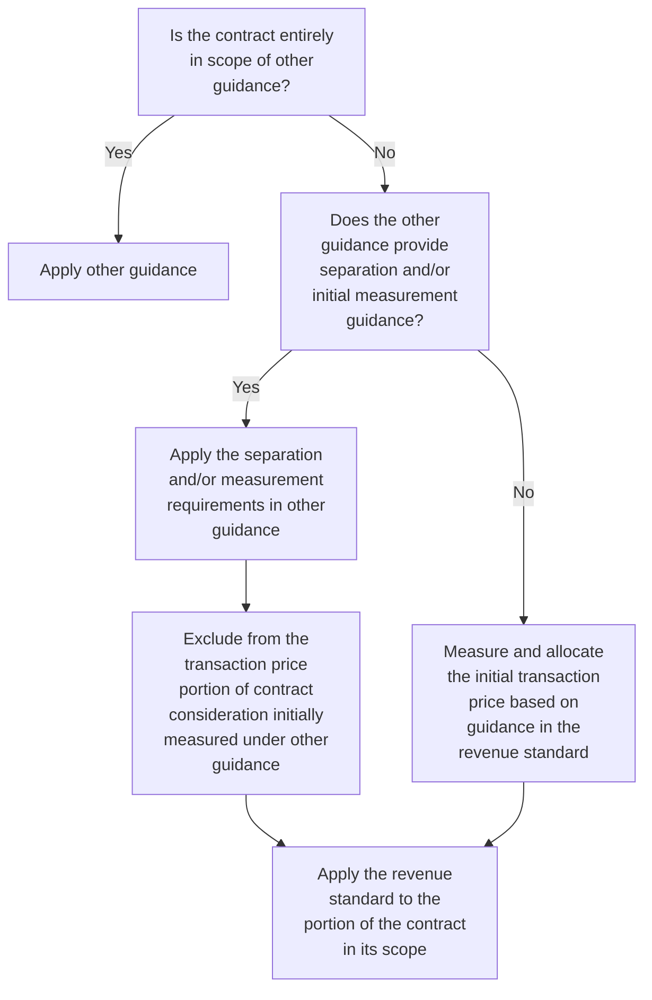


Scope and identifying the contract 2-2

There are no industries completely excluded from the scope of the revenue standard; however, the standard specifically excludes from its scope certain types of transactions:

[ ] Leases in the scope of ASC 842, *Leases*

[ ] Contracts in the scope of ASC 944, *Financial Services—Insurance*

[ ] Financial instruments and other contractual rights or obligations in the scope of the following guidance:
    - ASC 310, *Receivables*; ASC 320, *Investments—Debt Securities*; ASC 321, *Investments—Equity Securities*; ASC 323, *Investments—Equity Method and Joint Ventures*; ASC 325, *Investments—Other*; ASC 405, *Liabilities*; ASC 470, *Debt*; ASC 815, *Derivatives and Hedging*; ASC 825, *Financial Instruments*; and ASC 860, *Transfers and Servicing*

[ ] Nonmonetary exchanges between reporting entities in the same line of business to facilitate sales to current or future customers

[ ] Guarantees (other than product or service warranties—see RR 8 for further considerations related to warranties) in the scope of ASC 460, *Guarantees*

Arrangements should be assessed to determine whether they are within the scope of other guidance and, therefore, outside the scope of the revenue standard. Refer to Revenue TRG Memo No. 17, Revenue TRG Memo No. 36, Revenue TRG Memo No. 47, US Revenue TRG Memo No. 52, and the related meeting minutes in Revenue TRG Memo No. 25, Revenue TRG Memo No. 44, Revenue TRG Memo No. 49, and Revenue TRG Memo No. 55, respectively, for further discussion of scoping issues discussed by the TRG. Following are examples of how to apply the scoping guidance to specific types of transactions.

[ ] **Credit card fees**
    Credit card fees are outside the scope of the revenue standard for reporting entities, unless the overall nature of the arrangement is not a credit card lending arrangement. Credit card fees are addressed by specific guidance in ASC 310, *Receivables*. If a credit card arrangement is determined to be outside the scope of the revenue standard, any related reward program is also outside the scope. Management should evaluate the nature of the reporting entity’s credit card programs to assess whether they are in the scope of ASC 310 and continue to evaluate new programs as they evolve. Refer to Revenue TRG Memo No. 36 and the related meeting minutes in Revenue TRG Memo No. 44 for further discussion of this topic.

[ ] **Depository account fees**
    When a customer deposits funds at a bank, the customer and the bank enter into a depository agreement that provides the customer with certain services, such as custody of deposited funds and access to those deposited funds. The bank may charge the customer fees for accessing the funds, not maintaining a specified minimum account balance, or not utilizing the account. These fees are not within the scope of other specific guidance and, therefore, are within the scope of the revenue standard. Refer to Revenue TRG Memo No. 52 and the related meeting minutes in Revenue TRG Memo No. 55 for further discussion of this topic. These TRG memos also include discussion of the application of the revenue standard to


PwC US National Office | viewpoint.pwc.com 2-3

deposit fees, including determining the contract term when the arrangement can be terminated without significant penalty and the accounting implications of no-fee or reduced-fee arrangements.

*   **Servicing fees**

    Servicing arrangements are those in which fees are earned when a reporting entity provides servicing (of a mortgage or other financial assets) on behalf of another party that owns the loan or other assets. When a reporting entity records a servicing right as an asset (or a liability), the initial and subsequent recognition of the asset (or liability) is subject to the guidance in ASC 860. While ASC 860 provides guidance on the subsequent accounting for servicing rights, it does not prescribe how the servicing revenue should be recognized. Servicing arrangements within the scope of ASC 860 would not be subject to the revenue standard even though ASC 860 does not prescribe how servicing revenue should be recognized. However, if a reporting entity concludes that its servicing arrangements are not subject to ASC 860, they would be subject to the revenue standard. Refer to Revenue TRG Memo No. 52 and the related meeting minutes in Revenue TRG Memo No. 55 for further discussion of this topic. Refer to TS 6 for further discussion of accounting for servicing arrangements under ASC 860.

*   **Gaming contracts**

    Fixed-odds wagering contracts, including any associated loyalty programs, within the scope of ASC 924, *Entertainment — Casinos*, are excluded from the scope of the derivative instruments guidance (ASC 815) and, thus, are within the scope of the revenue standard. Refer to Revenue TRG Memo No. 47 and the related meeting minutes in Revenue TRG Memo No. 49 for further discussion of this topic.

*   **Insurance**

    All contracts in the scope of ASC 944 are excluded from the revenue standard. This includes life insurance, health insurance, property and casualty insurance, title insurance, mortgage guarantee insurance, and investment contracts. The scope exception does not apply to other types of contracts that may be issued by insurance reporting entities that are outside the scope of insurance guidance, such as asset management and claims handling (administrative services) contracts.

    Contracts could also be partially within the scope of the insurance guidance and partially within the scope of the revenue standard. Management may need to apply judgment to make this determination. If a contract is entirely in the scope of the insurance guidance, activities to fulfill the contract, such as insurance risk mitigation or cost containment activities, should be accounted for under the insurance guidance.

### 2.2.1 Revenue that does not arise from a contract with a customer
Revenue from transactions or events that does not arise from a contract with a customer is not in the scope of the revenue standard and should continue to be recognized in accordance with other standards. Such transactions or events include but are not limited to:

*   Dividends

*   Non-exchange transactions, such as donations or contributions. For example, contributions received by a not-for-profit reporting entity are not within the scope


Scope and identifying the contract 2-4

of the revenue standard if they are not given in exchange for goods or services (that is, they represent non-exchange transactions). Refer to Revenue TRG Memo No. 26, the related meeting minutes in Revenue TRG Memo No. 34, and NP 6 for further discussion of this topic.

*   Changes in regulatory assets and liabilities arising from alternative revenue programs for rate-regulated activities in the scope of ASC 980, *Regulated Operations*

### 2.2.2 Evaluation of nonmonetary exchanges

As noted in RR 2.2, nonmonetary exchanges between reporting entities in the same line of business to facilitate sales to current or future customers are excluded from the scope of the revenue standard. Reporting entities should assess these arrangements under ASC 845, *Nonmonetary Transactions*. An exchange of finished goods inventory for the receipt of raw materials or work-in-process inventory is not considered an exchange to facilitate sales to customers (as stated in ASC 845-10-30-15) and therefore, would not qualify for the scope exception in the revenue standard. Refer to PPE 2.3.1 and PPE 6.3.6 for guidance on nonmonetary transactions.

Nonmonetary exchanges with customers that are in the scope of the revenue standard are exchanges of goods or services for noncash consideration. Refer to the guidance on noncash consideration in RR 4.5.

Determining whether nonmonetary exchanges are in the scope of the revenue standard could require judgment and depends on the facts and circumstances of the arrangement. Example RR 2-1 illustrates an arrangement that is not within the scope of the revenue standard.

#### EXAMPLE RR 2-1
**Scope — exchange of products to facilitate a sale to another party**

Salter is a supplier of road salt. Adverse weather events can lead to a sudden increase in demand, and Salter does not always have a sufficient supply of road salt to meet this demand on short notice. Salter enters into a contract with SaltCo, a supplier of road salt in another region, such that each party will provide road salt to the other during local adverse weather events as they are rarely affected at the same time. No other consideration is provided by the parties.

**Is the contract in the scope of the revenue standard?**

**Analysis**

No. This arrangement is not in the scope of the revenue standard because the standard specifically excludes from its scope nonmonetary exchanges in the same line of business to facilitate sales to customers or potential customers.

### 2.2.3 Contracts with components in and out of the scope of revenue

Some contracts include components that are in the scope of the revenue standard and other components that are in the scope of other standards. For example, a contract could include a financial guarantee given by the vendor (refer to RR 4.3.3.9 for further discussion of guarantees) or a lease of property, plant, and equipment in addition to a promise to provide goods or services. A reporting entity should first apply the separation or measurement guidance in other applicable standards (if any) and then apply the guidance in the revenue standard. A reporting entity applies the guidance in the revenue standard to initially separate and/or measure the


PwC US National Office | viewpoint.pwc.com 2-5

components of the contract only if another standard does not include separation or measurement guidance. The transaction price, as described in RR 4.2, excludes the portion of contract consideration that is initially measured under other guidance. For guidance on allocating consideration to lease and nonlease components refer to LG 2.4.3.

### 2.2.3.1 Election to combine lease and non-lease components
Reporting entities can elect a practical expedient (provided in ASC 842) that permits lessors to combine lease and non-lease components within a contract if certain criteria are met. The practical expedient applies to contracts that include an operating lease and a non-lease component, such as a promise to provide services. To qualify for the expedient, the pattern of transfer of the operating lease and the non-lease component must be the same (that is, on a straight-line basis over time).

If the lease and non-lease components are combined under this expedient, a lessor would account for the combined component under the revenue standard if the non-lease component is predominant, and as an operating lease if the non-lease component is not predominant. For example, if the service component (a revenue component) is predominant, the reporting entity could apply the revenue standard to both the revenue and lease components. If the service component is not predominant, the reporting entity could apply the lease standard to all components. If elected, the practical expedient will need to be applied consistently as an accounting policy by class of underlying asset. Refer to LG 2.4.4.1 for further discussion.

### 2.2.4 Sale of future revenues
An arrangement where an investor acquires rights to future cash flows from a reporting entity is typically not a contract with a customer in the scope of the revenue standard. An example is an arrangement in which a reporting entity receives cash from an investor in exchange for a specified percentage of revenue from an existing product line or business segment. ASC 470-10-25 includes factors indicating the cash received from the investor should be classified as debt.

> **ASC 470-10-25-2**
>
> While the classification of the proceeds from the investor as debt or deferred income depends on the specific facts and circumstances of the transaction, the presence of any one of the following factors independently creates a rebuttable presumption that classification of the proceeds as debt is appropriate:
>
> a. The transaction does not purport to be a sale (that is, the form of the transaction is debt).
>
> b. The entity has significant continuing involvement in the generation of the cash flows due the investor (for example, active involvement in the generation of the operating revenues of a product line, subsidiary, or business segment).
>
> c. The transaction is cancelable by either the entity or the investor through payment of a lump sum or other transfer of assets by the entity.
>
> d. The investor's rate of return is implicitly or explicitly limited by the terms of the transaction.
>
> e. Variations in the entity's revenue or income underlying the transaction have only a trifling impact on the investor's rate of return.


Scope and identifying the contract 2-6

> f. The investor has any recourse to the entity relating to the payments due the investor.

Different guidance may apply if an investor is providing research and development funding to a reporting entity in return for future royalties resulting from the product being developed. Refer to PPE 8.3.4 for further discussion of funded research and development arrangements.

## 2.3 Sale or transfer of nonfinancial assets

Some principles of the revenue standard apply to the recognition of a gain or loss on the transfer of certain nonfinancial assets and in substance nonfinancial assets that are not an output of a reporting entity's ordinary activities (such as the sale or transfer of property, plant, and equipment). Guidance on the sale or transfer of nonfinancial assets or in substance nonfinancial assets to counterparties other than customers is included in ASC 610-20. ASC 610-20 refers to ASC 606 for the principles of recognition and measurement.

Although a gain or loss on this type of sale generally does not meet the definition of revenue (and, therefore, would not be presented as revenue), a reporting entity should apply the guidance in the revenue standard to determine whether the parties are committed to perform under the contract and therefore whether a contract exists (refer to RR 2.6). Reporting entities should also apply the guidance in the revenue standard related to the transfer of control (refer to RR 6) and measurement of the transaction price (refer to RR 4), including the constraint on variable consideration, to evaluate the timing and amount of the gain or loss recognized.

Refer to RR 2.4 and PPE 6.2.2 for further guidance on determining whether the arrangement is with a customer. For further discussion of ASC 610-20, refer to PPE 6.

## 2.4 Identifying the customer

The revenue standard defines a customer as follows.

> ### Definition from ASC 606-10-20
>
> **Customer:** A party that has contracted with an entity to obtain goods or services that are an output of the entity's ordinary activities in exchange for consideration.

In simple terms, a customer is the party that purchases a reporting entity's goods or services. Identifying the customer is straightforward in many instances, but a careful analysis needs to be performed in other situations to confirm whether a customer relationship exists. For example, a contract with a counterparty to participate in an activity where both parties share in the risks and benefits of the activity (such as developing an asset) is unlikely to be in the scope of the revenue guidance because the counterparty is unlikely to meet the definition of a customer. An arrangement where, in substance, the reporting entity is selling a good or service is likely in the scope of the revenue standard, even if it is termed a "collaboration" or something similar.

The revenue standard applies to all contracts, including transactions with collaborators or partners, if they are a transaction with a customer. All of the relationships in a collaboration or partnership agreement must be understood to identify whether all or a portion of the contract is, in substance, a contract with a customer. A portion of the contract might be the sharing of risks and benefits of an


PwC US National Office | viewpoint.pwc.com 2-7

activity, which is outside the scope of the revenue standard. Other portions of the contract might be for the sale of goods or services from one reporting entity to the other and therefore in the scope of the revenue standard.

Example RR 2-2 illustrates the consideration of whether the revenue standard applies to a collaborative arrangement.

### EXAMPLE RR 2-2
**Identifying the customer — collaborative arrangement**

Biotech signs an agreement with Pharma to share equally in the development of a specific drug candidate.

Is the arrangement in the scope of the revenue standard?

**Analysis**

It depends. It is unlikely that the arrangement is in the scope of the revenue standard if the reporting entities will simply work together to develop the drug. It is likely in the scope of the revenue standard if the substance of the arrangement is that Biotech is selling its compound to Pharma and/or providing research and development services to Pharma, if those activities are part of Biotech’s ordinary activities.

Reporting entities should consider whether other applicable guidance (such as ASC 808) exists that should be applied when an arrangement is a collaboration rather than a contract with a customer.

---

### 2.4.1 Collaborative arrangements
ASC 808 defines a “collaborative arrangement” and provides guidance for the income statement presentation, classification, and disclosures related to collaborative arrangements. The guidance also provides several examples of the accounting by parties to a collaborative arrangement.

As discussed in ASC 808-10-15-5A, a collaborative arrangement could be partially within the scope of ASC 606. If a part of the arrangement is potentially a transaction with a customer, management should apply the guidance in ASC 606 to identify all distinct goods and services (refer to RR 3.4). This is only for purposes of assessing whether there is a unit of account that should be accounted for under ASC 606. Assessing whether the various activities in a collaborative arrangement are distinct could require significant judgment, particularly when all of the activities have some level of interdependence. Management then needs to assess whether all or part of each unit of account is a transaction with a customer.

*   If the entire unit of account is a transaction with a customer, the reporting entity will apply ASC 606 to that unit of account, including all recognition, measurement, presentation, and disclosure requirements.

*   If a unit of account is not a transaction with a customer in its entirety, that unit of account is not in the scope of ASC 606. This would be the case if, for example, the other party is not obtaining goods or services that are the output of the reporting entity’s ordinary activities for some aspect of the single unit of account. In this circumstance, a reporting entity can apply (1) elements of the accounting under ASC 606, (2) other relevant guidance by analogy, or (3) a reasonable accounting policy if there is no appropriate analogy. Management should consider the nature of the arrangement and its business operations to determine


Scope and identifying the contract | 2-8

the appropriate accounting for portions of a collaborative arrangement outside the scope of ASC 606.

Figure RR 2-2 illustrates the assessment of which US GAAP guidance to apply to a collaborative arrangement.

**FIGURE RR 2-2**
Accounting for a collaborative arrangement

```mermaid
graph TD
    A[Does the arrangement meet the definition of a<br/>collaborative management?] -- No --> B[Apply other guidance.]
    A -- Yes --> C["For part or parts of the collaborative management, is the other party a<br/>customer (that is, a party that has contracted to obtain goods or<br/>services that are an output of the entity's ordinary business<br/>activities)?"]
    C -- No --> G
    C -- Yes --> D["Determine the units of account, using the \"distinct\"<br/>guidance in ASC 606-10-25-19 through ASC 606-10-25-22."]
    D --> E["For each unit of account, is the other party a customer for the entire<br/>unit of account (that is, a party that has contracted to obtain goods or<br/>services that are an output of the entities ordinary business<br/>activities)?"]
    E -- Yes --> F[Apply all aspects of ASC 606 to the unit of<br/>account, including all recognition,<br/>presentation and disclosure requirements.]
    E -- No --> G[Does other authoritative literature apply?]
    G -- Yes --> H[Apply other guidance.]
    G -- No --> I["Recognize and present based on analogy to authoritative accounting<br/>literature within other topics or if there is no appropriate analogy, a<br/>reasonable, rational, and consistently applied accounting policy<br/>election."]
```

Refer to FSP 3.6.8 for the disclosure requirements related to collaborative arrangements.

## 2.5 Arrangements with multiple parties
Identifying the customer can be more challenging when there are multiple parties involved in a transaction. The analysis should include understanding the substance of the relationship of all parties involved in the transaction.

Arrangements with three or more parties, particularly if there are separate contracts with each of the parties, require judgment to evaluate the substance of those relationships. Management will need to assess which parties are customers and whether the contracts meet the criteria to be combined, as discussed in RR 2.8, when applying the guidance in the revenue standard.

A reporting entity needs to assess whether it is the principal or an agent in an arrangement that involves multiple parties. This is because a reporting entity will recognize revenue for the gross amount of consideration it expects to be entitled to when it is the principal, but only the net amount of consideration that it expects to retain after paying the other party for the goods or services provided by that party when it is the agent. Refer to RR 10 for further considerations that a reporting entity should evaluate to determine whether it is the principal or an agent.


PwC US National Office | viewpoint.pwc.com 2-9

A reporting entity also needs to identify which party is its customer in a transaction with multiple parties in order to determine whether payments made to any of the parties meet the definition of "consideration payable to a customer" under the revenue standard. Refer to RR 4.6 for further discussion on consideration payable to a customer.

## 2.6 Identifying the contract

The revenue standard defines a contract as follows.

> ### Definition from ASC 606-10-20
>
> Contract: An agreement between two or more parties that creates enforceable rights and obligations.

Identifying the contract is an important step in applying the revenue standard. A contract can be written, oral, or implied by a reporting entity's customary business practices. A contract can be as simple as providing a single off-the-shelf product, or as complex as an agreement to build a specialized refinery. Generally, any agreement that creates legally enforceable rights and obligations meets the definition of a contract.

Legal enforceability depends on the interpretation of the law and could vary across legal jurisdictions. Evaluating legal enforceability of rights and obligations might be particularly challenging when contracts are entered into across multiple jurisdictions where the rights of the parties are not enforced across those jurisdictions in a similar way. A thorough examination of the facts specific to the contract and the jurisdiction is necessary in such cases.

Sometimes the parties will enter into amendments or "side agreements" to a contract that either change the terms of, or add to, the rights and obligations of that contract. These can be verbal or written changes to a contract. Side agreements could include cancellation, termination, or other provisions. They could also provide customers with options or discounts or change the substance of the arrangement. All of these items have implications for revenue recognition; therefore, understanding the entire contract, including any amendments, is critical to the accounting conclusion.

### 2.6.1 Contracts with customers—required criteria

All of the following criteria must be met before a reporting entity accounts for a contract with a customer under the revenue standard.

> ### Excerpt from ASC 606-10-25-1
>
> An entity shall account for a contract with a customer ... only when all of the following criteria are met:
>
> a. The parties to the contract have approved the contract (in writing, orally, or in accordance with other customary business practices) and are committed to perform their respective obligations.
>
> b. The entity can identify each party's rights regarding the goods or services to be transferred.


Scope and identifying the contract 2-10

> c. The entity can identify the payment terms for the goods or services to be transferred.
>
> d. The contract has commercial substance (that is, the risk, timing, or amount of the entity’s future cash flows is expected to change as a result of the contract).
>
> e. It is probable that the entity will collect substantially all of the consideration to which it will be entitled in exchange for the goods or services that will be transferred to the customer.

These criteria are discussed further in RR 2.6.1.1 through RR 2.6.1.5.

### 2.6.1.1 Contract has been approved and parties are committed
A contract must be approved by the parties involved in the transaction for it to be accounted for under the revenue standard. Approval might be in writing, but it can also be oral or implied based on a reporting entity’s established practice or the understanding between the parties. Without the approval of both parties, it is not clear whether a contract creates rights and obligations that are enforceable against the parties.

It is important to consider all facts and circumstances to determine if a contract has been approved. This includes understanding the rationale behind deviating from customary business practices (for example, having a verbal side agreement where normally all agreements are in writing).

The parties must also be committed to perform their respective obligations under the contract. Termination clauses are a key consideration in determining whether a contract exists. A contract does not exist if neither party has performed and either party can unilaterally terminate the wholly unperformed contract without compensating the other party. A wholly unperformed contract is one in which the reporting entity has neither transferred the promised goods or services to the customer, nor received, or become entitled to receive, any consideration. Refer to RR 2.7 for further discussion on evaluating the contract term.

Generally, it is not appropriate to delay revenue recognition in the absence of a written contract if there is sufficient evidence that the agreement has been approved and that the parties to the contract are committed to perform (or have already performed) their respective obligations.

Example RR 2-3, Example RR 2-4, Example RR 2-5, Example RR 2-6, and Example RR 2-7 illustrate the considerations in determining whether a contract has been approved and the parties are committed.

#### EXAMPLE RR 2-3
**Identifying the contract — product delivered without a written contract**

Seller’s practice is to obtain written and customer-signed sales agreements. Seller delivers a product to a customer without a signed agreement based on a request by the customer to fill an urgent need.

Can an enforceable contract exist if Seller has not obtained a signed agreement consistent with its customary business practice?


PwC US National Office | viewpoint.pwc.com 2-11

### Analysis

It depends. Seller needs to determine if a legally enforceable contract exists without a signed agreement. The fact that it normally obtains written agreements does not necessarily mean an oral agreement is not a contract; however, Seller must determine whether the oral arrangement meets all of the criteria to be a contract.

#### EXAMPLE RR 2-4
Identifying the contract — contract extensions

ServiceProvider has a 12-month agreement to provide Customer with services for which Customer pays $1,000 per month. The agreement does not include any provisions for automatic extensions, and it expires on November 30, 20X1. The two parties sign a new agreement on February 28, 20X2 that requires Customer to pay $1,250 per month in fees, retroactive to December 1, 20X1.

Customer continued to pay $1,000 per month during December, January, and February, and ServiceProvider continued to provide services during that period. There are no performance issues being disputed between the parties in the expired period, only negotiation of rates under the new contract.

Does a contract exist in December, January, and February (prior to the new agreement being signed)?

### Analysis

A contract appears to exist in this situation because ServiceProvider continued to provide services and Customer continued to pay $1,000 per month.

However, since the original arrangement expired and did not include any provision for automatic extension, determining whether a contract exists during the intervening period from December to February requires an understanding of the legal enforceability of the arrangement in the relevant jurisdiction in the absence of a written contract. If both parties have enforceable rights and obligations during the renegotiation period, a contract exists and revenue should not be deferred merely because the formal written contract has not been signed.

If management concludes a contract exists during the renegotiation period, the guidance on variable consideration applies to the estimate of the transaction price, including whether any amounts should be constrained (refer to RR 4.3).

#### EXAMPLE RR 2-5
Identifying the contract – free trial period

ServiceProvider offers to provide three months of free service on a trial basis to all potential customers to encourage them to sign up for a paid subscription. At the end of the three-month trial period, a customer signs up for a noncancellable paid subscription to continue the service for an additional twelve months.

Should ServiceProvider record revenue related to the three-month free trial period?

### Analysis

No. A contract does not exist until the customer commits to purchase the twelve months of service. The rights and obligations of the contract only include the future twelve months of paid subscription services, not the free trial period. Therefore, ServiceProvider should not record revenue related to the three-month free trial period.


Scope and identifying the contract 2-12

(that is, none of the transaction price should be allocated to the three months already delivered). The transaction price should be recognized as revenue on a prospective basis as the twelve months of services are transferred.

### EXAMPLE RR 2-6
#### Identifying the contract – free trial period with early acceptance

ServiceProvider offers to provide three months of free service on a trial basis to all potential customers to encourage them to sign up for a paid subscription. One month before the free trial period is completed (during month two of the three-month trial period), a customer signs up for a twelve-month service arrangement.

Should ServiceProvider record revenue for the remaining portion of the free trial period?

#### *Analysis*

It depends. Since the contract was signed before the free trial period was completed, judgment will be required to determine if the remaining free trial period is part of the contract with the customer. Management needs to assess if the rights and obligations in the contract include the one month remaining in the free trial period or only the future twelve months of paid subscription service. If management concludes that the remaining free trial period is part of the contract with the customer, revenue should be recognized on a prospective basis over 13 months, as services are transferred over the remaining trial period and the twelve-month subscription period.

### EXAMPLE RR 2-7
#### Identifying the contract – master services agreement

ServiceProvider enters into a master services agreement (MSA) with a customer that includes general terms and pricing for Product A. The customer is not committed to make any purchases of Product A until the customer subsequently submits a noncancellable purchase order for a specified number of units of Product A.

Does the MSA meet the criteria to be accounted for as a contract under ASC 606?

#### *Analysis*

No. In this fact pattern, the MSA, on its own, does not create enforceable rights and obligations because the customer is not committed to make any purchases. A contract does not exist until the customer subsequently submits a noncancellable purchase order.

***

#### 2.6.1.2 The reporting entity can identify each party’s rights
A reporting entity must be able to identify each party’s rights regarding the goods and services promised in the contract to assess its obligations under the contract. Revenue cannot be recognized related to a contract (written or oral) where the rights of each party cannot be identified, because the reporting entity would not be able to assess when it has transferred control of the goods or services.

For example, a reporting entity enters into a contract with a customer and agrees to provide professional services in exchange for cash, but the rights and obligations of the parties are not yet known. The reporting entities have not contracted with each other in the past and are negotiating the terms of the agreement. No revenue should


PwC US National Office | viewpoint.pwc.com 2-13

be recognized if the reporting entity provides services to the customer prior to understanding its rights to receive consideration.

### 2.6.1.3 The reporting entity can identify the payment terms
The payment terms for goods or services must be known before a contract can exist, because without that understanding, a reporting entity cannot determine the transaction price. This does not necessarily require that the transaction price be fixed or explicitly stated in the contract. Refer to RR 4 for discussion of determining the transaction price, including variable consideration.

### 2.6.1.4 The contract has commercial substance
A contract has commercial substance if the risk, timing, or amount of the reporting entity’s future cash flows will change as a result of the contract. If there is no change, it is unlikely the contract has commercial substance. A change in future cash flows does not only apply to cash consideration. Future cash flows can also be affected when the reporting entity receives noncash consideration as the noncash consideration might result in reduced cash outflows in the future. There should also be a valid business reason for the transaction to occur. Determining whether a contract has commercial substance can require judgment, particularly in complex arrangements where vendors and customers have several arrangements in place between them.

### 2.6.1.5 Collection of the consideration is probable
The objective of the collectibility assessment is to determine whether there is a substantive transaction (that is, a valid contract) between the reporting entity and a customer. A reporting entity only applies the revenue guidance to contracts when it is “probable” that the reporting entity will collect the consideration it is entitled to in exchange for the goods or services it transfers to the customer. “Probable” is defined as “the future event or events are likely to occur,” which is generally considered a 75% threshold.

The assessment of whether an amount is probable of being collected is made after considering any price concessions expected to be provided to the customer. Management should first determine whether it expects the reporting entity to accept a lower amount of consideration than that which the customer is contractually obligated to pay (refer to “Impact of price concessions” section below). A reporting entity that expects to provide a price concession should assess the probability of collection for the amount it expects to enforce (that is, the transaction price adjusted for estimated concessions).

The reporting entity’s assessment of this probability must reflect both the customer’s ability and intent to pay as amounts become due. An assessment of the customer’s intent to pay requires management to consider all relevant facts and circumstances, including items such as the reporting entity’s past practices with its customers as well as, for example, any collateral obtained from the customer.

Additional implementation guidance is included in the revenue standard to clarify how management should assess collectibility.

> **Excerpt from ASC 606-10-55-3C**
>
> When assessing whether a contract meets the [collectibility] criterion...an entity should determine whether the contractual terms and its customary business practices indicate that the entity’s exposure to credit risk is less than the entire


Scope and identifying the contract 2-14

> consideration promised in the contract because the entity has the ability to mitigate its credit risk. Examples of contractual terms or customary business practices that might mitigate the entity's credit risk include the following:
>
> a. Payment terms — In some contracts, payment terms limit an entity's exposure to credit risk. For example, a customer may be required to pay a portion of the consideration promised in the contract before the entity transfers promised goods or services to the customer. In those cases, any consideration that will be received before the entity transfers promised goods or services to the customer would not be subject to credit risk.
>
> b. The ability to stop transferring promised goods or services — An entity may limit its exposure to credit risk if it has the right to stop transferring additional goods or services to a customer in the event that the customer fails to pay consideration when it is due. In those cases, an entity should assess only the collectibility of the consideration to which it will be entitled in exchange for the goods or services that will be transferred to the customer on the basis of the entity's rights and customary business practices. Therefore, if the customer fails to perform as promised and, consequently, the entity would respond to the customer's failure to perform by not transferring additional goods or services to the customer, the entity would not consider the likelihood of payment for the promised goods or services that will not be transferred under the contract.
>
> An entity's ability to repossess an asset transferred to a customer should not be considered for the purpose of assessing the entity's ability to mitigate its exposure to credit risk.

This additional guidance explains that management should consider the reporting entity's ability to mitigate its exposure to credit risk as part of the collectibility assessment (for example, by requiring advance payments or ceasing to provide goods or services in the event of nonpayment). A reporting entity typically will not enter into a contract with a customer if there is significant credit risk without also having protection to ensure it can collect the consideration to which it is entitled. The guidance clarifies that the collectibility assessment is not based on collecting all of the consideration promised in the contract, but on collecting the amount to which the reporting entity will be entitled in exchange for the goods or services it will transfer to the customer. These concepts are illustrated in Example 1 of ASC 606 (ASC 606-10-55-95 through ASC 606-10-55-98L).

### Impact of price concessions
Distinguishing between an anticipated price concession and the reporting entity's exposure to the customer's credit risk may require judgment. The distinction is important because a price concession is variable consideration (which affects the transaction price) rather than a factor to consider in assessing collectibility (when assessing whether the contract is valid). Refer to RR 4.3 for further discussion on variable consideration.

Factors to consider in assessing whether a price concession exists include a reporting entity's customary business practices, published policies, and specific statements regarding the amount of consideration the reporting entity will accept. The assessment should not be limited to past business practices. For example, a reporting entity might enter into a contract with a new customer expecting to provide a price concession to develop the relationship. Refer to Revenue TRG Memo No. 13 and the related meeting minutes in Revenue TRG Memo No. 25 for further


PwC US National Office | viewpoint.pwc.com 2-15

discussion of this topic. These concepts are illustrated in Examples 2 and 3 of the revenue standard (ASC 606-10-55-99 through ASC 606-10-55-105).

### QUESTION RR 2-1
A reporting entity provides payment terms that are extended beyond normal terms in a contract with a new customer. Should management conclude that the amounts subject to the extended payment terms are not probable of collection?

**PwC response**
It depends. Extended payment terms should be considered when assessing the customer’s ability and intent to pay the consideration when it is due; however, the mere existence of extended payment terms is not determinative in the collectibility assessment. Management’s conclusion about whether collection is probable will depend on the relevant facts and circumstances. Management should also consider in this fact pattern whether the reporting entity expects to provide a concession to the customer and whether the payment terms indicate that the arrangement includes a significant financing component (refer to RR 4.4).

---

#### *Assessing collectibility for a portfolio of contracts*
It is not uncommon for a reporting entity’s historical experience to indicate that it will not collect all of the consideration related to a portfolio of contracts. In this scenario, management could conclude that collection is probable for each contract within the portfolio (that is, all of the contracts are valid) even though it anticipates some (unidentified) customers will not pay all of the amounts due. The reporting entity should apply the revenue model to determine transaction price (including an assessment of any expected price concessions) and recognize revenue assuming collection of the entire transaction price. Management should separately evaluate the contract asset or receivable for impairment under ASC 310 (or for credit losses under ASC 326, *Financial instruments – credit losses*, once adopted). Refer to Revenue TRG Memo No. 13 and the related meeting minutes in Revenue TRG Memo No. 25 for further discussion of this topic. Example RR 2-8 illustrates this accounting.

### EXAMPLE RR 2-8
#### Identifying the contract — assessing collectibility for a portfolio of contracts

Wholesaler sells sunglasses to a large volume of customers under similar contracts. Before accepting a new customer, Wholesaler performs customer acceptance and credit check procedures designed to ensure that it is probable the customer will pay the amounts owed. Wholesaler will not accept a new customer that does not meet its customer acceptance criteria.

In January 20X1, Wholesaler delivers sunglasses to multiple customers in exchange for consideration totaling $100,000. Wholesaler concludes that control of the sunglasses has transferred to the customers and there are no remaining performance obligations.

Wholesaler concludes, based on its procedures, that collection is probable for each customer; however, historical experience indicates that, on average, Wholesaler will collect only 95% of the amounts billed. Wholesaler believes its historical experience reflects its expectations about the future. Wholesaler intends to pursue full payment from customers and does not expect to provide any price concessions.

How much revenue should Wholesaler recognize?


Scope and identifying the contract | 2-16

#### *Analysis*

Because collection is probable for each customer, Wholesaler should recognize revenue of $100,000 when it transfers control of the sunglasses. Wholesaler’s historical collection experience does not impact the transaction price in this fact pattern because it concluded that the collectibility threshold was met (that is, the contracts were valid) and it did not expect to provide any price concessions. Wholesaler should evaluate the related receivable for impairment based on the relevant financial instruments standard.

---

### 2.6.2 Arrangements in which criteria are not met

An arrangement is not accounted for using the five-step model until all of the criteria in RR 2.6.1 are met. Management will need to reassess the arrangement at each reporting period to determine if the criteria are met.

Consideration received prior to concluding a contract exists (that is, prior to meeting the criteria in RR 2.6.1) is recorded as a liability and represents the reporting entity’s obligation to either transfer goods or services in the future or refund the consideration received. The reporting entity should not recognize revenue from consideration received from the customer until one of the following criteria is met.

> **Excerpt from ASC 606-10-25-7**
>
> When a contract with a customer does not meet the criteria ... and an entity receives consideration from the customer, the entity shall recognize the consideration received as revenue only when one or more of the following events have occurred:
>
> a. The entity has no remaining obligations to transfer goods or services to the customer, and all, or substantially all, of the consideration promised by the customer has been received by the entity and is nonrefundable.
>
> b. The contract has been terminated, and the consideration received from the customer is nonrefundable.
>
> c. The entity has transferred control of the goods or services to which the consideration that has been received relates, the entity has stopped transferring goods or services to the customer (if applicable) and has no obligation under the contract to transfer additional goods or services, and the consideration received from the customer is nonrefundable.

The third criterion is intended to clarify when revenue should be recognized in situations where it is unclear whether the contract has been terminated. Example RR 2-9 illustrates the accounting for a contract for which collection is not probable and therefore, a contract does not exist.

#### EXAMPLE RR 2-9
**Identifying the contract — collection not probable**

EquipCo sells equipment to its customer with three years of maintenance for total consideration of $1 million, due in monthly installments over the three-year term. At contract inception, EquipCo determines that the customer does not have the ability to pay as amounts become due and therefore collection of the consideration is not probable. EquipCo intends to pursue collection and does not intend to provide a price


PwC US National Office | viewpoint.pwc.com 2-17

concession. EquipCo delivers the equipment at the inception of the contract. At the end of the first year of the contract, the customer makes a partial payment of $200,000. EquipCo continues to provide maintenance services but concludes that collection of the remaining consideration is not probable.

Can EquipCo recognize revenue for the partial payment received?

***Analysis***

No. EquipCo cannot recognize revenue for the partial payment received because it has concluded that collection is not probable. EquipCo cannot recognize revenue for cash received from the customer until it meets one of the criteria outlined in RR 2.6.2. In this example, EquipCo has not terminated the contract and continues to provide services to the customer. EquipCo should continue to reassess collectibility each reporting period.

#### QUESTION RR 2-2
Can a reporting entity recognize revenue for nonrefundable consideration received if it continues to pursue collection for remaining amounts owed under the contract (for an arrangement that does not meet all of the criteria to establish a contract with enforceable rights and obligations in RR 2.6.1)?

***PwC response***
It depends. Reporting entities sometimes pursue collection for a considerable period of time after they have stopped transferring promised goods or services to the customer. Management should assess whether the criteria in RR 2.6.2 are met. We believe that management could conclude that a contract has been terminated even if the reporting entity continues to pursue collection as long as the reporting entity has stopped transferring goods and services and has no obligation to transfer additional goods or services to the customer.

#### QUESTION RR 2-3
If a reporting entity begins activities related to a performance obligation for which control will transfer over time (for example, begins manufacturing a customized good or constructing a building) before a contract meets the criteria described in RR 2.6.1, how should progress be measured once the contract subsequently meets the criteria?

***PwC response***
The measure of progress for a performance obligation satisfied over time should reflect the reporting entity's performance in transferring control of goods or services. Thus, once a contract is established, a reporting entity should generally recognize revenue for any promised goods or services that have already transferred to the customer (that is, revenue is recognized on a cumulative catch-up basis). Refer to RR 6.4.6 and Revenue TRG Memo No. 33 and the related meeting minutes in Revenue TRG Memo No. 34 for further discussion of this topic.

Reporting entities generally should not recognize revenue on a cumulative catch-up basis for distinct goods or services provided for no consideration prior to contract inception (for example, as part of a "free trial"). Refer to Example RR 2-6.

### 2.6.3 Reassessment of criteria
Once an arrangement has met the criteria in RR 2.6.1, management does not reassess the criteria again unless there are indications of significant changes in facts


Scope and identifying the contract | 2-18

and circumstances. The determination of whether there is a significant change in facts or circumstances depends on the specific situation and requires judgment.

For example, assume a reporting entity determines that a contract with a customer exists, but subsequently the customer’s ability to pay deteriorates significantly in relation to goods or services to be provided in the future. Management needs to assess, in this situation, whether it is probable that the customer will pay the amount of consideration for the remaining goods or services to be transferred to the customer. The reporting entity will account for the remainder of the contract as if it had not met the criteria to be a contract if it is not probable that it will collect the consideration for future goods or services. This assessment does not affect assets and revenue recorded relating to performance obligations already satisfied. Such assets are assessed for impairment under the relevant financial instruments standard.

Example 4 in the revenue standard (ASC 606-10-55-106 through ASC 606-10-55-109) provides an illustration of a situation when the change in a customer’s financial condition is so significant that it necessitates a reassessment of the criteria discussed in RR 2.6.1. Also refer to Revenue TRG Memo No. 13 and the related meeting minutes in Revenue TRG Memo No. 25 for further discussion of this topic.

## 2.7 Determining the contract term
The contract term is the period during which the parties to the contract have present and enforceable rights and obligations. Determining the contract term is important as it impacts the determination and allocation of the transaction price and recognition of revenue.

> ### Excerpt from ASC 606-10-25-3
>
> Some contracts with customers may have no fixed duration and can be terminated or modified by either party at any time. Other contracts may automatically renew on a periodic basis that is specified in the contract. An entity shall apply the [guidance in the revenue standard] to the duration of the contract (that is, the contractual period) in which the parties to the contract have present enforceable rights and obligations.

Reporting entities should consider termination clauses when assessing contract duration. If a contract can be terminated early for no compensation, enforceable rights and obligations would likely not exist for the entire stated term. The contract may, in substance, be a shorter-term contract with a right to renew. In contrast, a contract that can be terminated early, but requires payment of a substantive termination penalty, is likely to have a contract term equal to the stated term. This is because enforceable rights and obligations exist throughout the stated contract period. Refer to Revenue TRG Memo No. 10 and Revenue TRG Memo No. 48, and the related meeting minutes in Revenue TRG Memo Nos. 11 and Revenue TRG Memo No. 49, respectively, for further discussion of this topic.

We believe that termination penalties could take various forms, including cash payments or the transfer of an asset to the vendor (see Example RR 2-13). Additionally, a payment need not be labelled a “termination penalty” to create enforceable rights and obligations. For example, a substantive termination penalty might exist if a customer must repay a portion of an upfront discount if the customer terminates the contract.


PwC US National Office | viewpoint.pwc.com 2-19

Management should consider both quantitative and qualitative factors when assessing whether a termination penalty is substantive. There are no "bright lines" for making this assessment. The objective is to determine the period over which the parties have enforceable rights and obligations. Therefore, the assessment of whether the termination penalty is substantive is intended to address whether the existence of the penalty is a disincentive for cancelling the contract such that the customer is, in effect, committed to the contract for the stated term.

In performing a quantitative assessment, management should compare the termination penalty to the remaining payments that would otherwise be required under the contractually stated term. The quantitative assessment should only include penalties the customer is required to pay the reporting entity and should not include other costs the customer will incur to switch vendors.

Management should also consider qualitative factors such as:

[ ] The reason for the termination right

[ ] The history of customers exercising a termination right in contracts with similar terms

[ ] The customer's ability to benefit from goods or services already received separately from the remaining goods or services to be delivered

[ ] Other customer-specific considerations (e.g., the nature of the goods or services being purchased relative to the customer's business, the availability of alternative vendors, and other factors that impact the significance of the penalty from the customer's perspective)

If a customer has the right to terminate a contract early without paying a substantive termination penalty, the assessment of contract term should not take into account the likelihood the customer will exercise that right. In other words, the contract term would not extend beyond the period the customer has the right to terminate regardless of whether the customer is expected to terminate the contract, as the contract term only includes the period during which the parties have enforceable rights and obligations. Similarly, the reporting entity should not consider whether the customer would be economically compelled not to exercise a termination right because of costs the customer would incur to cancel the contract (e.g., costs to switch vendors).

A reporting entity should not account for termination rights that do not have substance, similar to any other non-substantive contract provision. For example, a termination right may not have substance if it allows a customer to cancel a contract that has been paid in full but does not require the vendor to refund any consideration upon cancellation.

Example RR 2-10, Example RR 2-11, Example RR 2-12, and Example RR 2-13 illustrate the impact of termination rights and penalties on the assessment of contract term.

### EXAMPLE RR 2-10
#### Determining the contract term — both parties can terminate without penalty

ServiceProvider enters into a contract with a customer to provide monthly services for a three-year period. Each party can terminate the contract at the end of any month


Scope and identifying the contract 2-20

for any reason without compensating the other party (that is, there is no penalty for terminating the contract early).

What is the contract term for purposes of applying the revenue standard?

### *Analysis*

The contract should be treated as a month-to-month contract despite the three-year stated term. The parties do not have enforceable rights and obligations beyond the month (or months) of services already provided.

***

#### EXAMPLE RR 2-11
Determining the contract term — only the customer can terminate without penalty

ServiceProvider enters into a contract with a customer to provide monthly services for a three-year period. The customer can terminate the contract at the end of any month for any reason without compensating ServiceProvider to terminate the contract.

What is the contract term for purposes of applying the revenue standard?

### *Analysis*

The contract should be accounted for as a month-to-month contract with a customer option to renew each month. This is consistent with discussion in the Basis for Conclusions that customer cancellation rights can be similar to a renewal option. In this fact pattern, the three-year cancellable contract is equivalent to a one-month renewable contract. Refer to RR 7.3 for further discussion on the accounting for renewal options, including the assessment of whether such options provide the customer with a material right. Additionally, refer to Revenue TRG Memo No. 48 and the related meeting minutes in Revenue TRG Memo No. 49 for further discussion of this topic.

***

#### EXAMPLE RR 2-12
Determining the contract term — impact of termination penalty

ServiceProvider enters into a contract with a customer to provide monthly services for a three-year period. The customer can terminate the contract at the end of any month for any reason. The customer must pay a termination penalty if the customer terminates the contract during the first twelve months.

What is the contract term for purposes of applying the revenue standard?

### *Analysis*

It depends. Management should assess whether the termination penalty is substantive such that it creates enforceable rights and obligations for the first twelve months of the contract. The contract term would be one year if the termination penalty is determined to be substantive.

***

#### EXAMPLE RR 2-13
Determining the contract term — license of intellectual property

Biotech enters into a ten-year term license arrangement with Pharma under which Biotech transfers to Pharma the exclusive rights to sell product using its intellectual property in a particular territory. There are no other performance obligations in the arrangement. Pharma makes an upfront nonrefundable payment of $25 million and is


PwC US National Office | viewpoint.pwc.com 2-21

obligated to pay an additional $1 million at the end of each year throughout the stated term.

Pharma can cancel the contract for convenience at any time but must return its rights to the licensed intellectual property to Biotech upon cancellation. Pharma does not receive any refund of amounts previously paid upon cancellation.

What is the contract term for purposes of applying the revenue standard?

### Analysis

Biotech would likely conclude that the contract term is ten years because Pharma cannot cancel the contract without incurring a substantive termination penalty. The substantive termination penalty in this arrangement is Pharma’s obligation to transfer an asset to Biotech through the return of its exclusive rights to the licensed intellectual property without refund of amounts paid.

The assessment of whether a substantive termination penalty is incurred upon cancellation could require significant judgment for arrangements that include a license of intellectual property. Factors to consider include the nature of the license, the payment terms (for example, how much of the consideration is paid upfront), the business purpose of contract terms that include termination rights, and the impact of contract cancellation on other performance obligations, if any, in the contract. If management concludes that a termination right creates a contract term shorter than the stated term, management should assess whether the arrangement contains a renewal option that provides the customer with a material right (refer to RR 7.3).

#### QUESTION RR 2-4
Do fiscal funding clauses in an arrangement with a US federal governmental entity affect the determination of the contract term?

#### PwC response
It depends. Because of the US federal government’s annual budget process, it is common for long-term contracts with the government to include fiscal funding clauses. These clauses typically state that the government’s obligations under the contract are contingent upon the appropriation of funds to fulfill those obligations. Thus, the portion of the contract that is unfunded at contract inception could be subject to cancellation if funding is not appropriated in the future. In these cases, judgment is required to determine the contract term.

We believe management could conclude that the criteria in ASC 606-10-25-1 are met for both the funded and unfunded portions of the contract if the reporting entity has an approved enforceable contract with the US federal government that clearly states each party’s rights and obligations, and the government has the ability and intention to pay for the promised goods and services. Accordingly, both the funded and unfunded portions would be included in the contract term. The unfunded portion of the contract would be considered variable consideration, and the reporting entity will need to consider whether any variable consideration is constrained as discussed in RR 4.3.2.

While arrangements with the US federal government typically include fiscal funding clauses, there may be circumstances where a contract provides the government the right to cancel the contract for any reason (that is, the right to cancel is not limited to situations where funding is not appropriated). In these circumstances, the reporting entity should assess whether the government is required to pay a substantive termination penalty upon cancellation. If there is no substantive termination penalty,


Scope and identifying the contract 2-22

enforceable rights and obligations would only exist for the noncancellable period and accordingly, the contract term would be limited to the noncancellable period.

***

## 2.8 Combining contracts

Multiple contracts will need to be combined and accounted for as a single arrangement in some situations. This is the case when the economics of the individual contracts cannot be understood without reference to the arrangement as a whole.

> **Excerpt from ASC 606-10-25-9**
>
> An entity shall combine two or more contracts entered into at or near the same time with the same customer (or related parties of the customer) and account for the contracts as a single contract if one or more of the following criteria are met:
>
> a. The contracts are negotiated as a package with a single commercial objective;
>
> b. The amount of consideration to be paid in one contract depends on the price or performance of the other contract;
>
> c. The goods or services promised in the contracts (or some goods or services promised in each of the contracts) are a single performance obligation

The determination of whether to combine two or more contracts is made at contract inception. Contracts must be entered into with the same customer (or related parties of the customer) at or near the same time in order to account for them as a single contract. Contracts between the reporting entity and related parties (as defined in ASC 850, *Related Party Disclosures*) of the customer should be combined if the criteria above are met. Judgment will be needed to determine what is "at or near the same time," but the longer the period between the contracts, the more likely circumstances have changed that affect the contract negotiations.

Contracts might have a single commercial objective if a contract would be loss-making without taking into account the consideration received under another contract. Contracts should also be combined if the performance provided under one contract affects the consideration to be paid under another contract. This would be the case when failure to perform under one contract affects the amount paid under another contract.

The guidance on identifying performance obligations (refer to RR 3) should be considered whenever reporting entities have multiple contracts with the same customer that were entered into at or near the same time. Promises in a contract that are not distinct cannot be accounted for as if they are distinct solely because they arise from different contracts. For example, a contract for the sale of specialized equipment should not be accounted for separately from a second contract for significant customization and modification of the equipment. The specialized equipment and customization and modification services are likely a single performance obligation in this situation.

Only contracts entered into at or near the same time are assessed under the contract combination guidance. Promises made subsequently that were not anticipated at contract inception (or implied based on the reporting entity's business practices) are generally accounted for as contract modifications.


PwC US National Office | viewpoint.pwc.com 2-23

## 2.9 Contract modifications

A change to an existing contract is a modification. A contract modification could change the scope of the contract, the price of the contract, or both. A contract modification exists when the parties to the contract approve the modification either in writing, orally, or based on the parties’ customary business practices. Judgment will often be needed to determine whether changes to existing rights and obligations should have been accounted for as part of the original arrangement (that is, should have been anticipated due to the reporting entity’s business practices) or accounted for as a contract modification. Refer to RR 7.2.2 for discussion of whether the exercise of a customer option that provides a material right should be accounted for as a contract modification or a continuation of the existing contract.

A new agreement with an existing customer could be a modification of an existing contract even if the agreement is not structured as a modification to the terms and conditions of the existing contract. For example, a vendor may enter into a contract to provide services to a customer over a two-year period. During the contract period, the vendor could enter into a new contract to provide different goods or services to the same customer. Management should assess whether the new contract is a modification to the existing contract. Factors to consider could include whether the terms and conditions of the new contract were negotiated separately from the original contract and whether the pricing of the new contract depends on the pricing of the existing contract. If the new contract transfers distinct goods or services to the customer that are priced at their standalone selling prices, the new contract would be accounted for separately (whether or not it is viewed as a contract modification). If the goods or services are priced at a discount to standalone selling price, management will need to evaluate the reason for the discount as this may be an indicator that the new contract is a modification of the existing contract.

An agreement to modify a contract could include adjustments to the transaction price of goods or services already transferred to the customer. For example, in connection with a contract modification, a reporting entity may agree to provide a partial refund due to customer satisfaction issues related to goods already delivered. The refund should be accounted for separately because it is an adjustment to the transaction price of the previously transferred goods. Thus, the amount of the refund would be recognized immediately as a reduction of revenue and excluded from the application of the modification guidance summarized in Figure RR 2-3. Determining when a portion of a price modification should be accounted for separately could require significant judgment. This concept is illustrated in Example 5, Case B, of the revenue standard (ASC 606-10-55-114 through ASC 606-10-55-116).

Contract modifications are accounted for as either a separate contract or as part of the existing contract, depending on the nature of the modification, as summarized in Figure RR 2-3.


Scope and identifying the contract 2-24

### FIGURE RR 2-3
### Accounting for contract modifications

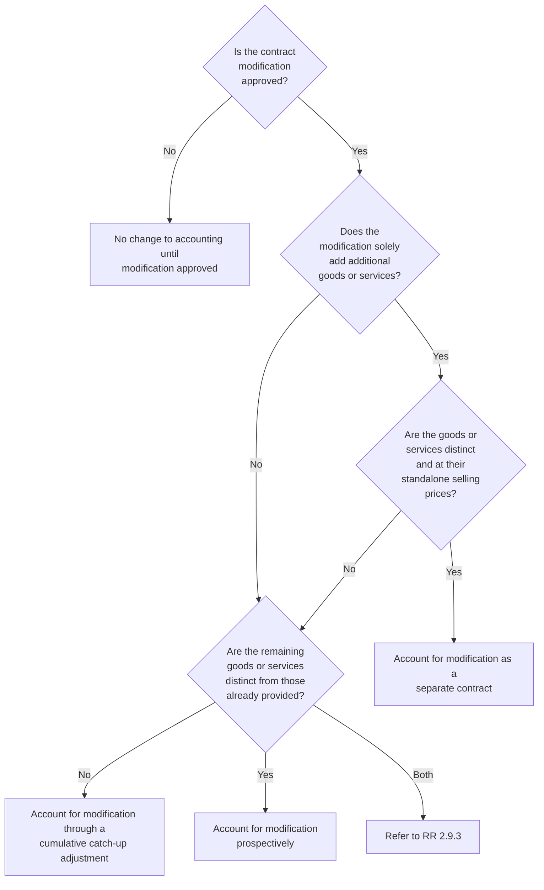

Refer to RR 2.9.3 for discussion of modifications that involve both goods and services that are distinct and those that are not distinct.

#### QUESTION RR 2-5
A reporting entity and its customer agree to terminate an existing contract and enter into a new contract rather than modify the existing contract. Does the contract modification guidance apply in this situation?

***PwC response***
We believe management should apply the contract modification guidance to determine the appropriate accounting if, in substance, the parties have modified the existing contract even if it is structured as a termination of the existing contract and creation of a new contract.

---

#### 2.9.1 Assessing whether a contract modification is approved
A contract modification is approved when the modification creates or changes the enforceable rights and obligations of the parties to the contract. Management will need to determine if a modification is approved either in writing, orally, or implied by customary business practices such that it creates enforceable rights and obligations before accounting for the modification. Management should continue to account for the existing terms of the contract until the modification is approved.

Where the parties to an arrangement have agreed to a change in scope, but not the corresponding change in price (for example, an unpriced change order), the reporting entity should estimate the change to the transaction price in accordance with the guidance on estimating variable consideration (refer to RR 4). Management should assess all relevant facts and circumstances (for example, prior experience with similar modifications) to determine whether there is an expectation that the price will be approved. Example RR 2-14 illustrates a contract modification with an unpriced


PwC US National Office | viewpoint.pwc.com 2-25

change order. This concept is also illustrated in Example 9 of the revenue standard (ASC 606-10-55-134 through ASC 606-10-55-135).

### EXAMPLE RR 2-14
**Contract modifications — unpriced change order**

Contractor enters into a contract with a customer to construct a warehouse. Contractor discovers environmental issues during site preparation that must be remediated before construction can begin. Contractor obtains approval from the customer to perform the remediation efforts, but the price for the services will be agreed to in the future (that is, it is an unpriced change order). Contractor completes the remediation and invoices the customer $2 million, based on the costs incurred plus a profit margin consistent with the overall expected margin on the project.

The invoice exceeds the amount the customer expected to pay, so the customer challenges the charge. Based on consultation with external counsel and the Contractor’s customary business practices, Contractor concludes that performance of the remediation services gives rise to enforceable rights and that the amount charged is reasonable for the services performed.

Is the contract modification approved such that Contractor can account for the modification?

**Analysis**

Yes. Despite the lack of agreement on the specific amount Contractor will receive for the services, the contract modification is approved and Contractor can account for the modification. The scope of work has been approved; therefore, Contractor should estimate the corresponding change in transaction price in accordance with the guidance on variable consideration. Refer to RR 4 for further considerations related to the accounting for variable consideration, including the constraint on variable consideration.

### 2.9.2 Modification is accounted for as a separate contract
Accounting for a modification as a separate contract reflects the fact that there is no economic difference between the reporting entities entering into a separate contract or agreeing to modify an existing contract.

> **Excerpt from ASC 606-10-25-12**
>
> An entity shall account for a contract modification as a separate contract if both of the following conditions are present:
>
> a. The scope of the contract increases because of the addition of promised goods or services that are distinct...
>
> b. The price of the contract increases by an amount of consideration that reflects the entity’s standalone selling prices of the additional promised goods or services and any appropriate adjustments to that price to reflect the circumstances of the particular contract. For example, an entity may adjust the standalone selling price of an additional good or service for a discount that the customer receives, because it is not necessary for the entity to incur the selling-related costs that it would incur when selling a similar good or service to a new customer.


Scope and identifying the contract 2-26

The guidance provides some flexibility in what constitutes “standalone selling price” to reflect the specific circumstances of the contract. For example, a reporting entity may charge a lower renewal price to an existing customer as compared to the price it would charge a new customer because the entity incurs less selling costs related to the renewal contract. The objective is to determine whether the pricing reflects the amount the reporting entity would have negotiated with the specific customer in question, in light of the entity’s relationship with that customer, but independent of other existing contracts.

Example RR 2-15 and Example RR 2-16 illustrate contract modifications that are accounted for as separate contracts. This concept is also illustrated in Example 5 of the revenue standard (ASC 606-10-55-111 through ASC 606-10-55-116).

### EXAMPLE RR 2-15
Contract modifications — sale of additional goods

Manufacturer enters into an arrangement with a customer to sell 100 goods for $10,000 ($100 per good). The goods are distinct and are transferred to the customer over a six-month period. The parties modify the contract in the fourth month to sell an additional 20 goods for $95 each. The price of the additional goods represents the standalone selling price on the modification date.

Should Manufacturer account for the modification as a separate contract?

#### *Analysis*

Yes. The modification to sell an additional 20 goods at $95 each should be accounted for as a separate contract because the additional goods are distinct and the price reflects their standalone selling price. The existing contract would not be affected by the modification.

### EXAMPLE RR 2-16
Contract modifications — blend-and-extend modification

Manufacturer enters into a three-year noncancellable contract to deliver 100 products each year at a fixed price of $90 per unit. Market prices for the products decline in the period following contract inception. At the end of the second year, when the market price is $80 per unit, the parties agree to modify the contract to: (1) extend the sales contract for an additional year (same fixed annual quantity); and (2) lower the sales price to a “blended” rate of $85 per unit for all remaining units ($90 x 100 remaining units from the original contract plus $80 x 100 additional units). Manufacturer concludes the products to be delivered in the future are distinct from those previously delivered and concludes the standalone selling price is $80 per unit.

How should Manufacturer account for the modification?

#### *Analysis*

The “blend-and-extend” modification allows the customer to immediately take advantage of a lower price; however, the substance of the modification in this fact pattern is that the parties agreed to add distinct goods for additional consideration that reflects standalone selling price. It may therefore be appropriate for Manufacturer to account for the modification as a separate contract. Under this approach, Manufacturer would continue to recognize revenue of $90 per unit for the remaining period of the original contract and recognize $80 per unit in the following year.


PwC US National Office | viewpoint.pwc.com 2-27

Management should consider all of the relevant facts and circumstances to determine whether the additional consideration reflects standalone selling price, which may require significant judgment. If the additional consideration does not reflect standalone selling price, the modification should be accounted for as the termination of the existing contract and creation of a new contract, and revenue would be recognized based on the blended price for all units. For example, the additional consideration may not reflect standalone selling price in situations when quantities are variable (as opposed to fixed), prices are expected to change significantly in the future (such that the standalone selling price for future years is expected to differ from the contract price), or the arrangement contains a significant financing component (to provide the benefit of advanced cash flow).

***

### 2.9.3 Modification is not a separate contract
A modification that does not meet both of the criteria to be accounted for as a separate contract is accounted for as an adjustment to the existing contract, either prospectively or through a cumulative catch-up adjustment. The determination depends on whether the remaining goods or services to be provided to the customer under the modified contract are distinct. In some cases, the remaining goods or services might include both (a) goods and services that are distinct from those transferred before the modification, and (b) goods and services that are not distinct. The revenue standard does not provide specific guidance in this situation, but states that effects of the modification should be accounted for in a manner consistent with the objectives in the modification guidance. That is, a reporting entity would apply a combination of the methods described in RR 2.9.3.1 and RR 2.9.3.2, which may require judgment.

### 2.9.3.1 Modification is accounted for prospectively
A reporting entity should account for a modification prospectively if the modification is not a separate contract (as described in RR 2.9.2), but the remaining goods or services are distinct from the goods or services transferred before the modification. This type of contract modification is effectively treated as the termination of the original contract and the creation of a new contract. The contract consideration is allocated to the remaining performance obligations after the modification, including any unsatisfied performance obligations from the original contract. The amount of allocated consideration is the sum of any unrecognized consideration initially included in the transaction price of the contract before the modification and any additional consideration promised as part of the modification. Allocation to the remaining performance obligations should be based on current standalone selling prices since the modification is treated as the creation of a new contract.

A reporting entity will also account for a contract modification prospectively if the contract contains a single performance obligation that comprises a series of distinct goods or services, such as a monthly cleaning service (refer to RR 3.3.2). In other words, the modification will only affect the accounting for the remaining distinct goods and services to be provided in the future, even if the series of distinct goods or services is accounted for as a single performance obligation.

Example RR 2-17 and Example RR 2-18 illustrate contract modifications accounted for prospectively. This concept is also illustrated in Example 7 of the revenue standard (ASC 606-10-55-125 through ASC 606-10-55-128).


Scope and identifying the contract 2-28

**EXAMPLE RR 2-17**
***
Contract modifications — series of distinct services

ServeCo enters into a three-year noncancellable service contract with Customer for $450,000 ($150,000 per year). The standalone selling price for one year of service at inception of the contract is $150,000 per year. ServeCo accounts for the contract as a series of distinct services (refer to RR 3.3.2).

At the end of the second year, the parties agree to modify the contract as follows: (1) the fee for the third year is reduced to $120,000; and (2) Customer agrees to extend the contract for another three years for $300,000 ($100,000 per year). The standalone selling price for one year of service at the time of modification is $120,000.

How should ServeCo account for the modification?

**Analysis**

The modification would be accounted for as if the existing arrangement was terminated and a new contract created (that is, on a prospective basis) because the remaining services to be provided are distinct. The modification should not be accounted for as a separate contract, even though the remaining services to be provided are distinct, because the price of the contract did not increase by an amount of consideration that reflects the standalone selling price of the additional services.

ServeCo should reallocate the remaining consideration to all of the remaining services to be provided (that is, the obligations remaining from the original contract and the new obligations). ServeCo will recognize a total of $420,000 ($120,000 + $300,000) over the remaining four-year service period (one year remaining under the original contract plus three additional years), or $105,000 per year.

**EXAMPLE RR 2-18**
***
Contract modifications — modification accounted for on a prospective basis

Supplier enters into a noncancellable contract with Retailer to supply 100,000 goods on an annual basis for $3 per unit for three years. At the beginning of the third year, Supplier and Retailer agree to renegotiate the contract because the market price for the goods has declined. Under the modified agreement, the parties agree to (1) extend the contract for an additional year (same fixed annual quantity) and (2) reduce the price per unit to $2 for the remaining 200,000 units to be delivered. Supplier also agrees as part of the modification to make a one-time payment of $10,000 to Retailer. There is no dispute between the parties regarding prior performance, and both parties have performed according to the terms of the contract.

Supplier concludes the remaining goods are distinct from those previously delivered and concludes the additional consideration does not reflect standalone selling price.

How should Supplier account for the modification?

**Analysis**

Supplier should account for the modification on a prospective basis. The transaction price of $390,000 ($2 per unit x 200,000 remaining goods less $10,000 payment to Retailer) should be allocated to the remaining performance obligations, resulting in revenue of $1.95 per unit ($390,000 / 200,000 goods). The $10,000 payment to Retailer is a reduction of the transaction price allocated to the remaining goods in this


PwC US National Office | viewpoint.pwc.com 2-29

fact pattern because the payment was made in conjunction with the renegotiation of the contract and there is no indication that the payment relates to prior performance.

In contrast, if there was evidence of a dispute or failure to perform according to the contract terms related to the previously delivered goods, this might indicate that Supplier agreed to make a concession that reduces the transaction price for the previously delivered goods. In that case, the amount that represents a concession would be recorded immediately. Determining when a portion of a modification is in substance a price concession could require significant judgment. This concept is illustrated in Example 5, Case B of the revenue standard (ASC 606-10-55-114 through ASC 606-10-55-116).

#### QUESTION RR 2-6
Should an existing contract asset be written off as a reduction of revenue when a modification is accounted for as the termination of the original contract and creation of a new contract?

**PwC response**

Generally, no. Although the original contract is considered "terminated," modifications of this type should be accounted for on a prospective basis. That is, the contract asset would typically relate to a right to consideration for goods and services that have already been transferred. Management should consider, however, whether the facts and circumstances of the modification result in an impairment of the contract asset. Refer to US Revenue TRG Memo No. 51 and the related meeting minutes in Revenue TRG Memo No. 55 for further discussion of this topic.

### 2.9.3.2 Modification results in a cumulative catch-up adjustment
A reporting entity accounts for a modification through a cumulative catch-up adjustment if the remaining goods or services after the modification are not distinct from the goods or services transferred prior to the modification. For example, this guidance would apply to a contract that contains a single performance obligation and is modified when the performance obligation is partially satisfied. A reporting entity first updates the measure of progress and transaction price of the contract based on changes to scope or price as a result of the modification. The cumulative catch-up adjustment is calculated by applying the revised measure of progress to the revised transaction price, which could result in an immediate increase to or a reduction of revenue in the period of the modification. This concept is illustrated in Example 8 of the revenue standard (ASC 606-10-55-129 through ASC 606-10-55-133).

Modifications of contracts that include a single performance obligation that is a series of distinct goods or services will not be accounted for using a cumulative catch-up adjustment; rather, these modifications will be accounted for prospectively (refer to RR 2.9.3.1).

Example RR 2-19 illustrates a contract modification accounted for through a cumulative catch-up adjustment.

#### EXAMPLE RR 2-19
Contract modifications — cumulative catch-up adjustment

Builder enters into a two-year arrangement with Customer to build a manufacturing facility for $300,000. The construction of the facility is a single performance obligation. Builder and Customer agree to modify the original floor plan at the end of


Scope and identifying the contract 2-30

the first year, which will increase the transaction price and expected cost by approximately $100,000 and $75,000, respectively.

How should Builder account for the modification?

**Analysis**

Builder should account for the modification as if it were part of the original contract. The modification does not create a performance obligation because the remaining goods and services to be provided under the modified contract are not distinct. Builder should update its estimate of the transaction price and its measure of progress to account for the effect of the modification. This will result in a cumulative catch-up adjustment at the date of the contract modification.

---

### 2.9.4 Changes in the transaction price
A contract modification that only affects the transaction price is either accounted for prospectively or on a cumulative catch-up basis. It is accounted for prospectively if the remaining goods or services are distinct. There is a cumulative catch-up if the remaining goods or services are not distinct. Thus, a contract modification that only affects the transaction price is accounted for like any other contract modification.

The transaction price might also change as a result of changes in circumstances or the resolution of uncertainties. Changes in the transaction price that do not arise from a contract modification are addressed in RR 4.3.4 and RR 5.5.2.

The accounting can be complex if the transaction price changes as a result of a change in circumstances or changes in variable consideration after a contract has been modified. The revenue standard provides guidance and an example to address this situation.

> **Excerpt from ASC 606-10-32-45**
>
> a. An entity shall allocate the change in the transaction price to the performance obligations identified in the contract before the modification if, and to the extent that, the change in the transaction price is attributable to an amount of variable consideration promised before the modification and the modification is accounted for [as if it were a termination of the existing contract and the creation of a new contract].
>
> b. In all other cases in which the modification was not accounted for as a separate contract..., an entity shall allocate the change in the transaction price to the performance obligations in the modified contract (that is, the performance obligations that were unsatisfied or partially unsatisfied immediately after the modification).

Example 6 in the revenue standard (ASC 606-10-55-117 through ASC 606-10-55-124) illustrates the accounting for a change in the transaction price after a contract modification.

### 2.9.5 Modifications that reduce the scope of a contract
As described in RR 2.9.2, a modification is accounted for as a separate contract only if distinct goods or services are added to the contract for a price equal to standalone selling price (adjusted for contract-specific circumstances). Modifications that reduce the scope of a contract would not be accounted for as a separate contract because


PwC US National Office | viewpoint.pwc.com 2-31

they do not solely add distinct goods or services to the contract. Therefore, the accounting for a modification that reduces the scope of a contract depends on whether the remaining goods or services are distinct from the goods or services transferred before the modification:

- If the remaining goods or services are distinct (including goods or services that are part of a series), the modification is accounted for prospectively as if it were a termination of the existing contract and creation of a new contract. Refer to RR 2.9.3.1.
- If the remaining goods or services are not distinct (for example, a single performance obligation is being modified), the modification is accounted for on a cumulative catch-up basis. Refer to RR 2.9.3.2.

### QUESTION RR 2-7
It is common for vendors to receive a one-time payment from a customer as consideration for reducing the scope of a contract (e.g., reducing the term or volume of committed purchases). Should a reporting entity recognize these one-time payments as revenue on the contract modification date?

***PwC response***
Typically, no. Although these payments are sometimes labeled "termination payments," the modification guidance should be applied because the contract has not been terminated:

- If the modification is accounted for prospectively, the payment is included in the contract consideration allocated to the remaining performance obligations after the modification. In other words, the payment is recognized as revenue as the remaining goods or services are transferred.
- If the modification is accounted for on a cumulative catch-up basis, the payment is included in the revised transaction price used to calculate the cumulative catch-up adjustment.

If the modification arises from a dispute such as a claim for additional consideration related to past performance, the reporting entity might conclude that all or a portion of the payment relates to goods or services transferred before the modification. In this situation, the reporting entity would recognize revenue immediately for the portion of the payment attributable to goods or services previously transferred to the customer.


Scope and identifying the contract 2-32

The image shows a decorative header composed of various overlapping rounded rectangular shapes and circles in shades of grey, pink, and orange. Some shapes are solid, while others are outlined.

# Chapter 3: Identifying performance obligations—updated March 2024

## 3.1 Overview—identifying performance obligations

The second step in accounting for a contract with a customer is identifying the performance obligations. Performance obligations are the unit of account for purposes of applying the revenue standard and therefore form the basis for how and when revenue is recognized. Identifying the performance obligations requires judgment in some situations to determine whether multiple promised goods or services in a contract should be accounted for separately or as a group. The revenue standard provides guidance to help reporting entities develop an approach that best reflects the economic substance of a transaction.

## 3.2 Promises in a contract

Promises in a contract can be explicit, or implicit if the promises create a valid expectation that the reporting entity will provide a good or service based on the reporting entity’s customary business practices, published policies, or specific statements. It is therefore important to understand a reporting entity’s policies and practices, representations made during contract negotiations, marketing materials, and business strategies when identifying the promises in an arrangement.

Promised goods or services include, but are not limited to:

*   [ ] Transferring produced goods or reselling purchased goods
*   [ ] Arranging for another party to transfer goods or services
*   [ ] Standing ready to provide goods or services in the future (refer to RR 3.2.3)
*   [ ] Building, designing, manufacturing, or creating an asset on behalf of a customer
*   [ ] Granting a right to use or access to intangible assets, such as intellectual property (refer to RR 9.5)
*   [ ] Granting an option to purchase additional goods or services that provides a material right to the customer (refer to RR 3.5)
*   [ ] Performing contractually agreed-upon tasks

### 3.2.1 Immaterial promises

The revenue standard states that a reporting entity is not required to separately account for promised goods or services that are immaterial in the context of the contract.

> **ASC 606-10-25-16A**
>
> An entity is not required to assess whether promised goods or services are performance obligations if they are immaterial in the context of the contract with the customer. If the revenue related to a performance obligation that includes goods or services that are immaterial in the context of the contract is recognized before those immaterial goods or services are transferred to the customer, then the related costs to transfer those goods or services shall be accrued.


Identifying performance obligations 3-2

# ASC 606-10-25-16B

An entity shall not apply the guidance in paragraph 606-10-25-16A to a customer option to acquire additional goods or services that provides the customer with a material right, in accordance with paragraphs 606-10-55-41 through 55-45.

Assessing whether promised goods or services are immaterial in the context of the contract requires judgment. Management should consider the nature of the contract and the relative significance of a particular promised good or service to the arrangement as a whole. Management should evaluate both quantitative and qualitative factors, including the customer's perspective, in this assessment. For example, if a promised good or service is featured prominently in the reporting entity's marketing materials, this likely indicates that the good or service is not immaterial from the customer's perspective. If multiple goods or services are considered to be individually immaterial in the context of the contract, but those items are material in the aggregate, management should not disregard those goods or services when identifying performance obligations.

If revenue is recognized prior to transferring immaterial goods or services, the related costs should be accrued. The requirement to accrue costs related to immaterial promises only applies to items that are, in fact, promises to the customer. For example, costs that will be incurred to operate a call desk that is broadly available to answer questions about a product would typically not be accrued as this activity would not fulfill a promise to a customer.

### 3.2.2 Implicit promises

The customer's perspective should be considered when assessing whether an implicit promise gives rise to a performance obligation. Customers might make current purchasing decisions based on expectations implied by a reporting entity's customary business practices or marketing activities. A performance obligation exists if there is a valid expectation, based on the facts and circumstances, that additional goods or services will be delivered for no additional consideration.

Customers develop their expectations based on written contracts, customary business practices of certain reporting entities, expected behaviors within certain industries, and the way products are marketed and sold. Customary business practices vary between reporting entities, industries, and jurisdictions. They also vary between classes of customers, nature of the product or service, and other factors. Management will therefore need to consider the specific facts and circumstances of each arrangement to determine whether implied promises exist.

Implied promises made by the reporting entity to the customer in exchange for the consideration promised in the contract do not need to be enforceable by law in order for them to be evaluated as a performance obligation. This is in contrast to optional customer purchases in exchange for additional consideration, which are not included as performance obligations in the current contract unless the customer option provides a material right (refer to RR 3.5). Implied promises can create a performance obligation under a contractual agreement, even when enforcement is not assured because the customer has an expectation of performance by the reporting entity. The boards noted in the basis for conclusions to the revenue standard that failing to account for these implied promises could result in all of the revenue being recognized even when the reporting entity has unsatisfied promises with the customer. Example 12 in the revenue standard (ASC 606-10-55-151 through ASC 606-10-55-157) illustrates a contract containing an implicit promise to provide services.


PwC US National Office | viewpoint.pwc.com 3-3

### 3.2.3 Promises to stand ready
One type of promise in a contract is a promise to stand ready to provide goods or services in the future (“stand-ready obligations”). Stand-ready obligations generally arise when a reporting entity is obligated to provide an unspecified quantity of a good or service to a customer for a specified period of time. That is, the nature of the promise is to provide the customer with access to goods or services (e.g., when-and-if available or as needed). Arrangements that include a specified quantity of goods and services generally contain a promise to transfer the individual goods or services rather than a promise to stand ready. An example of a stand-ready obligation is a promise to provide an unspecified number of updates or upgrade to a software license on a when-and-if-available basis. In contrast, a promise to provide one or more specified upgrades to a software license is not a stand-ready obligation.

Arrangements that require the customer to make an additional purchasing decision generally do not contain a promise to stand ready. An example is a supply agreement that obligates the reporting entity to deliver products when the customer decides to make a purchase and submits a purchase order. Although the reporting entity is obligated to fulfill the purchase order when it is submitted, the nature of the promise to the customer is to transfer products, not to provide a service of standing ready. Refer to RR 3.5 for further discussion of options to purchase additional goods or services.

Judgment may be required to determine whether a contract includes a stand-ready obligation. Refer to Revenue TRG Memo No. 16 and the related meeting minutes in Revenue TRG Memo No. 25 for further discussion and examples of stand-ready obligations.

As discussed in Question RR 3-2, stand-ready obligations typically meet the criteria to be accounted for as a series of distinct goods or services and therefore, a single performance obligation. Refer to RR 6.4.3 for considerations regarding recognition of revenue for stand-ready obligations.

## 3.3 Identifying performance obligations
A performance obligation is a promise to provide a distinct good or service or a series of distinct goods or services as defined by the revenue standard.

> **Excerpt from ASC 606-10-25-14**
>
> At contract inception, an entity shall assess the goods or services promised in a contract with a customer and shall identify as a performance obligation each promise to transfer to the customer either:
>
> a. A good or service (or a bundle of goods or services) that is distinct
>
> b. A series of distinct goods or services that are substantially the same and that have the same pattern of transfer to the customer

### 3.3.1 Promise to transfer a distinct good or service
Each distinct good or service that a reporting entity promises to transfer is a performance obligation (refer to RR 3.4 for guidance on assessing whether a good or service is distinct). Goods and services that are not distinct are bundled with other goods or services in the contract until a bundle of goods or services that is distinct is created. The bundle of goods or services in that case is a single performance obligation. Refer to RR 3.6.4 for discussion of an accounting policy election to


Identifying performance obligations | 3-4

account for certain shipping and handling activities. Refer to RR 8.4.4 for discussion of a practical expedient available to non-public franchisors related to certain pre-opening services.

### 3.3.2 Promise to transfer a series of distinct goods or services
A series of distinct goods or services provided over a period of time is a single performance obligation if the distinct goods or services are substantially the same and have the same pattern of transfer to the customer. The guidance sets out criteria for determining whether a series of distinct goods or services has the "same pattern of transfer."

> **Excerpt from ASC 606-10-25-15**
>
> A series of distinct goods or services has the same pattern of transfer to the customer if both of the following criteria are met:
>
> a. Each distinct good or service in the series that the entity promises to transfer to the customer would meet the criteria...to be a performance obligation satisfied over time.
>
> b. ...the same method would be used to measure the entity's progress toward complete satisfaction of the performance obligation to transfer each distinct good or service in the series to the customer.

A series can consist of distinct time increments of service (for example, a series of daily or monthly services). Examples of promises to transfer a series of distinct services could include certain maintenance services, software-as-a-service (SaaS), transaction processing, IT outsourcing, licenses that provide a right to access IP (refer to RR 9), and asset management services if the service being provided each time period is substantially the same.

In contrast, a service for which each day incorporates the previous day's effort toward achieving an end result would generally not be a series of distinct services because the service being performed each time period is not substantially the same. Examples of this type of service could include certain consulting services, engineering services, and research and development (R&D) efforts.

While the aforementioned examples relate to services, the series guidance also applies to goods as long as the criteria to be a performance obligation satisfied over time are met for the individual distinct goods within the series.

A reporting entity is required to account for a series of distinct goods or services as one performance obligation if the criteria are met (the "series guidance"), even though the underlying goods or services are distinct. Judgment will often be needed to determine whether the criteria for applying the series guidance are met.

Management will apply the principles in the revenue standard to the single performance obligation when the series criteria are met, rather than the individual goods or services that make up the single performance obligation. The exception is that management should consider each distinct good or service in the series, rather than the single performance obligation, when accounting for contract modifications and allocating variable consideration. Refer to further discussion on contract modifications in RR 2.9 and allocating variable consideration to a series of distinct goods or services in RR 5.5.1.1.


PwC US National Office | viewpoint.pwc.com 3-5

The series guidance is intended to simplify the application of the revenue model to arrangements that meet the criteria; however, application of the series guidance is not optional. The assessment of whether a contract includes a series could impact both the allocation of revenue and timing of recognition. This is because the series guidance requires that goods and services in the series be accounted for as a single performance obligation. As a result, revenue is not allocated to each distinct good or service based on relative standalone selling price. Management will instead determine a measure of progress for the single performance obligation that best depicts the transfer of goods or services to the customer. Refer to further discussion of measures of progress in RR 6.4. Additionally, refer to Revenue TRG Memo No. 27 and the related meeting minutes in Revenue TRG Memo No. 34 for further discussion of this topic.

### QUESTION RR 3-1
Could a continuous service (for example, hotel management services) qualify as a series of distinct services if the underlying activities performed by the reporting entity vary from day to day (for example, employee management, accounting, procurement, etc.)?

**PwC response**
Possibly. The series guidance requires each distinct good or service to be "substantially the same." Management should evaluate this requirement based on the nature of its promise to the customer. For example, a promise to provide hotel management services for a specified contract term could meet the series criteria. This is because the reporting entity is providing the same service of "hotel management" each period, even though some of the underlying activities may vary each day. The underlying activities (for example, reservation services, property maintenance) are activities to fulfill the hotel management service rather than separate promises. The distinct service within the series is each time increment of performing the service (for example, each day or month of service). Example 12A in ASC 606-10-55-157B through ASC 606-10-55-158 illustrates this concept. Also refer to Revenue TRG Memo No. 39 and the related meeting minutes in Revenue TRG Memo No. 44 for further discussion.

### QUESTION RR 3-2
Is a promise to stand ready to provide goods or services (that is, a "stand-ready obligation") a series of distinct goods or services?

**PwC response**
Yes. A stand-ready obligation will typically meet the criteria to be accounted for as a series of distinct goods or services because each time interval during which the reporting entity provides a service of standing ready is distinct from and substantially similar to all of the time intervals during the contract. Management will need to apply judgment to determine whether the nature of a reporting entity's promise is to stand ready to provide goods or services or a promise to provide specified goods or services. Refer to RR 3.2.3 and RR 6.4.3.

### QUESTION RR 3-3
Is it always acceptable to use a time-based measure of progress (that is, straight-line recognition) for a performance obligation that is a series of distinct goods or services?


Identifying performance obligations 3-6

**PwC response**
No. It is not appropriate to default to a time-based measure of progress for a series; however, straight-line recognition over the contract period will be reasonable in many cases. Management should select the method that best depicts the reporting entity’s progress in transferring control of the goods or services. Refer to RR 6.4.

### QUESTION RR 3-4
Do goods and services need to be delivered consecutively to qualify as a series of distinct goods or services?

**PwC response**
No. There is no requirement to deliver goods or services consecutively to qualify as a series of distinct goods or services. The series guidance could apply despite gaps in performance or concurrent transfer of individual distinct goods or services within the series. Refer to Revenue TRG Memo No. 27 and the related meeting minutes in Revenue TRG Memo No. 34 for further discussion of this topic.

Example RR 3-1 illustrates a contract that includes a series of distinct goods. See Examples 7 and 31 in the revenue standard (ASC 606-10-55-125 through ASC 606-10-55-128 and ASC 606-10-55-248 through ASC 606-10-55-250) for additional illustration of a series of distinct goods or services.

### EXAMPLE RR 3-1
Series of distinct goods – a single performance obligation

Contract Manufacturer has a contract to provide 50 units of Product A over a 36-month period. Product A is fully developed such that design services are not included in the contract.

Contract Manufacturer has concluded that each unit is a distinct good. An individual unit meets the criteria to be recognized over time because it has no alternative use and Contract Manufacturer has the right to payment for its performance as the goods are manufactured (refer to RR 6.3).

How many performance obligations are in the contract?

**Analysis**

The promise to provide 50 units of Product A is a single performance obligation. The contract is a series of distinct goods because (a) each unit is substantially the same, (b) each unit would meet the criteria to be a performance obligation satisfied over time, and (c) the same method would be used to measure the reporting entity’s progress to depict the transfer of each unit. If any of these criteria were not met, each unit would be a separate performance obligation.

## 3.4 Assessing whether a good or service is “distinct”
Each distinct good or service is a performance obligation. Performance obligations are the unit of account for purposes of applying the revenue standard and form the basis for how and when revenue is recognized. When there are multiple promises in a contract, management will need to determine whether goods or services are distinct, and therefore separate performance obligations. The assessment of whether a good or service is distinct is a two-pronged test; the good or service must be both: (1) capable of being distinct and (2) separately identifiable.


PwC US National Office | viewpoint.pwc.com 3-7

> **ASC 606-10-25-19**
>
> A good or service that is promised to a customer is distinct if both of the following criteria are met:
>
> a. The customer can benefit from the good or service either on its own or together with other resources that are readily available to the customer (that is, the good or service is capable of being distinct).
>
> b. The entity’s promise to transfer the good or service to the customer is separately identifiable from other promises in the contract (that is, the promise to transfer the good or service is distinct within the context of the contract).

### 3.4.1 Capable of being distinct
A good or service is capable of being distinct if the customer can benefit from that good or service on its own or with other resources that are readily available. A customer can benefit from a good or service if it can be used, consumed, or sold (for an amount greater than scrap value) to generate economic benefits. A good or service is also typically capable of being distinct if a reporting entity regularly sells that good or service on a standalone basis.

A good or service that cannot be used on its own, but can be used with readily available resources, also meets this criterion, as the reporting entity has the ability to benefit from it. Readily available resources are goods or services that are sold separately, either by the reporting entity or by others in the market. Readily available resources also include resources that the customer has already obtained, either from the reporting entity or through other means. As a result, the timing of delivery of goods or services (that is, whether a necessary resource is delivered before or after another good or service) can impact the assessment of whether the customer can benefit from the good or service.

“Capable of being distinct” is only the first criterion of the distinct assessment. Management will also have to assess whether the promised good or service is “separately identifiable” from other goods or services in the contract (refer to RR 3.4.2).

Examples 10 and 11 of the revenue standard (ASC 606-10-55-137 through ASC 606-10-55-150K) illustrate the assessment of whether a good or service is capable of being distinct.

### 3.4.2 Separately identifiable
After determining that a good or service is capable of being distinct, the next step is assessing whether the good or service is separately identifiable from other promises in the contract.

> **ASC 606-10-25-21**
>
> In assessing whether an entity’s promises to transfer goods or services to the customer are separately identifiable...the objective is to determine whether the nature of the promise, within the context of the contract, is to transfer each of those goods or services individually or, instead, to transfer a combined item or items to which the promised goods or services are inputs. Factors that indicate that two or more promises to transfer goods or services to a customer are not separately


Identifying performance obligations 3-8

identifiable include, but are not limited to, the following:

a. The entity provides a significant service of integrating the goods or services with other goods or services promised in the contract into a bundle of goods or services that represent the combined output or outputs for which the customer has contracted. In other words, the entity is using the goods or services as inputs to produce or deliver the combined output or outputs specified by the customer. A combined output or outputs might include more than one phase, element, or unit.

b. One or more of the goods or services significantly modifies or customizes, or are significantly modified or customized by, one or more of the other goods or services promised in the contract.

c. The goods or services are highly interdependent or highly interrelated. In other words, each of the goods or services is significantly affected by one or more of the other goods or services in the contract. For example, in some cases, two or more goods or services are significantly affected by each other because the entity would not be able to fulfill its promise by transferring each of the goods or services independently.

The factors are intended to help a reporting entity determine whether its performance in transferring multiple goods or services in a contract is fulfilling a single promise to a customer. The factors above are not an exhaustive list and should also not be used as a checklist.

Understanding what a customer expects to receive as a final product is necessary to assess whether a good or service is separately identifiable or whether it should be combined with other goods or services into a single performance obligation. Some contracts contain a promise to deliver multiple goods or services, but the customer is not purchasing the individual items. Rather, the customer is purchasing the final good or service (the combined item or items) that those individual items (the inputs) create when they are combined. Judgment is needed to determine whether there is a single performance obligation or multiple separate performance obligations. Management needs to consider the terms of the contract and all other relevant facts, including the economic substance of the transaction, to make this assessment. Management should also consider how the goods and services are marketed to the customer; however, management cannot solely rely on this evidence. For example, describing an arrangement as a "solution" in marketing materials does not, on its own, support a conclusion that there is a single performance obligation.

Management should consider whether the combined item is greater than, or substantially different from, the sum of the individual goods and services. In other words, management should consider whether there is a transformative relationship between the goods or services in the process of fulfilling the contract. For example, a contract to construct a wall could include promises to provide labor, lumber, and sheetrock. The individual inputs (the labor, lumber, and sheetrock) are being used to create a combined item (the wall) that is substantially different from the sum of the individual inputs. The promise to construct a wall is therefore a single performance obligation in this example.

The assessment of the "highly interdependent or highly interrelated" factor may require significant judgment. The goods and services in a contract should not be combined solely because one of the goods or services would not have been purchased without the others. For example, a contract that includes delivery of equipment and routine installation is not necessarily a single performance obligation


PwC US National Office | viewpoint.pwc.com 3-9

even though the customer would not purchase the installation if it had not purchased the equipment. The fact that the one item depends on the other (in this example, the installation cannot be performed without the customer first purchasing the equipment) does not, on its own, support a conclusion that there is a single performance obligation. In other words, a “two-way” dependency between two elements in a contract is necessary to conclude they are highly interdependent or highly interrelated.

Management should also consider whether the reporting entity could fulfill its promise to provide a good or service if it did not provide other goods or services identified in the contract. If the reporting entity’s performance in providing a good or service in the contract would differ significantly if it did not provide the other goods or services, this may indicate that the goods or services are highly interdependent or highly interrelated and therefore, are not separately identifiable. Similarly, if the intended contractual benefit to the customer depends on the reporting entity transferring multiple goods and services, this may indicate those goods and service are highly interdependent or highly interrelated.

Example RR 3-2, Example RR 3-3, Example RR 3-4, and Example RR 3-5 illustrate the application of the “separately identifiable” guidance. This concept is also illustrated in Examples 10 and 11 of the revenue standard (ASC 606-10-55-137 through ASC 606-10-55-150K). Refer to RR 9.3 for discussion of assessing whether a license of intellectual property promised in a contract is distinct.

### EXAMPLE RR 3-2
Distinct goods or services — bundle of goods or services are combined

Contractor enters into a contract to build a house for a new homeowner. Contractor is responsible for the overall management of the project and identifies various goods and services that are provided, including architectural design, site preparation, construction of the home, plumbing and electrical services, and finish carpentry. Contractor regularly sells these goods and services individually to customers.

How many performance obligations are in the contract?

#### *Analysis*

The bundle of goods and services should be combined into a single performance obligation in this fact pattern. The promised goods and services are capable of being distinct because the homeowner could benefit from the goods or services either on their own or together with other readily available resources. This is because Contractor regularly sells the goods or services separately to other homeowners and the homeowner could generate economic benefit from the individual goods and services by using, consuming, or selling them.

However, the goods and services are not separately identifiable from other promises in the contract. Contractor’s overall promise in the contract is to transfer a combined item (the house) to which the individual goods or services are inputs. This conclusion is supported by the fact that Contractor provides a significant service of integrating the various goods and services into the home that the homeowner has contracted to purchase.


Identifying performance obligations | 3-10

### EXAMPLE RR 3-3
Distinct goods or services — bundle of goods or services are not combined

SoftwareCo enters into a contract with a customer to provide a perpetual software license, installation services, and three years of postcontract customer support (unspecified future upgrades and telephone support). The installation services require the reporting entity to configure certain aspects of the software, but do not significantly modify the software. These services do not require specialized knowledge, and other sophisticated software technicians could perform similar services. The upgrades and telephone support do not significantly affect the software’s benefit or value to the customer.

How many performance obligations are in the contract?

#### *Analysis*

There are four performance obligations: (1) software license, (2) installation services, (3) unspecified future upgrades, and (4) telephone support.

The customer can benefit from the software (delivered first) because it is functional without the installation services, unspecified future upgrades, or the telephone support. The customer can benefit from the subsequent installation services, unspecified future upgrades, and telephone support together with the software, which it has already obtained.

SoftwareCo concludes that each good and service is separately identifiable because the software license, installation services, unspecified future upgrades, and telephone support are not inputs into a combined item the customer has contracted to receive. SoftwareCo can fulfill its promise to transfer each of the goods or services separately and does not provide any significant integration, modification, or customization services.

### EXAMPLE RR 3-4
Distinct goods or services — contractual requirement to use the vendor’s service

SoftwareCo enters into a contract with a customer to provide a perpetual software license, installation services, and three years of postcontract customer support (unspecified future upgrades and telephone support). The installation services require the reporting entity to configure certain aspects of the software, but do not significantly modify the software. These services do not require specialized knowledge, and other sophisticated software technicians could perform similar services. The upgrades and telephone support do not significantly affect the software’s benefit or value to the customer. The customer is contractually required to use SoftwareCo’s installation services.

How many performance obligations are in the contract?

#### *Analysis*

The contractual requirement to use SoftwareCo’s installation services does not change the evaluation of whether the goods and services are distinct. SoftwareCo concludes that there are four performance obligations: (1) software license, (2) installation services, (3) unspecified future upgrades, and (4) telephone support.

The customer can benefit from the software (delivered first) because it is functional without the installation services, unspecified future upgrades, or the telephone


PwC US National Office | viewpoint.pwc.com 3-11

support. The customer can benefit from the subsequent installation services, unspecified future upgrades, and telephone support together with the software, which it has already obtained.

SoftwareCo concludes that each good and service is separately identifiable because the software license, installation services, unspecified future upgrades, and telephone support are not inputs into a combined item the customer has contracted to receive. SoftwareCo can fulfill its promise to transfer each of the goods or services separately and does not provide any significant integration, modification, or customization services.

### EXAMPLE RR 3-5
#### Distinct goods or services — bundle of goods or services are combined

SoftwareCo enters into a contract with a customer to provide a perpetual software license, installation services, and three years of postcontract customer support (unspecified future upgrades and telephone support). The installation services require SoftwareCo to substantially customize the software by adding significant new functionality enabling the software to function with other computer systems owned by the customer. The upgrades and telephone support do not significantly affect the software’s benefit or value to the customer.

How many performance obligations are in the contract?

#### *Analysis*

There are three performance obligations: (1) license to customized software, (2) unspecified future upgrades, and (3) telephone support.

SoftwareCo determines that the promise to the customer is to provide a customized software solution. The software and customization services are inputs into the combined item for which customer has contracted and, as a result, the software license and installation services are not separately identifiable and should be combined into a single performance obligation. This conclusion is further supported by the fact that SoftwareCo is performing a significant service of integrating the licensed software with the customer’s other computer systems. The nature of the installation services also results in the software being significantly modified and customized by the service.

The unspecified future upgrades and telephone support are separate performance obligations because they are not inputs into a combined item the customer has contracted to receive. SoftwareCo can fulfill its promise to transfer each of the goods or services separately and does not provide any significant integration, modification, or customization services.

---

## 3.5 Options to purchase additional goods or services
Contracts frequently include options for customers to purchase additional goods or services in the future. Customer options that provide a material right to the customer (such as a free or discounted good or service) give rise to a separate performance obligation. In this case, the performance obligation is the option itself, rather than the underlying goods or services. Management will allocate a portion of the transaction price to such options, and recognize revenue allocated to the option when the additional goods or services are transferred to the customer, or when the option expires. Refer to RR 7 for further considerations related to customer options.


Identifying performance obligations 3-12

The additional consideration that would result from a customer exercising an option in the future is not included in the transaction price for the current contract. This is the case even if management concludes it is probable, or even virtually certain, that the customer will purchase additional goods or services. For example, customers could be economically compelled to make additional purchases due to exclusivity clauses or other facts and circumstances. Management should not include an estimate of future purchases as a promise in the current contract unless those purchases are enforceable by law regardless of the probability that the customer will make additional purchases. Judgment may be required to identify the enforceable rights and obligations in a contract, as well as the existence of implied or explicit contracts that should be combined with the present contract.

Judgment may also be required to distinguish optional goods or services from promises to provide goods or services in exchange for a variable fee. An example is a contract to deliver a photocopy machine to a customer in exchange for a fee based on the number of copies made by the customer. In this example, the promise to the customer is to transfer the machine. The number of photocopies that the customer will make is unknown at contract inception; however, the customer’s future actions (that create photocopies) are not a separate buying decision to purchase additional distinct goods or services from the reporting entity. The fee in this case is variable consideration (refer to RR 4.3 for further discussion).

In contrast, consider a contract to deliver a photocopy machine that also provides pricing for replacement ink cartridges that the customer can elect to purchase in the future. The future purchases of ink cartridges are options to purchase goods in the future and, therefore, should not be considered a promise in the current contract. The reporting entity should evaluate, however, whether the customer option provides a material right. Refer to Revenue TRG Memo No. 48 and the related meeting minutes in Revenue TRG Memo No. 49 for further discussion of this topic.

The assessment of whether future purchases are optional could have a significant impact on the accounting for a contract when the transaction price is allocated to multiple performance obligations. Disclosures are also affected. For example, reporting entities would not include optional goods or services in their disclosures of the remaining transaction price for a contract and the expected periods of recognition. Refer to FSP 33.4 for further discussion of the disclosure requirements.

Example RR 3-6 illustrates the assessment of whether goods and services are optional purchases.

### EXAMPLE RR 3-6
Optional purchases — sale of equipment and consumables

DeviceCo, a medical device company, sells a highly complex surgical instrument and consumables that are used in conjunction with the instrument. DeviceCo sells the instrument for $100,000 and the consumables for $100 per unit. A customer purchases the instrument, but does not commit to any specific level of consumable purchases. The customer cannot operate the instrument without the consumables and cannot purchase the consumables from any other vendor. DeviceCo expects that the customer will purchase 1,000 consumables each year throughout the estimated life of the instrument. DeviceCo concludes that the instrument and the consumables are distinct.

Should DeviceCo include the estimated consumable purchases as a performance obligation in the current contract?


PwC US National Office | viewpoint.pwc.com 3-13

***Analysis***

DeviceCo should not include the estimated consumable purchases as part of the current contract as they are optional purchases. Even though the customer needs the consumables to operate the instrument, there is no enforceable obligation for the customer to make the purchases. The customer makes a decision to purchase additional distinct goods each time it submits a purchase order for consumables.

DeviceCo should consider whether the option to purchase consumables in the future provides a material right to the customer (for example, if the customer receives a discount on future purchases of the consumables that is incremental to the range of discounts typically given to other customers as a result of entering into the current contract). A material right is accounted for as a performance obligation, as discussed in RR 7.

---

## 3.6 Other contract terms that may not be performance obligations

The assessment of whether certain activities or contract terms create performance obligations requires judgment in some situations.

### 3.6.1 Activities that do not transfer a good or service

Activities that a reporting entity undertakes to fulfill a contract that do not transfer goods or services to the customer are not performance obligations. For example, administrative tasks to set up a contract or mobilization efforts are not performance obligations if those activities do not transfer a good or service to the customer. Judgment may be required to determine whether an activity transfers a good or service to the customer. Figure RR 3-1 illustrates the assessment of whether activities, such as set-up or mobilization, are separate performance obligations.

**FIGURE RR 3-1**
Assessing activities undertaken to fulfill a contract

```mermaid
graph TD
    A[Do the activities transfer good or<br/>service to the customer?] -- No --> B[The activities are not a separate promise<br/>to the customer. Account for them as<br/>costs to fulfill the contract.]
    A -- Yes --> C[Is the promised good or service (1)<br/>capable of being distinct and (2)<br/>separately identifiable from other<br/>promises in the contract?]
    C -- No --> D[The promised good or service is<br/>combined with other promised goods or<br/>services into a single performance<br/>obligation.]
    C -- Yes --> E[Account for the promised good or<br/>service as a separate performance<br/>obligation.]
```

Reporting entities in certain industries undertake pre-production activities, including the design and development of products or the creation of a new technology based


Identifying performance obligations | 3-14

on the needs of a customer. An example is a reporting entity that enters into an arrangement with an auto manufacturer to design and develop tooling prior to the production of automotive parts. Management should first evaluate if the arrangement with the manufacturer, whether in connection with a supply contract or in anticipation of one, is in the scope of the revenue standard; for example, management might conclude the pre-production activities are not a revenue-generating activity because they are not part of the reporting entity’s ongoing major or central operations. Arrangements not in the scope of the revenue standard are subject to other applicable guidance; therefore, any related payments or reimbursements would not be presented as revenue from contracts with customers. For arrangements in the scope of the revenue standard, management should evaluate whether the pre-production activities represent a performance obligation (that is, whether control of a good or service is transferred to the customer). Pre-production activities that do not transfer a good or service to the customer are activities to fulfill the performance obligations in the contract. Refer to Revenue TRG Memo No. 46 and the related meeting minutes in Revenue TRG Memo No. 49 for further discussion of this topic. Additionally, refer to RR 11 for further discussion on accounting for costs to fulfill a contract.

Revenue is not recognized when a reporting entity completes an activity that is not a performance obligation, as illustrated by Example RR 3-7 and Example RR 3-8.

### EXAMPLE RR 3-7
#### Identifying performance obligations — activities

FitCo operates health clubs. FitCo enters into contracts with customers for one year of access to any of its health clubs for $300. FitCo also charges a $50 nonrefundable joining fee to compensate, in part, for the initial activities of registering the customer.

How many performance obligations are in the contract?

**Analysis**

There is one performance obligation in the contract, which is the right provided to the customer to access the health clubs. FitCo’s activity of registering the customer is not a service to the customer and therefore does not represent satisfaction of a performance obligation. Refer to RR 8.4 for considerations related to the treatment of the upfront fee paid by the customer.

### EXAMPLE RR 3-8
#### Identifying performance obligations — activities

CartoonCo is the creator of a new animated television show. It grants a three-year term license to RetailCo for use of the characters’ likenesses on consumer products. RetailCo is required to use the latest image of the characters from the television show. There are no other goods or services provided to RetailCo in the arrangement. When entering into the license agreement, RetailCo reasonably expects CartoonCo to continue to produce the show, develop the characters, and perform marketing to enhance awareness of the characters. RetailCo may start selling consumer products with the characters’ likenesses once the show first airs on television.

How many performance obligations are in the arrangement?


PwC US National Office | viewpoint.pwc.com 3-15

#### *Analysis*

The license is the only performance obligation in the arrangement. CartoonCo’s continued production, internal development of the characters, and marketing of the show are not performance obligations as such additional activities do not directly transfer a good or service to RetailCo. Refer to RR 9 for other considerations related to this example, such as the timing of revenue recognition for the license.

---

### 3.6.2 Exclusivity provisions

Contracts with customers may include exclusivity provisions, such as terms that restrict the reporting entity’s ability to sell goods or services to other customers. Exclusivity provisions generally do not represent a separate performance obligation in a contract. Instead, they are an attribute of the promised good or service that may impact pricing, but do not change the promised goods or services in the contract. This is consistent with the board’s observation in the basis for conclusions to the revenue standard (BC412(b)) that exclusivity provisions included in a license of intellectual property represent an attribute of the license.

There may be instances where payments in the contract are linked to exclusivity provisions. Upfront fees received from a customer for exclusivity are generally included in the transaction price that is allocated to the performance obligations in the contract. Refer to RR 8.4 for further discussion of upfront fees. Payments made to the customer related to an exclusivity provision need to be evaluated under the guidance on consideration payable to a customer. Refer to RR 4.6.

### 3.6.3 Product liability and patent infringement protection

A reporting entity could be required (for example, by law or court order) to pay damages if its products cause damage or harm to others when used as intended. A requirement to pay damages to an injured party is not a separate performance obligation. Such payments should be accounted for in accordance with guidance on loss contingencies. Compensation provided to a customer for failing to comply with the terms of the contract or to resolve customer complaints would generally be accounted for as consideration payable to a customer and recorded as a reduction of revenue (refer to RR 4.3.3.11).

Promises to indemnify a customer against claims of patent, copyright, or trademark infringements are also not separate performance obligations, unless the reporting entity’s business is to provide such protection. These protections are similar to warranties that ensure that the good or service operates as intended. These types of obligations are accounted for in accordance with the guidance on loss contingencies. Refer to RR 8.3 for further considerations related to warranties, including certain types of warranties that are accounted for as performance obligations.

### 3.6.4 Shipping and handling activities — updated October 2024

Arrangements that involve shipment of goods to a customer might include promises related to the shipping service that give rise to a performance obligation. Management should assess the explicit shipping terms to determine when control of the goods transfers to the customer and whether the shipping services are a separate performance obligation.

Shipping and handling services may be considered a separate performance obligation if control of the goods transfers to the customer before shipment, but the reporting entity has promised to ship the goods (or arrange for the goods to be shipped). In contrast, if control of a good does not transfer to the customer before


Identifying performance obligations | 3-16

shipment, shipping is not a promised service to the customer. This is because shipping is a fulfillment activity as the costs are incurred as part of transferring the goods to the customer.

Management should assess whether the reporting entity is the principal or an agent for the shipping service if it is a separate performance obligation. This will determine whether the reporting entity should record the gross amount of revenue allocated to the shipping service or the net amount, after paying the shipper. Refer to RR 10.4 for further consideration related to the presentation of shipping and handling costs within the income statement.

The revenue standard includes an accounting policy election that permits reporting entities to account for shipping and handling activities that occur after the customer has obtained control of a good as a fulfillment cost rather than as an additional promised service. Reporting entities that make this election will recognize revenue when control of the good transfers to the customer. A portion of the transaction price would not be allocated to the shipping service; however, the costs of shipping and handling should be accrued when the related revenue is recognized. Management should apply this election consistently to similar transactions and disclose the use of the election, if material, in accordance with ASC 235, *Notes to Financial Statements*. The policy election should not be applied by analogy to other services.

Figure RR 3-2 summarizes the accounting for shipping and handling activities.

### FIGURE RR 3-2
Accounting for shipping and handling activities

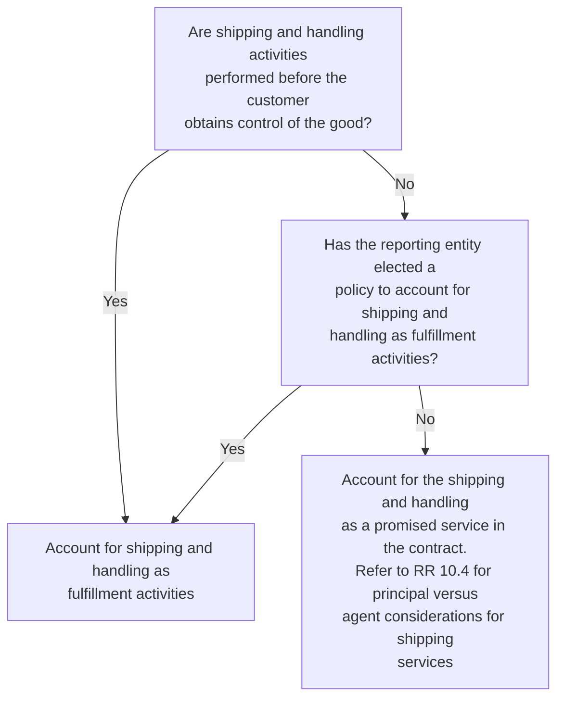

Example RR 3-9 and Example RR 3-10 illustrate the potential accounting outcomes for sale of a product and a promise to ship the product.

### EXAMPLE RR 3-9
Identifying performance obligations — shipping and handling services

Manufacturer enters into a contract with a customer to sell five flat screen televisions.


PwC US National Office | viewpoint.pwc.com 3-17

The customer requests that Manufacturer arrange for delivery of the televisions. The delivery terms state that legal title and risk of loss pass to the customer when the televisions are given to the carrier.

The customer obtains control of the televisions at the time they are shipped and can sell them to another party. Manufacturer is precluded from selling the televisions to another customer (for example, redirecting the shipment) once the televisions are picked up by the carrier at Manufacturer’s shipping dock. Manufacturer does not elect to treat shipping and handling activities as a fulfillment cost.

How many performance obligations are in the arrangement?

### *Analysis*

There are two performance obligations: (1) sale of the televisions and (2) shipping service. The shipping service does not affect when the customer obtains control of the televisions, assuming the shipping service is distinct. Manufacturer will recognize revenue allocated to the sale of the televisions when control transfers to the customer (that is, upon shipment) and recognize revenue allocated to the shipping service when performance occurs.

Since Manufacturer is arranging for the shipment to be performed by another party (that is, a third-party carrier), it must also evaluate whether to record the revenue allocated to the shipping services on a gross basis as principal or on a net basis as agent. Refer to RR 10 for further discussion of the principal versus agent assessment.

#### EXAMPLE RR 3-10
Identifying performance obligations — shipping and handling accounting election

Manufacturer enters into a contract with a customer to sell five flat screen televisions. The customer requests that Manufacturer arrange for delivery of the televisions. The delivery terms state that legal title and risk of loss pass to the customer when the televisions are given to the carrier.

The customer obtains control of the televisions at the time they are shipped and can sell them to another party. Manufacturer is precluded from selling the televisions to another customer (for example, redirecting the shipment) once the televisions are picked up by the carrier at Manufacturer’s shipping dock. Manufacturer elects to account for shipping and handling activities as a fulfillment cost.

How many performance obligations are in the arrangement?

### *Analysis*

There is one performance obligation in the arrangement because Manufacturer has elected to account for shipping and handling activities as a fulfillment cost. Manufacturer will recognize revenue and accrue the shipping and handling costs when control of the televisions transfers to the customer upon shipment. Manufacturer does not need to assess whether it is the principal or agent for the shipping service since the shipping service is not accounted for as a promise in the contract. Manufacturer should disclose its election with its accounting policy disclosures.


Identifying performance obligations | 3-18

# Chapter 4: Determining the transaction price—updated October 2024

The top right of the page features an abstract graphic design consisting of various horizontal rounded bars (pills) and circles in shades of dark grey, light grey, orange, and pink. Some shapes are solid, while others are outlined.

## 4.1 Overview—determining the transaction price

This chapter addresses the third step of the revenue model, which is determining the transaction price in an arrangement. The transaction price in a contract reflects the amount of consideration to which a reporting entity expects to be entitled in exchange for goods or services transferred. The transaction price includes only those amounts to which the reporting entity has rights under the present contract. Management must take into account consideration that is variable, noncash consideration, and amounts payable to a customer to determine the transaction price. Management also needs to assess whether a significant financing component exists in arrangements with customers.

## 4.2 Determining the transaction price

The revenue standard provides the following guidance on determining the transaction price.

> ### ASC 606-10-32-2
>
> An entity shall consider the terms of the contract and its customary business practices to determine the transaction price. The transaction price is the amount of consideration to which an entity expects to be entitled in exchange for transferring promised goods or services to a customer, excluding amounts collected on behalf of third parties (for example, some sales taxes). The consideration promised in a contract with a customer may include fixed amounts, variable amounts, or both.

The transaction price is the amount that a reporting entity allocates to the performance obligations identified in the contract and, therefore, represents the amount of revenue recognized as those performance obligations are satisfied. The transaction price excludes amounts collected on behalf of third parties, such as sales taxes the reporting entity collects on behalf of the government. Refer to RR 10.6 for further discussion of amounts collected from customers on behalf of third parties.

Determining the transaction price can be straightforward, such as where a contract is for a fixed amount of consideration in return for a fixed number of goods or services in a reasonably short timeframe. Complexities can arise where a contract includes any of the following:

[ ] Variable consideration
[ ] A significant financing component
[ ] Noncash consideration
[ ] Consideration payable to a customer

Contractually stated prices for goods or services might not represent the amount of consideration that a reporting entity expects to be entitled to as a result of its customary business practices with customers. For example, management should consider whether the reporting entity has a practice of providing price concessions to customers (refer to RR 4.3.2.4).

The amounts to which the reporting entity is entitled under the contract could in some instances be paid by other parties. For example, a manufacturer might offer a coupon to end customers that will be redeemed by retailers. The retailer should include the consideration received from both the end customer and any reimbursement from the manufacturer in its assessment of the transaction price.


Determining the transaction price 4-2

Management should assume that the contract will be fulfilled as agreed upon and not cancelled, renewed, or modified when determining the transaction price. The transaction price also generally does not include estimates of consideration from the future exercise of options for additional goods and services, because until a customer exercises that right, the reporting entity does not have a right to consideration (refer to RR 3.5). An exception is provided as a practical alternative for customer options that meet certain criteria (for example, certain contract renewals) that allows management to estimate goods or services to be provided under the option when determining the transaction price (refer to RR 7.3).

The transaction price is generally not adjusted to reflect the customer’s credit risk, meaning the risk that the customer will not pay the reporting entity the amount to which the reporting entity is entitled under the contract. The exception is where the arrangement contains a significant financing component, as the financing component is determined using a discount rate that reflects the customer’s creditworthiness (refer to RR 4.4).

Once a contract asset or receivable is recorded, impairment losses relating to a customer’s credit risk are measured based on the guidance in ASC 310, *Receivables* (credit losses are determined based on the guidance in ASC 326, *Financial instruments – credit losses*, once adopted). Management needs to consider whether subsequent billing adjustments or estimates of collection are a change in the transaction price (impacting revenue) or an adjustment to the measurement of the contract asset or receivable under ASC 310 (ASC 326, once adopted). The facts and circumstances specific to the adjustment should be considered, including the reporting entity’s past business practices and ongoing relationship with a customer, to make this determination.

## 4.3 Variable consideration

The revenue standard requires a reporting entity to estimate the amount of variable consideration to which it will be entitled.

> **ASC 606-10-32-5**
>
> If the consideration promised in a contract includes a variable amount, an entity shall estimate the amount of consideration to which the entity will be entitled in exchange for transferring the promised goods or services to a customer.

Variable consideration is common and takes various forms, including (but not limited to) price concessions, volume discounts, rebates, refunds, credits, incentives, performance bonuses, milestone payments, and royalties. A reporting entity’s past business practices can cause consideration to be variable if there is a history of providing discounts or concessions after goods are sold.

Consideration is also variable if the amount a reporting entity will receive is contingent on a future event occurring or not occurring, even though the amount itself is fixed. This might be the case, for example, if a customer can return a product it has purchased. The amount of consideration the reporting entity is entitled to receive depends on whether the customer retains the product or not (refer to RR 8.2 for a discussion of return rights). Similarly, consideration might be contingent upon meeting certain performance goals or deadlines.

The amount of variable consideration included in the transaction price may be constrained in certain situations, as discussed at RR 4.3.2.


PwC US National Office | viewpoint.pwc.com 4-3

#### QUESTION RR 4-1

If a contract contains a promise to provide an unspecified quantity of outputs, but the contractual rate per unit is fixed, is the consideration variable?

**PwC response**
Generally, yes. An example is a promise to provide a service when the rate per hour is fixed, but the total number of hours that will be incurred to fulfill the promise is variable. Refer to Revenue TRG Memo No. 39 and the related meeting minutes in Revenue TRG Memo No. 44 for further discussion of this topic. Judgment may be required to distinguish between a promise with a variable fee and an arrangement permitting the customer to purchase a variable number of goods or services. Refer to RR 3.5 for further discussion of this distinction.

#### QUESTION RR 4-2

If variable consideration meets the criteria in ASC 606-10-32-40 to be allocated entirely to a wholly unsatisfied performance obligation or a distinct good or service in a series, is it necessary to estimate the variable consideration at contract inception?

**PwC response**
It depends. It may not be necessary to estimate variable consideration at contract inception when the variable consideration is allocated entirely to a performance obligation to be satisfied in the future or a distinct good or service in a series. For example, a monthly usage-based fee in a three-year contract to provide a series of monthly services might meet the criteria to be allocated entirely to the month that the related usage occurs. In that case, it would likely not be necessary at contract inception to estimate the total of the monthly usage-based fees for the entire contract term. In other situations, management may need to estimate the variable consideration in order to evaluate the second criterion in ASC 606-10-32-40, which requires an assessment of whether the resulting allocation is consistent with the allocation objective in ASC 606-10-32-28 when considering all of the performance obligations in the contract. Refer to RR 5.5.1 for further discussion of allocating variable consideration.

### 4.3.1 Estimating variable consideration

The objective of determining the transaction price is to predict the amount of consideration to which the reporting entity will be entitled, including amounts that are variable. Management determines the total transaction price, including an estimate of any variable consideration, at contract inception and reassesses this estimate at each reporting date. Management should use all reasonably available information to make its estimate. Judgments made in assessing variable consideration should be disclosed, as discussed in FSP 33.4.

The revenue standard provides two methods for estimating variable consideration.

> **ASC 606-10-32-8**
>
> An entity shall estimate an amount of variable consideration by using either of the following methods, depending on which method the entity expects to better predict the amount of consideration to which it will be entitled:
>
> a. The expected value—The expected value is the sum of probability-weighted amounts in a range of possible consideration amounts. An expected value


Determining the transaction price | 4-4

> may be an appropriate estimate of the amount of variable consideration if an entity has a large number of contracts with similar characteristics.
>
> b. The most likely amount—The most likely amount is the single most likely amount in a range of possible consideration amounts (that is, the single most likely outcome of the contract). The most likely amount may be an appropriate estimate of the amount of variable consideration if the contract has only two possible outcomes (for example, an entity either achieves a performance bonus or does not).

The method used is not a policy choice. Management should use the method that it expects best predicts the amount of consideration to which the reporting entity will be entitled based on the terms of the contract. The method used should be applied consistently throughout the contract. However, a single contract can include more than one form of variable consideration. For example, a contract might include both a bonus for achieving a specified milestone and a bonus calculated based on the number of transactions processed. Management may need to use the most likely amount to estimate one bonus and the expected value method to estimate the other if the underlying characteristics of the variable consideration are different.

### 4.3.1.1 Expected value method
The expected value method estimates variable consideration based on the range of possible outcomes and the probabilities of each outcome. The estimate is the probability-weighted amount based on those ranges. The expected value method might be most appropriate where a reporting entity has a large number of contracts that have similar characteristics. This is because a reporting entity will likely have better information about the probabilities of various outcomes where there are a large number of similar transactions.

Management must, in theory, consider and quantify all possible outcomes when using the expected value method. However, considering all possible outcomes could be both costly and complex. A limited number of discrete outcomes and probabilities can provide a reasonable estimate of the distribution of possible outcomes in many cases.

A reporting entity considers evidence from other, similar contracts by using a "portfolio of data" to develop an estimate when it estimates variable consideration using the expected value method. This, however, is not the same as applying the optional portfolio practical expedient that permits reporting entities to apply the guidance to a portfolio of contracts with similar characteristics (refer to RR 1.2.2). Considering historical experience with similar transactions does not necessarily mean a reporting entity is applying the portfolio practical expedient. Refer to Revenue TRG Memo No. 38 and the related meeting minutes in Revenue TRG Memo No. 44 for further discussion of this topic.

### 4.3.1.2 Most likely amount method
The most likely amount method estimates variable consideration based on the single most likely amount in a range of possible consideration amounts. This method might be the most predictive if the reporting entity will receive one of only two (or a small number of) possible amounts. This is because the expected value method could result in an amount of consideration that is not one of the possible outcomes.


PwC US National Office | viewpoint.pwc.com 4-5

### 4.3.1.3 Examples of estimating variable consideration
Example RR 4-1 and Example RR 4-2 illustrate how the transaction price should be determined when there is variable consideration. This concept is also illustrated in Examples 20 and 21 of the revenue standard (ASC 606-10-55-194 through ASC 606-10-55-200).

#### EXAMPLE RR 4-1
Estimating variable consideration — performance bonus with multiple outcomes

Contractor enters into a contract with Widget Inc to build an asset for $100,000 with a performance bonus of $50,000 that will be paid based on the timing of completion. The amount of the performance bonus decreases by 10% per week for every week beyond the agreed-upon completion date. The contract requirements are similar to contracts Contractor has performed previously, and management believes that such experience is predictive for this contract. Contractor concludes that the expected value method is most predictive in this case.

Contractor estimates that there is a 60% probability that the contract will be completed by the agreed-upon completion date, a 30% probability that it will be completed one week late, and a 10% probability that it will be completed two weeks late.

How should Contractor determine the transaction price?

**Analysis**

The transaction price should include management’s estimate of the amount of consideration to which the reporting entity will be entitled for the work performed.

<table>
  <thead>
    <tr>
        <th>Probability-weighted consideration</th>
        <th></th>
    </tr>
    <tr>
        <th>Total probability-weighted consideration</th>
        <th>$ 147,500</th>
    </tr>
  </thead>
  <tbody>
    <tr>
        <td>$150,000 (fixed fee plus full performance bonus) x 60%</td>
        <td>$ 90,000</td>
    </tr>
    <tr>
        <td>$145,000 (fixed fee plus 90% of performance bonus) x 30%</td>
        <td>$ 43,500</td>
    </tr>
    <tr>
        <td>$140,000 (fixed fee plus 80% of performance bonus) x 10%</td>
        <td>$ 14,000</td>
    </tr>
  </tbody>
</table>

The total transaction price is $147,500 based on the probability-weighted estimate. Contractor will update its estimate at each reporting date.

This example does not consider the potential need to constrain the estimate of variable consideration included in the transaction price. Depending on the facts and circumstances of each contract, a reporting entity might need to constrain its estimate of variable consideration even if it uses the expected value method to determine the transaction price. Refer to RR 4.3.2 for further discussion of application of the constraint on variable consideration.

#### EXAMPLE RR 4-2
Estimating variable consideration — performance bonus with two outcomes

Contractor enters into a contract to construct a manufacturing facility for Auto Manufacturer. The contract price is $250 million plus a $25 million award fee if the facility is completed by a specified date. The contract is expected to take three years


Determining the transaction price 4-6

to complete. Contractor has a long history of constructing similar facilities. The award fee is binary (that is, there are only two possible outcomes) and is payable in full upon completion of the facility. Contractor will receive none of the $25 million fee if the facility is not completed by the specified date.

Contractor believes, based on its experience, that it is 95% likely that the contract will be completed successfully and in advance of the target date.

How should Contractor determine the transaction price?

**Analysis**

It is appropriate for Contractor to use the most likely amount method to estimate the variable consideration. The contract’s transaction price is therefore $275 million, which includes the fixed contract price of $250 million and the $25 million award fee. This estimate should be updated each reporting date.

---

### 4.3.2 Constraint on variable consideration
The revenue standard includes a constraint on the amount of variable consideration included in the transaction price as follows.

> **ASC 606-10-32-11**
>
> An entity shall include in the transaction price some or all of an amount of variable consideration...only to the extent that it is probable that a significant reversal in the amount of cumulative revenue recognized will not occur when the uncertainty associated with the variable consideration is subsequently resolved.

Determining the amount of variable consideration to record, including any minimum amounts as discussed in RR 4.3.2.7, requires judgment. The assessment of whether variable consideration should be constrained is largely a qualitative one that has two elements: the magnitude and the likelihood of a change in estimate. “Probable” is defined as “the future event or events are likely to occur,” which is generally considered a 75% threshold.

Variable consideration is not constrained if the potential reversal of cumulative revenue recognized is not significant. Significance should be assessed at the contract level (rather than the performance obligation level or in relation to the financial position of the reporting entity). Management should therefore consider revenue recognized to date from the entire contract when evaluating the significance of any potential reversal of revenue. Refer to Revenue TRG Memo No. 14 and the related meeting minutes in Revenue TRG Memo No. 25 for further discussion of this topic.

Management should consider not only the variable consideration in an arrangement, but also any fixed consideration to assess the possible significance of a reversal of cumulative revenue. This is because the constraint applies to the cumulative revenue recognized, not just to the variable portion of the consideration. For example, the consideration for a single contract could include both a variable and a fixed amount. Management needs to assess the significance of a potential reversal relating to the variable amount by comparing that possible reversal to the cumulative combined fixed and variable amounts.

The revenue standard provides factors to consider when assessing whether variable consideration should be constrained. All of the factors should be considered and no


PwC US National Office | viewpoint.pwc.com 4-7

single factor is determinative. Judgment should be applied in each case to decide how best to estimate the transaction price and apply the constraint. In performing this assessment, a portfolio of data might be used to estimate the transaction price (refer to RR 4.3.1.1) and used to apply the constraint on variable consideration. In that case, the estimated transaction price might not be a possible outcome of the individual contract. Refer to Example RR 4-7 for an illustration of this fact pattern.

> **Excerpt from ASC 606-10-32-12**
>
> Factors that could increase the likelihood or the magnitude of a revenue reversal include, but are not limited to, any of the following:
>
> a. The amount of consideration is highly susceptible to factors outside the entity’s influence. Those factors may include volatility in a market, the judgment or actions of third parties, weather conditions, and a high risk of obsolescence of the promised good or service.
>
> b. The uncertainty about the amount of consideration is not expected to be resolved for a long period of time.
>
> c. The entity’s experience (or other evidence) with similar types of contracts is limited, or that experience (or other evidence) has limited predictive value.
>
> d. The entity has a practice of either offering a broad range of price concessions or changing the payment terms and conditions of similar contracts in similar circumstances.
>
> e. The contract has a large number and broad range of possible consideration amounts.

### 4.3.2.1 Amount is highly susceptible to external factors
Factors outside a reporting entity’s influence can affect a reporting entity’s ability to estimate the amount of variable consideration. An example is consideration that is based on the movement of a market, such as the value of a fund whose assets are based on stock exchange prices.

Factors outside a reporting entity’s influence could also include the judgment or actions of third parties, including customers. An example is an arrangement where consideration varies based on the customer’s subsequent sales of a good or service. However, the reporting entity could have predictive information that enables it to conclude that variable consideration is not constrained in some scenarios.

The revenue standard also includes a narrow exception that applies only to licenses of intellectual property with consideration in the form of sales- and usage-based royalties. Revenue is recognized at the later of when (or as) the subsequent sale or usage occurs, or when the performance obligation to which some or all of the royalty has been allocated has been satisfied (or partially satisfied) as discussed in RR 4.3.5.

### 4.3.2.2 Uncertainty not expected to be resolved in the near term
A long period of time until the uncertainty is resolved might make it more challenging to determine a reasonable range of outcomes of that uncertainty, as other variables might be introduced over the period that affect the outcome. This makes it more difficult to assert that it is probable that a significant reversal of cumulative revenue recognized will not occur. Management might be able to more easily conclude that


Determining the transaction price | 4-8

variable consideration is not constrained when an uncertainty is resolved in a short period of time.

Management should consider all facts and circumstances, however, as in some situations a longer period of time until the uncertainty is resolved could make it easier to conclude that a significant reversal of cumulative revenue will not occur. Consider, for example, a performance bonus that will be paid if a specific sales target is met by the end of a multi-year contract term. Depending on existing and historical sales levels, that target might be considered easier to achieve due to the long duration of the contract.

### 4.3.2.3 Experience is limited or of limited predictive value
A reporting entity with limited experience might not be able to predict the likelihood or magnitude of a revenue reversal if the estimate of variable consideration changes. A reporting entity that does not have its own experience with similar contracts might be able to rely on other evidence, such as similar contracts offered by competitors or other market information. However, management needs to assess whether this evidence is predictive of the outcome of the reporting entity's contract.

### 4.3.2.4 Reporting entity has a practice of changing pricing
A reporting entity might enter into a contract with stated terms that include a fixed price, but have a practice of subsequently providing price concessions or other price adjustments (including returns allowed beyond standard return limits). A consistent practice of offering price concessions or other adjustments that are narrow in range might provide the predictive experience necessary to estimate the amount of consideration. A reporting entity that offers a broad range of concessions or adjustments might find it more difficult to predict the likelihood or magnitude of a revenue reversal.

### 4.3.2.5 Contract has numerous or wide ranges of consideration
It might be difficult to determine whether some or all of the consideration should be constrained when a contract has a large number of possible outcomes that span a significant range. A contract that has more than one, but relatively few, possible outcomes might not result in variable consideration being constrained (even if the outcomes are significantly different) if management has experience with that type of contract. For example, a reporting entity that enters into a contract that includes a significant performance bonus with a binary outcome of either receiving the entire bonus if a milestone is met, or receiving no bonus if it is missed, might not need to constrain revenue if management has sufficient experience with this type of contract.

### 4.3.2.6 Examples of applying the constraint
Example RR 4-3, Example RR 4-4, Example RR 4-5, Example RR 4-6, and Example RR 4-7 illustrate the application of the constraint on variable consideration. This concept is also illustrated in Examples 23 and 25 of the revenue standard (ASC 606-10-55-208 through ASC 606-10-55-215 and ASC 606-10-55-221 through ASC 606-10-55-225).

#### EXAMPLE RR 4-3
Variable consideration — consideration is constrained

Land Owner sells land to Developer for $1 million. Land Owner is also entitled to receive 5% of any future sales price of the developed land in excess of $5 million. Land Owner determines that its experience with similar contracts is of little predictive value because the future performance of the real estate market will cause the amount


PwC US National Office | viewpoint.pwc.com 4-9

of variable consideration to be highly susceptible to factors outside of the reporting entity’s influence. Additionally, the uncertainty is not expected to be resolved in a short period of time because Developer does not have current plans to sell the land.

Should Land Owner include variable consideration in the transaction price?

### *Analysis*

No amount of variable consideration should be included in the transaction price. It is not probable that a significant reversal of cumulative revenue recognized will not occur resulting from a change in estimate of the consideration Land Owner will receive upon future sale of the land. The transaction price at contract inception is therefore $1 million. Land Owner will update its estimate, including application of the constraint, at each reporting date until the uncertainty is resolved. This includes considering whether any minimum amount should be recorded.

#### EXAMPLE RR 4-4
Variable consideration — subsequent reassessment

Land Owner sells land to Developer for $1 million. Land Owner is also entitled to receive 5% of any future sales price of the developed land in excess of $5 million. Land Owner determines that its experience with similar contracts is of little predictive value, because the future performance of the real estate market will cause the amount of variable consideration to be highly susceptible to factors outside of the reporting entity’s influence. Additionally, the uncertainty is not expected to be resolved in a short period of time because Developer does not have current plans to sell the land.

Two years after contract inception:

*   Land prices have significantly appreciated in the market
*   Land Owner estimates that it is probable that a significant reversal of cumulative revenue recognized will not occur related to $100,000 of variable consideration based on sales of comparable land in the area
*   Developer is actively marketing the land for sale

How should Land Owner account for the change in circumstances?

### *Analysis*

Land Owner should adjust the transaction price to include $100,000 of variable consideration for which it is probable a significant reversal of cumulative revenue recognized will not occur. Land Owner will update its estimate, either upward or downward, at each reporting date until the uncertainty is resolved.

#### EXAMPLE RR 4-5
Variable consideration — multiple forms of variable consideration

Construction Inc. contracts to build a production facility for Manufacturer for $10 million. The arrangement includes two performance bonuses as follows:

*   Bonus A: $2 million if the facility is completed within six months
*   Bonus B: $1 million if the facility receives a stipulated environmental certification upon completion


Determining the transaction price 4-10

Construction Inc. believes that the facility will take at least eight months to complete but that it is probable it will receive the environmental certification, as it has received the required certification on other similar projects.

How should Construction Inc. determine the transaction price?

### Analysis

The transaction price is $11 million. Construction Inc. should assess each form of variable consideration separately. Bonus A is not included in the transaction price as Construction Inc. does not believe it is probable that a significant reversal in the amount of cumulative revenue recognized will not occur. Bonus B should be included in the transaction price as Construction Inc. has concluded it is probable based on the most likely outcome, that a significant reversal in the amount of cumulative revenue recognized will not occur. Construction Inc. will update its estimate at each reporting date until the uncertainty is resolved.

#### EXAMPLE RR 4-6
Variable consideration — milestone payments

Biotech licenses a drug compound that is currently in Phase II development to Pharma. Biotech also performs clinical trial services as part of the arrangement. In addition to an upfront payment, Biotech is eligible to receive additional consideration in the form of milestone payments as follows:

*   Milestone A: $25 million upon the completion of Phase II clinical trials
*   Milestone B: $50 million upon regulatory approval of the drug compound

Biotech has concluded it is probable that it will achieve Milestone A because Biotech has extensive experience performing clinical trial services in similar arrangements and the drug compound has successfully completed Phase I clinical trials. There are significant uncertainties related to achieving regulatory approval of the drug compound, which is subject to the judgments and actions of a third party. Biotech has concluded the milestone payments are outside the scope of guidance for financial instruments.

How should Biotech determine the transaction price?

### Analysis

Both milestone payments are forms of variable consideration. The $25 million payable upon achieving Milestone A should be included in the transaction price because it is probable that a significant reversal of cumulative revenue recognized will not occur in the future when the uncertainty relating to Milestone A is subsequently resolved.

Biotech would likely conclude that the $50 million payable upon achieving Milestone B is constrained. The current stage of development of the drug compound, uncertainties related to obtaining approval, and the fact that regulatory approval is subject to factors outside Biotech's influence would support this conclusion. Therefore, Biotech would exclude the $50 million payable upon achieving Milestone B from the transaction price at contract inception.

Biotech will need to update its estimates for both milestones at each reporting date until the uncertainty associated with each milestone is resolved.


PwC US National Office | viewpoint.pwc.com 4-11

#### EXAMPLE RR 4-7
Variable consideration — expected value method and applying the constraint

Entity L is a law firm that offers various legal services to its customers. For some services (“Specific Services”), Entity L will only collect payment from its customer if the customer wins the case. The payment for Entity L in each case is $1,000. Management has determined that revenue for these services should be recognized over time.

Entity L has a group of 1,000 similar contracts on homogeneous cases that include Specific Services. Management’s experience with contracts with similar characteristics to this group over the last five years is that 60% of Entity L’s customers won their cases, and success rates varied between 50% and 70% on a monthly basis throughout the period. Management has used this data to conclude that it is probable that it would collect payment in 50% of cases.

Management believes that the expected value approach provides a better prediction of the transaction price than the most likely amount.

How should Entity L determine the transaction price?

***Analysis***

Management of Entity L can use the data from previous contracts to estimate the transaction price and to apply the constraint on variable consideration. Management therefore would include $500,000 (equating to $500 per contract) of the variable consideration in the transaction price. The evidence provided by its experience with previous transactions would support its conclusion that it is probable that there would not be a significant revenue reversal if $500 is estimated as the transaction price for each contract. In making this assessment, management will have applied a consistent approach in estimating the transaction price and applying the constraint of variable consideration guidance.

### 4.3.2.7 Recording minimum amounts
The constraint could apply to a portion, but not all, of an estimate of variable consideration. A reporting entity needs to include a minimum amount of variable consideration in the transaction price if management believes that amount is not constrained, even if other portions are constrained. The minimum amount is the amount for which it is probable that a significant reversal in the amount of cumulative revenue recognized will not occur when the uncertainty is resolved.

Management may need to include a minimum amount in the transaction price even when there is no minimum threshold stated in the contract. Even when a minimum amount is stated in a contract, there may be an amount of variable consideration in excess of that minimum for which it is probable that a significant reversal in the amount of cumulative revenue recognized will not occur if estimates change.

Example RR 4-8 illustrates the inclusion of a minimum amount of variable consideration in the transaction price.

#### EXAMPLE RR 4-8
Variable consideration — determining a minimum amount

Service Inc contracts with Manufacture Co to refurbish Manufacture Co’s heating, ventilation, and air conditioning (HVAC) system. Manufacture Co pays Service Inc


Determining the transaction price | 4-12

fixed consideration of $200,000 plus an additional $5,000 for every 10% reduction in annual costs during the first year following the refurbishment.

Service Inc estimates that it will be able to reduce Manufacture Co’s costs by 20%. Service Inc, however, considers the constraint on variable consideration and concludes that it is probable that estimating a 10% reduction in costs will not result in a significant reversal of cumulative revenue recognized. This assessment is based on Service Inc’s experience achieving at least that level of cost reduction in comparable contracts. Service Inc has achieved levels of 20% or above, but not consistently.

How should Service Inc determine the transaction price?

***Analysis***

The transaction price at contract inception is $205,000, calculated as the fixed consideration of $200,000 plus the estimated minimum variable consideration of $5,000 that will be received for a 10% reduction in customer costs. Service Inc will update its estimate at each reporting date until the uncertainty is resolved.

---

### 4.3.3 Common forms of variable consideration
Variable consideration is included in contracts with customers in a number of different forms. The following are examples of types of variable consideration commonly found in customer arrangements.

#### 4.3.3.1 Price concessions
Price concessions are adjustments to the amount charged to a customer that are typically made outside of the initial contract terms. Price concessions are provided for a variety of reasons. For example, a vendor may accept a payment less than the amount contractually due from a customer to encourage the customer to pay for previous purchases and continue making future purchases. Price concessions are also sometimes provided when a customer has experienced some level of dissatisfaction with the good or service (other than items covered by warranty).

Management should assess the likelihood of offering price concessions to customers when determining the transaction price. A reporting entity that expects to provide a price concession, or has a practice of doing so, should reduce the transaction price to reflect the consideration to which it expects to be entitled after the concession is provided.

Example RR 4-9 illustrates the effect of a price concession.

**EXAMPLE RR 4-9**
**Variable consideration — price concessions**

Machine Co sells a piece of machinery to Customer for $2 million payable in 90 days. Machine Co is aware at contract inception that Customer may not pay the full contract price. Machine Co estimates that Customer will pay at least $1.75 million, which is sufficient to cover Machine Co’s cost of sales ($1.5 million), and which Machine Co is willing to accept because it wants to grow its presence in this market. Machine Co has granted similar price concessions in comparable contracts.

Machine Co concludes it is probable it will collect $1.75 million, and such amount is not constrained under the variable consideration guidance.

What is the transaction price in this arrangement?


PwC US National Office | viewpoint.pwc.com 4-13

#### *Analysis*

Machine Co is likely to provide a price concession and accept an amount less than $2 million in exchange for the machinery. The consideration is therefore variable. The transaction price in this arrangement is $1.75 million, as this is the amount to which Machine Co expects to be entitled after providing the concession and it is not constrained under the variable consideration guidance. Machine Co can also conclude that the collectibility threshold is met for the $1.75 million and therefore, a contract exists, as discussed in RR 2.

***

#### 4.3.3.2 Prompt payment discounts
Customer purchase arrangements frequently include a discount for early payment. For example, a reporting entity might offer a 2% discount if an invoice is paid within 10 days of receipt. A portion of the consideration is variable in this situation as there is uncertainty as to whether the customer will pay the invoice within the discount period. Management needs to make an estimate of the consideration it expects to be entitled to as a result of offering this incentive. Experience with similar customers and similar transactions should be considered in determining the number of customers that are expected to receive the discount.

#### 4.3.3.3 Volume discounts
Contracts with customers often include volume discounts that are offered as an incentive to encourage additional purchases and customer loyalty. Volume discounts typically require a customer to purchase a specified amount of goods or services, after which the price is either reduced prospectively for additional goods or services purchased in the future or retroactively reduced for all purchases. Prospective volume discounts should be assessed to determine if they provide the customer with a material right, as discussed in RR 7.2.3. Arrangements with retroactive volume discounts include variable consideration because the transaction price for current purchases is not known until the uncertainty of whether the customer's purchases will exceed the amount required to obtain the discount is resolved. Both prospective and retrospective volume discounts will typically result in a deferral of revenue if the customer is expected to obtain the discount.

Management also needs to consider the constraint on variable consideration for retroactive volume discounts. Management should include at least the minimum price per unit in the estimated transaction price at contract inception if it does not have the ability to estimate the total units expected to be sold. Including the minimum price per unit meets the objective of the constraint as it is probable that a significant reversal in the cumulative amount of revenue recognized will not occur. Management should also consider whether amounts above the minimum price per unit are constrained, or should be included in the transaction price. Management will need to update its estimate of the total sales volume at each reporting date until the uncertainty is resolved.

Example RR 4-10 and Example RR 4-11 illustrate how volume discounts affect transaction price. This concept is also illustrated in Example 24 of the revenue standard (ASC 606-10-55-216 through ASC 606-10-55-220).

**EXAMPLE RR 4-10**
Variable consideration — volume discounts

On January 1, 20X1, Chemical Co enters into a one-year contract with Municipality to deliver water treatment chemicals. The contract stipulates that the price per container


Determining the transaction price | 4-14

will be adjusted retroactively once Municipality reaches certain sales volumes, defined as follows:

<table>
  <thead>
    <tr>
        <th>Price per container</th>
        <th>Cumulative sales volume</th>
    </tr>
  </thead>
  <tbody>
    <tr>
        <td>$100</td>
        <td>0–1,000,000 containers</td>
    </tr>
    <tr>
        <td>$90</td>
        <td>1,000,001–3,000,000 containers</td>
    </tr>
    <tr>
        <td>$85</td>
        <td>3,000,001 containers and above</td>
    </tr>
  </tbody>
</table>

Volume is determined based on sales during the calendar year. There are no minimum purchase requirements. Chemical Co estimates that the total sales volume for the year will be 2.8 million containers based on its experience with similar contracts and forecasted sales to Municipality.

Chemical Co sells 700,000 containers to Municipality during the first quarter ended March 31, 20X1 for a contract price of $100 per container.

How should Chemical Co determine the transaction price?

### *Analysis*

The transaction price is $90 per container based on Chemical Co’s estimate of total sales volume for the year, since the estimated cumulative sales volume of 2.8 million containers would result in a price per container of $90.

Chemical Co concludes that, based on a transaction price of $90 per container, it is probable that a significant reversal in the amount of cumulative revenue recognized will not occur when the uncertainty is resolved. Revenue is therefore recognized at a selling price of $90 per container as each container is sold. Chemical Co will recognize a liability for cash received in excess of the transaction price for the first one million containers sold at $100 per container (that is, $10 per container) until the cumulative sales volume is reached for the next pricing tier and the price is retroactively reduced.

For the quarter ended March 31, 20X1, Chemical Co recognizes revenue of $63 million (700,000 containers * $90) and a liability of $7 million (700,000 containers * ($100–$90)).

Chemical Co will update its estimate of the total sales volume at each reporting date until the uncertainty is resolved.

#### EXAMPLE RR 4-11
Variable consideration — reassessment of estimated volume discounts

On January 1, 20X1, Chemical Co enters into a one-year contract with Municipality to deliver water treatment chemicals. The contract stipulates that the price per container will be adjusted retroactively once Municipality reaches certain sales volumes, defined as follows:


PwC US National Office | viewpoint.pwc.com 4-15

<table>
  <thead>
    <tr>
        <th>Price per container</th>
        <th>Cumulative sales volume</th>
    </tr>
  </thead>
  <tbody>
    <tr>
        <td>$100</td>
        <td>0–1,000,000 containers</td>
    </tr>
    <tr>
        <td>$90</td>
        <td>1,000,001–3,000,000 containers</td>
    </tr>
    <tr>
        <td>$85</td>
        <td>3,000,001 containers and above</td>
    </tr>
  </tbody>
</table>

Volume is determined based on sales during the calendar year. There are no minimum purchase requirements. Chemical Co estimates that the total sales volume for the year will be 2.8 million containers based on its experience with similar contracts and forecasted sales to Municipality.

The following occurs in the first and second quarters of the year:

- Chemical Co sells 700,000 containers to Municipality during the first quarter ended March 31, 20X1 for a contract price of $100 per container.
- Chemical Co sells 800,000 containers of chemicals during the second reporting period ended June 30, 20X1.
- Municipality commences a new water treatment project during the second quarter of the year, which increased its need for chemical supplies.
- In light of this new project, Chemical Co increases its estimate of total sales volume to 3.1 million containers at the end of the second reporting period. As a result, Chemical Co will be required to retroactively reduce the price per container to $85.

How should Chemical Co account for the change in estimate?

### *Analysis*

Chemical Co should update its calculation of the transaction price to reflect the change in estimate. The updated transaction price is $85 per container based on the new estimate of total sales volume. Consequently, Chemical Co recognizes revenue of $64.5 million for the quarter ended June 30, 20X1, calculated as follows:

**Total consideration**

<table>
  <tbody>
    <tr>
        <td>$85 per container * 800,000 containers sold in Q2</td>
        <td>$</td>
        <td>68,000,000</td>
        <td></td>
    </tr>
    <tr>
        <td>Less: $5 per container ($90–$85) * 700,000 containers sold in Q1</td>
        <td>$</td>
        <td>(3,500,000)</td>
        <td></td>
    </tr>
    <tr>
        <td colspan="2"></td>
        <td>$</td>
        <td>64,500,000</td>
    </tr>
  </tbody>
</table>

The cumulative catch-up adjustment reflects the amount of revenue that Chemical Co would have recognized if, at contract inception, it had the information that is now available.

Chemical Co will continue to update its estimate of the total sales volume at each reporting date until the uncertainty is resolved.


Determining the transaction price 4-16

### 4.3.3.4 Rebates

Rebates are a widely used type of sales incentive. Customers typically pay full price for goods or services at contract inception and then receive a cash rebate in the future. This cash rebate is often tied to an aggregate level of purchases. Management needs to consider the volume of expected sales and expected rebates in such cases to determine the revenue to be recognized on each sale. The consideration is variable in these situations because it is based on the volume of eligible transactions.

Rebates are also often provided based on a single consumer transaction, such as a rebate on the purchase of a kitchen appliance if the customer submits a request for rebate to the seller. The uncertainty surrounding the number of customers that will fail to take advantage of the offer (often referred to as "breakage") causes the consideration for the sale of the appliance to be variable.

Management may be able to estimate expected rebates if the reporting entity has a history of providing similar rebates on similar products. It could be difficult to estimate expected rebates in other circumstances, such as when the rebate is a new program, it is offered to a new customer or class of customers, or it is related to a new product line. It may be possible, however, to obtain marketplace information for similar transactions that could be sufficiently robust to be considered predictive and therefore used by management in making its estimate.

Management needs to estimate the amount of rebates to determine the transaction price. It should include amounts in the transaction price for arrangements with rebates only if it is probable that a significant reversal in the amount of cumulative revenue recognized will not occur if estimates of rebates change. When management cannot reasonably estimate the amount of rebates that customers are expected to earn, it still needs to consider whether there is a minimum amount of variable consideration that should not be constrained.

Management should update its estimate at each reporting date as additional information becomes available.

Example RR 4-12 illustrates how customer rebates affect the transaction price.

#### EXAMPLE RR 4-12
Variable consideration — customer rebates

ShaveCo sells electric razors to retailers for $50 per unit. A rebate coupon is included inside the electric razor package that can be redeemed by the end consumers for $10 per unit.

ShaveCo estimates that 20% to 25% of eligible rebates will be redeemed based on its experience with similar programs and rebate redemption rates available in the marketplace for similar programs. ShaveCo concludes that the transaction price should incorporate an assumption of 25% rebate redemption as this is the amount for which it is probable that a significant reversal of cumulative revenue will not occur if estimates of the rebates change.

How should ShaveCo determine the transaction price?

**Analysis**

ShaveCo records sales to the retailer at a transaction price of $47.50 ($50 less 25% × $10). The difference between the per unit cash selling price to the retailers and the


PwC US National Office | viewpoint.pwc.com 4-17

Determining the transaction price 4-18


transaction price is recorded as a liability for cash consideration expected to be paid to the end customer. Refer to RR 4.6 for further discussion of consideration payable to a customer. ShaveCo will update its estimate of the rebate and the transaction price at each reporting date if estimates of redemption rates change.

***

### 4.3.3.5 Pricing based on an index or market
Consideration that is calculated based on an index or market price at a specified future date could be a form of variable consideration. Contract consideration could be linked to indices such as a consumer price index or financial indices (for example, the S&P 500), or the market price of a financial instrument or commodity.

Management should first consider whether the arrangement contains a derivative that should be accounted for under the relevant financial instruments guidance (for example, an arrangement with an embedded derivative that should be separately accounted for under ASC 815). Management should also consider whether to apply the financial instruments guidance when the reporting entity has satisfied its performance obligation and recorded a financial asset, but the amount of consideration continues to be linked to a future market price (for example, a provisionally priced commodity contract). Variability in pricing or value that is accounted for under the relevant financial instruments guidance does not affect measurement of the transaction price under the revenue standard (that is, the amount of revenue recognized).

For arrangements that are determined to include variable consideration based on an index or market price (in the scope of ASC 606), applying the constraint (refer to RR 4.3.2) will require judgment. Arrangements with fees that vary based on market or asset performance are common in the asset management and broker-dealer industries. One or more of the factors indicating that variable consideration should be constrained are often present in these arrangements. Specifically, the consideration is likely to be highly susceptible to factors outside the reporting entity's influence (for example, market volatility or the length of time an investor remains invested in a fund), past experience may have limited predictive value, the contract may have a broad range of possible consideration amounts, and the uncertainty may not be resolved for a long period of time. The existence of these factors will likely indicate that all or a portion of the fees should be constrained until the uncertainty is resolved. This concept is illustrated in Example 25 of the revenue standard (ASC 606-10-55-221 through ASC 606-10-55-225).

#### QUESTION RR 4-3
Does a reporting entity need to consider the variability caused by fluctuations in foreign currency exchange rates in applying the variable consideration constraint?

**PwC response**
No. Exchange rate fluctuations do not result in variable consideration as the variability relates to the form of the consideration (that is, the currency) and not to other factors. Therefore, changes in foreign currency exchange rates should not be considered for purposes of applying the constraint on variable consideration.

***

### 4.3.3.6 Pricing based on a formula
A contract could include variable consideration if the pricing is based on a formula or a contractual rate per unit of outputs and there is an undefined quantity of outputs. The transaction price is variable because it is based on an unknown number of outputs. For example, a hotel management company enters into an arrangement to

manage properties on behalf of a customer for a five-year period. Contract consideration is based on a defined percentage of daily receipts. The consideration is variable for this contract as it will be calculated based on daily receipts. The promise to the customer is to provide management services for the term of the contract; therefore, the contract contains a variable fee as opposed to an option to make future purchases. Refer to RR 3.5 for further discussion on assessing whether a contract contains variable fees or optional purchases. Refer also to Revenue TRG Memo No. 39 and the related meeting minutes in Revenue TRG Memo No. 44 for further discussion of this topic.

### 4.3.3.7 Periods after a contract expires but prior to renewal
Situations can arise where a reporting entity continues to perform under the terms of a contract with a customer that has expired while it negotiates an extension or renewal of that contract. The contract extension or renewal could include changes to pricing or other terms, which are frequently retroactive to the period after expiration of the original contract but prior to finalizing negotiations of the new contract. Judgment is needed to determine whether the parties’ obligations are enforceable prior to signing an extension or renewal and, if so, the amount of revenue that should be recorded during this period. Refer to an assessment of whether a contract exists in Example RR 2-4 of RR 2.

Management will need to estimate the transaction price if it concludes that there are enforceable obligations prior to finalizing the new contract. Management should consider the potential terms of the renewal, including whether any adjustments to terms will be applied retroactively or only prospectively. Anticipated adjustments as a result of renegotiated terms should be assessed under the variable consideration guidance, including the constraint on variable consideration.

This situation differs from contract modifications where the transaction price is not expected to be variable at the inception of the arrangement, but instead changes because of a future event. Refer to RR 2.9 for discussion of contract modifications.

### 4.3.3.8 Price protection and price matching
Price protection clauses, sometimes referred to as “most favored nation” clauses, allow a customer to obtain a refund if the seller lowers the product’s price to any other customers during a specified period. Price protection clauses ensure that the customer is not charged more by the seller than any other customer during this period. Price matching provisions require a reporting entity to refund a portion of the transaction price if a competitor lowers its price on a similar product. Both of these provisions introduce variable consideration into an arrangement as there is a possibility of subsequent adjustments to the stated transaction price.

Example RR 4-13 illustrates how price protection clauses affect the transaction price.

#### EXAMPLE RR 4-13
Variable consideration — price protection guarantee

Manufacturer enters into a contract to sell goods to Retailer for $1,000. Manufacturer also offers price protection where it will reimburse Retailer for any difference between the sale price and the lowest price offered to any customer during the following six months. This clause is consistent with other price protection clauses offered in the past, and Manufacturer believes it has experience that is predictive for this contract.


PwC US National Office | viewpoint.pwc.com 4-19

Management expects that it will offer a price decrease of 5% during the price protection period. Management concludes it is probable that a significant reversal of cumulative revenue will not occur if estimates change.

How should Manufacturer determine the transaction price?

### Analysis

The transaction price is $950, as the expected reimbursement is $50. The expected payment to Retailer is reflected in the transaction price at contract inception as that is the amount of consideration to which Manufacturer expects to be entitled after the price protection. Manufacturer will recognize a liability for the difference between the invoice price and the transaction price, as this represents the cash it expects to refund to Retailer. Manufacturer will update its estimate of expected reimbursement at each reporting date until the uncertainty is resolved.

Some arrangements allow for price protection only on the goods that remain in a customer’s inventory. Management needs to estimate the number of units to which the price protection guarantee applies in such cases to determine the transaction price, as the reimbursement does not apply to units already sold by the customer.

---

### 4.3.3.9 Guarantees (including service level agreements)

Contracts with a customer sometimes include guarantees made by the vendor. Guarantees in the scope of other guidance, such as ASC 460, *Guarantees*, should be accounted for following that guidance. Guarantees that are not in the scope of other guidance should be assessed to determine whether they result in a variable transaction price.

For example, a reporting entity might guarantee a customer that is a reseller a minimum margin on sales to its customers. Consideration will be paid to the customer if the specified margin is not achieved. This type of guarantee is not within the scope of ASC 460 as it constitutes a vendor rebate based on the guaranteed party’s sales (and thus meets the scope exception in ASC 460-10-15-7(e)). Since the guarantee does not fall within the scope of other guidance, the variable consideration guidance in the revenue standard needs to be considered in this situation given the uncertainty in the transaction price created by the guarantee.

Service level agreements (SLAs) are a form of guarantee frequently found in contracts with customers. SLA is a generic description often used to describe promises by a seller that include a guarantee of a product’s or service’s performance or a guarantee of warranty service response rates. SLAs are commonly used by companies that sell products or services that are critical to the customer's operations, when the customer cannot afford to have product failures, service outages, or service interruptions. For example, a vendor might guarantee a certain level of “uptime” for a network (for example, 99.999%) or guarantee that service call response times will be below a maximum time limit. SLAs might also include penalty clauses (liquidated damages) triggered by breach of the guarantees.

The terms and conditions of the SLA determine the accounting model. SLAs that are a guarantee or an indemnification of the reporting entity's own future performance (and thus meet the scope exception in ASC 460-10-15-7(i)) are not within the scope of ASC 460. SLAs that are warranties should be accounted for under the warranty guidance discussed in RR 8. For example, an SLA requiring a reporting entity to repair equipment to restore it to original specified production levels could be a warranty. SLAs that are not warranties and could result in payments to a customer are variable consideration.


Determining the transaction price | 4-20

Example RR 4-14 and Example RR 4-15 illustrate the accounting for a guaranteed profit margin and a service level agreement.

### EXAMPLE RR 4-14
Variable consideration — profit margin guarantee

ClothesCo sells a line of summer clothing to Department Store for $1 million. ClothesCo has a practice of providing refunds of a portion of its sales prices at the end of each season to ensure its department store customers meet minimum sales margins. Based on its experience, ClothesCo refunds on average approximately 10% of the invoiced amount. ClothesCo has also concluded that variable consideration is not constrained in these circumstances.

What is the transaction price in this arrangement?

#### *Analysis*

ClothesCo’s practice of guaranteeing a minimum margin for its customers results in variable consideration. The transaction price in this arrangement is $900,000, calculated as the amount ClothesCo bills Department Store ($1 million) less the estimated refund to provide the Department Store its minimum margin ($100,000). ClothesCo will update its estimate at each reporting period until the uncertainty is resolved.

### EXAMPLE RR 4-15
Variable consideration — service level agreement

SoftwareCo enters into a one-year contract with Customer A to provide access to its Software-as-a-Service (SaaS) platform for a $1 million annual fee. Included in the contract is a guarantee that the SaaS platform will maintain a 99.99% uptime during the year, or Customer A will be entitled to a partial refund of the annual fee. Based on its experience, SoftwareCo refunds on average approximately 5% of the annual fee under this guarantee. SoftwareCo has also concluded that variable consideration is not constrained in these circumstances.

What is the transaction price in this arrangement?

#### *Analysis*

The platform availability guarantee results in variable consideration. The transaction price in this arrangement is $950,000 ($1 million annual fee less 5% estimated refund). SoftwareCo will need to update its estimate of the refund at each reporting date until the uncertainty is resolved.

#### 4.3.3.10 Claims
It is common for reporting entities in certain industries, such as engineering and construction, to submit claims to their customers for additional contract consideration if the scope of the contract changes. Claims that are enforceable under the existing terms of the contract, but for which the price is not yet determined, are accounted for as variable consideration. For example, a reporting entity might submit a claim as a result of higher-than-expected costs and interpret the contract to provide clear grounds for recovery of cost overruns. Thus, the estimated amount that the reporting entity will collect is included in the transaction price if it is probable that a significant reversal of cumulative revenue will not occur when the uncertainty is resolved.


PwC US National Office | viewpoint.pwc.com 4-21

In contrast, if the parties are negotiating a modification to a contract and the change in scope and/or price is not yet enforceable, the modification should not be accounted for until it is approved, as discussed in RR 2.9.1.

Example RR 4-16 illustrates the accounting for a claim. This concept is also illustrated in Example 9 of the revenue standard (ASC 606-10-55-134 through ASC 606-10-55-135).

### EXAMPLE RR 4-16
#### Variable consideration – claims for additional cost reimbursement

Contractor enters into a contract for a satellite launch for Entity A. The contract price is $250 million and the contract is expected to take three years to complete. Contractor determines that the performance obligation will be satisfied over time. One year after contract inception, Contractor incurs significant costs in excess of the original estimates due to customer-caused delays. Contractor submits a claim against Entity A to recover a portion of the overrun costs. The claims process is in its early stages, but Contractor concludes that the claim is enforceable under the contract.

How should Contractor account for the claim?

**_Analysis_**

Contractor should update the transaction price based on its conclusion that it has an enforceable right to the claim. The claim amount is variable consideration and therefore, Contractor should include in the transaction price the estimated amount it will receive, adjusted for any amounts that are constrained under the variable consideration guidance. When applying the variable consideration constraint, Contractor should evaluate factors such as its relevant experience with similar claims and the period of time before resolution of the claim, in addition to whether the amount it will receive is highly susceptible to factors outside of its influence.

#### 4.3.3.11 Penalties and liquidated damages
Terms that provide for cash payments to the customer for failure to comply with the terms of the contract or failure to meet agreed-upon specifications (for example, penalties and liquidated damages) should generally be accounted for as variable consideration. These terms differ from a warranty provision that requires a vendor to repair or replace a product that does not function as expected. Refer to RR 8.3 for further discussion of warranty provisions.

#### 4.3.3.12 Trailing commissions
Sales agents who facilitate a sale to an end customer on behalf of another entity (the sales agent’s customer) may be entitled to future commissions (often referred to as “trailing commissions”) based on future events, such as the end customer's subsequent renewal of the contract. Trailing commissions represent variable consideration that is estimated and included in the transaction price at contract inception, subject to the constraint. The transaction price is recognized when the sales agent satisfies its performance obligation(s) under the contract. If no further performance is required after the initial sale, this is likely at the point in time the sales agent facilitates the initial sale. Judgment may be required, however, to determine the sales agent’s performance obligation in certain fact patterns. This includes assessing whether there are multiple performance obligations in the contract. Judgment may also be required to estimate and apply the constraint to trailing


Determining the transaction price 4-22

commissions, particularly when future commissions are susceptible to factors outside the reporting entity’s influence. Management’s estimate of variable consideration, including application of the constraint, should be informed by experience with similar contracts and the estimate should be updated each reporting date until the uncertainty is resolved.

### 4.3.4 Changes in the estimate of variable consideration
Estimates of variable consideration are subject to change as facts and circumstances evolve. Management should revise its estimates of variable consideration at each reporting date throughout the contract period. Any changes in the transaction price are allocated to all performance obligations in the contract unless the variable consideration relates only to one or more, but not all, of the performance obligations. Refer to RR 5.5 for further discussion of allocating variable consideration.

### 4.3.5 Royalties received in exchange for licenses of IP
The revenue standard includes an exception for the recognition of revenue relating to licenses of IP with sales- or usage-based royalties. Revenue is recognized at the later of when (or as) the subsequent sale or usage occurs, or when the performance obligation to which some or all of the royalty has been allocated has been satisfied (or partially satisfied). Refer to RR 9 for additional information on the accounting for revenue from licenses of IP.

## 4.4 Existence of a significant financing component
The revenue standard provides the following guidance on accounting for arrangements with a significant financing component.

> **ASC 606-10-32-15**
>
> In determining the transaction price, an entity shall adjust the promised amount of consideration for the effects of the time value of money if the timing of payments agreed to by the parties to the contract (either explicitly or implicitly) provides the customer or the entity with a significant benefit of financing the transfer of goods or services to the customer. In those circumstances, the contract contains a significant financing component. A significant financing component may exist regardless of whether the promise of financing is explicitly stated in the contract or implied by the payment terms agreed to by the parties to the contract.

> **Excerpt from ASC 606-10-32-16**
>
> The objective when adjusting the promised amount of consideration for a significant financing component is for an entity to recognize revenue at an amount that reflects the price that a customer would have paid for the promised goods or services if the customer had paid cash for those goods or services when (or as) they transfer to the customer (that is, the cash selling price).

Some contracts contain a financing component (either explicitly or implicitly) because payment by a customer occurs either significantly before or significantly after performance. This timing difference can benefit either the customer, if the reporting entity is financing the customer’s purchase, or the reporting entity, if the customer finances the reporting entity’s activities by making payments in advance of performance. A significant financing component may exist in an arrangement when a customer makes an advance payment because the reporting entity requires financing


PwC US National Office | viewpoint.pwc.com 4-23

to fulfill its obligations under the contract that it would otherwise need to obtain from a third party.

The amount of revenue recognized differs from the amount of cash received from the customer when a reporting entity determines a significant financing component exists. Revenue recognized will be less than cash received for payments that are received in arrears of performance, as a portion of the consideration received will be recorded as interest income. Revenue recognized will exceed the cash received for payments that are received in advance of performance, as interest expense will be recorded and increase the amount of revenue recognized.

Interest income or interest expense resulting from a significant financing component should be presented separately from revenue from contracts with customers. A reporting entity might present interest income as revenue in circumstances in which interest income represents a reporting entity’s ordinary activities.

Interest income or interest expense is recognized only if a contract asset (or receivable) or a contract liability has been recognized. For example, consider a sale made to a customer with terms that require payment at the end of three years, but that includes a right of return. If management does not record a contract asset (or receivable) relating to that sale due to the right of return, no interest income is recorded until the right of return period lapses. This is the case even if a significant financing component exists. Interest income is calculated once the return period lapses in accordance with the applicable financial instruments guidance and considering the remaining contract term.

### QUESTION RR 4-4
Can a significant financing component relate to one or more, but not all, of the performance obligations in a contract?

**PwC response**
Possibly. We believe it may be reasonable in certain circumstances to attribute a significant financing component to one or more, but not all, of the performance obligations in a contract. This assessment will likely require judgment. Management should consider whether it is appropriate to apply the guidance on allocating a discount (refer to RR 5.4) or allocating variable consideration (refer to RR 5.5) by analogy. Refer to Revenue TRG Memo No. 30 and the related meeting minutes in Revenue TRG Memo No. 34 for further discussion of this topic.

### 4.4.1 Identifying a significant financing component
Identifying a significant financing component in a contract can require judgment. It could be particularly challenging in a long-term arrangement where product or service delivery and cash payments occur throughout the term of the contract.

Management does not need to consider the effects of the financing component if the effect would not materially change the amount of revenue that would be recognized under the contract. The determination of whether a financing component is significant should be made at the contract level. A determination does not have to be made regarding the effect on all contracts collectively. In other words, the financing effects can be disregarded if they are immaterial at the contract level, even if the combined effect for a portfolio of contracts would be material to the reporting entity as a whole. While a reporting entity is not required to recognize the financing effects if they are immaterial at the contract level, a reporting entity is not precluded from accounting for a financing component that is not significant. Refer to Revenue TRG Memo No. 30


Determining the transaction price | 4-24

and the related meeting minutes in Revenue TRG Memo No. 34 for further discussion of this topic.

The revenue standard includes the following factors to be considered when assessing whether there is a significant financing component in a contract with a customer.

> ### Excerpt from ASC 606-10-32-16
>
> An entity shall consider all relevant facts and circumstances in assessing whether a contract contains a financing component and whether that financing component is significant to the contract, including both of the following:
>
> a. The difference, if any, between the amount of promised consideration and the cash selling price of the promised goods or services
>
> b. The combined effect of both of the following:
>
>    1. The expected length of time between when the entity transfers the promised goods or services to the customer and when the customer pays for those goods or services
>
>    2. The prevailing interest rates in the relevant market

A significant difference between the amount of contract consideration and the amount that would be paid if cash were paid at the time of performance indicates that an implicit financing arrangement exists. In some cases, the stated interest rate in an arrangement could be zero (for example, interest-free financing) such that the consideration to be received over the period of the arrangement is equal to the cash selling price. Management should not automatically conclude that there is no financing component in zero-percent financing arrangements. All relevant facts and circumstances should be evaluated, including assessing whether the cash selling price reflects the price that would be paid absent the financing. Refer to Revenue TRG Memo No. 30 and the related meeting minutes in Revenue TRG Memo No. 34 for further discussion of this topic.

The longer the period between when a performance obligation is satisfied and when cash is paid for that performance obligation, the more likely it is that a significant financing component exists.

A significant financing component does not exist in all situations when there is a time difference between when consideration is paid and when the goods or services are transferred to the customer. The revenue standard provides factors that indicate that a significant financing component does not exist.

> ### Excerpt from ASC 606-10-32-17
>
> A contract with a customer would not have a significant financing component if any of the following factors exist:
>
> a. The customer paid for the goods or services in advance, and the timing of the transfer of those goods or services is at the discretion of the customer.
>
> b. A substantial amount of the consideration promised by the customer is variable, and the amount or timing of that consideration varies on the basis of


PwC US National Office | viewpoint.pwc.com 4-25

> the occurrence or nonoccurrence of a future event that is not substantially within the control of the customer or the entity (for example, if the consideration is a sales-based royalty).
>
> c. The difference between the promised consideration and the cash selling price of the good or service...arises for reasons other than the provision of finance to either the customer or the entity, and the difference between those amounts is proportional to the reason for the difference. For example, the payment terms might provide the entity or the customer with protection from the other party failing to adequately complete some or all of its obligations under the contract.

#### 4.4.1.1 Timing of control transfer is at customer's discretion
The effects of the financing component do not need to be considered when the timing of performance is at the discretion of the customer. This is because the purpose of these types of contracts is not to provide financing. An example is the sale of a gift card. The customer uses the gift card at his or her discretion, which could be in the near term or take an extended period of time. Similarly, customers who purchase goods or services and are simultaneously awarded loyalty points or other credits that can be used for free or discounted products in the future decide when those credits are used.

#### 4.4.1.2 Consideration is variable and based on future events
The amount of consideration to be received when it is variable could vary significantly and might not be resolved for an extended period of time. The substance of the arrangement is not a financing if the amount or timing of the variable consideration is determined by an event that is outside the control of the parties to the contract. One example is in an arrangement for legal services when an attorney is paid only upon a successful outcome. The litigation process might extend for several years. The delay in receiving payment is not a result of providing financing in this situation. Another example is a license to a patented technology when the licensor is compensated based on a sales-based royalty that will be received over multiple years. Although the performance obligation is satisfied upfront, the delay in receiving payment is not the result of providing financing in the context of the revenue standard.

#### 4.4.1.3 Timing difference arises for reasons other than financing
The intent of payment terms that require payments in advance or in arrears of performance could be for reasons other than providing financing. For example, the intent of the parties might be to secure the right to a specific product or service, or to ensure that the seller performs as specified under the contract. The effects of the financing component do not need to be considered if the primary intent of the payment timing is for reasons other than providing a significant financing benefit to the reporting entity or to the customer. Assessing whether there are valid reasons for the timing difference, other than providing financing, will often require judgment.

Any difference between the consideration and the cash selling price should be a reasonable reflection of the reason for the difference. In other words, management should ensure that the difference between the cash selling price and the price charged in the arrangement does not reflect both a reason other than financing and a financing.

Example RR 4-17 illustrates a situation in which a difference in the timing of payment and the timing of transfer of control of goods or services arises for reasons other than providing financing. This concept is also illustrated in Examples 27 and 30 of the


Determining the transaction price 4-26

revenue standard (ASC 606-10-55-233 through ASC 606-10-55-234 and ASC 606-10-55-244 through ASC 606-10-55-246).

### EXAMPLE RR 4-17
Significant financing component — prepayment with intent other than to provide financing

Distiller Co produces a rare whiskey that is released once a year prior to the holidays. Retailer agrees to pay Distiller Co in November 20X1 to secure supply for the December 20X2 release. Distiller Co requires payment at the time the order is placed; otherwise, it is not willing to guarantee production levels. Distiller Co does not offer discounts for early payments.

The advance payment allows Retailer to communicate its supply to customers and Distiller Co to manage its production levels.

Is there a significant financing component in the arrangement between Distiller Co and Retailer?

#### Analysis
There is no significant financing component in the arrangement between Distiller Co and Retailer. The upfront payment is made to secure the future supply of whiskey and not to provide Distiller Co or Retailer with the provision of finance.

### 4.4.2 Significant financing component practical expedient
The revenue standard provides a practical expedient that allows reporting entities to disregard the effects of a financing component in certain circumstances.

> **ASC 606-10-32-18**
>
> As a practical expedient, an entity need not adjust the promised amount of consideration for the effects of a significant financing component if the entity expects, at contract inception, that the period between when the entity transfers a promised good or service to the customer and when the customer pays for that good or service will be one year or less.

The practical expedient focuses on when the goods or services are provided compared to when the payment is made, not on the length of the contract. The practical expedient can be used even if the contract length is more than 12 months if the timing difference between performance and payment is 12 months or less. However, a reporting entity cannot use the practical expedient to disregard the effects of a financing in the first 12 months of a longer-term arrangement that includes a significant financing component.

A reporting entity that chooses to apply the practical expedient should apply it consistently to similar contracts in similar circumstances. It must also disclose the use of the practical expedient, as discussed in FSP 33.4.

Some contracts include a single payment stream for multiple performance obligations that are satisfied at different times. It may not be clear, in these circumstances, whether the timing difference between performance and payment is greater than 12 months. Management should apply judgment to assess whether cash payments relate to a specific performance obligation based on the terms of the contract. It might


PwC US National Office | viewpoint.pwc.com 4-27

be appropriate to allocate the payments received between the multiple performance obligations in the event payments are not tied directly to a particular good or service. Refer to Revenue TRG Memo No. 30 and the related meeting minutes in Revenue TRG Memo No. 34 for further discussion of this topic.

### QUESTION RR 4-5
Can a reporting entity use the practical expedient to disregard the effects of a significant financing when a contract is explicit that it contains a financing, but the period of the financing is less than one year?

**PwC response**
Yes. The reporting entity may elect to apply the practical expedient if the difference between the timing of performance and timing of payment is one year or less.

---

### 4.4.3 Determining the discount rate
The revenue standard requires that the discount rate be determined as follows.

> #### Excerpt from ASC 606-10-32-19
> [W]hen adjusting the promised amount of consideration for a significant financing component, an entity shall use the discount rate that would be reflected in a separate financing transaction between the entity and its customer at contract inception. That rate would reflect the credit characteristics of the party receiving financing in the contract, as well as any collateral or security provided by the customer or the entity, including assets transferred in the contract.

Management should adjust the contract consideration to reflect the significant financing benefit using a discount rate that reflects the rate that would be used in a separate financing transaction between the reporting entity and its customer. This rate should reflect the credit risk of the party obtaining financing in the arrangement (which could be the customer or the reporting entity).

Consideration of credit risk of each customer might result in recognition of different revenue amounts for contracts with similar terms if the credit profiles of the customers differ. For example, a sale to a customer with higher credit risk will result in less revenue and more interest income recognized as compared to a sale to a more creditworthy customer. The rate to be used is determined at contract inception, and is not reassessed.

Some contracts include an explicit financing component. Management should consider whether the rate specified in a contract reflects a market rate, or if the reporting entity is offering financing below the market rate as an incentive. A below-market rate does not appropriately reflect the financing element of the contract with the customer. Any explicit rate in the contract should be assessed to determine if it represents a prevailing rate for a similar transaction, or if a more representative rate should be imputed.

The revenue standard does not include specific guidance on how to calculate the adjustment to the transaction price due to the financing component (that is, the interest income or expense). Reporting entities should refer to the applicable guidance in ASC 835-30, *Interest—Imputation of Interest*, to determine the appropriate accounting. Refer to Revenue TRG Memo No. 30 and the related meeting minutes in Revenue TRG Memo No. 34 for further discussion of this topic.


Determining the transaction price | 4-28

### 4.4.4 Examples of accounting for significant financing component
Example RR 4-18 and Example RR 4-19 illustrate how the transaction price is determined when a significant financing component exists. This concept is also illustrated in Examples 26, 28, and 29 of the revenue standard (ASC 606-10-55-227 through ASC 606-10-55-232 and ASC 606-10-55-235 through ASC 606-10-55-243).

***

#### EXAMPLE RR 4-18
Significant financing component — determining the appropriate discount rate

Furniture Co enters into an arrangement with Customer for financing of a new sofa purchase. Furniture Co is running a promotion that offers all customers 1% financing. The 1% contractual interest rate is significantly lower than the 10% interest rate that would otherwise be available to Customer at contract inception (that is, the contractual rate does not reflect the credit risk of the customer). Furniture Co concludes that there is a significant financing component present in the contract.

What discount rate should Furniture Co use to determine the transaction price?

**Analysis**

Furniture Co should use a 10% discount rate to determine the transaction price. It would not be appropriate to use the 1% rate specified in the contract as it represents a marketing incentive and does not reflect the credit characteristics of Customer.

***

#### EXAMPLE RR 4-19
Significant financing component — payment prior to performance

Gym Inc enters into an agreement with Customer to provide a five-year gym membership. Upfront consideration paid by Customer is $5,000. Gym Inc also offers an alternative payment plan with monthly billings of $100 (total consideration of $6,000 over the five-year membership term). The membership is a single performance obligation that Gym Inc satisfies ratably over the five-year membership period.

Gym Inc determines that the difference between the cash selling price and the monthly payment plan (payment over the performance period) indicates a significant financing component exists in the contract with Customer. Gym Inc concludes that the discount rate that would be reflected in a separate transaction between the two parties at contract inception is 5%.

What is the transaction price in this arrangement?

**Analysis**

Gym Inc should determine the transaction price using the discount rate that would be reflected in a separate financing transaction (5%). This rate is different than the 7.4% imputed discount rate used to discount payments that would have been received over time ($6,000) back to the cash selling price ($5,000).

Gym Inc calculates monthly revenue of $94.35 using a present value of $5,000, a 5% annual interest rate, and 60 monthly payments. Gym Inc records a contract liability of $5,000 at contract inception for the upfront payment that will be reduced by the monthly revenue recognition of $94.35, and increased by interest expense recognized. Gym Inc will recognize revenue of $5,661 and interest expense of $661 over the life of the contract.

***


PwC US National Office | viewpoint.pwc.com 4-29

## 4.5 Noncash consideration—updated January 2025

Any noncash consideration received from a customer needs to be included when determining the transaction price. Noncash consideration is measured at fair value. This is consistent with the measurement of other consideration that considers the value of what the selling reporting entity receives, rather than the value of what it gives up.

Management might not be able to reliably determine the fair value of noncash consideration in some situations. The value of the noncash consideration received should be measured indirectly in that situation by reference to the standalone selling price of the goods or services provided by the reporting entity.

### Note about ongoing standard setting

The FASB issued an exposure draft in July 2024 addressing the scope of the derivatives guidance that also proposes clarifications to the accounting for share-based payments, such as warrants or shares, received from a customer that is consideration for the transfer of goods or services (i.e., a form of noncash consideration). Financial statement preparers and other users of this publication are therefore encouraged to monitor the status of the project, and if finalized, evaluate the effective date of the new guidance and the reporting and disclosure implications.

### 4.5.1 Measurement date for noncash consideration

ASC 606 specifies that the measurement date for noncash consideration is contract inception, which is the date at which the criteria in RR 2.6.1 are met. Changes in the fair value of noncash consideration after contract inception are excluded from revenue. Management should also consider the accounting guidance in ASC 815, *Derivatives and Hedging*, to determine whether an arrangement with a right to noncash consideration contains an embedded derivative.

Management should apply the applicable guidance to account for noncash consideration upon receipt. For example, financial instruments guidance applies if the consideration is in the form of shares. It might be necessary to recognize an immediate impairment if the noncash consideration is received after contract inception and the value of the noncash consideration has subsequently decreased. If a reporting entity satisfies a performance obligation in advance of receiving noncash consideration, management should consider whether the resulting contract asset or receivable is impaired if the value of the noncash consideration subsequently decreases.

Example RR 4-20 illustrates the accounting for noncash consideration. This concept is also illustrated in Example 31 of the revenue standard (ASC 606-10-55-248 through ASC 606-10-55-250).

#### EXAMPLE RR 4-20
**Noncash consideration — determining the transaction price**

Security Inc enters into a contract to provide security services to Manufacturer over a six-month period in exchange for 12,000 shares of Manufacturer’s common stock. The contract is signed and work commences on January 1, 20X1. The performance is satisfied over time and Security Inc will receive the shares at the end of the six-month contract. For purposes of this example, assume that the arrangement does not include a derivative.

How should Security Inc determine the transaction price?


Determining the transaction price | 4-30

### *Analysis*

Security Inc should measure the fair value of the 12,000 shares at contract inception (that is, on January 1, 20X1). Security Inc will measure its progress toward complete satisfaction of the performance obligation and recognize revenue each period based on the fair value determined at contract inception. Security Inc should not reflect any changes in the fair value of the shares after contract inception in revenue. Security Inc should, however, assess any contract asset or receivable for impairment in accordance with the guidance on receivables. Security Inc will apply the relevant financial instruments guidance upon receipt of the shares to determine whether and how any changes in the fair value that occurred after contract inception should be recognized.

***

#### 4.5.2 Variability related to noncash consideration

Changes in the fair value of noncash consideration can relate to the form of the consideration or to other reasons. For example, an entity might be entitled to receive equity of its customer as consideration, and the value of the equity could change before it is transferred to the entity. Changes in the fair value of noncash consideration that are due to the form of the consideration are not subject to the constraint on variable consideration.

Noncash consideration that is variable for reasons other than only the form of the consideration is included in the transaction price, but is subject to the constraint on variable consideration. For example, a reporting entity might receive noncash consideration upon reaching certain performance milestones. The amount of the noncash consideration varies depending on the likelihood that the reporting entity will reach the milestone. The consideration in that situation is subject to the constraint, similar to other variable consideration.

Judgment may be needed to determine the reasons for a change in the value of noncash consideration, particularly when the change relates to both the form of the consideration and to the reporting entity’s performance. ASC 606 specifies that if there is variability due to both the form of the consideration and other reasons, a reporting entity should apply the variable consideration guidance only to the variability resulting from reasons other than the form of the consideration.

Example RR 4-21 illustrates variability that results for reasons other than the form of the consideration.

**EXAMPLE RR 4-21**
**Noncash consideration — variable for reasons other than the form of the consideration**

MachineCo enters into a contract to build a machine for Manufacturer and is entitled to a bonus in the form of 10,000 shares of Manufacturer common stock if the machine is delivered within six months. MachineCo does not have a history of building similar machines within six months and cannot conclude that it is probable that a significant reversal will not occur with regards to the bonus. For purposes of this example, assume that the arrangement does not include a derivative.

How should MachineCo account for the noncash bonus?


PwC US National Office | viewpoint.pwc.com 4-31

### ***Analysis***

MachineCo should consider the guidance on variable consideration since the consideration varies based on whether the machine is delivered by a specific date. MachineCo should not include the shares in the transaction price as the amount of variable consideration is constrained. MachineCo should update its estimate each period to determine if and when the shares should be included in the transaction price.

---

### 4.5.3 Noncash consideration provided to facilitate fulfillment

Noncash consideration could be provided by a customer to a reporting entity to assist in completion of the contract. For example, a customer might contribute goods or services to facilitate a reporting entity's fulfillment of a performance obligation. A reporting entity should include the customer's contribution of goods or services in the transaction price as noncash consideration only if the reporting entity obtains control of those goods or services. Assessing whether the reporting entity obtains control of the contributed goods or services could require judgment.

Example RR 4-22 and Example RR 4-23 illustrate noncash consideration provided by a customer to assist a reporting entity in fulfilling the contract.

#### EXAMPLE RR 4-22
Noncash consideration — materials provided by customer to facilitate fulfillment

ManufactureCo enters into a contract with TechnologyCo to build a machine. TechnologyCo pays ManufactureCo $1 million and contributes materials to be used in the development of the machine. The materials have a fair value of $500,000. TechnologyCo will deliver the materials to ManufactureCo approximately three months after development of the machine begins. ManufactureCo concludes that it obtains control of the materials upon delivery by TechnologyCo and could elect to use the materials for other projects.

How should ManufactureCo determine the transaction price?

#### ***Analysis***

ManufactureCo should include the fair value of the materials in the transaction price because it obtains control of them. The transaction price of the arrangement is therefore $1.5 million.

#### EXAMPLE RR 4-23
Noncash consideration — processing arrangements

WireCo enters into an arrangement with CopperCo to process raw copper into finished wire for CopperCo. CopperCo provides WireCo raw copper with a fair value of $500,000 that is used in the fabrication of the wire and pays WireCo $1 million in cash. CopperCo retains title to the copper as it is processed and CopperCo has concluded the arrangement is not a lease.

How should WireCo determine the transaction price?

#### ***Analysis***

WireCo would likely conclude that it is providing a service of processing the copper and that it does not obtain control of the copper in this arrangement. Therefore,


Determining the transaction price | 4-32

WireCo should not include the fair value of the raw materials in the transaction price. Judgment may be required in some fact patterns to determine whether a reporting entity obtains control of customer-provided materials. If a reporting entity concludes they obtain control then they would likely include the fair value of the noncash consideration in the transaction price.

***

## 4.6 Consideration payable to a customer—updated July 2025

A reporting entity might pay, or expect to pay, consideration to its customer. The consideration payable can be cash, either in the form of rebates or upfront payments, or could alternatively be a credit or some other form of incentive that reduces amounts owed to the reporting entity by a customer. A customer credit that cannot be applied to current amounts owed but instead can only be used for future purchases from the reporting entity likely represents a customer option (i.e., a discount on a future purchase) that may provide a material right. (See RR 7.2 for additional information on material rights.) If the consideration payable to a customer includes a variable amount, the reporting entity should estimate the transaction price including assessing whether the estimate of variable consideration is constrained. The revenue standard addresses the accounting for consideration payable to a customer as follows. (See RR 4.6.6 for amendments issued in June 2018.)

> **Excerpt from ASC 606-10-32-25**
>
> Consideration payable to a customer includes cash amounts that an entity pays, or expects to pay, to a customer (or to other parties that purchase the entity’s goods or services from the customer). Consideration payable to a customer also includes credit or other items (for example, a coupon or voucher) that can be applied against amounts owed to the entity (or to other parties that purchase the entity’s goods or services from the customer). An entity shall account for consideration payable to a customer as a reduction of the transaction price and, therefore, of revenue unless the payment to the customer is in exchange for a distinct good or service...that the customer transfers to the entity.

Management should consider whether payments to customers are related to a revenue contract even if the timing of the payment is not concurrent with a revenue transaction. Such payments could nonetheless be economically linked to a revenue contract; for example, the payment could represent a modification to the transaction price in a contract with a customer. Management will therefore need to apply judgment to identify payments to customers that are economically linked to a revenue contract. Refer to Revenue TRG Memo No. 37 and the related meeting minutes in Revenue TRG Memo No. 44 for further discussion of this topic.

### 4.6.1 Income statement classification of payments to a customer

Consideration payable to a customer is recorded as a reduction of the arrangement’s transaction price, thereby reducing the amount of revenue recognized, unless the payment is for a distinct good or service received from the customer. Refer to RR 3 for a discussion on determining when a good or service is distinct. Consideration paid for a distinct good or service is accounted for in the same way as the reporting entity accounts for other purchases from suppliers.

Determining whether a payment is for a distinct good or service received from a customer requires judgment. A reporting entity might be paying a customer for a distinct good or service if the reporting entity is purchasing something from the


PwC US National Office | viewpoint.pwc.com 4-33

customer that is normally sold by that customer. Management also needs to assess whether the consideration it pays for distinct goods or services from its customer represents the fair value of those goods or services. Consideration paid that is in excess of the fair value of the goods or services received reduces the transaction price of the arrangement with the customer because the excess amounts represent a discount to the customer.

It can be difficult to determine the fair value of the distinct goods or services received from the customer in some situations. A reporting entity that is not able to determine the fair value of the goods or services received should account for all of the consideration paid or payable to the customer as a reduction of the transaction price since it is unable to determine the portion of the payment that is a discount provided to the customer.

Example RR 4-24, Example RR 4-25, Example RR 4-26, and Example RR 4-27 illustrate the accounting for consideration payable to a customer. This concept is also illustrated in Example 32 of the revenue standard (ASC 606-10-55-252 through ASC 606-10-55-254).

### EXAMPLE RR 4-24
Consideration payable to customers — no distinct good or service received

Producer sells energy drinks to Retailer, a convenience store. Producer also pays Retailer a fee to ensure that its products receive prominent placement on store shelves (that is, a slotting fee).

How should Producer account for the slotting fees paid to Retailer?

#### Analysis
Producer should reduce the transaction price for the sale of the energy drinks by the amount of slotting fees paid to Retailer. Producer does not receive a good or service that is distinct in exchange for the payment to Retailer.

### EXAMPLE RR 4-25
Consideration payable to customers — payment for a distinct service

MobileCo sells 1,000 phones to Retailer for $100,000. The contract includes an advertising arrangement that requires MobileCo to pay $10,000 toward a specific advertising promotion that Retailer will provide. Retailer will provide the advertising on strategically located billboards and in local advertisements. MobileCo could have elected to engage a third party to provide similar advertising services at a cost of $10,000.

How should MobileCo account for the payment to Retailer for advertising?

#### Analysis
MobileCo should account for the payment to Retailer consistent with other purchases of advertising services. The payment from MobileCo to Retailer is consideration for a distinct service provided by Retailer and reflects fair value. The advertising is distinct because MobileCo could have engaged a third party who is not its customer to perform similar services. The transaction price for the sale of the phones is $100,000 and is not affected by the payment made to Retailer.


Determining the transaction price 4-34

### EXAMPLE RR 4-26
Consideration payable to customers — payment for a distinct service in excess of fair value

MobileCo sells 1,000 phones to Retailer for $100,000. The contract includes an advertising arrangement that requires MobileCo to pay $10,000 toward a specific advertising promotion that Retailer will provide. Retailer will provide the advertising on strategically located billboards and in local advertisements. MobileCo could have elected to engage a third party to provide similar advertising services at a cost of $8,000.

How should MobileCo account for the payment to Retailer for advertising?

#### Analysis
The amount of the payment that represents fair value of the advertising service ($8,000) is accounted for consistent with other purchases of advertising services because it is consideration for a distinct service. The excess amount of the payment over the fair value of the services ($2,000) is a reduction of the transaction price for the sale of phones. The transaction price for the sale of the phones is $98,000.

### EXAMPLE RR 4-27
Consideration payable to customers — advertising allowance

Manufacturer enters into a contract to sell toys to Retailer. As part of the contract, Manufacturer agrees to provide Retailer an advertising allowance equal to 3% of total purchases made by Retailer, payable at the end of each quarter. Retailer has discretion over use of the allowance and is not required to provide Manufacturer with supporting documentation of how the allowance was utilized.

How should Manufacturer account for the advertising allowance?

#### Analysis
Manufacturer would likely conclude in this fact pattern that it does not receive a distinct good or service in exchange for the allowance paid to Retailer. The allowance is in substance a discount on the purchases made by Retailer. Manufacturer should therefore account for the allowance as a reduction of the transaction price of the toys sold to Retailer.

***

#### 4.6.2 Identifying a reporting entity’s “customer”
A reporting entity might make payments directly to its customer, or make payments to another party that purchases the reporting entity’s goods or services from its customer (that is, a “customer’s customer” within the distribution chain), as illustrated in Figure RR 4-1.


PwC US National Office | viewpoint.pwc.com 4-35

**FIGURE RR 4-1**
Example of a payment to a customer’s customer in the distribution chain

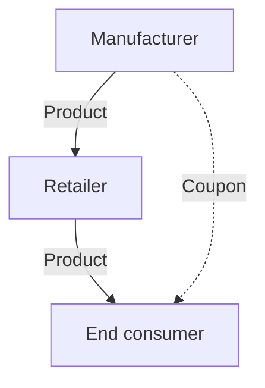

Payments made by a reporting entity to its customer’s customer are assessed and accounted for the same as those paid directly to the reporting entity’s customer if those parties receiving the payments are purchasing the reporting entity’s goods and services.

Example RR 4-28 illustrates an arrangement with a payment made by a reporting entity to its reseller’s customer.

**EXAMPLE RR 4-28**
Consideration payable to customers — payment to reseller’s customer

ElectronicsCo sells televisions to Retailer that Retailer sells to end customers. ElectronicsCo runs a promotion during which it will pay a rebate to end customers that purchase a television from Retailer.

How should ElectronicsCo account for the rebate payment to the end customer?

***Analysis***

ElectronicsCo should account for the rebate in the same manner as if it were paid directly to the Retailer. Payments to a customer’s customer within the distribution chain are accounted for in the same way as payments to a customer under the revenue standard.

---

In certain arrangements, reporting entities provide cash incentives to end consumers that are not their direct customers and do not purchase the reporting entities’ goods or services within the distribution chain, as depicted in Figure RR 4-2.


Determining the transaction price | 4-36

**FIGURE RR 4-2**
Example of a payment to an end consumer that does not purchase the reporting entity’s goods or services

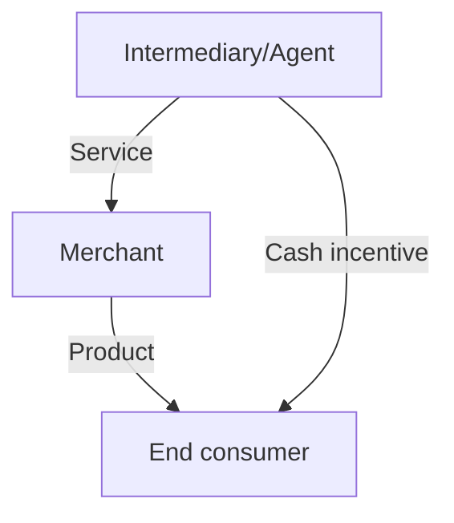

Management must first identify whether the end consumer is the reporting entity’s customer under the revenue standard. This assessment requires judgment. Management should also consider whether a payment to an end consumer is provided on behalf of the reporting entity’s customer (for example, the merchant in Figure RR 4-2). A promise to make a payment on a customer’s behalf could either be explicitly stated in the contract with the customer or implied based on the reporting entity’s customary business practices, published policies, or specific statements (see RR 3.2.2). If a reporting entity makes a payment to an end consumer on behalf of its customer, the payment would be treated the same as a payment made directly to the customer. Refer to Revenue TRG Memo No. 37 and the related meeting minutes in Revenue TRG Memo No. 44 for further discussion of this topic. Example RR 4-29 illustrates an arrangement with a payment made by an agent to an end consumer.

### EXAMPLE RR 4-29
Consideration payable to customers — agent’s payment to end consumer

TravelCo sells airline tickets to end consumers on behalf of Airline. TravelCo concludes that it is acting as an agent in the airline ticket sale transactions (refer to RR 10 for further discussion on principal versus agent considerations). TravelCo offers a $10 coupon to end consumers in order to increase the volume of airline ticket sales on which it earns a commission.

How should TravelCo account for the coupons offered to end consumers?


PwC US National Office | viewpoint.pwc.com 4-37

***Analysis***

TravelCo must identify its customer (or customers) in order to determine whether the coupons represent consideration payable to a customer. The coupons represent consideration payable to a customer if (1) TravelCo determines the end consumers are its customers, or (2) TravelCo determines the end consumers are not its customers, but it is making the payment on behalf of Airline (its customer). TravelCo should consider as part of this assessment whether there is an implied promise that it will provide coupons to the end consumer on Airline's behalf (for example, coupons offered as part of a promotion specific to Airline). If the coupons represent consideration payable to a customer, TravelCo would record the coupons as a reduction of its agency commission as it does not receive a distinct good or service in exchange for the payment (see RR 4.6.1). Conversely, the coupons would generally be recorded as a marketing expense if the coupons do not represent consideration payable to a customer.

### 4.6.3 Timing of recognition of payments made to a customer

The revenue standard provides guidance on when a reporting entity should reduce revenue for consideration paid to a customer.

> **ASC 606-10-32-27**
>
> If consideration payable to a customer is accounted for as a reduction of the transaction price, an entity shall recognize the reduction of revenue when (or as) the later of either of the following events occurs:
>
> a. The entity recognizes revenue for the transfer of the related goods or services to the customer
>
> b. The entity pays or promises to pay the consideration (even if the payment is conditional on a future event). That promise might be implied by the entity's customary business practices.

If a reporting entity makes a payment to a customer in advance of recognizing revenue for the transfer of the related goods or services, the advance payment would generally be capitalized as an asset (similar to other prepaid assets) and amortized as a reduction to the related revenues in future periods. Assets should be assessed for recoverability, which would generally be based on expected future revenues from the customer.

Even if a reporting entity does not explicitly promise to make a payment to a customer, management should consider whether it expects to make a payment to a customer (for example, a rebate) as a price concession. A price concession is a form of variable consideration, as discussed in RR 4.3.3.1, and should be estimated, including assessment of the variable consideration constraint. A payment to a customer should also be accounted for if it is implied by the reporting entity's customary business practices. Refer to Revenue TRG Memo No. 37 and the related meeting minutes in Revenue TRG Memo No. 44 for further discussion of this topic.

Example RR 4-30 illustrates the timing of recognition for payments to customers that are a reduction of revenue.


Determining the transaction price 4-38

**EXAMPLE RR 4-30**

Consideration payable to customers — implied promise to pay consideration

CoffeeCo sells coffee products to Retailer. On December 1, 20X1, CoffeeCo decides that it will issue coupons directly to end consumers that provide a $1 discount on each bag of coffee purchased. CoffeeCo has a history of providing similar coupons.

CoffeeCo delivers a shipment of coffee to Retailer on December 28, 20X1 and recognizes revenue. The coupon is offered to end consumers on January 2, 20X2 and CoffeeCo reasonably expects that the coupons will be used to purchase products already shipped to Retailer. CoffeeCo will reimburse Retailer for any coupons redeemed by end consumers.

When should CoffeeCo record the revenue reduction for estimated coupon redemptions?

***Analysis***

CoffeeCo should reduce the transaction price for estimated coupon redemptions when it recognizes revenue upon transfer of the coffee to Retailer on December 28, 20X1. Although CoffeeCo has not yet communicated the coupon offering, CoffeeCo has a customary business practice of providing coupons and has the intent to provide coupons (a form of price concession) related to the shipment. Therefore, CoffeeCo should account for the coupons following the guidance on variable consideration.

### 4.6.4 Payments to customers that exceed the transaction price

In some cases, a payment to a customer that is not in exchange for a distinct good or service could exceed the transaction price for the current contract. Accounting for the excess payment (“negative revenue”) could require judgment. Management should obtain an understanding of the reason for making the payment to the customer and the rights and obligations in the related contracts. Reporting entities should also appropriately disclose their related judgments, if material.

To determine the accounting for the excess payment amount, including timing of recognition in income and presentation in the income statement, management should assess whether the payment also relates to other current or past contracts. If the reporting entity has recognized revenue from the same customer related to other contracts, the excess payment might represent a modification to the transaction price of those contracts. Refer to Revenue TRG Memo No. 37 and the related meeting minutes in Revenue TRG Memo No. 44 for further discussion of this topic.

Management should also assess whether the payment relates to anticipated future contracts. For example, reporting entities sometimes make advance payments to customers to reimburse them for costs to change vendors and/or to secure exclusivity in anticipation of future purchases even though the reporting entity may not have an enforceable right to them. It may be appropriate to recognize an asset for payments to a customer if they represent a prepayment of a discount on anticipated future contracts. Payments capitalized as an asset would be amortized as a reduction to future revenues from that customer. Assets should be assessed for recoverability, which would generally be based on expected future revenues from the customer. Refer to US Revenue TRG Memo No. 59 and the related meeting minutes in Revenue TRG Memo No. 60 for further discussion of this topic.

If the payment does not relate to any other contracts (including past contracts or anticipated future contracts) with the customer, management should consider the


PwC US National Office | viewpoint.pwc.com 4-39

substance of the payment to determine the appropriate presentation of the amount in excess of the transaction price. For example, management might conclude the excess payment should be presented as an expense because the arrangement no longer represents a contract with a customer when the transaction price is negative. In other cases, presenting the payment as negative revenue might be appropriate.

Example RR 4-31 illustrates the accounting when payments to a customer exceed the transaction price.

### EXAMPLE RR 4-31
**Consideration payable to customers — payment exceeds transaction price**

ToyCo sells 1,000 products to Retailer for total consideration of $100,000. ToyCo is an emerging business and therefore, to receive desirable placement in Retailer’s store, ToyCo pays Retailer a one-time payment of $150,000. This payment is not in exchange for a distinct good or service and ToyCo does not have any other past or current contracts with the Retailer at the time of payment. Although ToyCo aspires to sell additional products to Retailer in the future, ToyCo does not currently anticipate specific future contracts with Retailer.

How should ToyCo account for the payment to Retailer?

***Analysis***

ToyCo should account for the payment as a reduction of the transaction price of the contract with Retailer because it does not receive a distinct good or service in exchange for the payment. ToyCo has determined that the excess amount of $50,000 ($100,000 contract price less $150,000 payment) does not relate to any other contracts with Retailer; therefore, the excess amount should be presented based on the substance of the payment. In this fact pattern, ToyCo would likely conclude that the $50,000 excess payment should be presented as an expense.

### 4.6.5 Settlement payments made to customers
Reporting entities may be required to make payments to customers to settle litigation claims or other disputes. Payments to a customer will generally be presented as a reduction of revenue because the reporting entity does not receive a distinct good or service in exchange for the payment. A settlement payment would only be presented as an expense if the claim or dispute was not related to the reporting entity's performance under the revenue contract. In some cases, it may not be clear whether the payment relates to past or future transactions. Cash payments made to customers to settle disputes often represent adjustments to the transaction price of a completed contract because they relate to disputes regarding performance or pricing. In other words, the reporting entity agrees as part of the settlement to make a price concession related to the past transaction. In these situations, the payments should be recorded as an immediate adjustment to revenue.

In other situations, a cash payment may represent an incentive for the customer to enter into a new contract. For example, a reporting entity may settle a class action lawsuit by issuing coupons to a large group of customers that can be used in connection with future purchases. It may be appropriate to account for these coupons when the future purchases are made if the coupons are viewed as incentives to enter into new contracts as opposed to adjustments to the transaction price for prior purchases. This assessment may require significant judgment.


Determining the transaction price 4-40

Cash payments that relate to a contract in process should generally be accounted for as a modification to the contract. Refer to RR 2.9 for guidance on accounting for modifications.

### 4.6.6 Equity payments to customers—after adoption of ASU 2025-04
ASU 2025-04, summarized in SC 7.1, clarifies the accounting for share-based consideration payable to a customer under ASC 718, *Compensation—Stock Compensation* and ASC 606, *Revenue from Contracts with Customers*.

Consideration payable to a customer could be in the form of an equity instrument (for example, shares, share options, or other equity instruments). The income statement classification of consideration payable in the form of an equity instrument depends on whether the payment is in exchange for a distinct good or service, as discussed in RR 4.6.1. Payments to customers in the form of a reporting entity’s own equity instruments in exchange for a distinct good or service are accounted for in accordance with ASC 718, *Compensation—stock compensation*, similar to other share-based payments to nonemployees. Payments that are not in exchange for a distinct good or service—whether the payment is in the form of cash or an equity instrument—are a reduction of the arrangement’s transaction price.

Share-based payment awards issued to a customer should be measured and classified (i.e., as equity or a liability) in accordance with ASC 718. As a result, for a payment to a customer in the form of an equity instrument that is a reduction of the transaction price, a reporting entity will apply ASC 718 to determine the amount and ASC 606 to determine the timing of the reduction of revenue. The equity instrument is measured at fair value on the grant date in accordance with ASC 718, which will also be the amount by which the transaction price is reduced. If the number of equity instruments is variable due to a service condition or a performance condition that affects vesting, management will initially estimate the number of equity instruments to be issued in accordance with ASC 718. Updates to these estimates are reflected in the transaction price based on the grant-date fair value of the equity instruments that ultimately vest. Changes in the measurement of an instrument after the grant date due to the form of the consideration (e.g., remeasurement of a liability-classified instrument to fair value each period) are not an adjustment of the transaction price. See further discussion in SC 7.2.5 and SC 7.2.6.

### 4.6.6A Equity payments to customers—before adoption of ASU 2025-04
Consideration payable to a customer could be in the form of an equity instrument (for example, shares, share options, or other equity instruments). The income statement classification of consideration payable in the form of an equity instrument depends on whether the payment is in exchange for a distinct good or service, as discussed in RR 4.6.1. Payments to customers in the form of a reporting entity’s own equity instruments in exchange for a distinct good or service are accounted for in accordance with ASC 718, *Compensation—stock compensation*, similar to other share-based payments to nonemployees. Payments that are not in exchange for a distinct good or service—whether the payment is in the form of cash or an equity instrument—are a reduction of the arrangement’s transaction price.

Share-based payment awards issued to a customer should be measured and classified (i.e., as equity or a liability) in accordance with ASC 718. As a result, for a payment to a customer in the form of an equity instrument that is a reduction of the transaction price, a reporting entity will apply ASC 718 to determine the amount and ASC 606 to determine the timing of the reduction of revenue. The equity instrument is measured at fair value on the grant date in accordance with ASC 718, which will also be the amount by which the transaction price is reduced. If the number of equity


PwC US National Office | viewpoint.pwc.com 4-41

instruments is variable due to a performance condition that affects vesting, management will initially estimate the number of equity instruments to be issued in accordance with ASC 718. If the variability is due to a service condition that affects vesting, management will also estimate the number of instruments to be issued unless the reporting entity has a policy to only account for service-related forfeitures of nonemployee awards when they occur. Updates to these estimates are reflected in the transaction price based on the grant-date fair value of the equity instruments that ultimately vest. Changes in the measurement of an instrument after the grant date due to the form of the consideration (e.g., remeasurement of a liability-classified instrument to fair value each period) are not an adjustment of the transaction price. See further discussion in SC 7.2.5 and SC 7.2.6.

### 4.6.7 Payments to third parties on behalf of a customer
A payment to a third party that is made on behalf of a reporting entity’s customer should be evaluated the same as a payment made directly to the customer. That is, the payment is a reduction of the transaction price of the revenue contract with the customer unless the payment is in exchange for a distinct good or service (refer to RR 4.6.1).

Determining whether a payment is made to a third party on behalf of a customer may require judgment. Considerations include whether the payment is for the benefit of the customer and whether there is a promise to the customer to make the payment, which could be explicit (stated in the contract with the customer or separately communicated to the customer) or implied based on the reporting entity’s customary business practices, published policies, or specific statements (see RR 3.2.2).

Example RR 4-32 illustrates the accounting for payments to third parties on behalf of a customer.

#### EXAMPLE RR 4-32
Payment to a third party on behalf of a customer – interest rate buydown

RetailerCo sells major household appliances to customers. Customers can pay RetailerCo directly for the appliances or they can apply to obtain financing for the appliances from FinanceCo, a third-party company that has a referral relationship with RetailerCo. Aside from the referral of customers by RetailerCo to FinanceCo, RetailerCo is not involved in FinanceCo’s underwriting process or decision about whether to extend financing to customers. If FinanceCo extends financing to a customer, upon delivery of the appliances to the customer, FinanceCo remits the purchase price of the equipment to RetailerCo. Pursuant to the terms of the financing agreement between FinanceCo and customer, FinanceCo collects the purchase price from the customer over time. RetailerCo has no further involvement in the financing arrangement and is not at risk if the customer fails to pay FinanceCo.

As a special promotion, FinanceCo agrees to offer a reduced interest rate to RetailerCo’s customers (for example, “no interest for the first year” or “twelve months same as cash”). In exchange, FinanceCo applies a discount to the amount it remits to RetailerCo for the purchase price of the appliances. In other words, even though the terms of the financing agreement state that RetailerCo’s customer is receiving less expensive financing, in substance, RetailerCo has funded an interest rate buydown on the customer’s behalf, and FinanceCo will continue to earn a “market” rate of interest for the financing it provided to RetailerCo’s customer.

How should RetailerCo consider the interest rate buydown in determining the transaction price for its appliance sales?


Determining the transaction price 4-42

### Analysis

The payment to FinanceCo (in the form of the right to collect the undiscounted purchase price in exchange for the discounted amount provided to RetailerCo) provides RetailerCo’s customer the benefit of an effective interest rate that is lower than that which they would otherwise be able to obtain from FinanceCo under normal commercial terms. RetailerCo, however, does not receive a distinct good or service from FinanceCo or its customer in exchange for the payment. Therefore, the amount of the interest rate buydown (the discount) is a reduction of the transaction price of the appliance. That is, revenue from the sale of the appliance to the customer is the net amount received from FinanceCo.

***


PwC US National Office | viewpoint.pwc.com 4-43

# Chapter 5:
# Allocating transaction price–
# updated March 2024

The image features a decorative graphic in the upper right quadrant consisting of various overlapping rounded rectangular shapes (pills) and circles in shades of grey, pink, and orange. Some shapes are solid, while others are represented only by their outlines.

# 5.1 Overview—allocating transaction price

This chapter discusses how to allocate the transaction price to the separate performance obligations in a contract.

> **ASC 606-10-32-28**
>
> The objective when allocating the transaction price is for an entity to allocate the transaction price to each performance obligation (or distinct good or service) in an amount that depicts the amount of consideration to which the entity expects to be entitled in exchange for transferring the promised goods or services to the customer.

Many contracts involve the sale of more than one good or service. Such contracts might involve the sale of multiple goods, goods followed by related services, or multiple services. The transaction price in an arrangement must be allocated to each separate performance obligation so that revenue is recorded at the right time and in the right amounts. The allocation could be affected by variable consideration or discounts. Refer to RR 3 for further information regarding identifying performance obligations.

# 5.2 Determining standalone selling price

The transaction price should be allocated to each performance obligation based on the relative standalone selling prices of the goods or services being provided to the customer.

> **ASC 606-10-32-31**
>
> To allocate the transaction price to each performance obligation on a relative standalone selling price basis, an entity shall determine the standalone selling price at contract inception of the distinct good or service underlying each performance obligation in the contract and allocate the transaction price in proportion to those standalone selling prices.

Management should determine the standalone selling price for each item and allocate the transaction price based on each item’s relative value to the total value of the goods and services in the arrangement.

The best evidence of standalone selling price is the price a reporting entity charges for that good or service when the reporting entity sells it separately in similar circumstances to similar customers. However, goods or services are not always sold separately in which case the standalone selling price needs to be estimated or derived by other means. This estimate often requires judgment, such as when specialized goods or services are sold only as part of a bundled arrangement.

The relative standalone selling price of each performance obligation is determined at contract inception. The transaction price is not reallocated after contract inception to reflect subsequent changes in standalone selling prices.

A contractually stated price or list price for a good or service may be, but should not be presumed to be, the standalone selling price of the good or service. Reporting entities often provide discounts or other adjustments to list prices to customers. A reporting entity’s customary business practices should be considered, including adjustments to list prices, when determining the standalone selling price of an item.


Allocating transaction price 5-2

Question RR 5-1 addresses whether the standalone selling price can be based on a range of prices.

### QUESTION RR 5-1
Can a reporting entity use a range of prices when determining the standalone selling prices of individual goods or services?

#### PwC response
We believe it would be acceptable for a reporting entity to use a range of prices when determining the standalone selling prices of individual goods or services, provided that the range reflects reasonable pricing of each product or service as if it were priced on a standalone basis for similar customers.

The allocation guidance does not specifically refer to the use of a range, but we believe using a range of standalone selling prices is consistent with the overall allocation objective. Reporting entities will need to apply judgment to determine an appropriate range of standalone selling prices.

If a reporting entity decides to use a range to determine standalone selling prices, the contractual price can be considered the standalone selling price if it falls within the range. There may, however, be situations in which the contractual price of a good or service is outside of that range. In those cases, reporting entities should apply a consistent method to determine the standalone selling price within the range for that good or service (for example, the midpoint of the range or the outer limit closest to the stated contractual price).

Example RR 5-1 and Example RR 5-2 illustrate the allocation of transaction price when the goods and services are also sold separately. These concepts are also illustrated in Example 33 of the revenue standard (ASC 606-10-55-256 through ASC 606-10-55-258).

### EXAMPLE RR 5-1
Allocating transaction price — standalone selling prices are directly observable

Marine sells boats and provides mooring facilities for its customers. Marine sells the boats for $30,000 each and provides mooring facilities for $5,000 per year. Marine concludes that the goods and services are distinct and accounts for them as separate performance obligations. Marine enters into a contract to sell a boat and one year of mooring services to a customer for $32,500.

How should Marine allocate the transaction price of $32,500 to the performance obligations?

#### Analysis
Marine should allocate the transaction price of $32,500 to the boat and the mooring services based on their relative standalone selling prices as follows:

<table>
  <tbody>
    <tr>
        <td>Boat:</td>
        <td>$27,857</td>
        <td>($32,500 × ($30,000 / $35,000))</td>
    </tr>
    <tr>
        <td>Mooring services:</td>
        <td>$4,643</td>
        <td>($32,500 × ($5,000 / $35,000))</td>
    </tr>
  </tbody>
</table>

The allocation results in the $2,500 discount being allocated proportionately to the two performance obligations.


PwC US National Office | viewpoint.pwc.com 5-3

**EXAMPLE RR 5-2**

Allocating transaction price — use of a range when estimating standalone selling prices

Marine sells boats and provides mooring facilities for its customers. Marine sells the boats on a standalone basis for $29,000 – $32,000 each and provides mooring facilities for $5,000 per year. Marine concludes that the goods and services are distinct and accounts for them as separate performance obligations.

Marine enters into a contract to sell a boat and one year of mooring services to a customer. The stated contract prices for the boat and the mooring services are $31,000 and $1,500, respectively.

How should Marine allocate the total transaction price of $32,500 to each performance obligation?

***Analysis***

The contract price for the boat ($31,000) falls within the range Marine established for standalone selling prices; therefore, Marine could use the stated contract price for the boat as the standalone selling price in the allocation:

Boat: $27,986 ($32,500 × ($31,000 / $36,000))

Mooring services: $4,514 ($32,500 × ($5,000 / $36,000))

If the contract price for the boat did not fall within the range (for example, the boat was priced at $28,000), Marine would need to determine a price within the range to use as the standalone selling price of the boat in the allocation, such as the midpoint. Marine should apply a consistent method for determining the price within the range to use as the standalone selling price.

## 5.3 Standalone selling price not directly observable

The standalone selling price of an item that is not directly observable must be estimated. The revenue standard does not prescribe or prohibit any particular method for estimating the standalone selling price, as long as the method results in an estimate that faithfully represents the price a reporting entity would charge for the goods or services if they were sold separately.

There is also no hierarchy for how to estimate or otherwise determine the standalone selling price for goods or services that are not sold separately. Management should consider all information that is reasonably available and should maximize the use of observable inputs. For example, if a reporting entity does not sell a particular good on a standalone basis, but its competitors do, that might provide data useful in estimating the standalone selling price.

Standalone selling prices can be estimated in a number of ways. Management should consider the reporting entity’s pricing policies and practices, and the data used in making pricing decisions, when determining the most appropriate estimation method. The method used should be applied consistently to similar arrangements. Suitable methods include, but are not limited to:

[ ] Adjusted market assessment approach (RR 5.3.1)


Allocating transaction price | 5-4

- [ ] Expected cost plus a margin approach (RR 5.3.2)
- [ ] Residual approach, in limited circumstances (RR 5.3.3)

Question RR 5-2 addresses whether a reporting entity could assert it is unable to estimate standalone selling price.

### QUESTION RR 5-2
Are there instances when a reporting entity could assert it is unable to estimate standalone selling price?

**PwC response**
No. The revenue standard requires a reporting entity to estimate standalone selling price for each distinct good or service in an arrangement. The residual approach (refer to RR 5.3.3) may only be used if specific criteria are met.

---

### 5.3.1 Adjusted market assessment approach
A market assessment approach considers the market in which the good or service is sold and estimates the price that a customer in that market would be willing to pay. Management should consider a competitor's pricing for similar goods or services in the market, adjusted for entity-specific factors, when using this approach. Entity-specific factors might include:

- [ ] Position in the market
- [ ] Expected profit margin
- [ ] Customer or geographic segments
- [ ] Distribution channel
- [ ] Cost structure

A reporting entity that has a greater market share, for example, may charge a lower price because of those higher volumes. A reporting entity that has a smaller market share may need to consider the profit margins it would need to receive to make the arrangement profitable. Management should also consider the customer base in a particular geography. Pricing of goods and services might differ significantly from one area to the next, depending on, for example, distribution costs.

Market conditions can also affect the price for which a reporting entity would sell its product including:

- [ ] Supply and demand
- [ ] Competition
- [ ] Market perception
- [ ] Trends
- [ ] Geography-specific factors

A single good or service could have more than one standalone selling price if it is sold in multiple markets. For example, the standalone selling price of a good in a densely populated area could be different from the standalone selling price of a


PwC US National Office | viewpoint.pwc.com 5-5

similar good in a rural area. A large number of competitors in a market can result in a reporting entity having to charge a lower price in that market to stay competitive, while it can charge a higher price in markets where customers have fewer options.

Reporting entities might also employ different marketing strategies in different regions and therefore be willing to accept a lower price in a certain market. A reporting entity whose brand is perceived as top-of-the-line may be able to charge a price that provides a higher margin on goods or services than one that has a less well-known brand name.

Discounts offered by a reporting entity when a good or service is sold separately should be considered when estimating standalone selling prices. For example, a sales force may have a standard list price for products and services, but regularly enter into sales transactions at amounts below the list price. Management should consider whether it is appropriate to use the list price in its analysis of standalone selling price if the reporting entity regularly provides a discount.

Management should also consider whether the reporting entity has a practice of providing price concessions. A reporting entity with a history of providing price concessions on certain goods or services needs to determine the potential range of prices it expects to charge for a product or service on a standalone basis when estimating standalone selling price.

The significance of each data point in the analysis will vary depending on a reporting entity's facts and circumstances. Certain information could be more relevant than other information depending on the reporting entity, the location, and other factors.

### 5.3.2 Expected cost plus a margin
An expected cost plus a margin approach ("cost-plus approach") could be the most appropriate estimation method in some circumstances. Costs included in the estimate should be consistent with those a reporting entity would normally consider in setting standalone prices. Both direct and indirect costs should be considered, but judgment is needed to determine the extent of costs that should be included. Internal costs, such as research and development costs that the reporting entity would expect to recover through its sales, might also need to be considered.

Factors to consider when assessing if a margin is reasonable could include:

*   Margins achieved on standalone sales of similar products
*   Market data related to historical margins within an industry
*   Industry sales price averages
*   Market conditions
*   Profit objectives

The objective is to determine what factors and conditions affect what a reporting entity would be able to charge in a particular market. Judgment will often be needed to determine an appropriate margin, particularly when sufficient historical data is not readily available or when a product or service has not been previously sold on a standalone basis. Estimating a reasonable margin will often require an assessment of both entity-specific and market factors.

Example RR 5-3 illustrates some of the approaches to estimating standalone selling price.


Allocating transaction price | 5-6

#### EXAMPLE RR 5-3
Allocating transaction price – standalone selling prices are not directly observable

Biotech enters into an arrangement to provide a license and research services to Pharma. The license and the services are each distinct and therefore accounted for as separate performance obligations, and neither is sold individually.

What factors might Biotech consider when estimating the standalone selling prices for these items?

**Analysis**

Biotech analyzes the transaction as follows:

*License*
The best model for determining standalone selling price will depend on the rights associated with the license, the stage of development of the technology, and the nature of the license itself.

A reporting entity that does not sell comparable licenses may need to consider factors such as projected cash flows from the license to estimate the standalone selling price of a license, particularly when that license is already in use or is expected to be exploited in a relatively short timeframe. A cost-plus approach may be more relevant for licenses in the early stage of their life cycle where reliable forecasts of revenue or cash flows do not exist. Determining the most appropriate approach will depend on facts and circumstances as well as the extent of observable selling-price information.

*Research services*
A cost-plus approach that considers the level of effort necessary to perform the research services would be an appropriate method to estimate the standalone selling price of the research services. This could include costs for full-time equivalent (FTE) employees and expected resources to be committed. Key areas of judgment include the selection of FTE rates, estimated profit margins, and comparisons to similar services offered in the marketplace.

### 5.3.3 Residual approach
The residual approach involves deducting from the total transaction price the sum of the observable standalone selling prices of other goods and services in the contract to estimate a standalone selling price for the remaining goods or services. Use of a residual approach to estimate standalone selling price is permitted in certain circumstances.

> **ASC 606-10-32-34-c**
>
> Residual approach—an entity may estimate the standalone selling price by reference to the total transaction price less the sum of the observable standalone selling prices of other goods or services promised in the contract. However, an entity may use a residual approach to estimate ... the standalone selling price of a good or service only if one of the following criteria is met:
>
> 1. The entity sells the same good or service to different customers (at or near the same time) for a broad range of amounts (that is, the selling price is highly variable because a representative standalone selling price is not discernible


PwC US National Office | viewpoint.pwc.com 5-7

> from past transactions or other observable evidence).
>
> 2. The entity has not yet established a price for that good or service, and the good or service has not previously been sold on a standalone basis (that is, the selling price is uncertain).

### 5.3.3.1 When the residual approach can be used
A residual approach should *only* be used when the reporting entity sells the same good or service to different customers for a broad range of prices, making them highly variable, or when the reporting entity has not yet established a price for a good or service because it has not been previously sold. This might be more common for sales of intellectual property or other intangible assets than for sales of tangible goods or services.

The circumstances where the residual approach can be used are intentionally limited. Management should consider whether another method provides a reasonable estimate of the standalone selling price before using the residual approach.

### 5.3.3.2 Additional considerations for the residual approach
Arrangements could include three or more performance obligations with more than one of the obligations having a standalone selling price that is highly variable or uncertain. A residual approach can be used in this situation to allocate a portion of the transaction price to those performance obligations with prices that are highly variable or uncertain, as a group. Management will then need to use another method to estimate the individual standalone selling prices of those obligations. The revenue standard does not provide specific guidance about the technique or method that should be used to make this estimate.

> **Excerpt from ASC 606-10-32-35**
>
> A combination of methods may need to be used to estimate the standalone selling prices of the goods or services promised in the contract if two or more of those goods or services have highly variable or uncertain standalone selling prices. For example, an entity may use a residual approach to estimate the aggregate standalone selling price for those promised goods or services with highly variable or uncertain standalone selling prices and then use another method to estimate the standalone selling prices of the individual goods or services relative to that estimated aggregate standalone selling price determined by the residual approach.

When a residual approach is used, management still needs to compare the results obtained to all reasonably available observable evidence to ensure the method meets the objective of allocating the transaction price based on standalone selling prices. Allocating little or no consideration to a performance obligation suggests the method used might not be appropriate, because a good or service that is distinct is presumed to have value to the purchaser.

Example RR 5-4 and Example RR 5-5 illustrate the use of the residual approach to estimate standalone selling price.


Allocating transaction price | 5-8

**EXAMPLE RR 5-4**
***
Estimating standalone selling price – residual approach

Seller enters into a contract with a customer to sell Products A, B, and C for a total transaction price of $100,000. On a standalone basis, Seller regularly sells Product A for $25,000 and Product B for $45,000. Product C is a new product that has not been sold previously, has no established price, and is not sold by competitors in the market. Products A and B are not regularly sold together at a discounted price. Product C is delivered on March 1, and Products A and B are delivered on April 1.

How should Seller determine the standalone selling price of Product C?

***Analysis***

Seller can use the residual approach to estimate the standalone selling price of Product C because Seller has not previously sold or established a price for Product C. Prior to using the residual approach, Seller should assess whether any other observable data exists to estimate the standalone selling price. For example, although Product C is a new product, Seller may be able to estimate a standalone selling price through other methods, such as using expected cost plus a margin.

Seller has observable evidence that Products A and B sell for $25,000 and $45,000, respectively, for a total of $70,000. The residual approach would result in an estimated standalone selling price of $30,000 for Product C ($100,000 total transaction price less $70,000).

**EXAMPLE RR 5-5**
***
Estimating standalone selling price – residual approach is not appropriate

SoftwareCo enters into a contract with a customer to license software and provide post-contract customer support (PCS) for a total transaction price of $1.1 million. SoftwareCo regularly sells PCS for $1 million on a standalone basis. SoftwareCo also regularly licenses software on a standalone basis for a price that is highly variable, ranging from $500,000 to $5 million.

Can SoftwareCo use the residual approach to determine the standalone selling price of the software license?

***Analysis***

No. Because the seller has observable evidence that PCS sells for $1 million, the residual approach results in a nominal allocation of selling price to the software license. As the software is typically sold separately for $500,000 to $5 million, this is not an estimate that faithfully represents the price of the software license if it was sold separately. As such, the allocation objective of the standard is not met and SoftwareCo should use another method to estimate the standalone selling price of the license.

***

## 5.4 Allocating discounts

Customers often receive a discount for purchasing multiple goods and/or services as a bundle. Discounts are typically allocated to all of the performance obligations in an arrangement based on their relative standalone selling prices, so that the discount is allocated proportionately to all performance obligations.


PwC US National Office | viewpoint.pwc.com 5-9

> **ASC 606-10-32-36**
>
> A customer receives a discount for purchasing a bundle of goods or services if the sum of the standalone selling prices of those promised goods or services in the contract exceeds the promised consideration in a contract. Except when an entity has observable evidence ... that the entire discount relates to only one or more, but not all, performance obligations in a contract, the entity shall allocate a discount proportionately to all performance obligations in the contract. The proportionate allocation of the discount in those circumstances is a consequence of the entity allocating the transaction price to each performance obligation on the basis of the relative standalone selling prices of the underlying distinct goods or services.

It may be appropriate in some instances to allocate the discount to only one or more performance obligations in the contract rather than all performance obligations. This could occur when a reporting entity has observable evidence that the discount relates to one or more, but not all, of the performance obligations in the contract.

All of the following conditions must be met for a reporting entity to allocate a discount to one or more, but not all, performance obligations.

> **ASC 606-10-32-37**
>
> An entity shall allocate a discount entirely to one or more, but not all, performance obligations in the contract if all of the following criteria are met:
>
> a. The entity regularly sells each distinct good or service (or each bundle of distinct goods or services) in the contract on a standalone basis.
>
> b. The entity also regularly sells on a standalone basis a bundle (or bundles) of some of those distinct goods or services at a discount to the standalone selling prices of the goods or services in each bundle.
>
> c. The discount attributable to each bundle of goods or services described in (b) is substantially the same as the discount in the contract, and an analysis of the goods or services in each bundle provides observable evidence of the performance obligation (or performance obligations) to which the entire discount in the contract belongs.

The above criteria indicate that a discount will typically be allocated only to bundles of two or more performance obligations in an arrangement. Allocation of an entire discount to a single item is therefore expected to be rare.

Example RR 5-6 and Example RR 5-7 illustrate the allocation of a discount. These concepts are also illustrated in Example 34 of the revenue standard (ASC 606-10-55-259 through ASC 606-10-55-269).

### EXAMPLE RR 5-6
#### Allocating transaction price – allocating a discount

Retailer enters into an arrangement with its customer to sell a chair, a couch, and a table for $5,400. Retailer regularly sells each product on a standalone basis: the chair for $2,000, the couch for $3,000, and the table for $1,000. The customer receives a $600 discount ($6,000 sum of standalone selling prices less $5,400 transaction price) for buying the bundle of products. The chair and couch will be


Allocating transaction price 5-10

delivered on March 28 and the table on April 3. Retailer regularly sells the chair and couch together as a bundle for $4,400 (that is, at a $600 discount to the standalone selling prices of the two items). The table is not normally discounted.

How should Retailer allocate the transaction price to the products?

### Analysis

Retailer has observable evidence that the $600 discount should be allocated to only the chair and couch. The chair and couch are regularly sold together for $4,400, and the table is regularly sold for $1,000. Retailer therefore would allocate the $5,400 transaction price as follows:

Chair and couch: $4,400

Table: $1,000

If, however, the table and the couch in the above example were also regularly discounted when sold as a pair, it would not be appropriate to allocate the discount to any combination of two products. The discount would instead be allocated proportionately to all three products.

***

#### EXAMPLE RR 5-7
**Allocating transaction price – allocating a discount and applying the residual approach**

Seller enters into a contract with a customer to sell Products A, B, and C for a total transaction price of $100,000. On a standalone basis, Seller regularly sells Product A for $25,000 and Product B for $45,000. Product C is a new product that has not been sold previously, has no established price, and is not sold by competitors in the market. Products A and B are regularly sold as a bundle for $60,000 (that is, at a $10,000 discount). Seller concludes the residual approach is appropriate for determining the standalone selling price of Product C.

How should Seller allocate the transaction price between Products A, B, and C?

### Analysis

Seller regularly sells Products A and B together for $60,000, so it has observable evidence that the $10,000 discount relates entirely to Products A and B. Therefore, Seller would allocate $60,000 to Products A and B. Using the residual approach, $40,000 would be allocated to Product C ($100,000 total transaction price less $60,000).

***

## 5.5 Impact of variable consideration

Some contracts contain an element of consideration that is variable or contingent upon certain thresholds or events being met or achieved. The variable consideration included in the transaction price is measured using a probability-weighted or most likely amount, and it is subject to a constraint. Refer to RR 4 for further discussion of variable consideration.

Variable consideration adds additional complexity when allocating the transaction price. The amount of variable consideration might also change over time as more information becomes available.


PwC US National Office | viewpoint.pwc.com 5-11

### 5.5.1 Allocating variable consideration
Variable consideration is generally allocated to all performance obligations in a contract based on their relative standalone selling prices. However, similar to a discount, there are criteria for assessing whether variable consideration is attributable to one or more, but not all, of the performance obligations in an arrangement. This allocation guidance is a requirement, not a policy election. This concept is illustrated in Example 35 of the revenue standard (ASC 606-10-55-270 through ASC 606-10-55-279).

For example, a reporting entity could have the right to additional consideration upon early delivery of a particular product in an arrangement that includes multiple products. Allocating the variable consideration to all of the products in the arrangement might not reflect the substance of the arrangement in this situation.

Variable consideration (and subsequent changes in the measure of that consideration) should be allocated entirely to a single performance obligation only if both of the following criteria are met.

> **ASC 606-10-32-40**
>
> An entity shall allocate a variable amount (and subsequent changes to that amount) entirely to a performance obligation or to a distinct good or service that forms part of a single performance obligation ... if both of the following criteria are met:
>
> a. The terms of a variable payment relate specifically to the entity's efforts to satisfy the performance obligation or transfer the distinct good or service (or to a specific outcome from satisfying the performance obligation or transferring the distinct good or service).
>
> b. Allocating the variable amount of consideration entirely to the performance obligation or the distinct good or service is consistent with the allocation objective ... when considering all of the performance obligations and payment terms in the contract.

Question RR 5-3 addresses the assessment of whether the allocation objective is met as required by ASC 606-10-32-40(b).

#### QUESTION RR 5-3
Does a reporting entity have to perform a relative standalone selling price allocation to conclude that the allocation of variable consideration to one or more, but not all, performance obligations is consistent with the allocation objective?

**PwC response**
The boards noted in the basis for conclusions that standalone selling price is the "default method" for determining whether the allocation objective is met; however, other methods could be used in certain cases. Therefore, a relative standalone selling price allocation could be utilized, but is not required, to assess the reasonableness of the allocation. In the absence of specific guidance on other methods, reporting entities will have to apply judgment to determine whether the allocation results in a reasonable outcome. Refer to Revenue TRG Memo No. 39 and the related meeting minutes in Revenue TRG Memo No. 44 for further discussion of this topic.


Allocating transaction price | 5-12

Question RR 5-4 addresses which allocation guidance an entity should apply when a discount causes the transaction price to be variable.

### QUESTION RR 5-4
Which guidance should a reporting entity apply to determine how to allocate a discount that causes the transaction price to be variable?

#### PwC response
Certain discounts are also variable consideration within a contract. For example, an electronics store may sell a customer a television, speakers, and a DVD player at their standalone selling prices, but also grant the customer a $50 mail-in rebate on the total purchase. There is a $50 discount on the bundle, but it is variable as it is contingent on the customer redeeming the rebate.

Reporting entities should first apply the guidance for allocating variable consideration to a discount that is also variable. If those criteria are not met, reporting entities should then consider whether the criteria for allocating a discount, discussed in RR 5.4, are met. A contract might have both variable and fixed discounts. The guidance on allocating a discount should be applied to any fixed discount. Refer to Revenue TRG Memo No. 31 and the related meeting minutes in Revenue TRG Memo No. 34 for further discussion of this topic.

#### 5.5.1.1 Allocating variable consideration to a series
A series of distinct goods or services is accounted for as a single performance obligation if it meets certain criteria (see further discussion in RR 3). When a contract includes a series accounted for as a single performance obligation and also includes an element of variable consideration, management should consider the distinct goods or services (rather than the series) for the purpose of allocating variable consideration. In other words, the series is not treated as a single performance obligation for purposes of allocating variable consideration. Management should apply the guidance in ASC 606-10-32-40 (refer to RR 5.5.1) to determine whether variable consideration should be allocated entirely to a distinct good or service within a series.

Example RR 5-8, Example RR 5-9, and Example RR 5-10 illustrate the allocation of variable consideration in an arrangement that is a series of distinct goods and services. This concept is also illustrated in Example 12A of ASC 606 (606-10-55-157B through ASC 606-10-55-158).

### EXAMPLE RR 5-8
Allocating variable consideration to a series – performance bonus

Air Inc enters into a three-year contract to provide air conditioning to the operator of an office building using its proprietary geothermal heating and cooling system. Air Inc is entitled to a semiannual performance bonus if the customer’s cost to heat and cool the building is decreased by at least 10% compared to its prior cost. The comparison of current cost to prior cost is made semi-annually, using the average of the most recent six-months compared to the same six-month period in the prior year.

Air Inc accounts for the series of distinct services provided over the three-year contract as a single performance obligation satisfied over time.

Air Inc has not previously used its systems for buildings in this region. Air Inc therefore does not include any variable consideration related to the performance


PwC US National Office | viewpoint.pwc.com 5-13

bonus in the transaction price during the first six months of providing service, as it does not believe that it is probable that a significant reversal of cumulative revenue recognized will not occur if its estimate of customer cost savings changes. At the end of the first six months, the customer’s costs have decreased by 12% over the prior comparative period and Air Inc becomes entitled to the performance bonus.

How should Air Inc account for the performance bonus?

### Analysis

Air Inc should allocate the performance bonus to the distinct services to which it relates (that is, the related six-month period) if management concludes the results are consistent with the allocation objective. Assuming this is the case, Air Inc would recognize the performance bonus (the change in the estimate of variable consideration) immediately because it relates to distinct services that have already been performed. It would not be appropriate to allocate the change in variable consideration to the entire performance obligation (that is, recognize the amount over the entire three-year contract).

***

#### EXAMPLE RR 5-9
**Allocating variable consideration to a series – pricing varies based on usage**

Transaction Processor (TP) enters into a two-year contract with a customer whereby TP will process all transactions on behalf of the customer. The customer is obligated to use TP’s system to process all of its transactions; however, the ultimate quantity of transactions is unknown. TP charges the customer a monthly fee calculated as $0.03 per transaction processed during the month.

TP concludes that the nature of its promise is a series of distinct monthly processing services and accounts for the two-year contract as a single performance obligation.

How should TP allocate the variable consideration in this arrangement?

### Analysis

TP should allocate the variable monthly fee to the distinct monthly service to which it relates, assuming the results are consistent with the allocation objective. TP would determine that the allocation objective is met because the fees are priced consistently throughout the contract and the rates are consistent with the reporting entity’s pricing practices with similar customers.

Assessing whether the allocation objective is met will require judgment. For example, if the rate per transaction processed was not consistent throughout the contract, TP would have to evaluate the reasons for the varying rates to assess whether the results of allocating each month’s fee to the monthly service are reasonable. TP should consider, among other factors, whether the rates are based on market terms and whether changes in the rate are substantive and linked to changes in value provided to the customer. For example, if the terms were structured to simply recognize more revenue earlier in the contract, this is a circumstance when the allocation objective would not be met. Management should also consider whether arrangements with declining prices include a future discount for which revenue should be deferred. Refer to Revenue TRG Memo No. 39 and the related meeting minutes in Revenue TRG Memo No. 44 for further discussion of this topic.


Allocating transaction price | 5-14

### EXAMPLE RR 5-10
#### Allocating variable consideration to a series – contract with an upfront fee

CloudCo enters into a contract to provide a customer with a cloud-based solution to process payroll over a one-year period. The customer cannot take possession of the software at any time during the hosting period; therefore, the contract does not include a license. CloudCo charges the customer an upfront fee of $1 million and a monthly fee of $2 for each employee’s payroll processed through the cloud-based solution. If the customer renews the contract, it will have to pay a similar upfront fee.

CloudCo concludes that the nature of its promise is a series of distinct monthly services and accounts for the one-year contract as a single performance obligation.

In the first quarter of the year, the monthly fees for payroll processed in January, February, and March are $50,000, $51,000, and $52,000, respectively.

How should CloudCo recognize revenue from this arrangement?

**Analysis**

CloudCo should determine an appropriate measure of progress to recognize the $1 million upfront fee, which would likely be a time-based measure (that is, ratable recognition over the contract term). CloudCo should allocate the variable monthly fees to the distinct monthly service to which they relate (that is, $50,000 to January, $51,000 to February, and $52,000 to March). The allocation objective is met because the $2 monthly fee per employee is consistent throughout the contract and the variable consideration can be allocated to the distinct service to which it relates, which is the monthly payroll processing service in January, February, and March.

The resulting accounting is that the upfront fee is spread ratably, but the variable fee is not. This does not mean that the reporting entity is using multiple measures of progress. The single measure of progress for the contract is a time-based measure, but the variable fee is allocated to specific time periods in accordance with the allocation guidance as described in RR 5.5.1.

---

### 5.5.2 Allocating subsequent changes in transaction price
The estimate of variable consideration is updated at each reporting date, potentially resulting in changes to the transaction price after inception of the contract. Any change to the transaction price (excluding those resulting from contract modifications as discussed in RR 2) is allocated to the performance obligations in the contract.

> **ASC 606-10-32-43**
>
> An entity shall allocate to the performance obligations in the contract any subsequent changes in the transaction price on the same basis as at contract inception. Consequently, an entity shall not reallocate the transaction price to reflect changes in standalone selling prices after contract inception. Amounts allocated to a satisfied performance obligation shall be recognized as revenue, or as a reduction of revenue, in the period in which the transaction price changes.

Changes in transaction price are allocated to the performance obligations on the same basis as at contract inception (that is, based on the standalone selling prices determined at contract inception). Changes in the amount of variable consideration


PwC US National Office | viewpoint.pwc.com 5-15

that relate to one or more specific performance obligations will be allocated only to that (those) performance obligation(s), as discussed in RR 5.5.1.

Amounts allocated to satisfied performance obligations are recognized as revenue immediately on a cumulative catch-up basis. A change in the amount allocated to a performance obligation that is satisfied over time is also adjusted on a cumulative catch-up basis. The result is either additional or less revenue in the period of change for the satisfied portion of the performance obligation. The amount related to the unsatisfied portion is recognized as that portion is satisfied over time.

A reporting entity’s standalone selling prices might change over time. Changes in standalone selling prices differ from changes in the transaction price. Reporting entities should not reallocate the transaction price for subsequent changes in the standalone selling prices of the goods or services in the contract.

Example RR 5-11 illustrates the accounting for a change in transaction price after the inception of an arrangement.

### EXAMPLE RR 5-11
#### Allocating transaction price – change in transaction price

On July 1, Contractor enters into an arrangement to build an addition onto a building, re-pave a parking lot, and install outdoor security cameras for $5,000,000. The building of the addition, the parking lot paving, and installation of security cameras are distinct and accounted for as separate performance obligations. Contractor can earn a $500,000 bonus if it completes the building addition by February 1. Contractor will earn a $250,000 bonus if it completes the addition by March 1. No bonus will be earned if the addition is completed after March 1.

Contractor allocates the transaction price on a relative standalone price basis before considering the potential bonus as follows:

<table>
  <tbody>
    <tr>
        <td>Building addition:</td>
        <td>$4,000,000</td>
    </tr>
    <tr>
        <td>Parking lot:</td>
        <td>$ 600,000</td>
    </tr>
    <tr>
        <td>Security cameras:</td>
        <td>$ 400,000</td>
    </tr>
  </tbody>
</table>

Contractor anticipates completing the building addition by March 1 and allocates an additional $250,000 to just the building addition performance obligation, resulting in an allocated transaction price of $4,250,000. Contractor concludes that this result is consistent with the allocation objective in these facts and circumstances.

On December 31, Contractor determines that the addition will be complete by February 1 and therefore changes its estimate of the bonus to $500,000. Contractor recognizes revenue over time using an input method based on costs incurred and 75% of the addition was complete as of December 31.

How should Contractor account for the change in estimated bonus as of December 31?

***Analysis***

As of December 31, Contractor should allocate an incremental bonus of $250,000 to the building addition performance obligation, for a total of $4,500,000. The change to


Allocating transaction price | 5-16

the bonus estimate is allocated entirely to the building addition because the allocation criteria discussed in RR 5.5.1 were met. Contractor should recognize $3,375,000 (75% × $4,500,000) as revenue on a cumulative basis for the building addition as of December 31.

---

# 5.6 Other considerations for allocating transaction price
Other matters that could arise when allocating transaction price are discussed below.

### 5.6.1 Transaction price exceeds sum of standalone selling prices
The total transaction price is typically equal to or less than the sum of the standalone selling prices of the individual performance obligations. A transaction price that is greater than the sum of the standalone selling prices suggests the customer is paying a premium for purchasing the goods or services together. This could indicate that the amounts identified as the standalone selling prices are too low, or that additional performance obligations exist and need to be identified. A premium is allocated to the performance obligations using a relative standalone selling price basis if, after further assessment, a premium still exists.

### 5.6.2 Nonrefundable upfront fees
Many contracts include nonrefundable upfront fees such as joining fees (common in health club memberships, for example), activation fees (common in telecommunications contracts, for example), or other initial/set-up fees. A reporting entity should assess whether the activities related to such fees satisfy a performance obligation. When those activities do not satisfy a performance obligation, because no good or service is transferred to the customer, none of the transaction price should be allocated to those activities. Rather, the upfront fee is included in the transaction price that is allocated to the performance obligations in the contract. Refer to RR 8 for further discussion of upfront fees.

### 5.6.3 No "contingent revenue cap"
A reporting entity should allocate the transaction price to all of the performance obligations in the arrangement, irrespective of whether additional goods or services need to be provided before the customer pays the consideration. For example, a wireless phone reporting entity enters into a two-year service agreement with a customer and provides a free mobile phone, but does not require any upfront payment. The reporting entity should allocate the transaction price to both the mobile phone and the two-year service arrangement, based on the relative standalone selling price of each performance obligation, despite the customer only paying consideration as the services are rendered.

Concerns about whether the customer intends to pay the transaction price are considered in either the collectibility assessment (that is, whether a contract exists) or assessment of customer acceptance of the good or service. Refer to RR 2 for further information on collectibility and RR 6 for further information on customer acceptance clauses.


PwC US National Office | viewpoint.pwc.com 5-17

# Chapter 6: Recognizing revenue—updated October 2024

The image features a decorative graphic in the upper right quadrant consisting of various horizontal rounded capsules (pills) in shades of grey, pink, and orange. Some capsules are solid, some are semi-transparent, and some are represented only by outlines.

## 6.1 Overview—recognizing revenue

This chapter addresses the fifth step of the revenue model, which is recognizing revenue. Revenue is recognized when or as performance obligations are satisfied by transferring control of a promised good or service to a customer. Control either transfers over time or at a point in time, which affects when revenue is recorded. Judgment might be needed in some circumstances to determine when control transfers. Various methods can be used to measure the progress toward satisfying a performance obligation when revenue is recognized over time.

## 6.2 Control

Revenue is recognized when the customer obtains control of a good or service.

> **ASC 606-10-25-23**
>
> An entity shall recognize revenue when (or as) the entity satisfies a performance obligation by transferring a promised good or service (that is, an asset) to a customer. An asset is transferred when (or as) the customer obtains control of that asset.

A performance obligation is satisfied when “control” of the promised good or service is transferred to the customer. The concept of control might appear to apply only to the transfer of a good, but a service also transfers an asset to the customer, even if that asset is consumed immediately.

A customer obtains control of a good or service if it has the ability to direct the use of and obtain substantially all of the remaining benefits from that good or service. A customer could have the future right to direct the use of the asset and obtain substantially all of the benefits from it (for example, upon making a prepayment for a specified product), but the customer must have actually obtained those rights for control to have transferred.

Directing the use of an asset refers to a customer’s right to deploy that asset, allow another reporting entity to deploy it, or restrict another reporting entity from using it. An asset’s benefits are the potential cash inflows (or reduced cash outflows) that can be obtained in various ways. Examples include using the asset to produce goods or provide services, selling or exchanging the asset, and using the asset to settle liabilities or reduce expenses. Another example is the ability to pledge the asset (such as land) as collateral for a loan or to hold it for future use.

Management should evaluate transfer of control primarily from the customer’s perspective. Considering the transaction from the customer’s perspective reduces the risk that revenue is recognized for activities that do not transfer control of a good or service to the customer.

Management also needs to consider whether it has an option or a requirement to repurchase an asset when evaluating whether control has transferred. See further discussion of repurchase arrangements in RR 8.7.

## 6.3 Performance obligations satisfied over time

Management needs to determine, at contract inception, whether control of a good or service transfers to a customer over time or at a point in time. Arrangements where the performance obligations are satisfied over time are not limited to services arrangements. Complex assets or certain customized goods constructed for a


Recognizing revenue | 6-2

customer, such as a complex refinery or specialized machinery, could also transfer over time, depending on the terms of the arrangement.

The assessment of whether control transfers over time or at a point in time is critical to the timing of revenue recognition. It will also affect a reporting entity’s determination of whether a contract is a series of distinct goods or services that should be accounted for as a single performance obligation. In order to qualify as a series, each distinct good or service in the series must meet the criteria for over time recognition. Refer to RR 3.3.2 for further discussion of the series guidance and its implications.

Revenue is recognized over time if any of the following three criteria are met.

> **Excerpt from ASC 606-10-25-27**
>
> An entity transfers control of a good or service over time and, therefore, satisfies a performance obligation and recognizes revenue over time, if one of the following criteria is met:
>
> a. The customer simultaneously receives and consumes the benefits provided by the entity’s performance as the entity performs...
>
> b. The entity’s performance creates or enhances an asset (for example, work in process) that the customer controls as the asset is created or enhanced...
>
> c. The entity’s performance does not create an asset with an alternative use to the entity...and the entity has an enforceable right to payment for performance completed to date

Figure RR 6-1 illustrates the framework for determining whether the control of a good or service transfers to a customer over time or at a point in time.


PwC US National Office | viewpoint.pwc.com 6-3

FIGURE RR 6-1
Transfer of control framework

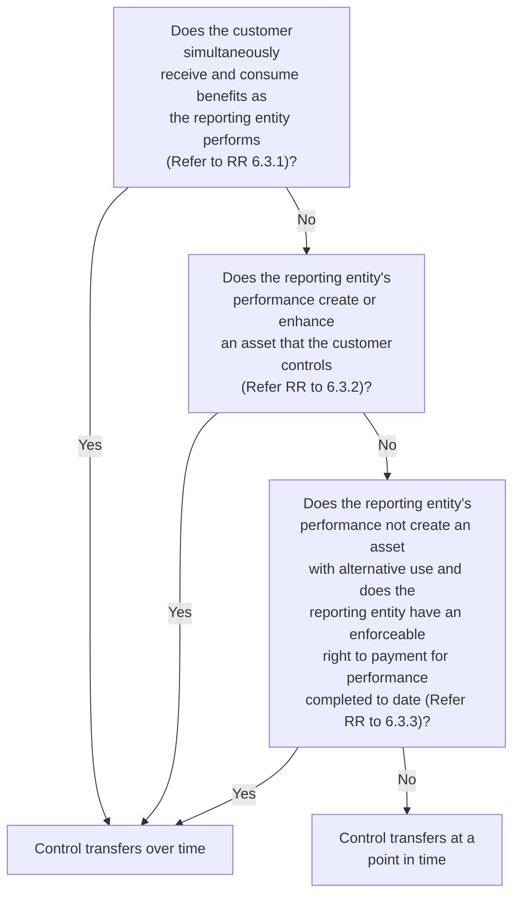

### 6.3.1 Customer receives and consumes benefits as the entity performs
This criterion primarily applies to contracts for the provision of services, such as transaction processing or security services. A reporting entity transfers the benefit of the services to the customer as it performs and therefore satisfies its performance obligation over time.

This criterion could also apply to arrangements that are not typically viewed as services, such as contracts to deliver electricity or other commodities. For example, a reporting entity that provides a continuous supply of natural gas upon demand might conclude that the natural gas is simultaneously received and consumed by the customer. This assessment could require judgment. Refer to Revenue TRG Memo No. 43 and the related meeting minutes in Revenue TRG Memo No. 44 for further discussion of this topic.

The customer receives and consumes the benefits as the reporting entity performs if another reporting entity would not need to substantially reperform the work completed


Recognizing revenue | 6-4

to date to satisfy the remaining obligations. The fact that another reporting entity would not have to reperform work already performed indicates that the customer receives and consumes the benefits throughout the arrangement.

Contractual or practical limitations that prevent a reporting entity from transferring the remaining obligations to another reporting entity are not considered in this assessment. The objective is to determine whether control transfers over time using a hypothetical assessment of whether another reporting entity would have to reperform work completed to date. Limitations that would prevent a reporting entity from practically transferring a contract to another reporting entity are therefore disregarded.

Example RR 6-1 illustrates a customer simultaneously receiving and consuming the benefits provided by a reporting entity’s performance. This concept is also illustrated in Example 13 of the revenue standard (ASC 606-10-55-159 through ASC 606-10-55-160).

### EXAMPLE RR 6-1
**Recognizing revenue — simultaneously receiving and consuming benefits**

RailroadCo is a freight railway reporting entity that enters into a contract with Shipper to transport goods from location A to location B for $1,000. Shipper has an unconditional obligation to pay for the service when the goods reach point B.

When should RailroadCo recognize revenue from this contract?

**Analysis**

RailroadCo would recognize revenue as it transports the goods because the performance obligation is satisfied over that period. RailroadCo would determine the extent of transportation service delivered at the end of each reporting period and recognize revenue in proportion to the service delivered.

Shipper receives benefit as the goods are moved from location A to location B since another reporting entity will not need to transport the goods to their current location if RailroadCo fails to transport the goods the entire distance. There might be practical limitations to another reporting entity taking over the shipping obligation partway through the contract, but these are ignored in the assessment.

---

### 6.3.2 Entity creates or enhances an asset that the customer controls
This criterion applies in situations where the customer controls the work in process as the reporting entity manufactures goods or provides services. The asset being created can be tangible or intangible. Such arrangements could include construction or manufacturing contracts in which the customer controls the work in process, or research and development contracts in which the customer owns the findings. For example, if a reporting entity is constructing a building on a customer’s land, the customer would generally control any work in process arising from the reporting entity’s performance.

Management should apply the principle of control to determine whether the customer obtains control of an asset as it is created, which could require judgment. The control principle should be applied to the asset that the reporting entity’s performance creates or enhances. For example, if the reporting entity is constructing an asset, management should assess whether the customer controls that asset as it is


PwC US National Office | viewpoint.pwc.com 6-5

constructed. A customer’s ability to sell or pledge a right to obtain the asset in the future is not evidence of control of the asset itself.

As discussed in BC 129, the FASB included this criterion to address situations in when the customer clearly controls the asset being created or enhanced. Absent evidence that the customer controls the asset (based on the control definition and indicators discussed in RR 6.5), management would need to assess the other criteria to conclude whether control transfers over time.

### 6.3.3 Asset has no alternative use and the entity has right to payment
This last criterion was developed to assist reporting entities in their assessment of control when applying the first two criteria for recognizing revenue over time discussed in RR 6.3.1 and RR 6.3.2 is challenging. Reporting entities that create assets with no alternative use that have a right to payment for performance to date recognize revenue as the assets are produced, rather than at a point in time (for example, upon delivery).

This criterion might also be useful in evaluating services that are specific to a customer. An example is a contract to provide consulting services where the customer receives a written report when the work is completed and is obligated to pay for the work completed to date if the contract is cancelled. Revenue is recognized over time in this situation since no asset with an alternative use is created, assuming the right to payment compensates the reporting entity for performance to date.

#### 6.3.3.1 No alternative use
An asset has an alternative use if a reporting entity can redirect that asset for another use or to another customer. An asset does not have an alternative use if the reporting entity is unable, because of contractual restrictions or practical limitations, to redirect the asset for another use or to another customer. Contractual restrictions and practical limitations could exist in a broad range of contracts. Judgment is needed in many situations to determine whether an asset has an alternative use.

Management should assess at contract inception whether the asset that will ultimately be transferred to the customer has an alternative use. This assessment is only updated if there is a contract modification that substantively changes the terms of the arrangement.

Contractual restrictions on a reporting entity’s ability to redirect an asset are common in some industries. A contractual restriction exists if the customer has the ability to enforce its right to a specific product or products in the event the reporting entity attempts to use that product for another purpose, such as a sale to a different customer.

One type of restriction is a requirement to deliver to a specific customer certain specified units manufactured by the reporting entity (for example, the first ten units manufactured). Such a restriction could indicate that the asset has no alternative use, regardless of whether the product might otherwise be a standard inventory item or not highly customized. This is because the customer has the ability to restrict the reporting entity from using it for other purposes.

Practical limitations can also indicate that an asset has no alternative use. An asset that requires significant rework (at a significant cost) for it to be suitable for another customer or for another purpose will likely have no alternative use. For example, a highly specialized part that can only be used by a specific customer is unlikely to be sold to another customer without requiring significant rework. A practical limitation


Recognizing revenue | 6-6

would also exist if the reporting entity could only sell the asset to another customer at a significant loss. It may require significant judgment in some cases to determine whether practical limitations exist in an arrangement.

***

**QUESTION RR 6-1**

In some fact patterns, an asset has an alternative use for part of the production process. For example, in earlier stages of production, the reporting entity may be able to redirect the asset to another customer because it has not yet been customized to meet the original customer’s unique design specifications. Should a reporting entity consider only the completed asset when determining whether the asset has alternative use?

***PwC response***

Yes. The assessment of the “no alternative use” criterion should be based on whether the asset in its final form, which will ultimately be transferred to the customer, has an alternative use. Refer to US Revenue TRG Memo No. 56 and the related meeting minutes in Revenue TRG Memo No. 60 for further discussion of this topic.

***

### 6.3.3.2 Right to payment for performance to date

This criterion is met if a reporting entity is entitled to payment for performance completed to date, at all times during the contract term, if the customer terminates the contract for reasons other than the reporting entity’s nonperformance. The assessment of whether a right to payment exists may not be straight forward and depends on the contract terms and relevant laws and regulations. Management will generally have to assess the right to payment on a contract-by-contract basis; therefore, variances in contract terms could result in recognizing revenue at a point in time for some contracts and over time for others, even when the products promised in the contracts are similar. Refer to US Revenue TRG Memo No. 56 and the related meeting minutes in Revenue TRG Memo No. 60 for further discussion of this topic.

A reporting entity’s right to payment for performance completed to date does not have to be a present unconditional right; that is, the contract does not have to contain explicit contractual terms that entitle the reporting entity to invoice at any point throughout the contract period. Many arrangements include terms that stipulate that progress or milestone payments are required only at specified intervals, or only upon completion of the contract. Regardless of the stated payment terms or payment schedule, management needs to determine whether the reporting entity would have an enforceable right to demand payment if the customer cancelled the contract for other than a breach or nonperformance. A right to payment would also exist if the contract (or other laws) entitles the reporting entity to continue fulfilling the contract and demand payment from the customer under the terms of the contract in the event the customer attempts to terminate the contract.

**Assessing whether a right to payment is enforceable**

A reporting entity’s enforceable right to payment for performance completed to date will generally be evidenced by the contractual terms agreed to by the parties. However, the revenue standard provides that legislation or legal precedent in the relevant jurisdiction might supplement or override the contractual terms. A reporting entity asserting that it has an enforceable right to payment despite the lack of a contractual right should have sufficient legal evidence to support this conclusion. The fact that the reporting entity would have a basis for making a claim against the counterparty in a court of law is not sufficient to support that there is an enforceable right to payment.


PwC US National Office | viewpoint.pwc.com 6-7

If the contractual terms do not provide for a right to payment, we do not believe management is required to do an exhaustive search for legal evidence that might support an enforceable right to payment; however, it would be inappropriate for a reporting entity to ignore evidence that clearly provides for such a right. Similarly, if the contractual terms do provide for a right to payment, it would be inappropriate to ignore evidence that clearly indicates such rights have no binding legal effect.

Even if a reporting entity has a customary business practice of not enforcing right to payment clauses in its contracts, this generally does not mean there is no longer an enforceable right to payment. Such a business practice would only impact the assessment if it renders the right unenforceable in a particular legal environment.

### QUESTION RR 6-2
Can a reporting entity conclude it has an enforceable right to payment for performance if the contract includes an acceptance provision?

#### PwC response
It depends. If the nature of the acceptance provision is to confirm that the reporting entity has performed in accordance with the contract, we believe the provision would not impact the assessment of whether the reporting entity has an enforceable right to payment. However, if the acceptance provision relates primarily to subjective specifications and allows a customer to avoid paying for performance to date for reasons other than a breach or nonperformance, an enforceable right to payment would likely not exist. Refer to RR 6.5.5 for further discussion of acceptance provisions.

### Assessing whether the payment compensates for performance to date
The amount of the payment that the reporting entity can enforce must at least compensate the reporting entity for performance to date at any point during the contract. The amount should reflect the selling price of the goods or services provided to date. For example, a reporting entity would have an enforceable right to payment if it is entitled to receive an amount that covers its cost plus a reasonable profit margin for work completed. A reporting entity that is entitled only to recover costs incurred does not have a right to payment for the work to date if the selling price of the finished goods or completed services includes a profit margin.

The revenue standard describes a reasonable profit margin as follows.

> **Excerpt from ASC 606-10-55-11**
>
> Compensation for a reasonable profit margin need not equal the profit margin expected if the contract was fulfilled as promised, but an entity should be entitled to compensation for either of the following amounts:
>
> a. A proportion of the expected profit margin in the contract that reasonably reflects the extent of the entity’s performance under the contract before termination by the customer (or another party)
>
> b. A reasonable return on the entity’s cost of capital for similar contracts (or the entity’s typical operating margin for similar contracts) if the contract-specific margin is higher than the return the entity usually generates from similar contracts.


Recognizing revenue | 6-8

A specified payment schedule does not necessarily indicate that the reporting entity has a right to payment for performance. This could be the case in situations where milestone payments are not based on performance. Management should assess whether the payments at least compensate the reporting entity for performance to date. The payments should also be nonrefundable in the event of a contract cancellation (for reasons other than nonperformance).

Customer deposits and other upfront payments should also be assessed to determine if they compensate the reporting entity for performance completed to date. A significant nonrefundable upfront payment could meet the requirement if the reporting entity has the right to retain that payment in the event the customer terminates the contract, and the payment would at least compensate the reporting entity for work performed to date throughout the contract. The requirement would also be met even if a portion of the customer deposit is refundable as long as the amount retained by the reporting entity provides compensation for work performed to date throughout the contract.

In assessing whether the reporting entity has a right to payment for performance completed to date, management should only consider payments it has a right to receive from the customer. That is, management should not include payments it might receive from other parties (for example, payments it might receive upon resale of the good).

#### QUESTION RR 6-3
Can a right to payment for performance completed to date exist when the contract is priced at cost or at a loss, and thus the right to payment does not include a profit margin?

**PwC response**
Yes. The principle for assessing whether a reporting entity has a right to payment for performance is based on whether the reporting entity has a right to be compensated at an amount that approximates the selling price of the goods or services transferred to date. While the selling price for a contract will often be based on estimated costs plus a profit margin, selling price will not include a margin if the contract is priced at cost or at a loss. For example, a reporting entity might be willing to incur a loss on a sale if it has a strong expectation of obtaining a profit on future orders from the customer, even though such orders are not contractually guaranteed. We believe the analysis of right to payment should be focused on whether the reporting entity has a right to a proportionate amount of the selling price (reflecting performance to date) rather than solely based on whether such amount is equal to costs incurred plus a profit margin.

### 6.3.3.3 Examples of no alternative use and right to payment
Example RR 6-2, Example RR 6-3, Example RR 6-4, and Example RR 6-5 illustrate the assessment of alternative use and right to payment. These concepts are also illustrated in Examples 14-17 of the revenue standard (ASC 606-10-55-161 through ASC 606-10-55-182).

#### EXAMPLE RR 6-2
**Recognizing revenue — asset with an alternative use**

Manufacturer enters into a contract to manufacture an automobile for Car Driver. Car Driver specifies certain options such as color, trim, electronics, etc. Car Driver makes a nonrefundable deposit to secure the automobile, but does not control the work in


PwC US National Office | viewpoint.pwc.com 6-9

process. Manufacturer could choose at any time to redirect the automobile to another customer and begin production on another automobile for Car Driver with the same specifications.

How should Manufacturer recognize revenue from this contract?

### *Analysis*

Manufacturer should recognize revenue at a point in time, when control of the automobile passes to Car Driver. The arrangement does not meet the criteria for a performance obligation satisfied over time. Car Driver does not control the asset during the manufacturing process. Car Driver did specify certain elements of the automobile, but these do not create a practical or contractual restriction on Manufacturer’s ability to transfer the car to another customer. Manufacturer is able to redirect the automobile to another customer at little or no additional cost and therefore it has an alternative use to Manufacturer.

Now assume the same facts, except Car Driver has an enforceable right to the first automobile produced by Manufacturer. Manufacturer could practically redirect the automobile to another customer, but would be contractually prohibited from doing so. The asset would not have an alternative use to Manufacturer in this situation. The arrangement would meet the criteria for a performance obligation satisfied over time assuming Manufacturer is entitled to payment for the work it performs as the automobile is built.

#### EXAMPLE RR 6-3
#### Recognizing revenue — highly specialized asset without an alternative use

Cruise Builders enters into a contract to manufacture a cruise ship for Cruise Line. The ship is designed and manufactured to Cruise Line’s specifications. Cruise Builders could redirect the ship to another customer, but only if Cruise Builders incurs significant cost to reconfigure the ship. Assume the following additional facts:

[ ] Cruise Line does not take physical possession of the ship as it is being built.
[ ] The contract contains one performance obligation as the goods and services to be provided are not distinct.
[ ] Cruise Line is obligated to pay Cruise Builder an amount equal to the costs incurred plus an agreed profit margin if Cruise Line cancels the contract.

How should Cruise Builder recognize revenue from this contract?

### *Analysis*

Cruise Builder should recognize revenue over time as it builds the ship. The asset is constructed to Cruise Line’s specifications and would require substantive rework to be useful to another customer. Cruise Builder cannot sell the ship to another customer without significant cost and therefore, the ship does not have an alternative use. Cruise Builder also has a right to payment for performance completed to date. The criteria are met for a performance obligation satisfied over time.

#### EXAMPLE RR 6-4
#### Recognizing revenue — right to payment

Design Inc enters into a contract with EquipCo to deliver the next piece of specialized equipment produced. The contract price is $1 million, which includes a profit margin


Recognizing revenue | 6-10

of 30%. EquipCo can terminate the contract at any time. EquipCo makes a nonrefundable deposit at contract inception to cover the cost of materials that Design Inc will procure to produce the specialized equipment. The contract precludes Design Inc from redirecting the equipment to another customer. EquipCo does not control the equipment as it is produced.

How should Design Inc recognize revenue for this contract?

### Analysis

Design Inc should recognize revenue at a point in time, when control of the equipment transfers to EquipCo. The specialized equipment does not have an alternative use to Design Inc because the contract has substantive terms that preclude it from redirecting the equipment to another customer. Design Inc, however, is only entitled to payment for costs incurred, not for costs plus a reasonable profit margin. The criterion for a performance obligation satisfied over time is not met because Design Inc does not have a right to payment for performance completed to date. This is because the contract price includes a profit, yet Design Inc can only recover costs incurred if EquipCo terminates the contract.

---

#### EXAMPLE RR 6-5
Recognizing revenue — no right to payment for standard components

MachineCo enters into a contract to build a large, customized piece of equipment for Manufacturer. Because of the unique customer specifications, MachineCo cannot redeploy the equipment to other customers or otherwise modify the design and functionality of the equipment without incurring a substantial amount of rework.

MachineCo purchases or manufactures various standard components used to construct the equipment. MachineCo is entitled to payment for costs incurred plus a reasonable margin if Manufacturer terminates the contract early. MachineCo is not entitled to payment for standard components until they have been integrated into the customized equipment that will delivered to the customer. This is because MachineCo can use those components in other projects before they are integrated into the customized equipment.

Does MachineCo have an enforceable right to payment for performance completed to date?

### Analysis

MachineCo has an enforceable right to payment for performance completed to date because it will be compensated for costs incurred plus a reasonable margin once the standard components have been integrated into the customized equipment. The revenue standard requires a reporting entity to have a right to payment for *performance completed* at all times during the contract term. MachineCo’s performance related to the contract occurs once it begins to incorporate the standard components into the customized equipment.

MachineCo has an enforceable right to payment and the equipment does not have an alternative use; therefore, MachineCo should recognize revenue over time as it constructs the equipment. MachineCo would record standard components as inventory prior to integration into the customized equipment.

---


PwC US National Office | viewpoint.pwc.com 6-11

# 6.4 Measures of progress

Once management determines that a performance obligation is satisfied over time, it must measure its progress toward completion to determine the timing of revenue recognition.

> **ASC 606-10-25-31**
>
> For each performance obligation satisfied over time..., an entity shall recognize revenue over time by measuring the progress toward complete satisfaction of that performance obligation. The objective when measuring progress is to depict an entity's performance in transferring control of goods or services promised to a customer (that is, satisfaction of an entity's performance obligation).

The purpose of measuring progress toward satisfaction of a performance obligation is to recognize revenue in a pattern that reflects the transfer of control of the promised good or service to the customer. Management can employ various methods for measuring progress, but should select the method that best depicts the transfer of control of goods or services.

Methods for measuring progress include:

[ ] Output methods, that recognize revenue based on direct measurements of the value transferred to the customer

[ ] Input methods, that recognize revenue based on the reporting entity's efforts to satisfy the performance obligation

Each of these methods has advantages and disadvantages, which should be considered in determining which is the most appropriate in a particular arrangement. The method selected for measuring progress toward completion should be consistently applied to arrangements with similar performance obligations and similar circumstances.

Circumstances affecting the measurement of progress often change for performance obligations satisfied over time, such as a reporting entity incurring more costs than expected. Management should update its measure of progress and the revenue recognized to date as a change in estimate when circumstances change to accurately depict the reporting entity's performance completed to date.

The boards noted in the basis for conclusions to the revenue standard that selection of a method is not simply an accounting policy election. Management should select the method of measuring progress that best depicts the transfer of goods or services to the customer.

> **Excerpt from ASU 2014-09 BC159**
>
> That does not mean that an entity has a "free choice." The guidance states that an entity should select a method of measuring progress that is consistent with the clearly stated objective of depicting the entity's performance—that is, the satisfaction of an entity's performance obligation in transferring control of goods or services to the customer.


Recognizing revenue 6-12

### 6.4.1 Output methods
Output methods measure progress toward satisfying a performance obligation based on results achieved and value transferred.

> **Excerpt from ASC 606-10-55-17**
>
> Output methods recognize revenue on the basis of direct measurements of the value to the customer of the goods or services transferred to date relative to the remaining goods or services promised under the contract.

Examples of output measures include surveys of work performed, units produced, units delivered, and contract milestones. Output methods directly measure performance and can be the most faithful representation of progress. It can be difficult to obtain directly observable information about the output of performance without incurring undue costs in some circumstances, in which case use of an input method might be necessary.

The measure selected should depict the reporting entity’s performance to date, and should not exclude a material amount of goods or services for which control has transferred to the customer. Measuring progress based on units produced or units delivered, for example, might be a reasonable proxy for measuring the satisfaction of performance obligations in some, but not all, circumstances. These measures should not be used if they do not take into account work in process for which control has transferred to the customer.

A method based on units delivered could provide a reasonable proxy for the reporting entity’s performance if the value of any work in process and the value of any units produced, but not yet transferred to the customer, is immaterial to both the contract and the financial statements as a whole at the end of the reporting period.

Measuring progress based on contract milestones is unlikely to be appropriate if there is significant performance between milestones. Material amounts of goods or services that are transferred between milestones should not be excluded from the reporting entity’s measure of progress, even though the next milestone has not yet been met.

#### QUESTION RR 6-4
Can control of a good or service transfer at discrete points in time when a performance obligation is satisfied over time?

**PwC response**
Generally, no. Although the revenue standard cites milestones reached, units produced, and units delivered as examples of output methods, management should use caution in selecting these methods as they may not reflect the reporting entity’s progress in satisfying its performance obligations. Management will need to assess whether the measure of progress is correlated to performance and whether the reporting entity has transferred material goods or services that are not captured in the output measure. An appropriate measure of progress should not result in a reporting entity accumulating a material asset (such as work in process) as that would indicate that the measure does not reflect the reporting entity’s performance. Refer to US Revenue TRG Memo No. 53 and the related meeting minutes in Revenue TRG Memo No. 55 for further discussion of this topic.


PwC US National Office | viewpoint.pwc.com 6-13

Example RR 6-6 illustrates measuring progress toward satisfying a performance obligation using an output method.

### EXAMPLE RR 6-6
Measuring progress — output method

Construction Co lays railroad track and enters into a contract with Railroad to replace a stretch of track for a fixed fee of $100,000. All work in process is the property of Railroad.

Construction Co has replaced 75 units of track of 100 total units of track to be replaced through year end. The effort required of Construction Co is consistent across each of the 100 units of track to be replaced.

Construction Co determines that the performance obligation is satisfied over time as Railroad controls the work in process asset being created.

How should Construction Co recognize revenue?

#### *Analysis*

An output method using units of track replaced to measure Construction Co’s progress under the contract would appear to be most representative of services performed as the effort is consistent across each unit of track replaced. Additionally, this method appropriately depicts the reporting entity’s performance as all work in process for which control has transferred to the customer would be captured in this measure of progress. The progress toward completion is 75% (75 units/100 units), so Construction Co would recognize revenue equal to 75% of the total contract price, or $75,000.

#### 6.4.1.1 “Right to invoice” practical expedient
Management can elect a practical expedient to recognize revenue based on amounts invoiced to the customer in certain circumstances.

> **Excerpt from ASC 606-10-55-18**
>
> As a practical expedient, if an entity has a right to consideration from a customer in an amount that corresponds directly with the value to the customer of the entity’s performance completed to date (for example, a service contract in which an entity bills a fixed amount for each hour of service provided), the entity may recognize revenue in the amount to which the entity has a right to invoice.

Evaluating whether a reporting entity’s right to consideration corresponds directly with the value transferred to the customer will require judgment. Management should not presume that a negotiated payment schedule automatically implies that the invoiced amounts represent the value transferred to the customer. The market prices or standalone selling prices of the goods or services could be evidence of the value to the customer; however, other evidence could also be used to demonstrate that the amount invoiced corresponds directly with the value transferred to the customer. Refer to Revenue TRG Memo No. 40 and the related meeting minutes in Revenue TRG Memo No. 44 for further discussion of this topic.

The revenue standard refers to an example of a “fixed amount for each hour of service,” but this does not preclude application of the practical expedient to contracts


Recognizing revenue | 6-14

with pricing that varies over the term of the contract. Reporting entities will need sufficient evidence that the variable pricing reflects "value to the customer" throughout the contract.

Consider a contract to provide electricity to a customer for a three-year period at rates that increase over the contract term. The reporting entity might conclude that the increasing rates reflect "value to the customer" if, for example, the rates reflect the forward market price of electricity at contract inception. In contrast, consider an arrangement to provide monthly payroll processing services with a payment schedule requiring lower monthly payments during the first part of the contract and higher payments later in the contract because of the customer's short-term cash flow requirements. In this case, the increasing rates do not reflect "value to the customer."

Other payment streams within a contract could affect a reporting entity's ability to elect the practical expedient. For example, the presence of an upfront payment (or back-end rebate) in a contract may indicate that the amounts invoiced do not reflect value to the customer for the reporting entity's performance completed to date. Management should consider the nature of such payments and their size relative to the total arrangement.

Reporting entities electing the "right to invoice" practical expedient can also elect to exclude certain disclosures about the remaining performance obligations in the contract. Refer to FSP 33.4 for further discussion of the disclosure requirements.

### QUESTION RR 6-5
A reporting entity enters into a four-year, noncancellable service contract with a customer that includes a series of distinct services. The contractual pricing increases 10% annually. Can the reporting entity use the "right to invoice" practical expedient and record revenue based on the contractual pricing each year?

#### PwC response
It depends. Management will need to assess whether the requirements to apply the practical expedient are met. In order to use the practical expedient, the escalating fees in the contract need to correspond directly with the value to the customer of the reporting entity's performance (that is, the value of the services in the second year are 10% higher than the value of the services in the first year). Management should consider factors such as the business reasons for the escalating fees and expected pricing of the services in future years. If the scheduled price increases in the contract do not correspond directly with the increase in value to the customer of the reporting entity's performance, management will not be able to elect the practical expedient and will need to determine another appropriate measure of progress. For example, it may be appropriate to use a time-based measure of progress (that is, straight-line recognition). A time-based measure of progress would result in recognition of the total transaction price ratably over the four-year period.

### 6.4.2 Input methods
Input methods measure progress toward satisfying a performance obligation indirectly.

> **Excerpt from ASC 606-10-55-20**
>
> Input methods recognize revenue on the basis of the entity's efforts or inputs to the satisfaction of a performance obligation (for example, resources consumed, labor


PwC US National Office | viewpoint.pwc.com 6-15

> hours expended, costs incurred, time elapsed, or machine hours used) relative to the total expected inputs to the satisfaction of that performance obligation.

Input methods measure progress based on resources consumed or efforts expended relative to total resources expected to be consumed or total efforts expected to be expended. Examples of input methods include costs incurred, labor hours expended, machine hours used, time lapsed, and quantities of materials.

Judgment is needed to determine which input measure is most indicative of performance, as well as which inputs should be included or excluded. A reporting entity using an input measure should include only those inputs that depict the reporting entity’s performance toward satisfying a performance obligation. Inputs that do not reflect performance should be excluded from the measure of progress.

Management should exclude from its measure of progress any costs incurred that do not result in the transfer of control of a good or service to a customer. For example, mobilization or set-up costs, while necessary for a reporting entity to be able to perform under a contract, might not transfer any goods or services to the customer. Management should consider whether such costs should be capitalized as a fulfillment cost as discussed in RR 11.

### 6.4.2.1 Input methods based on cost incurred
One common input method uses costs incurred relative to total estimated costs to determine the extent of progress toward completion. It is often referred to as the “cost-to-cost” method.

Costs that might be included in measuring progress in the “cost-to-cost” method if they represent progress under the contract include:

[ ] Direct labor
[ ] Direct materials
[ ] Subcontractor costs
[ ] Allocations of costs related directly to contract activities if those depict the transfer of control to the customer
[ ] Costs explicitly chargeable to the customer under the contract
[ ] Other costs incurred solely due to the contract

Some items included in the “cost-to-cost” method, such as direct labor and materials costs, are easily identifiable. It can be more challenging to determine if other types of costs should be included, for example insurance, depreciation, and other overhead costs. Management needs to ensure that any cost allocations include only those costs that contribute to the transfer of control of the good or service to the customer.

Costs that are not related to the contract or that do not contribute toward satisfying a performance obligation are not included in measuring progress. Examples of costs that do not depict progress in satisfying a performance obligation include:

[ ] General and administrative costs that are not directly related to the contract (unless explicitly chargeable to the customer under the contract)
[ ] Selling and marketing costs


Recognizing revenue 6-16

- [ ] Research and development costs that are not specific to the contract
- [ ] Depreciation of idle plant and equipment

These costs are general operating costs of a reporting entity, not costs to progress a contract toward completion.

Other costs that do not depict progress, unless they are planned or budgeted when negotiating the contract, are excluded from the 'cost-to-cost' method. This will include costs of wasted materials, labor and other resources that represent inefficiencies in the entity's performance, rather than progress in transferring control of a good or service.

Example RR 6-7 illustrates measuring progress toward satisfying a performance obligation using an input method.

### EXAMPLE RR 6-7
Measuring progress — "cost-to-cost" method

Contractor enters into a contract with Government to build an aircraft carrier for a fixed price of $4 billion. The contract contains a single performance obligation that is satisfied over time.

Additional contract characteristics are:

- [ ] Total estimated contract costs are $3.6 billion, excluding costs related to wasted labor and materials.
- [ ] Costs incurred in year one are $740 million, including $20 million of wasted labor and materials.

Contractor concludes that the performance obligation is satisfied over time as Government controls the aircraft carrier as it is created. Contractor also concludes that an input method using costs incurred to total cost expected to be incurred is an appropriate measure of progress toward satisfying the performance obligation.

How much revenue and cost should Contractor recognize as of the end of year one?

#### *Analysis*

Contractor would recognize revenue of $800 million based on a calculation of costs incurred relative to the total expected costs. Contractor would recognize revenue as follows ($ million):

<table>
  <tbody>
    <tr>
        <td>Total transaction price</td>
        <td>$</td>
        <td>4,000</td>
    </tr>
    <tr>
        <td>Progress toward completion</td>
        <td>20% ($720 / $3,600)</td>
        <td></td>
    </tr>
    <tr>
        <td>Revenue recognized</td>
        <td>$</td>
        <td>800</td>
    </tr>
    <tr>
        <td>Cost recognized</td>
        <td>$</td>
        <td>740</td>
    </tr>
    <tr>
        <td>Gross profit</td>
        <td>$</td>
        <td>60</td>
    </tr>
  </tbody>
</table>

Wasted labor and materials of $20 million should be excluded from the calculation, as the costs do not represent progress toward completion of the aircraft carrier.


PwC US National Office | viewpoint.pwc.com 6-17

### 6.4.2.2 Uninstalled materials

Uninstalled materials are materials acquired by a contractor that will be used to satisfy its performance obligations in a contract for which the cost incurred does not depict transfer to the customer. The cost of uninstalled materials should be excluded from measuring progress toward satisfying a performance obligation if the reporting entity is only providing a procurement service. A faithful depiction of a reporting entity’s performance might be to recognize revenue equal to the cost of the uninstalled materials (that is, at a zero margin) if all of the following conditions are met:

> **Excerpt from ASC 606-10-55-21(b)**
>
> 1. The good is not distinct.
> 2. The customer is expected to obtain control of the good significantly before receiving services related to the good.
> 3. The cost of the transferred good is significant relative to the total expected costs to completely satisfy the performance obligation.
> 4. The entity procures the good from a third party and is not significantly involved in designing and manufacturing the good (but the entity is acting as a principal...)

Example RR 6-8 illustrates accounting for an arrangement that includes uninstalled materials. This concept is also illustrated in Example 19 of the revenue standard (ASC 606-10-55-187 through ASC 606-10-55-192).

#### EXAMPLE RR 6-8
**Measuring progress — uninstalled materials**

Contractor enters into a contract to build a power plant for UtilityCo. The contract specifies a particular type of turbine to be procured and installed in the plant. The contract price is $200 million. Contractor estimates that the total costs to build the plant are $160 million, including costs of $50 million for the turbine.

Contractor procures and obtains control of the turbine and delivers it to the building site. UtilityCo has control over any work in process. Contractor has determined that the contract is one performance obligation that is satisfied over time as the power plant is constructed, and that it is the principal in the arrangement (as discussed in RR 10).

How much revenue should Contractor recognize upon delivery of the turbine?

**Analysis**

Contractor would recognize revenue of $50 million and costs of $50 million when the turbine is delivered. Contractor has retained the risks associated with installing the turbine as part of the construction project. UtilityCo has obtained control of the turbine because it controls work in process, and the turbine’s cost is significant relative to the total expected contract costs. Contractor was not involved in designing and manufacturing the turbine and therefore concludes that including the costs in the measure of progress would overstate the extent of its performance. The turbine is an


Recognizing revenue | 6-18

uninstalled material and Contractor would therefore only recognize revenue equal to the cost of the turbine.

***

#### 6.4.2.3 Learning curve
Learning curve is the effect of gaining efficiencies over time as a reporting entity performs a task or manufactures a product. When a reporting entity becomes more efficient over time in an arrangement that contains a single performance obligation satisfied over time, a reporting entity could select a method of measuring progress (such as a cost-to-cost method) that results in recognizing more revenue and expense in the earlier phases of the contract.

For example, if a reporting entity has a single performance obligation to process transactions for a customer over a five-year period, the reporting entity might recognize more revenue and expense for the earlier transactions processed relative to the later transactions if it incurs greater costs in the earlier periods due to the effect of the learning curve. Refer to RR 11.3.2 for further discussion on the accounting for learning curve costs.

#### 6.4.3 Time-based methods
Time-based methods to measure progress might be appropriate in situations when a performance obligation is satisfied evenly over a period of time or the reporting entity has a stand-ready obligation to perform over a period of time. As noted in Question RR 3-2, a stand-ready obligation will typically be a series of distinct goods or services that is accounted for as a single performance obligation. Judgment will be needed to determine the appropriate method to measure progress toward satisfaction of a stand-ready obligation that is a single performance obligation. It is not appropriate to default to straight-line attribution; however, straight-line recognition over the contract period will be reasonable in many cases. Examples include a contract to provide technical support related to a product sold to customers or a contract to provide a customer membership to a health club. This concept is illustrated in Example 18 of the revenue standard (ASC 606-10-55-184 through ASC 606-10-55-186).

Judgment is required to determine whether the nature of a reporting entity’s promise is to stand ready to provide goods or services or a promise to provide specified goods or services. For example, a promise to provide one or more specified upgrades to a software license is not a stand-ready performance obligation. A contract to deliver unspecified upgrades on a when-and-if-available basis, however, would typically be a stand-ready performance obligation. This is because the customer benefits evenly throughout the contract period from the guarantee that any updates or upgrades developed by the reporting entity during the period will be made available. Refer to Revenue TRG Memo No. 16 and the related meeting minutes in Revenue TRG Memo No. 25 for further discussion of this topic.

A measure of progress based on delivery or usage (rather than a time-based method) will best reflect the reporting entity’s performance in some instances. For example, a promise to provide a fixed quantity of a good or service (when the quantity of remaining goods or services to be provided diminishes with customer usage) is typically a promise to deliver the underlying good or service rather than a promise to stand ready. In contrast, a contract that contains a promise to deliver an unlimited quantity of a good or service might be a stand-ready obligation for which a time-based measure of progress is appropriate.

Example RR 6-9 and Example RR 6-10 illustrate the assessment of whether a time-based method is appropriate for measuring progress toward satisfying a performance obligation.


PwC US National Office | viewpoint.pwc.com 6-19

**EXAMPLE RR 6-9**
Measuring progress — stand-ready obligation

SoftwareCo enters into a contract with a customer to provide a software license and unlimited access to its call center for a one-year period. SoftwareCo determines that the software license and support services are separate performance obligations. Customers typically utilize the call center throughout the one-year term of the contract.

How should SoftwareCo recognize revenue for the unlimited support services?

***Analysis***

SoftwareCo would conclude its promise to the customer is a stand-ready obligation to provide unlimited access to its call center. SoftwareCo would then determine a measure of progress that best reflects its performance in satisfying this obligation. Assuming a time-based measure, SoftwareCo would recognize revenue for the support services on a straight-line basis over the one-year service period.

**EXAMPLE RR 6-10**
Measuring progress — obligation to provide a specified quantity of services

SoftwareCo enters into a contract with a customer to provide a software license and 100 hours of call center support for a one-year period. SoftwareCo determines that the software license and support services are separate performance obligations. SoftwareCo monitors customer usage of support hours to determine when the hours have been utilized. Customers are charged an additional fee for call center usage beyond 100 hours. Customers frequently use more than 100 hours of support.

How should SoftwareCo recognize revenue for the 100 hours of support services?

***Analysis***

SoftwareCo would conclude that its promise to the customer is to provide 100 hours of call center support. SoftwareCo would then determine an output method. Assuming a conclusion that hours of service provided best reflects its efforts in satisfying the performance obligation, revenue would be recognized based on the customer’s usage of the support services.

### 6.4.4 Inability to estimate progress
Circumstances can exist where a reporting entity is not able to reasonably determine the outcome of a performance obligation or its progress toward satisfaction of that obligation. It is appropriate in these situations to recognize revenue over time as the work is performed, but only to the extent of costs incurred (that is, with no profit recognized) as long as the reporting entity expects to at least recover its costs.

Management should discontinue this practice once it has better information and can estimate a reasonable measure of performance. A cumulative catch-up adjustment should be recognized in the period of the change in estimate to recognize revenue related to prior performance that had not been recognized due to the inability to measure progress.


Recognizing revenue | 6-20

### 6.4.5 Progress when multiple items form a single performance obligation
A single performance obligation could contain a bundle of goods or services that are not distinct. The guidance requires that reporting entities apply a single method to measure progress for each performance obligation satisfied over time.

It could be challenging to identify a single method to measure progress that reflects the reporting entity’s performance, particularly when the individual goods or services included in the single performance obligation will be transferred over different periods of time. A reporting entity should consider the nature of its overall promise for the performance obligation to determine the appropriate measure of progress. In making this assessment, a reporting entity should consider the rationale for combining the individual goods or services into a single performance obligation. Refer to Revenue TRG Memo No. 41 and the related meeting minutes in Revenue TRG Memo No. 44 for further discussion of this topic.

For contracts that include multiple payment streams, such as upfront payments, contingent performance bonuses, and reimbursement of out-of-pocket expenses, reporting entities should apply a single measure of progress to each performance obligation satisfied over time to recognize revenue. That is, all payment streams should be included in the total transaction price and recognized according to the identified measure of progress, regardless of the timing of payment. For example, an upfront payment should not be amortized on a straight-line, time-elapsed basis if another measure, such as costs incurred, labor hours, or units produced, is used to measure progress for the related performance obligation. Refer to RR 8.4 for further discussion of upfront payments.

### 6.4.6 Partially satisfied performance obligations
Reporting entities sometimes commence activities on a specific anticipated contract before finalizing the contract with the customer or meeting the contract criteria (refer to RR 2.6.1). At the date the contract criteria are met, a reporting entity should recognize revenue for any promised goods or services that have already been transferred (that is, revenue should be recognized on a cumulative catch-up basis). Refer to Revenue TRG Memo No. 33 and the related meeting minutes in Revenue TRG Memo No. 34 for further discussion of this topic.

Example RR 6-11 illustrates the accounting for a performance obligation that is partially satisfied prior to obtaining a contract with a customer.

#### EXAMPLE RR 6-11
**Measuring progress — partial satisfaction of performance obligations prior to obtaining a contract**

Manufacturer enters into a long-term contract with a customer to manufacture a highly customized good. The customer issues purchase orders for 60 days of supply on a rolling calendar basis (that is, every 60 days a new purchase order is issued). Purchase orders are non-cancellable and Manufacturer has a contractual right to payment for all work in process for goods once an order is received.

Manufacturer pre-assembles some goods in order to meet the anticipated demand from the customer based on a non-binding forecast provided by the customer. At the time the customer issues a purchase order, Manufacturer typically has some goods on hand that are completed and others that are partially completed. Manufacturer has determined that each customized good represents a performance obligation satisfied over time. That is, the customized goods have no alternative use and


PwC US National Office | viewpoint.pwc.com 6-21

Manufacturer has an enforceable right to payment once it receives the purchase order.

On January 1, 20X1, Manufacturer receives a purchase order from the customer for 100 goods. At that time, Manufacturer has completed 30 of the goods and partially completed 20 goods based on the forecast previously provided by the customer. Manufacturer determines that the 20 partially completed goods are 50% complete based on a cost-to-cost input method of measuring progress. The transaction price is $200 per unit and the contract includes no other promised goods or services.

How should Manufacturer account for its progress completed to date when it receives the purchase order from the customer?

**Analysis**

The contract criteria are met when Manufacturer receives the purchase order. On that date, Manufacturer should recognize revenue for any promised goods or services already transferred. Manufacturer should recognize $8,000 of revenue for performance satisfied to date ((30 completed units * $200) + (20 partially completed units * $100)) because the performance obligation is satisfied over time as the goods are assembled.

---

## 6.5 Performance obligations satisfied at a point in time

A performance obligation is satisfied at a point in time if none of the criteria for satisfying a performance obligation over time are met. The guidance on control (see RR 6.2) should be considered to determine when the performance obligation is satisfied by transferring control of the good or service to the customer. In addition, the revenue standard provides five indicators that a customer has obtained control of an asset:

[ ] The entity has a present right to payment.
[ ] The customer has legal title.
[ ] The customer has physical possession.
[ ] The customer has the significant risks and rewards of ownership.
[ ] The customer has accepted the asset.

This is a list of indicators, not criteria. Not all of the indicators need to be met for management to conclude that control has transferred and revenue can be recognized. Management needs to use judgment to determine whether the factors collectively indicate that the customer has obtained control. This assessment should be focused primarily on the customer's perspective.

### 6.5.1 Entity has a present right to payment

A customer's present obligation to pay could indicate that the reporting entity has transferred the ability to direct the use of, and obtain substantially all of the remaining benefits from, an asset.

### 6.5.2 Customer has legal title

A party that has legal title is typically the party that can direct the use of and receive the benefits from an asset. The benefits of holding legal title include the ability to sell


Recognizing revenue | 6-22

an asset, exchange it for another good or service, or use it to secure or settle debt, which indicates that the holder has control.

A reporting entity that has not transferred legal title, however, might have transferred control in certain situations. A reporting entity could retain legal title as a protective right, such as to secure payment. Legal title retained solely for payment protection does not indicate that the customer has not obtained control. All indicators of transfer of control should be considered in these situations.

Example RR 6-12 illustrates retention of legal title as a protective right.

### EXAMPLE RR 6-12
#### Recognizing revenue — legal title retained as a protective right

Equipment Dealer enters into a contract to deliver construction equipment to Landscaping Inc. Equipment Dealer operates in a country where it is common to retain title to construction equipment and other heavy machinery as protection against nonpayment by a buyer. Equipment Dealer’s normal practice is to retain title to the equipment until the buyer pays for it in full. Retaining title enables Equipment Dealer to more easily recover the equipment if the buyer defaults on payment.

Equipment Dealer concludes that there is one performance obligation in the contract that is satisfied at a point in time when control transfers. Landscaping Inc has the ability to use the equipment and move it between various work locations once it is delivered. Normal payment and credit terms apply.

When should Equipment Dealer recognize revenue for the sale of the equipment?

#### *Analysis*

Equipment Dealer should recognize revenue upon delivery of the equipment to Landscaping Inc because control has transferred. Landscaping Inc has the ability to direct the use of and receive benefits from the equipment, which indicates that control has transferred. Equipment Dealer’s retention of legal title until it receives payment does not change the substance of the transaction.

***

### 6.5.3 Customer has physical possession
Physical possession of an asset typically gives the holder the ability to direct the use of and obtain benefits from that asset, and is therefore an indicator of which party controls the asset. However, physical possession does not, on its own, determine which party has control. Management needs to carefully consider the facts and circumstances of each arrangement to determine whether physical possession coincides with the transfer of control.

Example RR 6-13 illustrates a fact pattern in which a customer has physical possession, but does not have control of an asset.

### EXAMPLE RR 6-13
#### Recognizing revenue — sale of goods with resale restrictions

Publisher ships copies of a new book to Retailer. Publisher has a present right to payment for the books, but its terms of sale restrict Retailer’s right to resell the book for several weeks to ensure a consistent release date across all retailers.

Can Publisher recognize revenue upon delivery of the books to Retailer?


PwC US National Office | viewpoint.pwc.com 6-23

### *Analysis*

It depends. Publisher will need to assess whether Retailer has the ability to direct the use of and receive the benefit from the books. Generally, we expect Publisher will conclude that Retailer does not control the books until the resale restriction lapses and Retailer can sell the book. Thus, Publisher would not recognize revenue until the restriction lapses.

Publisher should consider all relevant facts and circumstances to determine when control of the books transfers to the Retailer. For example, if Retailer is restricted from selling the books to consumers but could sell them to another distributor, with the restrictions on resale to consumers, this might indicate Retailer has the ability to direct the use of and receive the benefit from the books; that is, Publisher might conclude in this fact pattern that Retailer has obtained control of the books.

***

### 6.5.4 Customer has significant risks and rewards of ownership
A reporting entity that has transferred risks and rewards of ownership of an asset has typically transferred control to a customer, but not in all cases. Management will need to apply judgment to determine whether control has transferred in the event the seller has retained some of the risks or rewards.

Retained risks could result in separate performance obligations in some fact patterns. This would require management to allocate some of the transaction price to the additional obligation. Management should exclude any risks that give rise to a separate performance obligation when evaluating the risks and rewards of ownership.

> #### QUESTION RR 6-6
> Can control of a good transfer prior to delivery to the customer's location if a reporting entity has a customary practice of replacing or crediting the customer for lost or damaged goods in transit?
>
> #### *PwC response*
> It depends. Management would need to determine when the customer obtains control of the good considering the definition of control as well as the five indicators. The fact that the reporting entity has a practice of replacing lost or damaged goods in transit is not determinative, on its own. If the reporting entity concludes control transfers at shipping point in this fact pattern, it should consider whether there is an additional performance obligation or guarantee related to the goods while in transit.

***

### 6.5.5 Customer has accepted the asset
A customer acceptance clause provides protection to a customer by allowing it to either cancel a contract or force a seller to take corrective actions if goods or services do not meet the requirements in the contract. Judgment can be required to determine when control of a good or service transfers if a contract includes a customer acceptance clause.

Customer acceptance that is only a formality does not affect the assessment of whether control has transferred. An acceptance clause that is contingent upon the goods meeting certain objective specifications could be a formality if the reporting entity has performed tests to ensure those specifications are met before the good is shipped. Management should consider whether the reporting entity routinely manufactures and ships products of a similar nature, and the reporting entity's history


Recognizing revenue | 6-24

of customer acceptance upon receipt of products. The acceptance clause might not be a formality if the product being shipped is unique, as there is no history to rely upon.

An acceptance clause that relates primarily to subjective specifications is not likely a formality because the reporting entity cannot ensure the specifications are met prior to shipment. Management might not be able to conclude that control has transferred to the customer until the customer accepts the goods in such cases. A customer also does not control products received for a trial period if it is not committed to pay any consideration until it has accepted the products. This accounting differs from a right of return, as discussed in RR 8.2, which is considered in determining the transaction price.

Customer acceptance, as with all indicators of transfer of control, should be viewed from the customer’s perspective. Management should consider not only whether it believes the acceptance is a formality, but also whether the customer views the acceptance as a formality.

### QUESTION RR 6-7
The payment terms for a contract to sell a product to a customer specify that the final 10% of the fee is not due until the customer accepts the product. Control of the product transfers at a point in time and there are no other performance obligations in the contract. Do these payment terms indicate that control of the product does not transfer until customer acceptance?

***PwC response***
It depends. Payment terms alone are not determinative in the assessment of when control transfers to the customer. Management would need to assess the substance of the acceptance provision, including whether the acceptance relates to objective or subjective specifications, and consider the other indicators of control transfer discussed in RR 6.5. The total transaction price should be recognized at the point in time control of the product transfers to the customer; that is, it would not be appropriate to recognize 90% of the transaction price prior to acceptance and the final 10% upon acceptance.


PwC US National Office | viewpoint.pwc.com 6-25

# Chapter 7: Options to acquire additional goods or services—updated September 2025

## 7.1 Overview—customer options

This chapter discusses customer options to acquire additional goods or services. Customer options to acquire additional goods or services include sales incentives, customer loyalty points, contract renewal options, and other discounts. Certain volume discounts are also a form of customer options. Management should assess each arrangement to determine if there are options embedded in the agreement, either explicit or implicit, and the accounting effect of any options identified. Refer to RR 3.5 for further guidance on distinguishing between contracts with variable consideration and options to acquire additional goods or services.

Customer options are additional performance obligations in an arrangement if they provide the customer with a material right that it would not otherwise receive without entering into the arrangement. The customer is purchasing two things in the arrangement: the good or service originally purchased and the right to a free or discounted good or service in the future. The customer is effectively paying in advance for future goods or services.

Refunds, rebates, and other obligations to pay cash to a customer are not customer options. They affect measurement of the transaction price. Refer to RR 4 for information on measuring transaction price.

## 7.2 Customer options that provide a material right

The revenue standard provides the following guidance on customer options.

> **ASC 606-10-55-42**
>
> If, in a contract, an entity grants a customer the option to acquire additional goods or services, that option gives rise to a performance obligation in the contract only if the option provides a material right to the customer that it would not receive without entering into that contract (for example, a discount that is incremental to the range of discounts typically given for those goods or services to that class of customer in that geographical area or market). If the option provides a material right to the customer, the customer in effect pays the entity in advance for future goods or services, and the entity recognizes revenue when those future goods or services are transferred or when the option expires.

An option that provides a customer with free or discounted goods or services in the future might be a material right. A material right is a promise embedded in a current contract that should be accounted for as a separate performance obligation.

An option to purchase additional goods or services at their standalone selling prices is a marketing offer and therefore not a material right. This is true regardless of whether the customer obtained the option only as a result of entering into the current transaction. If prices are expected to increase, an option to purchase additional goods or services in the future at a current standalone selling price could be a material right. This is because the customer is being offered a discount on future goods compared to what others will have to pay as a result of entering into the current transaction.

The evaluation of whether an option provides a material right to a customer requires judgment. Both quantitative and qualitative factors should be considered, including whether the right accumulates (for example, loyalty points). Management should consider relevant transactions, including the cumulative value of rights received in the current transaction, rights that have accumulated from past transactions, and


Options to acquire additional goods or services | 7-2

additional rights expected from future transactions with the customer. Refer to Revenue TRG Memo No. 6 and the related meeting minutes in Revenue TRG Memo No. 11 for further discussion of accumulating rights.

Management should also consider whether a future discount offered to a customer is incremental to the range of discounts typically given to the same class of customer. Future discounts do not provide a material right if the customer could obtain the same discount without entering into the current transaction. The "class of customer" used in this assessment should include comparable customers (for example, customers in the same geographical location or market) that did not make the same prior purchases. For example, if a retailer offers a 50% discount off of a future purchase to customers that purchase a television, management should assess whether the discount is incremental to discounts provided to customers that did not purchase a television. Refer to US Revenue TRG Memo No. 54 and the related meeting minutes in Revenue TRG Memo No. 55 for further discussion of class of customer.

Example RR 7-1, Example RR 7-2, and Example RR 7-3 illustrate how to assess whether an option provides a material right. This concept is also illustrated in Examples 49, 50, and 51 of the revenue standard (ASC 606-10-55-336 through ASC 606-10-55-352).

### EXAMPLE RR 7-1
#### Customer options – option that does not provide a material right

Manufacturer enters into an arrangement to provide machinery and 200 hours of consulting services to Retailer for $300,000. The standalone selling price is $275,000 for the machinery and $250 per hour for the consulting services. The machinery and consulting services are distinct and accounted for as separate performance obligations.

Manufacturer also provides Retailer an option to purchase ten additional hours of consulting services at a rate of $225 per hour during the next 14 days, a 10% discount off the standalone selling price. Manufacturer offers a similar 10% discount on consulting services as part of a promotional campaign during the same period.

Does the option to purchase additional consulting services provide a material right to the customer?

***Analysis***

No, the option does not provide a material right in this example. The discount is not incremental to the discount offered to a similar class of customers because it reflects the standalone selling price of hours offered to similar customers that did not enter into a current transaction to purchase the machinery. The option is a marketing offer that is not part of the current contract. The option would be accounted for when it is exercised by the customer.

### EXAMPLE RR 7-2
#### Customer options – option that does not provide a material right

Telecom enters into a contract to provide unlimited telecom services under a multi-line "family" plan on a monthly basis. The customer has the option to add additional lines to the plan each month for a specified package price that reflects a decrease in the monthly service fee per line as additional lines are added. When customers add or subtract lines from the plan, they are making a decision on a month-to-month basis


PwC US National Office | viewpoint.pwc.com 7-3

regarding which family plan to purchase that month (for example, a three-line plan vs. a four-line plan).

Does the option to add an additional line to the plan provide the customer with a material right?

**_Analysis_**

No, the option does not provide the customer with a material right. The pricing for the family plan is based on the number of lines purchased that month and is consistent across customers, regardless of the plan a customer purchased in prior months. The customer is not receiving a discount based on its prior purchases.

### EXAMPLE RR 7-3
Customer options — option that provides a material right

Retailer has a loyalty program that awards its customers one loyalty point for every $10 spent in Retailer’s store. Program members can exchange their accumulated points for free product sold by Retailer. Based on historical data, customers frequently accumulate enough points to receive free product.

Customer purchases a product from Retailer for $50 and earns five loyalty points. Retailer estimates a standalone selling price of $0.20 per point (a total of $1 for the five points earned) on the basis of the likelihood of redemption.

Do the loyalty points provide a material right?

**_Analysis_**

Yes, the loyalty points provide a material right. Although the five points earned in this transaction might not be individually material, the points accumulate and provide the customer the right to a free product. A portion of the revenue from the transaction should be allocated to the loyalty points and recognized when the points are redeemed or expire.

#### 7.2.1 Determining the standalone selling price of customer options
Management needs to determine the standalone selling price of an option that is a material right in order to allocate a portion of the transaction price to it. Refer to RR 5 for discussion of allocating the transaction price.

The observable standalone selling price of the option should be used, if available. The standalone selling price of the option should be estimated if it is not directly observable, which is often the case. For example, management might estimate the standalone selling price of customer loyalty points as the average standalone selling price of the underlying goods or services purchased with the points.

The revenue standard provides the following guidance on estimating the standalone selling price of an option that provides a material right.


Options to acquire additional goods or services 7-4

> **Excerpt from ASC 606-10-55-44**
>
> If the standalone selling price for a customer’s option to acquire additional goods or services is not directly observable, an entity should estimate it. That estimate should reflect the discount that the customer would obtain when exercising the option, adjusted for both of the following:
>
> a. Any discount that the customer could receive without exercising the option
>
> b. The likelihood that the option will be exercised.

Adjusting for discounts available to any other customer ensures that the standalone selling price reflects only the incremental value the customer has received as a result of the current purchase.

The standalone selling price of the options should also reflect only those options that are expected to be redeemed. In other words, the estimated standalone selling price is reduced for expected “breakage.” Breakage is the extent to which future performance is not expected to be required because the customer does not redeem the option (refer to RR 7.4). The transaction price is therefore only allocated to obligations that are expected to be satisfied.

Management should consider the factors discussed in RR 4.3.2 (variable consideration), as well as the reporting entity’s history and the history of others with similar arrangements, when assessing its ability to estimate the number of options that will not be exercised. A reporting entity should recognize a reduction for breakage only if it is probable that doing so will not result in a subsequent significant reversal of cumulative revenue recognized. Refer to RR 4 for further discussion of the constraint on variable consideration.

Judgment is needed to estimate the standalone selling price of options in many cases, as no one method is prescribed. Management may use option-pricing models to estimate the standalone selling price of an option. An option’s price should include its intrinsic value, which is the value of the option if it were exercised today. Option-pricing models typically include time value, but the revenue standard does not require reporting entities to include time value in the estimate of the standalone selling price of the option.

Certain options, such as customer loyalty points, are not typically sold on a standalone basis. Management should consider whether the price charged when loyalty points are sold separately is reflective of the standalone selling price in an arrangement with multiple goods or services.

Example RR 7-4 illustrates how to account for an option that provides a material right.

### EXAMPLE RR 7-4
#### Customer options — option that provides a material right

Retailer sells goods to customers for a contract price of $1,000. Retailer also provides customers a coupon for a 60% discount off of a future purchase during the next 90 days as part of the transaction. Retailer intends to offer a 10% discount to all other customers as part of a promotional campaign during the same period. Retailer estimates that 75% of customers that receive the coupon will exercise the option for the purchase of, on average, $400 of discounted additional product.


PwC US National Office | viewpoint.pwc.com 7-5

How should Retailer account for the option provided by the coupon?

### Analysis

Retailer should account for the option as a separate performance obligation, as it provides a material right. The discount is incremental to the 10% discount offered to a similar class of customers during the period. The customers are in effect paying Retailer in advance for future goods or services. The standalone selling price of the option is $150, calculated as the estimated average purchase price of additional products ($400) multiplied by the incremental discount (50%), multiplied by the likelihood of exercise (75%). The transaction price allocated to the discount, based on its relative standalone selling price, will be recognized upon exercise of the coupon (that is, upon purchase of the additional product) or expiry.

---

### 7.2.2 Accounting for the exercise of an option that provides a material right

When a customer exercises an option that provides a material right, the customer pays the remaining consideration (if any) for the good or service underlying the option. There are two supportable approaches to account for the exercise of an option:

*   Account for the exercise of the option as a contract modification. Refer to RR 2.9 for further discussion on contract modifications.
*   Account for the exercise of the option as a continuation of the contract. Any additional consideration is allocated to the goods or services underlying the material right and revenue is recognized when control transfers.

Similar transactions should be accounted for in the same manner. The financial reporting outcome of applying either method will be the same in many fact patterns. Refer to Revenue TRG Memo No. 32 and the related meeting minutes in Revenue TRG Memo No. 34 for further discussion of this topic.

Example RR 7-5 illustrates the two approaches to account for the exercise of a customer option.

#### EXAMPLE RR 7-5
**Customer options — exercise of an option**

ServeCo enters into a contract with Customer to provide two years of Service A for $200. The arrangement also includes an option for Customer to purchase one year of Service B for $100. The standalone selling prices of Services A and B are $200 and $160, respectively. ServeCo concludes that the option to purchase Service B at a discount provides Customer with a material right. ServeCo’s estimate of the standalone selling price of the option is $50, which incorporates the likelihood that Customer will exercise the option.

ServeCo allocates the $200 transaction price to each performance obligation as follows:

<table>
  <tbody>
    <tr>
        <td>Service A (($200 / $250) × $200)</td>
        <td>$160</td>
    </tr>
    <tr>
        <td>Option to purchase Service B (($50 / $250) × $200)</td>
        <td>$ 40</td>
    </tr>
  </tbody>
</table>

ServeCo recognizes the revenue allocated to Service A over the two-year service period. The revenue allocated to the option to purchase Service B is deferred until Service B is transferred to Customer or the option expires.


Options to acquire additional goods or services | 7-6

Three months after entering into the contract, Customer elects to exercise its option to purchase Service B for $100. Service B is a distinct service (that is, Service B would not be combined with Service A into a single performance obligation).

How should ServeCo account for the exercise of the option to purchase Service B?

### *Analysis*

ServeCo can account for Customer’s exercise of its option as a continuation of the contract or as a contract modification. Under the first approach, ServeCo would allocate the additional $100 paid by Customer upon exercise of the option to Service B and recognize a total of $140 ($100 plus $40 originally allocated to the option) over the period Service B is transferred to Customer.

Under the second approach, ServeCo would account for Service B by applying the contract modification guidance. This would require assessing whether the additional consideration reflects the standalone selling price of the additional goods or services. Refer to RR 2.9 for guidance on applying the contract modification guidance.

---

### 7.2.3 Volume discounts

Volume discounts are often offered to customers as an incentive to encourage additional purchases and customer loyalty. Some volume discounts apply retroactively once the customer completes a specified volume of purchases. Other volume discounts only apply prospectively to future purchases that are optional.

Discounts that are retroactive should be accounted for as variable consideration because the transaction price is uncertain until the customer completes (or fails to complete) the specified volume of purchases. Refer to RR 4.3.3.3 for discussion of retroactive volume discounts. Discounts that apply only to future, optional purchases should be assessed to determine if they provide a material right. Both prospective and retrospective volume discounts will typically result in deferral of revenue if the customer is expected to make future purchases.

Volume discounts take various forms and management may need to apply judgment to determine whether discounted pricing for optional future purchases provides a material right. Example RR 7-6 illustrates the accounting for a prospective volume discount.

#### EXAMPLE RR 7-6
#### Volume discount — pricing of optional purchases provides a material right

Manufacturer enters into a three-year contract with Customer to deliver high performance plastics. The contract stipulates that the price per container will decrease on a prospective basis as sales volume increases during the calendar year as follows:

<table>
  <tbody>
    <tr>
        <td>Price per container</td>
        <td>Sales volume</td>
    </tr>
    <tr>
        <td>$100</td>
        <td>0–1,000,000 containers</td>
    </tr>
    <tr>
        <td>$90</td>
        <td>1,000,001–3,000,000 containers</td>
    </tr>
    <tr>
        <td>$85</td>
        <td>3,000,001 containers or more</td>
    </tr>
  </tbody>
</table>

Management believes that total sales volume for the year will be 2.5 million containers based on its experience with similar contracts and forecasted sales to


PwC US National Office | viewpoint.pwc.com 7-7

Customer; however, Customer is not committed to purchase any minimum volume of containers. Assume that management has concluded that the volume discount provides a material right to Customer.

How should Manufacturer account for the prospective volume discount?

### Analysis

Manufacturer should account for the prospective volume discount as a separate performance obligation in the form of a material right (option to purchase additional products at a discount) and allocate the transaction price to the goods (high performance plastics) and the option based on their relative standalone selling prices.

Assuming Manufacturer elects to apply the practical alternative in ASC 606-10-55-45 (because the discounted goods to be purchased in the future are the same as the initial goods being purchased (refer to RR 7.3)), it would allocate the transaction price based on the consideration for those additional goods as follows:

<table>
  <tbody>
    <tr>
        <td>1,000,000 containers @ $100 each</td>
        <td>$100,000,000</td>
    </tr>
    <tr>
        <td>1,500,000 containers @ $90 each</td>
        <td>$135,000,000</td>
    </tr>
    <tr>
        <td>Total expected consideration</td>
        <td>$235,000,000</td>
    </tr>
    <tr>
        <td>Total expected volume of containers</td>
        <td>2,500,000</td>
    </tr>
    <tr>
        <td>Transaction price allocated per container ($235,000,000/2,500,000)</td>
        <td>$94</td>
    </tr>
    <tr>
        <td>Transaction price allocated to material right on first 1,000,000 containers ($100 - $94)</td>
        <td>$6</td>
    </tr>
  </tbody>
</table>

Manufacturer would therefore recognize revenue of $94 for each of the first 1,000,000 containers, with $6 ($100 price paid by customer in excess of the $94 transaction price allocated to a container) deferred as a contract liability for the material right not yet satisfied. The contract liability would accumulate until the discounted containers (those purchased by the customer for $90) are delivered, at which time it would be recognized as revenue as the containers are delivered.

Manufacturer would update its estimate of the total sales volume at each reporting date with a corresponding adjustment to cumulative revenue and the value of the contract liability.

***

#### QUESTION RR 7-1

If a reporting entity offers a prospective volume discount (i.e., a discount offered on future purchases once a customer purchases a specified volume of goods or services) to all customers within a class of customers, does this indicate that the volume discount does not provide a material right?

**PwC response**

No. A discount on future purchases provides a material right if the customer would not have received the discount without purchasing the goods or services in the current contract. The fact that other customers receive the same pricing terms does not impact the assessment if those customers similarly must first make purchases at


Options to acquire additional goods or services | 7-8

a higher (undiscounted) price in order to receive the right to a discounted price on future purchases.

***

### 7.2.4 Significant financing component considerations
Options to acquire additional goods and services are often outstanding for periods extending beyond one year (for example, point and loyalty programs). Management is not required to consider whether there is a significant financing component associated with options to acquire additional goods or services if the timing of redemption is at the discretion of the customer. However, an option could include a significant financing component if the timing of redemption is not at the discretion of the customer (for example, if the option can only be exercised on a defined date(s) one year or more after the date cash is received). Refer to RR 4.4 for further discussion of significant financing components. Refer also to Revenue TRG Memo No. 32 and the related meeting minutes in Revenue TRG Memo No. 34 for further discussion of this topic.

### 7.2.5 Customer loyalty programs
Customer loyalty programs are used to build brand loyalty and increase sales volume. Examples of customer loyalty programs are varied and include airlines that offer "free" air miles and retail stores that provide future discounts after a specified number of purchases. The incentives may go by different names (for example, points, rewards, air miles, or stamps), but they all represent discounts that the customer can choose to use in the future to acquire additional goods or services. Obligations related to customer loyalty programs can be significant even where the value of each individual incentive is insignificant, as illustrated in Example RR 7-3 above.

A portion of the transaction price should be allocated to the material right (that is, the points). The amount allocated is based on the relative standalone selling price of the points determined in accordance with the guidance outlined in RR 7.2.1, not the cost of fulfilling awards earned. Revenue is recognized when the reporting entity has satisfied its performance obligation relating to the points or when the points expire. This concept is illustrated in Example 52 of the revenue standard (ASC 606-10-55-353 through ASC 606-10-55-356).

Some arrangements allow a customer to earn points that the customer can choose to redeem in a variety of ways. For example, a customer that earns points from purchases may be able to redeem those points to acquire free or discounted goods or services or use them to offset outstanding amounts owed to the seller. Refer to RR 7.2.6 for accounting considerations when a customer is offered cash as an incentive. The accounting for these arrangements can be complex.

Customer loyalty programs typically fall into one of three types:

*   Points earned from the purchase of goods or services can only be redeemed for goods and services provided by the issuing reporting entity.
*   Points earned from the purchase of goods or services can be used to acquire goods or services from other reporting entities but cannot be redeemed for goods or services sold by the issuing reporting entity.
*   Points earned from the purchase of goods or services can be redeemed either with the issuing reporting entity or with other reporting entities.

Management needs to consider the nature of its performance obligation in each of these situations to determine the accounting for the loyalty program.


PwC US National Office | viewpoint.pwc.com 7-9

### 7.2.5.1 Points redeemed solely by issuer

A reporting entity that operates a program where points can only be redeemed with the reporting entity, recognizes revenue when the customer redeems the points or the points expire (refer to further discussion of accounting for breakage at RR 7.4). The reporting entity is typically the principal for both the sale of the goods or services and satisfying the performance obligation relating to the loyalty points in this situation.

Example RR 7-7 illustrates the accounting when a customer redeems points solely with the issuer of the points.

#### EXAMPLE RR 7-7
**Customer options — loyalty points redeemable solely by issuer**

Airline A has a frequent flyer program that rewards customers with frequent flyer miles based on amounts paid for flights. A customer purchases a ticket for $500 (the standalone selling price) and earns 2,500 miles based on the price of the ticket. Miles are redeemable at a rate of 50 miles for $1 ($0.02 per mile). The miles may only be redeemed for flights with Airline A.

Ignoring breakage, how should the consideration be allocated between the miles (accumulating material right) and the flight?

**Analysis**

The transaction price of $500 should be allocated between the flight and miles based on the relative standalone selling prices of $500 for the flight and $50 (2,500 points x $0.02) for the miles as follows:

<table>
  <thead>
    <tr>
        <th>Performance Obligation</th>
        <th>Standalone Selling Price</th>
        <th>%</th>
        <th>Allocated Transaction Price</th>
    </tr>
  </thead>
  <tbody>
    <tr>
        <td>Flight</td>
        <td>$500</td>
        <td>91%</td>
        <td>$455</td>
    </tr>
    <tr>
        <td>Miles</td>
        <td>$50</td>
        <td>9%</td>
        <td>$45</td>
    </tr>
    <tr>
        <td></td>
        <td>$550</td>
        <td></td>
        <td></td>
    </tr>
  </tbody>
</table>

Airline A would recognize revenue of $455 when the flight occurs. It would defer revenue of $45 and recognize it upon redemption or expiration of the miles.

---

### 7.2.5.2 Points redeemed solely by others

A reporting entity that operates a program in which points can only be redeemed with a third party needs to first consider whether it is the principal or an agent in the arrangement as it relates to the customer loyalty points redeemed by others. Depending on the reporting entity’s conclusions regarding its principal versus agent assessment, the reporting entity would determine the appropriate timing of revenue recognition. The reporting entity should recognize revenue for the net fee or commission retained in the exchange if it is an agent in the arrangement. Refer to RR 10 for further discussion of principal and agent considerations.

The reporting entity recognizes revenue when it satisfies its performance obligation relating to the points and recognizes a liability for the amount the reporting entity expects to pay to the party that will redeem the points. The boards noted in the basis


Options to acquire additional goods or services 7-10

for conclusions to the revenue standard that in instances where the reporting entity is the agent, the reporting entity might satisfy its performance obligation when the points are transferred to the customer, as opposed to when the customer redeems the points with the third party.

Example RR 7-8 illustrates the accounting where a customer is able to redeem points solely with others.

### EXAMPLE RR 7-8
Customer options — loyalty points redeemable by another party

Retailer participates in a customer loyalty program in partnership with Airline that awards one air travel point for each dollar a customer spends on goods purchased from Retailer. Program members can only redeem the points for air travel with Airline. The transaction price allocated to each point based on its relative estimated standalone selling price is $.01. Retailer pays Airline $.009 for each point redeemed.

Retailer sells goods totaling $1 million and grants one million points during the period. Retailer allocates $10,000 of the transaction price to the points, calculated as the number of points issued (one million) multiplied by the allocated transaction price per point ($0.01).

Retailer concludes that its performance obligation is to arrange for the loyalty points to be provided by Airline to the customer and that it is an agent in this transaction in accordance with the guidance in the revenue standard (refer to RR 10).

How should Retailer account for points issued to its customers?

#### *Analysis*

Retailer would measure its revenue as the commission it retains for each point redeemed because it concluded that it is an agent in the transaction. The commission is $1,000, which is the difference between the transaction price allocated to the points ($10,000) and the $9,000 paid to Airline. Retailer would recognize its commission when it transfers the points to the customer (upon purchase of goods from Retailer) because Retailer has satisfied its promise to arrange for the loyalty points to be provided by Airline to the customer.

#### 7.2.5.3 Points redeemed by issuer or other third parties
Management needs to consider the nature of the reporting entity’s performance obligation if it issues points that can be redeemed either with the issuing reporting entity or with other reporting entities. The issuing reporting entity satisfies its performance obligation relating to the points when it transfers the goods or services to the customer, it transfers the obligation to a third party (and the reporting entity therefore no longer has a stand-ready obligation), or the points expire.

Management will need to assess whether the reporting entity is the principal or an agent in the arrangement if the customer subsequently chooses to redeem the points for goods or services from another party. The reporting entity should recognize revenue for the net fee or commission retained in the exchange if it is an agent in the arrangement. Refer to RR 10 for further discussion of principal and agent considerations.

Example RR 7-9 illustrates the accounting when a customer is able to redeem points with multiple parties.


PwC US National Office | viewpoint.pwc.com 7-11

#### EXAMPLE RR 7-9
**Customer options — loyalty points redeemable by multiple parties**

Retailer offers a customer loyalty program in partnership with Hotel whereby Retailer awards one customer loyalty point for each dollar a customer spends on goods purchased from Retailer. Program members can redeem the points for accommodation with Hotel or discounts on future purchases with Retailer. The transaction price allocated to each point based on its relative estimated standalone selling price is $.01.

Retailer sells goods totaling $1 million and grants one million points during the period. Retailer allocates $10,000 of the transaction price to the points, calculated as the number of points issued (one million) multiplied by the allocated transaction price per point ($0.01). Retailer concludes that it has not satisfied its performance obligation as it must stand ready to transfer goods or services if the customer elects not to redeem points with Hotel.

How should Retailer account for points issued to its customers?

***Analysis***

Retailer should not recognize revenue for the $10,000 allocated to the points when they are issued as it has not satisfied its performance obligation. Retailer should recognize revenue upon redemption of the points by the customer with Retailer, when the obligation is transferred to Hotel, or when the points expire. Retailer will need to assess whether it is the principal or an agent in the arrangement if the customer elects to redeem the points with Hotel.

***

### 7.2.6 Noncash and cash incentives
Incentives can include a "free" product or service, such as a free airline ticket provided to a customer upon reaching a specified level of purchases. Management needs to consider whether it is providing more than one promise in the arrangement and therefore needs to account for the "noncash" incentive as a separate performance obligation similar to the accounting for customer loyalty points. Management should also consider whether it is the principal or an agent in the transaction if it concludes that the incentive is a separate performance obligation and it is fulfilled by another party.

Cash incentives, on the other hand, are not performance obligations, but are instead accounted for as a reduction of the transaction price. Refer to RR 4 for discussion of determining transaction price. It may require judgment in certain situations to determine whether an incentive is "cash" or "noncash." An incentive that is, in substance, a cash payment to or made on behalf of the customer is a reduction of the transaction price and not a promise of future products or services. Management also needs to consider whether items such as gift certificates or gift cards that can be broadly used in the same manner as cash are in-substance cash payments.

### 7.2.7 Incentives offered or modified after inception
A reporting entity may offer a certain type of incentive when items are originally offered for sale, but then decide to provide a different or additional incentive on that item if it is not sold in an expected timeframe. This is particularly common where reporting entities sell their goods through distributors to end customers and sales to end customers are not meeting expectations. This can occur even after revenue has been recorded for the initial sale to the distributor.


Options to acquire additional goods or services | 7-12

Management needs to consider whether a change to incentives or an additional incentive is a contract modification. A change to an incentive that provides cash (or additional cash) back to a customer (or a customer’s customer) is a contract modification that affects the measurement of the transaction price. Refer to RR 2.9 for discussion on accounting for contract modifications.

Additional goods or services offered after the initial contract is completed and without additional consideration might not be performance obligations if those promises did not exist at contract inception (explicitly or implicitly based on the reporting entity’s customary business practice). Example 12, Case C, of the revenue standard (ASC 606-10-55-156 through ASC 606-10-55-157A) illustrates this fact pattern. Management should consider in this scenario whether it has established a business practice of providing the free good or service when evaluating whether there is an implied promise in future contracts.

Example RR 7-10 illustrates the accounting for a change in incentive offered by a vendor.

### EXAMPLE RR 7-10
#### Customer options — change in incentives offered to customer

Electronics Co sells televisions to Retailer. Electronics Co provides Retailer a free Blu-ray player to be given to customers that purchase the television to help stimulate sales. Retailer then sells the televisions with the free Blu-ray player to end customers. Control transfers and revenue is recognized when the televisions and Blu-ray players are delivered to Retailer.

Electronics Co subsequently adds a $200 rebate to the end customer to assist Retailer with selling the televisions in its inventory in the weeks leading up to a popular sporting event. The promotion applies to all televisions sold during the week prior to the event. Electronics Co has not offered a customer rebate previously and had no expectation of doing so when the televisions were sold to Retailer.

How should Electronics Co account for the offer of the additional $200 rebate?

***Analysis***

The offer of the additional customer rebate is a contract modification that affects only the transaction price. Electronics Co should account for the $200 rebate as a reduction to the transaction price for the televisions held in stock by Retailer that are expected to be sold during the rebate period, considering the guidance on contract modifications as discussed in RR 2.9.4 and variable consideration as discussed in RR 4.3.

Electronics Co will need to consider whether it plans to offer similar rebates in future transactions (or that the customer will expect such rebates to be offered) and whether those rebates impact the transaction price at the time of initial sale.

## 7.3 Renewal and cancellation options
Reporting entities often provide customers the option to renew their existing contracts. For example, a customer may be allowed to extend a two-year contract for an additional year under the same terms and conditions as the original contract. A cancellation option that allows a customer to cancel a multi-year contract after each year might effectively be the same as a renewal option, because a decision is made annually whether to continue under the contract.


PwC US National Office | viewpoint.pwc.com 7-13

Management should assess a renewal or cancellation option to determine if it provides a material right similar to other types of customer options. For example, a renewal option that is offered for an extended period of time without price increases might be a material right if prices for the product in that market are expected to increase. The amount of the transaction price for the original contract that is allocated to the material right associated with a contract renewal is initially deferred. When the customer renews the contract, the deferred amount, as well as the additional transaction price resulting from the renewal, is allocated to the goods or services transferred during the renewal period.

Determining the standalone selling price of a renewal option that provides a material right requires judgment. Factors that management might consider include:

*   Historical data (adjusted to reflect current factors)
*   Expected renewal rates
*   Budgets
*   Marketing studies
*   Data used to set the pricing terms of the arrangement
*   Discussions with customer during or after negotiations about the arrangement
*   Industry data, particularly if the service is homogenous

Contracts that include multiple renewal options introduce complexity, as management would theoretically need to assess the standalone selling price of each option. The revenue standard provides the following practical alternative regarding customer renewals.

> **ASC 606-10-55-45**
>
> If a customer has a material right to acquire future goods or services and those goods or services are similar to the original goods or services in the contract and are provided in accordance with the terms of the original contract, then an entity may, as a practical alternative to estimating the standalone selling price of the option, allocate the transaction price to the optional goods or services by reference to the goods or services expected to be provided and the corresponding expected consideration. Typically, those types of options are for contract renewals.

Arrangements involving customer loyalty points or discount vouchers are unlikely to qualify for the practical alternative associated with contract renewals. The goods or services provided in the future in such arrangements often differ from those provided in the initial contract and/or are provided under different pricing terms (for example, a hotel chain may change the number of points a customer must redeem to receive a free stay). Entities that utilize the practical alternative should exclude transaction price allocated to optional goods or services from the disclosure of remaining performance obligations. (See FSP 33.4 for additional information on revenue disclosures.)


Options to acquire additional goods or services | 7-14

Example RR 7-11 illustrates the accounting for a contract renewal option.

### EXAMPLE RR 7-11
Customer options — renewal option that provides a material right

SpaMaker enters into an arrangement with Retailer to sell an unlimited number of hot tubs for $3,000 per hot tub for 12 months. Retailer has the option to renew the contract at the end of the year for an additional 12 months. The contract renewal will be for the same products and under the same terms as the original contract. SpaMaker typically increases its prices 15% each year.

How should SpaMaker account for the renewal option?

#### *Analysis*

The renewal option represents a material right to Retailer as it will be charged a lower price for the hot tubs than similar customers if the contract is renewed. SpaMaker is not required to determine a standalone selling price for the renewal option as both criteria for the use of the practical expedient have been met. SpaMaker could instead elect to include the estimated total number of hot tubs to be sold at $3,000 per hot tub over 24 months (the initial period and the renewal period) in the initial measurement of the transaction price.

---

## 7.4 Unexercised rights (breakage)
Customers sometimes do not exercise all of their rights or options in an arrangement. These unexercised rights are often referred to as "breakage" or forfeiture. Breakage applies to not only sales incentive programs, but also to any situations where a reporting entity receives prepayments for future goods or services. The revenue standard requires breakage to be recognized as follows.

> **ASC 606-10-55-48**
>
> If an entity expects to be entitled to a breakage amount in a contract liability, the entity should recognize the expected breakage amount as revenue in proportion to the pattern of rights exercised by the customer. If an entity does not expect to be entitled to a breakage amount, the entity should recognize the expected breakage amount as revenue when the likelihood of the customer exercising its remaining rights becomes remote. To determine whether an entity expects to be entitled to a breakage amount, the entity should consider the guidance in paragraphs 606-10-32-11 through 32-13 on constraining estimates of variable consideration.

Receipt of a nonrefundable prepayment creates an obligation for a reporting entity to stand ready to perform under the arrangement by transferring goods or services when requested by the customer. A common example is the purchase of gift cards. Gift cards are often not redeemed for products or services in their full amount. Another common example is "take-or-pay" arrangements, in which a customer pays a specified amount and is entitled to a specified number of units of goods or services. The customer pays the same amount whether they take all of the items to which they are entitled or leave some rights unexercised.

Both prepayments and customer options create obligations for a reporting entity to transfer goods or services in the future. All or a portion of the transaction price should be allocated to those performance obligations and recognized as revenue when those obligations are satisfied. A reporting entity should recognize revenue when


PwC US National Office | viewpoint.pwc.com 7-15

control of the goods or services is transferred to the customer in satisfaction of the performance obligations.

A reporting entity should recognize estimated breakage as revenue in proportion to the pattern of exercised rights. For example, a reporting entity would recognize 50 percent of the total estimated breakage upon redemption of 50 percent of customer rights. Management that cannot conclude whether there will be any breakage, or the extent of such breakage, should consider the constraint on variable consideration, including the need to record any minimum amounts of breakage. Refer to RR 4.3 for further discussion of variable consideration. Breakage that is not expected to occur should be recognized as revenue when the likelihood of the customer exercising its remaining rights becomes remote.

The assessment of estimated breakage should be updated at each reporting period. Changes in estimated breakage should be accounted for by adjusting the contract liability to reflect the remaining rights expected to be redeemed. Estimating breakage and updating these estimates could be complex, particularly for customer loyalty programs, which may extend for significant periods of time, or never expire. The accounting for these programs will often require a significant amount of data tracking in order to update estimates each reporting period. Management should not adjust the standalone selling price originally allocated to a customer option when updating its estimate of breakage (for example, when updating the number of loyalty points it expects customers to redeem).

Legal requirements for unexercised rights vary among jurisdictions. Certain jurisdictions require reporting entities to remit payments received from customers for rights that remain unexercised to a governmental reporting entity (for example, unclaimed property or "escheat" laws). A reporting entity should not recognize estimated breakage as revenue related to consideration received from a customer that must be remitted to a governmental reporting entity if the customer never demands performance. Management must understand its legal rights and obligations when determining the accounting model to follow.

Example RR 7-12, Example RR 7-13, and Example RR 7-14 illustrate the accounting for breakage related to customer prepayments (gift cards) and customer options (loyalty programs).

### EXAMPLE RR 7-12
**Breakage — sale of gift cards**

Restaurant Inc sells 1,000 gift cards in 20X1, each with a face value of $50, that are redeemable at any of its locations. Any unused gift card balances are not subject to escheatment to a government reporting entity. Restaurant Inc expects breakage of 10%, or $5,000 of the face value of the cards, based on history with similar gift cards.

Customers redeem $22,500 worth of gift cards during 20X2.

How should Restaurant Inc account for the gift cards redeemed during 20X2?

**Analysis**

Restaurant Inc should recognize revenue of $25,000 in 20X2, calculated as the value of the gift cards redeemed ($22,500) plus breakage in proportion to the total rights exercised ($2,500). This amount would be calculated as the total expected breakage ($5,000) multiplied by the proportion of gift cards redeemed ($22,500 redeemed / $45,000 expected to be redeemed).


Options to acquire additional goods or services | 7-16

### EXAMPLE RR 7-13
#### Breakage — customer loyalty points

Hotel Inc has a loyalty program that rewards its customers with two loyalty points for every $25 spent on lodging. Each point is redeemable for a $1 discount on a future stay at the hotel in addition to any other discount being offered. Customers collectively spend $1 million on lodging in 20X1 and earn 80,000 points redeemable for future purchases. The standalone selling price of the purchased lodging is $1 million, as the price charged to customers is the same whether the customer participates in the program or not. Hotel Inc expects 75% of the points granted will be redeemed. Hotel Inc therefore estimates a standalone selling price of $0.75 per point ($60,000 in total), which takes into account the likelihood of redemption.

Hotel Inc concludes that the points provide a material right to customers that they would not receive without entering into a contract; therefore, the points provided to the customers are separate performance obligations.

Hotel Inc allocates the transaction price of $1 million to the lodging and points based on their relative standalone selling prices as follows:

<table>
  <tbody>
    <tr>
        <td>Lodging ($1,000,000 × ($1,000,000 / $1,060,000))</td>
        <td>$</td>
        <td>943,396</td>
    </tr>
    <tr>
        <td>Points ($1,000,000 × ($60,000 / $1,060,000))</td>
        <td>$</td>
        <td>56,604</td>
    </tr>
    <tr>
        <td>Total transaction price</td>
        <td>$</td>
        <td>1,000,000</td>
    </tr>
  </tbody>
</table>

Customers redeem 40,000 points during 20X2 and Hotel Inc continues to expect total redemptions of 60,000 points.

How should Hotel Inc account for the points redeemed during 20X2?

**_Analysis_**

Hotel Inc should recognize revenue of $37,736, calculated as the total transaction price allocated to the points ($56,604) multiplied by the ratio of points redeemed during 20X2 (40,000) to total points expected to be redeemed (60,000). Hotel Inc would maintain a contract liability of $18,868 for the consideration allocated to the remaining points expected to be redeemed.

### EXAMPLE RR 7-14
#### Breakage — customer loyalty points, reassessment of breakage estimate

Hotel Inc has a loyalty program that rewards its customers with two loyalty points for every $25 spent on lodging. Each point is redeemable for a $1 discount on a future stay at the hotel in addition to any other discount being offered. Customers collectively spend $1 million on lodging in 20X1 and earn 80,000 points redeemable for future purchases. The standalone selling price of the purchased lodging is $1 million, as the price charged to customers is the same whether the customer participates in the program or not. Hotel Inc expects 75% of the points granted will be redeemed. Hotel Inc therefore estimates a standalone selling price of $0.75 per point ($60,000 in total), which takes into account the likelihood of redemption.

Hotel Inc concludes that the points provide a material right to customers that they would not receive without entering into a contract; therefore, the points provided to the customers are separate performance obligations.


PwC US National Office | viewpoint.pwc.com 7-17

Hotel Inc allocates the transaction price of $1 million to the lodging and points based on their relative standalone selling prices as follows:

<table>
  <tbody>
    <tr>
        <td>Lodging ($1,000,000 × ($1,000,000 / $1,060,000))</td>
        <td>$</td>
        <td>943,396</td>
    </tr>
    <tr>
        <td>Points ($1,000,000 × ($60,000 / $1,060,000))</td>
        <td>$</td>
        <td>56,604</td>
    </tr>
    <tr>
        <td>Total transaction price</td>
        <td>$</td>
        <td>1,000,000</td>
    </tr>
  </tbody>
</table>

In 20X2, customers redeem 40,000 points and Hotel Inc recognizes $37,736 related to the points. In 20X3, customers redeem an additional 20,000 points and Hotel Inc increases its estimate of total points to be redeemed from 60,000 to 70,000.

How should Hotel Inc account for the points redeemed during 20X3?

### Analysis

Hotel Inc should recognize revenue of $10,782 calculated as follows:

<table>
  <tbody>
    <tr>
        <td>Total points redeemed cumulatively (40,000 + 20,000)</td>
        <td></td>
        <td>60,000</td>
    </tr>
    <tr>
        <td>Divided by</td>
        <td></td>
        <td>/</td>
    </tr>
    <tr>
        <td>Total points expected to be redeemed</td>
        <td></td>
        <td>70,000</td>
    </tr>
    <tr>
        <td>Multiplied by</td>
        <td></td>
        <td>X</td>
    </tr>
    <tr>
        <td>Amount originally allocated to the points</td>
        <td>$</td>
        <td>56,604</td>
    </tr>
    <tr>
        <td>Cumulative revenue to be recognized</td>
        <td>$</td>
        <td>48,518</td>
    </tr>
    <tr>
        <td>Less: Revenue previously recognized</td>
        <td>$</td>
        <td>37,736</td>
    </tr>
    <tr>
        <td>Revenue recognized in 20X3</td>
        <td>$</td>
        <td>10,782</td>
    </tr>
  </tbody>
</table>

The remaining contract liability of $8,086 (1/7 of the amount originally allocated to the points) will be recognized as revenue as the outstanding points are redeemed.

***

#### QUESTION RR 7-2

When should a reporting entity recognize revenue allocated to a customer option that does not expire?

**PwC response**
Revenue allocated to a customer option is recognized when the future goods or services underlying the option are transferred, or when the option expires. In cases when a customer option does not expire, we believe revenue allocated to the option (which reflects an initial estimate of breakage) should be recognized when the likelihood of the customer exercising the option becomes remote.

#### QUESTION RR 7-3

Can a reporting entity adopt a policy to recognize breakage only when it occurs?

**PwC response**
No. The revenue standard requires a reporting entity to estimate the expected breakage amount, subject to the variable consideration constraint, if it expects to be entitled to a breakage amount. Under limited circumstances, a reporting entity that does not have a history of receiving breakage amounts may conclude it does not


Options to acquire additional goods or services | 7-18

expect to be entitled to a breakage amount, or that the estimate of breakage is fully constrained under the variable consideration guidance. However, the reporting entity should continue to evaluate its historical experience (and any relevant industry data) and update its estimate of breakage accordingly.


PwC US National Office | viewpoint.pwc.com 7-19

# Chapter 8: Practical application issues—updated March 2025

The image contains a decorative graphic in the upper right quadrant consisting of various overlapping rounded rectangular shapes (pills) and circles in shades of grey, pink, and orange. Some shapes are solid, while others are outlines.

## 8.1 Overview—practical application issues

The revenue standard provides implementation guidance to assist reporting entities in applying the guidance to more complex arrangements or specific situations. The revenue standard includes specific guidance on rights of return, warranties, nonrefundable upfront fees, bill-and-hold arrangements, consignments, and repurchase rights.

## 8.2 Rights of return

Many reporting entities offer their customers a right to return products they purchase. Return privileges can take many forms, including:

[ ] The right to return products for any reason
[ ] The right to return products if they become obsolete
[ ] The right to rotate stock
[ ] The right to return products upon termination of an agreement

Some of these rights are explicit in the contract, while others are implied. Implied rights can arise from statements or promises made to customers during the sales process, statutory requirements, or a reporting entity’s customary business practice. These practices are generally driven by the buyer’s desire to mitigate risk (risk of dissatisfaction, technological risk, or the risk that a distributor will not be able to sell the products) and the seller’s desire to ensure customer satisfaction.

A right of return often entitles a customer to a full or partial refund of the amount paid or a credit against the value of previous or future purchases. Some return rights only allow a customer to exchange one product for another. Understanding the rights and obligations of both parties in an arrangement when return rights exist is critical to determining the accounting.

A customer’s right to require the seller to repurchase a good is a put right that should be evaluated under the repurchase right guidance (refer to RR 8.7.2). Under that guidance, if the customer does not have a significant economic incentive to exercise its right, the arrangement is generally accounted for as a sale with a right of return.

A right of return is not a separate performance obligation, but it affects the estimated transaction price for transferred goods. Revenue is only recognized for those goods that are not expected to be returned.

The estimate of expected returns should be calculated in the same way as other variable consideration. The estimate should reflect the amount that the reporting entity expects to repay or credit customers, using either the expected value method or the most-likely amount method, whichever management determines will better predict the amount of consideration to which it will be entitled. See RR 4 for further details about these methods. The transaction price should include consideration allocated to goods subject to return only if it is probable that there will not be a significant reversal of cumulative revenue if the estimate of expected returns changes.

It could be probable that some, but not all, of the variable consideration will not result in a significant reversal of cumulative revenue recognized. The reporting entity must consider, as illustrated in Example RR 8-1 and also in Example 22 in the revenue standard (ASC 606-10-55-202 through ASC 606-10-55-207), whether there is some minimum amount of revenue that would not be subject to significant reversal if the


Practical application issues 8-2

estimate of returns changes. Management should consider all available information to estimate its expected returns.

### EXAMPLE RR 8-1
Right of return – sale of products to a distributor

Producer utilizes a distributor network to supply its product to end consumers. Producer allows distributors to return any products for up to 120 days after the distributor has obtained control of the products. Producer has no further obligations with respect to the products and distributors have no further return rights after the 120-day period. Producer is uncertain about the level of returns for a new product that it is selling through the distributor network.

How should Producer recognize revenue in this arrangement?

#### *Analysis*

Producer must consider the extent to which it is probable that a significant reversal of cumulative revenue will not occur from a change in the estimate of returns. Producer needs to assess, based on its historical information and other relevant evidence, if there is a minimum level of sales for which it is probable there will be no significant reversal of cumulative revenue, as revenue needs to be recorded for those sales.

For example, if at inception of the contract Producer estimates that including 70% of its sales in the transaction price will not result in a significant reversal of cumulative revenue, Producer would record revenue for that 70%. Producer will need to update its estimate of expected returns at each period end.

***

The revenue standard requires reporting entities to account for sales with a right of return as follows.

> **ASC 606-10-55-23**
>
> To account for the transfer of products with a right of return (and for some services that are provided subject to a refund), an entity should recognize all of the following:
>
> a. Revenue for the transferred products in the amount of consideration to which the entity expects to be entitled (therefore, revenue would not be recognized for the products expected to be returned)
>
> b. A refund liability
>
> c. An asset (and corresponding adjustment to cost of sales) for its right to recover products from customers on settling the refund liability.

The refund liability represents the amount of consideration that the reporting entity does not expect to be entitled to because it will be refunded to customers. The refund liability is remeasured at each reporting date to reflect changes in the estimate of returns, with a corresponding adjustment to revenue.

The asset represents the reporting entity’s right to receive goods (inventory) back from the customer. The asset is initially measured at the carrying amount of the goods at the time of sale, less any expected costs to recover the goods and any expected reduction in value. In some instances, the asset could be immediately


PwC US National Office | viewpoint.pwc.com 8-3

impaired if the reporting entity expects that the returned goods will have diminished or no value at the time of return. For example, this could occur in the pharmaceutical industry when product is expected to have expired at the time of return.

The return asset is presented separately from the refund liability. The amount recorded as an asset should be updated whenever the refund liability changes and for other changes in circumstances that might suggest an impairment of the asset. Example RR 8-2 illustrates this accounting treatment.

### EXAMPLE RR 8-2
**Right of return – refund obligation and return asset**

Game Co sells 1,000 video games to Distributor for $50 each. Distributor has the right to return the video games for a full refund for any reason within 180 days of purchase. The cost of each game is $10. Game Co estimates, based on the expected value method, that 6% of sales of the video games will be returned and it is probable that returns will not be higher than 6%. Game Co has no further obligations after transferring control of the video games.

How should Game Co record this transaction?

**Analysis**

Game Co should recognize revenue of $47,000 ($50 × 940 games) and cost of sales of $9,400 ($10 × 940 games) when control of the games transfers to Distributor. Game Co should also recognize an asset of $600 ($10 × 60 games) for expected returns, and a liability of $3,000 (6% of the sales price) for the refund obligation.

The return asset will be presented and assessed for impairment separate from the refund liability. Game Co will need to assess the return asset for impairment, and adjust the value of the asset if it becomes impaired.

### QUESTION RR 8-1
Is a reporting entity’s measurement of the refund liability affected if the customer is only entitled to a partial refund of the purchase price upon return of a product?

**PwC response**
Yes. If the reporting entity’s return policy permits customers to return products for a partial refund, the reporting entity should record a refund liability that reflects the portion of the transaction price expected to be refunded. The remaining transaction price (that is not expected to be refunded) is recognized when control of the product transfers to the customer. Refer to RR 8.2.2 for discussion of arrangements in which the customer is required to pay restocking fees when a product is returned.

### QUESTION RR 8-2
Are refund liabilities subject to the same presentation and disclosure guidance as contract liabilities?

**PwC response**
No. The revenue standard defines a “contract liability” as an obligation to transfer goods or services to a customer. A refund liability is an obligation to transfer cash. Therefore, refund liabilities do not meet the definition of a contract liability. While the revenue standard requires contract assets and contract liabilities arising from the same contract to be offset and presented as a single asset or liability, it does not provide presentation guidance for refund liabilities. The assessment of whether a


Practical application issues 8-4

refund liability may be offset against an asset arising from the same contract (for example, a contract asset or receivable) should be based on the offsetting guidance in ASC 210-20. Disclosures about obligations for returns and refunds are required as part of disclosures about performance obligations (refer to FSP 33.4).

### 8.2.1 Exchange rights
Some contracts allow customers to exchange one product for another.

> **Excerpt from ASC 606-10-55-28**
>
> Exchanges by customers of one product for another of the same type, quality, condition and price (for example, one color or size for another) are not considered returns

No adjustment of the transaction price is made for exchange rights. A right to exchange an item that does not function as intended for one that is functioning properly is a warranty, not a right of return. Refer to RR 8.3 for further information on accounting for warranties.

### 8.2.2 Restocking fees
Reporting entities sometimes charge customers a "restocking fee" when a product is returned to compensate the reporting entity for various costs associated with a product return. These costs can include shipping fees, quality control re-inspection costs, and repackaging costs. Restocking fees may also be charged to discourage returns or to compensate a reporting entity for the reduced selling price that a reporting entity will charge other customers for a returned product.

A product sale with a restocking fee is no different than a partial return right and should be accounted for similarly. For goods that are expected to be returned, the amount the reporting entity expects to repay its customers (that is, the estimated refund liability) is the consideration paid for the goods less the restocking fee. As a result, the restocking fee should be included in the transaction price and recognized when control of the goods transfers to the customer. An asset is recorded for the reporting entity's right to recover the goods upon settling the refund liability. The reporting entity's expected restocking costs should be recognized as a reduction of the carrying amount of the asset as they are costs to recover the goods. Refer to Revenue TRG Memo No. 35 and the related meeting minutes in Revenue TRG Memo No. 44 for further discussion of this topic.

## 8.3 Warranties
Reporting entities often provide customers with a warranty in connection with the sale of a good or service. The nature of a warranty can vary across reporting entities, industries, products, or contracts. It could be called a standard warranty, a manufacturer's warranty, or an extended warranty. Warranties might be written in the contract, or they might be implicit as a result of either customary business practices or legal requirements.

Terms that provide for cash payments to the customer (for example, liquidated damages for failing to comply with the terms of the contract) should generally be accounted for as variable consideration, as opposed to a warranty or a guarantee. Refer to RR 4.3 for further discussion of variable consideration. Cash payments to customers might be accounted for as warranties in limited situations, such as a direct


PwC US National Office | viewpoint.pwc.com 8-5

reimbursement to a customer for costs paid by the customer to a third party for repair of a product.

Figure RR 8-1 summarizes the considerations when determining the accounting for warranty obligations.

**FIGURE RR 8-1**
Accounting for warranty obligations

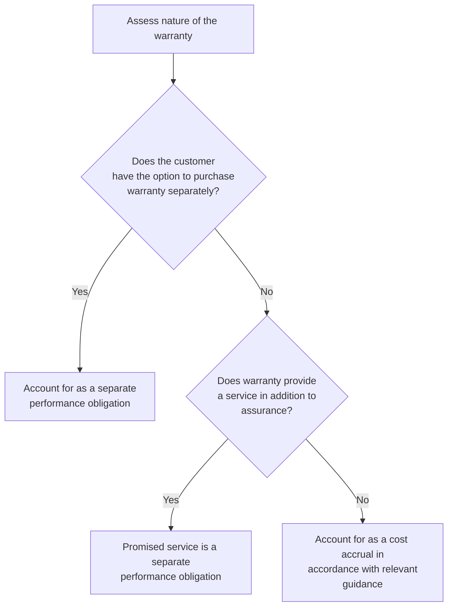

### 8.3.1 Warranties that can be purchased separately
A warranty that a customer can purchase separately from the related good or service (that is, it is priced or negotiated separately) is a separate performance obligation. The fact that it is sold separately indicates that a service is being provided beyond ensuring that the product will function as intended. For example, an extended warranty is often sold separately and is therefore a separate performance obligation. Revenue allocated to a warranty that a customer can purchase separately is recognized over the warranty period.

As discussed in RR 11.5.1, a reporting entity is also required to record an anticipated loss on separately-priced extended warranty contracts subject to ASC 605-20-25-6 in certain circumstances.

### 8.3.2 Assurance-type warranties
A warranty that cannot be purchased separately and only provides assurance that a product will function as expected and in accordance with certain specifications is not a separate performance obligation. The warranty is intended to safeguard the customer against existing defects and does not provide any incremental service to the customer. Costs incurred to either repair or replace the product are additional costs of providing the initial good or service.


Practical application issues | 8-6

An assurance-type warranty is accounted for as a contingency pursuant to ASC 460-10-25-5, which requires recording a loss when the conditions in ASC 450-20-25-2 are met. That is, the loss is recorded when it is probable and can be reasonably estimated. Accordingly, the estimated costs are generally recorded as a liability when the reporting entity transfers the good or service to the customer. The cost is either the cost of repairing or replacing a defective good or reperforming a service. Although a warranty is a type of guarantee, assurance-type warranties (referred to as "product warranties" in ASC 460) are not subject to the general recognition provisions of ASC 460, which requires recognizing guarantees at fair value.

If a revenue contract includes guarantees in the scope of ASC 460 that are not warranties, the guarantee should be accounted for separate from ASC 606 revenue, as discussed in RR 2.2.3 and RR 4.3.3.9. For example, a reporting entity that is an agent may provide guarantees related to the goods or services provided by another party. These guarantees likely do not meet the definition of a warranty and should be accounted for under ASC 460, separate from the revenue contract. In some fact patterns, assessing whether a contract includes a warranty accounted for as a contingency or a guarantee subject to the recognition provisions of ASC 460 may require judgment.

#### QUESTION RR 8-3
Manufacturer constructs customized equipment for which control transfers to the customer over time. Manufacturer provides a one-year warranty on the equipment, which begins once the equipment is delivered to the customer. Should Manufacturer accrue the estimated warranty costs over the construction period or at the point in time it delivers the equipment to the customer?

**PwC response**
Manufacturer should generally accrue the estimated warranty costs over the construction period, consistent with the transfer of control of the equipment to the customer.

#### QUESTION RR 8-4
Is the right to return a defective product in exchange for cash or credit accounted for as an assurance-type warranty or a right of return?

**PwC response**
A return in exchange for cash or credit should generally be accounted for as a right of return (refer to RR 8.2). If customers have the option to return a defective good for cash, credit, or a replacement product, management should estimate the expected returns in exchange for cash or credit as part of its accounting for estimated returns. Returns in exchange for a replacement product should be accounted for under the warranty guidance.

### 8.3.3 Warranties that provide a service
Other warranties provide a customer with a service in addition to the assurance that the product will function as expected. The service provides a level of protection beyond defects that existed at the time of sale, such as protecting against wear and tear for a period of time after sale or against certain types of damage. Judgment will often be required to determine whether a warranty provides assurance or an additional service. The additional service provided in a warranty is accounted for as a promised service in the contract and therefore a separate performance obligation, assuming the service is distinct from other goods and services in the contract. A reporting entity that cannot reasonably account for a service element of a warranty


PwC US National Office | viewpoint.pwc.com 8-7

separate from the assurance element should account for both together as a single performance obligation that provides a service to the customer. Refer to Revenue TRG Memo No. 29 and the related meeting minutes in Revenue TRG Memo No. 34 for further discussion of this topic.

A number of factors need to be considered when assessing whether a warranty that cannot be purchased separately provides a service that should be accounted for as a separate performance obligation.

> ### ASC 606-10-55-33
>
> In assessing whether a warranty provides a customer with a service in addition to the assurance that the product complies with agreed-upon specifications, an entity should consider factors such as:
>
> a. Whether the warranty is required by law—If the entity is required by law to provide a warranty, the existence of that law indicates that the promised warranty is not a performance obligation because such requirements typically exist to protect customers from the risk of purchasing defective products.
>
> b. The length of the warranty coverage period—The longer the coverage period, the more likely it is that the promised warranty is a performance obligation because it is more likely to provide a service in addition to the assurance that the product complies with agreed-upon specifications.
>
> c. The nature of the tasks that the entity promises to perform—If it is necessary for an entity to perform specified tasks to provide the assurance that a product complies with agreed-upon specifications (for example, a return shipping service for a defective product), then those tasks likely do not give rise to a performance obligation.

***

#### QUESTION RR 8-5
Should repairs provided outside of the contractual warranty period be accounted for as a separate performance obligation?

**PwC response**
It depends. Management should assess the nature of the services provided to determine whether they are a separate performance obligation, or if there is simply an implied assurance-type warranty that extends beyond the contractual warranty period. This assessment should consider the factors noted in ASC 606-10-55-33.

***

Example RR 8-3 illustrates the assessment of whether a warranty provides assurance or additional services. This concept is also illustrated in Example 44 of the revenue standard (ASC 606-10-55-309 through ASC 606-10-55-315).

#### EXAMPLE RR 8-3
Warranty – assessing whether a warranty is a performance obligation

Telecom enters into a contract with Customer to sell a smart phone and provide a one-year warranty against both manufacturing defects and customer-inflicted damages (for example, dropping the phone into water). The warranty cannot be purchased separately.

How should Telecom account for the warranty?


Practical application issues | 8-8

### *Analysis*

This arrangement includes the following goods or services: (1) the smart phone; (2) product warranty; and (3) repair and replacement service.

Telecom would account for the product warranty (against manufacturing defect) in accordance with other guidance on product warranties, and record an expense and liability for expected repair or replacement costs related to this obligation. Telecom would account for the repair and replacement service (that is, protection against customer-inflicted damages) as a separate performance obligation, with revenue recognized as that obligation is satisfied.

If Telecom cannot reasonably separate the product warranty and repair and replacement service, it should account for the two warranties together as a single performance obligation.

---

## 8.4 Nonrefundable upfront fees

It is common in some industries for reporting entities to charge customers a fee at or near inception of a contract. These upfront fees are often nonrefundable and could be labeled as fees for set up, access, activation, initiation, joining, or membership.

A reporting entity needs to analyze each arrangement involving upfront fees to determine whether any revenue should be recognized when the fee is received.

> **Excerpt from ASC 606-10-55-51**
>
> To identify performance obligations in such contracts, an entity should assess whether the fee relates to the transfer of a promised good or service. In many cases, even though a nonrefundable upfront fee relates to an activity that the entity is required to undertake at or near contract inception to fulfill the contract, that activity does not result in the transfer of a promised good or service to the customer... Instead, the upfront fee is an advance payment for future goods or services and, therefore, would be recognized as revenue when those future goods or services are provided. The revenue recognition period would extend beyond the initial contractual period if the entity grants the customer the option to renew the contract and that option provides the customer with a material right.

No revenue should be recognized upon receipt of an upfront fee, even if it is nonrefundable, if the fee does not relate to the satisfaction of a performance obligation. Nonrefundable upfront fees are included in the transaction price and allocated to the separate performance obligations in the contract. Revenue is recognized as the performance obligations are satisfied. This concept is illustrated in Example 53 of the revenue standard (ASC 606-10-55-358 through ASC 606-10-55-360).

There could be situations, as illustrated in Example RR 8-4, when an upfront fee relates to separate performance obligations satisfied at different points in time.

#### EXAMPLE RR 8-4
#### Upfront fee allocated to separate performance obligations

Biotech enters into a contract with Pharma for the license and development of a drug compound. The contract requires Biotech to perform research and development (R&D) services to get the drug compound through regulatory approval. Biotech


PwC US National Office | viewpoint.pwc.com 8-9

receives an upfront fee of $50 million, fees for R&D services, and milestone-based payments upon the achievement of specified acts.

Biotech concludes that the arrangement includes two separate performance obligations: (1) license of the intellectual property and (2) R&D services. There are no other performance obligations in the arrangement.

How should Biotech allocate the consideration in the arrangement, including the $50 million upfront fee?

### Analysis

Biotech needs to determine the transaction price at the inception of the contract, which will include both the fixed and variable consideration. The fixed consideration is the upfront fee. The variable consideration includes the fees for R&D services and the milestone-based payments and is estimated based on the principles discussed in RR 4. Once Biotech determines the total transaction price, it should allocate that amount to the two performance obligations. See RR 5 for further information on allocation of the transaction price to performance obligations.

***

Reporting entities sometimes perform set-up or mobilization activities at or near contract inception to be able to fulfill the obligations in the contract. These activities could involve system preparation, hiring of additional personnel, or mobilization of assets to where the service will take place. Nonrefundable fees charged at the inception of an arrangement are often intended to compensate the reporting entity for the cost of these activities. Set-up or mobilization efforts might be critical to the contract, but they typically do not satisfy performance obligations, as no good or service is transferred to the customer. The nonrefundable fee, therefore, is an advance payment for the future goods and services to be provided.

Set-up or mobilization costs should be disregarded in the measure of progress for performance obligations satisfied over time if they do not depict the transfer of services to the customer. Some mobilization costs might be capitalized as fulfillment costs, however, if certain criteria are met. See RR 11 for further information on capitalization of contract costs.

### 8.4.1 Accounting for upfront fees when a renewal option exists

Contracts that include an upfront fee and a renewal option often do not require a customer to pay another upfront fee if and when the customer renews the contract. The renewal option in such a contract might provide the customer with a material right, as discussed in RR 7.3. A reporting entity that provides a customer a material right should determine its standalone selling price and allocate a portion of the transaction price to that right because it is a separate performance obligation. Alternatively, transactions that meet the requirements can apply the practical alternative for contract renewals discussed in RR 7.3 and estimate the total transaction price based on the expected number of renewals.

Management should consider both quantitative and qualitative factors to determine whether an upfront fee provides a material right when a renewal right exists. For example, management should consider the difference between the amount the customer pays upon renewal and the price a new customer would pay for the same service. An average customer life that extends beyond the initial contract period could also be an indication that the upfront fee incentivizes customers to renew the contract. Refer to Revenue TRG Memo No. 32 and the related meeting minutes in Revenue TRG Memo No. 34 for further discussion of this topic.


Practical application issues 8-10

Example RR 8-5 illustrates the accounting for upfront fees and a renewal option.

### EXAMPLE RR 8-5
#### Upfront fee – health club joining fees

FitCo operates health clubs. FitCo enters into contracts with customers for one year of access to any of its health clubs. The reporting entity charges an annual membership fee of $60 as well as a $150 nonrefundable joining fee. The joining fee is to compensate, in part, for the initial activities of registering the customer. Customers can renew the contract each year and are charged the annual membership fee of $60 without paying the joining fee again. If customers allow their membership to lapse, they are required to pay a new joining fee.

How should FitCo account for the nonrefundable joining fees?

***Analysis***

The customer does not have to pay the joining fee if the contract is renewed and has therefore received a material right. That right is the ability to renew the annual membership at a lower price than the range of prices typically charged to newly joining customers.

The joining fee is included in the transaction price and allocated to the separate performance obligations in the arrangement, which are providing access to health clubs and the option to renew the contract, based on their standalone selling prices. FitCo’s activity of registering the customer is not a service to the customer and therefore does not represent satisfaction of a performance obligation. The amount allocated to the right to access the health club is recognized over the first year, and the amount allocated to the renewal right is recognized when that right is exercised or expires.

As a practical alternative to determining the standalone selling price of the renewal right, FitCo could allocate the transaction price to the renewal right by reference to the future services expected to be provided and the corresponding expected consideration. For example, if FitCo determined that a customer is expected to renew for an additional two years, then the total consideration would be $330 ($150 joining fee and $180 annual membership fees). FitCo would recognize this amount as revenue as services are provided over the three years. See RR 7.3 for further information about the practical alternative and customer options.

***

#### 8.4.2 Layaway sales

Layaway sales (sometimes referred to as “will call”) involve the seller setting aside merchandise and collecting a cash deposit from the customer. The seller may specify a time period within which the customer must finalize the purchase, but there is often no fixed payment commitment. The merchandise is typically released to the customer once the purchase price is paid in full. The cash deposit and any subsequent payments are forfeited if the customer fails to pay the entire purchase price. The seller must refund the cash paid by the customer for merchandise that is lost, damaged, or destroyed before control of the merchandise transfers to the customer.

Management will first need to determine whether a contract exists in a layaway arrangement. A contract likely does not exist at the onset of a typical layaway arrangement because the customer has not committed to perform its obligation (that is, payment of the full purchase price). The reporting entity should not recognize


PwC US National Office | viewpoint.pwc.com 8-11

revenue for these arrangements until the contract criteria are met (refer to RR 2.6.1) or until the events described in RR 2.6.2 have occurred.

Some layaway sales could be in substance a credit sale if management concludes that the customer is committed to the purchase and a contract exists. Management will need to determine in those circumstances when control of the goods transfers to the customer. A reporting entity that can use the selected goods to satisfy other customer orders and replace them with similar goods during the layaway period likely has not transferred control of the goods. Management should consider the bill-and-hold criteria discussed in RR 8.5 to determine when control of the goods has transferred.

### 8.4.3 Gift cards
Reporting entities often sell gift cards that can be redeemed for goods or services at the customer's request. A reporting entity should not record revenue at the time a gift card is sold, as the performance obligation is to provide goods or services in the future when the card is redeemed. The payment for the gift card is an upfront payment for goods or services in the future. Revenue is recognized when the card is presented for redemption and the goods or services are transferred to the customer.

Often a portion of gift certificates sold are never redeemed for goods or services. The amounts never redeemed are known as "breakage." A reporting entity should recognize revenue for amounts not expected to be redeemed proportionately as other gift card balances are redeemed. A reporting entity should not recognize revenue, however, for consideration received from a customer that must be remitted to a governmental reporting entity if the customer never demands performance. Refer to RR 7.4 for further information on breakage and an example illustrating the accounting for gift card sales.

### 8.4.4 Franchisor pre-opening services
Franchisors entering into franchise agreements with customers often perform varying levels of pre-opening activities, such as training or assisting the customer in site selection and preparation. In many cases, franchisors will charge their customers a nonrefundable upfront fee, or initial franchise fee, related to these activities. As discussed in RR 8.4, no revenue should be recognized upon receipt of an upfront fee, even if it is nonrefundable, if the fee does not relate to the satisfaction of a performance obligation. Accordingly, a franchisor will need to assess whether pre-opening activities transfer a good or service to the franchisee and if so, whether that good or service is distinct from other goods and services in the contract, including the franchise license.

Nonpublic entities that are franchisors, as defined in ASC 952, *Franchisors*, can apply a practical expedient that permits the franchisor to account for certain pre-opening services as distinct from the franchise license in a franchise agreement, as outlined in ASC 952-606-25-2. Other reporting entities should not apply this guidance by analogy.


Practical application issues 8-12

> **ASC 952-606-25-2**
>
> As a practical expedient, when applying the guidance in Topic 606, a franchisor that enters into a franchise agreement may account for the following pre-opening services as distinct from the franchise license:
>
> a. Assistance in the selection of a site
>
> b. Assistance in obtaining facilities and preparing the facilities for their intended use, including related financing, architectural, and engineering services, and lease negotiation
>
> c. Training of the franchisee’s personnel or the franchisee
>
> d. Preparation and distribution of manuals and similar material concerning operations, administration, and record keeping
>
> e. Bookkeeping, information technology, and advisory services, including setting up the franchisee’s records and advising the franchisee about income, real estate, and other taxes or about regulations affecting the franchisee’s business
>
> f. Inspection, testing, and other quality control programs.

The practical expedient only applies to identifying the performance obligations in a franchise agreement and does not amend other aspects of the revenue guidance. For example, a franchisor will need to determine the standalone selling price of the pre-opening services and any other distinct goods or services in the contract (including the franchise license) and allocate the transaction price in accordance with the guidance discussed in RR 5. As a result, the amount allocated to the pre-opening services could differ from the amount of the initial franchise fee.

A nonpublic franchisor that elects the practical expedient will apply the guidance in the revenue standard on identifying performance obligations (RR 3) to determine whether multiple pre-opening services are distinct from one another. Alternatively, franchisors applying the practical expedient can make an accounting policy election to account for all pre-opening services as a single performance obligation.

If the franchisor performs services that are not included in the list of pre-opening services in ASC 952-606-25-2, the practical expedient cannot be applied to those services. That is, franchisors cannot apply the practical expedient to other pre-opening services by analogy. For services not subject to the practical expedient, the franchisor should apply the guidance in the revenue standard on identifying performance obligations (RR 3) to determine whether the services are distinct from other promises in the contract, including the franchise license.

The practical expedient should be applied consistently to contracts with similar characteristics and in similar circumstances. Similarly, the accounting policy to account for pre-opening activities as a single performance obligation should be applied consistently. Nonpublic franchisors must disclose the use of the practical expedient and, if elected, the accounting policy to treat certain pre-opening services as a single performance obligation.


PwC US National Office | viewpoint.pwc.com 8-13

## 8.5 Bill-and-hold arrangements

Bill-and-hold arrangements arise when a customer is billed for goods that are ready for delivery, but the reporting entity does not ship the goods to the customer until a later date. Reporting entities must assess in these cases whether control has transferred to the customer, even though the customer does not have physical possession of the goods. Revenue is recognized when control of the goods transfers to the customer. A reporting entity will need to meet certain additional criteria for a customer to have obtained control in a bill-and-hold arrangement in addition to the criteria related to determining when control transfers (refer to RR 6.2).

> **Excerpt from ASC 606-10-55-83**
>
> For a customer to have obtained control of a product in a bill-and-hold arrangement, all of the following criteria must be met:
>
> a. The reason for the bill-and-hold arrangement must be substantive (for example, the customer has requested the arrangement).
>
> b. The product must be identified separately as belonging to the customer.
>
> c. The product currently must be ready for physical transfer to the customer.
>
> d. The entity cannot have the ability to use the product or to direct it to another customer.

A bill-and-hold arrangement should have substance. A substantive purpose could exist, for example, if the customer requests the bill-and-hold arrangement because it lacks the physical space to store the goods, or if goods previously ordered are not yet needed due to the customer's production schedule.

The goods must be identified as belonging to the customer, and they cannot be used to satisfy orders for other customers. Substitution of the goods for use in other orders indicates that the goods are not controlled by the customer and therefore revenue should not be recognized until the goods are delivered, or the criterion is satisfied. The goods must also be ready for delivery upon the customer's request.

A customer that can redirect or determine how goods are used, or that can otherwise benefit from the goods, is likely to have obtained control of the goods. Limitations on the use of the goods, or other restrictions on the benefits the customer can receive from those goods, indicates that control of the goods may not have transferred to the customer.

A reporting entity that has transferred control of the goods and met the bill-and-hold criteria to recognize revenue needs to consider whether it is providing custodial services in addition to providing the goods. If so, a portion of the transaction price should be allocated to each of the separate performance obligations (that is, the goods and the custodial service).

Example RR 8-6 and Example RR 8-7 illustrate these considerations in bill-and-hold transactions. This concept is also illustrated in Example 63 of the revenue standard (ASC 606-10-55-409 through ASC 606-10-55-413).


Practical application issues 8-14

### EXAMPLE RR 8-6
Bill-and-hold arrangement – industrial products industry

Drill Co orders a drilling pipe from Steel Producer. Drill Co requests the arrangement be on a bill-and-hold basis because of the frequent changes to the timeline for developing remote gas fields and the long lead times needed for delivery of the drilling equipment and supplies. Steel Producer has a history of bill-and-hold transactions with Drill Co and has established standard terms for such arrangements.

The pipe, which is separately warehoused by Steel Producer, is complete and ready for shipment. Steel Producer cannot utilize the pipe or direct the pipe to another customer once the pipe is in the warehouse. The terms of the arrangement require Drill Co to remit payment within 30 days of the pipe being placed into Steel Producer’s warehouse. Drill Co will request and take delivery of the pipe when it is needed.

When should Steel Producer recognize revenue?

**Analysis**

Steel Producer should recognize revenue when the pipe is placed into its warehouse because control of the pipe has transferred to Drill Co. This is because Drill Co requested the transaction be on a bill-and-hold basis, which suggests that the reason for entering the bill-and-hold arrangement is substantive, Steel Producer is not permitted to use the pipe to fill orders for other customers, and the pipe is ready for immediate shipment at the request of Drill Co. Steel Producer should also evaluate whether a portion of the transaction price should be allocated to the custodial services (that is, whether the custodial service is a separate performance obligation).

### EXAMPLE RR 8-7
Bill-and-hold arrangement – retail and consumer industry

Game Maker enters into a contract during 20X1 to supply 100,000 video game consoles to Retailer. The contract contains specific instructions from Retailer about where the consoles should be delivered. Game Maker must deliver the consoles in 20X2 at a date to be specified by Retailer. Retailer expects to have sufficient shelf space at the time of delivery.

As of December 31, 20X1, Game Maker has inventory of 120,000 game consoles, including the 100,000 relating to the contract with Retailer. The 100,000 consoles are stored with the other 20,000 game consoles, which are all interchangeable products; however, Game Maker will not deplete its inventory below 100,000 units.

When should Game Maker recognize revenue for the 100,000 units to be delivered to Retailer?

**Analysis**

Game Maker should not recognize revenue until the bill-and-hold criteria are met or if Game Maker no longer has physical possession and all of other criteria related to the transfer of control have been met. Although the reason for entering into a bill-and-hold transaction is substantive (lack of shelf space), the other criteria are not met as the game consoles produced for Retailer are not separated from other products.


PwC US National Office | viewpoint.pwc.com 8-15

### 8.5.1 Government vaccine stockpile programs

Vaccine manufacturers may participate in government vaccine stockpile programs that require the manufacturer to hold a certain amount of vaccine inventory for use by a government at a later date. Control transfer should be assessed against the bill and hold criteria in the standard, considering for example, whether the stockpile inventory is separately identified as belonging to the customer and the impact of any requirement to rotate the inventory. Management will also need to consider whether the government has return rights and whether there are other performance obligations within the arrangement, such as the storage, maintenance, and shipping of vaccines.

SEC reporters should apply the SEC’s interpretative release, codified in ASC 606-10-S25, which states that vaccine manufacturers should recognize revenue and provide the appropriate disclosures when vaccines are placed into US government stockpile programs because control of the vaccines has transferred to the customer (the government) and the criteria in ASC 606 for recognizing revenue in a bill-and-hold arrangement are satisfied. This interpretation is only applicable to childhood disease vaccines, influenza vaccines, and other vaccines and countermeasures sold to the US government for placement in the Strategic National Stockpile.

## 8.6 Consignment arrangements

Some reporting entities ship goods to a distributor, but retain control of the goods until a predetermined event occurs. These are known as consignment arrangements. Revenue is not recognized upon delivery of a product if the product is held on consignment. Management should consider the following indicators to evaluate whether an arrangement is a consignment arrangement.

> **ASC 606-10-55-80**
>
> Indicators that an arrangement is a consignment arrangement include, but are not limited to, the following:
>
> a. The product is controlled by the entity until a specified event occurs, such as the sale of the product to a customer of the dealer, or until a specified period expires.
>
> b. The entity is able to require the return of the product or transfer the product to a third party (such as another dealer).
>
> c. The dealer does not have an unconditional obligation to pay for the product (although it might be required to pay a deposit).

Revenue is recognized when the reporting entity has transferred control of the goods to the distributor. The distributor has physical possession of the goods, but might not control them in a consignment arrangement. For example, a distributor that is required to return goods to the manufacturer upon request might not have control over those goods; however, a reporting entity should assess whether these rights can be enforced.

A consignment sale differs from a sale with a right of return or put right. The customer has control of the goods in a sale with right of return or a sale with a put right, and can decide whether to put the goods back to the seller.

Example RR 8-8 and Example RR 8-9 illustrate the assessment of consignment arrangements.


Practical application issues | 8-16

#### EXAMPLE RR 8-8
Consignment arrangement – retail and consumer industry

Manufacturer provides household products to Retailer on a consignment basis. Retailer does not take title to the products until they are scanned at the register and has no obligation to pay Manufacturer until they are sold to the consumer, unless the goods are lost or damaged while in Retailer’s possession. Any unsold products, excluding those that are lost or damaged, can be returned to Manufacturer, and Manufacturer has discretion to call products back or transfer products to another customer.

When should Manufacturer recognize revenue?

**Analysis**

Manufacturer should recognize revenue when control of the products transfers to Retailer. Control has not transferred if Manufacturer is able to require the return or transfer of those products. Revenue should be recognized when the products are sold to the consumer, or lost or damaged while in Retailer’s possession.

#### EXAMPLE RR 8-9
Consignment arrangement – industrial products industry

Steel Co develops a new type of cold-rolled steel sheet that is significantly stronger than existing products, providing increased durability. The newly developed product is not yet widely used.

Manufacturer enters into an arrangement with Steel Co whereby Steel Co will provide 50 rolled coils of the steel on a consignment basis. Manufacturer must pay a deposit upon receipt of the coils. Title transfers to Manufacturer upon shipment and the remaining payment is due when Manufacturer consumes the coils in the manufacturing process. Each month, both parties agree on the amount consumed by Manufacturer. Manufacturer can return, and Steel Co can demand return of, unused products at any time.

When should Steel Co recognize revenue?

**Analysis**

Steel Co should recognize revenue when the coils are used by Manufacturer. Although title transfers when the coils are shipped, control of the coils has not transferred to Manufacturer because Steel Co can demand return of any unused product.

Control of the steel would transfer to Manufacturer upon shipment if Steel Co did not retain the right to demand return of the inventory, even if Manufacturer had the right to return the product. However, Steel Co needs to assess the likelihood of the steel being returned and might need to recognize a refund liability in that case. Refer to RR 8.2.

## 8.7 Repurchase rights
Repurchase rights are an obligation or right to repurchase a good after it is sold to a customer. Repurchase rights could be included within the sales contract, or in a separate arrangement with the customer. The repurchased good could be the same


PwC US National Office | viewpoint.pwc.com 8-17

asset, a substantially similar asset, or a new asset of which the originally purchased asset is a component.

There are three forms of repurchase rights:

*   A seller's obligation to repurchase the good (a forward)
*   A seller's right to repurchase the good (a call option)
*   A customer's right to require the seller to repurchase the good (a put option)

An arrangement to repurchase a good that is negotiated between the parties after transferring control of that good to a customer is not a repurchase agreement because the customer is not obligated to resell the good to the reporting entity as part of the initial contract. The subsequent decision to repurchase the item does not affect the customer's ability to direct the use of or obtain the benefits of the good.

For example, a car manufacturer that decides to repurchase inventory from one dealership to meet an inventory shortage at another dealership has not entered into a forward, call option, or put option unless the original contract requires the dealership to sell the cars back to the manufacturer upon request. However, when such repurchases are common, even if not specified in the contract, management will need to consider whether that common practice affects the assessment of transfer of control to the customer upon initial delivery.

Some arrangements do not include a repurchase right, but instead provide a guarantee in the form of a payment to the customer for the deficiency, if any, between the amount received in a resale of the product and a guaranteed resale value. The guidance on repurchase rights (described in RR 8.7.1 and RR 8.7.2) does not apply to these arrangements because the reporting entity does not reacquire control of the asset. The guarantee payment should be accounted for in accordance with the applicable guidance on guarantees. Refer to RR 4.3.3.9 for further discussion of guarantees.

### 8.7.1 Forwards and call options
A reporting entity that transfers a good and retains a substantive forward repurchase obligation or call option (that is, a repurchase right) should not recognize revenue when the good is initially transferred to the customer because the repurchase right limits the customer's ability to control the good. While some such provisions may be deemed to lack substance based on specific facts and circumstances, in general a negotiated contract term is presumed to be substantive.

Figure RR 8-2 summarizes the considerations when determining the accounting for forwards and call options.


Practical application issues | 8-18

FIGURE RR 8-2
Accounting for forwards and call options

```mermaid
graph TD
    A[Obligation to repurchase<br/>the asset (a forward)] --> C
    B[Right to repurchase the<br/>asset (a call option)] --> C
    C{Repurchase price less than<br/>original selling price?} -- Yes --> D[Account for the<br/>contract as a lease]
    C -- No --> E[Account for the<br/>contract as a<br/>financing<br/>arrangement]
```

*Note: If the contract is part of a sale and leaseback transaction, the entity should account for the contract as a financing arrangement. See LG 6 for guidance on accounting for sale and leaseback transactions.*

The accounting for an arrangement with a forward or a call option depends on the amount the reporting entity can or must pay to repurchase the good. The likelihood of exercise is not considered in this assessment. The arrangement is accounted for as either:

[ ] a lease, if the repurchase price is less than the original sales price of the asset and the arrangement is not part of a sale-leaseback transaction (in which case the reporting entity is the lessor); or

[ ] a financing arrangement, if the repurchase price is equal to or more than the original sales price of that good (in which case the customer is providing financing to the reporting entity).

A reporting entity that enters into a financing arrangement continues to recognize the transferred asset and recognizes a financial liability for the consideration received from the customer. The reporting entity recognizes any amounts that it will pay upon repurchase in excess of what it initially received as interest expense over the period between the initial agreement and the subsequent repurchase and, in some situations, as processing or holding costs. The reporting entity derecognizes the liability and recognizes revenue if it does not exercise a call option and it expires.

The comparison of the repurchase price to the original sales price of the good should include the effect of the time value of money, including contracts with terms of less than one year. This is because the effects of time value of money could change the determination of whether the forward or call option is a lease or financing arrangement. For example, if a reporting entity enters into an arrangement with a call option and the stated repurchase price, excluding the effects of the time value of


PwC US National Office | viewpoint.pwc.com 8-19

money, is equal to or greater than the original sales price, the arrangement might be a financing arrangement. Including the effect of the time value of money might result in a repurchase price that is less than the original sale price, and the arrangement would be accounted for as a lease.

Example RR 8-10 illustrates the accounting for an arrangement that contains a call option. A similar scenario is illustrated in Example 62, Case A, of the revenue standard (ASC 606-10-55-402 through ASC 606-10-55-404).

### EXAMPLE RR 8-10
#### Repurchase rights – call option accounted for as lease

Machine Co sells machinery to Manufacturer for $200,000. The arrangement includes a call option that gives Machine Co the right to repurchase the machinery in five years for $150,000. The arrangement is not part of a sale-leaseback.

Should Machine Co account for this transaction as a lease or a financing transaction?

#### *Analysis*

Machine Co should account for the arrangement as a lease. The five-year call period indicates that the customer is limited in its ability to direct the use of or obtain substantially all of the remaining benefits from the machinery. Machine Co can repurchase the machinery for an amount less than the original selling price of the asset; therefore, the transaction is a lease. Machine Co would account for the arrangement in accordance with the leasing guidance.

#### 8.7.1.1 Conditional call rights
Some call rights are not unilaterally exercisable by the seller, but instead only become exercisable if certain conditions are met. The revenue standard does not provide specific guidance for assessing conditional repurchase features; therefore, judgment will be required to assess the impact of these provisions. Conditional rights should be accounted for based on their substance, with an objective of assessing whether control has transferred to the customer.

As noted in RR 8.7.1, the likelihood of the reporting entity exercising an active call right should not be considered when assessing whether control has transferred. In certain circumstances, however, a reporting entity might conclude a conditional call right does not preclude transfer of control. For example, if the call right only becomes active based on factors outside of the reporting entity's control, this may indicate that control has transferred to the customer despite the existence of the conditional call right.

To assess whether a conditional call right precludes transfer of control to the customer, management should consider the following factors, among others:

[ ] The nature of the conditions that result in the rights becoming active
[ ] The likelihood that the conditions will be met that result in the rights becoming active
[ ] Whether the conditions are based on factors within the seller's or customer's control


Practical application issues | 8-20

### 8.7.2 Put options
A put option allows a customer, at its discretion, to require the reporting entity to repurchase a good and indicates that the customer has control over that good. The customer has the choice of retaining the item, selling it to a third party, or selling it back to the reporting entity.

Figure RR 8-3 summarizes the considerations in determining the accounting for put options.

#### FIGURE RR 8-3
Accounting for put options

```mermaid
graph TD
    A[Obligation to repurchase the asset at the customer's request (a put option)] --> B{Repurchase price lower than original selling price?}
    B -- No --> C{Repurchase price more than expected market value?}
    C -- Yes --> D[Account for contract as a financing]
    C -- No --> E[Recognize revenue when the performance obligation is satisfied and account for the right of return in accordance with the revenue standard]
    B -- Yes --> F{Customer has significant economic incentive to exercise}
    F -- No --> E
    F -- Yes --> G[Account for the contract as a lease]
```

The accounting for an arrangement with a put option depends on the amount the reporting entity must pay when the customer exercises the put option, and whether the customer has a significant economic incentive to exercise its right. A reporting entity accounts for a put option as:

*   a financing arrangement, if the repurchase price is equal to or more than the original sales price and more than the expected market value of the asset (in which case the customer is providing financing to the reporting entity);
*   a lease, if the repurchase price is less than the original sales price and the customer has a significant economic incentive to exercise that right and the arrangement is not part of a sale-leaseback transaction (in which case the reporting entity is the lessor);
*   a sale of a product with a right of return, if the repurchase price is less than the original sales price and the customer does not have a significant economic incentive to exercise its right; or
*   a sale of a product with a right of return, if the repurchase price is equal to or more than the original sales price, but less than or equal to the expected market


PwC US National Office | viewpoint.pwc.com 8-21

value of the asset, and the customer does not have a significant economic incentive to exercise its right.

A reporting entity that enters into a financing arrangement continues to recognize the transferred asset and recognize a financial liability for the consideration received from the customer. The reporting entity recognizes any amounts that it will pay upon repurchase in excess of what it initially received as interest expense (over the term of the arrangement) and, in some situations, as processing or holding costs. A reporting entity derecognizes the liability and recognizes revenue if the put option lapses unexercised.

Similar to forwards and calls, the comparison of the repurchase price to the original sales price of the good should include the effect of the time value of money, including the effect on contracts whose term is less than one year. The effect of the time value of money could change the determination of whether the put option is a lease or financing arrangement because it affects the amount of the repurchase price used in the comparison.

### 8.7.2.1 Significant economic incentive to exercise a put option
The accounting for certain put options requires management to assess at contract inception whether the customer has a significant economic incentive to exercise its right. A customer that has a significant economic incentive to exercise its right is effectively paying the reporting entity for the right to use the good for a period of time, similar to a lease.

Management should consider various factors in its assessment, including the following:

*   How the repurchase price compares to the expected market value of the good at the date of repurchase
*   The amount of time until the right expires

A customer has a significant economic incentive to exercise a put option when the repurchase price is expected to significantly exceed the market value of the good at the time of repurchase.

Example RR 8-11 and Example RR 8-12 illustrate the accounting for arrangements that contain a put option. This concept is also illustrated in Example 62, Case B, of the revenue standard (ASC 606-10-55-405 through ASC 606-10-55-407).

#### EXAMPLE RR 8-11
**Repurchase rights – put option accounted for as a right of return**

Machine Co sells machinery to Manufacturer for $200,000. Manufacturer can require Machine Co to repurchase the machinery in five years for $75,000. The market value of the machinery at the repurchase date is expected to be greater than $75,000. Machine Co offers Manufacturer the put option because an overhaul is typically required after five years. Machine Co can overhaul the equipment, sell the refurbished equipment to a customer, and receive a significant margin on the refurbished goods. Assume the time value of money would not affect the overall conclusion.

Should Machine Co account for this transaction as a sale with a return right, a lease, or a financing transaction?


Practical application issues | 8-22

### Analysis

Machine Co should account for the arrangement as the sale of a product with a right of return. Manufacturer does not have a significant economic incentive to exercise its right since the repurchase price is less than the expected market value at date of repurchase. Machine Co should account for the transaction consistent with the model discussed in RR 8.2.

#### EXAMPLE RR 8-12
Repurchase rights – put option accounted for as lease

Machine Co sells machinery to Manufacturer for $200,000 and stipulates that Manufacturer can require Machine Co to repurchase the machinery in five years for $150,000. The repurchase price is expected to significantly exceed the market value at the date of the repurchase. Assume the time value of money would not affect the overall conclusion.

Should Manufacturer account for this transaction as a sale with a return right, a lease, or a financing transaction?

### Analysis

Machine Co should account for the arrangement as a lease in accordance with the leasing guidance. Manufacturer has a put option to resell the machinery to Machine Co and has a significant economic incentive to exercise this right, because the guarantee price significantly exceeds the expected market value at date of repurchase. Lease accounting is required given the repurchase price is less than the original selling sales price of the machinery.


PwC US National Office | viewpoint.pwc.com 8-23

The image features a decorative graphic design in the upper right quadrant consisting of various overlapping rounded rectangular shapes (pills) and circles in shades of grey, pink, and orange. Some shapes are solid, while others are outlined.

# Chapter 9: Licenses–updated March 2024

## 9.1 Overview—licenses

A license arrangement establishes a customer’s rights related to a reporting entity’s intellectual property (IP) and the obligations of the reporting entity to provide those rights. Licenses are common in the following industries:

*   Technology – software and patents
*   Entertainment and media – motion pictures, music, and copyrights
*   Pharmaceuticals and life sciences – drug compounds, patents, and trademarks
*   Retail and consumer – trade names and franchises

Licenses come in a variety of forms, and can be term-based or perpetual, as well as exclusive or nonexclusive. Consideration received for licenses can also vary significantly from fixed to variable and from upfront (or lump sum) to over time in installments.

Management should assess each arrangement where licenses are sold with other goods or services to conclude whether the license is distinct and therefore a separate performance obligation. Management will need to determine whether a license provides *a right to access* IP or *a right to use* IP, since this will determine when revenue is recognized. Revenue recognition will also be affected if a license arrangement includes sales- or usage-based royalties.

## 9.2 Overview of the licenses guidance

The revenue standard includes specific implementation guidance for accounting for licenses of intellectual property. The first step is to determine whether the license is distinct or combined with other goods or services. The revenue recognition pattern for distinct licenses is based on whether the license is a right to access IP (revenue recognized over time) or a right to use IP (revenue recognized at a point in time). For licenses that are bundled with other goods or services, management will apply judgment to assess the nature of the combined item and determine whether the combined performance obligation is satisfied at a point in time or over time.

Figure RR 9-1 illustrates the overall framework for accounting for licenses.


Licenses 9-2

**FIGURE RR 9-1**
Accounting for licenses of intellectual property

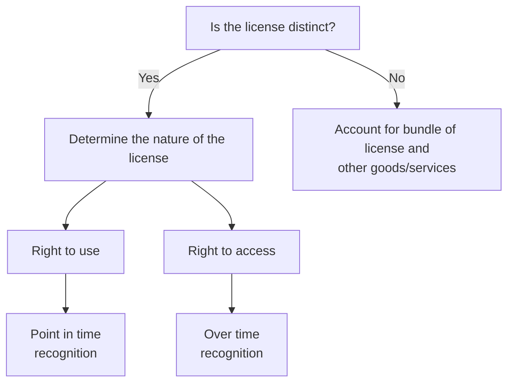

## 9.3 Determining whether a license is distinct—updated May 2025

Management should consider the guidance for identifying performance obligations to determine if a license is distinct when it is included in an arrangement with other goods or services. Refer to RR 3 for a discussion of how to identify separate performance obligations.

Licenses that are not distinct include:

> **Excerpt from ASC 606-10-55-56**
>
> a. A license that forms a component of a tangible good and that is integral to the functionality of the good.
>
> b. A license that the customer can benefit from only in conjunction with a related service (such as an online service provided by the entity that enables, by granting a license, the customer to access content).

US GAAP includes specific guidance for determining whether a hosting arrangement includes a software license in ASC 985-20, *Costs of Software to be Sold, Leased, or Marketed*. Reporting entities that enter into hosting arrangements should assess that guidance, which includes determining whether (a) the customer has the contractual right to take possession of the software without significant penalty and (b) it is feasible for the customer to run the software on its own or by contracting with an


PwC US National Office | viewpoint.pwc.com 9-3

unrelated third party. The arrangement does not include a distinct license unless these criteria are met.

### QUESTION RR 9-1

Is a "hybrid cloud" arrangement, which includes both a license to on-premises software and access to software-as-a-service (SaaS) or other cloud-based services, a single performance obligation or multiple performance obligations?

#### PwC response

It depends. Significant judgment may be required to determine whether the on-premises software license should be combined with the cloud-based services. This assessment will require an understanding of the standalone functionality of the license and the service and the degree to which they affect each other. For example, if the customer must use the software license and cloud-based service together to derive any benefit from the arrangement, this would indicate that they should be combined into a single performance obligation. Conversely, on-premises software with significant standalone functionality is typically determined to be distinct because the customer can benefit from the license without the service. Frequent and significant interactions between the on-premises software and cloud-based service that provides new functionality on a combined basis could provide evidence that the license and service are highly interdependent or highly interrelated and therefore should be combined. However, if the cloud-based service only provides additional functionality, such as increased efficiencies, this alone would not be sufficient to conclude the license and service are highly interdependent or highly interrelated; in this case, the license and service should be accounted for separately. A cloud-based service could have significant value to a customer in an arrangement, but still be distinct from the on-premises software license.

***

Example RR 9-1, Example RR 9-2, Example RR 9-3, Example RR 9-4, and Example RR 9-5 illustrate the analysis of whether a license is distinct. This concept is also illustrated in Examples 11, 54, 55, and 56 of the revenue standard (ASC 606-10-55-141 through ASC 606-10-55-150K and ASC 606-10-55-362 through ASC 606-10-55-374), as well as Example 10, Case C (ASC 606-10-55-140D through ASC 606-10-55-140F).

### EXAMPLE RR 9-1

License that is distinct – license of IP and R&D services

Biotech licenses a drug compound to Pharma. Biotech also provides research and development (R&D) services as part of the arrangement. The contract requires Biotech to perform the R&D services, but the services are not complex or specialized—that is, the services could be performed by Pharma or another qualified third party. The R&D services are not expected to significantly modify or customize the initial intellectual property (the drug compound).

Is the license in this arrangement distinct?

#### Analysis

The license is distinct because the license is capable of being distinct and separately identifiable from the other promises in the contract. Pharma can benefit from the license together with R&D services that it could perform itself or obtain from another vendor. The license is separately identifiable from other promises in the contract because the R&D services are not expected to significantly modify or customize the IP.


Licenses 9-4

Whether a license is distinct from R&D services depends on the specific facts and circumstances. In the case of very early stage IP (for example, within the drug discovery cycle) when the R&D services are expected to involve significant further development of the initial IP, a reporting entity might conclude that the IP and R&D services are not distinct and, therefore, constitute a single performance obligation.

### EXAMPLE RR 9-2
#### License that is distinct – license of IP and installation

SoftwareCo provides a perpetual software license to Engineer. SoftwareCo will also install the software as part of the arrangement. SoftwareCo offers the software license to its customers with or without installation services, and Engineer could select a different vendor for installation. The installation does not result in significant customization or modification of the software.

Is the license in this arrangement distinct?

**Analysis**

The software license is distinct because Engineer can benefit from the license on its own, and the license is separable from other promises in the contract. This conclusion is supported by the fact that SoftwareCo licenses the software separately (without installation services) and other vendors are able to install the software. The license is separately identifiable because the installation services do not significantly modify the software. The license is therefore a separate performance obligation that should be accounted for in accordance with the guidance in RR 9.5.

### EXAMPLE RR 9-3
#### License that is distinct – license of IP and data storage service

SoftwareCo enters into a contract with its customer for a license to on-premises data analytics software and cloud data storage. The on-premises software utilizes the customer’s data stored on the cloud to provide data analysis. The on-premises software can also utilize data stored on the customer’s premises or data stored by other vendors.

Is the license in this arrangement distinct?

**Analysis**

It is likely that SoftwareCo would conclude that the on-premises software license is distinct from the cloud data storage service. The cloud data storage could be provided by other vendors and thus, the on-premises software license is capable of being distinct. The software license and cloud data storage service are separately identifiable because a customer could gain substantially all of the benefits of the on-premises software when data is stored on the customer’s premises or with another vendor.

Alternatively, if SoftwareCo’s on-premises software and cloud data storage are used together in such a manner that the customer gains significant functionality that would not be available without the cloud data storage service, SoftwareCo might conclude that the license is not distinct from the storage service.


PwC US National Office | viewpoint.pwc.com 9-5

### EXAMPLE RR 9-4
#### License that is distinct – hybrid cloud solution

SoftwareCo enters into a contract with its customer to provide a hybrid cloud solution that includes a license to on-premises data analytics software and cloud-based services. The software and services are always sold together and may not be purchased separately from SoftwareCo or other vendors. The customer utilizes the on-premises software to perform data analysis and the results can be uploaded to a cloud-based platform for purposes of sharing information with other team members or external parties. When used together, customers often experience a significant increase in efficiencies as it is more cumbersome to share information without using the cloud-based platform. No changes are made to the data and no additional data analysis is performed in the cloud environment.

Is the hybrid cloud solution a single performance obligation?

***Analysis***

SoftwareCo would likely conclude the hybrid cloud solution is not a single performance obligation and, therefore, the on-premises software license is distinct from the cloud-based services. The on-premises software has standalone functionality that indicates the license is capable of being distinct. The software license and services are separately identifiable because there is not a significant integration of the two elements, the services do not modify or customize the software, and the two elements are not highly interdependent or highly interrelated. Although the arrangement is marketed to customers as a “solution” and the services provide additional functionality that results in increased efficiencies, there does not appear to be significant interaction between the on-premises software and services that would indicate they significantly affect each other.

### EXAMPLE RR 9-5
#### License that is distinct - license to a library of content and unspecified future updates

ImageCo enters into a contract with a customer to license the right to its library of content, which is a collection of digital images. The licensing arrangement grants the customer a right to use all content in the library for five years, including content existing in the library at contract inception and any content added to the library in the future. The customer has the ability to download the content and plans to utilize the content to train its artificial intelligence (AI) model. ImageCo has not promised any specific future content to the customer (that is, the updates are unspecified and provided on a when-and-if available basis).

ImageCo frequently updates its content library to add new images and believes more recent content has greater value to the customer than older content. However, the customer is able to benefit from the existing content without the new content and the new content does not modify or replace existing content. ImageCo does not provide a significant service of integrating the existing content in the library with the updated content.

Is the license to the existing content distinct from the license to the future content (updates to the content library)?


Licenses 9-6

### Analysis

ImageCo would likely conclude the license to the existing content is distinct from the updates to the library. Thus, the arrangement includes two performance obligations: (1) a license to the existing content library and (2) unspecified future updates to the library. The content that exists at contract inception is capable of being distinct because the customer can use and benefit from it on its own. The license to the existing content library and unspecified future updates are separately identifiable because there is not a significant integration of the two elements, the updates do not modify or customize the existing content, and the two elements are not highly interdependent or highly interrelated. Although the newer content is considered more valuable to the customer, this fact does not indicate that the existing content is not distinct. Instead, it is a consideration in determining the standalone selling price for each element of the arrangement to allocate consideration between the multiple performance obligations.

---

## 9.4 Accounting for a license bundled with other goods or services

Licenses that are not distinct should be combined with other goods and services in the contract until they become a bundle of goods or services that is distinct. Reporting entities should recognize revenue when (or as) it satisfies the combined performance obligation. Management will need to determine whether the combined performance obligation is satisfied over time or at a point in time and, if satisfied over time, an appropriate measure of progress.

Management may need to consider the nature of the license included in the bundle (that is, whether the license is a right to access or a right to use IP) to assess the accounting for the combined performance obligation. Management should also consider why the license and other goods or services are bundled together to help determine the accounting for the bundle.

The revenue standard addresses how a reporting entity should account for a combined performance obligation that includes a license.

> **Excerpt from ASC 606-10-55-57**
>
> When a single performance obligation includes a license (or licenses) of intellectual property and one or more other goods or services, the entity considers the nature of the combined good or service for which the customer has contracted...in determining whether that combined good or service is satisfied over time or at a point in time... and, if over time, in selecting an appropriate method for measuring progress...

An example of a bundle that includes a license and other goods and services is a license to intellectual property with a 10-year term that is bundled with a one-year service into a single performance obligation. The nature of the license could impact the accounting for the combined performance obligation in this fact pattern. If the license is a right to access IP, revenue would likely be recognized over the 10-year license term. In contrast, if the license is a right to use IP, the reporting entity might conclude that revenue should be recognized over the one-year service period.

Accounting for a combined performance obligation that includes a license will require judgment. Management should consider the nature of the promise and the item for which the customer has contracted. This would include assessing the relative


PwC US National Office | viewpoint.pwc.com 9-7

significance of the license and the other goods or services to the bundle. For example, if the license is incidental to the bundle, the assessment of whether the license is a right to access or a right use IP would not be relevant to the accounting for the bundle.

## 9.5 Determining the nature of a license

Rights provided through licenses of intellectual property can vary significantly due to the different features and underlying economic characteristics of licensing arrangements. Recognition of revenue related to a license of IP differs depending on the nature of the reporting entity’s promise in granting the license. The revenue standard identifies two types of licenses of IP: a right to access IP and a right to use IP.

Licenses that provide a right to access a reporting entity’s IP are performance obligations satisfied over time, and therefore revenue is recognized over time. Licenses that provide a right to use a reporting entity’s IP are performance obligations satisfied at a point in time. Revenue cannot be recognized before the beginning of the period the customer is able to use and benefit from its right to access or its right to use a reporting entity’s IP. This is typically the beginning of the stated license period, assuming the customer has the ability to use and benefit from the IP at that time.

To assist reporting entities in determining whether a license provides a right to access IP or a right to use IP, the revenue standard defines two categories of licenses: functional and symbolic.

> **ASC 606-10-55-59**
>
> To determine whether the entity’s promise to provide a right to access its intellectual property or a right to use its intellectual property, the entity should consider the nature of the intellectual property to which the customer will have rights. Intellectual property is either:
>
> a. Functional intellectual property. Intellectual property that has significant standalone functionality (for example, the ability to process a transaction, perform a function or task, or be played or aired). Functional intellectual property derives a substantial portion of its utility (that is, its ability to provide benefit or value) from its significant standalone functionality.
>
> b. Symbolic intellectual property. Intellectual property that is not functional intellectual property (that is, intellectual property that does not have significant standalone functionality). Because symbolic intellectual property does not have significant standalone functionality, substantially all of the utility of symbolic intellectual property is derived from its association with the entity’s past or ongoing activities, including its ordinary business activities.

### 9.5.1 Functional IP

Intellectual property that has significant standalone functionality is functional IP. Functional IP includes software, drug formulas or compounds, and completed media content. Patents underlying highly functional items (such as a specialized manufacturing process that the customer can use as a result of the patent) are also classified as functional IP. Functional IP is a right to use IP because the IP has standalone functionality and the customer can use the IP as it exists at a point in time. Management should refer to the guidance on transfer of control to determine


Licenses 9-8

the point in time at which control of the license transfers. Refer to RR 6 for discussion of the indicators of transfer of control.

The guidance provides an exception to point in time recognition if the criteria in ASC 606-10-55-62 are met.

> ### ASC 606-10-55-62
>
> A license to functional intellectual property grants a right to use the entity’s intellectual property as it exists at the point in time at which the license is granted unless both of the following criteria are met:
>
> a. The functionality of the intellectual property to which the customer has rights is expected to substantively change during the license period as a result of activities of the entity that do not transfer a promised good or service to the customer (see paragraphs 606-10-25-16 through 25-18). Additional promised goods or services (for example, intellectual property upgrade rights or rights to use or access additional intellectual property) are not considered in assessing this criterion.
>
> b. The customer is contractually or practically required to use the updated intellectual property resulting from criterion (a).
>
> If both of those criteria are met, then the license grants a right to access the entity’s intellectual property.

We believe it will be unusual for the above criteria to be met because changes to IP typically transfer a good or service to the customer. An example is a distinct license to software (functional IP) that will substantively change as a result of updates to the software during the license period. The updates to the software license are an additional good or service transferred to the customer; therefore, the criteria above are not met and the software license is a right to use IP. The reporting entity would also need to assess whether the software license and the subsequent updates are distinct in this example; that is, revenue would likely be recognized over time if the license and updates are combined into a single performance obligation.

Examples 54, 59, and 61A of the revenue standard (ASC 606-10-55-362 through ASC 606-10-55-363B, ASC 606-10-55-389 through ASC 606-10-55-392D, and ASC 606-10-55-399A through ASC 606-10-55-399J) illustrate arrangements that are licenses to functional IP.

### 9.5.2 Symbolic IP
Intellectual property that is not functional IP is symbolic IP. Symbolic IP includes brands, logos, team names, and franchise rights. Symbolic IP is a right to access IP because of the reporting entity’s obligation to support or maintain the IP over time. Revenue from a license to symbolic IP is recognized over the license period, or the remaining economic life of the IP, if shorter. Management should select an appropriate measure of progress to determine the pattern of recognition of a license to symbolic IP. We believe a straight-line approach will often be an appropriate method for recognizing revenue because the benefit to the customer often transfers ratably throughout a license period. There might be circumstances where the nature of the IP or the related activities indicate that another method of progress better reflects the transfer to the customer. Refer to RR 6.4 for discussion of measures of progress.


PwC US National Office | viewpoint.pwc.com 9-9

Examples 57, 58, and 61 of the revenue standard (ASC 606-10-55-375 through ASC 606-10-55-388 and ASC 606-10-55-395 through ASC 606-10-55-399) illustrate arrangements that are licenses to symbolic IP.

### 9.5.3 Examples of determining the nature of a license
Example RR 9-6 and Example RR 9-7 illustrate the assessment of the nature of a license.

***

#### EXAMPLE RR 9-6
License that provides a right to access IP

CartoonCo is the creator of a new animated television show. It grants a three-year license to Retailer for use of the characters on consumer products. Retailer is required to use the latest image of the characters from the television show. There are no other goods or services provided to Retailer in the arrangement. When entering into the license agreement, Retailer reasonably expects CartoonCo will continue to produce the show, develop the characters, and perform marketing to enhance awareness of the characters. Retailer may start selling consumer products with the characters once the show first airs on television.

What is the nature of the license in this arrangement?

**Analysis**

The intellectual property underlying the license in this example is symbolic IP because the character images do not have significant standalone functionality. The license is therefore a right to access IP and CartoonCo would recognize revenue over time. Revenue recognition would commence when the show first airs because this is when the customer is able to benefit from the license.

***

#### EXAMPLE RR 9-7
License that provides a right to use IP

SoftwareCo provides a fixed-term software license to TechCo. The terms of the arrangement allow TechCo to download the software by using a unique digital key provided by SoftwareCo. TechCo can use the software on its own server. The software is functional when it transfers to TechCo. TechCo also purchases post-contract customer support (PCS) with the software license. There is no expectation for SoftwareCo to undertake any activities other than the PCS. The license and PCS are distinct as TechCo can benefit from the license on its own and the license is separable from the PCS.

What is the nature of the license in this arrangement?

**Analysis**

The IP underlying the license in this example is functional IP because the software has significant standalone functionality. The criteria in ASC 606-10-55-62, which provide the exception for functional IP, are not met because changes to the IP (PCS) transfer a good or service to the customer. The license is therefore a right to use IP. SoftwareCo would recognize revenue at a point in time when TechCo is able to use and benefit from the license (no earlier than the beginning of the license term). PCS is a separate performance obligation in this arrangement and does not impact the assessment of the nature of the license.

***


Licenses 9-10

## 9.6 Restrictions of time, geography or use

Many licenses include restrictions of time, geographical region, or use. For example, a license could stipulate that the intellectual property can only be used for a specified term or can only be used to sell products in a specified geographical region. The revenue standard requires reporting entities to first assess whether a contract includes multiple licenses that represent separate performance obligations or a single license with contractual restrictions.

Some contractual provisions might indicate that the reporting entity has promised to transfer multiple distinct licenses to the customer. For example, a contract could include a distinct license that is a right to use IP in Geography A and a separate distinct license that is a right to use IP in Geography B. Management should allocate revenue to the distinct licenses in the contract if it concludes there are multiple distinct licenses; however, the timing of revenue recognition is not affected if the customer can use and benefit from both licenses at the same time (that is, the distinct licenses are coterminous). On the other hand, the timing of revenue recognition would be affected if, for example, the term of the license to use IP in Geography B does not commence until a future date.

Contractual restrictions of time, geography, or use within a *single* license are attributes of that license. Restrictions in a single license therefore do not impact whether the license is a right to access or a right to use IP or the number of promised goods or services.

The revenue standard includes Examples 61A and 61B (ASC 606-10-55-399A through ASC 606-10-55-399O), which illustrate the accounting impact of license restrictions. Significant judgment may be required to assess whether a contractual provision in a license creates an obligation to transfer multiple licenses (and therefore separate performance obligations) or whether the provision is a restriction that represents an attribute of a single license.

Example RR 9-8 and Example RR 9-9 illustrate the impact of restrictions in a license to IP.

### EXAMPLE RR 9-8
**License restrictions – restrictions are an attribute of the license**

Producer licenses to CableCo the right to broadcast a television series. The license stipulates that CableCo must show the episodes of the television series in sequential order. Producer transfers all of the content of the television series to CableCo at the same time. The contract does not include any other goods or services.

What is the impact of the contractual provisions that restrict the use of the IP in this arrangement?

#### *Analysis*

The contract includes a single license. The requirement that CableCo show the episodes in sequential order is an attribute of the license. This restriction does not impact the accounting for the license, including the assessment of whether the license is a right to access or a right to use IP. The license is a right to use IP and, therefore, Producer would recognize revenue when control of the license transfers to CableCo and CableCo has the ability to use and benefit from the license (that is, when CableCo is first able to broadcast the television series).


PwC US National Office | viewpoint.pwc.com 9-11

**EXAMPLE RR 9-9**
License restrictions – contract includes multiple licenses

Pharma licenses to Customer its patent rights to an approved drug compound for eight years beginning on January 1, 20X1. Customer can only utilize the IP to sell products in the United States for the first year of the license. Customer can utilize the IP to sell products in Europe beginning on January 1, 20X2. The contract does not include any other goods or services.

Pharma concludes that the contract includes two distinct licenses: a right to use the IP in the United States and a right to use the IP in Europe.

What is the impact of the contractual provisions that restrict the use of IP in this arrangement?

***Analysis***

Pharma should allocate the transaction price to the two separate performance obligations because it has concluded that there are two distinct licenses. The allocation should be based on relative standalone selling prices and revenue should be recognized when the customer has the ability to use and benefit from its right to use the IP. The revenue allocated to the license to use the IP in the United States would be recognized on January 1, 20X1. The revenue allocated to the license to use the IP in Europe would be recognized on January 1, 20X2.

---

## 9.7 Other considerations—licenses
Other considerations for licenses include license renewals (refer to RR 9.7.1), guarantees (refer to RR 9.7.2), payment terms and significant financing components (refer to RR 9.7.3), and proceeds from a patent infringement settlement (refer to RR 9.7.4).

### 9.7.1 License renewals
The revenue standard specifies that revenue from the renewal or extension of a license cannot be recognized until the beginning of the renewal period, because that is when a customer can use and benefit from the license renewal. Example 59, Case B of the revenue standard (ASC 606-10-55-392A through ASC 606-10-55-392D) illustrates the accounting for the renewal of a license.

> **Excerpt from ASC 606-10-55-58C**
>
> ...an entity would not recognize revenue before the beginning of the license period even if the entity provides (or otherwise makes available) a copy of the intellectual property before the start of the license period or the customer has a copy of the intellectual property from another transaction. For example, an entity would recognize revenue from a license renewal no earlier than the beginning of the renewal period.

Management should also consider whether a renewal right offered at contract inception provides a material right. Refer to RR 7 for guidance on material rights.

#### 9.7.1.1 License modification that includes a renewal and other changes
Determining the accounting for a modification that includes a renewal of existing rights along with other changes, such as adding new rights, can require judgment.


Licenses 9-12

Management should first consider whether the existing rights are solely being renewed or being substantively changed. If the existing license rights are being changed (for example, attributes are being modified other than extension of time or the functionality of the underlying IP has changed), management might conclude the modification does not include a renewal of existing rights and therefore, the renewals guidance in RR 9.7.1 is not applicable.

If a modification includes the renewal of existing rights, the reporting entity should generally apply the guidance in ASC 606-10-55-58C to that element of the contract. As a result, consideration allocated to the renewed license rights would be deferred until the renewal period begins.

However, if the modification is considered the termination of an existing contract and creation of a new contract in accordance with ASC 606-10-25-13(a) (for example, because the pricing of additional goods or services is not at standalone selling prices), an acceptable alternative may be to account for the license rights in the modified contract as a new license as opposed to a renewal of existing rights. Under this alternative, a reporting entity may conclude it is appropriate to recognize revenue immediately for new licenses granted as a result of the modification. Refer to RR 2.9 for guidance on modifications.

Modifications can be structured as either (1) an amendment to the original agreement or (2) a cancellation of the original agreement and execution of a new agreement. As discussed in Question RR 2-5, the accounting should not be based solely on the form of the modification and should be based on the substance of the arrangement.

### 9.7.2 Guarantees

Guarantees to defend a patent are disregarded in the assessment of whether a license is a right to use or a right to access IP. Maintaining a valid patent and defending that patent from unauthorized use are important aspects in supporting a reporting entity's IP. However, the guarantee to do so is not a performance obligation or an activity for purposes of assessing the nature of a license. Rather, it represents assurance that the customer is utilizing a license with the contractually agreed-upon specifications.

### 9.7.3 Payment terms and significant financing components

Licenses are often long-term arrangements and payment schedules between a licensee and licensor may not coincide with the pattern of revenue recognition. Payments made over a period of time do not necessarily indicate that the license provides a right to access the IP.

Management will need to consider whether a significant financing component exists when the time between recognition of revenue and cash receipt (other than sales- or usage-based royalties) is expected to exceed one year. For example, consider a license that provides a right to use intellectual property for which revenue is recognized when control transfers to the licensee, but payment for the license is made over a five-year period. Alternatively, consider a license that provides a right to access IP for which payment is made upfront. Management needs to consider whether the intent of the payment terms within a contract is to provide a financing, and therefore whether a significant financing component exists. See RR 4.4 for further discussion of accounting for a significant financing component.

### 9.7.4 Proceeds from a patent infringement settlement

Parties to patent infringement disputes often enter into license agreements in connection with settling their disputes. For example, a reporting entity alleging that


PwC US National Office | viewpoint.pwc.com 9-13

another party has sold product using its technology (intellectual property) may agree to settle the dispute by granting the party a license to its intellectual property prospectively and releasing the party from any claims of infringement in exchange for cash or noncash consideration. The license to IP is in the scope of the revenue standard if licensing IP is part of the reporting entity’s ordinary business activities.

To determine the accounting for settlement proceeds, management will need to identify all of the components of the litigation settlement. In addition to a prospective license to IP, the settlement may include other components, such as royalties related to past sales, recovery of legal fees, or damages (punitive or otherwise). If the settlement includes both components in the scope of the revenue standard and components in the scope of other standards, the reporting entity should generally allocate consideration received to the various components on a relative standalone selling price basis (refer to RR 2.2.3). Determining the standalone selling price for certain non-revenue components (for example, damages) may be challenging; determining the standalone selling price of such components utilizing a residual approach might be appropriate if the criteria described in RR 5.3.3 are met.

## 9.8 Sales- or usage-based royalties

Licenses of intellectual property frequently include fees that are based on the customer’s subsequent usage of the IP or sale of products that contain the IP. The revenue standard includes an exception for the recognition of sales- or usage-based royalties promised in exchange for a license of IP.

> **Excerpt from ASC 606-10-55-65**
>
> Notwithstanding the guidance in paragraphs 606-10-32-11 through 32-14, an entity should recognize revenue for a sales-based or usage-based royalty promised in exchange for a license of intellectual property only when (or as) the later of the following events occurs:
>
> a. The subsequent sale or usage occurs.
>
> b. The performance obligation to which some or all of the sales-based or usage-based royalty has been allocated has been satisfied (or partially satisfied).

This guidance is an exception to the general principles for accounting for variable consideration (refer to RR 4 for further discussion of variable consideration). The exception only applies to licenses of IP and should not be applied to other fact patterns by analogy. Further, reporting entities that sell, rather than license, IP cannot apply the sales- or usage-based royalty exception. Sales- or usage-based royalties received in arrangements other than licenses of IP should be estimated as variable consideration and included in the transaction price, subject to the constraint (refer to RR 4.3.2), and recognized when the related performance obligations are satisfied.

The above “later of” guidance for royalties is intended to prevent the recognition of revenue prior to a reporting entity satisfying its performance obligation. Royalties should be recognized as the underlying sales or usages occur, as long as this approach does not result in the acceleration of revenue ahead of the reporting entity’s performance. As noted in RR 9.5, the revenue standard does not prescribe a method for measuring a reporting entity’s performance for a right to access IP (that is, a license for which revenue is recognized over time). Management should therefore apply judgment to determine whether recognizing royalties due each period results in accelerating revenue recognition ahead of performance for a right to access IP. It may be appropriate, in some instances, to conclude that royalties due each


Licenses 9-14

period correlate directly with the value to the customer of the reporting entity’s performance.

Question RR 9-2 addresses the accounting for royalties promised in exchange for an in-substance sale of IP.

### QUESTION RR 9-2
How should reporting entities account for sales- or usage-based royalties promised in exchange for a license of IP that in substance is the sale of IP?

**PwC response**
The exception for sales- or usage-based royalties applies to licenses of IP and not to sales of IP. The FASB noted in its basis for conclusions that a reporting entity should not distinguish between licenses and in-substance sales in deciding whether the royalty exception applies.

### QUESTION RR 9-3
Is a reporting entity permitted to recognize sales- or usage-based royalties prior to the period the sales or usages occur if management believes it has historical experience that is highly predictive of the amount of royalties that will be received?

**PwC response**
No, application of the exception is not optional. Sales- or usage-based royalties in the scope of the exception cannot be recognized prior to the period the uncertainty is resolved (that is, when the customer’s subsequent sales or usages occur).

### QUESTION RR 9-4
Should sales- or usage-based royalties promised in exchange for a license of IP be recognized in the period the sales or usages occur or the period such sales or usages are reported by the customer (assuming the related performance obligation has been satisfied)?

**PwC response**
The exception states that royalties should be recognized in the period the sales or usages occur (assuming the related performance obligation has been satisfied). It may therefore be necessary for management to estimate sales or usages that have occurred, but have not yet been reported by the customer.

### QUESTION RR 9-5
A reporting entity (an agent) distributes licenses of IP on behalf of the owner of the IP (the licensor). The reporting entity is a distribution agent and accordingly, performs an agency service for the licensor. The agent’s compensation is in the form of a specified percentage of the royalties the licensor receives from its customers. Those royalties are calculated based on the licensor’s customers’ sales (that is, a sales-based royalty). Can the agent also apply the exception for sales- or usage-based royalties?

**PwC response**
We believe it would be acceptable for the agent to apply the exception for sales- or usage-based royalties. As discussed in BC415, applying the exception in this case is consistent with the reasons the boards concluded that reporting entities should not estimate royalties from licenses of IP and provided the royalty exception. Additionally, in this fact pattern, the service provided by the agent is directly related to the license of IP. Application of the sales- or usage-based royalty exception may not be


PwC US National Office | viewpoint.pwc.com 9-15

appropriate in circumstances when a reporting entity receives a share of a royalty stream as compensation, but its performance is clearly unrelated to the license of IP.

We believe it would also be acceptable for the agent to conclude its fee is ~~not~~ subject to the exception for sales- or usage-based royalties. This conclusion would be based on the fact that the agent's performance obligation is a service, not the license of IP. A reporting entity concluding its fee is not subject to the exception would apply the general guidance on variable consideration (including the variable consideration constraint) and recognize revenue as the service is performed, as opposed to recognizing revenue in the period the licensor's customers' sales occur. The reporting entity's conclusion should be applied consistently to similar arrangements.

***

#### QUESTION RR 9-6
Does the exception for sales- or usage-based royalties impact the determination of the transaction price (step 2) or the recognition of revenue (step 5)?

**PwC response**
The sales- or usage-based royalty exception is a constraint on the recognition of revenue in step 5 of the revenue recognition model. That is, sales- or usage-based royalties are included in the transaction price as part of step 2, similar to other variable consideration, but recognition of the royalty in step 5 is precluded prior to the period the sales or usages occur. This concept is illustrated in Example 35 of the revenue standard (ASC 606-10-55-270 through ASC 606-10-55-279). Often, it is not necessary to estimate royalties at contract inception because the exception precludes recognition prior to the period the sales or usages occur. However, in some instances, it may be necessary to estimate royalties as part of determining and allocating the transaction price. For example, it may be necessary to estimate royalties to apply the guidance on allocating variable consideration (refer to RR 5.5.1) or when accounting for arrangements that include minimum royalties (refer to RR 9.8.3).

***

#### QUESTION RR 9-7
A reporting entity licenses functional IP to a customer in exchange for a sales-based royalty and concludes that its performance obligation is satisfied when the license period begins. The calculation of the sales-based royalty is based on a royalty rate that decreases over the term of the contract. Should the reporting entity calculate an average royalty rate to determine the amount of revenue to recognize when the customer's subsequent sales occur?

**PwC response**
No. Under the sales- or usage-based royalty exception, the amount included in the transaction price is the contractually-specified royalty amount. Since the related performance obligation has already been satisfied in this scenario, revenue is recognized once the consideration is no longer contingent on future sales. Therefore, revenue should be recognized once the sale occurs regardless of the rate or method used to calculate the royalty.

***

### 9.8.1 Royalty related to a license and other goods or services
Some arrangements include sales- or usage-based royalties that relate to both a license of intellectual property and other goods or services. The revenue standard includes the following guidance for applying the sales- or usage-based royalty exception in these fact patterns.


Licenses 9-16

> **Excerpt from ASC 606-10-55-65A**
>
> The guidance for a sales-based or usage-based royalty... applies when the royalty relates only to a license of intellectual property or when a license of intellectual property is the predominant item to which the royalty relates (for example, when... the customer would ascribe significantly more value to the license than to the other goods or services to which the royalty relates).

The revenue standard does not further define "predominant" or "significantly more value" and, therefore, judgment may be required to make this assessment. Management will either apply the exception to the royalty stream in its entirety (if the license to IP is predominant) or apply the general variable consideration guidance (if the license to IP is not predominant). Management should not "split" the royalty and apply the exception to only a portion of the royalty stream.

Example RR 9-10 and Example RR 9-11 illustrate the assessment of whether a license of IP is predominant when the related fee is in the form of a sales- or usage-based royalty. This concept is also illustrated in Example 60 of the revenue standard (ASC 606-10-55-393 through ASC 606-10-55-394).

### EXAMPLE RR 9-10
#### Sales- or usage-based royalties – license of IP is not predominant

Biotech and Pharma enter into a multi-year agreement under which Biotech licenses its IP to Pharma and agrees to manufacture the commercial supply of the product as it is needed. In this agreement, the license and the promise to manufacture are each distinct, and the value of each is determined to be about the same. The only compensation for Biotech in this arrangement is a percentage of Pharma's commercial sales of the product.

Does the sales- or usage-based royalty exception apply to this arrangement?

***Analysis***

No, the exception does not apply because the license of IP is not predominant in this arrangement. The customer would not ascribe significantly more value to the license than to the promise to manufacture product. Biotech would apply the general variable consideration guidance to estimate the transaction price, and allocate the transaction price between the license and manufacturing. The portion attributed to the license will be recognized by Biotech when the IP has been transferred and Pharma is able to use and benefit from the license. The remaining transaction price would be allocated to the manufacturing and recognized when (or as) control of the product is transferred to Pharma.

### EXAMPLE RR 9-11
#### Sales- or usage-based royalties – license of IP is predominant

Pharma licenses to Customer its patent rights to an approved drug compound for eight years. The drug is a mature product. Pharma also promises to provide training and transition services related to the manufacturing of the drug for a period not to exceed three months. The manufacturing process is not unique or specialized, and the services are intended to help Customer maximize the efficiency of its manufacturing process. Pharma concludes that both the license of IP and the services are distinct. The only compensation for Pharma in this arrangement is a percentage of Customer's commercial sales of the product.


PwC US National Office | viewpoint.pwc.com 9-17

Does the sales- or usage-based royalty exception apply to this arrangement?

***Analysis***

Yes, the exception applies because the license of IP is predominant in this arrangement. The customer would ascribe significantly more value to the license of IP than to the training and transition services included in the arrangement. As such, Pharma would allocate the transaction price to the license and the services and recognize revenue as the subsequent sales occur (assuming Pharma has satisfied its performance obligations).

---

### 9.8.2 In substance sales- or usage-based royalties
Management will need to consider the nature of any variable consideration promised in exchange for a license of intellectual property to determine if, in substance, the variable consideration is a sales- or usage-based royalty. Examples include arrangements with milestone payments based upon achieving certain sales or usage targets and arrangements with an upfront payment that is subject to “claw back” if the licensee does not meet certain sales or usage targets.

Example RR 9-12 and Example RR 9-13 illustrate the assessment of whether the sales- or usage-based royalty exception applies.

#### EXAMPLE RR 9-12
Sales- or usage-based royalties – milestone payments

TechCo licenses IP to Manufacturer that Manufacturer will utilize in products it sells to its customers over the license period. TechCo will receive a fixed payment of $10 million in exchange for the license and milestone payments as follows:

*   An additional $5 million payment if Manufacturer’s cumulative sales exceed $100 million over the license period
*   An additional $10 million payment if Manufacturer’s cumulative sales exceed $200 million over the license period

TechCo concludes that the license is a right to use IP. There are no other promises included in the contract.

Does the sales- or usage-based royalty exception apply to the milestone payments?

***Analysis***

Yes, the exception applies to the milestone payments because the payments are promised in exchange for a license of IP and are contingent on Manufacturer’s subsequent sales. TechCo would recognize the $10 million fixed fee when control of the license transfers to Manufacturer. TechCo would recognize the milestone payments in the period(s) that sales exceed the cumulative targets.

#### EXAMPLE RR 9-13
Sales- or usage-based royalties – claw back of upfront payment

TechCo licenses IP to Manufacturer that Manufacturer will utilize in products it sells to its customers over the license period. TechCo will receive an upfront payment of $20 million and the contract provides for clawback of $5 million in the event Manufacturer’s cumulative sales do not exceed $100 million over the license period.


Licenses 9-18

TechCo concludes it is probable that Manufacturer’s cumulative sales will exceed the target.

Does the sales- or usage-based royalty exception apply to this arrangement?

**Analysis**

Yes, the arrangement consists of a $15 million fixed fee and a $5 million variable fee that is in the scope of the sales- or usage-based royalty exception because it is promised in exchange for a license of IP and is contingent on Manufacturer’s subsequent sales. TechCo would recognize the $15 million fixed fee when control of the license transfers to Manufacturer. TechCo would recognize the $5 million contingent fee in the period sales exceed the cumulative target. The accounting would not be impacted by the likelihood that Manufacturer will reach the cumulative target because the payment is in the scope of the sales- or usage-based royalty exception, which requires recognition in the period the uncertainty is resolved (that is, when the sales occur).

### 9.8.3 Minimum royalties or other fixed fee components
The sales- or usage-based royalty exception does not apply to fees that are fixed and are not contingent upon future sales or usage. Some arrangements include both a fixed fee and a fee that is a sales- or usage-based royalty. Any fixed, noncontingent fees, including any minimum royalty payments or minimum guarantees, are not subject to the sales- or usage-based royalty exception.

A fixed fee in exchange for a license that is a right to use intellectual property is recognized at the point in time control of the license transfers. Thus, if a contract includes a sales-based royalty with a minimum royalty guarantee that is binding and not contingent on the occurrence or non-occurrence of a future event, the minimum (fixed fee) would be recognized as revenue when control of the license transfers. Royalties in excess of the minimum would be recognized in the period the sales occur.

A fixed fee in exchange for a license that is a right to access IP is recognized over time. We believe there could be multiple acceptable approaches for recognizing revenue when a license that is a right to access IP includes a sales- or usage-based royalty and a minimum royalty guarantee. Examples of acceptable approaches include:

*   Recognize revenue as the royalties occur if the licensor expects the total royalties to exceed the minimum guarantee and the royalties due each period correspond directly with the value to the customer of the reporting entity’s performance (that is, recognizing royalties as they occur is an appropriate measure of progress using the right to invoice practical expedient discussed in RR 6.4.1.1).
*   Estimate the total transaction price (including fixed and variable consideration) that will be earned over the term of the license. Recognize revenue using an appropriate measure of progress; however, the sales- or usage-based royalty exception must continue to be applied to the cumulative revenue recognized.
*   Recognize the minimum guarantee (fixed consideration) using an appropriate measure of progress, and recognize royalties only when cumulative royalties exceed the minimum guarantee.

The selection of an approach could require judgment and should consider the nature and terms of the specific arrangement. Refer to US Revenue TRG Memo No. 58 and


PwC US National Office | viewpoint.pwc.com 9-19

the related meeting minutes in Revenue TRG Memo No. 60 for further discussion of this topic.

Example RR 9-14 illustrates the accounting for an arrangement with a guaranteed minimum royalty.

### EXAMPLE RR 9-14
Sales- or usage-based royalties – minimum guarantee

TechCo licenses IP to Manufacturer that Manufacturer will utilize in products it sells to its customers over a five-year license period. TechCo will receive a royalty based on Manufacturer’s sales during the license period. The contract states that the minimum royalty payment in each year is $1 million. TechCo expects actual royalties to significantly exceed the $1 million minimum each year.

TechCo concludes that the license is a right to use IP. There are no other promises included in the contract and control of the license transfers on January 1, 20X1. There is not a significant financing component in the arrangement.

When should TechCo recognize revenue from the arrangement?

**Analysis**

The minimum royalty of $5 million ($1 million x five years) is a fixed fee. Since the license is a right to use IP, subject to point-in-time revenue recognition, TechCo would recognize the $5 million fixed fee on January 1, 20X1 when control of the license transfers to Manufacturer. TechCo would apply the sales- or usage-based royalty exception guidance for the royalty and recognize the royalties earned in excess of $1 million each year in the period sales occur. The fact that actual royalties are expected to significantly exceed the minimum does not impact the accounting conclusion.

***

### 9.8.4 Distinguishing usage-based royalties from additional rights
Many license arrangements include a variable fee linked to usage of the IP. It may not be clear, particularly for software licenses, whether this fee is a usage-based royalty or a fee received in exchange for the purchase of additional rights by the customer. If a licensor is entitled to additional consideration based on the usage of intellectual property to which the customer already has rights, without providing any additional or incremental rights, the fee is generally a usage-based royalty. In contrast, if a licensor provides additional or incremental rights that the customer did not previously control for an incremental fee, the customer is likely exercising an option to acquire additional rights.

Judgment might be required to distinguish between a usage-based royalty (a form of variable consideration) and an option to acquire additional goods or services. A usage-based royalty is recognized when the usage occurs or the performance obligation is satisfied, whichever is later. The usage-based royalty may need to be disclosed in the period recognized pursuant to the requirements to disclose revenue recognized in the reporting period from performance obligations satisfied in previous periods (refer to FSP 33.4.3.3). Fees received when an option to acquire additional rights is exercised are recognized when the additional rights are transferred; however, at contract inception, management would need to assess whether the option provides a material right (refer to RR 7). If so, a portion of the transaction price would be allocated to the option and deferred until the option is exercised or expires.

Example RR 9-15 and Example RR 9-16 illustrate the assessment of whether variable fees represent a usage-based royalty or option to acquire additional rights.


Licenses 9-20

### EXAMPLE RR 9-15
Variable fees – usage-based royalty

SoftwareCo licenses software to a customer that will be used by the customer to process transactions. The license permits the customer to grant an unlimited number of users access to the software for no additional fee. The contract consideration includes a fixed upfront fee and a variable fee for each transaction processed using the software.

How should SoftwareCo account for the variable fee?

#### *Analysis*

SoftwareCo should account for the variable fee as a usage-based royalty. The incremental fees SoftwareCo receives are based on the usage of the software rights previously transferred to the customer. There are no additional rights transferred to the customer; therefore, SoftwareCo should recognize the usage-based royalty in the period the usage occurs.

### EXAMPLE RR 9-16
Variable fees – option to acquire additional rights

On January 1, 20X1, SoftwareCo licenses to a customer the right to use its software for five years for a fixed price of $1 million for 1,000 users (or "seats"). $1,000 per user is the current standalone selling price for the software. The contract also provides that the customer can add additional users during the term of the contract at a price of $800 per user. Management has concluded that each "seat" is a separate performance obligation and in substance the customer obtains an additional right when a new user is added.

On January 1, 20X2, Customer adds 20 users and pays SoftwareCo an additional $16,000.

How should SoftwareCo account for the variable fee?

#### *Analysis*

The variable fee in this arrangement is an option to purchase additional rights to use the software because the rights for the additional users are incremental to the rights transferred to the customer on January 1, 20X1. SoftwareCo will need to assess whether the option provides a material right and if so, allocate a portion of the $1 million transaction price to the option. The amount allocated to the option would be deferred until the option is exercised or expires. In this fact pattern, the discounted pricing of $800 per user compared to the current pricing of $1,000 per user may indicate that the option provides a material right if the customer would not have received the discount without entering into the current contract.

SoftwareCo would recognize the $16,000 fee for the additional rights when it transfers control of the additional licenses. SoftwareCo would also recognize amounts allocated to the related material right, if any, at the time the right is exercised.


PwC US National Office | viewpoint.pwc.com 9-21

# Chapter 10: Principal versus agent considerations—updated March 2025

The image features a decorative graphic design in the upper right quadrant consisting of various rounded rectangular shapes (pills) and circles in shades of grey, pink, and orange. Some shapes are solid, while others are outlined or semi-transparent, creating an overlapping pattern.

# 10.1 Overview—principal versus agent

The principal versus agent guidance in ASC 606 applies to revenue arrangements that involve three or more parties and is applied from the perspective of an intermediary (for example, a reseller) in a multi-party arrangement. Management of a reporting entity that is an intermediary will need to determine whether the reporting entity has promised to provide goods or services to customers itself (as a principal) or to arrange for those goods or services to be provided by another party (as an agent). Significant judgment is often required in this assessment. Conclusions about whether a reporting entity is a principal or an agent has implications for other aspects of the five-step revenue model, including identifying which party or parties are the reporting entity’s customer(s), identifying the reporting entity’s performance obligation(s) in the contract, determining the transaction price, and timing of revenue recognition. Therefore, it is often helpful to assess the principal versus agent guidance prior to completing the other steps in the model.

Any arrangement where more than one party is involved in transferring goods or services to an end consumer will generally require application of the principal versus agent guidance. Examples of arrangements that frequently require this assessment include internet advertising, online retail, sales of mobile applications/games and virtual goods, consignment sales, sales by or through a travel or ticket agency, transactions in which subcontractors fulfill some or all of the contractual obligations, and sales of services provided by a third-party service provider (for example, a transportation or delivery platform).

Reporting entities that issue “points” under customer loyalty programs that are redeemable for goods or services provided by other parties also need to assess whether they are the principal or an agent for redemption of the points. Refer to RR 7.2.5 for further discussion of the accounting for customer loyalty points.

Figure RR 10-1 illustrates the parties in a typical three-party arrangement.

**FIGURE RR 10-1**
Parties in a typical three-party arrangement

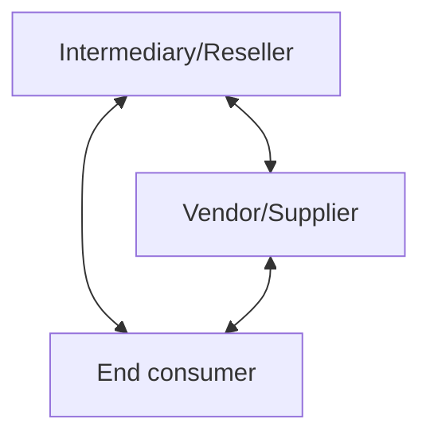

This chapter discusses principal versus agent considerations and the related accounting implications for both the intermediary/reseller (refer to 10.2.2) and vendor/supplier (refer to 10.3). The chapter also addresses related practical application issues, including accounting for shipping and handling fees, out-of-pocket reimbursements, and amounts collected from a customer to be remitted to a third party (for example, certain sales taxes).


Principal versus agent considerations 10-2

## 10.2 Principal versus agent framework

The principal versus agent assessment is a two-step process that consists of (1) identifying the specified good or service to be provided to the end consumer and (2) assessing whether the reporting entity (intermediary) controls the specified good or service before it is transferred to the end consumer.

The reporting entity will apply the "distinct" guidance in ASC 606-10-25-19 through ASC 606-10-25-22 to identify the specified goods or services. In other words, specified goods or services are the distinct goods or services (or a distinct bundle of goods or services) that are transferred to the end consumer. Refer to RR 3.4 for additional discussion of the guidance for assessing whether a good or service is distinct.

The specified goods or services are determined from the perspective of the end consumer and are not necessarily the same as the reporting entity's performance obligations. For example, a reporting entity operating an online marketplace for selling and buying products may ultimately conclude its performance obligation is providing access to the marketplace; however, the specified good or service for purposes of the principal versus agent assessment is the product the end consumer purchases on the marketplace. If there is more than one specified good or service, the reporting entity should perform a separate principal versus agent assessment for each. In contracts with multiple specified goods or services, the reporting entity could be the principal for some goods or services and an agent for others.

The second step in the assessment requires a reporting entity that is an intermediary to use the definition of control in ASC 606-10-25-25 and the explanation of how a company obtains control outlined in ASC 606-10-55-37A to assess whether it obtains control of the specified good or service before it is transferred to the end consumer. If additional evidence is needed to reach a conclusion, the reporting entity should evaluate the indicators in ASC 606-10-55-39 along with all relevant facts and circumstances to inform the assessment of control.

Figure RR 10-2 illustrates the framework of the principal versus agent assessment.

**FIGURE RR 10-2**
Principal versus agent framework*

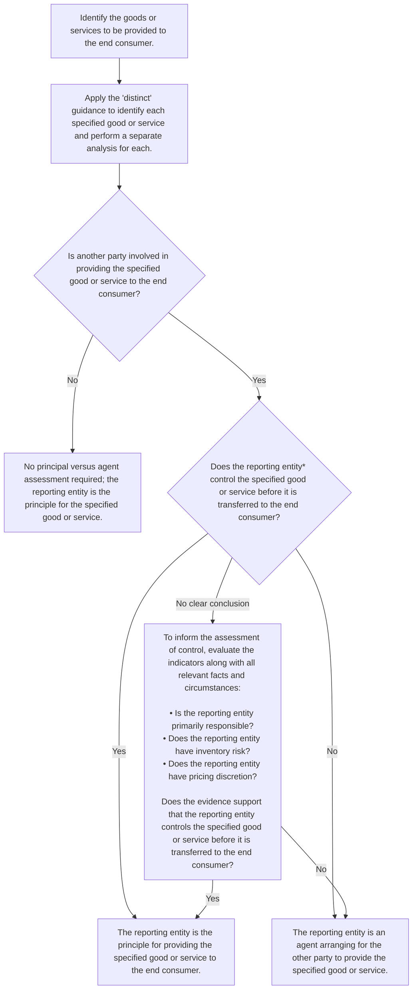


PwC US National Office | viewpoint.pwc.com 10-3

*Note: this decision tree assumes that the reporting entity performing the assessment is in the role of the intermediary.

Question RR 10-1 addresses whether a reporting entity can elect to present revenue on a net basis.

### QUESTION RR 10-1
Is the principal versus agent assessment a policy election (for example, can a reporting entity elect to report on a net basis as an agent)?

**PwC response**
No. The principal versus agent assessment is not an accounting policy election. It is a judgment that must be supported based on the facts and circumstances of each arrangement.

#### 10.2.1 Determining whether the reporting entity controls the specified good or service
A reporting entity is the principal in a transaction with an end consumer if it obtains control of the specified good or service before it is transferred to the end consumer. A reporting entity is an agent if it does not control the specified good or service before it is transferred to the end consumer.

“Control” is defined in ASC 606-10-25-25 as the ability to direct the use of, and obtain substantially all of the remaining benefits from, an asset (refer to RR 6.2). The revenue standard describes examples of how a reporting entity that is a principal could control a good or service before it is transferred to the end consumer.

> **ASC 606-10-55-37A**
> 
> When another party is involved in providing goods or services to a customer, an entity that is a principal obtains control of any one of the following:
> 
> a. A good or another asset from the other party that it then transfers to the customer.
> 
> b. A right to a service to be performed by the other party, which gives the entity the ability to direct that party to provide the service to the customer on the entity’s behalf.
> 
> c. A good or service from the other party that it then combines with other goods or services in providing the specific good or service to the customer. For example, if an entity provides a significant service of integrating the goods or services... provided by another party into the specified good or service for which the customer has contracted, the entity controls the specified good or service before that good or service is transferred to the customer. This is because the entity first obtains control of the inputs to the specified good or service (which include goods or services from other parties) and directs their use to create the combined output that is the specified good or service.

This guidance is intended to clarify how a reporting entity could obtain control in different arrangements, including arrangements to provide services. It also explains that if the reporting entity combines goods or services into a combined output that forms a single performance obligation to the end consumer, the reporting entity is the principal for all of the goods and services in that combined output. In that situation,


Principal versus agent considerations | 10-4

the "specified good or service" for performing the principal versus agent assessment is the combined output received by the end consumer. Management should assess whether goods or services are inputs into a combined output based on the guidance for determining whether goods or services are distinct from other promises in a contract (refer to RR 3.4.2).

It is not always clear solely from the definition of control whether the reporting entity obtains control of the specified good or service before it is transferred to the end consumer. The revenue standard provides indicators to help management make this assessment.

> **ASC 606-10-55-39**
>
> Indicators that an entity controls the specified good or service before it is transferred to the customer (and is therefore a principal...) include, but are not limited to, the following:
>
> a. The entity is primarily responsible for fulfilling the promise to provide the specified good or service. This typically includes responsibility for acceptability of the specified good or service (for example, primary responsibility for the good or service meeting customer specifications). If the entity is primarily responsible for fulfilling the promise to provide the specified good or service, this may indicate that the other party involved in providing the specified good or service is acting on the entity's behalf.
>
> b. The entity has inventory risk before the specified good or service has been transferred to a customer, or after transfer of control to the customer (for example, if the customer has a right of return). For example, if the entity obtains, or commits to obtain, the specified good or service before obtaining a contract with a customer, that may indicate that the entity has the ability to direct the use of, and obtain substantially all of the remaining benefits from, the good or service before it is transferred to the customer.
>
> c. The entity has discretion in establishing the prices for the specified goods or service. Establishing the price that the customer pays for the specified good or service may indicate that the entity has the ability to direct the use of that good or service and obtain substantially all of the remaining benefits. However, an agent can have discretion in establishing prices in some cases. For example, an agent may have some flexibility in setting prices in order to generate additional revenue from its service of arranging for goods or services to be provided by other parties to customers.

The indicators of control in ASC 606-10-55-39 are not intended to override the assessment that a reporting entity makes based on the definition of control in ASC 606-10-25-25; instead, they provide further guidance to inform management's assessment of whether the reporting entity controls the specified good or service.

Management needs to apply judgment when assessing the indicators and evaluate all relevant facts and circumstances. No single indicator is individually determinative. The guidance also does not weigh any indicator more heavily than the others, although some indicators may provide stronger evidence than others, depending on the circumstances. Judgment will often be required to evaluate the totality of the evidence, including assessing which indicators provide stronger evidence in the specific facts and circumstances. Management should consider both the contractual terms between the parties (including contractual rights and obligations) and the reporting entity's customary business practices when assessing the indicators.


PwC US National Office | viewpoint.pwc.com 10-5

It is helpful to understand the cash flows between the parties as part of gaining an understanding of the relationships between the parties. However, whether the reporting entity receives cash on a net or gross basis is generally not an indicator of whether the reporting entity is the principal or an agent in an arrangement.

### 10.2.1.1 Primary responsibility for fulfillment
If the reporting entity is primarily responsible for fulfilling the promise to the end consumer, this is an indicator that the reporting entity is directing the other party to perform on its behalf and therefore controls the specified good or service. The terms of the agreement and other communications (for example, marketing materials, website terms and conditions) often provide evidence about which party is primarily responsible for fulfilling the promise to the end consumer. Management should also consider who the end consumer views as primarily responsible, including which entity is responsible for customer service during and subsequent to fulfillment.

Examples of evidence that the reporting entity is primarily responsible for fulfillment could include:

*   The reporting entity determines which suppliers or vendors to contract with to fulfill end consumer orders (that is, the reporting entity has supplier discretion) or whether to fulfill the obligation with its own resources.
*   The reporting entity (a) has the ability to redirect goods or redirect a service provider to fulfill a different end consumer contract and/or (b) can prevent the other party from continuing to provide goods or services to a specific end consumer.
*   Contractual terms and other communications (for example, marketing materials, FAQs on the reporting entity's website) indicate that the reporting entity is responsible for providing the goods or service.
*   The end consumer does not have a contractual relationship with the other party and/or the end consumer has little to no interaction with the other party.
*   If the other party is unable to provide the good or service, the reporting entity is responsible for finding a replacement.
*   The reporting entity is the primary contact for customer service issues, including resolving complaints.
*   The reporting entity is significantly involved with the end consumer in identifying the goods or services that meet the end consumer's needs.
*   The reporting entity provides training or instruction to the other party or otherwise significantly influences how the other party fulfills the contract.

The above list is not comprehensive and should not be used as a checklist as certain evidence may be more or less persuasive, depending on the circumstances.

### 10.2.1.2 Inventory risk
Inventory risk is an indicator that a reporting entity obtains control of a good or service from the other party before it is transferred to the end consumer. Inventory risk exists when the reporting entity bears the risk of loss due to factors such as physical damage, decline in value, or obsolescence either before the specified good or service has been transferred to the end consumer or upon return. A reporting


Principal versus agent considerations | 10-6

entity’s risk is reduced if it has the ability to return unsold products or products returned by end consumers to the supplier for a credit or refund.

Noncancellable purchase commitments and certain types of guarantees may expose a reporting entity to inventory risk if the reporting entity bears the risk of ownership of the committed or guaranteed amounts (that is, the risk that it ultimately cannot sell or otherwise monetize the inventory). However, judgment may be required to determine whether a guarantee or commitment to a minimum quantity by the reporting entity is (a) a commitment to obtain a good or service in advance of obtaining a contract with a customer and therefore akin to inventory risk for the reporting entity or (b) a variable commission structure (that is, the reporting entity’s “net fee” or commission from the provider of the good or service varies based on the volume of transactions).

Taking legal title to a product only momentarily before it is transferred to the customer (that is, “flash title”) does not, on its own, result in a reporting entity being the principal. The reporting entity needs to have control of the good before it is transferred to the customer to be the principal.

On the other hand, it is not a requirement for a reporting entity to have inventory risk to conclude it takes control of a good. For example, a reporting entity that sells a good to an end consumer may instruct a supplier to ship the product directly to the end consumer (“dropship” the product) and as a result, the reporting entity does not take physical possession and may never have substantive inventory risk related to the good. This fact, on its own, would not preclude the reporting entity from concluding it controls the good before it is transferred to the end consumer. However, the reporting entity would have to support its conclusion based on other evidence of control.

Inventory risk might exist even if no physical product is sold. For example, a reporting entity might have inventory risk in a service arrangement if it is committed to pay the service provider even if the reporting entity is unable to identify a customer to purchase the service. However, inventory risk is commonly not applicable for services; therefore, the absence of inventory risk in a service arrangement is generally not evidence that the reporting entity lacks control of the services.

### 10.2.1.3 Pricing discretion
Discretion in establishing the price that the end consumer pays for the specified good or service is an indicator that the reporting entity obtains substantially all of the remaining benefits from an asset and therefore, controls the good or service. Conversely, earning a fixed fee or fixed percentage of the consideration for each sale might indicate that a reporting entity is an agent, as a fixed commission limits the benefit a reporting entity can receive from the transaction.

Unlimited pricing discretion provides more persuasive evidence of control, while pricing discretion limited by the other party to a range or a specified floor or ceiling may be less persuasive. Further, the narrower the range within which the reporting entity has pricing discretion, the less persuasive the evidence that the reporting entity has pricing discretion that indicates control.

In some cases, a reporting entity could have flexibility in setting prices and still be considered an agent. For example, agents often have the ability to provide discounts to end consumers (and effectively forgo a portion of their fee or commission) in order to incentivize purchases of the principal’s good or service.

A variable commission structure, including the potential to incur a loss on a transaction, typically does not provide conclusive evidence that the reporting entity


PwC US National Office | viewpoint.pwc.com 10-7

controls the specified good or service. However, a variable commission structure may coincide with other indicators of control. For example, actions the reporting entity takes to manage or mitigate this type of economic risk in an arrangement may provide support that the reporting entity is primarily responsible for fulfillment or has inventory risk.

### 10.2.2 Accounting implications for an intermediary in a three-party arrangement
As illustrated in Figure RR 10-3, the differences in the amount of revenue recognized can be significant depending on the conclusion of whether a reporting entity is the principal or an agent for providing a good or service to an end consumer.

#### FIGURE RR 10-3
Revenue recognition for a principal versus agent

<table>
  <thead>
    <tr>
        <th>Reporting entity obtains control of the specified good or service</th>
        <th>Principal</th>
        <th>Price paid by the end consumer for the good or service (“gross” revenue); amounts remitted to the other party are presented as an expense</th>
        <th>End consumer</th>
    </tr>
    <tr>
        <th>Reporting entity does not obtain control of the specified good or service</th>
        <th>Agent</th>
        <th>Net amount retained after remitting amounts to the other party for providing the good or service (“net” revenue)</th>
        <th>It depends*</th>
    </tr>
  </thead>
  <tbody>
    <tr>
        <td>Assessment of control</td>
        <td>Principal or agent</td>
        <td>Amount presented as revenue</td>
        <td>Which party is the customer</td>
    </tr>
  </tbody>
</table>

\* Depending on the circumstances, if the reporting entity is an agent, its customer could be:

- [ ] the vendor/supplier/service provider. This is more likely if the reporting entity’s role is that of a sales agent;
- [ ] the end consumer. This is more likely if the reporting entity’s role is that of a purchasing agent; or
- [ ] both the vendor/supplier/service provider and the end consumer. This is more likely if the reporting entity provides services (explicitly or implicitly) to both parties.

The timing of revenue recognition can also differ depending on whether the reporting entity is the principal or an agent. Once a reporting entity identifies its promises in a contract and determines whether it is the principal or an agent for those promises, it recognizes revenue when (or as) the performance obligations are satisfied. It is therefore critical to identify the promise in the contract to determine when that promise is satisfied.

An agent might satisfy its performance obligation (arranging for the transfer of specified goods or services) before the end consumer receives the specified good or service from the principal in some situations. For example, an agent that promises to arrange for a sale between a vendor and the vendor’s customer in exchange for a commission will generally recognize its commission as revenue at the time a contract between the vendor and vendor’s customer is executed (that is, when the agency


Principal versus agent considerations | 10-8

services are completed). In contrast, the vendor will not recognize revenue until it transfers control of the underlying goods or services to the end consumer.

### 10.2.3 Examples of the principal versus agent assessment
Example RR 10-1, Example RR 10-2, and Example RR 10-3 illustrate the analysis of whether a reporting entity is the principal or an agent in various arrangements. These concepts are also illustrated in Examples 45-48A of the revenue standard (ASC 606-10-55-317 through ASC 606-10-55-334F).

#### EXAMPLE RR 10-1
Principal versus agent – reporting entity is an agent

WebCo operates a website that sells books. WebCo enters into a contract with Bookstore to sell Bookstore’s books online. WebCo’s website clearly identifies Bookstore as the seller of the books and facilitates payments between Bookstore and the end consumer. The sales price is established by Bookstore, and WebCo earns a fee equal to 5% of the sales price. Bookstore ships the books directly to the end consumer, and WebCo cannot redirect ordered books to other customers. The end consumer returns the books to WebCo if they are dissatisfied; however, WebCo has the right to return books to Bookstore for a full refund if they are returned by the end consumer.

Is WebCo the principal or an agent for the sale of books to the end consumer?

**Analysis**

WebCo is acting as a sales agent for Bookstore and should recognize revenue equal to the fee it charges Bookstore for facilitating sales to end consumers; that is, it should recognize revenue on a net basis.

The specified good or service is a book purchased by the end consumer. WebCo does not control the book before it is transferred to the end consumer because it does obtain control of the book from Bookstore, does not direct Bookstore to perform on its behalf, and does not combine the book with other goods or services into a combined output. This conclusion is supported by the indicators of control:

[ ] WebCo is not primarily responsible for fulfilling the promise to deliver a book.

[ ] WebCo does not have inventory risk because it has the right to return books to Bookstore that are returned by end consumers.

[ ] WebCo does not have discretion in establishing the selling price of the book.

WebCo should recognize revenue equal to its 5% fee when it satisfies its promise to facilitate the sale of a book (that is, when a confirmed order is placed on its website).

#### EXAMPLE RR 10-2
Principal versus agent – reporting entity is the principal

TravelCo negotiates with major airlines to obtain access to airline tickets at reduced rates and sells the tickets to end consumers through its website. TravelCo contracts with airlines to buy a specific number of tickets at agreed-upon rates and must pay for those tickets regardless of whether it is able to resell them. End consumers visiting TravelCo’s website search TravelCo’s available tickets. TravelCo has discretion in establishing the prices for the tickets it sells to the end consumers.


PwC US National Office | viewpoint.pwc.com 10-9

TravelCo is responsible for delivering the ticket to the end consumer. TravelCo will also assist the end consumer in resolving complaints with the service provided by the airlines. The airline is responsible for fulfilling all other obligations associated with the ticket, including the air travel and related services (that is, the flight), and remedies for service dissatisfaction.

Is TravelCo the principal or an agent for the sale of an airline ticket to an end consumer?

### Analysis

TravelCo is the principal for the sale of the ticket to the end consumer and should recognize revenue for the price paid by the end consumer; that is, it should recognize revenue on a gross basis.

The specified good or service is a right to fly on the selected flight (represented by a ticket) along with the other rights provided by the airline for the holder of that ticket. TravelCo obtains control of the right to the airline's services (which it could resell or use itself) and transfers that right (represented by the ticket) to the end consumer. This conclusion is supported by the indicators of control:

*   Although the airline is responsible for providing the air travel services, TravelCo is primarily responsible for fulfilling the promise to transfer a right to future services (the ticket) to the end consumer.
*   TravelCo has inventory risk as a result of purchasing the ticket from the airline in advance and will be subject to the risks and rewards of ownership, including loss if it is unable to sell the ticket.
*   TravelCo has discretion in establishing the selling price of the ticket.

TravelCo should recognize revenue equal to the price paid by the end consumer for the ticket when it transfers control of the ticket to the end consumer. It will recognize the cost of the ticket (the purchase price from the airline) as cost of sales.

#### EXAMPLE RR 10-3
Principal versus agent – multiple specified goods or services

PayrollCo provides payroll processing services to end consumers under a service arrangement. PayrollCo also offers consulting services to an end consumer related to the end consumer's payroll and compensation processes. PayrollCo has concluded that the payroll processing services and consulting services are distinct in the arrangement with the end consumer.

The consulting services are performed by a third party, ConsultCo. ConsultCo determines the pricing of the consulting services and coordinates directly with the end consumer to determine the timing and scope of work. PayrollCo occasionally assists the end consumer in resolving complaints about the consulting services; however, ConsultCo is responsible for meeting the end consumer's specifications, including providing any refunds or reperforming work, as needed.

PayrollCo bills and collects the fee for the consulting services, of which 90% is remitted to ConsultCo. Any losses resulting from cost overruns in the consulting services are fully absorbed by ConsultCo. On a monthly basis, PayrollCo bills and collects a service fee from the end consumer for the payroll processing services. No discounts are provided to the end consumer for purchasing the services as a bundle.


Principal versus agent considerations | 10-10

Is PayrollCo the principal or an agent for the payroll processing services and consulting services?

### Analysis

There are two distinct specified services in the arrangement: payroll processing services and consulting services. PayrollCo is the principal for the payroll processing services provided to the end consumer because no other parties are involved in providing these services. Therefore, PayrollCo will recognize revenue for the payroll processing services on a gross basis. PayrollCo is an agent arranging for ConsultCo to provide the consulting services to the end consumer; therefore, it will recognize revenue net of the amount remitted to ConsultCo.

PayrollCo does not control the consulting services because it does not obtain a right to the consulting services, does not direct ConsultCo to perform on its behalf, and does not combine the consulting services with other goods or services into a combined output. This conclusion is supported by the indicators of control:

*   PayrollCo is not primarily responsible for fulfilling the promise to provide consulting services.
*   PayrollCo does not have inventory risk as it does not pay for the consulting services in advance.
*   PayrollCo does not have discretion in establishing the selling price of the consulting services.

PayrollCo should recognize revenue equal to the price it charges end consumers for payroll processing services as it provides the services. PayrollCo should recognize the commission it receives from ConsultCo when it satisfies its promise to arrange for the consulting services.

---

## 10.3 Determining a vendor’s customer in a three-party arrangement

A reporting entity that is a vendor or supplier that provides goods or services using its own resources (for example, its own inventory or its own employees) is the principal for providing those goods or services. However, when another party (an intermediary) is also involved in the transaction, the reporting entity needs to assess whether the other party or the end consumer is its customer.

The principal versus agent framework is also relevant in assessing which party is the reporting entity’s customer. The intermediary is the reporting entity’s customer if the intermediary takes control of the good or service before it is transferred to the end consumer. In that situation, the reporting entity will recognize as revenue the amount it receives from the intermediary. If the intermediary does not take control of the good or service, the end consumer is the reporting entity’s customer; accordingly, the reporting entity will recognize as revenue the amount it receives from the end consumer and recognize as an expense the amount retained by the intermediary.

Example RR 10-4 and Example RR 10-5 illustrate the analysis of whether an intermediary or end consumer is the reporting entity’s customer.


PwC US National Office | viewpoint.pwc.com 10-11

### EXAMPLE RR 10-4
#### Principal versus agent – customer is the end consumer

SoftwareCo sells its software product offering through multiple channels, including an online marketplace owned and operated by PlatformCo, an unrelated party. In arrangements with PlatformCo, end consumers initiate a purchase of SoftwareCo’s product through the online marketplace and are prompted to sign an agreement directly with SoftwareCo. SoftwareCo determines the selling price paid by the end consumer, which is collected by PlatformCo and remitted to SoftwareCo less a 20% fee for use of the marketplace. SoftwareCo provides all customer service related to the use of its software product, while PlatformCo provides customer service for use of the online marketplace.

Which party is SoftwareCo’s customer for sales of its software product through the online marketplace?

***Analysis***

SoftwareCo’s customer for sales through the online marketplace is the end consumer because PlatformCo does not obtain control of the software product and is therefore an agent providing services to SoftwareCo. SoftwareCo should recognize revenue equal to the price paid by end consumers and an expense for the amount retained by PlatformCo.

The specified good or service provided to the end consumer is the software product. PlatformCo does not obtain control of the software product before it is transferred to the end consumer; therefore, PlatformCo is an agent arranging for SoftwareCo’s sales to end consumers. This conclusion is supported by the indicators of control:

[ ] PlatformCo is only responsible for its online marketplace and is not primarily responsible for providing the software product.
[ ] PlatformCo does not have inventory risk related to the software product.
[ ] PlatformCo does not have discretion in establishing the selling price of the software product.

### EXAMPLE RR 10-5
#### Principal versus agent – customer is the intermediary

ProductCo contracts with Reseller, who sells ProductCo’s products to end consumers. Reseller identifies and contracts with end consumers, establishes the selling price for ProductCo’s products, and often bundles ProductCo’s products with other distinct products and services depending on the end consumer’s needs. Reseller does not purchase ProductCo’s products in advance but has agreed to pay ProductCo a specified price for its products when an end consumer places an order. ProductCo does not have a contract directly with the end consumer and does not provide customer support to the end consumer. ProductCo typically ships its products directly to the end consumer based on instructions it receives from Reseller. ProductCo has responsibility to Reseller to replace defective products; however, Reseller has responsibility to end consumers for satisfaction with orders placed with Reseller. ProductCo is not contractually obligated to accept products that have been returned by unsatisfied end consumers, but may agree to take returns from Reseller at its discretion.

Which party is ProductCo’s customer for sales of its products?


Principal versus agent considerations | 10-12

***Analysis***

ProductCo’s customer for sales of its products is Reseller because Reseller obtains control of ProductCo’s products before they are transferred to the end consumer. ProductCo should recognize as revenue the amount it receives from Reseller for purchase of its products.

The specified good or service provided to the end consumer is ProductCo’s products. Reseller obtains control of the products by directing ProductCo to provide the products to end consumers on its behalf. This conclusion is supported by the indicators of control:

[ ] Reseller is primarily responsible for fulfilling the promise to deliver ProductCo’s products to the end consumer.
[ ] Although Reseller does not take inventory risk prior to transfer of the products to the end consumer, Reseller has inventory risk related to returns of ProductCo’s products from end consumers.
[ ] Reseller has discretion in establishing the selling price of ProductCo’s products to the end consumer.

***

### 10.3.1 Price charged by agent is unknown
In some situations when a reporting entity concludes its customer is the end consumer, it may not have visibility into the price paid by the end consumer. For example, the reporting entity may not have visibility into the pricing of its good or service if a reseller “bundles” the reporting entity’s good or service with other distinct goods or services and charges the end consumer a single price for the bundle. ASC 606 does not include specific guidance to address this situation. However, the FASB noted in the Basis for Conclusions (paragraphs BC37-BC38) of ASU 2016-08 that if the price charged by an intermediary to the customer is unknown and not expected to be resolved, the unknown amount does not meet the definition of variable consideration and should not be included in the transaction price. Thus, the reporting entity should not estimate the price charged to the customer by the intermediary and should instead recognize revenue for only the amount paid by the intermediary for the good or service.

## 10.4 Shipping and handling fees
Reporting entities that sell goods often deliver them via third-party shipping service providers. Reporting entities sometimes charge customers a separate fee for shipping and handling costs, or shipping and handling might be included in the price of the good. Separate fees may be a direct reimbursement of costs paid to the third-party, or they could include a profit element.

If control of a good does not transfer to the customer before shipment (that is, control transfers upon delivery), shipping is not a promised service to the customer, and any fees charged for shipping would be included in the transaction price for the good. In contrast, if control of a good transfers at shipping point, shipping services may be a separate performance obligation. In that case, management needs to assess whether the reporting entity is the principal for the shipping service or is an agent arranging for the shipping service to be provided by another party. Management could conclude that the reporting entity is the principal for both the sale of the goods and the shipping service, or that it is the principal for the sale of the goods, but an agent for the service of shipping those goods.


PwC US National Office | viewpoint.pwc.com 10-13

The revenue standard includes an accounting policy election that permits reporting entities to account for shipping and handling activities that occur after the customer has obtained control of a good as a fulfillment cost rather than as an additional promised service. Refer to RR 3.6.4 for further discussion of shipping services and the policy election.

### QUESTION RR 10-2
Does a reporting entity need to assess whether it is the principal or agent for shipping and handling if it elects to account for shipping and handling activities as a fulfillment cost?

#### PwC response
No. We believe a reporting entity that elects to account for shipping and handling activities as a fulfillment cost does not need to separately assess whether it is the principal or agent for those activities. Reporting entities applying the election will include any fee received for shipping and handling as part of the transaction price and recognize revenue when control of the good transfers. Refer to RR 3.6.4 for further discussion of this policy election.

### QUESTION RR 10-3
What is the appropriate classification of shipping and handling costs within the income statement?

#### PwC response
The revenue standard does not include specific guidance regarding the classification of shipping and handling costs within the income statement. If a reporting entity has determined that shipping and handling activities represent an additional promised service to the customer (refer to RR 3.6.4), we believe the related costs should be presented within costs of revenue. Similarly, if the reporting entity has elected to account for the costs of shipping and handling as costs to fulfill the performance obligation, presentation in costs of revenue would also be appropriate.

Under previous revenue guidance, some reporting entities may have elected to present shipping and handling costs in a line item other than costs of revenue and have continued that practice under ASC 606. In those circumstances, reporting entities should consider whether additional disclosure of shipping and handling costs is warranted, including disclosure of the amount(s) and line item(s) where the costs have been presented.

A change in the presentation of shipping and handling costs in the income statement from (or to) costs of revenue would likely be considered a change in accounting policy under ASC 250, which would require an assessment of whether such a change is preferable. We believe it may be challenging to conclude that presentation of those costs outside of cost of sales is preferable.

## 10.5 Out-of-pocket expenses and other cost reimbursements
Expenses are often incurred by service providers while performing work for their customers. These can include costs for travel, meals, accommodations, and miscellaneous supplies. It is common in service arrangements for the parties to agree that the customer will reimburse the service provider for some or all of the out-of-pocket expenses. Alternatively, such expenses may be incorporated into the price of the service instead of being charged separately.


Principal versus agent considerations 10-14

Out-of-pocket expenses often relate to activities that do not transfer a good or service to the customer. For example, a service provider that is entitled to reimbursement for employee travel costs would generally account for the travel costs as costs to fulfill the contract with the customer. Reimbursements would be included in the transaction price for the contract.

Management should consider the principal versus agent guidance if a customer reimburses the vendor for a good or service transferred to the customer as part of a contract (for example, reimbursement of subcontractor services). Management should first identify the specified good or service to be provided to the customer. This includes assessing whether the goods or services are inputs into a combined output that the reporting entity transfers to the customer.

For example, a service provider may subcontract a portion of the service it provides to customers and agree with the customer to be reimbursed for the subcontracted services (sometimes referred to as a "pass-through" cost). The service provider would be an agent with regard to the subcontracted services if it does not control the subcontracted services before they are transferred to the customer. In this case, the service provider would recognize revenue from the reimbursement net of the amount it pays to the subcontractor. The service provider would be the principal if it controls the subcontracted services by directing the subcontractor to perform on its behalf or combining the subcontracted services with its own services to create a combined output. If the service provider is the principal for the subcontracted services, the reimbursement would be included in the transaction price and allocated to the separate performance obligations in the contract.

## 10.6 Amounts from customers remitted to a third party

Reporting entities often collect amounts from customers that must be remitted to a third party (for example, collecting and remitting taxes to a governmental agency). Taxes collected from customers could include sales, use, value-added, and some excise taxes. Amounts collected on behalf of third parties, such as certain sales taxes, are not included in the transaction price as they are collected from the customer on behalf of the government. The reporting entity is the agent for the government in these situations.

Taxes that are based on production, rather than sales, are typically imposed on the seller, not the customer. A reporting entity that is obligated to pay taxes based on its production is typically the principal for those taxes, and therefore recognizes the tax as an operating expense, with no effect on revenue.

Management needs to assess each type of tax, on a jurisdiction-by-jurisdiction basis, to conclude whether to net these amounts against revenue or to recognize them as an operating expense. The intent of the tax, as written into the tax legislation in the particular jurisdiction, should also be considered.

The name of the tax (for example, sales tax or excise tax) is not determinative when assessing whether the reporting entity is the principal or the agent for the tax. Whether or not the customer knows the amount of tax also does not necessarily impact the analysis. Management needs to look at the underlying characteristics of the tax and the tax laws in the relevant jurisdiction to determine whether the reporting entity is primarily obligated to pay the tax or whether the tax is levied on the customer. This could be a significant undertaking for some reporting entities, particularly those that operate in numerous jurisdictions with different tax regimes.


PwC US National Office | viewpoint.pwc.com 10-15

Indicators that taxes are the responsibility of the reporting entity and therefore should be recorded as an expense (as opposed to a reduction of transaction price) include but are not limited to:

*   The triggering event to pay the tax is the production or the importation of goods. Conversely, when the triggering event is the sale to a customer, this might indicate that the reporting entity is collecting the tax on behalf of a governmental entity.
*   The tax is based on the number of units or on the physical quantity (for example, number of cigarettes or volume of alcoholic content) produced by the reporting entity rather than the selling price to customers.
*   The tax is due on accumulated earnings during a period of time as opposed to each individual sale transaction.
*   The reporting entity cannot claim a refund of the tax in the event the related inventory is not sold or the customer fails to pay for the goods or services being sold.
*   The reporting entity has no legal or constructive obligation to change prices in order to reflect taxes. Conversely, when the tax is clearly separate from the selling price and a change in the tax would result in an equivalent change in the amount passed through to the customer, this might indicate that the reporting entity is collecting the tax on behalf of the government.

The above indicators should be considered along with the intended purpose of the tax, as written into the tax legislation in the particular jurisdiction. The existence (or nonexistence) of one of the above indicators may not be determinative on its own.

Example RR 10-6 and Example RR 10-7 illustrate the assessment of whether a tax should be presented as an expense or a reduction of transaction price.

### EXAMPLE RR 10-6
**Presentation of taxes – reporting entity is principal for the tax**

SpiritsCo is a global producer and distributor of branded alcoholic spirits. SpiritsCo pays an excise duty based on the value as well as the volume of products that leave a bonded warehouse. The movement of products from the bonded warehouse for customs clearance is the triggering event of the obligation to pay excise duty. In case a customer fails to make payment or if products are not sold, SpiritsCo cannot claim a refund of the excise duty it has paid.

SpiritsCo has no legal or constructive obligation to reflect any change of the rate of excise duty in the selling price of products. An increase in the rate of excise duty can lead SpiritsCo to increase its selling price, but such increases are a commercial decision and would not be automatic. The tax is not separately presented on the invoice.

How should SpiritsCo account for the excise duty?

**Analysis**

SpiritsCo is the principal for the excise duty as the triggering event is the movement of products (as opposed to sales to customers), SpiritsCo makes a decision whether to adjust the selling price of products to pass the tax on to the customer, and SpiritsCo cannot claim a refund in case of a customer’s failure to pay. SpiritsCo


Principal versus agent considerations | 10-16

should therefore recognize the excise duty as an expense as opposed to a reduction of transaction price.

### EXAMPLE RR 10-7
Presentation of taxes – tax is collected on behalf of a governmental entity

Manufacturer sells widgets to customers in various jurisdictions. In a particular jurisdiction, Manufacturer pays a sales tax calculated based on the number of widgets sold. The triggering event of the obligation is each individual sale to a customer. The tax is separately identified on the invoice to the customer and any increase in the tax rate would result in an equivalent increase of the tax charged to the customer. Manufacturer receives a refund of the tax if the receivables are not collected.

How should Manufacturer account for the excise duty?

#### *Analysis*

Manufacturer is likely collecting the sales tax as an agent on behalf of a governmental agency. The triggering event is sales to customers, the tax is separately charged to customers, and Manufacturer receives a refund if the receivables are not collected. Manufacturer should therefore exclude the sales tax collected from customers from the transaction price, and no expense would be recognized for the tax. The collection and payment of the tax would only impact balance sheet accounts.

***

#### 10.6.1 Accounting policy election for taxes collected from customers
In accordance with ASC 606-10-32-2A, reporting entities may present, as an accounting policy election, amounts collected from customers for sales and other taxes net of the related amounts remitted. If presented on a net basis, such amounts would be excluded from the determination of the transaction price in the revenue standard. Reporting entities that make this election should apply the policy to all taxes within the scope of the policy election and comply with the general requirements for disclosures of accounting policies. Reporting entities that do not make this election or collect taxes from customers that are outside the scope of the policy election should evaluate each type of tax as described in RR 10.6.

> **Excerpt from ASC 606-10-32-2A**
>
> An entity may make an accounting policy election to exclude from the measurement of the transaction price all taxes assessed by a governmental authority that are both imposed on and concurrent with a specific revenue-producing transaction and collected by the entity from a customer (for example, sales, use, value added, and some excise taxes). Taxes assessed on an entity’s total gross receipts or imposed during the inventory procurement process shall be excluded from the scope of the election. An entity that makes this election shall exclude from the transaction price all taxes in the scope of the election and shall comply with the applicable accounting policy guidance, including the disclosure requirements.


PwC US National Office | viewpoint.pwc.com 10-17

### QUESTION RR 10-4

If a reporting entity does not explicitly indicate to the customer that the invoice price includes a tax on a specific revenue-producing transaction, is it excluded from the scope of the policy election?

#### PwC response
No. It is not necessary for a reporting entity to communicate to the customer that it is collecting a tax (for example, through a separate line item on the invoice) for the tax to be within the scope of the policy election. The collection of the tax may be implicit in the transaction price charged to the customer.

### QUESTION RR 10-5

If a reporting entity that has elected the practical expedient in ASC 606-10-32-2A is unaware that a transaction is subject to a tax and is later obligated to make a payment to the taxing authority for that tax, how should the payment to the government, or the accrual of the liability for the payment to the government, be reflected in the income statement?

#### PwC response
If a reporting entity makes the policy election outlined in ASC 606-10-32-2A and is required to make a payment to a governmental authority for a tax that was both imposed on and concurrent with a specific revenue-producing transaction, we believe the payment should be presented as a reduction of revenue. If the entity had been aware of the tax when the revenue was originally collected, it would have excluded the tax amount from revenue. However, we are aware of cases when determining whether or not transactions are subject to certain taxes may be complicated and subject to varying interpretations under the relevant tax law. Therefore, in some limited cases, it could be appropriate to conclude that any payment for taxes that the entity is later determined to be obligated for could be classified as an expense for the prior transactions.

### QUESTION RR 10-6

Are tariffs on imported goods a tax in the scope of the practical expedient in ASC 606-10-32-2A?

#### PwC response
No. A tariff incurred in connection with the acquisition of goods is not a tax imposed on and concurrent with a specific revenue-producing transaction; therefore, it is not in the scope of the practical expedient. Tariffs represent a cost incurred by the reporting entity. If a reporting entity chooses to collect an additional amount from its customers to recover the cost of the tariff, such amount would represent additional transaction price (i.e., revenue). Refer to Question IV 1-1 for discussion of the impact of tariffs on inventory.


Principal versus agent considerations | 10-18

# Chapter 11:
# Contract costs—updated
# September 2025

The page features a decorative graphic in the upper right quadrant consisting of various horizontal rounded capsules and circles in shades of grey, pink, and orange. Some shapes are solid, while others are outlines or semi-transparent, creating an overlapping pattern.

## 11.1 Overview—contract costs

Reporting entities sometimes incur costs to obtain a contract that otherwise would not have been incurred. Reporting entities also may incur costs to fulfill a contract before a good or service is provided to a customer. The revenue standard provides guidance on costs to obtain and fulfill a contract that should be recognized as assets. Costs that are recognized as assets are amortized over the period that the related goods or services transfer to the customer and are periodically reviewed for impairment.

**QUESTION RR 11-1**
Can a reporting entity apply the portfolio approach to account for contract costs?

**PwC response**
Yes. Management may apply the portfolio approach to account for costs related to contracts with similar characteristics, similar to other aspects of the revenue standard. We believe the portfolio approach is permitted even though the portfolio approach guidance is contained in ASC 606 and the contract cost guidance is contained in ASC 340-40. The portfolio approach is permitted if the reporting entity reasonably expects that the effect of applying the guidance to the portfolio would not differ materially from applying the guidance to each contract or performance obligation individually.

## 11.2 Incremental costs of obtaining a contract

Reporting entities sometimes incur costs to obtain a contract with a customer, such as selling and marketing costs, bid and proposal costs, sales commissions, and legal fees. Costs to obtain a customer do not include payments to customers; refer to RR 4.6 for discussion of payments to customers.

> **Excerpt from ASC 340-40-25-1**
>
> An entity shall recognize as an asset the incremental costs of obtaining a contract with a customer if the entity expects to recover those costs.

Only incremental costs should be recognized as assets. Incremental costs of obtaining a contract are those costs that the reporting entity would not have incurred if the contract had not been obtained (for example, sales commissions). Bid, proposal, and selling and marketing costs (including advertising costs), as well as legal costs incurred in connection with the pursuit of the contract, are not incremental, as the reporting entity would have incurred those costs even if it did not obtain the contract. Fixed salaries of employees are also not incremental because those salaries are paid regardless of whether a sale is made.

A reporting entity could make payments to multiple individuals for the same contract that all qualify as incremental costs. For example, if a reporting entity pays a sales commission to the salesperson, manager, and regional manager upon obtaining a new contract, all of the payments would be incremental costs.

The timing of a payment does not on its own determine whether the costs are incremental; however, management should consider whether the payment is contingent upon factors other than obtaining a contract. For example, a bonus payment that is calculated based on obtaining contracts is similar to a commission, but if the bonus is also based on the individual’s overall performance in relation to non-sales-related goals, it is likely not an incremental cost. Similarly, a payment that


Contract costs 11-2

is contingent upon an employee providing future service in addition to obtaining a new contract would generally not be considered an incremental cost to obtain a contract. Assessing whether a payment has a substantive future service requirement may require judgment. Refer to US Revenue TRG Memo No. 57 and the related meeting minutes in Revenue TRG Memo No. 60 for further discussion of costs that are incremental.

Costs of obtaining a contract that are not incremental should be expensed as incurred unless those costs are explicitly chargeable to the customer, even if the contract is not obtained. Amounts that relate to a contract that are explicitly chargeable to a customer are a receivable if a reporting entity's right to reimbursement is unconditional.

Incremental costs of obtaining a contract with a customer are recognized as assets if they are recoverable. Expensing these costs as they are incurred is not permitted unless they qualify for the practical expedient discussed at RR 11.2.2.

The revenue standard does not address the timing for recognizing a liability for costs to obtain a contract. Management should therefore refer to the applicable liability guidance (for example, ASC 405, *Liabilities*) to first determine if the reporting entity has incurred a liability and then apply the revenue standard to determine whether the related costs should be capitalized or expensed. Refer to Revenue TRG Memo No. 23 and the related meeting minutes in Revenue TRG Memo No. 25 for further discussion of this topic.

In some cases, incremental costs may relate to multiple contracts. For example, many sales commission plans are designed to pay commissions based on cumulative thresholds. The fact that the costs relate to multiple contracts does not preclude the costs from qualifying as incremental costs to obtain a contract. Management should apply judgment to determine a reasonable approach to allocate costs to the related contracts in these instances. Refer to Revenue TRG Memo No. 23, US Revenue TRG Memo No. 57, and the related meeting minutes in Revenue TRG Memo No. 25 and Revenue TRG Memo 60, respectively, for further discussion of this topic.

### QUESTION RR 11-2
Do fringe benefits (for example, payroll taxes) related to commission payments represent incremental costs to obtain a contract?

#### PwC response
Yes, if the fringe benefits would not have been incurred if the contract had not been obtained. Fringe benefits that are incremental costs and recoverable (refer to RR 11.2.1) are required to be capitalized, unless they qualify for the practical expedient discussed at RR 11.2.2. Refer to Revenue TRG Memo No. 23 and the related meeting minutes in Revenue TRG Memo No. 25 for further discussion of this topic.

### QUESTION RR 11-3
Should incremental costs to obtain contract renewals or modifications be capitalized?

#### PwC response
Yes, if the costs to obtain contract renewals or modification are incremental and recoverable. An example is a commission paid to a sales agent when a customer renews a contract. Management should not, however, record an asset in anticipation of contract renewals or modifications if the reporting entity has not yet incurred a


PwC US National Office | viewpoint.pwc.com 11-3

liability related to the costs. Refer to Revenue TRG Memo No. 23 and the related meeting minutes in Revenue TRG Memo No. 25 for further discussion of this topic.

### QUESTION RR 11-4
Should a sales commission be capitalized if it is subject to clawback in the event the customer fails to pay the contract consideration?

#### PwC response
Yes, assuming management has concluded that the parties are committed to perform their respective obligations and collection is probable, which are requirements for identifying a contract (refer to RR 2.6.1). Management should reassess whether a valid contract exists if circumstances change after contract inception and assess capitalized costs to obtain a contract for impairment. Refer to Revenue TRG Memo No. 23 and the related meeting minutes in Revenue TRG Memo No. 25 for further discussion of this topic.

**11.2.1 Assessing recoverability**
Management should assess recoverability of the incremental costs of obtaining a contract either on a contract-by-contract basis, or for a group of contracts if those costs are associated with the group of contracts. Management may be able to support the recoverability of costs for a particular contract based on its experience with other transactions if those transactions are similar in nature.

Management should consider, as part of its recoverability assessment, estimates of expected consideration from potential renewals and extensions. This should include both consideration received but not yet recognized as revenue and consideration the reporting entity is expected to receive in the future. Variable consideration that is constrained for revenue recognition purposes should also be included in assessing recoverability. Costs that are not expected to be recoverable should be expensed as incurred. See RR 11.4.2 for additional discussion of impairment.

**11.2.2 Practical expedient**
There is a practical expedient that permits a reporting entity to expense the costs to obtain a contract as incurred when the expected amortization period is one year or less. Anticipated contract renewals, amendments, and follow-on contracts with the same customer are required to be considered (to the extent the costs relate to those goods or services) when determining whether the period of benefit, and therefore the period of amortization, is one year or less. These factors might result in an amortization period that is beyond one year, in which case the practical expedient is not available.

### QUESTION RR 11-5
Can a reporting entity elect whether to apply the practical expedient to each individual contract or is it required to apply the election consistently to all similar contracts?

#### PwC response
The practical expedient is an accounting policy election that should be applied consistently to similar contracts.


Contract costs 11-4

### 11.2.3 Recognition model overview and examples

Figure RR 11-1 summarizes the accounting for incremental costs to obtain a contract.

#### FIGURE RR 11-1
Costs to obtain a contract overview

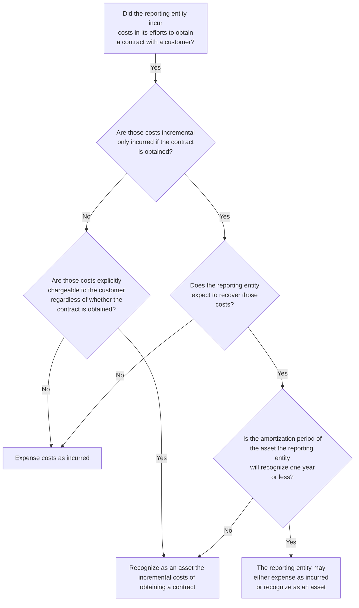

Example RR 11-1, Example RR 11-2, Example RR 11-3, Example RR 11-4, and Example RR 11-5 illustrate the accounting for incremental costs to obtain a contract. These concepts are also illustrated in Examples 36 and 37 of the revenue standard (ASC 606-10-55-281 through ASC 606-10-55-282).

#### EXAMPLE RR 11-1
Incremental costs of obtaining a contract — practical expedient

A salesperson for ProductCo earns a 5% commission on a contract that was signed in January. ProductCo will deliver the purchased products throughout the year. The contract is not expected to be renewed the following year. ProductCo expects to recover this cost.

How should ProductCo account for the commission?

**Analysis**

ProductCo can either recognize the commission payment as an asset or expense the cost as incurred under the practical expedient. The commission is a cost to obtain a contract that would not have been incurred had the contract not been obtained. Since ProductCo expects to recover this cost, it can recognize the cost as an asset and amortize it as revenue is recognized during the year. The commission payment can


PwC US National Office | viewpoint.pwc.com 11-5

also be expensed as incurred because the amortization period of the asset is one year or less.

The practical expedient would not be available; however, if management expects the contract to be renewed such that products will be delivered over a period longer than one year, as the amortization period of the asset would also be longer than one year.

### EXAMPLE RR 11-2
Incremental costs of obtaining a contract — construction industry

ConstructionCo incurs costs in connection with winning a successful bid on a contract to build a bridge. The costs were incurred during the proposal and contract negotiations and include the initial bridge design.

How should ConstructionCo account for the costs?

#### *Analysis*

ConstructionCo should expense the costs incurred during the proposal and contract negotiations as incurred. The costs are not incremental because they would have been incurred even if the contract was not obtained. The costs incurred during contract negotiations could be recognized as an asset if they are explicitly chargeable to the customer regardless of whether the contract is obtained.

Even though the costs incurred for the initial design of the bridge are not incremental costs to obtain a contract, some of the costs might be costs to fulfill a contract and recognized as an asset under that guidance (refer to RR 11.3).

### EXAMPLE RR 11-3
Incremental costs of obtaining a contract — telecommunications industry

Telecom sells wireless mobile phone and other telecom service plans from a retail store. Sales agents employed at the store signed 120 customers to two-year service contracts in a particular month. Telecom pays its sales agents commissions for the sale of service contracts in addition to their salaries. Salaries paid to sales agents during the month were $12,000, and commissions paid were $2,400. The retail store also incurred $2,000 in advertising costs during the month.

How should Telecom account for the costs?

#### *Analysis*
The only costs that qualify as incremental costs of obtaining a contract are the commissions paid to the sales agents. The commissions are costs to obtain a contract that Telecom would not have incurred if it had not obtained the contracts. Telecom should record an asset for the costs, assuming they are recoverable.

All other costs are expensed as incurred. The sales agents’ salaries and the advertising expenses are expenses Telecom would have incurred whether or not it obtained the customer contracts.

### EXAMPLE RR 11-4
Incremental costs of obtaining a contract — bonus based on a revenue target

TechCo’s vice president of sales receives a quarterly bonus based on meeting a specified revenue target that is established at the beginning of each quarter.


Contract costs 11-6

TechCo’s revenue includes revenue from both new contracts initiated during the quarter and contracts entered into in prior quarters.

Is the bonus an incremental cost to obtain a contract?

**Analysis**
No. The revenue target is impacted by more than obtaining new contracts. As such, the payment would not be an incremental cost to obtain the contract.

If the revenue target was based on obtaining new contracts, the substance of the payment would be the same as a sales commission. If this were the case, the bonus might be an incremental cost.

### EXAMPLE RR 11-5
Incremental costs of obtaining a contract — payment requires future service

Employee A, an internal salesperson employed by ProductCo, earns a 5% commission on a new contract obtained in January 20X1. The commission plan requires Employee A to continue providing employee service through the end of 20X2 to receive the commission payment.

Is the payment an incremental cost to obtain a contract?

**Analysis**
No. Employee A has to provide future service to receive the payment; therefore, the payment is contingent upon factors other than obtaining new contracts. ProductCo would recognize the expense over the service period in accordance with ASC 710, *Compensation*.

## 11.3 Costs to fulfill a contract
Reporting entities often incur costs to fulfill their obligations under a contract once it is obtained, but before transferring goods or services to the customer. Some costs could also be incurred in anticipation of winning a contract. The guidance in the revenue standard for costs to fulfill a contract only applies to those costs not addressed by other standards. For example, inventory costs would be covered under ASC 330, *Inventory*. Costs that are required to be expensed in accordance with other standards cannot be recognized as an asset under the revenue standard. Fulfillment costs not addressed by other standards qualify for capitalization if the following criteria are met.

> **Excerpt from ASC 340-40-25-5**
>
> a. The costs relate directly to a contract or an anticipated contract that the entity can specifically identify (for example, costs relating to services to be provided under the renewal of an existing contract or costs of designing an asset to be transferred under a specific contract that has not yet been approved).
>
> b. The costs generate or enhance resources of the entity that will be used in satisfying (or continuing to satisfy) performance obligations in the future.
>
> c. The costs are expected to be recovered.

Fulfillment costs that meet all three of the above criteria are required to be recognized as an asset; expensing the costs as they are incurred is not permitted.


PwC US National Office | viewpoint.pwc.com 11-7

Costs that relate directly to a contract include the following.

> **Excerpt from ASC 340-40-25-7**
>
> a. Direct labor (for example, salaries and wages of employees who provide the promised services directly to the customer)
>
> b. Direct materials (for example, supplies used in providing the promised services to a customer)
>
> c. Allocation of costs that relate directly to the contract or to contract activities (for example, costs of contract management and supervision, insurance, and depreciation of tools and equipment used in fulfilling the contract)
>
> d. Costs that are explicitly chargeable to the customer under the contract
>
> e. Other costs that are incurred only because an entity entered into the contract (for example, payments to subcontractors).

Judgment is needed to determine the costs that should be recognized as assets in some situations. Some of the costs listed above (for example, direct labor and materials) are straightforward and easy to identify. However, determining costs that should be allocated to a contract could be more challenging.

Certain costs might relate directly to a contract, but neither generate nor enhance resources of a reporting entity, nor relate to the satisfaction of future performance obligations.

> **Excerpt from ASC 340-40-25-8**
>
> An entity shall recognize the following costs as expenses when incurred:
>
> a. General and administrative costs (unless those costs are explicitly chargeable to the customer under the contract...)
>
> b. Costs of wasted materials, labor, or other resources to fulfill the contract that were not reflected in the price of the contract
>
> c. Costs that relate to satisfied performance obligations (or partially satisfied performance obligations) in the contract (that is, costs that relate to past performance)
>
> d. Costs for which an entity cannot distinguish whether the costs relate to unsatisfied performance obligations or to satisfied performance obligations (or partially satisfied performance obligations).

It can be difficult in some situations to determine whether incurred costs relate to satisfied performance obligations or to obligations still remaining. Costs that relate to satisfied or partially satisfied performance obligations are expensed as incurred. This is the case even if the related revenue has not been recognized (for example, because it is variable consideration that has been constrained). Costs cannot be deferred solely to match costs with revenue, nor can they be deferred to normalize profit margins. A reporting entity should expense all incurred costs if it is unable to distinguish between those that relate to past performance and those that relate to future performance.


Contract costs | 11-8

Costs to fulfill a contract are only recognized as an asset if they are recoverable, similar to costs to obtain a contract. Refer to RR 11.2.1 for further discussion of assessing recoverability.

### QUESTION RR 11-6
Contractor utilizes an output method (engineering surveys) to measure progress of construction services for which control transfers over time. In the first reporting period, Contractor determines that 35% of the contract has been completed based on the engineering survey and accordingly, recognizes revenue equal to 35% of the estimated transaction price. In the same period, Contractor incurs 45% of the estimated total costs to fulfill the contract. Can Contractor defer a portion of the costs incurred to achieve a consistent profit margin throughout the contract?

**PwC response**
No. Costs cannot be deferred solely to match costs with revenue or to achieve a consistent profit margin throughout the contract. Only costs to fulfill the contract that are capitalizable under other standards or meet the criteria for capitalization in the revenue standard (refer to RR 11.3.1) should be capitalized. The use of an output method to measure progress can result in different period to period profit margins unlike an input method based on costs incurred; however, the total profit margin on the contract will be the same under either method.

### 11.3.1 Recognition model overview
Figure RR 11-2 summarizes accounting for costs to fulfill a contract.

#### FIGURE RR 11-2
Recognition model overview

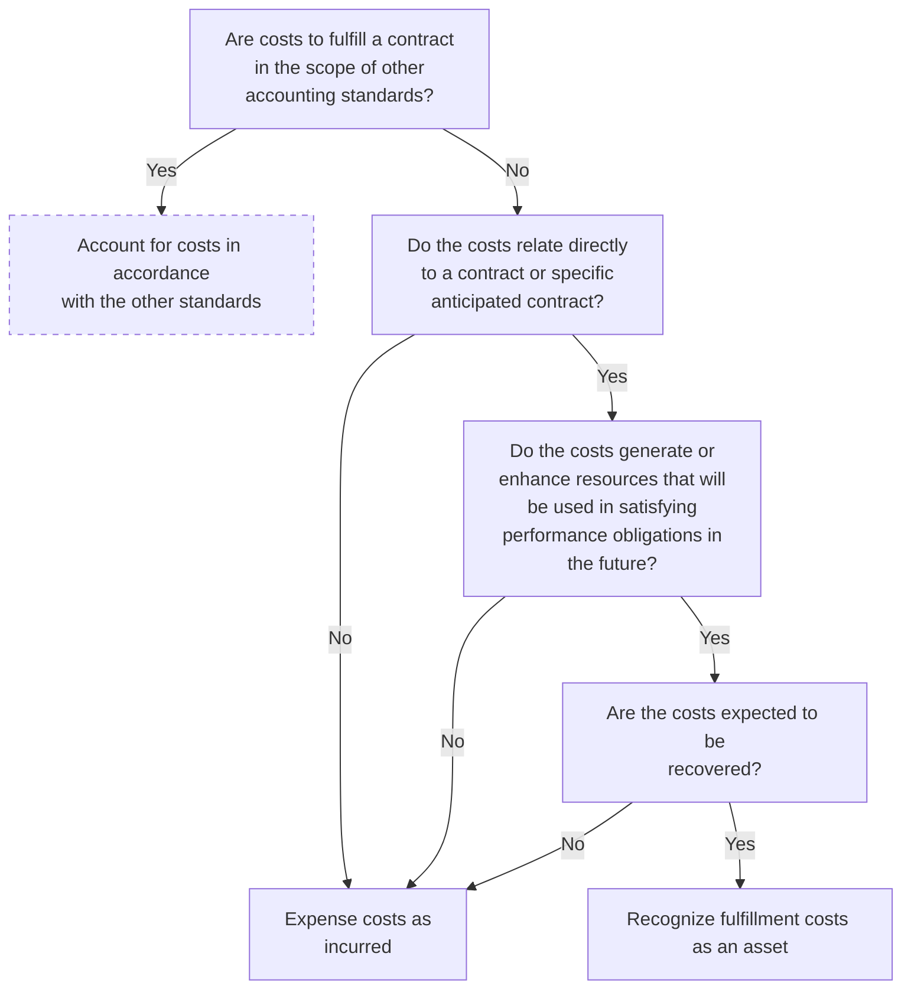


PwC US National Office | viewpoint.pwc.com 11-9

### 11.3.2 Learning curve costs

Learning curve costs are costs a reporting entity incurs to provide a service or produce an item in early periods before it has gained experience with the process. Over time, the reporting entity typically becomes more efficient at performing a task or manufacturing a good when done repeatedly and no longer incurs learning curve costs for that task or good. Such costs usually consist of labor, overhead, rework, or other special costs that must be incurred to complete the contract other than research and development costs.

Judgment is required to determine the accounting for learning curve costs. Learning curve costs incurred for a single performance obligation that is satisfied over time are recognized in cost of sales, but they may need to be considered in the measurement of progress toward satisfying a performance obligation, depending on the nature of the cost. For example, a reporting entity applying a cost-to-cost measure of progress might recognize more revenue in earlier periods due to the higher costs incurred earlier in the contract.

Learning curve costs incurred for a performance obligation satisfied at a point in time should be assessed to determine if they are addressed by other standards (such as inventory). Learning curve costs not addressed by other standards are unlikely to meet the criteria for capitalization under the revenue standard, as such costs generally do not relate to future performance obligations. For example, a reporting entity may promise to transfer multiple units under a contract in which each unit is a separate performance obligation satisfied at a point in time. The costs to produce each unit would be accounted for under inventory guidance and recognized in cost of sales when control of the inventory transfers. As a result, the margin on each individual unit could differ if the costs to produce units earlier in the contract are greater than the costs to produce units later in the contract.

### 11.3.3 Set-up and mobilization costs

Set-up and mobilization costs are direct costs typically incurred at a contract’s inception to enable a reporting entity to fulfill its obligations under the contract. For example, outsourcing reporting entities often incur costs relating to the design, migration, and testing of data centers when preparing to provide service under a new contract. Set-up costs may include labor, overhead, or other specific costs. Some of these costs might be addressed under other standards, such as property, plant, and equipment. Management should first assess whether costs are addressed by other standards and if so, apply that guidance.

Mobilization costs are a type of set-up cost incurred to move equipment or resources to prepare to provide the goods or services in an arrangement. Costs incurred to move newly acquired equipment to its intended location could meet the definition of the cost of an asset under property, plant, and equipment guidance. Costs incurred subsequently to move equipment for a future contract that meet the criteria in RR 11.3 are costs to fulfill a contract and therefore assessed to determine if they qualify to be recognized as an asset.

Certain pre-production costs related to long-term supply arrangements are addressed by specific guidance (that is, ASC 340-10, *Other Assets and Deferred Costs—Overall*). As such, costs in the scope of ASC 340-10 should be assessed under that guidance to determine whether they should be capitalized or expensed. Management may need to apply judgment in assessing the guidance that applies to pre-production costs (for example, ASC 340-10, ASC 340-40, *Other Assets and Deferred Costs—Contracts With Customers*, ASC 730, *Research and Development*). Refer to PPE 1.5.2 for a discussion of ASC 340-10 and RR 3.6.1 for further discussion of pre-production activities.


Contract costs 11-10

Example RR 11-6 illustrates the accounting for set-up costs. This concept is also illustrated in Example 37 of the revenue standard (ASC 340-40-55-5 through ASC 340-40-55-9).

### EXAMPLE RR 11-6
Set-up costs — technology industry

TechCo enters into a contract with a customer to track and monitor payment activities for a five-year period. A prepayment is required from the customer at contract inception. TechCo incurs costs at the outset of the contract consisting of uploading data and payment information from existing systems. The ongoing tracking and monitoring is automated after customer set up. There are no refund rights in the contract.

How should TechCo account for the set-up costs?

#### *Analysis*

TechCo should recognize the set-up costs incurred at the outset of the contract as an asset since they (1) relate directly to the contract, (2) enhance the resources of the company to perform under the contract, and relate to future performance, and (3) are expected to be recovered.

An asset would be recognized and amortized on a systematic basis consistent with the pattern of transfer of the tracking and monitoring services to the customer. The prepayment from the customer should be included in the transaction price and allocated to the performance obligations in the contract (that is, the tracking and monitoring services).

***

#### 11.3.4 Costs related to wasted materials
Fulfillment costs relating to excessive resources, wasted or spoiled materials, and unproductive labor costs (that is, costs not otherwise anticipated in the contract price) might arise due to delays, changes in project scope, or other factors. Such costs should be expensed as incurred as illustrated in Example RR 11-7. They differ from learning curve costs, which are typically reflected in the price of the contract.

### EXAMPLE RR 11-7
Costs to fulfill a contract — construction industry

Construction Co enters into a contract with a customer to build an office building. Construction Co incurs directly related mobilization costs to bring heavy equipment to the location of the site. During the build phase of the contract, Construction Co incurs direct costs related to supplies, equipment, material, and labor. Construction Co also incurs costs related to wasted materials purchased in connection with the contract that were not anticipated in the contract price. Construction Co expects to recover all incurred costs under the contract.

How should Construction Co account for the costs?

#### *Analysis*

Construction Co should recognize an asset for the mobilization costs as these costs (1) relate directly to the contract, (2) enhance the resources of the reporting entity to perform under the contract and relate to satisfying a future performance obligation, and (3) are expected to be recovered.


PwC US National Office | viewpoint.pwc.com 11-11

The direct costs incurred during the build phase are accounted for in accordance with other standards if those costs are in the scope of those standards. Certain supplies and materials, for example, might be capitalized in accordance with inventory guidance. The equipment might be capitalized in accordance with property, plant, and equipment guidance. Any other direct costs associated with the contract that relate to satisfying performance obligations in the future and are expected to be recovered are recognized as an asset.

Construction Co should expense the costs of wasted materials as incurred.

---

## 11.4 Amortization and impairment
The revenue standard provides guidance on the subsequent accounting for contract cost assets, including amortization and periodic assessment of the asset for impairment.

### 11.4.1 Amortization of contract cost assets
The asset recognized from capitalizing the costs to obtain or fulfill a contract is amortized on a systematic basis consistent with the pattern of the transfer of the goods or services to which the asset relates. Judgment may be required to determine the goods or services to which the asset relates. Capitalized costs might relate to an entire contract or only to specific performance obligations within a contract.

Capitalized costs could also relate to anticipated contracts, such as renewals. An asset recognized for contract costs should be amortized over a period longer than the initial contract term if management anticipates a customer will renew a contract and the costs also relate to goods or services that are expected to be transferred during renewal periods. An appropriate amortization period could be the average customer life or a shorter period, depending on the facts and circumstances. For example, a period shorter than the average customer life may be appropriate if the average customer life is longer than the life cycle of the related goods or services. Judgment will be required to determine the appropriate amortization period, similar to other tangible and intangible assets.

The amortization period should not include anticipated renewals if the reporting entity also incurs a similar cost for renewals. In that situation, the costs incurred to obtain the initial contract do not relate to the subsequent contract renewal. Assessing whether costs incurred for contract renewals are "commensurate with" costs incurred for the initial contract could require judgment. For example, reporting entities often pay a higher sales commission for initial contracts as compared to renewal contracts. The assessment of whether the renewal commission is commensurate with the initial commission should not be based on the level of effort required to obtain the initial and renewal contracts. Instead, it should generally be based on whether the initial and renewal commissions are reasonably proportional to the respective contract values. Refer to US Revenue TRG Memo No. 57 and the related meeting minutes in Revenue TRG Memo No. 60 for further discussion of this topic.

Management should apply an amortization method that is consistent with the pattern of transfer of goods or services to the customer. An asset related to an obligation satisfied over time should be amortized using a method consistent with the method used to measure progress and recognize revenue (that is, an input or output method). Straight-line amortization may be appropriate if goods or services are transferred to the customer ratably throughout the contract, but not if the goods or services do not transfer ratably.


Contract costs | 11-12

A reporting entity should update the amortization period for capitalized costs to obtain a contract if there is a significant change in the expected pattern of transfer of the goods or services to which the asset relates. Such a change is accounted for as a change in accounting estimate.

### QUESTION RR 11-7
How should reporting entities classify the amortization of capitalized costs to obtain a contract?

#### PwC response
Whether costs are capitalized or expensed generally does not impact classification. For example, if similar types of costs are presented as sales and marketing costs, then the amortization of the capitalized asset would also typically be presented as sales and marketing.

Example RR 11-8, Example RR 11-9, Example RR 11-10, Example RR 11-11, and Example RR 11-12 illustrate the amortization of contract cost assets.

### EXAMPLE RR 11-8
Amortization of contract cost assets — renewal periods without additional commission

Telecom sells prepaid wireless services to a customer. The customer purchases up to 1,000 minutes of voice services and any unused minutes expire at the end of the month. The customer can purchase an additional 1,000 minutes of voice services at the end of the month or once all the voice minutes are used. Telecom pays commissions to sales agents for initial sales of prepaid wireless services but does not pay a commission for subsequent renewals. Telecom concludes the commission payment is an incremental cost of obtaining the contract and recognizes an asset.

The contract is a one-month contract and Telecom expects the customer, based on the customer’s demographics (for example, geography, type of plan, and age), to renew for 16 additional months.

What period should Telecom use to amortize the commission costs?

#### Analysis
Telecom should amortize the costs to obtain the contract over 17 months in this example (the initial contract term and expected renewal periods). Management needs to use judgment to determine the period that the reporting entity expects to provide services to the customer, including expected renewals, and amortize the asset over that period. In this fact pattern, Telecom cannot expense the commission payment under the practical expedient because the amortization period is greater than one year.

### EXAMPLE RR 11-9
Amortization of contract cost assets — renewal periods with separate commission

Telecom sells prepaid wireless services to a customer. The customer purchases up to 1,000 minutes of voice services and any unused minutes expire at the end of the month. The customer can purchase an additional 1,000 minutes of voice services at the end of the month or once all the voice minutes are used. Telecom pays commissions to sales agents for initial sales of prepaid wireless services and


PwC US National Office | viewpoint.pwc.com 11-13

renewals. Telecom concludes the commission payment is an incremental cost of obtaining the contract and recognizes an asset.

What period should Telecom use to amortize the commission costs?

### *Analysis*

Telecom should assess whether the commission paid on the initial contract relates only to the goods or services provided under the initial contract or to both the initial and renewal periods. If Telecom concludes the renewal commission is commensurate with the commission paid on the initial contract, this would indicate that the initial commission relates only to the initial contract and should be amortized over the initial contract period (unless Telecom elects to apply the practical expedient). The renewal commission would be amortized over the related renewal period.

#### EXAMPLE RR 11-10
Capitalized costs to obtain a contract – amortization method

ConstructionCo enters into a construction contract to build an oil refinery. ConstructionCo concludes that its performance creates an asset that the customer controls and that control is transferred over time. ConstructionCo also concludes that “cost-to-cost” is a reasonable method for measuring its progress toward satisfying its performance obligation.

ConstructionCo pays commissions totaling $100,000 to its sales agent for securing the oil refinery contract. ConstructionCo concludes that the commission is an incremental cost of obtaining the contract and recognizes an asset. As of the end of the first year, ConstructionCo estimates its performance is 50% complete and recognizes 50% of the transaction price as revenue.

How much of the capitalized commissions (costs to obtain a contract) should be amortized as of the end of the first year?

### *Analysis*

The pattern of amortization should be consistent with the method ConstructionCo uses to measure progress toward satisfying its performance obligation for recognizing revenue. ConstructionCo should amortize 50%, or $50,000, of the commission costs as of the end of the first year.

#### EXAMPLE RR 11-11
Amortization of capitalized costs to obtain a contract – multiple performance obligations

EquipCo enters into a contract with a customer to sell a piece of industrial equipment for $75,000 and provide two years of maintenance services for the equipment for $25,000. EquipCo concludes that the promises to transfer equipment and perform maintenance are distinct and, therefore, represent separate performance obligations. The contract price represents standalone selling price of the equipment and services.

EquipCo recognizes revenue for the sale of equipment when control of the asset transfers to the customer upon delivery. Revenue from the maintenance services is recognized ratably over two years consistent with the period during which the customer receives and consumes the maintenance services.


Contract costs | 11-14

EquipCo pays a single commission of $10,000 to its sales agent equal to 10% of the total contract price of $100,000. EquipCo concludes that the commission is an incremental cost of obtaining the contract and recognizes an asset. Assume EquipCo does not expect the customer to renew the maintenance services.

What pattern of amortization should EquipCo use for the capitalized costs to obtain the contract?

### Analysis

EquipCo should use a reasonable method to allocate the costs to obtain the contract to the underlying performance obligations and amortize those costs in a pattern consistent with the transfer of the goods or services. One acceptable approach is to allocate the costs to obtain the contract to each performance obligation based on relative standalone selling prices, similar to the allocation of transaction price. Applying this approach, EquipCo would allocate $7,500 of the total commission to the equipment and the remaining $2,500 to the maintenance services. The commission allocated to the equipment would be expensed upon transfer of control the equipment and the commission allocated to the services would be amortized over time consistent with the transfer of the maintenance services.

Other approaches could be acceptable if they are consistent with the pattern of transfer of the goods or services related to the asset. It would not be acceptable to amortize all of the costs to obtain the contract on a straight-line basis in this example because those costs relate to both the equipment and the services. EquipCo could also consider whether there is evidence to support a conclusion that the costs to obtain the contract relate only to one of the performance obligations in the contract.

#### EXAMPLE RR 11-12
Amortization of capitalized costs to obtain a contract – renewal commissions are not commensurate with initial commissions

ServiceCo pays an internal sales employee a $500 commission for selling an initial annual service contract to Customer A. ServiceCo will also pay a $250 commission for each annual renewal. The services provided under the initial and renewal contracts are substantially the same and the annual fee is the same. ServiceCo expects Customer A to renew the contract. ServiceCo concludes that the $500 commission is an incremental cost to obtain the contract and records an asset. ServiceCo also concludes that a five-year average customer life is an appropriate amortization period.

What pattern of amortization should ServiceCo use for the capitalized costs?

### Analysis

The initial commission should be amortized over a period longer than the initial contract term because the renewal commission is not commensurate with the initial commission, indicating that a portion of the initial commission relates to services provided during renewal periods. The asset should be amortized on a systematic basis that is consistent with the transfer of the related services. To comply with this objective, ServiceCo could amortize the initial $500 commission over the average customer life of five years, or it could separate the initial commission of $500 into two components and amortize $250 over the initial annual contract term and the remaining $250 over the average customer life of five years. Other approaches could be acceptable if they are consistent with the pattern of transfer of the services related to the asset.


PwC US National Office | viewpoint.pwc.com 11-15

### 11.4.2 Impairment of contract cost assets

Assets recognized from the costs to obtain or fulfill a contract are subject to impairment testing. The impairment guidance should be applied in the following order:

*   Impairment guidance for specific assets (for example, inventory)
*   Impairment guidance for contract costs under the revenue standard
*   Impairment guidance for asset groups or reporting units

> **Excerpt from ASC 340-40-35-3**
>
> An entity shall recognize an impairment loss in profit or loss to the extent that the carrying amount of an asset... exceeds:
>
> a. The amount of consideration that the entity expects to receive in the future and that the entity has received but not yet recognized as revenue, in exchange for the goods or services to which the asset relates ("the consideration"), less
>
> b. The costs that relate directly to providing those goods or services and that have not been recognized as expenses...

The amount of consideration the reporting entity expects to receive (and has received but not yet recognized as revenue) should be determined based on the transaction price and adjusted for the effects of the customer's credit risk. Management should also consider expected contract renewals and extensions (with the same customer) in addition to any variable consideration that has not been included in the transaction price due to the constraint (refer to RR 4). Previously recognized impairment losses cannot be reversed.

Example RR 11-13 illustrates the impairment test for a contract cost asset.

#### EXAMPLE RR 11-13
**Impairment of contract cost assets**

DataCo enters into a two-year contract with a customer to build a data center in exchange for consideration of $1,000,000. DataCo incurs incremental costs to obtain the contract and costs to fulfill the contract that are recognized as assets and amortized over the expected period of benefit.

The economy subsequently deteriorates and the parties agree to renegotiate the pricing in the contract, resulting in a modification of the contract terms. The remaining amount of consideration to which DataCo expects to be entitled is $650,000. The carrying value of the asset recognized for contract costs is $600,000. An expected cost of $150,000 would be required to complete the data center.

How should DataCo account for the asset after the contract modification?

**Analysis**

DataCo should recognize an impairment loss of $100,000. The carrying value of the asset recognized for contract costs ($600,000) exceeds the remaining amount of consideration to which the reporting entity expects to be entitled less the costs that relate directly to providing the data center ($650,000 less $150,000). Therefore, an impairment loss of that amount is recognized.


Contract costs 11-16

This conclusion assumes that the reporting entity previously recognized any necessary impairment loss for inventory or other assets related to the contract prior to recognizing an impairment loss under the revenue standard. Impairment of other assets could impact the remaining costs required to complete the data center.

---

## 11.5 Onerous contracts
Onerous contracts are those where the costs to fulfill a contract exceed the consideration expected to be received under the contract. The revenue standard does not provide guidance on the accounting for onerous contracts or onerous performance obligations. US GAAP contains other applicable guidance on the accounting for onerous contracts, and those requirements should be used to identify and measure onerous contracts.

### 11.5.1 Onerous contract guidance
Reporting entities generally should not recognize a liability for anticipated losses on contracts prior to those losses being incurred unless required by specific guidance. The most common types of contracts for which specific guidance requires recording anticipated losses are construction-type and production-type contracts (refer to RR 11.5.2).

Other guidance that might permit or require the accrual of losses on uncompleted contracts include:

*   Separately priced extended warranty and product maintenance contracts subject to ASC 605-20-25-6, which requires a reporting entity to record an anticipated loss if the sum of expected costs to provide services under the contract exceed the related unearned revenue
*   Firm purchase commitments for inventory subject to ASC 330-10, which may require a reporting entity to recognize a loss based on an anticipated impairment of the inventory upon acquisition
*   Continuing care retirement community contracts subject to ASC 954-440, which requires a health care entity to recognize a loss for expected costs related to providing services and the use of facilities to individuals in excess of expected revenues
*   Prepaid health care service contracts subject to ASC 954-450, which requires a health care entity to record a loss when it is probable that expected future health care costs and maintenance costs under a group of existing contracts will exceed anticipated future premiums and stop-loss insurance recoveries on those contracts
*   Certain long-term power sales contracts subject to ASC 980-350, which requires recognizing an immediate loss for loss contracts that are not accounted for as a derivative

### 11.5.2 Construction-type and production-type contracts
Reporting entities should apply ASC 605-35, *Revenue Recognition—Provision for Losses on Construction-Type and Production-Type Contracts*, to identify and measure provisions for losses on contracts subject to its scope. A reporting entity should not apply the guidance in ASC 605-35 to contracts other than those explicitly within its scope (refer to RR 11.5.3). That is, they should not apply the guidance to other contract types by analogy.


PwC US National Office | viewpoint.pwc.com 11-17

### 11.5.3 Contracts in the scope of ASC 605-35
ASC 605-35 provides a definition of contracts that are within scope of the guidance.

> **ASC 605-35-15-2**
>
> The guidance in this Subtopic applies to:
>
> a. The performance of contracts for which specifications are provided by the customer for the construction of facilities or the production of goods or the provision of related services. However, it applies to separate contracts to provide services essential to the construction or production of tangible property, such as design, engineering, procurement, and construction management. Contracts covered by this Subtopic are binding agreements between buyers and sellers in which the seller agrees, for compensation, to perform a service to the buyer's specifications. Specifications imposed on the buyer by a third party (for example, a government or regulatory agency or a financial institution) or by conditions in the marketplace are deemed to be buyer's specifications.

ASC 605-35 provides a list of example contracts that are within its scope.

*   Construction contracts, such as general building, heavy earth moving, roads, bridges, building mechanicals (HVAC)
*   Shipbuilding
*   Design, development, and manufacture or modification of complex aerospace or electronic equipment to a buyer’s specification and related services
*   Construction consulting and construction management
*   Architectural or engineering design services
*   Software or a software system requiring significant production, modification, or customization of software

The term “complex,” as used in ASC 605-35-15-3(c), is not defined and is subject to interpretation. We generally believe that aerospace or electronic equipment, or other manufactured equipment that must meet the unique specifications of a particular application, are within the scope of ASC 605-35. For example, commercial aircraft components that are highly engineered to meet strict tolerances would generally be considered complex and within the scope of ASC 605-35. Similarly, complex industrial equipment (for example, turbines, generators, specially engineered industrial pumps) designed for a specific customer application and use would likely be within the scope of ASC 605-35. Conversely, manufactured products that are fabricated essentially to “stock” specifications, even if highly engineered and complex devices or “made to order,” would generally not be within the scope of ASC 605-35.

In addition to specifically excluding contracts subject to other specialized GAAP, ASC 605-35 also provides a list of example contracts not within its scope, including:

*   Standard manufactured goods
*   Supply contracts for homogeneous goods from continuing production over time


Contract costs 11-18

*   Service contracts of health clubs, correspondence schools, and similar consumer-oriented reporting entities
*   Magazine subscriptions

### 11.5.3.1 Recognizing a loss under ASC 605-35

A reporting entity recognizes a loss for construction-type and production-type contracts when the current estimate of total costs at completion of the contract exceeds the total consideration the reporting entity expects to receive. The entire expected loss should be recorded in the period it becomes evident. Management should estimate total consideration by applying the principles in the revenue standard for determining and allocating the transaction price. However, the estimate of total consideration should be adjusted to exclude any constraint on variable consideration in accordance with ASC 605-35-25-46A and adjusted to reflect the customer's credit risk. Estimated contract costs should include costs that relate directly to the contract, as provided in ASC 340-40, including direct labor, direct materials, and allocations of certain overhead costs. Other factors to consider in estimating contract losses include variable consideration (for example, bonuses or penalties), nonreimburseable costs on cost-plus contracts, and change orders that are accounted for as contract modifications (refer to RR 2.9) in accordance with ASC 606.

The lowest level required for determining loss provisions for construction-type and production-type contracts is the contract level, after considering the guidance on combining contracts in the revenue standard (refer to RR 2.8). However, the guidance permits an accounting policy election to determine the provision for losses at the performance obligation level. Management should apply this election consistently to similar types of contracts.

Example RR 11-14 illustrates the loss provision guidance.

#### EXAMPLE RR 11-14
**Loss contracts – construction contract**

Manufacturer enters into a contract to manufacture three specialized construction vehicles over a five-year period. Management concludes the contract is in the scope of ASC 605-35 because of the complex and specialized nature of the machines. At contract inception, Manufacturer anticipates the contract will be profitable. However, in the third year of the contract, due to an unexpected increase in production costs, Manufacturer anticipates the contract will generate a loss overall.

Should Manufacturer record a liability in year three to recognize the anticipated loss on the contract?

***Analysis***

Yes. Manufacturer is required to record the anticipated loss in the period the loss becomes evident because the contract is in the scope of ASC 605-35.

#### QUESTION RR 11-8
Manufacturer enters into a contract with a customer that has components in and some components out of the scope of ASC 605-35. Should Manufacturer apply the guidance on contract loss provisions to the contract as a whole?


PwC US National Office | viewpoint.pwc.com 11-19

### *PwC response*

If Manufacturer elects to determine the provision for losses at the performance obligation level, we believe that Manufacturer should only apply the loss provision guidance to performance obligations that are in the scope of ASC 605-35. If Manufacturer elects to determine losses at the contract level, we believe it is appropriate to apply the loss provision guidance only to the portion of the contract that is in the scope of ASC 605-35. However, given the guidance refers to "contract," as defined by the revenue standard, we believe other approaches may be acceptable, including applying the guidance to the contract as a whole. Reporting entities should apply a consistent approach to similar contracts and provide appropriate disclosure if material.

***


Contract costs 11-20

# Chapter 12: Service concession arrangements–updated March 2025

## 12.1 Overview—service concession arrangements

Service concession arrangements are increasingly prevalent as governments or public sector reporting entities (“grantors”) look for ways to outsource public services that involve infrastructure that is costly to construct, maintain, or operate.

In a service concession arrangement, a grantor (a government or government agency) grants an operator (a private-sector entity) the right to operate and maintain the grantor’s infrastructure for a period of time. Typical forms of grantor infrastructure involved in service concession arrangements include airports, toll roads, bridges, hospitals, schools, prisons, and more. The infrastructure might already exist or the operator may also be engaged to construct the infrastructure as part of the concession arrangement. Other service concession arrangements may involve significant upgrades to existing infrastructure.

The grantor may pay the operator as the services are performed over the concession term or, often, the operator is given the right to charge the public to use the infrastructure (for example, tolls that are charged to drivers for use of a road or bridge). The grantor might also guarantee a minimum amount of user fees.

The accounting for service concession arrangements is governed by ASC 853, *Service Concession Arrangements*.

## 12.2 Scope of ASC 853

ASC 853-10-15-2 describes the scope of ASC 853, while ASC 853-10-15-2 includes the criteria to be a service concession arrangement.

> **ASC 853-10-15-2**
>
> The guidance in [ASC 853] applies to the accounting by operating entities of a service concession arrangement under which a public-sector entity grantor enters into a contract with an operating entity to operate the grantor’s infrastructure. The operating entity also may provide the construction, upgrading, or maintenance services of the grantor’s infrastructure.

> **ASC 853-10-15-3**
>
> A public-sector entity includes a governmental body or an entity to which the responsibility to provide public service has been delegated. In a service concession arrangement, both of the following conditions exist:
>
> (a) The grantor controls or has the ability to modify or approve the services that the operating entity must provide with the infrastructure, to whom it must provide them, and at what price. (b) The grantor controls, through ownership, beneficial entitlement, or otherwise, any residual interest in the infrastructure at the end of the term of the arrangement.

Inherent in the definition of a service concession arrangement is the premise that the arrangement involves both public infrastructure and the operation of that infrastructure by the private-sector operator. Although a typical service concession arrangement includes the provision of a public service, the scope of the standard is not focused on the nature of the services provided. The FASB observed in the basis for conclusions of the guidance that was ultimately codified in ASC 853 that a scope distinction based on the nature of the service would be overly subjective and


Service concession arrangements | 12-2

therefore difficult to apply. Instead, ASC 853 focuses on the nature of the grantor (a public-sector entity), whether operation of infrastructure is involved, and whether the grantor controls the use and residual interest of the infrastructure.

If a reporting entity is only providing a service or selling a good to a government entity, that arrangement would typically not be in the scope of ASC 853. For example, an arrangement to build a courthouse, to build (but not operate) a bridge, or to provide cleaning services at a government office building would not be a service concession arrangement. In contrast, constructing and operating a water treatment facility or a prison owned by a government entity typically would be a service concession arrangement in the scope of ASC 853 as long as the government entity controls the services and the infrastructure (as described in ASC 853-10-15-3).

### 12.2.1 Control by the grantor
In a service concession arrangement, the grantor controls or has the ability to modify or approve the services provided by the operator. Typically, the grantor maintains involvement in key areas to protect the public interest, such as determining the nature of the services, to whom they must be offered, the hours of operation of the infrastructure assets, and the fees the operator may charge for use of the infrastructure assets. Importantly, however, the guidance does not indicate the extent of, or how much, control is required to meet this first condition. Therefore, judgment may be required, which could involve considerations beyond the terms of the contract, such as the impact of laws and regulations applicable to the infrastructure and services to be provided.

### 12.2.2 Residual interest in the infrastructure
Under ASC 853-10-15-3(b), the grantor must control the residual interest in the infrastructure at the conclusion of a service concession arrangement. In certain arrangements, title to the infrastructure never transfers from the grantor to the operator; therefore, this condition is automatically met. However, this condition is also met if title reverts back to the grantor upon conclusion or termination of the arrangement. Conversely, if the operator controls the residual interest in the infrastructure and can unilaterally choose what to do with the assets at the end of the arrangement, the arrangement is not a service concession arrangement under ASC 853.

In some arrangements, rather than an automatic transfer or reversion of ownership to the grantor at the end of the term, the grantor will have an option to buy the infrastructure (a call option) from the operator. In this case, the grantor is generally deemed to control the residual interest in the infrastructure, even if the call option is only exercisable at the then-current fair value of the asset, because the operator cannot unilaterally choose to continue to operate the assets or sell them to a third party.

### 12.2.3 Regulated operations
Some regulated operations are similar to service concession arrangements in that pricing for the services is determined by a governmental entity. However, in regulated operations, the infrastructure is typically controlled by the operator and is retained by the operator at the end of the arrangement. An arrangement that meets the scope criteria in ASC 980, *Regulated Operations*, is subject to that guidance and not the guidance in ASC 853.


PwC US National Office | viewpoint.pwc.com 12-3

## 12.3 Recognition of revenue
Generally, an arrangement to construct and/or operate assets on behalf of a grantor would be a revenue-generating arrangement with a customer. Accordingly, ASC 853 directs a reporting entity to apply ASC 606, *Revenue from Contracts with Customers*.

### 12.3.1 Identifying the contract and the customer
Service concession arrangements typically involve multiple parties, including the grantor, the operator, and the users of the infrastructure. For example, the operator of an airport will have an agreement with the grantor but will also have relationships with the airlines, retail and food vendors, and travelers. Similarly, the operator of a toll road or bridge will have relationships with the grantor as well as drivers who pay tolls.

ASC 853 stipulates that the grantor (the governmental entity) is always the customer in a service concession arrangement. Because the scope only includes arrangements in which the grantor controls the infrastructure, the grantor has effectively hired the operator to construct and/or operate the assets on its behalf. Thus, the grantor is the customer in the arrangement even if the operator collects a portion of its fee from the users of the infrastructure (for example, airline gate fees or tolls from drivers).

A service concession arrangement often includes both construction and operation services, and the terms of these services may be governed by separate contracts. In many cases, separate contracts for construction and operation services will be combined for purposes of applying ASC 606 because one or more of the criteria for combining contracts (refer to RR 2.8) are met (for example, the contracts are negotiated as a package with a single commercial objective).

### 12.3.2 Identifying performance obligations
In many service concession arrangements, the operator constructs or renovates the infrastructure for the grantor and then operates the infrastructure after construction or renovation is complete. In such a scenario, the service concession arrangement contains multiple performance obligations, including both the construction or renovation of the infrastructure and the subsequent operation services.

There may also be other specified activities in the arrangement, such as specific improvements, additions or upgrades to the infrastructure assets, or major maintenance activities at various points during the arrangement. Judgment will be required to determine whether these additional specified activities are separate performance obligations or whether they should be combined with the construction or operation components of the arrangement. The assessment of whether goods or services are distinct is based on the principles in ASC 606 (refer to RR 3.4). ASC 853 does not provide additional interpretive guidance in this regard for service concession arrangements.

#### 12.3.2.1 Assessing whether major maintenance activities are distinct
It is common for operators to agree to perform major maintenance activities related to the infrastructure during the term of a service concession arrangement. The operator should base its assessment of whether the major maintenance activities are distinct on the underlying principles of ASC 606; however, the following considerations may also be relevant:

*   Are the major maintenance activities specified in the contract?
*   Does the arrangement contain incremental consideration associated with the major maintenance?


Service concession arrangements 12-4

- How significant is the cost of the major maintenance to the concession arrangement?
- How integral is major maintenance to the ongoing operation of the grantor’s infrastructure?
- How frequently is major maintenance expected to be performed?

These factors are not an exhaustive list or individually determinative and should also not be used as a checklist. Refer to RR 3 for additional guidance on identifying performance obligations.

Example RR 12-1 illustrates the assessment of whether planned major maintenance should be accounted for as a separate performance obligation.

### EXAMPLE RR 12-1
#### Assessing whether planned major maintenance is a separate performance obligation

OperatorCo enters into a service concession arrangement with State Government to construct and operate a toll road for a period of thirty years. The agreement specifies that OperatorCo will be responsible for:

- construction of the toll road,
- operation of the toll road during the operating period, and
- resurfacing the toll road every fifteen years during the operating period.

OperatorCo will collect tolls from users (drivers) and will remit a portion of the tolls to State Government. Given the significance of the resurfacing costs compared to the overall costs of operating and maintaining the toll road, OperatorCo will reduce the amount of tolls that would otherwise be remitted to the government by the costs of the resurfacing.

How many performance obligations are present in the service concession arrangement?

#### *Analysis*

Although judgment is required, OperatorCo would likely conclude that the arrangement contains three separate performance obligations: construction, operation, and resurfacing.

OperatorCo should assess whether the promises in the contract are distinct based on the criteria in ASC 606-10-25-14 through ASC 606-10-25-22 (“capable of being distinct” and “separately identifiable”). The construction services are distinct because the customer can benefit from the services separately and the promise to perform those services is separately identifiable from other promises in the contract. Similarly, the operation services are distinct because the customer can benefit from the services separately and the promise to perform those services is separately identifiable from other promises in the contract.

The assessment of whether the resurfacing services are distinct requires judgment. In this fact pattern, the resurfacing services would likely be considered distinct because resurfacing does not occur frequently, the cost of resurfacing is significant compared to the overall costs, and OperatorCo effectively receives incremental consideration for resurfacing in the form of a reduction to the amount of tolls remitted


PwC US National Office | viewpoint.pwc.com 12-5

to State Government. These factors indicate that the customer could benefit from the resurfacing services separate from the construction and operation services and that the resurfacing services are separately identifiable in the arrangement.

---

### 12.3.3 Determining and allocating the transaction price
In some service concession arrangements, the grantor pays fixed fees for the operation of the infrastructure assets at inception of the arrangement or as milestones are achieved. In others, the operator has the right to collect payment from the end users of the public services (for example, tolls) over the operating period. Both are considered payments from the customer (the grantor), although one is received directly and the other indirectly.

The operator should include both fixed and variable amounts when determining the transaction price. The amounts received from end users are variable consideration since they vary based on usage of the infrastructure. Those variable amounts will need to be estimated at inception of the arrangement for the entire term of the contract and included in the total transaction price, subject to the constraint on variable consideration; that is, such variable consideration is included in the transaction price only to the extent that a significant reversal in the cumulative amount of revenue recognized is not probable. The operator will need to update its estimate of variable consideration at each reporting date throughout the contract period. In some arrangements, the grantor guarantees a fixed minimum amount for the operator. Fixed minimums are not variable consideration and should be included in the transaction price in their entirety. See RR 4.3 for further discussion of estimating and constraining variable consideration.

The transaction price is allocated to the separate performance obligations in the arrangement based on their relative standalone selling prices. Variable consideration is generally allocated to all performance obligations in a contract based on their relative standalone selling prices. However, operators would allocate variable consideration to one or more, but not all, of the performance obligations in an arrangement if specific requirements are met (refer to RR 5.5.1). Changes in the estimate of transaction price (for example, changes in variable consideration) are allocated on the same basis used to allocate consideration at contract inception. Changes in the estimate of variable fees could therefore result in additional revenue being recognized related to the construction performance obligation well after construction is complete.

An operator might not be required to estimate future variable fees if the contract only includes a promise to provide operation services (that is, a single performance obligation). In that case, if the fees collected in a period are commensurate with the value of the services provided during the period, the operator could apply the "right to invoice" practical expedient to measure progress for the single performance obligation as described in RR 6.4.1.1. This would result in recognizing revenue each period equal to the fees collected. If the operation services are determined to be a series of distinct goods or services (refer to RR 3.3.2), it may be appropriate to allocate variable consideration to individual distinct goods or services within the series (for example, individual time increments of performing a distinct service) if certain criteria are met (refer to RR 5.5.1.1), which would also provide relief from the requirement to estimate variable consideration at contract inception.

Refer to RR 4 and RR 5 for additional guidance on determining the transaction price and allocating consideration to performance obligations.


Service concession arrangements 12-6

### 12.3.4 Recognizing revenue
As described in RR 12.3.3, the transaction price could include consideration received from the grantor and other parties (for example, end users of the infrastructure). Revenue from all sources is recognized as performance occurs based on the amount of the estimated transaction price allocated to the performance obligations being satisfied. For example, revenue recognized during the construction of the infrastructure might be based, at least in part, on an estimate of variable fees to be collected from end users in the future.

Revenue is often recognized in a service concession arrangement over time because (1) control of the infrastructure transfers as construction is performed and (2) control of the operations services transfers as the services are rendered. Operators will need to identify a measure of progress that best depicts the transfer of control of goods or services to the grantor. Refer to RR 6 for additional guidance on recognizing revenue and measures of progress.

### 12.3.5 Principal versus agent considerations
When multiple parties are involved in providing services to the grantor, the operator must consider whether it is the principal or agent for each distinct service. For example, an operator may utilize subcontractors to construct the grantor’s infrastructure or perform some of the maintenance activities. Refer to RR 10 for additional guidance on determining if a reporting entity is the principal or an agent in an arrangement.

### 12.3.6 Consideration payable to a customer
It is common in service concession arrangements for the operator to make a significant upfront payment to the grantor upon being awarded the concession contract, particularly if the infrastructure already exists. Since the grantor is considered the operator’s customer in the arrangement, the upfront payment represents a payment to a customer. Consideration payable to a customer is recorded as a reduction of the transaction price and therefore, a reduction of revenue, unless the payment is in exchange for a distinct good or service. Securing the rights to a revenue contract, on its own, is not a good or service that is distinct from the underlying revenue contract.

In some arrangements, the operator makes ongoing payments to the grantor for the use of the infrastructure assets. These payments may be characterized as a “lease payment,” “fee sharing,” or some other type of remuneration. Any such payments are generally a reduction of the operator’s revenue under the arrangement (unless they are made in exchange for a distinct good or service) because the grantor is the operator’s customer. Use of the grantor’s infrastructure as part of an arrangement in the scope of ASC 853 is not considered a lease (refer to RR 12.4).

Refer to RR 4.6 for additional guidance on accounting for consideration payable to a customer.

## 12.4 Property, plant, and equipment
ASC 853-10-25-2 provides guidance on accounting for the infrastructure assets used in a service concession arrangement.


PwC US National Office | viewpoint.pwc.com 12-7

> **ASC 853-10-25-2**
>
> The infrastructure that is the subject of a service concession arrangement within the scope of [ASC 853] shall not be recognized as property, plant and equipment of the operating entity. Service concession arrangements within the scope of [ASC 853] are not within the scope of Topic 842 on leases.

ASC 853-10-25-2 stipulates that the operator not recognize the infrastructure asset used in the arrangement as property, plant, and equipment. This is because the operator does not have control over the asset. Rather, the operator has a right to access the grantor’s infrastructure in order to provide the services required by the arrangement. In some service concession arrangements, the operator may have title to the infrastructure assets during the contract term. Even in such cases, the operator should not capitalize those assets as property, plant, and equipment if they are part of the infrastructure controlled by the grantor.

If an operator is constructing infrastructure as part of a service concession arrangement, the related costs are typically expensed as incurred because (1) the operator is not creating an asset that it controls and (2) the costs relate to performance obligations that are satisfied or partially satisfied (the construction services). However, there may be circumstances when it is appropriate to capitalize certain costs to obtain or fulfill a contract. Refer to RR 11 for additional guidance on contract costs.

ASC 853 also stipulates that service concession arrangements are not leases because the operator does not control the use or disposition of the infrastructure and, thus, does not enjoy the exclusive benefit of the assets during the term of the arrangement.

An operator might acquire assets to be used in providing services to the grantor that are not part of the infrastructure. For example, an operator of a toll road may purchase a snow plow that will be used to clear the roads during the operation period. Operators often replace these assets multiple times over the course of the service concession arrangement. Assets that are not part of the infrastructure itself (such as the snow plow) that the operator may dispose of or replace at its discretion should be capitalized as property, plant, and equipment of the operator because they are controlled by the operator.

## 12.5 Service concession arrangement disclosures

There are no specific disclosures required in ASC 853 for service concession arrangements. Reporting entities should look to other standards for relevant disclosures related to the arrangement. For example, reporting entities should provide the disclosures required by ASC 606 (refer to FSP 33.4) for the portion of a service concession arrangement accounted for under ASC 606. Similarly, the disclosures required by ASC 360 (refer to FSP 8.5) should be provided if the reporting entity has property, plant, and equipment not in the scope of ASC 853 (refer to RR 12.4).


Service concession arrangements | 12-8